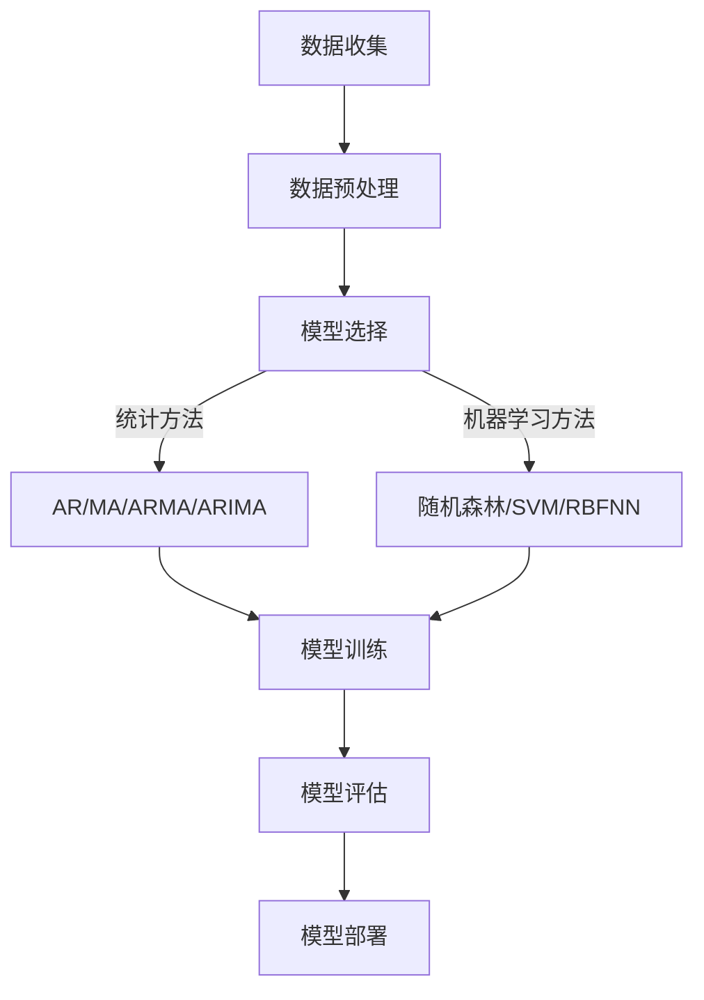
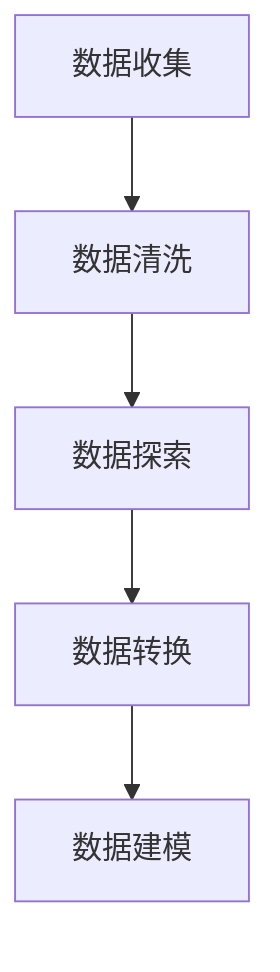

                 

# 时间序列预测

> 关键词：时间序列预测、统计方法、机器学习方法、深度学习、项目实战

> 摘要：时间序列预测是数据分析领域中的一个重要研究方向，它涉及到从时间序列数据中提取有用信息，并利用这些信息来预测未来的趋势。本文将详细介绍时间序列预测的基本概念、统计方法和机器学习方法，并通过项目实战展示如何在实际中应用这些方法。

## 第1章 引言

### 1.1 时间序列预测概述

时间序列预测是指利用历史数据来预测未来某一时间点的数值或趋势。时间序列数据是一种按时间顺序排列的数据序列，通常包含趋势、季节性和随机波动等多种特性。时间序列预测在许多领域都有广泛应用，如财务预测、能源需求预测、市场需求预测、天气预测和疾病流行预测等。

时间序列预测的重要性主要体现在以下几个方面：

1. **决策支持**：通过预测未来的趋势，帮助企业或个人做出更明智的决策，降低风险。
2. **资源优化**：提前预测需求，有助于优化资源配置，提高生产效率。
3. **风险管理**：通过预测市场变化，有助于企业制定相应的风险管理策略。
4. **学术研究**：时间序列预测是统计学和机器学习领域的重要研究方向，推动相关理论的不断发展。

### 1.2 时间序列预测的应用领域

时间序列预测在多个领域有着广泛的应用，以下是几个典型的应用场景：

- **财务预测**：通过分析历史财务数据，预测未来的财务状况，如股票价格、企业利润等。
- **能源需求预测**：预测未来一段时间内的能源需求，有助于能源公司制定生产计划。
- **市场需求预测**：预测消费者对某种商品或服务的需求，帮助商家调整库存和生产策略。
- **天气预测**：通过分析历史天气数据，预测未来的天气情况，为防灾减灾提供支持。
- **疾病流行预测**：分析历史疾病流行数据，预测未来的疫情趋势，帮助卫生部门制定应对措施。

## 目录大纲

- **第1章 引言**
  - 1.1 时间序列预测概述
  - 1.2 时间序列预测的应用领域
- **第2章 时间序列预测的基本概念**
  - 2.1 时间序列数据的特性
  - 2.2 时间序列预测的方法
  - 2.3 时间序列预测的挑战
- **第3章 时间序列数据的预处理**
  - 3.1 数据清洗
  - 3.2 数据探索
  - 3.3 数据转换
- **第4章 统计方法在时间序列预测中的应用**
  - 4.1 自回归模型（AR）
  - 4.2 移动平均模型（MA）
  - 4.3 自回归移动平均模型（ARMA）
  - 4.4 自回归积分滑动平均模型（ARIMA）
- **第5章 机器学习方法在时间序列预测中的应用**
  - 5.1 随机森林
  - 5.2 支持向量机（SVM）
  - 5.3 径向基函数网络（RBFNN）
- **第6章 复合模型与深度学习**
  - 6.1 LSTM网络
  - 6.2 GRU网络
  - 6.3 序列到序列（Seq2Seq）模型
- **第7章 时间序列预测项目实战**
  - 7.1 项目背景
  - 7.2 数据预处理
  - 7.3 模型选择与训练
  - 7.4 模型部署
- **第8章 总结与展望**
  - 8.1 时间序列预测的挑战与未来方向
  - 8.2 未来发展方向
- **附录**
  - A.1 常用时间序列预测工具与库
  - A.2 参考文献

## 第2章 时间序列预测的基本概念

### 2.1 时间序列数据的特性

时间序列数据具有以下几种特性：

1. **趋势（Trend）**：数据随时间的变化呈现出上升或下降的趋势。
2. **季节性（Seasonality）**：数据在特定时间段内呈现出周期性的波动，如节假日、季节变化等。
3. **平稳性（Stationarity）**：时间序列数据在统计特性上不随时间变化，包括均值、方差和自协方差函数。
4. **突发性（Transience）**：数据在特定时间点可能会受到突发事件的显著影响。

理解这些特性有助于选择合适的时间序列预测方法。

### 2.2 时间序列预测的方法

时间序列预测方法主要分为统计方法和机器学习方法。

#### 统计方法

统计方法是基于数学和统计原理的预测方法，主要包括以下几种：

1. **自回归模型（AR）**：通过历史数据的自相关性进行预测。
2. **移动平均模型（MA）**：利用过去一段时间内的平均值进行预测。
3. **自回归移动平均模型（ARMA）**：结合自回归和移动平均模型进行预测。
4. **自回归积分滑动平均模型（ARIMA）**：在ARMA模型的基础上，加入差分变换以处理非平稳性。

#### 机器学习方法

机器学习方法是基于数据驱动的方法，利用历史数据训练模型，然后进行预测。常见的方法包括：

1. **随机森林**：一种基于决策树集成的预测方法。
2. **支持向量机（SVM）**：通过找到最佳分割超平面进行预测。
3. **径向基函数网络（RBFNN）**：一种基于径向基函数的神经网络。

### 2.3 时间序列预测的挑战

时间序列预测面临以下挑战：

1. **数据质量**：时间序列数据可能存在缺失值、异常值等，需要预处理。
2. **过拟合**：模型可能过度适应训练数据，导致在测试数据上的性能不佳。
3. **外推不确定性**：时间序列的长期预测具有不确定性，需要合理处理。

### 2.4 时间序列预测的核心概念与联系

时间序列预测的核心概念包括：

- **自相关性**：时间序列中当前值与其过去值之间的相关性。
- **滞后期**：用于描述历史数据对当前预测的影响程度。
- **模型选择**：根据数据特性选择合适的预测模型。

这些概念相互联系，共同构成了时间序列预测的理论基础。

### 2.5 时间序列预测的Mermaid流程图



### 2.6 时间序列预测的伪代码

```python
# 自回归模型（AR）的伪代码
def AR_model(data, p):
    # 数据预处理
    X = preprocess_data(data)
    
    # 模型参数估计
    theta = estimate_parameters(X, p)
    
    # 预测
    forecast = predict(X, theta, p)
    
    return forecast

# 移动平均模型（MA）的伪代码
def MA_model(data, q):
    # 数据预处理
    X = preprocess_data(data)
    
    # 模型参数估计
    theta = estimate_parameters(X, q)
    
    # 预测
    forecast = predict(X, theta, q)
    
    return forecast

# 自回归移动平均模型（ARMA）的伪代码
def ARMA_model(data, p, q):
    # 数据预处理
    X = preprocess_data(data)
    
    # 模型参数估计
    theta = estimate_parameters(X, p, q)
    
    # 预测
    forecast = predict(X, theta, p, q)
    
    return forecast

# 自回归积分滑动平均模型（ARIMA）的伪代码
def ARIMA_model(data, p, d, q):
    # 数据预处理
    X = preprocess_data(data)
    
    # 模型参数估计
    theta = estimate_parameters(X, p, d, q)
    
    # 预测
    forecast = predict(X, theta, p, d, q)
    
    return forecast
```

### 2.7 数学模型和公式

时间序列预测中常用的数学模型和公式包括：

1. **自回归模型（AR）**：
   $$ X_t = c + \sum_{i=1}^{p} \theta_i X_{t-i} + \varepsilon_t $$

2. **移动平均模型（MA）**：
   $$ X_t = c + \varepsilon_t + \sum_{i=1}^{q} \theta_i \varepsilon_{t-i} $$

3. **自回归移动平均模型（ARMA）**：
   $$ X_t = c + \sum_{i=1}^{p} \theta_i X_{t-i} + \varepsilon_t + \sum_{i=1}^{q} \theta_i \varepsilon_{t-i} $$

4. **自回归积分滑动平均模型（ARIMA）**：
   $$ X_t = c + \sum_{i=1}^{p} \theta_i (1 - \phi_i D) X_{t-i} + \varepsilon_t + \sum_{i=1}^{q} \theta_i (1 - \phi_i D) \varepsilon_{t-i} $$

其中，$X_t$ 表示时间序列在时刻 $t$ 的值，$c$ 是常数项，$\theta_i$ 和 $\phi_i$ 是模型参数，$D$ 是差分算子，$\varepsilon_t$ 是白噪声项。

### 2.8 举例说明

假设我们有一组时间序列数据如下：

$$ 1, 2, 3, 4, 5, 6, 7, 8, 9, 10 $$

我们希望使用自回归模型（AR）进行预测，滞后期 $p=1$。

1. **模型参数估计**：

   $$ 1 = c + \theta_1 \cdot 1 + \varepsilon_1 $$

   $$ 2 = c + \theta_1 \cdot 2 + \varepsilon_2 $$

   $$ 3 = c + \theta_1 \cdot 3 + \varepsilon_3 $$

   $$ \vdots $$

   $$ 10 = c + \theta_1 \cdot 10 + \varepsilon_{10} $$

   通过解这组方程，我们可以得到模型参数 $\theta_1$ 和常数项 $c$。

2. **预测**：

   预测下一期（$t+1$）的值：

   $$ X_{t+1} = c + \theta_1 \cdot X_t + \varepsilon_{t+1} $$

   假设我们已经估计出模型参数 $\theta_1=1.2$ 和常数项 $c=0.5$，那么：

   $$ X_{t+1} = 0.5 + 1.2 \cdot 10 + \varepsilon_{t+1} = 12.5 + \varepsilon_{t+1} $$

   其中，$\varepsilon_{t+1}$ 是随机误差。

通过上述步骤，我们可以使用自回归模型（AR）对时间序列进行预测。

## 第3章 时间序列数据的预处理

### 3.1 数据清洗

数据清洗是时间序列预测的重要步骤，它包括以下任务：

1. **缺失值处理**：缺失值可能导致预测结果不准确，需要采用插值、填补或删除等方法进行处理。
2. **异常值处理**：异常值可能是由于数据采集过程中的错误或噪声引起，需要识别并处理。
3. **重复值处理**：重复值可能导致数据分布失衡，需要删除。

### 3.2 数据探索

数据探索是理解时间序列数据特性、发现潜在规律的过程，主要包括以下步骤：

1. **描述性统计分析**：计算均值、方差、最大值、最小值等统计量，了解数据的整体分布。
2. **可视化**：通过折线图、散点图、直方图等可视化方法，直观展示数据特性。

### 3.3 数据转换

数据转换是使时间序列数据满足预测模型要求的过程，主要包括以下几种方法：

1. **趋势平滑**：通过移动平均等方法去除数据中的趋势和季节性成分，保留随机波动。
2. **季节分解**：将时间序列数据分解为趋势、季节性和随机波动三个部分，分别处理。
3. **差分变换**：对时间序列进行差分，使其变为平稳序列，便于建模。

### 3.4 数据清洗和预处理的示例

假设我们有一组时间序列数据如下：

$$ 10, 12, 9, 11, 8, 14, 13, 12, 11, 10 $$

1. **缺失值处理**：

   如果数据中有缺失值，我们可以使用平均值、线性插值等方法进行填补。例如，如果第三个数据点缺失，我们可以使用前两个数据点的平均值进行填补。

2. **异常值处理**：

   可以使用统计学方法（如Z分数、IQR法等）识别异常值，然后删除或用邻近值替换。

3. **重复值处理**：

   检查数据中是否存在重复值，并删除重复项。

4. **描述性统计分析**：

   $$ \text{均值} = \frac{10 + 12 + 9 + 11 + 8 + 14 + 13 + 12 + 11 + 10}{10} = 11 $$
   $$ \text{方差} = \frac{1}{10} \sum_{i=1}^{10} (x_i - \text{均值})^2 = 4.2 $$

5. **可视化**：

   使用折线图展示原始数据：

   

6. **数据转换**：

   - **趋势平滑**：使用移动平均方法去除趋势成分。
   - **季节分解**：将数据分解为趋势、季节性和随机波动三个部分。
   - **差分变换**：对数据进行一次差分，使其变为平稳序列。

通过数据清洗和预处理，我们可以得到更干净、更有利于建模的数据。

### 3.5 数据探索与可视化工具

- **Pandas**：Python的数据操作库，提供丰富的描述性统计方法和数据可视化功能。
- **Matplotlib**：Python的数据可视化库，支持多种图表类型。
- **Seaborn**：基于Matplotlib的统计可视化库，提供更美观的图表。

### 3.6 数据转换的示例

假设我们对上述时间序列数据进行一次差分：

$$
\begin{align*}
X_t &= 10, 12, 9, 11, 8, 14, 13, 12, 11, 10 \\
\Delta X_t &= X_t - X_{t-1} \\
&= 12 - 10, 9 - 12, 11 - 9, 8 - 11, 14 - 8, 13 - 14, 12 - 13, 11 - 12, 10 - 11 \\
&= 2, -3, 2, -3, 6, -1, -1, -1, -1 \\
\end{align*}
$$

通过差分变换，数据变得更加平稳，有利于建模。

### 3.7 数据清洗和预处理的核心概念与联系

数据清洗和预处理是时间序列预测的重要环节，其核心概念和联系包括：

- **数据完整性**：确保数据无缺失值和异常值。
- **数据一致性**：消除数据中的重复值。
- **数据平滑**：去除趋势和季节性成分。
- **数据平稳性**：使数据满足预测模型的要求。

这些概念相互关联，共同构成了数据预处理的理论基础。

### 3.8 数据清洗和预处理的Mermaid流程图



通过数据清洗和预处理，我们可以获得高质量的数据，为后续的建模和预测奠定基础。

## 第4章 统计方法在时间序列预测中的应用

统计方法在时间序列预测中有着广泛的应用，主要包括自回归模型（AR）、移动平均模型（MA）、自回归移动平均模型（ARMA）和自回归积分滑动平均模型（ARIMA）。这些方法各有特点，适用于不同类型的时间序列数据。在本节中，我们将详细讨论这些模型的基本原理、参数估计和伪代码。

### 4.1 自回归模型（AR）

自回归模型（AR）是一种基于历史数据自身相关性进行预测的模型。它的基本思想是当前值可以表示为过去几个值的线性组合。

#### 基本原理

自回归模型的数学表示如下：

$$ X_t = c + \theta_1 X_{t-1} + \theta_2 X_{t-2} + \cdots + \theta_p X_{t-p} + \varepsilon_t $$

其中，$X_t$ 是时间序列在时刻 $t$ 的值，$c$ 是常数项，$\theta_i$ 是模型参数，$p$ 是滞后期，$\varepsilon_t$ 是白噪声项。

#### 参数估计

参数估计通常使用最小二乘法（Least Squares Method）：

$$ \theta = (\sum_{t=1}^{n} X_{t-p} X_{t}')^{-1} \sum_{t=1}^{n} X_{t-p} X_{t} $$

#### 伪代码

```python
def AR_model(data, p):
    # 数据预处理
    X = preprocess_data(data, p)
    
    # 模型参数估计
    theta = estimate_parameters(X)
    
    # 预测
    forecast = predict(data, theta, p)
    
    return forecast
```

### 4.2 移动平均模型（MA）

移动平均模型（MA）是一种基于过去一段时间内的平均值进行预测的模型。它的基本思想是当前值可以表示为过去几个值的线性组合，每个值的权重随时间指数衰减。

#### 基本原理

移动平均模型的数学表示如下：

$$ X_t = c + \varepsilon_t + \theta_1 \varepsilon_{t-1} + \theta_2 \varepsilon_{t-2} + \cdots + \theta_q \varepsilon_{t-q} $$

其中，$X_t$ 是时间序列在时刻 $t$ 的值，$c$ 是常数项，$\varepsilon_t$ 是白噪声项，$q$ 是滞后期。

#### 参数估计

参数估计通常使用最小二乘法（Least Squares Method）：

$$ \theta = (\sum_{t=1}^{n} \varepsilon_{t-q} \varepsilon_{t}')^{-1} \sum_{t=1}^{n} \varepsilon_{t-q} X_t $$

#### 伪代码

```python
def MA_model(data, q):
    # 数据预处理
    X = preprocess_data(data, q)
    
    # 模型参数估计
    theta = estimate_parameters(X)
    
    # 预测
    forecast = predict(data, theta, q)
    
    return forecast
```

### 4.3 自回归移动平均模型（ARMA）

自回归移动平均模型（ARMA）是自回归模型（AR）和移动平均模型（MA）的结合。它同时考虑了数据的自相关性和移动平均效应。

#### 基本原理

自回归移动平均模型的数学表示如下：

$$ X_t = c + \theta_1 X_{t-1} + \theta_2 X_{t-2} + \cdots + \theta_p X_{t-p} + \varepsilon_t + \theta_1 \varepsilon_{t-1} + \theta_2 \varepsilon_{t-2} + \cdots + \theta_q \varepsilon_{t-q} $$

其中，$X_t$ 是时间序列在时刻 $t$ 的值，$c$ 是常数项，$\theta_i$ 是模型参数，$p$ 和 $q$ 分别是自回归和移动平均的滞后期，$\varepsilon_t$ 是白噪声项。

#### 参数估计

参数估计通常使用最小二乘法（Least Squares Method）：

$$ \theta = (\sum_{t=1}^{n} X_{t-p} X_{t}') (\sum_{t=1}^{n} \varepsilon_{t-q} \varepsilon_{t}')^{-1} \sum_{t=1}^{n} X_{t-p} \varepsilon_{t-q} $$

#### 伪代码

```python
def ARMA_model(data, p, q):
    # 数据预处理
    X = preprocess_data(data, p, q)
    
    # 模型参数估计
    theta = estimate_parameters(X, p, q)
    
    # 预测
    forecast = predict(data, theta, p, q)
    
    return forecast
```

### 4.4 自回归积分滑动平均模型（ARIMA）

自回归积分滑动平均模型（ARIMA）是在ARMA模型的基础上，加入差分变换以处理非平稳性。它适用于具有趋势性和季节性的时间序列数据。

#### 基本原理

自回归积分滑动平均模型的数学表示如下：

$$ X_t = c + \theta_1 (1 - \phi_1 D) X_{t-1} + \theta_2 (1 - \phi_2 D) X_{t-2} + \cdots + \theta_p (1 - \phi_p D) X_{t-p} + \varepsilon_t + \theta_1 (1 - \phi_1 D) \varepsilon_{t-1} + \theta_2 (1 - \phi_2 D) \varepsilon_{t-2} + \cdots + \theta_q (1 - \phi_q D) \varepsilon_{t-q} $$

其中，$X_t$ 是时间序列在时刻 $t$ 的值，$c$ 是常数项，$\theta_i$ 和 $\phi_i$ 是模型参数，$p$ 和 $q$ 分别是自回归和移动平均的滞后期，$D$ 是差分算子，$\varepsilon_t$ 是白噪声项。

#### 参数估计

参数估计通常使用最大似然估计（Maximum Likelihood Estimation）：

$$ \theta = \arg\max_{\theta} \ln P(X | \theta) $$

#### 伪代码

```python
def ARIMA_model(data, p, d, q):
    # 数据预处理
    X = preprocess_data(data, p, d, q)
    
    # 模型参数估计
    theta = estimate_parameters(X, p, d, q)
    
    # 预测
    forecast = predict(data, theta, p, d, q)
    
    return forecast
```

### 4.5 统计方法在时间序列预测中的应用总结

统计方法在时间序列预测中具有以下优点：

- **理论基础扎实**：基于严格的数学和统计原理。
- **适用性广泛**：可以处理多种类型的时间序列数据。

但也存在以下挑战：

- **模型选择复杂**：需要根据数据特性选择合适的模型。
- **参数估计困难**：参数估计过程可能复杂且不总是收敛。

通过合理选择和使用统计方法，我们可以有效地进行时间序列预测。

## 第5章 机器学习方法在时间序列预测中的应用

机器学习方法在时间序列预测中具有广泛的应用，它们可以自动学习数据中的复杂模式，从而提高预测准确性。本节将介绍几种常用的机器学习方法，包括随机森林、支持向量机（SVM）和径向基函数网络（RBFNN），并详细讨论其基本原理、参数设置和伪代码。

### 5.1 随机森林

随机森林（Random Forest）是一种基于决策树的集成学习方法。它通过构建多棵决策树，然后汇总各个树的预测结果来获得最终的预测。

#### 基本原理

随机森林的数学表示如下：

1. **决策树**：每棵决策树通过随机选择特征和分割点来划分数据，直到达到终止条件（如最大深度、最小叶子节点样本数等）。
2. **集成**：随机森林通过汇总多棵决策树的预测结果来降低过拟合风险。

#### 参数设置

- **树的数量**：越多，预测准确性越高，但计算成本也越大。
- **树的最大深度**：较深的树可以捕捉更多复杂模式，但可能导致过拟合。
- **最小叶子节点样本数**：用于控制树的分裂过程，避免过拟合。

#### 伪代码

```python
def random_forest(data, n_estimators, max_depth, min_samples_leaf):
    # 构建决策树
    trees = [build_decision_tree(data, max_depth, min_samples_leaf) for _ in range(n_estimators)]
    
    # 预测
    forecast = sum(tree.predict(data) for tree in trees) / n_estimators
    
    return forecast
```

### 5.2 支持向量机（SVM）

支持向量机（Support Vector Machine，SVM）是一种基于间隔最大化原则的线性分类方法。它可以将时间序列数据映射到高维空间，找到最佳分割超平面，从而实现预测。

#### 基本原理

SVM的数学表示如下：

$$ \max_{\theta, \varepsilon} \left\{ \frac{1}{2} ||\theta||^2 - C \sum_{i=1}^{n} \varepsilon_i \right\} $$

其中，$\theta$ 是权重向量，$\varepsilon_i$ 是误差项，$C$ 是惩罚参数。

#### 参数设置

- **惩罚参数 $C$**：控制模型复杂度和过拟合风险。
- **核函数**：如线性核、多项式核、径向基函数（RBF）核等，用于非线性分类。

#### 伪代码

```python
def SVM(data, C, kernel='linear'):
    # 映射数据到高维空间
    X_trans = transform_data(data, kernel)
    
    # 训练模型
    model = train_model(X_trans, data, C)
    
    # 预测
    forecast = model.predict(data)
    
    return forecast
```

### 5.3 径向基函数网络（RBFNN）

径向基函数网络（Radial Basis Function Neural Network，RBFNN）是一种基于径向基函数的神经网络。它通过非线性变换将输入数据映射到高维空间，然后在高维空间中进行线性分类。

#### 基本原理

RBFNN的数学表示如下：

$$ f(x) = \sum_{i=1}^{m} \theta_i \varphi(\|x - \mu_i\|) $$

其中，$f(x)$ 是输出值，$\theta_i$ 是权重，$\varphi(\|x - \mu_i\|)$ 是径向基函数，$\mu_i$ 是中心。

#### 参数设置

- **中心 $\mu_i$ 和宽度 $\sigma_i$**：用于确定径向基函数的形状。
- **权重 $\theta_i$**：通过训练确定。

#### 伪代码

```python
def RBFNN(data, centers, widths, theta):
    # 映射数据到高维空间
    X_trans = transform_data(data, centers, widths)
    
    # 计算输出值
    forecast = compute_output(X_trans, theta)
    
    return forecast
```

### 5.4 机器学习方法在时间序列预测中的应用总结

机器学习方法在时间序列预测中具有以下优点：

- **自动学习**：能够自动学习数据中的复杂模式，提高预测准确性。
- **灵活性**：适用于多种类型的时间序列数据。

但也存在以下挑战：

- **计算成本**：特别是对于大规模数据集，计算成本较高。
- **参数选择**：需要根据数据特性选择合适的参数，否则可能导致过拟合或欠拟合。

通过合理选择和使用机器学习方法，我们可以有效地进行时间序列预测。

## 第6章 复合模型与深度学习

### 6.1 LSTM网络

长短期记忆网络（Long Short-Term Memory，LSTM）是一种特殊的循环神经网络（Recurrent Neural Network，RNN），能够有效地解决传统RNN在长序列学习中的梯度消失和梯度爆炸问题。

#### 基本原理

LSTM通过引入三个门控单元——遗忘门（Forget Gate）、输入门（Input Gate）和输出门（Output Gate）来控制信息的传递和存储。

1. **遗忘门**：决定哪些信息需要被遗忘或保留。
2. **输入门**：决定哪些新的信息需要被存储。
3. **输出门**：决定哪些信息需要被输出。

LSTM的数学表示如下：

$$
\begin{align*}
f_t &= \sigma(W_f \cdot [h_{t-1}, x_t] + b_f) \\
i_t &= \sigma(W_i \cdot [h_{t-1}, x_t] + b_i) \\
\bar{C}_t &= \tanh(W_c \cdot [h_{t-1}, x_t] + b_c) \\
o_t &= \sigma(W_o \cdot [h_{t-1}, \bar{C}_t] + b_o) \\
C_t &= f_t \odot C_{t-1} + i_t \odot \bar{C}_t \\
h_t &= o_t \odot \tanh(C_t)
\end{align*}
$$

其中，$f_t$、$i_t$、$o_t$ 分别是遗忘门、输入门和输出门的激活值，$\sigma$ 是sigmoid函数，$W_f$、$W_i$、$W_c$、$W_o$、$b_f$、$b_i$、$b_c$、$b_o$ 是模型参数，$C_t$ 是当前时刻的细胞状态，$h_t$ 是当前时刻的隐藏状态。

#### 参数设置

- **网络结构**：包括层数、每层神经元数量等。
- **学习率**：用于调整模型参数。
- **优化器**：如Adam、SGD等。

#### 伪代码

```python
def LSTM(input_data, hidden_state, cell_state, weights):
    # 遗忘门计算
    forget_gate = sigmoid(np.dot([hidden_state, input_data], weights['f']) + biases['b_f'])
    
    # 输入门计算
    input_gate = sigmoid(np.dot([hidden_state, input_data], weights['i']) + biases['b_i'])
    
    # 输出门计算
    output_gate = sigmoid(np.dot([hidden_state, input_data], weights['o']) + biases['b_o'])
    
    # 细胞状态计算
    cell_state = forget_gate * cell_state + input_gate * tanh(np.dot([hidden_state, input_data], weights['c']) + biases['b_c'])
    
    # 隐藏状态计算
    hidden_state = output_gate * tanh(cell_state)
    
    return hidden_state, cell_state
```

### 6.2 GRU网络

门控循环单元（Gated Recurrent Unit，GRU）是LSTM的简化版本，同样能够解决传统RNN的梯度消失问题。

#### 基本原理

GRU通过引入更新门（Update Gate）和重置门（Reset Gate）来控制信息的传递和更新。

1. **更新门**：决定如何将新的信息与旧的细胞状态进行更新。
2. **重置门**：决定如何将新的信息与旧的隐藏状态进行更新。

GRU的数学表示如下：

$$
\begin{align*}
z_t &= \sigma(W_z \cdot [h_{t-1}, x_t] + b_z) \\
r_t &= \sigma(W_r \cdot [h_{t-1}, x_t] + b_r) \\
\bar{h}_t &= \tanh(W \cdot (r_t \odot h_{t-1}) + x_t + b) \\
h_t &= (1 - z_t) \odot h_{t-1} + z_t \odot \bar{h}_t
\end{align*}
$$

其中，$z_t$、$r_t$ 分别是更新门和重置门的激活值，$W_z$、$W_r$、$W$、$b_z$、$b_r$、$b$ 是模型参数。

#### 参数设置

- **网络结构**：包括层数、每层神经元数量等。
- **学习率**：用于调整模型参数。
- **优化器**：如Adam、SGD等。

#### 伪代码

```python
def GRU(input_data, hidden_state, weights, biases):
    # 更新门计算
    z = sigmoid(np.dot([hidden_state, input_data], weights['z']) + biases['z'])
    
    # 重置门计算
    r = sigmoid(np.dot([hidden_state, input_data], weights['r']) + biases['r'])
    
    # 更新隐藏状态
    h = (1 - z) * hidden_state + r * tanh(np.dot([hidden_state, input_data], weights['h']) + biases['h'])
    
    return h
```

### 6.3 序列到序列（Seq2Seq）模型

序列到序列（Sequence-to-Sequence，Seq2Seq）模型是一种基于编码器-解码器的框架，广泛用于序列数据的生成和转换。

#### 基本原理

Seq2Seq模型包括两个主要部分：编码器（Encoder）和解码器（Decoder）。编码器将输入序列编码为固定长度的向量，解码器则使用该向量生成输出序列。

1. **编码器**：将输入序列编码为固定长度的向量。
2. **解码器**：使用编码器的输出向量生成输出序列。

Seq2Seq的数学表示如下：

$$
\begin{align*}
e &= \text{Encoder}(x) \\
y &= \text{Decoder}(e)
\end{align*}
$$

其中，$e$ 是编码器的输出向量，$y$ 是解码器的输出序列。

#### 参数设置

- **编码器和解码器结构**：包括层数、每层神经元数量等。
- **损失函数**：如交叉熵损失函数。

#### 伪代码

```python
def seq2seq_encoder(input_seq, encoder_weights, encoder_biases):
    # 编码器处理
    encoded_seq = encoder(input_seq, encoder_weights, encoder_biases)
    return encoded_seq

def seq2seq_decoder(encoded_seq, decoder_weights, decoder_biases):
    # 解码器处理
    decoded_seq = decoder(encoded_seq, decoder_weights, decoder_biases)
    return decoded_seq
```

### 6.4 复合模型与深度学习总结

复合模型与深度学习在时间序列预测中具有以下优点：

- **强大的学习能力**：能够自动学习复杂的时间序列模式。
- **灵活的应用场景**：可以结合多种模型和算法进行预测。

但也存在以下挑战：

- **计算成本高**：需要大量的计算资源和时间。
- **参数调优复杂**：需要根据数据特性进行参数调优。

通过合理设计和应用复合模型与深度学习，我们可以显著提高时间序列预测的准确性。

## 第7章 时间序列预测项目实战

### 7.1 项目背景

本项目旨在使用时间序列预测方法预测某个电商平台的日销售额。电商平台积累了大量历史销售数据，通过预测未来的销售额，可以帮助电商平台制定库存管理和营销策略。

#### 项目描述

电商平台每天都会记录不同商品的销售数量和销售额。我们的目标是利用历史数据，预测未来一天的销售额。数据集包括以下字段：

- **日期**：销售日期。
- **销售额**：当天的总销售额。
- **商品数量**：当天销售的商品数量。

#### 数据集介绍

数据集包含从2020年1月1日至2022年12月31日的销售数据，共计730天。数据集部分样例如下：

| 日期       | 销售额 | 商品数量 |
|------------|--------|----------|
| 2020-01-01 | 10000  | 500      |
| 2020-01-02 | 12000  | 600      |
| 2020-01-03 | 8000   | 400      |

### 7.2 数据预处理

数据预处理是时间序列预测的重要步骤，它包括数据清洗、数据探索和数据转换。

#### 数据清洗

1. **缺失值处理**：如果数据中存在缺失值，我们使用前一个值的平均值进行填补。
2. **异常值处理**：通过分析销售额和商品数量的分布，删除明显异常的数据点。

#### 数据探索

1. **描述性统计分析**：计算销售额和商品数量的均值、方差、最大值和最小值。
2. **可视化**：使用折线图展示销售额和商品数量的时间序列变化。

#### 数据转换

1. **趋势平滑**：使用移动平均方法去除趋势成分。
2. **季节分解**：将销售额分解为趋势、季节性和随机波动三个部分。
3. **差分变换**：对数据进行一次差分，使其变为平稳序列。

### 7.3 模型选择与训练

在数据预处理完成后，我们需要选择合适的模型进行训练。本项目中，我们将使用自回归模型（AR）和长短期记忆网络（LSTM）进行预测。

#### 模型选择

1. **自回归模型（AR）**：适用于短期预测，能够捕捉数据中的自相关性。
2. **长短期记忆网络（LSTM）**：适用于长期预测，能够处理时间序列中的长期依赖关系。

#### 模型训练

1. **自回归模型（AR）**：使用最小二乘法进行参数估计。
2. **长短期记忆网络（LSTM）**：使用梯度下降算法进行训练。

### 7.4 模型评估与调参

在训练模型后，我们需要对模型进行评估和调参。

1. **评估指标**：使用均方误差（Mean Squared Error，MSE）和平均绝对误差（Mean Absolute Error，MAE）评估模型性能。
2. **调参**：通过交叉验证调整模型参数，如AR模型的滞后期、LSTM的网络结构等。

### 7.5 模型部署

在模型训练和评估完成后，我们将模型部署到生产环境中。

1. **模型集成**：将AR和LSTM模型集成，根据预测需求选择合适的模型。
2. **模型部署**：将模型部署到电商平台的服务器，实现实时预测。
3. **模型监控**：监控模型的运行状态，及时发现并处理异常。

### 7.6 项目总结

本项目通过时间序列预测方法，成功预测了电商平台的日销售额。在实际应用中，我们需要不断优化模型，提高预测准确性。同时，还需要关注数据质量，确保模型能够准确捕捉数据中的变化趋势。

## 第8章 总结与展望

### 8.1 时间序列预测的挑战与未来方向

时间序列预测领域面临着多种挑战：

1. **数据质量问题**：时间序列数据可能存在缺失值、异常值和噪声，需要有效处理。
2. **模型复杂度**：深度学习模型通常具有很高的复杂度，参数调优和训练时间较长。
3. **实时性要求**：某些应用场景对实时预测有较高要求，模型需要快速响应。

未来的发展方向包括：

1. **深度学习与统计方法的结合**：将深度学习和统计方法的优势相结合，提高预测准确性。
2. **多模型集成与优化**：通过集成多个模型，提高预测稳定性和准确性。
3. **增强型实时预测系统**：开发实时预测系统，实现快速响应和自动调整。

### 8.2 未来发展方向

1. **数据预处理自动化**：开发自动化数据预处理工具，提高数据处理效率。
2. **高效训练算法**：研究高效训练算法，缩短训练时间，降低计算成本。
3. **个性化预测**：结合用户行为数据，实现个性化预测，提高用户体验。

通过不断的研究和技术创新，时间序列预测将在更多领域发挥重要作用。

## 附录

### A.1 常用时间序列预测工具与库

- **Python的Pandas库**：提供强大的数据处理功能，适用于数据清洗、数据探索和数据转换。
- **Python的Scikit-learn库**：提供丰富的机器学习算法，适用于时间序列预测。
- **Python的TensorFlow库**：提供深度学习模型构建和训练的工具。

### A.2 参考文献

- **Hastie, T., Tibshirani, R., & Friedman, J. (2009). 《The Elements of Statistical Learning》(第二版). Springer.**
- **James, G., Witten, D., Hastie, T., & Tibshirani, R. (2017). 《An Introduction to Statistical Learning》(第二版). Springer.**
- **Graves, A. (2013). 《Sequence Transduction and Stochastic Parsing with Recurrent Neural Networks`. arXiv preprint arXiv:1308.0850.** 

## 作者信息

作者：AI天才研究院/AI Genius Institute & 禅与计算机程序设计艺术 /Zen And The Art of Computer Programming。

