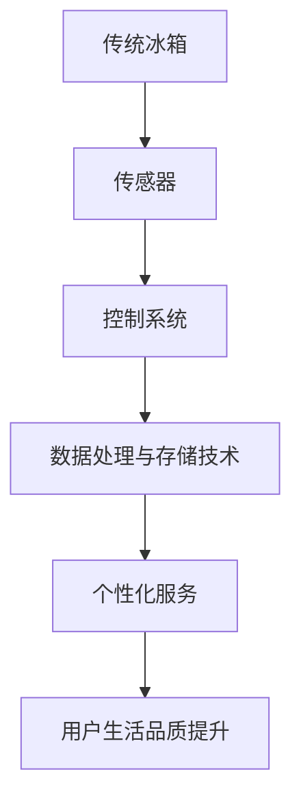

                 

## 文章标题

《智能冰箱：厨房场景下的注意力争夺》

## 关键词

智能冰箱，智能家居，物联网，厨房场景，用户体验，品牌营销

## 摘要

本文深入探讨了智能冰箱在厨房场景下的应用，从技术原理、核心功能到用户体验优化，全面分析了智能冰箱如何通过智能化技术争夺用户的注意力。文章首先概述了智能冰箱的定义与分类，随后详细介绍了其核心技术，包括传感器技术、控制系统和数据存储技术。接着，文章重点探讨了智能冰箱在食材管理、烹饪辅助和家庭健康管理中的应用，并提出了有效的注意力争夺策略。最后，文章展望了智能冰箱与智能家居的融合以及未来的发展机遇与挑战，为智能冰箱行业的未来发展提供了有益的参考。

### 第一部分：智能冰箱概述

#### 1.1 智能冰箱概述

智能冰箱是指具备智能化功能的家用冰箱，它通过集成传感器、控制系统、数据处理与存储技术等，实现食材新鲜度监测、自动食材管理、烹饪辅助、家庭健康管理等功能。智能冰箱不仅能够提供传统的冷藏、冷冻等基本功能，还能够通过数据分析与挖掘，为用户提供个性化的服务，提升用户的生活品质。

**核心概念与联系**

智能冰箱的核心理念在于将传统冰箱的功能与智能化技术相结合，如图所示：



**架构原理**

智能冰箱的架构可以分为五个主要模块：

1. **传感器模块**：负责采集冰箱内部和外部的环境数据，如温度、湿度、光线等。
2. **控制系统**：负责对传感器数据进行处理，并根据处理结果控制冰箱的各个功能模块。
3. **数据处理与存储模块**：负责对传感器数据进行处理和分析，存储用户数据，如食材信息、健康数据等。
4. **执行模块**：负责根据控制系统的指令执行具体操作，如调整温度、启动压缩机等。
5. **用户界面**：负责与用户进行交互，显示冰箱的状态信息，接收用户的操作指令。

**数学模型**

智能冰箱的核心算法通常涉及以下数学模型：

$$
T_{\text{new}} = T_{\text{old}} + k(T_{\text{target}} - T_{\text{old}})
$$

其中，$T_{\text{new}}$ 是新的温度，$T_{\text{old}}$ 是当前温度，$T_{\text{target}}$ 是目标温度，$k$ 是调节系数，用于控制调节速度。

**伪代码**

以下是一个简单的温度调节算法的伪代码：

```
function adjustTemperature(targetTemperature, currentTemperature,调节系数k) {
    newTemperature = currentTemperature + k * (targetTemperature - currentTemperature)
    return newTemperature
}
```

#### 1.2 智能冰箱的分类

智能冰箱根据不同的技术特点和功能可以分为以下几类：

**1.2.1 智能化温控冰箱**

智能化温控冰箱具备智能化温控功能，能够根据食材的种类和新鲜度自动调整温度，延长食材的保鲜期。这种冰箱通过传感器实时监测食材状态，并根据设定的温度调节策略自动调整压缩机的工作，从而实现恒温。

**1.2.2 智能食材管理冰箱**

智能食材管理冰箱内置传感器，能够实时监测食材的新鲜度，并通过智能算法提供最佳的食材存储方案。这种冰箱能够识别食材的类型，并根据其新鲜度提供相应的存储建议。

**1.2.3 智能烹饪辅助冰箱**

智能烹饪辅助冰箱具备烹饪功能，能够根据食材的属性和用户的口味偏好，提供相应的烹饪建议和烹饪模式。这种冰箱可以通过内置的烹饪系统或与外部设备联动，实现智能化的烹饪体验。

**1.2.4 智能家庭健康管理冰箱**

智能家庭健康管理冰箱能够收集和分析家庭成员的健康数据，提供个性化的健康管理建议。这种冰箱可以通过内置的传感器和数据分析系统，实时监测家庭成员的饮食健康情况，并提供健康分析报告。

**1.2.5 智能物联网冰箱**

智能物联网冰箱能够与家庭中的其他智能设备互联互通，实现智能家居的协同控制。这种冰箱可以通过Wi-Fi、蓝牙等无线通信技术，与其他智能设备如智能灯泡、智能门锁等相互连接，形成一个完整的智能家居系统。

**1.2.6 智能生态系统冰箱**

智能生态系统冰箱不仅具备以上功能，还能够与其他品牌或平台的智能设备互联互通，形成一个完整的智能生态系统。这种冰箱可以整合各种智能设备和服务，提供全方位的智能生活体验。

### 1.3 智能冰箱的发展历程

智能冰箱的发展可以分为以下几个阶段：

**1.3.1 第一阶段：智能化温控**

最早期的智能冰箱主要实现温控功能，通过传感器监测冰箱内的温度，然后根据设定的温度自动调节压缩机的工作，从而实现恒温。这一阶段主要解决了冰箱温度控制的不稳定问题。

**1.3.2 第二阶段：食材管理**

随着传感器技术的进步，智能冰箱开始具备监测食材新鲜度的功能。通过传感器收集的数据，智能冰箱能够提供最佳的食材存储方案，从而延长食材的保鲜期。

**1.3.3 第三阶段：烹饪辅助**

智能冰箱开始整合烹饪功能，通过内置的烹饪系统，提供烹饪建议和烹饪模式。这一阶段的智能冰箱不仅能够管理食材，还能够辅助用户进行烹饪，提升了用户的厨房体验。

**1.3.4 第四阶段：家庭健康管理**

智能冰箱开始整合健康监测功能，通过收集家庭成员的健康数据，提供个性化的健康管理建议。这一阶段的智能冰箱成为家庭健康管理的重要组成部分。

**1.3.5 第五阶段：物联网与生态系统**

智能冰箱开始与其他智能设备互联互通，形成一个完整的智能生态系统，实现智能家居的协同控制。这一阶段的智能冰箱不仅具备强大的功能，还能够与其他设备无缝集成，提升整体家居智能化水平。

**1.3.6 第六阶段：智能化与个性化**

随着人工智能技术的进步，智能冰箱的智能化程度进一步提升，能够实现更加智能化和个性化的功能，更好地满足用户的需求。

### 1.4 智能冰箱的未来趋势

智能冰箱的未来发展趋势包括：

**1.4.1 智能化程度的提升**

随着人工智能技术的进步，智能冰箱的智能化程度将进一步提升，能够实现更加复杂和个性化的功能。

**1.4.2 与智能家居的深度融合**

智能冰箱将与家庭中的其他智能设备深度融合，实现智能家居的协同控制，提升家庭生活的智能化水平。

**1.4.3 数据分析与挖掘**

智能冰箱将具备更强的数据分析和挖掘能力，能够更好地理解和满足用户的需求。

**1.4.4 环境友好型设计**

智能冰箱将更加注重环保和可持续发展，采用更加节能和环保的设计方案。

**1.4.5 开放式平台**

智能冰箱将开放更多的接口和平台，允许第三方开发者为其开发应用程序，进一步提升智能冰箱的功能和用户体验。

### 第二部分：智能冰箱的核心技术

#### 2.1 智能传感器技术

智能传感器技术是智能冰箱的核心技术之一，它负责收集冰箱内部和外部环境的数据，如温度、湿度、光线等。以下是对几种常见传感器技术的详细说明。

**2.1.1 温度传感器**

温度传感器是智能冰箱中最常用的传感器之一，其工作原理基于物理或化学现象。以下是一些常见的温度传感器及其工作原理：

**热敏电阻**

热敏电阻是一种电阻值随温度变化的传感器。当温度升高时，热敏电阻的电阻值会减小，反之亦然。通过测量电阻值的变化，可以确定温度的变化。

**热电偶**

热电偶是由两种不同材料的导体组成的，当其一端被加热时，会在两端产生电压，这个电压与温度成正比。通过测量电压的变化，可以确定温度的变化。

**红外传感器**

红外传感器利用物体发射的红外辐射来测量温度。当物体温度发生变化时，其发射的红外辐射强度也会发生变化，通过测量红外辐射的强度，可以确定物体的温度。

**集成热传感器**

集成热传感器是一种将多个温度传感器集成在一起的传感器，能够同时测量多个温度点，提高测量的准确性和可靠性。

**2.1.2 湿度传感器**

湿度传感器是用于测量环境湿度的传感器，其工作原理基于物理或化学现象。以下是一些常见的湿度传感器及其工作原理：

**电容式湿度传感器**

电容式湿度传感器是基于电容值随湿度变化的原理制成的。当湿度变化时，电容值也会发生变化，通过测量电容值的变化，可以确定湿度的大小。

**电导率湿度传感器**

电导率湿度传感器是基于电导率随湿度变化的原理制成的。当湿度变化时，空气的电导率也会发生变化，通过测量电导率的变化，可以确定湿度的大小。

**气体传感器**

气体传感器是基于气体分子与传感器材料发生反应的原理制成的。当湿度变化时，空气中的气体成分也会发生变化，通过测量传感器材料的变化，可以确定湿度的大小。

**蒸汽传感器**

蒸汽传感器是基于蒸汽与传感器材料发生化学反应的原理制成的。当湿度变化时，蒸汽与传感器材料发生化学反应，通过测量化学反应的变化，可以确定湿度的大小。

**2.1.3 光线传感器**

光线传感器是用于测量光线强度的传感器，其工作原理基于光敏元件。以下是一些常见的光线传感器及其工作原理：

**光电二极管**

光电二极管是一种能够将光能转换为电能的半导体器件，当光线照射到光电二极管时，会产生电流。通过测量电流的大小，可以确定光线强度。

**光敏电阻**

光敏电阻是一种电阻值随光线强度变化的传感器。当光线强度增加时，光敏电阻的电阻值减小，反之亦然。通过测量电阻值的变化，可以确定光线强度。

**CMOS传感器**

CMOS传感器是一种集成化的光线传感器，它通过光电转换和信号处理，将光线强度转换为数字信号。通过数字信号处理，可以精确测量光线强度。

**2.1.4 其他传感器**

除了上述传感器，智能冰箱还可能使用其他类型的传感器，如声音传感器、运动传感器等。这些传感器能够收集更多的环境信息，为智能冰箱提供更全面的数据支持。

**2.2 智能控制系统**

智能控制系统是智能冰箱的核心组件，它负责对传感器数据进行处理和分析，并根据分析结果控制冰箱的各个功能模块。以下是对智能控制系统的详细介绍。

**2.2.1 控制器的基本原理**

控制器是智能冰箱的“大脑”，它负责接收传感器数据，进行处理和分析，然后根据处理结果控制冰箱的执行模块。控制器的基本原理如下：

**输入模块**

输入模块负责接收传感器数据，这些数据包括温度、湿度、光线等。输入模块通常通过总线（如I2C、SPI、UART等）将传感器数据传输到控制器。

**处理模块**

处理模块是控制器的核心部分，它负责对输入模块接收到的数据进行处理和分析。处理模块通常包含中央处理器（CPU）或微控制器（MCU），它能够运行预先编写的算法，对传感器数据进行实时处理。

**输出模块**

输出模块负责根据处理模块的结果控制冰箱的各个功能模块，如压缩机、风扇、照明等。输出模块通常包含继电器、晶体管等，它们能够根据控制信号执行具体的操作。

**人机交互界面**

人机交互界面负责与用户进行交互，显示冰箱的状态信息，接收用户的操作指令。人机交互界面通常包含显示屏、按键等。

**2.2.2 控制系统的架构设计**

智能冰箱的控制系统架构设计是智能冰箱实现智能化功能的关键。以下是一个典型的智能冰箱控制系统的架构设计：

**传感器模块**

传感器模块负责收集冰箱内的环境数据，如温度、湿度、光线等。这些传感器数据通过总线传输到控制器。

**控制器模块**

控制器模块是整个控制系统的核心，它负责对传感器数据进行处理，并根据处理结果控制冰箱的各个功能模块。控制器模块通常采用微控制器或嵌入式系统。

**执行模块**

执行模块负责根据控制器的指令执行具体的操作，如启动压缩机、打开风扇等。执行模块通常包含继电器、晶体管等。

**人机交互模块**

人机交互模块负责与用户进行交互，显示冰箱的状态信息，接收用户的操作指令。人机交互模块通常包含显示屏、按键等。

**数据处理模块**

数据处理模块负责对传感器数据进行处理和分析，以实现更智能的功能。数据处理模块通常包含中央处理器（CPU）或神经网络处理器等。

**网络通信模块**

网络通信模块负责与外部设备进行通信，如智能家居系统、云平台等。网络通信模块通常包含无线模块（如Wi-Fi、蓝牙等）。

**2.2.3 控制策略与优化**

智能冰箱的控制策略是智能冰箱实现智能化功能的关键。以下是一些常见的控制策略与优化方法：

**模式控制**

模式控制是根据冰箱的工作状态和用户的操作指令，选择合适的控制模式。常见的模式有节能模式、标准模式、快速冷却模式等。

**反馈控制**

反馈控制是根据传感器收集的数据，对冰箱的执行模块进行调节，以实现目标控制效果。常见的反馈控制方法有PID控制、模糊控制等。

**优化算法**

优化算法是对控制策略进行优化，以提高控制效果。常见的优化算法有线性规划、神经网络、遗传算法等。

**数据分析**

数据分析是对传感器数据进行处理和分析，以提取有用的信息，为控制策略提供支持。常见的数据分析方法有统计方法、机器学习方法等。

**2.3 数据处理与存储技术**

数据处理与存储技术是智能冰箱实现智能化功能的基础。以下是对数据采集与预处理、数据存储方案和数据分析与挖掘的详细介绍。

**2.3.1 数据采集与预处理**

数据采集与预处理是智能冰箱实现智能化功能的基础。以下是一些常见的数据采集与预处理方法：

**数据采集**

数据采集是通过传感器获取冰箱内部和外部环境的数据。常见的数据包括温度、湿度、光线等。

**数据存储**

数据存储是将采集到的数据存储在内存或外部存储设备中，以便后续处理和分析。常见的数据存储方法有文件存储、数据库存储等。

**数据清洗**

数据清洗是去除数据中的噪声和异常值，以提高数据的质量。常见的数据清洗方法有去除重复数据、填补缺失值、去除异常值等。

**数据转换**

数据转换是将采集到的原始数据转换为适合分析和处理的数据格式。常见的数据转换方法有归一化、标准化、特征提取等。

**2.3.2 数据存储方案**

数据存储方案是智能冰箱实现长期数据存储和管理的关键。以下是一些常见的数据存储方案：

**文件存储**

文件存储是将数据以文件的形式存储在计算机或外部存储设备中。常见的数据存储格式有CSV、JSON、XML等。

**数据库存储**

数据库存储是将数据存储在数据库中，以实现高效的数据查询和管理。常见的数据库有MySQL、PostgreSQL、MongoDB等。

**云存储**

云存储是将数据存储在云平台上，以实现远程访问和数据备份。常见的云存储服务有Amazon S3、Google Cloud Storage、Microsoft Azure等。

**数据仓库**

数据仓库是将大量数据存储在一个集中的地方，以实现大规模的数据分析和挖掘。常见的数据仓库有Google BigQuery、Amazon Redshift、Microsoft SQL Server等。

**2.3.3 数据分析与挖掘**

数据分析和挖掘是智能冰箱实现智能化功能的关键。以下是一些常见的数据分析与挖掘方法：

**统计分析**

统计分析是对数据进行分析，以提取有用信息和规律。常见的统计分析方法有描述性统计分析、回归分析、聚类分析等。

**机器学习**

机器学习是利用算法从数据中自动学习规律和模式。常见的机器学习方法有线性回归、决策树、支持向量机、神经网络等。

**深度学习**

深度学习是机器学习的一个分支，它通过多层神经网络来提取数据的高层特征。常见的深度学习框架有TensorFlow、PyTorch、Keras等。

**数据可视化**

数据可视化是将数据以图形的形式展示，以帮助用户更好地理解和分析数据。常见的数据可视化工具有Tableau、Power BI、Matplotlib等。

**数据挖掘**

数据挖掘是从大量数据中自动发现有趣的规律和模式。常见的数据挖掘方法有关联规则挖掘、分类挖掘、聚类挖掘等。

### 第三部分：智能冰箱在厨房场景的应用

#### 3.1 智能冰箱在食材管理中的应用

智能冰箱在食材管理中的应用是智能家居领域的一个重要方向。通过集成传感器、控制系统和数据处理技术，智能冰箱能够实时监测食材的新鲜度、存储状态，并根据这些信息提供个性化的食材管理服务。

**3.1.1 食材新鲜度检测**

食材新鲜度检测是智能冰箱在食材管理中的重要功能之一。新鲜度直接影响到食材的食用安全和口感，因此准确检测食材的新鲜度对于保障家庭饮食安全至关重要。智能冰箱通常采用多种传感器技术来实现新鲜度检测，包括：

- **温度传感器**：温度是影响食材新鲜度的重要因素。通过温度传感器，智能冰箱可以监测食材的存储温度，判断食材是否处于最佳存储状态。

- **湿度传感器**：湿度也会影响食材的新鲜度，特别是在水果和蔬菜的保鲜过程中。湿度传感器可以帮助智能冰箱监控环境的湿度变化，提供合适的湿度调节，以延长食材的保鲜期。

- **气体传感器**：某些食材在腐烂过程中会释放出特定的气体，如乙烯。气体传感器可以检测这些气体，从而判断食材的新鲜度。

- **光学传感器**：通过光学传感器，智能冰箱可以检测食材的颜色变化，如水果和蔬菜的表面颜色变化可能预示着新鲜度的下降。

**工作原理**

智能冰箱的食材新鲜度检测工作原理如下：

1. **数据采集**：智能冰箱内部的传感器不断采集食材的温度、湿度、气体浓度和光学信息。
2. **数据处理**：传感器数据被传输到智能冰箱的控制单元进行处理，通过预设的算法模型分析数据，判断食材的新鲜度。
3. **信息反馈**：智能冰箱根据新鲜度检测结果，通过显示屏或手机应用向用户发出警报或建议，如提醒用户及时处理不新鲜的食材。

**数学模型**

为了实现新鲜度的检测，智能冰箱可能采用以下数学模型：

$$
新鲜度得分 = f(温度，湿度，气体浓度，光学数据)
$$

其中，$f$ 是一个复杂的多变量函数，通过机器学习算法训练得到，能够根据多种传感器数据综合判断食材的新鲜度。

**伪代码**

以下是一个简单的食材新鲜度检测算法的伪代码：

```
function checkFreshness(temperature, humidity, gasConcentration, opticalData) {
    freshnessScore = calculateFreshnessScore(temperature, humidity, gasConcentration, opticalData)
    if (freshnessScore < threshold) {
        alertUser("食材新鲜度低，请及时处理。")
    }
    return freshnessScore
}
```

**实际案例**

在实际应用中，一个典型的案例是某款智能冰箱通过集成湿度传感器和光学传感器，实时监测冰箱内水果和蔬菜的新鲜度。当检测到某些蔬菜的湿度低于设定阈值时，系统会自动调整冰箱内的湿度设置，并提示用户更换蔬菜。同时，如果蔬菜的颜色发生变化，系统会提醒用户蔬菜可能已经不新鲜，建议立即食用或处理。

**3.1.2 食材存储优化策略**

食材存储优化是智能冰箱在食材管理中的另一项重要功能。通过优化食材的存储条件，智能冰箱可以帮助用户延长食材的保鲜期，减少食物浪费。

**温度控制**

智能冰箱通过温度传感器实时监测食材的温度，并根据食材的类型和新鲜度自动调整温度。例如，对于水果和蔬菜，智能冰箱通常会设定较低的温度以保持水分和新鲜度；而对于肉类和鱼类，智能冰箱则设定较高的温度以防止细菌生长。

**湿度控制**

除了温度，湿度也是影响食材保鲜的重要因素。智能冰箱可以通过湿度传感器监测冰箱内的湿度水平，并根据食材的需要调整湿度。例如，对于一些对湿度敏感的食材，如面包和水果，智能冰箱可以自动增加湿度，以防止干燥和变质。

**分区存储**

智能冰箱通常设计有多个存储区域，每个区域可以根据不同的温度和湿度要求进行个性化设置。通过分区存储，用户可以将不同类型的食材放在最适合的存储位置，从而延长保鲜期。

**智能提醒**

智能冰箱还可以根据食材的存储期限和新鲜度提供智能提醒。例如，当食材即将过期或新鲜度降低时，系统会自动提醒用户及时处理或食用，以避免浪费。

**3.1.3 自动食材管理系统**

自动食材管理系统是智能冰箱实现高效食材管理的关键组件。该系统通过集成传感器、控制系统和数据处理技术，能够自动监测、分析和管理食材。

**架构**

自动食材管理系统的架构通常包括以下几个模块：

- **传感器模块**：负责采集食材的实时数据，如温度、湿度、新鲜度等。
- **数据处理模块**：负责对传感器数据进行处理和分析，提取有用信息。
- **控制模块**：根据处理结果自动调整食材的存储条件，如温度、湿度等。
- **用户界面**：通过显示屏或手机应用向用户展示食材的状态和管理建议。
- **数据库模块**：负责存储和管理食材的历史数据和用户偏好。

**工作流程**

自动食材管理系统的工作流程如下：

1. **数据采集**：传感器模块实时监测食材的状态数据。
2. **数据处理**：数据处理模块对传感器数据进行实时分析，判断食材的新鲜度和存储状态。
3. **控制调整**：控制模块根据分析结果自动调整食材的存储条件，如温度、湿度等。
4. **用户提醒**：用户界面通过显示屏或手机应用向用户展示食材的状态和管理建议。

**实际应用**

在实际应用中，一个典型的案例是某款智能冰箱的自动食材管理系统，它通过集成多种传感器和先进的算法，能够自动识别食材的类型和新鲜度，并根据这些信息提供个性化的存储建议。例如，当检测到某个蔬菜的新鲜度降低时，系统会自动调整冰箱的温度和湿度设置，并提醒用户及时处理或食用。

**3.2 智能冰箱在烹饪辅助中的应用**

智能冰箱在烹饪辅助中的应用极大地提升了用户的烹饪体验。通过整合先进的传感器技术、智能控制系统和数据处理技术，智能冰箱可以为用户提供从食材准备到烹饪完成的全方位辅助。

**3.2.1 烹饪食谱推荐**

烹饪食谱推荐是智能冰箱在烹饪辅助中的重要功能之一。通过分析冰箱内食材的存储状态和新鲜度，智能冰箱可以为用户推荐合适的食谱。

**工作原理**

智能冰箱的烹饪食谱推荐工作原理如下：

1. **数据采集**：智能冰箱通过传感器实时监测冰箱内食材的状态数据，如新鲜度、存储期限等。
2. **数据处理**：数据处理模块对传感器数据进行处理，提取食材的信息。
3. **食谱推荐**：根据食材的信息和用户的口味偏好，智能冰箱从数据库中检索合适的食谱推荐给用户。

**数学模型**

智能冰箱的食谱推荐可能采用以下数学模型：

$$
推荐食谱 = f(食材数据，用户偏好)
$$

其中，$f$ 是一个复杂的多变量函数，通过机器学习算法训练得到，能够根据食材数据和用户偏好推荐合适的食谱。

**伪代码**

以下是一个简单的烹饪食谱推荐算法的伪代码：

```
function recommendRecipe(食材数据，用户偏好) {
    potentialRecipes = searchDatabase(食材数据，用户偏好)
    bestRecipe = selectBestRecipe(potentialRecipes)
    return bestRecipe
}
```

**实际案例**

在实际应用中，一个典型的案例是某款智能冰箱，它通过集成摄像头和传感器，能够自动识别冰箱内的食材，并根据食材的类型和新鲜度推荐相应的食谱。例如，当检测到冰箱内有新鲜的蔬菜和肉类时，系统会推荐制作沙拉或烤肉的食谱。

**3.2.2 烹饪过程监控**

烹饪过程监控是智能冰箱在烹饪辅助中的另一项重要功能。通过实时监测烹饪过程中的关键参数，如温度、时间、食材状态等，智能冰箱可以确保烹饪过程的顺利进行。

**工作原理**

智能冰箱的烹饪过程监控工作原理如下：

1. **数据采集**：智能冰箱通过传感器实时监测烹饪过程中的参数，如温度、时间等。
2. **数据处理**：数据处理模块对传感器数据进行实时分析，判断烹饪过程的状态。
3. **过程监控**：根据分析结果，智能冰箱可以自动调整烹饪参数，确保烹饪过程的顺利进行。

**数学模型**

智能冰箱的烹饪过程监控可能采用以下数学模型：

$$
烹饪过程状态 = f(温度，时间，食材状态)
$$

其中，$f$ 是一个复杂的多变量函数，通过机器学习算法训练得到，能够根据烹饪过程中的参数判断烹饪过程的状态。

**伪代码**

以下是一个简单的烹饪过程监控算法的伪代码：

```
function monitorCookingProcess(温度，时间，食材状态) {
    processState = determineProcessState(温度，时间，食材状态)
    if (processState != "完成") {
        adjustCookingParameters()
    }
}
```

**实际案例**

在实际应用中，一个典型的案例是某款智能冰箱，它通过集成温度传感器和摄像头，能够实时监测烹饪过程中的温度和食材状态。例如，当检测到烹饪温度过高或食材未完全煮熟时，系统会自动调整烹饪参数，确保烹饪过程顺利进行。

**3.2.3 烹饪效果评估**

烹饪效果评估是智能冰箱在烹饪辅助中的关键功能，通过评估烹饪结果，智能冰箱可以提供反馈和改进建议，提升用户的烹饪技能。

**工作原理**

智能冰箱的烹饪效果评估工作原理如下：

1. **数据采集**：智能冰箱通过传感器和摄像头采集烹饪结果的数据，如颜色、口感等。
2. **数据处理**：数据处理模块对烹饪结果数据进行处理，提取关键指标。
3. **效果评估**：根据处理结果，智能冰箱评估烹饪效果，并提供反馈和建议。

**数学模型**

智能冰箱的烹饪效果评估可能采用以下数学模型：

$$
烹饪效果得分 = f(烹饪结果数据)
$$

其中，$f$ 是一个复杂的多变量函数，通过机器学习算法训练得到，能够根据烹饪结果数据评估烹饪效果。

**伪代码**

以下是一个简单的烹饪效果评估算法的伪代码：

```
function evaluateCookingResult(烹饪结果数据) {
    resultScore = calculateEffectivenessScore(烹饪结果数据)
    if (resultScore < threshold) {
        provideFeedback("烹饪效果不佳，请参考以下建议。")
    }
    return resultScore
}
```

**实际案例**

在实际应用中，一个典型的案例是某款智能冰箱，它通过集成摄像头和传感器，能够实时监测烹饪过程中的颜色变化和食材状态。例如，当检测到烹饪结果不符合预期时，系统会提供改进建议，如调整烹饪时间或温度，帮助用户提升烹饪技能。

**3.3 智能冰箱在家庭健康管理中的应用**

智能冰箱在家庭健康管理中的应用日益受到重视，通过集成传感器和数据处理技术，智能冰箱能够为家庭成员提供全面的健康数据监测和管理建议。

**3.3.1 食物摄入监控**

食物摄入监控是智能冰箱在家庭健康管理中的重要功能之一。通过传感器和摄像头，智能冰箱能够实时监测家庭成员的饮食行为，记录食物摄入数据。

**工作原理**

智能冰箱的食物摄入监控工作原理如下：

1. **数据采集**：智能冰箱通过摄像头和重量传感器实时监测家庭成员的饮食行为，记录食物的摄入量。
2. **数据处理**：数据处理模块对摄入食物的数据进行处理，提取食物的类型、重量等信息。
3. **数据存储**：将处理后的数据存储在智能冰箱的数据库中，以便后续分析和使用。

**数学模型**

智能冰箱的食物摄入监控可能采用以下数学模型：

$$
食物摄入量 = f(摄入数据)
$$

其中，$f$ 是一个复杂的多变量函数，通过机器学习算法训练得到，能够根据摄入数据计算食物的摄入量。

**伪代码**

以下是一个简单的食物摄入监控算法的伪代码：

```
function recordFoodIntake(摄入数据) {
    intakeData = processIntakeData(摄入数据)
    storeIntakeData(intakeData)
}
```

**实际案例**

在实际应用中，一个典型的案例是某款智能冰箱，它通过集成摄像头和重量传感器，能够实时记录家庭成员的饮食行为，并根据摄入数据生成每日饮食报告。例如，当检测到家庭成员摄入了高热量食物时，系统会提醒用户注意饮食均衡。

**3.3.2 健康数据收集与分析**

健康数据收集与分析是智能冰箱在家庭健康管理中的核心功能。通过传感器和外部设备，智能冰箱能够收集家庭成员的健康数据，并提供个性化的健康分析和管理建议。

**工作原理**

智能冰箱的健康数据收集与分析工作原理如下：

1. **数据采集**：智能冰箱通过集成传感器（如体重秤、血压计等）和外部设备（如智能手机应用）收集家庭成员的健康数据。
2. **数据处理**：数据处理模块对健康数据进行处理，提取关键健康指标。
3. **数据分析**：数据分析模块对处理后的健康数据进行深入分析，生成健康报告和管理建议。

**数学模型**

智能冰箱的健康数据收集与分析可能采用以下数学模型：

$$
健康状态 = f(健康数据)
$$

其中，$f$ 是一个复杂的多变量函数，通过机器学习算法训练得到，能够根据健康数据评估家庭成员的健康状态。

**伪代码**

以下是一个简单的健康数据收集与分析算法的伪代码：

```
function collectHealthData(传感器数据，外部设备数据) {
    processedData = processSensorData(传感器数据) + processAppData(外部设备数据)
    healthReport = analyzeHealthData(processedData)
    provideHealthAdvice(healthReport)
}
```

**实际案例**

在实际应用中，一个典型的案例是某款智能冰箱，它通过集成体重秤和智能手机应用，能够实时监测家庭成员的体重和血压数据，并根据这些数据生成每日健康报告，提供个性化的健康建议。

**3.3.3 健康管理建议**

健康管理建议是智能冰箱在家庭健康管理中的关键功能，通过分析家庭成员的健康数据，智能冰箱能够为家庭成员提供个性化的健康管理建议，包括饮食建议、运动建议和用药建议等。

**工作原理**

智能冰箱的健康管理建议工作原理如下：

1. **数据收集**：智能冰箱通过传感器和外部设备收集家庭成员的健康数据。
2. **数据分析**：数据分析模块对健康数据进行深入分析，识别健康风险和问题。
3. **建议生成**：根据分析结果，智能冰箱生成个性化的健康管理建议。
4. **建议推送**：通过智能冰箱的显示屏或手机应用向家庭成员推送健康管理建议。

**数学模型**

智能冰箱的健康管理建议可能采用以下数学模型：

$$
健康建议 = f(健康数据，用户偏好)
$$

其中，$f$ 是一个复杂的多变量函数，通过机器学习算法训练得到，能够根据健康数据和用户偏好生成个性化的健康建议。

**伪代码**

以下是一个简单的健康管理建议生成算法的伪代码：

```
function generateHealthAdvice(健康数据，用户偏好) {
    healthAdvice = analyzeHealthData(健康数据，用户偏好)
    pushHealthAdvice(healthAdvice)
}
```

**实际案例**

在实际应用中，一个典型的案例是某款智能冰箱，它通过集成健康监测设备和用户偏好数据，能够为家庭成员提供个性化的健康管理建议。例如，当检测到家庭成员的血压偏高时，系统会建议减少盐分摄入和增加运动量。

### 第四部分：智能冰箱的注意力争夺策略

#### 4.1 用户界面设计

用户界面设计是智能冰箱吸引和保持用户注意力的关键因素。一个直观、简洁、易于操作的用户界面能够显著提升用户的使用体验，从而增加用户对智能冰箱的依赖。

**4.1.1 用户界面设计原则**

在用户界面设计过程中，应遵循以下原则：

- **用户体验优先**：界面设计应以用户体验为中心，确保用户能够轻松、愉快地使用智能冰箱的功能。
- **简洁直观**：界面应简洁直观，避免复杂的操作流程，减少用户的学习成本。
- **适应性**：界面设计应适应不同的用户需求和使用场景，如不同的年龄、技能水平和语言环境。
- **可访问性**：界面设计应确保所有用户，包括视力障碍、听力障碍等，都能够访问和使用智能冰箱的功能。
- **反馈及时**：界面设计应提供及时、明确的反馈，帮助用户了解操作结果和冰箱的状态。
- **可定制性**：界面设计应提供一定的可定制性，允许用户根据自己的喜好和需求调整界面布局和功能。
- **安全性**：界面设计应确保用户数据的安全，避免未经授权的访问和数据泄露。

**4.1.2 用户界面设计工具**

用户界面设计工具是智能冰箱用户界面设计的重要工具，以下是一些常见的用户界面设计工具：

- **Sketch**：一款流行的用户界面设计工具，提供了丰富的绘图和原型设计功能。
- **Adobe XD**：一款专业的用户界面设计工具，结合了设计、原型制作和协作功能。
- **Figma**：一款基于云的用户界面设计工具，提供了强大的协作功能。
- **Axure RP**：一款功能强大的用户界面设计工具，提供了丰富的交互设计和原型制作功能。
- **InVision**：一款流行的用户界面设计工具，提供了强大的原型设计和协作功能。
- **Marvel**：一款简单易用的用户界面设计工具，适用于快速构建用户界面原型。

**4.1.3 用户界面设计案例**

以下是一些智能冰箱用户界面设计的案例：

- **食材管理界面**：展示食材信息、新鲜度检测和食材存储优化的界面。用户可以通过该界面查看食材的详细信息，如种类、重量、新鲜度等。
- **烹饪辅助界面**：为用户提供烹饪食谱推荐、烹饪过程监控和烹饪效果评估的界面。用户可以通过该界面选择食材，获取相应的烹饪食谱，并监控烹饪过程的进展。
- **健康管理界面**：展示家庭成员健康数据、健康建议和健康报告的界面。用户可以通过该界面查看家庭成员的健康状况，接收健康建议，并生成健康报告。
- **设置界面**：用户配置智能冰箱参数和设置个人信息的界面。用户可以通过该界面调整冰箱的设置，如温度、湿度、网络连接等。

#### 4.2 品牌营销策略

品牌营销策略是智能冰箱品牌在市场竞争中取得优势的关键。以下是一些常见的品牌营销策略：

**4.2.1 品牌定位与目标市场**

- **品牌定位**：智能冰箱品牌应在市场中找到独特的定位，如科技智能、健康环保等。
- **目标市场**：明确目标市场，如高端消费者、家庭用户、年轻人群等。

**4.2.2 营销渠道选择**

- **线上渠道**：利用电子商务平台、社交媒体、电子邮件营销等。
- **线下渠道**：开设实体店、专卖店、经销商等。

**4.2.3 营销活动策划**

- **新品发布**：通过线上发布会、线下展示会等形式进行新品发布。
- **折扣促销**：提供限时折扣、满减优惠等吸引消费者购买。
- **节日营销**：在特定节日推出相关产品和活动。
- **社交媒体活动**：举办社交媒体活动，增强品牌与用户之间的互动。
- **公关活动**：通过媒体宣传和公共关系活动提升品牌知名度和形象。

#### 4.3 用户体验优化

用户体验优化是智能冰箱提升用户满意度和市场竞争力的重要手段。以下是一些常见的用户体验优化方法：

**4.3.1 用户反馈收集与处理**

- **用户反馈渠道建立**：建立便捷的用户反馈渠道，如在线客服、社交媒体、官方论坛等。
- **用户反馈收集**：通过多种方式收集用户反馈，如问卷调查、用户访谈、社交媒体监测等。
- **用户反馈整理**：对收集到的用户反馈进行整理和分析，提取关键问题和建议。
- **用户反馈处理**：及时响应用户反馈，解决用户问题，并对用户建议进行评估和采纳。

**4.3.2 用户体验评估方法**

- **用户满意度调查**：通过用户满意度调查，了解用户对智能冰箱的整体满意度和具体功能评价。
- **用户行为分析**：通过用户行为分析，了解用户如何使用智能冰箱，识别使用过程中的问题和改进点。
- **用户体验测试**：通过用户体验测试，模拟用户使用智能冰箱的场景，发现和解决潜在的使用问题。
- **用户体验报告**：编写用户体验报告，总结用户反馈和测试结果，为用户体验优化提供决策依据。

**4.3.3 用户体验优化方案**

- **用户界面优化**：优化用户界面设计，提高界面的美观度和易用性，提升用户的操作体验。
- **功能优化**：优化智能冰箱的功能，提升功能的实用性和智能化水平，满足用户的需求。
- **反馈机制优化**：优化用户反馈机制，提高用户反馈的及时性和有效性，确保用户问题得到快速解决。
- **用户体验改进**：根据用户体验评估结果，对智能冰箱的硬件和软件进行改进，提升整体用户体验。
- **用户教育**：通过用户教育，提高用户对智能冰箱的了解和使用技能，提升用户满意度。

### 第五部分：智能冰箱的未来发展

#### 5.1 智能冰箱与智能家居的融合

智能冰箱与智能家居的融合是未来智能家居发展的重要方向。随着物联网和人工智能技术的不断进步，智能冰箱将不仅是一个独立的家电设备，而是智能家居系统中的重要一环。

**5.1.1 智能家居概述**

智能家居是指利用网络通信技术、物联网技术等，将家庭中的各种设备连接起来，实现家庭设备的智能控制和管理。智能家居的应用场景包括家庭安防、智能照明、智能家电控制、环境监测等。

**5.1.2 智能冰箱在智能家居中的角色**

智能冰箱在智能家居中扮演着重要的角色：

- **数据中心**：智能冰箱通过传感器收集食材存储状态、新鲜度等数据，为智能家居系统提供重要的数据支持。
- **执行单元**：智能冰箱根据智能家居系统的指令，执行如食材管理、烹饪辅助等任务。
- **信息交互枢纽**：智能冰箱可以通过Wi-Fi、蓝牙等无线通信技术，与其他智能家居设备互联互通，实现智能家居系统的协同工作。
- **用户服务终端**：智能冰箱为用户提供食材管理、烹饪辅助、健康管理等服务，提升用户的生活品质。
- **智能家居中心节点**：智能冰箱可以作为智能家居中心节点的补充，与智能冰箱集成的智能家居系统可以更加全面地监控和管理家庭环境。

**5.1.3 智能冰箱与智能家居的协同发展**

智能冰箱与智能家居的协同发展是提升智能家居整体功能的必要途径。以下是对智能冰箱与智能家居协同发展的概述：

- **数据共享**：智能冰箱与智能家居系统共享数据，如食材存储状态、新鲜度等，为智能家居系统提供全面的数据支持。
- **功能互补**：智能冰箱与智能家居系统相互补充功能，如智能冰箱的食材管理功能可以与智能家居的食材提醒功能相互结合，提高用户的便捷性。
- **系统协同**：智能冰箱与智能家居系统协同工作，通过统一的智能控制平台，实现家庭设备的统一管理和控制，提升智能家居的整体效能。
- **用户体验提升**：智能冰箱与智能家居的协同发展，可以提供更加智能化、个性化的用户体验，提升用户的生活品质。
- **技术创新**：智能冰箱与智能家居的协同发展，可以推动技术创新，如通过智能家居系统优化智能冰箱的控制策略，提高智能冰箱的性能和效率。

#### 5.2 智能冰箱在物联网中的应用

智能冰箱在物联网中的应用日益广泛，物联网技术为智能冰箱提供了更加智能化的功能和服务。以下是对智能冰箱在物联网中的应用的详细探讨。

**5.2.1 物联网概述**

物联网（Internet of Things，简称 IoT）是指将各种信息传感设备与网络相连接，实现物体与物体、人与物体之间的信息交换和通信，以实现智能化管理和控制。物联网的技术体系包括传感器技术、网络通信技术、数据处理与分析技术、安全与隐私保护技术等。

**5.2.2 智能冰箱在物联网中的位置**

智能冰箱在物联网中扮演着重要的角色：

- **数据采集节点**：智能冰箱是物联网中的重要数据采集节点，它通过传感器收集食材存储状态、新鲜度等数据，为物联网系统提供重要的数据支持。
- **网络通信设备**：智能冰箱是物联网中的网络通信设备，它通过Wi-Fi、蓝牙等无线通信技术，与其他物联网设备互联互通，实现物联网系统的数据传输。
- **应用场景终端**：智能冰箱是物联网中的重要应用场景终端，它通过食材管理、烹饪辅助等功能，为用户提供便捷、智能化的生活体验。
- **数据处理与分析节点**：智能冰箱是物联网中的数据处理与分析节点，它通过内置的处理器或与云端平台的连接，对收集到的数据进行分析和处理，提供智能化的决策支持。
- **智能家居中心节点**：智能冰箱可以作为智能家居中心节点的一部分，与智能家居系统协同工作，实现家庭设备的智能化管理和控制。

**5.2.3 智能冰箱在物联网中的应用场景**

智能冰箱在物联网中有多种应用场景：

- **食材管理**：智能冰箱可以通过物联网技术，实现食材的自动管理，如自动监测食材的新鲜度、提醒用户及时处理食材等。
- **烹饪辅助**：智能冰箱可以通过物联网技术，实现与厨房设备的联动，如自动烹饪食谱推荐、烹饪过程监控等。
- **家庭健康管理**：智能冰箱可以通过物联网技术，实现家庭成员的健康管理，如监测家庭成员的饮食情况、提供健康建议等。
- **家庭能源管理**：智能冰箱可以通过物联网技术，实现家庭能源的智能管理，如监测家庭用电情况、优化能源消耗等。
- **购物提醒**：智能冰箱可以通过物联网技术，实现购物提醒功能，如根据食材库存情况，提醒用户购买所需食材等。
- **远程监控**：智能冰箱可以通过物联网技术，实现远程监控功能，如用户可以通过手机或其他设备远程查看冰箱的状态和内容等。

#### 5.3 智能冰箱的未来发展机遇与挑战

智能冰箱的未来发展充满了机遇与挑战。以下是对这些机遇与挑战的详细探讨。

**5.3.1 未来机遇**

- **智能化升级**：随着人工智能技术的进步，智能冰箱可以进一步提升智能化水平，提供更智能、个性化的服务。
- **物联网普及**：随着物联网技术的普及，智能冰箱可以更好地与其他智能家居设备互联互通，实现智能家居的协同控制。
- **健康管理**：智能冰箱可以更好地融入家庭健康管理，提供更全面的健康数据监测和分析，提升家庭健康管理水平。
- **新兴市场**：随着全球经济的发展，智能冰箱在新兴市场的需求不断增长，为智能冰箱的发展提供了广阔的市场空间。
- **政策支持**：各国政府对智能家居产业的支持力度不断加大，为智能冰箱的发展提供了政策机遇。
- **创新创业**：智能冰箱领域的创新创业活动不断涌现，为智能冰箱的发展带来了新的动力和活力。

**5.3.2 未来挑战**

- **技术创新**：智能冰箱需要不断创新，以应对技术快速发展的挑战，如物联网技术、人工智能技术、大数据技术等。
- **安全与隐私保护**：智能冰箱需要加强安全与隐私保护，以防止数据泄露和网络攻击，如数据加密、网络安全防护等。
- **用户接受度**：智能冰箱需要提高用户的接受度，以推广智能家居的理念，如用户体验优化、价格合理等。
- **生态化发展**：智能冰箱需要与其他智能家居设备协同发展，形成智能家居生态体系，以提高整体效能。
- **标准化与规范**：智能冰箱需要遵循标准化与规范，以提高产品的兼容性和互操作性，如通信协议、数据格式等。

#### 5.4 应对策略与建议

为了应对智能冰箱的未来挑战和把握机遇，以下是一些应对策略与建议：

- **技术创新**：积极投入研发，不断推动技术创新，以提高智能冰箱的性能和功能。
- **安全与隐私保护**：加强安全与隐私保护，建立完善的安全体系，保障用户数据的安全。
- **用户体验优化**：重视用户体验，通过优化设计和功能，提高用户的满意度和接受度。
- **生态化发展**：积极与其他智能家居设备合作，推动智能家居生态体系的建设。
- **标准化与规范**：积极参与标准化与规范制定，提高产品的兼容性和互操作性。
- **市场拓展**：加大市场推广力度，拓展新兴市场，提高市场占有率。
- **政策支持利用**：充分利用政策支持，加快智能冰箱产业的发展。

### 附录

#### 附录 A：智能冰箱开发工具与资源

附录A提供了智能冰箱开发所需的一些常用工具和资源，以下是一些详细介绍：

**A.1 开发工具**

- **嵌入式开发环境**：Arduino IDE、Eclipse IDE
- **硬件开发工具**：Arduino Uno、Raspberry Pi
- **软件开发工具**：Python、JavaScript

**A.2 资源链接**

- **开源项目**：Home Assistant、Node-RED
- **在线文档与教程**：Arduino Documentation、Raspberry Pi Documentation
- **社区与论坛**：Arduino Community、Raspberry Pi Forums

**A.3 开发实践案例**

- **食材管理案例**：智能食材管理系统
- **烹饪辅助案例**：智能烹饪系统
- **健康管理案例**：智能健康管理平台

通过以上工具和资源，开发者可以更加高效地开发智能冰箱，实现创新功能和应用场景。

### 结语

智能冰箱作为智能家居的重要组成部分，正逐渐改变人们的厨房生活。通过深入探讨智能冰箱的定义、分类、核心技术、应用场景、注意力争夺策略以及未来发展，本文为读者提供了一个全面的智能冰箱全景图。智能冰箱不仅提升了用户的厨房体验，还带来了健康管理和家庭能源管理的新方式。未来，随着技术的不断进步，智能冰箱将更加智能化、个性化，成为家庭生活中不可或缺的一部分。希望本文能够为智能冰箱行业的发展提供有益的参考和启示。作者：AI天才研究院/AI Genius Institute & 禅与计算机程序设计艺术 /Zen And The Art of Computer Programming。

