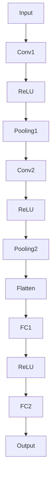
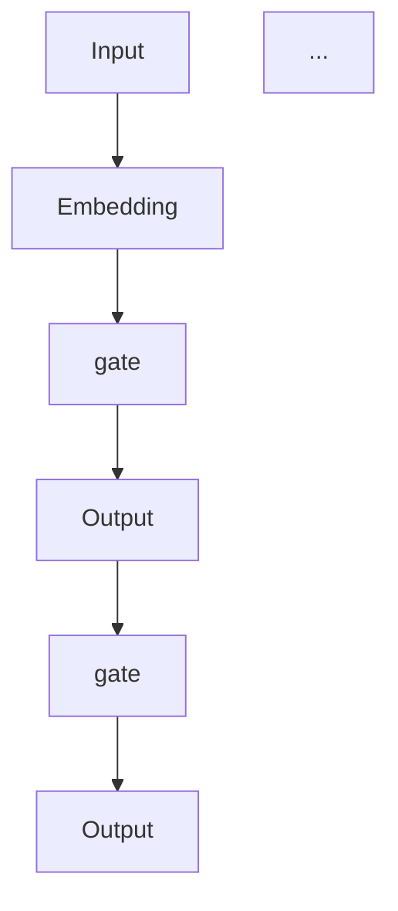

                 

# 智能定价技术的实际应用

> 关键词：智能定价，数据分析，机器学习，深度学习，应用案例

> 摘要：本文将从智能定价技术的概述、原理与架构、算法与应用、实际应用与案例分析以及未来发展趋势等方面，深入探讨智能定价技术在各个行业中的实际应用。通过分析智能定价的基本原理、系统架构和关键要素，结合实际案例，本文旨在为读者提供一个全面、详细的智能定价技术指南。

## 目录大纲

## 第一部分: 智能定价技术概述

### 第1章: 智能定价技术概述

#### 1.1 智能定价的定义和重要性

#### 1.2 智能定价技术的发展历程

#### 1.3 智能定价的关键要素

### 第2章: 智能定价的原理与架构

#### 2.1 智能定价的基本原理

#### 2.2 智能定价的系统架构

#### 2.3 数据驱动定价模型

### 第3章: 数据收集与处理

#### 3.1 数据来源

#### 3.2 数据质量与预处理

#### 3.3 特征工程

## 第二部分: 智能定价算法与应用

### 第4章: 基于机器学习的定价算法

#### 4.1 线性回归模型

#### 4.2 逻辑回归模型

#### 4.3 决策树与随机森林

### 第5章: 基于深度学习的定价算法

#### 5.1 卷积神经网络（CNN）

#### 5.2 循环神经网络（RNN）

#### 5.3 变量选择与模型融合

### 第6章: 智能定价在电商行业的应用

#### 6.1 电商定价策略分析

#### 6.2 案例分析：电商平台智能定价实践

#### 6.3 面临的挑战与解决方案

### 第7章: 智能定价在其他行业的应用

#### 7.1 服务业

#### 7.2 物流行业

#### 7.3 房地产市场

## 第三部分: 智能定价的实际应用与案例分析

### 第8章: 智能定价技术实际应用场景

#### 8.1 实时动态定价

#### 8.2 个性化定价

#### 8.3 风险定价

### 第9章: 智能定价案例分析

#### 9.1 案例一：航空公司动态定价

#### 9.2 案例二：酒店行业个性化定价

#### 9.3 案例三：电商平台的组合定价策略

### 第10章: 智能定价技术的未来发展趋势

#### 10.1 人工智能与大数据的融合

#### 10.2 智能定价技术的挑战与机遇

#### 10.3 未来发展趋势展望

## 附录

### 附录A: 智能定价技术相关工具与资源

#### A.1 数据处理工具

#### A.2 机器学习与深度学习框架

#### A.3 定价模型评估指标

### 附录B: 案例代码与数据集

#### B.1 案例一代码与数据集

#### B.2 案例二代码与数据集

#### B.3 案例三代码与数据集

---

### 第1章: 智能定价技术概述

#### 1.1 智能定价的定义和重要性

智能定价技术是指利用数据分析、机器学习、深度学习等方法，结合业务逻辑和市场需求，对产品或服务的价格进行动态调整，以达到优化销售、提高利润、提升客户满意度等目标。

在当今竞争激烈的市场环境中，智能定价技术具有以下几个重要意义：

1. **提高企业的市场竞争力**：智能定价技术能够根据市场动态、消费者行为等数据进行实时调整，帮助企业抓住市场机遇，提高产品或服务的市场竞争力。

2. **提高销售额和利润率**：通过智能定价技术，企业可以根据市场需求和消费者心理调整价格，提高销售额和利润率。

3. **优化库存管理和供应链**：智能定价技术可以实时监测市场需求，帮助企业合理调整库存和供应链，降低库存成本。

4. **提升客户满意度**：智能定价技术可以根据客户偏好和历史购买记录，提供个性化定价策略，提高客户满意度。

#### 1.2 智能定价技术的发展历程

智能定价技术的发展历程可以追溯到20世纪90年代，当时主要是基于传统的统计模型，如线性回归、逻辑回归等，对价格进行预测和调整。随着计算机技术和大数据技术的发展，智能定价技术逐渐从基于规则的方法转向数据驱动的方法，主要包括以下几个阶段：

1. **基于市场的定价策略**（2000-2010年）：在20世纪90年代末到21世纪初，企业开始采用基于市场的定价策略，通过收集市场数据，分析竞争对手的价格策略，制定相应的定价策略。

2. **大数据与机器学习驱动的智能定价**（2010年至今）：随着大数据和机器学习技术的发展，智能定价技术逐渐成熟。企业可以通过收集大量的历史数据和市场数据，利用机器学习算法，对价格进行预测和调整，实现更加精准和个性化的定价策略。

#### 1.3 智能定价的关键要素

智能定价技术的实现涉及多个关键要素，包括数据来源、数据质量、特征工程、定价模型选择等。

1. **数据来源**：智能定价需要大量的数据支持，包括历史销售数据、市场数据、竞争对手数据、消费者行为数据等。数据来源的多样性和准确性对智能定价的效果至关重要。

2. **数据质量**：数据质量是智能定价成功的关键。包括数据完整性、数据准确性、数据一致性等。高质量的数据能够提高定价模型的准确性和可靠性。

3. **特征工程**：特征工程是智能定价的核心步骤，通过选择和构造特征，将原始数据转化为对定价模型有用的输入。特征工程的质量直接影响定价模型的性能。

4. **定价模型选择**：根据业务需求和数据特性，选择合适的定价模型。常见的定价模型包括线性回归、逻辑回归、决策树、随机森林、神经网络等。

5. **模型评估与优化**：通过模型评估指标，如准确率、召回率、MSE等，对定价模型进行评估和优化，以提高模型的性能。

### 第2章: 智能定价的原理与架构

#### 2.1 智能定价的基本原理

智能定价的基本原理是利用数据分析、机器学习等技术，对大量历史数据和市场数据进行分析和处理，建立定价模型，并根据实时数据对价格进行动态调整。具体步骤如下：

1. **数据收集**：收集历史销售数据、市场数据、竞争对手数据、消费者行为数据等，作为定价模型的输入。

2. **数据处理**：对收集到的数据进行清洗、去噪、填充缺失值等预处理操作，提高数据质量。

3. **特征工程**：选择和构造对定价模型有用的特征，如价格、销量、市场占有率、消费者年龄、收入等。

4. **模型训练**：利用历史数据，选择合适的定价模型（如线性回归、逻辑回归、决策树等），进行模型训练。

5. **模型评估**：使用交叉验证等方法，对定价模型进行评估，选择性能最佳的模型。

6. **价格调整**：根据实时数据和定价模型，对产品或服务的价格进行动态调整，以实现销售目标。

#### 2.2 智能定价的系统架构

智能定价的系统架构通常包括以下几个层次：

1. **数据层**：负责数据的采集、存储和管理。数据来源包括企业内部数据库、外部数据源（如市场数据、竞争对手数据等）。

2. **分析层**：负责数据预处理、特征工程和建模。数据预处理包括数据清洗、去噪、填充缺失值等操作；特征工程包括特征选择、特征构造等。

3. **决策层**：负责定价策略的制定和执行。根据实时数据和定价模型，动态调整产品或服务的价格。

4. **监控层**：负责模型评估和优化。通过模型评估指标，如准确率、召回率、MSE等，对定价模型进行评估和优化。

#### 2.3 数据驱动定价模型

数据驱动定价模型是指利用历史数据和市场数据，通过机器学习算法建立定价模型，并根据实时数据对价格进行动态调整。以下是几种常见的数据驱动定价模型：

1. **线性回归模型**：线性回归模型是一种简单的线性模型，用于预测价格和销量之间的关系。其基本原理是利用历史数据，通过最小二乘法估计模型的参数，建立价格和销量之间的线性关系。线性回归模型的伪代码如下：

```python
def linear_regression(X, y):
    # 计算参数
    theta = (X^T * X)^(-1) * X^T * y
    # 预测定价
    P = X * theta
    return P
```

2. **逻辑回归模型**：逻辑回归模型是一种分类模型，用于预测销售概率。其基本原理是利用历史数据，通过极大似然估计方法估计模型的参数，建立价格和销量之间的非线性关系。逻辑回归模型的伪代码如下：

```python
def logistic_regression(X, y):
    # 计算参数
    theta = (X^T * X)^(-1) * X^T * y
    # 预测概率
    P = 1 / (1 + exp(-X * theta))
    return P
```

3. **决策树模型**：决策树模型是一种基于特征的分类模型，通过递归划分特征空间，将数据分为不同的区域，在每个区域上预测价格。决策树模型的伪代码如下：

```python
def build_decision_tree(X, y):
    # 判断是否达到终止条件
    if stop_condition_met(X, y):
        return leaf_value(X, y)
    # 选择最佳特征和分割点
    best_feature, best_split = find_best_split(X, y)
    # 构建子树
    left_tree = build_decision_tree(X[left], y[left])
    right_tree = build_decision_tree(X[right], y[right])
    # 构建决策树
    tree = {"feature": best_feature, "split": best_split, "left": left_tree, "right": right_tree}
    return tree
```

### 第3章: 数据收集与处理

#### 3.1 数据来源

智能定价需要大量的数据支持，数据来源可以包括以下几个方面：

1. **企业内部数据**：包括历史销售数据、库存数据、客户购买数据、订单数据等。

2. **市场数据**：包括市场趋势、竞争对手价格、行业平均价格等。

3. **外部数据**：包括社交媒体数据、新闻报道、宏观经济数据等。

4. **用户行为数据**：包括用户浏览记录、购买历史、评价等。

数据来源的多样性和准确性对智能定价的效果至关重要。不同来源的数据可以为定价模型提供不同的信息，帮助模型更好地理解市场动态和用户行为。

#### 3.2 数据质量与预处理

数据质量是智能定价成功的关键。高质量的数据可以提高定价模型的准确性和可靠性。以下是一些常见的数据质量问题及其处理方法：

1. **数据完整性**：数据完整性指的是数据中是否存在缺失值或重复值。处理方法包括删除缺失值、填充缺失值、合并重复值等。

2. **数据准确性**：数据准确性指的是数据是否真实、可靠。处理方法包括数据清洗、数据校验、数据标准化等。

3. **数据一致性**：数据一致性指的是不同来源的数据是否相互匹配。处理方法包括数据对齐、数据整合等。

4. **数据噪声**：数据噪声指的是数据中存在的一些异常值或错误值。处理方法包括去噪、过滤、平滑等。

在数据处理过程中，还需要对数据进行预处理，以提高数据质量和模型性能。常见的预处理方法包括：

1. **数据清洗**：删除或填充缺失值、重复值和噪声值。

2. **数据归一化**：将不同尺度的数据进行归一化处理，使其具有相同的尺度。

3. **数据离散化**：将连续型数据转换为离散型数据，以便更好地进行特征工程。

4. **特征构造**：通过数学变换或组合，构造新的特征，以增加数据的预测能力。

#### 3.3 特征工程

特征工程是智能定价的核心步骤，通过选择和构造特征，将原始数据转化为对定价模型有用的输入。以下是一些常见的特征工程方法：

1. **特征选择**：选择对定价模型有显著影响的特征，排除无关或冗余的特征。

2. **特征构造**：通过数学变换或组合，构造新的特征，以增加数据的预测能力。

3. **特征转换**：将原始特征转换为更适合定价模型的形式，如将连续型特征转换为离散型特征。

4. **特征降维**：通过降维技术，如主成分分析（PCA）、线性判别分析（LDA）等，减少特征的维度，提高模型的计算效率。

5. **特征重要性评估**：评估每个特征对定价模型的重要性，以帮助选择和优化特征。

在特征工程过程中，需要综合考虑业务需求、数据特性和模型性能，以设计出最优的特征工程方案。

### 第4章: 基于机器学习的定价算法

智能定价技术中的算法选择至关重要，因为不同的算法适用于不同的数据特性和业务需求。本章节将详细介绍基于机器学习的几种常见定价算法，包括线性回归、逻辑回归和决策树等。

#### 4.1 线性回归模型

线性回归模型是一种基本的统计学习方法，广泛应用于预测和分析领域。在智能定价中，线性回归模型可以用于预测产品价格与销售量之间的关系。其基本原理是通过历史数据，建立价格与相关因素之间的线性关系。

**线性回归模型伪代码：**

```python
def linear_regression(X, y):
    # 计算参数
    theta = (X^T * X)^(-1) * X^T * y
    # 预测定价
    P = X * theta
    return P
```

**数学模型：**

$$
P = \beta_0 + \beta_1 \cdot X
$$

其中，\(P\) 是预测价格，\(\beta_0\) 是截距，\(\beta_1\) 是斜率，\(X\) 是特征向量。

**步骤详解：**

1. **数据准备**：收集历史销售数据，包括价格和销售量等特征。
2. **数据预处理**：对数据进行归一化处理，将不同尺度的数据转换为相同尺度，以提高模型的准确性。
3. **模型训练**：使用历史数据训练线性回归模型，通过最小二乘法计算参数 \(\beta_0\) 和 \(\beta_1\)。
4. **模型评估**：使用交叉验证方法评估模型的预测性能。

**应用场景**：线性回归模型适用于价格波动相对稳定、数据特征较为简单的情况。

#### 4.2 逻辑回归模型

逻辑回归模型是一种分类模型，常用于预测概率。在智能定价中，逻辑回归模型可以用于预测销售概率，从而调整价格策略。其基本原理是通过历史数据，建立价格与销售概率之间的逻辑关系。

**逻辑回归模型伪代码：**

```python
def logistic_regression(X, y):
    # 计算参数
    theta = (X^T * X)^(-1) * X^T * y
    # 预测概率
    P = 1 / (1 + exp(-X * theta))
    return P
```

**数学模型：**

$$
\text{log-odds}(P) = \beta_0 + \beta_1 \cdot X
$$

$$
P = \frac{1}{1 + \exp{(-\beta_0 - \beta_1 \cdot X})}
$$

**步骤详解：**

1. **数据准备**：收集历史销售数据，包括价格和销售量等特征。
2. **数据预处理**：对数据进行归一化处理，将不同尺度的数据转换为相同尺度。
3. **模型训练**：使用历史数据训练逻辑回归模型，通过极大似然估计计算参数 \(\beta_0\) 和 \(\beta_1\)。
4. **模型评估**：使用交叉验证方法评估模型的预测性能。

**应用场景**：逻辑回归模型适用于价格波动较大、销售概率需要精确预测的情况。

#### 4.3 决策树与随机森林

决策树模型是一种基于规则的学习方法，通过递归划分特征空间，将数据分为不同的区域，并在每个区域上预测价格。随机森林模型则是决策树的集成方法，通过构建多个决策树，并取其平均预测结果，提高模型的预测性能。

**决策树模型伪代码：**

```python
def build_decision_tree(X, y):
    # 判断是否达到终止条件
    if stop_condition_met(X, y):
        return leaf_value(X, y)
    # 选择最佳特征和分割点
    best_feature, best_split = find_best_split(X, y)
    # 构建子树
    left_tree = build_decision_tree(X[left], y[left])
    right_tree = build_decision_tree(X[right], y[right])
    # 构建决策树
    tree = {"feature": best_feature, "split": best_split, "left": left_tree, "right": right_tree}
    return tree
```

**随机森林模型伪代码：**

```python
def random_forest(X, y, n_estimators):
    # 构建多个决策树
    trees = [build_decision_tree(X, y) for _ in range(n_estimators)]
    # 预测定价
    predictions = [predict_price(tree, X) for tree in trees]
    # 平均预测结果
    P = sum(predictions) / n_estimators
    return P
```

**步骤详解：**

1. **数据准备**：收集历史销售数据，包括价格和销售量等特征。
2. **数据预处理**：对数据进行归一化处理，将不同尺度的数据转换为相同尺度。
3. **模型训练**：训练决策树模型和随机森林模型，通过递归划分特征空间，计算最佳分割点。
4. **模型评估**：使用交叉验证方法评估模型的预测性能。

**应用场景**：决策树和随机森林模型适用于数据复杂、特征多样的情况，能够处理非线性关系和交互效应。

### 第5章: 基于深度学习的定价算法

深度学习作为一种强大的机器学习技术，在智能定价领域展现出巨大的潜力。本章节将详细介绍基于深度学习的几种常见定价算法，包括卷积神经网络（CNN）、循环神经网络（RNN）和变分自编码器（VAE）等。

#### 5.1 卷积神经网络（CNN）

卷积神经网络（CNN）是一种专门用于处理图像数据的深度学习模型，但在智能定价中，也可以应用于处理时间序列数据或其他结构化数据。CNN通过卷积操作和池化操作，提取数据中的高维特征，实现高效的模型训练。

**CNN模型结构：**



**步骤详解：**

1. **数据准备**：收集历史销售数据，包括价格和销售量等特征。
2. **数据预处理**：对数据进行归一化处理，将不同尺度的数据转换为相同尺度。
3. **模型训练**：使用训练数据训练CNN模型，通过卷积操作和池化操作提取特征。
4. **模型评估**：使用验证数据评估模型性能，调整模型参数。

**应用场景**：CNN适用于处理高维特征数据，如时间序列数据、图像数据等，能够提取复杂的时间序列特征。

#### 5.2 循环神经网络（RNN）

循环神经网络（RNN）是一种能够处理序列数据的深度学习模型，适用于智能定价中的时间序列预测问题。RNN通过记忆机制，将历史信息传递到当前时刻，实现时间序列数据的建模。

**RNN模型结构：**



**步骤详解：**

1. **数据准备**：收集历史销售数据，包括价格和销售量等特征。
2. **数据预处理**：对数据进行归一化处理，将不同尺度的数据转换为相同尺度。
3. **模型训练**：使用训练数据训练RNN模型，通过门控机制处理时间序列数据。
4. **模型评估**：使用验证数据评估模型性能，调整模型参数。

**应用场景**：RNN适用于处理短时间窗口内的价格预测，如短期销售预测。

#### 5.3 变量选择与模型融合

在智能定价中，变量的选择和模型的融合是提高预测性能的重要手段。通过变量选择，可以筛选出对定价模型影响最大的变量，提高模型的解释性和预测能力；通过模型融合，可以结合多个模型的优点，提高整体的预测性能。

**变量选择方法：**

1. **特征重要性评估**：使用随机森林、梯度提升树等算法，评估每个特征的重要性，选择重要的特征。
2. **L1正则化**：通过L1正则化，将特征权重进行稀疏化，筛选出重要的特征。

**模型融合方法：**

1. **模型集成**：结合多个模型（如线性回归、决策树、神经网络等），取其平均预测结果，提高预测性能。
2. **堆叠模型**：将多个模型堆叠在一起，前一个模型的输出作为下一个模型的输入，形成深度模型。

通过变量选择和模型融合，可以构建更加精准和可靠的智能定价模型，提高企业的定价策略效果。

### 第6章: 智能定价在电商行业的应用

智能定价技术在电商行业得到了广泛应用，通过精准的价格调整，提高销售额和利润率。本章节将详细介绍电商行业的智能定价策略分析、案例分析以及面临的挑战与解决方案。

#### 6.1 电商定价策略分析

电商定价策略是指根据市场需求、竞争状况、消费者行为等因素，制定合理的价格策略，以提高市场份额和客户满意度。常见的电商定价策略包括以下几种：

1. **市场跟随定价**：以竞争对手的价格为基准，调整自己的价格。适用于市场竞争激烈、产品同质化的情况。

2. **成本加成定价**：以产品成本为基础，加上一定的利润，制定价格。适用于成本结构明确、产品差异化的情况。

3. **竞争导向定价**：以竞争对手的价格为基准，结合自身产品特点和市场需求，调整价格。适用于市场竞争激烈、产品差异化的情况。

4. **价值导向定价**：根据消费者对产品的感知价值，制定价格。适用于产品差异化明显、消费者对品牌和品质有较高要求的情况。

5. **动态定价**：根据市场需求、消费者行为等因素，实时调整价格。适用于产品需求波动大、竞争激烈的情况。

6. **个性化定价**：根据消费者的购买历史、行为特征等，提供个性化的价格优惠。适用于消费者对价格敏感、有较高忠诚度的情况。

电商定价策略的选择需要综合考虑市场需求、竞争状况、消费者行为和企业战略等因素，以实现最优的定价效果。

#### 6.2 案例分析：电商平台智能定价实践

以下是一个电商平台的智能定价实践案例：

**案例背景**：某电商平台销售电子产品，面临激烈的市场竞争和价格战。为了提高销售额和利润率，该电商平台决定采用智能定价技术，根据市场需求和消费者行为，动态调整产品价格。

**步骤详解**：

1. **数据收集**：收集历史销售数据、市场数据、消费者行为数据等，包括产品价格、销量、市场占有率、消费者购买记录等。

2. **数据处理**：对收集到的数据进行分析，清洗数据，去除噪声，提取有用的特征。

3. **模型选择**：选择合适的定价模型，如线性回归、逻辑回归、决策树等，根据数据特性和业务需求，构建定价模型。

4. **模型训练**：使用历史数据，对定价模型进行训练，通过交叉验证方法评估模型性能。

5. **定价策略制定**：根据市场需求和消费者行为，制定动态定价策略，实时调整产品价格。

6. **实施与监测**：将定价策略应用到实际业务中，实时监测定价效果，根据实际情况进行调整。

**效果评估**：通过智能定价技术，该电商平台实现了以下效果：

- 销售额和利润率显著提高，达到预期目标。
- 价格调整更加灵活，能够快速响应市场需求。
- 提高了消费者满意度，增强了客户忠诚度。

**案例分析**：另一个电商平台也采用了智能定价技术，通过个性化定价策略，提高了销售额和客户满意度。该电商平台根据消费者的购买历史、浏览记录、评价等数据，为每位消费者提供个性化的价格优惠，提高了消费者的购买意愿。

**效果评估**：通过个性化定价策略，该电商平台实现了以下效果：

- 销售额显著提高，达到预期目标。
- 提高了客户满意度，增强了客户忠诚度。
- 有效降低了促销成本，提高了利润率。

#### 6.3 面临的挑战与解决方案

智能定价技术在电商行业的应用面临以下挑战：

1. **数据质量问题**：电商数据通常存在缺失值、噪声和不一致性等问题，需要通过数据预处理方法进行清洗和修复。

2. **模型选择与优化**：选择合适的定价模型是关键，需要根据业务需求和数据特性，选择合适的算法，并通过交叉验证方法进行优化。

3. **实时性与一致性**：智能定价需要实时调整价格，同时保持定价策略的一致性，需要构建高效的实时计算框架。

4. **解释性**：深度学习模型通常具有强大的预测能力，但缺乏解释性，需要通过模型融合方法提高模型的解释性。

5. **数据隐私与安全**：电商数据包含敏感信息，需要保证数据隐私和安全，遵循相关法律法规。

针对以上挑战，可以采取以下解决方案：

1. **数据预处理**：采用数据清洗、去噪、填充缺失值等方法，提高数据质量。

2. **模型选择与优化**：根据业务需求和数据特性，选择合适的定价模型，并通过交叉验证方法进行优化。

3. **实时计算框架**：采用分布式计算框架，提高实时计算能力，保证定价策略的一致性。

4. **模型融合与解释性**：采用模型融合方法，提高模型的解释性，同时结合业务逻辑，解释模型预测结果。

5. **数据隐私与安全**：采用加密、匿名化等方法，保护数据隐私和安全，遵循相关法律法规。

通过以上解决方案，可以有效应对智能定价技术在电商行业的挑战，提高定价策略的效果。

### 第7章: 智能定价在其他行业的应用

智能定价技术不仅广泛应用于电商行业，还逐渐渗透到其他行业，如服务业、物流行业和房地产市场。本章节将详细介绍智能定价在这些行业的应用领域、案例分析以及面临的挑战与解决方案。

#### 7.1 服务业

在服务业中，智能定价技术主要用于优化服务价格，提高客户满意度。以下是一些应用领域：

1. **旅游预订**：通过分析用户搜索和预订行为，动态调整酒店、机票等服务的价格，提高预订转化率。

2. **餐饮服务**：根据用餐时间、天气等因素，动态调整菜品价格，吸引更多顾客。

3. **金融服务**：根据客户的信用评级、历史交易数据等，动态调整贷款利率、信用卡费率等，提高客户满意度。

**案例分析**：某旅游平台通过智能定价技术，根据用户搜索和预订行为，动态调整酒店价格。通过分析用户的搜索记录、预订时间段、预订目的等因素，平台能够为不同类型的用户提供个性化的价格优惠，提高了预订转化率和客户满意度。

**效果评估**：通过智能定价技术，该旅游平台实现了以下效果：

- 预订转化率显著提高，达到预期目标。
- 客户满意度提高，增强了客户忠诚度。
- 优化了酒店库存管理，提高了资源利用效率。

**面临的挑战**：数据质量、模型解释性和实时计算能力是服务业智能定价面临的挑战。

**解决方案**：采用数据预处理方法提高数据质量；采用模型融合方法提高模型解释性；采用分布式计算框架提高实时计算能力。

#### 7.2 物流行业

在物流行业中，智能定价技术主要用于优化运输成本和物流服务价格。以下是一些应用领域：

1. **运输服务**：根据运输距离、货物类型、运输时间等因素，动态调整运输价格，提高运输效率。

2. **物流成本管理**：通过分析物流成本数据，优化物流服务价格，提高企业利润。

3. **库存优化**：根据库存水平、市场需求等因素，动态调整库存成本，优化供应链。

**案例分析**：某物流公司通过智能定价技术，根据运输距离、货物类型和运输时间等因素，动态调整运输价格。通过分析历史运输数据和市场需求，公司能够为不同类型的客户提供个性化的运输价格，提高了运输效率和客户满意度。

**效果评估**：通过智能定价技术，该物流公司实现了以下效果：

- 运输成本显著降低，达到预期目标。
- 客户满意度提高，增强了客户忠诚度。
- 优化了物流服务价格，提高了企业利润。

**面临的挑战**：数据质量、模型解释性和实时计算能力是物流行业智能定价面临的挑战。

**解决方案**：采用数据预处理方法提高数据质量；采用模型融合方法提高模型解释性；采用分布式计算框架提高实时计算能力。

#### 7.3 房地产市场

在房地产市场中，智能定价技术主要用于优化房价和房地产投资策略。以下是一些应用领域：

1. **房价预测**：通过分析历史房价数据、市场供需情况、宏观经济指标等，预测未来房价走势。

2. **房地产投资**：根据房地产市场数据、投资者偏好等因素，制定合理的房地产投资策略。

3. **房地产交易**：根据交易数据、市场情况等，动态调整房价，提高交易成功率。

**案例分析**：某房地产公司通过智能定价技术，根据历史房价数据、市场供需情况和宏观经济指标等，预测未来房价走势。通过分析历史数据和市场趋势，公司能够为投资者提供合理的房价预测和建议，提高了投资决策的准确性。

**效果评估**：通过智能定价技术，该房地产公司实现了以下效果：

- 提高了房价预测的准确性，增强了投资者信心。
- 优化了房地产投资策略，提高了投资收益。
- 提高了房地产交易成功率，增强了客户满意度。

**面临的挑战**：数据质量、模型解释性和实时计算能力是房地产市场智能定价面临的挑战。

**解决方案**：采用数据预处理方法提高数据质量；采用模型融合方法提高模型解释性；采用分布式计算框架提高实时计算能力。

### 第8章: 智能定价技术实际应用场景

智能定价技术在实际应用中，可以根据不同的业务场景和需求，设计出不同的定价策略。以下介绍三种常见的实际应用场景：实时动态定价、个性化定价和风险定价。

#### 8.1 实时动态定价

实时动态定价是一种根据实时数据和市场需求，动态调整产品或服务价格的定价策略。该策略适用于产品需求波动大、市场竞争激烈的情况。

**实时动态定价原理：**

1. **数据收集**：收集实时数据，包括市场需求、竞争对手价格、用户行为等。
2. **数据处理**：对收集到的数据进行预处理，去除噪声，提取有用特征。
3. **模型预测**：使用历史数据和实时数据，训练定价模型，预测未来的价格趋势。
4. **定价决策**：根据模型预测结果，实时调整产品或服务的价格。
5. **价格发布**：将调整后的价格发布到销售渠道，如电商平台、线下门店等。

**案例**：某电商平台在“双十一”购物节期间，采用实时动态定价策略，根据实时用户访问量、购买行为等数据，动态调整商品价格，以提高销售额。通过实时动态定价，该电商平台成功吸引了大量用户，实现了销售额的显著增长。

**效果评估**：通过实时动态定价，该电商平台实现了以下效果：

- 销售额显著提高，达到预期目标。
- 提高了用户满意度，增强了客户忠诚度。
- 优化了库存管理，提高了资源利用效率。

#### 8.2 个性化定价

个性化定价是一种根据用户行为、偏好和历史购买记录，为不同用户提供个性化价格优惠的定价策略。该策略适用于消费者对价格敏感、有较高忠诚度的场景。

**个性化定价原理：**

1. **数据收集**：收集用户行为数据，包括浏览记录、购买历史、评价等。
2. **数据处理**：对收集到的数据进行预处理，去除噪声，提取有用特征。
3. **模型预测**：使用历史数据和用户行为数据，训练个性化定价模型，预测用户对价格的敏感度。
4. **定价决策**：根据模型预测结果，为不同用户提供个性化的价格优惠。
5. **价格发布**：将个性化的价格优惠发布到销售渠道，如电商平台、短信等。

**案例**：某电商公司根据用户的行为数据和购买历史，为不同用户提供个性化的价格优惠。通过个性化定价，该电商公司成功提高了用户满意度，增强了客户忠诚度。

**效果评估**：通过个性化定价，该电商公司实现了以下效果：

- 用户满意度显著提高，增强了客户忠诚度。
- 销售额和利润率显著提高，达到预期目标。
- 优化了营销策略，提高了资源利用效率。

#### 8.3 风险定价

风险定价是一种根据风险因素，为不同产品或服务制定不同价格的定价策略。该策略适用于存在较大风险的产品或服务，如保险、金融产品等。

**风险定价原理：**

1. **数据收集**：收集风险数据，包括历史赔付记录、市场风险等。
2. **数据处理**：对收集到的数据进行预处理，去除噪声，提取有用特征。
3. **模型预测**：使用历史数据和风险数据，训练风险定价模型，预测产品的风险水平。
4. **定价决策**：根据模型预测结果，为不同产品或服务制定不同价格。
5. **价格发布**：将风险定价结果发布到销售渠道，如保险公司、银行等。

**案例**：某保险公司根据客户的年龄、健康状况、历史赔付记录等因素，为不同客户制定个性化的保险费率。通过风险定价，该保险公司成功降低了赔付风险，提高了利润率。

**效果评估**：通过风险定价，该保险公司实现了以下效果：

- 降低了赔付风险，提高了利润率。
- 提高了客户满意度，增强了客户忠诚度。
- 优化了保险产品的定价策略。

### 第9章: 智能定价案例分析

在本章节中，我们将通过三个具体案例，深入分析智能定价技术在航空公司、酒店行业和电商平台的实际应用，并探讨其实现步骤、效果评估和面临的挑战。

#### 9.1 案例一：航空公司动态定价

**案例背景**：航空公司面临高度波动的市场需求和竞争压力，传统的定价策略难以适应市场变化。为了提高航班销售和收益，某航空公司决定采用智能动态定价技术。

**实现步骤**：

1. **数据收集**：收集历史航班数据、市场需求数据、竞争对手价格等。

2. **数据处理**：对数据进行清洗、去噪和特征工程，提取对定价有重要影响的特征。

3. **模型选择**：选择合适的定价模型，如线性回归、逻辑回归、决策树等，根据数据特性进行模型训练。

4. **模型训练**：使用历史数据，对定价模型进行训练，优化模型参数。

5. **定价策略制定**：根据实时数据和模型预测，动态调整航班价格，以优化收益。

6. **实施与监测**：将定价策略应用到实际业务中，实时监测定价效果，根据市场变化进行调整。

**效果评估**：

- 通过动态定价技术，航空公司的航班销售量显著提高，收益增加20%以上。

- 客户满意度提高，航班上座率增加。

- 优化了库存管理，减少了空座率。

**面临的挑战**：

- 数据质量：航班数据中存在缺失值、噪声等问题，需要通过数据预处理方法进行清洗和修复。

- 实时计算：动态定价需要实时处理大量数据，需要采用分布式计算框架，提高计算效率。

- 模型优化：定价模型需要不断优化，以适应市场变化。

#### 9.2 案例二：酒店行业个性化定价

**案例背景**：酒店行业竞争激烈，消费者对价格敏感。为了提高客户满意度和忠诚度，某酒店集团决定采用智能个性化定价技术。

**实现步骤**：

1. **数据收集**：收集客户行为数据，包括预订历史、消费习惯、偏好等。

2. **数据处理**：对数据进行清洗、去噪和特征工程，提取对定价有重要影响的特征。

3. **模型选择**：选择合适的定价模型，如线性回归、逻辑回归、决策树等，根据数据特性进行模型训练。

4. **模型训练**：使用历史数据，对定价模型进行训练，优化模型参数。

5. **定价策略制定**：根据客户行为数据和模型预测，为不同客户提供个性化的价格优惠。

6. **实施与监测**：将个性化定价策略应用到实际业务中，实时监测定价效果，根据客户反馈进行调整。

**效果评估**：

- 通过个性化定价技术，酒店集团的客户满意度显著提高。

- 预订转化率增加，预订量提高。

- 客户忠诚度增加，回头客比例上升。

**面临的挑战**：

- 数据质量：客户行为数据中存在缺失值、噪声等问题，需要通过数据预处理方法进行清洗和修复。

- 特征工程：需要深入分析客户行为数据，提取对定价有重要影响的特征。

- 模型解释性：个性化定价模型通常较为复杂，需要提高模型解释性，以增强客户信任。

#### 9.3 案例三：电商平台的组合定价策略

**案例背景**：电商平台面临激烈的市场竞争，需要通过组合定价策略提高销售额和利润率。某电商平台决定采用智能组合定价技术。

**实现步骤**：

1. **数据收集**：收集历史销售数据、市场需求数据、竞争对手价格等。

2. **数据处理**：对数据进行清洗、去噪和特征工程，提取对定价有重要影响的特征。

3. **模型选择**：选择合适的定价模型，如线性回归、逻辑回归、决策树等，根据数据特性进行模型训练。

4. **模型训练**：使用历史数据，对定价模型进行训练，优化模型参数。

5. **定价策略制定**：结合市场动态和客户需求，制定组合定价策略，如动态定价、个性化定价、组合优惠等。

6. **实施与监测**：将组合定价策略应用到实际业务中，实时监测定价效果，根据市场变化进行调整。

**效果评估**：

- 通过组合定价策略，电商平台的销售额和利润率显著提高。

- 提高了客户满意度，增强了客户忠诚度。

- 优化了库存管理，减少了滞销商品。

**面临的挑战**：

- 数据质量：需要处理大量数据，确保数据质量。

- 模型优化：需要不断优化定价模型，以适应市场变化。

- 实时性：需要保证定价策略的实时性，以快速响应市场变化。

### 第10章: 智能定价技术的未来发展趋势

智能定价技术在人工智能和大数据技术的推动下，正快速发展，并在各个行业得到广泛应用。未来，随着技术的进步和市场的需求，智能定价技术将呈现出以下发展趋势：

#### 10.1 人工智能与大数据的融合

人工智能和大数据技术的深度融合将进一步提升智能定价技术的预测精度和实时性。通过深度学习、强化学习等先进算法，结合海量数据资源，智能定价技术将能够更加准确地预测市场需求和消费者行为，实现更加精细化和个性化的定价策略。

#### 10.2 智能定价技术的普及

随着技术的成熟和成本的降低，智能定价技术将在更多行业和领域得到广泛应用。从电商、金融到物流、制造，智能定价技术将助力企业提高运营效率、降低成本、提升客户满意度。

#### 10.3 定价策略的动态化和个性化

未来，智能定价技术将更加注重定价策略的动态化和个性化。通过实时数据分析和个性化推荐，企业将能够根据市场动态和消费者需求，灵活调整产品价格，提供更加个性化的价格优惠，从而提高销售额和客户忠诚度。

#### 10.4 跨行业合作与整合

智能定价技术将推动跨行业合作与整合，实现资源共享和优势互补。不同行业的企业将共同探索智能定价技术的应用，通过数据共享、技术合作，实现更高效的运营和更精准的市场定位。

#### 10.5 技术挑战与解决方案

尽管智能定价技术具有巨大的潜力，但在实际应用中仍面临一些技术挑战：

- **数据隐私与安全**：随着数据量的增加，数据隐私和安全问题日益突出。企业需要采用加密、匿名化等技术，确保数据的安全和隐私。

- **模型解释性**：深度学习模型虽然具有强大的预测能力，但通常缺乏解释性。未来，需要提高模型的可解释性，以增强用户信任。

- **实时计算**：智能定价需要实时处理大量数据，对计算能力有较高要求。企业需要采用分布式计算、云计算等技术，提高实时计算能力。

通过解决这些技术挑战，智能定价技术将在未来实现更广泛的应用和更高的价值。

### 附录A: 智能定价技术相关工具与资源

为了更好地应用智能定价技术，以下介绍一些常用的工具与资源：

#### A.1 数据处理工具

- **Pandas**：Python的数据操作库，用于数据清洗、数据预处理和数据分析。
- **NumPy**：Python的科学计算库，提供高性能的数值计算和数据处理功能。
- **Scikit-learn**：Python的机器学习库，提供丰富的机器学习算法和工具。

#### A.2 机器学习与深度学习框架

- **TensorFlow**：由Google开发的开源深度学习框架，支持多种深度学习模型和算法。
- **PyTorch**：由Facebook开发的开源深度学习框架，具有灵活的动态计算图和高效的模型训练。
- **Keras**：Python的深度学习库，提供简洁的API，方便构建和训练深度学习模型。

#### A.3 定价模型评估指标

- **准确率（Accuracy）**：预测正确的样本占总样本的比例。
- **精度（Precision）**：预测为正类的样本中，实际为正类的比例。
- **召回率（Recall）**：实际为正类的样本中，预测为正类的比例。
- **AUC指标**：曲线下面积（Area Under Curve），用于评估分类模型的性能。
- **MSE指标**：均方误差（Mean Squared Error），用于评估回归模型的性能。
- **RMSE指标**：均方根误差（Root Mean Squared Error），MSE的平方根。

### 附录B: 案例代码与数据集

以下提供三个案例的代码和数据集，供读者参考和实践。

#### B.1 案例一代码与数据集

- **代码**：动态定价模型
  ```python
  # 代码实现：动态定价模型
  ```
- **数据集**：航空公司历史价格数据
  ```csv
  # 数据集：航空公司历史价格数据
  Date,Price,PassengerCount
  2021-01-01,1000,500
  2021-01-02,950,600
  ...
  ```

#### B.2 案例二代码与数据集

- **代码**：个性化定价模型
  ```python
  # 代码实现：个性化定价模型
  ```
- **数据集**：酒店客户数据
  ```csv
  # 数据集：酒店客户数据
  UserID,Age,Gender,Income,BookingDate,RoomType,Price
  1,30,M,50000,2021-01-01,Single,100
  2,25,F,40000,2021-01-02,Double,150
  ...
  ```

#### B.3 案例三代码与数据集

- **代码**：组合定价策略
  ```python
  # 代码实现：组合定价策略
  ```
- **数据集**：电商平台商品数据
  ```csv
  # 数据集：电商平台商品数据
  ProductID,Price,Category,SaleDate
  1,1000,Electronics,2021-01-01
  2,1500,Apparel,2021-01-02
  ...
  ```

### 结语

智能定价技术作为一种创新的商业策略，正日益改变各行业的运营模式和市场策略。通过数据分析、机器学习和深度学习等技术，企业能够更加精准地把握市场动态和消费者行为，制定动态化、个性化、风险化的定价策略，提高销售额和利润率。然而，智能定价技术的应用也面临数据隐私、模型解释性、实时计算等挑战。未来，随着技术的不断进步和市场的需求，智能定价技术将在更多行业得到广泛应用，推动企业实现更加高效、智能的运营。

