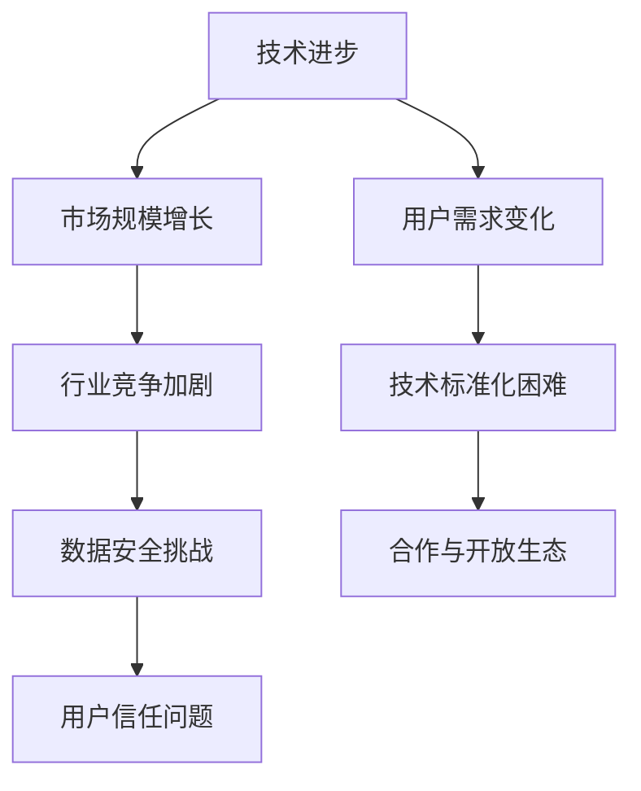

                 

### 《智能家电如何在注意力经济中突围》

#### 关键词：智能家电、注意力经济、用户体验、人工智能、物联网

在快速发展的数字经济时代，智能家电行业正迎来前所未有的机遇与挑战。注意力经济作为现代市场的新模式，对各行各业产生了深远影响。本文旨在探讨智能家电如何在注意力经济中实现突围，通过详细分析智能家电的定义、核心技术、商业模式、战略规划、用户运营和市场推广等方面，为智能家电企业提供可行的突围策略。

### 摘要

智能家电作为物联网和人工智能的产物，正逐渐融入人们的日常生活。注意力经济作为一种以用户注意力为核心的经济模式，对智能家电产业的发展产生了重大影响。本文从智能家电的定义、注意力经济的概念入手，分析了智能家电在注意力经济中的机遇与挑战。接着，探讨了智能家电的核心技术，包括人工智能、物联网和用户体验设计。随后，文章详细介绍了智能家电的商业模式、战略规划、用户运营和市场推广策略。最后，通过案例分析，总结了智能家电行业的未来趋势和智能家电企业的突围之路。

### 目录

1. **智能家电概述** <a id="introduction-to-smart-appliances"></a>
   1.1 智能家电的定义与特点
   1.2 智能家电的分类与结构

2. **注意力经济概述** <a id="overview-of-attention-economy"></a>
   2.1 注意力经济的概念与特点
   2.2 注意力经济下的消费者行为分析

3. **智能家电在注意力经济中的机遇与挑战** <a id="opportunities-and-challenges-for-smart-appliances-in-attention-economy"></a>
   3.1 智能家电在注意力经济中的机遇
   3.2 智能家电在注意力经济中的挑战

4. **智能家电的核心技术** <a id="core-technologies-for-smart-appliances"></a>
   4.1 人工智能技术
   4.2 物联网技术
   4.3 用户体验设计

5. **智能家电的商业模式** <a id="business-models-for-smart-appliances"></a>
   5.1 智能家电的传统商业模式
   5.2 智能家电的创新商业模式

6. **智能家电的战略规划** <a id="strategic-planning-for-smart-appliances"></a>
   6.1 智能家电的战略目标
   6.2 智能家电的竞争策略
   6.3 智能家电的品牌建设

7. **智能家电的用户运营** <a id="user-operations-for-smart-appliances"></a>
   7.1 用户画像与用户需求分析
   7.2 用户互动与用户满意度提升

8. **智能家电的营销策略** <a id="marketing-strategies-for-smart-appliances"></a>
   8.1 传统营销策略
   8.2 数字营销策略

9. **智能家电的市场推广** <a id="market-promotion-for-smart-appliances"></a>
   9.1 市场推广计划
   9.2 市场推广效果评估

10. **智能家电行业案例分析** <a id="case-studies-of-smart-appliances"></a>
    10.1 谷歌智能家居生态系统
    10.2 苹果智能家居生态系统

11. **智能家电行业未来趋势展望** <a id="future-trends-of-the-smart-appliances-industry"></a>
    11.1 智能家电技术的未来发展
    11.2 智能家电市场的未来趋势
    11.3 智能家电行业面临的挑战与机遇

12. **智能家电企业的突围之路** <a id="the-outbreak-path-for-smart-appliances-enterprises"></a>
    12.1 智能家电企业的核心竞争力
    12.2 智能家电企业的战略选择
    12.3 智能家电企业的创新实践

### 附录

A. 智能家电行业相关数据与统计  
B. 智能家电行业相关法规与政策  
C. 智能家电行业相关术语与解释

### 引言

智能家电作为物联网和人工智能技术的典型应用，正在迅速改变人们的日常生活。从传统的家电产品到智能家居系统，智能家电通过互联网连接，实现设备之间的数据交互和智能控制，为用户提供了更加便捷、智能的生活体验。然而，随着市场环境的不断变化，智能家电企业面临着前所未有的挑战。注意力经济作为一种新兴的经济模式，正逐步成为企业争夺市场份额的关键因素。

注意力经济是指以用户注意力为核心的经济模式，通过吸引和保持用户的注意力来创造价值。在注意力经济中，用户的时间和注意力成为稀缺资源，因此企业需要通过创新的产品和服务来争夺用户的注意力。智能家电行业也不例外，如何在注意力经济中脱颖而出，成为众多企业关注的焦点。

本文将从以下几个方面展开讨论：

1. **智能家电的定义与特点**：介绍智能家电的基本概念和核心特点，包括其与传统家电的区别。
2. **注意力经济的概念与特点**：解释注意力经济的定义及其与传统经济的区别，分析注意力经济下的消费者行为。
3. **智能家电在注意力经济中的机遇与挑战**：探讨智能家电在注意力经济中所面临的机遇和挑战。
4. **智能家电的核心技术**：介绍智能家电所涉及的关键技术，包括人工智能、物联网和用户体验设计。
5. **智能家电的商业模式**：分析智能家电的传统商业模式和创新商业模式，包括数据驱动模式、共享经济模式等。
6. **智能家电的战略规划**：讨论智能家电的战略目标、竞争策略和品牌建设。
7. **智能家电的用户运营**：介绍用户画像与用户需求分析、用户互动与用户满意度提升的方法。
8. **智能家电的营销策略**：分析传统营销策略和数字营销策略在智能家电中的应用。
9. **智能家电的市场推广**：讨论市场推广计划、效果评估和改进策略。
10. **智能家电行业案例分析**：通过谷歌和苹果的智能家居生态系统案例，分析智能家电企业的成功经验。
11. **智能家电行业未来趋势展望**：预测智能家电技术的未来发展趋势、市场趋势以及面临的挑战和机遇。
12. **智能家电企业的突围之路**：提出智能家电企业的核心竞争力、战略选择和创新实践。

通过本文的详细分析，希望能够为智能家电企业在注意力经济中的发展提供有益的参考和启示。

### 第一部分：智能家电在注意力经济中的机遇与挑战

#### 1.1 注意力经济的概念与特点

注意力经济是指一种以用户注意力为核心的经济模式，旨在通过吸引和保持用户的注意力来创造价值。在传统的商业模式中，企业主要依靠产品和服务的销售来实现盈利，而在注意力经济中，用户的时间和注意力成为稀缺资源，因此企业需要通过创新的内容和体验来争夺用户的注意力。

注意力经济的核心特点可以概括为以下几点：

1. **注意力稀缺性**：在信息爆炸的时代，用户的时间和注意力是有限的，如何吸引并保持用户的注意力成为企业的重要任务。
2. **内容个性化**：用户对个性化的内容需求不断增加，企业需要根据用户画像和行为数据，提供个性化的产品和服务。
3. **用户体验至上**：在注意力经济中，用户体验成为企业竞争力的关键因素，良好的用户体验能够提高用户的忠诚度和转化率。
4. **数据驱动**：注意力经济强调数据的重要性，通过数据分析来优化产品和服务，提高用户满意度。

#### 1.2 注意力经济与传统经济的区别

注意力经济与传统经济在运作模式和盈利机制上存在显著差异，主要体现在以下几个方面：

1. **资源导向**：传统经济以物质资源为主要导向，而注意力经济则以用户注意力为主要导向。
2. **内容创造**：传统经济主要依靠生产和销售实物产品，而注意力经济则强调内容创造和传播，通过优质内容吸引用户注意力。
3. **盈利模式**：传统经济主要通过产品销售和利润分成实现盈利，而注意力经济则通过广告、会员订阅、增值服务等实现盈利。
4. **用户参与**：传统经济用户主要是被动接受产品和服务，而注意力经济鼓励用户参与内容创造和传播，提高用户黏性。

#### 1.3 智能家电在注意力经济中的地位

智能家电作为物联网和人工智能技术的典型应用，具有高度的网络连接性和智能化的特点，使其在注意力经济中占据重要地位。智能家电通过提供个性化、智能化、便捷化的产品和服务，能够有效吸引用户的注意力，提升用户体验。

智能家电在注意力经济中的地位可以从以下几个方面进行分析：

1. **用户需求驱动**：智能家电能够满足用户对智能化、便捷化生活的需求，提高用户的满意度，从而吸引更多的用户注意力。
2. **数据优势**：智能家电能够收集大量的用户数据，通过数据分析为企业提供有价值的市场洞察，优化产品和服务。
3. **内容创新**：智能家电不仅提供传统的家电功能，还可以通过智能家居系统提供多种互动体验，吸引用户注意力。
4. **商业潜力**：智能家电能够通过广告、会员服务、增值服务等模式，创造更多的商业机会，提升企业的盈利能力。

#### 1.4 智能家电在注意力经济中的机遇

在注意力经济背景下，智能家电行业面临着诸多机遇：

1. **市场需求增长**：随着消费者对智能化生活的需求不断提高，智能家电市场潜力巨大，为企业提供了广阔的市场空间。
2. **技术创新推动**：物联网、人工智能、大数据等技术的不断发展，为智能家电的创新提供了强大的技术支持。
3. **商业模式创新**：注意力经济下的商业模式创新，如共享经济、订阅经济等，为智能家电企业提供了新的盈利模式。
4. **用户参与度提升**：智能家电通过互动体验和个性化服务，提高了用户的参与度，有助于建立用户忠诚度。

#### 1.5 智能家电在注意力经济中的挑战

尽管智能家电在注意力经济中面临众多机遇，但同时也面临一系列挑战：

1. **用户信任问题**：智能家电的普及带来了用户隐私和数据安全问题，如何建立用户信任成为关键挑战。
2. **市场竞争加剧**：随着智能家电市场的不断扩大，市场竞争日益激烈，企业需要不断创新来保持竞争力。
3. **技术标准化**：智能家电的互联互通需要技术标准，但现有的技术标准尚未完善，影响了智能家电的普及和应用。
4. **用户体验优化**：在注意力经济中，用户体验至关重要，如何持续优化用户体验，提高用户满意度，是企业面临的长期挑战。

#### 1.6 智能家电在注意力经济中的突围策略

为了在注意力经济中实现突围，智能家电企业需要采取以下策略：

1. **技术创新**：持续投入研发，推动物联网、人工智能等核心技术的创新，提升产品竞争力。
2. **商业模式创新**：积极探索新的商业模式，如共享经济、订阅经济等，拓展盈利渠道。
3. **用户体验优化**：注重用户需求，持续优化产品和服务，提升用户满意度。
4. **数据驱动**：利用大数据和人工智能技术，分析用户行为，提供个性化服务，提高用户黏性。
5. **品牌建设**：加强品牌建设，提高品牌知名度和美誉度，增强用户信任。

通过上述策略，智能家电企业可以在注意力经济中实现突围，赢得市场竞争优势，为用户提供更优质的产品和服务。

### 第一部分总结

智能家电在注意力经济中具有独特的地位和机遇，同时也面临着一系列挑战。通过深入分析注意力经济的概念和特点，我们明确了智能家电在其中的地位和作用。在接下来的章节中，我们将进一步探讨智能家电的核心技术，为智能家电企业制定有效的突围策略提供技术支持。

### 第二部分：智能家电的核心技术

#### 2.1 人工智能技术

人工智能（AI）作为智能家电的核心技术之一，其定义可以理解为模拟、延伸和扩展人的智能能力的计算机系统。人工智能技术主要包括机器学习、深度学习、自然语言处理等，这些技术使得智能家电能够更好地理解和满足用户需求。

**1. 人工智能的基本概念**

人工智能的基本概念包括：

- **机器学习**：通过数据训练模型，使机器能够自主学习和改进性能。
- **深度学习**：基于人工神经网络的一种学习方法，通过多层神经元的连接来模拟人脑的思维方式。
- **自然语言处理**：使计算机能够理解和生成自然语言，如中文、英文等。

**2. 人工智能的核心算法**

人工智能的核心算法包括：

- **神经网络**：通过模拟人脑神经元连接的结构，实现数据的输入、处理和输出。
- **决策树**：通过一系列规则来决策，适用于分类和回归问题。
- **支持向量机**：通过找到一个最优的超平面来分隔数据，用于分类问题。

**3. 人工智能在智能家电中的应用**

人工智能在智能家电中的应用主要体现在以下几个方面：

- **语音识别与交互**：通过语音识别技术，用户可以使用自然语言与智能家电进行交互，如语音控制空调温度、播放音乐等。
- **图像识别与监控**：通过图像识别技术，智能家电可以识别家庭成员、物品位置，进行智能安防和家居管理。
- **智能推荐**：通过用户行为数据，智能家电可以提供个性化的推荐服务，如智能门锁根据用户习惯推荐最佳开门方式。

**伪代码示例**

下面是一个简单的智能家电语音识别系统的伪代码：

```plaintext
输入：语音信号
输出：识别结果

初始化语音识别模型
while（有新的语音信号）：
    识别语音信号为文本
    根据文本执行相应操作
```

#### 2.2 物联网技术

物联网（IoT）是指通过互联网将各种设备和物品连接起来，实现信息的传输和交互。物联网技术在智能家电中的应用，使得家电设备能够实现远程控制、数据共享和智能协同。

**1. 物联网的基本概念**

物联网的基本概念包括：

- **传感器**：用于检测和测量物理量的设备，如温度传感器、湿度传感器等。
- **网络连接**：通过无线网络或有线网络，将传感器和设备连接起来，实现数据的传输和交互。
- **数据处理**：对采集到的数据进行分析和处理，提取有用的信息。

**2. 物联网的关键技术**

物联网的关键技术包括：

- **传感器网络**：通过传感器节点和通信网络，实现数据的采集和传输。
- **无线传感网络**：通过无线通信技术，实现传感器的远程控制和数据传输。
- **云计算**：通过云计算平台，实现大规模数据的存储和处理。

**3. 物联网在智能家电中的应用**

物联网在智能家电中的应用主要体现在以下几个方面：

- **远程控制**：用户可以通过手机或其他设备远程控制智能家电，如远程开启空调、关闭灯光等。
- **数据共享**：智能家电可以共享数据，如家庭用电情况、家电使用频率等，帮助用户更好地管理家庭生活。
- **智能协同**：多个智能家电之间可以协同工作，如智能门锁与摄像头联动，实现家庭安防。

**伪代码示例**

下面是一个简单的智能家居控制系统伪代码：

```plaintext
初始化物联网设备
while（有新的命令）：
    接收命令
    根据命令执行相应操作
    更新设备状态
```

#### 2.3 用户体验设计

用户体验设计（UX Design）是指设计者从用户的角度出发，创造产品和服务的过程。用户体验设计在智能家电中的应用，旨在提升用户的使用体验和满意度。

**1. 用户体验设计的基本原则**

用户体验设计的基本原则包括：

- **用户为中心**：设计过程中始终以用户需求为核心，关注用户的使用体验。
- **简洁明了**：界面简洁，操作直观，减少用户的学习成本。
- **响应迅速**：系统响应速度快，提高用户满意度。
- **美观易用**：界面美观，操作流畅，增强用户的舒适感。

**2. 用户体验设计的核心要素**

用户体验设计的核心要素包括：

- **交互设计**：设计用户与产品之间的交互方式，如按钮、菜单、滑动等。
- **信息架构**：设计产品的信息结构，确保用户能够快速找到所需信息。
- **视觉设计**：设计产品的视觉效果，如颜色、字体、图标等。
- **可用性测试**：通过测试，验证设计是否符合用户需求，持续优化设计。

**3. 用户体验设计在智能家电中的应用**

用户体验设计在智能家电中的应用主要体现在以下几个方面：

- **智能语音助手**：通过语音交互，简化用户操作，提高使用便捷性。
- **智能界面设计**：设计简洁美观的界面，提升用户的视觉体验。
- **个性化服务**：根据用户习惯和偏好，提供个性化的服务和建议。

**伪代码示例**

下面是一个简单的智能家居用户界面设计的伪代码：

```plaintext
初始化用户界面
while（用户在操作）：
    显示界面
    接收用户输入
    根据输入执行相应操作
    更新界面显示
```

通过上述对人工智能、物联网和用户体验设计的详细解析，我们可以看到，这些核心技术共同构成了智能家电的技术基础。在接下来的章节中，我们将进一步探讨智能家电的商业模式、战略规划、用户运营和市场推广策略，以帮助智能家电企业在注意力经济中实现突围。

### 第三部分：智能家电的商业模式

#### 3.1 智能家电的传统商业模式

智能家电的传统商业模式主要基于产品导向、服务导向和平台导向三种模式。这些模式在不同的市场环境和用户需求下各有优势。

**1. 产品导向模式**

产品导向模式是指企业主要依靠生产和销售智能家电产品来实现盈利。在这种模式下，企业的核心竞争力在于产品质量和技术创新。

- **优势**：产品导向模式有利于企业建立品牌声誉，提高市场占有率。
- **挑战**：随着市场竞争的加剧，产品同质化现象严重，企业需要不断创新来保持竞争力。

**伪代码示例**

```plaintext
初始化智能家电产品
while（市场需求存在）：
    生产智能家电产品
    销售智能家电产品
    更新产品技术
```

**2. 服务导向模式**

服务导向模式是指企业通过提供增值服务来实现盈利，如智能家电的安装、维修、升级等。在这种模式下，企业的核心竞争力在于服务质量和技术支持。

- **优势**：服务导向模式能够提高用户满意度，建立长期用户关系，增加用户粘性。
- **挑战**：服务成本较高，需要企业具备较强的技术支持和售后服务能力。

**伪代码示例**

```plaintext
初始化智能家电服务
while（用户需求存在）：
    提供智能家电安装服务
    提供智能家电维修服务
    提供智能家电升级服务
```

**3. 平台导向模式**

平台导向模式是指企业通过搭建智能家电平台，整合多种服务和资源，实现盈利。在这种模式下，企业的核心竞争力在于平台建设和用户流量。

- **优势**：平台导向模式能够实现资源整合，提高服务效率，降低成本。
- **挑战**：平台建设需要大量资金投入，市场竞争激烈，需要不断创新来吸引和留住用户。

**伪代码示例**

```plaintext
初始化智能家电平台
while（用户在平台上活动）：
    提供智能家电产品
    提供智能家电服务
    收集用户数据
    分析用户行为
```

#### 3.2 智能家电的创新商业模式

在注意力经济时代，智能家电企业需要不断创新商业模式，以适应市场变化和用户需求。以下是一些创新的商业模式：

**1. 数据驱动模式**

数据驱动模式是指企业通过收集和分析用户数据，提供个性化产品和服务，实现盈利。在这种模式下，企业的核心竞争力在于数据分析和用户行为预测。

- **优势**：数据驱动模式能够提高用户满意度，增强用户粘性，实现精准营销。
- **挑战**：用户数据隐私和安全问题需要得到妥善处理。

**伪代码示例**

```plaintext
初始化数据收集系统
while（有新数据产生）：
    收集用户数据
    分析用户行为
    提供个性化服务
```

**2. 共享经济模式**

共享经济模式是指企业通过共享智能家电资源，降低用户使用成本，实现盈利。在这种模式下，企业的核心竞争力在于资源整合和用户运营。

- **优势**：共享经济模式能够降低用户使用成本，提高资源利用率。
- **挑战**：共享经济模式需要建立完善的用户信用体系和售后服务。

**伪代码示例**

```plaintext
初始化共享平台
while（有用户需求）：
    提供共享智能家电服务
    管理用户信用
    提供售后服务
```

**3. 社交电商模式**

社交电商模式是指企业通过社交媒体平台，实现智能家电的销售和推广，实现盈利。在这种模式下，企业的核心竞争力在于社交互动和内容营销。

- **优势**：社交电商模式能够提高品牌曝光度，增加用户参与度，实现快速销售。
- **挑战**：社交电商需要建立良好的用户关系，提高用户忠诚度。

**伪代码示例**

```plaintext
初始化社交电商平台
while（有社交互动）：
    发布智能家电内容
    吸引用户关注
    推广智能家电产品
    实现销售目标
```

通过上述创新商业模式的探讨，智能家电企业可以更好地应对市场变化和用户需求，实现可持续发展。在接下来的章节中，我们将进一步探讨智能家电的战略规划、用户运营和市场推广策略。

### 第三部分总结

智能家电的商业模式是企业在注意力经济中实现盈利和增长的关键。传统商业模式如产品导向、服务导向和平台导向各有优劣，而创新商业模式如数据驱动、共享经济和社交电商则为企业提供了新的盈利机会。在接下来的章节中，我们将进一步探讨智能家电的战略规划，以帮助企业在复杂的市场环境中实现突围。

### 第四部分：智能家电的战略规划

#### 4.1 智能家电的战略目标

智能家电企业在制定战略规划时，需要明确具体的战略目标，以确保企业在市场中的定位和长远发展。智能家电的战略目标主要包括市场定位、产品定位和服务定位。

**1. 市场定位**

市场定位是指企业根据自身的资源和能力，选择目标市场和用户群体。智能家电企业的市场定位可以从以下几个方面进行：

- **区域市场**：选择特定的区域市场，如城市市场或农村市场，以满足当地用户的特殊需求。
- **用户群体**：选择特定的用户群体，如年轻人、家庭主妇或老年人，以提供更符合他们需求的产品和服务。
- **细分市场**：在特定市场中选择细分市场，如智能家居、智能健身设备等，以专注于某个领域的创新和发展。

**2. 产品定位**

产品定位是指企业根据用户需求和市场竞争状况，确定智能家电产品的特点和优势。智能家电的产品定位可以从以下几个方面进行：

- **功能特点**：根据用户需求，提供具有特定功能的产品，如智能安防、智能健康管理、智能烹饪等。
- **技术优势**：利用物联网、人工智能等技术，提供具有技术优势的产品，如互联互通、智能推荐、个性化服务等。
- **价格定位**：根据市场情况和用户需求，选择合适的价格定位，如高端市场、中端市场或低端市场。

**3. 服务定位**

服务定位是指企业根据用户需求和市场状况，提供相应的服务内容和服务质量。智能家电的服务定位可以从以下几个方面进行：

- **售后服务**：提供及时、优质的售后服务，如安装、维修、保养等，以提高用户满意度。
- **增值服务**：提供增值服务，如智能健康咨询、家庭安全监控、能源管理服务等，以增加用户粘性。
- **用户互动**：建立用户互动平台，如社区、论坛等，提供用户反馈渠道，以改进产品和服务。

#### 4.2 智能家电的竞争策略

在智能家电市场中，竞争激烈，企业需要采取有效的竞争策略，以保持市场竞争力。智能家电的竞争策略主要包括市场细分策略、产品差异化策略和服务差异化策略。

**1. 市场细分策略**

市场细分策略是指企业根据用户需求和市场特点，将市场划分为若干个细分市场，并针对每个细分市场提供特定的产品和服务。市场细分策略可以从以下几个方面进行：

- **人口细分**：根据用户的年龄、性别、收入等因素，将市场划分为不同的细分市场。
- **地理细分**：根据用户的地理位置，将市场划分为不同的区域市场。
- **心理细分**：根据用户的心理需求和行为特征，将市场划分为不同的细分市场。
- **行为细分**：根据用户的行为特征，如购买习惯、使用频率等，将市场划分为不同的细分市场。

**2. 产品差异化策略**

产品差异化策略是指企业通过提供独特的、具有竞争力的产品和服务，以区别于竞争对手。产品差异化策略可以从以下几个方面进行：

- **技术优势**：通过技术创新，提供具有独特功能和优势的产品，如智能感应、远程控制、数据分析等。
- **设计特点**：通过独特的设计，提供具有吸引力的产品，如时尚外观、个性化定制等。
- **功能特点**：通过提供独特的功能，满足用户的特定需求，如智能健康监测、智能家居控制等。

**3. 服务差异化策略**

服务差异化策略是指企业通过提供独特的、优质的客户服务，以区别于竞争对手。服务差异化策略可以从以下几个方面进行：

- **售后服务**：提供优质的售后服务，如快速响应、及时维修、售后服务保障等。
- **用户互动**：通过建立用户社区、提供用户反馈渠道等方式，与用户建立良好的互动关系。
- **增值服务**：提供增值服务，如智能健康咨询、家庭安全监控、能源管理服务等，以增加用户粘性。

#### 4.3 智能家电的品牌建设

品牌建设是智能家电企业战略规划的重要组成部分，通过塑造良好的品牌形象和品牌文化，提高企业的知名度和美誉度，增强用户信任和忠诚度。

**1. 品牌定位**

品牌定位是指企业根据市场和用户需求，确定品牌的核心价值和特点。品牌定位可以从以下几个方面进行：

- **品牌理念**：明确品牌的核心理念和价值观，如创新、品质、服务、环保等。
- **品牌形象**：设计独特的品牌形象，如标志、色彩、口号等，以传达品牌的核心价值。
- **目标市场**：确定品牌的目标市场，如年轻人、家庭主妇、老年人等。

**2. 品牌传播策略**

品牌传播策略是指企业通过多种渠道和方式，将品牌信息传递给目标用户和市场。品牌传播策略可以从以下几个方面进行：

- **广告宣传**：通过电视、网络、户外广告等方式，进行大规模的广告宣传，提高品牌知名度。
- **社交媒体**：利用社交媒体平台，如微信、微博、抖音等，进行互动传播，增加用户参与度。
- **公关活动**：举办新闻发布会、产品发布会、用户体验活动等，提升品牌形象和影响力。

**3. 品牌忠诚度建设**

品牌忠诚度建设是指企业通过持续的努力，提高用户对品牌的忠诚度和信任度。品牌忠诚度建设可以从以下几个方面进行：

- **优质服务**：提供优质的售后服务和增值服务，增加用户满意度。
- **用户互动**：通过用户社区、用户论坛等方式，与用户保持良好的互动关系。
- **个性化体验**：提供个性化的产品和服务，满足用户的特殊需求，提高用户忠诚度。

通过制定明确的市场定位、产品定位和服务定位，采取有效的竞争策略和品牌传播策略，智能家电企业可以在市场中脱颖而出，实现可持续发展。

### 第四部分总结

智能家电的战略规划是企业在复杂市场中实现突围的关键。通过明确战略目标、采取有效的竞争策略和进行品牌建设，智能家电企业可以提升市场竞争力，赢得用户的信任和忠诚。在接下来的章节中，我们将探讨智能家电的用户运营和市场推广策略，以帮助企业在市场中取得更大的成功。

### 第五部分：智能家电的用户运营

#### 5.1 用户画像与用户需求分析

在智能家电的用户运营中，用户画像和用户需求分析是至关重要的一环。用户画像是指通过对用户数据的收集和分析，构建出用户的详细特征和行为模式，从而为产品和服务的优化提供数据支持。用户需求分析则是指通过对用户行为和需求的深入理解，挖掘用户的核心需求，并针对性地提供解决方案。

**1. 用户画像的概念**

用户画像是指对用户的个人特征、行为习惯、偏好等信息进行综合分析和描绘，形成一个多维度的用户模型。用户画像通常包括以下几方面的内容：

- **基本信息**：如用户的年龄、性别、职业、教育程度等。
- **行为数据**：如用户的浏览记录、购买行为、使用习惯等。
- **偏好信息**：如用户的兴趣点、偏好品牌、偏好产品特性等。

**2. 用户需求分析的方法**

用户需求分析的方法主要包括以下几种：

- **问卷调查**：通过设计问卷，收集用户对产品和服务的满意度、使用体验、需求等。
- **数据分析**：通过对用户行为数据的分析，挖掘用户的使用习惯和需求趋势。
- **用户访谈**：通过面对面的访谈，深入了解用户的需求和痛点。
- **焦点小组**：组织用户讨论，收集用户的意见和反馈。

**3. 用户画像与用户需求分析在智能家电中的应用**

用户画像和用户需求分析在智能家电中的应用主要体现在以下几个方面：

- **个性化推荐**：通过用户画像和需求分析，为用户推荐符合其兴趣和需求的产品和服务。
- **产品优化**：根据用户需求和反馈，不断优化产品功能和设计，提高用户体验。
- **精准营销**：利用用户画像，实现精准的用户定位和营销，提高营销效果。

**伪代码示例**

下面是一个简单的用户画像和需求分析的伪代码示例：

```plaintext
初始化用户画像数据
while（有新用户数据）：
    收集用户基本信息
    收集用户行为数据
    收集用户偏好数据
    分析用户画像
    挖掘用户需求
    提供个性化推荐
    优化产品功能
```

#### 5.2 用户互动与用户满意度提升

用户互动和用户满意度提升是智能家电用户运营的关键环节。有效的用户互动能够增强用户对品牌的忠诚度和认同感，而用户满意度的提升则直接关系到企业的市场口碑和长期发展。

**1. 用户互动的方式**

用户互动的方式主要包括以下几种：

- **社交媒体互动**：通过微信、微博、抖音等社交媒体平台，与用户进行实时互动，收集用户反馈和建议。
- **在线社区互动**：建立用户社区或论坛，为用户提供交流和分享的平台，增强用户归属感。
- **客户服务互动**：通过在线客服、电话客服等方式，及时解决用户的问题和需求，提高用户满意度。
- **活动互动**：举办线上线下活动，如用户体验活动、产品发布会等，增强用户参与感。

**2. 用户满意度提升的策略**

用户满意度提升的策略主要包括以下几个方面：

- **优质服务**：提供及时、高效、专业的客户服务，解决用户的问题和需求。
- **个性化体验**：根据用户画像和需求，提供个性化的产品和服务，满足用户的特殊需求。
- **互动反馈**：积极收集用户的反馈和建议，及时响应并改进，提高用户的满意度。
- **品牌传播**：通过品牌宣传和用户互动，提高品牌的知名度和美誉度，增强用户信任。

**3. 用户互动与用户满意度提升在智能家电中的应用**

用户互动和用户满意度提升在智能家电中的应用主要体现在以下几个方面：

- **智能设备控制**：通过智能设备，如智能音箱、手机APP等，提供便捷的用户控制体验，提高用户满意度。
- **智能健康管理**：通过智能设备，如智能手环、智能手表等，提供个性化的健康管理服务，提高用户满意度。
- **智能家居体验**：通过智能家居系统，实现设备的互联互通，提供便捷、智能的生活体验，提高用户满意度。

**伪代码示例**

下面是一个简单的用户互动和满意度提升的伪代码示例：

```plaintext
初始化用户互动系统
while（用户在互动）：
    提供社交媒体互动
    提供在线社区互动
    提供客户服务互动
    举办线上线下活动
    收集用户反馈
    分析用户满意度
    优化产品和服务
    提高用户满意度
```

通过用户画像和需求分析、用户互动和满意度提升，智能家电企业可以更好地理解用户需求，提供个性化的产品和服务，提高用户满意度和忠诚度，从而在市场中脱颖而出。

### 第五部分总结

用户运营是智能家电企业成功的关键，通过用户画像和需求分析、用户互动和满意度提升，智能家电企业可以更好地理解用户需求，提供个性化的产品和服务，提高用户满意度和忠诚度。在接下来的章节中，我们将探讨智能家电的营销策略，以帮助企业实现市场推广和品牌提升。

### 第六部分：智能家电的营销策略

#### 6.1 传统营销策略

在智能家电市场中，传统营销策略仍然扮演着重要角色。这些策略主要包括广告营销、促销活动和公关营销。

**1. 广告营销**

广告营销是指企业通过媒体广告来推广产品和服务，提高品牌知名度。广告营销的具体形式包括：

- **电视广告**：通过电视媒体进行广告投放，覆盖广泛的受众群体。
- **报纸广告**：在报纸上刊登广告，针对特定地域的用户群体。
- **户外广告**：在公共场所，如地铁站、公交车、户外大屏等，投放广告。

**优势**：

- **覆盖面广**：能够快速覆盖大量目标用户，提高品牌知名度。
- **影响力强**：通过视觉和听觉的强冲击，留下深刻印象。

**劣势**：

- **成本高**：制作和投放广告需要大量资金投入。
- **效果难以量化**：广告效果难以直接衡量，难以精确评估投资回报率。

**2. 促销活动**

促销活动是指企业通过价格优惠、礼品赠送等方式，刺激消费者购买。促销活动的具体形式包括：

- **打折促销**：通过降低产品价格，吸引消费者购买。
- **赠品促销**：购买产品赠送相关配件或礼品，增加消费者购买意愿。
- **捆绑销售**：将多个产品组合销售，提高整体销售额。

**优势**：

- **刺激消费**：通过价格优惠和赠品吸引消费者购买，提高销售量。
- **提升品牌形象**：通过促销活动，增加品牌曝光度，提升品牌形象。

**劣势**：

- **成本高**：促销活动需要大量资金支持，可能影响企业利润。
- **消费者预期**：消费者可能对促销产生依赖，影响正常销售。

**3. 公关营销**

公关营销是指企业通过公共关系活动，建立和提升品牌形象。公关营销的具体形式包括：

- **新闻发布会**：举办新闻发布会，向媒体和公众展示企业新产品和成就。
- **公益活动**：参与或赞助公益活动，提升品牌社会责任感和美誉度。
- **品牌代言**：邀请知名人士代言，提高品牌知名度和认可度。

**优势**：

- **提升品牌形象**：通过公关活动，建立企业良好的社会形象，提升品牌美誉度。
- **增加品牌曝光度**：通过媒体报道和公众关注，提高品牌知名度。

**劣势**：

- **效果难以衡量**：公关活动效果难以直接衡量，难以精确评估投资回报率。
- **风险较大**：公关活动存在一定的风险，如处理不当可能导致负面报道。

#### 6.2 数字营销策略

随着互联网技术的发展，数字营销策略在智能家电市场中变得越来越重要。数字营销策略主要包括内容营销、社交媒体营销和精准营销。

**1. 内容营销**

内容营销是指企业通过创作和发布有价值的内容，吸引和留住目标用户。内容营销的具体形式包括：

- **博客文章**：发布关于智能家电的技术文章、使用技巧等，提供有价值的信息。
- **视频内容**：制作和发布产品演示、用户评测等视频，展示产品功能和优势。
- **电子书和报告**：发布行业报告、白皮书等，提供深度分析和见解。

**优势**：

- **提高品牌知名度**：通过高质量的内容，吸引更多用户关注，提高品牌知名度。
- **建立权威形象**：通过专业的内容，建立企业在行业中的权威形象。
- **增加用户粘性**：通过持续的内容输出，增强用户对品牌的信任和忠诚度。

**劣势**：

- **效果评估难度大**：内容营销效果难以直接衡量，难以精确评估投资回报率。
- **内容质量要求高**：需要高水平的内容创作能力，否则难以吸引和留住用户。

**2. 社交媒体营销**

社交媒体营销是指企业通过社交媒体平台，进行品牌推广和用户互动。社交媒体营销的具体形式包括：

- **微博营销**：在微博上发布品牌动态、产品信息等，吸引粉丝关注。
- **微信营销**：通过微信公众号发布文章、推送消息等，与用户进行互动。
- **抖音营销**：通过抖音等短视频平台，发布创意视频，吸引用户关注。

**优势**：

- **低成本**：社交媒体平台无需高额的广告费用，成本低。
- **高互动性**：通过社交媒体，企业能够与用户进行实时互动，收集用户反馈。
- **广泛覆盖**：社交媒体具有广泛的用户群体，能够实现品牌的大范围传播。

**劣势**：

- **竞争激烈**：社交媒体平台竞争激烈，企业需要具备创意和执行力，才能脱颖而出。
- **内容质量要求高**：需要高质量的内容和创意，才能吸引用户关注。

**3. 精准营销**

精准营销是指企业通过大数据和人工智能技术，精准定位目标用户，进行个性化营销。精准营销的具体形式包括：

- **用户画像**：通过大数据分析，构建用户的详细画像，了解用户需求和偏好。
- **个性化推荐**：根据用户画像，为用户推荐符合其需求和兴趣的产品和服务。
- **精准广告**：通过精准定位，将广告投放在目标用户的面前，提高广告效果。

**优势**：

- **提高转化率**：通过精准定位和个性化推荐，提高用户转化率。
- **降低成本**：精准营销能够降低广告投放的成本，提高投资回报率。
- **增强用户满意度**：通过满足用户个性化需求，提高用户满意度和忠诚度。

**劣势**：

- **数据隐私问题**：精准营销需要收集大量用户数据，可能涉及用户隐私问题。
- **技术门槛高**：精准营销需要大数据和人工智能技术的支持，技术门槛较高。

通过传统营销策略和数字营销策略的有机结合，智能家电企业可以在不同市场中找到适合自己的营销方式，提高品牌知名度和市场份额。

### 第六部分总结

智能家电的营销策略是企业在市场中取得成功的关键。通过传统营销策略如广告营销、促销活动和公关营销，以及数字营销策略如内容营销、社交媒体营销和精准营销，智能家电企业可以有效地提高品牌知名度、用户满意度和市场份额。在接下来的章节中，我们将探讨智能家电的市场推广，以帮助企业实现市场的全面覆盖和渗透。

### 第七部分：智能家电的市场推广

#### 7.1 市场推广计划

市场推广计划是智能家电企业实现市场渗透和品牌提升的关键步骤。一个成功的市场推广计划需要明确目标、策略和步骤，以确保资源的有效利用和营销活动的顺利进行。

**1. 目标设定**

市场推广计划的第一步是设定明确的目标。这些目标可以是：

- **品牌知名度**：提升品牌在目标市场中的知名度。
- **市场份额**：增加智能家电在市场中的占有率。
- **用户增长**：吸引新用户，扩大用户基础。
- **销售额**：提高智能家电的销售额。

**2. 策略制定**

在设定目标后，需要制定相应的推广策略。这些策略可以包括：

- **广告投放**：选择合适的媒体渠道，如电视、报纸、网络等，进行广告投放。
- **促销活动**：设计有吸引力的促销活动，如限时折扣、买赠等，刺激消费者购买。
- **公关活动**：举办新闻发布会、产品发布会、公益活动等，提升品牌形象。
- **数字营销**：利用社交媒体、搜索引擎、电子邮件等数字渠道，进行内容营销和精准营销。

**3. 步骤规划**

市场推广计划的步骤规划如下：

- **调研**：进行市场调研，了解目标市场的需求和竞争对手情况。
- **策略制定**：根据调研结果，制定市场推广策略。
- **执行**：根据计划，开展具体的营销活动。
- **监控**：实时监控营销活动的效果，根据实际情况进行调整。
- **评估**：在营销活动结束后，评估推广效果，总结经验教训。

**伪代码示例**

```plaintext
初始化市场推广计划
设定目标
制定策略
规划步骤
执行计划
监控效果
评估结果
```

#### 7.2 市场推广策略

市场推广策略是智能家电企业实现市场渗透和品牌提升的关键。以下是一些有效的市场推广策略：

**1. 精准定位**

精准定位是指企业通过市场调研，了解目标市场的需求和特征，针对特定群体进行营销。精准定位的策略包括：

- **细分市场**：将市场划分为不同的细分市场，针对每个细分市场制定特定的营销策略。
- **用户画像**：通过数据分析，构建用户的详细画像，了解他们的需求和偏好。
- **个性化营销**：根据用户画像，为不同的用户群体提供个性化的产品和营销内容。

**2. 内容营销**

内容营销是指企业通过创作和发布有价值的内容，吸引和留住目标用户。内容营销的策略包括：

- **博客文章**：定期发布关于智能家电的技术文章、使用技巧等，提供有价值的信息。
- **视频内容**：制作和发布产品演示、用户评测等视频，展示产品功能和优势。
- **电子书和报告**：发布行业报告、白皮书等，提供深度分析和见解。

**3. 社交媒体营销**

社交媒体营销是指企业通过社交媒体平台，进行品牌推广和用户互动。社交媒体营销的策略包括：

- **社交媒体广告**：在社交媒体平台上投放广告，吸引目标用户的关注。
- **社交媒体互动**：通过社交媒体平台，与用户进行实时互动，收集用户反馈。
- **社交媒体活动**：举办线上活动，如抽奖、投票等，增加用户参与度。

**4. 线下活动**

线下活动是指企业通过线下渠道，与用户进行面对面的互动和交流。线下活动的策略包括：

- **产品发布会**：举办新产品发布会，向媒体和公众展示产品。
- **展会和展览**：参加行业展会和展览，展示产品和技术。
- **线下讲座和研讨会**：举办技术讲座和研讨会，与专业人士和用户交流。

**5. 公关营销**

公关营销是指企业通过公共关系活动，提升品牌形象和知名度。公关营销的策略包括：

- **媒体报道**：通过与媒体合作，发布企业新闻和产品信息。
- **品牌代言**：邀请知名人士代言，提高品牌知名度。
- **公益活动**：参与或赞助公益活动，提升品牌的社会责任感和美誉度。

**伪代码示例**

```plaintext
初始化市场推广策略
执行精准定位
发布内容营销
进行社交媒体营销
举办线下活动
进行公关营销
```

#### 7.3 市场推广步骤

市场推广步骤是确保市场推广计划顺利执行的重要环节。以下是一个典型的市场推广步骤：

**1. 策略制定**

- **调研**：进行市场调研，了解目标市场的需求和竞争对手情况。
- **策略制定**：根据调研结果，制定市场推广策略。

**2. 资源准备**

- **资金准备**：根据市场推广策略，准备相应的推广资金。
- **内容准备**：准备推广所需的文字、图片、视频等内容。
- **团队准备**：组建市场推广团队，明确职责和任务。

**3. 执行**

- **广告投放**：根据策略，在各大媒体渠道上投放广告。
- **活动举办**：举办线上活动和线下活动，与用户进行互动。
- **内容发布**：发布推广内容，吸引目标用户的关注。

**4. 监控**

- **效果监控**：实时监控市场推广活动的效果，如广告点击率、活动参与度等。
- **数据收集**：收集用户反馈和数据，了解市场推广活动的效果。

**5. 调整**

- **根据监控结果，对市场推广策略进行调整**：如果某些策略效果不佳，需要及时调整策略。
- **优化活动**：根据用户反馈和数据分析，优化市场推广活动。

**6. 评估**

- **效果评估**：在市场推广活动结束后，评估推广效果，如品牌知名度提升、用户增长、销售额增加等。
- **总结经验**：总结市场推广过程中的成功经验和教训，为下一次市场推广活动提供参考。

**伪代码示例**

```plaintext
初始化市场推广步骤
执行策略制定
准备推广资源
执行广告投放
举办线下活动
监控效果
根据反馈调整
效果评估
```

通过科学的市场推广计划和策略，智能家电企业可以实现市场的全面覆盖和品牌提升。在接下来的章节中，我们将通过案例分析，进一步探讨智能家电企业的成功经验。

### 第七部分总结

智能家电的市场推广是企业在市场中取得成功的关键。通过制定详细的市场推广计划、采取有效的市场推广策略和执行具体的推广步骤，智能家电企业可以实现品牌的提升和市场份额的增加。在接下来的章节中，我们将通过案例分析，深入探讨智能家电企业的成功经验和策略。

### 案例分析：谷歌智能家居生态系统

#### 8.1 谷歌智能家居生态系统的概述

谷歌智能家居生态系统是由谷歌公司开发的智能家居解决方案，通过集成多种智能设备，为用户提供了全面的智能生活体验。谷歌智能家居生态系统包括以下核心产品：

- **谷歌智能音箱**：如Google Home和Google Nest音箱，提供语音助手功能，用户可以通过语音指令控制智能家居设备。
- **谷歌智能摄像头**：如Google Nest Cam，提供家庭监控和安全保护功能。
- **谷歌智能照明**：如Google Nest照明，可以通过手机APP或语音助手控制照明设备。
- **谷歌智能恒温器**：如Google Nest恒温器，通过智能调节室内温度，提高能源效率。

#### 8.2 谷歌智能家居生态系统的核心技术

谷歌智能家居生态系统的核心技术包括人工智能、物联网和大数据。以下是对这些技术的详细分析：

**1. 人工智能**

谷歌智能家居生态系统中的智能音箱和智能摄像头都集成了人工智能技术。智能音箱利用自然语言处理技术，可以理解用户的语音指令，并提供相应的回复和操作。智能摄像头则利用计算机视觉技术，能够实时监控家庭环境，识别家庭成员和异常行为。

**2. 物联网**

谷歌智能家居生态系统的核心在于物联网技术的应用。通过物联网，各种智能设备可以相互连接和通信，形成一个统一的智能家居网络。用户可以通过手机APP或智能音箱，远程控制家中的智能设备，实现智能化的家居管理。

**3. 大数据**

大数据技术在谷歌智能家居生态系统中发挥着重要作用。通过收集和分析用户的使用数据，谷歌可以为用户提供个性化的建议和服务。例如，根据用户的用电习惯，智能恒温器可以自动调整室内温度，以达到节能和舒适的效果。

#### 8.3 谷歌智能家居生态系统的商业模式

谷歌智能家居生态系统的商业模式主要包括以下几种：

**1. 产品销售**

谷歌通过销售智能音箱、智能摄像头、智能照明等智能设备，实现直接收益。这些产品不仅提供了智能家居的功能，还通过集成谷歌的服务，如Google Assistant，为用户提供更多的增值服务。

**2. 广告收入**

谷歌智能家居生态系统的智能音箱和智能摄像头都内置了广告功能。通过在智能音箱中播放广告，谷歌可以获得广告收入。此外，智能摄像头还可以通过订阅服务，提供更多高级功能，如云存储和实时监控，从而增加收入。

**3. 数据服务**

谷歌通过收集用户在智能家居生态系统中的数据，提供数据分析和增值服务。例如，通过分析用户的用电数据，谷歌可以为能源公司提供市场洞察，从而获得数据服务收入。

#### 8.4 谷歌智能家居生态系统的成功经验

谷歌智能家居生态系统在市场上取得了巨大成功，以下是其成功经验的关键要素：

**1. 技术创新**

谷歌智能家居生态系统始终处于技术前沿，通过引入先进的人工智能、物联网和大数据技术，为用户提供了独特的智能家居体验。

**2. 生态系统整合**

谷歌通过整合多种智能设备，形成一个统一的智能家居生态系统。用户可以轻松地将各种智能设备连接起来，实现跨设备的智能控制和数据共享。

**3. 用户参与**

谷歌注重用户参与，通过收集用户反馈和需求，不断优化产品和服务。用户可以通过谷歌智能家居生态系统，享受个性化的智能生活体验。

**4. 广告和订阅收入**

通过广告和订阅收入，谷歌不仅实现了直接收益，还通过提供增值服务，增加了用户的粘性和满意度。

### 8.5 谷歌智能家居生态系统对智能家电行业的启示

谷歌智能家居生态系统的成功经验为智能家电行业提供了重要启示：

**1. 技术驱动**

智能家电企业应注重技术创新，通过引入先进的人工智能、物联网和大数据技术，提升产品竞争力。

**2. 生态系统建设**

智能家电企业应致力于构建统一的智能家居生态系统，实现设备之间的互联互通，提供更便捷的智能生活体验。

**3. 用户参与**

智能家电企业应注重用户参与，通过收集用户反馈和需求，优化产品和服务，提升用户满意度和忠诚度。

**4. 多元化收入**

智能家电企业可以通过产品销售、广告收入和订阅服务等多种方式，实现多元化收入，提升企业盈利能力。

通过谷歌智能家居生态系统的成功经验，智能家电企业可以找到适合自己的发展路径，在市场竞争中脱颖而出。

### 案例分析：苹果智能家居生态系统

#### 8.6 苹果智能家居生态系统的概述

苹果智能家居生态系统是由苹果公司开发的智能家居解决方案，旨在为用户提供无缝的智能生活体验。苹果智能家居生态系统包括以下核心产品：

- **苹果智能音箱**：如HomePod，提供语音助手功能，用户可以通过Siri进行语音控制。
- **苹果智能摄像头**：如Apple TV，提供家庭娱乐和视频流媒体功能。
- **苹果智能照明**：如Apple Watch，通过蓝牙连接，控制家居照明设备。
- **苹果智能恒温器**：如Apple AirPort Express，通过Wi-Fi连接，控制室内温度。

#### 8.7 苹果智能家居生态系统的核心技术

苹果智能家居生态系统的核心技术同样包括人工智能、物联网和大数据。以下是对这些技术的详细分析：

**1. 人工智能**

苹果智能家居生态系统中的智能音箱和智能摄像头都集成了人工智能技术。智能音箱利用自然语言处理技术，可以理解用户的语音指令，并提供相应的回复和操作。智能摄像头则利用计算机视觉技术，能够实时监控家庭环境，识别家庭成员和异常行为。

**2. 物联网**

苹果智能家居生态系统的核心在于物联网技术的应用。通过物联网，各种智能设备可以相互连接和通信，形成一个统一的智能家居网络。用户可以通过iPhone或iPad，远程控制家中的智能设备，实现智能化的家居管理。

**3. 大数据**

大数据技术在苹果智能家居生态系统中同样发挥着重要作用。通过收集和分析用户的使用数据，苹果可以为用户提供个性化的建议和服务。例如，根据用户的日程安排，智能音箱可以自动调整播放的音乐，以提升用户体验。

#### 8.8 苹果智能家居生态系统的商业模式

苹果智能家居生态系统的商业模式主要包括以下几种：

**1. 产品销售**

苹果通过销售智能音箱、智能摄像头、智能照明等智能设备，实现直接收益。这些产品不仅提供了智能家居的功能，还通过集成苹果的服务，如Apple Music，为用户提供更多的增值服务。

**2. 订阅服务**

苹果提供了一些订阅服务，如Apple TV+和Apple Music，用户可以通过订阅这些服务，享受丰富的内容和音乐。

**3. 数据服务**

苹果通过收集用户在智能家居生态系统中的数据，提供数据分析和增值服务。例如，通过分析用户的睡眠数据，智能音箱可以提供个性化的睡眠建议，从而提高用户满意度。

#### 8.9 苹果智能家居生态系统的成功经验

苹果智能家居生态系统在市场上取得了巨大成功，以下是其成功经验的关键要素：

**1. 品牌优势**

苹果作为全球知名的品牌，其智能家居生态系统在用户心中具有很高的品牌忠诚度和信任度。这种品牌优势为苹果智能家居生态系统吸引了大量用户。

**2. 生态系统整合**

苹果智能家居生态系统通过整合多种智能设备，形成一个统一的智能家居网络。用户可以通过iPhone或iPad，轻松控制家中的智能设备，实现无缝的智能生活体验。

**3. 用户参与**

苹果注重用户参与，通过收集用户反馈和需求，不断优化产品和服务。用户可以通过苹果智能家居生态系统，享受个性化的智能生活体验。

**4. 独特服务**

苹果提供了一些独特的订阅服务，如Apple TV+和Apple Music，为用户带来了丰富的内容和音乐体验，从而增加了用户粘性和满意度。

#### 8.10 苹果智能家居生态系统对智能家电行业的启示

苹果智能家居生态系统的成功经验为智能家电行业提供了重要启示：

**1. 品牌建设**

智能家电企业应注重品牌建设，通过提供高质量的产品和服务，提升品牌知名度和用户信任度。

**2. 生态系统整合**

智能家电企业应致力于构建统一的智能家居生态系统，实现设备之间的互联互通，提供更便捷的智能生活体验。

**3. 用户参与**

智能家电企业应注重用户参与，通过收集用户反馈和需求，优化产品和服务，提升用户满意度和忠诚度。

**4. 多元化收入**

智能家电企业可以通过产品销售、订阅服务和数据服务等多种方式，实现多元化收入，提升企业盈利能力。

通过苹果智能家居生态系统的成功经验，智能家电企业可以找到适合自己的发展路径，在市场竞争中脱颖而出。

### 案例分析总结

通过谷歌和苹果智能家居生态系统的案例分析，我们可以看到，成功的智能家居解决方案离不开技术创新、生态系统整合、用户参与和多元化收入。这些经验为智能家电企业提供了宝贵的启示，帮助它们在注意力经济中实现突围。在接下来的章节中，我们将进一步探讨智能家电行业的未来趋势和挑战。

### 智能家电行业的未来趋势展望

智能家电行业作为物联网和人工智能技术的典型应用领域，正迎来前所未有的发展机遇。在未来的发展中，智能家电行业将面临一系列重要趋势，包括技术进步、市场需求变化和行业竞争加剧。

#### 9.1 智能家电技术的未来发展

**1. 人工智能技术的进步**

人工智能技术将在智能家电的各个层面得到广泛应用。例如，智能家居系统中的语音识别和自然语言处理技术将更加精准，用户可以通过更加自然的语言与智能设备进行互动。此外，深度学习算法的进步将使智能家电能够更好地理解和预测用户需求，提供个性化的服务。例如，通过机器学习模型，智能恒温器可以自动调整室内温度，以适应用户的舒适偏好。

**2. 物联网技术的进步**

物联网技术的进步将继续推动智能家电的互联互通。5G技术的推广将大幅提高数据传输速度和稳定性，使智能家电之间的数据交换更加迅速和可靠。同时，边缘计算技术的发展将减轻云端的处理负担，使智能家电能够更加实时地进行数据处理和响应。这将为智能家电带来更加智能和高效的运行体验。

**3. 用户体验设计的进步**

随着用户对智能家电的期待不断提高，用户体验设计将成为未来智能家电技术发展的重要方向。未来，智能家电将更加注重用户界面和交互设计，提供直观、简洁、易于操作的用户体验。此外，增强现实（AR）和虚拟现实（VR）技术将被引入到智能家电中，为用户带来更加沉浸式的操作体验。

#### 9.2 智能家电市场的未来趋势

**1. 市场规模的增长**

随着智能家电技术的不断进步和消费者对智能家居需求的增加，智能家电市场预计将继续保持高速增长。根据市场研究机构的预测，全球智能家电市场的规模将在未来几年内持续扩大，预计到2025年，市场规模将达到数千亿美元。

**2. 消费者需求的变化**

消费者的需求将变得更加多样化和个性化。未来，消费者将更加注重智能家电的智能化程度、功能多样性和用户体验。例如，健康管理和安全监控功能将越来越受到消费者的青睐。此外，随着可持续发展意识的提高，消费者将更加关注智能家电的节能环保性能。

**3. 新兴市场的崛起**

随着技术的发展和消费者购买力的提升，新兴市场如亚太地区和非洲地区的智能家电需求将迅速增长。这些地区的消费者对于智能家电的接受度不断提高，将为智能家电企业带来新的市场机遇。

#### 9.3 智能家电行业面临的挑战与机遇

**1. 智能家电行业面临的挑战**

**技术标准化**：智能家电的互联互通需要统一的技术标准，但现有的技术标准尚未完全成熟，影响了智能家电的兼容性和互操作性。

**数据安全和隐私**：智能家电的普及带来了用户隐私和数据安全问题，如何确保用户数据的安全成为行业面临的重要挑战。

**市场竞争加剧**：随着智能家电市场的不断扩大，市场竞争将更加激烈，企业需要不断创新来保持竞争力。

**2. 智能家电行业面临的机遇**

**技术创新**：随着物联网、人工智能和5G等技术的不断进步，智能家电行业将迎来新的技术创新机遇。

**市场多元化**：新兴市场的崛起和消费者需求的多样化，为智能家电企业提供了新的市场机会。

**合作与开放生态**：智能家电企业可以通过合作与开放生态，共同推动智能家电行业的发展，实现共赢。

综上所述，智能家电行业在未来将继续保持快速发展，同时面临一系列挑战和机遇。智能家电企业需要紧跟技术发展趋势，满足消费者需求，同时注重数据安全和隐私保护，以实现可持续发展。

### 智能家电企业的突围之路

智能家电行业在快速发展的同时，也面临着激烈的竞争和不断变化的市场环境。为了在竞争中脱颖而出，智能家电企业需要制定明确的战略选择，不断创新实践，以实现可持续发展和市场份额的扩大。以下从核心竞争力、战略选择和创新实践三个方面，探讨智能家电企业的突围之路。

#### 10.1 智能家电企业的核心竞争力

智能家电企业的核心竞争力主要体现在以下几个方面：

**1. 技术创新**

技术创新是智能家电企业持续发展的动力。通过不断研发和应用先进的人工智能、物联网和5G等核心技术，智能家电企业可以提供更加智能、高效和安全的家居解决方案。例如，通过引入深度学习算法，智能家电能够更精准地理解和满足用户需求，提升用户体验。

**2. 商业模式创新**

商业模式创新是智能家电企业突破传统盈利模式的重要手段。企业可以通过探索共享经济、订阅经济等新模式，提供多元化的服务，增加收入来源。例如，通过共享经济模式，智能家电企业可以将闲置设备共享给其他用户，实现资源的最大化利用。

**3. 品牌建设**

品牌建设是提升企业竞争力和用户忠诚度的重要手段。通过打造独特的品牌形象，智能家电企业可以在市场中树立良好的声誉。品牌建设不仅包括品牌定位、品牌传播，还需要建立良好的用户关系，提升品牌的美誉度和忠诚度。

**4. 数据分析与用户运营**

数据分析与用户运营是智能家电企业精细化运营的重要工具。通过收集和分析用户数据，企业可以深入了解用户需求和行为模式，提供个性化的产品和服务，提高用户满意度和忠诚度。同时，数据运营还可以帮助企业优化产品设计和营销策略，实现更高效的运营管理。

#### 10.2 智能家电企业的战略选择

智能家电企业在制定战略选择时，需要综合考虑市场环境、竞争态势和企业自身优势，以下是一些关键的战略选择：

**1. 市场细分策略**

市场细分策略是企业根据用户需求和市场特点，将市场划分为若干个细分市场，并针对每个细分市场提供特定的产品和服务。通过市场细分，企业可以更精准地满足不同用户群体的需求，提高市场占有率。

**2. 产品差异化策略**

产品差异化策略是企业通过提供具有独特功能和优势的产品，以区别于竞争对手。例如，企业可以通过技术创新，提供具有智能化、个性化、安全性的智能家电产品，从而在市场中脱颖而出。

**3. 服务差异化策略**

服务差异化策略是企业通过提供优质的客户服务和增值服务，提高用户的满意度和忠诚度。例如，企业可以通过提供专业的安装、维修、升级服务，以及智能健康咨询、家庭安全监控等增值服务，增强用户粘性。

**4. 合作与开放生态**

合作与开放生态是企业实现共赢和持续创新的重要途径。通过与产业链上下游企业、技术服务提供商等合作，企业可以共享资源、共同研发，提升整体竞争力。同时，开放生态可以吸引更多的开发者加入，共同推动智能家电行业的发展。

#### 10.3 智能家电企业的创新实践

智能家电企业的创新实践包括产品创新、服务创新和商业模式创新，以下是一些具体的创新实践案例：

**1. 产品创新**

智能家电企业可以通过技术创新，推出具有前瞻性和创新性的产品。例如，通过引入增强现实（AR）技术，企业可以开发出更加直观和互动的智能家居控制界面，提升用户体验。

**2. 服务创新**

智能家电企业可以通过服务创新，提供更加个性化和高效的服务。例如，企业可以开发智能家居管家服务，通过人工智能技术，实时监控用户的家居环境，提供个性化的建议和服务，如智能安防、健康管理等。

**3. 商业模式创新**

智能家电企业可以通过商业模式创新，探索新的盈利模式。例如，企业可以通过订阅服务模式，提供长期的智能家居解决方案，用户按月或按年付费，享受持续的智能服务。

**4. 开放生态**

智能家电企业可以通过开放生态，吸引更多的开发者参与，共同推动智能家电行业的发展。例如，企业可以建立智能家居开发者平台，提供开发工具和资源，鼓励开发者创造更多创新的智能家居应用。

综上所述，智能家电企业通过技术创新、商业模式创新和用户运营，可以找到适合自己的突围之路，在激烈的市场竞争中脱颖而出，实现可持续发展。

### 总结

智能家电企业在注意力经济中的突围之路，不仅需要技术创新和商业模式创新，还需要重视用户体验和数据运营。通过持续的创新实践，智能家电企业可以在市场中找到独特的竞争优势，实现长期发展。未来，随着技术的不断进步和市场的持续变化，智能家电企业需要不断调整战略，以应对新的挑战和机遇。只有不断追求卓越，才能在智能家电行业中立于不败之地。

### 附录

#### 附录A：智能家电行业相关数据与统计

智能家电行业的数据和统计信息是理解行业发展趋势和市场规模的重要依据。以下是一些关键的数据和统计信息：

- **市场规模**：根据市场研究机构的数据，全球智能家电市场规模预计将在未来几年内持续增长。预计到2025年，全球智能家电市场规模将达到数千亿美元。
- **用户渗透率**：智能家电的用户渗透率在不同国家和地区存在显著差异。例如，在发达国家，智能家电的渗透率普遍较高，而在发展中国家，渗透率相对较低，但增长潜力巨大。
- **技术发展**：人工智能、物联网和5G等技术的进步，将继续推动智能家电行业的发展。例如，人工智能技术在语音识别、图像识别和智能推荐等方面取得了显著进展，为智能家电提供了更强大的功能支持。

#### 附录B：智能家电行业相关法规与政策

智能家电行业的法规与政策对企业的合规运营和可持续发展具有重要影响。以下是一些关键的法规和政策：

- **数据保护法规**：随着智能家电的普及，用户隐私和数据安全问题日益突出。许多国家和地区已经制定了严格的数据保护法规，如欧盟的《通用数据保护条例》（GDPR），对企业的数据处理行为进行了详细规定。
- **产品质量标准**：为了保障消费者的权益，许多国家和地区制定了智能家电的产品质量标准，如国际电工委员会（IEC）的标准和中国的《家用和类似用途智能家电安全标准》。
- **环保政策**：许多国家和地区推行了严格的环保政策，如欧盟的《废旧电器电子设备回收指令》（WEEE），要求生产企业对废旧智能家电进行回收和处理，以减少环境污染。

#### 附录C：智能家电行业相关术语与解释

智能家电行业涉及众多专业术语，以下是一些常见术语的解释：

- **智能家居**：指通过物联网技术，将家庭中的各种设备和系统连接起来，实现智能控制和自动化操作的家庭环境。
- **物联网（IoT）**：指通过互联网将各种设备和物品连接起来，实现信息的传输和交互的网络。
- **人工智能（AI）**：指模拟、延伸和扩展人类智能的计算机系统，能够进行学习、推理、决策等智能行为。
- **用户画像**：指对用户的个人特征、行为习惯和偏好等信息进行综合分析和描绘，形成的一个多维度的用户模型。
- **数据驱动**：指企业通过数据分析和挖掘，驱动产品和服务创新，优化用户体验，提高运营效率。

### 附录D：智能家电行业未来发展趋势与挑战 Mermaid 流�程图



通过上述流程图，我们可以清晰地看到智能家电行业未来发展的趋势和挑战，以及如何通过合作与开放生态来应对这些挑战。智能家电企业需要紧跟技术发展趋势，满足用户需求，同时注重数据安全和隐私保护，以实现可持续发展。

### 结语

智能家电作为物联网和人工智能技术的典型应用，正在深刻改变人们的日常生活。在注意力经济时代，智能家电企业面临着前所未有的机遇和挑战。本文通过详细分析智能家电的定义、核心技术、商业模式、战略规划、用户运营和市场推广等方面，探讨了智能家电如何在注意力经济中实现突围。同时，通过谷歌和苹果智能家居生态系统的案例分析，总结了智能家电行业的未来趋势和挑战。

智能家电企业要在市场中脱颖而出，需要不断创新和实践。通过技术创新，提升产品竞争力；通过商业模式创新，拓展盈利渠道；通过用户运营，增强用户满意度和忠诚度。未来，智能家电行业将继续保持快速发展，企业需要紧跟技术发展趋势，灵活应对市场变化，以实现可持续发展。

最后，感谢您的阅读，希望本文能为智能家电行业的研究和实践提供有益的参考。在智能家电不断发展的道路上，让我们共同探索，共创美好未来。

### 作者信息

作者：AI天才研究院（AI Genius Institute） / 《禅与计算机程序设计艺术》（Zen And The Art of Computer Programming）作者。

AI天才研究院是一家专注于人工智能和物联网技术研究的机构，致力于推动智能家电行业的发展和创新。《禅与计算机程序设计艺术》是作者在计算机科学领域的经典之作，为智能家电行业提供了深刻的理论指导和实践经验。

