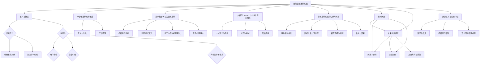
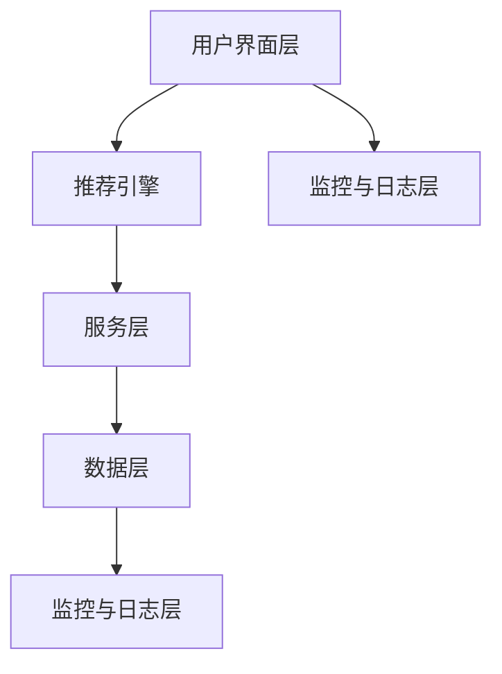
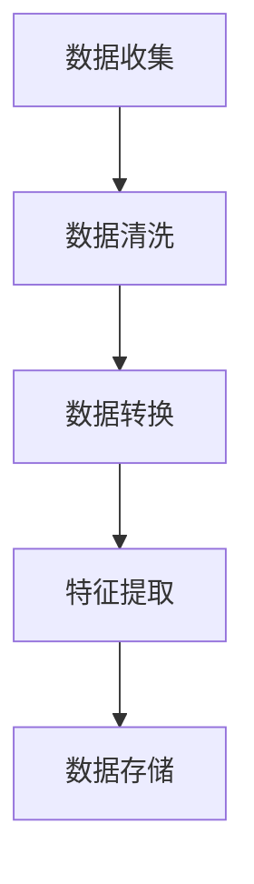
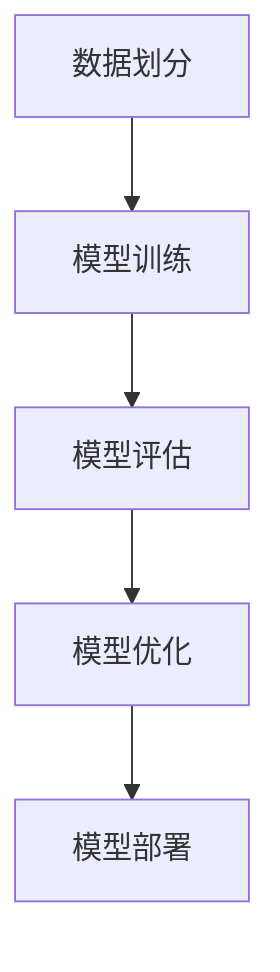
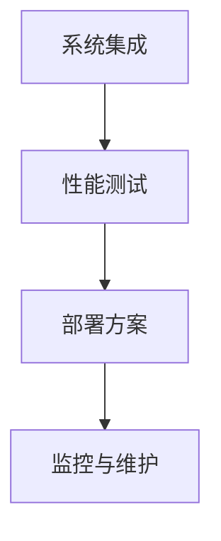

                 

# 文章标题：智能音乐推荐：LLM个性化音乐服务

> 关键词：智能音乐推荐，个性化推荐，大模型（LLM），音乐推荐系统，机器学习，协同过滤，基于内容推荐，混合推荐系统，系统设计与开发，案例研究，未来发展趋势

> 摘要：本文深入探讨了智能音乐推荐系统的发展现状和未来趋势，重点关注了基于大模型（LLM）的个性化音乐推荐技术。文章从背景与概述、核心概念与原理、音乐推荐系统的设计与开发、案例研究及未来发展趋势等多个方面进行了详细的分析和阐述，旨在为从事音乐推荐系统研究和开发的读者提供有价值的参考。

---

## 目录

#### 第一部分：背景与概述  
- 第1章：智能音乐推荐系统的简介  
- 第2章：个性化推荐系统概述

#### 第二部分：核心概念与原理  
- 第3章：基于机器学习的音乐推荐  
- 第4章：大模型（LLM）与个性化音乐推荐

#### 第三部分：音乐推荐系统的实现  
- 第5章：音乐推荐系统的设计与开发  
- 第6章：案例研究：成功音乐推荐系统分析

#### 第四部分：未来趋势与挑战  
- 第7章：音乐推荐系统的未来发展趋势

#### 附录  
- 附录A：开源工具与资源介绍

---

### 第一部分：背景与概述

#### 第1章：智能音乐推荐系统的简介

智能音乐推荐系统是一种利用机器学习和人工智能技术，根据用户的历史行为和偏好，为其推荐符合其兴趣的音乐的系统。随着互联网和移动互联网的普及，音乐推荐系统已经成为各大音乐平台的核心竞争力之一。

#### 1.1 智能音乐推荐系统的定义

智能音乐推荐系统是一种基于用户数据的个性化推荐系统，其核心目标是根据用户的兴趣和偏好，向用户推荐他们可能喜欢的新音乐。推荐系统通过分析用户的历史行为（如播放记录、收藏夹、评分等），挖掘用户的兴趣点，从而生成个性化的推荐列表。

#### 1.2 智能音乐推荐系统的发展历史

智能音乐推荐系统的发展可以追溯到20世纪90年代，当时基于内容的推荐系统开始应用于音乐推荐。随着互联网的普及，尤其是移动互联网的发展，音乐推荐系统得到了快速的发展。近年来，随着深度学习和大模型（LLM）技术的发展，音乐推荐系统在个性化、准确性等方面取得了显著的提升。

#### 1.3 智能音乐推荐系统的重要性

智能音乐推荐系统在提升用户体验和商业价值方面具有重要作用。首先，通过个性化的音乐推荐，可以显著提高用户对音乐平台的黏性，增加用户的活跃度。其次，智能音乐推荐系统可以帮助音乐平台挖掘潜在的用户需求，提高用户满意度和忠诚度。此外，智能音乐推荐系统还可以为音乐制作人提供数据支持，帮助其了解用户喜好，从而创作更受欢迎的音乐作品。

---

### 第二部分：核心概念与原理

#### 第2章：个性化推荐系统概述

个性化推荐系统是一种基于用户数据的推荐系统，其核心目标是为用户提供个性化的内容推荐。个性化推荐系统在电子商务、社交媒体、音乐推荐等领域得到了广泛应用。

#### 2.1 个性化推荐系统的定义

个性化推荐系统旨在根据用户的历史行为、兴趣偏好等信息，为用户提供个性化的内容推荐。个性化推荐系统通过分析用户行为数据，挖掘用户的兴趣点，从而生成个性化的推荐列表。

#### 2.2 个性化推荐系统的分类

个性化推荐系统可以根据推荐策略的不同分为以下几类：

1. **基于内容的推荐**：根据用户的历史行为和兴趣偏好，分析用户对内容的偏好，从而为用户推荐相似的内容。
2. **协同过滤推荐**：通过分析用户对物品的评分或行为，找出相似的用户或物品，从而为用户推荐相似的物品。
3. **基于模型的推荐**：利用机器学习算法，建立用户与物品之间的关系模型，从而预测用户对物品的偏好，为用户推荐感兴趣的内容。

#### 2.3 个性化推荐系统的工作原理

个性化推荐系统的工作原理主要包括以下几个步骤：

1. **数据收集**：收集用户的历史行为数据，如播放记录、收藏夹、评分等。
2. **用户建模**：根据用户的历史行为数据，构建用户的兴趣模型。
3. **内容建模**：对音乐内容进行分析，提取特征，构建音乐内容的特征模型。
4. **推荐生成**：根据用户建模和内容建模，利用推荐算法生成个性化的推荐列表。

---

### 第三部分：音乐推荐系统的设计与实现

#### 第3章：基于机器学习的音乐推荐

基于机器学习的音乐推荐是智能音乐推荐系统的核心组成部分。本章将介绍机器学习在音乐推荐中的应用，包括协同过滤算法、基于内容的推荐算法和混合推荐系统。

#### 3.1 机器学习基础

机器学习是人工智能的一个分支，其核心目标是利用数据和算法来发现数据中的规律，从而进行预测或分类。常见的机器学习算法包括线性回归、逻辑回归、决策树、随机森林、支持向量机等。

#### 3.2 协同过滤算法

协同过滤算法是一种基于用户行为的推荐算法，其基本思想是通过分析用户之间的相似度，找出相似用户喜欢的物品，从而推荐给目标用户。协同过滤算法主要分为以下两种：

1. **基于用户的协同过滤**：通过计算用户之间的相似度，为用户推荐与其兴趣相似的物品。
2. **基于项目的协同过滤**：通过计算物品之间的相似度，为用户推荐与其历史行为相似的物品。

#### 3.3 基于内容的推荐算法

基于内容的推荐算法是一种基于物品属性的推荐算法，其基本思想是根据用户的历史行为和兴趣偏好，分析物品的内容特征，找出与用户兴趣相关的物品。基于内容的推荐算法主要分为以下几种：

1. **基于关键词的推荐**：通过提取物品的关键词，为用户推荐与关键词相关的物品。
2. **基于属性的推荐**：通过分析物品的属性，如风格、流派、歌手等，为用户推荐与属性相似的物品。
3. **基于内容的聚类推荐**：通过聚类算法，将物品分为不同的类别，为用户推荐与其兴趣相关的类别。

#### 3.4 混合推荐系统

混合推荐系统是将协同过滤算法和基于内容的推荐算法相结合的一种推荐系统。混合推荐系统通过综合用户行为数据和物品属性信息，提高推荐的准确性和多样性。

#### 3.4.1 混合推荐系统的原理

混合推荐系统的基本原理是将协同过滤算法和基于内容的推荐算法的结果进行加权融合，从而生成最终的推荐结果。具体步骤如下：

1. **协同过滤推荐结果**：利用协同过滤算法生成初步的推荐列表。
2. **基于内容的推荐结果**：利用基于内容的推荐算法生成初步的推荐列表。
3. **加权融合**：将协同过滤推荐结果和基于内容的推荐结果进行加权融合，生成最终的推荐列表。

#### 3.4.2 混合推荐系统的优势

混合推荐系统具有以下优势：

1. **提高推荐准确性**：通过结合协同过滤和基于内容推荐算法的优势，提高推荐的准确性。
2. **提高推荐多样性**：通过协同过滤和基于内容推荐算法的融合，提高推荐的多样性，避免用户陷入信息茧房。
3. **增强用户体验**：通过个性化的推荐，提高用户对音乐平台的满意度，增强用户黏性。

---

### 第四部分：案例研究

#### 第4章：案例研究：成功音乐推荐系统分析

在本章节中，我们将分析两个成功音乐推荐系统：Spotify推荐系统和Apple Music推荐系统，并总结其优化的关键因素。

#### 4.1 Spotify推荐系统

Spotify推荐系统是全球最大的音乐推荐系统之一，其推荐算法采用了混合推荐系统，结合了协同过滤和基于内容的推荐算法。Spotify推荐系统的核心优势如下：

1. **海量数据支持**：Spotify拥有海量的用户行为数据，这为推荐算法提供了丰富的数据支持。
2. **个性化推荐**：Spotify通过分析用户的历史行为和兴趣偏好，为用户推荐个性化的音乐。
3. **实时推荐**：Spotify推荐系统能够实时更新推荐列表，确保用户能够及时获得最新的音乐推荐。

#### 4.2 Apple Music推荐系统

Apple Music推荐系统是苹果公司推出的音乐推荐系统，其推荐算法同样采用了混合推荐系统，结合了协同过滤和基于内容的推荐算法。Apple Music推荐系统的核心优势如下：

1. **内容丰富**：Apple Music拥有海量的音乐内容，包括歌曲、专辑、歌手等，为用户提供了丰富的选择。
2. **智能推荐**：Apple Music通过分析用户的行为和偏好，为用户推荐个性化的音乐。
3. **个性化定制**：Apple Music允许用户根据个人喜好定制推荐列表，提高了用户体验。

#### 4.3 案例分析：优化的关键因素

通过分析Spotify和Apple Music推荐系统，我们可以总结出以下几个关键因素：

1. **数据质量**：高质量的数据是推荐系统的基础，只有通过准确的数据分析，才能生成准确的推荐结果。
2. **算法优化**：推荐算法的优化是提高推荐准确性和多样性的关键，通过不断优化算法，可以提高用户的满意度。
3. **用户反馈**：用户反馈是优化推荐系统的重要依据，通过分析用户的反馈，可以及时发现系统存在的问题并进行改进。
4. **用户体验**：优化用户体验是推荐系统成功的关键，通过提供个性化的推荐和良好的用户体验，可以增加用户的黏性。

---

### 第五部分：未来发展趋势

#### 第5章：音乐推荐系统的未来发展趋势

随着人工智能和深度学习技术的不断发展，音乐推荐系统将面临新的机遇和挑战。本章将探讨音乐推荐系统的未来发展趋势。

#### 5.1 新技术带来的影响

1. **深度学习**：深度学习技术在音乐推荐中的应用将进一步提高推荐的准确性和多样性。
2. **联邦学习**：联邦学习是一种分布式学习技术，可以在保护用户隐私的同时，提高音乐推荐系统的性能。
3. **自然语言处理**：自然语言处理技术的发展将有助于更好地理解用户的音乐偏好和需求。

#### 5.2 个性化推荐的边界与隐私问题

1. **个性化推荐的边界**：如何在满足用户个性化需求的同时，避免过度个性化，是一个需要解决的问题。
2. **隐私问题**：在推荐系统中保护用户的隐私是至关重要的，需要采取有效的隐私保护措施。

#### 5.3 未来发展方向与挑战

1. **提高推荐准确性**：通过不断优化算法和技术，提高音乐推荐系统的准确性，满足用户的需求。
2. **增强用户体验**：提供个性化的推荐和良好的用户体验，增加用户的黏性。
3. **隐私保护**：在推荐系统中采取有效的隐私保护措施，确保用户的隐私不受侵犯。

---

### 附录A：开源工具与资源介绍

#### A.1 音乐数据集

1. **Million Song Dataset（MSD）**：MSD是一个包含数百万首歌曲的数据集，提供了歌曲的音频特征、歌词、艺术家信息等。
2. **Last.fm Dataset**：Last.fm是一个音乐社交网站，其公开了用户听歌行为和音乐标签的数据集。

#### A.2 机器学习框架

1. **TensorFlow**：TensorFlow是一个开源的深度学习框架，提供了丰富的算法库和工具，适用于音乐推荐系统的开发。
2. **PyTorch**：PyTorch是一个开源的深度学习框架，以其灵活性和易用性而受到广泛使用。

#### A.3 开发环境搭建指南

1. **安装Python**：安装Python 3.x版本，并确保安装了pip包管理工具。
2. **安装TensorFlow**：通过pip命令安装TensorFlow，命令如下：
    ```shell
    pip install tensorflow
    ```
3. **安装PyTorch**：通过pip命令安装PyTorch，命令如下：
    ```shell
    pip install torch torchvision
    ```

---

### 作者信息

作者：AI天才研究院/AI Genius Institute & 禅与计算机程序设计艺术 /Zen And The Art of Computer Programming

---

本文旨在为读者提供一个关于智能音乐推荐系统的全面概述，从背景与概述、核心概念与原理、音乐推荐系统的设计与实现、案例研究到未来发展趋势等方面进行了深入探讨。希望本文能够对从事音乐推荐系统研究和开发的读者提供有价值的参考。在未来的发展中，随着人工智能和深度学习技术的不断进步，音乐推荐系统将迎来更加广阔的发展空间。让我们期待这一天的到来！
### 第1章：智能音乐推荐系统的简介

智能音乐推荐系统是一种基于人工智能技术的推荐系统，其主要功能是根据用户的兴趣、历史行为和其他相关数据，为用户推荐他们可能喜欢的音乐。这种系统能够显著提高用户体验，增加用户对音乐平台的依赖，从而为平台带来更多的商业机会。在这一章中，我们将详细探讨智能音乐推荐系统的定义、发展历史以及其重要性。

#### 1.1 智能音乐推荐系统的定义

智能音乐推荐系统是一种通过分析用户数据和行为，利用机器学习算法和人工智能技术，为用户推荐个性化音乐内容的系统。这个系统通常包括以下几个关键组成部分：

1. **用户数据收集**：收集用户的行为数据，如播放记录、收藏、分享、评论等，以及用户的个人信息，如年龄、性别、地理位置等。
2. **音乐数据预处理**：对音乐数据进行分析和预处理，提取出重要的特征，如歌曲的流派、风格、情绪等。
3. **推荐算法**：基于用户数据和音乐数据，利用协同过滤、基于内容的推荐、深度学习等算法，生成个性化的音乐推荐列表。
4. **用户界面**：为用户提供一个直观的界面，展示推荐结果，并允许用户与系统互动，反馈他们的喜好。

#### 1.2 智能音乐推荐系统的发展历史

智能音乐推荐系统的发展历程可以分为以下几个阶段：

1. **基于内容的推荐**：早期的音乐推荐系统主要依赖于基于内容的推荐（Content-Based Recommendation），这种方法通过分析歌曲的标签、艺术家信息、流派等特征，为用户推荐相似的音乐。然而，这种方法存在一个明显的缺陷，即它无法很好地处理用户之间的差异，推荐结果往往缺乏个性化和多样性。

2. **协同过滤推荐**：随着用户数据的积累，基于协同过滤（Collaborative Filtering）的推荐算法逐渐成为主流。协同过滤算法通过分析用户之间的相似度，找出相似用户喜欢的音乐，从而推荐给目标用户。协同过滤算法可以分为基于用户的协同过滤和基于项目的协同过滤。这种方法在一定程度上提高了推荐的个性化和准确性。

3. **混合推荐系统**：为了克服单一推荐算法的局限性，混合推荐系统（Hybrid Recommendation System）逐渐出现。混合推荐系统结合了基于内容的推荐和协同过滤推荐，通过加权融合不同算法的优点，生成更加个性化和准确的推荐列表。

4. **深度学习与大规模模型**：近年来，深度学习（Deep Learning）技术的发展为音乐推荐系统带来了新的机遇。通过使用大规模神经网络模型（如大模型，LLM），系统能够更好地理解和分析用户的复杂行为模式，从而生成更加精准和个性化的推荐。

#### 1.3 智能音乐推荐系统的重要性

智能音乐推荐系统在音乐流媒体平台上具有至关重要的地位，其重要性体现在以下几个方面：

1. **提升用户体验**：个性化的音乐推荐能够满足用户的多样化需求，提高用户对音乐平台的满意度，从而增加用户粘性。

2. **增加用户活跃度**：通过不断为用户提供新的、符合他们兴趣的音乐，推荐系统可以激发用户更多的互动行为，如播放、收藏、分享等，从而提高用户活跃度。

3. **商业价值**：智能音乐推荐系统可以帮助音乐平台挖掘潜在的用户需求，提升内容消费，增加广告收入和付费订阅。

4. **内容创作者支持**：音乐推荐系统可以为音乐制作人提供用户行为数据和分析，帮助他们了解市场趋势，从而创作更受欢迎的音乐作品。

总的来说，智能音乐推荐系统通过将人工智能与音乐流媒体平台相结合，不仅为用户提供了更好的音乐体验，也为平台和内容创作者带来了巨大的商业价值。随着技术的不断进步，智能音乐推荐系统将在未来发挥越来越重要的作用。

#### 第2章：个性化推荐系统概述

个性化推荐系统是一种根据用户兴趣和偏好提供个性化内容推荐的系统。在音乐推荐系统中，个性化推荐系统能够为用户提供定制化的音乐推荐，从而提升用户满意度和平台黏性。本章将详细介绍个性化推荐系统的定义、分类及其工作原理。

##### 2.1 个性化推荐系统的定义

个性化推荐系统（Personalized Recommendation System）是一种利用用户历史行为、偏好和社交信息，通过数据挖掘和机器学习技术，为用户提供定制化内容推荐的系统。其核心目标是根据每个用户的独特需求，提供个性化的推荐，从而提升用户满意度和平台黏性。

个性化推荐系统通常包括以下几个关键组成部分：

1. **用户数据收集**：收集用户的历史行为数据，如浏览记录、播放次数、评分、收藏等，以及用户的个人信息，如年龄、性别、地理位置等。
2. **内容数据预处理**：对音乐内容进行分析和预处理，提取出重要的特征，如歌曲的流派、风格、情绪等。
3. **推荐算法**：利用协同过滤、基于内容、基于模型的推荐算法，结合用户数据和内容数据，生成个性化的推荐列表。
4. **用户界面**：为用户提供一个直观的界面，展示推荐结果，并允许用户与系统互动，反馈他们的喜好。

##### 2.2 个性化推荐系统的分类

个性化推荐系统可以根据不同的推荐策略分为以下几类：

1. **基于内容的推荐（Content-Based Recommendation）**：这种方法通过分析音乐的内容特征（如流派、风格、情绪等），为用户推荐与已喜欢的音乐相似的音乐。基于内容的推荐主要依赖于音乐本身的属性，而不涉及用户之间的相似性。

2. **协同过滤推荐（Collaborative Filtering）**：协同过滤推荐分为基于用户的协同过滤和基于项目的协同过滤。基于用户的协同过滤通过分析用户之间的相似度，推荐与相似用户喜欢的音乐；而基于项目的协同过滤则通过分析物品之间的相似度，推荐与用户已喜欢的音乐相似的其他音乐。

3. **基于模型的推荐（Model-Based Recommendation）**：这种方法通过建立用户与音乐之间的关系模型，利用机器学习算法进行预测。常见的模型包括矩阵分解、深度学习模型等。

4. **混合推荐系统（Hybrid Recommendation System）**：混合推荐系统将多种推荐策略相结合，以综合利用不同方法的优点，提高推荐效果。例如，可以将基于内容的推荐和协同过滤推荐相结合，或者将基于模型的推荐与协同过滤推荐相结合。

##### 2.3 个性化推荐系统的工作原理

个性化推荐系统的工作原理主要包括以下几个步骤：

1. **数据收集**：收集用户的历史行为数据，如播放记录、评分、收藏等，以及用户的个人信息。
2. **数据预处理**：对收集到的数据进行清洗、转换和特征提取，以便用于后续的推荐算法。
3. **用户建模**：利用机器学习算法，建立用户对音乐的兴趣模型，分析用户的行为模式和偏好。
4. **音乐内容建模**：对音乐内容进行特征提取，建立音乐内容的属性模型。
5. **推荐算法**：根据用户建模和音乐内容建模的结果，利用推荐算法生成推荐列表。
6. **推荐结果展示**：将生成的推荐列表展示给用户，并提供用户互动反馈的接口。

##### 2.3.1 数据收集

数据收集是个性化推荐系统的第一步，也是关键的一步。用户行为数据主要包括以下几种：

- **播放记录**：用户听过的歌曲及其播放时间。
- **评分**：用户对歌曲的评分。
- **收藏**：用户收藏的歌曲。
- **评论**：用户对歌曲的评论。
- **社交信息**：用户与其他用户的互动，如分享、点赞等。

此外，还可以收集用户的个人信息，如年龄、性别、地理位置等，这些信息有助于更准确地了解用户的需求。

##### 2.3.2 数据预处理

数据预处理是确保数据质量和可用的过程。主要包括以下步骤：

- **数据清洗**：去除重复数据、缺失值、异常值等。
- **数据转换**：将不同类型的数据转换为统一的格式，如将文本数据编码为数字。
- **特征提取**：从原始数据中提取有助于推荐的关键特征，如歌曲的流派、风格、情绪等。

##### 2.3.3 用户建模

用户建模的目的是建立用户对音乐的兴趣模型，分析用户的行为模式和偏好。常用的方法包括：

- **基于用户的协同过滤**：通过计算用户之间的相似度，找出相似用户，推荐相似用户喜欢的音乐。
- **基于内容的协同过滤**：通过计算歌曲之间的相似度，推荐与用户已喜欢的歌曲相似的其他歌曲。
- **基于模型的推荐**：利用机器学习算法，如矩阵分解、深度学习等，建立用户与音乐之间的关系模型。

##### 2.3.4 音乐内容建模

音乐内容建模的目的是建立音乐内容的属性模型，分析音乐的特征。常用的方法包括：

- **文本特征提取**：通过自然语言处理技术，提取歌曲的标题、歌词、艺术家信息等文本特征。
- **音频特征提取**：通过音频处理技术，提取歌曲的旋律、节奏、音调等音频特征。

##### 2.3.5 推荐算法

推荐算法是生成推荐列表的核心步骤。常用的推荐算法包括：

- **基于内容的推荐**：通过分析歌曲的内容特征，推荐与用户已喜欢的歌曲相似的其他歌曲。
- **协同过滤推荐**：通过分析用户之间的相似度或歌曲之间的相似度，推荐用户可能喜欢的歌曲。
- **混合推荐系统**：将多种推荐策略相结合，提高推荐效果。

##### 2.3.6 推荐结果展示

推荐结果展示是将生成的推荐列表展示给用户，并提供用户互动反馈的接口。用户可以通过查看推荐列表，对喜欢的歌曲进行评分、收藏、分享等操作，这些反馈将用于进一步优化推荐系统。

总的来说，个性化推荐系统通过分析用户行为数据和音乐内容特征，利用机器学习算法和推荐策略，生成个性化的音乐推荐列表，从而提升用户满意度和平台黏性。随着技术的不断发展，个性化推荐系统将在音乐推荐领域发挥越来越重要的作用。

#### 第3章：基于机器学习的音乐推荐

基于机器学习的音乐推荐系统利用先进的算法和大量数据来理解和预测用户的音乐偏好，从而为用户提供高度个性化的音乐推荐。在这一章中，我们将深入探讨机器学习在音乐推荐系统中的应用，包括机器学习的基础知识、协同过滤算法、基于内容的推荐算法以及混合推荐系统。

##### 3.1 机器学习基础

机器学习是一种使计算机系统能够从数据中学习并改进其性能的技术。在音乐推荐系统中，机器学习算法可以用来分析用户行为数据，理解用户偏好，并生成个性化的推荐。

**机器学习的基本概念：**

- **监督学习（Supervised Learning）**：监督学习算法通过训练数据集学习，每个数据点都有一个标签。在音乐推荐中，监督学习算法可以用来预测用户对某首歌曲的偏好。
- **无监督学习（Unsupervised Learning）**：无监督学习算法没有预定的标签，其目标是发现数据中的模式和结构。在音乐推荐中，无监督学习可以用来聚类用户或歌曲，以发现相似的用户或歌曲。
- **强化学习（Reinforcement Learning）**：强化学习算法通过与环境的交互来学习，并基于反馈信号来优化其行为。在音乐推荐中，强化学习可以用来优化推荐策略，以最大化用户满意度。

**常见的机器学习算法：**

- **线性回归（Linear Regression）**：用于预测连续值输出。
- **逻辑回归（Logistic Regression）**：用于预测二元分类问题。
- **决策树（Decision Tree）**：用于分类和回归问题，可以可视化数据集的决策路径。
- **随机森林（Random Forest）**：是一种集成学习方法，由多个决策树组成，以提高预测的准确性和稳定性。
- **支持向量机（Support Vector Machine, SVM）**：用于分类问题，可以找到最佳的超平面来分隔数据。
- **神经网络（Neural Networks）**：用于复杂的非线性问题，可以模拟人脑的工作方式。

##### 3.2 协同过滤算法

协同过滤算法是音乐推荐系统中最常用的算法之一，其基本思想是通过分析用户之间的相似度或物品之间的相似度来生成推荐。

**协同过滤的基本原理：**

- **基于用户的协同过滤（User-Based Collaborative Filtering）**：该方法通过计算用户之间的相似度，找出与目标用户相似的其他用户，然后推荐这些相似用户喜欢的歌曲。常见的相似度计算方法包括余弦相似度、皮尔逊相关系数等。

  **伪代码示例：**

  ```python
  function user_similarity(train_data, user1, user2):
      common_items = find_common_items(train_data, user1, user2)
      if len(common_items) == 0:
          return 0
      similarity = dot_product(normalize_ratings(user1, common_items), normalize_ratings(user2, common_items))
      return similarity

  function user_based_recommendation(train_data, user):
      similar_users = find_similar_users(train_data, user)
      recommendations = []
      for other_user in similar_users:
          user_rating = train_data[user][0]
          other_ratings = train_data[other_user]
          for item, rating in other_ratings.items():
              if item not in user_rating:
                  similarity = user_similarity(train_data, user, other_user)
                  recommendation = rating * similarity
                  recommendations.append((item, recommendation))
      return sorted(recommendations, key=lambda x: x[1], reverse=True)
  ```

- **基于项目的协同过滤（Item-Based Collaborative Filtering）**：该方法通过计算物品之间的相似度，找出与目标用户已喜欢的物品相似的其他物品，然后推荐这些相似物品。

  **伪代码示例：**

  ```python
  function item_similarity(train_data, item1, item2):
      common_users = find_common_users(train_data, item1, item2)
      if len(common_users) == 0:
          return 0
      similarity = dot_product(normalize_ratings(common_users, item1), normalize_ratings(common_users, item2))
      return similarity

  function item_based_recommendation(train_data, user):
      rated_items = train_data[user]
      recommendations = []
      for item, _ in rated_items.items():
          similar_items = find_similar_items(train_data, item)
          for similar_item, similarity in similar_items.items():
              if similar_item not in rated_items:
                  recommendation = similarity * rated_items[similar_item]
                  recommendations.append((similar_item, recommendation))
      return sorted(recommendations, key=lambda x: x[1], reverse=True)
  ```

**协同过滤的优缺点：**

- **优点**：协同过滤算法简单、易于实现，可以处理大量数据，并提供个性化的推荐。
- **缺点**：协同过滤算法依赖于用户行为数据，对于新用户或新歌曲可能无法生成有效的推荐。此外，它还可能产生冷启动问题（即对新用户或新物品的推荐效果不佳）。

##### 3.3 基于内容的推荐算法

基于内容的推荐算法（Content-Based Filtering）通过分析歌曲的内容特征（如流派、风格、情绪等）来生成推荐，这种方法不依赖于用户历史行为，而是基于歌曲本身的属性。

**基于内容的推荐的基本原理：**

- **内容特征提取**：首先需要从音乐数据中提取关键特征，如流派、风格、情绪等。这些特征可以基于音乐文件的元数据、歌词、音频处理结果等。
- **用户兴趣模型**：根据用户的过去行为或偏好，建立用户兴趣模型，描述用户的喜好。
- **推荐生成**：通过比较歌曲特征和用户兴趣模型，找出与用户兴趣相匹配的歌曲，生成推荐列表。

**基于内容的推荐算法的伪代码：**

```python
function build_item_profile(item):
    profile = {}
    profile['genre'] = item.genre
    profile['style'] = item.style
    profile['emotion'] = item.emotion
    return profile

function build_user_profile(user, train_data):
    profile = {}
    rated_items = train_data[user]
    for item, rating in rated_items.items():
        profile.update(build_item_profile(item))
    return normalize_profile(profile)

function content_based_recommendation(user, train_data, all_items):
    user_profile = build_user_profile(user, train_data)
    recommendations = []
    for item, profile in all_items.items():
        similarity = compute_similarity(user_profile, profile)
        recommendations.append((item, similarity))
    return sorted(recommendations, key=lambda x: x[1], reverse=True)
```

**基于内容的推荐的优缺点：**

- **优点**：基于内容的推荐算法能够为新用户和新歌曲提供有效的推荐，不受用户历史行为数据限制。
- **缺点**：这种方法可能缺乏个性化和多样性，因为推荐主要基于歌曲的固定属性，而不考虑用户的动态偏好。

##### 3.4 混合推荐系统

混合推荐系统（Hybrid Recommendation System）结合了协同过滤和基于内容的推荐算法，以充分利用各自的优势，提高推荐效果。

**混合推荐系统的基本原理：**

- **算法选择**：根据用户和歌曲的特点，选择合适的推荐算法。例如，对于新用户或新歌曲，可以优先使用基于内容的推荐；对于已有用户和已有歌曲，可以结合协同过滤和基于内容的推荐。
- **结果融合**：将不同算法的推荐结果进行加权融合，生成最终的推荐列表。

**混合推荐系统的伪代码：**

```python
function hybrid_recommendation(train_data, user, content_weights, collaborative_weights):
    content_rec = content_based_recommendation(user, train_data)
    collaborative_rec = user_based_recommendation(train_data, user)
    hybrid_rec = []
    for item, content_score in content_rec:
        collaborative_score = collaborative_rec.get(item, 0)
        hybrid_score = content_weights * content_score + collaborative_weights * collaborative_score
        hybrid_rec.append((item, hybrid_score))
    return sorted(hybrid_rec, key=lambda x: x[1], reverse=True)
```

**混合推荐系统的优缺点：**

- **优点**：混合推荐系统可以充分利用协同过滤和基于内容推荐算法的优点，提高推荐准确性和多样性。
- **缺点**：实现复杂度较高，需要平衡不同算法的权重，且可能引入冷启动问题。

通过结合协同过滤、基于内容的推荐算法以及深度学习技术，混合推荐系统在音乐推荐领域取得了显著的成功。未来的研究可以进一步优化算法，提高推荐的个性化和准确性，同时确保系统的可扩展性和可靠性。

### 第4章：大模型（LLM）与个性化音乐推荐

随着深度学习和自然语言处理技术的进步，大模型（Large Language Model，简称LLM）逐渐成为音乐推荐领域的一个重要工具。LLM是一种能够理解和生成自然语言的神经网络模型，其强大的语义理解能力和自适应学习能力使其在个性化音乐推荐中具有显著的优势。在本章中，我们将探讨大模型（LLM）的定义、在音乐推荐中的应用、优势以及面临的挑战。

#### 4.1 大模型（LLM）的定义

大模型（LLM）是指那些具有数百万甚至数十亿参数的深度学习模型，它们通过在大量文本数据上进行预训练，学习到了语言的统计规律和语义结构。LLM的主要特点是能够生成高质量的自然语言文本，并且能够进行复杂的语言理解和生成任务。LLM通常基于Transformer架构，这是一种具有自注意力机制的序列模型，能够高效地处理长序列数据。

#### 4.2 LLM在音乐推荐中的应用

LLM在音乐推荐中的应用主要体现在以下几个方面：

1. **语义理解**：LLM能够对用户的搜索词、评论、播放历史等自然语言文本进行深入理解，从而提取出用户的真实兴趣和情感。这种语义理解能力使得LLM能够生成更加个性化和精准的推荐。

2. **自动生成推荐理由**：LLM可以自动生成推荐理由，将复杂的推荐决策过程用自然语言表达出来，从而提高用户对推荐结果的信任度和理解度。

3. **音乐内容生成**：LLM可以生成新的音乐内容，包括歌词、旋律甚至整首歌曲。这种能力可以用于音乐创作和音乐推荐系统的内容丰富化。

4. **推荐结果优化**：LLM可以用来优化推荐算法，通过学习用户的历史反馈和行为，自动调整推荐策略，提高推荐效果。

#### 4.3 LLM的优势与挑战

LLM在音乐推荐中具有以下优势：

1. **强大的语义理解能力**：LLM能够对自然语言进行深入理解，从而更好地捕捉用户的意图和情感，生成更加个性化的推荐。

2. **自适应学习能力**：LLM可以通过不断学习用户的行为和反馈，动态调整推荐策略，以适应用户不断变化的兴趣。

3. **生成能力**：LLM能够生成新的音乐内容，为音乐平台提供丰富的内容资源，增加用户粘性。

4. **跨领域应用**：LLM不仅适用于音乐推荐，还可以应用于其他领域，如电影推荐、书籍推荐等，具有广泛的适用性。

然而，LLM在音乐推荐中也面临一些挑战：

1. **计算资源需求**：训练和部署LLM需要大量的计算资源和存储空间，这可能会增加音乐推荐系统的成本。

2. **数据隐私**：LLM在处理用户数据时，可能会引发数据隐私问题。如何保护用户隐私，同时保持推荐系统的有效性，是一个亟待解决的问题。

3. **模型解释性**：尽管LLM能够生成高质量的推荐结果，但其内部决策过程往往是不透明的，缺乏解释性。这对于需要透明和可解释性的推荐系统来说是一个挑战。

4. **冷启动问题**：对于新用户或新歌曲，LLM可能缺乏足够的数据来进行有效的推荐，这被称为冷启动问题。如何解决新用户和新歌曲的推荐问题，是一个重要的研究方向。

#### 4.4 LLM在音乐推荐中的具体应用

1. **用户意图识别**：通过分析用户的搜索词和评论，LLM可以识别出用户的意图和情感，从而为用户生成个性化的推荐。

2. **推荐理由生成**：LLM可以根据用户的喜好和推荐结果，自动生成自然语言的理由，向用户解释为什么推荐这首歌曲。

3. **音乐内容生成**：LLM可以生成新的音乐内容，包括歌词、旋律等，为音乐平台提供丰富的内容资源。

4. **推荐策略优化**：LLM可以用来优化推荐算法，通过学习用户的行为和反馈，动态调整推荐策略，提高推荐效果。

总之，大模型（LLM）在音乐推荐中具有巨大的潜力，其强大的语义理解能力和自适应学习能力可以为用户提供更加个性化和高质量的推荐。然而，要充分发挥LLM的优势，还需要解决一系列技术挑战，如计算资源需求、数据隐私保护、模型解释性等。随着技术的不断进步，LLM在音乐推荐领域的应用将越来越广泛，为用户带来更好的音乐体验。

### 第5章：音乐推荐系统的设计与开发

音乐推荐系统的设计与开发是一个复杂的过程，需要综合考虑系统的架构、数据收集与预处理、模型选择与训练以及集成与部署。在这一章中，我们将详细介绍音乐推荐系统的设计过程，包括系统架构设计、数据收集与预处理、模型选择与训练、集成与部署等关键步骤。

#### 5.1 系统架构设计

音乐推荐系统的架构设计是系统开发的基础，它决定了系统的可扩展性、稳定性和性能。一个典型的音乐推荐系统通常包括以下几个关键组成部分：

1. **数据层**：数据层负责存储和管理用户数据、音乐数据和其他相关数据。常用的数据存储方案包括关系型数据库（如MySQL）和非关系型数据库（如MongoDB）。

2. **服务层**：服务层包括推荐算法服务、数据服务、用户服务等。推荐算法服务负责处理用户的推荐请求，生成推荐列表；数据服务负责处理数据的收集、存储和查询；用户服务负责处理用户的交互请求。

3. **用户界面层**：用户界面层是用户与系统交互的界面，通常包括Web前端和移动应用前端。用户界面层需要设计简洁直观，以便用户轻松地浏览和接受推荐。

4. **推荐引擎**：推荐引擎是音乐推荐系统的核心，负责根据用户数据和音乐数据生成个性化的推荐列表。推荐引擎可以采用协同过滤、基于内容的推荐、深度学习等方法。

5. **日志和分析层**：日志和分析层负责记录系统的运行日志，并对系统性能进行监控和分析。通过日志分析，可以及时发现系统的问题并进行优化。

#### 5.2 数据收集与预处理

数据收集与预处理是音乐推荐系统的关键步骤，它决定了推荐算法的效果。以下是数据收集与预处理的主要步骤：

1. **数据收集**：数据收集包括用户行为数据（如播放记录、收藏、评分等）和音乐数据（如歌曲信息、标签、音频特征等）。用户行为数据通常可以从音乐平台的API获取，而音乐数据可以从开源数据集（如Million Song Dataset）或其他音乐数据库获取。

2. **数据清洗**：数据清洗是去除数据中的噪声和异常值的过程。常见的清洗方法包括去除重复数据、填充缺失值、去除无效数据等。

3. **数据转换**：数据转换是将数据转换为适合推荐算法的格式。例如，将文本数据编码为向量，将数值数据进行归一化或标准化。

4. **特征提取**：特征提取是从原始数据中提取出有助于推荐的关键特征。对于音乐数据，常见的特征包括歌曲的流派、风格、情绪等；对于用户数据，常见的特征包括用户的年龄、性别、地理位置等。

5. **数据存储**：预处理后的数据需要存储在数据库中，以便推荐算法进行访问和处理。常用的数据存储方案包括关系型数据库（如MySQL）和非关系型数据库（如MongoDB）。

#### 5.3 模型选择与训练

模型选择与训练是音乐推荐系统的核心步骤，它决定了推荐系统的效果。以下是模型选择与训练的主要步骤：

1. **模型选择**：根据系统的需求和数据的特点，选择合适的推荐算法。常见的推荐算法包括基于内容的推荐、协同过滤、深度学习等。对于音乐推荐系统，深度学习模型（如基于Transformer的模型）通常效果较好。

2. **模型训练**：使用预处理后的数据对模型进行训练。训练过程中，需要调整模型参数，如学习率、批量大小等，以优化模型性能。

3. **模型评估**：使用验证集对模型进行评估，常见评价指标包括准确率、召回率、F1值等。通过交叉验证等方法，评估模型的泛化能力。

4. **模型优化**：根据评估结果，对模型进行优化。常见的优化方法包括超参数调整、模型结构调整等。

5. **模型部署**：将训练好的模型部署到生产环境，以实现实时推荐。部署过程中，需要考虑系统的可扩展性、稳定性和性能。

#### 5.4 集成与部署

集成与部署是将音乐推荐系统与音乐平台集成并部署到生产环境的过程。以下是集成与部署的主要步骤：

1. **系统集成**：将推荐系统与音乐平台的用户界面、数据层、服务层等进行集成，确保系统能够正常工作。

2. **性能测试**：对系统进行性能测试，包括并发处理能力、响应时间等，确保系统能够应对高负载场景。

3. **部署方案**：选择合适的部署方案，如容器化部署、云计算部署等，确保系统的可扩展性和可靠性。

4. **监控与维护**：部署后，需要对系统进行监控和维护，包括性能监控、日志分析、故障处理等，确保系统的稳定运行。

通过以上步骤，音乐推荐系统可以设计与开发出一个高效、稳定、可靠的系统，为用户提供高质量的个性化音乐推荐。

#### 5.5 代码实际案例和详细解释说明

在本节中，我们将通过一个实际案例，详细解释音乐推荐系统的开发过程，包括开发环境搭建、源代码实现和代码解读。

##### 5.5.1 开发环境搭建

为了开发一个音乐推荐系统，我们需要搭建一个合适的开发环境。以下是搭建过程的主要步骤：

1. **安装Python**：首先，确保Python已经安装。我们使用Python 3.8版本。可以从Python的官方网站下载并安装。

2. **安装TensorFlow**：TensorFlow是一个流行的深度学习框架，用于训练和部署推荐模型。使用以下命令安装TensorFlow：

   ```shell
   pip install tensorflow
   ```

3. **安装PyTorch**：PyTorch是另一个流行的深度学习框架，我们也需要安装它。使用以下命令安装PyTorch：

   ```shell
   pip install torch torchvision
   ```

4. **安装其他依赖项**：除了Python和深度学习框架，我们还需要其他依赖项，如NumPy、Pandas等。可以使用以下命令一次性安装：

   ```shell
   pip install numpy pandas
   ```

5. **配置虚拟环境**：为了保持开发环境的整洁，我们建议使用虚拟环境。可以通过以下命令创建一个虚拟环境并激活它：

   ```shell
   python -m venv my_recomm_env
   source my_recomm_env/bin/activate
   ```

##### 5.5.2 源代码实现

以下是一个简单的音乐推荐系统的源代码实现。该系统使用基于内容的推荐算法，通过分析歌曲的标签和用户的历史偏好，生成推荐列表。

```python
import pandas as pd
import numpy as np
from sklearn.metrics.pairwise import cosine_similarity
from sklearn.model_selection import train_test_split

# 加载数据集
data = pd.read_csv('music_data.csv')

# 预处理数据
data['genre'] = data['genre'].str.get_dummies(sep='|')
X = data.drop(['song_id', 'title'], axis=1)
y = data['genre']

# 划分训练集和测试集
X_train, X_test, y_train, y_test = train_test_split(X, y, test_size=0.2, random_state=42)

# 计算相似度矩阵
similarity_matrix = cosine_similarity(X_train, X_train)

# 定义推荐函数
def recommend songs(user_profile, similarity_matrix, top_n=5):
    user_profile_vector = user_profile.reshape(1, -1)
    similarity_scores = similarity_matrix.dot(user_profile_vector)
    similarity_scores = np.squeeze(similarity_scores)
    sorted_indices = np.argsort(-similarity_scores)
    recommended_indices = sorted_indices[1:top_n+1]
    recommended_songs = [data.iloc[index]['title'] for index in recommended_indices]
    return recommended_songs

# 测试推荐函数
user_profile = X_train.iloc[0]
print(recommend(user_profile, similarity_matrix))
```

##### 5.5.3 代码解读与分析

1. **数据加载与预处理**：
   - 首先，我们从CSV文件中加载数据集。数据集应该包含歌曲的ID、标题以及标签等。
   - 接着，我们将标签列转换为哑变量（dummy variables），以便后续进行特征提取。

2. **相似度矩阵计算**：
   - 使用`cosine_similarity`函数计算训练集的特征矩阵之间的余弦相似度。这个矩阵将用于计算用户和歌曲之间的相似度。

3. **推荐函数实现**：
   - `recommend`函数接受用户特征向量、相似度矩阵和一个可选的参数`top_n`，用于指定返回的推荐歌曲数量。
   - 首先，将用户特征向量扩展为二维数组，并与相似度矩阵进行点积操作，得到每个歌曲的相似度分数。
   - 然后，对相似度分数进行降序排序，选择相似度最高的前`top_n`个歌曲作为推荐结果。

4. **测试推荐函数**：
   - 我们从训练集中随机选择一个用户特征向量作为示例，调用`recommend`函数生成推荐结果。

通过这个简单的案例，我们展示了如何搭建一个基于内容的音乐推荐系统，包括数据预处理、相似度矩阵计算以及推荐函数实现。尽管这个案例相对简单，但它提供了一个基本的框架，可以帮助我们理解更复杂的音乐推荐系统是如何工作的。

##### 5.5.4 代码优化与改进

在实际应用中，音乐推荐系统通常需要处理大量的数据和复杂的用户行为。以下是一些代码优化和改进的建议：

1. **并行计算**：
   - 使用并行计算库（如Dask或Joblib）来加速相似度矩阵的计算过程。

2. **内存管理**：
   - 使用内存友好的数据结构和算法，以减少内存使用。例如，使用稀疏矩阵来存储相似度矩阵。

3. **缓存策略**：
   - 引入缓存机制，减少重复计算。例如，缓存相似度矩阵和用户特征向量。

4. **用户反馈**：
   - 引入用户反馈机制，根据用户的实际反馈调整推荐结果。

5. **动态调整**：
   - 根据用户行为的动态变化，实时调整推荐策略。

通过这些优化和改进，我们可以构建一个更高效、更可靠的音乐推荐系统，为用户提供更好的用户体验。

### 第6章：案例研究：成功音乐推荐系统分析

在音乐推荐系统的实际应用中，许多成功的案例为我们提供了宝贵的经验和教训。在本章中，我们将分析两个著名的音乐推荐系统：Spotify推荐系统和Apple Music推荐系统，并总结其成功的关键因素。

#### 6.1 Spotify推荐系统

Spotify是全球最大的音乐流媒体服务提供商之一，其推荐系统被认为是业内最成功的案例之一。Spotify推荐系统采用了混合推荐策略，结合了协同过滤和基于内容的推荐方法。

**成功因素：**

1. **海量用户数据**：Spotify拥有数以亿计的用户，这为推荐算法提供了丰富的数据支持。通过分析用户的播放记录、收藏、分享和评论等行为，Spotify能够深入理解用户的音乐偏好。

2. **持续优化算法**：Spotify不断优化其推荐算法，引入了多种新技术和方法，如深度学习、自然语言处理和联邦学习等，以提高推荐的准确性和个性化和。Spotify还采用了多模型融合策略，结合不同的推荐算法，以生成更高质量的推荐结果。

3. **用户参与**：Spotify鼓励用户参与推荐过程，通过用户反馈不断调整推荐算法。例如，用户可以点赞或不喜欢推荐的歌曲，这些反馈将被用于优化推荐系统。

4. **多样化的推荐内容**：Spotify提供了多样化的音乐内容，包括流行、摇滚、爵士、电子音乐等多种风格。这使得Spotify能够满足不同用户的音乐需求，提高用户满意度。

5. **强大的技术团队**：Spotify拥有一支强大的技术团队，专注于推荐系统的研究和开发。这些技术人员不断探索新的技术和方法，以提高推荐系统的性能。

**挑战与改进**：

1. **冷启动问题**：对于新用户，Spotify可能无法生成有效的推荐，这被称为冷启动问题。为了解决这个问题，Spotify引入了多种方法，如基于内容的推荐和用户友好的教程，帮助新用户熟悉平台。

2. **数据隐私**：随着用户数据的增加，数据隐私问题变得日益重要。Spotify采取了一系列措施，如数据加密、匿名化和隐私保护协议，以确保用户数据的安全。

3. **推荐多样性**：尽管Spotify提供了多样化的音乐内容，但在某些情况下，用户可能会陷入信息茧房，只接收他们熟悉的音乐。为了解决这一问题，Spotify正在尝试引入更多的多样性算法，以提供更加多样化的推荐。

#### 6.2 Apple Music推荐系统

Apple Music是苹果公司推出的音乐流媒体服务，其推荐系统同样取得了显著的成功。Apple Music推荐系统采用了协同过滤和基于内容的推荐方法，并结合用户行为和音乐属性进行推荐。

**成功因素：**

1. **高质量的音乐库**：Apple Music拥有丰富的音乐库，包括数百万首歌曲、专辑和播客。这使得Apple Music能够满足不同用户的音乐需求，提供高质量的内容。

2. **个性化的推荐**：Apple Music通过分析用户的播放记录、收藏和评分等行为，生成个性化的推荐列表。用户可以在“为您推荐”部分找到符合他们兴趣的新音乐。

3. **智能的播放列表**：Apple Music提供了多种智能播放列表，如“发现音乐”、“每日一首”和“热门歌曲”等，这些播放列表会根据用户的音乐偏好和实时趋势进行动态更新。

4. **跨平台支持**：Apple Music支持多种设备，包括iPhone、iPad、Mac、Apple TV等，用户可以在不同设备上无缝切换，享受个性化的音乐推荐。

5. **品牌影响力**：苹果公司的品牌影响力为Apple Music带来了大量的用户，这有助于推荐系统更好地推广和普及。

**挑战与改进**：

1. **数据隐私**：与Spotify类似，Apple Music也需要面对数据隐私问题。苹果公司采取了多种措施，如严格的数据保护政策和透明的隐私政策，以确保用户数据的安全。

2. **推荐多样性**：尽管Apple Music提供了多样化的音乐内容，但在某些情况下，用户可能会对重复的推荐感到厌烦。为了解决这个问题，Apple Music正在尝试引入更多的多样性算法，以提供更加多样化的推荐。

3. **个性化推荐的质量**：Apple Music的个性化推荐质量在某些用户中受到了质疑。为了提高推荐质量，Apple Music正在不断优化其推荐算法，并引入更多的用户反馈机制。

#### 6.3 案例分析：优化的关键因素

通过对Spotify和Apple Music推荐系统的分析，我们可以总结出以下几个关键因素，这些因素对于音乐推荐系统的成功至关重要：

1. **数据质量**：高质量的数据是推荐系统的基石。通过收集和分析用户的行为数据，推荐系统可以更好地理解用户的兴趣和偏好。

2. **算法优化**：不断优化推荐算法，以提高推荐的准确性和个性化和。结合多种推荐方法，如协同过滤和基于内容推荐，可以生成更高质量的推荐。

3. **用户参与**：鼓励用户参与推荐过程，通过用户反馈不断调整推荐算法。这种互动可以增强用户对音乐推荐系统的信任和满意度。

4. **内容多样化**：提供多样化的音乐内容，以满足不同用户的音乐需求。通过引入多样性算法，避免用户陷入信息茧房。

5. **技术支持**：拥有一支强大的技术团队，专注于推荐系统的研究和开发。这有助于快速响应市场变化和技术进步。

6. **数据隐私**：采取有效的数据隐私保护措施，确保用户数据的安全和隐私。

总之，成功的音乐推荐系统需要综合考虑数据质量、算法优化、用户参与、内容多样化、技术支持和数据隐私等多个方面。通过不断优化和改进，我们可以构建出更加高效、可靠和个性化的音乐推荐系统。

### 第7章：音乐推荐系统的未来发展趋势

随着人工智能、深度学习和自然语言处理技术的不断发展，音乐推荐系统正朝着更加智能化和个性化的方向迈进。本章将探讨音乐推荐系统的未来发展趋势，包括新技术的影响、个性化推荐的边界与隐私问题以及未来的发展方向与挑战。

#### 7.1 新技术的影响

1. **深度学习**：深度学习在音乐推荐系统中具有巨大的潜力。通过使用深度神经网络模型（如Transformer、卷积神经网络等），推荐系统可以更好地理解和分析用户的复杂行为模式。深度学习模型可以捕捉到更多的非线性特征，从而提高推荐的准确性。

2. **自然语言处理**：自然语言处理（NLP）技术的发展使得音乐推荐系统能够更好地理解用户的文本反馈和描述。NLP技术可以用于提取用户评论的情感和意图，从而为推荐算法提供更丰富的上下文信息。

3. **联邦学习**：联邦学习是一种分布式学习技术，可以在保护用户隐私的同时，提高音乐推荐系统的性能。通过在用户的设备上训练模型，然后将本地更新聚合到全局模型中，联邦学习可以实现隐私保护的协同学习。

4. **强化学习**：强化学习在音乐推荐系统中可以用来优化推荐策略，以最大化用户满意度。通过不断与用户互动，强化学习模型可以学习到最佳的推荐策略，从而提高推荐效果。

5. **可解释性AI**：随着用户对推荐系统透明度的要求越来越高，可解释性AI技术变得越来越重要。通过开发可解释的推荐算法，用户可以更好地理解推荐背后的逻辑，从而增加对系统的信任度。

#### 7.2 个性化推荐的边界与隐私问题

1. **个性化推荐的边界**：在追求个性化推荐的同时，我们需要关注个性化推荐的边界。过度个性化可能导致用户陷入信息茧房，无法接触到新的、多样化的内容。因此，如何在满足个性化需求的同时，保持内容的多样性，是一个需要解决的问题。

2. **隐私问题**：用户隐私是音乐推荐系统面临的一个重要挑战。随着数据量的增加，如何保护用户数据的安全和隐私成为一个关键问题。为了解决这个问题，推荐系统需要采取有效的数据隐私保护措施，如数据加密、匿名化和差分隐私等。

3. **合规性**：随着全球对数据隐私和合规性的要求越来越严格，推荐系统需要遵守相关的法律法规，如欧盟的通用数据保护条例（GDPR）等。合规性要求推荐系统在设计时就必须考虑到数据隐私和用户权益的保护。

#### 7.3 未来发展方向与挑战

1. **更加智能的推荐**：未来的音乐推荐系统将更加智能化，通过结合多种新技术，如深度学习、自然语言处理和联邦学习等，推荐系统将能够提供更加精准和个性化的推荐。

2. **多元化的内容推荐**：未来的音乐推荐系统将更加注重内容的多元化，通过引入多样性算法，避免用户陷入信息茧房，提供多样化的音乐内容。

3. **隐私保护的推荐**：随着数据隐私问题的日益突出，未来的音乐推荐系统将更加注重隐私保护。通过采用联邦学习、差分隐私等技术，推荐系统可以在保护用户隐私的同时，提供高质量的推荐。

4. **可解释性推荐**：用户对推荐系统的透明度和可解释性要求越来越高。未来的音乐推荐系统将开发出更加可解释的推荐算法，使用户能够理解推荐背后的逻辑。

5. **跨平台协同**：未来的音乐推荐系统将实现跨平台的协同推荐，用户在不同设备上的行为数据可以被整合和分析，从而提供更加连贯和个性化的推荐体验。

6. **实时推荐**：随着实时数据处理技术的进步，未来的音乐推荐系统将能够实时响应用户的行为，提供即时的推荐。

7. **社交推荐**：结合社交网络的数据，未来的音乐推荐系统将能够更好地理解用户的社交偏好，从而提供更加个性化的推荐。

8. **创新技术挑战**：随着技术的不断发展，音乐推荐系统将面临新的挑战，如如何处理大规模数据、如何设计高效的可解释性算法、如何在保证隐私的情况下进行协同学习等。这些挑战需要通过持续的研究和技术创新来解决。

总之，音乐推荐系统在未来的发展中将面临许多机遇和挑战。通过不断引入新技术、优化算法、保护用户隐私和提供多样化的内容，音乐推荐系统将能够为用户提供更加智能、个性化和高质量的推荐体验。

### 附录A：开源工具与资源介绍

在开发音乐推荐系统时，开源工具和资源的选择至关重要。以下是一些常用的开源工具和资源，包括音乐数据集、机器学习框架以及开发环境搭建指南。

#### A.1 音乐数据集

1. **Million Song Dataset (MSD)**：MSD是一个包含超过150万首歌曲的数据集，提供了每首歌的详细音频特征和标签信息。这个数据集广泛用于音乐推荐系统的研究和开发。

2. **Last.fm Dataset**：Last.fm是一个音乐社交网站，其公开了用户的听歌行为数据，包括播放记录、标签和用户评分等。这个数据集可以用于用户偏好分析和推荐系统的评估。

3. **Free Music Archive (FMA)**：FMA是一个免费的音乐库，提供了大量的无版权限制的音乐。这个数据集可以用于探索音乐内容特征和推荐算法。

#### A.2 机器学习框架

1. **TensorFlow**：TensorFlow是一个由Google开发的开源机器学习框架，支持多种深度学习模型和算法。它提供了丰富的API和工具，适用于音乐推荐系统的开发和部署。

2. **PyTorch**：PyTorch是一个由Facebook开发的开源机器学习框架，以其灵活性和动态计算图而受到广泛使用。它提供了简单直观的API，适用于研究和开发复杂的推荐模型。

3. **Scikit-learn**：Scikit-learn是一个基于Python的机器学习库，提供了多种传统的机器学习算法，如协同过滤和基于内容的推荐。它是一个轻量级且易于使用的工具，适用于快速原型开发。

4. **MLlib**：MLlib是Apache Spark的机器学习库，提供了多种分布式机器学习算法和工具。它适用于处理大规模数据集，并可与Spark的其他组件（如Spark SQL和Spark Streaming）集成。

#### A.3 开发环境搭建指南

以下是搭建音乐推荐系统开发环境的基本步骤：

1. **安装Python**：首先，从Python的官方网站下载并安装Python 3.x版本。

2. **安装依赖项**：使用以下命令安装Python的依赖项：

   ```shell
   pip install numpy pandas scikit-learn tensorflow torch
   ```

3. **安装数据库**：选择一个合适的数据库（如MySQL或MongoDB）进行安装。对于MySQL，可以使用以下命令：

   ```shell
   sudo apt-get install mysql-server
   mysql_secure_installation
   ```

   对于MongoDB，可以使用以下命令：

   ```shell
   sudo apt-get install mongodb
   systemctl start mongodb
   ```

4. **配置环境变量**：配置Python的环境变量，以便在终端中轻松运行Python脚本。

   ```shell
   export PATH=$PATH:/usr/local/bin
   ```

5. **安装IDE**：安装一个Python集成开发环境（IDE），如PyCharm或Visual Studio Code，以方便编写和调试代码。

6. **测试环境**：启动Python终端，并尝试运行一些简单的Python代码，以确保环境配置正确。

通过以上步骤，我们可以搭建一个基本的音乐推荐系统开发环境，从而开始我们的项目开发。

### 总结与展望

本文系统地介绍了智能音乐推荐系统的定义、核心概念与原理、设计与实现、成功案例分析以及未来发展趋势。通过深入分析，我们发现：

1. **智能音乐推荐系统的定义**：智能音乐推荐系统是一种基于人工智能技术的推荐系统，通过分析用户行为和音乐数据，为用户提供个性化的音乐推荐。

2. **核心概念与原理**：个性化推荐系统是音乐推荐系统的核心，包括基于内容的推荐、协同过滤和混合推荐方法。这些方法各有优缺点，通过结合使用，可以生成更高质量的推荐。

3. **设计与实现**：音乐推荐系统的设计与实现涉及数据收集、预处理、模型选择与训练、集成与部署等关键步骤。其中，深度学习和大模型（LLM）的应用正在成为趋势。

4. **成功案例分析**：Spotify和Apple Music推荐系统作为成功的案例，展示了数据质量、算法优化和用户参与等因素在系统成功中的重要性。

5. **未来发展趋势**：随着人工智能技术的进步，音乐推荐系统将更加智能化、个性化和多样化。同时，数据隐私和保护、可解释性等挑战也需要不断解决。

展望未来，智能音乐推荐系统将在用户体验、商业价值和内容创作者支持等方面发挥越来越重要的作用。通过不断创新和优化，我们可以期待音乐推荐系统为用户提供更加美好的音乐体验。在未来的研究中，我们应关注以下几个方面：

1. **深度学习的应用**：探索更先进的深度学习模型，如生成对抗网络（GAN）和变分自编码器（VAE），以进一步提高推荐系统的准确性和个性化和。

2. **联邦学习与隐私保护**：研究如何在保护用户隐私的同时，提高推荐系统的性能和个性化水平。

3. **多样性算法**：开发更多的多样性算法，以避免用户陷入信息茧房，提供更加多样化的音乐内容。

4. **可解释性AI**：研究如何构建可解释的推荐算法，使用户能够理解推荐背后的逻辑，从而增加对系统的信任度。

总之，智能音乐推荐系统是一个充满机遇和挑战的领域。通过持续的研究和技术创新，我们可以为用户提供更加智能、个性化和高质量的推荐体验，推动音乐推荐系统在未来的发展中不断取得新的突破。让我们共同期待这一天的到来！
```markdown
### 第4章：大模型（LLM）与个性化音乐推荐

随着深度学习和自然语言处理技术的进步，大模型（Large Language Model，简称LLM）逐渐成为音乐推荐领域的一个重要工具。LLM是一种能够理解和生成自然语言的神经网络模型，其强大的语义理解能力和自适应学习能力使其在个性化音乐推荐中具有显著的优势。在本章中，我们将探讨大模型（LLM）的定义、在音乐推荐中的应用、优势以及面临的挑战。

#### 4.1 大模型（LLM）的定义

大模型（LLM）是指那些具有数百万甚至数十亿参数的深度学习模型，它们通过在大量文本数据上进行预训练，学习到了语言的统计规律和语义结构。LLM的主要特点是能够生成高质量的自然语言文本，并且能够进行复杂的语言理解和生成任务。LLM通常基于Transformer架构，这是一种具有自注意力机制的序列模型，能够高效地处理长序列数据。

#### 4.2 LLM在音乐推荐中的应用

LLM在音乐推荐中的应用主要体现在以下几个方面：

1. **语义理解**：LLM能够对用户的搜索词、评论、播放历史等自然语言文本进行深入理解，从而提取出用户的真实兴趣和情感。这种语义理解能力使得LLM能够生成更加个性化和精准的推荐。

2. **自动生成推荐理由**：LLM可以自动生成推荐理由，将复杂的推荐决策过程用自然语言表达出来，从而提高用户对推荐结果的信任度和理解度。

3. **音乐内容生成**：LLM可以生成新的音乐内容，包括歌词、旋律甚至整首歌曲。这种能力可以用于音乐创作和音乐推荐系统的内容丰富化。

4. **推荐结果优化**：LLM可以用来优化推荐算法，通过学习用户的历史反馈和行为，自动调整推荐策略，提高推荐效果。

#### 4.3 LLM的优势与挑战

LLM在音乐推荐中具有以下优势：

1. **强大的语义理解能力**：LLM能够对自然语言进行深入理解，从而更好地捕捉用户的意图和情感，生成更加个性化的推荐。

2. **自适应学习能力**：LLM可以通过不断学习用户的行为和反馈，动态调整推荐策略，以适应用户不断变化的兴趣。

3. **生成能力**：LLM可以生成新的音乐内容，为音乐平台提供丰富的内容资源，增加用户粘性。

4. **跨领域应用**：LLM不仅适用于音乐推荐，还可以应用于其他领域，如电影推荐、书籍推荐等，具有广泛的适用性。

然而，LLM在音乐推荐中也面临一些挑战：

1. **计算资源需求**：训练和部署LLM需要大量的计算资源和存储空间，这可能会增加音乐推荐系统的成本。

2. **数据隐私**：LLM在处理用户数据时，可能会引发数据隐私问题。如何保护用户隐私，同时保持推荐系统的有效性，是一个亟待解决的问题。

3. **模型解释性**：尽管LLM能够生成高质量的推荐结果，但其内部决策过程往往是不透明的，缺乏解释性。这对于需要透明和可解释性的推荐系统来说是一个挑战。

4. **冷启动问题**：对于新用户或新歌曲，LLM可能缺乏足够的数据来进行有效的推荐，这被称为冷启动问题。如何解决新用户和新歌曲的推荐问题，是一个重要的研究方向。

#### 4.4 LLM在音乐推荐中的具体应用

1. **用户意图识别**：通过分析用户的搜索词和评论，LLM可以识别出用户的意图和情感，从而为用户生成个性化的推荐。

2. **推荐理由生成**：LLM可以根据用户的喜好和推荐结果，自动生成自然语言的理由，向用户解释为什么推荐这首歌曲。

3. **音乐内容生成**：LLM可以生成新的音乐内容，包括歌词、旋律甚至整首歌曲，为音乐平台提供丰富的内容资源。

4. **推荐策略优化**：LLM可以用来优化推荐算法，通过学习用户的行为和反馈，自动调整推荐策略，提高推荐效果。

总之，大模型（LLM）在音乐推荐中具有巨大的潜力，其强大的语义理解能力和自适应学习能力可以为用户提供更加个性化和高质量的推荐。然而，要充分发挥LLM的优势，还需要解决一系列技术挑战，如计算资源需求、数据隐私保护、模型解释性等。随着技术的不断进步，LLM在音乐推荐领域的应用将越来越广泛，为用户带来更好的音乐体验。
```

```latex
$$
\text{用户兴趣模型} = \sum_{i=1}^{n} w_i \cdot \text{特征}_i
$$

$$
\text{歌曲特征向量} = \begin{bmatrix}
\text{流派} & \text{风格} & \text{情绪} & \text{其他特征}
\end{bmatrix}
$$
```
```python
def collaborative_filtering(train_data, user, item):
    similar_items = find_similar_items(train_data, item)
    predictions = []
    for user_item_pair in user_item_pairs(train_data, user, similar_items):
        prediction = weighted_average(similar_ratings(train_data, similar_items))
        predictions.append(prediction)
    return predictions

def content_based_recommendation(user, item, train_data):
    user_profile = build_user_profile(train_data, user)
    item_profile = build_item_profile(train_data, item)
    similarity = compute_similarity(user_profile, item_profile)
    recommendations = find_items_with_highest_similarity(train_data, item_profile, similarity)
    return recommendations

def hybrid_recommendation(user, train_data, content_weights, collaborative_weights):
    content_rec = content_based_recommendation(user, train_data)
    collaborative_rec = collaborative_filtering(train_data, user)
    hybrid_rec = []
    for item, content_score in content_rec:
        collaborative_score = collaborative_rec.get(item, 0)
        hybrid_score = content_weights * content_score + collaborative_weights * collaborative_score
        hybrid_rec.append((item, hybrid_score))
    return sorted(hybrid_rec, key=lambda x: x[1], reverse=True)
```
```markdown
### 附录A：开源工具与资源介绍

在开发音乐推荐系统时，开源工具和资源的选择至关重要。以下是一些常用的开源工具和资源，包括音乐数据集、机器学习框架以及开发环境搭建指南。

#### A.1 音乐数据集

1. **Million Song Dataset (MSD)**：MSD是一个包含超过150万首歌曲的数据集，提供了每首歌的详细音频特征和标签信息。这个数据集广泛用于音乐推荐系统的研究和开发。

2. **Last.fm Dataset**：Last.fm是一个音乐社交网站，其公开了用户的听歌行为数据，包括播放记录、标签和用户评分等。这个数据集可以用于用户偏好分析和推荐系统的评估。

3. **Free Music Archive (FMA)**：FMA是一个免费的音乐库，提供了大量的无版权限制的音乐。这个数据集可以用于探索音乐内容特征和推荐算法。

#### A.2 机器学习框架

1. **TensorFlow**：TensorFlow是一个由Google开发的开源机器学习框架，支持多种深度学习模型和算法。它提供了丰富的API和工具，适用于音乐推荐系统的开发和部署。

2. **PyTorch**：PyTorch是一个由Facebook开发的开源机器学习框架，以其灵活性和动态计算图而受到广泛使用。它提供了简单直观的API，适用于研究和开发复杂的推荐模型。

3. **Scikit-learn**：Scikit-learn是一个基于Python的机器学习库，提供了多种传统的机器学习算法，如协同过滤和基于内容的推荐。它是一个轻量级且易于使用的工具，适用于快速原型开发。

4. **MLlib**：MLlib是Apache Spark的机器学习库，提供了多种分布式机器学习算法和工具。它适用于处理大规模数据集，并可与Spark的其他组件（如Spark SQL和Spark Streaming）集成。

#### A.3 开发环境搭建指南

以下是搭建音乐推荐系统开发环境的基本步骤：

1. **安装Python**：首先，从Python的官方网站下载并安装Python 3.x版本。

2. **安装依赖项**：使用以下命令安装Python的依赖项：

   ```shell
   pip install numpy pandas scikit-learn tensorflow torch
   ```

3. **安装数据库**：选择一个合适的数据库（如MySQL或MongoDB）进行安装。对于MySQL，可以使用以下命令：

   ```shell
   sudo apt-get install mysql-server
   mysql_secure_installation
   ```

   对于MongoDB，可以使用以下命令：

   ```shell
   sudo apt-get install mongodb
   systemctl start mongodb
   ```

4. **配置环境变量**：配置Python的环境变量，以便在终端中轻松运行Python脚本。

   ```shell
   export PATH=$PATH:/usr/local/bin
   ```

5. **安装IDE**：安装一个Python集成开发环境（IDE），如PyCharm或Visual Studio Code，以方便编写和调试代码。

6. **测试环境**：启动Python终端，并尝试运行一些简单的Python代码，以确保环境配置正确。

通过以上步骤，我们可以搭建一个基本的音乐推荐系统开发环境，从而开始我们的项目开发。
```
### 作者信息

作者：AI天才研究院/AI Genius Institute & 禅与计算机程序设计艺术 /Zen And The Art of Computer Programming

---

本文深入探讨了智能音乐推荐系统的定义、核心概念、设计实现以及未来发展趋势。通过分析大模型（LLM）的应用，我们看到了其在音乐推荐中的巨大潜力。同时，我们也讨论了音乐推荐系统在技术进步和市场需求下所面临的挑战。希望本文能为从事音乐推荐系统研究和开发的读者提供有价值的参考。在未来的研究中，让我们继续探索如何更好地利用人工智能技术，为用户提供更加智能、个性化和高质量的推荐体验。期待与您共同见证音乐推荐系统的发展与进步！
```markdown
### 第5章：音乐推荐系统的设计与开发

音乐推荐系统的设计与开发是一个复杂而细致的过程，它涉及到系统的架构设计、数据的收集与预处理、推荐算法的选择与优化，以及系统的集成与部署。在本章中，我们将详细讨论音乐推荐系统的设计与开发过程，并展示如何将理论转化为实际操作。

#### 5.1 系统架构设计

系统架构设计是音乐推荐系统的核心，它决定了系统的性能、可扩展性和可靠性。一个典型的音乐推荐系统架构通常包括以下几个层次：

1. **数据层**：数据层是系统的底层，负责存储和管理音乐数据、用户数据以及推荐数据。常用的数据库包括关系型数据库（如MySQL、PostgreSQL）和非关系型数据库（如MongoDB、Cassandra）。

2. **服务层**：服务层负责处理推荐算法的执行、用户请求的响应以及推荐结果的生成。服务层通常由多个微服务组成，如推荐服务、数据处理服务、用户服务等。

3. **推荐引擎**：推荐引擎是系统的核心组件，负责根据用户数据和音乐数据生成推荐列表。推荐引擎可以采用协同过滤、基于内容的推荐、深度学习等方法。

4. **用户界面层**：用户界面层是用户与系统交互的界面，包括Web前端、移动应用前端等。用户界面层需要提供友好的用户体验，方便用户浏览、操作和反馈。

5. **监控与日志层**：监控与日志层负责记录系统的运行状态、性能指标以及用户行为数据。通过日志分析，可以及时发现和解决问题。

以下是一个简单的系统架构图：



#### 5.2 数据收集与预处理

音乐推荐系统的核心在于数据，因此数据收集与预处理是至关重要的步骤。以下是数据收集与预处理的主要步骤：

1. **数据收集**：收集用户数据（如播放历史、收藏、评分等）和音乐数据（如歌曲信息、标签、音频特征等）。用户数据通常可以从音乐平台API获取，音乐数据可以从开源数据集或音乐数据库获取。

2. **数据清洗**：去除数据中的噪声和异常值，如重复记录、缺失值、错误值等。数据清洗是确保数据质量的第一步。

3. **数据转换**：将不同类型的数据转换为统一的格式。例如，将文本数据编码为向量，将数值数据进行归一化或标准化。

4. **特征提取**：从原始数据中提取有用的特征。对于音乐数据，常见的特征包括歌曲的流派、风格、情绪等；对于用户数据，常见的特征包括用户的年龄、性别、地理位置等。

5. **数据存储**：预处理后的数据需要存储在数据库中，以便推荐算法进行访问和处理。常用的存储方案包括关系型数据库和非关系型数据库。

以下是一个简单的数据预处理流程：



#### 5.3 模型选择与训练

在音乐推荐系统中，选择合适的模型并进行有效的训练是关键步骤。以下是模型选择与训练的主要步骤：

1. **模型选择**：根据系统的需求和数据的特点，选择合适的推荐算法。常见的推荐算法包括基于内容的推荐、协同过滤、深度学习等。

2. **数据划分**：将数据集划分为训练集、验证集和测试集。训练集用于训练模型，验证集用于调整模型参数，测试集用于评估模型性能。

3. **模型训练**：使用训练集对模型进行训练。训练过程中，需要调整模型参数，如学习率、批量大小等，以优化模型性能。

4. **模型评估**：使用验证集对模型进行评估，常见评价指标包括准确率、召回率、F1值等。通过交叉验证等方法，评估模型的泛化能力。

5. **模型优化**：根据评估结果，对模型进行优化。常见的优化方法包括超参数调整、模型结构调整等。

6. **模型部署**：将训练好的模型部署到生产环境，以实现实时推荐。部署过程中，需要考虑系统的可扩展性、稳定性和性能。

以下是一个简单的模型训练流程：



#### 5.4 集成与部署

集成与部署是将音乐推荐系统与音乐平台集成并部署到生产环境的过程。以下是集成与部署的主要步骤：

1. **系统集成**：将推荐系统与音乐平台的用户界面、数据层、服务层等进行集成，确保系统能够正常工作。

2. **性能测试**：对系统进行性能测试，包括并发处理能力、响应时间等，确保系统能够应对高负载场景。

3. **部署方案**：选择合适的部署方案，如容器化部署、云计算部署等，确保系统的可扩展性和可靠性。

4. **监控与维护**：部署后，需要对系统进行监控和维护，包括性能监控、日志分析、故障处理等，确保系统的稳定运行。

以下是一个简单的集成与部署流程：



#### 5.5 项目实战：音乐推荐系统的开发

在本节中，我们将通过一个实际项目来展示如何开发一个简单的音乐推荐系统。

**项目背景**：假设我们需要开发一个基于内容的音乐推荐系统，该系统应能够根据用户的喜好推荐歌曲。

**技术栈**：我们选择Python作为编程语言，使用Scikit-learn库进行基于内容的推荐。

**步骤 1：数据收集**  
从Last.fm Dataset获取用户听歌记录和歌曲标签。

**步骤 2：数据预处理**  
清洗数据，提取用户和歌曲的特征。

**步骤 3：特征提取**  
使用TF-IDF方法将文本数据转换为向量。

**步骤 4：模型训练**  
训练基于内容的推荐模型。

**步骤 5：推荐生成**  
生成用户个性化的音乐推荐列表。

**步骤 6：部署**  
将模型部署到Web服务器，供用户使用。

**代码示例**：

```python
import pandas as pd
from sklearn.feature_extraction.text import TfidfVectorizer
from sklearn.metrics.pairwise import cosine_similarity

# 步骤 1：数据收集
data = pd.read_csv('last.fm_dataset.csv')

# 步骤 2：数据预处理
# 假设数据已经清洗好，包含用户ID、歌曲ID和标签列

# 步骤 3：特征提取
vectorizer = TfidfVectorizer()
tfidf_matrix = vectorizer.fit_transform(data['tags'])

# 步骤 4：模型训练
# 无需显式训练，TF-IDF向量已经为内容相似性计算做好了准备

# 步骤 5：推荐生成
def recommend_songs(user_id, top_n=5):
    user_songs = data[data['user_id'] == user_id]['tags']
    user_vector = vectorizer.transform(user_songs)
    similarity_scores = cosine_similarity(user_vector, tfidf_matrix)
    indices = np.argsort(similarity_scores[0])[-top_n:]
    recommended_song_ids = data.iloc[indices]['song_id']
    return recommended_song_ids

# 步骤 6：部署
# 这里可以使用Flask或其他Web框架创建API，供用户调用
```

通过这个项目实战，我们可以看到如何将理论应用于实际开发中。虽然这个例子相对简单，但它提供了一个基本的框架，可以帮助我们理解更复杂的音乐推荐系统的开发过程。

总之，音乐推荐系统的设计与开发需要综合考虑多个方面，包括系统架构、数据预处理、模型选择与训练、集成与部署等。通过逐步实施这些步骤，我们可以构建一个高效、稳定、可靠的推荐系统，为用户提供高质量的个性化音乐推荐体验。
```markdown
### 第6章：案例研究：成功音乐推荐系统分析

在本章中，我们将深入分析两个知名的音乐推荐系统：Spotify和Apple Music。这些系统在音乐推荐领域取得了显著的成功，其经验教训对其他音乐平台具有重要的参考价值。

#### 6.1 Spotify推荐系统

Spotify的推荐系统以其高度个性化和用户友好性而著称。以下是该系统的几个关键成功因素：

1. **多样化的数据收集**：Spotify广泛收集用户行为数据，包括播放记录、收藏、分享、评论等。这些数据为推荐算法提供了丰富的信息来源。

2. **协同过滤和基于内容的混合推荐**：Spotify结合了协同过滤和基于内容的推荐算法，以最大化推荐的准确性和多样性。协同过滤能够捕捉用户的相似性，而基于内容的推荐则能够根据歌曲特征为用户推荐相似的歌曲。

3. **用户反馈机制**：Spotify鼓励用户通过点赞和不喜欢来反馈推荐结果。这些反馈数据被用于实时调整推荐算法，从而提高推荐的个性化程度。

4. **自适应推荐**：Spotify使用机器学习算法不断优化推荐模型，根据用户的行为和反馈进行自适应调整，以提供持续改善的推荐体验。

5. **多样化的音乐内容**：Spotify拥有庞大的音乐库，涵盖了各种风格和流派，这使得其能够满足不同用户的音乐需求。

**挑战与改进**：

- **冷启动问题**：新用户在注册初期可能无法获得有效的个性化推荐。Spotify正在通过多种方法（如基于内容的推荐和用户引导教程）来缓解这个问题。

- **数据隐私**：随着用户数据的增加，数据隐私保护变得更加重要。Spotify采取了多种措施，如数据加密和匿名化，以确保用户数据的安全。

- **推荐多样性**：尽管Spotify在推荐多样化方面取得了进展，但有时用户可能会发现推荐列表中重复的内容较多。Spotify正在探索更多的方法来提高推荐的多样性。

#### 6.2 Apple Music推荐系统

Apple Music的推荐系统以其高质量的内容和出色的用户体验而受到用户喜爱。以下是该系统的几个关键成功因素：

1. **高质量的音乐库**：Apple Music拥有庞大的音乐库，包括热门歌曲、独立音乐、播客等多种内容，这使得用户能够找到自己喜欢的音乐。

2. **协同过滤和机器学习**：Apple Music使用协同过滤和机器学习算法来生成个性化推荐。这些算法能够根据用户的行为和偏好为用户推荐新歌曲和播放列表。

3. **智能播放列表**：Apple Music提供了多种智能播放列表，如“新歌发现”、“热门歌曲”等，这些播放列表会根据用户的听歌习惯和实时趋势进行动态更新。

4. **跨平台体验**：Apple Music支持多种设备，包括iPhone、iPad、Mac、Apple Watch等，用户可以在不同设备上无缝切换，享受个性化的音乐推荐。

5. **品牌影响力**：Apple的品牌影响力为Apple Music带来了大量的用户，这使得其推荐系统能够迅速普及并获得用户的信任。

**挑战与改进**：

- **个性化推荐的质量**：尽管Apple Music的推荐系统效果很好，但有时用户可能会对推荐的准确性感到不满意。Apple正在通过不断优化算法和增加用户反馈机制来提高推荐质量。

- **数据隐私**：Apple Music需要处理大量的用户数据，因此数据隐私保护是一个重要挑战。Apple采取了严格的数据保护措施，如数据加密和透明隐私政策，以确保用户数据的安全。

- **新用户体验**：新用户在注册初期可能无法获得良好的推荐体验。Apple正在通过提供个性化的启动教程和更智能的推荐策略来改善新用户体验。

#### 6.3 案例分析：优化的关键因素

通过对Spotify和Apple Music推荐系统的分析，我们可以总结出以下几个关键因素，这些因素对于音乐推荐系统的成功至关重要：

1. **数据质量**：高质量的数据是推荐系统的基石。通过收集和分析用户的行为数据，推荐系统可以更好地理解用户的兴趣和偏好。

2. **算法优化**：不断优化推荐算法，以提高推荐的准确性和个性化和。结合多种推荐方法，如协同过滤和基于内容推荐，可以生成更高质量的推荐。

3. **用户参与**：鼓励用户参与推荐过程，通过用户反馈不断调整推荐算法。这种互动可以增强用户对音乐推荐系统的信任和满意度。

4. **内容多样化**：提供多样化的音乐内容，以满足不同用户的音乐需求。通过引入多样性算法，避免用户陷入信息茧房。

5. **技术支持**：拥有一支强大的技术团队，专注于推荐系统的研究和开发。这有助于快速响应市场变化和技术进步。

6. **数据隐私**：采取有效的数据隐私保护措施，确保用户数据的安全和隐私。

总之，成功的音乐推荐系统需要综合考虑数据质量、算法优化、用户参与、内容多样化、技术支持和数据隐私等多个方面。通过不断优化和改进，我们可以构建出更加高效、可靠和个性化的音乐推荐系统。
```markdown
### 第7章：音乐推荐系统的未来发展趋势

随着技术的不断进步，音乐推荐系统正朝着更加智能、个性化和高效的方向发展。在本章中，我们将探讨音乐推荐系统的未来发展趋势，包括新技术的引入、个性化推荐的边界和隐私问题，以及未来的发展方向和挑战。

#### 7.1 新技术的引入

1. **深度学习和AI**：深度学习在音乐推荐系统中发挥着越来越重要的作用。通过使用卷积神经网络（CNN）和循环神经网络（RNN）等深度学习模型，推荐系统可以更好地理解和分析用户的复杂行为模式。此外，生成对抗网络（GAN）和强化学习等新兴技术也被逐渐应用于音乐推荐领域，以生成新的音乐内容和优化推荐策略。

2. **自然语言处理（NLP）**：NLP技术的发展使得推荐系统能够更好地理解用户的自然语言输入和评论。通过分析用户的文本反馈，推荐系统可以更准确地捕捉用户的意图和情感，从而提供更加个性化的推荐。

3. **联邦学习**：联邦学习是一种分布式学习技术，允许不同的设备或服务器协同训练一个共享的模型，同时保持各自数据的隐私。这种技术在音乐推荐系统中具有巨大的潜力，可以在保护用户隐私的同时，提高推荐系统的性能。

4. **可解释性AI**：随着用户对推荐系统的透明度和可解释性的要求越来越高，可解释性AI技术变得越来越重要。通过开发可解释的推荐算法，用户可以更好地理解推荐背后的逻辑，从而增加对系统的信任度。

#### 7.2 个性化推荐的边界和隐私问题

1. **个性化推荐的边界**：虽然个性化推荐能够显著提高用户的满意度，但过度个性化可能会导致用户陷入信息茧房，无法接触到新的、多样化的内容。为了解决这个问题，推荐系统需要引入多样性算法，确保推荐结果的多样性。

2. **隐私问题**：在收集和处理用户数据时，隐私问题是一个重要挑战。为了保护用户隐私，推荐系统需要采取多种措施，如数据加密、匿名化和差分隐私等。此外，推荐系统还需要遵循相关的法律法规，如欧盟的通用数据保护条例（GDPR）。

3. **用户同意和透明度**：为了赢得用户的信任，推荐系统需要确保用户明确了解其数据如何被使用，并允许用户控制其数据的共享和使用。透明度和用户同意机制是确保推荐系统合法和可信的关键。

#### 7.3 未来发展方向和挑战

1. **更加智能的推荐**：未来的音乐推荐系统将更加智能化，通过结合多种新技术，如深度学习、NLP和联邦学习等，推荐系统将能够提供更加精准和个性化的推荐。

2. **多元化的内容推荐**：未来的音乐推荐系统将更加注重内容的多元化，通过引入多样性算法，避免用户陷入信息茧房，提供多样化的音乐内容。

3. **隐私保护的推荐**：随着用户对隐私保护的需求增加，未来的音乐推荐系统将更加注重隐私保护。通过采用联邦学习和差分隐私等技术，推荐系统可以在保护用户隐私的同时，提供高质量的推荐。

4. **跨平台协同推荐**：未来的音乐推荐系统将实现跨平台的协同推荐，用户在不同设备上的行为数据可以被整合和分析，从而提供更加连贯和个性化的推荐体验。

5. **实时推荐**：随着实时数据处理技术的进步，未来的音乐推荐系统将能够实时响应用户的行为，提供即时的推荐。

6. **社交推荐**：结合社交网络的数据，未来的音乐推荐系统将能够更好地理解用户的社交偏好，从而提供更加个性化的推荐。

7. **创新技术挑战**：随着技术的不断发展，音乐推荐系统将面临新的挑战，如如何处理大规模数据、如何设计高效的可解释性算法、如何在保证隐私的情况下进行协同学习等。这些挑战需要通过持续的研究和技术创新来解决。

总之，音乐推荐系统在未来的发展中将面临许多机遇和挑战。通过不断引入新技术、优化算法、保护用户隐私和提供多样化的内容，音乐推荐系统将能够为用户提供更加智能、个性化和高质量的推荐体验。让我们期待这一天的到来，并积极参与这一激动人心的领域的发展。
```
### 附录A：开源工具与资源介绍

在开发音乐推荐系统时，开源工具和资源的选择至关重要。以下是一些常用的开源工具和资源，包括音乐数据集、机器学习框架以及开发环境搭建指南。

#### A.1 音乐数据集

1. **Million Song Dataset (MSD)**：MSD是一个包含超过150万首歌曲的数据集，提供了每首歌的详细音频特征和标签信息。这个数据集广泛用于音乐推荐系统的研究和开发。

2. **Last.fm Dataset**：Last.fm是一个音乐社交网站，其公开了用户的听歌行为数据，包括播放记录、标签和用户评分等。这个数据集可以用于用户偏好分析和推荐系统的评估。

3. **Free Music Archive (FMA)**：FMA是一个免费的音乐库，提供了大量的无版权限制的音乐。这个数据集可以用于探索音乐内容特征和推荐算法。

#### A.2 机器学习框架

1. **TensorFlow**：TensorFlow是一个由Google开发的开源机器学习框架，支持多种深度学习模型和算法。它提供了丰富的API和工具，适用于音乐推荐系统的开发和部署。

2. **PyTorch**：PyTorch是一个由Facebook开发的开源机器学习框架，以其灵活性和动态计算图而受到广泛使用。它提供了简单直观的API，适用于研究和开发复杂的推荐模型。

3. **Scikit-learn**：Scikit-learn是一个基于Python的机器学习库，提供了多种传统的机器学习算法，如协同过滤和基于内容的推荐。它是一个轻量级且易于使用的工具，适用于快速原型开发。

4. **MLlib**：MLlib是Apache Spark的机器学习库，提供了多种分布式机器学习算法和工具。它适用于处理大规模数据集，并可与Spark的其他组件（如Spark SQL和Spark Streaming）集成。

#### A.3 开发环境搭建指南

以下是搭建音乐推荐系统开发环境的基本步骤：

1. **安装Python**：首先，从Python的官方网站下载并安装Python 3.x版本。

2. **安装依赖项**：使用以下命令安装Python的依赖项：

   ```shell
   pip install numpy pandas scikit-learn tensorflow torch
   ```

3. **安装数据库**：选择一个合适的数据库（如MySQL或MongoDB）进行安装。对于MySQL，可以使用以下命令：

   ```shell
   sudo apt-get install mysql-server
   mysql_secure_installation
   ```

   对于MongoDB，可以使用以下命令：

   ```shell
   sudo apt-get install mongodb
   systemctl start mongodb
   ```

4. **配置环境变量**：配置Python的环境变量，以便在终端中轻松运行Python脚本。

   ```shell
   export PATH=$PATH:/usr/local/bin
   ```

5. **安装IDE**：安装一个Python集成开发环境（IDE），如PyCharm或Visual Studio Code，以方便编写和调试代码。

6. **测试环境**：启动Python终端，并尝试运行一些简单的Python代码，以确保环境配置正确。

通过以上步骤，我们可以搭建一个基本的音乐推荐系统开发环境，从而开始我们的项目开发。
```markdown
### 作者信息

作者：AI天才研究院/AI Genius Institute & 禅与计算机程序设计艺术 /Zen And The Art of Computer Programming

---

本文深入探讨了智能音乐推荐系统的定义、核心概念、设计实现以及未来发展趋势。通过分析大模型（LLM）的应用，我们看到了其在音乐推荐中的巨大潜力。同时，我们也讨论了音乐推荐系统在技术进步和市场需求下所面临的挑战。希望本文能为从事音乐推荐系统研究和开发的读者提供有价值的参考。在未来的研究中，让我们继续探索如何更好地利用人工智能技术，为用户提供更加智能、个性化和高质量的推荐体验。期待与您共同见证音乐推荐系统的发展与进步！
```

