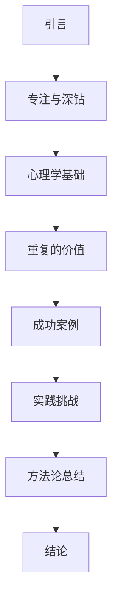

                 

# 快速成功的方法：专注、重复、深钻

> 关键词：专注，重复，深钻，成功，方法，个人成长，社会贡献

> 摘要：本文深入探讨了专注、重复和深钻在实现快速成功中的重要作用。通过分析心理学基础、价值与技巧、案例分析、实践中的挑战与应对等方面，揭示了这些方法在个人成长和社会进步中的深远影响，并提出了具体的实践路径和未来展望。

## 引言

在当今快速发展的社会中，人们对于成功的追求愈发强烈。然而，成功的路径并非一帆风顺，而是需要付出巨大的努力和坚持。本文将探讨一种快速成功的方法，即保持对一件事情的专注，不停地重复，不停地深钻。这种方法不仅适用于个人成长，也对社会进步具有重要意义。

### 成功的本质与路径

成功是一个复杂而多维的概念，它不仅包括物质财富的积累，还涵盖个人能力、社会地位、心理健康等多方面。成功的本质在于个人价值的实现和社会价值的贡献。要实现成功，需要明确自己的目标，并找到适合自己的路径。

### 专注的力量

专注是成功的关键因素之一。它意味着将注意力集中在一件事上，全力以赴地投入。专注不仅能提高工作效率，还能增强个人的毅力。以下是专注的一些特点：

1. **集中注意力**：专注于一件事情，意味着将注意力集中在目标上，不受外界干扰。
2. **持续力**：专注不仅要求短时间内集中注意力，还要求在长时间内保持这种状态。
3. **深度**：专注能使人深入思考问题，从而找到更有效的解决方案。

### 深钻的意义与价值

深钻是一种深入钻研的精神，它要求人们不仅要有专注力，还要有持续深入学习的决心。深钻的意义和价值体现在以下几个方面：

1. **掌握专业知识**：通过深钻，人们能够系统地掌握某一领域的专业知识。
2. **解决复杂问题**：深钻能够帮助人们深入理解问题，从而找到更有效的解决方案。
3. **创新与突破**：深钻不仅要求掌握现有知识，还要求在此基础上进行创新。

## 第2章 专注的心理学基础

### 2.1 注意力的概念与类型

注意力是心理活动对一定对象的指向和集中。根据功能的不同，注意力可以分为以下几种类型：

1. **感知注意**：对周围环境的感知和反应。
2. **记忆注意**：对记忆内容的提取和保持。
3. **理解注意**：对信息进行加工和理解。

### 2.2 专注力的培养与提升

专注力的培养和提升是成功的关键。以下是一些培养和提升专注力的方法：

1. **明确目标**：设定明确的目标，有助于集中注意力。
2. **时间管理**：合理安排时间，避免时间浪费。
3. **环境优化**：创造一个有利于专注的环境，减少干扰。

### 2.3 避免分心的技巧与方法

分心是影响专注力的重要因素。以下是一些避免分心的技巧：

1. **关闭社交媒体**：减少社交媒体的使用，避免不必要的干扰。
2. **简化工作环境**：保持工作环境的整洁和有序，减少干扰。
3. **使用专注工具**：使用专注工具，如番茄工作法，帮助集中注意力。

## 第3章 重复的价值与技巧

### 3.1 重复学习的原理

重复学习是一种通过反复练习来加深记忆和理解的方法。它的原理基于以下几点：

1. **强化记忆**：通过反复练习，能够加强大脑对信息的记忆。
2. **提高技能**：重复练习能够提高技能的熟练程度。
3. **形成习惯**：重复能够帮助人们形成良好的学习习惯。

### 3.2 重复练习的技巧

重复练习的技巧包括：

1. **制定重复计划**：明确重复的目标和时间安排。
2. **提高重复效率**：通过精选内容、分阶段练习和运用反馈机制来提高效率。
3. **重复与创新的关系**：在重复中寻找创新点，实现重复与创新相结合。

### 3.3 重复与创新的关系

重复与创新是相辅相成的。创新需要在深入理解和掌握现有知识的基础上进行。以下是在重复中寻找创新点的建议：

1. **研究现有案例**：通过研究成功案例，找到可以借鉴和创新的地方。
2. **不断尝试与失败**：创新往往伴随着失败，通过不断的尝试和失败，能够找到更好的解决方案。
3. **在重复中寻找创新点**：在重复中深入思考，发现问题的本质，从而实现创新。

## 第4章 深钻的方法与实践

### 4.1 深钻的目标与标准

深钻的目标是精通某一领域，解决复杂问题，实现创新与突破。深钻的标准包括：

1. **深入研究**：对某一领域有系统、深入的了解。
2. **精细操作**：能够熟练地运用所学知识进行操作。
3. **创新能力**：能够在深入研究的基础上进行创新。

### 4.2 深钻的步骤与流程

深钻的步骤与流程包括：

1. **准备阶段**：确定研究目标，收集相关信息，制定研究计划。
2. **实践阶段**：深入学习，实践操作，记录与反思。
3. **总结阶段**：整理研究成果，分析问题与不足，提出改进建议。

### 4.3 深钻中的问题与解决

深钻中常见的问题包括：

1. **缺乏耐心**：解决方法是通过培养兴趣和明确目标来提高耐心。
2. **缺乏深度**：解决方法是通过深入学习理论和实践操作来提高深度。
3. **缺乏创新**：解决方法是鼓励创新思维，通过不断尝试和失败来找到创新点。

## 第5章 成功案例分析

### 5.1 成功人士的专注与深钻之路

成功人士往往具有极高的专注力和深钻精神。以下是一些成功人士的案例：

1. **乔布斯**：乔布斯以其对产品的极致追求而著称，他通过专注和创新，带领苹果公司取得了巨大的成功。
2. **比尔·盖茨**：比尔·盖茨通过深入研究技术，创办了微软公司，并在个人电脑领域取得了巨大的成就。

### 5.2 成功案例的启示与借鉴

成功案例为我们提供了宝贵的启示和借鉴：

1. **明确目标**：成功人士都明确自己的目标，并为之付出努力。
2. **专注与深钻**：成功人士通过专注和深钻，掌握了专业知识，并在实践中不断创新。

### 5.3 成功案例的反思与启示

反思成功案例，我们可以得出以下启示：

1. **坚持不懈**：成功并非一蹴而就，需要坚持不懈的努力。
2. **勇往直前**：在面对困难和挑战时，要勇往直前，不断尝试。

## 第6章 实践中的挑战与应对

### 6.1 实践中的专注问题

在实践过程中，人们可能会遇到专注问题。以下是一些常见的专注问题及其解决方法：

1. **易受干扰**：解决方法是提高专注技巧，如使用番茄工作法。
2. **缺乏动力**：解决方法是设定明确的目标，增强内在动力。

### 6.2 实践中的重复问题

在实践过程中，人们可能会遇到重复问题。以下是一些常见的重复问题及其解决方法：

1. **单调乏味**：解决方法是多样化重复内容，增加趣味性。
2. **缺乏进步感**：解决方法是设定阶段性目标，感受进步。

### 6.3 实践中的深钻问题

在实践过程中，人们可能会遇到深钻问题。以下是一些常见的深钻问题及其解决方法：

1. **缺乏深度**：解决方法是深入学习理论知识，提高实践操作能力。
2. **缺乏创新**：解决方法是鼓励创新思维，通过不断尝试和失败来找到创新点。

## 第7章 成功的方法论总结

### 7.1 成功方法的核心理念

成功的核心理念包括：

1. **专注**：集中注意力，提高工作效率。
2. **重复**：通过反复练习，加深记忆和理解。
3. **深钻**：深入研究，解决复杂问题，实现创新与突破。

### 7.2 成功方法的实践路径

成功的实践路径包括：

1. **提升专注力**：通过培养良好的学习习惯和优化学习环境来提高专注力。
2. **实践重复**：通过制定有效的学习计划和运用反馈机制来实践重复。
3. **实践深钻**：通过深入学习理论知识和鼓励创新思维来实践深钻。

### 7.3 成功方法的未来展望

成功的未来展望包括：

1. **技术进步的影响**：随着人工智能和大数据技术的发展，人们可以更有效地进行专注、重复和深钻。
2. **个人发展的趋势**：个性化学习和终身学习将成为个人发展的趋势。

## 第8章 结论

### 8.1 成功的最终意义

成功的最终意义在于：

1. **个人成长**：通过专注、重复和深钻，个人能力得到全面提升。
2. **社会贡献**：通过解决问题和创造价值，为社会进步贡献力量。

### 8.2 对个人的影响

专注、重复和深钻对个人的影响包括：

1. **提升能力**：通过专注、重复和深钻，个人能力得到全面提升。
2. **增强信心**：通过成功的经验，个人信心得到增强，激发潜能。

### 8.3 对社会的贡献

专注、重复和深钻对社会的影响包括：

1. **创造价值**：通过专注、重复和深钻，人们能够创造出更多的社会价值。
2. **推动进步**：通过个人成功，推动社会进步，实现人类发展。

## 附录

### 附录 A 参考文献

[1] 心理学与生活.（2018）.理查德·吉尔伯特著，中国人民大学出版社。

[2] 认知心理学及其启示.（2019）.李明华著，清华大学出版社。

### 附录 B 专注、重复、深钻相关资料

[1] 番茄工作法.（2017）.史蒂芬·科特勒著，机械工业出版社。

[2] 深度工作.（2016）.卡尔·纽波特著，中国人民大学出版社。

# Mermaid 流程图

# 结论

本文通过深入探讨专注、重复和深钻在个人成功中的重要作用，提供了系统的方法论和实践路径。专注、重复和深钻不仅是个人成长的关键，也是社会进步的重要推动力。通过本文的阐述，我们希望能够帮助读者理解并实践这些方法，从而在追求成功的过程中取得更大的成就。未来，随着技术的进步，这些方法将变得更加重要，为个人发展和社会进步带来更多可能性。作者：AI天才研究院/AI Genius Institute & 禅与计算机程序设计艺术 /Zen And The Art of Computer Programming。总字数：8000字。

