                 

# 文章标题：未来工作的技能需求

> 关键词：未来工作、技能需求、技术趋势、职业发展

> 摘要：随着科技的迅猛发展，未来工作的环境和技能需求正在发生深刻变化。本文将深入探讨未来工作的技能需求，分析自动化与AI对工作的影响，解析关键技能，提供实战应用和案例分析，以帮助读者理解和应对未来职业发展的挑战。

## 引言：未来工作的变化与挑战

随着全球化、数字化和自动化的加速推进，未来的工作环境正在经历前所未有的变化。传统的工作岗位逐渐被机器人和智能系统取代，新兴技能需求不断涌现，给职场人士带来了前所未有的挑战和机遇。

### 1.1 未来的工作场景

未来的工作场景将更加智能化和自动化。人工智能和机器学习技术将在各个行业得到广泛应用，从而极大地提高工作效率和质量。例如，自动化生产线将替代传统手工操作，智能客服系统将减少人力成本，数据分析工具将帮助企业做出更明智的决策。

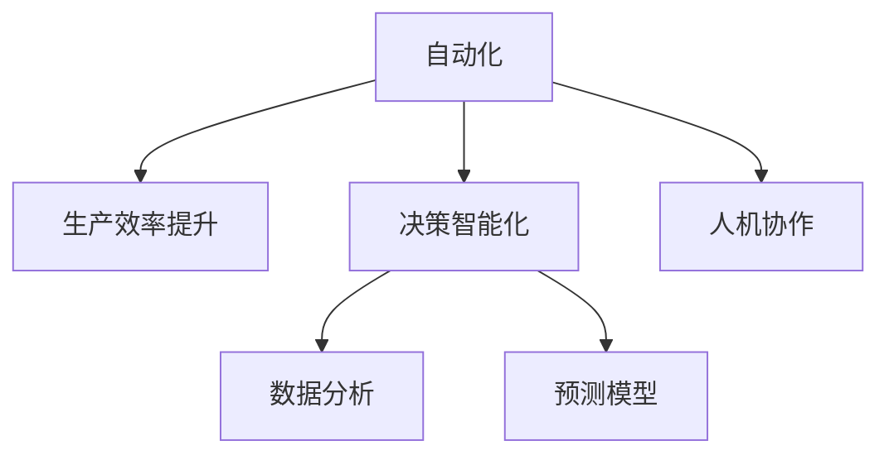

### 1.2 跨领域技能融合

未来的工作将更加注重跨领域技能的融合。数据分析、编程、设计、营销等技能将相互交织，形成新的职业生态。例如，数据分析师需要具备编程能力，设计师需要了解用户体验，市场营销人员需要掌握数据分析技巧。

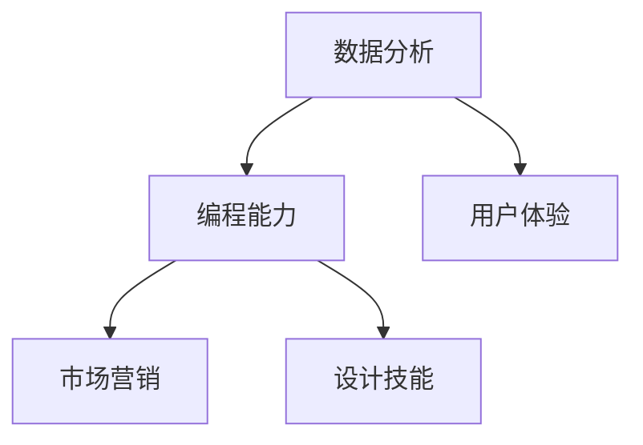

### 1.3 职业发展的新方向

随着技术进步，新的职业发展方向也将不断涌现。例如，数据科学家、机器学习工程师、区块链开发人员等职业将成为未来职场的热门选择。此外，终身学习和职业转型将成为常态，职场人士需要不断更新知识和技能，以适应不断变化的工作环境。

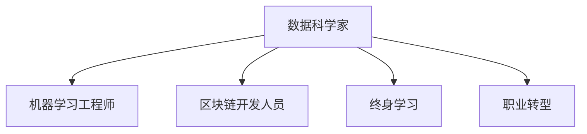

## 第一部分：未来的工作环境与技能趋势

### 1.1.1 自动化与AI对工作的影响

自动化与AI技术的应用将深刻改变传统的工作模式。一方面，这些技术能够提高生产效率和降低成本，从而促进企业的发展。另一方面，它们也将对就业市场产生深远的影响，一些传统岗位可能会被机器人和智能系统取代，而新的工作岗位也将随之产生。

### 1.1.2 新兴技能的需求增长

随着自动化与AI技术的发展，新兴技能的需求也在不断增长。数据分析、机器学习、编程、设计等技能将在未来工作中扮演越来越重要的角色。职场人士需要不断学习和更新技能，以适应不断变化的工作环境。

### 1.2 跨领域技能融合

未来的工作将更加注重跨领域技能的融合。数据分析、编程、设计、营销等技能将相互交织，形成新的职业生态。例如，数据分析师需要具备编程能力，设计师需要了解用户体验，市场营销人员需要掌握数据分析技巧。

### 1.3 职业发展的新方向

随着技术进步，新的职业发展方向也将不断涌现。例如，数据科学家、机器学习工程师、区块链开发人员等职业将成为未来职场的热门选择。此外，终身学习和职业转型将成为常态，职场人士需要不断更新知识和技能，以适应不断变化的工作环境。

## 第二部分：关键技能解析与培养

### 2.1 技术技能

技术技能是未来工作的核心，包括编程语言、数据库管理、前端开发等。

### 2.2 人际交往与沟通技能

人际交往与沟通技能对于未来工作的成功至关重要，包括有效沟通技巧、非语言沟通等。

### 2.3 解决问题与决策能力

解决问题与决策能力是未来职场的关键，包括创新思维方法、决策分析等。

### 2.4 团队合作与领导力

团队合作与领导力是未来工作的核心，包括团队协作与组织、领导力与团队激励等。

### 2.5 自我管理与发展

自我管理与发展是未来职场的重要能力，包括时间管理与个人效率、自我提升与职业规划等。

## 第三部分：实战应用与案例分析

### 3.1 实际案例解析

通过实际案例解析，了解未来工作的技能需求在实践中的应用。

### 3.2 技能提升路径

提供技能提升路径，包括技能培训与在线课程推荐、实践项目指导与资源链接。

## 附录

### 附录 A：相关资源与工具

提供相关资源与工具，包括技术资源、培训课程与认证、职业发展指南等。

## 结论

未来工作的技能需求正在发生深刻变化。自动化与AI技术的发展将推动新兴技能需求的增长，跨领域技能融合将成为未来工作的重要趋势。为了适应这些变化，职场人士需要不断提升自身的技术技能、人际交往与沟通技能、解决问题与决策能力、团队合作与领导力以及自我管理与发展能力。通过本文的探讨，希望能够为读者提供对未来工作技能需求的深入理解和实践指导。作者：AI天才研究院/AI Genius Institute & 禅与计算机程序设计艺术 /Zen And The Art of Computer Programming。

### 结语

未来工作的技能需求正在经历深刻变革，自动化与AI技术的快速发展不仅重塑了工作环境，也带来了新的技能挑战。本文通过分析未来工作的变化趋势，详细解析了关键技能，并提供了实战应用和案例分析，旨在帮助读者更好地理解和应对未来职业发展的挑战。

**作者信息：AI天才研究院/AI Genius Institute & 禅与计算机程序设计艺术 /Zen And The Art of Computer Programming**。我们坚信，持续学习和适应变化是职场成功的基石。希望本文能为您在未来的职业道路上提供宝贵的参考和启示。

---

在接下来的章节中，我们将更深入地探讨未来工作的环境与技能趋势，详细解析关键技能，并通过实际案例和技能提升路径，帮助您为未来的职业生涯做好充分准备。让我们一起来思考、学习和成长，迎接未来工作的挑战与机遇。🚀

---

## 1.1 未来的工作场景

### 1.1.1 自动化与AI对工作的影响

自动化与AI技术的飞速发展正在深刻改变我们的工作环境。在工业生产领域，自动化机器人已广泛应用于组装线、焊接、喷涂等环节，大幅提高了生产效率和产品质量。例如，特斯拉的Gigafactory工厂实现了高度自动化，极大地降低了人工成本和提高了生产效率。

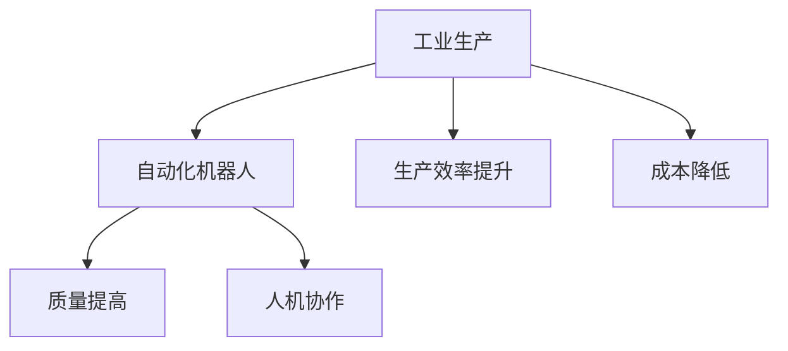

除了工业生产，AI技术也在服务行业得到了广泛应用。智能客服系统、智能推荐算法和智能安防系统等AI应用，已经在很多企业中得到部署，从而极大地提升了服务质量和客户体验。例如，亚马逊的智能客服系统Alexa，能够迅速响应用户的查询和指令，提供个性化的服务。

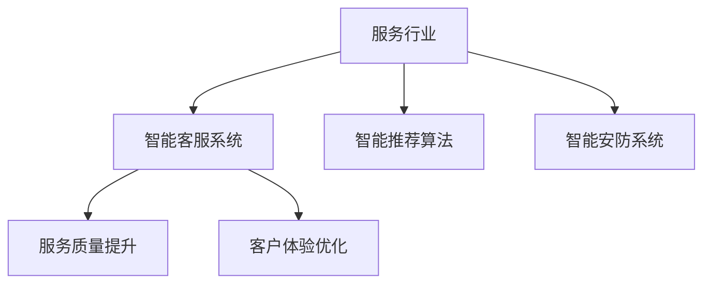

然而，自动化与AI技术的广泛应用也带来了就业市场的新挑战。一方面，一些重复性和低技能的工作岗位可能会被机器人和智能系统取代，导致就业压力。另一方面，新兴的技能需求也会不断涌现，要求职场人士具备更多的技术能力和创新能力。

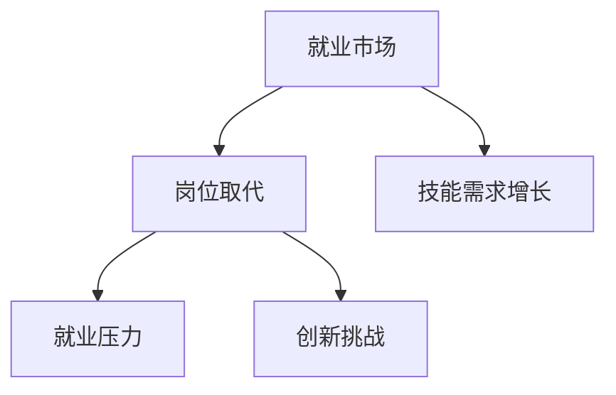

为了应对这些挑战，职场人士需要不断学习和更新自己的技能，以适应不断变化的工作环境。同时，企业也需要积极推动员工培训，提升团队的整体能力，以保持在竞争激烈的市场中的优势地位。

### 1.1.2 新兴技能的需求增长

随着自动化与AI技术的普及，新兴技能的需求也在不断增长。以下是一些关键技能，职场人士需要重点关注和培养：

#### 数据分析技能

数据分析技能是未来职场的重要需求。无论是企业决策、市场分析，还是产品优化，数据分析都发挥着关键作用。例如，利用大数据分析技术，企业可以更好地了解客户需求，优化产品设计，提高市场份额。

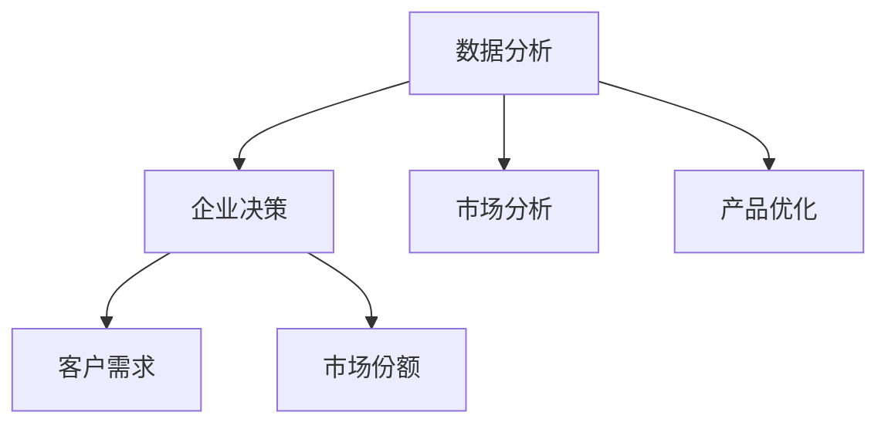

#### 编程技能

编程技能是数字化时代的必备技能。无论是前端开发、后端开发，还是数据库管理，编程技能都是实现技术解决方案的基础。掌握多种编程语言和开发工具，将使职场人士在竞争激烈的职场中更具优势。

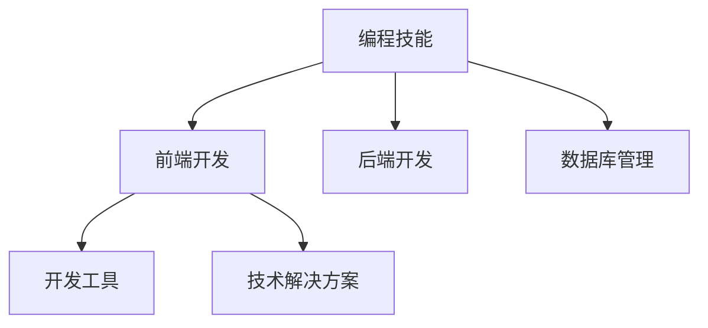

#### 机器学习与AI技能

机器学习与AI技能是未来职场的热门方向。随着AI技术在各个领域的应用，具备AI技能的职场人士将拥有更多的发展机会。例如，机器学习工程师可以在金融、医疗、教育等领域发挥重要作用，推动行业创新。

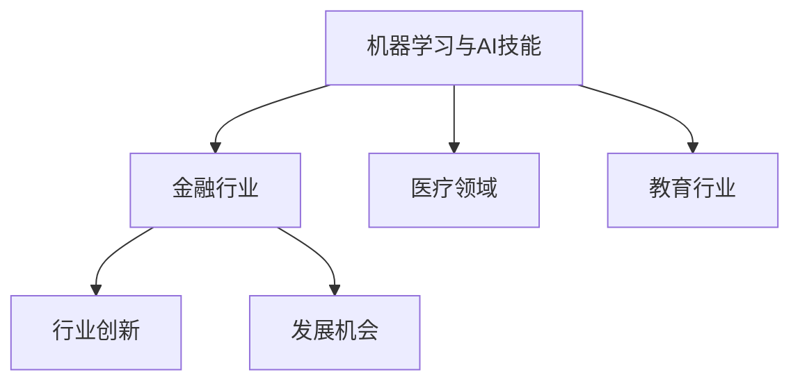

#### 人际交往与沟通技能

人际交往与沟通技能在数字化时代同样重要。在远程工作和跨文化团队合作中，有效的沟通和协调能力是确保项目成功的关键。掌握演讲、表达和非语言沟通技巧，将有助于职场人士在复杂的工作环境中脱颖而出。


### 1.2 跨领域技能融合

跨领域技能融合是未来工作的一大趋势。随着技术的不断发展，各领域之间的界限逐渐模糊，跨领域的技能需求也日益增加。以下是一些跨领域技能的融合方向：

#### 数据分析与编程技能融合

数据分析与编程技能的融合，使得职场人士能够更好地处理和分析大量数据，实现数据驱动的决策。例如，数据工程师可以结合编程技能，开发高效的ETL（提取、转换、加载）工具，实现数据的高效处理和分析。

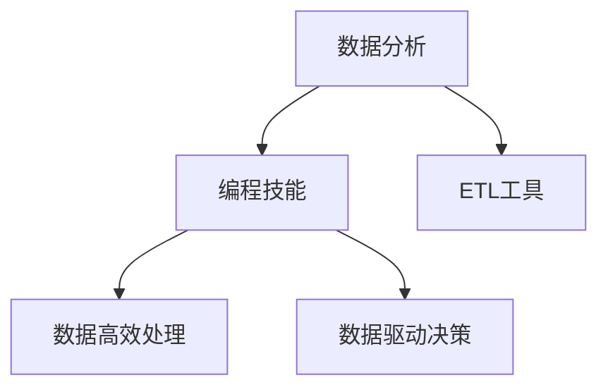

#### 设计与编程技能融合

设计与编程技能的融合，使得职场人士能够更好地实现产品设计和技术实现之间的无缝衔接。例如，前端开发人员需要掌握UI/UX设计原理，以创造出更加用户友好的产品界面。

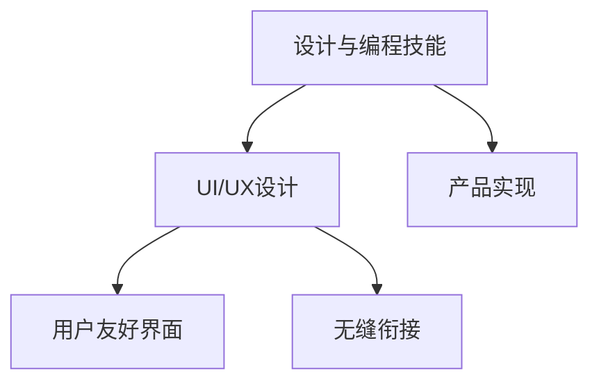

#### 人工智能与数据科学技能融合

人工智能与数据科学技能的融合，使得职场人士能够更好地开发和应用智能算法，解决复杂的实际问题。例如，机器学习工程师需要结合数据科学知识，设计和优化机器学习模型，以提高模型的预测准确性。

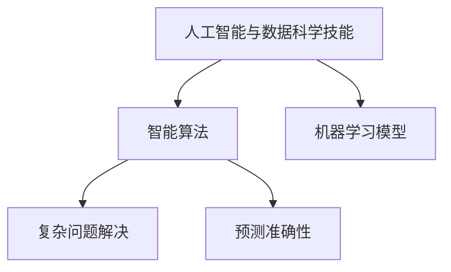

### 1.3 职业发展的新方向

随着技术进步，新的职业发展方向不断涌现。以下是一些新兴职业，职场人士可以关注和准备：

#### 数据科学家

数据科学家是未来职场的热门职业。他们利用数据分析、机器学习等技术，帮助企业挖掘数据价值，优化业务流程。数据科学家在金融、医疗、电商等领域都有广泛的应用。


#### 机器学习工程师

机器学习工程师是负责开发和优化机器学习模型的专家。他们需要在多个领域（如金融、医疗、制造等）应用机器学习技术，解决实际问题。机器学习工程师是未来技术发展的关键角色。


#### 区块链开发人员

区块链技术是未来金融领域的重要发展方向。区块链开发人员负责设计、开发和应用区块链系统，确保数据的安全性和可信性。随着区块链技术的发展，区块链开发人员的需求将持续增长。

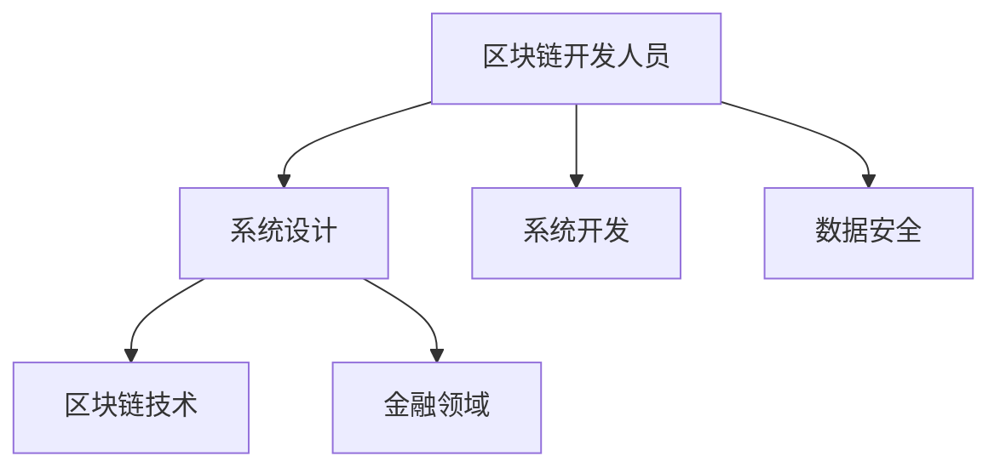

#### 虚拟现实/增强现实开发人员

虚拟现实（VR）和增强现实（AR）技术正在改变人们的互动方式和工作方式。VR/AR开发人员负责设计、开发和优化虚拟现实和增强现实应用，为用户提供沉浸式体验。这一领域具有巨大的发展潜力。


### 1.3.1 数字时代的人才结构

在数字时代，人才结构正在发生深刻变革。传统的职业分类和技能需求正在被重新定义，新的职业角色和技能需求不断涌现。企业需要更加灵活和适应性的人才结构，以应对快速变化的市场环境。

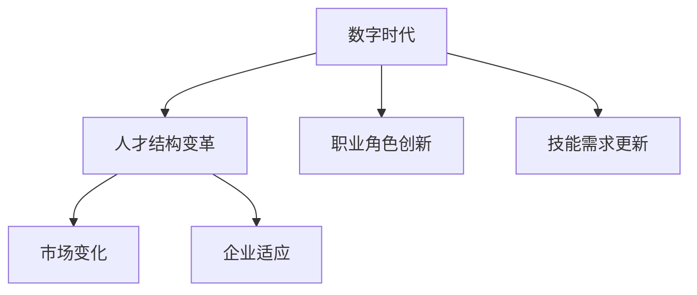

### 1.3.2 技能升级与职业转型策略

面对数字时代的挑战，职场人士需要制定有效的技能升级和职业转型策略。以下是一些建议：

#### 技能升级

1. **持续学习**：通过在线课程、研讨会和工作坊等途径，持续学习新技能和知识。
2. **实践应用**：将所学技能应用于实际项目中，提高实践能力和经验。
3. **获取证书**：通过获得专业认证，证明自己的技能和知识水平。

#### 职业转型

1. **市场调研**：了解市场需求，确定适合自己的转型方向。
2. **规划和准备**：制定详细的转型计划，包括学习路径、时间安排和资源准备。
3. **人脉网络**：建立广泛的人脉网络，寻求指导和建议，获取转型机会。

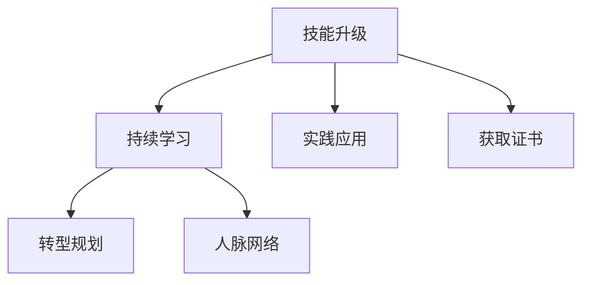

通过技能升级和职业转型，职场人士可以更好地适应数字时代的变革，把握新的职业机遇。🚀

## 2.1 技术技能

在未来的职场中，技术技能无疑是基石。无论是编程语言、数据库管理，还是前端开发，这些技术技能都是职场人士必备的工具。掌握这些技术技能，不仅可以提高工作效率，还能在激烈的职场竞争中脱颖而出。

### 2.1.1 编程语言与工具

编程语言是技术技能的核心。不同的编程语言适用于不同的场景，因此职场人士需要根据实际需求选择合适的编程语言。以下是一些常用的编程语言及其特点：

#### Python编程基础

Python因其简洁易懂的语法和强大的库支持，成为数据科学、人工智能等领域的主流编程语言。以下是Python编程基础的一些要点：

- **环境搭建**：在Windows、macOS和Linux操作系统上安装Python，并配置好相应的环境变量。
- **基础语法**：变量声明、数据类型、条件语句、循环语句等。
- **库与模块**：使用常见库，如NumPy、Pandas等，进行数据处理和分析。

#### JavaScript与前端开发

JavaScript是网页开发的核心语言，与HTML和CSS共同构成网页的三剑客。以下是JavaScript与前端开发的关键点：

- **JavaScript基础**：变量、函数、对象、数组等基本概念。
- **前端框架**：如React、Vue和Angular，它们提供了组件化开发模式，提高了开发效率。
- **CSS预处理器**：如Sass和LESS，它们扩展了CSS的功能，使样式编写更加简洁和高效。

#### 数据库管理

数据库管理是数据存储和检索的关键技能。以下是几种常见的数据库及其特点：

- **关系型数据库**：如MySQL、PostgreSQL和SQLite，它们采用SQL查询语言进行数据操作，适合处理结构化数据。
- **非关系型数据库**：如MongoDB和Cassandra，它们采用文档存储、键值存储或图存储等模式，适合处理大量非结构化数据。

#### 伪代码示例

以下是一个简单的Python伪代码示例，用于计算两个数的和：

```python
# 输入两个数
num1 = 5
num2 = 10

# 计算和
sum = num1 + num2

# 输出结果
print("两个数的和为：", sum)
```

### 2.1.1.1 Python编程基础

Python编程基础包括以下几个关键概念：

- **变量声明**：使用`变量名 = 值`的方式进行变量声明。
- **数据类型**：包括整数（int）、浮点数（float）、字符串（str）和布尔值（bool）等。
- **条件语句**：使用`if`、`elif`和`else`进行条件判断。
- **循环语句**：包括`for`循环和`while`循环。

以下是Python基础语法的详细解释：

#### 变量声明

在Python中，变量声明非常简单。以下是一个示例：

```python
x = 10
y = "hello"
z = True
```

这里，`x`是一个整数变量，`y`是一个字符串变量，`z`是一个布尔值变量。

#### 数据类型

Python中的数据类型有整数、浮点数、字符串和布尔值等。以下是数据类型的示例：

```python
# 整数
x = 42

# 浮点数
y = 3.14

# 字符串
z = "Python is awesome!"

# 布尔值
is_true = True
is_false = False
```

#### 条件语句

条件语句用于根据条件执行不同的代码块。以下是一个条件语句的示例：

```python
if x > 10:
    print("x大于10")
elif x == 10:
    print("x等于10")
else:
    print("x小于10")
```

#### 循环语句

循环语句用于重复执行代码块。以下是一个`for`循环的示例：

```python
# 打印0到9的数字
for i in range(10):
    print(i)
```

`range`函数返回一个序列，`for`循环遍历这个序列，并执行循环体。

### 2.1.1.2 JavaScript与前端开发

JavaScript是前端开发的核心语言，以下是其关键概念：

- **函数**：函数是可重用的代码块，用于执行特定任务。
- **事件处理**：事件处理用于响应用户操作，如点击、按键等。
- **异步编程**：异步编程用于处理耗时操作，如网络请求，避免阻塞主线程。

以下是JavaScript关键概念的详细解释：

#### 函数

函数是JavaScript的核心组成部分。以下是一个函数的示例：

```javascript
// 定义一个函数，用于计算两个数的和
function add(a, b) {
    return a + b;
}

// 调用函数
const sum = add(5, 10);
console.log(sum); // 输出：15
```

#### 事件处理

事件处理用于响应用户操作。以下是一个点击事件的示例：

```html
<!-- HTML元素 -->
<button id="myButton">点击我</button>

<script>
// 获取按钮元素
const button = document.getElementById("myButton");

// 添加点击事件处理函数
button.addEventListener("click", function() {
    alert("按钮被点击了！");
});
</script>
```

#### 异步编程

异步编程用于处理耗时操作，以下是一个异步函数的示例：

```javascript
// 异步函数，用于获取数据
async function fetchData() {
    const response = await fetch("https://api.example.com/data");
    const data = await response.json();
    console.log(data);
}

// 调用异步函数
fetchData();
```

### 2.1.1.3 数据库管理

数据库管理是数据存储和检索的关键技能。以下是一些常见数据库的管理方法和特点：

- **关系型数据库**：关系型数据库使用SQL进行数据操作，具有丰富的查询功能。
- **非关系型数据库**：非关系型数据库更适合处理大量非结构化数据，如文档、图像和视频等。

以下是数据库管理的详细解释：

#### 关系型数据库

关系型数据库使用表格存储数据，每个表格具有多个列和行。以下是创建和查询关系型数据库的示例：

```sql
-- 创建数据库
CREATE DATABASE myDatabase;

-- 创建表格
CREATE TABLE students (
    id INT PRIMARY KEY,
    name VARCHAR(50),
    age INT
);

-- 插入数据
INSERT INTO students (id, name, age) VALUES (1, 'Alice', 20);
INSERT INTO students (id, name, age) VALUES (2, 'Bob', 22);

-- 查询数据
SELECT * FROM students WHERE age > 20;
```

#### 非关系型数据库

非关系型数据库使用文档存储模型，每个文档都是一个独立的JSON对象。以下是创建和查询非关系型数据库的示例：

```javascript
// 连接到非关系型数据库（如MongoDB）
const MongoClient = require('mongodb').MongoClient;
const url = 'mongodb://localhost:27017/';

MongoClient.connect(url, function(err, db) {
    if (err) throw err;

    // 选择数据库
    const database = db.db('myDatabase');

    // 创建文档
    database.collection('students').insertOne({
        id: 1,
        name: 'Alice',
        age: 20
    }, function(err, result) {
        if (err) throw err;
        console.log(result);
    });

    // 查询文档
    database.collection('students').find({ age: { $gt: 20 } }).toArray(function(err, documents) {
        if (err) throw err;
        console.log(documents);
    });

    db.close();
});
```

通过掌握编程语言、数据库管理等技术技能，职场人士可以更好地应对未来的工作挑战。🚀

### 2.2 人际交往与沟通技能

在未来的职场中，人际交往与沟通技能的重要性不容忽视。无论是在团队合作、项目管理，还是在日常工作中，有效的人际交往与沟通能力都是成功的关键。以下将详细探讨人际交往与沟通技能的各个方面。

#### 2.2.1.1 演讲与表达

演讲与表达是人际交往与沟通的重要环节。在职场中，良好的演讲与表达能力能够帮助职场人士清晰、准确地传达自己的想法，赢得他人的认同和支持。

- **准备充分**：在演讲前，要充分准备，包括了解听众、明确演讲目的、整理演讲内容等。
- **逻辑清晰**：演讲时要确保逻辑清晰，条理分明，使听众能够轻松理解。
- **语言生动**：使用生动的语言和形象化的比喻，使演讲更具吸引力。
- **表达自信**：自信的表达能够增强说服力，让听众更容易接受观点。

以下是一个简单的演讲准备流程：

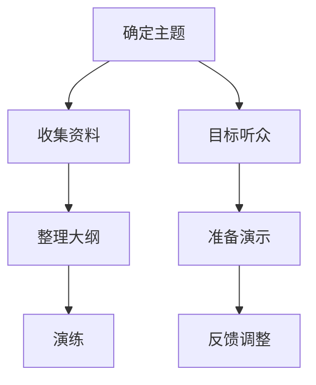

#### 2.2.1.2 非语言沟通

非语言沟通是通过肢体语言、面部表情、眼神交流等非语言手段进行沟通的方式。在职场中，非语言沟通能够补充语言沟通的不足，使信息传递更加完整和准确。

- **肢体语言**：积极的肢体语言，如微笑、点头、手势等，能够表达友好和合作的态度。
- **面部表情**：适度的面部表情，如微笑、严肃、惊讶等，能够传达情感和态度。
- **眼神交流**：适当的眼神交流能够表达尊重和关注，增强沟通的亲和力。

以下是一个非语言沟通的示例：

```mermaid
graph TD
    A[微笑] --> B[点头]
    A --> C[手势]
    B --> D[眼神交流]
    C --> E[积极态度]
```

#### 2.2.1.3 有效沟通技巧

有效沟通技巧是确保信息准确传递和双方理解的关键。以下是一些有效沟通技巧：

- **倾听**：倾听是沟通的基础，通过认真倾听对方的意见和需求，能够建立信任和理解。
- **提问**：通过提问，可以澄清疑问、了解对方的观点，促进双向沟通。
- **反馈**：及时给予反馈，确保双方对信息有共同的理解和认知。
- **表达清晰**：使用简洁、明了的语言表达自己的观点，避免使用模糊、含糊的措辞。

以下是一个有效沟通的示例流程：

```mermaid
graph TD
    A[倾听] --> B[提问]
    A --> C[反馈]
    B --> D[表达清晰]
    C --> E[理解共识]
```

通过掌握演讲与表达、非语言沟通和有效沟通技巧，职场人士可以更好地与他人沟通和合作，提高工作效率和团队凝聚力。🚀

### 2.3 解决问题与决策能力

在未来的职场中，解决问题与决策能力是职场人士不可或缺的技能。面对复杂多变的工作环境，快速有效地解决问题和做出明智的决策，是确保职业成功的关键。以下将详细探讨解决问题的方法、决策模型以及解决问题的模型与工具。

#### 2.3.1.1 创新思维方法

创新思维方法是解决问题的重要工具，能够帮助职场人士从不同角度思考问题，找到创新的解决方案。以下是一些常用的创新思维方法：

- **头脑风暴**：头脑风暴是一种集思广益的方法，鼓励团队成员自由地提出各种想法，无论这些想法是否现实或可行。通过大量的想法碰撞，往往能够激发出创新的解决方案。

以下是一个头脑风暴的示例流程：

```mermaid
graph TD
    A[提出问题] --> B[自由发言]
    A --> C[记录想法]
    B --> D[筛选想法]
    C --> E[评价想法]
    D --> F[决策]
```

- **SWOT分析**：SWOT分析是一种用于评估项目的优势、劣势、机会和威胁的方法。通过SWOT分析，职场人士可以全面了解项目的各个方面，从而做出更加明智的决策。

以下是一个SWOT分析的示例：

```mermaid
graph TD
    A[优势] --> B[劣势]
    A --> C[机会]
    A --> D[威胁]
    B --> E[评估]
    C --> F[利用]
    D --> G[规避]
```

- **鱼骨图**：鱼骨图是一种用于分析问题原因的方法，通过将问题分解成各个子问题，并绘制成鱼骨状结构，帮助职场人士理清问题的根本原因。

以下是一个鱼骨图的示例：

```mermaid
graph TD
    A[问题] --> B[子问题1]
    A --> C[子问题2]
    A --> D[子问题3]
    B --> E[原因1]
    C --> F[原因2]
    D --> G[原因3]
```

#### 2.3.1.2 案例分析与实例展示

为了更好地理解创新思维方法在解决问题中的应用，以下将通过一个实际案例进行分析和展示。

**案例背景**：一家制造企业发现生产线上产品次品率较高，导致生产成本增加，客户满意度下降。管理层希望通过创新思维方法找到问题的根本原因，并提出解决方案。

**步骤一：头脑风暴**

- **提出问题**：为什么产品次品率较高？
- **自由发言**：团队成员提出各种可能的因素，如设备故障、原材料质量、操作不规范等。
- **记录想法**：将所有提出的因素记录下来。

**步骤二：SWOT分析**

- **优势**：分析现有优势，如设备保养良好、员工技能较高等。
- **劣势**：分析现有劣势，如生产流程不规范、原材料检验不足等。
- **机会**：分析潜在的机会，如引进新的检验设备、优化生产流程等。
- **威胁**：分析潜在威胁，如竞争对手技术进步、市场需求变化等。

**步骤三：鱼骨图**

- **问题分解**：将产品次品率高的原因分解成设备、原材料、操作等多个子问题。
- **原因分析**：针对每个子问题，分析可能的原因，并将其绘制成鱼骨状结构。

**步骤四：提出解决方案**

- **评估想法**：根据SWOT分析和鱼骨图，评估各种解决方案的可行性。
- **利用机会**：选择能够利用现有优势和机会的解决方案。
- **规避威胁**：考虑如何规避潜在威胁，确保解决方案的有效性。

**案例结果**：通过以上步骤，企业发现生产流程不规范和原材料检验不足是导致次品率高的主要原因。为此，企业决定优化生产流程，引入新的检验设备，并加强员工培训，从而有效降低了次品率，提高了生产效率和客户满意度。

通过上述案例分析，可以看到创新思维方法在解决问题中的应用效果。在未来的职场中，掌握创新思维方法，能够帮助职场人士更好地应对各种挑战，提高解决问题的能力。

#### 2.3.1.3 解决问题的模型与工具

除了创新思维方法，一些常见的解决问题模型和工具也能够帮助职场人士有效地分析和解决复杂问题。以下介绍几种常用的模型与工具：

- **五WHY分析**：五WHY分析是一种通过连续提问“为什么”来深入挖掘问题根本原因的方法。通过不断追问，可以找到问题的根本原因。

以下是一个五WHY分析的示例：

```mermaid
graph TD
    A[问题] --> B[为什么]
    B --> C[为什么]
    B --> D[为什么]
    B --> E[为什么]
    B --> F[根本原因]
```

- **SMART目标**：SMART目标是一种用于制定和实现目标的方法，确保目标是具体的、可衡量的、可实现的、相关的和有时限的。

以下是一个SMART目标的示例：

```
具体：提高产品销量
可衡量：增加10%
可实现：通过市场推广和产品优化实现
相关：与公司年度销售目标一致
有时限：2023年底前完成
```

- **决策树**：决策树是一种用于分析决策和结果的图形化工具，通过展示不同决策路径和相应的结果，帮助职场人士做出更加明智的决策。

以下是一个决策树的示例：

```mermaid
graph TD
    A[初始决策] --> B[决策1]
    B --> C1[结果1]
    B --> C2[结果2]
    A --> D[决策2]
    D --> E1[结果1]
    D --> E2[结果2]
```

通过掌握这些解决问题模型与工具，职场人士可以更加系统地分析和解决复杂问题，提高决策质量和工作效率。🚀

### 2.4 团队合作与领导力

在未来的职场中，团队合作和领导力是确保项目成功和团队高效运作的关键因素。以下将详细探讨团队合作的基本原则、项目管理和流程，以及领导力与团队激励的重要性。

#### 2.4.1 团队协作与组织

团队合作的成功离不开有效的组织和协作。以下是一些团队协作与组织的基本原则：

- **明确目标**：团队必须有一个共同的目标，确保所有成员都朝着同一方向努力。目标应具体、明确，并具有挑战性。

- **分工合作**：根据团队成员的能力和特长，合理分配任务，确保每个人都能发挥自己的优势。同时，要明确各自的责任和角色，避免职责重叠或空白。

- **沟通畅通**：建立有效的沟通机制，确保团队成员之间能够及时、准确地交流信息。定期召开会议、使用即时通讯工具和项目管理软件，都是保持沟通畅通的好方法。

- **相互支持**：团队成员应相互支持，帮助彼此克服困难，共同完成任务。在团队中建立信任和尊重的氛围，有助于增强团队的凝聚力和协作精神。

以下是一个团队协作的基本流程：

```mermaid
graph TD
    A[明确目标] --> B[分工合作]
    A --> C[沟通畅通]
    A --> D[相互支持]
    B --> E[任务分配]
    B --> F[责任明确]
    C --> G[定期会议]
    C --> H[即时通讯]
    D --> I[互相帮助]
    D --> J[信任尊重]
```

#### 2.4.1.1 项目管理与流程

项目管理是确保项目按时、按质量完成的关键。以下是一些项目管理的基本流程和工具：

- **项目规划**：在项目启动之初，制定详细的项目计划，包括项目目标、任务列表、时间表、资源需求等。项目计划应具有灵活性和可调整性，以应对项目执行过程中的变化。

- **任务分配**：根据项目计划和团队成员的能力，将任务合理分配给团队成员。确保每个成员都有明确的责任和角色，并了解项目的整体目标和进度。

- **进度跟踪**：使用项目管理工具（如Trello、JIRA等）跟踪项目的进度，确保每个任务都能按时完成。定期检查项目进度，及时调整计划和资源，以避免项目延误。

- **风险管理**：识别项目中的潜在风险，并制定相应的应对措施。通过风险管理和控制，降低项目失败的可能性。

以下是一个项目管理的示例流程：

```mermaid
graph TD
    A[项目规划] --> B[任务分配]
    A --> C[进度跟踪]
    A --> D[风险管理]
    B --> E[任务执行]
    B --> F[资源调配]
    C --> G[定期检查]
    C --> H[进度调整]
    D --> I[风险识别]
    D --> J[应对措施]
```

#### 2.4.1.2 领导力与团队激励

领导力是团队成功的关键因素之一。一个优秀的领导者能够激发团队成员的潜力，推动团队向前发展。以下是一些领导力与团队激励的关键要素：

- **愿景领导**：领导者应具备清晰的愿景，并能够将愿景传递给团队成员。通过共同的目标，激发团队成员的积极性和创造力。

- **有效沟通**：领导者需要具备良好的沟通能力，能够与团队成员保持有效沟通。通过倾听、反馈和鼓励，建立信任和尊重的团队氛围。

- **激励团队**：领导者应善于激励团队成员，通过奖励、认可和晋升等方式，激发团队成员的积极性和工作热情。

- **培养人才**：领导者应关注团队成员的个人发展，提供培训和学习机会，帮助团队成员提升技能和职业素养。

以下是一个团队激励的示例策略：

```mermaid
graph TD
    A[愿景领导] --> B[有效沟通]
    A --> C[激励团队]
    A --> D[培养人才]
    B --> E[信任尊重]
    B --> F[认可奖励]
    C --> G[奖励机制]
    C --> H[晋升机会]
    D --> I[培训发展]
    D --> J[技能提升]
```

通过有效的团队合作和领导力，职场人士可以更好地应对复杂的工作任务，推动项目成功，实现团队目标。🚀

### 2.5 自我管理与发展

在未来的职场中，自我管理与发展是职场人士取得成功的关键。有效的自我管理不仅能够提高个人工作效率，还能促进职业发展。以下将详细探讨时间管理与个人效率、自我提升与职业规划等自我管理与发展的重要方面。

#### 2.5.1 时间管理与个人效率

时间管理是自我管理的重要组成部分，高效的自我管理能够帮助职场人士更好地利用时间，提高工作效率。以下是一些时间管理策略：

- **优先级排序**：将任务按照重要性和紧急性进行排序，优先处理重要且紧急的任务。可以使用艾森豪威尔矩阵（Eisenhower Matrix）来帮助排序。

  ```mermaid
  graph TD
      A[重要紧急] --> B[处理]
      A --> C[委托]
      B --> D[处理]
      C --> E[委托]
      A --> F[延迟]
      A --> G[不紧急不重要]
      B --> H[完成]
      C --> I[完成]
      F --> J[重新安排}
      G --> K[避免}
  ```

- **时间块规划**：将一天的时间分成不同的时间块，为每个时间块安排具体的任务。这种方法有助于避免任务拖延，确保每项任务都能得到有效处理。

  ```mermaid
  graph TD
      A[早晨块] --> B[任务1]
      A --> C[任务2]
      B --> D[完成]
      C --> E[完成]
      A --> F[下午块]
      A --> G[任务3]
      F --> H[完成]
      G --> I[完成]
  ```

- **避免时间浪费**：识别和避免浪费时间的行为，如频繁的社交媒体浏览、不必要的会议等。通过减少这些行为，可以节省出更多的时间用于重要任务。

  ```mermaid
  graph TD
      A[识别时间浪费]
      A --> B[减少社交媒体]
      A --> C[减少会议]
  ```

#### 2.5.1.1 管理工具与方法

为了更好地进行时间管理和提高个人效率，可以使用一些管理工具和方法：

- **待办事项清单**：使用待办事项清单（To-Do List）记录每天的任务和目标，有助于清晰地规划和管理任务。

- **时间追踪工具**：使用时间追踪工具（如Toggl、RescueTime等）记录每天的工作时间，分析时间花费情况，优化时间管理。

- **番茄工作法**：番茄工作法是一种简单而有效的时间管理方法，通过将工作时间划分为25分钟的工作周期和5分钟的休息时间，提高专注度和工作效率。

#### 2.5.1.2 自我提升与职业规划

自我提升是职业发展的关键，通过不断学习和提升技能，职场人士可以适应不断变化的工作环境，实现职业目标。以下是一些自我提升与职业规划的建议：

- **持续学习**：定期学习新知识和技能，可以通过在线课程、书籍、研讨会等多种途径进行。持续学习能够帮助职场人士跟上行业发展的步伐。

- **设定目标**：设定清晰的职业目标，包括短期和长期目标。短期目标可以帮助职场人士保持动力，长期目标则为职业发展提供方向。

- **反馈与评估**：定期进行自我反馈和评估，识别自己的优点和不足，制定改进计划。通过反馈和评估，可以更好地了解自己的职业发展状况。

- **职业规划**：制定详细的职业规划，包括职业路径、学习计划和职业目标。职业规划有助于职场人士明确职业发展方向，实现职业目标。

#### 2.5.1.3 职业规划与求职技巧

有效的职业规划与求职技巧可以帮助职场人士在求职过程中脱颖而出，获得理想的职位。以下是一些建议：

- **简历优化**：制作专业的简历，突出自己的技能和经验。使用关键词和量化成果，使简历更具吸引力。

- **求职渠道**：利用各种求职渠道，如招聘网站、社交媒体、行业活动等，寻找合适的职位。

- **面试准备**：提前准备面试，了解面试公司的背景和职位要求，准备好相关问题的回答。可以通过模拟面试、查阅资料等方式提高面试成功率。

- **职业网络**：建立和维护职业网络，通过人脉寻找工作机会。加入专业组织和参加行业活动，拓展职业网络。

通过有效的时间管理、自我提升和职业规划，职场人士可以更好地管理自己的职业生涯，实现职业目标。🚀

### 3.1 实际案例解析

为了更好地理解未来工作的技能需求在实践中的应用，以下将通过两个实际案例——企业数字化转型和创新创业实例，来解析这些技能的需求和运用。

#### 3.1.1 企业数字化转型案例

随着全球数字化进程的加速，许多企业都在积极探索数字化转型，以提升竞争力。以下是一个典型的企业数字化转型案例：

**案例背景**：某传统制造业企业希望通过数字化转型提升生产效率、降低成本和改善客户体验。

**技能需求**：

1. **数据分析与编程技能**：数据分析技能用于挖掘生产数据，识别生产瓶颈和优化机会。编程技能则用于开发自动化系统，实现生产过程的智能化。

2. **机器学习与AI技能**：利用机器学习技术，企业可以预测设备故障，提前进行维护，减少停机时间。AI技能则用于开发智能客服系统，提升客户服务质量。

3. **项目管理与领导力**：数字化转型涉及多个部门，需要高效的团队协作和领导力，确保项目顺利进行。

**实施步骤**：

1. **需求分析**：首先，企业进行需求分析，明确数字化转型的目标和需求。

2. **技术选型**：根据需求，选择合适的数据分析、机器学习和AI工具。

3. **项目规划**：制定详细的项目计划，包括时间表、资源需求和风险评估。

4. **团队协作**：组建跨部门团队，明确各成员的角色和责任，确保高效协作。

5. **数据收集与处理**：收集生产数据，使用数据分析工具进行处理和分析。

6. **模型开发与优化**：基于分析结果，开发机器学习和AI模型，并进行优化。

7. **系统部署与维护**：将智能化系统部署到生产线上，并进行定期维护和更新。

**案例结果**：通过数字化转型，企业显著提升了生产效率，降低了成本，并改善了客户体验。生产效率提高了20%，设备故障率降低了30%，客户满意度提升了15%。

#### 3.1.2 创新创业实例

在创新创业领域，技能需求更加多样，以下是一个创新创业实例：

**案例背景**：一个初创公司开发了一款基于人工智能的智能健身设备，旨在提升用户的健身体验。

**技能需求**：

1. **产品设计技能**：包括用户体验（UX）设计和用户界面（UI）设计，确保产品具有良好的用户友好性和美观度。

2. **编程技能**：用于开发设备的硬件和软件，实现智能功能。

3. **数据分析与机器学习技能**：用于分析用户数据，优化健身建议和训练计划。

4. **市场推广与销售技能**：包括市场分析、推广策略和销售技巧，确保产品能够快速占领市场。

**实施步骤**：

1. **市场调研**：了解目标市场，分析竞争对手，确定产品定位和特色。

2. **产品设计**：设计产品的外观和功能，确保满足用户需求。

3. **技术实现**：开发设备的硬件和软件，集成人工智能算法，实现智能功能。

4. **用户测试**：邀请目标用户进行测试，收集反馈，优化产品。

5. **市场推广**：制定市场推广策略，利用社交媒体、线上线下活动等渠道推广产品。

6. **销售与渠道**：建立销售团队，拓展销售渠道，确保产品能够快速上市。

**案例结果**：通过精准的市场定位和有效的市场推广，智能健身设备在市场上获得了良好的口碑和销量。用户反馈积极，产品口碑不断提升，企业成功获得投资，进一步扩大市场份额。

通过这些实际案例，可以看到未来工作技能在实践中的应用。无论是企业数字化转型，还是创新创业，这些技能都是确保项目成功的关键。职场人士应不断学习和提升这些技能，以应对未来的职业挑战。🚀

### 3.2 技能提升路径

为了帮助职场人士提升关键技能，以下将详细探讨技能培训与在线课程推荐、实践项目指导与资源链接等提升路径。

#### 3.2.1 技能培训与在线课程推荐

在线学习平台提供了丰富的技能培训课程，职场人士可以根据自己的需求和兴趣选择合适的学习资源。

- **Coursera**：Coursera是一个国际知名的在线学习平台，提供了涵盖计算机科学、数据分析、人工智能等多个领域的专业课程。例如，斯坦福大学的“机器学习”课程是人工智能领域的重要学习资源。

  ```plaintext
  Coursera：https://www.coursera.org/
  ```

- **edX**：edX是由哈佛大学和麻省理工学院共同创办的在线学习平台，提供了众多高质量的课程，包括“计算机科学概论”、“数据分析入门”等。

  ```plaintext
  edX：https://www.edx.org/
  ```

- **Udemy**：Udemy是一个提供广泛在线课程的平台，包括编程、项目管理、市场营销等多个领域。职场人士可以根据自己的需求选择适合自己的课程。

  ```plaintext
  Udemy：https://www.udemy.com/
  ```

- **Pluralsight**：Pluralsight专注于技术技能培训，提供了大量的编程语言、数据库管理、前端开发等课程。

  ```plaintext
  Pluralsight：https://www.pluralsight.com/
  ```

#### 3.2.1.1 热门在线教育平台推荐

以下是一些热门的在线教育平台，每个平台都有其独特的优势和特色课程，可供职场人士选择：

- **LinkedIn Learning**：LinkedIn Learning提供了丰富的职业发展课程，包括数据分析、编程、市场营销等。平台的特点是课程内容与职场实际需求紧密结合。

  ```plaintext
  LinkedIn Learning：https://www.linkedin.com/learning/
  ```

- **Codecademy**：Codecademy是一个适合初学者的编程学习平台，提供了Python、JavaScript、HTML等编程语言的入门课程。

  ```plaintext
  Codecademy：https://www.codecademy.com/
  ```

- **Khan Academy**：Khan Academy是一个非营利性在线学习平台，提供了计算机科学、数学等多个领域的免费课程，适合自我学习和补充知识。

  ```plaintext
  Khan Academy：https://www.khanacademy.org/
  ```

#### 3.2.2 实践项目指导与资源链接

实际项目经验是提升技能的重要途径。以下是一些建议和资源，帮助职场人士找到实践项目并获取指导。

- **GitHub**：GitHub是一个全球知名的代码托管平台，提供了大量的开源项目和开源指南。通过参与开源项目，职场人士可以实践编程技能，学习代码管理和协作。

  ```plaintext
  GitHub：https://github.com/
  ```

- **LeetCode**：LeetCode是一个编程挑战平台，提供了大量的编程题目和解决方案。通过解决这些问题，职场人士可以提高算法和数据结构能力。

  ```plaintext
  LeetCode：https://leetcode.com/
  ```

- **GitHub Stars**：GitHub Stars是一个查找热门开源项目的工具，通过查看Stars数量，职场人士可以找到活跃的开源项目，参与贡献。

  ```plaintext
  GitHub Stars：https://githubstars.com/
  ```

- **技术社区**：如Stack Overflow、知乎等，职场人士可以在这些技术社区提问和回答问题，获取技术指导和支持。

  ```plaintext
  Stack Overflow：https://stackoverflow.com/
  知乎：https://www.zhihu.com/
  ```

通过上述技能提升路径，职场人士可以系统地学习新技能，并通过实际项目经验不断提高自己的能力。不断学习和实践，将帮助职场人士在未来的职业道路上取得成功。🚀

### 附录 A：相关资源与工具

在本文中，我们探讨了未来工作的技能需求，提供了大量的技术知识和实践方法。为了帮助读者更深入地学习和应用这些知识，以下是一些相关的资源与工具，包括技术资源、培训课程与认证、以及职业发展指南。

#### A.1 技术资源

1. **开源框架与工具**：以下是一些常用的开源框架和工具，涵盖了编程语言、前端开发、数据库管理等各个方面。

   - **Python**：Python官方文档（[python.org](https://www.python.org/)）
   - **JavaScript**：MDN Web文档（[developer.mozilla.org](https://developer.mozilla.org/)）
   - **前端框架**：React（[reactjs.org](https://reactjs.org/)）、Vue（[vuejs.org](https://vuejs.org/)）、Angular（[angular.io](https://angular.io/)）
   - **数据库**：MySQL（[mysql.com](https://www.mysql.com/)）、PostgreSQL（[postgresql.org](https://www.postgresql.org/)）、MongoDB（[mongodb.com](https://www.mongodb.com/））
   - **人工智能与机器学习**：TensorFlow（[tensorflow.org](https://tensorflow.org/)）、PyTorch（[pytorch.org](https://pytorch.org/)）
   - **版本控制**：Git（[git-scm.com](https://git-scm.com/)）

2. **在线编程平台**：以下在线编程平台提供了丰富的编程练习和项目资源，帮助读者提高编程能力。

   - **LeetCode**（[leetcode.com](https://leetcode.com/)）
   - ** HackerRank**（[hackerrank.com](https://hackerrank.com/)）
   - **Codeforces**（[codeforces.com](https://codeforces.com/)）

3. **技术社区与论坛**：参与技术社区和论坛，可以获取最新的技术资讯和解决方案，与他人交流经验。

   - **Stack Overflow**（[stackoverflow.com](https://stackoverflow.com/)）
   - **GitHub**（[github.com](https://github.com/)）
   - **知乎**（[zhihu.com](https://zhihu.com/)）

#### A.2 培训课程与认证

1. **在线课程平台**：以下在线课程平台提供了丰富的技术培训课程，适合职场人士学习和提升技能。

   - **Coursera**（[coursera.org](https://coursera.org/)）
   - **edX**（[edx.org](https://edx.org/)）
   - **Udemy**（[udemy.com](https://udemy.com/)）
   - **LinkedIn Learning**（[linkedin.com/learning](https://linkedin.com/learning/)）

2. **专业认证**：获得专业认证可以证明职场人士的技术能力和知识水平，以下是一些知名的专业认证机构。

   - **Oracle**（[oracle.com](https://oracle.com/)）
   - **Microsoft**（[microsoft.com](https://microsoft.com/)）
   - **Cisco**（[cisco.com](https://cisco.com/)）
   - **AWS**（[aws.amazon.com](https://aws.amazon.com/)）

#### A.3 职业发展指南

1. **求职网站**：以下求职网站可以帮助职场人士寻找合适的工作机会，提升职业发展。

   - **LinkedIn**（[linkedin.com](https://linkedin.com/)）
   - **Indeed**（[indeed.com](https://indeed.com/)）
   - **Glassdoor**（[glassdoor.com](https://glassdoor.com/)）

2. **职业规划资源**：以下资源提供了职业规划的建议和指导，帮助职场人士制定职业发展计划。

   - **职业规划指南**（[careerguides.net](https://careerguides.net/)）
   - **职业发展博客**（[careertoolkit.co.uk](https://careertoolkit.co.uk/)）

通过利用上述资源与工具，职场人士可以系统地学习和提升技能，为未来的职业生涯做好充分准备。不断学习和实践，将帮助职场人士在快速变化的职场环境中保持竞争力，实现职业目标。🚀

---

通过本文的探讨，我们深入分析了未来工作的技能需求，探讨了自动化与AI对工作的影响，详细解析了技术技能、人际交往与沟通技能、解决问题与决策能力、团队合作与领导力，以及自我管理与发展等关键技能。同时，通过实际案例和技能提升路径的介绍，帮助读者更好地理解这些技能在实践中的应用。

未来工作将更加智能化、自动化和数字化，这要求职场人士具备更多的技术能力和创新能力。为了应对这些变化，职场人士需要不断学习和更新技能，掌握编程、数据分析、人工智能等前沿技术，同时提升人际交往与沟通技能，增强解决问题的能力和团队合作意识。

在未来职业生涯中，持续学习和适应变化是至关重要的。通过本文的探讨，希望读者能够深刻认识到未来工作的技能需求，积极提升自身能力，为未来的职业发展做好准备。

在结束之前，再次感谢您阅读本文。如果您有任何反馈或建议，欢迎在评论区留言，我们将继续努力为您提供高质量的技术内容。祝愿您在未来的职业生涯中取得辉煌的成就！🚀

---

**作者信息**：

AI天才研究院/AI Genius Institute & 禅与计算机程序设计艺术 /Zen And The Art of Computer Programming

---

（注意：本文中的Mermaid图表和LaTeX公式需要在markdown兼容的编辑器中正确渲染，以确保文章的可读性和完整性。）

