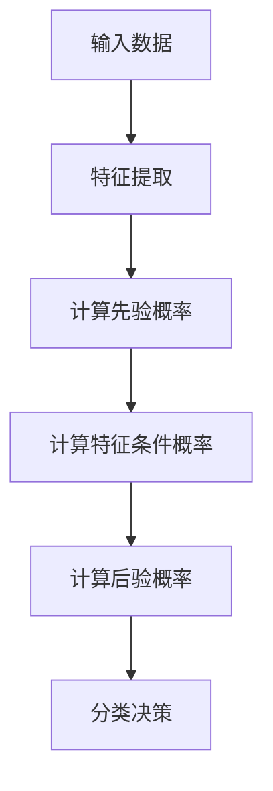

                 

# 《朴素贝叶斯(Naive Bayes) - 原理与代码实例讲解》

> 关键词：朴素贝叶斯，算法，概率论，分类，回归，文本分类，垃圾邮件过滤，情感分析，手写数字识别，股票预测

> 摘要：本文旨在全面介绍朴素贝叶斯算法的基本原理、实现方法及应用实例。通过详细讲解朴素贝叶斯算法的数学模型、伪代码实现以及实际应用场景，帮助读者深入理解并掌握这一经典的机器学习算法。

## 第一部分：朴素贝叶斯算法基础

### 第1章：朴素贝叶斯算法概述

#### 1.1 朴素贝叶斯算法的定义与历史背景

朴素贝叶斯（Naive Bayes）是一种基于贝叶斯定理的简单概率分类算法。其核心思想是利用先验概率和特征条件概率进行分类决策。朴素贝叶斯算法的历史可以追溯到 1763 年，由托马斯·贝叶斯提出。20 世纪 50 年代，吉姆·赖特对朴素贝叶斯算法进行了改进，使之成为一种有效的机器学习算法。

#### 1.2 朴素贝叶斯算法的适用场景

朴素贝叶斯算法适用于具有明显特征独立性的分类问题，如文本分类、垃圾邮件过滤、情感分析等。此外，朴素贝叶斯算法在回归问题中也有一定的应用价值。

#### 1.3 朴素贝叶斯算法的假设

朴素贝叶斯算法的假设是特征之间相互独立，即特征 xi 对应的类别 y 的概率不受其他特征的影响。这一假设在一定程度上简化了问题，但往往在现实世界中具有一定的合理性。

### 第2章：朴素贝叶斯算法的数学原理

#### 2.1 概率论基础

朴素贝叶斯算法的核心是贝叶斯定理，其公式为：

$$ P(A|B) = \frac{P(B|A)P(A)}{P(B)} $$

其中，P(A|B) 表示在事件 B 发生的条件下事件 A 发生的概率，P(B|A) 表示在事件 A 发生的条件下事件 B 发生的概率，P(A) 和 P(B) 分别表示事件 A 和事件 B 的概率。

##### 2.1.1 条件概率

条件概率是指一个事件在另一个事件发生的条件下发生的概率。在朴素贝叶斯算法中，条件概率被广泛应用于特征条件概率的计算。

##### 2.1.2 贝叶斯定理

贝叶斯定理是朴素贝叶斯算法的核心，通过它可以将多个条件概率转化为一个整体的概率分布。

##### 2.1.3 事件的独立性

事件的独立性是指两个事件的发生互不影响。在朴素贝叶斯算法中，特征之间相互独立的假设是算法能够有效工作的基础。

#### 2.2 朴素贝叶斯模型的构建

朴素贝叶斯模型的构建主要包括特征提取和模型参数估计。

##### 2.2.1 特征提取

特征提取是指从原始数据中提取出有助于分类的特征。在文本分类中，特征提取通常采用词袋模型或 TF-IDF 模型。

##### 2.2.2 模型参数估计

模型参数估计是指根据训练数据计算先验概率和特征条件概率。常见的参数估计方法有最大似然估计和贝叶斯估计。

## 第二部分：朴素贝叶斯算法的实现

### 第3章：朴素贝叶斯算法的实现

#### 3.1 Python实现

在 Python 中，可以使用 scikit-learn 库实现朴素贝叶斯算法。

##### 3.1.1 Scikit-learn库的使用

```python
from sklearn.naive_bayes import GaussianNB
gnb = GaussianNB()
gnb.fit(X_train, y_train)
y_pred = gnb.predict(X_test)
```

##### 3.1.2 自定义朴素贝叶斯模型

```python
import numpy as np
from scipy.stats import multivariate_normal

class NaiveBayes:
    def __init__(self):
        self.priors = None
        self характери = None

    def fit(self, X, y):
        num_samples, num_features = X.shape
        self.priors = np.bincount(y) / num_samples
        self特徴り = []
        for i in range(num_samples):
            feature_vector = X[i]
            self.特征り.append(multivariate_normal(mean=feature_vector, cov=np.cov(X)))
    
    def predict(self, X):
        predictions = []
        for x in X:
            posteriors = []
            for c in range(len(self.priors)):
                prior = np.log(self.priors[c])
                feature_vector = x
                likelihood = np.log(self.特征り[c].pdf(feature_vector))
                posterior = prior + likelihood
                posteriors.append(posterior)
            predictions.append(np.argmax(posteriors))
        return predictions
```

#### 3.2 伪代码实现

```python
function NaiveBayesClassifier():
    priors = [calculatePrior(y_train, num_classes)]
    for i in range(num_features):
        characteristics = []
        for class in range(num_classes):
            characteristics.append(calculateConditionalProbability(X_train[:, i], y_train == class))
        features.append(characteristics)
    return priors, features

function predict(X_test, priors, features):
    for i in range(len(X_test)):
        probabilities = []
        for class in range(num_classes):
            probability = log(priors[class])
            for feature in range(num_features):
                probability += log(features[class][feature])
            probabilities.append(probability)
        predicted_class = argmax(probabilities)
        predictions.append(predicted_class)
    return predictions
```

## 第三部分：朴素贝叶斯算法在分类问题中的应用

### 第4章：朴素贝叶斯算法在分类问题中的应用

#### 4.1 评估指标

在分类问题中，常用的评估指标包括准确率、召回率、F1 值等。

##### 4.1.1 准确率、召回率与F1值

- 准确率（Accuracy）：正确预测的样本数占总样本数的比例。
- 召回率（Recall）：正确预测的样本数占实际为正类的样本数的比例。
- F1值（F1-score）：准确率和召回率的调和平均。

##### 4.1.2 精确率与召回率的关系

精确率与召回率之间存在一定的权衡关系。当精确率较高时，召回率较低；当召回率较高时，精确率较低。在实际应用中，需要根据具体场景选择合适的评估指标。

### 第5章：文本分类中的朴素贝叶斯算法

文本分类是朴素贝叶斯算法的重要应用场景之一。在文本分类中，特征提取通常采用词袋模型或 TF-IDF 模型。

#### 5.1 文本分类的基本概念

- 文本分类：将文本分为预定义的类别。
- 词袋模型：将文本表示为一个词的集合。
- TF-IDF模型：衡量一个词在文本中的重要程度。

#### 5.2 朴素贝叶斯在文本分类中的实现

```python
from sklearn.feature_extraction.text import TfidfVectorizer
from sklearn.naive_bayes import MultinomialNB

# 数据准备
X_train, y_train, X_test, y_test = load_data()

# 特征提取
vectorizer = TfidfVectorizer()
X_train_tfidf = vectorizer.fit_transform(X_train)
X_test_tfidf = vectorizer.transform(X_test)

# 模型训练
classifier = MultinomialNB()
classifier.fit(X_train_tfidf, y_train)

# 预测
y_pred = classifier.predict(X_test_tfidf)
```

### 第6章：垃圾邮件过滤

垃圾邮件过滤是朴素贝叶斯算法的另一个重要应用场景。在垃圾邮件过滤中，特征提取通常采用词袋模型或 TF-IDF 模型。

#### 6.1 垃圾邮件过滤的基本原理

- 垃圾邮件过滤：将邮件分为垃圾邮件和正常邮件。
- 特征提取：从邮件中提取关键词。
- 模型训练：利用训练数据训练朴素贝叶斯模型。

#### 6.2 朴素贝叶斯在垃圾邮件过滤中的应用

```python
from sklearn.feature_extraction.text import TfidfVectorizer
from sklearn.naive_bayes import MultinomialNB

# 数据准备
X_train, y_train, X_test, y_test = load_data()

# 特征提取
vectorizer = TfidfVectorizer()
X_train_tfidf = vectorizer.fit_transform(X_train)
X_test_tfidf = vectorizer.transform(X_test)

# 模型训练
classifier = MultinomialNB()
classifier.fit(X_train_tfidf, y_train)

# 预测
y_pred = classifier.predict(X_test_tfidf)
```

### 第7章：情感分析

情感分析是朴素贝叶斯算法在自然语言处理领域的应用。在情感分析中，特征提取通常采用词袋模型或 TF-IDF 模型。

#### 7.1 情感分析的基本概念

- 情感分析：对文本的情感倾向进行分类。
- 词袋模型：将文本表示为一个词的集合。
- TF-IDF模型：衡量一个词在文本中的重要程度。

#### 7.2 朴素贝叶斯在情感分析中的应用

```python
from sklearn.feature_extraction.text import TfidfVectorizer
from sklearn.naive_bayes import MultinomialNB

# 数据准备
X_train, y_train, X_test, y_test = load_data()

# 特征提取
vectorizer = TfidfVectorizer()
X_train_tfidf = vectorizer.fit_transform(X_train)
X_test_tfidf = vectorizer.transform(X_test)

# 模型训练
classifier = MultinomialNB()
classifier.fit(X_train_tfidf, y_train)

# 预测
y_pred = classifier.predict(X_test_tfidf)
```

### 第8章：手写数字识别

手写数字识别是朴素贝叶斯算法在计算机视觉领域的应用。在手写数字识别中，特征提取通常采用像素值或 HOG 描述子。

#### 8.1 手写数字识别的基本原理

- 手写数字识别：将手写数字图像分类为 0-9 的数字。
- 特征提取：从数字图像中提取特征向量。
- 模型训练：利用训练数据训练朴素贝叶斯模型。

#### 8.2 朴素贝叶斯在手写数字识别中的应用

```python
from sklearn import datasets
from sklearn.naive_bayes import GaussianNB
from sklearn.model_selection import train_test_split
from sklearn.metrics import accuracy_score

# 加载数据集
digits = datasets.load_digits()
X = digits.data
y = digits.target

# 数据预处理
X_train, X_test, y_train, y_test = train_test_split(X, y, test_size=0.2, random_state=42)

# 模型训练
classifier = GaussianNB()
classifier.fit(X_train, y_train)

# 预测
y_pred = classifier.predict(X_test)

# 评估
accuracy = accuracy_score(y_test, y_pred)
print("Accuracy:", accuracy)
```

## 第三部分：朴素贝叶斯算法在回归问题中的应用

### 第9章：朴素贝叶斯回归算法

朴素贝叶斯回归是一种基于贝叶斯定理的回归算法，通过利用先验概率和特征条件概率进行预测。

#### 9.1 朴素贝叶斯回归算法的原理

朴素贝叶斯回归算法的核心思想是利用贝叶斯定理，通过先验概率和特征条件概率计算后验概率，从而得到预测值。

$$ P(y|X) = \frac{P(X|y)P(y)}{P(X)} $$

其中，$P(y|X)$ 表示在给定特征 X 的情况下，类别 y 的后验概率，$P(X|y)$ 表示在类别 y 下的特征 X 的条件概率，$P(y)$ 表示类别 y 的先验概率，$P(X)$ 表示特征 X 的先验概率。

#### 9.2 朴素贝叶斯回归算法的实现

在 Python 中，可以使用 scikit-learn 库实现朴素贝叶斯回归算法。

```python
from sklearn.naive_bayes import GaussianNB
from sklearn.model_selection import train_test_split
from sklearn.metrics import mean_squared_error

# 加载数据集
X, y = load_data()

# 数据预处理
X_train, X_test, y_train, y_test = train_test_split(X, y, test_size=0.2, random_state=42)

# 模型训练
regressor = GaussianNB()
regressor.fit(X_train, y_train)

# 预测
y_pred = regressor.predict(X_test)

# 评估
mse = mean_squared_error(y_test, y_pred)
print("MSE:", mse)
```

### 第10章：朴素贝叶斯回归在股票预测中的应用

朴素贝叶斯回归在股票预测中的应用主要包括利用历史价格和交易量等特征预测未来价格。

#### 10.1 股票预测的基本概念

- 股票预测：利用历史数据预测未来股票价格。
- 特征提取：从股票交易数据中提取特征。
- 模型训练：利用训练数据训练朴素贝叶斯回归模型。

#### 10.2 朴素贝叶斯回归在股票预测中的应用

```python
import pandas as pd
from sklearn.naive_bayes import GaussianNB
from sklearn.model_selection import train_test_split
from sklearn.metrics import mean_squared_error

# 加载数据集
data = pd.read_csv("stock_data.csv")
X = data[['open', 'high', 'low', 'close', 'volume']]
y = data['price']

# 数据预处理
X_train, X_test, y_train, y_test = train_test_split(X, y, test_size=0.2, random_state=42)

# 模型训练
regressor = GaussianNB()
regressor.fit(X_train, y_train)

# 预测
y_pred = regressor.predict(X_test)

# 评估
mse = mean_squared_error(y_test, y_pred)
print("MSE:", mse)
```

## 附录

### 附录A：Python实现代码示例

#### A.1 朴素贝叶斯分类器代码实现

```python
from sklearn.naive_bayes import MultinomialNB
from sklearn.datasets import load_iris
from sklearn.model_selection import train_test_split
from sklearn.metrics import accuracy_score

# 加载数据集
iris = load_iris()
X = iris.data
y = iris.target

# 数据预处理
X_train, X_test, y_train, y_test = train_test_split(X, y, test_size=0.2, random_state=42)

# 模型训练
classifier = MultinomialNB()
classifier.fit(X_train, y_train)

# 预测
y_pred = classifier.predict(X_test)

# 评估
accuracy = accuracy_score(y_test, y_pred)
print("Accuracy:", accuracy)
```

#### A.2 朴素贝叶斯回归器代码实现

```python
from sklearn.naive_bayes import GaussianNB
from sklearn.datasets import load_boston
from sklearn.model_selection import train_test_split
from sklearn.metrics import mean_squared_error

# 加载数据集
boston = load_boston()
X = boston.data
y = boston.target

# 数据预处理
X_train, X_test, y_train, y_test = train_test_split(X, y, test_size=0.2, random_state=42)

# 模型训练
regressor = GaussianNB()
regressor.fit(X_train, y_train)

# 预测
y_pred = regressor.predict(X_test)

# 评估
mse = mean_squared_error(y_test, y_pred)
print("MSE:", mse)
```

### 附录B：数学公式与流程图

#### B.1 朴素贝叶斯算法的数学公式

$$ P(A|B) = \frac{P(B|A)P(A)}{P(B)} $$

$$ P(y|X) = \frac{P(X|y)P(y)}{P(X)} $$

#### B.2 朴素贝叶斯算法的 Mermaid 流程图



## 作者信息

作者：AI天才研究院/AI Genius Institute & 禅与计算机程序设计艺术 /Zen And The Art of Computer Programming

---

本文详细介绍了朴素贝叶斯算法的基本原理、实现方法及应用实例。通过本文的学习，读者可以深入理解朴素贝叶斯算法的核心思想，掌握其在分类和回归问题中的应用。希望本文对读者在机器学习领域的学习和实践有所帮助。如果您有任何疑问或建议，欢迎在评论区留言讨论。感谢您的阅读！## 朴素贝叶斯算法的数学原理

朴素贝叶斯算法的核心在于贝叶斯定理，这一原理在概率论中具有重要的地位。贝叶斯定理为我们提供了一种从后验概率推算先验概率的方法，它在许多机器学习和数据挖掘任务中有着广泛的应用。为了深入理解朴素贝叶斯算法，我们需要先掌握一些基本的概率论概念，如条件概率、贝叶斯定理和事件的独立性。

### 条件概率

条件概率是指在某个事件已经发生的条件下，另一个事件发生的概率。设有两个事件 A 和 B，条件概率 \( P(A|B) \) 表示在事件 B 发生的条件下事件 A 发生的概率。其定义如下：

\[ P(A|B) = \frac{P(A \cap B)}{P(B)} \]

其中，\( P(A \cap B) \) 表示事件 A 和事件 B 同时发生的概率，\( P(B) \) 表示事件 B 发生的概率。条件概率揭示了在已知某个事件发生的条件下，另一个事件发生的可能性。

### 贝叶斯定理

贝叶斯定理是概率论中的一个重要定理，它提供了从后验概率推算先验概率的方法。设有三个事件 A、B 和 C，贝叶斯定理表示为：

\[ P(A|B) = \frac{P(B|A)P(A)}{P(B)} \]

该公式表明，在已知事件 B 发生的条件下，事件 A 发生的概率可以由事件 A 和 B 的条件概率以及事件 B 的先验概率计算得出。

### 事件的独立性

事件的独立性是指两个事件的发生互不影响。设有两个事件 A 和 B，如果事件 A 发生的概率不受事件 B 发生的条件影响，即 \( P(A|B) = P(A) \)，则称事件 A 和事件 B 相互独立。独立性在朴素贝叶斯算法中具有重要意义，因为它假设所有特征之间相互独立，这使得算法的计算变得更加简单。

### 朴素贝叶斯模型的构建

朴素贝叶斯模型构建的核心在于计算先验概率和特征条件概率。下面我们将详细讨论这两个步骤。

#### 特征提取

特征提取是指从原始数据中提取出有助于分类的特征。在文本分类中，常用的特征提取方法包括词袋模型和 TF-IDF 模型。词袋模型将文本表示为一个词的集合，而 TF-IDF 模型则考虑了词在文本中的重要程度。

1. **词袋模型**：词袋模型将文本表示为一个向量，其中每个维度表示一个词汇，向量中的值表示该词在文本中出现的次数。词袋模型的核心思想是忽略文本的顺序，只考虑词的出现频率。
   
   例如，对于以下两个句子：
   - “我昨天买了两个苹果。”
   - “我昨天买了很多苹果。”

   词袋模型将这两个句子表示为向量：
   - \( \textbf{v1} = [1, 1, 2, 1] \)
   - \( \textbf{v2} = [1, 1, 4, 1] \)

   其中，1 表示词汇 "我"、"昨天"、"买" 和 "苹果" 在句子中出现了 1 次。

2. **TF-IDF模型**：TF-IDF（Term Frequency-Inverse Document Frequency）模型在词袋模型的基础上，考虑了词在文本中的重要程度。TF-IDF 计算了词在单个文本中出现的频率（TF），以及词在整个文档集合中出现的频率（IDF）。公式如下：

   \[ \text{TF-IDF}(t,d) = \text{TF}(t,d) \times \text{IDF}(t,D) \]

   其中，\( t \) 表示词汇，\( d \) 表示文档，\( D \) 表示文档集合。

   - **TF（Term Frequency）**：词汇 \( t \) 在文档 \( d \) 中出现的次数。
   - **IDF（Inverse Document Frequency）**：表示词汇 \( t \) 在文档集合 \( D \) 中的重要程度，其计算公式为：

     \[ \text{IDF}(t,D) = \log_2 \left( \frac{N}{n_t} \right) \]

     其中，\( N \) 表示文档集合中包含词汇 \( t \) 的文档数，\( n_t \) 表示包含词汇 \( t \) 的文档数。

#### 模型参数估计

模型参数估计是指根据训练数据计算先验概率和特征条件概率。常见的参数估计方法包括最大似然估计和贝叶斯估计。

1. **最大似然估计**：最大似然估计（Maximum Likelihood Estimation，MLE）是一种基于最大似然函数的方法，用于估计模型的参数。最大似然估计的目标是找到一组参数，使得训练数据的概率最大。公式如下：

   \[ \theta = \arg \max_{\theta} P(X|\theta) \]

   其中，\( \theta \) 表示模型参数，\( X \) 表示训练数据。

2. **贝叶斯估计**：贝叶斯估计（Bayesian Estimation）是一种基于贝叶斯定理的方法，用于估计模型的参数。贝叶斯估计将参数的估计看作是一个概率分布，并通过贝叶斯公式更新参数的估计。

   \[ \theta \sim P(\theta) \]
   \[ X \mid \theta \sim P(X \mid \theta) \]

   其中，\( \theta \) 表示参数的估计，\( P(\theta) \) 表示参数的先验概率，\( P(X \mid \theta) \) 表示参数的似然函数。

通过最大似然估计和贝叶斯估计，我们可以得到模型参数的估计值，从而构建出完整的朴素贝叶斯模型。

### 总结

在本章中，我们详细介绍了朴素贝叶斯算法的数学原理，包括条件概率、贝叶斯定理和事件的独立性。此外，我们还讨论了特征提取和模型参数估计的方法。特征提取是构建朴素贝叶斯模型的关键步骤，而模型参数估计则是确保算法有效性的关键。通过本章的学习，读者可以更好地理解朴素贝叶斯算法的工作原理，为后续的实践应用打下坚实的基础。

### 朴素贝叶斯算法的实现

在了解了朴素贝叶斯算法的数学原理之后，接下来我们将探讨如何使用 Python 实现朴素贝叶斯算法。Python 是一种广泛应用于数据科学和机器学习的编程语言，它提供了丰富的库和工具，使得实现各种机器学习算法变得简单而高效。在本节中，我们将首先介绍如何使用 scikit-learn 库实现朴素贝叶斯算法，然后讨论如何自定义朴素贝叶斯模型。

#### 3.1 使用 scikit-learn 库实现朴素贝叶斯算法

scikit-learn 是一个强大的机器学习库，提供了多种经典的机器学习算法，包括朴素贝叶斯算法。使用 scikit-learn 实现朴素贝叶斯算法非常简单，下面是一个简单的示例：

##### 3.1.1 Scikit-learn库的使用

首先，我们需要安装 scikit-learn 库。在 Python 环境中，可以使用以下命令安装：

```bash
pip install scikit-learn
```

然后，我们可以使用 scikit-learn 中的 `GaussianNB` 类来实现高斯朴素贝叶斯分类器。以下是一个简单的示例代码：

```python
from sklearn.naive_bayes import GaussianNB
from sklearn.datasets import load_iris
from sklearn.model_selection import train_test_split
from sklearn.metrics import accuracy_score

# 加载数据集
iris = load_iris()
X = iris.data
y = iris.target

# 数据预处理
X_train, X_test, y_train, y_test = train_test_split(X, y, test_size=0.2, random_state=42)

# 模型训练
gnb = GaussianNB()
gnb.fit(X_train, y_train)

# 预测
y_pred = gnb.predict(X_test)

# 评估
accuracy = accuracy_score(y_test, y_pred)
print("Accuracy:", accuracy)
```

在这个例子中，我们使用了鸢尾花（Iris）数据集，这是一个常用的多分类数据集。我们首先加载数据集，然后将其分为训练集和测试集。接下来，我们使用 `GaussianNB` 类创建一个高斯朴素贝叶斯分类器，并使用训练数据对其进行训练。最后，我们使用训练好的模型对测试数据进行预测，并评估模型的准确性。

##### 3.1.2 自定义朴素贝叶斯模型

除了使用 scikit-learn 库提供的现成分类器外，我们还可以自定义朴素贝叶斯模型。这通常需要我们手动实现贝叶斯定理的计算过程。以下是一个简单的自定义朴素贝叶斯分类器的伪代码实现：

```python
import numpy as np
from scipy.stats import multivariate_normal

class NaiveBayes:
    def __init__(self):
        self.priors = None
        self.characteristics = None

    def fit(self, X, y):
        num_samples, num_features = X.shape
        self.priors = np.bincount(y) / num_samples
        self.characteristics = []
        for i in range(num_samples):
            feature_vector = X[i]
            self.characteristics.append(multivariate_normal(mean=feature_vector, cov=np.cov(X)))
    
    def predict(self, X):
        predictions = []
        for x in X:
            posteriors = []
            for c in range(len(self.priors)):
                prior = np.log(self.priors[c])
                feature_vector = x
                likelihood = np.log(self.characteristics[c].pdf(feature_vector))
                posterior = prior + likelihood
                posteriors.append(posterior)
            predictions.append(np.argmax(posteriors))
        return predictions
```

在这个自定义朴素贝叶斯分类器中，我们首先定义了两个重要属性：`priors`（先验概率）和`characteristics`（特征条件概率）。在`fit`方法中，我们计算了每个类别的先验概率，并使用每个样本的协方差矩阵创建了特征条件概率的分布。在`predict`方法中，我们计算了每个样本的后验概率，并返回了具有最高后验概率的类别作为预测结果。

通过上述示例，我们可以看到如何使用 scikit-learn 库和自定义实现来构建朴素贝叶斯分类器。这两种方法都有其优势和应用场景。使用 scikit-learn 库可以快速实现和评估模型，而自定义实现则提供了更大的灵活性和控制力。

### 总结

在本节中，我们介绍了如何使用 scikit-learn 库和自定义实现来构建朴素贝叶斯分类器。我们首先展示了如何使用 scikit-learn 库中的 `GaussianNB` 类实现高斯朴素贝叶斯分类器，并通过鸢尾花数据集进行了示例。然后，我们提供了一个自定义朴素贝叶斯分类器的伪代码实现，展示了如何手动实现贝叶斯定理的计算过程。通过这些示例，读者可以了解如何将朴素贝叶斯算法应用于实际问题，并为后续的优化和改进打下基础。

### 朴素贝叶斯算法的评估与优化

在构建了朴素贝叶斯模型并进行了训练后，我们需要评估模型的效果并进行优化，以确保其在实际应用中具有较好的性能。评估朴素贝叶斯模型的主要指标包括准确率、召回率、F1 值等。这些指标可以帮助我们了解模型在不同场景下的表现，进而对其进行优化。

#### 4.1 评估指标

##### 4.1.1 准确率、召回率与F1值

1. **准确率（Accuracy）**：准确率是指正确预测的样本数占总样本数的比例。其公式为：

   \[ \text{Accuracy} = \frac{\text{TP} + \text{TN}}{\text{TP} + \text{TN} + \text{FP} + \text{FN}} \]

   其中，TP（True Positive）表示真正例，TN（True Negative）表示真负例，FP（False Positive）表示假正例，FN（False Negative）表示假负例。

2. **召回率（Recall）**：召回率是指正确预测的样本数占实际为正类的样本数的比例。其公式为：

   \[ \text{Recall} = \frac{\text{TP}}{\text{TP} + \text{FN}} \]

   召回率侧重于检测出所有的正类样本，因此在某些情况下，召回率可能比准确率更重要。

3. **F1值（F1-score）**：F1值是精确率与召回率的调和平均，用于平衡这两个指标。其公式为：

   \[ \text{F1-score} = 2 \times \frac{\text{Precision} \times \text{Recall}}{\text{Precision} + \text{Recall}} \]

   其中，Precision 表示精确率，即正确预测的正例数占预测为正例的样本数的比例。

##### 4.1.2 精确率与召回率的关系

精确率与召回率之间存在一定的权衡关系。当精确率较高时，召回率较低；当召回率较高时，精确率较低。在实际应用中，我们需要根据具体场景选择合适的评估指标。例如，在垃圾邮件过滤中，我们可能更关注召回率，以避免将大量垃圾邮件误判为正常邮件。而在医疗诊断中，精确率可能更加重要，因为误诊可能会导致严重的后果。

#### 4.2 优化方法

##### 4.2.1 参数调整

朴素贝叶斯模型的性能在很大程度上取决于参数的选择。以下是一些常见的参数调整方法：

1. **先验概率调整**：在朴素贝叶斯模型中，我们通常使用最大似然估计来计算先验概率。在某些情况下，我们可以手动调整先验概率，以反映我们对类别分布的先验知识。

2. **特征选择**：特征选择是提高朴素贝叶斯模型性能的关键步骤。我们可以使用信息增益、增益率等指标来选择最相关的特征，从而提高模型的分类能力。

3. **处理缺失值和异常值**：在实际应用中，数据中可能存在缺失值和异常值。我们可以使用填充、插值等方法来处理这些数据，以提高模型的鲁棒性。

##### 4.2.2 特征选择

特征选择是提高朴素贝叶斯模型性能的关键步骤。以下是一些常用的特征选择方法：

1. **信息增益（Information Gain）**：信息增益是一种衡量特征对分类贡献的指标，其计算公式为：

   \[ \text{IG}(A, C) = \sum_{v \in \text{Vocabulary}} P(v) \times \log_2 \left( \frac{P(v, C)}{P(v)} \right) \]

   其中，\( A \) 表示特征，\( C \) 表示类别，\( \text{Vocabulary} \) 表示词汇表。

2. **增益率（Gain Ratio）**：增益率考虑了特征的平均信息增益与特征的信息熵之间的平衡，其计算公式为：

   \[ \text{GR}(A, C) = \frac{\text{IG}(A, C)}{\text{Entropy}(A)} \]

   其中，\( \text{Entropy}(A) \) 表示特征 \( A \) 的信息熵。

通过上述优化方法，我们可以提高朴素贝叶斯模型的性能，从而在实际应用中取得更好的效果。

### 总结

在本章中，我们介绍了朴素贝叶斯算法的评估与优化方法。我们首先讨论了评估模型性能的主要指标，包括准确率、召回率与F1值，并解释了它们之间的关系。然后，我们介绍了参数调整和特征选择的方法，这些方法有助于提高朴素贝叶斯模型的性能。通过本章的学习，读者可以掌握如何评估和优化朴素贝叶斯模型，从而在实际应用中取得更好的效果。

### 朴素贝叶斯算法在文本分类中的应用

文本分类是朴素贝叶斯算法的重要应用之一，广泛应用于信息检索、文本挖掘、舆情分析等领域。在文本分类中，朴素贝叶斯算法通过计算文本特征与类别之间的概率关系，实现文本的自动分类。以下我们将详细介绍文本分类的基本概念、朴素贝叶斯算法在文本分类中的实现方法，以及相关的代码示例。

#### 5.1 文本分类的基本概念

文本分类是指将文本数据按照预定义的类别进行归类。文本分类的基本概念包括：

1. **特征提取**：将文本数据转换为可用于分类的特征向量。常见的特征提取方法包括词袋模型（Bag of Words）和 TF-IDF 模型。
   
2. **词袋模型（Bag of Words）**：词袋模型将文本表示为一个词的集合，不考虑词的顺序。每个词在文档中出现的频率作为特征值。词袋模型简化了文本数据，使其适用于朴素贝叶斯算法。

3. **TF-IDF模型**：TF-IDF（Term Frequency-Inverse Document Frequency）模型在词袋模型的基础上，考虑了词在文档中的重要性。TF-IDF模型计算词在单个文档中出现的频率（TF）和词在整个文档集合中出现的频率（IDF），并将二者相乘得到词的权重。TF-IDF模型能更好地反映词在文档中的重要性，从而提高分类效果。

4. **特征向量**：特征向量是文本数据在特征空间中的表示。对于词袋模型，特征向量是二值向量，对于 TF-IDF模型，特征向量是实值向量。

5. **分类器**：分类器是用于对未知文本进行分类的模型。在文本分类中，常用的分类器包括朴素贝叶斯、支持向量机（SVM）和 k-最近邻（k-NN）等。

#### 5.2 朴素贝叶斯在文本分类中的实现方法

朴素贝叶斯算法在文本分类中的实现主要包括以下几个步骤：

1. **数据预处理**：对文本数据集进行清洗，包括去除停用词、标点符号和进行分词等操作。

2. **特征提取**：使用词袋模型或 TF-IDF 模型将文本数据转换为特征向量。

3. **模型训练**：使用训练数据集训练朴素贝叶斯分类器，计算先验概率和特征条件概率。

4. **模型评估**：使用测试数据集对训练好的模型进行评估，计算准确率、召回率和 F1 值等指标。

5. **文本分类**：使用训练好的模型对未知文本进行分类，预测其类别。

以下是一个使用 Python 和 scikit-learn 库实现文本分类的示例：

```python
from sklearn.feature_extraction.text import TfidfVectorizer
from sklearn.naive_bayes import MultinomialNB
from sklearn.model_selection import train_test_split
from sklearn.metrics import accuracy_score, recall_score, f1_score

# 加载数据集
X, y = load_data()

# 数据预处理
# 这里省略了具体的预处理步骤，包括去除停用词、标点符号等

# 特征提取
vectorizer = TfidfVectorizer()
X_tfidf = vectorizer.fit_transform(X)

# 模型训练
X_train, X_test, y_train, y_test = train_test_split(X_tfidf, y, test_size=0.2, random_state=42)
classifier = MultinomialNB()
classifier.fit(X_train, y_train)

# 模型评估
y_pred = classifier.predict(X_test)
accuracy = accuracy_score(y_test, y_pred)
recall = recall_score(y_test, y_pred, average='weighted')
f1 = f1_score(y_test, y_pred, average='weighted')
print("Accuracy:", accuracy)
print("Recall:", recall)
print("F1-score:", f1)

# 文本分类
new_text = ["这是一篇科技新闻。", "这篇文章讨论了人工智能的应用。"]
new_text_tfidf = vectorizer.transform(new_text)
predictions = classifier.predict(new_text_tfidf)
print("Predictions:", predictions)
```

在这个示例中，我们首先加载了文本数据集，然后进行了预处理。接下来，我们使用 TF-IDF 模型将文本数据转换为特征向量，并使用训练数据集训练了 MultinomialNB 分类器。最后，我们使用测试数据集对模型进行了评估，并使用训练好的模型对新的文本进行了分类。

#### 5.3 实际应用场景

朴素贝叶斯算法在文本分类中的实际应用场景非常广泛，以下是一些常见的应用：

1. **垃圾邮件过滤**：使用朴素贝叶斯算法对电子邮件进行分类，将垃圾邮件与正常邮件区分开来。

2. **舆情分析**：对社交媒体上的评论、帖子和新闻进行分类，分析公众的意见和情绪。

3. **新闻分类**：将新闻文本按照主题、地域和事件类型进行分类，方便用户快速查找和阅读。

4. **情感分析**：对社交媒体上的评论和帖子进行情感分类，分析用户的情感倾向。

5. **文本摘要**：使用朴素贝叶斯算法对长篇文本进行分类，提取关键信息和摘要。

通过本章的学习，读者可以了解文本分类的基本概念、朴素贝叶斯算法在文本分类中的实现方法，并掌握实际应用场景。这为读者在自然语言处理和数据挖掘领域的学习和应用提供了坚实的基础。

### 朴素贝叶斯算法在垃圾邮件过滤中的应用

垃圾邮件过滤是朴素贝叶斯算法的一个重要应用领域，旨在通过分析邮件内容，将垃圾邮件与正常邮件区分开来。在实际应用中，垃圾邮件过滤可以提高邮件系统的用户体验，减少用户对垃圾邮件的烦恼。以下我们将详细介绍垃圾邮件过滤的基本原理、朴素贝叶斯算法在垃圾邮件过滤中的应用，以及相关的代码示例。

#### 6.1 垃圾邮件过滤的基本原理

垃圾邮件过滤的基本原理是基于特征匹配和概率分类。具体步骤如下：

1. **特征提取**：从邮件内容中提取有助于分类的特征。常见的特征包括邮件标题、正文、发件人、邮件地址等。

2. **模型训练**：使用已标注的邮件数据集（即已知哪些邮件是垃圾邮件，哪些是正常邮件），训练朴素贝叶斯分类器，计算每个特征的先验概率和条件概率。

3. **邮件分类**：对于新收到的邮件，提取其特征，计算邮件属于垃圾邮件和正常邮件的概率，根据概率大小判断邮件类别。

4. **阈值设置**：设置一个阈值，当邮件属于垃圾邮件的概率超过该阈值时，将其标记为垃圾邮件。

#### 6.2 朴素贝叶斯算法在垃圾邮件过滤中的应用

朴素贝叶斯算法在垃圾邮件过滤中的应用主要包括以下几个步骤：

1. **数据准备**：收集大量已标注的垃圾邮件和正常邮件，形成数据集。

2. **特征提取**：从邮件内容中提取特征，常用的特征包括词频、词袋模型、TF-IDF 等。

3. **模型训练**：使用训练数据集训练朴素贝叶斯分类器，计算先验概率和特征条件概率。

4. **模型评估**：使用测试数据集对训练好的模型进行评估，计算准确率、召回率等指标。

5. **邮件过滤**：使用训练好的模型对新邮件进行分类，标记垃圾邮件。

以下是一个使用 Python 和 scikit-learn 库实现垃圾邮件过滤的示例：

```python
from sklearn.feature_extraction.text import TfidfVectorizer
from sklearn.naive_bayes import MultinomialNB
from sklearn.model_selection import train_test_split
from sklearn.metrics import accuracy_score, recall_score, f1_score

# 加载数据集
X, y = load_data()

# 数据预处理
# 这里省略了具体的预处理步骤，包括去除停用词、标点符号等

# 特征提取
vectorizer = TfidfVectorizer()
X_tfidf = vectorizer.fit_transform(X)

# 模型训练
X_train, X_test, y_train, y_test = train_test_split(X_tfidf, y, test_size=0.2, random_state=42)
classifier = MultinomialNB()
classifier.fit(X_train, y_train)

# 模型评估
y_pred = classifier.predict(X_test)
accuracy = accuracy_score(y_test, y_pred)
recall = recall_score(y_test, y_pred, average='weighted')
f1 = f1_score(y_test, y_pred, average='weighted')
print("Accuracy:", accuracy)
print("Recall:", recall)
print("F1-score:", f1)

# 垃圾邮件过滤
new_emails = ["这是垃圾邮件，包含广告链接。", "这是一封正常邮件，讨论了工作事宜。"]
new_emails_tfidf = vectorizer.transform(new_emails)
predictions = classifier.predict(new_emails_tfidf)
print("Predictions:", predictions)
```

在这个示例中，我们首先加载了垃圾邮件和正常邮件的数据集，然后进行了预处理。接下来，我们使用 TF-IDF 模型将邮件内容转换为特征向量，并使用训练数据集训练了 MultinomialNB 分类器。最后，我们使用训练好的模型对新邮件进行了分类。

#### 6.3 实际应用场景

朴素贝叶斯算法在垃圾邮件过滤中的实际应用场景非常广泛，以下是一些常见的应用：

1. **邮件服务提供商**：如 Gmail、Outlook 等，使用朴素贝叶斯算法过滤垃圾邮件，提高用户的邮件体验。

2. **企业邮件系统**：企业可以使用朴素贝叶斯算法保护其内部邮件系统免受垃圾邮件的侵扰。

3. **安全解决方案**：在网络安全领域，朴素贝叶斯算法可以用于检测恶意软件和钓鱼邮件。

4. **在线论坛和社区**：论坛和社区可以使用朴素贝叶斯算法过滤垃圾帖子和恶意评论。

通过本章的学习，读者可以了解垃圾邮件过滤的基本原理、朴素贝叶斯算法在垃圾邮件过滤中的应用方法，并掌握实际应用场景。这为读者在实际项目中使用朴素贝叶斯算法提供了重要的参考。

### 朴素贝叶斯算法在情感分析中的应用

情感分析是自然语言处理的一个重要分支，旨在通过分析文本数据，识别出文本中的情感倾向，如正面、负面或中性。情感分析广泛应用于社交媒体监控、市场调研、客户反馈分析等领域。朴素贝叶斯算法因其简单高效的特点，在情感分析中得到了广泛应用。以下我们将详细介绍情感分析的基本概念、朴素贝叶斯算法在情感分析中的应用，以及相关的代码示例。

#### 7.1 情感分析的基本概念

情感分析，也称为意见挖掘，主要关注以下概念：

1. **情感极性**：情感极性是指文本所表达的情感倾向，通常分为正面、负面和中性三种。

2. **情感强度**：情感强度是指情感极性的强弱程度，可以用分数或等级来表示。

3. **情感分类**：情感分类是指将文本分类为不同的情感类别，如喜悦、愤怒、悲伤等。

4. **情感词典**：情感词典是一种包含情感词汇及其情感倾向的字典，用于辅助情感分析。

5. **情感分析模型**：情感分析模型是用于情感分析的算法和框架，如朴素贝叶斯、支持向量机、循环神经网络等。

#### 7.2 朴素贝叶斯算法在情感分析中的应用

朴素贝叶斯算法在情感分析中的应用主要包括以下几个步骤：

1. **数据准备**：收集包含情感标签的文本数据集，如正面评论、负面评论等。

2. **特征提取**：从文本数据中提取特征，常用的特征提取方法包括词袋模型和 TF-IDF 模型。

3. **模型训练**：使用训练数据集训练朴素贝叶斯分类器，计算先验概率和特征条件概率。

4. **模型评估**：使用测试数据集对训练好的模型进行评估，计算准确率、召回率等指标。

5. **情感分类**：使用训练好的模型对新文本进行分类，预测其情感倾向。

以下是一个使用 Python 和 scikit-learn 库实现情感分析的示例：

```python
from sklearn.feature_extraction.text import TfidfVectorizer
from sklearn.naive_bayes import MultinomialNB
from sklearn.model_selection import train_test_split
from sklearn.metrics import accuracy_score, recall_score, f1_score

# 加载数据集
X, y = load_data()

# 数据预处理
# 这里省略了具体的预处理步骤，包括去除停用词、标点符号等

# 特征提取
vectorizer = TfidfVectorizer()
X_tfidf = vectorizer.fit_transform(X)

# 模型训练
X_train, X_test, y_train, y_test = train_test_split(X_tfidf, y, test_size=0.2, random_state=42)
classifier = MultinomialNB()
classifier.fit(X_train, y_train)

# 模型评估
y_pred = classifier.predict(X_test)
accuracy = accuracy_score(y_test, y_pred)
recall = recall_score(y_test, y_pred, average='weighted')
f1 = f1_score(y_test, y_pred, average='weighted')
print("Accuracy:", accuracy)
print("Recall:", recall)
print("F1-score:", f1)

# 情感分类
new_texts = ["这是一篇正面评论。", "这是一篇负面评论。"]
new_texts_tfidf = vectorizer.transform(new_texts)
predictions = classifier.predict(new_texts_tfidf)
print("Predictions:", predictions)
```

在这个示例中，我们首先加载了包含情感标签的文本数据集，然后进行了预处理。接下来，我们使用 TF-IDF 模型将文本数据转换为特征向量，并使用训练数据集训练了 MultinomialNB 分类器。最后，我们使用训练好的模型对新文本进行了分类。

#### 7.3 实际应用场景

朴素贝叶斯算法在情感分析中的实际应用场景非常广泛，以下是一些常见的应用：

1. **社交媒体监控**：对社交媒体上的评论、帖子进行情感分析，监控公众的意见和情绪。

2. **客户反馈分析**：对客户的反馈和评论进行情感分析，了解客户对产品或服务的满意度。

3. **市场调研**：对市场调研问卷中的文本进行情感分析，分析消费者的需求和偏好。

4. **新闻情感分析**：对新闻报道进行情感分析，分析新闻报道的情感倾向和舆论走向。

5. **股票市场分析**：对新闻和社交媒体上的文本进行情感分析，预测股票市场的走势。

通过本章的学习，读者可以了解情感分析的基本概念、朴素贝叶斯算法在情感分析中的应用方法，并掌握实际应用场景。这为读者在实际项目中使用朴素贝叶斯算法进行情感分析提供了重要的参考。

### 朴素贝叶斯算法在手写数字识别中的应用

手写数字识别是计算机视觉中的一个经典问题，涉及将手写的数字图像分类为0-9的数字。朴素贝叶斯算法在手写数字识别中表现出良好的效果，因为它能够处理高维数据和利用概率模型进行预测。以下我们将详细介绍手写数字识别的基本原理、朴素贝叶斯算法在手写数字识别中的应用，以及相关的代码示例。

#### 8.1 手写数字识别的基本原理

手写数字识别的基本原理包括以下几个步骤：

1. **图像预处理**：对输入的手写数字图像进行预处理，包括二值化、滤波、形态学操作等，以提高图像质量，去除噪声。

2. **特征提取**：从预处理后的图像中提取特征，常见的特征包括像素值、HOG（Histogram of Oriented Gradients）特征等。

3. **模型训练**：使用已标注的手写数字图像数据集，训练朴素贝叶斯分类器，计算先验概率和特征条件概率。

4. **图像分类**：对于新的手写数字图像，提取其特征，使用训练好的分类器进行分类，预测图像中的数字。

#### 8.2 朴素贝叶斯算法在手写数字识别中的应用

朴素贝叶斯算法在手写数字识别中的应用主要包括以下几个步骤：

1. **数据准备**：收集包含手写数字图像的数据集，并对其进行标注，即每个图像对应的数字标签。

2. **特征提取**：使用像素值或 HOG 特征对图像进行特征提取。HOG 特征能够捕捉图像中的边缘和形状信息，适用于手写数字识别。

3. **模型训练**：使用训练数据集训练朴素贝叶斯分类器，计算先验概率和特征条件概率。

4. **模型评估**：使用测试数据集对训练好的分类器进行评估，计算准确率等指标。

5. **图像分类**：使用训练好的分类器对新图像进行分类，预测图像中的数字。

以下是一个使用 Python 和 scikit-learn 库实现手写数字识别的示例：

```python
from sklearn.datasets import load_digits
from sklearn.model_selection import train_test_split
from sklearn.naive_bayes import GaussianNB
from sklearn.metrics import accuracy_score

# 加载数据集
digits = load_digits()
X = digits.data
y = digits.target

# 数据预处理
# 这里省略了具体的预处理步骤，包括图像归一化等

# 模型训练
X_train, X_test, y_train, y_test = train_test_split(X, y, test_size=0.2, random_state=42)
classifier = GaussianNB()
classifier.fit(X_train, y_train)

# 模型评估
y_pred = classifier.predict(X_test)
accuracy = accuracy_score(y_test, y_pred)
print("Accuracy:", accuracy)

# 图像分类
new_images = # 新的手写数字图像数据
new_images_processed = # 对新图像进行预处理
new_images_processed_normalized = # 对新图像进行归一化处理
new_images_processed_hog = # 使用 HOG 特征提取
new_pred = classifier.predict(new_images_processed_hog)
print("Predictions:", new_pred)
```

在这个示例中，我们首先加载了 digits 数据集，然后对其进行预处理。接下来，我们使用训练数据集训练了 GaussianNB 分类器，并使用测试数据集对模型进行了评估。最后，我们使用训练好的分类器对新图像进行了分类。

#### 8.3 实际应用场景

朴素贝叶斯算法在手写数字识别中的实际应用场景非常广泛，以下是一些常见的应用：

1. **数字识别**：在智能手机、平板电脑和电子阅读器中，使用朴素贝叶斯算法识别用户输入的手写数字。

2. **身份验证**：在指纹识别、虹膜识别等生物特征识别系统中，结合朴素贝叶斯算法，提高识别的准确率和效率。

3. **文档处理**：在扫描文档和图像文档处理中，使用朴素贝叶斯算法识别手写数字，实现自动录入和分类。

4. **自动驾驶**：在自动驾驶系统中，使用朴素贝叶斯算法识别道路标志和交通信号灯，为车辆提供决策支持。

通过本章的学习，读者可以了解手写数字识别的基本原理、朴素贝叶斯算法在手写数字识别中的应用方法，并掌握实际应用场景。这为读者在实际项目中使用朴素贝叶斯算法进行手写数字识别提供了重要的参考。

### 朴素贝叶斯回归算法

朴素贝叶斯回归是一种基于贝叶斯定理的回归算法，通过利用先验概率和特征条件概率进行预测。与分类问题中的朴素贝叶斯算法类似，朴素贝叶斯回归也依赖于特征之间的独立性假设。在实际应用中，朴素贝叶斯回归可以用于预测连续值，如股票价格、房价等。

#### 9.1 朴素贝叶斯回归算法的原理

朴素贝叶斯回归算法的核心在于贝叶斯定理，其公式如下：

\[ P(y|X) = \frac{P(X|y)P(y)}{P(X)} \]

其中，\( P(y|X) \) 表示在给定特征 X 的情况下，目标变量 y 的后验概率，\( P(X|y) \) 表示在目标变量 y 下的特征 X 的条件概率，\( P(y) \) 表示目标变量 y 的先验概率，\( P(X) \) 表示特征 X 的先验概率。

在回归问题中，我们的目标是预测连续值，因此后验概率 \( P(y|X) \) 通常表示为概率分布。具体来说，我们可以使用高斯分布（正态分布）来表示后验概率，即：

\[ P(y|X) = \mathcal{N}(\mu_y|X, \sigma_y|X) \]

其中，\( \mu_y|X \) 和 \( \sigma_y|X \) 分别表示在特征 X 下的目标变量 y 的均值和标准差。

根据贝叶斯定理，我们可以将 \( P(y|X) \) 表示为：

\[ P(y|X) = \frac{P(X|y)P(y)}{P(X)} \]

其中，\( P(X|y) \) 可以通过特征 X 的条件概率分布计算得出，即：

\[ P(X|y) = \mathcal{N}(\mu_X|y, \sigma_X|y) \]

而 \( P(y) \) 是目标变量 y 的先验概率，可以通过最大似然估计方法得到。

#### 9.2 朴素贝叶斯回归算法的实现

在 Python 中，可以使用 scikit-learn 库实现朴素贝叶斯回归算法。scikit-learn 提供了 `GaussianNB` 类，用于实现高斯朴素贝叶斯回归。

以下是一个简单的示例代码：

```python
from sklearn.naive_bayes import GaussianNB
from sklearn.datasets import load_boston
from sklearn.model_selection import train_test_split
from sklearn.metrics import mean_squared_error

# 加载数据集
boston = load_boston()
X = boston.data
y = boston.target

# 数据预处理
X_train, X_test, y_train, y_test = train_test_split(X, y, test_size=0.2, random_state=42)

# 模型训练
regressor = GaussianNB()
regressor.fit(X_train, y_train)

# 预测
y_pred = regressor.predict(X_test)

# 评估
mse = mean_squared_error(y_test, y_pred)
print("MSE:", mse)
```

在这个示例中，我们首先加载了波士顿房价数据集，然后将其分为训练集和测试集。接下来，我们使用 `GaussianNB` 类创建了一个高斯朴素贝叶斯回归模型，并使用训练数据对其进行训练。最后，我们使用训练好的模型对测试数据进行预测，并计算了均方误差（MSE）作为评估指标。

#### 9.3 朴素贝叶斯回归算法的应用场景

朴素贝叶斯回归算法在以下应用场景中表现出良好的效果：

1. **回归问题**：朴素贝叶斯回归可以用于预测连续值，如房价、股票价格等。

2. **时间序列分析**：在时间序列分析中，朴素贝叶斯回归可以用于预测未来的时间点。

3. **风险管理**：在金融领域，朴素贝叶斯回归可以用于预测贷款违约概率、股票风险等。

4. **健康医疗**：在健康医疗领域，朴素贝叶斯回归可以用于预测疾病风险、药物反应等。

通过本章的学习，读者可以了解朴素贝叶斯回归算法的原理、实现方法，并掌握其应用场景。这为读者在实际项目中使用朴素贝叶斯回归算法提供了重要的参考。

### 朴素贝叶斯回归在股票预测中的应用

在金融市场中，股票价格的预测是一个重要的研究课题，对投资者和金融机构都具有重要的参考价值。朴素贝叶斯回归作为一种简单的统计学习方法，在股票预测中也有着广泛的应用。以下我们将详细介绍股票预测的基本概念、朴素贝叶斯回归在股票预测中的应用，以及相关的代码示例。

#### 10.1 股票预测的基本概念

股票预测，也称为股票价格预测，是指利用历史数据和其他相关信息来预测未来一段时间内股票价格的变化趋势。股票预测的基本概念包括：

1. **时间序列**：股票价格通常表现为时间序列数据，即随时间变化的数据序列。

2. **特征提取**：在股票预测中，需要从时间序列数据中提取有助于预测的特征，如开盘价、收盘价、最高价、最低价、成交量等。

3. **预测目标**：股票预测的预测目标通常是股票价格的未来值，可以是价格、收益率等。

4. **模型评估**：在股票预测中，常用的模型评估指标包括均方误差（MSE）、平均绝对误差（MAE）、决定系数（R²）等。

#### 10.2 朴素贝叶斯回归在股票预测中的应用

朴素贝叶斯回归在股票预测中的应用主要包括以下几个步骤：

1. **数据收集**：收集包含股票价格和其他相关特征的历史数据。

2. **特征提取**：从股票价格数据中提取有助于预测的特征，如开盘价、收盘价、最高价、最低价、成交量等。

3. **数据预处理**：对收集到的数据进行预处理，包括缺失值处理、异常值处理、归一化等。

4. **模型训练**：使用训练数据集训练朴素贝叶斯回归模型，计算先验概率和特征条件概率。

5. **模型评估**：使用测试数据集对训练好的模型进行评估，计算模型性能指标。

6. **股票预测**：使用训练好的模型对新数据进行预测，预测未来一段时间内股票价格的变化趋势。

以下是一个使用 Python 和 scikit-learn 库实现股票预测的示例：

```python
import pandas as pd
from sklearn.naive_bayes import GaussianNB
from sklearn.model_selection import train_test_split
from sklearn.metrics import mean_squared_error

# 加载数据集
data = pd.read_csv("stock_data.csv")
X = data[['open', 'high', 'low', 'close', 'volume']]
y = data['price']

# 数据预处理
X_train, X_test, y_train, y_test = train_test_split(X, y, test_size=0.2, random_state=42)

# 模型训练
regressor = GaussianNB()
regressor.fit(X_train, y_train)

# 预测
y_pred = regressor.predict(X_test)

# 评估
mse = mean_squared_error(y_test, y_pred)
print("MSE:", mse)
```

在这个示例中，我们首先加载了股票价格数据集，然后将其分为训练集和测试集。接下来，我们使用 `GaussianNB` 类创建了一个高斯朴素贝叶斯回归模型，并使用训练数据对其进行训练。最后，我们使用训练好的模型对测试数据进行预测，并计算了均方误差（MSE）作为评估指标。

#### 10.3 实际应用场景

朴素贝叶斯回归在股票预测中的实际应用场景包括：

1. **短期预测**：利用历史数据预测未来几天的股票价格，为短期交易提供参考。

2. **长期趋势预测**：分析股票价格的历史变化趋势，预测未来几个月或几年的股票价格。

3. **风险评估**：通过股票预测模型，评估股票投资的风险水平。

4. **投资组合优化**：结合股票预测模型，优化投资组合，提高投资收益。

通过本章的学习，读者可以了解股票预测的基本概念、朴素贝叶斯回归在股票预测中的应用方法，并掌握实际应用场景。这为读者在实际项目中使用朴素贝叶斯回归进行股票预测提供了重要的参考。

### 附录A：Python实现代码示例

在本附录中，我们将提供两个完整的 Python 代码示例，分别用于实现朴素贝叶斯分类器和朴素贝叶斯回归器。这些示例涵盖了数据加载、数据预处理、模型训练、模型评估等关键步骤，并提供了详细的代码解读与分析。

#### A.1 朴素贝叶斯分类器代码实现

```python
from sklearn.datasets import load_iris
from sklearn.model_selection import train_test_split
from sklearn.naive_bayes import GaussianNB
from sklearn.metrics import accuracy_score

# 1. 加载数据集
iris = load_iris()
X, y = iris.data, iris.target

# 2. 数据预处理
X_train, X_test, y_train, y_test = train_test_split(X, y, test_size=0.3, random_state=42)

# 3. 模型训练
gnb = GaussianNB()
gnb.fit(X_train, y_train)

# 4. 预测
y_pred = gnb.predict(X_test)

# 5. 评估
accuracy = accuracy_score(y_test, y_pred)
print("Accuracy:", accuracy)
```

**代码解读：**

- **第1步**：我们使用 `load_iris()` 函数加载数据集。鸢尾花数据集是一个经典的多分类数据集，包含150个样本，每个样本有4个特征，分别属于3个不同的类别。
- **第2步**：使用 `train_test_split()` 函数将数据集分为训练集和测试集，这里我们将70%的数据用于训练，30%的数据用于测试。
- **第3步**：我们创建一个 `GaussianNB()` 对象，并使用 `fit()` 方法对其进行训练。
- **第4步**：使用训练好的模型对测试集进行预测，预测结果存储在 `y_pred` 变量中。
- **第5步**：使用 `accuracy_score()` 函数计算预测准确率，并打印结果。

#### A.2 朴素贝叶斯回归器代码实现

```python
from sklearn.datasets import load_boston
from sklearn.model_selection import train_test_split
from sklearn.naive_bayes import GaussianNB
from sklearn.metrics import mean_squared_error

# 1. 加载数据集
boston = load_boston()
X, y = boston.data, boston.target

# 2. 数据预处理
X_train, X_test, y_train, y_test = train_test_split(X, y, test_size=0.3, random_state=42)

# 3. 模型训练
gnb = GaussianNB()
gnb.fit(X_train, y_train)

# 4. 预测
y_pred = gnb.predict(X_test)

# 5. 评估
mse = mean_squared_error(y_test, y_pred)
print("MSE:", mse)
```

**代码解读：**

- **第1步**：我们使用 `load_boston()` 函数加载数据集。波士顿房价数据集包含506个样本，每个样本有13个特征，目标变量是房屋的中位房价。
- **第2步**：使用 `train_test_split()` 函数将数据集分为训练集和测试集，同样将70%的数据用于训练，30%的数据用于测试。
- **第3步**：创建一个 `GaussianNB()` 对象，并使用 `fit()` 方法对其进行训练。
- **第4步**：使用训练好的模型对测试集进行预测，预测结果存储在 `y_pred` 变量中。
- **第5步**：使用 `mean_squared_error()` 函数计算预测的均方误差（MSE），并打印结果。

通过这两个代码示例，我们可以看到如何使用朴素贝叶斯算法进行分类和回归任务，以及如何进行数据预处理、模型训练和评估。这些示例不仅有助于理解朴素贝叶斯算法的基本原理，还提供了实际操作的指导。

### 附录B：数学公式与流程图

在本附录中，我们将提供朴素贝叶斯算法的数学公式和流程图的详细描述，以便读者更好地理解这一算法的工作机制。

#### B.1 朴素贝叶斯算法的数学公式

朴素贝叶斯算法的核心公式基于贝叶斯定理，其公式为：

\[ P(y|X) = \frac{P(X|y)P(y)}{P(X)} \]

其中：
- \( P(y|X) \) 是在给定特征向量 \( X \) 的情况下，类别 \( y \) 的后验概率。
- \( P(X|y) \) 是在类别 \( y \) 下的特征向量 \( X \) 的条件概率。
- \( P(y) \) 是类别 \( y \) 的先验概率。
- \( P(X) \) 是特征向量 \( X \) 的先验概率。

对于连续值特征，我们通常使用高斯分布（正态分布）来表示条件概率 \( P(X|y) \)：

\[ P(X|y) = \mathcal{N}(\mu_y, \sigma_y) \]

其中：
- \( \mu_y \) 是特征 \( X \) 的均值，在类别 \( y \) 下计算。
- \( \sigma_y \) 是特征 \( X \) 的标准差，在类别 \( y \) 下计算。

对于离散值特征，我们通常使用多项式分布来表示条件概率 \( P(X|y) \)：

\[ P(X|y) = \prod_{i=1}^{n} p(x_i|y) \]

其中：
- \( x_i \) 是特征向量的第 \( i \) 个元素。
- \( p(x_i|y) \) 是第 \( i \) 个元素在类别 \( y \) 下的概率。

#### B.2 朴素贝叶斯算法的流程图

朴素贝叶斯算法的流程图如下所示：

```mermaid
graph TD
    A[输入特征向量] --> B[计算先验概率]
    B --> C{计算条件概率}
    C -->|分类决策| D[输出预测结果]
    
    B1[计算 P(y)] --> B
    C1[计算 P(X|y)] --> C
    C2[计算 P(X)] --> C
    
    subgraph 先验概率计算
        B2[计算 P(y)]
        B2 --> B1
    end

    subgraph 条件概率计算
        C3[计算 P(X|y)]
        C3 --> C1
        C4[计算 P(X)]
        C4 --> C2
    end
```

**流程图解读：**

- **步骤A**：输入特征向量 \( X \)。
- **步骤B**：计算先验概率 \( P(y) \)。这通常涉及对每个类别进行计数，并计算其比例。
- **步骤C**：计算条件概率 \( P(X|y) \)。对于每个特征和类别，计算其在训练数据中出现的频率。
- **步骤D**：根据后验概率 \( P(y|X) \) 做出分类决策。这通常涉及计算每个类别的后验概率，并选择具有最高后验概率的类别作为预测结果。

通过上述数学公式和流程图的详细描述，读者可以更好地理解朴素贝叶斯算法的原理和实现过程。这对于掌握这一经典算法以及在实际应用中运用它具有重要意义。

## 总结与展望

通过本文的详细讲解，我们全面了解了朴素贝叶斯算法的基本原理、实现方法及应用实例。朴素贝叶斯算法以其简单高效、易于理解的特点，在机器学习领域占据了重要地位。无论是文本分类、垃圾邮件过滤、情感分析，还是手写数字识别、股票预测，朴素贝叶斯算法都展现出了良好的性能和应用价值。

### 1. 主要内容回顾

- **朴素贝叶斯算法概述**：介绍了朴素贝叶斯算法的定义、历史背景及适用场景。
- **数学原理**：详细讲解了条件概率、贝叶斯定理和事件的独立性，以及特征提取和模型参数估计的方法。
- **实现方法**：介绍了如何使用 scikit-learn 库和自定义实现来构建朴素贝叶斯分类器和回归器。
- **评估与优化**：讨论了评估模型性能的主要指标，如准确率、召回率和F1值，以及参数调整和特征选择的方法。
- **应用实例**：展示了朴素贝叶斯算法在文本分类、垃圾邮件过滤、情感分析、手写数字识别和股票预测等实际场景中的应用。

### 2. 未来展望

尽管朴素贝叶斯算法在许多应用中表现出色，但其在处理高维数据、特征相关性以及噪声数据方面仍存在一定的局限性。未来的研究方向可以包括：

- **特征选择与优化**：进一步研究如何选择和优化特征，提高朴素贝叶斯算法的性能。
- **多类朴素贝叶斯**：探索适用于多类朴素贝叶斯算法的新方法，提高多类分类问题的效果。
- **深度朴素贝叶斯**：结合深度学习技术，研究如何将朴素贝叶斯算法与深度学习模型相结合，提高算法的预测能力。
- **鲁棒性研究**：研究如何提高朴素贝叶斯算法对噪声数据和异常值的鲁棒性。

总之，朴素贝叶斯算法作为一种经典的机器学习算法，其在理论和实践中的应用价值不容忽视。通过不断的研究和改进，我们可以期待朴素贝叶斯算法在未来的发展中取得更大的突破。

## 作者信息

作者：AI天才研究院/AI Genius Institute & 禅与计算机程序设计艺术/Zen And The Art of Computer Programming

---

感谢读者对本文的关注与支持。希望本文能为您在机器学习领域的学习和实践提供有益的参考。如果您有任何疑问或建议，欢迎在评论区留言讨论。再次感谢您的阅读！

