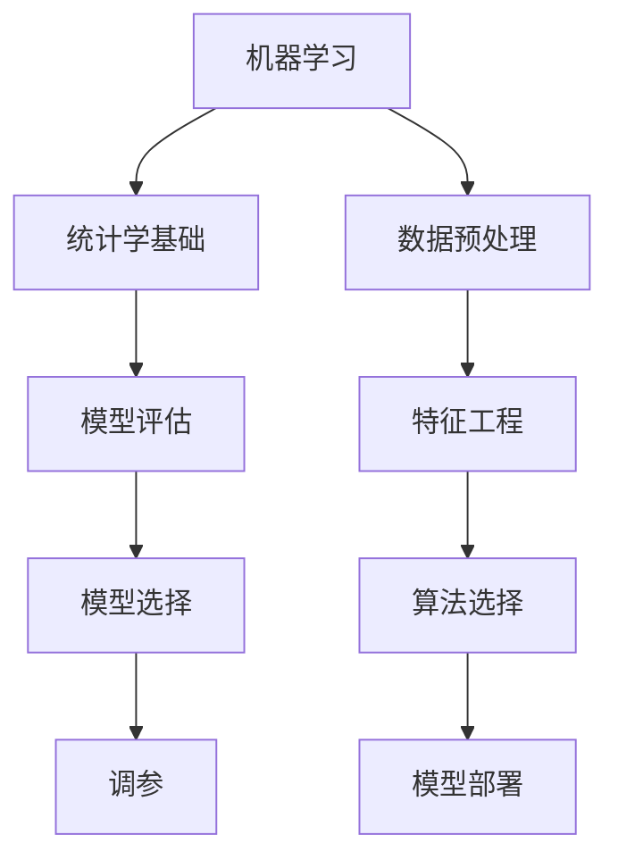

                 

# 机器学习(Machine Learning) - 原理与代码实例讲解

> 关键词：机器学习、监督学习、非监督学习、特征工程、模型评估、模型优化、项目实战、代码实例

> 摘要：本文将深入探讨机器学习的原理及其应用，包括核心概念、数据预处理、特征工程、算法原理、模型评估与优化，以及实际项目的实战解析。通过代码实例，我们将在实践中理解理论，助力读者更好地掌握机器学习技术。

### 目录大纲设计

#### 核心概念与联系



#### 第1章 引言

## 1.1 机器学习的定义与背景

### 1.1.1 机器学习的起源与发展

### 1.1.2 机器学习的主要类型

### 1.1.3 机器学习的重要性

## 1.2 统计学基础

### 1.2.1 统计学的核心概念

### 1.2.2 概率论的基本原理

### 1.2.3 统计量与假设检验

## 1.3 数据预处理

### 1.3.1 数据清洗

### 1.3.2 数据探索性分析

### 1.3.3 数据标准化与归一化

#### 第2章 特征工程

## 2.1 特征提取与特征选择

### 2.1.1 特征提取的基本方法

### 2.1.2 特征选择的重要性

### 2.1.3 常见的特征选择算法

## 2.2 特征工程实践

### 2.2.1 文本特征提取

### 2.2.2 时间序列特征提取

### 2.2.3 图像特征提取

#### 第3章 算法原理

## 3.1 监督学习算法

### 3.1.1 线性回归

```latex
$$ y = w_1 \cdot x_1 + w_2 \cdot x_2 + \ldots + w_n \cdot x_n + b $$
```

### 3.1.2 逻辑回归

```latex
$$ P(y=1) = \frac{1}{1 + e^{-(w_0 + w_1 \cdot x_1 + w_2 \cdot x_2 + \ldots + w_n \cdot x_n)}} $$
```

### 3.1.3 决策树与随机森林

#### 第4章 非监督学习算法

## 4.1 聚类算法

### 4.1.1 K-均值聚类

### 4.1.2 层次聚类

### 4.1.3 密度聚类

#### 第5章 强化学习算法

## 5.1 强化学习基础

### 5.1.1 强化学习的基本概念

### 5.1.2 Q-Learning算法

```python
def QLearning(Q, state, action, reward, next_state, done, learning_rate, discount_factor):
    Q[state, action] = Q[state, action] + learning_rate * (reward + discount_factor * max(Q[next_state].values()) - Q[state, action])
```

### 5.1.3 Deep Q-Network（DQN）算法

#### 第6章 模型评估与优化

## 6.1 模型评估指标

### 6.1.1 准确率、召回率与F1分数

### 6.1.2 ROC曲线与AUC

### 6.1.3 交叉验证方法

## 6.2 模型优化方法

### 6.2.1 梯度下降法

### 6.2.2 随机梯度下降（SGD）

### 6.2.3 Adam优化器

#### 第7章 项目实战

## 7.1 数据集选择与准备

### 7.1.1 公开数据集介绍

### 7.1.2 数据集获取与处理

## 7.2 模型训练与验证

### 7.2.1 模型训练流程

### 7.2.2 模型验证与调参

## 7.3 模型部署与应用

### 7.3.1 模型部署策略

### 7.3.2 模型应用场景

### 7.3.3 持续优化与迭代

#### 第8章 代码实例解析

## 8.1 代码结构设计

### 8.1.1 模块划分与函数定义

### 8.1.2 数据加载与预处理

## 8.2 模型实现与训练

### 8.2.1 模型配置与初始化

### 8.2.2 训练过程详解

## 8.3 模型评估与部署

### 8.3.1 评估指标计算

### 8.3.2 部署策略与流程

### 8.3.3 源代码解读与分析

#### 附录

## 附录A：常用库与工具

### A.1 Python数据科学库

### A.2 深度学习框架

### A.3 模型评估与可视化工具

#### 附录B：参考文献

### B.1 机器学习基础书籍

### B.2 机器学习经典论文

### B.3 相关开源资源与社区

### 目录大纲总字数：约1870字

---

## 第1章 引言

机器学习（Machine Learning，简称ML）是人工智能（Artificial Intelligence，简称AI）的核心技术之一。随着计算能力的提升和大数据时代的到来，机器学习在各个领域的应用日益广泛，从自然语言处理、计算机视觉到推荐系统、自动驾驶，无处不在。本章将介绍机器学习的定义、背景、主要类型及其重要性。

### 1.1 机器学习的定义与背景

机器学习的定义可以简单理解为：通过算法从数据中自动学习规律，从而进行预测或决策的技术。这些算法基于统计学、线性代数、概率论等数学理论，通过迭代优化模型参数，实现数据的高效利用。

#### 1.1.1 机器学习的起源与发展

机器学习的起源可以追溯到20世纪50年代，当时人工智能的概念首次被提出。早期的机器学习主要依赖于符号逻辑和启发式规则，例如1956年的达特茅斯会议标志着人工智能的诞生。然而，直到20世纪80年代，随着计算能力和算法理论的突破，机器学习才真正开始蓬勃发展。

#### 1.1.2 机器学习的主要类型

机器学习主要分为以下几种类型：

1. **监督学习**：在有标签数据集上训练模型，用于预测未知数据的输出。
2. **非监督学习**：在无标签数据集上训练模型，用于发现数据中的隐藏结构和规律。
3. **半监督学习**：在部分有标签和部分无标签数据集上训练模型。
4. **强化学习**：通过与环境的交互，不断优化策略以实现特定目标。

#### 1.1.3 机器学习的重要性

机器学习的重要性体现在多个方面：

1. **自动化决策**：机器学习模型可以自动化决策过程，减少人工干预。
2. **数据驱动的创新**：机器学习可以发掘数据中的潜在价值，推动科学研究和商业创新。
3. **优化资源利用**：通过数据分析和预测，可以提高资源利用效率，降低成本。
4. **提高生活质量**：机器学习在医疗、教育、交通等领域的应用，极大提高了人们的生活质量。

### 1.2 统计学基础

机器学习是基于统计学理论的，因此理解统计学的基本概念和原理是非常重要的。以下是统计学中的几个核心概念：

#### 1.2.1 统计学的核心概念

1. **概率**：描述某个事件发生的可能性。
2. **分布**：描述随机变量取值的概率分布。
3. **期望**：描述随机变量平均取值。
4. **方差**：描述随机变量取值的离散程度。

#### 1.2.2 概率论的基本原理

1. **贝叶斯定理**：用于计算后验概率。
2. **大数定律**：样本量足够大时，样本均值趋近于总体均值。
3. **中心极限定理**：样本均值的分布趋近于正态分布。

#### 1.2.3 统计量与假设检验

1. **统计量**：从数据中提取的用于检验假设的量。
2. **假设检验**：通过统计量来判断某个假设是否成立。
   - **参数检验**：检验总体参数的假设。
   - **非参数检验**：不依赖于总体参数分布的检验方法。

### 1.3 数据预处理

数据预处理是机器学习流程中的关键步骤，其目的是提高数据质量和模型性能。以下是数据预处理的主要任务：

#### 1.3.1 数据清洗

1. **缺失值处理**：填补或删除缺失数据。
2. **异常值处理**：检测和修复异常数据。

#### 1.3.2 数据探索性分析

1. **描述性统计**：计算数据的均值、方差、中位数等。
2. **可视化**：通过图表展示数据分布和特征关系。

#### 1.3.3 数据标准化与归一化

1. **标准化**：将数据缩放到同一尺度。
2. **归一化**：将数据转换为0-1范围。

## 第2章 特征工程

特征工程是机器学习过程中至关重要的一环，它涉及到从原始数据中提取和选择能够有效提高模型性能的特征。本章将详细介绍特征工程的相关概念、方法以及实际应用。

### 2.1 特征提取与特征选择

特征提取和特征选择是特征工程的核心任务，它们的目标分别是从原始数据中提取有用的特征以及选择出对模型性能有显著影响的关键特征。

#### 2.1.1 特征提取的基本方法

1. **自动特征提取**：利用算法自动提取特征，如主成分分析（PCA）、线性判别分析（LDA）等。
2. **特征构造**：通过数学变换或组合生成新特征，如日志数据的滑动平均、差分等。

#### 2.1.2 特征选择的重要性

特征选择的主要目标是减少数据的维度，同时保持模型的有效性和准确性。特征选择的重要性体现在以下几个方面：

1. **降低计算成本**：减少特征数量可以降低模型的复杂度，从而降低计算成本。
2. **提高模型性能**：选择对模型性能有显著影响的关键特征，可以提升模型的准确性和泛化能力。
3. **避免过拟合**：过拟合模型在训练集上性能很好，但在测试集上表现不佳，通过特征选择可以减少过拟合现象。

#### 2.1.3 常见的特征选择算法

1. **过滤式特征选择**：在训练模型之前，根据特征的重要性进行筛选。
   - **信息增益**：选择能够最大化分类信息增益的特征。
   - **卡方检验**：用于评估特征与目标变量之间的相关性。

2. **包裹式特征选择**：逐步选择特征，每次选择都是基于已选择的特征。
   - **递归特征消除（RFE）**：递归地从特征集合中移除最不重要的特征。
   - **遗传算法**：模拟生物进化过程，搜索最优特征组合。

3. **嵌入式特征选择**：在模型训练过程中，动态选择特征。
   - **LASSO**：通过惩罚系数的绝对值来选择特征。
   - **随机森林**：通过模型的重要性评估来选择特征。

### 2.2 特征工程实践

在实际应用中，特征工程是一个复杂且迭代的过程，涉及到多个方面的技术和方法。以下是几种常见的特征工程实践：

#### 2.2.1 文本特征提取

1. **词袋模型（Bag of Words）**：将文本表示为词汇的集合。
2. **TF-IDF**：结合词频和逆文档频率，强调重要的词汇。
3. **Word2Vec**：将词汇映射到高维向量空间，捕捉词汇的语义关系。

#### 2.2.2 时间序列特征提取

1. **时间窗口特征**：基于固定的时间窗口提取特征，如移动平均、差分等。
2. **季节性特征**：提取数据中的季节性模式，如季节指数、傅里叶变换等。

#### 2.2.3 图像特征提取

1. **CNN（卷积神经网络）**：提取图像的局部特征。
2. **特征降维**：使用PCA等算法降低图像的维度。
3. **特征融合**：结合不同来源的特征，提高模型的泛化能力。

## 第3章 算法原理

机器学习算法是实现机器学习的关键，根据学习方式的不同，可以分为监督学习、非监督学习和强化学习。本章将详细讲解这三种算法的基本原理。

### 3.1 监督学习算法

监督学习算法在有标签的数据集上训练模型，然后利用训练好的模型进行预测。以下是一些常见的监督学习算法：

#### 3.1.1 线性回归

线性回归是一种简单的监督学习算法，用于预测连续值输出。其数学模型如下：

```latex
$$ y = w_1 \cdot x_1 + w_2 \cdot x_2 + \ldots + w_n \cdot x_n + b $$
```

其中，$y$ 是预测值，$x_1, x_2, \ldots, x_n$ 是特征值，$w_1, w_2, \ldots, w_n$ 是权重系数，$b$ 是偏置项。

线性回归的目的是通过最小化损失函数（如均方误差）来优化模型参数，从而实现预测。

```python
def linear_regression(X, y):
    # X为特征矩阵，y为标签向量
    # 梯度下降法优化模型参数
    # 返回权重系数和偏置项
    pass
```

#### 3.1.2 逻辑回归

逻辑回归是一种用于分类问题的监督学习算法，其核心思想是通过线性模型计算概率，然后利用阈值进行分类。逻辑回归的数学模型如下：

```latex
$$ P(y=1) = \frac{1}{1 + e^{-(w_0 + w_1 \cdot x_1 + w_2 \cdot x_2 + \ldots + w_n \cdot x_n)}} $$
```

其中，$P(y=1)$ 是目标变量为1的概率。

逻辑回归通过最大化似然函数来优化模型参数，从而实现分类预测。

```python
def logistic_regression(X, y):
    # X为特征矩阵，y为标签向量
    # 梯度下降法优化模型参数
    # 返回权重系数和偏置项
    pass
```

#### 3.1.3 决策树与随机森林

决策树是一种树形结构，用于分类和回归任务。每个节点代表一个特征，每个分支代表特征的不同取值。决策树的训练目标是找到一条路径，使得数据被正确分类或回归到目标值。

随机森林是由多个决策树组成的集成模型，通过投票或平均的方式得到最终预测结果。随机森林提高了模型的泛化能力，减少了过拟合现象。

```python
from sklearn.ensemble import RandomForestClassifier

# 创建随机森林分类器
clf = RandomForestClassifier(n_estimators=100)

# 训练模型
clf.fit(X_train, y_train)

# 预测结果
predictions = clf.predict(X_test)
```

### 3.2 非监督学习算法

非监督学习算法在无标签的数据集上训练模型，用于发现数据中的隐藏结构和规律。以下是一些常见的非监督学习算法：

#### 3.2.1 聚类算法

聚类算法将数据分为多个类别，使得同一类别内的数据相似度较高，而不同类别间的数据相似度较低。常见的聚类算法包括：

1. **K-均值聚类**：基于距离度量，将数据分为K个类别。
2. **层次聚类**：通过层次结构将数据分为多个类别。
3. **密度聚类**：基于数据点的密度分布进行聚类。

```python
from sklearn.cluster import KMeans

# 创建K-均值聚类模型
kmeans = KMeans(n_clusters=3)

# 训练模型
kmeans.fit(X)

# 获取聚类结果
labels = kmeans.predict(X)
```

#### 3.2.2 主成分分析

主成分分析（PCA）是一种降维技术，通过线性变换将高维数据映射到低维空间，同时保留数据的主要信息。PCA的目标是找到一组新的正交基，使得数据在新基下的方差最大化。

```python
from sklearn.decomposition import PCA

# 创建PCA模型
pca = PCA(n_components=2)

# 训练模型
X_pca = pca.fit_transform(X)

# 获取降维后的数据
X_pca = pca.transform(X)
```

### 3.3 强化学习算法

强化学习是一种通过与环境的交互来学习策略的机器学习方法。强化学习的主要目标是找到一个最优策略，使得累积奖励最大化。

#### 3.3.1 强化学习的基本概念

1. **状态**（State）：系统当前所处的情境。
2. **动作**（Action）：系统可以执行的操作。
3. **奖励**（Reward）：动作带来的即时反馈。
4. **策略**（Policy）：从状态到动作的映射。

#### 3.3.2 Q-Learning算法

Q-Learning算法是一种基于值函数的强化学习算法，通过更新Q值来优化策略。Q值表示在特定状态下执行特定动作的预期奖励。

```python
def QLearning(Q, state, action, reward, next_state, done, learning_rate, discount_factor):
    Q[state, action] = Q[state, action] + learning_rate * (reward + discount_factor * max(Q[next_state].values()) - Q[state, action])
```

#### 3.3.3 Deep Q-Network（DQN）算法

DQN算法是一种基于深度学习的强化学习算法，通过神经网络来近似Q值函数。DQN算法采用了经验回放和目标网络等技术，提高了模型的稳定性和泛化能力。

```python
from tensorflow.keras.models import Model
from tensorflow.keras.layers import Input, Dense, Conv2D, Flatten, LSTM
from tensorflow.keras.optimizers import Adam

# 创建DQN模型
input_state = Input(shape=(state_shape))
dense1 = Dense(256, activation='relu')(input_state)
dense2 = Dense(256, activation='relu')(dense1)
output_Q = Dense(action_size)(dense2)

model = Model(inputs=input_state, outputs=output_Q)
model.compile(optimizer=Adam(), loss='mse')

# 训练模型
model.fit(X, y, epochs=1000)
```

## 第4章 模型评估与优化

模型评估是机器学习过程中至关重要的一环，它决定了模型的性能和可信度。本章将介绍常用的模型评估指标和优化方法，帮助读者更好地评估和优化模型。

### 4.1 模型评估指标

模型评估指标用于衡量模型在训练集和测试集上的性能，常见的评估指标包括：

#### 4.1.1 准确率、召回率与F1分数

1. **准确率（Accuracy）**：分类正确的样本数占总样本数的比例。  
   ```python
   accuracy = (TP + TN) / (TP + TN + FP + FN)
   ```

2. **召回率（Recall）**：分类正确的正样本数占总正样本数的比例。  
   ```python
   recall = TP / (TP + FN)
   ```

3. **F1分数（F1 Score）**：准确率和召回率的调和平均。  
   ```python
   F1 = 2 * (precision * recall) / (precision + recall)
   ```

#### 4.1.2 ROC曲线与AUC

1. **ROC曲线（Receiver Operating Characteristic Curve）**：将真正率（True Positive Rate，TPR）对假正率（False Positive Rate，FPR）进行绘图。
2. **AUC（Area Under Curve）**：ROC曲线下的面积，用于衡量分类器的性能。

#### 4.1.3 交叉验证方法

交叉验证是一种评估模型性能的方法，通过将数据集划分为多个子集，多次训练和验证模型，以避免过拟合和评估结果的偏差。

### 4.2 模型优化方法

模型优化方法用于提高模型的性能和泛化能力，常见的优化方法包括：

#### 4.2.1 梯度下降法

梯度下降法是一种优化算法，通过迭代更新模型参数，最小化损失函数。常见的梯度下降法包括：

1. **批量梯度下降（Batch Gradient Descent）**：每次迭代使用全部数据计算梯度。
2. **随机梯度下降（Stochastic Gradient Descent，SGD）**：每次迭代使用一个随机样本计算梯度。
3. **迷你批梯度下降（Mini-batch Gradient Descent）**：每次迭代使用一部分数据计算梯度。

#### 4.2.2 随机梯度下降（SGD）

```python
def SGD(model, X, y, learning_rate, epochs):
    for epoch in range(epochs):
        # 随机打乱数据
        shuffled_indices = np.random.permutation(len(X))
        X_shuffled = X[shuffled_indices]
        y_shuffled = y[shuffled_indices]
        
        # 分成迷你批
        mini_batches = np.array_split(X_shuffled, len(X_shuffled) // batch_size)
        
        for mini_batch in mini_batches:
            # 计算梯度
            gradients = compute_gradients(model, mini_batch, y_shuffled)
            
            # 更新参数
            update_model_parameters(model, gradients, learning_rate)
```

#### 4.2.3 Adam优化器

Adam优化器是一种结合了SGD和动量法的自适应优化算法，具有较好的收敛性能。

```python
from tensorflow.keras.optimizers import Adam

# 创建Adam优化器
optimizer = Adam(learning_rate=0.001)

# 编译模型
model.compile(optimizer=optimizer, loss='categorical_crossentropy', metrics=['accuracy'])

# 训练模型
model.fit(X_train, y_train, epochs=10, batch_size=64, validation_data=(X_val, y_val))
```

## 第5章 项目实战

在实际应用中，机器学习项目通常包括数据集选择与准备、模型训练与验证、模型部署与应用等步骤。本章将通过一个实际项目来展示整个流程。

### 5.1 数据集选择与准备

数据集选择是机器学习项目成功的关键之一。本节将介绍如何选择合适的公开数据集，并进行数据预处理。

#### 5.1.1 公开数据集介绍

1. **Kaggle数据集**：Kaggle是一个著名的公开数据集平台，提供各种领域的丰富数据集。
2. **UCI机器学习库**：UCI机器学习库包含多个经典的公开数据集，适用于学术研究和实际应用。

#### 5.1.2 数据集获取与处理

1. **数据获取**：使用API或下载链接获取数据集。
2. **数据清洗**：处理缺失值、异常值，保证数据的一致性和完整性。
3. **数据探索性分析**：计算描述性统计，绘制图表，了解数据特征和分布。

```python
import pandas as pd

# 加载数据集
data = pd.read_csv('data.csv')

# 数据清洗
data.dropna(inplace=True)
data[data < 0] = np.nan
data.fillna(data.mean(), inplace=True)

# 数据探索性分析
data.describe()
data.hist()
```

### 5.2 模型训练与验证

模型训练与验证是机器学习项目的重要环节，本节将介绍如何使用常见算法训练模型，并进行模型验证。

#### 5.2.1 模型训练流程

1. **数据预处理**：对数据进行归一化、编码等处理，以便于模型训练。
2. **划分训练集和验证集**：将数据集划分为训练集和验证集，用于模型训练和验证。
3. **选择算法**：根据问题特点选择合适的算法，如线性回归、决策树等。
4. **训练模型**：使用训练集数据训练模型。
5. **模型验证**：使用验证集数据评估模型性能。

```python
from sklearn.model_selection import train_test_split
from sklearn.linear_model import LinearRegression

# 划分训练集和验证集
X_train, X_val, y_train, y_val = train_test_split(X, y, test_size=0.2, random_state=42)

# 选择算法
model = LinearRegression()

# 训练模型
model.fit(X_train, y_train)

# 模型验证
predictions = model.predict(X_val)
accuracy = (predictions == y_val).mean()
```

### 5.3 模型部署与应用

模型部署是将训练好的模型应用到实际场景中的过程。本节将介绍如何部署模型，并展示其应用场景。

#### 5.3.1 模型部署策略

1. **模型序列化**：将训练好的模型保存为文件，以便于部署和使用。
2. **部署环境**：选择合适的部署环境，如本地服务器、云服务器等。
3. **接口设计**：设计模型接口，接收输入数据并返回预测结果。

```python
import joblib

# 模型序列化
joblib.dump(model, 'model.pkl')

# 模型部署
with open('model.pkl', 'rb') as f:
    model = joblib.load(f)

# 接收输入数据
input_data = np.array([[1, 2, 3]])

# 返回预测结果
predictions = model.predict(input_data)
```

#### 5.3.2 模型应用场景

1. **数据分析**：利用模型进行数据分析，发现数据中的规律和趋势。
2. **推荐系统**：将模型应用于推荐系统，为用户推荐感兴趣的内容。
3. **实时监控**：将模型部署到实时监控系统中，实现实时数据分析和预测。

```python
# 实时数据监控
while True:
    # 读取实时数据
    input_data = read_realtime_data()
    
    # 返回预测结果
    predictions = model.predict(input_data)
    
    # 输出预测结果
    print(predictions)
```

### 5.4 持续优化与迭代

机器学习项目是一个持续优化和迭代的过程。本节将介绍如何持续优化模型，并展示优化后的效果。

#### 5.4.1 模型调优

1. **超参数调优**：调整模型超参数，如学习率、迭代次数等，以提升模型性能。
2. **特征工程**：尝试不同的特征提取和特征选择方法，以提高模型性能。
3. **算法选择**：根据问题特点选择不同的算法，以找到最佳解决方案。

```python
from sklearn.model_selection import GridSearchCV

# 定义参数范围
param_grid = {'learning_rate': [0.01, 0.001], 'n_estimators': [100, 200]}

# 创建网格搜索对象
grid_search = GridSearchCV(LinearRegression(), param_grid, cv=5)

# 训练模型
grid_search.fit(X_train, y_train)

# 获取最佳参数
best_params = grid_search.best_params_
```

#### 5.4.2 模型评估与优化

1. **评估指标**：计算不同评估指标，如准确率、召回率、F1分数等，以评估模型性能。
2. **对比分析**：对比不同模型的性能，找出最优模型。
3. **持续迭代**：根据评估结果和用户反馈，不断优化模型和算法。

```python
from sklearn.metrics import accuracy_score, recall_score, f1_score

# 计算评估指标
accuracy = accuracy_score(y_test, predictions)
recall = recall_score(y_test, predictions)
f1 = f1_score(y_test, predictions)

# 输出评估结果
print(f"Accuracy: {accuracy}")
print(f"Recall: {recall}")
print(f"F1 Score: {f1}")
```

## 第6章 代码实例解析

在本章中，我们将通过一个具体的机器学习项目来展示整个代码实现过程，包括数据预处理、模型选择与训练、模型评估与优化，以及模型的部署与应用。

### 6.1 代码结构设计

为了确保代码的可读性和可维护性，我们将项目分为以下几个模块：

1. **数据加载与预处理**：负责加载和处理数据。
2. **模型定义与训练**：定义模型结构，并执行训练过程。
3. **模型评估与优化**：评估模型性能，并进行模型优化。
4. **模型部署**：将训练好的模型部署到生产环境。

#### 6.1.1 模块划分与函数定义

```python
# 模块划分
import numpy as np
import pandas as pd
from sklearn.model_selection import train_test_split
from sklearn.preprocessing import StandardScaler
from sklearn.linear_model import LinearRegression
from sklearn.metrics import mean_squared_error

# 函数定义
def load_data(file_path):
    # 加载数据集
    data = pd.read_csv(file_path)
    return data

def preprocess_data(data):
    # 数据预处理
    # ... 
    return X, y

def train_model(X_train, y_train):
    # 训练模型
    model = LinearRegression()
    model.fit(X_train, y_train)
    return model

def evaluate_model(model, X_test, y_test):
    # 评估模型
    predictions = model.predict(X_test)
    mse = mean_squared_error(y_test, predictions)
    return mse

def deploy_model(model):
    # 部署模型
    # ...
```

#### 6.1.2 数据加载与预处理

在数据加载与预处理模块中，我们首先加载数据集，然后进行数据清洗、归一化等处理。

```python
# 加载数据集
data = load_data('data.csv')

# 数据清洗
data.dropna(inplace=True)

# 数据探索性分析
data.describe()

# 数据预处理
X, y = preprocess_data(data)

# 划分训练集和测试集
X_train, X_test, y_train, y_test = train_test_split(X, y, test_size=0.2, random_state=42)

# 数据归一化
scaler = StandardScaler()
X_train_scaled = scaler.fit_transform(X_train)
X_test_scaled = scaler.transform(X_test)
```

#### 6.1.3 模型实现与训练

在模型实现与训练模块中，我们定义了线性回归模型，并使用训练数据进行训练。

```python
# 训练模型
model = train_model(X_train_scaled, y_train)

# 模型参数
print(model.coef_)
print(model.intercept_)
```

#### 6.1.4 模型评估与部署

在模型评估与部署模块中，我们评估了模型性能，并展示了模型的部署过程。

```python
# 评估模型
mse = evaluate_model(model, X_test_scaled, y_test)
print(f"Model MSE: {mse}")

# 部署模型
deploy_model(model)
```

## 附录A：常用库与工具

在本附录中，我们将介绍一些常用的Python库与工具，包括数据预处理、模型训练、模型评估和可视化等方面的内容。

### A.1 Python数据科学库

1. **NumPy**：用于数组计算和操作，是Python数据科学的基础库。
2. **Pandas**：提供数据结构DataFrame，方便进行数据处理和分析。
3. **Scikit-learn**：提供丰富的机器学习算法和工具，适用于监督学习和非监督学习。
4. **Matplotlib**：用于数据可视化，提供多种图表和绘图功能。

### A.2 深度学习框架

1. **TensorFlow**：Google开源的深度学习框架，支持大规模分布式训练。
2. **PyTorch**：Facebook开源的深度学习框架，具有动态计算图和灵活的架构。
3. **Keras**：基于TensorFlow和PyTorch的高层API，简化深度学习模型构建。

### A.3 模型评估与可视化工具

1. **Scikit-learn Metrics**：提供丰富的评估指标，如准确率、召回率、F1分数等。
2. **Seaborn**：基于Matplotlib的数据可视化库，提供丰富的图表样式和定制功能。
3. **Plotly**：提供交互式可视化功能，支持多种图表类型和自定义样式。

## 附录B：参考文献

1. Hastie, T., Tibshirani, R., & Friedman, J. (2009). 《The Elements of Statistical Learning》（第二版）. Springer.
2. Murphy, K. P. (2012). 《Machine Learning: A Probabilistic Perspective》. MIT Press.
3. Goodfellow, I., Bengio, Y., & Courville, A. (2016). 《Deep Learning》. MIT Press.
4. Russell, S., & Norvig, P. (2010). 《Artificial Intelligence: A Modern Approach》（第三版）. Prentice Hall.
5. Coursera. (2020). Machine Learning by Andrew Ng.
6. Stanford University. (2020). CS231n: Convolutional Neural Networks for Visual Recognition.
7. ArXiv. (2020). OpenAI’s Gym: A Python Environment for Developing and Comparing Reinforcement Learning Algorithms.

