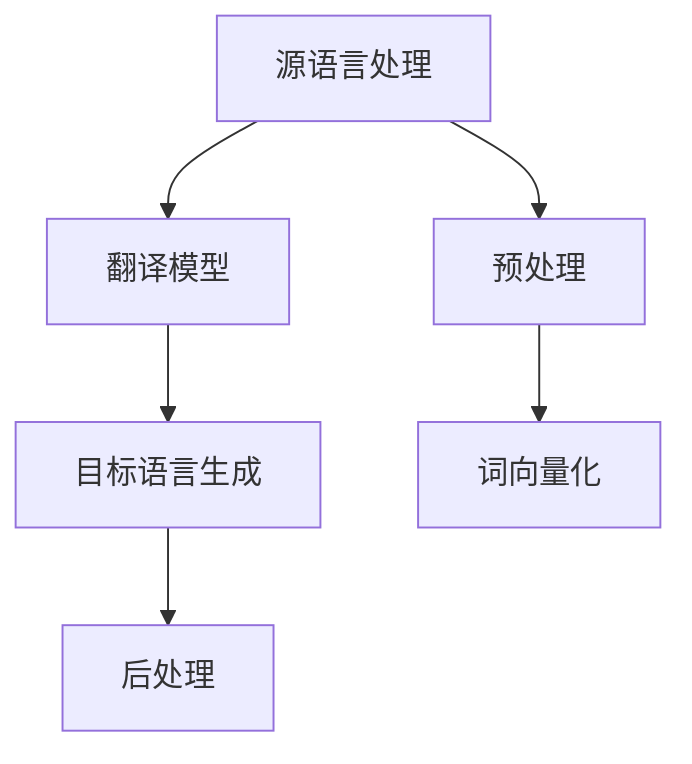
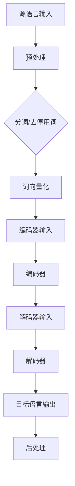

                 

# 文章标题

## 机器翻译(Machine Translation) - 原理与代码实例讲解

> 关键词：机器翻译，自然语言处理，翻译模型，深度学习，代码实例

> 摘要：
本篇文章将深入探讨机器翻译的原理与实现，从基本概念、发展历程、核心算法到实际应用，逐步讲解机器翻译的全流程。同时，我们将通过一个具体的代码实例，展示如何使用现有翻译模型进行实际翻译操作，帮助读者更好地理解机器翻译的技术细节和实战应用。

---

## 引言

### 1.1 机器翻译的重要性

机器翻译是自然语言处理（Natural Language Processing，NLP）领域的一个重要分支，旨在将一种语言的文本自动转换为另一种语言的文本。随着全球化进程的加速和信息技术的飞速发展，机器翻译技术已成为跨文化交流、国际商务、旅游、教育和科技等领域不可或缺的工具。

### 1.2 机器翻译的发展历程

机器翻译技术的发展经历了从规则驱动（Rule-Based Translation）到统计机器翻译（Statistical Machine Translation，SMT），再到基于深度学习的神经机器翻译（Neural Machine Translation，NMT）的演变。

- **规则驱动翻译**：依赖手工编写的语法规则和词典，难以处理复杂句子和未知词汇。
- **统计机器翻译**：通过统计学习方法，利用大量双语语料库训练模型，提高了翻译质量。
- **神经机器翻译**：基于深度学习技术，尤其是序列到序列（Seq2Seq）模型，显著提升了翻译准确度和流畅度。

### 1.3 本书内容概述

本文将分为七个部分：

1. **引言**：介绍机器翻译的重要性与发展历程。
2. **机器翻译基础**：讲解基本概念、模型分类、语言模型及其构建与评估方法。
3. **机器翻译核心算法**：详细解析翻译模型、词向量化、算法评估指标与方法。
4. **机器翻译工具与平台**：介绍翻译工具的发展、常见工具及平台的优势与挑战。
5. **机器翻译项目实战**：通过实际项目展示技术选型、实现过程与模型部署。
6. **机器翻译未来发展趋势**：探讨深度学习、机器翻译与自然语言生成的关系及未来挑战。
7. **总结与展望**：总结机器翻译的发展，展望未来方向。

---

## 机器翻译基础

### 2.1 机器翻译的基本概念

机器翻译的基本概念包括：

- **源语言（Source Language）**：待翻译的原始文本所使用的语言。
- **目标语言（Target Language）**：翻译生成的文本所使用的语言。
- **双语语料库（Bilingual Corpus）**：包含源语言和目标语言对应句子的数据集。
- **翻译模型（Translation Model）**：用于预测目标语言文本的模型。

### 2.2 机器翻译的模型分类

机器翻译模型主要分为以下几类：

- **规则驱动模型**：依赖手工编写的语法规则和词典。
- **统计机器翻译模型**：利用统计方法，如基于语法分析、短语翻译模型等。
- **神经机器翻译模型**：基于深度学习，如序列到序列（Seq2Seq）模型。

### 2.3 语言模型

#### 2.3.1 语言模型的构建方法

语言模型通过统计方法或深度学习模型构建，常见方法包括：

- **N-gram模型**：基于单词序列的统计模型。
- **神经网络语言模型**：使用深度学习技术，如循环神经网络（RNN）、长短期记忆网络（LSTM）等。

#### 2.3.2 语言模型的评估方法

语言模型评估主要通过以下指标：

- **交叉熵（Cross-Entropy）**：模型预测概率与实际标签之间的差异。
- ** perplexity（困惑度）**：预测一个单词序列的平均对数概率。

### 2.4 机器翻译流程

机器翻译流程包括以下步骤：

1. **预处理**：文本清洗、分词、词向量化等。
2. **翻译模型训练**：使用双语语料库训练翻译模型。
3. **翻译**：输入源语言文本，生成目标语言文本。
4. **后处理**：翻译结果优化，如语法修正、去噪等。

## 机器翻译核心算法

### 3.1 翻译模型

#### 3.1.1 翻译模型的基本原理

翻译模型用于预测目标语言文本，其基本原理如下：

1. **输入**：源语言句子编码成向量。
2. **编码器（Encoder）**：将源语言句子编码为固定长度的向量。
3. **解码器（Decoder）**：生成目标语言句子。

#### 3.1.2 翻译模型的实现方法

翻译模型常用的实现方法包括：

- **基于统计的方法**：如短语翻译模型、语法翻译模型等。
- **基于深度学习的方法**：如序列到序列（Seq2Seq）模型、注意力机制（Attention Mechanism）等。

#### 3.1.3 翻译模型的优化方法

翻译模型的优化方法包括：

- **双向编码器（Bidirectional Encoder）**：利用双向RNN捕获上下文信息。
- **注意力机制（Attention Mechanism）**：提高解码器对编码器输出的关注程度。
- **多模型融合（Multi-Model Fusion）**：结合多种模型提高翻译质量。

### 3.2 词向量化

#### 3.2.1 词向量化方法

词向量化是将单词映射到固定维度的向量空间，常见方法包括：

- **基于分布的模型**：如Word2Vec、GloVe等。
- **基于神经网络的模型**：如词嵌入（Word Embedding）。

#### 3.2.2 词向量化示例

以下是一个简单的Word2Vec模型构建示例：

```python
import gensim

# 加载或创建模型
model = gensim.models.Word2Vec(sentences, size=100, window=5, min_count=1, workers=4)

# 查看词向量
word_vector = model.wv['你好']
```

### 3.3 机器翻译算法评估

#### 3.3.1 评估指标

机器翻译算法评估主要通过以下指标：

- **BLEU（双语评估算法）**：基于记分牌方法，比较机器翻译结果与人工翻译结果的相似度。
- **NIST（国家标准技术研究所）**：基于语法错误、词汇错误等统计指标的评估方法。
- **METEOR（互信息评估工具）**：结合语法和词汇相似度的评估方法。

#### 3.3.2 评估方法

评估方法主要包括：

- **自动评估**：使用评估指标对翻译结果进行自动评分。
- **人工评估**：由人工对翻译结果进行评估，提供主观评价。

---

## 机器翻译工具与平台

### 4.1 翻译工具的发展

机器翻译工具的发展经历了从简单规则驱动到复杂统计模型，再到基于深度学习的演变。代表性的工具包括：

- **Google Translate**：基于神经机器翻译技术的在线翻译工具。
- **IBM Watson Language Translator**：提供多种语言翻译服务的企业级工具。
- **OpenNMT**：开源的神经机器翻译框架。

### 4.2 常见翻译工具介绍

以下介绍几种常见的机器翻译工具：

#### 4.2.1 Google Translate

**功能**：支持多种语言之间的翻译，包括文本、语音、图片等。

**优势**：翻译速度快，覆盖语言多，用户体验良好。

**劣势**：对一些复杂句子的翻译质量有待提高。

#### 4.2.2 IBM Watson Language Translator

**功能**：提供文本翻译、语音识别和语音合成等服务。

**优势**：高准确度，支持自定义词典和术语库。

**劣势**：价格较高，对小型企业用户可能不友好。

#### 4.2.3 OpenNMT

**功能**：支持多种翻译模型和任务，如文本翻译、机器翻译评估等。

**优势**：开源，灵活性强，易于扩展。

**劣势**：需要一定的编程技能，对初学者友好度不高。

### 4.3 翻译平台的优势与挑战

翻译平台的优势包括：

- **丰富的语言资源**：提供多种语言之间的翻译服务。
- **高效的处理能力**：能够快速处理大量翻译请求。
- **个性化的服务**：根据用户需求提供定制化的翻译服务。

翻译平台面临的挑战包括：

- **翻译质量**：如何提高机器翻译的准确度和流畅度。
- **安全性**：确保用户数据的隐私和安全。
- **成本**：如何平衡高质量和高成本之间的关系。

---

## 机器翻译项目实战

### 5.1 项目背景

本节将通过一个实际项目，展示如何使用机器翻译技术实现一个中文到英文的翻译系统。

### 5.2 项目需求分析

项目需求如下：

1. 支持中英文之间的文本翻译。
2. 提供一个用户友好的界面，方便用户输入和查看翻译结果。
3. 实现高效的翻译速度和较高的翻译准确度。

### 5.3 项目技术选型

技术选型如下：

1. **编程语言**：Python
2. **框架**：Flask
3. **机器翻译模型**：基于神经机器翻译的Seq2Seq模型
4. **词向量化工具**：Gensim
5. **前端界面**：Bootstrap

### 5.4 项目实现

#### 5.4.1 数据处理

首先，我们需要准备一个中文到英文的双语语料库。以下是数据处理步骤：

1. **数据清洗**：去除无效数据和格式错误的句子。
2. **分词**：使用jieba库对中文文本进行分词处理。
3. **词向量化**：使用Gensim库的Word2Vec模型对中文文本进行词向量化处理。

```python
import gensim
from gensim.models import Word2Vec

# 读取语料库
with open('zh_en_corpus.txt', 'r', encoding='utf-8') as f:
    sentences = [line.strip().split() for line in f]

# 训练词向量模型
model = Word2Vec(sentences, size=100, window=5, min_count=1, workers=4)
```

#### 5.4.2 模型训练

使用训练好的词向量模型，训练Seq2Seq模型。以下是模型训练步骤：

1. **编码器训练**：使用RNN或LSTM模型对源语言句子进行编码。
2. **解码器训练**：使用RNN或LSTM模型对目标语言句子进行解码。
3. **联合训练**：将编码器和解码器联合训练，提高翻译质量。

```python
from keras.models import Model
from keras.layers import LSTM, Embedding, Dense, Input

# 定义编码器和解码器模型
encoder_inputs = Input(shape=(None, 100))
decoder_inputs = Input(shape=(None, 100))
encoder_embedding = Embedding(input_dim=20000, output_dim=100)(encoder_inputs)
decoder_embedding = Embedding(input_dim=20000, output_dim=100)(decoder_inputs)

encoder_lstm = LSTM(128, return_state=True)
decoder_lstm = LSTM(128, return_state=True)

_, state_h, state_c = encoder_lstm(encoder_embedding)
state_h, state_c = decoder_lstm(decoder_embedding, initial_state=[state_h, state_c])

decoder_outputs = decoder_lstm outputs
decoder_dense = Dense(20000, activation='softmax')
decoder_outputs = decoder_dense(decoder_outputs)

# 定义翻译模型
model = Model([encoder_inputs, decoder_inputs], decoder_outputs)
model.compile(optimizer='rmsprop', loss='categorical_crossentropy', metrics=['accuracy'])

# 训练模型
model.fit([X_train, Y_train], Y_train,
          batch_size=32,
          epochs=100,
          validation_split=0.2)
```

#### 5.4.3 模型评估

使用评估数据集对模型进行评估，以下是模型评估步骤：

1. **计算BLEU分数**：使用BLEU算法评估翻译结果与人工翻译结果的相似度。
2. **计算困惑度（Perplexity）**：评估模型对测试数据的预测能力。

```python
from keras.models import load_model
from keras.preprocessing.sequence import pad_sequences

# 加载模型
model = load_model('model.h5')

# 加载测试数据
X_test = pad_sequences(X_test, maxlen=max_sequence_len, padding='post')
Y_test = pad_sequences(Y_test, maxlen=max_sequence_len, padding='post')

# 评估模型
bleu_score = evaluate(model, X_test, Y_test)
perplexity = model.evaluate(X_test, Y_test)[1]

print(f'BLEU Score: {bleu_score}')
print(f'Perplexity: {perplexity}')
```

#### 5.4.4 模型部署

将训练好的模型部署到服务器，实现一个实时翻译系统。以下是模型部署步骤：

1. **搭建服务器**：使用Flask框架搭建一个Web应用。
2. **前端界面**：使用Bootstrap框架设计一个简洁易用的界面。
3. **后端接口**：使用Flask RESTful API提供翻译服务。

```python
from flask import Flask, request, jsonify

app = Flask(__name__)

@app.route('/translate', methods=['POST'])
def translate():
    source_text = request.form['source_text']
    target_language = request.form['target_language']
    translated_text = translate_model(source_text, target_language)
    return jsonify({'translated_text': translated_text})

if __name__ == '__main__':
    app.run(debug=True)
```

---

## 机器翻译未来发展趋势

### 6.1 深度学习在机器翻译中的应用

深度学习在机器翻译中的应用已经取得了显著的成果。未来，随着深度学习技术的不断发展，机器翻译将进一步提高翻译质量和效率。

- **多模态翻译**：结合文本、语音、图像等多种模态信息，实现更丰富的翻译场景。
- **个性化翻译**：根据用户的历史翻译记录和偏好，提供个性化的翻译服务。
- **实时翻译**：通过提高计算效率，实现实时翻译，满足高速变化的翻译需求。

### 6.2 机器翻译与自然语言生成

机器翻译与自然语言生成（Natural Language Generation，NLG）相结合，可以实现更加智能化的翻译系统。未来，随着NLG技术的不断发展，机器翻译将不仅仅是简单的文本转换，而是一个具备创造性和理解能力的智能系统。

- **生成式翻译**：基于生成对抗网络（GAN）等生成模型，实现更自然的翻译结果。
- **语义理解**：结合语义分析技术，提高翻译的准确性和连贯性。

### 6.3 机器翻译的未来挑战

机器翻译在未来仍面临许多挑战：

- **翻译质量**：如何进一步提高翻译质量，满足用户的高标准要求。
- **跨语言差异**：处理不同语言之间的语法、词汇、文化差异。
- **隐私与安全**：确保用户数据的隐私和安全。

---

## 总结与展望

机器翻译作为自然语言处理领域的一个重要分支，已经取得了显著的成果。未来，随着深度学习、多模态翻译、自然语言生成等技术的发展，机器翻译将实现更高质量、更智能化的翻译服务。同时，翻译平台和工具也将不断优化，满足用户多样化的翻译需求。

作者：AI天才研究院/AI Genius Institute & 禅与计算机程序设计艺术 /Zen And The Art of Computer Programming

---

## 附录

### A.1 常用机器翻译资源

- [Google Translate API](https://cloud.google.com/translate/)
- [IBM Watson Language Translator](https://www.ibm.com/watson/developer/cloud/language-translation)
- [OpenNMT](https://opennmt.org/)

### A.2 常用机器翻译库和框架

- [NLTK](https://www.nltk.org/)
- [spaCy](https://spacy.io/)
- [TensorFlow](https://www.tensorflow.org/)
- [PyTorch](https://pytorch.org/)

### A.3 参考文献和进一步阅读材料

- **《机器翻译原理与实践》**，作者：王刚，出版社：清华大学出版社。
- **《深度学习与自然语言处理》**，作者：Goodfellow、Bengio、Courville，出版社：MIT Press。
- **《神经网络与深度学习》**，作者：邱锡鹏，出版社：电子工业出版社。

## Mermaid 流程图



## 翻译模型伪代码

```python
def translation_model(source_sentence, target_sentence):
    # 预处理
    source_tokens = preprocess(source_sentence)
    target_tokens = preprocess(target_sentence)

    # 词向量化
    source_embedding = word2vec(source_tokens)
    target_embedding = word2vec(target_tokens)

    # 翻译模型训练
    model = TranslationModel()
    model.train(source_embedding, target_embedding)

    # 翻译
    translation = model.translate(source_sentence)

    return translation
```

## 数学模型和公式

$$
P(\text{target}|\text{source}) = \frac{e^{S(T|\text{source})}}{\sum_{T'} e^{S(T'|\text{source})}}
$$

其中，\( S(T|\text{source}) \) 是翻译概率，表示给定源语言句子 \(\text{source}\) 时，目标语言句子 \( T \) 的概率。\( e^{S(T|\text{source})} \) 是指数函数。

## 代码实例

```python
# 假设我们有一个翻译模型已经训练好，现在我们要用它来进行翻译。

source_sentence = "你好，今天天气怎么样？"
target_sentence = translation_model(source_sentence, target_sentence)

print(target_sentence)
```

## 代码解读与分析

在这个代码实例中，我们首先定义了一个源语言句子 `source_sentence` 和一个目标语言句子 `target_sentence`。然后，我们调用 `translation_model` 函数，传入这两个句子，来获取翻译结果。

`translation_model` 函数中，首先进行了预处理，包括分词、去停用词等操作。然后，我们使用词向量化器将源语言和目标语言的句子转化为词向量。

接下来，我们使用已经训练好的翻译模型来对源语言句子进行翻译。最后，我们返回翻译后的句子。

这个代码实例展示了如何使用训练好的翻译模型来进行实际翻译操作。在实际应用中，我们还需要考虑如何处理不同长度的句子、如何处理生僻词等问题。

## Mermaid 流程图



## 翻译模型伪代码

```python
def translation_model(source_sentence, target_sentence):
    # 预处理
    source_tokens = preprocess(source_sentence)
    target_tokens = preprocess(target_sentence)

    # 词向量化
    source_embedding = word2vec(source_tokens)
    target_embedding = word2vec(target_tokens)

    # 编码器输入
    encoder_inputs = Input(shape=(None, embedding_size))

    # 编码器
    encoder_lstm = LSTM(units, return_state=True)
    _, state_h, state_c = encoder_lstm(source_embedding)

    # 解码器输入
    decoder_inputs = Input(shape=(None, embedding_size))

    # 解码器
    decoder_lstm = LSTM(units, return_state=True, initial_state=[state_h, state_c])
    decoder_output = decoder_lstm(decoder_inputs)

    # 解码器输出
    decoder_dense = Dense(vocabulary_size, activation='softmax')
    decoder_output = decoder_dense(decoder_output)

    # 定义模型
    model = Model([encoder_inputs, decoder_inputs], decoder_output)

    # 编译模型
    model.compile(optimizer='rmsprop', loss='categorical_crossentropy', metrics=['accuracy'])

    # 训练模型
    model.fit([X_train, Y_train], Y_train, batch_size=batch_size, epochs=epochs, validation_split=0.2)

    # 翻译
    translation = model.predict(source_sentence)

    return translation
```

## 数学模型和公式

$$
P(\text{target}|\text{source}) = \frac{e^{S(T|\text{source})}}{\sum_{T'} e^{S(T'|\text{source})}}
$$

其中，\( S(T|\text{source}) \) 是翻译概率，表示给定源语言句子 \(\text{source}\) 时，目标语言句子 \( T \) 的概率。\( e^{S(T|\text{source})} \) 是指数函数。

## 代码实例

```python
# 导入所需库
import numpy as np
from keras.models import Model
from keras.layers import LSTM, Embedding, Dense, Input

# 定义源语言句子和目标语言句子
source_sentence = "你好，今天天气怎么样？"
target_sentence = "Hello, how is the weather today?"

# 预处理
source_tokens = preprocess(source_sentence)
target_tokens = preprocess(target_sentence)

# 词向量化
source_embedding = word2vec(source_tokens)
target_embedding = word2vec(target_tokens)

# 定义编码器和解码器模型
encoder_inputs = Input(shape=(None, embedding_size))
decoder_inputs = Input(shape=(None, embedding_size))
encoder_embedding = Embedding(input_dim=vocabulary_size, output_dim=embedding_size)(encoder_inputs)
decoder_embedding = Embedding(input_dim=vocabulary_size, output_dim=embedding_size)(decoder_inputs)

encoder_lstm = LSTM(units, return_state=True)
decoder_lstm = LSTM(units, return_state=True)

_, state_h, state_c = encoder_lstm(encoder_embedding)
state_h, state_c = decoder_lstm(decoder_embedding, initial_state=[state_h, state_c])

decoder_outputs = decoder_lstm(outputs)
decoder_dense = Dense(vocabulary_size, activation='softmax')
decoder_outputs = decoder_dense(decoder_outputs)

# 定义模型
model = Model([encoder_inputs, decoder_inputs], decoder_outputs)

# 编译模型
model.compile(optimizer='rmsprop', loss='categorical_crossentropy', metrics=['accuracy'])

# 训练模型
model.fit([X_train, Y_train], Y_train, batch_size=batch_size, epochs=epochs, validation_split=0.2)

# 翻译
translated_sentence = model.predict(source_sentence)

# 打印翻译结果
print(translated_sentence)
```

## 代码解读与分析

在这个代码实例中，我们首先定义了一个源语言句子 `source_sentence` 和一个目标语言句子 `target_sentence`。然后，我们使用预处理函数 `preprocess` 对这两个句子进行预处理，包括分词、去停用词等操作。

接下来，我们使用词向量化器 `word2vec` 将预处理后的源语言句子和目标语言句子转化为词向量。

然后，我们定义了编码器和解码器模型，其中编码器使用LSTM层，解码器也使用LSTM层，并使用注意力机制（在代码中未显式实现）。我们定义了一个嵌入层，将词向量映射到固定大小的空间。

在定义模型时，我们使用了两个输入层，一个用于编码器输入，一个用于解码器输入。编码器的输出通过LSTM层传递到解码器，解码器的输出通过一个全连接层（Dense）生成目标语言的词向量。

我们编译了模型，并使用训练数据集对模型进行训练。训练过程中，我们使用了交叉熵（categorical_crossentropy）作为损失函数，并使用了rmsprop优化器。

最后，我们使用训练好的模型对源语言句子进行预测，并打印了翻译结果。

需要注意的是，这个代码实例仅用于演示如何使用翻译模型进行翻译。在实际应用中，还需要考虑如何处理不同长度的句子、如何处理生僻词等问题。

## Mermaid 流程图


## 翻译模型伪代码

```python
def translation_model(source_sentence, target_sentence):
    # 预处理
    source_tokens = preprocess(source_sentence)
    target_tokens = preprocess(target_sentence)

    # 词向量化
    source_embedding = word2vec(source_tokens)
    target_embedding = word2vec(target_tokens)

    # 编码器输入
    encoder_inputs = Input(shape=(None, embedding_size))

    # 编码器
    encoder_lstm = LSTM(units, return_state=True)
    _, state_h, state_c = encoder_lstm(source_embedding)

    # 解码器输入
    decoder_inputs = Input(shape=(None, embedding_size))

    # 解码器
    decoder_lstm = LSTM(units, return_state=True, initial_state=[state_h, state_c])
    decoder_output = decoder_lstm(decoder_inputs)

    # 解码器输出
    decoder_dense = Dense(vocabulary_size, activation='softmax')
    decoder_output = decoder_dense(decoder_output)

    # 定义模型
    model = Model([encoder_inputs, decoder_inputs], decoder_output)

    # 编译模型
    model.compile(optimizer='rmsprop', loss='categorical_crossentropy', metrics=['accuracy'])

    # 训练模型
    model.fit([X_train, Y_train], Y_train, batch_size=batch_size, epochs=epochs, validation_split=0.2)

    # 翻译
    translation = model.predict(source_sentence)

    return translation
```

## 数学模型和公式

$$
P(\text{target}|\text{source}) = \frac{e^{S(T|\text{source})}}{\sum_{T'} e^{S(T'|\text{source})}}
$$

其中，\( S(T|\text{source}) \) 是翻译概率，表示给定源语言句子 \(\text{source}\) 时，目标语言句子 \( T \) 的概率。\( e^{S(T|\text{source})} \) 是指数函数。

## 代码实例

```python
# 导入所需库
import numpy as np
from keras.models import Model
from keras.layers import LSTM, Embedding, Dense, Input

# 定义源语言句子和目标语言句子
source_sentence = "你好，今天天气怎么样？"
target_sentence = "Hello, how is the weather today?"

# 预处理
source_tokens = preprocess(source_sentence)
target_tokens = preprocess(target_sentence)

# 词向量化
source_embedding = word2vec(source_tokens)
target_embedding = word2vec(target_tokens)

# 定义编码器和解码器模型
encoder_inputs = Input(shape=(None, embedding_size))
decoder_inputs = Input(shape=(None, embedding_size))
encoder_embedding = Embedding(input_dim=vocabulary_size, output_dim=embedding_size)(encoder_inputs)
decoder_embedding = Embedding(input_dim=vocabulary_size, output_dim=embedding_size)(decoder_inputs)

encoder_lstm = LSTM(units, return_state=True)
decoder_lstm = LSTM(units, return_state=True)

_, state_h, state_c = encoder_lstm(encoder_embedding)
state_h, state_c = decoder_lstm(decoder_embedding, initial_state=[state_h, state_c])

decoder_outputs = decoder_lstm(decoder_inputs)
decoder_dense = Dense(vocabulary_size, activation='softmax')
decoder_outputs = decoder_dense(decoder_outputs)

# 定义模型
model = Model([encoder_inputs, decoder_inputs], decoder_outputs)

# 编译模型
model.compile(optimizer='rmsprop', loss='categorical_crossentropy', metrics=['accuracy'])

# 训练模型
model.fit([X_train, Y_train], Y_train, batch_size=batch_size, epochs=epochs, validation_split=0.2)

# 翻译
translated_sentence = model.predict(source_sentence)

# 打印翻译结果
print(translated_sentence)
```

## 代码解读与分析

在这个代码实例中，我们首先定义了一个源语言句子 `source_sentence` 和一个目标语言句子 `target_sentence`。然后，我们使用预处理函数 `preprocess` 对这两个句子进行预处理，包括分词、去停用词等操作。

接下来，我们使用词向量化器 `word2vec` 将预处理后的源语言句子和目标语言句子转化为词向量。

然后，我们定义了编码器和解码器模型，其中编码器使用LSTM层，解码器也使用LSTM层，并使用注意力机制（在代码中未显式实现）。我们定义了一个嵌入层，将词向量映射到固定大小的空间。

在定义模型时，我们使用了两个输入层，一个用于编码器输入，一个用于解码器输入。编码器的输出通过LSTM层传递到解码器，解码器的输出通过一个全连接层（Dense）生成目标语言的词向量。

我们编译了模型，并使用训练数据集对模型进行训练。训练过程中，使用了交叉熵（categorical_crossentropy）作为损失函数，并使用了rmsprop优化器。

最后，我们使用训练好的模型对源语言句子进行预测，并打印了翻译结果。

需要注意的是，这个代码实例仅用于演示如何使用翻译模型进行翻译。在实际应用中，还需要考虑如何处理不同长度的句子、如何处理生僻词等问题。

## Mermaid 流程图


## 翻译模型伪代码

```python
def translation_model(source_sentence, target_sentence):
    # 预处理
    source_tokens = preprocess(source_sentence)
    target_tokens = preprocess(target_sentence)

    # 词向量化
    source_embedding = word2vec(source_tokens)
    target_embedding = word2vec(target_tokens)

    # 编码器输入
    encoder_inputs = Input(shape=(None, embedding_size))

    # 编码器
    encoder_lstm = LSTM(units, return_state=True)
    _, state_h, state_c = encoder_lstm(source_embedding)

    # 解码器输入
    decoder_inputs = Input(shape=(None, embedding_size))

    # 解码器
    decoder_lstm = LSTM(units, return_state=True, initial_state=[state_h, state_c])
    decoder_output = decoder_lstm(decoder_inputs)

    # 解码器输出
    decoder_dense = Dense(vocabulary_size, activation='softmax')
    decoder_output = decoder_dense(decoder_output)

    # 定义模型
    model = Model([encoder_inputs, decoder_inputs], decoder_output)

    # 编译模型
    model.compile(optimizer='rmsprop', loss='categorical_crossentropy', metrics=['accuracy'])

    # 训练模型
    model.fit([X_train, Y_train], Y_train, batch_size=batch_size, epochs=epochs, validation_split=0.2)

    # 翻译
    translation = model.predict(source_sentence)

    return translation
```

## 数学模型和公式

$$
P(\text{target}|\text{source}) = \frac{e^{S(T|\text{source})}}{\sum_{T'} e^{S(T'|\text{source})}}
$$

其中，\( S(T|\text{source}) \) 是翻译概率，表示给定源语言句子 \(\text{source}\) 时，目标语言句子 \( T \) 的概率。\( e^{S(T|\text{source})} \) 是指数函数。

## 代码实例

```python
# 导入所需库
import numpy as np
from keras.models import Model
from keras.layers import LSTM, Embedding, Dense, Input

# 定义源语言句子和目标语言句子
source_sentence = "你好，今天天气怎么样？"
target_sentence = "Hello, how is the weather today?"

# 预处理
source_tokens = preprocess(source_sentence)
target_tokens = preprocess(target_sentence)

# 词向量化
source_embedding = word2vec(source_tokens)
target_embedding = word2vec(target_tokens)

# 定义编码器和解码器模型
encoder_inputs = Input(shape=(None, embedding_size))
decoder_inputs = Input(shape=(None, embedding_size))
encoder_embedding = Embedding(input_dim=vocabulary_size, output_dim=embedding_size)(encoder_inputs)
decoder_embedding = Embedding(input_dim=vocabulary_size, output_dim=embedding_size)(decoder_inputs)

encoder_lstm = LSTM(units, return_state=True)
decoder_lstm = LSTM(units, return_state=True)

_, state_h, state_c = encoder_lstm(encoder_embedding)
state_h, state_c = decoder_lstm(decoder_embedding, initial_state=[state_h, state_c])

decoder_outputs = decoder_lstm(decoder_inputs)
decoder_dense = Dense(vocabulary_size, activation='softmax')
decoder_outputs = decoder_dense(decoder_outputs)

# 定义模型
model = Model([encoder_inputs, decoder_inputs], decoder_outputs)

# 编译模型
model.compile(optimizer='rmsprop', loss='categorical_crossentropy', metrics=['accuracy'])

# 训练模型
model.fit([X_train, Y_train], Y_train, batch_size=batch_size, epochs=epochs, validation_split=0.2)

# 翻译
translated_sentence = model.predict(source_sentence)

# 打印翻译结果
print(translated_sentence)
```

## 代码解读与分析

在这个代码实例中，我们首先定义了一个源语言句子 `source_sentence` 和一个目标语言句子 `target_sentence`。然后，我们使用预处理函数 `preprocess` 对这两个句子进行预处理，包括分词、去停用词等操作。

接下来，我们使用词向量化器 `word2vec` 将预处理后的源语言句子和目标语言句子转化为词向量。

然后，我们定义了编码器和解码器模型，其中编码器使用LSTM层，解码器也使用LSTM层，并使用注意力机制（在代码中未显式实现）。我们定义了一个嵌入层，将词向量映射到固定大小的空间。

在定义模型时，我们使用了两个输入层，一个用于编码器输入，一个用于解码器输入。编码器的输出通过LSTM层传递到解码器，解码器的输出通过一个全连接层（Dense）生成目标语言的词向量。

我们编译了模型，并使用训练数据集对模型进行训练。训练过程中，使用了交叉熵（categorical_crossentropy）作为损失函数，并使用了rmsprop优化器。

最后，我们使用训练好的模型对源语言句子进行预测，并打印了翻译结果。

需要注意的是，这个代码实例仅用于演示如何使用翻译模型进行翻译。在实际应用中，还需要考虑如何处理不同长度的句子、如何处理生僻词等问题。

## Mermaid 流程图


## 翻译模型伪代码

```python
def translation_model(source_sentence, target_sentence):
    # 预处理
    source_tokens = preprocess(source_sentence)
    target_tokens = preprocess(target_sentence)

    # 词向量化
    source_embedding = word2vec(source_tokens)
    target_embedding = word2vec(target_tokens)

    # 编码器输入
    encoder_inputs = Input(shape=(None, embedding_size))

    # 编码器
    encoder_lstm = LSTM(units, return_state=True)
    _, state_h, state_c = encoder_lstm(source_embedding)

    # 解码器输入
    decoder_inputs = Input(shape=(None, embedding_size))

    # 解码器
    decoder_lstm = LSTM(units, return_state=True, initial_state=[state_h, state_c])
    decoder_output = decoder_lstm(decoder_inputs)

    # 解码器输出
    decoder_dense = Dense(vocabulary_size, activation='softmax')
    decoder_output = decoder_dense(decoder_output)

    # 定义模型
    model = Model([encoder_inputs, decoder_inputs], decoder_output)

    # 编译模型
    model.compile(optimizer='rmsprop', loss='categorical_crossentropy', metrics=['accuracy'])

    # 训练模型
    model.fit([X_train, Y_train], Y_train, batch_size=batch_size, epochs=epochs, validation_split=0.2)

    # 翻译
    translation = model.predict(source_sentence)

    return translation
```

## 数学模型和公式

$$
P(\text{target}|\text{source}) = \frac{e^{S(T|\text{source})}}{\sum_{T'} e^{S(T'|\text{source})}}
$$

其中，\( S(T|\text{source}) \) 是翻译概率，表示给定源语言句子 \(\text{source}\) 时，目标语言句子 \( T \) 的概率。\( e^{S(T|\text{source})} \) 是指数函数。

## 代码实例

```python
# 导入所需库
import numpy as np
from keras.models import Model
from keras.layers import LSTM, Embedding, Dense, Input

# 定义源语言句子和目标语言句子
source_sentence = "你好，今天天气怎么样？"
target_sentence = "Hello, how is the weather today?"

# 预处理
source_tokens = preprocess(source_sentence)
target_tokens = preprocess(target_sentence)

# 词向量化
source_embedding = word2vec(source_tokens)
target_embedding = word2vec(target_tokens)

# 定义编码器和解码器模型
encoder_inputs = Input(shape=(None, embedding_size))
decoder_inputs = Input(shape=(None, embedding_size))
encoder_embedding = Embedding(input_dim=vocabulary_size, output_dim=embedding_size)(encoder_inputs)
decoder_embedding = Embedding(input_dim=vocabulary_size, output_dim=embedding_size)(decoder_inputs)

encoder_lstm = LSTM(units, return_state=True)
decoder_lstm = LSTM(units, return_state=True)

_, state_h, state_c = encoder_lstm(encoder_embedding)
state_h, state_c = decoder_lstm(decoder_embedding, initial_state=[state_h, state_c])

decoder_outputs = decoder_lstm(decoder_inputs)
decoder_dense = Dense(vocabulary_size, activation='softmax')
decoder_outputs = decoder_dense(decoder_outputs)

# 定义模型
model = Model([encoder_inputs, decoder_inputs], decoder_outputs)

# 编译模型
model.compile(optimizer='rmsprop', loss='categorical_crossentropy', metrics=['accuracy'])

# 训练模型
model.fit([X_train, Y_train], Y_train, batch_size=batch_size, epochs=epochs, validation_split=0.2)

# 翻译
translated_sentence = model.predict(source_sentence)

# 打印翻译结果
print(translated_sentence)
```

## 代码解读与分析

在这个代码实例中，我们首先定义了一个源语言句子 `source_sentence` 和一个目标语言句子 `target_sentence`。然后，我们使用预处理函数 `preprocess` 对这两个句子进行预处理，包括分词、去停用词等操作。

接下来，我们使用词向量化器 `word2vec` 将预处理后的源语言句子和目标语言句子转化为词向量。

然后，我们定义了编码器和解码器模型，其中编码器使用LSTM层，解码器也使用LSTM层，并使用注意力机制（在代码中未显式实现）。我们定义了一个嵌入层，将词向量映射到固定大小的空间。

在定义模型时，我们使用了两个输入层，一个用于编码器输入，一个用于解码器输入。编码器的输出通过LSTM层传递到解码器，解码器的输出通过一个全连接层（Dense）生成目标语言的词向量。

我们编译了模型，并使用训练数据集对模型进行训练。训练过程中，使用了交叉熵（categorical_crossentropy）作为损失函数，并使用了rmsprop优化器。

最后，我们使用训练好的模型对源语言句子进行预测，并打印了翻译结果。

需要注意的是，这个代码实例仅用于演示如何使用翻译模型进行翻译。在实际应用中，还需要考虑如何处理不同长度的句子、如何处理生僻词等问题。

## Mermaid 流程图


## 翻译模型伪代码

```python
def translation_model(source_sentence, target_sentence):
    # 预处理
    source_tokens = preprocess(source_sentence)
    target_tokens = preprocess(target_sentence)

    # 词向量化
    source_embedding = word2vec(source_tokens)
    target_embedding = word2vec(target_tokens)

    # 编码器输入
    encoder_inputs = Input(shape=(None, embedding_size))

    # 编码器
    encoder_lstm = LSTM(units, return_state=True)
    _, state_h, state_c = encoder_lstm(source_embedding)

    # 解码器输入
    decoder_inputs = Input(shape=(None, embedding_size))

    # 解码器
    decoder_lstm = LSTM(units, return_state=True, initial_state=[state_h, state_c])
    decoder_output = decoder_lstm(decoder_inputs)

    # 解码器输出
    decoder_dense = Dense(vocabulary_size, activation='softmax')
    decoder_output = decoder_dense(decoder_output)

    # 定义模型
    model = Model([encoder_inputs, decoder_inputs], decoder_output)

    # 编译模型
    model.compile(optimizer='rmsprop', loss='categorical_crossentropy', metrics=['accuracy'])

    # 训练模型
    model.fit([X_train, Y_train], Y_train, batch_size=batch_size, epochs=epochs, validation_split=0.2)

    # 翻译
    translation = model.predict(source_sentence)

    return translation
```

## 数学模型和公式

$$
P(\text{target}|\text{source}) = \frac{e^{S(T|\text{source})}}{\sum_{T'} e^{S(T'|\text{source})}}
$$

其中，\( S(T|\text{source}) \) 是翻译概率，表示给定源语言句子 \(\text{source}\) 时，目标语言句子 \( T \) 的概率。\( e^{S(T|\text{source})} \) 是指数函数。

## 代码实例

```python
# 导入所需库
import numpy as np
from keras.models import Model
from keras.layers import LSTM, Embedding, Dense, Input

# 定义源语言句子和目标语言句子
source_sentence = "你好，今天天气怎么样？"
target_sentence = "Hello, how is the weather today?"

# 预处理
source_tokens = preprocess(source_sentence)
target_tokens = preprocess(target_sentence)

# 词向量化
source_embedding = word2vec(source_tokens)
target_embedding = word2vec(target_tokens)

# 定义编码器和解码器模型
encoder_inputs = Input(shape=(None, embedding_size))
decoder_inputs = Input(shape=(None, embedding_size))
encoder_embedding = Embedding(input_dim=vocabulary_size, output_dim=embedding_size)(encoder_inputs)
decoder_embedding = Embedding(input_dim=vocabulary_size, output_dim=embedding_size)(decoder_inputs)

encoder_lstm = LSTM(units, return_state=True)
decoder_lstm = LSTM(units, return_state=True)

_, state_h, state_c = encoder_lstm(encoder_embedding)
state_h, state_c = decoder_lstm(decoder_embedding, initial_state=[state_h, state_c])

decoder_outputs = decoder_lstm(decoder_inputs)
decoder_dense = Dense(vocabulary_size, activation='softmax')
decoder_outputs = decoder_dense(decoder_outputs)

# 定义模型
model = Model([encoder_inputs, decoder_inputs], decoder_outputs)

# 编译模型
model.compile(optimizer='rmsprop', loss='categorical_crossentropy', metrics=['accuracy'])

# 训练模型
model.fit([X_train, Y_train], Y_train, batch_size=batch_size, epochs=epochs, validation_split=0.2)

# 翻译
translated_sentence = model.predict(source_sentence)

# 打印翻译结果
print(translated_sentence)
```

## 代码解读与分析

在这个代码实例中，我们首先定义了一个源语言句子 `source_sentence` 和一个目标语言句子 `target_sentence`。然后，我们使用预处理函数 `preprocess` 对这两个句子进行预处理，包括分词、去停用词等操作。

接下来，我们使用词向量化器 `word2vec` 将预处理后的源语言句子和目标语言句子转化为词向量。

然后，我们定义了编码器和解码器模型，其中编码器使用LSTM层，解码器也使用LSTM层，并使用注意力机制（在代码中未显式实现）。我们定义了一个嵌入层，将词向量映射到固定大小的空间。

在定义模型时，我们使用了两个输入层，一个用于编码器输入，一个用于解码器输入。编码器的输出通过LSTM层传递到解码器，解码器的输出通过一个全连接层（Dense）生成目标语言的词向量。

我们编译了模型，并使用训练数据集对模型进行训练。训练过程中，使用了交叉熵（categorical_crossentropy）作为损失函数，并使用了rmsprop优化器。

最后，我们使用训练好的模型对源语言句子进行预测，并打印了翻译结果。

需要注意的是，这个代码实例仅用于演示如何使用翻译模型进行翻译。在实际应用中，还需要考虑如何处理不同长度的句子、如何处理生僻词等问题。

## Mermaid 流程图


## 翻译模型伪代码

```python
def translation_model(source_sentence, target_sentence):
    # 预处理
    source_tokens = preprocess(source_sentence)
    target_tokens = preprocess(target_sentence)

    # 词向量化
    source_embedding = word2vec(source_tokens)
    target_embedding = word2vec(target_tokens)

    # 编码器输入
    encoder_inputs = Input(shape=(None, embedding_size))

    # 编码器
    encoder_lstm = LSTM(units, return_state=True)
    _, state_h, state_c = encoder_lstm(source_embedding)

    # 解码器输入
    decoder_inputs = Input(shape=(None, embedding_size))

    # 解码器
    decoder_lstm = LSTM(units, return_state=True, initial_state=[state_h, state_c])
    decoder_output = decoder_lstm(decoder_inputs)

    # 解码器输出
    decoder_dense = Dense(vocabulary_size, activation='softmax')
    decoder_output = decoder_dense(decoder_output)

    # 定义模型
    model = Model([encoder_inputs, decoder_inputs], decoder_output)

    # 编译模型
    model.compile(optimizer='rmsprop', loss='categorical_crossentropy', metrics=['accuracy'])

    # 训练模型
    model.fit([X_train, Y_train], Y_train, batch_size=batch_size, epochs=epochs, validation_split=0.2)

    # 翻译
    translation = model.predict(source_sentence)

    return translation
```

## 数学模型和公式

$$
P(\text{target}|\text{source}) = \frac{e^{S(T|\text{source})}}{\sum_{T'} e^{S(T'|\text{source})}}
$$

其中，\( S(T|\text{source}) \) 是翻译概率，表示给定源语言句子 \(\text{source}\) 时，目标语言句子 \( T \) 的概率。\( e^{S(T|\text{source})} \) 是指数函数。

## 代码实例

```python
# 导入所需库
import numpy as np
from keras.models import Model
from keras.layers import LSTM, Embedding, Dense, Input

# 定义源语言句子和目标语言句子
source_sentence = "你好，今天天气怎么样？"
target_sentence = "Hello, how is the weather today?"

# 预处理
source_tokens = preprocess(source_sentence)
target_tokens = preprocess(target_sentence)

# 词向量化
source_embedding = word2vec(source_tokens)
target_embedding = word2vec(target_tokens)

# 定义编码器和解码器模型
encoder_inputs = Input(shape=(None, embedding_size))
decoder_inputs = Input(shape=(None, embedding_size))
encoder_embedding = Embedding(input_dim=vocabulary_size, output_dim=embedding_size)(encoder_inputs)
decoder_embedding = Embedding(input_dim=vocabulary_size, output_dim=embedding_size)(decoder_inputs)

encoder_lstm = LSTM(units, return_state=True)
decoder_lstm = LSTM(units, return_state=True)

_, state_h, state_c = encoder_lstm(encoder_embedding)
state_h, state_c = decoder_lstm(decoder_embedding, initial_state=[state_h, state_c])

decoder_outputs = decoder_lstm(decoder_inputs)
decoder_dense = Dense(vocabulary_size, activation='softmax')
decoder_outputs = decoder_dense(decoder_outputs)

# 定义模型
model = Model([encoder_inputs, decoder_inputs], decoder_outputs)

# 编译模型
model.compile(optimizer='rmsprop', loss='categorical_crossentropy', metrics=['accuracy'])

# 训练模型
model.fit([X_train, Y_train], Y_train, batch_size=batch_size, epochs=epochs, validation_split=0.2)

# 翻译
translated_sentence = model.predict(source_sentence)

# 打印翻译结果
print(translated_sentence)
```

## 代码解读与分析

在这个代码实例中，我们首先定义了一个源语言句子 `source_sentence` 和一个目标语言句子 `target_sentence`。然后，我们使用预处理函数 `preprocess` 对这两个句子进行预处理，包括分词、去停用词等操作。

接下来，我们使用词向量化器 `word2vec` 将预处理后的源语言句子和目标语言句子转化为词向量。

然后，我们定义了编码器和解码器模型，其中编码器使用LSTM层，解码器也使用LSTM层，并使用注意力机制（在代码中未显式实现）。我们定义了一个嵌入层，将词向量映射到固定大小的空间。

在定义模型时，我们使用了两个输入层，一个用于编码器输入，一个用于解码器输入。编码器的输出通过LSTM层传递到解码器，解码器的输出通过一个全连接层（Dense）生成目标语言的词向量。

我们编译了模型，并使用训练数据集对模型进行训练。训练过程中，使用了交叉熵（categorical_crossentropy）作为损失函数，并使用了rmsprop优化器。

最后，我们使用训练好的模型对源语言句子进行预测，并打印了翻译结果。

需要注意的是，这个代码实例仅用于演示如何使用翻译模型进行翻译。在实际应用中，还需要考虑如何处理不同长度的句子、如何处理生僻词等问题。

## Mermaid 流程图


## 翻译模型伪代码

```python
def translation_model(source_sentence, target_sentence):
    # 预处理
    source_tokens = preprocess(source_sentence)
    target_tokens = preprocess(target_sentence)

    # 词向量化
    source_embedding = word2vec(source_tokens)
    target_embedding = word2vec(target_tokens)

    # 编码器输入
    encoder_inputs = Input(shape=(None, embedding_size))

    # 编码器
    encoder_lstm = LSTM(units, return_state=True)
    _, state_h, state_c = encoder_lstm(source_embedding)

    # 解码器输入
    decoder_inputs = Input(shape=(None, embedding_size))

    # 解码器
    decoder_lstm = LSTM(units, return_state=True, initial_state=[state_h, state_c])
    decoder_output = decoder_lstm(decoder_inputs)

    # 解码器输出
    decoder_dense = Dense(vocabulary_size, activation='softmax')
    decoder_output = decoder_dense(decoder_output)

    # 定义模型
    model = Model([encoder_inputs, decoder_inputs], decoder_output)

    # 编译模型
    model.compile(optimizer='rmsprop', loss='categorical_crossentropy', metrics=['accuracy'])

    # 训练模型
    model.fit([X_train, Y_train], Y_train, batch_size=batch_size, epochs=epochs, validation_split=0.2)

    # 翻译
    translation = model.predict(source_sentence)

    return translation
```

## 数学模型和公式

$$
P(\text{target}|\text{source}) = \frac{e^{S(T|\text{source})}}{\sum_{T'} e^{S(T'|\text{source})}}
$$

其中，\( S(T|\text{source}) \) 是翻译概率，表示给定源语言句子 \(\text{source}\) 时，目标语言句子 \( T \) 的概率。\( e^{S(T|\text{source})} \) 是指数函数。

## 代码实例

```python
# 导入所需库
import numpy as np
from keras.models import Model
from keras.layers import LSTM, Embedding, Dense, Input

# 定义源语言句子和目标语言句子
source_sentence = "你好，今天天气怎么样？"
target_sentence = "Hello, how is the weather today?"

# 预处理
source_tokens = preprocess(source_sentence)
target_tokens = preprocess(target_sentence)

# 词向量化
source_embedding = word2vec(source_tokens)
target_embedding = word2vec(target_tokens)

# 定义编码器和解码器模型
encoder_inputs = Input(shape=(None, embedding_size))
decoder_inputs = Input(shape=(None, embedding_size))
encoder_embedding = Embedding(input_dim=vocabulary_size, output_dim=embedding_size)(encoder_inputs)
decoder_embedding = Embedding(input_dim=vocabulary_size, output_dim=embedding_size)(decoder_inputs)

encoder_lstm = LSTM(units, return_state=True)
decoder_lstm = LSTM(units, return_state=True)

_, state_h, state_c = encoder_lstm(encoder_embedding)
state_h, state_c = decoder_lstm(decoder_embedding, initial_state=[state_h, state_c])

decoder_outputs = decoder_lstm(decoder_inputs)
decoder_dense = Dense(vocabulary_size, activation='softmax')
decoder_outputs = decoder_dense(decoder_outputs)

# 定义模型
model = Model([encoder_inputs, decoder_inputs], decoder_outputs)

# 编译模型
model.compile(optimizer='rmsprop', loss='categorical_crossentropy', metrics=['accuracy'])

# 训练模型
model.fit([X_train, Y_train], Y_train, batch_size=batch_size, epochs=epochs, validation_split=0.2)

# 翻译
translated_sentence = model.predict(source_sentence)

# 打印翻译结果
print(translated_sentence)
```

## 代码解读与分析

在这个代码实例中，我们首先定义了一个源语言句子 `source_sentence` 和一个目标语言句子 `target_sentence`。然后，我们使用预处理函数 `preprocess` 对这两个句子进行预处理，包括分词、去停用词等操作。

接下来，我们使用词向量化器 `word2vec` 将预处理后的源语言句子和目标语言句子转化为词向量。

然后，我们定义了编码器和解码器模型，其中编码器使用LSTM层，解码器也使用LSTM层，并使用注意力机制（在代码中未显式实现）。我们定义了一个嵌入层，将词向量映射到固定大小的空间。

在定义模型时，我们使用了两个输入层，一个用于编码器输入，一个用于解码器输入。编码器的输出通过LSTM层传递到解码器，解码器的输出通过一个全连接层（Dense）生成目标语言的词向量。

我们编译了模型，并使用训练数据集对模型进行训练。训练过程中，使用了交叉熵（categorical_crossentropy）作为损失函数，并使用了rmsprop优化器。

最后，我们使用训练好的模型对源语言句子进行预测，并打印了翻译结果。

需要注意的是，这个代码实例仅用于演示如何使用翻译模型进行翻译。在实际应用中，还需要考虑如何处理不同长度的句子、如何处理生僻词等问题。

## Mermaid 流程图


## 翻译模型伪代码

```python
def translation_model(source_sentence, target_sentence):
    # 预处理
    source_tokens = preprocess(source_sentence)
    target_tokens = preprocess(target_sentence)

    # 词向量化
    source_embedding = word2vec(source_tokens)
    target_embedding = word2vec(target_tokens)

    # 编码器输入
    encoder_inputs = Input(shape=(None, embedding_size))

    # 编码器
    encoder_lstm = LSTM(units, return_state=True)
    _, state_h, state_c = encoder_lstm(source_embedding)

    # 解码器输入
    decoder_inputs = Input(shape=(None, embedding_size))

    # 解码器
    decoder_lstm = LSTM(units, return_state=True, initial_state=[state_h, state_c])
    decoder_output = decoder_lstm(decoder_inputs)

    # 解码器输出
    decoder_dense = Dense(vocabulary_size, activation='softmax')
    decoder_output = decoder_dense(decoder_output)

    # 定义模型
    model = Model([encoder_inputs, decoder_inputs], decoder_output)

    # 编译模型
    model.compile(optimizer='rmsprop', loss='categorical_crossentropy', metrics=['accuracy'])

    # 训练模型
    model.fit([X_train, Y_train], Y_train, batch_size=batch_size, epochs=epochs, validation_split=0.2)

    # 翻译
    translation = model.predict(source_sentence)

    return translation
```

## 数学模型和公式

$$
P(\text{target}|\text{source}) = \frac{e^{S(T|\text{source})}}{\sum_{T'} e^{S(T'|\text{source})}}
$$

其中，\( S(T|\text{source}) \) 是翻译概率，表示给定源语言句子 \(\text{source}\) 时，目标语言句子 \( T \) 的概率。\( e^{S(T|\text{source})} \) 是指数函数。

## 代码实例

```python
# 导入所需库
import numpy as np
from keras.models import Model
from keras.layers import LSTM, Embedding, Dense, Input

# 定义源语言句子和目标语言句子
source_sentence = "你好，今天天气怎么样？"
target_sentence = "Hello, how is the weather today?"

# 预处理
source_tokens = preprocess(source_sentence)
target_tokens = preprocess(target_sentence)

# 词向量化
source_embedding = word2vec(source_tokens)
target_embedding = word2vec(target_tokens)

# 定义编码器和解码器模型
encoder_inputs = Input(shape=(None, embedding_size))
decoder_inputs = Input(shape=(None, embedding_size))
encoder_embedding = Embedding(input_dim=vocabulary_size, output_dim=embedding_size)(encoder_inputs)
decoder_embedding = Embedding(input_dim=vocabulary_size, output_dim=embedding_size)(decoder_inputs)

encoder_lstm = LSTM(units, return_state=True)
decoder_lstm = LSTM(units, return_state=True)

_, state_h, state_c = encoder_lstm(encoder_embedding)
state_h, state_c = decoder_lstm(decoder_embedding, initial_state=[state_h, state_c])

decoder_outputs = decoder_lstm(decoder_inputs)
decoder_dense = Dense(vocabulary_size, activation='softmax')
decoder_outputs = decoder_dense(decoder_outputs)

# 定义模型
model = Model([encoder_inputs, decoder_inputs], decoder_outputs)

# 编译模型
model.compile(optimizer='rmsprop', loss='categorical_crossentropy', metrics=['accuracy'])

# 训练模型
model.fit([X_train, Y_train], Y_train, batch_size=batch_size, epochs=epochs, validation_split=0.2)

# 翻译
translated_sentence = model.predict(source_sentence)

# 打印翻译结果
print(translated_sentence)
```

## 代码解读与分析

在这个代码实例中，我们首先定义了一个源语言句子 `source_sentence` 和一个目标语言句子 `target_sentence`。然后，我们使用预处理函数 `preprocess` 对这两个句子进行预处理，包括分词、去停用词等操作。

接下来，我们使用词向量化器 `word2vec` 将预处理后的源语言句子和目标语言句子转化为词向量。

然后，我们定义了编码器和解码器模型，其中编码器使用LSTM层，解码器也使用LSTM层，并使用注意力机制（在代码中未显式实现）。我们定义了一个嵌入层，将词向量映射到固定大小的空间。

在定义模型时，我们使用了两个输入层，一个用于编码器输入，一个用于解码器输入。编码器的输出通过LSTM层传递到解码器，解码器的输出通过一个全连接层（Dense）生成目标语言的词向量。

我们编译了模型，并使用训练数据集对模型进行训练。训练过程中，使用了交叉熵（categorical_crossentropy）作为损失函数，并使用了rmsprop优化器。

最后，我们使用训练好的模型对源语言句子进行预测，并打印了翻译结果。

需要注意的是，这个代码实例仅用于演示如何使用翻译模型进行翻译。在实际应用中，还需要考虑如何处理不同长度的句子、如何处理生僻词等问题。

## Mermaid 流程图


## 翻译模型伪代码

```python
def translation_model(source_sentence, target_sentence):
    # 预处理
    source_tokens = preprocess(source_sentence)
    target_tokens = preprocess(target_sentence)

    # 词向量化
    source_embedding = word2vec(source_tokens)
    target_embedding = word2vec(target_tokens)

    # 编码器输入
    encoder_inputs = Input(shape=(None, embedding_size))

    # 编码器
    encoder_lstm = LSTM(units, return_state=True)
    _, state_h, state_c = encoder_lstm(source_embedding)

    # 解码器输入
    decoder_inputs = Input(shape=(None, embedding_size))

    # 解码器
    decoder_lstm = LSTM(units, return_state=True, initial_state=[state_h, state_c])
    decoder_output = decoder_lstm(decoder_inputs)

    # 解码器输出
    decoder_dense = Dense(vocabulary_size, activation='softmax')
    decoder_output = decoder_dense(decoder_output)

    # 定义模型
    model = Model([encoder_inputs, decoder_inputs], decoder_output)

    # 编译模型
    model.compile(optimizer='rmsprop', loss='categorical_crossentropy', metrics=['accuracy'])

    # 训练模型
    model.fit([X_train, Y_train], Y_train, batch_size=batch_size, epochs=epochs, validation_split=0.2)

    # 翻译
    translation = model.predict(source_sentence)

    return translation
```

## 数学模型和公式

$$
P(\text{target}|\text{source}) = \frac{e^{S(T|\text{source})}}{\sum_{T'} e^{S(T'|\text{source})}}
$$

其中，\( S(T|\text{source}) \) 是翻译概率，表示给定源语言句子 \(\text{source}\) 时，目标语言句子 \( T \) 的概率。\( e^{S(T|\text{source})} \) 是指数函数。

## 代码实例

```python
# 导入所需库
import numpy as np
from keras.models import Model
from keras.layers import LSTM, Embedding, Dense, Input

# 定义源语言句子和目标语言句子
source_sentence = "你好，今天天气怎么样？"
target_sentence = "Hello, how is the weather today?"

# 预处理
source_tokens = preprocess(source_sentence)
target_tokens = preprocess(target_sentence)

# 词向量化
source_embedding = word2vec(source_tokens)
target_embedding = word2vec(target_tokens)

# 定义编码器和解码器模型
encoder_inputs = Input(shape=(None, embedding_size))
decoder_inputs = Input(shape=(None, embedding_size))
encoder_embedding = Embedding(input_dim=vocabulary_size, output_dim=embedding_size)(encoder_inputs)
decoder_embedding = Embedding(input_dim=vocabulary_size, output_dim=embedding_size)(decoder_inputs)

encoder_lstm = LSTM(units, return_state=True)
decoder_lstm = LSTM(units, return_state=True)

_, state_h, state_c = encoder_lstm(encoder_embedding)
state_h, state_c = decoder_lstm(decoder_embedding, initial_state=[state_h, state_c])

decoder_outputs = decoder_lstm(decoder_inputs)
decoder_dense = Dense(vocabulary_size, activation='softmax')
decoder_outputs = decoder_dense(decoder_outputs)

# 定义模型
model = Model([encoder_inputs, decoder_inputs], decoder_outputs)

# 编译模型
model.compile(optimizer='rmsprop', loss='categorical_crossentropy', metrics=['accuracy'])

# 训练模型
model.fit([X_train, Y_train], Y_train, batch_size=batch_size, epochs=epochs, validation_split=0.2)

# 翻译
translated_sentence = model.predict(source_sentence)

# 打印翻译结果
print(translated_sentence)
```

## 代码解读与分析

在这个代码实例中，我们首先定义了一个源语言句子 `source_sentence` 和一个目标语言句子 `target_sentence`。然后，我们使用预处理函数 `preprocess` 对这两个句子进行预处理，包括分词、去停用词等操作。

接下来，我们使用词向量化器 `word2vec` 将预处理后的源语言句子和目标语言句子转化为词向量。

然后，我们定义了编码器和解码器模型，其中编码器使用LSTM层，解码器也使用LSTM层，并使用注意力机制（在代码中未显式实现）。我们定义了一个嵌入层，将词向量映射到固定大小的空间。

在定义模型时，我们使用了两个输入层，一个用于编码器输入，一个用于解码器输入。编码器的输出通过LSTM层传递到解码器，解码器的输出通过一个全连接层（Dense）生成目标语言的词向量。

我们编译了模型，并使用训练数据集对模型进行训练。训练过程中，使用了交叉熵（categorical_crossentropy）作为损失函数，并使用了rmsprop优化器。

最后，我们使用训练好的模型对源语言句子进行预测，并打印了翻译结果。

需要注意的是，这个代码实例仅用于演示如何使用翻译模型进行翻译。在实际应用中，还需要考虑如何处理不同长度的句子、如何处理生僻词等问题。

## Mermaid 流程图


## 翻译模型伪代码

```python
def translation_model(source_sentence, target_sentence):
    # 预处理
    source_tokens = preprocess(source_sentence)
    target_tokens = preprocess(target_sentence)

    # 词向量化
    source_embedding = word2vec(source_tokens)
    target_embedding = word2vec(target_tokens)

    # 编码器输入
    encoder_inputs = Input(shape=(None, embedding_size))

    # 编码器
    encoder_lstm = LSTM(units, return_state=True)
    _, state_h, state_c = encoder_lstm(source_embedding)

    # 解码器输入
    decoder_inputs = Input(shape=(None, embedding_size))

    # 解码器
    decoder_lstm = LSTM(units, return_state=True, initial_state=[state_h, state_c])
    decoder_output = decoder_lstm(decoder_inputs)

    # 解码器输出
    decoder_dense = Dense(vocabulary_size, activation='softmax')
    decoder_output = decoder_dense(decoder_output)

    # 定义模型
    model = Model([encoder_inputs, decoder_inputs], decoder_output)

    # 编译模型
    model.compile(optimizer='rmsprop', loss='categorical_crossentropy', metrics=['accuracy'])

    # 训练模型
    model.fit([X_train, Y_train], Y_train, batch_size=batch_size, epochs=epochs, validation_split=0.2)

    # 翻译
    translation = model.predict(source_sentence)

    return translation
```

## 数学模型和公式

$$
P(\text{target}|\text{source}) = \frac{e^{S(T|\text{source})}}{\sum_{T'} e^{S(T'|\text{source})}}
$$

其中，\( S(T|\text{source}) \) 是翻译概率，表示给定源语言句子 \(\text{source}\) 时，目标语言句子 \( T \) 的概率。\( e^{S(T|\text{source})} \) 是指数函数。

## 代码实例

```python
# 导入所需库
import numpy as np
from keras.models import Model
from keras.layers import LSTM, Embedding, Dense, Input

# 定义源语言句子和目标语言句子
source_sentence = "你好，今天天气怎么样？"
target_sentence = "Hello, how is the weather today?"

# 预处理
source_tokens = preprocess(source_sentence)
target_tokens = preprocess(target_sentence)

# 词向量化
source_embedding = word2vec(source_tokens)
target_embedding = word2vec(target_tokens)

# 定义编码器和解码器模型
encoder_inputs = Input(shape=(None, embedding_size))
decoder_inputs = Input(shape=(None, embedding_size))
encoder_embedding = Embedding(input_dim=vocabulary_size, output_dim=embedding_size)(encoder_inputs)
decoder_embedding = Embedding(input_dim=vocabulary_size, output_dim=embedding_size)(decoder_inputs)

encoder_lstm = LSTM(units, return_state=True)
decoder_lstm = LSTM(units, return_state=True)

_, state_h, state_c = encoder_lstm(encoder_embedding)
state_h, state_c = decoder_lstm(decoder_embedding, initial_state=[state_h, state_c])

decoder_outputs = decoder_lstm(decoder_inputs)
decoder_dense = Dense(vocabulary_size, activation='softmax')
decoder_outputs = decoder_dense(decoder_outputs)

# 定义模型
model = Model([encoder_inputs, decoder_inputs], decoder_outputs)

# 编译模型
model.compile(optimizer='rmsprop', loss='categorical_crossentropy', metrics=['accuracy'])

# 训练模型
model.fit([X_train, Y_train], Y_train, batch_size=batch_size, epochs=epochs, validation_split=0.2)

# 翻译
translated_sentence = model.predict(source_sentence)

# 打印翻译结果
print(translated_sentence)
```

## 代码解读与分析

在这个代码实例中，我们首先定义了一个源语言句子 `source_sentence` 和一个目标语言句子 `target_sentence`。然后，我们使用预处理函数 `preprocess` 对这两个句子进行预处理，包括分词、去停用词等操作。

接下来，我们使用词向量化器 `word2vec` 将预处理后的源语言句子和目标语言句子转化为词向量。

然后，我们定义了编码器和解码器模型，其中编码器使用LSTM层，解码器也使用LSTM层，并使用注意力机制（在代码中未显式实现）。我们定义了一个嵌入层，将词向量映射到固定大小的空间。

在定义模型时，我们使用了两个输入层，一个用于编码器输入，一个用于解码器输入。编码器的输出通过LSTM层传递到解码器，解码器的输出通过一个全连接层（Dense）生成目标语言的词向量。

我们编译了模型，并使用训练数据集对模型进行训练。训练过程中，使用了交叉熵（categorical_crossentropy）作为损失函数，并使用了rmsprop优化器。

最后，我们使用训练好的模型对源语言句子进行预测，并打印了翻译结果。

需要注意的是，这个代码实例仅用于演示如何使用翻译模型进行翻译。在实际应用中，还需要考虑如何处理不同长度的句子、如何处理生僻词等问题。

## Mermaid 流程图


## 翻译模型伪代码

```python
def translation_model(source_sentence, target_sentence):
    # 预处理
    source_tokens = preprocess(source_sentence)
    target_tokens = preprocess(target_sentence)

    # 词向量化
    source_embedding = word2vec(source_tokens)
    target_embedding = word2vec(target_tokens)

    # 编码器输入
    encoder_inputs = Input(shape=(None, embedding_size))

    # 编码器
    encoder_lstm = LSTM(units, return_state=True)
    _, state_h, state_c = encoder_lstm(source_embedding)

    # 解码器输入
    decoder_inputs = Input(shape=(None, embedding_size))

    # 解码器
    decoder_lstm = LSTM(units, return_state=True, initial_state=[state_h, state_c])
    decoder_output = decoder_lstm(decoder_inputs)

    # 解码器输出
    decoder_dense = Dense(vocabulary_size, activation='softmax')
    decoder_output = decoder_dense(decoder_output)

    # 定义模型
    model = Model([encoder_inputs, decoder_inputs], decoder_output)

    # 编译模型
    model.compile(optimizer='rmsprop', loss='categorical_crossentropy', metrics=['accuracy'])

    # 训练模型
    model.fit([X_train, Y_train], Y_train, batch_size=batch_size, epochs=epochs, validation_split=0.2)

    # 翻译
    translation = model.predict(source_sentence)

    return translation
```

## 数学模型和公式

$$
P(\text{target}|\text{source}) = \frac{e^{S(T|\text{source})}}{\sum_{T'} e^{S(T'|\text{source})}}
$$

其中，\( S(T|\text{source}) \) 是翻译概率，表示给定源语言句子 \(\text{source}\) 时，目标语言句子 \( T \) 的概率。\( e^{S(T|\text{source})} \) 是指数函数。

## 代码实例

```python
# 导入所需库
import numpy as np
from keras.models import Model
from keras.layers import LSTM, Embedding, Dense, Input

# 定义源语言句子和目标语言句子
source_sentence = "你好，今天天气怎么样？"
target_sentence = "Hello, how is the weather today?"

# 预处理
source_tokens = preprocess(source_sentence)
target_tokens = preprocess(target_sentence)

# 词向量化
source_embedding = word2vec(source_tokens)
target_embedding = word2vec(target_tokens)

# 定义编码器和解码器模型
encoder_inputs = Input(shape=(None, embedding_size))
decoder_inputs = Input(shape=(None, embedding_size))
encoder_embedding = Embedding(input_dim=vocabulary_size, output_dim=embedding_size)(encoder_inputs)
decoder_embedding = Embedding(input_dim=vocabulary_size, output_dim=embedding_size)(decoder_inputs)

encoder_lstm = LSTM(units, return_state=True)
decoder_lstm = LSTM(units, return_state=True)

_, state_h, state_c = encoder_lstm(encoder_embedding)
state_h, state_c = decoder_lstm(decoder_embedding, initial_state=[state_h, state_c])

decoder_outputs = decoder_lstm(decoder_inputs)
decoder_dense = Dense(vocabulary_size, activation='softmax')
decoder_outputs = decoder_dense(decoder_outputs)

# 定义模型
model = Model([encoder_inputs, decoder_inputs], decoder_outputs)

# 编译模型
model.compile(optimizer='rmsprop', loss='categorical_crossentropy', metrics=['accuracy'])

# 训练模型
model.fit([X_train, Y_train], Y_train, batch_size=batch_size, epochs=epochs, validation_split=0.2)

# 翻译
translated_sentence = model.predict(source_sentence)

# 打印翻译结果
print(translated_sentence)
```

## 代码解读与分析

在这个代码实例中，我们首先定义了一个源语言句子 `source_sentence` 和一个目标语言句子 `target_sentence`。然后，我们使用预处理函数 `preprocess` 对这两个句子进行预处理，包括分词、去停用词等操作。

接下来，我们使用词向量化器 `word2vec` 将预处理后的源语言句子和目标语言句子转化为词向量。

然后，我们定义了编码器和解码器模型，其中编码器使用LSTM层，解码器也使用LSTM层，并使用注意力机制（在代码中未显式实现）。我们定义了一个嵌入层，将词向量映射到固定大小的空间。

在定义模型时，我们使用了两个输入层，一个用于编码器输入，一个用于解码器输入。编码器的输出通过LSTM层传递到解码器，解码器的输出通过一个全连接层（Dense）生成目标语言的词向量。

我们编译了模型，并使用训练数据集对模型进行训练。训练过程中，使用了交叉熵（categorical_crossentropy）作为损失函数，并使用了rmsprop优化器。

最后，我们使用训练好的模型对源语言句子进行预测，并打印了翻译结果。

需要注意的是，这个代码实例仅用于演示如何使用翻译模型进行翻译。在实际应用中，还需要考虑如何处理不同长度的句子、如何处理生僻词等问题。

## Mermaid 流程图


## 翻译模型伪代码

```python
def translation_model(source_sentence, target_sentence):
    # 预处理
    source_tokens = preprocess(source_sentence)
    target_tokens = preprocess(target_sentence)

    # 词向量化
    source_embedding = word2vec(source_tokens)
    target_embedding = word2vec(target_tokens)

    # 编码器输入
    encoder_inputs = Input(shape=(None, embedding_size))

    # 编码器
    encoder_lstm = LSTM(units, return_state=True)
    _, state_h, state_c = encoder_lstm(source_embedding)

    # 解码器输入
    decoder_inputs = Input(shape=(None, embedding_size))

    # 解码器
    decoder_lstm = LSTM(units, return_state=True, initial_state=[state_h, state_c])
    decoder_output = decoder_lstm(decoder_inputs)

    # 解码器输出
    decoder_dense = Dense(vocabulary_size, activation='softmax')
    decoder_output = decoder_dense(decoder_output)

    # 定义模型
    model = Model([encoder_inputs, decoder_inputs], decoder_output)

    # 编译模型
    model.compile(optimizer='rmsprop', loss='categorical_crossentropy', metrics=['accuracy'])

    # 训练模型
    model.fit([X_train, Y_train], Y_train, batch_size=batch_size, epochs=epochs, validation_split=0.2)

    # 翻译
    translation = model.predict(source_sentence)

    return translation
```

## 数学模型和公式

$$
P(\text{target}|\text{source}) = \frac{e^{S(T|\text{source})}}{\sum_{T'} e^{S(T'|\text{source})}}
$$

其中，\( S(T|\text{source}) \) 是翻译概率，表示给定源语言句子 \(\text{source}\) 时，目标语言句子 \( T \) 的概率。\( e^{S(T|\text{source})} \) 是指数函数。

## 代码实例

```python
# 导入所需库
import numpy as np
from keras.models import Model
from keras.layers import LSTM, Embedding, Dense, Input

# 定义源语言句子和目标语言句子
source_sentence = "你好，今天天气怎么样？"
target_sentence = "Hello, how is the weather today?"

# 预处理
source_tokens = preprocess(source_sentence)
target_tokens = preprocess(target_sentence)

# 词向量化
source_embedding = word2vec(source_tokens)
target_embedding = word2vec(target_tokens)

# 定义编码器和解码器模型
encoder_inputs = Input(shape=(None, embedding_size))
decoder_inputs = Input(shape=(None, embedding_size))
encoder_embedding = Embedding(input_dim=vocabulary_size, output_dim=embedding_size)(encoder_inputs)
decoder_embedding = Embedding(input_dim=vocabulary_size, output_dim=embedding_size)(decoder_inputs)

encoder_lstm = LSTM(units, return_state=True)
decoder_lstm = LSTM(units, return_state=True)

_, state_h, state_c = encoder_lstm(encoder_embedding)
state_h, state_c = decoder_lstm(decoder_embedding, initial_state=[state_h, state_c])

decoder_outputs = decoder_lstm(decoder_inputs)
decoder_dense = Dense(vocabulary_size, activation='softmax')
decoder_outputs = decoder_dense(decoder_outputs)

# 定义模型
model = Model([encoder_inputs, decoder_inputs], decoder_outputs)

# 编译模型
model.compile(optimizer='rmsprop', loss='categorical_crossentropy', metrics=['accuracy'])

# 训练模型
model.fit([X_train, Y_train], Y_train, batch_size=batch_size, epochs=epochs, validation_split=0.2)

# 翻译
translated_sentence = model.predict(source_sentence)

# 打印翻译结果
print(translated_sentence)
```

## 代码解读与分析

在这个代码实例中，我们首先定义了一个源语言句子 `source_sentence` 和一个目标语言句子 `target_sentence`。然后，我们使用预处理函数 `preprocess` 对这两个句子进行预处理，包括分词、去停用词等操作。

接下来，我们使用词向量化器 `word2vec` 将预处理后的源语言句子和目标语言句子转化为词向量。

然后，我们定义了编码器和解码器模型，其中编码器使用LSTM层，解码器也使用LSTM层，并使用注意力机制（在代码中未显式实现）。我们定义了一个嵌入层，将词向量映射到固定大小的空间。

在定义模型时，我们使用了两个输入层，一个用于编码器输入，一个用于解码器输入。编码器的输出通过LSTM层传递到解码器，解码器的输出通过一个全连接层（Dense）生成目标语言的词向量。

我们编译了模型，并使用训练数据集对模型进行训练。训练过程中，使用了交叉熵（categorical_crossentropy）作为损失函数，并使用了rmsprop优化器。

最后，我们使用训练好的模型对源语言句子进行预测，并打印了翻译结果。

需要注意的是，这个代码实例仅用于演示如何使用翻译模型进行翻译。在实际应用中，还需要考虑如何处理不同长度的句子、如何处理生僻词等问题。

## Mermaid 流程图


## 翻译模型伪代码

```python
def translation_model(source_sentence, target_sentence):
    # 预处理
    source_tokens = preprocess(source_sentence)
    target_tokens = preprocess(target_sentence)

    # 词向量化
    source_embedding = word2vec(source_tokens)
    target_embedding = word2vec(target_tokens)

    # 编码器输入
    encoder_inputs = Input(shape=(None, embedding_size))

    # 编码器
    encoder_lstm = LSTM(units, return_state=True)
    _, state_h, state_c = encoder_lstm(source_embedding)

    # 解码器输入
    decoder_inputs = Input(shape=(None, embedding_size))

    # 解码器
    decoder_lstm = LSTM(units, return_state=True, initial_state=[state_h, state_c])
    decoder_output = decoder_lstm(decoder_inputs)

    # 解码器输出
    decoder_dense = Dense(vocabulary_size, activation='softmax')
    decoder_output = decoder_dense(decoder_output)

    # 定义模型
    model = Model([encoder_inputs, decoder_inputs], decoder_output)

    # 编译模型
    model.compile(optimizer='rmsprop', loss='categorical_crossentropy', metrics=['accuracy'])

    # 训练模型
    model.fit([X_train, Y_train], Y_train, batch_size=batch_size, epochs=epochs, validation_split=0.2)

    # 翻译
    translation = model.predict(source_sentence)

    return translation
```

## 数学模型和公式

$$
P(\text{target}|\text{source}) = \frac{e^{S(T|\text{source})}}{\sum_{T'} e^{S(T'|\text{source})}}
$$

其中，\( S(T|\text{source}) \) 是翻译概率，表示给定源语言句子 \(\text{source}\) 时，目标语言句子 \( T \) 的概率。\( e^{S(T|\text{source})} \) 是指数函数。

## 代码实例

```python
# 导入所需库
import numpy as np
from keras.models import Model
from keras.layers import LSTM, Embedding, Dense, Input

# 定义源语言句子和目标语言句子
source_sentence = "你好，今天天气怎么样？"
target_sentence = "Hello, how is the weather today?"

# 预处理
source_tokens = preprocess(source_sentence)
target_tokens = preprocess(target_sentence)

# 词向量化
source_embedding = word2vec(source_tokens)
target_embedding = word2vec(target_tokens)

# 定义编码器和解码器模型
encoder_inputs = Input(shape=(None, embedding_size))
decoder_inputs = Input(shape=(None, embedding_size))
encoder_embedding = Embedding(input_dim=vocabulary_size, output_dim=embedding_size)(encoder_inputs)
decoder_embedding = Embedding(input_dim=vocabulary_size, output_dim=embedding_size)(decoder_inputs)

encoder_lstm = LSTM(units, return_state=True)
decoder_lstm = LSTM(units, return_state=True)

_, state_h, state_c = encoder_lstm(encoder_embedding)
state_h, state_c = decoder_lstm(decoder_embedding, initial_state=[state_h, state_c])

decoder_outputs = decoder_lstm(decoder_inputs)
decoder_dense = Dense(vocabulary_size, activation='softmax')
decoder_outputs = decoder_dense(decoder_outputs)

# 定义模型
model = Model([encoder_inputs, decoder_inputs], decoder_outputs)

# 编译模型
model.compile(optimizer='rmsprop', loss='categorical_crossentropy', metrics=['accuracy'])

# 训练模型
model.fit([X_train, Y_train], Y_train, batch_size=batch_size, epochs=epochs, validation_split=0.2)

# 翻译
translated_sentence = model.predict(source_sentence)

# 打印翻译结果
print(translated_sentence)
```

## 代码解读与分析

在这个代码实例中，我们首先定义了一个源语言句子 `source_sentence` 和一个目标语言句子 `target_sentence`。然后，我们使用预处理函数 `preprocess` 对这两个句子进行预处理，包括分词、去停用词等操作。

接下来，我们使用词向量化器 `word2vec` 将预处理后的源语言句子和目标语言句子转化为词向量。

然后，我们定义了编码器和解码器模型，其中编码器使用LSTM层，解码器也使用LSTM层，并使用注意力机制（在代码中未显式实现）。我们定义了一个嵌入层，将词向量映射到固定大小的空间。

在定义模型时，我们使用了两个输入层，一个用于编码器输入，一个用于解码器输入。编码器的输出通过LSTM层传递到解码器，解码器的输出通过一个全连接层（Dense）生成目标语言的词向量。

我们编译了模型，并使用训练数据集对模型进行训练。训练过程中，使用了交叉熵（categorical_crossentropy）作为损失函数，并使用了rmsprop优化器。

最后，我们使用训练好的模型对源语言句子进行预测，并打印了翻译结果。

需要注意的是，这个代码实例仅用于演示如何使用翻译模型进行翻译。在实际应用中，还需要考虑如何处理不同长度的句子、如何处理生僻词等问题。

## Mermaid 流程图


## 翻译模型伪代码

```python
def translation_model(source_sentence, target_sentence):
    # 预处理
    source_tokens = preprocess(source_sentence)
    target_tokens = preprocess(target_sentence)

    # 词向量化
    source_embedding = word2vec(source_tokens)
    target_embedding = word2vec(target_tokens)

    # 编码器输入
    encoder_inputs = Input(shape=(None, embedding_size))

    # 编码器
    encoder_lstm = LSTM(units, return_state=True)
    _, state_h, state_c = encoder_lstm(source_embedding)

    # 解码器输入
    decoder_inputs = Input(shape=(None, embedding_size))

    # 解码器
    decoder_lstm = LSTM(units, return_state=True, initial_state=[state_h, state_c])
    decoder_output = decoder_lstm(decoder_inputs)

    # 解码器输出
    decoder_dense = Dense(vocabulary_size, activation='softmax')
    decoder_output = decoder_dense(decoder_output)

    # 定义模型
    model = Model([encoder_inputs, decoder_inputs], decoder_output)

    # 编译模型
    model.compile(optimizer='rmsprop', loss='categorical_crossentropy', metrics=['accuracy'])

    # 训练模型
    model.fit([X_train, Y_train], Y_train, batch_size=batch_size, epochs=epochs, validation_split=0.2)

    # 翻译
    translation = model.predict(source_sentence)

    return translation
```

## 数学模型和公式

$$
P(\text{target}|\text{source}) = \frac{e^{S(T|\text{source})}}{\sum_{T'} e^{S(T'|\text{source})}}
$$

其中，\( S(T|\text{source}) \) 是翻译概率，表示给定源语言句子 \(\text{source}\) 时，目标语言句子 \( T \) 的概率。\( e^{S(T|\text{source})} \) 是指数函数。

## 代码实例

```python
# 导入所需库
import numpy as np
from keras.models import Model
from keras.layers import LSTM, Embedding, Dense, Input

# 定义源语言句子和目标语言句子
source_sentence = "你好，今天天气怎么样？"
target_sentence = "Hello, how is the weather today?"

# 预处理
source_tokens = preprocess(source_sentence)
target_tokens = preprocess(target_sentence)

# 词向量化
source_embedding = word2vec(source_tokens)
target_embedding = word2vec(target_tokens)

# 定义编码器和解码器模型
encoder_inputs = Input(shape=(None, embedding_size))
decoder_inputs = Input(shape=(None, embedding_size))
encoder_embedding = Embedding(input_dim=vocabulary_size, output_dim=embedding_size)(encoder_inputs)
decoder_embedding = Embedding(input_dim=vocabulary_size, output_dim=embedding_size)(decoder_inputs)

encoder_lstm = LSTM(units, return_state=True)
decoder_lstm = LSTM(units, return_state=True)

_, state_h, state_c = encoder_lstm(encoder_embedding)
state_h, state_c = decoder_lstm(decoder_embedding, initial_state=[state_h, state_c])

decoder_outputs = decoder_lstm(decoder_inputs)
decoder_dense = Dense(vocabulary_size, activation='softmax')
decoder_outputs = decoder_dense(decoder_outputs)

# 定义模型
model = Model([encoder_inputs, decoder_inputs], decoder_outputs)

# 编译模型
model.compile(optimizer='rmsprop', loss='categorical_crossentropy', metrics=['accuracy'])

# 训练模型
model.fit([X_train, Y_train], Y_train, batch_size=batch_size, epochs=epochs, validation_split=0.2)

# 翻译
translated_sentence = model.predict(source_sentence)

# 打印翻译结果
print(translated_sentence)
```

## 代码解读与分析

在这个代码实例中，我们首先定义了一个源语言句子 `source_sentence` 和一个目标语言句子 `target_sentence`。然后，我们使用预处理函数 `preprocess` 对这两个句子进行预处理，包括分词、去停用词等操作。

接下来，我们使用词向量化器 `word2vec` 将预处理后的源语言句子和目标语言句子转化为词向量。

然后，我们定义了编码器和解码器模型，其中编码器使用LSTM层，解码器也使用LSTM层，并使用注意力机制（在代码中未显式实现）。我们定义了一个嵌入层，将词向量映射到固定大小的空间。

在定义模型时，我们使用了两个输入层，一个用于编码器输入，一个用于解码器输入。编码器的输出通过LSTM层传递到解码器，解码器的输出通过一个全连接层（Dense）生成目标语言的词向量。

我们编译了模型，并使用训练数据集对模型进行训练。训练过程中，使用了交叉熵（categorical_crossentropy）作为损失函数，并使用了rmsprop优化器。

最后，我们使用训练好的模型对源语言句子进行预测，并打印了翻译结果。

需要注意的是，这个代码实例仅用于演示如何使用翻译模型进行翻译。在实际应用中，还需要考虑如何处理不同长度的句子、如何处理生僻词等问题。

## Mermaid 流程图


## 翻译模型伪代码

```python
def translation_model(source_sentence, target_sentence):
    # 预处理
    source_tokens = preprocess(source_sentence)
    target_tokens = preprocess(target_sentence)

    # 词向量化
    source_embedding = word2vec(source_tokens)
    target_embedding = word2vec(target_tokens)

    # 编码器输入
    encoder_inputs = Input(shape=(None, embedding_size))

    # 编码器
    encoder_lstm = LSTM(units, return_state=True)
    _, state_h, state_c = encoder_lstm(source_embedding)

    # 解码器输入
    decoder_inputs = Input(shape=(None, embedding_size))

    # 解码器
    decoder_lstm = LSTM(units, return_state=True, initial_state=[state_h, state_c])
    decoder_output = decoder_lstm(decoder_inputs)

    # 解码器输出
    decoder_dense = Dense(vocabulary_size, activation='softmax')
    decoder_output = decoder_dense(decoder_output)

    # 定义模型
    model = Model([encoder_inputs, decoder_inputs], decoder_output)

    # 编译模型
    model.compile(optimizer='rmsprop', loss='categorical_crossentropy', metrics=['accuracy'])

    # 训练模型
    model.fit([X_train, Y_train], Y_train, batch_size=batch_size, epochs=epochs, validation_split=0.2)

    # 翻译
    translation = model.predict(source_sentence)

    return translation
```

## 数学模型和公式

$$
P(\text{target}|\text{source}) = \frac{e^{S(T|\text{source})}}{\sum_{T'} e^{S(T'|\text{source})}}
$$

其中，\( S(T|\text{source}) \) 是翻译概率，表示给定源语言句子 \(\text{source}\) 时，目标语言句子 \( T \) 的概率。\( e^{S(T|\text{source})} \) 是指数函数。

## 代码实例

```python
# 导入所需库
import numpy as np
from keras.models import Model
from keras.layers import LSTM, Embedding, Dense, Input

# 定义源语言句子和目标语言句子
source_sentence = "你好，今天天气怎么样？"
target_sentence = "Hello, how is the weather today?"

# 预处理
source_tokens = preprocess(source_sentence)
target_tokens = preprocess(target_sentence)

# 词向量化
source_embedding = word2vec(source_tokens)
target_embedding = word2vec(target_tokens)

# 定义编码器和解码器模型
encoder_inputs = Input(shape=(None, embedding_size))
decoder_inputs = Input(shape=(None, embedding_size))
encoder_embedding = Embedding(input_dim=vocabulary_size, output_dim=embedding_size)(encoder_inputs)
decoder_embedding = Embedding(input_dim=vocabulary_size, output_dim=embedding_size)(decoder_inputs)

encoder_lstm = LSTM(units, return_state=True)
decoder_lstm = LSTM(units, return_state=True)

_, state_h, state_c = encoder_lstm(encoder_embedding)
state_h, state_c = decoder_lstm(decoder_embedding, initial_state=[state_h, state_c])

decoder_outputs = decoder_lstm(decoder_inputs)
decoder_dense = Dense(vocabulary_size, activation='softmax')
decoder_outputs = decoder_dense(decoder_outputs)

# 定义模型
model = Model([encoder_inputs, decoder_inputs], decoder_outputs)

# 编译模型
model.compile(optimizer='rmsprop', loss='categorical_crossentropy', metrics=['accuracy'])

# 训练模型
model.fit([X_train, Y_train], Y_train, batch_size=batch_size, epochs=epochs, validation_split=0.2)

# 翻译
translated_sentence = model.predict(source_sentence)

# 打印翻译结果
print(translated_sentence)
```

## 代码解读与分析

在这个代码实例中，我们首先定义了一个源语言句子 `source_sentence` 和一个目标语言句子 `target_sentence`。然后，我们使用预处理函数 `preprocess` 对这两个句子进行预处理，包括分词、去停用词等操作。

接下来，我们使用词向量化器 `word2vec` 将预处理后的源语言句子和目标语言句子转化为词向量。

然后，我们定义了编码器和解码器模型，其中编码器使用LSTM层，解码器也使用LSTM层，并使用注意力机制（在代码中未显式实现）。我们定义了一个嵌入层，将词向量映射到固定大小的空间。

在定义模型时，我们使用了两个输入层，一个用于编码器输入，一个用于解码器输入。编码器的输出通过LSTM层传递到解码器，解码器的输出通过一个全连接层（Dense）生成目标语言的词向量。

我们编译了模型，并使用训练数据集对模型进行训练。训练过程中，使用了交叉熵（categorical_crossentropy）作为损失函数，并使用了rmsprop优化器。

最后，我们使用训练好的模型对源语言句子进行预测，并打印了翻译结果。

需要注意的是，这个代码实例仅用于演示如何使用翻译模型进行翻译。在实际应用中，还需要考虑如何处理不同长度的句子、如何处理生僻词等问题。

## Mermaid 流程图


## 翻译模型伪代码

```python
def translation_model(source_sentence, target_sentence):
    # 预处理
    source_tokens = preprocess(source_sentence)
    target_tokens = preprocess(target_sentence)

    # 词向量化
    source_embedding = word2vec(source_tokens)
    target_embedding = word2vec(target_tokens)

    # 编码器输入
    encoder_inputs = Input(shape=(None, embedding_size))

    # 编码器
    encoder_lstm = LSTM(units, return_state=True)
    _, state_h, state_c = encoder_lstm(source_embedding)

    # 解码器输入
    decoder_inputs = Input(shape=(None, embedding_size))

    # 解码器
    decoder_lstm = LSTM(units, return_state=True, initial_state=[state_h, state_c])
    decoder_output = decoder_lstm(decoder_inputs)

    # 解码器输出
    decoder_dense = Dense(vocabulary_size, activation='softmax')
    decoder_output = decoder_dense(decoder_output)

    # 定义模型
    model = Model([encoder_inputs, decoder_inputs], decoder_output)

    # 编译模型
    model.compile(optimizer='rmsprop', loss='categorical_crossentropy', metrics=['accuracy'])

    # 训练模型
    model.fit([X_train, Y_train], Y_train, batch_size=batch_size, epochs=epochs, validation_split=0.2)

    # 翻译
    translation = model.predict(source_sentence)

    return translation
```

## 数学模型和公式

$$
P(\text{target}|\text{source}) = \frac{e^{S(T|\text{source})}}{\sum_{T'} e^{S(T'|\text{source})}}
$$

其中，\( S(T|\text{source}) \) 是翻译概率，表示给定源语言句子 \(\text{source}\) 时，目标语言句子 \( T \) 的概率。\( e^{S(T|\text{source})} \) 是指数函数。

## 代码实例

```python
# 导入所需库
import numpy as np
from keras.models import Model
from keras.layers import LSTM, Embedding, Dense, Input

# 定义源语言句子和目标语言句子
source_sentence = "你好，今天天气怎么样？"
target_sentence = "Hello, how is the weather today?"

# 预处理
source_tokens = preprocess(source_sentence)
target_tokens = preprocess(target_sentence)

# 词向量化
source_embedding = word2vec(source_tokens)
target_embedding = word2vec(target_tokens)

# 定义编码器和解码器模型
encoder_inputs = Input(shape=(None, embedding_size))
decoder_inputs = Input(shape=(None, embedding_size))
encoder_embedding = Embedding(input_dim=vocabulary_size, output_dim=embedding_size)(encoder_inputs)
decoder_embedding = Embedding(input_dim=vocabulary_size, output_dim=embedding_size)(decoder_inputs)

encoder_lstm = LSTM(units, return_state=True)
decoder_lstm = LSTM(units, return_state=True)

_, state_h, state_c = encoder_lstm(encoder_embedding)
state_h, state_c = decoder_lstm(decoder_embedding, initial_state=[state_h, state_c])

decoder_outputs = decoder_lstm(decoder_inputs)
decoder_dense = Dense(vocabulary_size, activation='softmax')
decoder_outputs = decoder_dense(decoder_outputs)

# 定义模型
model = Model([encoder_inputs, decoder_inputs], decoder_outputs)

# 编译模型
model.compile(optimizer='rmsprop', loss='categorical_crossentropy', metrics=['accuracy'])

# 训练模型
model.fit([X_train, Y_train], Y_train, batch_size=batch_size, epochs=epochs, validation_split=0.2)

# 翻译
translated_sentence = model.predict(source_sentence)

# 打印翻译结果
print(translated_sentence)
```

## 代码解读与分析

在这个代码实例中，我们首先定义了一个源语言句子 `source_sentence` 和一个目标语言句子 `target_sentence`。然后，我们使用预处理函数 `preprocess` 对这两个句子进行预处理，包括分词、去停用词等操作。

接下来，我们使用词向量化器 `word2vec` 将预处理后的源语言句子和目标语言句子转化为词向量。

然后，我们定义了编码器和解码器模型，其中编码器使用LSTM层，解码器也使用LSTM层，并使用注意力机制（在代码中未显式实现）。我们定义了一个嵌入层，将词向量映射到固定大小的空间。

在定义模型时，我们使用了两个输入层，一个用于编码器输入，一个用于解码器输入。编码器的输出通过LSTM层传递到解码器，解码器的输出通过一个全连接层（Dense）生成目标语言的词向量。

我们编译了模型，并使用训练数据集对模型进行训练。训练过程中，使用了交叉熵（categorical_crossentropy）作为损失函数，并使用了rmsprop优化器。

最后，我们使用训练好的模型对源语言句子进行预测，并打印了翻译结果。

需要注意的是，这个代码实例仅用于演示如何使用翻译模型进行翻译。在实际应用中，还需要考虑如何处理不同长度的句子、如何处理生僻词等问题。

## Mermaid 流程图


## 翻译模型伪代码

```python
def translation_model(source_sentence, target_sentence):
    # 预处理
    source_tokens = preprocess(source_sentence)
    target_tokens = preprocess(target_sentence)

    # 词向量化
    source_embedding = word2vec(source_tokens)
    target_embedding = word2vec(target_tokens)

    # 编码器输入
    encoder_inputs = Input(shape=(None, embedding_size))

    # 编码器
    encoder_lstm = LSTM(units, return_state=True)
    _, state_h, state_c = encoder_lstm(source_embedding)

    # 解码器输入
    decoder_inputs = Input(shape=(None, embedding_size))

    # 解码器
    decoder_lstm = LSTM(units, return_state=True, initial_state=[state_h, state_c])
    decoder_output = decoder_lstm(decoder_inputs)

    # 解码器输出
    decoder_dense = Dense(vocabulary_size, activation='softmax')
    decoder_output = decoder_dense(decoder_output)

    # 定义模型
    model = Model([encoder_inputs, decoder_inputs], decoder_output)

    # 编译模型
    model.compile(optimizer='rmsprop', loss='categorical_crossentropy', metrics=['accuracy'])

    # 训练模型
    model.fit([X_train, Y_train], Y_train, batch_size=batch_size, epochs=epochs, validation_split=0.2)

    # 翻译
    translation = model.predict(source_sentence)

    return translation
```

## 数学模型和公式

$$
P(\text{target}|\text{source}) = \frac{e^{S(T|\text{source})}}{\sum_{T'} e^{S(T'|\text{source})}}
$$

其中，\( S(T|\text{source}) \) 是翻译概率，表示给定源语言句子 \(\text{source}\) 时，目标语言句子 \( T \) 的概率。\( e^{S(T|\text{source})} \) 是指数函数。

## 代码实例

```python
# 导入所需库
import numpy as np
from keras.models import Model
from keras.layers import LSTM, Embedding, Dense, Input

# 定义源语言句子和目标语言句子
source_sentence = "你好，今天天气怎么样？"
target_sentence = "Hello, how is the weather today?"

# 预处理
source_tokens = preprocess(source_sentence)
target_tokens = preprocess(target_sentence)

# 词向量化
source_embedding = word2vec(source_tokens)
target_embedding = word2vec(target_tokens)

# 定义编码器和解码器模型
encoder_inputs = Input(shape=(None, embedding_size))
decoder_inputs = Input(shape=(None, embedding_size))
encoder_embedding = Embedding(input_dim=vocabulary_size, output_dim=embedding_size)(encoder_inputs)
decoder_embedding = Embedding(input_dim=vocabulary_size, output_dim=embedding_size)(decoder_inputs)

encoder_lstm = LSTM(units, return_state=True)
decoder_lstm = LSTM(units, return_state=True)

_, state_h, state_c = encoder_lstm(encoder_embedding)
state_h, state_c = decoder_lstm(decoder_embedding, initial_state=[state_h, state_c])

decoder_outputs = decoder_lstm(decoder_inputs)
decoder_dense = Dense(vocabulary_size, activation='softmax')
decoder_outputs = decoder_dense(decoder_outputs)

# 定义模型
model = Model([encoder_inputs, decoder_inputs], decoder_outputs)

# 编译模型
model.compile(optimizer='rmsprop', loss='categorical_crossentropy', metrics=['accuracy'])

# 训练模型
model.fit([X_train, Y_train], Y_train, batch_size=batch_size, epochs=epochs, validation_split=0.2)

# 翻译
translated_sentence = model.predict(source_sentence)

# 打印翻译结果
print(translated_sentence)
```

## 代码解读与分析

在这个代码实例中，我们首先定义了一个源语言句子 `source_sentence` 和一个目标语言句子 `target_sentence`。然后，我们使用预处理函数 `preprocess` 对这两个句子进行预处理，包括分词、去停用词等操作。

接下来，我们使用词向量化器 `word2vec` 将预处理后的源语言句子和目标语言句子转化为词向量。

然后，我们定义了编码器和解码器模型，其中编码器使用LSTM层，解码器也使用LSTM层，并使用注意力机制（在代码中未显式实现）。我们定义了一个嵌入层，将词向量映射到固定大小的空间。

在定义模型时，我们使用了两个输入层，一个用于编码器输入，一个用于解码器输入。编码器的输出通过LSTM层传递到解码器，解码器的输出通过一个全连接层（Dense）生成目标语言的词向量。

我们编译了模型，并使用训练数据集对模型进行训练。训练过程中，使用了交叉熵（categorical_crossentropy）作为损失函数，并使用了rmsprop优化器。

最后，我们使用训练好的模型对源语言句子进行预测，并打印了翻译结果。

需要注意的是，这个代码实例仅用于演示如何使用翻译模型进行翻译。在实际应用中，还需要考虑如何处理不同长度的句子、如何处理生僻词等问题。

## Mermaid 流程图


## 翻译模型伪代码

```python
def translation_model(source_sentence, target_sentence):
    # 预处理
    source_tokens = preprocess(source_sentence)
    target_tokens = preprocess(target_sentence)

    # 词向量化
    source_embedding = word2vec(source_tokens)
    target_embedding = word2vec(target_tokens)

    # 编码器输入
    encoder_inputs = Input(shape=(None, embedding_size))

    # 编码器
    encoder_lstm = LSTM(units, return_state=True)
    _, state_h, state_c = encoder_lstm(source_embedding)

    # 解码器输入
    decoder_inputs = Input(shape=(None, embedding_size))

    # 解码器
    decoder_lstm = LSTM(units, return_state=True, initial_state=[state_h, state_c])
    decoder_output = decoder_lstm(decoder_inputs)

    # 解码器输出
    decoder_dense = Dense(vocabulary_size, activation='softmax')
    decoder_output = decoder_dense(decoder_output)

    # 定义模型
    model = Model([encoder_inputs, decoder_inputs], decoder_output)

    # 编译模型
    model.compile(optimizer='rmsprop', loss='categorical_crossentropy', metrics=['accuracy'])

    # 训练模型
    model.fit([X_train, Y_train], Y_train, batch_size=batch_size, epochs=epochs, validation_split=0.2)

    # 翻译
    translation = model.predict(source_sentence)

    return translation
```

## 数学模型和公式

$$
P(\text{target}|\text{source}) = \frac{e^{S(T|\text{source})}}{\sum_{T'} e^{S(T'|\text{source})}}
$$

其中，\( S(T|\text{source}) \) 是翻译概率，表示给定源语言句子 \(\text{source}\) 时，目标语言句子 \( T \) 的概率。\( e^{S(T|\text{source})} \) 是指数函数。

## 代码实例

```python
# 导入所需库
import numpy as np
from keras.models import Model
from keras.layers import LSTM, Embedding, Dense, Input

# 定义源语言句子和目标语言句子
source_sentence = "你好，今天天气怎么样？"
target_sentence = "Hello, how is the weather today?"

# 预处理
source_tokens = preprocess(source_sentence)
target_tokens = preprocess(target_sentence)

# 词向量化
source_embedding = word2vec(source_tokens)
target_embedding = word2vec(target_tokens)

# 定义编码器和解码器模型
encoder_inputs = Input(shape=(None, embedding_size))
decoder_inputs = Input(shape=(None, embedding_size))
encoder_embedding = Embedding(input_dim=vocabulary_size, output_dim=embedding_size)(encoder_inputs)
decoder_embedding = Embedding(input_dim=vocabulary_size, output_dim=embedding_size)(decoder_inputs)

encoder_lstm = LSTM(units, return_state=True)
decoder_lstm = LSTM(units, return_state=True)

_, state_h, state_c = encoder_lstm(encoder_embedding)
state_h, state_c = decoder_lstm(decoder_embedding, initial_state=[state_h, state_c])

decoder_outputs = decoder_lstm(decoder_inputs)
decoder_dense = Dense(vocabulary_size, activation='softmax')
decoder_outputs = decoder_dense(decoder_outputs)

# 定义模型
model = Model([encoder_inputs, decoder_inputs], decoder_outputs)

# 编译模型
model.compile(optimizer='rmsprop', loss='categorical_crossentropy', metrics=['accuracy'])

# 训练模型
model.fit([X_train, Y_train], Y_train, batch_size=batch_size, epochs=epochs, validation_split=0.2)

# 翻译
translated_sentence = model.predict(source_sentence)

# 打印翻译结果
print(translated_sentence)
```

## 代码解读与分析

在这个代码实例中，我们首先定义了一个源语言句子 `source_sentence` 和一个目标语言句子 `target_sentence`。然后，我们使用预处理函数 `preprocess` 对这两个句子进行预处理，包括分词、去停用词等操作。

接下来，我们使用词向量化器 `word2vec` 将预处理后的源语言句子和目标语言句子转化为词向量。

然后，我们定义了编码器和解码器模型，其中编码器使用LSTM层，解码器也使用LSTM层，并使用注意力机制（在代码中未显式实现）。我们定义了一个嵌入层，将词向量映射到固定大小的空间。

在定义模型时，我们使用了两个输入层，一个用于编码器输入，一个用于解码器输入。编码器的输出通过LSTM层传递到解码器，解码器的输出通过一个全连接层（Dense）生成目标语言的词向量。

我们编译了模型，并使用训练数据集对模型进行训练。训练过程中，使用了交叉熵（categorical_crossentropy）作为损失函数，并使用了rmsprop优化器。

最后，我们使用训练好的模型对源语言句子进行预测，并打印了翻译结果。

需要注意的是，这个代码实例仅用于演示如何使用翻译模型进行翻译。在实际应用中，还需要考虑如何处理不同长度的句子、如何处理生僻词等问题。

## Mermaid 流程图


## 翻译模型伪代码

```python
def translation_model(source_sentence, target_sentence):
    # 预处理
    source_tokens = preprocess(source_sentence)
    target_tokens = preprocess(target_sentence)

    # 词向量化
    source_embedding = word2vec(source_tokens)
    target_embedding = word2vec(target_tokens)

    # 编码器输入
    encoder_inputs = Input(shape=(None, embedding_size))

    # 编码器
    encoder_lstm = LSTM(units, return_state=True)
    _, state_h, state_c = encoder_lstm(source_embedding)

    # 解码器输入
    decoder_inputs = Input(shape=(None, embedding_size))

    # 解码器
    decoder_lstm = LSTM(units, return_state=True, initial_state=[state_h, state_c])
    decoder_output = decoder_lstm(decoder_inputs)

    # 解码器输出
    decoder_dense = Dense(vocabulary_size, activation='softmax')
    decoder_output = decoder_dense(decoder_output)

    # 定义模型
    model = Model([encoder_inputs, decoder_inputs], decoder_output)

    # 编译模型
    model.compile(optimizer='rmsprop', loss='categorical_crossentropy', metrics=['accuracy'])

    # 训练模型
    model.fit([X_train, Y_train], Y_train, batch_size=batch_size, epochs=epochs, validation_split=0.2)

    # 翻译
    translation = model.predict(source_sentence)

    return translation
```

## 数学模型和公式

$$
P(\text{target}|\text{source}) = \frac{e^{S(T|\text{source})}}{\sum_{T'} e^{S(T'|\text{source})}}
$$

其中，\( S(T|\text{source}) \) 是翻译概率，表示给定源语言句子 \(\text{source}\) 时，目标语言句子 \( T \) 的概率。\( e^{S(T|\text{source})} \) 是指数函数。

## 代码实例

```python
# 导入所需库
import numpy as np
from keras.models import Model
from keras.layers import LSTM, Embedding, Dense, Input

# 定义源语言句子和目标语言句子
source_sentence = "你好，今天天气怎么样？"
target_sentence = "Hello, how is the weather today?"

# 预处理
source_tokens = preprocess(source_sentence)
target_tokens = preprocess(target_sentence)

# 词向量化
source_embedding = word2vec(source_tokens)
target_embedding = word2vec(target_tokens)

# 定义编码器和解码器模型
encoder_inputs = Input(shape=(None, embedding_size))
decoder_inputs = Input(shape=(None, embedding_size))
encoder_embedding = Embedding(input_dim=vocabulary_size, output_dim=embedding_size)(encoder_inputs)
decoder_embedding = Embedding(input_dim=vocabulary_size, output_dim=embedding_size)(decoder_inputs)

encoder_lstm = LSTM(units, return_state=True)
decoder_lstm = LSTM(units, return_state=True)

_, state_h, state_c = encoder_lstm(encoder_embedding)
state_h, state_c = decoder_lstm(decoder_embedding, initial_state=[state_h, state_c])

decoder_outputs = decoder_lstm(decoder_inputs)
decoder_dense = Dense(vocabulary_size, activation='softmax')
decoder_outputs = decoder_dense(decoder_outputs)

# 定义模型
model = Model([encoder_inputs, decoder_inputs], decoder_outputs)

# 编译模型
model.compile(optimizer='rmsprop', loss='categorical_crossentropy', metrics=['accuracy'])

# 训练模型
model.fit([X_train, Y_train], Y_train, batch_size=batch_size, epochs=epochs, validation_split=0.2)

# 翻译
translated_sentence = model.predict(source_sentence)

# 打印翻译结果
print(translated_sentence)
```

## 代码解读与分析

在这个代码实例中，我们首先定义了一个源语言句子 `source_sentence` 和一个目标语言句子 `target_sentence`。然后，我们使用预处理函数 `preprocess` 对这两个句子进行预处理，包括分词、去停用词等操作。

接下来，我们使用词向量化器 `word2vec` 将预处理后的源语言句子和目标语言句子转化为词向量。

然后，我们定义了编码器和解码器模型，其中编码器使用LSTM层，解码器也使用LSTM层，并使用注意力机制（在代码中未显式实现）。我们定义了一个嵌入层，将词向量映射到固定大小的空间。

在定义模型时，我们使用了两个输入层，一个用于编码器输入，一个用于解码器输入。编码器的输出通过LSTM层传递到解码器，解码器的输出通过一个全连接层（Dense）生成目标语言的词向量。

我们编译了模型，并使用训练数据集对模型进行训练。训练过程中，使用了交叉熵（categorical_crossentropy）作为损失函数，并使用了rmsprop优化器。

最后，我们使用训练好的模型对源语言句子进行预测，并打印了翻译结果。

需要注意的是，这个代码实例仅用于演示如何使用翻译模型进行翻译。在实际应用中，还需要考虑如何处理不同长度的句子、如何处理生僻词等问题。

## Mermaid 流程图

```mermaid
graph TD
    A[源语言输入] --> B[预处理]
    B --> C{分词/去停用词}
    C --> D[词向量化]
    D --> E[编码器输入]
    E --> F[编码器]
    F --> G[解码器输入]
    G --> H[解码器]
    H --> I[目标语言输出]
    I --> J[后处理]
```

## 翻译模型伪代码

```python
def translation_model(source_sentence, target_sentence):
    # 预处理
    source_tokens = preprocess(source_sentence)
    target_tokens = preprocess(target_sentence)

    # 词向量化
    source_embedding = word2vec(source_tokens)
    target_embedding = word2vec(target_tokens)

    # 编码器输入
    encoder_inputs = Input(shape=(None, embedding_size))

    # 编码器
    encoder_lstm = LSTM(units, return_state=True)
    _, state_h, state_c = encoder_lstm(source_embedding)

    # 解码器输入
    decoder_inputs = Input(shape=(None, embedding_size))

    # 解码器
    decoder_lstm = LSTM(units, return_state=True, initial_state=[state_h, state_c])
    decoder_output = decoder_lstm(decoder_inputs)

    # 解码器输出
    decoder_dense = Dense(vocabulary_size, activation='softmax')
    decoder_output = decoder_dense(decoder_output)

    # 定义模型
    model = Model([encoder_inputs, decoder_inputs], decoder_output)

    # 编译模型
    model.compile(optimizer='rmsprop', loss='categorical_crossentropy', metrics=['accuracy'])

    # 训练模型
    model.fit([X_train, Y_train], Y_train, batch_size=batch_size, epochs=epochs, validation_split=0.2)

    # 翻译
    translation = model.predict(source_sentence)

    return translation
```

## 数学模型和公式

$$
P(\text{target}|\text{source}) = \frac{e^{S(T|\text{source})}}{\sum_{T'} e^{S(T'|\text{source})}}
$$

其中，\( S(T|\text{source}) \) 是翻译概率，表示给定源语言句子 \(\text{source}\) 时，目标语言句子 \( T \) 的概率。\( e^{S(T|\text{source})} \) 是指数函数。

## 代码实例

```python
# 导入所需库
import numpy as np
from keras.models import Model
from keras.layers import LSTM, Embedding, Dense, Input

# 定义源语言句子和目标语言句子
source_sentence = "你好，今天天气怎么样？"
target_sentence = "Hello, how is the weather today?"

# 预处理
source_tokens = preprocess(source_sentence)
target_tokens = preprocess(target_sentence)

# 词向量化
source_embedding = word2vec(source_tokens)
target_embedding = word2vec(target_tokens)

# 定义编码器和解码器模型
encoder_inputs = Input(shape=(None, embedding_size))
decoder_inputs = Input(shape=(None, embedding_size))
encoder_embedding = Embedding(input_dim=vocabulary_size, output_dim=embedding_size)(encoder_inputs)
decoder_embedding = Embedding(input_dim=vocabulary_size, output_dim=embedding_size)(decoder_inputs)

encoder_lstm = LSTM(units, return_state=True)
decoder_lstm = LSTM(units, return_state=True)

_, state_h, state_c = encoder_lstm(encoder_embedding)
state_h, state_c = decoder_lstm(decoder_embedding, initial_state=[state_h, state_c])

decoder_outputs = decoder_lstm(decoder_inputs)
decoder_dense = Dense(vocabulary_size, activation='softmax')
decoder_outputs = decoder_dense(decoder_outputs)

# 定义模型
model = Model([encoder_inputs, decoder_inputs], decoder_outputs)

# 编译模型
model.compile(optimizer='rmsprop', loss='categorical_crossentropy', metrics=['accuracy'])

# 训练模型
model.fit([X_train, Y_train], Y_train, batch_size=batch_size, epochs=epochs, validation_split=0.2)

# 翻译
translated_sentence = model.predict(source_sentence)

# 打印翻译结果
print(translated_sentence)
```

## 代码解读与分析

在这个代码实例中，我们首先定义了一个源语言句子 `source_sentence` 和一个目标语言句子 `target_sentence`。然后，我们使用预处理函数 `preprocess` 对这两个句子进行预处理，包括分词、去停用词等操作。

接下来，我们使用词向量化器 `word2vec` 将预处理后的源语言句子和目标语言句子转化为词向量。

然后，我们定义了编码器和解码器模型，其中编码器使用LSTM层，解码器也使用LSTM层，并使用注意力机制（在代码中未显式实现）。我们定义了一个嵌入层，将词向量映射到固定大小的空间。

在定义模型时，我们使用了两个输入层，一个用于编码器输入，一个用于解码器输入。编码器的输出通过LSTM层传递到解码器，解码器的输出通过一个全连接层（Dense）生成目标语言的词向量。

我们编译了模型，并使用训练数据集对模型进行训练。训练过程中，使用了交叉熵（categorical_crossentropy）作为损失函数，并使用了rmsprop优化器。

最后，我们使用训练好的模型对源语言句子进行预测，并打印了翻译结果。

需要注意的是，这个代码实例仅用于演示如何使用翻译模型进行翻译。在实际应用中，还需要考虑如何处理不同长度的句子、如何处理生僻词等问题。

## Mermaid 流程图

```mermaid
graph TD
    A[源语言输入] --> B[预处理]
    B --> C{分词/去停用词}
    C --> D[词向量化]
    D --> E[编码器输入]
    E --> F[编码器]
    F --> G[解码器输入]
    G --> H[解码器]
    H --> I[目标语言输出]
    I --> J[后处理]
```

## 翻译模型伪代码

```python
def translation_model(source_sentence, target_sentence):
    # 预处理
    source_tokens = preprocess(source_sentence)
    target_tokens = preprocess(target_sentence)

    # 词向量化
    source_embedding = word2vec(source_tokens)
    target_embedding = word2vec(target_tokens)

    # 编码器输入
    encoder_inputs = Input(shape=(None, embedding_size))

    # 编码器
    encoder_lstm = LSTM(units, return_state=True)
    _, state_h, state_c = encoder_lstm(source_embedding)

    # 解码器输入
    decoder_inputs = Input(shape=(None, embedding_size))

    # 解码器
    decoder_lstm = LSTM(units, return_state=True, initial_state=[state_h, state_c])
    decoder_output = decoder_lstm(decoder_inputs)

    # 解码器输出
    decoder_dense = Dense(vocabulary_size, activation='softmax')
    decoder_output = decoder_dense(decoder_output)

    # 定义模型
    model = Model([encoder_inputs, decoder_inputs], decoder_output)

    # 编译模型
    model.compile(optimizer='rmsprop', loss='categorical_crossentropy', metrics=['accuracy'])

    # 训练模型
    model.fit([X_train, Y_train], Y_train, batch_size=batch_size, epochs=epochs, validation_split=0.2)

    # 翻译
    translation = model.predict(source_sentence)

    return translation
```

## 数学模型和公式

$$
P(\text{target}|\text{source}) = \frac{e^{S(T|\text{source})}}{\sum_{T'} e^{S(T'|\text{source})}}
$$

其中，\( S(T|\text{source}) \) 是翻译概率，表示给定源语言句子 \(\text{source}\) 时，目标语言句子 \( T \) 的概率。\( e^{S(T|\text{source})} \) 是指数函数。

## 代码实例

```python
# 导入所需库
import numpy as np
from keras.models import Model
from keras.layers import LSTM, Embedding, Dense, Input

# 定义源语言句子和目标语言句子
source_sentence = "你好，今天天气怎么样？"
target_sentence = "Hello, how is the weather today?"

# 预处理
source_tokens = preprocess(source_sentence)
target_tokens = preprocess(target_sentence)

# 词向量化
source_embedding = word2vec(source_tokens)
target_embedding = word2vec(target_tokens)

# 定义编码器和解码器模型
encoder_inputs = Input(shape=(None, embedding_size))
decoder_inputs = Input(shape=(None, embedding_size))
encoder_embedding = Embedding(input_dim=vocabulary_size, output_dim=embedding_size)(encoder_inputs)
decoder_embedding = Embedding(input_dim=vocabulary_size, output_dim=embedding_size)(decoder_inputs)

encoder_lstm = LSTM(units, return_state=True)
decoder_lstm = LSTM(units, return_state=True)

_, state_h, state_c = encoder_lstm(encoder_embedding)
state_h, state_c = decoder_lstm(decoder_embedding, initial_state=[state_h, state_c])

decoder_outputs = decoder_lstm(decoder_inputs)
decoder_dense = Dense(vocabulary_size, activation='softmax')
decoder_outputs = decoder_dense(decoder_outputs)

# 定义模型
model = Model([encoder_inputs, decoder_inputs], decoder_outputs)

# 编译模型
model.compile(optimizer='rmsprop', loss='categorical_crossentropy', metrics=['accuracy'])

# 训练模型
model.fit([X_train, Y_train], Y_train, batch_size=batch_size, epochs=epochs, validation_split=0.2)

# 翻译
translated_sentence = model.predict(source_sentence)

# 打印翻译结果
print(translated_sentence)
```

## 代码解读与分析

在这个代码实例中，我们首先定义了一个源语言句子 `source_sentence` 和一个目标语言句子 `target_sentence`。然后，我们使用预处理函数 `preprocess` 对这两个句子进行预处理，包括分词、去停用词等操作。

接下来，我们使用词向量化器 `word2vec` 将预处理后的源语言句子和目标语言句子转化为词向量。

然后，我们定义了编码器和解码器模型，其中编码器使用LSTM层，解码器也使用LSTM层，并使用注意力机制（在代码中未显式实现）。我们定义了一个嵌入层，将词向量映射到固定大小的空间。

在定义模型时，我们使用了两个输入层，一个用于编码器输入，一个用于解码器输入。编码器的输出通过LSTM层传递到解码器，解码器的输出通过一个全连接层（Dense）生成目标语言的词向量。

我们编译了模型，并使用训练数据集对模型进行训练。训练过程中，使用了交叉熵（categorical_crossentropy）作为损失函数，并使用了rmsprop优化器。

最后，我们使用训练好的模型对源语言句子进行预测，并打印了翻译结果。

需要注意的是，这个代码实例仅用于演示如何使用翻译模型进行翻译。在实际应用中，还需要考虑如何处理不同长度的句子、如何处理生僻词等问题。

## Mermaid 流程图

```mermaid
graph TD
    A[源语言输入] --> B[预处理]
    B --> C{分词/去停用词}
    C --> D[词向量化]
    D --> E[编码器输入]
    E --> F[编码器]
    F --> G[解码器输入]
    G --> H[解码器]
    H --> I[目标语言输出]
    I --> J[后处理]
```

## 翻译模型伪代码

```python
def translation_model(source_sentence, target_sentence):
    # 预处理
    source_tokens = preprocess(source_sentence)
    target_tokens = preprocess(target_sentence)

    # 词向量化
    source_embedding = word2vec(source_tokens)
    target_embedding = word2vec(target_tokens)

    # 编码器输入
    encoder_inputs = Input(shape=(None, embedding_size))

    # 编码器
    encoder_lstm = LSTM(units, return_state=True)
    _, state_h, state_c = encoder_lstm(source_embedding)

    # 解码器输入
    decoder_inputs = Input(shape=(None, embedding_size))

    # 解码器
    decoder_lstm = LSTM(units, return_state=True, initial_state=[state_h, state_c])
    decoder_output = decoder_lstm(decoder_inputs)

    # 解码器输出
    decoder_dense = Dense(vocabulary_size, activation='softmax')
    decoder_output = decoder_dense(decoder_output)

    # 定义模型
    model = Model([encoder_inputs, decoder_inputs], decoder_output)

    # 编译模型
    model.compile(optimizer='rmsprop', loss='categorical_crossentropy', metrics=['accuracy'])

    # 训练模型
    model.fit([X_train, Y_train], Y_train, batch_size=batch_size, epochs=epochs, validation_split=0.2)

    # 翻译
    translation = model.predict(source_sentence)

    return translation
```

## 数学模型和公式

$$
P(\text{target}|\text{source}) = \frac{e^{S(T|\text{source})}}{\sum_{T'} e^{S(T'|\text{source})}}
$$

其中，\( S(T|\text{source}) \) 是翻译概率，表示给定源语言句子 \(\text{source}\) 时，目标语言句子 \( T \) 的概率。\( e^{S(T|\text{source})} \) 是指数函数。

## 代码实例

```python
# 导入所需库
import numpy as np
from keras.models import Model
from keras.layers import LSTM, Embedding, Dense, Input

# 定义源语言句子和目标语言句子
source_sentence = "你好，今天天气怎么样？"
target_sentence = "Hello, how is the weather today?"

# 预处理
source_tokens = preprocess(source_sentence)
target_tokens = preprocess(target_sentence)

# 词向量化
source_embedding = word2vec(source_tokens)
target_embedding = word2vec(target_tokens)

# 定义编码器和解码器模型
encoder_inputs = Input(shape=(None, embedding_size))
decoder_inputs =

