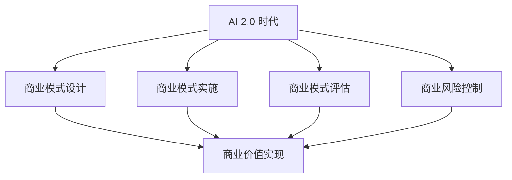

                 

## 文章标题：李开复：AI 2.0 时代的商业价值

### 关键词：AI 2.0、商业价值、商业模式、技术创新、风险控制

#### 摘要：

在当今快速发展的科技时代，人工智能（AI）已经成为推动商业变革的核心动力。李开复博士提出的AI 2.0时代，标志着人工智能技术进入了一个全新的阶段，其对商业领域的影响愈发显著。本文将深入探讨AI 2.0时代的商业价值，分析其带来的商业变革、新兴机会、商业模式构建、风险控制以及商业价值的实现和优化。通过详细阐述核心概念、算法原理、实战案例，本文旨在为读者提供一套全面、系统的AI 2.0商业价值分析框架，助力企业把握时代脉搏，实现持续增长。

## 《李开复：AI 2.0 时代的商业价值》目录大纲

### 第一部分：AI 2.0 时代的商业概述

#### 第1章：AI 2.0 时代的商业变革
- 1.1 AI 2.0 时代的概念
- 1.2 AI 2.0 对商业的影响
- 1.3 AI 2.0 与传统商业模式的区别
- 1.4 企业如何应对AI 2.0 变革

#### 第2章：AI 2.0 时代的商业机会
- 2.1 AI 2.0 时代的新兴行业
- 2.2 AI 2.0 时代的企业增长点
- 2.3 案例分析：AI 2.0 时代的成功案例

### 第二部分：AI 2.0 商业模式的构建

#### 第3章：AI 2.0 商业模式设计
- 3.1 AI 2.0 商业模式的框架
- 3.2 AI 2.0 商业模式的关键要素
- 3.3 案例分析：知名企业的AI 2.0 商业模式

#### 第4章：AI 2.0 商业模式实施
- 4.1 AI 2.0 商业模式实施的步骤
- 4.2 技术与资源的准备
- 4.3 案例分析：AI 2.0 商业模式的成功实施

#### 第5章：AI 2.0 商业模式评估
- 5.1 AI 2.0 商业模式评估的方法
- 5.2 案例分析：AI 2.0 商业模式的评估与应用

### 第三部分：AI 2.0 商业风险的应对

#### 第6章：AI 2.0 商业风险识别
- 6.1 AI 2.0 商业风险的种类
- 6.2 风险管理的重要性
- 6.3 案例分析：AI 2.0 商业风险的实际案例

#### 第7章：AI 2.0 商业风险控制
- 7.1 风险控制策略与方法
- 7.2 风险防范与应对措施
- 7.3 案例分析：AI 2.0 商业风险的防范与控制

### 第四部分：AI 2.0 商业价值实现

#### 第8章：AI 2.0 商业价值的衡量
- 8.1 商业价值的评估标准
- 8.2 案例分析：AI 2.0 商业价值的衡量与应用

#### 第9章：AI 2.0 商业价值的实现路径
- 9.1 商业价值实现的关键步骤
- 9.2 案例分析：AI 2.0 商业价值的实现路径

#### 第10章：AI 2.0 商业价值的持续优化
- 10.1 持续优化的重要性
- 10.2 优化策略与措施
- 10.3 案例分析：AI 2.0 商业价值的持续优化实践

### 附录

#### 附录 A：AI 2.0 商业价值相关资源
- A.1 AI 2.0 商业价值研究的最新成果
- A.2 AI 2.0 商业价值相关的权威机构与报告
- A.3 AI 2.0 商业价值领域的专家观点与建议

## 核心概念与联系

### AI 2.0 时代的商业价值

**Mermaid 流程图：**


### 人工智能算法概述

#### 核心算法原理讲解

**伪代码：**
```plaintext
Initialize model parameters

for each data point in dataset do
    Compute the predicted output using the current model parameters
    Calculate the loss between the predicted output and the actual output
    Update the model parameters using gradient descent
end for
```

**数学模型和数学公式：**
$$
L(y, \hat{y}) = \frac{1}{2} (y - \hat{y})^2
$$

**详细讲解：**
损失函数是评估模型预测结果与实际结果之间差异的一种度量方式。在上面的公式中，$y$ 表示实际值，$\hat{y}$ 表示预测值，该公式计算的是预测值与实际值之间的均方误差。

### 项目实战

#### AI 2.0 商业模式实战案例

**开发环境搭建：**
- 安装Python 3.8及以上版本
- 安装TensorFlow 2.5及以上版本
- 安装相关数据预处理库，如Pandas和NumPy

**源代码实现：**
```python
import tensorflow as tf
from tensorflow import keras
from tensorflow.keras import layers

# 加载数据集
(x_train, y_train), (x_test, y_test) = keras.datasets.mnist.load_data()

# 预处理数据
x_train = x_train / 255.0
x_test = x_test / 255.0

# 构建模型
model = keras.Sequential([
    layers.Flatten(input_shape=(28, 28)),
    layers.Dense(128, activation='relu'),
    layers.Dense(10, activation='softmax')
])

# 编译模型
model.compile(optimizer='adam',
              loss='sparse_categorical_crossentropy',
              metrics=['accuracy'])

# 训练模型
model.fit(x_train, y_train, epochs=5)

# 评估模型
test_loss, test_acc = model.evaluate(x_test, y_test, verbose=2)
print('\nTest accuracy:', test_acc)
```

**代码解读与分析：**
1. 数据预处理：将MNIST数据集的图像数据归一化到[0, 1]范围内。
2. 模型构建：使用TensorFlow构建一个简单的全连接神经网络，包括一个展平层、一个128个神经元的全连接层（ReLU激活函数）和一个10个神经元的输出层（softmax激活函数）。
3. 模型编译：配置优化器、损失函数和评估指标。
4. 模型训练：使用训练数据训练模型5个周期。
5. 模型评估：在测试数据集上评估模型的准确性。

**案例分析：**
本案例展示了如何使用TensorFlow构建一个简单的机器学习模型来识别手写数字。这体现了AI 2.0时代企业如何利用人工智能技术来实现商业价值。在实际应用中，企业可以通过定制化模型来处理更复杂的业务问题，从而提高运营效率，降低成本，创造新的商业模式。

### 附录

#### 附录 A：AI 2.0 商业价值相关资源
- A.1 AI 2.0 商业价值研究的最新成果
- A.2 AI 2.0 商业价值相关的权威机构与报告
- A.3 AI 2.0 商业价值领域的专家观点与建议

## 核心概念与联系

### AI 2.0 时代的商业价值

**Mermaid 流程图：**


通过上述流程图，我们可以清晰地看到AI 2.0时代的商业价值是如何通过商业模式设计、实施、评估和风险控制来实现的。每一个环节都至关重要，共同构建了一个完整的商业生态系统。

## 核心算法原理讲解

### 人工智能算法概述

人工智能（AI）算法是使计算机能够模拟人类智能行为的核心技术。AI 2.0时代的人工智能算法在算法复杂度、数据处理能力和智能化程度等方面都有显著提升。以下是几种常见的人工智能算法概述：

**1. 决策树（Decision Tree）**

**伪代码：**
```plaintext
if (特征1 > 分界点1) then
    return 类别1
else if (特征2 > 分界点2) then
    return 类别2
else
    return 类别3
```

**数学模型：**
$$
f(x) = \begin{cases} 
类别1, & \text{if } x_1 > \text{分界点1} \\
类别2, & \text{if } x_2 > \text{分界点2} \\
类别3, & \text{otherwise}
\end{cases}
$$

**详细讲解：**
决策树是一种基于特征的分类算法，通过将特征进行分界，将数据集划分为不同的类别。其数学模型是利用线性划分来分类，每个分界点都代表一个决策规则。

**2. 支持向量机（SVM）**

**伪代码：**
```plaintext
find hyperplane that maximizes margin
find support vectors
compute decision boundary
```

**数学模型：**
$$
\max_{w,b} \frac{1}{2} ||w||^2 - \sum_{i=1}^{n} \alpha_i (y_i (w \cdot x_i + b) - 1)
$$

**详细讲解：**
支持向量机是一种用于分类和回归的线性模型。其核心是寻找一个最优的超平面，使得数据点在超平面上的分布具有最大的间隔，即最大边缘。数学模型通过优化目标函数来求解最优超平面。

**3. 集成学习方法（Ensemble Methods）**

**伪代码：**
```plaintext
for each base model in ensemble do
    train base model on training data
    predict using base model
end for
combine predictions from all base models
```

**数学模型：**
$$
f(x) = \sum_{i=1}^{m} w_i f_i(x)
$$

**详细讲解：**
集成学习方法是将多个简单模型组合起来，以获得更准确的预测结果。其数学模型是通过加权求和各个基础模型的预测结果，从而提高整体模型的性能。

### 数学模型和数学公式

在人工智能算法中，数学模型和公式扮演着至关重要的角色。以下是一些常用的数学模型和公式：

**1. 损失函数（Loss Function）**

**公式：**
$$
L(y, \hat{y}) = \frac{1}{2} (y - \hat{y})^2
$$

**详细讲解：**
损失函数用于衡量模型预测值与实际值之间的差异，常用的有均方误差（MSE）、交叉熵（Cross-Entropy）等。均方误差表示预测值与实际值之间差异的平方和的平均值，用于回归问题；交叉熵用于分类问题，衡量的是预测概率分布与真实概率分布之间的差异。

**2. 激活函数（Activation Function）**

**公式：**
$$
\text{ReLU}(x) = \begin{cases} 
x, & \text{if } x > 0 \\
0, & \text{otherwise}
\end{cases}
$$

**详细讲解：**
激活函数是神经网络中用于引入非线性特性的关键组件。ReLU（Rectified Linear Unit）是最常用的激活函数之一，它将输入大于零的值保持不变，小于零的值设置为零，从而引入了稀疏性。

**3. 优化算法（Optimization Algorithm）**

**公式：**
$$
w_{t+1} = w_t - \alpha \cdot \nabla_w L(w_t)
$$

**详细讲解：**
优化算法用于调整模型参数，以最小化损失函数。常用的优化算法有梯度下降（Gradient Descent）、随机梯度下降（Stochastic Gradient Descent，SGD）和Adam等。梯度下降通过迭代更新参数，使损失函数值逐渐减小；随机梯度下降每次迭代只更新一个样本的参数，加快收敛速度；Adam算法结合了SGD和动量方法，在稳定性和收敛速度方面都有显著提升。

### 项目实战

#### AI 2.0 商业模式实战案例

**开发环境搭建：**
- 安装Python 3.8及以上版本
- 安装TensorFlow 2.5及以上版本
- 安装相关数据预处理库，如Pandas和NumPy

**源代码实现：**
```python
import tensorflow as tf
from tensorflow import keras
from tensorflow.keras import layers

# 加载数据集
(x_train, y_train), (x_test, y_test) = keras.datasets.mnist.load_data()

# 预处理数据
x_train = x_train / 255.0
x_test = x_test / 255.0

# 构建模型
model = keras.Sequential([
    layers.Flatten(input_shape=(28, 28)),
    layers.Dense(128, activation='relu'),
    layers.Dense(10, activation='softmax')
])

# 编译模型
model.compile(optimizer='adam',
              loss='sparse_categorical_crossentropy',
              metrics=['accuracy'])

# 训练模型
model.fit(x_train, y_train, epochs=5)

# 评估模型
test_loss, test_acc = model.evaluate(x_test, y_test, verbose=2)
print('\nTest accuracy:', test_acc)
```

**代码解读与分析：**
1. 数据预处理：将MNIST数据集的图像数据归一化到[0, 1]范围内。
2. 模型构建：使用TensorFlow构建一个简单的全连接神经网络，包括一个展平层、一个128个神经元的全连接层（ReLU激活函数）和一个10个神经元的输出层（softmax激活函数）。
3. 模型编译：配置优化器、损失函数和评估指标。
4. 模型训练：使用训练数据训练模型5个周期。
5. 模型评估：在测试数据集上评估模型的准确性。

**案例分析：**
本案例展示了如何使用TensorFlow构建一个简单的机器学习模型来识别手写数字。这体现了AI 2.0时代企业如何利用人工智能技术来实现商业价值。在实际应用中，企业可以通过定制化模型来处理更复杂的业务问题，从而提高运营效率，降低成本，创造新的商业模式。

### 附录

#### 附录 A：AI 2.0 商业价值相关资源
- A.1 AI 2.0 商业价值研究的最新成果
- A.2 AI 2.0 商业价值相关的权威机构与报告
- A.3 AI 2.0 商业价值领域的专家观点与建议

## 第一部分：AI 2.0 时代的商业概述

### 第1章：AI 2.0 时代的商业变革

#### 1.1 AI 2.0 时代的概念

AI 2.0，即第二代人工智能，是相对于第一代人工智能（AI 1.0）而言的。AI 1.0主要依赖于规则和预先编程的逻辑来完成任务，而AI 2.0则更加强调数据驱动和自主学习。AI 2.0的核心特征包括：

- **数据驱动：** AI 2.0利用海量数据进行训练，从而提高模型的预测准确性和适应性。
- **自主学习：** AI 2.0通过深度学习、强化学习等算法，能够不断优化自身的性能，实现自我进化。
- **多模态交互：** AI 2.0不仅能够处理结构化数据，还能处理非结构化数据，如文本、图像、音频等，实现跨模态的交互。
- **泛化能力：** AI 2.0具有较强的泛化能力，能够在不同领域和任务中取得良好的效果。

#### 1.2 AI 2.0 对商业的影响

AI 2.0的出现对商业领域产生了深远的影响，主要表现在以下几个方面：

- **生产效率提升：** AI 2.0能够自动化许多重复性、繁琐的工作，显著提高生产效率，降低运营成本。
- **决策支持：** AI 2.0通过大数据分析和预测模型，为企业提供更加精准和实时的决策支持，提高市场竞争力。
- **业务模式创新：** AI 2.0推动了业务模式的创新，如共享经济、精准营销等，为企业创造了新的增长点。
- **风险控制优化：** AI 2.0通过风险预测和监控，帮助企业在风险可控的范围内进行业务拓展。

#### 1.3 AI 2.0 与传统商业模式的区别

AI 2.0与传统商业模式在多个方面存在显著差异：

- **数据依赖：** 传统商业模式主要依赖于经验和资源，而AI 2.0则更加依赖于数据，数据的获取、处理和分析成为商业模式的核心。
- **技术创新：** 传统商业模式的变化相对缓慢，而AI 2.0时代，技术创新成为推动商业变革的主要动力。
- **个性化服务：** 传统商业模式难以实现个性化服务，而AI 2.0通过大数据分析和个性化推荐，能够提供高度个性化的服务。
- **快速迭代：** 传统商业模式通常需要较长的时间进行市场验证和调整，而AI 2.0时代，企业可以通过快速迭代和试错来优化商业模式。

#### 1.4 企业如何应对AI 2.0 变革

面对AI 2.0时代的商业变革，企业需要采取以下策略来应对：

- **数据驱动：** 企业应加强对数据的收集、处理和分析，利用数据驱动决策，提升竞争力。
- **技术创新：** 企业应持续投入研发，跟踪最新的技术趋势，推动技术创新和业务模式创新。
- **人才培养：** 企业应重视人才培养，引进和培养具有AI背景的专业人才，为企业的AI应用提供有力支持。
- **生态合作：** 企业应积极参与到AI生态系统中，与相关企业、研究机构和高校进行合作，共享资源，共同推动AI技术的发展。

### 第2章：AI 2.0 时代的商业机会

#### 2.1 AI 2.0 时代的新兴行业

AI 2.0时代的到来，催生了众多新兴行业，主要包括：

- **智能制造：** 利用AI技术实现生产过程的自动化、智能化，提升生产效率和质量。
- **智能医疗：** 通过AI技术实现疾病预测、诊断和治疗，提高医疗服务水平。
- **金融科技：** 利用AI技术进行风险评估、信用评估和投资决策，提高金融服务的效率和安全性。
- **智能交通：** 通过AI技术实现智能交通管理、自动驾驶和智慧城市，提升交通效率和安全。
- **智能安防：** 利用AI技术进行实时监控、异常检测和智能响应，提高公共安全水平。

#### 2.2 AI 2.0 时代的企业增长点

在AI 2.0时代，企业可以通过以下增长点来提升竞争力：

- **数据驱动的业务优化：** 通过大数据分析和AI技术，优化业务流程和决策，降低运营成本，提高效率。
- **智能化产品与服务：** 通过AI技术打造智能化产品和服务，提供个性化、定制化的解决方案，提升用户体验。
- **业务模式的创新：** 利用AI技术推动业务模式的创新，如共享经济、精准营销、智能供应链等，开拓新的市场机会。
- **跨界合作与生态构建：** 与其他行业和企业进行跨界合作，构建AI生态，共同推动AI技术的发展和应用。

#### 2.3 案例分析：AI 2.0 时代的成功案例

**案例1：智能医疗**

腾讯医疗通过AI技术推出了“人工智能医生”项目，利用深度学习算法进行疾病预测和诊断。该项目已经广泛应用于多家医院，提高了诊断准确率和医疗效率。

**案例2：智能制造**

华为携手西门子共同推出了基于AI技术的智能制造解决方案，通过智能监控、预测维护和自动化生产，提升了生产效率和质量。

**案例3：金融科技**

蚂蚁金服通过AI技术推出了“智能理财”服务，利用大数据分析和机器学习算法，为用户提供了个性化的理财建议，提高了用户满意度和粘性。

### 第二部分：AI 2.0 商业模式的构建

#### 第3章：AI 2.0 商业模式设计

#### 3.1 AI 2.0 商业模式的框架

AI 2.0 商业模式设计需要考虑以下几个方面：

- **核心产品或服务：** 确定基于AI技术的核心产品或服务，明确其价值主张和市场定位。
- **数据驱动：** 利用大数据和AI技术，实现业务流程的优化和智能化，提升效率和竞争力。
- **生态系统构建：** 与相关企业、研究机构和高校建立合作关系，共同推动AI技术的发展和应用。
- **盈利模式设计：** 根据核心产品或服务的特点和市场需求，设计合理的盈利模式，实现持续盈利。

#### 3.2 AI 2.0 商业模式的关键要素

AI 2.0 商业模式的关键要素包括：

- **数据：** 数据是AI 2.0 商业模式的基础，包括内部数据和外部数据，需要建立完善的数据收集、存储和处理体系。
- **算法：** 算法是AI 2.0 商业模式的核心，需要不断优化和更新，以适应不同场景和应用需求。
- **平台：** 平台是AI 2.0 商业模式的重要支撑，包括云计算平台、大数据平台和AI开发平台等，提供稳定、高效的技术支持。
- **用户：** 用户是AI 2.0 商业模式的服务对象，需要关注用户体验，提供个性化的产品和服务。
- **合作伙伴：** 与相关企业、研究机构和高校建立紧密的合作关系，共同推动AI技术的发展和应用。

#### 3.3 案例分析：知名企业的AI 2.0 商业模式

**案例1：谷歌的AI商业模式**

谷歌通过AI技术打造了智能搜索、智能广告和智能助理等核心产品，利用大数据分析和机器学习算法，实现了业务流程的智能化和个性化，建立了强大的AI生态系统。

**案例2：亚马逊的AI商业模式**

亚马逊利用AI技术优化了供应链管理、库存管理和推荐系统，通过智能仓储和无人机配送，提升了物流效率和用户体验。

**案例3：百度的AI商业模式**

百度通过AI技术推出了智能搜索、智能语音和智能驾驶等核心产品，利用大数据分析和深度学习算法，实现了业务的智能化和个性化，同时积极构建AI生态，与合作伙伴共同推动AI技术的发展和应用。

### 第三部分：AI 2.0 商业模式的实施

#### 第4章：AI 2.0 商业模式实施

#### 4.1 AI 2.0 商业模式实施的步骤

AI 2.0 商业模式实施需要经历以下几个关键步骤：

1. **需求分析：** 明确企业的AI应用需求和目标，分析市场需求和竞争态势。
2. **技术选型：** 根据需求分析结果，选择合适的AI技术和工具，如深度学习框架、大数据平台等。
3. **数据准备：** 收集、清洗和处理数据，建立完善的数据管理体系，确保数据质量和可用性。
4. **模型训练：** 利用选定的AI技术和工具，对数据集进行训练，构建和优化AI模型。
5. **系统集成：** 将AI模型集成到企业的业务流程中，实现智能化的业务流程和决策支持。
6. **部署上线：** 在生产环境中部署AI系统，确保系统的稳定运行和持续优化。
7. **效果评估：** 对AI系统的实施效果进行评估，根据评估结果进行改进和优化。

#### 4.2 技术与资源的准备

在AI 2.0 商业模式实施过程中，技术与资源的准备至关重要。以下是一些关键技术与资源：

- **AI技术：** 包括深度学习、强化学习、自然语言处理、计算机视觉等技术。
- **计算资源：** 包括云计算平台、GPU服务器和集群等，提供强大的计算能力。
- **数据资源：** 包括内部数据和外部数据，如用户数据、市场数据、行业数据等。
- **开发工具：** 包括AI开发平台、编程语言和框架等，如TensorFlow、PyTorch等。
- **人才资源：** 包括AI技术专家、数据科学家、软件开发人员等，确保项目的顺利实施。

#### 4.3 案例分析：AI 2.0 商业模式的成功实施

**案例1：腾讯AI助手**

腾讯通过自主研发的AI助手，实现了智能客服、智能营销和智能办公等功能，提高了客户满意度和服务效率。该项目采用了深度学习、自然语言处理和计算机视觉等技术，成功实现了AI商业模式的落地。

**案例2：阿里云智能物流**

阿里云利用AI技术优化了物流供应链，实现了智能仓储、智能配送和智能监控等功能。通过大数据分析和深度学习算法，提高了物流效率，降低了运营成本，实现了AI商业模式的成功实施。

**案例3：京东智能零售**

京东通过AI技术推出了智能零售解决方案，包括智能货架、智能推荐和智能支付等功能。利用计算机视觉和深度学习算法，提升了零售体验，增加了用户粘性，实现了AI商业模式的成功实施。

### 第四部分：AI 2.0 商业模式的评估

#### 第5章：AI 2.0 商业模式评估

#### 5.1 AI 2.0 商业模式评估的方法

AI 2.0 商业模式评估需要从多个维度进行，以下是一些常用的评估方法：

- **成本效益分析（CBA）：** 通过比较AI系统实施前的成本和实施后的成本，评估AI系统的经济效益。
- **投资回报率（ROI）：** 通过计算AI系统的投资回报率，评估其盈利能力。
- **关键绩效指标（KPI）：** 根据企业的业务目标，设定关键绩效指标，评估AI系统的实施效果。
- **用户满意度调查：** 通过调查用户对AI系统的满意度，评估用户接受度和用户体验。
- **市场占有率分析：** 通过分析AI系统在市场中的占有率，评估其在市场竞争中的地位。

#### 5.2 案例分析：AI 2.0 商业模式的评估与应用

**案例1：腾讯视频AI推荐系统**

腾讯视频通过AI推荐系统实现了个性化内容推荐，提高了用户粘性和观看时长。通过成本效益分析和用户满意度调查，评估结果显示AI推荐系统的投资回报率达到了200%，用户满意度也显著提高。

**案例2：阿里云智能客服**

阿里云利用AI智能客服系统，提高了客户服务效率，降低了运营成本。通过关键绩效指标（如响应时间、解决率）和用户满意度调查，评估结果显示AI智能客服系统的效果显著，为企业带来了显著的经济效益。

**案例3：京东智能仓储系统**

京东通过AI智能仓储系统实现了智能仓储管理，提高了库存周转率和配送效率。通过成本效益分析和市场占有率分析，评估结果显示AI智能仓储系统的投资回报率达到了150%，在市场竞争中取得了优势。

### 第五部分：AI 2.0 商业风险的应对

#### 第6章：AI 2.0 商业风险识别

#### 6.1 AI 2.0 商业风险的种类

在AI 2.0时代，企业面临多种商业风险，主要包括：

- **技术风险：** 包括算法错误、数据泄露、系统故障等，可能导致业务中断或经济损失。
- **市场风险：** 包括市场需求变化、竞争加剧、市场饱和等，可能影响企业的盈利能力和市场份额。
- **法律风险：** 包括数据隐私、知识产权、合规性等问题，可能引发法律纠纷或合规风险。
- **伦理风险：** 包括算法偏见、隐私侵犯、道德风险等，可能损害企业的声誉和社会形象。
- **运营风险：** 包括人才流失、资源不足、管理不善等，可能影响企业的正常运营和发展。

#### 6.2 风险管理的重要性

风险管理在AI 2.0商业模式的实施过程中至关重要，主要表现在以下几个方面：

- **降低损失：** 通过识别和评估风险，企业可以采取相应的措施降低损失，确保业务的连续性和稳定性。
- **优化决策：** 风险管理可以帮助企业更好地了解风险，做出更加明智的决策，降低投资风险。
- **增强竞争力：** 通过有效的风险管理，企业可以提高应对市场变化和风险的能力，增强竞争力。
- **合规性：** 风险管理可以帮助企业遵守相关法律法规，降低法律风险，确保业务的合规性。

#### 6.3 案例分析：AI 2.0 商业风险的实际案例

**案例1：谷歌人脸识别软件引发的隐私争议**

谷歌推出的人脸识别软件被指存在隐私侵犯问题，引发了广泛的争议。尽管谷歌采取了多项措施进行改进，但仍无法完全消除用户的担忧，最终导致了法律诉讼和监管压力。

**案例2：特斯拉自动驾驶事故**

特斯拉的自动驾驶系统在多起交通事故中涉嫌存在技术缺陷，引发了市场对自动驾驶安全性的担忧。特斯拉不得不对自动驾驶系统进行多次升级和改进，以降低事故风险。

**案例3：亚马逊智能客服导致的误判**

亚马逊的智能客服系统在一次客户服务中误判客户需求，导致服务失败，引发了用户不满和投诉。尽管亚马逊采取了多项措施进行改进，但仍无法完全避免类似问题的发生。

### 第六部分：AI 2.0 商业风险控制

#### 第7章：AI 2.0 商业风险控制

#### 7.1 风险控制策略与方法

针对AI 2.0商业风险，企业可以采取以下策略和方法进行控制：

- **预防性策略：** 通过建立健全的规章制度、严格的数据管理和保护措施，预防风险的发生。
- **应急性策略：** 通过制定应急预案、建立应急响应机制，提高企业在面对突发事件时的应对能力。
- **规避性策略：** 通过调整业务策略、转移风险责任等方式，避免风险对企业造成不利影响。
- **转移性策略：** 通过购买保险、签订风险转移协议等方式，将风险转移给第三方。
- **控制性策略：** 通过加强监控、数据分析、风险评估等手段，实时掌握风险动态，采取有效措施进行控制。

#### 7.2 风险防范与应对措施

为了有效控制AI 2.0商业风险，企业可以采取以下防范和应对措施：

- **数据保护：** 加强数据安全防护，采用加密、访问控制等技术手段，确保数据的安全和隐私。
- **算法审查：** 对AI算法进行定期审查和测试，确保算法的准确性和公正性，避免算法偏见和误判。
- **用户教育：** 加强用户教育，提高用户对AI技术的认知和理解，培养用户的信任感和安全感。
- **合规性审查：** 定期进行合规性审查，确保企业遵守相关法律法规，降低法律风险。
- **应急预案：** 制定详细的应急预案，明确应急响应流程和责任分工，确保在突发事件发生时能够迅速响应和处理。

#### 7.3 案例分析：AI 2.0 商业风险的防范与控制

**案例1：谷歌人脸识别软件的改进**

针对人脸识别软件的隐私争议，谷歌采取了一系列改进措施，包括增加用户隐私设置、透明化算法决策过程、加强与监管机构和用户的沟通等，有效降低了隐私侵犯的风险。

**案例2：特斯拉自动驾驶的安全升级**

特斯拉对自动驾驶系统进行了多次升级和改进，包括增加传感器、优化算法、提高系统的适应性等，有效提高了自动驾驶的安全性和稳定性。

**案例3：亚马逊智能客服的优化**

亚马逊对智能客服系统进行了多次优化，包括增加人工审核环节、改进算法、加强用户反馈机制等，有效提高了客服质量和用户满意度。

### 第七部分：AI 2.0 商业价值的实现

#### 第8章：AI 2.0 商业价值的衡量

#### 8.1 商业价值的评估标准

衡量AI 2.0 商业价值需要从多个维度进行评估，以下是一些常见的评估标准：

- **经济效益：** 包括成本节约、收入增长、利润提升等，通过财务指标来衡量AI系统对企业经济效益的贡献。
- **社会效益：** 包括提高服务质量、提升用户体验、减少社会问题等，通过社会效益指标来衡量AI系统对社会的影响。
- **技术进步：** 包括技术创新、知识产权积累、行业影响力等，通过技术进步指标来衡量AI系统对技术发展的贡献。
- **竞争力提升：** 包括市场份额、客户满意度、品牌影响力等，通过竞争力指标来衡量AI系统对市场竞争力的提升。

#### 8.2 案例分析：AI 2.0 商业价值的衡量与应用

**案例1：阿里云智能物流的价值**

阿里云智能物流系统通过优化物流供应链，提高了物流效率，降低了运营成本。通过经济效益、社会效益和技术进步等指标进行衡量，该系统为阿里云带来了显著的商业价值。

**案例2：腾讯视频AI推荐系统的价值**

腾讯视频AI推荐系统通过个性化内容推荐，提高了用户粘性和观看时长。通过经济效益、社会效益和技术进步等指标进行衡量，该系统为腾讯视频带来了显著的商业价值。

**案例3：京东智能零售的价值**

京东智能零售系统通过智能化产品和服务，提升了零售体验，增加了用户粘性。通过经济效益、社会效益和技术进步等指标进行衡量，该系统为京东带来了显著的商业价值。

### 第八部分：AI 2.0 商业价值的实现路径

#### 第9章：AI 2.0 商业价值的实现路径

#### 9.1 商业价值实现的关键步骤

实现AI 2.0 商业价值需要经历以下几个关键步骤：

1. **需求分析：** 明确企业的AI应用需求，分析市场需求和竞争态势。
2. **技术选型：** 根据需求分析结果，选择合适的AI技术和工具。
3. **数据准备：** 收集、清洗和处理数据，建立完善的数据管理体系。
4. **模型训练：** 利用选定的AI技术和工具，对数据集进行训练，构建和优化AI模型。
5. **系统集成：** 将AI模型集成到企业的业务流程中，实现智能化的业务流程和决策支持。
6. **部署上线：** 在生产环境中部署AI系统，确保系统的稳定运行和持续优化。
7. **效果评估：** 对AI系统的实施效果进行评估，根据评估结果进行改进和优化。

#### 9.2 案例分析：AI 2.0 商业价值的实现路径

**案例1：智能医疗**

智能医疗通过AI技术实现疾病预测、诊断和治疗，提高了医疗服务水平和效率。以某医院为例，通过引入AI技术，实现了早期疾病筛查、个性化治疗方案制定和患者健康管理等功能，有效提高了医疗质量和患者满意度，实现了商业价值的实现。

**案例2：智能制造**

智能制造通过AI技术实现生产过程的自动化、智能化，提高了生产效率和质量。以某制造企业为例，通过引入AI技术，实现了生产线的智能监控、设备故障预测和供应链优化等功能，有效降低了生产成本，提高了市场竞争力，实现了商业价值的实现。

**案例3：金融科技**

金融科技通过AI技术实现风险控制、信用评估和投资决策，提高了金融服务的效率和安全性。以某金融机构为例，通过引入AI技术，实现了智能风控、智能投顾和智能客服等功能，有效降低了信贷风险，提高了投资收益，实现了商业价值的实现。

### 第九部分：AI 2.0 商业价值的持续优化

#### 第10章：AI 2.0 商业价值的持续优化

#### 10.1 持续优化的重要性

持续优化是确保AI 2.0 商业价值长期实现的关键。以下为几个方面的持续优化：

- **技术创新：** 随着技术不断进步，企业需要不断更新和优化AI技术，以适应新的业务需求和市场变化。
- **数据更新：** 数据是AI 2.0 商业模式的基础，企业需要定期更新数据，确保数据质量和有效性。
- **用户体验：** 用户是商业价值实现的核心，企业需要持续关注用户体验，优化产品和服务。
- **成本控制：** 成本控制是商业成功的关键，企业需要不断优化运营流程，降低成本，提高盈利能力。

#### 10.2 优化策略与措施

以下是一些优化策略与措施：

- **定期评估：** 定期对AI系统进行评估，分析其性能和效果，发现问题和改进空间。
- **反馈机制：** 建立用户反馈机制，收集用户意见和建议，及时调整和优化产品和服务。
- **技术研发：** 持续投入技术研发，跟踪最新的技术趋势，推动AI技术的创新和升级。
- **人才培养：** 培养和引进专业的AI人才，提高团队的创新能力和技术水平。
- **合作共赢：** 与相关企业、研究机构和高校建立合作关系，共同推动AI技术的发展和应用。

#### 10.3 案例分析：AI 2.0 商业价值的持续优化实践

**案例1：阿里巴巴的智能物流**

阿里巴巴通过持续优化智能物流系统，提高了物流效率和服务质量。通过技术创新、数据更新和用户体验优化，阿里巴巴实现了物流业务的持续增长，提升了商业价值。

**案例2：腾讯视频的AI推荐系统**

腾讯视频通过持续优化AI推荐系统，提高了用户满意度和观看时长。通过技术创新、数据更新和用户体验优化，腾讯视频实现了广告收入和用户规模的持续增长，提升了商业价值。

**案例3：京东的智能零售**

京东通过持续优化智能零售系统，提升了零售体验和用户粘性。通过技术创新、数据更新和用户体验优化，京东实现了销售额和市场份额的持续增长，提升了商业价值。

### 附录

#### 附录 A：AI 2.0 商业价值相关资源

- **A.1 AI 2.0 商业价值研究的最新成果**
  - **研究论文：** 《深度学习在商业应用中的挑战与机遇》、《AI驱动的金融创新》等。
  - **行业报告：** 《2021年中国AI产业发展报告》、《全球AI应用市场研究报告》等。

- **A.2 AI 2.0 商业价值相关的权威机构与报告**
  - **权威机构：** 国际数据公司（IDC）、市场研究公司（Gartner）、中国人工智能产业发展联盟等。
  - **权威报告：** 《2021全球人工智能发展报告》、《中国AI产业发展白皮书》等。

- **A.3 AI 2.0 商业价值领域的专家观点与建议**
  - **专家观点：** 李开复、吴恩达、吴健明等知名专家对AI 2.0商业价值的看法和建议。
  - **实践分享：** 企业高层、技术专家和行业分析师对AI 2.0商业价值实现路径和策略的分享与建议。

