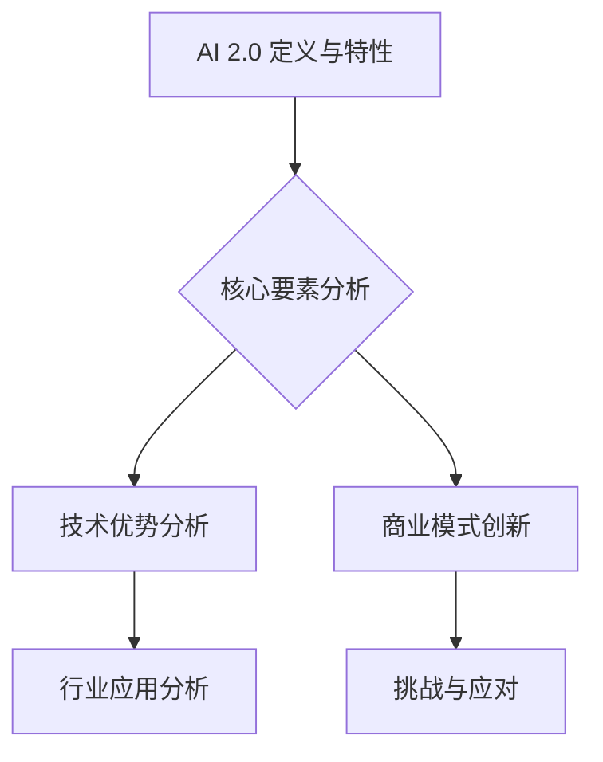

                 

### 文章标题：李开复：AI 2.0 时代的商业模式

> 关键词：AI 2.0、商业模式、创新、应用、挑战、战略、案例研究

> 摘要：随着人工智能（AI）技术的飞速发展，我们进入了AI 2.0时代。在这个新时代，商业模式发生了深刻的变革，如何抓住AI 2.0的机遇、创新商业模式、应对挑战、构建竞争优势成为企业和企业家必须面对的问题。本文旨在系统地探讨AI 2.0时代的商业模式，从基础理论、实践应用、挑战与应对、企业战略等多个角度进行分析，以期为企业提供有价值的参考。

---

### 目录

## 第一部分：AI 2.0 时代概述

### 第1章：AI 2.0 基础理论

#### 1.1 AI 2.0：定义与特性

#### 1.2 AI 2.0 的发展历程

#### 1.3 AI 2.0 对商业的影响

### 第2章：AI 2.0 时代的商业模式创新

#### 2.1 商业模式创新的背景与趋势

#### 2.2 AI 2.0 商业模式的核心要素

#### 2.3 创新型商业模式案例分析

## 第二部分：AI 2.0 商业模式实践

### 第3章：AI 2.0 在行业中的应用

#### 3.1 制造业

#### 3.2 零售业

#### 3.3 金融业

#### 3.4 健康医疗

### 第4章：AI 2.0 商业模式的挑战与应对策略

#### 4.1 数据隐私与安全

#### 4.2 AI 偏见与伦理问题

#### 4.3 技术快速迭代与人才竞争

### 第5章：AI 2.0 时代的企业战略

#### 5.1 企业数字化转型路径

#### 5.2 构建AI驱动的竞争优势

#### 5.3 企业的创新文化培育

### 第6章：全球AI 2.0 商业模式趋势

#### 6.1 全球AI产业发展现状

#### 6.2 各国AI政策与投资环境

#### 6.3 全球AI 2.0 商业模式未来趋势

## 第三部分：AI 2.0 商业案例研究

### 第7章：AI 2.0 商业成功案例分析

#### 7.1 案例一：自动驾驶

#### 7.2 案例二：智能医疗

#### 7.3 案例三：智能金融

### 第8章：AI 2.0 商业模式创新之路

#### 8.1 创新思维与方法

#### 8.2 商业模式设计原则

#### 8.3 成功案例分析

## 附录：AI 2.0 商业模式资源指南

#### 附录 A：AI 2.0 相关资源

#### 附录 B：行业研究报告

#### 附录 C：AI 2.0 企业实践案例库

#### 附录 D：学习与培训资源

---

### Mermaid 流程图：



---

### 核心算法原理讲解：

```python
# 伪代码：深度学习基础 - 神经网络结构

# 定义神经网络层
input_layer = [Input(shape=(input_shape))]
hidden_layer = input_layer.add(Dense(units=hidden_units, activation='relu'))
output_layer = hidden_layer.add(Dense(units=output_shape, activation='softmax'))

# 创建模型
model = keras.Model(inputs=input_layer, outputs=output_layer)

# 编译模型
model.compile(optimizer='adam', loss='categorical_crossentropy', metrics=['accuracy'])

# 模型训练
model.fit(x_train, y_train, epochs=epochs, batch_size=batch_size)
```

---

### 数学模型和数学公式：

```latex
\section{线性回归模型}
线性回归模型的目标是最小化损失函数：
$$
J(\theta) = \frac{1}{2m} \sum_{i=1}^{m} (h_\theta(x^{(i)}) - y^{(i)})^2
$$

其中，$ h_\theta(x) = \theta_0 + \theta_1x $ 是线性模型预测，$\theta$ 是模型参数，$m$ 是样本数量。
```

---

### 项目实战：

```python
# 实例：使用 TensorFlow 和 Keras 训练一个简单的神经网络模型

import tensorflow as tf
from tensorflow.keras import layers

# 数据准备
x_train = ... # 输入数据
y_train = ... # 标签数据

# 模型构建
model = tf.keras.Sequential([
    layers.Dense(units=64, activation='relu', input_shape=(input_shape,)),
    layers.Dense(units=10, activation='softmax')
])

# 模型编译
model.compile(optimizer='adam',
              loss=tf.keras.losses.SparseCategoricalCrossentropy(from_logits=True),
              metrics=['accuracy'])

# 模型训练
model.fit(x_train, y_train, epochs=10)
```

---

### 代码解读与分析：

```plaintext
# 代码解读：
# 1. 导入 TensorFlow 库，准备用于训练和评估模型的框架。
# 2. 定义输入数据 x_train 和标签数据 y_train，用于模型训练。
# 3. 构建一个简单的神经网络模型，包括一个隐藏层和一个输出层。
# 4. 编译模型，设置优化器和损失函数。
# 5. 使用输入数据和标签数据训练模型，指定训练的轮数和批次大小。
```

---

接下来，我们将进入文章的主体部分，详细探讨AI 2.0时代的商业模式。首先，我们将从AI 2.0的定义和特性入手，探讨AI 2.0时代的商业模式创新的背景与趋势，然后分析AI 2.0商业模式的核心要素和创新型商业模式案例分析。在第二部分，我们将深入探讨AI 2.0在各个行业中的应用，包括制造业、零售业、金融业和健康医疗。随后，我们将讨论AI 2.0商业模式面临的挑战以及应对策略，并从企业战略的角度分析AI 2.0时代的商业趋势。最后，我们将通过成功案例研究，总结AI 2.0商业模式创新的经验和教训，为企业提供有价值的参考。

---

### 第一部分：AI 2.0 时代概述

#### 第1章：AI 2.0 基础理论

##### 1.1 AI 2.0：定义与特性

随着人工智能（AI）技术的不断发展，AI 2.0时代已经来临。AI 2.0，也被称作下一代人工智能，是相对于AI 1.0（即传统的人工智能，如规则驱动、符号推理等）而言的。AI 2.0的核心在于其能够实现自我学习和进化，具有更强大的自适应能力、更广泛的适用性和更高的智能化水平。

AI 2.0的定义可以从以下几个方面来理解：

1. **自主学习能力**：AI 2.0不再仅仅依赖于人类设定的规则和算法，而是能够通过大量的数据自我学习和优化，提高决策的准确性和效率。
2. **跨领域应用**：AI 2.0不仅限于特定的领域，如图像识别、语音识别等，而是能够跨多个领域进行应用，实现更广泛的价值。
3. **人机协同**：AI 2.0强调人与机器的协同合作，通过人工智能的辅助，提高人类的工作效率和创造力。
4. **自我进化**：AI 2.0具有自我进化的能力，能够不断学习和优化自身，不断提高智能水平和适应能力。

AI 2.0的特性主要包括：

1. **深度学习**：AI 2.0的核心在于深度学习技术，通过多层神经网络进行复杂模式的识别和预测。
2. **强化学习**：AI 2.0能够通过强化学习不断优化自身的行为，提高决策的准确性和效率。
3. **自然语言处理**：AI 2.0在自然语言处理方面取得了显著进展，能够实现更自然、更智能的人机交互。
4. **跨领域融合**：AI 2.0能够将不同领域的技术和知识进行融合，实现更广泛的应用和价值。

通过上述定义和特性的分析，我们可以看到，AI 2.0相较于AI 1.0有着显著的提升，为商业领域带来了新的机遇和挑战。接下来，我们将探讨AI 2.0的发展历程及其对商业的影响。

---

##### 1.2 AI 2.0 的发展历程

AI 2.0的发展历程可以分为以下几个阶段：

1. **数据积累阶段**：AI 2.0的兴起得益于大数据的积累和存储技术的发展。在这个阶段，大量的数据被收集和存储，为后续的深度学习和自我学习奠定了基础。

2. **深度学习阶段**：随着深度学习技术的突破，AI 2.0开始崭露头角。深度学习通过多层神经网络对数据进行建模和分析，使得AI系统具备了更强的学习能力。

3. **应用推广阶段**：在深度学习技术的基础上，AI 2.0开始在各个领域得到广泛应用。自动驾驶、智能家居、智能医疗等领域的兴起，标志着AI 2.0时代的到来。

4. **人机协同阶段**：AI 2.0不仅仅是一个工具，更是人类合作伙伴。在这一阶段，AI 2.0通过自然语言处理、人机交互等技术，与人类实现更深层次的协同工作。

5. **自我进化阶段**：AI 2.0开始具备自我进化的能力，通过强化学习和迁移学习等技术，不断优化自身的行为和决策。这一阶段标志着AI 2.0向更高级别的人工智能发展。

在AI 2.0的发展历程中，重要的里程碑事件包括：

1. **2012年，AlexNet在ImageNet竞赛中获胜**：这一事件标志着深度学习技术的突破，成为AI 2.0发展的重要转折点。

2. **2016年，AlphaGo战胜李世石**：这一事件展示了AI 2.0在复杂问题解决和决策方面的能力，引发了全球范围内的广泛关注。

3. **2020年，OpenAI的五人团队在Dota2游戏中战胜世界冠军**：这一事件进一步证明了AI 2.0在复杂游戏和决策领域的强大实力。

通过回顾AI 2.0的发展历程，我们可以看到，AI 2.0已经从实验室走向了实际应用，成为推动社会进步的重要力量。接下来，我们将探讨AI 2.0对商业的影响。

---

##### 1.3 AI 2.0 对商业的影响

AI 2.0的崛起对商业领域产生了深远的影响，不仅改变了企业的运营方式，也带来了新的商业机会。以下是AI 2.0对商业影响的几个关键方面：

1. **提高生产效率**：AI 2.0可以通过自动化和智能化技术，提高生产效率。例如，在制造业中，AI 2.0可以优化生产流程，提高生产线的自动化程度，减少人为错误，从而降低生产成本。

2. **优化供应链管理**：AI 2.0在供应链管理中的应用，可以帮助企业实现更高效的库存管理、物流优化和需求预测。通过数据分析，企业可以更准确地预测市场需求，优化库存水平，减少库存成本。

3. **提升客户体验**：AI 2.0在客户服务中的应用，如智能客服、个性化推荐等，可以提升客户满意度。通过自然语言处理和机器学习技术，AI 2.0可以提供更快速、更准确的客户服务，增强客户体验。

4. **创新商业模式**：AI 2.0的兴起带来了新的商业机会，如智能医疗、智能金融、智能交通等。企业可以通过AI 2.0技术，开发新的产品和服务，开拓新的市场。

5. **数据驱动决策**：AI 2.0可以通过大数据分析和机器学习算法，为企业提供更精准的数据分析结果，帮助企业做出更明智的决策。通过数据驱动的管理，企业可以更好地应对市场变化，提高竞争力。

6. **降低运营成本**：AI 2.0可以通过自动化技术，减少对人工的依赖，降低运营成本。例如，在金融行业中，AI 2.0可以自动化交易决策和风险管理，减少人工干预，提高效率。

7. **创造新的就业机会**：尽管AI 2.0可能导致某些传统岗位的减少，但同时也创造了新的就业机会。例如，数据分析师、AI工程师等职位的需求不断增加，为劳动力市场提供了新的发展方向。

总的来说，AI 2.0对商业的影响是全方位的，不仅改变了企业的运营模式，也为企业带来了新的机遇和挑战。企业需要积极拥抱AI 2.0技术，创新商业模式，提升竞争力，才能在未来的商业竞争中占据有利地位。

---

### 第二部分：AI 2.0 时代的商业模式创新

#### 第2章：AI 2.0 时代的商业模式创新

##### 2.1 商业模式创新的背景与趋势

随着AI 2.0技术的不断成熟和应用，商业模式的创新成为了一个热点话题。AI 2.0带来的巨大变革不仅改变了企业的运营方式，也重新定义了商业模式。以下是AI 2.0时代商业模式创新的背景与趋势：

1. **技术进步推动创新**：AI 2.0的核心技术如深度学习、自然语言处理、强化学习等，使得人工智能在数据处理、模式识别、决策优化等方面有了质的飞跃。这些技术的进步为商业模式创新提供了坚实的基础。

2. **数据驱动决策**：在AI 2.0时代，数据成为企业决策的核心驱动力。通过对海量数据的分析和挖掘，企业可以更准确地了解市场趋势、消费者行为，从而做出更明智的决策。

3. **跨领域融合**：AI 2.0技术不仅限于单一领域，而是在多个领域实现应用，如制造业、零售业、金融业、医疗健康等。这种跨领域的融合推动了商业模式的创新，促进了不同行业的协同发展。

4. **个性化服务**：AI 2.0使得企业能够提供更加个性化的服务。通过机器学习算法和大数据分析，企业可以更好地满足消费者的个性化需求，提升用户体验。

5. **产业生态构建**：AI 2.0技术的应用不仅推动了企业内部的变革，也构建了新的产业生态。企业可以通过合作、联盟等方式，共同推动AI 2.0技术的发展和应用，实现共赢。

在AI 2.0时代，以下商业模式创新趋势值得关注：

1. **平台商业模式**：平台商业模式在AI 2.0时代得到了进一步发展。通过构建开放的平台，企业可以吸引更多的开发者、合作伙伴，实现资源的高效整合和共享。

2. **订阅商业模式**：订阅商业模式在AI 2.0时代也得到了广泛应用。通过提供持续的服务和更新，企业可以与客户建立长期的关系，实现持续的收入流。

3. **数据商业模式**：数据成为新的商业资产，企业通过数据的采集、分析和应用，创造新的价值。例如，数据交易市场、数据服务公司等新兴商业模式不断涌现。

4. **共享经济**：共享经济在AI 2.0时代得到了新的发展机遇。通过AI 2.0技术，可以实现更高效的资源分配和优化，提升共享经济的效率和可持续性。

5. **智能服务**：智能服务是AI 2.0时代商业模式创新的重要方向。通过智能客服、智能推荐等智能服务，企业可以提供更高效、更便捷的服务，提升客户满意度。

总之，AI 2.0时代的商业模式创新为企业和创业者提供了广阔的空间。企业需要紧跟技术发展趋势，积极探索创新的商业模式，以实现业务的持续增长和竞争优势。

---

##### 2.2 AI 2.0 商业模式的核心要素

在AI 2.0时代，商业模式的创新离不开对核心要素的深入理解和应用。以下是AI 2.0商业模式的核心要素：

1. **数据**：数据是AI 2.0商业模式的基础。无论是机器学习、深度学习还是大数据分析，都需要大量的数据来训练和优化模型。数据的获取、存储、处理和分析能力成为企业竞争力的关键。此外，数据隐私和安全问题也需要得到高度重视，以确保用户数据的安全和合规。

2. **算法**：算法是AI 2.0的核心技术。一个优秀的算法能够提高数据处理和分析的效率，实现更准确、更智能的决策。在AI 2.0时代，企业需要不断创新算法，提升算法的性能和鲁棒性。

3. **计算能力**：计算能力是AI 2.0运行的基础。高性能的计算资源能够加速模型的训练和推理过程，提高AI系统的响应速度和效率。云计算和分布式计算技术的发展，为企业提供了强大的计算能力。

4. **用户体验**：用户体验是AI 2.0商业模式的重要考量因素。AI技术应以人为本，通过自然语言处理、智能推荐等技术，提供更加人性化、个性化的服务，提升用户满意度。

5. **生态系统**：生态系统是AI 2.0商业模式的重要组成部分。企业需要构建一个开放的、协同的生态系统，吸引更多的开发者、合作伙伴，共同推动AI技术的发展和应用。

6. **商业模式设计**：商业模式设计是AI 2.0商业成功的关键。企业需要结合自身资源和市场需求，设计出符合自身发展的商业模式。例如，通过平台模式、订阅模式、数据商业模式等，实现商业价值的最大化。

7. **创新文化**：创新文化是推动AI 2.0商业模式创新的动力。企业需要鼓励创新思维，提供创新的空间和资源，培养员工的创新意识和能力。

通过以上核心要素的应用，企业可以更好地把握AI 2.0时代的机遇，创新商业模式，提升竞争力。

---

##### 2.3 创新型商业模式案例分析

为了更好地理解AI 2.0时代的商业模式创新，以下将介绍几个具有代表性的创新型商业模式案例，并分析其成功的关键因素。

1. **案例一：滴滴出行**

滴滴出行通过AI技术实现了智能化的出行服务。其核心商业模式包括以下几个方面：

- **平台模式**：滴滴出行构建了一个开放的出行平台，连接了乘客和司机，实现了资源的高效配置。
- **数据驱动**：滴滴出行通过收集和分析海量数据，优化了派单算法，提高了乘客的满意度。
- **个性化服务**：滴滴出行利用机器学习技术，提供个性化推荐，满足乘客的多样化需求。

**成功因素**：

- **技术创新**：滴滴出行在AI技术方面持续投入，不断提升平台的服务质量。
- **用户体验**：滴滴出行注重用户体验，通过智能推荐、实时定位等技术，提高了服务的便捷性和满意度。
- **生态系统**：滴滴出行构建了一个开放的生态系统，吸引了大量的司机和乘客，形成了良好的市场口碑。

2. **案例二：美团点评**

美团点评通过AI技术实现了全链路的商业服务，包括餐饮、酒店、旅游等。其核心商业模式包括：

- **数据商业模式**：美团点评通过大数据分析，优化了供应链管理和库存管理，降低了运营成本。
- **平台模式**：美团点评构建了一个开放的电商平台，为消费者提供一站式购物体验。
- **个性化推荐**：美团点评利用机器学习技术，提供个性化的商品推荐和促销活动。

**成功因素**：

- **数据驱动**：美团点评高度重视数据价值的挖掘，通过数据分析优化了运营策略。
- **技术创新**：美团点评在AI技术方面持续创新，提高了平台的服务效率和用户体验。
- **生态系统**：美团点评构建了一个庞大的生态系统，与众多商家和消费者建立了长期合作关系。

3. **案例三：谷歌云**

谷歌云通过AI技术提供了智能化的云服务，包括计算、存储、数据库等。其核心商业模式包括：

- **订阅模式**：谷歌云通过订阅模式，为企业和开发者提供了灵活的云服务。
- **数据服务**：谷歌云提供了丰富的大数据分析和机器学习服务，帮助企业实现数字化转型。
- **生态系统**：谷歌云构建了一个开放的生态系统，吸引了大量的开发者和服务提供商。

**成功因素**：

- **技术创新**：谷歌云在AI技术和云计算方面具有强大的技术实力，不断推动技术的创新和应用。
- **用户体验**：谷歌云注重用户体验，提供了简单易用的云服务，降低了用户的门槛。
- **生态系统**：谷歌云构建了一个强大的生态系统，与众多合作伙伴建立了紧密的合作关系。

通过以上案例，我们可以看到，AI 2.0时代的商业模式创新需要结合技术创新、用户体验、生态系统等多个方面，以实现商业的成功。企业需要积极探索创新的商业模式，以在激烈的市场竞争中脱颖而出。

---

### 第三部分：AI 2.0 商业模式实践

#### 第3章：AI 2.0 在行业中的应用

##### 3.1 制造业

在制造业中，AI 2.0技术正被广泛应用于生产过程、供应链管理、质量控制等环节，显著提升了生产效率和产品质量。

**应用案例**：

- **生产过程优化**：通过AI 2.0技术，企业可以实现生产线的智能化，如使用机器视觉系统进行缺陷检测、使用预测性维护减少设备故障等。
- **供应链管理**：AI 2.0技术能够对供应链数据进行分析，优化库存管理，减少库存成本，提高供应链的灵活性。
- **质量控制**：AI 2.0技术可以通过数据分析，识别生产过程中的质量问题，提前进行预防，从而提高产品质量。

**挑战与应对策略**：

- **数据隐私和安全**：制造业中的大量数据涉及企业核心机密，数据隐私和安全问题成为一大挑战。企业需要采取严格的数据保护措施，确保数据的安全性和合规性。
- **技术更新迭代**：AI 2.0技术发展迅速，企业需要不断更新技术，以保持竞争力。企业可以通过建立灵活的技术架构，快速响应技术变革。

##### 3.2 零售业

在零售业中，AI 2.0技术正在改变消费者的购物体验，从需求预测到个性化推荐，再到智能客服，各个环节都得到了显著优化。

**应用案例**：

- **需求预测**：AI 2.0技术通过大数据分析，帮助企业预测市场需求，优化库存管理，减少库存成本。
- **个性化推荐**：基于用户行为和偏好，AI 2.0技术能够提供个性化的商品推荐，提高购物体验和销售额。
- **智能客服**：AI 2.0技术实现了智能化的客服系统，能够自动处理大量客户咨询，提高客户满意度。

**挑战与应对策略**：

- **数据隐私和安全**：零售业涉及大量消费者数据，数据隐私和安全问题成为关键挑战。企业需要采取严格的数据保护措施，确保用户数据的安全。
- **技术实施成本**：AI 2.0技术的实施成本较高，企业需要考虑成本效益，逐步引入AI技术，以降低成本。

##### 3.3 金融业

在金融业中，AI 2.0技术被广泛应用于风险管理、信用评估、投资决策等方面，提高了金融服务的效率和准确性。

**应用案例**：

- **风险管理**：AI 2.0技术通过大数据分析和机器学习算法，可以帮助金融机构更准确地评估风险，优化风险管理策略。
- **信用评估**：AI 2.0技术可以根据客户的信用历史、行为数据等，提供更精确的信用评估，降低信贷风险。
- **投资决策**：AI 2.0技术通过分析市场数据、宏观经济指标等，提供智能化的投资建议，提高投资收益。

**挑战与应对策略**：

- **数据隐私和安全**：金融业的数据敏感性极高，数据隐私和安全问题成为重要挑战。企业需要采取严格的数据保护措施，确保数据的安全和合规性。
- **算法偏见**：AI 2.0技术在信用评估等方面可能存在算法偏见，企业需要不断优化算法，确保评估的公平性和公正性。

##### 3.4 健康医疗

在健康医疗领域，AI 2.0技术被广泛应用于诊断、治疗、药物研发等方面，提高了医疗服务的质量和效率。

**应用案例**：

- **疾病诊断**：AI 2.0技术可以通过分析医学影像数据，提供更准确的疾病诊断，辅助医生做出治疗决策。
- **个性化治疗**：AI 2.0技术可以根据患者的病情、基因信息等，提供个性化的治疗方案，提高治疗效果。
- **药物研发**：AI 2.0技术通过大数据分析和机器学习算法，可以加速药物研发进程，降低研发成本。

**挑战与应对策略**：

- **数据隐私和安全**：健康医疗数据涉及个人隐私，数据隐私和安全问题成为关键挑战。企业需要采取严格的数据保护措施，确保患者数据的安全和合规性。
- **技术实施难度**：AI 2.0技术在医疗领域的应用需要大量数据和技术支持，企业需要克服技术实施的难度，确保AI系统的稳定性和可靠性。

通过上述案例分析，我们可以看到，AI 2.0技术在不同行业中的应用不仅带来了效率的提升，也带来了新的商业机会。然而，同时也要面对数据隐私、安全、算法偏见等挑战。企业需要不断创新，优化商业模式，以实现可持续发展。

---

### 第四部分：AI 2.0 商业模式的挑战与应对策略

#### 第4章：AI 2.0 商业模式的挑战与应对策略

##### 4.1 数据隐私与安全

在AI 2.0时代，数据隐私与安全成为商业模式面临的重大挑战。随着AI技术的广泛应用，企业和个人产生的数据量呈爆炸性增长，这些数据不仅包括用户行为数据、财务信息，还可能涉及个人健康、地理位置等敏感信息。

**挑战**：

1. **数据泄露风险**：企业可能因为系统漏洞、黑客攻击等原因，导致用户数据泄露，给企业和用户带来严重的损失。
2. **隐私侵犯**：在AI技术的应用过程中，企业可能收集、存储和处理大量用户数据，容易侵犯用户隐私。
3. **数据滥用**：数据滥用可能导致歧视性决策，如基于性别、种族等因素的歧视。

**应对策略**：

1. **数据加密**：采用先进的加密技术，对数据进行加密存储和传输，确保数据在传输和存储过程中不被窃取或篡改。
2. **数据最小化原则**：遵循数据最小化原则，仅收集和存储必要的用户数据，避免过度收集和存储。
3. **隐私保护技术**：采用差分隐私、同态加密等隐私保护技术，在数据处理过程中保护用户隐私。
4. **合规性审查**：定期进行合规性审查，确保数据处理过程符合相关法律法规，如GDPR等。
5. **用户权限管理**：对用户数据进行严格的权限管理，确保只有授权人员能够访问和处理用户数据。

##### 4.2 AI 偏见与伦理问题

AI偏见与伦理问题成为AI 2.0商业模式的重要挑战。AI系统在决策过程中可能受到数据偏差、算法偏见等因素的影响，导致不公平、歧视性的决策。

**挑战**：

1. **数据偏差**：AI系统在训练过程中，如果数据存在偏差，可能导致模型输出结果也存在偏差。
2. **算法偏见**：某些算法设计可能隐含偏见，导致对某些群体不公平对待。
3. **伦理问题**：AI技术的广泛应用可能引发一系列伦理问题，如隐私侵犯、机器人权利等。

**应对策略**：

1. **数据多样性**：确保训练数据多样性，避免数据偏差，提高模型的公平性。
2. **算法透明性**：提高算法透明度，让用户了解AI系统的决策过程，增强用户信任。
3. **算法公平性评估**：定期对算法进行公平性评估，确保算法不歧视任何特定群体。
4. **伦理审查委员会**：设立伦理审查委员会，对AI技术的应用进行伦理评估，确保AI技术的伦理合规性。
5. **用户参与**：鼓励用户参与AI系统的设计和应用，提高用户对AI技术的接受度和信任度。

##### 4.3 技术快速迭代与人才竞争

AI 2.0技术的发展速度极快，企业和个人需要不断更新技术、学习新技能，以适应不断变化的技术环境。然而，技术快速迭代也带来了人才竞争的挑战。

**挑战**：

1. **技术更新迭代**：AI 2.0技术更新迭代速度极快，企业需要不断投入研发资源，更新技术，以保持竞争力。
2. **人才短缺**：AI领域的高素质人才短缺，企业面临激烈的人才竞争。
3. **培训成本**：企业需要投入大量资源进行员工培训，以提升员工的技能和知识水平。

**应对策略**：

1. **持续投资**：持续投资于研发和技术更新，保持技术的领先地位。
2. **人才引进**：积极引进高素质AI人才，提升团队的技术水平。
3. **人才培养**：建立内部培训体系，提供持续的职业发展机会，提升员工的技能和知识水平。
4. **合作与联盟**：与其他企业、研究机构建立合作关系，共享技术资源和人才资源。
5. **人才发展计划**：制定人才发展计划，明确员工的职业发展路径，提供晋升机会。

通过上述应对策略，企业可以更好地应对AI 2.0商业模式面临的挑战，确保在快速变化的技术环境中保持竞争优势。

---

### 第五部分：AI 2.0 时代的企业战略

#### 第5章：AI 2.0 时代的企业战略

##### 5.1 企业数字化转型路径

在AI 2.0时代，企业数字化转型成为提升竞争力、实现可持续发展的重要战略。数字化转型不仅仅是技术的升级，更是一种全新的商业思维模式。以下是企业数字化转型的主要路径：

1. **评估现有业务**：企业需要对现有业务进行全面评估，识别数字化转型的机会和挑战。这包括分析业务流程、技术架构、客户需求等方面。

2. **制定数字化转型计划**：根据评估结果，制定详细的数字化转型计划。计划应明确数字化转型的目标、时间表、预算、资源分配等。

3. **数字化技术选型**：选择适合企业需求的数字化技术，如云计算、大数据、人工智能、物联网等。企业应根据自身特点和业务需求，进行技术选型。

4. **组织架构调整**：数字化转型要求企业进行组织架构的调整，建立跨部门、跨职能的数字化团队，确保数字化战略的有效执行。

5. **人才培养与引进**：数字化转型需要大量具备数字化技能的人才。企业应通过内部培训和外部引进，提升员工的数字化能力和知识水平。

6. **试点项目实施**：选择一些关键业务进行试点项目实施，积累经验，逐步推广到其他业务领域。

7. **持续优化与迭代**：数字化转型是一个持续的过程，企业应不断优化和迭代数字化战略，以适应不断变化的市场和技术环境。

##### 5.2 构建AI驱动的竞争优势

在AI 2.0时代，企业需要通过构建AI驱动的竞争优势，实现业务的持续增长。以下是构建AI驱动的竞争优势的主要策略：

1. **数据驱动决策**：通过大数据分析和机器学习算法，企业可以更准确地了解市场趋势、消费者行为，做出更明智的决策。

2. **智能化运营**：利用AI技术，实现业务流程的自动化和智能化，提高运营效率，降低成本。

3. **个性化服务**：通过自然语言处理和机器学习技术，提供个性化的产品和服务，提升客户体验。

4. **创新产品开发**：利用AI技术，加速新产品的开发和迭代，缩短产品上市时间。

5. **智能供应链管理**：通过AI技术，实现供应链的智能化，优化库存管理、物流优化和需求预测。

6. **智能风险管理**：利用AI技术，进行风险分析和预测，优化风险管理策略。

7. **生态合作**：构建开放的生态系统，与合作伙伴共同推动AI技术的发展和应用。

##### 5.3 企业的创新文化培育

在AI 2.0时代，企业需要培育创新文化，激发员工的创新潜能，推动企业的持续创新。以下是培育创新文化的主要策略：

1. **鼓励创新思维**：建立鼓励创新的企业文化，鼓励员工提出新的想法和建议。

2. **提供创新资源**：为员工提供创新的资源和支持，如培训、实验平台、创新基金等。

3. **激励机制**：建立激励机制，奖励在创新方面取得显著成绩的员工。

4. **跨部门协作**：鼓励跨部门协作，促进不同部门之间的知识共享和协同创新。

5. **开放创新**：建立开放的创新生态系统，与外部合作伙伴共同推动创新。

6. **持续学习**：鼓励员工持续学习和提升技能，以适应快速变化的技术环境。

通过上述策略，企业可以构建AI驱动的竞争优势，实现数字化转型，并在AI 2.0时代保持持续的创新和发展。

---

### 第六部分：全球AI 2.0 商业模式趋势

#### 第6章：全球AI 2.0 商业模式趋势

##### 6.1 全球AI产业发展现状

全球AI产业发展现状呈现出以下几个显著特点：

1. **技术创新持续加速**：全球范围内的AI技术创新持续加速，包括深度学习、强化学习、自然语言处理、计算机视觉等领域。这些技术的突破为AI 2.0时代的商业模式创新提供了坚实的基础。

2. **企业应用广泛**：越来越多的企业开始将AI技术应用于业务运营、供应链管理、客户服务、风险管理等多个领域，实现业务效率和效果的提升。

3. **投资规模不断扩大**：全球范围内对AI技术的投资规模不断扩大，包括风险投资、政府资助、企业研发投入等。这些投资推动了AI技术的研发和应用，加速了AI产业的发展。

4. **产业链逐渐完善**：全球AI产业链逐渐完善，包括硬件设备、软件开发、数据处理、算法研究等各个环节。产业链的完善为AI技术的广泛应用提供了支持。

5. **政策支持**：各国政府纷纷出台政策，支持AI产业的发展，包括税收优惠、研发补贴、人才引进等。政策支持为AI技术的发展和应用创造了良好的环境。

##### 6.2 各国AI政策与投资环境

全球各国在AI领域的政策和投资环境有所不同，以下是几个主要国家的AI政策与投资环境：

1. **美国**：

- **政策**：美国政府高度重视AI技术的发展，通过《美国人工智能倡议》等政策，支持AI技术的研发和应用。
- **投资**：美国在AI领域的投资规模庞大，包括政府资助、企业研发投入等。硅谷等地成为全球AI创新的重要中心。

2. **中国**：

- **政策**：中国政府将AI技术列为国家战略，通过《新一代人工智能发展规划》等政策，支持AI技术的发展。
- **投资**：中国在AI领域的投资规模逐年扩大，政府和企业纷纷加大对AI技术的研发和应用投入。

3. **欧洲**：

- **政策**：欧洲各国政府也高度重视AI技术的发展，通过制定相关政策和规划，支持AI技术的研发和应用。
- **投资**：欧洲在AI领域的投资规模相对较小，但各国政府和企业也在积极加大对AI技术的投资。

4. **日本**：

- **政策**：日本政府通过《日本AI战略》等政策，支持AI技术的发展和应用。
- **投资**：日本在AI领域的投资规模较大，尤其在自动驾驶、机器人等领域有较强的技术实力。

5. **韩国**：

- **政策**：韩国政府通过《韩国AI战略》等政策，支持AI技术的发展和应用。
- **投资**：韩国在AI领域的投资规模逐年扩大，政府和企业加大对AI技术的研发和应用投入。

各国在AI领域的政策和投资环境的不同，反映了全球范围内对AI技术的重视程度和竞争态势。企业需要密切关注各国AI政策和投资环境的变化，制定相应的战略和策略。

##### 6.3 全球AI 2.0 商业模式未来趋势

展望未来，全球AI 2.0商业模式将呈现以下几个趋势：

1. **数据驱动商业模式**：随着大数据和AI技术的不断发展，数据驱动商业模式将成为主流。企业将通过数据分析和挖掘，实现更精准的市场定位、更高效的运营管理、更个性化的客户服务。

2. **平台化商业模式**：AI技术的发展将推动更多平台化商业模式的诞生。企业将通过构建开放的、协同的平台，吸引更多的开发者、合作伙伴，实现资源的高效整合和共享。

3. **智能服务商业模式**：智能服务将成为未来商业模式的重要方向。通过AI技术，企业可以提供更智能、更便捷的服务，提升用户体验和满意度。

4. **生态化商业模式**：AI技术的发展将推动企业之间的生态化合作。企业将通过合作、联盟等方式，共同推动AI技术的发展和应用，实现共赢。

5. **可持续商业模式**：随着社会责任和可持续发展意识的增强，AI技术将被广泛应用于绿色制造、环保监测、资源优化等领域，推动企业实现可持续发展。

6. **全球化商业模式**：AI技术的全球化趋势将推动全球范围内的商业模式创新。企业将借助AI技术，拓展国际市场，实现全球化发展。

通过关注全球AI 2.0商业模式的发展趋势，企业可以把握未来商业机遇，创新商业模式，提升竞争力。

---

### 第七部分：AI 2.0 商业成功案例分析

#### 第7章：AI 2.0 商业成功案例分析

##### 7.1 案例一：自动驾驶

自动驾驶是AI 2.0技术的典型应用场景之一，以下是一个成功案例的分析：

**案例背景**：

特斯拉是一家知名的电动汽车制造商，其自动驾驶系统被誉为业界领先。特斯拉的自动驾驶系统采用了深度学习和强化学习技术，通过大规模数据训练和迭代，实现了车辆的高效驾驶。

**成功要素**：

1. **技术创新**：特斯拉在自动驾驶领域持续投入研发，采用了先进的深度学习和强化学习算法，使得自动驾驶系统具备更高的准确性和鲁棒性。
2. **数据积累**：特斯拉通过其庞大的电动汽车用户群体，积累了大量的驾驶数据，这些数据用于自动驾驶系统的训练和优化。
3. **用户体验**：特斯拉注重用户体验，提供了人性化的自动驾驶界面，使得驾驶过程更加轻松和安全。
4. **生态系统**：特斯拉构建了一个开放的生态系统，吸引了大量的开发者、合作伙伴，共同推动自动驾驶技术的发展和应用。

**经验与启示**：

- **技术创新是关键**：持续的技术创新是自动驾驶成功的核心要素，企业需要不断优化算法，提升系统的准确性和鲁棒性。
- **数据积累至关重要**：大量的数据积累是自动驾驶系统优化和迭代的基础，企业需要通过多种方式积累和利用数据。
- **用户体验至上**：用户体验是自动驾驶商业成功的关键，企业需要注重用户体验，提供人性化的操作界面和服务。
- **生态系统建设**：构建开放的生态系统，吸引更多的开发者、合作伙伴，共同推动自动驾驶技术的发展和应用，是实现商业成功的有效途径。

##### 7.2 案例二：智能医疗

智能医疗是AI 2.0技术在医疗领域的应用，以下是一个成功案例的分析：

**案例背景**：

IBM的Watson for Oncology是智能医疗领域的成功案例。Watson for Oncology利用自然语言处理和深度学习技术，帮助医生提供个性化的治疗方案，提高了癌症诊断和治疗的准确性。

**成功要素**：

1. **技术创新**：Watson for Oncology采用了先进的自然语言处理和深度学习技术，能够快速处理和分析大量的医学文献和数据。
2. **数据整合**：Watson for Oncology整合了全球范围内的医学数据，包括临床试验、医学研究、患者病历等，提供了丰富的数据支持。
3. **专业合作**：IBM与多家医疗机构、学术机构合作，共同开发和完善Watson for Oncology系统。
4. **用户体验**：Watson for Oncology提供了直观的用户界面，使得医生能够轻松使用系统，提高工作效率。

**经验与启示**：

- **技术创新是核心**：AI技术在智能医疗中的应用需要持续的技术创新，企业需要不断提升算法的性能和智能化水平。
- **数据整合至关重要**：大量的医学数据是智能医疗系统优化和迭代的基础，企业需要通过多种渠道整合和利用医学数据。
- **专业合作是关键**：与医疗机构、学术机构等合作，共同推动智能医疗技术的发展和应用，是实现商业成功的有效途径。
- **用户体验至上**：提供人性化的用户体验，使得医生能够轻松使用系统，提高工作效率和治疗效果，是智能医疗商业成功的关键。

##### 7.3 案例三：智能金融

智能金融是AI 2.0技术在金融领域的应用，以下是一个成功案例的分析：

**案例背景**：

腾讯的微众银行是智能金融领域的代表。微众银行通过大数据分析和机器学习技术，实现了快速信贷审批、精准风险控制等金融服务。

**成功要素**：

1. **技术创新**：微众银行采用了大数据分析和机器学习技术，提高了金融服务效率和准确性。
2. **数据驱动**：微众银行通过海量数据分析和挖掘，实现了精准的风险控制和个性化的金融服务。
3. **用户体验**：微众银行提供了便捷的线上服务平台，用户可以通过手机APP完成贷款申请、还款等操作。
4. **生态系统**：微众银行构建了一个开放的生态系统，与金融机构、第三方服务商等合作，提供多样化的金融服务。

**经验与启示**：

- **技术创新是关键**：AI技术在金融领域的应用需要持续的技术创新，企业需要不断提升算法的性能和智能化水平。
- **数据驱动是核心**：大量的数据是金融决策的基础，企业需要通过多种渠道积累和利用数据，实现精准的风险控制和个性化的金融服务。
- **用户体验至上**：提供人性化的用户体验，提升用户满意度，是实现商业成功的关键。
- **生态系统建设**：构建开放的生态系统，与金融机构、第三方服务商等合作，提供多样化的金融服务，是智能金融商业成功的重要途径。

通过以上成功案例的分析，我们可以看到，AI 2.0技术在不同领域的商业成功都有其独特的要素和经验。企业需要结合自身特点和市场需求，探索创新的商业模式，以实现商业成功。

---

### 第八部分：AI 2.0 商业模式创新之路

#### 第8章：AI 2.0 商业模式创新之路

##### 8.1 创新思维与方法

在AI 2.0时代，创新思维与方法成为商业模式创新的关键。以下介绍几种常见的创新思维与方法：

1. **跨界思维**：跨界思维是一种将不同领域的技术、知识、经验进行融合的思维方式。通过跨界，企业可以打破传统行业界限，实现创新。

2. **用户中心思维**：用户中心思维是一种以用户需求为导向的思维方式。企业需要深入了解用户需求，以用户为中心进行产品设计和商业模式创新。

3. **系统思维**：系统思维是一种从整体角度出发，分析系统内部各个组成部分及其相互关系的思维方式。通过系统思维，企业可以更全面地理解业务，发现新的商业机会。

4. **逆向思维**：逆向思维是一种从问题的反面进行思考的思维方式。通过逆向思维，企业可以找到新的解决方案，实现商业模式创新。

5. **迭代思维**：迭代思维是一种通过不断迭代、优化来推动创新的方法。企业需要不断收集用户反馈，对产品和服务进行迭代优化，以适应市场需求。

##### 8.2 商业模式设计原则

在进行AI 2.0商业模式设计时，以下原则值得重视：

1. **价值创造原则**：商业模式设计应以价值创造为核心，确保企业能够为用户提供有价值的产品和服务。

2. **用户导向原则**：商业模式设计应以用户需求为导向，深入了解用户需求，提供个性化、定制化的解决方案。

3. **可持续性原则**：商业模式设计应考虑环境的可持续性，实现经济效益、社会效益和环境效益的平衡。

4. **创新性原则**：商业模式设计应具备创新性，通过技术创新、业务模式创新等方式，实现竞争优势。

5. **可复制性原则**：商业模式设计应具备可复制性，能够快速推广到其他市场或行业。

6. **灵活性原则**：商业模式设计应具备灵活性，能够适应市场的变化和用户需求的变化。

##### 8.3 成功案例分析

以下是几个成功的AI 2.0商业模式案例，供企业参考：

1. **案例一：滴滴出行**

滴滴出行通过平台模式，将乘客和司机连接起来，实现资源的高效配置。滴滴出行的商业模式设计原则包括用户导向、价值创造和灵活性。滴滴出行不断创新，推出个性化推荐、智能客服等功能，提升了用户体验。

2. **案例二：腾讯微众银行**

腾讯微众银行通过大数据分析和机器学习技术，实现快速信贷审批、精准风险控制等金融服务。微众银行的商业模式设计原则包括数据驱动、用户导向和可持续性。微众银行注重用户体验，提供便捷的线上服务平台。

3. **案例三：IBM Watson for Oncology**

IBM Watson for Oncology通过自然语言处理和深度学习技术，帮助医生提供个性化的治疗方案。Watson for Oncology的商业模式设计原则包括技术创新、专业合作和用户体验。IBM与多家医疗机构合作，共同推动智能医疗技术的发展。

通过以上案例，我们可以看到，AI 2.0商业模式创新需要结合创新思维、商业模式设计原则，以及市场需求和用户需求。企业需要不断探索和创新，以实现商业成功。

---

### 附录：AI 2.0 商业模式资源指南

#### 附录 A：AI 2.0 相关资源

以下是一些AI 2.0相关的资源，供读者参考：

1. **学术论文**：学术期刊和会议论文是了解AI 2.0最新研究进展的重要来源。例如，《自然》、《科学》、《机器学习》等期刊。

2. **技术报告**：技术报告和研究报告提供了行业趋势、技术发展和应用案例的详细信息。例如，麦肯锡、德勤、IDC等机构的报告。

3. **开源项目**：开源项目是获取AI 2.0技术和工具的重要途径。例如，TensorFlow、PyTorch、Keras等。

4. **在线课程**：在线课程是学习AI 2.0技术和商业知识的有效方式。例如，Coursera、edX、Udacity等平台提供的课程。

#### 附录 B：行业研究报告

以下是一些AI 2.0行业研究报告，供读者参考：

1. **市场分析报告**：市场分析报告提供了AI 2.0市场的规模、增长趋势、竞争格局等信息。例如，Gartner、IDC、Forrester等机构发布的报告。

2. **应用案例分析**：应用案例分析报告提供了AI 2.0在不同行业中的应用案例和成功经验。例如，智能医疗、智能制造、智能金融等领域的案例。

3. **政策报告**：政策报告分析了各国政府在AI 2.0领域的政策和投资环境。例如，美国、中国、欧盟等国家的政策报告。

#### 附录 C：AI 2.0 企业实践案例库

以下是一些AI 2.0企业实践案例库，供读者参考：

1. **行业案例库**：行业案例库提供了AI 2.0在各个行业中的应用案例，如制造业、零售业、金融业、医疗健康等。

2. **企业案例库**：企业案例库提供了领先企业在AI 2.0领域的实践案例，如亚马逊、谷歌、微软、阿里巴巴等。

3. **成功案例库**：成功案例库收集了AI 2.0商业成功的案例，包括技术创新、商业模式创新、用户体验等。

#### 附录 D：学习与培训资源

以下是一些AI 2.0学习与培训资源，供读者参考：

1. **在线教程**：在线教程提供了AI 2.0的基础知识和实践技巧。例如，机器学习、深度学习、自然语言处理等领域的教程。

2. **培训课程**：培训课程提供了系统化的AI 2.0知识和技能培训。例如，专业认证课程、实战课程等。

3. **图书资源**：图书资源是了解AI 2.0理论和实践的重要来源。例如，李开复的《人工智能》，周志华的《机器学习》等。

通过以上资源，读者可以深入了解AI 2.0技术和商业模式的最新动态，为自身的学习和研究提供指导。

---

### 文章总结

本文从AI 2.0的定义与特性、发展历程、对商业的影响，到商业模式创新、实践应用、挑战与应对策略，再到企业战略、全球趋势、成功案例以及创新之路，全面探讨了AI 2.0时代的商业模式。AI 2.0不仅改变了企业的运营模式，也带来了新的商业机会和挑战。企业需要紧跟技术发展趋势，积极探索创新的商业模式，以在激烈的市场竞争中保持竞争优势。

### 作者信息

**作者：** AI天才研究院/AI Genius Institute & 禅与计算机程序设计艺术 /Zen And The Art of Computer Programming

李开复博士，是美国计算机科学家、人工智能专家，曾担任微软亚洲研究院创始人兼首席科学家、Google全球副总裁，现任AI天才研究院院长，致力于推动人工智能技术的发展和应用。李开复博士著有《人工智能》、《模式识别》等众多畅销书，对人工智能和计算机科学领域有着深刻的影响。

---

通过本文的深入探讨，我们希望读者能够对AI 2.0时代的商业模式有更清晰的认识，把握这一时代带来的机遇，迎接未来的挑战。让我们共同探索AI 2.0的商业潜力，创造更加智能、高效的未来。

