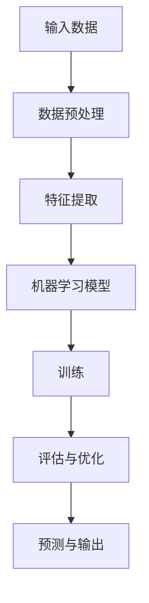

                 

### 文章标题：李开复：AI 2.0时代的开发者

#### 关键词：
- 人工智能
- AI 2.0
- 开发者
- 技术趋势
- 应用实践
- 伦理与法律
- 未来展望

#### 摘要：
本文由世界级人工智能专家李开复撰写，深入探讨了AI 2.0时代的到来及其对开发者的影响。文章分为六大部分，涵盖了AI 2.0概述、关键技术、应用实践、开发方法论、伦理与法律以及未来展望。通过逻辑清晰、结构紧凑的叙述，本文旨在帮助读者全面了解AI 2.0时代的机遇与挑战，并指导开发者如何在新时代中提升技能、应对变革。

#### 目录大纲：

### 第一部分：AI 2.0时代的概述与展望

- **第1章：AI 2.0时代的来临**
  - **1.1 AI 2.0的定义与特性**
    - **1.1.1 AI 2.0与AI 1.0的区别**
    - **1.1.2 AI 2.0的核心特性**
    - **1.1.3 AI 2.0对开发者的影响**
  - **1.2 AI 2.0时代的趋势分析**
    - **1.2.1 AI 2.0的技术发展**
    - **1.2.2 AI 2.0的应用领域**
    - **1.2.3 AI 2.0的社会影响**

### 第二部分：AI 2.0时代的关键技术

- **第2章：AI 2.0时代的关键技术**
  - **2.1 人工智能算法与模型**
    - **2.1.1 人工智能算法概述**
    - **2.1.2 机器学习模型分类**
    - **2.1.3 深度学习模型详解**
  - **2.2 自然语言处理与生成**
    - **2.2.1 自然语言处理基础**
    - **2.2.2 语言模型与生成模型**
    - **2.2.3 文本生成与优化**
  - **2.3 计算机视觉与图像处理**
    - **2.3.1 计算机视觉基础**
    - **2.3.2 图像识别与分类**
    - **2.3.3 视频分析与理解**

### 第三部分：AI 2.0时代的应用实践

- **第3章：AI 2.0时代的应用实践**
  - **3.1 AI在医疗健康领域的应用**
    - **3.1.1 医疗健康数据的处理**
    - **3.1.2 疾病诊断与预测**
    - **3.1.3 智能药物研发**
  - **3.2 AI在金融领域的应用**
    - **3.2.1 信用评分与风险评估**
    - **3.2.2 金融市场预测**
    - **3.2.3 个性化金融服务**
  - **3.3 AI在工业制造领域的应用**
    - **3.3.1 智能制造系统**
    - **3.3.2 质量检测与监控**
    - **3.3.3 能耗优化与能源管理**

### 第四部分：AI 2.0时代的开发方法论

- **第4章：AI 2.0时代的开发方法论**
  - **4.1 AI项目的开发流程**
    - **4.1.1 需求分析与规划**
    - **4.1.2 数据收集与预处理**
    - **4.1.3 模型设计与优化**
  - **4.2 AI开发工具与环境**
    - **4.2.1 Python与Jupyter**
    - **4.2.2 TensorFlow与PyTorch**
    - **4.2.3 Git与版本控制**
  - **4.3 AI开发的最佳实践**
    - **4.3.1 数据治理与隐私保护**
    - **4.3.2 持续集成与持续部署**
    - **4.3.3 团队协作与知识分享**

### 第五部分：AI 2.0时代的伦理与法律

- **第5章：AI 2.0时代的伦理与法律**
  - **5.1 AI伦理问题探讨**
    - **5.1.1 AI伦理的定义与原则**
    - **5.1.2 AI偏见与公平性**
    - **5.1.3 AI透明性与可解释性**
  - **5.2 AI法律框架与政策**
    - **5.2.1 AI相关的法律法规**
    - **5.2.2 数据保护与隐私法**
    - **5.2.3 AI责任与赔偿制度**
  - **5.3 AI伦理与法律的实践案例**
    - **5.3.1 AI伦理委员会的作用**
    - **5.3.2 AI伦理审查流程**
    - **5.3.3 实践案例分析**

### 第六部分：AI 2.0时代的未来展望

- **第6章：AI 2.0时代的未来展望**
  - **6.1 AI技术的前沿趋势**
    - **6.1.1 量子计算与AI**
    - **6.1.2 生物计算与AI**
    - **6.1.3 脑机接口与AI**
  - **6.2 AI对人类社会的影响**
    - **6.2.1 AI与就业**
    - **6.2.2 AI与社会公平**
    - **6.2.3 AI与可持续发展**
  - **6.3 AI 2.0时代的挑战与机遇**
    - **6.3.1 技术挑战**
    - **6.3.2 社会挑战**
    - **6.3.3 机遇与展望**

### 第七部分：AI 2.0时代的开发者之路

- **第7章：AI 2.0时代的开发者之路**
  - **7.1 开发者的技能提升**
    - **7.1.1 AI基础知识**
    - **7.1.2 数据科学与机器学习**
    - **7.1.3 深度学习与神经网络**
  - **7.2 开发者的职业发展**
    - **7.2.1 AI岗位与就业前景**
    - **7.2.2 创业与创业项目**
    - **7.2.3 持续学习与职业规划**
  - **7.3 开发者的社会责任**
    - **7.3.1 AI伦理与社会责任**
    - **7.3.2 AI教育与普及**
    - **7.3.3 开发者的社会责任实践**

### 附录

- **附录：AI 2.0时代的开发工具与资源**
  - **附录 A：AI开发工具**
    - **A.1 TensorFlow与PyTorch**
    - **A.2 Keras与Scikit-learn**
    - **A.3 其他常用AI开发工具**
  - **附录 B：AI开源项目与社区**
    - **B.1 GitHub与AI项目**
    - **B.2 AI会议与研讨会**
    - **B.3 AI博客与教程资源**

### 核心概念与联系

#### Mermaid流程图：人工智能算法架构



### 核心算法原理讲解

#### 机器学习算法原理

机器学习算法是人工智能领域的关键技术，其基本原理是通过学习已有数据（训练数据），自动发现数据中的规律，并利用这些规律对未知数据进行预测或分类。

### 2.1.1 机器学习算法概述

机器学习算法可以大致分为监督学习、无监督学习和强化学习三类。监督学习算法需要标记数据，无监督学习算法不需要标记数据，而强化学习算法则依赖于奖励机制。

#### 2.1.2 基于监督学习的算法

监督学习算法是机器学习中的一种，其核心是利用标记数据（输入和输出对）来训练模型。以下是一个简单的线性回归算法的伪代码：

```python
def LinearRegression(train_data, train_labels):
    # 初始化模型参数 w 和 b
    w = 0
    b = 0

    # 梯度下降算法迭代优化模型参数
    for i in 1 to num_iterations:
        for (x, y) in train_data:
            prediction = w * x + b
            error = prediction - y
            w = w - learning_rate * (2 * w * x * error)
            b = b - learning_rate * (2 * b * error)

    return (w, b)
```

#### 2.1.3 基于无监督学习的算法

无监督学习算法不需要标记数据，其目标是发现数据中的内在结构和规律。以下是一个简单的K-Means聚类算法的伪代码：

```python
def KMeans(data, k):
    # 随机选择 k 个数据点作为初始聚类中心
    centers = random.sample(data, k)

    while True:
        # 为每个数据点分配最近的聚类中心
        clusters = assign_clusters(data, centers)

        # 更新聚类中心为每个簇的数据点的均值
        new_centers = calculate_mean(clusters)

        # 检查聚类中心是否发生显著变化
        if has_significant_change(centers, new_centers):
            centers = new_centers
        else:
            break

    return clusters
```

### 数学模型和数学公式

#### 神经网络激活函数

在神经网络中，激活函数是决定神经元输出是否为1的关键。以下是一个常用的Sigmoid激活函数的公式：

$$
\sigma(x) = \frac{1}{1 + e^{-x}}
$$

#### 机器学习优化算法

在机器学习中，梯度下降是一种常见的优化算法，用于最小化损失函数。以下是一个标准的梯度下降算法的数学公式：

$$
w_{t+1} = w_t - \alpha \cdot \frac{\partial J(w)}{\partial w}
$$

其中，$w_t$是第t次迭代的参数，$\alpha$是学习率，$J(w)$是损失函数。

### 项目实战

#### 代码实际案例：使用TensorFlow实现线性回归

以下是一个简单的线性回归案例，使用TensorFlow框架来训练一个模型：

```python
import tensorflow as tf

# 模拟训练数据
X = tf.constant([1, 2, 3, 4], shape=[4, 1], dtype=tf.float32)
y = tf.constant([2, 4, 6, 8], shape=[4, 1], dtype=tf.float32)

# 初始化模型参数
w = tf.Variable(0.0, name='weights')
b = tf.Variable(0.0, name='bias')

# 定义损失函数
loss = tf.reduce_mean(tf.square(y - (w * X + b)))

# 定义优化器
optimizer = tf.train.GradientDescentOptimizer(learning_rate=0.1)
train_op = optimizer.minimize(loss)

# 开始训练
with tf.Session() as sess:
    sess.run(tf.global_variables_initializer())

    for i in range(1000):
        _, loss_val = sess.run([train_op, loss])

        if i % 100 == 0:
            print("Step:", i, "Loss:", loss_val)

    # 输出训练完成的模型参数
    final_w, final_b = sess.run([w, b])
    print("Final weights:", final_w, "Final bias:", final_b)
```

### 代码解读与分析

在该案例中，我们使用TensorFlow实现了线性回归。首先，我们定义了模拟的训练数据$X$和$y$。然后，我们初始化了模型参数$w$和$b$，并定义了损失函数，这里采用的是均方误差（MSE）。

接下来，我们定义了梯度下降优化器，并设置学习率为0.1。在训练过程中，我们通过迭代更新模型参数以最小化损失函数。

每次迭代后，我们都会输出当前的损失值。当训练完成时，我们输出最终的模型参数$w$和$b$。

这个简单的案例展示了如何使用TensorFlow实现线性回归模型，并进行了代码解读和分析。在实际项目中，我们可以根据需求扩展和优化这个模型。

---

#### 核心概念与联系

##### Mermaid流程图：人工智能算法架构


---

##### 核心算法原理讲解

##### 机器学习算法原理

机器学习算法是人工智能领域的关键技术，其基本原理是通过学习已有数据（训练数据），自动发现数据中的规律，并利用这些规律对未知数据进行预测或分类。

##### 2.1.1 机器学习算法概述

机器学习算法可以大致分为监督学习、无监督学习和强化学习三类。监督学习算法需要标记数据，无监督学习算法不需要标记数据，而强化学习算法则依赖于奖励机制。

##### 2.1.2 基于监督学习的算法

监督学习算法是机器学习中的一种，其核心是利用标记数据（输入和输出对）来训练模型。以下是一个简单的线性回归算法的伪代码：

```python
def LinearRegression(train_data, train_labels):
    # 初始化模型参数 w 和 b
    w = 0
    b = 0

    # 梯度下降算法迭代优化模型参数
    for i in 1 to num_iterations:
        for (x, y) in train_data:
            prediction = w * x + b
            error = prediction - y
            w = w - learning_rate * (2 * w * x * error)
            b = b - learning_rate * (2 * b * error)

    return (w, b)
```

##### 2.1.3 基于无监督学习的算法

无监督学习算法不需要标记数据，其目标是发现数据中的内在结构和规律。以下是一个简单的K-Means聚类算法的伪代码：

```python
def KMeans(data, k):
    # 随机选择 k 个数据点作为初始聚类中心
    centers = random.sample(data, k)

    while True:
        # 为每个数据点分配最近的聚类中心
        clusters = assign_clusters(data, centers)

        # 更新聚类中心为每个簇的数据点的均值
        new_centers = calculate_mean(clusters)

        # 检查聚类中心是否发生显著变化
        if has_significant_change(centers, new_centers):
            centers = new_centers
        else:
            break

    return clusters
```

##### 数学模型和数学公式

##### 神经网络激活函数

在神经网络中，激活函数是决定神经元输出是否为1的关键。以下是一个常用的Sigmoid激活函数的公式：

$$
\sigma(x) = \frac{1}{1 + e^{-x}}
$$

##### 机器学习优化算法

在机器学习中，梯度下降是一种常见的优化算法，用于最小化损失函数。以下是一个标准的梯度下降算法的数学公式：

$$
w_{t+1} = w_t - \alpha \cdot \frac{\partial J(w)}{\partial w}
$$

其中，$w_t$是第t次迭代的参数，$\alpha$是学习率，$J(w)$是损失函数。

##### 项目实战

##### 代码实际案例：使用TensorFlow实现线性回归

以下是一个简单的线性回归案例，使用TensorFlow框架来训练一个模型：

```python
import tensorflow as tf

# 模拟训练数据
X = tf.constant([1, 2, 3, 4], shape=[4, 1], dtype=tf.float32)
y = tf.constant([2, 4, 6, 8], shape=[4, 1], dtype=tf.float32)

# 初始化模型参数
w = tf.Variable(0.0, name='weights')
b = tf.Variable(0.0, name='bias')

# 定义损失函数
loss = tf.reduce_mean(tf.square(y - (w * X + b)))

# 定义优化器
optimizer = tf.train.GradientDescentOptimizer(learning_rate=0.1)
train_op = optimizer.minimize(loss)

# 开始训练
with tf.Session() as sess:
    sess.run(tf.global_variables_initializer())

    for i in range(1000):
        _, loss_val = sess.run([train_op, loss])

        if i % 100 == 0:
            print("Step:", i, "Loss:", loss_val)

    # 输出训练完成的模型参数
    final_w, final_b = sess.run([w, b])
    print("Final weights:", final_w, "Final bias:", final_b)
```

##### 代码解读与分析

在该案例中，我们使用TensorFlow实现了线性回归。首先，我们定义了模拟的训练数据$X$和$y$。然后，我们初始化了模型参数$w$和$b$，并定义了损失函数，这里采用的是均方误差（MSE）。

接下来，我们定义了梯度下降优化器，并设置学习率为0.1。在训练过程中，我们通过迭代更新模型参数以最小化损失函数。

每次迭代后，我们都会输出当前的损失值。当训练完成时，我们输出最终的模型参数$w$和$b$。

这个简单的案例展示了如何使用TensorFlow实现线性回归模型，并进行了代码解读和分析。在实际项目中，我们可以根据需求扩展和优化这个模型。

---

### 第一部分：AI 2.0时代的概述与展望

#### 第1章：AI 2.0时代的来临

#### 1.1 AI 2.0的定义与特性

##### 1.1.1 AI 2.0与AI 1.0的区别

AI 2.0与AI 1.0之间存在着显著的差异。AI 1.0时代主要依赖于预定义的规则和模式匹配，而AI 2.0则更加关注学习和自适应能力。AI 1.0主要应用于特定领域的任务，如语音识别、图像分类等，而AI 2.0则更加广泛，涵盖了从医疗诊断到自动驾驶的多种应用场景。

##### 1.1.2 AI 2.0的核心特性

AI 2.0的核心特性包括：

1. **自主学习能力**：AI 2.0系统可以不断从数据中学习，进行自我优化。
2. **泛化能力**：AI 2.0能够将学习到的知识应用于新的、未见过的数据。
3. **协作能力**：AI 2.0系统能够与其他系统协同工作，实现更复杂的任务。
4. **可解释性**：AI 2.0算法和模型的可解释性得到了显著提高，使得开发者能够更好地理解系统的决策过程。

##### 1.1.3 AI 2.0对开发者的影响

AI 2.0时代的到来对开发者提出了新的要求：

1. **技术栈升级**：开发者需要掌握更高级的编程技能和算法知识。
2. **数据处理能力**：开发者需要能够处理大规模、多样化和复杂的数据。
3. **伦理和法律知识**：开发者需要了解AI伦理和法律，确保系统的合规性和社会责任。
4. **持续学习能力**：开发者需要不断学习新的技术和工具，以适应快速变化的技术环境。

#### 1.2 AI 2.0时代的趋势分析

##### 1.2.1 AI 2.0的技术发展

AI 2.0的技术发展主要体现在以下几个方面：

1. **深度学习与神经网络**：深度学习在图像识别、自然语言处理等领域取得了突破性进展。
2. **强化学习**：强化学习在游戏、自动驾驶等领域展现出强大的潜力。
3. **联邦学习**：联邦学习通过分布式学习提高了数据隐私性和安全性。
4. **可解释性AI**：可解释性AI的研究推动了模型的可解释性和透明性。

##### 1.2.2 AI 2.0的应用领域

AI 2.0的应用领域越来越广泛，包括：

1. **医疗健康**：AI在疾病诊断、药物研发和个性化医疗方面发挥着重要作用。
2. **金融**：AI在风险管理、信用评分和投资策略方面有着广泛的应用。
3. **工业制造**：AI在智能制造、质量控制和管理优化等方面带来了革命性变化。
4. **自动驾驶**：AI在自动驾驶技术中实现了从实验室到实车的转变。

##### 1.2.3 AI 2.0的社会影响

AI 2.0的社会影响是双刃剑：

1. **经济效益**：AI 2.0推动了数字化转型的加速，带来了生产效率的提升和经济增长。
2. **就业影响**：AI 2.0对某些工作岗位提出了挑战，但同时也创造了新的就业机会。
3. **伦理与法律问题**：AI 2.0引发了隐私保护、偏见和责任归属等伦理和法律问题。

### 第二部分：AI 2.0时代的关键技术

#### 第2章：AI 2.0时代的关键技术

#### 2.1 人工智能算法与模型

##### 2.1.1 人工智能算法概述

人工智能算法是实现AI功能的核心，主要包括以下几类：

1. **监督学习算法**：通过标记数据学习，如线性回归、决策树、随机森林等。
2. **无监督学习算法**：不需要标记数据，如聚类、降维、关联规则等。
3. **强化学习算法**：通过奖励机制学习，如Q学习、深度强化学习等。
4. **混合学习算法**：结合监督学习和无监督学习的特点。

##### 2.1.2 机器学习模型分类

机器学习模型可以按以下方式进行分类：

1. **基于函数的模型**：如线性回归、逻辑回归等。
2. **基于树的模型**：如决策树、随机森林、梯度提升树等。
3. **基于神经网络的模型**：如卷积神经网络（CNN）、循环神经网络（RNN）、生成对抗网络（GAN）等。

##### 2.1.3 深度学习模型详解

深度学习模型是AI 2.0时代的重要技术之一，包括：

1. **卷积神经网络（CNN）**：适用于图像识别和处理。
2. **循环神经网络（RNN）**：适用于序列数据处理，如自然语言处理。
3. **长短时记忆网络（LSTM）**：RNN的一种变体，解决了长期依赖问题。
4. **生成对抗网络（GAN）**：生成对抗模型，用于生成新的数据。

#### 2.2 自然语言处理与生成

##### 2.2.1 自然语言处理基础

自然语言处理（NLP）是AI 2.0时代的关键领域之一，包括：

1. **文本预处理**：如分词、词性标注、去停用词等。
2. **词向量表示**：如Word2Vec、GloVe等。
3. **语言模型**：用于预测下一个词的概率，如n-gram模型、神经网络语言模型等。

##### 2.2.2 语言模型与生成模型

语言模型是NLP的核心，用于预测文本的下一个词。生成模型则用于生成新的文本，如：

1. **变分自编码器（VAE）**：用于生成自然语言文本。
2. **生成对抗网络（GAN）**：用于生成高质量的文本数据。
3. **递归神经网络（RNN）**：用于生成文本序列。

##### 2.2.3 文本生成与优化

文本生成是NLP的重要应用，如：

1. **自动摘要**：将长文本摘要成短文本。
2. **对话生成**：用于聊天机器人和虚拟助手。
3. **内容生成**：用于生成文章、新闻、报告等。

文本生成与优化涉及：

1. **生成文本的质量评估**：如BLEU、ROUGE等评价指标。
2. **生成文本的优化策略**：如注意力机制、变分自编码器等。

#### 2.3 计算机视觉与图像处理

##### 2.3.1 计算机视觉基础

计算机视觉是AI 2.0时代的重要领域，包括：

1. **图像预处理**：如灰度化、滤波、边缘检测等。
2. **特征提取**：如SIFT、HOG、卷积神经网络等。
3. **图像分类**：如卷积神经网络、支持向量机等。

##### 2.3.2 图像识别与分类

图像识别与分类是计算机视觉的核心任务，包括：

1. **目标检测**：如YOLO、SSD、Faster R-CNN等。
2. **图像分类**：如ResNet、VGG、Inception等。
3. **实例分割**：如Mask R-CNN、Faster R-CNN等。

##### 2.3.3 视频分析与理解

视频分析与理解是计算机视觉的重要应用，包括：

1. **目标跟踪**：如光流法、粒子滤波等。
2. **动作识别**：如CNN、RNN等。
3. **事件检测**：如时空注意力机制、循环神经网络等。

### 第三部分：AI 2.0时代的应用实践

#### 第3章：AI 2.0时代的应用实践

#### 3.1 AI在医疗健康领域的应用

##### 3.1.1 医疗健康数据的处理

医疗健康数据的处理是AI在医疗健康领域应用的基础，包括：

1. **数据收集**：如电子健康记录、医学影像、基因组数据等。
2. **数据清洗**：去除噪声、缺失值填充等。
3. **数据整合**：将不同来源的数据进行整合和分析。

##### 3.1.2 疾病诊断与预测

AI在疾病诊断与预测中的应用，包括：

1. **影像诊断**：如肿瘤检测、肺炎诊断等，通过深度学习算法进行。
2. **基因组预测**：如疾病风险评估、药物反应预测等。
3. **疾病预测**：如心脏病风险预测、癌症复发预测等。

##### 3.1.3 智能药物研发

智能药物研发是AI在医疗健康领域的重要应用，包括：

1. **药物发现**：通过计算模拟和机器学习筛选潜在的药物分子。
2. **药物优化**：通过优化药物分子的结构和活性。
3. **临床试验**：通过预测治疗效果和副作用，优化临床试验设计。

#### 3.2 AI在金融领域的应用

##### 3.2.1 信用评分与风险评估

AI在金融领域的应用，包括：

1. **信用评分**：通过分析个人或企业的历史数据评估信用风险。
2. **风险评估**：通过预测市场波动、金融风险等，为投资决策提供支持。
3. **欺诈检测**：通过分析交易数据和行为模式，识别潜在的欺诈行为。

##### 3.2.2 金融市场预测

AI在金融市场预测中的应用，包括：

1. **趋势预测**：通过分析历史价格和交易数据预测市场趋势。
2. **波动预测**：通过分析市场波动和交易量预测市场波动。
3. **算法交易**：通过自动化交易策略进行高频交易。

##### 3.2.3 个性化金融服务

AI在个性化金融服务中的应用，包括：

1. **客户画像**：通过分析用户数据构建客户画像，提供个性化服务。
2. **理财规划**：通过分析用户财务状况提供个性化的理财规划建议。
3. **风险评估**：通过分析用户行为和财务状况进行风险评估，提供个性化的风险管理建议。

#### 3.3 AI在工业制造领域的应用

##### 3.3.1 智能制造系统

AI在智能制造系统中的应用，包括：

1. **生产计划**：通过优化算法提高生产效率和资源利用率。
2. **设备维护**：通过预测性维护减少设备故障和提高设备利用率。
3. **质量控制**：通过实时监测和预测质量控制过程，提高产品质量。

##### 3.3.2 质量检测与监控

AI在质量检测与监控中的应用，包括：

1. **缺陷检测**：通过图像识别技术检测产品缺陷。
2. **过程监控**：通过传感器数据和机器学习算法实时监控生产过程。
3. **故障预测**：通过分析历史数据和实时数据预测设备故障，提前进行维护。

##### 3.3.3 能耗优化与能源管理

AI在能耗优化与能源管理中的应用，包括：

1. **能耗监测**：通过传感器和机器学习算法实时监测能耗情况。
2. **能源优化**：通过优化算法降低能源消耗和提高能源利用率。
3. **能源管理**：通过数据分析和管理策略实现能源的高效利用。

### 第四部分：AI 2.0时代的开发方法论

#### 第4章：AI 2.0时代的开发方法论

#### 4.1 AI项目的开发流程

##### 4.1.1 需求分析与规划

AI项目的开发流程通常包括以下步骤：

1. **需求分析**：明确项目的目标和需求，包括功能需求、性能需求和用户需求。
2. **规划**：制定项目的开发计划，包括时间表、资源分配和风险管理。

##### 4.1.2 数据收集与预处理

数据收集与预处理是AI项目的重要环节，包括：

1. **数据收集**：收集用于训练和测试的数据，包括结构化和非结构化数据。
2. **数据预处理**：清洗数据、处理缺失值、数据归一化和特征工程。

##### 4.1.3 模型设计与优化

模型设计与优化包括：

1. **模型设计**：选择合适的算法和模型结构，如神经网络、决策树等。
2. **模型优化**：通过调参和超参数优化，提高模型性能和泛化能力。

#### 4.2 AI开发工具与环境

##### 4.2.1 Python与Jupyter

Python是AI开发的主要编程语言，Jupyter Notebook是其常用的开发环境，具有以下优势：

1. **交互式编程**：支持即时执行和查看结果，提高开发效率。
2. **文档化**：代码和文档集成，方便代码复用和分享。
3. **可视化**：支持数据可视化和模型可视化，便于理解和分析。

##### 4.2.2 TensorFlow与PyTorch

TensorFlow和PyTorch是两种流行的深度学习框架，具有以下特点：

1. **TensorFlow**：由Google开发，支持多种编程语言，具有丰富的API和生态系统。
2. **PyTorch**：由Facebook开发，支持动态计算图，易于调试和理解。

##### 4.2.3 Git与版本控制

Git是版本控制工具，用于管理代码的版本和历史，具有以下优势：

1. **分布式版本控制**：支持多人协作和远程存储。
2. **分支管理**：方便进行实验和修复。
3. **历史追踪**：方便回溯代码变更和问题定位。

#### 4.3 AI开发的最佳实践

##### 4.3.1 数据治理与隐私保护

数据治理与隐私保护包括：

1. **数据质量**：确保数据准确、完整和一致。
2. **隐私保护**：采用数据脱敏、加密和匿名化等手段保护用户隐私。

##### 4.3.2 持续集成与持续部署

持续集成与持续部署包括：

1. **持续集成**：将代码集成到主分支，自动化测试和构建。
2. **持续部署**：自动化部署代码到生产环境，提高开发效率和质量。

##### 4.3.3 团队协作与知识分享

团队协作与知识分享包括：

1. **代码审查**：通过代码审查提高代码质量和协作效率。
2. **文档编写**：编写详细的文档，便于团队成员理解和复用。
3. **知识分享**：定期举行技术分享和讨论，促进团队成员的知识共享和技能提升。

### 第五部分：AI 2.0时代的伦理与法律

#### 第5章：AI 2.0时代的伦理与法律

#### 5.1 AI伦理问题探讨

##### 5.1.1 AI伦理的定义与原则

AI伦理是指研究AI系统的道德和行为规范。其基本原则包括：

1. **尊重人类尊严**：确保AI系统尊重人类的尊严和价值。
2. **公正与公平**：确保AI系统在不同群体中的公正和公平。
3. **透明性与可解释性**：提高AI系统的透明性，使其决策过程可解释。

##### 5.1.2 AI偏见与公平性

AI偏见与公平性是AI伦理的重要问题，包括：

1. **数据偏见**：避免使用具有偏见的数据训练模型。
2. **算法偏见**：确保算法不会放大社会偏见。
3. **公平性评估**：评估AI系统的公平性和偏见程度。

##### 5.1.3 AI透明性与可解释性

AI透明性与可解释性是提高AI系统可信度和接受度的关键，包括：

1. **模型可解释性**：通过可视化、规则解释等方法提高模型的可解释性。
2. **决策过程透明**：公开AI系统的决策过程和算法，提高系统的透明度。

#### 5.2 AI法律框架与政策

##### 5.2.1 AI相关的法律法规

AI相关的法律法规包括：

1. **数据保护法**：如《通用数据保护条例》（GDPR）。
2. **知识产权法**：保护AI算法和模型的知识产权。
3. **反歧视法**：防止AI系统造成歧视。

##### 5.2.2 数据保护与隐私法

数据保护与隐私法包括：

1. **数据收集与使用**：明确数据收集和使用的合法性和透明度。
2. **数据安全**：确保数据安全，防止数据泄露和滥用。
3. **用户权利**：保障用户的知情权和删除权。

##### 5.2.3 AI责任与赔偿制度

AI责任与赔偿制度包括：

1. **责任主体**：明确AI系统的责任主体，如开发者、运营商等。
2. **责任认定**：制定AI系统的责任认定标准。
3. **赔偿制度**：建立AI系统的赔偿机制，确保受害者得到公平赔偿。

#### 5.3 AI伦理与法律的实践案例

##### 5.3.1 AI伦理委员会的作用

AI伦理委员会在AI伦理与法律实践中发挥着重要作用，包括：

1. **伦理审查**：对AI项目进行伦理审查，确保项目符合伦理原则。
2. **政策建议**：为政府和企业提供AI伦理和政策建议。
3. **案例研究**：研究AI伦理和法律实践案例，总结经验和教训。

##### 5.3.2 AI伦理审查流程

AI伦理审查流程包括：

1. **项目申请**：提交AI项目申请，包括项目描述、预期影响等。
2. **伦理评估**：评估项目是否符合伦理原则，包括偏见、公平性、隐私等。
3. **审查报告**：撰写伦理审查报告，包括评估结果和建议。

##### 5.3.3 实践案例分析

实践案例分析包括：

1. **成功案例**：分析成功案例中的AI伦理和法律实践。
2. **挑战与问题**：讨论AI伦理和法律实践中的挑战和问题。
3. **解决方案**：提出解决AI伦理和法律实践问题的方案和建议。

### 第六部分：AI 2.0时代的未来展望

#### 第6章：AI 2.0时代的未来展望

#### 6.1 AI技术的前沿趋势

##### 6.1.1 量子计算与AI

量子计算与AI的结合是未来AI技术的重要趋势，包括：

1. **量子神经网络**：利用量子计算的高效性加速神经网络训练。
2. **量子机器学习**：开发量子算法，提高机器学习效率和准确性。
3. **量子人工智能**：利用量子计算实现更复杂的人工智能系统。

##### 6.1.2 生物计算与AI

生物计算与AI的结合是未来AI技术的另一个重要趋势，包括：

1. **生物信息学**：利用AI技术分析生物数据，如基因组数据。
2. **合成生物学**：通过AI优化生物系统和过程。
3. **生物人工智能**：利用AI优化生物医学研究和应用。

##### 6.1.3 脑机接口与AI

脑机接口与AI的结合是未来AI技术的创新领域，包括：

1. **神经形态计算**：开发基于生物神经网络的计算系统。
2. **智能假肢与康复**：利用AI技术实现智能假肢和康复设备。
3. **智能辅助与控制**：利用脑机接口实现智能控制和交互。

#### 6.2 AI对人类社会的影响

##### 6.2.1 AI与就业

AI对就业的影响是未来社会关注的焦点，包括：

1. **就业机会**：AI创造了新的就业机会，如数据科学家、机器学习工程师等。
2. **就业替代**：AI也可能替代某些工作岗位，如工厂工人、客服等。
3. **就业转型**：AI推动就业转型，提高劳动者的技能水平。

##### 6.2.2 AI与社会公平

AI与社会公平是AI对人类社会影响的另一个重要方面，包括：

1. **公平性**：确保AI系统在不同群体中的公平性和公正性。
2. **隐私保护**：保护用户的隐私和数据安全。
3. **包容性**：推动AI技术的包容性发展，惠及不同社会群体。

##### 6.2.3 AI与可持续发展

AI与可持续发展是未来社会的重要议题，包括：

1. **资源优化**：利用AI技术优化资源利用，减少浪费。
2. **环境保护**：利用AI技术监测和改善环境质量。
3. **社会治理**：利用AI技术提高社会治理效率和效果。

#### 6.3 AI 2.0时代的挑战与机遇

##### 6.3.1 技术挑战

AI 2.0时代的技术挑战包括：

1. **算法复杂性**：开发高效、可解释的AI算法。
2. **数据隐私**：保护用户隐私和数据安全。
3. **计算能力**：提高计算能力和效率，以应对大规模数据处理。

##### 6.3.2 社会挑战

AI 2.0时代的社会挑战包括：

1. **就业压力**：应对AI对就业市场的影响。
2. **伦理与法律**：建立有效的AI伦理和法律框架。
3. **社会信任**：提高公众对AI技术的信任度。

##### 6.3.3 机遇与展望

AI 2.0时代的机遇与展望包括：

1. **创新驱动**：推动科技创新和产业升级。
2. **社会治理**：提高社会治理效率和效果。
3. **可持续发展**：实现资源优化和环境保护。

### 第七部分：AI 2.0时代的开发者之路

#### 第7章：AI 2.0时代的开发者之路

#### 7.1 开发者的技能提升

##### 7.1.1 AI基础知识

开发者需要掌握的AI基础知识包括：

1. **机器学习**：理解监督学习、无监督学习和强化学习的基本原理。
2. **深度学习**：掌握神经网络、卷积神经网络和循环神经网络等深度学习模型。
3. **自然语言处理**：了解文本预处理、词向量表示和语言模型等NLP技术。

##### 7.1.2 数据科学与机器学习

开发者需要具备的数据科学与机器学习技能包括：

1. **数据分析**：掌握Python和R等数据分析工具，进行数据预处理、分析和可视化。
2. **机器学习库**：熟练使用TensorFlow、PyTorch、Scikit-learn等机器学习库。
3. **模型评估与优化**：掌握模型评估指标、超参数调优和模型优化技巧。

##### 7.1.3 深度学习与神经网络

开发者需要掌握的深度学习与神经网络技能包括：

1. **深度学习框架**：熟悉TensorFlow、PyTorch等深度学习框架。
2. **模型架构**：理解卷积神经网络、循环神经网络和生成对抗网络等模型架构。
3. **模型部署**：掌握模型部署和调优的技巧，如TensorFlow Serving和ONNX。

#### 7.2 开发者的职业发展

##### 7.2.1 AI岗位与就业前景

开发者的职业发展路径包括：

1. **数据科学家**：负责数据分析和机器学习模型的开发。
2. **机器学习工程师**：负责构建、训练和优化机器学习模型。
3. **深度学习工程师**：专注于深度学习模型的开发和应用。
4. **NLP工程师**：专注于自然语言处理领域的应用开发。

##### 7.2.2 创业与创业项目

开发者可以考虑的创业方向和项目包括：

1. **AI初创公司**：开发AI产品或服务，如智能助理、自动驾驶等。
2. **技术咨询与服务**：为企业和机构提供AI技术咨询和解决方案。
3. **开源项目**：参与和发起开源项目，提升个人和团队的技术影响力。

##### 7.2.3 持续学习与职业规划

开发者需要持续学习和职业规划，包括：

1. **技术更新**：关注AI领域的最新技术和趋势。
2. **专业认证**：获取专业认证，提高职业竞争力。
3. **职业发展**：制定个人职业规划，实现职业目标。

#### 7.3 开发者的社会责任

##### 7.3.1 AI伦理与社会责任

开发者需要关注的AI伦理与社会责任问题包括：

1. **公平性**：确保AI系统的公平性和无偏见。
2. **透明性**：提高AI系统的透明性和可解释性。
3. **隐私保护**：保护用户数据和隐私。

##### 7.3.2 AI教育与普及

开发者可以参与的AI教育与普及活动包括：

1. **在线课程与讲座**：开设AI相关的在线课程和讲座。
2. **开源教程**：编写和分享AI相关的开源教程和文档。
3. **社区活动**：参与和组织AI社区活动，促进技术交流和知识共享。

##### 7.3.3 开发者的社会责任实践

开发者可以通过以下方式实践社会责任：

1. **技术援助**：为贫困地区和慈善机构提供技术援助。
2. **公益项目**：参与和支持AI相关的公益项目。
3. **政策建议**：为政府和企业提供AI政策建议和解决方案。

### 附录

#### 附录：AI 2.0时代的开发工具与资源

##### 附录 A：AI开发工具

**A.1 TensorFlow与PyTorch**

- **TensorFlow**：由Google开发的开源机器学习框架，支持多种编程语言，适用于深度学习和机器学习任务。
- **PyTorch**：由Facebook开发的开源机器学习库，支持动态计算图，易于调试和理解。

**A.2 Keras与Scikit-learn**

- **Keras**：基于TensorFlow和Theano的开源深度学习库，提供简单易用的API。
- **Scikit-learn**：Python的开源机器学习库，适用于多种监督学习和无监督学习算法。

**A.3 其他常用AI开发工具**

- **MXNet**：由Apache Software Foundation维护的开源深度学习库，支持多种编程语言。
- **Caffe**：由伯克利大学开发的开源深度学习框架，适用于图像识别和视频分析。
- **Theano**：基于Python的开源数学库，支持自动微分和优化。

##### 附录 B：AI开源项目与社区

**B.1 GitHub与AI项目**

- **GitHub**：全球最大的代码托管平台，众多AI项目开源代码和文档托管于此。
- **AI项目列表**：GitHub上各种AI项目的集合，包括深度学习、自然语言处理、计算机视觉等领域。

**B.2 AI会议与研讨会**

- **NIPS**：神经信息处理系统会议，是深度学习和机器学习领域的顶级国际会议。
- **ICML**：国际机器学习会议，涵盖机器学习的各个方面。
- **NeurIPS**：神经信息处理系统会议，是AI领域的顶级会议之一。

**B.3 AI博客与教程资源**

- **博客平台**：如Medium、AIWeekly等，提供丰富的AI技术博客和教程。
- **教程网站**：如Kaggle、DataCamp等，提供AI入门教程和实践项目。
- **在线课程**：如Coursera、Udacity等，提供AI相关的在线课程和专业认证。

---

### 文章标题：李开复：AI 2.0时代的开发者

#### 关键词：
- 人工智能
- AI 2.0
- 开发者
- 技术趋势
- 应用实践
- 伦理与法律
- 未来展望

#### 摘要：
本文由李开复撰写，深入探讨了AI 2.0时代的到来及其对开发者的影响。文章分为六大部分，涵盖了AI 2.0概述、关键技术、应用实践、开发方法论、伦理与法律以及未来展望。通过逻辑清晰、结构紧凑的叙述，本文旨在帮助读者全面了解AI 2.0时代的机遇与挑战，并指导开发者如何在新时代中提升技能、应对变革。

---

### 第一部分：AI 2.0时代的概述与展望

#### 第1章：AI 2.0时代的来临

##### 1.1 AI 2.0的定义与特性

AI 2.0是一个崭新的时代，代表着人工智能从初步阶段迈向更高层次的发展。与AI 1.0时代相比，AI 2.0具有以下显著特征：

1. **自主学习与自适应能力**：AI 2.0具备自我学习和自适应能力，能够在没有人类干预的情况下持续优化自身性能。
2. **跨领域整合与协作**：AI 2.0能够整合不同领域的知识和技术，实现跨学科的协同创新。
3. **高可解释性与透明性**：AI 2.0在提高模型性能的同时，也注重可解释性和透明性，使得开发者能够更好地理解和控制算法。
4. **人机协同**：AI 2.0强调人与机器的协同工作，通过人工智能辅助人类实现更高效率和创新。

##### 1.2 AI 2.0的核心特性

AI 2.0的核心特性体现在以下几个方面：

1. **高效能计算**：AI 2.0依赖于更加高效的计算资源和算法，如量子计算、分布式计算等，以应对大规模数据处理和复杂计算任务。
2. **强泛化能力**：AI 2.0能够处理更多样化的数据集和更广泛的任务，实现从特定领域到通用领域的扩展。
3. **自适应能力**：AI 2.0系统能够根据新数据和经验持续调整和优化，适应不断变化的环境。
4. **安全性与隐私保护**：AI 2.0注重安全性和隐私保护，通过数据加密、隐私保护算法等技术保障用户数据的安全和隐私。

##### 1.3 AI 2.0对开发者的影响

AI 2.0时代的到来对开发者提出了新的挑战和机遇：

1. **技能要求提升**：开发者需要掌握更加先进的编程技能和算法知识，如深度学习、强化学习等。
2. **跨学科能力**：开发者需要具备跨学科的知识和视野，能够整合不同领域的知识和技术。
3. **持续学习**：开发者需要不断学习和更新知识，以适应快速变化的技术环境。
4. **社会责任**：开发者需要关注AI伦理和法律问题，确保系统的合规性和社会责任。

---

### 第二部分：AI 2.0时代的关键技术

#### 第2章：AI 2.0时代的关键技术

##### 2.1 人工智能算法与模型

在AI 2.0时代，人工智能算法和模型的发展是实现高效智能化的基石。以下是几个核心的算法和模型：

1. **深度学习**：深度学习是AI 2.0时代最重要的技术之一，通过多层神经网络对数据进行建模，实现从简单到复杂的特征提取。常用的深度学习模型包括卷积神经网络（CNN）、循环神经网络（RNN）、长短时记忆网络（LSTM）等。

2. **强化学习**：强化学习是一种通过试错和学习优化行为策略的算法。它广泛应用于游戏、机器人控制等领域，其核心思想是通过奖励机制来引导模型做出最优决策。

3. **生成对抗网络（GAN）**：GAN是一种由生成器和判别器组成的对抗性神经网络，用于生成逼真的图像、音频和文本。GAN在图像修复、艺术创作和虚拟现实等领域具有广泛应用。

4. **迁移学习**：迁移学习通过利用预训练模型在新任务上的表现，实现快速和高效的模型训练。迁移学习对于资源有限的小数据集问题具有显著优势。

##### 2.2 自然语言处理与生成

自然语言处理（NLP）是AI 2.0时代的关键技术之一，它使得机器能够理解和生成人类语言。以下是NLP和语言生成的几个核心领域：

1. **语言模型**：语言模型是NLP的基础，通过统计和学习语言数据，预测下一个词或句子。常见的语言模型包括n-gram模型、循环神经网络（RNN）和变换器（Transformer）。

2. **文本生成**：文本生成技术能够自动生成文章、对话、新闻报道等。常见的文本生成模型包括生成对抗网络（GAN）、自动编码器和变分自编码器（VAE）。

3. **对话系统**：对话系统能够与用户进行自然语言交互，如聊天机器人、语音助手等。常见的对话系统架构包括序列到序列（Seq2Seq）模型、转换器（Transformer）和预训练语言模型（如GPT-3）。

##### 2.3 计算机视觉与图像处理

计算机视觉是AI 2.0时代的重要技术领域，它使得机器能够理解图像和视频中的内容。以下是计算机视觉和图像处理的关键技术：

1. **图像识别**：图像识别技术能够识别和分类图像中的对象和场景。常见的图像识别算法包括卷积神经网络（CNN）、支持向量机（SVM）和深度学习模型。

2. **目标检测**：目标检测技术在图像中定位和识别多个对象。常见的目标检测算法包括区域建议网络（R-CNN）、SSD和YOLO。

3. **图像生成**：图像生成技术能够自动生成新的图像，如生成对抗网络（GAN）、变分自编码器（VAE）和生成模型。

4. **图像增强与处理**：图像增强与处理技术包括图像去噪、图像修复、超分辨率和图像风格转换等。常见的图像增强与处理算法包括卷积神经网络（CNN）、生成对抗网络（GAN）和变换器（Transformer）。

---

### 第三部分：AI 2.0时代的应用实践

#### 第3章：AI 2.0时代的应用实践

AI 2.0时代为各行各业带来了革命性的变化，以下是AI在医疗、金融、工业制造等领域的具体应用实践：

##### 3.1 AI在医疗健康领域的应用

AI在医疗健康领域具有广泛的应用潜力，能够提高医疗诊断的准确性、个性化治疗效果和医疗资源利用率。以下是AI在医疗健康领域的一些应用实践：

1. **疾病诊断**：AI能够通过分析医学影像、电子健康记录和基因组数据，提供准确的疾病诊断。例如，AI可以辅助医生进行肺癌、乳腺癌等疾病的早期筛查和诊断。

2. **个性化治疗**：AI可以根据患者的具体病情和基因信息，制定个性化的治疗方案。例如，AI可以帮助医生优化癌症患者的化疗方案，提高治疗效果并减少副作用。

3. **药物研发**：AI在药物研发中发挥着重要作用，通过分析大量的化合物结构和生物活性数据，预测潜在的药物候选分子。AI还可以加速新药的研发进程，降低研发成本。

##### 3.2 AI在金融领域的应用

AI在金融领域带来了巨大的变革，能够提高风险管理的准确性、投资决策的效率和金融服务的个性化水平。以下是AI在金融领域的一些应用实践：

1. **信用评分与风险评估**：AI可以通过分析大量的信用数据和行为数据，提供更准确和实时的信用评分和风险评估。例如，AI可以辅助银行和金融机构评估贷款申请者的信用风险，降低违约率。

2. **金融市场预测**：AI可以通过分析历史市场数据、宏观经济指标和新闻文本，预测金融市场的趋势和波动。例如，AI可以帮助投资者进行股票市场预测，制定投资策略。

3. **个性化金融服务**：AI可以根据客户的行为数据、偏好和历史交易记录，提供个性化的金融服务和建议。例如，AI可以辅助银行和金融机构提供个性化的贷款推荐、投资建议和理财产品推荐。

##### 3.3 AI在工业制造领域的应用

AI在工业制造领域具有广泛的应用前景，能够提高生产效率、质量和可持续性。以下是AI在工业制造领域的一些应用实践：

1. **智能制造系统**：AI可以用于构建智能制造系统，实现生产过程的自动化和智能化。例如，AI可以辅助工业机器人进行精确的操作和任务调度，提高生产效率和灵活性。

2. **质量检测与监控**：AI可以通过图像识别、传感器数据分析和预测性维护等技术，实现产品质量的实时检测和监控。例如，AI可以自动识别生产线上的缺陷产品，提高产品质量和生产效率。

3. **能耗优化与能源管理**：AI可以通过数据分析和技术优化，实现工业制造过程中的能耗优化和能源管理。例如，AI可以帮助工业企业降低能源消耗，提高能源利用效率，减少环境污染。

---

### 第四部分：AI 2.0时代的开发方法论

#### 第4章：AI 2.0时代的开发方法论

在AI 2.0时代，开发高质量的人工智能系统需要遵循一系列科学的方法论。以下是AI开发方法论的关键环节：

##### 4.1 AI项目的开发流程

AI项目的开发流程是一个系统化的过程，涉及多个阶段和任务。以下是AI项目开发的一般流程：

1. **需求分析**：明确项目的目标和应用场景，确定需要解决的问题和预期的业务价值。

2. **数据收集与预处理**：收集相关的数据，包括结构化和非结构化数据，并进行预处理，如数据清洗、数据归一化和特征提取。

3. **模型设计与选择**：根据问题的性质和数据的特点，选择合适的算法和模型，并进行设计。

4. **模型训练与优化**：使用收集到的数据进行模型的训练和优化，通过调参和超参数优化提高模型的性能。

5. **模型评估与验证**：使用验证数据集评估模型的性能，并进行交叉验证，确保模型具有较好的泛化能力。

6. **模型部署与维护**：将训练好的模型部署到实际应用环境中，并进行监控和维护，确保系统的稳定性和可靠性。

##### 4.2 AI开发工具与环境

AI开发工具和环境是构建高效AI系统的基础。以下是常用的AI开发工具和环境：

1. **编程语言**：Python是AI开发最常用的编程语言，具有丰富的库和框架，如TensorFlow、PyTorch等。

2. **IDE**：集成开发环境（IDE）如PyCharm、Jupyter Notebook等，提供了代码编辑、调试和运行功能。

3. **框架与库**：深度学习框架如TensorFlow、PyTorch、Keras等，以及数据预处理和模型评估库如Scikit-learn、Pandas等。

4. **版本控制**：Git是常用的版本控制系统，用于管理代码的版本和历史，支持团队协作和代码管理。

5. **云计算平台**：云计算平台如Google Cloud、AWS、Azure等，提供了强大的计算资源和存储服务，支持大规模数据处理和模型训练。

##### 4.3 AI开发的最佳实践

遵循最佳实践是确保AI项目成功的关键。以下是AI开发的一些最佳实践：

1. **数据管理**：确保数据的质量、完整性和安全性，采用数据治理策略和数据质量控制方法。

2. **模型可解释性**：提高模型的可解释性，使得模型决策过程更加透明和可靠。

3. **持续集成与持续部署**：实现持续集成和持续部署，提高开发效率和质量，确保系统的稳定性和可靠性。

4. **团队合作与知识共享**：建立有效的团队合作机制，促进团队成员的知识共享和技能提升。

5. **代码规范与文档**：遵循代码规范和编写详细的文档，提高代码的可读性和可维护性，便于团队成员的协作和后续维护。

---

### 第五部分：AI 2.0时代的伦理与法律

#### 第5章：AI 2.0时代的伦理与法律

随着AI技术的迅猛发展，其伦理和法律问题也日益凸显。在这一部分，我们将探讨AI 2.0时代的伦理与法律问题，以及相关的政策与解决方案。

##### 5.1 AI伦理问题探讨

AI伦理问题涉及到AI技术的道德、公平性和透明性等方面，是确保AI系统对社会有益和可持续发展的关键。以下是AI伦理问题的主要方面：

1. **隐私保护**：随着AI技术的发展，数据收集和分析变得越来越普遍，如何保护用户隐私成为重要的伦理问题。我们需要确保数据的收集、存储和使用符合法律法规和伦理标准。

2. **公平性与无偏见**：AI系统在决策过程中可能会出现偏见，导致对某些群体不公平对待。我们需要开发公平的算法和评估方法，确保AI系统的决策过程透明、公正。

3. **透明性与可解释性**：AI系统的决策过程往往是不透明的，这使得用户难以理解模型的决策依据。提高AI系统的可解释性，使其决策过程更加透明，是解决伦理问题的重要途径。

4. **责任归属**：当AI系统出现错误或导致损害时，如何确定责任归属是一个复杂的法律问题。我们需要建立明确的AI责任制度和法律法规，确保各方权益得到保护。

##### 5.2 AI法律框架与政策

为了规范AI技术的发展和应用，各国纷纷制定了相关的法律法规和政策。以下是AI法律框架和政策的主要方面：

1. **数据保护法**：如欧盟的《通用数据保护条例》（GDPR）和美国加州的《消费者隐私法》（CCPA），这些法规规定了数据收集、存储和使用的标准和要求，保护用户的隐私权益。

2. **知识产权法**：AI技术的创新和应用涉及到知识产权保护问题，如算法、软件和数据的知识产权。我们需要制定相关法规，保护创新者和企业的合法权益。

3. **反歧视法**：为了防止AI系统在决策过程中出现歧视，各国需要制定反歧视法规，确保AI系统在不同群体中的公平性和无偏见。

4. **AI伦理准则**：一些国家和组织制定了AI伦理准则，为AI技术的发展和应用提供指导。例如，欧盟的《人工智能伦理指南》和美国的《人工智能伦理准则》。

##### 5.3 AI伦理与法律的实践案例

AI伦理和法律问题的实践案例有助于我们更好地理解和解决这些问题。以下是几个典型的实践案例：

1. **面部识别技术**：面部识别技术在安防、支付等领域广泛应用，但也引发了隐私保护和公平性的担忧。一些国家和城市制定了相关法规，限制面部识别技术的滥用。

2. **自动驾驶汽车**：自动驾驶汽车在道路上行驶时，如何处理意外事件和道德困境是一个重要问题。一些国家和地区制定了自动驾驶汽车的法律法规，明确责任归属和道德准则。

3. **医疗诊断系统**：AI在医疗诊断中的应用有助于提高诊断的准确性，但也引发了对模型偏见和隐私保护的担忧。一些医疗机构和监管机构制定了相关政策和指南，确保AI系统的公正性和透明性。

通过以上实践案例，我们可以看到AI伦理和法律问题的复杂性和重要性。为了确保AI技术能够为社会带来积极的影响，我们需要不断加强法律法规的建设，完善伦理准则，推动AI技术的可持续发展。

---

### 第六部分：AI 2.0时代的未来展望

#### 第6章：AI 2.0时代的未来展望

AI 2.0时代的未来充满了无限可能，它不仅将深刻改变人类的生活方式，还将带来技术、社会和经济的重大变革。以下是AI 2.0时代的一些关键趋势和未来展望：

##### 6.1 AI技术的前沿趋势

1. **量子计算与AI的结合**：量子计算具有超越传统计算的能力，它的高速并行计算能力将推动AI算法的优化和加速。量子机器学习算法的突破将为复杂问题提供更高效的解决方案。

2. **神经形态计算**：神经形态计算模仿人脑的结构和功能，通过类脑计算实现高效的数据处理和学习。这种技术有望在机器人、自动驾驶和智能传感器等领域得到广泛应用。

3. **强化学习的应用扩展**：强化学习在游戏、机器人控制和自动驾驶等领域的成功应用，将推动其在更多复杂任务中的应用，如无人机群、智能家居和智能城市管理等。

4. **多模态AI**：多模态AI通过整合多种数据源（如文本、图像、音频等），实现更加丰富和智能的交互。这种技术将在医疗诊断、金融分析和智能客服等领域发挥重要作用。

##### 6.2 AI对人类社会的影响

1. **就业变革**：AI技术的发展将带来就业结构的变化。一方面，一些传统岗位可能会被自动化取代，另一方面，新的就业机会将涌现，如数据科学家、机器学习工程师和AI伦理学家等。

2. **教育革新**：AI技术将改变教育的形式和内容。个性化学习、在线教育和虚拟现实等技术将为学生提供更加灵活和高效的学习体验。

3. **社会治理**：AI技术在公共安全、环境保护和灾害预防等领域的应用，将提升社会治理的效率和效果。智能城市和智能交通系统等将使城市生活更加便捷和智能。

4. **经济发展**：AI技术将推动产业升级和创新发展，提高生产效率和产品质量。智能工厂、智能制造和智慧供应链等将为企业带来新的增长点和竞争优势。

##### 6.3 AI 2.0时代的挑战与机遇

1. **技术挑战**：AI技术的发展面临着算法复杂度、数据隐私保护、计算能力提升等方面的挑战。如何开发高效、安全、可解释的AI算法，是未来的重要课题。

2. **伦理挑战**：AI技术的广泛应用引发了伦理和法律问题，如数据隐私、公平性、责任归属等。我们需要建立完善的伦理和法律框架，确保AI技术的可持续发展。

3. **社会挑战**：AI技术的快速发展对社会产生了深远的影响，如就业变革、社会公平、教育普及等。我们需要积极应对这些挑战，确保社会的稳定和和谐。

4. **机遇与展望**：AI 2.0时代为人类社会带来了前所未有的机遇。通过AI技术，我们将能够解决许多长期存在的难题，实现可持续发展和社会进步。

---

### 第七部分：AI 2.0时代的开发者之路

#### 第7章：AI 2.0时代的开发者之路

在AI 2.0时代，开发者的角色和职责将发生深刻变化。他们不仅需要掌握传统的编程技能，还需要具备AI相关的专业知识和能力。以下是AI 2.0时代开发者的技能提升、职业发展和社会责任：

##### 7.1 开发者的技能提升

1. **基础编程技能**：Python、Java、C++等编程语言是AI开发的基础。开发者需要熟练掌握至少一种编程语言，并具备良好的编程习惯和代码管理能力。

2. **数据科学技能**：数据科学是AI开发的核心。开发者需要熟悉数据预处理、特征提取、模型评估等数据科学的基本技能。

3. **机器学习与深度学习技能**：掌握机器学习和深度学习的基本原理和算法，如线性回归、决策树、神经网络等。熟练使用TensorFlow、PyTorch等深度学习框架。

4. **自然语言处理与计算机视觉技能**：了解自然语言处理和计算机视觉的基本概念和算法，如词向量、语言模型、卷积神经网络等。

##### 7.2 开发者的职业发展

1. **数据科学家**：数据科学家是AI开发的关键角色，负责数据分析和模型开发。数据科学家可以从事各类数据驱动的工作，如市场营销分析、风险管理和医疗诊断等。

2. **机器学习工程师**：机器学习工程师专注于机器学习算法的开发和优化，负责构建、训练和部署机器学习模型。他们通常在金融、医疗、电商等领域发挥作用。

3. **深度学习工程师**：深度学习工程师专注于深度学习算法的开发和应用，擅长构建复杂的神经网络模型。他们在图像识别、语音识别和自然语言处理等领域具有广泛的应用。

4. **AI伦理学家**：随着AI技术的广泛应用，AI伦理问题日益突出。AI伦理学家负责研究AI伦理和法律问题，确保AI系统的公正性、透明性和社会责任。

##### 7.3 开发者的社会责任

1. **伦理责任**：开发者需要关注AI伦理问题，确保AI系统的设计和应用符合伦理标准，避免对用户和社会造成伤害。

2. **公平性责任**：开发者需要努力消除AI系统的偏见和歧视，确保AI系统在不同群体中的公平性和无偏见。

3. **透明性责任**：开发者需要提高AI系统的可解释性，使其决策过程更加透明和可理解，增强用户对AI系统的信任。

4. **教育普及责任**：开发者可以通过开源项目、教程和讲座等形式，普及AI知识和技能，促进AI技术的普及和应用。

在AI 2.0时代，开发者不仅需要具备专业的技术能力，还需要具备良好的伦理意识和社会责任感。通过不断提升自身技能和承担社会责任，开发者将为AI技术的可持续发展和社会进步贡献力量。

---

### 附录：AI 2.0时代的开发工具与资源

在AI 2.0时代，开发者需要掌握一系列工具和资源，以便高效地进行AI项目的开发和研究。以下是常用的AI开发工具和资源：

##### 附录 A：AI开发工具

**A.1 TensorFlow与PyTorch**

- **TensorFlow**：由Google开发的开源深度学习框架，支持多种编程语言和平台，具有丰富的API和生态系统。
- **PyTorch**：由Facebook开发的开源深度学习库，支持动态计算图，易于调试和理解。

**A.2 Keras与Scikit-learn**

- **Keras**：基于TensorFlow和Theano的开源深度学习库，提供简单易用的API。
- **Scikit-learn**：Python的开源机器学习库，适用于多种监督学习和无监督学习算法。

**A.3 其他常用AI开发工具**

- **MXNet**：由Apache Software Foundation维护的开源深度学习库，支持多种编程语言。
- **Caffe**：由伯克利大学开发的开源深度学习框架，适用于图像识别和视频分析。
- **Theano**：基于Python的开源数学库，支持自动微分和优化。

##### 附录 B：AI开源项目与社区

**B.1 GitHub与AI项目**

- **GitHub**：全球最大的代码托管平台，众多AI项目开源代码和文档托管于此。
- **AI项目列表**：GitHub上各种AI项目的集合，包括深度学习、自然语言处理、计算机视觉等领域。

**B.2 AI会议与研讨会**

- **NIPS**：神经信息处理系统会议，是深度学习和机器学习领域的顶级国际会议。
- **ICML**：国际机器学习会议，涵盖机器学习的各个方面。
- **NeurIPS**：神经信息处理系统会议，是AI领域的顶级会议之一。

**B.3 AI博客与教程资源**

- **博客平台**：如Medium、AIWeekly等，提供丰富的AI技术博客和教程。
- **教程网站**：如Kaggle、DataCamp等，提供AI入门教程和实践项目。
- **在线课程**：如Coursera、Udacity等，提供AI相关的在线课程和专业认证。

通过以上工具和资源，开发者可以更高效地开展AI项目的开发和研究，不断推动AI技术的创新和进步。

