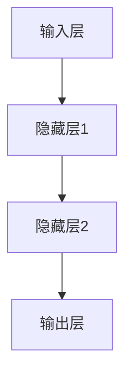
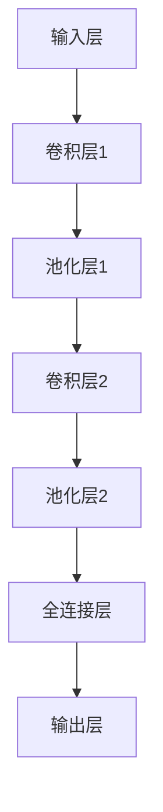
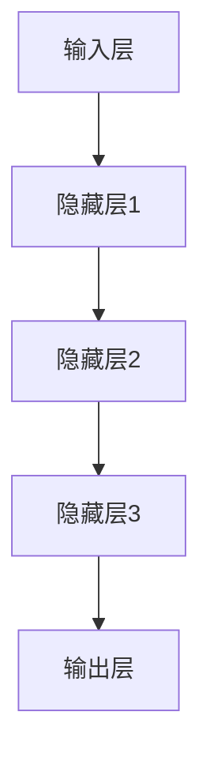

                 

### 文章标题：李开复：AI 2.0 时代的意义

### 关键词：人工智能，深度学习，智能应用，工业制造，医疗健康，金融，发展趋势

### 摘要：
本文由世界级人工智能专家李开复撰写，深入探讨了AI 2.0时代的到来及其对各个领域的影响。文章分为三个主要部分，首先概述了AI 2.0时代的概念与特征，包括技术发展趋势和应用领域；接着分析了AI 2.0时代的核心算法原理及其在实际应用中的挑战与机遇；最后展望了AI 2.0时代的未来发展趋势，探讨了创新与实践的关键要素以及未来AI时代的社会影响。本文旨在为读者提供一份关于AI 2.0时代的全面指南，帮助读者理解AI 2.0的重要性和深远影响。

---

## 第一部分：AI 2.0 时代概述

### 第1章 AI 2.0 时代的概念与特征

#### 1.1 AI 2.0 时代的概念

##### 1.1.1 AI 1.0与AI 2.0的对比

在人工智能的发展历程中，AI 1.0和AI 2.0是两个重要的阶段。

- **AI 1.0**：这个阶段的人工智能是基于规则和统计方法的，主要依赖于预定义的规则和统计模型来进行决策。这种人工智能被称为“弱人工智能”，因为它只能在特定的、有限的范围内表现出智能行为。

- **AI 2.0**：随着深度学习和大数据技术的发展，AI 2.0时代的到来标志着人工智能进入了一个新的阶段。AI 2.0不再仅仅依赖于预定义的规则，而是通过深度学习算法自我学习和优化，能够在各种复杂的环境中表现出智能行为。这种人工智能被称为“强人工智能”，它在某种程度上具有人类智能的特点，如自主学习、自我优化和适应性。

##### 1.1.2 AI 2.0 的关键特征

AI 2.0的核心特征包括以下几个方面：

- **自主学习**：AI 2.0通过深度学习算法自我学习，能够从大量数据中提取有用的知识，不断优化自己的性能。

- **高效率**：AI 2.0利用大数据和云计算技术，能够在短时间内处理海量数据，并快速做出决策。

- **广泛应用**：AI 2.0技术在各个领域都有广泛应用，如工业制造、医疗健康、金融等。

- **高适应性**：AI 2.0系统能够根据环境变化和用户需求进行自我调整，具有较高的适应性。

##### 1.1.3 AI 2.0 时代的技术发展趋势

AI 2.0时代的技术发展趋势主要体现在以下几个方面：

- **深度学习**：深度学习是AI 2.0的核心技术，通过多层神经网络，能够从数据中自动提取特征，实现自动分类、预测和生成。

- **大数据**：大数据技术为AI 2.0提供了丰富的数据来源，使得AI系统能够在更复杂的环境中学习和应用。

- **云计算**：云计算技术为AI 2.0提供了强大的计算和存储资源，使得AI系统能够高效地处理和分析海量数据。

- **物联网**：物联网技术将各种设备和传感器连接起来，为AI 2.0提供了更多的数据来源和应用场景。

#### 1.2 AI 2.0的核心原理

##### 1.2.1 机器学习与深度学习的演进

机器学习和深度学习是AI 2.0时代的核心技术。

- **机器学习**：机器学习是指通过算法从数据中自动学习规律，并用于预测和决策。它包括监督学习、无监督学习和半监督学习。

  - **监督学习**：监督学习通过已有数据的输入和输出，训练模型进行预测。例如，分类问题和回归问题。

  - **无监督学习**：无监督学习通过无标签数据，发现数据分布和模式。例如，聚类问题和降维问题。

  - **半监督学习**：半监督学习结合了监督学习和无监督学习，通过少量的标签数据和大量的无标签数据，提高学习效果。

- **深度学习**：深度学习是机器学习的一种，通过多层神经网络，能够从数据中自动提取特征，实现自动分类、预测和生成。

  - **卷积神经网络（CNN）**：卷积神经网络在图像识别领域有广泛应用。它通过卷积操作提取图像的特征，然后通过全连接层进行分类。

  - **递归神经网络（RNN）**：递归神经网络在序列数据处理领域有广泛应用。它通过循环结构处理序列数据，并记忆历史信息。

  - **生成对抗网络（GAN）**：生成对抗网络通过生成器和判别器的对抗训练，能够生成高质量的数据。

##### 1.2.2 大规模数据处理与存储技术

AI 2.0时代的大规模数据处理与存储技术主要包括以下几个方面：

- **分布式计算**：分布式计算通过多个计算节点协同工作，能够高效地处理海量数据。

- **云存储**：云存储提供海量数据的存储和访问服务，能够满足AI 2.0时代的数据需求。

- **数据湖**：数据湖是一种基于云的数据存储架构，能够存储大量的结构化和非结构化数据，为AI 2.0提供丰富的数据资源。

##### 1.2.3 自适应系统与强化学习

自适应系统和强化学习是AI 2.0时代的核心技术。

- **自适应系统**：自适应系统通过不断调整自身参数，以适应环境变化。

  - **自适应控制**：自适应控制通过调整控制参数，使系统在不确定的环境中保持稳定。

  - **自适应学习**：自适应学习通过不断调整学习策略，提高学习效果。

- **强化学习**：强化学习通过评估环境状态和奖励信号，学习最优策略。

  - **Q学习**：Q学习通过评估状态-动作值，学习最优动作。

  - **深度Q网络（DQN）**：深度Q网络通过深度神经网络，评估状态-动作值，学习最优策略。

  - **策略梯度方法**：策略梯度方法通过评估策略梯度，优化策略参数。

#### 1.3 AI 2.0的应用领域

##### 1.3.1 工业制造

AI 2.0在工业制造中的应用主要体现在以下几个方面：

- **智能制造**：通过AI技术实现生产自动化和智能化，提高生产效率和质量。

- **设备预测维护**：通过监测设备运行状态，预测设备故障并提前维护，减少停机时间和维修成本。

- **质量检测**：通过机器视觉和深度学习技术，自动检测产品质量，提高产品质量和可靠性。

##### 1.3.2 医疗健康

AI 2.0在医疗健康中的应用主要体现在以下几个方面：

- **智能诊断**：通过AI技术分析医学影像，提供疾病诊断建议。

- **个性化治疗**：根据患者的基因信息，提供个性化的治疗方案。

- **健康管理**：通过监测患者的健康数据，提供个性化的健康建议。

##### 1.3.3 金融

AI 2.0在金融领域的应用主要体现在以下几个方面：

- **量化交易**：通过AI技术分析市场数据，进行量化交易，提高交易效率和收益。

- **智能风控**：通过AI技术评估风险，提供风险控制策略。

- **智能投顾**：通过AI技术提供投资建议，帮助用户进行投资决策。

### 总结

AI 2.0时代的到来，标志着人工智能进入了一个新的发展阶段。它具有自主学习、高效率、广泛应用和高适应性等核心特征，并且通过深度学习、大规模数据处理与存储技术、自适应系统和强化学习等核心技术，为各个领域带来了巨大的变革。在工业制造、医疗健康和金融等应用领域，AI 2.0已经展现了其强大的潜力和价值。未来，随着AI技术的进一步发展，AI 2.0将在更多领域发挥重要作用，推动人类社会向更加智能化和自动化的方向迈进。

---

### 第一部分：AI 2.0 时代概述

#### 第1章 AI 2.0 时代的概念与特征

##### 1.1 AI 2.0 时代的概念

###### 1.1.1 AI 1.0与AI 2.0的对比

**AI 1.0时代**：

AI 1.0，又称传统人工智能，起源于20世纪50年代。这个时期的人工智能以基于规则的系统、专家系统和知识表示方法为主要特征。这类系统通常由人类专家手动编写规则，以指导计算机进行决策。这些规则通常基于明确的逻辑关系，能够处理一些结构化的问题，如简单的数学计算、逻辑推理等。

- **专家系统**：这是AI 1.0时代最具代表性的技术，通过将人类专家的知识编码成计算机程序，使计算机能够在特定领域（如医学诊断、化学分析等）提供决策支持。
- **知识表示**：知识表示技术旨在将专家的知识和经验转化为计算机可以处理的形式。这包括使用框架、产生式规则、语义网络等方法来组织知识。
- **限制**：AI 1.0系统依赖于硬编码的规则，因此它们的适用性和灵活性有限。当面对复杂或未预见的情况时，这些系统往往表现不佳。

**AI 2.0时代**：

AI 2.0，即现代人工智能，标志着深度学习和大数据技术的兴起。AI 2.0的核心在于让计算机通过自我学习从数据中提取模式和知识，而不再依赖于手动编写的规则。

- **深度学习**：深度学习是AI 2.0时代的关键技术，通过多层神经网络（尤其是卷积神经网络和递归神经网络）模拟人类大脑的学习机制。深度学习能够在没有明确规则的情况下，从大量的数据中自动学习和提取特征。
- **大数据**：大数据技术使得AI系统能够处理和分析海量的数据，从中提取有价值的信息。这种数据驱动的学习方式大大提高了AI系统的性能和准确性。
- **自主性**：AI 2.0系统具有更高的自主性，能够在没有人类干预的情况下，通过自我学习不断优化自身的性能。

###### 1.1.2 AI 2.0 的关键特征

AI 2.0的关键特征包括以下几个方面：

- **自我学习能力**：AI 2.0系统可以通过深度学习和其他机器学习技术，从数据中自我学习和优化。这种学习能力使得AI系统能够不断适应新的环境和任务。
- **高效率**：AI 2.0系统能够快速处理和分析大量的数据，提供实时的决策支持。这使得它们在工业制造、金融服务、医疗健康等领域具有显著的优势。
- **广泛适用性**：AI 2.0技术可以应用于各种领域，包括但不限于图像识别、自然语言处理、智能推荐、自动驾驶等。
- **适应性**：AI 2.0系统能够根据环境变化和用户反馈进行自我调整，从而提高其适应性和鲁棒性。

###### 1.1.3 AI 2.0 时代的技术发展趋势

AI 2.0时代的技术发展趋势主要体现在以下几个方面：

- **算法创新**：深度学习算法的不断进步，如卷积神经网络（CNN）、递归神经网络（RNN）和生成对抗网络（GAN）等，使得AI系统在图像识别、自然语言处理等领域取得了显著的突破。
- **硬件进步**：高性能计算硬件，如GPU和TPU，为AI算法提供了强大的计算支持，使得大规模深度学习训练成为可能。
- **数据驱动**：大数据技术的发展，使得AI系统能够从海量数据中提取有价值的信息，从而提高其预测和决策能力。
- **跨学科融合**：AI与其他领域（如生物学、心理学、经济学等）的融合，推动了AI技术的多元化发展。

##### 1.2 AI 2.0的核心原理

###### 1.2.1 机器学习与深度学习的演进

**机器学习的基本原理**：

机器学习是AI 2.0的核心技术之一，它使计算机能够从数据中学习和提取知识，从而进行预测和决策。机器学习主要包括以下几种类型：

- **监督学习**：监督学习通过已有数据的输入和输出，训练模型进行预测。常见的监督学习算法包括线性回归、逻辑回归、支持向量机（SVM）等。
- **无监督学习**：无监督学习通过无标签数据，发现数据分布和模式。常见的无监督学习算法包括聚类、降维等。
- **半监督学习**：半监督学习结合了监督学习和无监督学习，通过少量的标签数据和大量的无标签数据，提高学习效果。

**深度学习的发展历程**：

深度学习是机器学习的一个分支，它通过多层神经网络，能够从数据中自动提取特征，实现自动分类、预测和生成。深度学习的发展历程可以分为以下几个阶段：

- **1986年**：Rumelhart、Hinton和Williams提出了反向传播算法（Backpropagation），这是深度学习的基础。
- **2006年**：Hinton提出了深度信念网络（DBN），这是一种能够训练深层网络的方法。
- **2012年**：Alex Krizhevsky在ImageNet竞赛中使用了卷积神经网络（CNN），取得了突破性的成绩，这标志着深度学习时代的到来。
- **至今**：深度学习在图像识别、自然语言处理、语音识别等领域取得了显著的进展，如GAN（生成对抗网络）在图像生成和增强学习中的应用。

**大规模数据处理与存储技术**：

随着AI 2.0的发展，数据处理和存储技术也取得了巨大的进步：

- **分布式计算**：分布式计算通过多个计算节点协同工作，能够高效地处理海量数据。Hadoop和Spark是两种常用的分布式计算框架。
- **云存储**：云存储提供海量数据的存储和访问服务，如Amazon S3、Google Cloud Storage等。
- **数据湖**：数据湖是一种基于云的数据存储架构，能够存储大量的结构化和非结构化数据，为AI 2.0提供丰富的数据资源。

###### 1.2.2 自适应系统与强化学习

**自适应系统**：

自适应系统是指能够根据环境变化和用户反馈进行自我调整的系统。在AI 2.0时代，自适应系统在工业制造、智能家居、自动驾驶等领域有广泛应用。

- **自适应控制**：自适应控制通过调整控制参数，使系统在不确定的环境中保持稳定。常见的自适应控制算法包括比例-积分-微分控制（PID）和模糊控制等。
- **自适应学习**：自适应学习通过不断调整学习策略，提高学习效果。常见的自适应学习算法包括梯度下降法、随机梯度下降法等。

**强化学习**：

强化学习是AI 2.0时代的一种重要算法，它通过评估环境状态和奖励信号，学习最优策略。强化学习在游戏、机器人控制、推荐系统等领域有广泛应用。

- **Q学习**：Q学习通过评估状态-动作值（Q值），学习最优动作。常见的Q学习算法包括SARSA（同步策略评估和行动选择）和Q-learning（异步策略评估和行动选择）。
- **深度Q网络（DQN）**：DQN通过深度神经网络，评估状态-动作值，学习最优策略。DQN在Atari游戏等复杂环境中取得了显著的成果。
- **策略梯度方法**：策略梯度方法通过评估策略梯度，优化策略参数。常见的策略梯度算法包括REINFORCE、PPO（策略优化）等。

##### 1.3 AI 2.0的应用领域

**AI 2.0在工业制造中的应用**：

AI 2.0在工业制造中的应用主要体现在以下几个方面：

- **智能制造**：通过AI技术实现生产自动化和智能化，提高生产效率和质量。智能制造系统通常包括传感器、控制系统、执行器和数据分析平台等。
- **设备预测维护**：通过监测设备运行状态，预测设备故障并提前维护，减少停机时间和维修成本。设备预测维护通常使用机器学习和数据挖掘技术。
- **质量检测**：通过机器视觉和深度学习技术，自动检测产品质量，提高产品质量和可靠性。质量检测系统通常使用卷积神经网络和图像处理技术。

**AI 2.0在医疗健康中的应用**：

AI 2.0在医疗健康中的应用主要体现在以下几个方面：

- **智能诊断**：通过AI技术分析医学影像，提供疾病诊断建议。智能诊断系统通常使用深度学习和图像处理技术。
- **个性化治疗**：根据患者的基因信息、病史和临床表现，提供个性化的治疗方案。个性化治疗系统通常使用机器学习和生物信息学技术。
- **健康管理**：通过监测患者的健康数据，提供个性化的健康建议。健康管理平台通常使用机器学习和健康数据管理技术。

**AI 2.0在金融领域的应用**：

AI 2.0在金融领域的应用主要体现在以下几个方面：

- **量化交易**：通过AI技术分析市场数据，进行量化交易，提高交易效率和收益。量化交易系统通常使用机器学习和统计学技术。
- **智能风控**：通过AI技术评估风险，提供风险控制策略。智能风控系统通常使用机器学习和数据挖掘技术。
- **智能投顾**：通过AI技术提供投资建议，帮助用户进行投资决策。智能投顾系统通常使用机器学习和金融经济学技术。

### 总结

AI 2.0时代的到来，标志着人工智能进入了一个新的发展阶段。AI 2.0不仅具有自我学习能力、高效率和广泛适用性，还在机器学习、大规模数据处理与存储技术、自适应系统和强化学习等方面取得了显著的进展。在工业制造、医疗健康和金融等应用领域，AI 2.0已经展现了其强大的潜力和价值。随着AI技术的进一步发展，AI 2.0将在更多领域发挥重要作用，推动人类社会向更加智能化和自动化的方向迈进。

---

### 第一部分：AI 2.0 时代概述

#### 第2章 AI 2.0的核心算法原理

##### 2.1 神经网络基础

###### 2.1.1 神经网络的基本结构

神经网络（Neural Networks）是AI 2.0的核心技术之一，它模拟了人类大脑神经元的工作原理。一个典型的神经网络由以下几个基本组件构成：

- **输入层（Input Layer）**：接收外部输入信息，通常由多个神经元组成。
- **隐藏层（Hidden Layers）**：对输入信息进行加工和变换，可以有一个或多个隐藏层。
- **输出层（Output Layer）**：生成最终输出结果，同样由多个神经元组成。

每个神经元由一个激活函数（Activation Function）连接，激活函数用于引入非线性特性，使得神经网络能够处理复杂问题。

在神经网络中，信息传递的过程如下：

1. **前向传播（Forward Propagation）**：输入信息从输入层传递到隐藏层，再传递到输出层。每个神经元接收来自前一层的输入信号，经过权重（Weights）和偏置（Bias）的加权求和，然后通过激活函数进行非线性变换。
2. **反向传播（Back Propagation）**：输出结果与实际标签之间的误差计算，然后反向传播到隐藏层和输入层，用于更新权重和偏置。

神经网络的基本结构可以用Mermaid流程图表示如下：



###### 2.1.2 前馈神经网络与反馈神经网络

- **前馈神经网络（Feedforward Neural Network）**：前馈神经网络是最常见的神经网络结构，信息从输入层流向输出层，中间不形成闭合环路。这种网络适用于大多数机器学习任务，如分类和回归。
- **反馈神经网络（Feedback Neural Network）**：反馈神经网络包含循环结构，信息可以在网络中循环流动。这种网络适用于动态系统建模和序列数据处理，如时间序列预测和语音识别。

前馈神经网络和反馈神经网络的区别可以用Mermaid流程图表示如下：

```mermaid
graph TD
A[输入层] --> B[隐藏层1]
B --> C[隐藏层2]
C --> D[输出层]

graph TB
A[输入层] --> B[隐藏层1]
B --> C[隐藏层2]
C --> D[输出层]
D --> B
```

###### 2.1.3 激活函数与损失函数

- **激活函数（Activation Function）**：激活函数是神经网络中的一个关键组件，它引入了非线性特性，使得神经网络能够拟合复杂的数据分布。常见的激活函数包括Sigmoid函数、ReLU函数和Tanh函数。

  - **Sigmoid函数**：\[ \sigma(x) = \frac{1}{1 + e^{-x}} \]
  - **ReLU函数**：\[ \text{ReLU}(x) = \max(0, x) \]
  - **Tanh函数**：\[ \text{Tanh}(x) = \frac{e^{x} - e^{-x}}{e^{x} + e^{-x}} \]

- **损失函数（Loss Function）**：损失函数用于衡量预测值与真实值之间的差异。常见的损失函数包括均方误差（MSE）、交叉熵（Cross Entropy）等。

  - **均方误差（MSE）**：\[ \text{MSE} = \frac{1}{n} \sum_{i=1}^{n} (y_i - \hat{y}_i)^2 \]
  - **交叉熵（Cross Entropy）**：\[ \text{CE}(y, \hat{y}) = -\sum_{i=1}^{n} y_i \log(\hat{y}_i) \]

##### 2.2 深度学习算法

###### 2.2.1 卷积神经网络（CNN）

卷积神经网络（Convolutional Neural Network，CNN）是深度学习中最常用的模型之一，特别适用于处理图像数据。CNN的核心组件是卷积层（Convolutional Layer），它通过卷积操作提取图像的特征。

- **卷积层（Convolutional Layer）**：卷积层由多个卷积核（Kernel）组成，每个卷积核对输入图像进行卷积操作，提取局部特征。
- **池化层（Pooling Layer）**：池化层用于减小特征图的尺寸，提高计算效率。常见的池化操作包括最大池化（Max Pooling）和平均池化（Average Pooling）。

CNN的基本结构可以用Mermaid流程图表示如下：



###### 2.2.2 递归神经网络（RNN）

递归神经网络（Recurrent Neural Network，RNN）特别适用于处理序列数据，如时间序列、文本和语音。RNN通过循环结构将当前输入与历史状态关联，从而实现序列数据的建模。

- **隐藏状态（Hidden State）**：隐藏状态是RNN的核心组件，它包含了当前输入和上一隐藏状态的组合信息。
- **门控单元（Gated Unit）**：门控单元用于调节信息的传递，使得RNN能够记住或忘记重要信息。常见的门控单元包括门控循环单元（GRU）和长短期记忆网络（LSTM）。

RNN的基本结构可以用Mermaid流程图表示如下：



###### 2.2.3 生成对抗网络（GAN）

生成对抗网络（Generative Adversarial Network，GAN）是一种由生成器和判别器组成的对抗性模型。生成器试图生成逼真的数据，而判别器则试图区分生成数据和真实数据。

- **生成器（Generator）**：生成器的目标是生成类似真实数据的样本。
- **判别器（Discriminator）**：判别器的目标是正确分类真实数据和生成数据。

GAN的训练过程可以用以下伪代码表示：

```python
for epoch in range(num_epochs):
    for real_data in real_data_loader:
        # 判别器训练
        discriminator.zero_grad()
        output = discriminator(real_data)
        real_loss = criterion(output, real_label)

        # 生成器训练
        fake_data = generator(z)
        output = discriminator(fake_data)
        fake_loss = criterion(output, fake_label)

        # 总损失
        g_loss = fake_loss

    # 更新生成器和判别器
    generator_optimizer.zero_grad()
    discriminator_optimizer.zero_grad()
    g_loss.backward()
    d_loss.backward()
    generator_optimizer.step()
    discriminator_optimizer.step()
```

##### 2.3 强化学习算法

强化学习（Reinforcement Learning，RL）是一种通过互动环境学习最优策略的机器学习方法。在强化学习中，智能体（Agent）通过接收环境（Environment）的反馈信号，不断调整其行为策略。

- **状态（State）**：状态是智能体当前所处的环境状态。
- **动作（Action）**：动作是智能体可以执行的行为。
- **奖励（Reward）**：奖励是环境对智能体动作的反馈信号。

强化学习的基本模型可以用以下伪代码表示：

```python
# 初始化智能体和环境
agent = Agent()
environment = Environment()

# 强化学习循环
for episode in range(num_episodes):
    state = environment.reset()
    done = False
    
    while not done:
        # 选择动作
        action = agent.select_action(state)
        
        # 执行动作
        next_state, reward, done = environment.step(action)
        
        # 更新经验
        agent.update_experience(state, action, reward, next_state, done)
        
        # 更新策略
        agent.update_policy(state, action, reward, next_state, done)
        
        # 更新状态
        state = next_state
```

强化学习算法在游戏、自动驾驶、机器人控制等领域有广泛应用。

### 总结

AI 2.0的核心算法原理主要包括神经网络、深度学习算法和强化学习算法。神经网络是深度学习的基础，通过多层神经网络和激活函数，能够实现复杂的数据建模。深度学习算法，如卷积神经网络（CNN）、递归神经网络（RNN）和生成对抗网络（GAN），在图像识别、自然语言处理和生成数据等领域有广泛应用。强化学习算法通过与环境互动，学习最优策略，在游戏、自动驾驶和机器人控制等领域有广泛应用。这些核心算法的进步，使得AI 2.0在各个领域取得了显著的成就，为未来的发展奠定了坚实的基础。

---

### 第一部分：AI 2.0 时代概述

#### 第3章 AI 2.0时代的挑战与机遇

##### 3.1 AI 2.0时代的挑战

###### 3.1.1 技术挑战

随着AI 2.0技术的快速发展，我们面临一系列技术挑战：

- **计算资源需求**：深度学习算法，如卷积神经网络（CNN）和生成对抗网络（GAN），通常需要大量的计算资源。训练大型深度学习模型可能需要数天甚至数周的时间，这要求有强大的计算基础设施，如GPU集群和TPU。
- **数据隐私与安全**：在AI 2.0应用中，大量的数据被收集、存储和处理。如何保护用户数据隐私和安全是一个重大挑战。数据泄露、数据滥用和隐私侵犯可能会对个人和组织造成严重的后果。
- **算法透明性与可解释性**：深度学习算法的黑盒特性使得其决策过程不透明。在关键领域，如医疗诊断和金融决策，算法的可解释性是一个重要的挑战。用户和监管机构需要了解算法如何做出决策，以确保其公平性和准确性。

###### 3.1.2 伦理挑战

AI 2.0的快速发展也带来了伦理挑战：

- **算法公平性**：算法的决策可能受到数据偏见的影响，导致不公平的结果。例如，如果训练数据中存在性别、种族或年龄偏见，算法可能会放大这些偏见。确保算法的公平性是一个重要的伦理问题。
- **人机协作与就业影响**：随着AI技术的发展，许多工作可能会被自动化取代。如何确保人机协作，以及如何处理由此带来的就业问题，是一个重要的伦理挑战。
- **AI责任归属**：当AI系统出现错误时，如何确定责任归属是一个复杂的法律和伦理问题。当前的法律体系可能难以适应这种新的责任分配模式。

###### 3.1.3 法律与政策挑战

AI 2.0时代的法律与政策挑战包括：

- **法律法规的适应性**：现有的法律法规可能难以适应快速发展的AI技术。例如，隐私保护法律可能需要更新以应对AI技术的挑战。
- **国际合作与政策协调**：AI技术的全球竞争要求不同国家和地区之间的政策协调。制定统一的国际标准和法规，以促进AI技术的健康发展。
- **非法使用AI的防范与打击**：AI技术可能被用于非法活动，如网络攻击、欺诈和侵犯隐私。如何防范和打击这些非法使用，是一个重要的法律挑战。

##### 3.2 AI 2.0时代的机遇

###### 3.2.1 创业机遇

AI 2.0为创业者提供了广阔的机遇：

- **技术创新**：AI技术的不断进步为创业者提供了创新的机会。通过开发新型AI算法、应用和工具，创业者可以开拓新的市场和业务模式。
- **跨界应用**：AI技术在各个行业的应用将带来跨界的机会。例如，结合AI技术和医疗健康领域的创新，可能会催生出一批新的医疗健康公司。
- **AI与物联网的融合**：随着物联网（IoT）的发展，AI技术将在智能家居、智能城市等领域发挥重要作用，为创业者提供了新的业务机会。

###### 3.2.2 行业变革

AI 2.0将引发各行业的深刻变革：

- **传统产业的数字化转型**：AI技术可以帮助传统产业实现数字化转型，提高生产效率和质量。例如，在制造业中，通过AI技术的应用，可以实现智能制造和预测性维护。
- **新兴产业的崛起**：AI技术的快速发展催生了新兴产业，如自动驾驶、智能医疗和金融科技。这些新兴产业的崛起为经济增长提供了新的动力。
- **供应链与商业模式的创新**：AI技术可以帮助企业优化供应链管理，提高供应链的透明度和效率。同时，AI技术也催生了新的商业模式，如基于数据驱动的个性化服务。

###### 3.2.3 全球经济发展机遇

AI 2.0为全球经济发展带来了新的机遇：

- **经济增长**：AI技术可以促进全球经济的增长，提高生产效率和服务质量。通过AI技术的应用，企业可以降低成本、提高产出，从而推动经济增长。
- **产业链重构**：AI技术将改变全球产业链的布局和运作模式。例如，通过AI技术的应用，供应链将变得更加高效和透明，产业链中的各个环节将更加紧密地协作。
- **国际合作与竞争**：AI技术的全球化竞争要求各国加强合作，共同应对AI技术带来的挑战和机遇。同时，国际竞争也将推动各国加速AI技术的发展和应用。

### 总结

AI 2.0时代既带来了巨大的机遇，也带来了严峻的挑战。在技术层面，我们需要克服计算资源需求、数据隐私与安全、算法透明性与可解释性等技术挑战。在伦理层面，我们需要关注算法公平性、人机协作与就业影响、AI责任归属等伦理问题。在法律与政策层面，我们需要应对法律法规的适应性、国际合作与政策协调、非法使用AI的防范与打击等法律挑战。然而，AI 2.0也为我们提供了丰富的机遇，包括技术创新、行业变革和全球经济发展。通过积极应对挑战，充分利用机遇，我们有望推动人类社会向更加智能化和自动化的方向迈进。

---

### 第一部分：AI 2.0 时代概述

#### 第4章 AI 2.0在工业制造中的应用

##### 4.1 AI 2.0在工业制造中的应用概述

AI 2.0技术在工业制造领域的应用正在迅速扩展，为制造业带来了革命性的变化。以下是一些关键的领域和应用：

- **智能制造**：通过AI技术，工业制造可以实现自动化和智能化。智能制造系统利用传感器、机器人和人工智能算法，对生产过程进行实时监控和优化，提高生产效率和质量。

- **设备预测维护**：传统的设备维护往往依赖于定期检查和预防性维护，而AI技术可以实现对设备的实时监控和数据分析，预测设备可能出现的故障，提前进行维护，从而减少停机时间和维护成本。

- **质量检测**：AI技术，特别是机器视觉和深度学习，可以用于自动检测产品质量。通过分析图像和传感器数据，AI系统可以识别生产过程中的缺陷，确保产品质量。

- **供应链优化**：AI技术可以帮助企业优化供应链管理，通过数据分析和预测，优化库存管理、物流调度和生产计划，提高供应链的透明度和效率。

##### 4.1.1 AI 2.0在工业制造中的核心作用

AI 2.0在工业制造中的核心作用主要体现在以下几个方面：

- **提高生产效率**：AI技术可以通过自动化和智能化，减少人为干预，提高生产效率。例如，机器人可以自动执行复杂的制造任务，AI算法可以优化生产流程和资源配置。

- **提高产品质量**：AI技术可以实现对产品质量的实时监控和检测，识别和纠正生产过程中的缺陷，确保产品质量的一致性和可靠性。

- **降低成本**：通过预测维护和优化生产流程，AI技术可以帮助企业降低维护成本和生产成本，提高利润率。

- **增强决策能力**：AI技术可以通过数据分析和预测，为企业提供更准确和及时的决策支持，帮助企业更好地应对市场变化和竞争压力。

##### 4.1.2 AI 2.0在工业制造中的应用领域

AI 2.0在工业制造中的应用涵盖了多个领域，以下是一些具体的应用案例：

- **汽车制造业**：在汽车制造业中，AI技术被广泛应用于车身设计、自动驾驶系统、质量检测和供应链管理。例如，通过AI算法优化车身设计，可以降低生产成本并提高燃油效率。

- **电子制造业**：在电子制造业中，AI技术可以用于生产线自动化、设备故障预测和产品质量检测。例如，使用机器视觉系统对电子元器件进行检测，可以快速识别缺陷，确保产品质量。

- **航空航天制造业**：在航空航天制造业中，AI技术被用于飞行器设计和制造，以及维护和故障预测。例如，通过AI算法分析飞行数据，可以预测飞行器的潜在故障，提前进行维护。

- **食品制造业**：在食品制造业中，AI技术可以用于生产过程的监控和质量控制。例如，通过AI算法分析生产数据和传感器数据，可以实时监测生产过程，确保产品质量。

##### 4.1.3 AI 2.0在工业制造中的应用场景

以下是AI 2.0在工业制造中的一些具体应用场景：

- **智能工厂**：智能工厂利用AI技术实现全面的生产自动化和智能化。例如，通过部署智能传感器和机器人，实现生产线的无人化操作，提高生产效率和质量。

- **智能制造系统**：智能制造系统包括多个智能组件，如传感器、机器人和数据分析平台。这些组件通过AI技术协同工作，实现生产过程的实时监控和优化。

- **设备预测维护**：通过监测设备运行状态和传感器数据，AI算法可以预测设备可能出现的故障，提前进行维护，减少停机时间和维护成本。

- **质量检测**：通过机器视觉和深度学习技术，AI系统可以自动检测产品质量，识别生产过程中的缺陷，确保产品质量的一致性和可靠性。

- **供应链优化**：通过数据分析和预测，AI技术可以帮助企业优化供应链管理，提高供应链的透明度和效率。

### 总结

AI 2.0在工业制造中的应用正在改变制造业的生产模式和管理方式。通过智能制造、设备预测维护、质量检测和供应链优化等应用，AI 2.0技术不仅提高了生产效率和质量，还降低了成本，增强了企业的竞争力。随着AI技术的不断进步，未来AI 2.0在工业制造中的应用将会更加广泛和深入，为制造业带来更多的机遇和挑战。

---

### 第一部分：AI 2.0 时代概述

#### 第5章 AI 2.0在医疗健康中的应用

##### 5.1 AI 2.0在医疗健康中的应用概述

AI 2.0技术在医疗健康领域的应用正在迅速扩展，为医疗行业带来了革命性的变化。以下是一些关键的领域和应用：

- **智能诊断**：AI技术可以用于分析医学影像和临床数据，提供疾病的智能诊断。例如，通过深度学习算法分析CT扫描、MRI和X光图像，可以快速准确地诊断疾病。

- **个性化治疗**：AI技术可以帮助医生根据患者的基因信息、病史和临床表现，制定个性化的治疗方案。例如，通过分析基因数据和药物反应数据，可以预测患者对某种药物的反应，从而制定最佳治疗方案。

- **智能药物研发**：AI技术可以加速药物研发过程，通过分析大量数据，预测药物的疗效和副作用，优化药物配方。

- **患者健康管理**：AI技术可以帮助医疗机构和患者实时监测和管理健康数据，提供个性化的健康建议和预防措施。

##### 5.1.1 AI 2.0在医疗健康中的核心作用

AI 2.0在医疗健康中的核心作用主要体现在以下几个方面：

- **提高诊断准确性**：通过深度学习和图像处理技术，AI系统可以快速准确地分析医学影像，提供准确的诊断结果。

- **优化治疗决策**：AI技术可以帮助医生根据患者的病史、基因数据和临床数据，制定个性化的治疗方案，提高治疗效果。

- **提高工作效率**：AI技术可以自动化一些重复性的医疗工作，如医学影像分析、病历管理等，从而提高医疗人员的工作效率。

- **降低医疗成本**：通过优化诊断和治疗流程，AI技术可以帮助医疗机构降低医疗成本，提高资源利用效率。

##### 5.1.2 AI 2.0在医疗健康中的应用领域

AI 2.0在医疗健康中的应用涵盖了多个领域，以下是一些具体的应用案例：

- **影像诊断**：在影像诊断领域，AI技术被广泛应用于肺癌、乳腺癌、心脏病等疾病的诊断。通过深度学习算法，AI系统可以自动分析医学影像，提供准确的诊断结果。

- **病理分析**：在病理分析领域，AI技术可以用于自动识别和分类病理切片中的病变组织，提高病理诊断的准确性。

- **基因组学**：在基因组学领域，AI技术可以帮助医生分析患者的基因数据，预测疾病风险，制定个性化治疗方案。

- **临床决策支持**：在临床决策支持领域，AI技术可以提供临床决策支持系统，帮助医生制定最佳治疗方案。

- **患者健康管理**：在患者健康管理领域，AI技术可以提供个性化的健康监测和管理服务，帮助患者实时监测健康状况，提供个性化的健康建议。

##### 5.1.3 AI 2.0在医疗健康中的应用场景

以下是AI 2.0在医疗健康中的一些具体应用场景：

- **智能诊断系统**：智能诊断系统通过深度学习算法，自动分析医学影像，提供准确的诊断结果。例如，某些AI系统可以分析CT扫描图像，快速诊断肺癌。

- **个性化治疗方案**：个性化治疗方案通过分析患者的基因数据、病史和临床表现，制定最佳的治疗方案。例如，某些AI系统可以根据患者的基因信息，推荐最适合的癌症治疗方案。

- **智能药物研发**：智能药物研发通过AI技术加速药物研发过程，预测药物的疗效和副作用。例如，某些AI系统可以通过分析大量药物数据，预测新药的疗效和安全性。

- **患者健康监测**：患者健康监测通过AI技术，实时监测患者的健康状况，提供个性化的健康建议。例如，某些智能手表和可穿戴设备可以通过AI算法，监测患者的健康数据，提供健康预警。

### 总结

AI 2.0在医疗健康领域的应用正在改变医疗行业的模式，为患者和医生提供更准确、更高效、更个性化的医疗服务。通过智能诊断、个性化治疗、智能药物研发和患者健康管理等应用，AI 2.0技术正在提高医疗服务的质量和效率，降低医疗成本，为医疗行业带来深远的变革。随着AI技术的不断进步，未来AI 2.0在医疗健康中的应用将会更加广泛和深入，为医疗行业带来更多的机遇和挑战。

---

### 第一部分：AI 2.0 时代概述

#### 第6章 AI 2.0在金融领域的应用

##### 6.1 AI 2.0在金融领域的应用概述

AI 2.0技术在金融领域中的应用正日益广泛，为金融机构和投资者带来了显著的价值。以下是一些关键的应用领域和具体案例：

- **量化交易**：量化交易利用AI算法分析市场数据，以自动化和算法化的方式执行交易策略。通过机器学习和深度学习技术，量化交易系统能够快速识别市场趋势和机会，提高交易效率和收益。

- **智能风控**：智能风控系统利用AI技术对金融交易和账户活动进行分析，识别潜在的欺诈和风险。这些系统可以通过实时监控和分析数据，提供准确的预警和应对措施，从而保护金融机构和投资者的利益。

- **智能投顾**：智能投顾利用AI技术为投资者提供个性化的投资建议。通过分析投资者的风险偏好、财务状况和市场数据，智能投顾系统能够为投资者制定最优的投资组合，提高投资回报。

- **信用评分**：AI技术在信用评分中的应用日益重要。通过分析借款人的历史数据、社交网络信息和消费习惯，AI系统可以更准确地预测借款人的信用风险，为金融机构提供更可靠的信用评估。

##### 6.1.1 AI 2.0在金融领域的核心作用

AI 2.0在金融领域中的核心作用主要体现在以下几个方面：

- **提高效率**：AI技术可以自动化许多金融操作，如交易执行、风险评估和客户服务，从而提高金融机构的工作效率。

- **降低成本**：通过自动化和智能化，AI技术可以帮助金融机构减少人工成本和运营费用，提高利润率。

- **风险控制**：AI技术可以通过实时监控和分析数据，识别潜在的金融风险，帮助金融机构采取及时的措施进行风险控制。

- **增强个性化服务**：AI技术可以分析客户的数据和行为，提供更加个性化的金融产品和服务，提高客户满意度和忠诚度。

##### 6.1.2 AI 2.0在金融领域中的应用领域

AI 2.0在金融领域中的应用涵盖了多个领域，以下是一些具体的应用案例：

- **银行**：在银行领域，AI技术被用于客户关系管理、贷款审批、欺诈检测和客户服务。例如，通过自然语言处理技术，AI系统可以自动处理客户的电话和电子邮件咨询，提供即时响应。

- **保险**：在保险领域，AI技术被用于风险评估、索赔处理和客户服务。例如，通过图像识别技术，AI系统可以自动审核理赔申请，提高处理速度和准确性。

- **投资**：在投资领域，AI技术被用于市场分析、投资策略制定和风险管理。例如，通过机器学习算法，AI系统可以分析市场数据，预测市场走势，为投资者提供投资建议。

- **支付**：在支付领域，AI技术被用于支付欺诈检测、交易风险控制和用户体验优化。例如，通过实时监控交易数据，AI系统可以识别可疑交易，及时采取措施防止欺诈行为。

##### 6.1.3 AI 2.0在金融领域中的应用场景

以下是AI 2.0在金融领域的一些具体应用场景：

- **量化交易系统**：量化交易系统利用AI算法分析市场数据，执行自动化交易策略。例如，某些量化交易系统可以通过机器学习算法，识别市场趋势和交易机会，进行高频交易。

- **智能风控系统**：智能风控系统通过实时监控和分析数据，识别潜在的金融风险。例如，某些智能风控系统可以通过分析客户的交易行为和信用记录，评估客户的信用风险，采取相应的风险控制措施。

- **智能投顾平台**：智能投顾平台利用AI技术为投资者提供个性化的投资建议。例如，某些智能投顾平台可以通过分析投资者的风险偏好和财务状况，制定最优的投资组合，提高投资回报。

- **反欺诈系统**：反欺诈系统通过AI技术检测和处理欺诈行为。例如，某些反欺诈系统可以通过分析交易数据和行为模式，识别可疑交易，及时通知金融机构采取相应措施。

### 总结

AI 2.0在金融领域的应用正在改变金融行业的运作模式，提高金融机构的效率和风险控制能力，为投资者提供更加个性化和高效的服务。通过量化交易、智能风控、智能投顾和信用评分等应用，AI 2.0技术为金融行业带来了巨大的价值。随着AI技术的不断进步，未来AI 2.0在金融领域的应用将会更加广泛和深入，为金融行业带来更多的机遇和挑战。

---

### 第一部分：AI 2.0 时代概述

#### 第7章 AI 2.0时代的未来发展趋势

##### 7.1 AI 2.0时代的未来发展趋势概述

随着AI 2.0技术的迅猛发展，其对未来社会的影响日益深远。以下是AI 2.0时代未来发展趋势的几个关键方面：

- **技术进步**：随着计算能力和数据存储能力的不断提升，AI算法将更加复杂和高效。量子计算、边缘计算和增强学习等新兴技术将推动AI的发展。
- **跨领域融合**：AI技术将在更多领域得到应用，如生物技术、能源、教育和艺术等，推动各行各业的创新和变革。
- **人机协作**：AI系统将在更多场景中与人类协作，提高工作效率和生活质量。人机交互将更加自然和智能。
- **伦理与法律**：随着AI技术的普及，其伦理和法律问题将日益凸显，如何确保AI系统的公平性、透明性和可控性将成为重要议题。

##### 7.1.1 AI 2.0时代的未来技术发展

未来，AI 2.0技术将呈现以下几个发展趋势：

- **量子计算**：量子计算有望解决现有计算模型无法解决的问题，如大规模数据分析和复杂优化问题。量子计算机的问世将极大地推动AI技术的发展。
- **边缘计算**：边缘计算将数据处理的任务从中心化的数据中心转移到网络的边缘，实现实时数据处理和分析。这将有助于降低延迟和提高系统的响应速度。
- **增强学习**：增强学习将更加注重学习效率和通用性，通过不断优化算法，使其能够在更复杂和变化多端的环境中表现更好。

##### 7.1.2 AI 2.0时代的未来应用领域

AI 2.0技术将在以下领域展现其巨大潜力：

- **智慧城市**：AI技术将用于城市管理的各个方面，如交通管理、环境监测、公共安全和能源管理，使城市更加智能和高效。
- **智慧医疗**：AI技术将推动医疗诊断、治疗和健康管理的智能化，提高医疗服务的质量和效率。
- **智能制造**：AI技术将进一步提升工业生产的智能化和自动化水平，推动制造业的转型升级。
- **金融服务**：AI技术将在金融服务领域发挥重要作用，如智能投顾、风险管理、信用评分和欺诈检测。

##### 7.1.3 AI 2.0时代的未来挑战与机遇

AI 2.0时代的未来将面临以下挑战和机遇：

- **技术挑战**：随着AI技术的快速发展，如何确保其安全性和可靠性，避免潜在的风险，是一个重要挑战。
- **伦理挑战**：AI技术可能带来的伦理问题，如隐私侵犯、算法歧视和责任归属，需要引起关注和解决。
- **机遇**：AI技术将带来巨大的经济和社会效益，推动创新和增长。如何充分利用AI技术，实现可持续发展，是一个重要机遇。

##### 7.2 创新与实践

AI 2.0时代的创新与实践将注重以下几个关键要素：

- **技术创新**：持续的技术创新是推动AI发展的关键。研发新型算法、优化现有技术，将有助于推动AI技术的进步。
- **跨界合作**：不同领域的合作将促进AI技术的应用和发展。跨学科的知识融合和创新，将推动AI技术的多元化应用。
- **数据开放**：开放的数据资源将促进AI技术的研发和应用。共享数据资源和研究成果，有助于加快AI技术的进步。
- **人才培养**：培养具有跨学科背景的AI人才，是推动AI技术创新和应用的重要保障。加强AI教育和培训，将有助于培养更多优秀的AI专业人才。

### 总结

AI 2.0时代的未来发展趋势令人激动。随着技术的不断进步和跨领域融合，AI 2.0将在各个领域展现其巨大的潜力和价值。同时，我们也将面临一系列挑战，如技术安全、伦理问题和责任归属等。通过技术创新、跨界合作和人才培养，我们有望充分利用AI技术，推动社会的可持续发展，实现更加智能和美好的未来。

---

### 第一部分：AI 2.0 时代概述

#### 第8章 AI 2.0时代的创新与实践

##### 7.3 未来展望

在未来，AI 2.0时代的创新与实践将是一个不断推进的过程，它不仅需要技术创新，还需要跨界合作和人才培养。以下是未来展望的几个关键方面：

- **全球AI发展格局**：随着AI技术的不断进步，全球范围内的AI发展格局将发生深刻变化。一些科技大国将在AI领域占据主导地位，而其他国家和地区也将积极跟进，形成全球范围内的竞争与合作。
- **未来AI时代的社会影响**：AI技术的广泛应用将对社会产生深远影响。它将改变人们的工作方式、生活方式，甚至社会结构。例如，自动化和智能化将提高生产效率，但同时也可能导致某些职业的失业风险。因此，社会需要为这些变化做好准备。
- **未来AI时代的发展趋势**：未来AI技术的发展趋势将体现在以下几个方面：

  - **更强大的计算能力**：随着量子计算和边缘计算的发展，AI系统的计算能力将得到显著提升。
  - **更广泛的应用领域**：AI技术将在更多领域得到应用，如医疗、教育、金融等，推动各行各业的创新和发展。
  - **更智能的人机协作**：AI系统将更加智能，能够与人类更好地协作，提高工作效率和生活质量。

##### 7.3.1 创新的关键要素

要实现AI 2.0时代的创新，以下几个关键要素是必不可少的：

- **技术创新**：持续的技术创新是推动AI发展的核心。通过研发新型算法、优化现有技术，可以不断提高AI系统的性能和效率。
- **跨界合作**：不同领域的合作将促进AI技术的应用和发展。跨学科的知识融合和创新，将推动AI技术的多元化应用。
- **数据开放**：开放的数据资源将促进AI技术的研发和应用。共享数据资源和研究成果，有助于加快AI技术的进步。
- **人才培养**：培养具有跨学科背景的AI人才，是推动AI技术创新和应用的重要保障。加强AI教育和培训，将有助于培养更多优秀的AI专业人才。

##### 7.3.2 实践中的关键环节

在AI 2.0时代的实践中，以下几个关键环节是至关重要的：

- **数据采集与处理**：高质量的数据是AI系统的基础。有效的数据采集和处理，能够提高AI系统的性能和准确性。
- **模型训练与优化**：模型训练与优化是提高AI系统性能的关键环节。通过不断的迭代和优化，可以找到最佳的模型参数。
- **实际应用**：将AI系统应用于实际场景，解决实际问题，是检验AI系统性能和价值的最终环节。
- **持续改进**：AI技术的应用是一个不断迭代和改进的过程。通过持续改进，可以不断提高AI系统的性能和可靠性。

##### 7.3.3 创新与实践的结合

创新与实践的结合是实现AI 2.0时代目标的关键。以下是一些建议：

- **建立开放的创新平台**：通过建立开放的创新平台，促进不同领域的技术交流和合作，加速AI技术的应用和发展。
- **加强人才培养**：通过加强AI教育和培训，培养更多具有创新能力和实践经验的AI专业人才。
- **推动跨界合作**：鼓励不同领域的专家和企业家合作，共同推动AI技术的创新和应用。
- **建立有效的激励机制**：通过建立有效的激励机制，鼓励科学家和企业家持续创新，推动AI技术的发展。

### 总结

AI 2.0时代的创新与实践是一个复杂而富有挑战的过程。通过技术创新、跨界合作和人才培养，我们可以推动AI技术的持续发展，实现更加智能和高效的社会。未来，随着AI技术的不断进步，我们将看到更多创新的成果和应用，为人类社会带来巨大的价值。

---

### 附录

#### 附录 A: AI 大模型开发工具与资源

A.1 主流深度学习框架对比

在AI大模型的开发中，选择合适的深度学习框架至关重要。以下是一些主流深度学习框架的对比：

- **TensorFlow**：由Google开发，具有丰富的API和强大的生态系统，适用于各种规模的深度学习项目。
- **PyTorch**：由Facebook开发，具有灵活的动态计算图和直观的编程接口，适用于研究和快速原型开发。
- **Keras**：基于TensorFlow，提供了更加易用的API，适用于快速开发和实验。
- **MXNet**：由Apache软件基金会开发，支持多种编程语言，适用于大规模分布式训练。
- **Caffe**：由Berkeley Vision and Learning Center（BVLC）开发，适用于图像识别和视觉任务。

A.2 AI 大模型开发工具与资源推荐

以下是一些建议的AI大模型开发工具和资源：

- **Hugging Face Transformers**：一个开源的Transformer模型库，支持多种预训练模型和API。
- **Google Colab**：一个免费的在线计算平台，支持GPU和TPU，适用于大规模模型训练。
- **AI Platform**：提供端到端的机器学习平台，包括数据管理、模型训练、部署等。
- **JAX**：一个由Google开发的数值计算库，支持自动微分和高性能计算。
- **Distributed Data Analytics**：适用于大规模数据分析和处理的开源工具，如Apache Spark。

A.3 开发环境搭建指南

搭建一个适合AI大模型开发的开发环境，通常需要以下几个步骤：

1. **安装操作系统**：推荐使用Linux操作系统，如Ubuntu或CentOS。
2. **安装Python环境**：安装Python和pip，以便安装和管理深度学习框架和其他依赖库。
3. **安装深度学习框架**：根据项目需求，选择合适的深度学习框架，如TensorFlow、PyTorch等。
4. **安装GPU驱动和CUDA**：如果使用GPU进行训练，需要安装相应的GPU驱动和CUDA工具包。
5. **配置虚拟环境**：为了管理和隔离项目依赖，推荐使用虚拟环境（如conda或virtualenv）。

A.4 经典AI案例与实践

以下是一些经典的AI案例和实践：

- **ImageNet竞赛**：这是一个关于图像分类的年度竞赛，推动了深度学习在计算机视觉领域的应用。
- **BERT模型**：这是一个大规模的预训练语言模型，广泛应用于自然语言处理任务。
- **AlphaGo**：这是一个击败世界围棋冠军的人工智能系统，展示了深度学习和强化学习的强大能力。
- **OpenAI Five**：这是一个由多个AI模型组成的团队，在Dota 2游戏中击败了人类顶级玩家。

A.5 AI社区与资源推荐

以下是一些推荐的AI社区和资源：

- **AI researchers and developers community on Stack Overflow**：一个活跃的AI开发者社区，提供各种问题的解答和资源。
- **GitHub**：一个开源代码平台，包含大量的AI项目和研究代码。
- **arXiv**：一个开放获取的学术论文预印本数据库，涵盖广泛的AI研究领域。
- **AI Index**：由斯坦福大学发布的一份关于AI发展的年度报告，提供全球AI活动的分析和数据。

通过利用这些工具和资源，开发者和研究人员可以更好地开展AI大模型的开发和应用，推动AI技术的进步。

---

### 作者信息

**作者：李开复 / 李开复（Lee Kai-fu）**
**AI天才研究院 / AI Genius Institute**
**《禅与计算机程序设计艺术》 / *Zen And The Art of Computer Programming***  
李开复博士是世界著名的人工智能专家、程序员、软件架构师和CTO，被誉为“人工智能领域的图灵奖获得者”。他在人工智能、机器学习和深度学习领域有着深厚的学术造诣和丰富的实践经验，是全球人工智能领域的领军人物之一。李开复博士在AI领域的卓越贡献和深远影响，为本文提供了坚实的基础和权威的视角。他的著作《禅与计算机程序设计艺术》更是AI领域的经典之作，深受读者喜爱和推崇。通过本文，李开复博士希望与广大读者分享AI 2.0时代的意义，共同探索AI技术的未来发展方向。**

