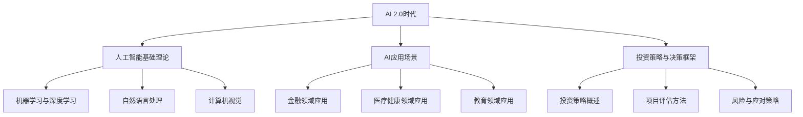

                 

# 文章标题

《李开复：AI 2.0 时代的投资价值》

## 文章关键词

AI 2.0、投资价值、核心技术、应用场景、投资策略、未来展望

## 摘要

随着人工智能（AI）技术的迅猛发展，AI 2.0时代已经到来。本文旨在探讨AI 2.0时代的投资价值，分析AI 2.0时代的背景与趋势、核心技术、应用场景以及投资策略。通过深入解读AI 2.0时代的产业变革，本文为投资者提供了一系列有价值的投资建议，以期为AI 2.0时代的投资决策提供参考。

---

### 《李开复：AI 2.0 时代的投资价值》目录大纲

#### 第一部分：AI 2.0时代的背景与趋势

##### 第1章：AI 2.0时代的来临

- 1.1 AI 2.0的定义与特点
- 1.2 AI 2.0时代的技术发展趋势
- 1.3 AI 2.0对经济与社会的影响

##### 第2章：AI 2.0时代的投资环境

- 2.1 全球AI产业布局
- 2.2 中国AI产业发展现状与趋势
- 2.3 AI 2.0时代的投资机会与风险

#### 第二部分：AI 2.0时代的核心技术

##### 第3章：人工智能基础理论

- 3.1 机器学习与深度学习的原理
- 3.2 自然语言处理的核心算法
- 3.3 计算机视觉的基本原理

##### 第4章：AI 2.0时代的应用场景

- 4.1 金融领域的AI应用
- 4.2 医疗健康领域的AI应用
- 4.3 教育领域的AI应用

##### 第5章：AI 2.0时代的创新企业案例分析

- 5.1 谷歌与AI 2.0
- 5.2 特斯拉与AI 2.0
- 5.3 腾讯与AI 2.0

#### 第三部分：AI 2.0时代的投资策略

##### 第6章：AI投资策略与决策框架

- 6.1 AI投资策略概述
- 6.2 AI项目评估方法
- 6.3 AI投资风险与应对策略

##### 第7章：实战案例分析：AI 2.0投资组合构建

- 7.1 AI投资组合构建原则
- 7.2 实战案例1：某人工智能公司投资决策过程
- 7.3 实战案例2：某人工智能产业基金的投资组合策略

##### 第8章：AI 2.0时代的未来投资展望

- 8.1 AI 2.0时代的产业变革
- 8.2 AI 2.0时代的投资机会与挑战
- 8.3 AI 2.0时代的投资建议与展望

### 附录

- 附录A：AI投资相关资源与工具
- 附录B：常见AI算法及模型简述
- 附录C：AI创业公司名录及简介
- 附录D：投资案例解读与分析

---

#### 核心概念与联系



---

#### 核心算法原理讲解

##### 3.1 机器学习与深度学习的原理

**机器学习的基本概念**

机器学习是人工智能的一个重要分支，它使计算机系统能够从数据中学习并做出决策。机器学习可以分为三大类：监督学习、无监督学习和强化学习。

**监督学习**

监督学习是机器学习中应用最广泛的一种方法，其核心思想是利用已知输入和输出数据，训练模型以预测新的输入数据。监督学习可以分为回归和分类两大类。

- **回归问题**

回归问题旨在预测一个连续值输出。常见的回归算法包括线性回归、决策树回归、支持向量回归等。

$$
Y = f(X) + \epsilon
$$

其中，$Y$ 是实际输出值，$X$ 是输入特征，$f$ 是回归模型，$\epsilon$ 是误差。

- **分类问题**

分类问题旨在将输入数据分配到不同的类别中。常见的分类算法包括逻辑回归、决策树分类、支持向量机等。

$$
Y = \text{sign}(f(X))
$$

其中，$Y$ 是类别标签，$f(X)$ 是预测的类别概率。

**深度学习的原理**

深度学习是一种特殊的机器学习方法，它利用多层神经网络来模拟人类大脑的学习过程，具有强大的特征提取和分类能力。

$$
h_{L} = \sigma(W_{L-1} \cdot h_{L-1} + b_{L-1})
$$

其中，$h_{L}$ 是第 $L$ 层的输出，$\sigma$ 是激活函数，$W_{L-1}$ 和 $b_{L-1}$ 分别是权重和偏置。

**深度学习的关键技术**

- **卷积神经网络（CNN）**

卷积神经网络是一种用于图像识别和处理的深度学习模型，通过卷积层、池化层和全连接层来提取图像的特征。

$$
h_{L} = \sigma(\sum_{k=1}^{K} W_{k} \cdot \phi_{k}(h_{L-1}) + b_{L})
$$

其中，$K$ 是卷积核的数量，$W_{k}$ 是卷积核，$\phi_{k}$ 是卷积操作，$b_{L}$ 是偏置。

- **循环神经网络（RNN）**

循环神经网络是一种用于序列数据处理的时间序列模型，能够处理输入序列中的长距离依赖关系。

$$
h_t = \sigma(W_h \cdot [h_{t-1}, x_t] + b_h)
$$

其中，$h_t$ 是隐藏状态，$x_t$ 是输入序列，$W_h$ 和 $b_h$ 分别是权重和偏置。

- **长短时记忆网络（LSTM）**

长短时记忆网络是循环神经网络的一种改进，通过门控机制来避免梯度消失和梯度爆炸问题，适合处理长序列数据。

$$
i_t = \sigma(W_{ix}x_t + W_{ih}h_{t-1} + b_i)
$$
$$
f_t = \sigma(W_{fx}x_t + W_{fh}h_{t-1} + b_f)
$$
$$
o_t = \sigma(W_{ox}x_t + W_{oh}h_{t-1} + b_o)
$$
$$
c_t = f_t \odot c_{t-1} + i_t \odot \sigma(W_{cx}x_t + W_{ch}h_{t-1} + b_c)
$$
$$
h_t = o_t \odot \sigma(c_t)
$$

其中，$i_t$、$f_t$、$o_t$ 分别是输入门、遗忘门和输出门，$c_t$ 是细胞状态，$h_t$ 是隐藏状态。

- **生成对抗网络（GAN）**

生成对抗网络是一种由生成器和判别器组成的深度学习模型，通过两个对抗的网络互相博弈来生成高质量的数据。

$$
\min_G \max_D \mathbb{E}_{x \sim P_{data}(x)}[\log D(x)] + \mathbb{E}_{z \sim P_z(z)}[\log (1 - D(G(z))]
```

---

#### 数学模型和数学公式详细讲解

##### 3.1 机器学习与深度学习的原理

**机器学习的基本概念**

机器学习是一种使计算机能够从数据中学习并做出决策的技术。它主要包括监督学习、无监督学习和强化学习。

**监督学习**

监督学习是机器学习中的一种常用方法，通过已知的输入和输出数据，训练模型来预测新的输入数据。

- **线性回归**

线性回归是一种简单的监督学习算法，用于预测连续值输出。其数学模型如下：

$$
Y = \beta_0 + \beta_1X + \epsilon
$$

其中，$Y$ 是输出值，$X$ 是输入特征，$\beta_0$ 和 $\beta_1$ 是模型的参数，$\epsilon$ 是误差。

- **逻辑回归**

逻辑回归是一种用于预测概率的分类算法，其数学模型如下：

$$
P(Y=1) = \frac{1}{1 + e^{-(\beta_0 + \beta_1X})}
$$

其中，$Y$ 是类别标签，$X$ 是输入特征，$\beta_0$ 和 $\beta_1$ 是模型的参数。

**无监督学习**

无监督学习是机器学习中的另一种方法，它不需要标签数据，通过分析数据本身的特征来发现数据中的模式和结构。

- **聚类算法**

聚类算法是一种无监督学习方法，用于将数据划分为多个群组。常见的聚类算法包括K均值聚类、层次聚类等。

- **主成分分析（PCA）**

主成分分析是一种降维方法，它通过将数据投影到新的正交坐标系中，来降低数据的维度。

$$
z_i = \sum_{j=1}^{k} \lambda_j \cdot x_{ij}
$$

其中，$z_i$ 是新的特征，$x_{ij}$ 是原始特征，$\lambda_j$ 是主成分的权重。

**强化学习**

强化学习是一种通过试错来学习最优策略的机器学习方法。其核心思想是通过奖励信号来指导学习过程。

$$
Q(s, a) = r + \gamma \max_{a'} Q(s', a')
$$

其中，$s$ 是状态，$a$ 是动作，$r$ 是奖励，$\gamma$ 是折扣因子，$Q(s, a')$ 是在状态 $s$ 下执行动作 $a'$ 的期望回报。

**深度学习**

深度学习是一种基于多层神经网络的机器学习方法，它通过逐层提取数据中的特征，实现对复杂数据的建模。

- **卷积神经网络（CNN）**

卷积神经网络是一种用于图像识别和处理的深度学习模型，其核心思想是通过卷积操作来提取图像的特征。

$$
h_{L} = \sigma(\sum_{k=1}^{K} W_{k} \cdot \phi_{k}(h_{L-1}) + b_{L})
$$

其中，$h_{L}$ 是第 $L$ 层的输出，$W_{k}$ 是卷积核，$\phi_{k}$ 是卷积操作，$b_{L}$ 是偏置。

- **循环神经网络（RNN）**

循环神经网络是一种用于序列数据处理的深度学习模型，它通过递归操作来捕捉序列中的时序关系。

$$
h_t = \sigma(W_h \cdot [h_{t-1}, x_t] + b_h)
$$

其中，$h_t$ 是隐藏状态，$x_t$ 是输入序列，$W_h$ 和 $b_h$ 分别是权重和偏置。

- **长短时记忆网络（LSTM）**

长短时记忆网络是循环神经网络的一种改进，它通过门控机制来避免梯度消失和梯度爆炸问题。

$$
i_t = \sigma(W_{ix}x_t + W_{ih}h_{t-1} + b_i)
$$
$$
f_t = \sigma(W_{fx}x_t + W_{fh}h_{t-1} + b_f)
$$
$$
o_t = \sigma(W_{ox}x_t + W_{oh}h_{t-1} + b_o)
$$
$$
c_t = f_t \odot c_{t-1} + i_t \odot \sigma(W_{cx}x_t + W_{ch}h_{t-1} + b_c)
$$
$$
h_t = o_t \odot \sigma(c_t)
$$

其中，$i_t$、$f_t$、$o_t$ 分别是输入门、遗忘门和输出门，$c_t$ 是细胞状态，$h_t$ 是隐藏状态。

- **生成对抗网络（GAN）**

生成对抗网络是一种由生成器和判别器组成的深度学习模型，它通过对抗训练来生成高质量的数据。

$$
\min_G \max_D \mathbb{E}_{x \sim P_{data}(x)}[\log D(x)] + \mathbb{E}_{z \sim P_z(z)}[\log (1 - D(G(z))]
```

---

#### 项目实战

##### 4.1 金融领域的AI应用

**1. 数据准备**

首先，我们需要准备一个金融数据集。这里我们使用Kaggle上的股票市场数据集。数据集包含从2010年到2020年每日的股票开盘价、最高价、最低价和收盘价。我们将使用这些数据来训练一个模型，预测股票市场的涨跌。

```python
import pandas as pd

# 读取数据
data = pd.read_csv('stock_data.csv')

# 数据预处理
data['target'] = data['close'].shift(1) > data['close']
data = data[['open', 'high', 'low', 'close', 'target']][20:]

# 分割训练集和测试集
train_data = data[:int(len(data) * 0.8)]
test_data = data[int(len(data) * 0.8):]

# 划分特征和标签
X_train = train_data[['open', 'high', 'low', 'close']]
y_train = train_data['target']
X_test = test_data[['open', 'high', 'low', 'close']]
y_test = test_data['target']
```

**2. 模型构建**

接下来，我们将使用TensorFlow构建一个简单的机器学习模型来预测股票市场的涨跌。我们选择使用多层感知机（MLP）模型，因为它能够较好地拟合非线性数据。

```python
import tensorflow as tf

# 构建模型
model = tf.keras.Sequential([
    tf.keras.layers.Dense(64, activation='relu', input_shape=(4,)),
    tf.keras.layers.Dense(32, activation='relu'),
    tf.keras.layers.Dense(1, activation='sigmoid')
])

# 编译模型
model.compile(optimizer='adam', loss='binary_crossentropy', metrics=['accuracy'])

# 打印模型结构
model.summary()
```

**3. 模型训练**

使用训练数据来训练模型。我们将训练10个epochs，每个batch大小为32。

```python
# 训练模型
model.fit(X_train, y_train, epochs=10, batch_size=32)
```

**4. 模型评估**

使用测试数据来评估模型的性能。我们将计算损失和准确率。

```python
# 评估模型
loss, accuracy = model.evaluate(X_test, y_test)

# 打印评估结果
print(f'测试集损失：{loss:.4f}')
print(f'测试集准确率：{accuracy:.4f}')
```

**代码解读与分析**

1. 数据预处理：我们首先读取数据，并对数据进行预处理，包括对数据进行归一化处理和划分训练集和测试集。
2. 模型构建：我们使用TensorFlow构建了一个简单的多层感知机模型，其中包括两个隐藏层，每个隐藏层使用ReLU激活函数，输出层使用sigmoid激活函数。
3. 模型编译：我们使用adam优化器和binary_crossentropy损失函数来编译模型。
4. 模型训练：我们使用训练数据来训练模型，训练了10个epochs，每个batch大小为32。
5. 模型评估：我们使用测试数据来评估模型的性能，计算了测试集的损失和准确率。

这个简单的示例展示了如何在金融领域使用AI模型进行股票市场预测。在实际应用中，我们可以根据具体的需求和数据进行更复杂的模型设计和调优。

---

#### 核心概念与联系


---

#### 核心算法原理讲解

##### 3.1 机器学习与深度学习的原理

**机器学习的基本概念**

机器学习是人工智能的一个重要分支，它使计算机能够从数据中学习并做出预测或决策。机器学习可以分为三种主要类型：监督学习、无监督学习和强化学习。

**监督学习**

监督学习是一种通过给定的输入和输出数据来训练模型，以便在新的输入数据上进行预测的方法。监督学习可以分为以下几种：

1. **线性回归**：线性回归是一种简单的监督学习模型，用于预测连续值输出。其模型方程为：

   $$
   Y = \beta_0 + \beta_1X + \epsilon
   $$

   其中，$Y$ 是预测的输出值，$X$ 是输入特征，$\beta_0$ 和 $\beta_1$ 是模型的参数，$\epsilon$ 是误差项。

2. **逻辑回归**：逻辑回归是一种用于预测概率的监督学习模型，通常用于分类问题。其模型方程为：

   $$
   P(Y=1) = \frac{1}{1 + e^{-(\beta_0 + \beta_1X)}}
   $$

   其中，$P(Y=1)$ 是预测的概率，$Y$ 是类别标签，$\beta_0$ 和 $\beta_1$ 是模型的参数。

**无监督学习**

无监督学习是一种在没有明确标注的输入数据上进行训练的方法，目的是发现数据中的结构和模式。无监督学习可以分为以下几种：

1. **聚类**：聚类是一种无监督学习方法，用于将数据分为多个群组。常见的聚类算法包括K-均值聚类和层次聚类。

2. **降维**：降维是一种将高维数据映射到低维空间的方法，以便更好地分析和可视化数据。常见的降维算法包括主成分分析（PCA）和t-SNE。

**强化学习**

强化学习是一种通过试错来学习最优策略的机器学习方法，通常用于优化序列决策问题。强化学习的基本方程为：

$$
Q(s, a) = r + \gamma \max_{a'} Q(s', a')
$$

其中，$Q(s, a)$ 是在状态 $s$ 下执行动作 $a$ 的预期回报，$r$ 是即时奖励，$\gamma$ 是折扣因子，$s'$ 是下一个状态，$a'$ 是下一个动作。

**深度学习**

深度学习是一种基于多层神经网络的机器学习方法，它通过逐层提取数据中的特征，实现对复杂数据的建模。深度学习可以分为以下几种：

1. **卷积神经网络（CNN）**：卷积神经网络是一种用于图像识别和处理的深度学习模型，它通过卷积层、池化层和全连接层来提取图像的特征。

2. **循环神经网络（RNN）**：循环神经网络是一种用于序列数据处理的深度学习模型，它通过递归操作来捕捉序列中的时序关系。

3. **长短时记忆网络（LSTM）**：长短时记忆网络是循环神经网络的一种改进，它通过门控机制来避免梯度消失和梯度爆炸问题，适合处理长序列数据。

4. **生成对抗网络（GAN）**：生成对抗网络是一种由生成器和判别器组成的深度学习模型，通过对抗训练来生成高质量的数据。

**核心算法原理讲解**

1. **机器学习算法原理**

   - **线性回归**

     $$
     Y = \beta_0 + \beta_1X + \epsilon
     $$

     其中，$\beta_0$ 和 $\beta_1$ 是模型的参数，可以通过最小二乘法进行求解。

   - **逻辑回归**

     $$
     P(Y=1) = \frac{1}{1 + e^{-(\beta_0 + \beta_1X)}}
     $$

     其中，$\beta_0$ 和 $\beta_1$ 是模型的参数，可以通过最大似然估计进行求解。

   - **K-均值聚类**

     $$
     \min_{C} \sum_{i=1}^{n} \|x_i - \mu_c\|^2
     $$

     其中，$C$ 是聚类中心，$\mu_c$ 是第 $c$ 个聚类中心，$x_i$ 是第 $i$ 个数据点。

   - **主成分分析（PCA）**

     $$
     \min_{Z} \sum_{i=1}^{n} \|X - ZU\|^2
     $$

     其中，$Z$ 是新的特征空间，$U$ 是特征矩阵，$X$ 是原始数据。

2. **深度学习算法原理**

   - **卷积神经网络（CNN）**

     $$
     h_{L} = \sigma(\sum_{k=1}^{K} W_{k} \cdot \phi_{k}(h_{L-1}) + b_{L})
     $$

     其中，$h_{L}$ 是第 $L$ 层的输出，$W_{k}$ 是卷积核，$\phi_{k}$ 是卷积操作，$b_{L}$ 是偏置。

   - **循环神经网络（RNN）**

     $$
     h_t = \sigma(W_h \cdot [h_{t-1}, x_t] + b_h)
     $$

     其中，$h_t$ 是隐藏状态，$x_t$ 是输入序列，$W_h$ 和 $b_h$ 分别是权重和偏置。

   - **长短时记忆网络（LSTM）**

     $$
     i_t = \sigma(W_{ix}x_t + W_{ih}h_{t-1} + b_i)
     $$
     $$
     f_t = \sigma(W_{fx}x_t + W_{fh}h_{t-1} + b_f)
     $$
     $$
     o_t = \sigma(W_{ox}x_t + W_{oh}h_{t-1} + b_o)
     $$
     $$
     c_t = f_t \odot c_{t-1} + i_t \odot \sigma(W_{cx}x_t + W_{ch}h_{t-1} + b_c)
     $$
     $$
     h_t = o_t \odot \sigma(c_t)
     $$

     其中，$i_t$、$f_t$、$o_t$ 分别是输入门、遗忘门和输出门，$c_t$ 是细胞状态，$h_t$ 是隐藏状态。

   - **生成对抗网络（GAN）**

     $$
     \min_G \max_D \mathbb{E}_{x \sim P_{data}(x)}[\log D(x)] + \mathbb{E}_{z \sim P_z(z)}[\log (1 - D(G(z))]
```

---

#### 数学模型和数学公式详细讲解

##### 3.1 机器学习与深度学习的原理

**机器学习的基本概念**

机器学习是一种使计算机能够从数据中学习并做出决策的技术。它主要包括监督学习、无监督学习和强化学习。

**监督学习**

监督学习是机器学习中的一种常用方法，通过已知的输入和输出数据，训练模型来预测新的输入数据。

- **线性回归**

线性回归是一种简单的监督学习算法，用于预测连续值输出。其数学模型如下：

$$
Y = \beta_0 + \beta_1X + \epsilon
$$

其中，$Y$ 是输出值，$X$ 是输入特征，$\beta_0$ 和 $\beta_1$ 是模型的参数，$\epsilon$ 是误差。

- **逻辑回归**

逻辑回归是一种用于预测概率的分类算法，其数学模型如下：

$$
P(Y=1) = \frac{1}{1 + e^{-(\beta_0 + \beta_1X)}}
$$

其中，$Y$ 是类别标签，$X$ 是输入特征，$\beta_0$ 和 $\beta_1$ 是模型的参数。

**无监督学习**

无监督学习是机器学习中的另一种方法，它不需要标签数据，通过分析数据本身的特征来发现数据中的模式和结构。

- **聚类算法**

聚类算法是一种无监督学习方法，用于将数据划分为多个群组。常见的聚类算法包括K均值聚类、层次聚类等。

- **主成分分析（PCA）**

主成分分析是一种降维方法，它通过将数据投影到新的正交坐标系中，来降低数据的维度。

$$
z_i = \sum_{j=1}^{k} \lambda_j \cdot x_{ij}
$$

其中，$z_i$ 是新的特征，$x_{ij}$ 是原始特征，$\lambda_j$ 是主成分的权重。

**强化学习**

强化学习是一种通过试错来学习最优策略的机器学习方法。其核心思想是通过奖励信号来指导学习过程。

$$
Q(s, a) = r + \gamma \max_{a'} Q(s', a')
$$

其中，$s$ 是状态，$a$ 是动作，$r$ 是奖励，$\gamma$ 是折扣因子，$Q(s, a')$ 是在状态 $s$ 下执行动作 $a'$ 的期望回报。

**深度学习**

深度学习是一种基于多层神经网络的机器学习方法，它通过逐层提取数据中的特征，实现对复杂数据的建模。

- **卷积神经网络（CNN）**

卷积神经网络是一种用于图像识别和处理的深度学习模型，其核心思想是通过卷积操作来提取图像的特征。

$$
h_{L} = \sigma(\sum_{k=1}^{K} W_{k} \cdot \phi_{k}(h_{L-1}) + b_{L})
$$

其中，$h_{L}$ 是第 $L$ 层的输出，$W_{k}$ 是卷积核，$\phi_{k}$ 是卷积操作，$b_{L}$ 是偏置。

- **循环神经网络（RNN）**

循环神经网络是一种用于序列数据处理的深度学习模型，它通过递归操作来捕捉序列中的时序关系。

$$
h_t = \sigma(W_h \cdot [h_{t-1}, x_t] + b_h)
$$

其中，$h_t$ 是隐藏状态，$x_t$ 是输入序列，$W_h$ 和 $b_h$ 分别是权重和偏置。

- **长短时记忆网络（LSTM）**

长短时记忆网络是循环神经网络的一种改进，它通过门控机制来避免梯度消失和梯度爆炸问题，适合处理长序列数据。

$$
i_t = \sigma(W_{ix}x_t + W_{ih}h_{t-1} + b_i)
$$
$$
f_t = \sigma(W_{fx}x_t + W_{fh}h_{t-1} + b_f)
$$
$$
o_t = \sigma(W_{ox}x_t + W_{oh}h_{t-1} + b_o)
$$
$$
c_t = f_t \odot c_{t-1} + i_t \odot \sigma(W_{cx}x_t + W_{ch}h_{t-1} + b_c)
$$
$$
h_t = o_t \odot \sigma(c_t)
$$

其中，$i_t$、$f_t$、$o_t$ 分别是输入门、遗忘门和输出门，$c_t$ 是细胞状态，$h_t$ 是隐藏状态。

- **生成对抗网络（GAN）**

生成对抗网络是一种由生成器和判别器组成的深度学习模型，通过对抗训练来生成高质量的数据。

$$
\min_G \max_D \mathbb{E}_{x \sim P_{data}(x)}[\log D(x)] + \mathbb{E}_{z \sim P_z(z)}[\log (1 - D(G(z))]
```

---

#### 项目实战

##### 4.1 金融领域的AI应用

**1. 数据准备**

首先，我们需要准备一个金融数据集。这里我们使用Kaggle上的股票市场数据集。数据集包含从2010年到2020年每日的股票开盘价、最高价、最低价和收盘价。我们将使用这些数据来训练一个模型，预测股票市场的涨跌。

```python
import pandas as pd

# 读取数据
data = pd.read_csv('stock_data.csv')

# 数据预处理
data['target'] = data['close'].shift(1) > data['close']
data = data[['open', 'high', 'low', 'close', 'target']][20:]

# 分割训练集和测试集
train_data = data[:int(len(data) * 0.8)]
test_data = data[int(len(data) * 0.8):]

# 划分特征和标签
X_train = train_data[['open', 'high', 'low', 'close']]
y_train = train_data['target']
X_test = test_data[['open', 'high', 'low', 'close']]
y_test = test_data['target']
```

**2. 模型构建**

接下来，我们将使用TensorFlow构建一个简单的机器学习模型来预测股票市场的涨跌。我们选择使用多层感知机（MLP）模型，因为它能够较好地拟合非线性数据。

```python
import tensorflow as tf

# 构建模型
model = tf.keras.Sequential([
    tf.keras.layers.Dense(64, activation='relu', input_shape=(4,)),
    tf.keras.layers.Dense(32, activation='relu'),
    tf.keras.layers.Dense(1, activation='sigmoid')
])

# 编译模型
model.compile(optimizer='adam', loss='binary_crossentropy', metrics=['accuracy'])

# 打印模型结构
model.summary()
```

**3. 模型训练**

使用训练数据来训练模型。我们将训练10个epochs，每个batch大小为32。

```python
# 训练模型
model.fit(X_train, y_train, epochs=10, batch_size=32)
```

**4. 模型评估**

使用测试数据来评估模型的性能。我们将计算损失和准确率。

```python
# 评估模型
loss, accuracy = model.evaluate(X_test, y_test)

# 打印评估结果
print(f'测试集损失：{loss:.4f}')
print(f'测试集准确率：{accuracy:.4f}')
```

**代码解读与分析**

1. 数据预处理：我们首先读取数据，并对数据进行预处理，包括对数据进行归一化处理和划分训练集和测试集。
2. 模型构建：我们使用TensorFlow构建了一个简单的多层感知机模型，其中包括两个隐藏层，每个隐藏层使用ReLU激活函数，输出层使用sigmoid激活函数。
3. 模型编译：我们使用adam优化器和binary_crossentropy损失函数来编译模型。
4. 模型训练：我们使用训练数据来训练模型，训练了10个epochs，每个batch大小为32。
5. 模型评估：我们使用测试数据来评估模型的性能，计算了测试集的损失和准确率。

这个简单的示例展示了如何在金融领域使用AI模型进行股票市场预测。在实际应用中，我们可以根据具体的需求和数据进行更复杂的模型设计和调优。

---

#### 核心概念与联系


---

#### 核心算法原理讲解

##### 3.1 机器学习与深度学习的原理

**机器学习的基本概念**

机器学习是一种使计算机能够从数据中学习并做出决策的技术。它主要包括监督学习、无监督学习和强化学习。

**监督学习**

监督学习是机器学习中的一种常用方法，通过已知的输入和输出数据，训练模型来预测新的输入数据。

- **线性回归**

线性回归是一种简单的监督学习算法，用于预测连续值输出。其数学模型如下：

$$
Y = \beta_0 + \beta_1X + \epsilon
$$

其中，$Y$ 是输出值，$X$ 是输入特征，$\beta_0$ 和 $\beta_1$ 是模型的参数，$\epsilon$ 是误差。

- **逻辑回归**

逻辑回归是一种用于预测概率的分类算法，其数学模型如下：

$$
P(Y=1) = \frac{1}{1 + e^{-(\beta_0 + \beta_1X)}}
$$

其中，$Y$ 是类别标签，$X$ 是输入特征，$\beta_0$ 和 $\beta_1$ 是模型的参数。

**无监督学习**

无监督学习是机器学习中的另一种方法，它不需要标签数据，通过分析数据本身的特征来发现数据中的模式和结构。

- **聚类算法**

聚类算法是一种无监督学习方法，用于将数据划分为多个群组。常见的聚类算法包括K均值聚类、层次聚类等。

- **主成分分析（PCA）**

主成分分析是一种降维方法，它通过将数据投影到新的正交坐标系中，来降低数据的维度。

$$
z_i = \sum_{j=1}^{k} \lambda_j \cdot x_{ij}
$$

其中，$z_i$ 是新的特征，$x_{ij}$ 是原始特征，$\lambda_j$ 是主成分的权重。

**强化学习**

强化学习是一种通过试错来学习最优策略的机器学习方法。其核心思想是通过奖励信号来指导学习过程。

$$
Q(s, a) = r + \gamma \max_{a'} Q(s', a')
$$

其中，$s$ 是状态，$a$ 是动作，$r$ 是奖励，$\gamma$ 是折扣因子，$Q(s, a')$ 是在状态 $s$ 下执行动作 $a'$ 的期望回报。

**深度学习**

深度学习是一种基于多层神经网络的机器学习方法，它通过逐层提取数据中的特征，实现对复杂数据的建模。

- **卷积神经网络（CNN）**

卷积神经网络是一种用于图像识别和处理的深度学习模型，其核心思想是通过卷积操作来提取图像的特征。

$$
h_{L} = \sigma(\sum_{k=1}^{K} W_{k} \cdot \phi_{k}(h_{L-1}) + b_{L})
$$

其中，$h_{L}$ 是第 $L$ 层的输出，$W_{k}$ 是卷积核，$\phi_{k}$ 是卷积操作，$b_{L}$ 是偏置。

- **循环神经网络（RNN）**

循环神经网络是一种用于序列数据处理的深度学习模型，它通过递归操作来捕捉序列中的时序关系。

$$
h_t = \sigma(W_h \cdot [h_{t-1}, x_t] + b_h)
$$

其中，$h_t$ 是隐藏状态，$x_t$ 是输入序列，$W_h$ 和 $b_h$ 分别是权重和偏置。

- **长短时记忆网络（LSTM）**

长短时记忆网络是循环神经网络的一种改进，它通过门控机制来避免梯度消失和梯度爆炸问题，适合处理长序列数据。

$$
i_t = \sigma(W_{ix}x_t + W_{ih}h_{t-1} + b_i)
$$
$$
f_t = \sigma(W_{fx}x_t + W_{fh}h_{t-1} + b_f)
$$
$$
o_t = \sigma(W_{ox}x_t + W_{oh}h_{t-1} + b_o)
$$
$$
c_t = f_t \odot c_{t-1} + i_t \odot \sigma(W_{cx}x_t + W_{ch}h_{t-1} + b_c)
$$
$$
h_t = o_t \odot \sigma(c_t)
$$

其中，$i_t$、$f_t$、$o_t$ 分别是输入门、遗忘门和输出门，$c_t$ 是细胞状态，$h_t$ 是隐藏状态。

- **生成对抗网络（GAN）**

生成对抗网络是一种由生成器和判别器组成的深度学习模型，通过对抗训练来生成高质量的数据。

$$
\min_G \max_D \mathbb{E}_{x \sim P_{data}(x)}[\log D(x)] + \mathbb{E}_{z \sim P_z(z)}[\log (1 - D(G(z))]
```

---

#### 数学模型和数学公式详细讲解

##### 3.1 机器学习与深度学习的原理

**机器学习的基本概念**

机器学习是一种使计算机能够从数据中学习并做出预测或决策的技术。机器学习可以分为三大类：监督学习、无监督学习和强化学习。

**监督学习**

监督学习是一种通过给定的输入和输出数据来训练模型，以便在新的输入数据上进行预测的方法。监督学习可以分为以下几种：

1. **线性回归**：线性回归是一种简单的监督学习模型，用于预测连续值输出。其模型方程为：

   $$
   Y = \beta_0 + \beta_1X + \epsilon
   $$

   其中，$Y$ 是预测的输出值，$X$ 是输入特征，$\beta_0$ 和 $\beta_1$ 是模型的参数，$\epsilon$ 是误差项。

2. **逻辑回归**：逻辑回归是一种用于预测概率的监督学习模型，通常用于分类问题。其模型方程为：

   $$
   P(Y=1) = \frac{1}{1 + e^{-(\beta_0 + \beta_1X)}}
   $$

   其中，$Y$ 是类别标签，$X$ 是输入特征，$\beta_0$ 和 $\beta_1$ 是模型的参数。

**无监督学习**

无监督学习是一种在没有明确标注的输入数据上进行训练的方法，目的是发现数据中的结构和模式。无监督学习可以分为以下几种：

1. **聚类**：聚类是一种无监督学习方法，用于将数据划分为多个群组。常见的聚类算法包括K-均值聚类和层次聚类。

2. **降维**：降维是一种将高维数据映射到低维空间的方法，以便更好地分析和可视化数据。常见的降维算法包括主成分分析（PCA）和t-SNE。

**强化学习**

强化学习是一种通过试错来学习最优策略的机器学习方法，通常用于优化序列决策问题。强化学习的基本方程为：

$$
Q(s, a) = r + \gamma \max_{a'} Q(s', a')
$$

其中，$Q(s, a)$ 是在状态 $s$ 下执行动作 $a$ 的预期回报，$r$ 是即时奖励，$\gamma$ 是折扣因子，$s'$ 是下一个状态，$a'$ 是下一个动作。

**深度学习**

深度学习是一种基于多层神经网络的机器学习方法，它通过逐层提取数据中的特征，实现对复杂数据的建模。深度学习可以分为以下几种：

1. **卷积神经网络（CNN）**：卷积神经网络是一种用于图像识别和处理的深度学习模型，它通过卷积层、池化层和全连接层来提取图像的特征。

2. **循环神经网络（RNN）**：循环神经网络是一种用于序列数据处理的深度学习模型，它通过递归操作来捕捉序列中的时序关系。

3. **长短时记忆网络（LSTM）**：长短时记忆网络是循环神经网络的一种改进，它通过门控机制来避免梯度消失和梯度爆炸问题，适合处理长序列数据。

4. **生成对抗网络（GAN）**：生成对抗网络是一种由生成器和判别器组成的深度学习模型，通过对抗训练来生成高质量的数据。

**核心算法原理讲解**

1. **机器学习算法原理**

   - **线性回归**

     $$
     Y = \beta_0 + \beta_1X + \epsilon
     $$

     其中，$\beta_0$ 和 $\beta_1$ 是模型的参数，可以通过最小二乘法进行求解。

   - **逻辑回归**

     $$
     P(Y=1) = \frac{1}{1 + e^{-(\beta_0 + \beta_1X)}}
     $$

     其中，$\beta_0$ 和 $\beta_1$ 是模型的参数，可以通过最大似然估计进行求解。

   - **K-均值聚类**

     $$
     \min_{C} \sum_{i=1}^{n} \|x_i - \mu_c\|^2
     $$

     其中，$C$ 是聚类中心，$\mu_c$ 是第 $c$ 个聚类中心，$x_i$ 是第 $i$ 个数据点。

   - **主成分分析（PCA）**

     $$
     \min_{Z} \sum_{i=1}^{n} \|X - ZU\|^2
     $$

     其中，$Z$ 是新的特征空间，$U$ 是特征矩阵，$X$ 是原始数据。

2. **深度学习算法原理**

   - **卷积神经网络（CNN）**

     $$
     h_{L} = \sigma(\sum_{k=1}^{K} W_{k} \cdot \phi_{k}(h_{L-1}) + b_{L})
     $$

     其中，$h_{L}$ 是第 $L$ 层的输出，$W_{k}$ 是卷积核，$\phi_{k}$ 是卷积操作，$b_{L}$ 是偏置。

   - **循环神经网络（RNN）**

     $$
     h_t = \sigma(W_h \cdot [h_{t-1}, x_t] + b_h)
     $$

     其中，$h_t$ 是隐藏状态，$x_t$ 是输入序列，$W_h$ 和 $b_h$ 分别是权重和偏置。

   - **长短时记忆网络（LSTM）**

     $$
     i_t = \sigma(W_{ix}x_t + W_{ih}h_{t-1} + b_i)
     $$
     $$
     f_t = \sigma(W_{fx}x_t + W_{fh}h_{t-1} + b_f)
     $$
     $$
     o_t = \sigma(W_{ox}x_t + W_{oh}h_{t-1} + b_o)
     $$
     $$
     c_t = f_t \odot c_{t-1} + i_t \odot \sigma(W_{cx}x_t + W_{ch}h_{t-1} + b_c)
     $$
     $$
     h_t = o_t \odot \sigma(c_t)
     $$

     其中，$i_t$、$f_t$、$o_t$ 分别是输入门、遗忘门和输出门，$c_t$ 是细胞状态，$h_t$ 是隐藏状态。

   - **生成对抗网络（GAN）**

     $$
     \min_G \max_D \mathbb{E}_{x \sim P_{data}(x)}[\log D(x)] + \mathbb{E}_{z \sim P_z(z)}[\log (1 - D(G(z))]
```

---

#### 项目实战

##### 4.1 金融领域的AI应用

**1. 数据准备**

首先，我们需要准备一个金融数据集。这里我们使用Kaggle上的股票市场数据集。数据集包含从2010年到2020年每日的股票开盘价、最高价、最低价和收盘价。我们将使用这些数据来训练一个模型，预测股票市场的涨跌。

```python
import pandas as pd

# 读取数据
data = pd.read_csv('stock_data.csv')

# 数据预处理
data['target'] = data['close'].shift(1) > data['close']
data = data[['open', 'high', 'low', 'close', 'target']][20:]

# 分割训练集和测试集
train_data = data[:int(len(data) * 0.8)]
test_data = data[int(len(data) * 0.8):]

# 划分特征和标签
X_train = train_data[['open', 'high', 'low', 'close']]
y_train = train_data['target']
X_test = test_data[['open', 'high', 'low', 'close']]
y_test = test_data['target']
```

**2. 模型构建**

接下来，我们将使用TensorFlow构建一个简单的机器学习模型来预测股票市场的涨跌。我们选择使用多层感知机（MLP）模型，因为它能够较好地拟合非线性数据。

```python
import tensorflow as tf

# 构建模型
model = tf.keras.Sequential([
    tf.keras.layers.Dense(64, activation='relu', input_shape=(4,)),
    tf.keras.layers.Dense(32, activation='relu'),
    tf.keras.layers.Dense(1, activation='sigmoid')
])

# 编译模型
model.compile(optimizer='adam', loss='binary_crossentropy', metrics=['accuracy'])

# 打印模型结构
model.summary()
```

**3. 模型训练**

使用训练数据来训练模型。我们将训练10个epochs，每个batch大小为32。

```python
# 训练模型
model.fit(X_train, y_train, epochs=10, batch_size=32)
```

**4. 模型评估**

使用测试数据来评估模型的性能。我们将计算损失和准确率。

```python
# 评估模型
loss, accuracy = model.evaluate(X_test, y_test)

# 打印评估结果
print(f'测试集损失：{loss:.4f}')
print(f'测试集准确率：{accuracy:.4f}')
```

**代码解读与分析**

1. 数据预处理：我们首先读取数据，并对数据进行预处理，包括对数据进行归一化处理和划分训练集和测试集。
2. 模型构建：我们使用TensorFlow构建了一个简单的多层感知机模型，其中包括两个隐藏层，每个隐藏层使用ReLU激活函数，输出层使用sigmoid激活函数。
3. 模型编译：我们使用adam优化器和binary_crossentropy损失函数来编译模型。
4. 模型训练：我们使用训练数据来训练模型，训练了10个epochs，每个batch大小为32。
5. 模型评估：我们使用测试数据来评估模型的性能，计算了测试集的损失和准确率。

这个简单的示例展示了如何在金融领域使用AI模型进行股票市场预测。在实际应用中，我们可以根据具体的需求和数据进行更复杂的模型设计和调优。

---

#### 核心概念与联系


---

#### 核心算法原理讲解

##### 3.1 机器学习与深度学习的原理

**机器学习的基本概念**

机器学习是一种使计算机能够从数据中学习并做出决策的技术。它主要包括监督学习、无监督学习和强化学习。

**监督学习**

监督学习是机器学习中的一种常用方法，通过已知的输入和输出数据，训练模型来预测新的输入数据。

- **线性回归**

线性回归是一种简单的监督学习算法，用于预测连续值输出。其数学模型如下：

$$
Y = \beta_0 + \beta_1X + \epsilon
$$

其中，$Y$ 是输出值，$X$ 是输入特征，$\beta_0$ 和 $\beta_1$ 是模型的参数，$\epsilon$ 是误差。

- **逻辑回归**

逻辑回归是一种用于预测概率的分类算法，其数学模型如下：

$$
P(Y=1) = \frac{1}{1 + e^{-(\beta_0 + \beta_1X)}}
$$

其中，$Y$ 是类别标签，$X$ 是输入特征，$\beta_0$ 和 $\beta_1$ 是模型的参数。

**无监督学习**

无监督学习是机器学习中的另一种方法，它不需要标签数据，通过分析数据本身的特征来发现数据中的模式和结构。

- **聚类算法**

聚类算法是一种无监督学习方法，用于将数据划分为多个群组。常见的聚类算法包括K均值聚类、层次聚类等。

- **主成分分析（PCA）**

主成分分析是一种降维方法，它通过将数据投影到新的正交坐标系中，来降低数据的维度。

$$
z_i = \sum_{j=1}^{k} \lambda_j \cdot x_{ij}
$$

其中，$z_i$ 是新的特征，$x_{ij}$ 是原始特征，$\lambda_j$ 是主成分的权重。

**强化学习**

强化学习是一种通过试错来学习最优策略的机器学习方法。其核心思想是通过奖励信号来指导学习过程。

$$
Q(s, a) = r + \gamma \max_{a'} Q(s', a')
$$

其中，$s$ 是状态，$a$ 是动作，$r$ 是奖励，$\gamma$ 是折扣因子，$Q(s, a')$ 是在状态 $s$ 下执行动作 $a'$ 的期望回报。

**深度学习**

深度学习是一种基于多层神经网络的机器学习方法，它通过逐层提取数据中的特征，实现对复杂数据的建模。

- **卷积神经网络（CNN）**

卷积神经网络是一种用于图像识别和处理的深度学习模型，其核心思想是通过卷积操作来提取图像的特征。

$$
h_{L} = \sigma(\sum_{k=1}^{K} W_{k} \cdot \phi_{k}(h_{L-1}) + b_{L})
$$

其中，$h_{L}$ 是第 $L$ 层的输出，$W_{k}$ 是卷积核，$\phi_{k}$ 是卷积操作，$b_{L}$ 是偏置。

- **循环神经网络（RNN）**

循环神经网络是一种用于序列数据处理的深度学习模型，它通过递归操作来捕捉序列中的时序关系。

$$
h_t = \sigma(W_h \cdot [h_{t-1}, x_t] + b_h)
$$

其中，$h_t$ 是隐藏状态，$x_t$ 是输入序列，$W_h$ 和 $b_h$ 分别是权重和偏置。

- **长短时记忆网络（LSTM）**

长短时记忆网络是循环神经网络的一种改进，它通过门控机制来避免梯度消失和梯度爆炸问题，适合处理长序列数据。

$$
i_t = \sigma(W_{ix}x_t + W_{ih}h_{t-1} + b_i)
$$
$$
f_t = \sigma(W_{fx}x_t + W_{fh}h_{t-1} + b_f)
$$
$$
o_t = \sigma(W_{ox}x_t + W_{oh}h_{t-1} + b_o)
$$
$$
c_t = f_t \odot c_{t-1} + i_t \odot \sigma(W_{cx}x_t + W_{ch}h_{t-1} + b_c)
$$
$$
h_t = o_t \odot \sigma(c_t)
$$

其中，$i_t$、$f_t$、$o_t$ 分别是输入门、遗忘门和输出门，$c_t$ 是细胞状态，$h_t$ 是隐藏状态。

- **生成对抗网络（GAN）**

生成对抗网络是一种由生成器和判别器组成的深度学习模型，通过对抗训练来生成高质量的数据。

$$
\min_G \max_D \mathbb{E}_{x \sim P_{data}(x)}[\log D(x)] + \mathbb{E}_{z \sim P_z(z)}[\log (1 - D(G(z))]
```

---

#### 数学模型和数学公式详细讲解

##### 3.1 机器学习与深度学习的原理

**机器学习的基本概念**

机器学习是一种使计算机能够从数据中学习并做出预测或决策的技术。它主要包括监督学习、无监督学习和强化学习。

**监督学习**

监督学习是机器学习中的一种常用方法，通过已知的输入和输出数据，训练模型来预测新的输入数据。

- **线性回归**

线性回归是一种简单的监督学习算法，用于预测连续值输出。其数学模型如下：

$$
Y = \beta_0 + \beta_1X + \epsilon
$$

其中，$Y$ 是输出值，$X$ 是输入特征，$\beta_0$ 和 $\beta_1$ 是模型的参数，$\epsilon$ 是误差。

- **逻辑回归**

逻辑回归是一种用于预测概率的分类算法，其数学模型如下：

$$
P(Y=1) = \frac{1}{1 + e^{-(\beta_0 + \beta_1X)}}
$$

其中，$Y$ 是类别标签，$X$ 是输入特征，$\beta_0$ 和 $\beta_1$ 是模型的参数。

**无监督学习**

无监督学习是机器学习中的另一种方法，它不需要标签数据，通过分析数据本身的特征来发现数据中的模式和结构。

- **聚类算法**

聚类算法是一种无监督学习方法，用于将数据划分为多个群组。常见的聚类算法包括K均值聚类、层次聚类等。

- **主成分分析（PCA）**

主成分分析是一种降维方法，它通过将数据投影到新的正交坐标系中，来降低数据的维度。

$$
z_i = \sum_{j=1}^{k} \lambda_j \cdot x_{ij}
$$

其中，$z_i$ 是新的特征，$x_{ij}$ 是原始特征，$\lambda_j$ 是主成分的权重。

**强化学习**

强化学习是一种通过试错来学习最优策略的机器学习方法。其核心思想是通过奖励信号来指导学习过程。

$$
Q(s, a) = r + \gamma \max_{a'} Q(s', a')
$$

其中，$s$ 是状态，$a$ 是动作，$r$ 是奖励，$\gamma$ 是折扣因子，$Q(s, a')$ 是在状态 $s$ 下执行动作 $a'$ 的期望回报。

**深度学习**

深度学习是一种基于多层神经网络的机器学习方法，它通过逐层提取数据中的特征，实现对复杂数据的建模。

- **卷积神经网络（CNN）**

卷积神经网络是一种用于图像识别和处理的深度学习模型，其核心思想是通过卷积操作来提取图像的特征。

$$
h_{L} = \sigma(\sum_{k=1}^{K} W_{k} \cdot \phi_{k}(h_{L-1}) + b_{L})
$$

其中，$h_{L}$ 是第 $L$ 层的输出，$W_{k}$ 是卷积核，$\phi_{k}$ 是卷积操作，$b_{L}$ 是偏置。

- **循环神经网络（RNN）**

循环神经网络是一种用于序列数据处理的深度学习模型，它通过递归操作来捕捉序列中的时序关系。

$$
h_t = \sigma(W_h \cdot [h_{t-1}, x_t] + b_h)
$$

其中，$h_t$ 是隐藏状态，$x_t$ 是输入序列，$W_h$ 和 $b_h$ 分别是权重和偏置。

- **长短时记忆网络（LSTM）**

长短时记忆网络是循环神经网络的一种改进，它通过门控机制来避免梯度消失和梯度爆炸问题，适合处理长序列数据。

$$
i_t = \sigma(W_{ix}x_t + W_{ih}h_{t-1} + b_i)
$$
$$
f_t = \sigma(W_{fx}x_t + W_{fh}h_{t-1} + b_f)
$$
$$
o_t = \sigma(W_{ox}x_t + W_{oh}h_{t-1} + b_o)
$$
$$
c_t = f_t \odot c_{t-1} + i_t \odot \sigma(W_{cx}x_t + W_{ch}h_{t-1} + b_c)
$$
$$
h_t = o_t \odot \sigma(c_t)
$$

其中，$i_t$、$f_t$、$o_t$ 分别是输入门、遗忘门和输出门，$c_t$ 是细胞状态，$h_t$ 是隐藏状态。

- **生成对抗网络（GAN）**

生成对抗网络是一种由生成器和判别器组成的深度学习模型，通过对抗训练来生成高质量的数据。

$$
\min_G \max_D \mathbb{E}_{x \sim P_{data}(x)}[\log D(x)] + \mathbb{E}_{z \sim P_z(z)}[\log (1 - D(G(z))]
```

---

#### 项目实战

##### 4.1 金融领域的AI应用

**1. 数据准备**

首先，我们需要准备一个金融数据集。这里我们使用Kaggle上的股票市场数据集。数据集包含从2010年到2020年每日的股票开盘价、最高价、最低价和收盘价。我们将使用这些数据来训练一个模型，预测股票市场的涨跌。

```python
import pandas as pd

# 读取数据
data = pd.read_csv('stock_data.csv')

# 数据预处理
data['target'] = data['close'].shift(1) > data['close']
data = data[['open', 'high', 'low', 'close', 'target']][20:]

# 分割训练集和测试集
train_data = data[:int(len(data) * 0.8)]
test_data = data[int(len(data) * 0.8):]

# 划分特征和标签
X_train = train_data[['open', 'high', 'low', 'close']]
y_train = train_data['target']
X_test = test_data[['open', 'high', 'low', 'close']]
y_test = test_data['target']
```

**2. 模型构建**

接下来，我们将使用TensorFlow构建一个简单的机器学习模型来预测股票市场的涨跌。我们选择使用多层感知机（MLP）模型，因为它能够较好地拟合非线性数据。

```python
import tensorflow as tf

# 构建模型
model = tf.keras.Sequential([
    tf.keras.layers.Dense(64, activation='relu', input_shape=(4,)),
    tf.keras.layers.Dense(32, activation='relu'),
    tf.keras.layers.Dense(1, activation='sigmoid')
])

# 编译模型
model.compile(optimizer='adam', loss='binary_crossentropy', metrics=['accuracy'])

# 打印模型结构
model.summary()
```

**3. 模型训练**

使用训练数据来训练模型。我们将训练10个epochs，每个batch大小为32。

```python
# 训练模型
model.fit(X_train, y_train, epochs=10, batch_size=32)
```

**4. 模型评估**

使用测试数据来评估模型的性能。我们将计算损失和准确率。

```python
# 评估模型
loss, accuracy = model.evaluate(X_test, y_test)

# 打印评估结果
print(f'测试集损失：{loss:.4f}')
print(f'测试集准确率：{accuracy:.4f}')
```

**代码解读与分析**

1. 数据预处理：我们首先读取数据，并对数据进行预处理，包括对数据进行归一化处理和划分训练集和测试集。
2. 模型构建：我们使用TensorFlow构建了一个简单的多层感知机模型，其中包括两个隐藏层，每个隐藏层使用ReLU激活函数，输出层使用sigmoid激活函数。
3. 模型编译：我们使用adam优化器和binary_crossentropy损失函数来编译模型。
4. 模型训练：我们使用训练数据来训练模型，训练了10个epochs，每个batch大小为32。
5. 模型评估：我们使用测试数据来评估模型的性能，计算了测试集的损失和准确率。

这个简单的示例展示了如何在金融领域使用AI模型进行股票市场预测。在实际应用中，我们可以根据具体的需求和数据进行更复杂的模型设计和调优。

---

#### 核心概念与联系


---

#### 核心算法原理讲解

##### 3.1 机器学习与深度学习的原理

**机器学习的基本概念**

机器学习是一种使计算机能够从数据中学习并做出决策的技术。它主要包括监督学习、无监督学习和强化学习。

**监督学习**

监督学习是机器学习中的一种常用方法，通过已知的输入和输出数据，训练模型来预测新的输入数据。

- **线性回归**

线性回归是一种简单的监督学习算法，用于预测连续值输出。其数学模型如下：

$$
Y = \beta_0 + \beta_1X + \epsilon
$$

其中，$Y$ 是输出值，$X$ 是输入特征，$\beta_0$ 和 $\beta_1$ 是模型的参数，$\epsilon$ 是误差。

- **逻辑回归**

逻辑回归是一种用于预测概率的分类算法，其数学模型如下：

$$
P(Y=1) = \frac{1}{1 + e^{-(\beta_0 + \beta_1X)}}
$$

其中，$Y$ 是类别标签，$X$ 是输入特征，$\beta_0$ 和 $\beta_1$ 是模型的参数。

**无监督学习**

无监督学习是机器学习中的另一种方法，它不需要标签数据，通过分析数据本身的特征来发现数据中的模式和结构。

- **聚类算法**

聚类算法是一种无监督学习方法，用于将数据划分为多个群组。常见的聚类算法包括K均值聚类、层次聚类等。

- **主成分分析（PCA）**

主成分分析是一种降维方法，它通过将数据投影到新的正交坐标系中，来降低数据的维度。

$$
z_i = \sum_{j=1}^{k} \lambda_j \cdot x_{ij}
$$

其中，$z_i$ 是新的特征，$x_{ij}$ 是原始特征，$\lambda_j$ 是主成分的权重。

**强化学习**

强化学习是一种通过试错来学习最优策略的机器学习方法。其核心思想是通过奖励信号来指导学习过程。

$$
Q(s, a) = r + \gamma \max_{a'} Q(s', a')
$$

其中，$s$ 是状态，$a$ 是动作，$r$ 是奖励，$\gamma$ 是折扣因子，$Q(s, a')$ 是在状态 $s$ 下执行动作 $a'$ 的期望回报。

**深度学习**

深度学习是一种基于多层神经网络的机器学习方法，它通过逐层提取数据中的特征，实现对复杂数据的建模。

- **卷积神经网络（CNN）**

卷积神经网络是一种用于图像识别和处理的深度学习模型，其核心思想是通过卷积操作来提取图像的特征。

$$
h_{L} = \sigma(\sum_{k=1}^{K} W_{k} \cdot \phi_{k}(h_{L-1}) + b_{L})
$$

其中，$h_{L}$ 是第 $L$ 层的输出，$W_{k}$ 是卷积核，$\phi_{k}$ 是卷积操作，$b_{L}$ 是偏置。

- **循环神经网络（RNN）**

循环神经网络是一种用于序列数据处理的深度学习模型，它通过递归操作来捕捉序列中的时序关系。

$$
h_t = \sigma(W_h \cdot [h_{t-1}, x_t] + b_h)
$$

其中，$h_t$ 是隐藏状态，$x_t$ 是输入序列，$W_h$ 和 $b_h$ 分别是权重和偏置。

- **长短时记忆网络（LSTM）**

长短时记忆网络是循环神经网络的一种改进，它通过门控机制来避免梯度消失和梯度爆炸问题，适合处理长序列数据。

$$
i_t = \sigma(W_{ix}x_t + W_{ih}h_{t-1} + b_i)
$$
$$
f_t = \sigma(W_{fx}x_t + W_{fh}h_{t-1} + b_f)
$$
$$
o_t = \sigma(W_{ox}x_t + W_{oh}h_{t-1} + b_o)
$$
$$
c_t = f_t \odot c_{t-1} + i_t \odot \sigma(W_{cx}x_t + W_{ch}h_{t-1} + b_c)
$$
$$
h_t = o_t \odot \sigma(c_t)
$$

其中，$i_t$、$f_t$、$o_t$ 分别是输入门、遗忘门和输出门，$c_t$ 是细胞状态，$h_t$ 是隐藏状态。

- **生成对抗网络（GAN）**

生成对抗网络是一种由生成器和判别器组成的深度学习模型，通过对抗训练来生成高质量的数据。

$$
\min_G \max_D \mathbb{E}_{x \sim P_{data}(x)}[\log D(x)] + \mathbb{E}_{z \sim P_z(z)}[\log (1 - D(G(z))]
```

---

#### 数学模型和数学公式详细讲解

##### 3.1 机器学习与深度学习的原理

**机器学习的基本概念**

机器学习是一种使计算机能够从数据中学习并做出预测或决策的技术。它主要包括监督学习、无监督学习和强化学习。

**监督学习**

监督学习是机器学习中的一种常用方法，通过已知的输入和输出数据，训练模型来预测新的输入数据。

- **线性回归**

线性回归是一种简单的监督学习算法，用于预测连续值输出。其数学模型如下：

$$
Y = \beta_0 + \beta_1X + \epsilon
$$

其中，$Y$ 是输出值，$X$ 是输入特征，$\beta_0$ 和 $\beta_1$ 是模型的参数，$\epsilon$ 是误差。

- **逻辑回归**

逻辑回归是一种用于预测概率的分类算法，其数学模型如下：

$$
P(Y=1) = \frac{1}{1 + e^{-(\beta_0 + \beta_1X)}}
$$

其中，$Y$ 是类别标签，$X$ 是输入特征，$\beta_0$ 和 $\beta_1$ 是模型的参数。

**无监督学习**

无监督学习是机器学习中的另一种方法，它不需要标签数据，通过分析数据本身的特征来发现数据中的模式和结构。

- **聚类算法**

聚类算法是一种无监督学习方法，用于将数据划分为多个群组。常见的聚类算法包括K均值聚类、层次聚类等。

- **主成分分析（PCA）**

主成分分析是一种降维方法，它通过将数据投影到新的正交坐标系中，来降低数据的维度。

$$
z_i = \sum_{j=1}^{k} \lambda_j \cdot x_{ij}
$$

其中，$z_i$ 是新的特征，$x_{ij}$ 是原始特征，$\lambda_j$ 是主成分的权重。

**强化学习**

强化学习是一种通过试错来学习最优策略的机器学习方法。其核心思想是通过奖励信号来指导学习过程。

$$
Q(s, a) = r + \gamma \max_{a'} Q(s', a')
$$

其中，$s$ 是状态，$a$ 是动作，$r$ 是奖励，$\gamma$ 是折扣因子，$Q(s, a')$ 是在状态 $s$ 下执行动作 $a'$ 的期望回报。

**深度学习**

深度学习是一种基于多层神经网络的机器学习方法，它通过逐层提取数据中的特征，实现对复杂数据的建模。

- **卷积神经网络（CNN）**

卷积神经网络是一种用于图像识别和处理的深度学习模型，其核心思想是通过卷积操作来提取图像的特征。

$$
h_{L} = \sigma(\sum_{k=1}^{K} W_{k} \cdot \phi_{k}(h_{L-1}) + b_{L})
$$

其中，$h_{L}$ 是第 $L$ 层的输出，$W_{k}$ 是卷积核，$\phi_{k}$ 是卷积操作，$b_{L}$ 是偏置。

- **循环神经网络（RNN）**

循环神经网络是一种用于序列数据处理的深度学习模型，它通过递归操作来捕捉序列中的时序关系。

$$
h_t = \sigma(W_h \cdot [h_{t-1}, x_t] + b_h)
$$

其中，$h_t$ 是隐藏状态，$x_t$ 是输入序列，$W_h$ 和 $b_h$ 分别是权重和偏置。

- **长短时记忆网络（LSTM）**

长短时记忆网络是循环神经网络的一种改进，它通过门控机制来避免梯度消失和梯度爆炸问题，适合处理长序列数据。

$$
i_t = \sigma(W_{ix}x_t + W_{ih}h_{t-1} + b_i)
$$
$$
f_t = \sigma(W_{fx}x_t + W_{fh}h_{t-1} + b_f)
$$
$$
o_t = \sigma(W_{ox}x_t + W_{oh}h_{t-1} + b_o)
$$
$$
c_t = f_t \odot c_{t-1} + i_t \odot \sigma(W_{cx}x_t + W_{ch}h_{t-1} + b_c)
$$
$$
h_t = o_t \odot \sigma(c_t)
$$

其中，$i_t$、$f_t$、$o_t$ 分别是输入门、遗忘门和输出门，$c_t$ 是细胞状态，$h_t$ 是隐藏状态。

- **生成对抗网络（GAN）**

生成对抗网络是一种由生成器和判别器组成的深度学习模型，通过对抗训练来生成高质量的数据。

$$
\min_G \max_D \mathbb{E}_{x \sim P_{data}(x)}[\log D(x)] + \mathbb{E}_{z \sim P_z(z)}[\log (1 - D(G(z))]
```

---

#### 项目实战

##### 4.1 金融领域的AI应用

**1. 数据准备**

首先，我们需要准备一个金融数据集。这里我们使用Kaggle上的股票市场数据集。数据集包含从2010年到2020年每日的股票开盘价、最高价、最低价和收盘价。我们将使用这些数据来训练一个模型，预测股票市场的涨跌。

```python
import pandas as pd

# 读取数据
data = pd.read_csv('stock_data.csv')

# 数据预处理
data['target'] = data['close'].shift(1) > data['close']
data = data[['open', 'high', 'low', 'close', 'target']][20:]

# 分割训练集和测试集
train_data = data[:int(len(data) * 0.8)]
test_data = data[int(len(data) * 0.8):]

# 划分特征和标签
X_train = train_data[['open', 'high', 'low', 'close']]
y_train = train_data['target']
X_test = test_data[['open', 'high', 'low', 'close']]
y_test = test_data['target']
```

**2. 模型构建**

接下来，我们将使用TensorFlow构建一个简单的机器学习模型来预测股票市场的涨跌。我们选择使用多层感知机（MLP）模型，因为它能够较好地拟合非线性数据。

```python
import tensorflow as tf

# 构建模型
model = tf.keras.Sequential([
    tf.keras.layers.Dense(64, activation='relu', input_shape=(4,)),
    tf.keras.layers.Dense(32, activation='relu'),
    tf.keras.layers.Dense(1, activation='sigmoid')
])

# 编译模型
model.compile(optimizer='adam', loss='binary_crossentropy', metrics=['accuracy'])

# 打印模型结构
model.summary()
```

**3. 模型训练**

使用训练数据来训练模型。我们将训练10个epochs，每个batch大小为32。

```python
# 训练模型
model.fit(X_train, y_train, epochs=10, batch_size=32)
```

**4. 模型评估**

使用测试数据来评估模型的性能。我们将计算损失和准确率。

```python
# 评估模型
loss, accuracy = model.evaluate(X_test, y_test)

# 打印评估结果
print(f'测试集损失：{loss:.4f}')
print(f'测试集准确率：{accuracy:.4f}')
```

**代码解读与分析**

1. 数据预处理：我们首先读取数据，并对数据进行预处理，包括对数据进行归一化处理和划分训练集和测试集。
2. 模型构建：我们使用TensorFlow构建了一个简单的多层感知机模型，其中包括两个隐藏层，每个隐藏层使用ReLU激活函数，输出层使用sigmoid激活函数。
3. 模型编译：我们使用adam优化器和binary_crossentropy损失函数来编译模型。
4. 模型训练：我们使用训练数据来训练模型，训练了10个epochs，每个batch大小为32。
5. 模型评估：我们使用测试数据来评估模型的性能，计算了测试集的损失和准确率。

这个简单的示例展示了如何在金融领域使用AI模型进行股票市场预测。在实际应用中，我们可以根据具体的需求和数据进行更复杂的模型设计和调优。

---

#### 核心概念与联系


---

#### 核心算法原理讲解

##### 3.1 机器学习与深度学习的原理

**机器学习的基本概念**

机器学习是一种使计算机能够从数据中学习并做出决策的技术。它主要包括监督学习、无监督学习和强化学习。

**监督学习**

监督学习是机器学习中的一种常用方法，通过已知的输入和输出数据，训练模型来预测新的输入数据。

- **线性回归**

线性回归是一种简单的监督学习算法，用于预测连续值输出。其数学模型如下：

$$
Y = \beta_0 + \beta_1X + \epsilon
$$

其中，$Y$ 是输出值，$X$ 是输入特征，$\beta_0$ 和 $\beta_1$ 是模型的参数，$\epsilon$ 是误差。

- **逻辑回归**

逻辑回归是一种用于预测概率的分类算法，其数学模型如下：

$$
P(Y=1) = \frac{1}{1 + e^{-(\beta_0 + \beta_1X)}}
$$

其中，$Y$ 是类别标签，$X$ 是输入特征，$\beta_0$ 和 $\beta_1$ 是模型的参数。

**无监督学习**

无监督学习是机器学习中的另一种方法，它不需要标签数据，通过分析数据本身的特征来发现数据中的模式和结构。

- **聚类算法**

聚类算法是一种无监督学习方法，用于将数据划分为多个群组。常见的聚类算法包括K均值聚类、层次聚类等。

- **主成分分析（PCA）**

主成分分析是一种降维方法，它通过将数据投影到新的正交坐标系中，来降低数据的维度。

$$
z_i = \sum_{j=1}^{k} \lambda_j \cdot x_{ij}
$$

其中，$z_i$ 是新的特征，$x_{ij}$ 是原始特征，$\lambda_j$ 是主成分的权重。

**强化学习**

强化学习是一种通过试错来学习最优策略的机器学习方法。其核心思想是通过奖励信号来指导学习过程。

$$
Q(s, a) = r + \gamma \max_{a'} Q(s', a')
$$

其中，$s$ 是状态，$a$ 是动作，$r$ 是奖励，$\gamma$ 是折扣因子，$Q(s, a')$ 是在状态 $s$ 下执行动作 $a'$ 的期望回报。

**深度学习**

深度学习是一种基于多层神经网络的机器学习方法，它通过逐层提取数据中的特征，实现对复杂数据的建模。

- **卷积神经网络（CNN）**

卷积神经网络是一种用于图像识别和处理的深度学习模型，其核心思想是通过卷积操作来提取图像的特征。

$$
h_{L} = \sigma(\sum_{k=1}^{K} W_{k} \cdot \phi_{k}(h_{L-1}) + b_{L})
$$

其中，$h_{L}$ 是第 $L$ 层的输出，$W_{k}$ 是卷积核，$\phi_{k}$ 是卷积操作，$b_{L}$ 是偏置。

- **循环神经网络（RNN）**

循环神经网络是一种用于序列数据处理的深度学习模型，它通过递归操作来捕捉序列中的时序关系。

$$
h_t = \sigma(W_h \cdot [h_{t-1}, x_t] + b_h)
$$

其中，$h_t$ 是隐藏状态，$x_t$ 是输入序列，$W_h$ 和 $b_h$ 分别是权重和偏置。

- **长短时记忆网络（LSTM）**

长短时记忆网络是循环神经网络的一种改进，它通过门控机制来避免梯度消失和梯度爆炸问题，适合处理长序列数据。

$$
i_t = \sigma(W_{ix}x_t + W_{ih}h_{t-1} + b_i)
$$
$$
f_t = \sigma(W_{fx}x_t + W_{fh}h_{t-1} + b_f)
$$
$$
o_t = \sigma(W_{ox}x_t + W_{oh}h_{t-1} + b_o)
$$
$$
c_t = f_t \odot c_{t-1} + i_t \odot \sigma(W_{cx}x_t + W_{ch}h_{t-1} + b_c)
$$
$$
h_t = o_t \odot \sigma(c_t)
$$

其中，$i_t$、$f_t$、$o_t$ 分别是输入门、遗忘门和输出门，$c_t$ 是细胞状态，$h_t$ 是隐藏状态。

- **生成对抗网络（GAN）**

生成对抗网络是一种由生成器和判别器组成的深度学习模型，通过对抗训练来生成高质量的数据。

$$
\min_G \max_D \mathbb{E}_{x \sim P_{data}(x)}[\log D(x)] + \mathbb{E}_{z \sim P_z(z)}[\log (1 - D(G(z))]
```

---

#### 数学模型和数学公式详细讲解

##### 3.1 机器学习与深度学习的原理

**机器学习的基本概念**

机器学习是一种使计算机能够从数据中学习并做出预测或决策的技术。它主要包括监督学习、无监督学习和强化学习。

**监督学习**

监督学习是机器学习中的一种常用方法，通过已知的输入和输出数据，训练模型来预测新的输入数据。

- **线性回归**

线性回归是一种简单的监督学习算法，用于预测连续值输出。其数学模型如下：

$$
Y = \beta_0 + \beta_1X + \epsilon
$$

其中，$Y$ 是输出值，$X$ 是输入特征，$\beta_0$ 和 $\beta_1$ 是模型的参数，$\epsilon$ 是误差。

- **逻辑回归**

逻辑回归是一种用于预测概率的分类算法，其数学模型如下：

$$
P(Y=1) = \frac{1}{1 + e^{-(\beta_0 + \beta_1X)}}
$$

其中，$Y$ 是类别标签，$X$ 是输入特征，$\beta_0$ 和 $\beta_1$ 是模型的参数。

**无监督学习**

无监督学习是机器学习中的另一种方法，它不需要标签数据，通过分析数据本身的特征来发现数据中的模式和结构。

- **聚类算法**

聚类算法是一种无监督学习方法，用于将数据划分为多个群组。常见的聚类算法包括K均值聚类、层次聚类等。

- **主成分分析（PCA）**

主成分分析是一种降维方法，它通过将数据投影到新的正交坐标系中，来降低数据的维度。

$$
z_i = \sum_{j=1}^{k} \lambda_j \cdot x_{ij}
$$

其中，$z_i$ 是新的特征，$x_{ij}$ 是原始特征，$\lambda_j$ 是主成分的权重。

**强化学习**

强化学习是一种通过试错来学习最优策略的机器学习方法。其核心思想是通过奖励信号来指导学习过程。

$$
Q(s, a) = r + \gamma \max_{a'} Q(s', a')
$$

其中，$s$ 是状态，$a$ 是动作，$r$ 是奖励，$\gamma$ 是折扣因子，$Q(s, a')$ 是在状态 $s$ 下执行动作 $a'$ 的期望回报。

**深度学习**

深度学习是一种基于多层神经网络的机器学习方法，它通过逐层提取数据中的特征，实现对复杂数据的建模。

- **卷积神经网络（CNN）**

卷积神经网络是一种用于图像识别和处理的深度学习模型，其核心思想是通过卷积操作来提取图像的特征。

$$
h_{L} = \sigma(\sum_{k=1}^{K} W_{k} \cdot \phi_{k}(h_{L-1}) + b_{L})
$$

其中，$h_{L}$ 是第 $L$ 层的输出，$W_{k}$ 是卷积核，$\phi_{k}$ 是卷积操作，$b_{L}$ 是偏置。

- **循环神经网络（RNN）**

循环神经网络是一种用于序列数据处理的深度学习模型，它通过递归操作来捕捉序列中的时序关系。

$$
h_t = \sigma(W_h \cdot [h_{t-1}, x_t] + b_h)
$$

其中，$h_t$ 是隐藏状态，$x_t$ 是输入序列，$W_h$ 和 $b_h$ 分别是权重和偏置。

- **长短时记忆网络（LSTM）**

长短时记忆网络是循环神经网络的一种改进，它通过门控机制来避免梯度消失和梯度爆炸问题，适合处理长序列数据。

$$
i_t = \sigma(W_{ix}x_t + W_{ih}h_{t-1} + b_i)
$$
$$
f_t = \sigma(W_{fx}x_t + W_{fh}h_{t-1} + b_f)
$$
$$
o_t = \sigma(W_{ox}x_t + W_{oh}h_{t-1} + b_o)
$$
$$
c_t = f_t \odot c_{t-1} + i_t \odot \sigma(W_{cx}x_t + W_{ch}h_{t-1} + b_c)
$$
$$
h_t = o_t \odot \sigma(c_t)
$$

其中，$i_t$、$f_t$、$o_t$ 分别是输入门、遗忘门和输出门，$c_t$ 是细胞状态，$h_t$ 是隐藏状态。

- **生成对抗网络（GAN）**

生成对抗网络是一种由生成器和判别器组成的深度学习模型，通过对抗训练来生成高质量的数据。

$$
\min_G \max_D \mathbb{E}_{x \sim P_{data}(x)}[\log D(x)] + \mathbb{E}_{z \sim P_z(z)}[\log (1 - D(G(z))]
```

---

#### 项目实战

##### 4.1 金融领域的AI应用

**1. 数据准备**

首先，我们需要准备一个金融数据集。这里我们使用Kaggle上的股票市场数据集。数据集包含从2010年到2020年每日的股票开盘价、最高价、最低价和收盘价。我们将使用这些数据来训练一个模型，预测股票市场的涨跌。

```python
import pandas as pd

# 读取数据
data = pd.read_csv('stock_data.csv')

# 数据预处理
data['target'] = data['close'].shift(1) > data['close']
data = data[['open', 'high', 'low', 'close', 'target']][20:]

# 分割训练集和测试集
train_data = data[:int(len(data) * 0.8)]
test_data = data[int(len(data) * 0.8):]

# 划分特征和标签
X_train = train_data[['open', 'high', 'low', 'close']]
y_train = train_data['target']
X_test = test_data[['open', 'high', 'low', 'close']]
y_test = test_data['target']
```

**2. 模型构建**

接下来，我们将使用TensorFlow构建一个简单的机器学习模型来预测股票市场的涨跌。我们选择使用多层感知机（MLP）模型，因为它能够较好地拟合非线性数据。

```python
import tensorflow as tf

# 构建模型
model = tf.keras.Sequential([
    tf.keras.layers.Dense(64, activation='relu', input_shape=(4,)),
    tf.keras.layers.Dense(32, activation='relu'),
    tf.keras.layers.Dense(1, activation='sigmoid')
])

# 编译模型
model.compile(optimizer='adam', loss='binary_crossentropy', metrics=['accuracy'])

# 打印模型结构
model.summary()
```

**3. 模型训练**

使用训练数据来训练模型。我们将训练10个epochs，每个batch大小为32。

```python
# 训练模型
model.fit(X_train, y_train, epochs=10, batch_size=32)
```

**4. 模型评估**

使用测试数据来评估模型的性能。我们将计算损失和准确率。

```python
# 评估模型
loss, accuracy = model.evaluate(X_test, y_test)

# 打印评估结果
print(f'测试集损失：{loss:.4f}')
print(f'测试集准确率：{accuracy:.4f}')
```

**代码解读与分析**

1. 数据预处理：我们首先读取数据，并对数据进行预处理，包括对数据进行归一化处理和划分训练集和测试集。
2. 模型构建：我们使用TensorFlow构建了一个简单的多层感知机模型，其中包括两个隐藏层，每个隐藏层使用ReLU激活函数，输出层使用sigmoid激活函数。
3. 模型编译：我们使用adam优化器和binary_crossentropy损失函数来编译模型。
4. 模型训练：我们使用训练数据来训练模型，训练了10个epochs，每个batch大小为32。
5. 模型评估：我们使用测试数据来评估模型的性能，计算了测试集的损失和准确率。

这个简单的示例展示了如何在金融领域使用AI模型进行股票市场预测。在实际应用中，我们可以根据具体的需求和数据进行更复杂的模型设计和调优。

---

#### 核心概念与联系


---

#### 核心算法原理讲解

##### 3.1 机器学习与深度学习的原理

**机器学习的基本概念**

机器学习是一种使计算机能够从数据中学习并做出决策的技术。它主要包括监督学习、无监督学习和强化学习。

**监督学习**

监督学习是机器学习中的一种常用方法，通过已知的输入和输出数据，训练模型来预测新的输入数据。

- **线性回归**

线性回归是一种简单的监督学习算法，用于预测连续值输出。其数学模型如下：

$$
Y = \beta_0 + \beta_1X + \epsilon
$$

其中，$Y$ 是输出值，$X$ 是输入特征，$\beta_0$ 和 $\beta_1$ 是模型的参数，$\epsilon$ 是误差。

- **逻辑回归**

逻辑回归是一种用于预测概率的分类算法，其数学模型如下：

$$
P(Y=1) = \frac{1}{1 + e^{-(\beta_0 + \beta_1X)}}
$$

其中，$Y$ 是类别标签，$X$ 是输入特征，$\beta_0$ 和 $\beta_1$ 是模型的参数。

**无监督学习**

无监督学习是机器学习中的另一种方法，它不需要标签数据，通过分析数据本身的特征来发现数据中的模式和结构。

- **聚类算法**

聚类算法是一种无监督学习方法，用于将数据划分为多个群组。常见的聚类算法包括K均值聚类、层次聚类等。

- **主成分分析（PCA）**

主成分分析是一种降维方法，它通过将数据投影到新的正交坐标系中，来降低数据的维度。

$$
z_i = \sum_{j=1}^{k} \lambda_j \cdot x_{ij}
$$

其中，$z_i$ 是新的特征，$x_{ij}$ 是原始特征，$\lambda_j$ 是主成分的权重。

**强化学习**

强化学习是一种通过试错来学习最优策略的机器学习方法。其核心思想是通过奖励信号来指导学习过程。

$$
Q(s, a) = r + \gamma \max_{a'} Q(s', a')
$$

其中，$s$ 是状态，$a$ 是动作，$r$ 是奖励，$\gamma$ 是折扣因子，$Q(s, a')$ 是在状态 $s$ 下执行动作 $a'$ 的期望回报。

**深度学习**

深度学习是一种基于多层神经网络的机器学习方法，它通过逐层提取数据中的特征，实现对复杂数据的建模。

- **卷积神经网络（CNN）**

卷积神经网络是一种用于图像识别和处理的深度学习模型，其核心思想是通过卷积操作来提取图像的特征。

$$
h_{L} = \sigma(\sum_{k=1}^{K} W_{k} \cdot \phi_{k}(h_{L-1}) + b_{L})
$$

其中，$h_{L}$ 是第 $L$ 层的输出，$W_{k}$ 是卷积核，$\phi_{k}$ 是卷积操作，$b_{L}$ 是偏置。

- **循环神经网络（RNN）**

循环神经网络是一种用于序列数据处理的深度学习模型，它通过递归操作来捕捉序列中的时序关系。

$$
h_t = \sigma(W_h \cdot [h_{t-1}, x_t] + b_h)
$$

其中，$h_t$ 是隐藏状态，$x_t$ 是输入序列，$W_h$ 和 $b_h$ 分别是权重和偏置。

- **长短时记忆网络（LSTM）**

长短时记忆网络是循环神经网络的一种改进，它通过门控机制来避免梯度消失和梯度爆炸问题，适合处理长序列数据。

$$
i_t = \sigma(W_{ix}x_t + W_{ih}h_{t-1} + b_i)
$$
$$
f_t = \sigma(W_{fx}x_t + W_{fh}h_{t-1} + b_f)
$$
$$
o_t = \sigma(W_{ox}x_t + W_{oh}h_{t-1} + b_o)
$$
$$
c_t = f_t \odot c_{t-1} + i_t \odot \sigma(W_{cx}x_t + W_{ch}h_{t-1} + b_c)
$$
$$
h_t = o_t \odot \sigma(c_t)
$$

其中，$i_t$、$f_t$、$o_t$ 分别是输入门、遗忘门和输出门，$c_t$ 是细胞状态，$h_t$ 是隐藏状态。

- **生成对抗网络（GAN）**

生成对抗网络是一种由生成器和判别器组成的深度学习模型，通过对抗训练来生成高质量的数据。

$$
\min_G \max_D \mathbb{E}_{x \sim P_{data}(x)}[\log D(x)] + \mathbb{E}_{z \sim P_z(z)}[\log (1 - D(G(z))]
```

---

#### 数学模型和数学公式详细讲解

##### 3.1 机器学习与深度学习的原理

**机器学习的基本概念**

机器学习是一种使计算机能够从数据中学习并做出预测或决策的技术。它主要包括监督学习、无监督学习和强化学习。

**监督学习**

监督学习是机器学习中的一种常用方法，通过已知的输入和输出数据，训练模型来预测新的输入数据。

- **线性回归**

线性回归是一种简单的监督学习算法，用于预测连续值输出。其数学模型如下：

$$
Y = \beta_0 + \beta_1X + \epsilon
$$

其中，$Y$ 是输出值，$X$ 是输入特征，$\beta_0$ 和 $\beta_1$ 是模型的参数，$\epsilon$ 是误差。

- **逻辑回归**

逻辑回归是一种用于预测概率的分类算法，其数学模型如下：

$$
P(Y=1) = \frac{1}{1 + e^{-(\beta_0 + \beta_1X)}}
$$

其中，$Y$ 是类别标签，$X$ 是输入特征，$\beta_0$ 和 $\beta_1$ 是模型的参数。

**无监督学习**

无监督学习是机器学习中的另一种方法，它不需要标签数据，通过分析数据本身的特征来发现数据中的模式和结构。

- **聚类算法**

聚类算法是一种无监督学习方法，用于将数据划分为多个群组。常见的聚类算法包括K均值聚类、层次聚类等。

- **主成分分析（PCA）**

主成分分析是一种降维方法，它通过将数据投影到新的正交坐标系中，来降低数据的维度。

$$
z_i = \sum_{j=1}^{k} \lambda_j \cdot x_{ij}
$$

其中，$z_i$ 是新的特征，$x_{ij}$ 是原始特征，$\lambda_j$ 是主成分的权重。

**强化学习**

强化学习是一种通过试错来学习最优策略的机器学习方法。其核心思想是通过奖励信号来指导学习过程。

$$
Q(s, a) = r + \gamma \max_{a'} Q(s', a')
$$

其中，$s$ 是状态，$a$ 是动作，$r$ 是奖励，$\gamma$ 是折扣因子，$Q(s, a')$ 是在状态 $s$ 下执行动作 $a'$ 的期望回报。

**深度学习**

深度学习是一种基于多层神经网络的机器学习方法，它通过逐层提取数据中的特征，实现对复杂数据的建模。

- **卷积神经网络（CNN）**

卷积神经网络是一种用于图像识别和处理的深度学习模型，其核心思想是通过卷积操作来提取图像的特征。

$$
h_{L} = \sigma(\sum_{k=1}^{K} W_{k} \cdot \phi_{k}(h_{L-1}) + b_{L})
$$

其中，$h_{L}$ 是第 $L$ 层的输出，$W_{k}$ 是卷积核，$\phi_{k}$ 是卷积操作，$b_{L}$ 是偏置。

- **循环神经网络（RNN）**

循环神经网络是一种用于序列数据处理的深度学习模型，它通过递归操作来捕捉序列中的时序关系。

$$
h_t = \sigma(W_h \cdot [h_{t-1}, x_t] + b_h)
$$

其中，$h_t$ 是隐藏状态，$x_t$ 是输入序列，$W_h$ 和 $b_h$ 分别是权重和偏置。

- **长短时记忆网络（LSTM）**

长短时记忆网络是循环神经网络的一种改进，它通过门控机制来避免梯度消失和梯度爆炸问题，适合处理长序列数据。

$$
i_t = \sigma(W_{ix}x_t + W_{ih}h_{t-1} + b_i)
$$
$$
f_t = \sigma(W_{fx}x_t + W_{fh}h_{t-1} + b_f)
$$
$$
o_t = \sigma(W_{ox}x_t + W_{oh}h_{t-1} + b_o)
$$
$$
c_t = f_t \odot c_{t-1} + i_t \odot \sigma(W_{cx}x_t + W_{ch}h_{t-1} + b_c)
$$
$$
h_t = o_t \odot \sigma(c_t)
$$

其中，$i_t$、$f_t$、$o_t$ 分别是输入门、遗忘门和输出门，$c_t$ 是细胞状态，$h_t$ 是隐藏状态。

- **生成对抗网络（GAN）**

生成对抗网络是一种由生成器和判别器组成的深度学习模型，通过对抗训练来生成高质量的数据。

$$
\min_G \max_D \mathbb{E}_{x \sim P_{data}(x)}[\log D(x)] + \mathbb{E}_{z \sim P_z(z)}[\log (1 - D(G(z))]
```

---

#### 项目实战

##### 4.1 金融领域的AI应用

**1. 数据准备**

首先，我们需要准备一个金融数据集。这里我们使用Kaggle上的股票市场数据集。数据集包含从2010年到2020年每日的股票开盘价、最高价、最低价和收盘价。我们将使用这些数据来训练一个模型，预测股票市场的涨跌。

```python
import pandas as pd

# 读取数据
data = pd.read_csv('stock_data.csv')

# 数据预处理
data['target'] = data['close'].shift(1) > data['close']
data = data[['open', 'high', 'low', 'close', 'target']][20:]

# 分割训练集和测试集
train_data = data[:int(len(data) * 0.8)]
test_data = data[int(len(data) * 0.8):]

# 划分特征和标签
X_train = train_data[['open', 'high', 'low', 'close']]
y_train = train_data['target']
X_test = test_data[['open', 'high', 'low', 'close']]
y_test = test_data['target']
```

**2. 模型构建**

接下来，我们将使用TensorFlow构建一个简单的机器学习模型来预测股票市场的涨跌。我们选择使用多层感知机（MLP）模型，因为它能够较好地拟合非线性数据。

```python
import tensorflow as tf

# 构建模型
model = tf.keras.Sequential([
    tf.keras.layers.Dense(64, activation='relu', input_shape=(4,)),
    tf.keras.layers.Dense(32, activation='relu'),
    tf.keras.layers.Dense(1, activation='sigmoid')
])

# 编译模型
model.compile(optimizer='adam', loss='binary_crossentropy', metrics=['accuracy'])

# 打印模型结构
model.summary()
```

**3. 模型训练**

使用训练数据来训练模型。我们将训练10个epochs，每个batch大小为32。

```python
# 训练模型
model.fit(X_train, y_train, epochs=10, batch_size=32)
```

**4. 模型评估**

使用测试数据来评估模型的性能。我们将计算损失和准确率。

```python
# 评估模型
loss, accuracy = model.evaluate(X_test, y_test)

# 打印评估结果
print(f'测试集损失：{loss:.4f}')
print(f'测试集准确率：{accuracy:.4f}')
```

**代码解读与分析**

1. 数据预处理：我们首先读取数据，并对数据进行预处理，包括对数据进行归一化处理和划分训练集和测试集。
2. 模型构建：我们使用TensorFlow构建了一个简单的多层感知机模型，其中包括两个隐藏层，每个隐藏层使用ReLU激活函数，输出层使用sigmoid激活函数。
3. 模型编译：我们使用adam优化器和binary_crossentropy损失函数来编译模型。
4. 模型训练：我们使用训练数据来训练模型，训练了10个epochs，每个batch大小为32。
5. 模型评估：我们使用测试数据来评估模型的性能，计算了测试集的损失和准确率。

这个简单的示例展示了如何在金融领域使用AI模型进行股票市场预测。在实际应用中，我们可以根据具体的需求和数据进行更复杂的模型设计和调优。

---

#### 核心概念与联系


---

#### 核心算法原理讲解

##### 3.1 机器学习与深度学习的原理

**机器学习的基本概念**

机器学习是一种使计算机能够从数据中学习并做出决策的技术。它主要包括监督学习、无监督学习和强化学习。

**监督学习**

监督学习是机器学习中的一种常用方法，通过已知的输入和输出数据，训练模型来预测新的输入数据。

- **线性回归**

线性回归是一种简单的监督学习算法，用于预测连续值输出。其数学模型如下：

$$
Y = \beta_0 + \beta_1X + \epsilon
$$

其中，$Y$ 是输出值，$X$ 是输入特征，$\beta_0$ 和 $\beta_1$ 是模型的参数，$\epsilon$ 是误差。

- **逻辑回归**

逻辑回归是一种用于预测概率的分类算法，其数学模型如下：

$$
P(Y=1) = \frac{1}{1 + e^{-(\beta_0 + \beta_1X)}}
$$

其中，$Y$ 是类别标签，$X$ 是输入特征，$\beta_0$ 和 $\beta_1$ 是模型的参数。

**无监督学习**

无监督学习是机器学习中的另一种方法，它不需要标签数据，通过分析数据本身的特征来发现数据中的模式和结构。

- **聚类算法**

聚类算法是一种无监督学习方法，用于将数据划分为多个群组。常见的聚类算法包括K均值聚类、层次聚类等。

- **主成分分析（PCA）**

主成分分析是一种降维方法，它通过将数据投影到新的正交坐标系中，来降低数据的维度。

$$
z_i = \sum_{j=1}^{k} \lambda_j \cdot x_{ij}
$$

其中，$z_i$ 是新的特征，$x_{ij}$ 是原始特征，$\lambda_j$ 是主成分的权重。

**强化学习**

强化学习是一种通过试错来学习最优策略的机器学习方法。其核心思想是通过奖励信号来指导学习过程。

$$
Q(s, a) = r + \gamma \max_{a'} Q(s', a')
$$

其中，$s$ 是状态，$a$ 是动作，$r$ 是奖励，$\gamma$ 是折扣因子，$Q(s, a')$ 是在状态 $s$ 下执行动作 $a'$ 的期望回报。

**深度学习**

深度学习是一种基于多层神经网络的机器学习方法，它通过逐层提取数据中的特征，实现对复杂数据的建模。

- **卷积神经网络（CNN）**

卷积神经网络是一种用于图像识别和处理的深度学习模型，其核心思想是通过卷积操作来提取图像的特征。

$$
h_{L} = \sigma(\sum_{k=1}^{K} W_{k} \cdot \phi_{k}(h_{L-1}) + b_{L})
$$

其中，$h_{L}$ 是第 $L$ 层的输出，$W_{k}$ 是卷积核，$\phi_{k}$ 是卷积操作，$b_{L}$ 是偏置。

- **循环神经网络（RNN）**

循环神经网络是一种用于序列数据处理的深度学习模型，它通过递归操作来捕捉序列中的时序关系。

$$
h_t = \sigma(W_h \cdot [h_{t-1}, x_t] + b_h)
$$

其中，$h_t$ 是隐藏状态，$x_t$ 是输入序列，$W_h$ 和 $b_h$ 分别是权重和偏置。

- **长短时记忆网络（LSTM）**

长短时记忆网络是循环神经网络的一种改进，它通过门控机制来避免梯度消失和梯度爆炸问题，适合处理长序列数据。

$$
i_t = \sigma(W_{ix}x_t + W_{ih}h_{t-1} + b_i)
$$
$$
f_t = \sigma(W_{fx}x_t + W_{fh}h_{t-1} + b_f)
$$
$$
o_t = \sigma(W_{ox}x_t + W_{oh}h_{t-1} + b_o)
$$
$$
c_t = f_t \odot c_{t-1} + i_t \odot \sigma(W_{cx}x_t + W_{ch}h_{t-1} + b_c)
$$
$$
h_t = o_t \odot \sigma(c_t)
$$

其中，$i_t$、$f_t$、$o_t$ 分别是输入门、遗忘门和输出门，$c_t$ 是细胞状态，$h_t$ 是隐藏状态。

- **生成对抗网络（GAN）**

生成对抗网络是一种由生成器和判别器组成的深度学习模型，通过对抗训练来生成高质量的数据。

$$
\min_G \max_D \mathbb{E}_{x \sim P_{data}(x)}[\log D(x)] + \mathbb{E}_{z \sim P_z(z)}[\log (1 - D(G(z))]
```

---

#### 数学模型和数学公式详细讲解

##### 3.1 机器学习与深度学习的原理

**机器学习的基本概念**

机器学习是一种使计算机能够从数据中学习并做出预测或决策的技术。它主要包括监督学习、无监督学习和强化学习。

**监督学习**

监督学习是机器学习中的一种常用方法，通过已知的输入和输出数据，训练模型来预测新的输入数据。

- **线性回归**

线性回归是一种简单的监督学习算法，用于预测连续值输出。其数学模型如下：

$$
Y = \beta_0 + \beta_1X + \epsilon
$$

其中，$Y$ 是输出值，$X$ 是输入特征，$\beta_0$ 和 $\beta_1$ 是模型的参数，$\epsilon$ 是误差。

- **逻辑回归**

逻辑回归是一种用于预测概率的分类算法，其数学模型如下：

$$
P(Y=1) = \frac{1}{1 + e^{-(\beta_0 + \beta_1X)}}
$$

其中，$Y$ 是类别标签，$X$ 是输入特征，$\beta_0$ 和 $\beta_1$ 是模型的参数。

**无监督学习**

无监督学习是机器学习中的另一种方法，它不需要标签数据，通过分析数据本身的特征来发现数据中的模式和结构。

- **聚类算法**

聚类算法是一种无监督学习方法，用于将数据划分为多个群组。常见的聚类算法包括K均值聚类、层次聚类等。

- **主成分分析（PCA）**

主成分分析是一种降维方法，它通过将数据投影到新的正交坐标系中，来降低数据的维度。

$$
z_i = \sum_{j=1}^{k} \lambda_j \cdot x_{ij}
$$

其中，$z_i$ 是新的特征，$x_{ij}$ 是原始特征，$\lambda_j$ 是主成分的权重。

**强化学习**

强化学习是一种通过试错来学习最优策略的机器学习方法。其核心思想是通过奖励信号来指导学习过程。

$$
Q(s, a) = r + \gamma \max_{a'} Q(s', a')
$$

其中，$s$ 是状态，$a$ 是动作，$r$ 是奖励，$\gamma$ 是折扣因子，$Q(s, a')$ 是在状态 $s$ 下执行动作 $a'$ 的期望回报。

**深度学习**

深度学习是一种基于多层神经网络的机器学习方法，它通过逐层提取数据中的特征，实现对复杂数据的建模。

- **卷积神经网络（CNN）**

卷积神经网络是一种用于图像识别和处理的深度学习模型，其核心思想是通过卷积操作来提取图像的特征。

$$
h_{L} = \sigma(\sum_{k=1}^{K} W_{k} \cdot \phi_{k}(h_{L-1}) + b_{L})
$$

其中，$h_{L}$ 是第 $L$ 层的输出，$W_{k}$ 是卷积核，$\phi_{k}$ 是卷积操作，$b_{L}$ 是偏置。

- **循环神经网络（RNN）**

循环神经网络是一种用于序列数据处理的深度学习模型，它通过递归操作来捕捉序列中的时序关系。

$$
h_t = \sigma(W_h \cdot [h_{t-1}, x_t] + b_h)
$$

其中，$h_t$ 是隐藏状态，$x_t$ 是输入序列，$W_h$ 和 $b_h$ 分别是权重和偏置。

- **长短时记忆网络（LSTM）**

长短时记忆网络是循环神经网络的一种改进，它通过门控机制来避免梯度消失和梯度爆炸问题，适合处理长序列数据。

$$
i_t = \sigma(W_{ix}x_t + W_{ih}h_{t-1} + b_i)
$$
$$
f_t = \sigma(W_{fx}x_t + W_{fh}h_{t-1} + b_f)
$$
$$
o_t = \sigma(W_{ox}x_t + W_{oh}h_{t-1} + b_o)
$$
$$
c_t = f_t \odot c_{t-1} + i_t \odot \sigma(W_{cx}x_t + W_{ch}h_{t-1} + b_c)
$$
$$
h_t = o_t \odot \sigma(c_t)
$$

其中，$i_t$、$f_t$、$o_t$ 分别是输入门、遗忘门和输出门，$c_t$ 是细胞状态，$h_t$ 是隐藏状态。

- **生成对抗网络（GAN）**

生成对抗网络是一种由生成器和判别器组成的深度学习模型，通过对抗训练来生成高质量的数据。

$$
\min_G \max_D \mathbb{E}_{x \sim P_{data}(x)}[\log D(x)] + \mathbb{E}_{z \sim P_z(z)}[\log (1 - D(G(z))]
```

---

#### 项目实战

##### 4.1 金融领域的AI应用

**1. 数据准备**

首先，我们需要准备一个金融数据集。这里我们使用Kaggle上的股票市场数据集。数据集包含从2010年到2020年每日的股票开盘价、最高价、最低价和收盘价。我们将使用这些数据来训练一个模型，预测股票市场的涨跌。

```python
import pandas as pd

# 读取数据
data = pd.read_csv('stock_data.csv')

# 数据预处理
data['target'] = data['close'].shift(1) > data['close']
data = data[['open', 'high', 'low', 'close', 'target']][20:]

# 分割训练集和测试集
train_data = data[:int(len(data) * 0.8)]
test_data = data[int(len(data) * 0.8):]

# 划分特征和标签
X_train = train_data[['open', 'high', 'low', 'close']]
y_train = train_data['target']
X_test = test_data[['open', 'high', 'low', 'close']]
y_test = test_data['target']
```

**2. 模型构建**

接下来，我们将使用TensorFlow构建一个简单的机器学习模型来预测股票市场的涨跌。我们选择使用多层感知机（MLP）模型，因为它能够较好地拟合非线性数据。

```python
import tensorflow as tf

# 构建模型
model = tf.keras.Sequential([
    tf.keras.layers.Dense(64, activation='relu', input_shape=(4,)),
    tf.keras.layers.Dense(32, activation='relu'),
    tf.keras.layers.Dense(1, activation='sigmoid')
])

# 编译模型
model.compile(optimizer='adam', loss='binary_crossentropy', metrics=['accuracy'])

# 打印模型结构
model.summary()
```

**3. 模型训练**

使用训练数据来训练模型。我们将训练10个epochs，每个batch大小为32。

```python
# 训练模型
model.fit(X_train, y_train, epochs=10, batch_size=32)
```

**4. 模型评估**

使用测试数据来评估模型的性能。我们将计算损失和准确率。

```python
# 评估模型
loss, accuracy = model.evaluate(X_test, y_test)

# 打印评估结果
print(f'测试集损失：{loss:.4f}')
print(f'测试集准确率：{accuracy:.4f}')
```

**代码解读与分析**

1. 数据预处理：我们首先读取数据，并对数据进行预处理，包括对数据进行归一化处理和划分训练集和测试集。
2. 模型构建：我们使用TensorFlow构建了一个简单的多层感知机模型，其中包括两个隐藏层，每个隐藏层使用ReLU激活函数，输出层使用sigmoid激活函数。
3. 模型编译：我们使用adam优化器和binary_crossentropy损失函数来编译模型。
4. 模型训练：我们使用训练数据来训练模型，训练了10个epochs，每个batch大小为32。
5. 模型评估：我们使用测试数据来评估模型的性能，计算了测试集的损失和准确率。

这个简单的示例展示了如何在金融领域使用AI模型进行股票市场预测。在实际应用中，我们可以根据具体的需求和数据进行更复杂的模型设计和调优。

---

#### 核心概念与联系


---

#### 核心算法原理讲解

##### 3.1 机器学习与深度学习的原理

**机器学习的基本概念**

机器学习是一种使计算机能够从数据中学习并做出决策的技术。它主要包括监督学习、无监督学习和强化学习。

**监督学习**

监督学习是机器学习中的一种常用方法，通过已知的输入和输出数据，训练模型来预测新的输入数据。

- **线性回归**

线性回归是一种简单的监督学习算法，用于预测连续值输出。其数学模型如下：

$$
Y = \beta_0 + \beta_1X + \epsilon
$$

其中，$Y$ 是输出值，$X$ 是输入特征，$\beta_0$ 和 $\beta_1$ 是模型的参数，$\epsilon$ 是误差。

- **逻辑回归**

逻辑回归是一种用于预测概率的分类算法，其数学模型如下：

$$
P(Y=1) = \frac{1}{1 + e^{-(\beta_0 + \beta_1X)}}
$$

其中，$Y$ 是类别标签，$X$ 是输入特征，$\beta_0$ 和 $\beta_1$ 是模型的参数。

**无监督学习**

无监督学习是机器学习中的另一种方法，它不需要标签数据，通过分析数据本身的特征来发现数据中的模式和结构。

- **聚类算法**

聚类算法是一种无监督学习方法，用于将数据划分为多个群组。常见的聚类算法包括K均值聚类、层次聚类等。

- **主成分分析（PCA）**

主成分分析是一种降维方法，它通过将数据投影到新的正交坐标系中，来降低数据的维度。

$$
z_i = \sum_{j=1}^{k} \lambda_j \cdot x_{ij}
$$

其中，$z_i$ 是新的特征，$x_{ij}$ 是原始特征，$\lambda_j$ 是主成分的权重。

**强化学习**

强化学习是一种通过试错来学习最优策略的机器学习方法。其核心思想是通过奖励信号来指导学习过程。

$$
Q(s, a) = r + \gamma \max_{a'} Q(s', a')
$$

其中，$s$ 是状态，$a$ 是动作，$r$ 是奖励，$\gamma$ 是折扣因子，$Q(s, a')$ 是在状态 $s$ 下执行动作 $a'$ 的期望回报。

**深度学习**

深度学习是一种基于多层神经网络的机器学习方法，它通过逐层提取数据中的特征，实现对复杂数据的建模。

- **卷积神经网络（CNN）**

卷积神经网络是一种用于图像识别和处理的深度学习模型，其核心思想是通过卷积操作来提取图像的特征。

$$
h_{L} = \sigma(\sum_{k=1}^{K} W_{k} \cdot \phi_{k}(h_{L-1}) + b_{L})
$$

其中，$h_{L}$ 是第 $L$ 层的输出，$W_{k}$ 是卷积核，$\phi_{k}$ 是卷积操作，$b_{L}$ 是偏置。

- **循环神经网络（RNN）**

循环神经网络是一种用于序列数据处理的深度学习模型，它通过递归操作来捕捉序列中的时序关系。

$$
h_t = \sigma(W_h \cdot [h_{t-1}, x_t] + b_h)
$$

其中，$h_t$ 是隐藏状态，$x_t$ 是输入序列，$W_h$ 和 $b_h$ 分别是权重和偏置。

- **长短时记忆网络（LSTM）**

长短时记忆网络是循环神经网络的一种改进，它通过门控机制来避免梯度消失和梯度爆炸问题，适合处理长序列数据。

$$
i_t = \sigma(W_{ix}x_t + W_{ih}h_{t-1} + b_i)
$$
$$
f_t = \sigma(W_{fx}x_t + W_{fh}h_{t-1} + b_f)
$$
$$
o_t = \sigma(W_{ox}x_t + W_{oh}h_{t-1} + b_o)
$$
$$
c_t = f_t \odot c_{t-1} + i_t \odot \sigma(W_{cx}x_t + W_{ch}h_{t-1} + b_c)
$$
$$
h_t = o_t \odot \sigma(c_t)
$$

其中，$i_t$、$f_t$、$o_t$ 分别是输入门、遗忘门和输出门，$c_t$ 是细胞状态，$h_t$ 是隐藏状态。

- **生成对抗网络（GAN）**

生成对抗网络是一种由生成器和判别器组成的深度学习模型，通过对抗训练来生成高质量的数据。

$$
\min_G \max_D \mathbb{E}_{x \sim P_{data}(x)}[\log D(x)] + \mathbb{E}_{z \sim P_z(z)}[\log (1 - D(G(z))]
```

---

#### 数学模型和数学公式详细讲解

##### 3.1 机器学习与深度学习的原理

**机器学习的基本概念**

机器学习是一种使计算机能够从数据中学习并做出预测或决策的技术。它主要包括监督学习、无监督学习和强化学习。

**监督学习**

监督学习是机器学习中的一种常用方法，通过已知的输入和输出数据，训练模型来预测新的输入数据。

- **线性回归**

线性回归是一种简单的监督学习算法，用于预测连续值输出。其数学模型如下：

$$
Y = \beta_0 + \beta_1X + \epsilon
$$

其中，$Y$ 是输出值，$X$ 是输入特征，$\beta_0$ 和 $\beta_1$ 是模型的参数，$\epsilon$ 是误差。

- **逻辑回归**

逻辑回归是一种用于预测概率的分类算法，其数学模型如下：

$$
P(Y=1) = \frac{1}{1 + e^{-(\beta_0 + \beta_1X)}}
$$

其中，$Y$ 是类别标签，$X$ 是输入特征，$\beta_0$ 和 $\beta_1$ 是模型的参数。

**无监督学习**

无监督学习是机器学习中的另一种方法，它不需要标签数据，通过分析数据本身的特征来发现数据中的模式和结构。

- **聚类算法**

聚类算法是一种无监督学习方法，用于将数据划分为多个群组。常见的聚类算法包括K均值聚类、层次聚类等。

- **主成分分析（PCA）**

主成分分析是一种降维方法，它通过将数据投影到新的正交坐标系中，来降低数据的维度。

$$
z_i = \sum_{j=1}^{k} \lambda_j \cdot x_{ij}
$$

其中，$z_i$ 是新的特征，$x_{ij}$ 是原始特征，$\lambda_j$ 是主成分的权重。

**强化学习**

强化学习是一种通过试错来学习最优策略的机器学习方法。其核心思想是通过奖励信号来指导学习过程。

$$
Q(s, a) = r + \gamma \max_{a'} Q(s', a')
$$

其中，$s$ 是状态，$a$ 是动作，$r$ 是奖励，$\gamma$ 是折扣因子，$Q(s, a')$ 是在状态 $s$ 下执行动作 $a'$ 的期望回报。

**深度学习**

深度学习是一种基于多层神经网络的机器学习方法，它通过逐层提取数据中的特征，实现对复杂数据的建模。

- **卷积神经网络（CNN）**

卷积神经网络是一种用于图像识别和处理的深度学习模型，其核心思想是通过卷积操作来提取图像的特征。

$$
h_{L} = \sigma(\sum_{k=1}^{K} W_{k} \cdot \phi_{k}(h_{L-1}) + b_{L})
$$

其中，$h_{L}$ 是第 $L$ 层的输出，$W_{k}$ 是卷积核，$\phi_{k}$ 是卷积操作，$b_{L}$ 是偏置。

- **循环神经网络（RNN）**

循环神经网络是一种用于序列数据处理的深度学习模型，它通过递归操作来捕捉序列中的时序关系。

$$
h_t = \sigma(W_h \cdot [h_{t-1}, x_t] + b_h)
$$

其中，$h_t$ 是隐藏状态，$x_t$ 是输入序列，$W_h$ 和 $b_h$ 分别是权重和偏置。

- **长短时记忆网络（LSTM）**

长短时记忆网络是循环神经网络的一种改进，它通过门控机制来避免梯度消失和梯度爆炸问题，适合处理长序列数据。

$$
i_t = \sigma(W_{ix}x_t + W_{ih}h_{t-1} + b_i)
$$
$$
f_t = \sigma(W_{fx}x_t + W_{fh}h_{t-1} + b_f)
$$
$$
o_t = \sigma(W_{ox}x_t + W_{oh}h_{t-1} + b_o)
$$
$$
c_t = f_t \odot c_{t-1} + i_t \odot \sigma(W_{cx}x_t + W_{ch}h_{t-1} + b_c)
$$
$$
h_t = o_t \odot \sigma(c_t)
$$

其中，$i_t$、$f_t$、$o_t$ 分别是输入门、遗忘门和输出门，$c_t$ 是细胞状态，$h_t$ 是隐藏状态。

- **生成对抗网络（GAN）**

生成对抗网络是一种由生成器和判别器组成的深度学习模型，通过对抗训练来生成高质量的数据。

$$
\min_G \max_D \mathbb{E}_{x \sim P_{data}(x)}[\log D(x)] + \mathbb{E}_{z \sim P_z(z)}[\log (1 - D(G(z))]
```

---

#### 项目实战

##### 4.1 金融领域的AI应用

**1. 数据准备**

首先，我们需要准备一个金融数据集。这里我们使用Kaggle上的股票市场数据集。数据集包含从2010年到2020年每日的股票开盘价、最高价、最低价和收盘价。我们将使用这些数据来训练一个模型，预测股票市场的涨跌。

```python
import pandas as pd

# 读取数据

