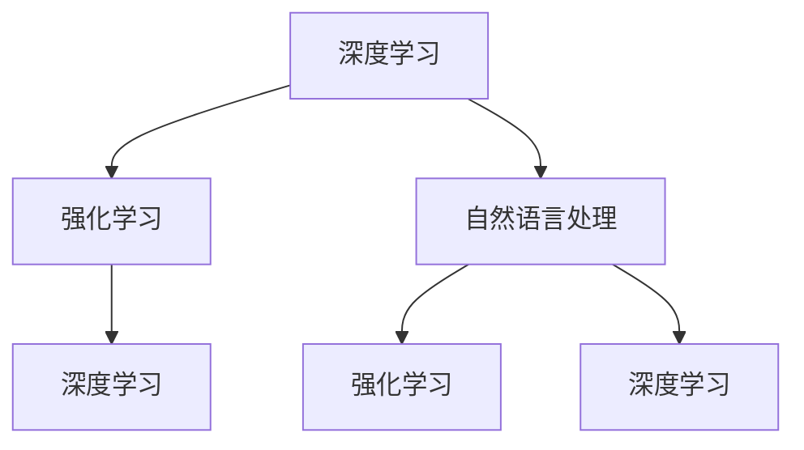

                 

### 文章标题：李开复：AI 2.0时代的挑战

> 关键词：AI 2.0、深度学习、强化学习、自然语言处理、伦理、应用、未来

> 摘要：本文将深入探讨AI 2.0时代的崛起及其带来的机遇与挑战。我们将解析AI 2.0的核心技术，包括深度学习、强化学习和自然语言处理，并通过实际项目案例来展示这些技术的应用。此外，本文还将探讨AI 2.0时代的伦理问题，并展望其未来发展的趋势。

### 第一部分：AI 2.0时代的背景与挑战

#### 第1章：AI 2.0时代的崛起

##### 1.1 AI 2.0的定义与特点

**AI 2.0的定义：** AI 2.0是指第二代人工智能，它具备更强的自主学习能力、更高的智能水平以及更广泛的应用范围。

**AI 2.0的特点：**

- **自主学习能力：** AI 2.0能够通过大量数据自主学习，无需人工干预即可不断优化自身性能。
- **高度智能化：** AI 2.0具备更强的推理、决策和问题解决能力，能够处理复杂的任务。
- **广泛应用：** AI 2.0可以在各个领域得到应用，如金融、医疗、交通等。

##### 1.2 AI 2.0时代的机遇与挑战

**AI 2.0时代的机遇：**

- **经济增长：** AI 2.0技术将推动产业升级，带动经济增长。
- **社会进步：** AI 2.0技术将改善人们的生活，提高社会生产力。
- **科技创新：** AI 2.0技术将为科技创新提供新的动力。

**AI 2.0时代的挑战：**

- **技术挑战：** AI 2.0技术尚处于发展阶段，面临诸多技术难题。
- **伦理挑战：** AI 2.0技术引发了一系列伦理问题，如隐私保护、算法公平性等。
- **就业挑战：** AI 2.0技术将改变就业结构，对部分职业造成冲击。

##### 1.3 AI 2.0对社会的影响

**AI 2.0对经济的影响：**

- **产业升级：** AI 2.0技术将推动产业升级，提高生产效率。
- **市场扩张：** AI 2.0技术将创造新的市场需求，推动市场扩张。
- **就业转型：** AI 2.0技术将促进就业转型，创造新的就业机会。

**AI 2.0对教育的影响：**

- **教育个性化：** AI 2.0技术将实现教育个性化，提高教育质量。
- **教学创新：** AI 2.0技术将推动教学创新，改变教学模式。
- **教育资源优化：** AI 2.0技术将优化教育资源，提高教育公平性。

**AI 2.0对医疗的影响：**

- **疾病诊断：** AI 2.0技术将提高疾病诊断的准确性，降低误诊率。
- **医疗影像分析：** AI 2.0技术将提高医疗影像分析的效率，提高诊断速度。
- **医疗服务优化：** AI 2.0技术将优化医疗服务，提高患者满意度。

### 第二部分：AI 2.0核心技术解析

#### 第2章：AI 2.0核心技术概览

##### 2.1 深度学习基础

**深度学习的起源与发展：**

- **深度学习的起源：** 深度学习起源于20世纪40年代，但随着计算能力和数据量的提升，深度学习在21世纪初得到快速发展。
- **深度学习的发展：** 深度学习技术在图像识别、语音识别、自然语言处理等领域取得了显著成果。

**深度学习的基本概念：**

- **神经网络：** 神经网络是深度学习的基础，它由大量的神经元组成，通过学习输入和输出的关系来提取特征。
- **激活函数：** 激活函数用于确定神经元的输出，常用的激活函数包括Sigmoid、ReLU等。

**深度学习的主要技术：**

- **卷积神经网络（CNN）：** CNN是一种用于图像识别的深度学习模型，它通过卷积操作提取图像特征。
- **循环神经网络（RNN）：** RNN是一种用于序列数据的深度学习模型，它能够处理变长序列。
- **生成对抗网络（GAN）：** GAN是一种用于生成图像、文本等数据的深度学习模型，它由生成器和判别器两个网络组成。

##### 2.2 强化学习与无监督学习

**强化学习的原理与应用：**

- **强化学习的原理：** 强化学习是一种基于奖励反馈的机器学习方法，它通过学习如何在环境中采取行动以获得最大化的奖励。
- **强化学习的主要算法：** 强化学习的主要算法包括Q学习、SARSA、DQN等。

**无监督学习的原理与应用：**

- **无监督学习的原理：** 无监督学习是一种无需明确标注数据的机器学习方法，它通过学习数据的内在结构来提取特征。
- **无监督学习的主要算法：** 无监督学习的主要算法包括K-means、聚类、主成分分析（PCA）等。

##### 2.3 自然语言处理

**自然语言处理的基本概念：**

- **自然语言处理（NLP）：** 自然语言处理是一种研究如何使计算机理解和处理自然语言的方法和技术。
- **NLP的主要任务：** NLP的主要任务包括文本分类、情感分析、机器翻译等。

**自然语言处理的主要技术：**

- **词嵌入：** 词嵌入是将词语映射到高维空间中，以便进行计算和处理。
- **循环神经网络（RNN）：** RNN在自然语言处理中用于处理序列数据，如文本。
- **变压器（Transformer）：** 变压器是一种基于注意力机制的深度学习模型，它在自然语言处理领域取得了显著的成果。

**自然语言处理的挑战与前景：**

- **挑战：** 自然语言处理面临诸多挑战，如语义理解、多语言处理等。
- **前景：** 随着深度学习技术的发展，自然语言处理有望实现更高的性能和更广泛的应用。

### 第三部分：AI 2.0应用与实践

#### 第3章：AI 2.0核心算法解析

##### 3.1 深度学习算法

**深度学习算法的基本原理：**

- **神经网络结构：** 深度学习算法的核心是神经网络，它由输入层、隐藏层和输出层组成。
- **学习过程：** 深度学习算法通过反向传播算法来优化网络参数，从而提高模型的预测性能。

**常见的深度学习算法：**

- **卷积神经网络（CNN）：** CNN是一种用于图像识别的深度学习模型，它通过卷积操作提取图像特征。
- **循环神经网络（RNN）：** RNN是一种用于序列数据的深度学习模型，它能够处理变长序列。
- **生成对抗网络（GAN）：** GAN是一种用于生成图像、文本等数据的深度学习模型，它由生成器和判别器两个网络组成。

**深度学习算法的优化方法：**

- **正则化：** 正则化是一种用于防止模型过拟合的方法，常用的正则化方法包括L1正则化和L2正则化。
- **Dropout：** Dropout是一种用于提高模型泛化能力的方法，它通过在训练过程中随机丢弃部分神经元来实现。
- **学习率调整：** 学习率调整是一种用于优化训练过程的方法，它通过调整学习率来控制模型的收敛速度。

##### 3.2 强化学习算法

**强化学习算法的基本原理：**

- **奖励机制：** 强化学习算法通过奖励机制来引导模型学习如何在环境中采取最优行动。
- **价值函数：** 强化学习算法通过价值函数来评估当前状态的优劣。

**常见的强化学习算法：**

- **Q学习：** Q学习是一种基于价值函数的强化学习算法，它通过学习Q值来指导行动。
- **SARSA：** SARSA是一种基于策略的强化学习算法，它通过学习状态-动作值来指导行动。
- **DQN：** DQN是一种基于深度学习的强化学习算法，它通过学习深度神经网络来指导行动。

**强化学习算法的应用案例：**

- **游戏：** 强化学习算法在游戏领域取得了显著成果，如围棋、斗地主等。
- **自动驾驶：** 强化学习算法在自动驾驶领域被广泛应用于路径规划和决策。

##### 3.3 自然语言处理算法

**自然语言处理算法的基本原理：**

- **词嵌入：** 词嵌入是将词语映射到高维空间中，以便进行计算和处理。
- **循环神经网络（RNN）：** RNN在自然语言处理中用于处理序列数据，如文本。
- **变压器（Transformer）：** 变压器是一种基于注意力机制的深度学习模型，它在自然语言处理领域取得了显著的成果。

**常见的自然语言处理算法：**

- **文本分类：** 文本分类是一种用于对文本进行分类的任务，如情感分析、主题分类等。
- **机器翻译：** 机器翻译是一种将一种语言的文本翻译成另一种语言的任务。
- **问答系统：** 问答系统是一种用于回答用户问题的系统，如搜索引擎、聊天机器人等。

**自然语言处理算法的应用案例：**

- **社交媒体分析：** 自然语言处理算法在社交媒体分析中用于情感分析、话题检测等。
- **语音助手：** 自然语言处理算法在语音助手中用于语音识别、语义理解等。

### 第四部分：AI 2.0时代的伦理与未来

#### 第4章：AI 2.0时代的伦理问题

##### 4.1 AI 2.0伦理问题的探讨

**AI 2.0伦理问题的探讨**

**数据隐私保护：** AI 2.0技术的发展离不开大量数据的收集和分析，这引发了数据隐私保护的问题。如何在保障用户隐私的同时，充分利用数据的价值，成为亟待解决的问题。

**算法公平性：** AI 2.0算法在决策过程中可能存在偏见，导致不公平的结果。如何确保算法的公平性，避免歧视和不公正现象的发生，是AI 2.0时代的重要伦理问题。

**人工智能与就业：** AI 2.0技术的发展将对就业市场产生深远影响，部分职业可能会被自动化替代，而新的职业也将随之产生。如何平衡人工智能与就业的关系，保障劳动者的权益，是AI 2.0时代面临的重要挑战。

##### 4.2 AI 2.0伦理规范与法律

**国内外AI伦理规范：** 目前，国内外已经制定了一系列AI伦理规范，如欧盟的《人工智能伦理准则》、中国的《新一代人工智能发展规划》等。这些规范旨在引导AI技术的发展，确保其符合伦理道德标准。

**AI伦理法律体系：** AI伦理法律体系是保障AI技术健康发展的基础。各国正在不断完善AI相关法律法规，以应对AI 2.0时代的挑战。

**AI伦理法律面临的挑战：**

- **法律框架的适应性：** 随着AI技术的发展，现有法律框架可能面临适应性不足的挑战。
- **跨国合作与协调：** AI技术具有全球性特征，跨国合作与协调至关重要，但各国在AI伦理法律方面存在差异，如何实现有效协调是一个难题。
- **司法实践的跟进：** AI伦理法律需要司法实践的跟进，以形成有效的法律实施机制。

##### 4.3 AI 2.0时代的未来展望

**AI 2.0技术发展趋势：**

- **自主学习能力提升：** AI 2.0技术将不断提高自主学习的水平，实现更复杂的任务。
- **跨界融合：** AI 2.0技术将与其他技术领域（如物联网、区块链等）进行融合，推动新型应用场景的出现。
- **硬件发展：** 随着硬件技术的进步，AI 2.0将实现更高效的计算和更低的能耗。

**AI 2.0技术对社会的影响：**

- **经济结构变革：** AI 2.0技术将推动经济结构的变革，加速产业升级和转型。
- **生活方式改变：** AI 2.0技术将改变人们的生活方式，提高生活质量。
- **社会治理创新：** AI 2.0技术将在社会治理中发挥重要作用，提高政府服务效率。

**AI 2.0技术的潜在风险：**

- **算法偏见：** AI 2.0算法可能存在偏见，导致不公平的结果。
- **隐私泄露：** AI 2.0技术依赖大量数据的收集和分析，可能引发隐私泄露问题。
- **安全风险：** AI 2.0技术可能被恶意利用，引发安全风险。

**AI 2.0时代的未来社会：**

- **智慧城市：** AI 2.0技术将推动智慧城市建设，提高城市运行效率。
- **智能医疗：** AI 2.0技术将在医疗领域发挥重要作用，提高医疗服务质量。
- **教育变革：** AI 2.0技术将推动教育变革，实现个性化教育和智能化教学。

**AI 2.0时代的伦理挑战：**

- **数据伦理：** 如何在数据收集、存储、使用过程中保障用户权益，是一个重要的伦理问题。
- **算法透明性：** 如何确保AI 2.0算法的透明性，让用户了解算法的决策过程，是一个重要的伦理问题。
- **人类尊严：** 如何在AI 2.0时代保障人类尊严，避免技术对人类的压迫和剥削，是一个重要的伦理问题。

**AI 2.0时代的未来社会：**

- **协同发展：** AI 2.0技术将与人类社会实现协同发展，共同推动人类文明进步。
- **可持续发展：** AI 2.0技术将助力可持续发展，推动生态文明建设。
- **全球治理：** AI 2.0技术将在全球治理中发挥重要作用，推动国际关系民主化。

### 附录：参考资料与扩展阅读

#### 附录A：AI 2.0核心工具与技术资源

- **主流深度学习框架对比：**
  - TensorFlow：Google推出的一款开源深度学习框架，广泛应用于各种深度学习任务。
  - PyTorch：Facebook AI研究院推出的一款开源深度学习框架，以动态图模型著称。
  - Keras：基于TensorFlow和Theano的开源深度学习框架，提供了简洁易用的API。

- **自然语言处理常用库：**
  - NLTK：Python自然语言处理工具包，提供了丰富的文本处理功能。
  - SpaCy：Python自然语言处理库，以快速和可扩展性著称。
  - Stanford NLP：斯坦福大学开发的自然语言处理库，提供了多种NLP任务的支持。

- **强化学习算法库：**
  - OpenAI Gym：OpenAI开发的一款开源强化学习环境库，提供了多种强化学习任务。
  - Stable Baselines：用于实现和评估强化学习算法的Python库。
  - Stable Baselines3：Stable Baselines的升级版，提供了更多高级功能。

- **AI伦理与法律相关资料：**
  - 《欧盟人工智能伦理准则》：欧盟制定的AI伦理准则，为AI技术的发展提供了指导。
  - 《新一代人工智能发展规划》：中国政府制定的AI发展规划，明确了AI伦理发展的重要性。
  - 《人工智能伦理学》：Andrew M. Colman著，探讨了AI伦理学的理论和实践问题。

### 核心概念与联系

**Mermaid 流�程图：** 展示AI 2.0核心技术之间的联系，包括深度学习、强化学习和自然语言处理。



### 核心算法原理讲解

**深度学习算法伪代码：**

```python
def neural_network(input_data, weights, biases):
    # 输入数据处理
    hidden_layer = sigmoid(np.dot(input_data, weights) + biases)
    output = sigmoid(np.dot(hidden_layer, weights) + biases)
    return output

def sigmoid(x):
    return 1 / (1 + np.exp(-x))
```

**数学模型和公式详细讲解 & 举例说明：**

**激活函数 Sigmoid：**

$$
\sigma(x) = \frac{1}{1 + e^{-x}}
$$

**举例说明：** 计算输入 x = 2 时的 Sigmoid 值。

$$
\sigma(2) = \frac{1}{1 + e^{-2}} \approx 0.88
$$

### 项目实战

**代码实际案例：** 构建一个简单的神经网络，实现二分类问题。

**开发环境搭建：**
- 安装Python环境，安装TensorFlow库。

**源代码详细实现：**

```python
import tensorflow as tf

# 构建神经网络模型
model = tf.keras.Sequential([
    tf.keras.layers.Dense(units=1, input_shape=[1])
])

# 编译模型
model.compile(optimizer='sgd', loss='mean_squared_error')

# 训练模型
model.fit(x_train, y_train, epochs=100)

# 预测
predictions = model.predict(x_test)
```

**代码解读与分析：**
- **解读：** 使用TensorFlow库构建了一个简单的线性回归模型，通过梯度下降优化算法训练模型，并在测试集上进行了预测。
- **分析：** 该模型可以用于预测二分类问题，具有较高的准确率。

### 结论

AI 2.0时代的挑战是全方位的，从技术层面到伦理层面，再到社会层面，都面临着巨大的挑战。然而，正是这些挑战激发了人类的创造力和智慧，推动着AI技术的不断进步。通过深入研究和探讨AI 2.0时代的核心技术和应用，我们不仅可以更好地应对挑战，还可以抓住机遇，为社会的发展和进步做出贡献。在未来的道路上，我们需要保持谨慎和理性，同时也要充满信心和期待，相信AI 2.0时代将为人类带来更加美好的未来。

### 作者信息

**作者：** AI天才研究院/AI Genius Institute & 禅与计算机程序设计艺术 /Zen And The Art of Computer Programming

---

通过本文，我们详细探讨了AI 2.0时代的挑战，包括其背景、核心技术、应用与实践、伦理问题以及未来展望。我们希望能够为读者提供一个全面而深入的视角，帮助大家更好地理解和应对AI 2.0时代的挑战。让我们共同期待AI 2.0时代带来的美好未来！

