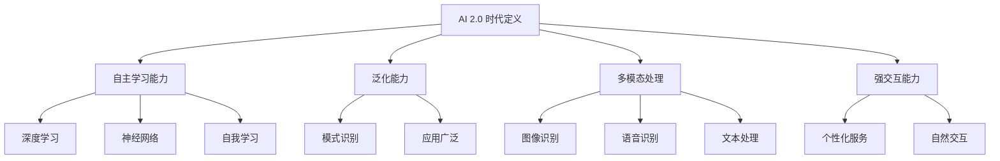
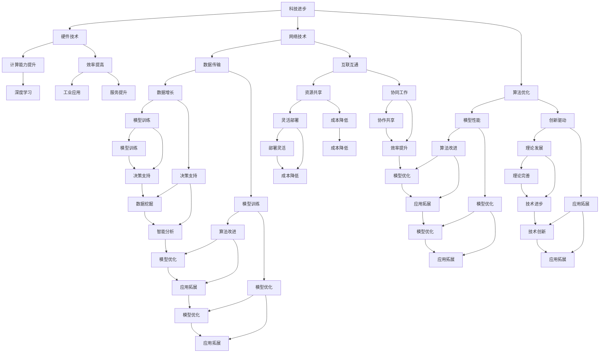
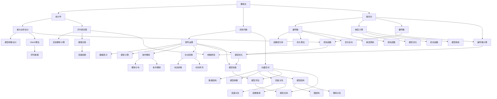
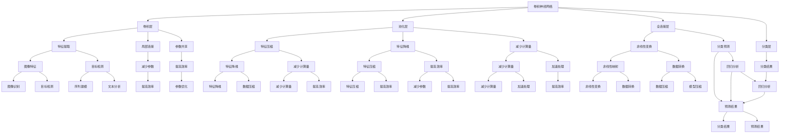
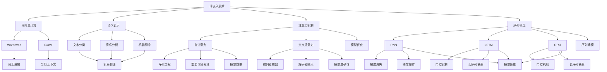
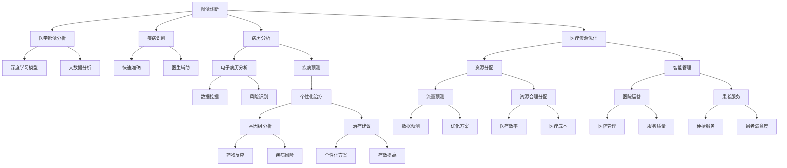
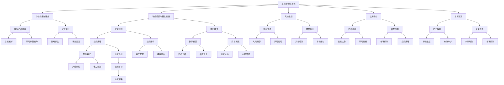
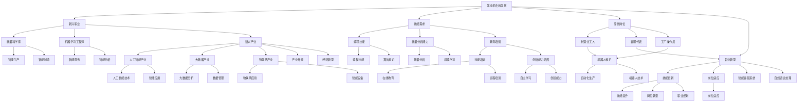
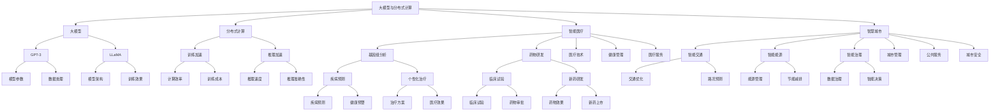

```mermaid
graph TD
    A[隐私保护] --> B[数据加密]
    A --> C[匿名化]
    A --> D[数据脱敏]
    B --> E[数据传输安全]
    B --> F[数据存储安全]
    C --> G[隐私增强]
    C --> H[数据泄露风险降低]
    D --> I[数据安全性]
    D --> J[数据隐私保护]
    E --> K[网络安全]
    E --> L[数据完整性]
    F --> M[数据保护法规]
    F --> N[合规性要求]
    G --> O[隐私保护法律]
    G --> P[隐私政策]
    H --> Q[隐私增强技术]
    H --> R[隐私保护策略]
    I --> S[数据加密技术]
    I --> T[数据脱敏技术]
    J --> U[隐私保护法律]
    J --> V[隐私保护政策]
    K --> W[数据传输安全]
    K --> X[网络安全]
    L --> Y[数据完整性]
    L --> Z[数据可用性]
    M --> AA[数据保护法规]
    M --> BB[数据安全法规]
    N --> CC[合规性要求]
    N --> DD[监管要求]
    O --> EE[隐私保护法律]
    O --> FF[隐私政策]
    P --> GG[隐私保护政策]
    P --> HH[隐私保护规范]
    Q --> II[隐私增强技术]
    Q --> JJ[隐私保护技术]
    R --> KK[隐私保护策略]
    R --> LL[隐私保护方案]
    S --> MM[数据加密算法]
    S --> NN[数据加密协议]
    T --> OO[数据脱敏算法]
    T --> PP[数据脱敏协议]
    U --> QQ[隐私保护法律]
    U --> RR[隐私保护规范]
    V --> SS[隐私保护政策]
    V --> TT[隐私保护措施]
    W --> UU[数据传输安全]
    W --> XX[数据保护协议]
    X --> YY[网络安全法规]
    X --> ZZ[网络安全策略]
    Y --> AAA[数据完整性法律]
    Y --> BBB[数据完整性协议]
    Y --> CCC[数据可用性法律]
    Y --> DDD[数据可用性协议]
    Z --> EEE[数据可用性技术]
    Z --> FFF[数据可用性策略]
```
                 

---

## 文章标题: 李开复：AI 2.0 时代的未来展望

关键词：人工智能、AI 2.0、深度学习、神经网络、自然语言处理、应用场景、未来展望

摘要：本文由世界著名人工智能专家李开复撰写，全面探讨了AI 2.0时代的起源、发展、核心技术、应用场景以及未来展望。通过深入剖析AI 2.0的核心技术，如数学基础、深度学习与神经网络原理、自然语言处理技术等，本文为读者展现了一幅AI 2.0时代的宏伟蓝图。

---

### 《李开复：AI 2.0 时代的未来展望》目录大纲

#### 第一部分: AI 2.0 时代概述

- 第1章: AI 2.0 时代的起源与发展
  - 1.1 AI 2.0 时代的定义与特点
  - 1.2 AI 2.0 时代的背景分析

- 第2章: AI 2.0 核心技术解析
  - 2.1 人工智能的数学基础
  - 2.2 深度学习与神经网络原理
  - 2.3 自然语言处理技术

- 第3章: AI 2.0 在各个领域的应用
  - 3.1 AI 2.0 在医疗健康领域的应用
  - 3.2 AI 2.0 在金融行业的应用
  - 3.3 AI 2.0 在智能制造领域的应用

- 第4章: AI 2.0 时代的未来展望
  - 4.1 AI 2.0 时代的伦理与法律问题
  - 4.2 AI 2.0 对社会与经济的影响
  - 4.3 AI 2.0 的未来发展前景

- 附录

---

### 第一部分: AI 2.0 时代概述

#### 第1章: AI 2.0 时代的起源与发展

**1.1 AI 2.0 时代的定义与特点**

AI 2.0时代，也被称为深度学习和智能时代，是继AI 1.0（规则驱动）时代之后的新阶段。AI 2.0以深度学习为核心，通过模仿人脑神经元结构和信息处理方式，实现更高效、更智能的机器学习。

**AI 2.0 时代的特点：**

- **自主学习能力：** AI 2.0能够通过大量数据进行自我学习和优化，不需要显式编程规则。
- **泛化能力：** AI 2.0模型在训练数据上的表现可以推广到未知数据，提高模型的鲁棒性。
- **多模态处理：** AI 2.0能够处理多种类型的数据，如图像、声音和文本。
- **强交互能力：** AI 2.0与用户或其他系统可以更加自然地交互，提供更贴心的服务。

**1.2 AI 2.0 时代的背景分析**

AI 2.0时代的到来，得益于以下几个关键因素的推动：

- **计算能力的提升：** 随着硬件技术的发展，计算能力大幅提升，为深度学习提供了强大的计算支持。
- **大数据的爆发：** 数据量的爆发式增长为AI提供了丰富的训练素材，使模型更加精准和有效。
- **云计算的普及：** 云计算提供了大规模的数据存储和计算资源，降低了AI模型的开发和部署成本。
- **深度学习的突破：** 深度学习理论和技术取得了重大突破，使得AI在语音识别、图像识别等任务上实现了飞跃。

---

**1.1 AI 2.0 时代的定义与特点**

AI 2.0时代的定义是基于深度学习和神经网络的智能时代，它标志着人工智能技术进入了一个新的发展阶段。在这个时代，人工智能系统不再仅仅依赖于预定义的规则和算法，而是通过自我学习和适应来提高性能。

**AI 2.0 时代的特点：**

- **自主学习能力：** AI 2.0系统可以通过大量的数据进行自我学习，不断优化模型。这种自主学习能力使得AI系统能够在复杂的环境中适应和进化，而不需要显式编程规则。

- **泛化能力：** 与传统的机器学习模型相比，AI 2.0具有更强的泛化能力。这意味着AI系统能够在训练数据之外的场景中保持良好的性能，能够处理更广泛的应用问题。

- **多模态处理：** AI 2.0能够处理多种类型的数据，如图像、声音和文本。这种多模态处理能力使得AI系统能够更好地理解和模拟人类的行为和思维。

- **强交互能力：** AI 2.0系统与用户或其他系统之间的交互变得更加自然和紧密。这种强交互能力使得AI系统能够提供更加贴心和个性化的服务。

**核心概念与联系**

- **深度学习（Deep Learning）：** 是AI 2.0时代的基础，通过构建多层神经网络，对数据进行逐层提取特征，从而实现复杂模式的识别。
- **神经网络（Neural Network）：** 是模拟人脑神经元结构和功能的计算模型，通过调整神经元之间的连接权重，实现数据的处理和模式的识别。
- **自我学习（Self-Learning）：** 是AI 2.0系统的重要特性，通过不断积累经验和数据，自我调整和优化，提高系统的性能。

**架构Mermaid流程图**



**核心算法原理讲解伪代码**

```python
# 定义神经网络结构
layers = [
    Layer(input_size=784, output_size=128, activation='ReLU'),
    Layer(input_size=128, output_size=64, activation='ReLU'),
    Layer(input_size=64, output_size=10, activation='Softmax')
]

# 定义损失函数
loss_function = CrossEntropyLoss()

# 定义优化器
optimizer = AdamOptimizer(parameters)

# 前向传播
def forward_pass(inputs):
    for layer in layers:
        inputs = layer.forward(inputs)
    return inputs

# 反向传播
def backward_pass(d_inputs):
    d_outputs = loss_function.backward(layers[-1].outputs, d_inputs)
    for layer in reversed(layers):
        d_inputs, d_outputs = layer.backward(d_outputs)
    return d_inputs

# 训练神经网络
for epoch in range(num_epochs):
    for inputs, targets in dataset:
        # 前向传播
        outputs = forward_pass(inputs)
        
        # 计算损失
        loss = loss_function.compute(outputs, targets)
        
        # 反向传播
        d_inputs = backward_pass(d_inputs)
        
        # 更新参数
        optimizer.update_parameters()
```

**数学模型和数学公式讲解**

- **深度学习的基本结构：**

  $$ f(x) = \sigma(\theta^{[L]} W^{[L]} \sigma(\theta^{[L-1]} W^{[L-1]} \cdots \sigma(\theta^{[2]} W^{[2]} \theta^{[1]} W^{[1]} x) $$

  其中，\( \sigma \) 表示激活函数，\( \theta^{[l]} \) 和 \( W^{[l]} \) 分别表示第 \( l \) 层的权重和偏置。

- **反向传播算法：**

  $$ \frac{\partial J}{\partial \theta^{[l]}} = \frac{\partial J}{\partial z^{[l+1]}} \cdot \frac{\partial z^{[l+1]}}{\partial \theta^{[l]}} $$

  其中，\( J \) 表示损失函数，\( z^{[l+1]} \) 和 \( \theta^{[l]} \) 分别表示第 \( l+1 \) 层的输出和权重。

**举例说明**

假设有一个简单的神经网络，包含两个输入层、两个隐藏层和一个输出层。输入数据为 \( (x_1, x_2) \)，输出为 \( y \)。网络的结构如下：

- 输入层：\( x_1, x_2 \)
- 第一隐藏层：\( z_1, z_2 \)
- 第二隐藏层：\( z_3, z_4 \)
- 输出层：\( y \)

假设激活函数为 \( \sigma(z) = \frac{1}{1 + e^{-z}} \)，损失函数为 \( J = \frac{1}{2} \sum_{i=1}^{n} (y_i - \hat{y}_i)^2 \)。

1. **前向传播：**

   - 输入数据 \( (x_1, x_2) \)
   - 第一隐藏层输出：\( z_1 = \sigma(W_1^T x_1 + b_1) \)，\( z_2 = \sigma(W_2^T x_2 + b_2) \)
   - 第二隐藏层输出：\( z_3 = \sigma(W_3^T z_1 + b_3) \)，\( z_4 = \sigma(W_4^T z_2 + b_4) \)
   - 输出层输出：\( \hat{y} = \sigma(W_5^T z_3 + b_5) \)

2. **反向传播：**

   - 计算输出误差：\( \delta_5 = (y - \hat{y}) \odot \sigma'(W_5^T z_3 + b_5) \)
   - 计算第二隐藏层误差：\( \delta_4 = (W_5 \delta_5) \odot \sigma'(W_4^T z_2 + b_4) \)
   - 计算第一隐藏层误差：\( \delta_3 = (W_4 \delta_4) \odot \sigma'(W_3^T z_1 + b_3) \)，\( \delta_2 = (W_3 \delta_3) \odot \sigma'(W_2^T z_2 + b_2) \)
   - 更新权重和偏置：\( \theta_5 := \theta_5 - \alpha \frac{\partial J}{\partial \theta_5} \)，\( b_5 := b_5 - \alpha \frac{\partial J}{\partial b_5} \)，依次类推。

---

**1.2 AI 2.0 时代的背景分析**

AI 2.0时代的背景是由一系列关键因素共同推动的。这些因素包括科技进步、社会需求、数据增长和计算能力的提升等。

**科技进步推动AI 2.0发展**

- **硬件技术：** 随着硬件技术的进步，特别是GPU和TPU等专用计算设备的出现，为深度学习算法提供了强大的计算支持。
- **网络技术：** 网络技术的发展，特别是5G网络的普及，使得数据传输速度大幅提升，为大规模数据分析和处理提供了便利。
- **算法优化：** 算法优化，如自适应梯度下降、激活函数改进和卷积神经网络结构优化等，提高了深度学习模型的性能。

**社会需求推动AI 2.0应用**

- **工业需求：** 人工智能在制造业、服务业等领域的应用，提高了生产效率和服务质量，降低了成本。
- **医疗需求：** 人工智能在医疗领域的应用，如疾病诊断、药物研发等，提高了医疗服务的效率和准确性。
- **金融需求：** 人工智能在金融领域的应用，如风险管理、个性化投资建议等，提高了金融服务的效率和安全性。

**数据爆炸与云计算对AI 2.0的促进作用**

- **数据增长：** 随着互联网和物联网的发展，数据量呈爆炸式增长，为深度学习提供了丰富的训练素材。
- **云计算：** 云计算提供了大规模的数据存储和计算资源，降低了AI模型的开发和部署成本，推动了AI 2.0的发展。

**核心概念与联系**

- **硬件技术：** 硬件技术是AI 2.0发展的重要支撑，决定了模型的计算能力和效率。
- **网络技术：** 网络技术是数据传输和共享的基础，决定了AI系统的互联互通。
- **算法优化：** 算法优化是提高模型性能的关键，推动了AI技术的不断创新。
- **社会需求：** 社会需求是AI 2.0应用的驱动力，决定了AI技术的实际价值。
- **数据增长：** 数据增长为AI提供了丰富的训练素材，提高了模型的准确性和泛化能力。
- **云计算：** 云计算提供了灵活的计算资源和高效的部署方式，降低了AI技术的门槛。

**架构Mermaid流程图**



**核心算法原理讲解伪代码**

```python
# 定义深度学习模型
model = build_model(input_shape)

# 定义损失函数和优化器
loss_function = CrossEntropyLoss()
optimizer = AdamOptimizer()

# 前向传播
def forward_pass(inputs):
    outputs = model.forward(inputs)
    loss = loss_function.compute(outputs, targets)
    return loss

# 反向传播
def backward_pass(d_inputs):
    d_outputs = loss_function.backward(outputs, d_inputs)
    d_inputs = model.backward(d_outputs)
    return d_inputs

# 训练模型
for epoch in range(num_epochs):
    for inputs, targets in dataset:
        # 前向传播
        loss = forward_pass(inputs)
        
        # 反向传播
        d_inputs = backward_pass(d_inputs)
        
        # 更新参数
        optimizer.update_parameters()
```

**数学模型和数学公式讲解**

- **深度学习模型的前向传播：**

  $$ y = f(z) = \sigma(Wx + b) $$

  其中，\( f \) 表示激活函数，\( \sigma \) 表示ReLU函数，\( W \) 表示权重矩阵，\( b \) 表示偏置项，\( x \) 表示输入向量。

- **深度学习模型的反向传播：**

  $$ \frac{\partial J}{\partial W} = \frac{\partial J}{\partial z} \cdot \frac{\partial z}{\partial W} = (y - \hat{y}) \cdot \frac{\partial \sigma(z)}{\partial z} \cdot x $$

  其中，\( J \) 表示损失函数，\( \hat{y} \) 表示预测输出，\( y \) 表示真实输出，\( z \) 表示前向传播的输出。

**举例说明**

假设有一个简单的深度学习模型，包含一个输入层、一个隐藏层和一个输出层。输入数据为 \( (x_1, x_2) \)，输出为 \( y \)。网络的结构如下：

- 输入层：\( x_1, x_2 \)
- 隐藏层：\( z \)
- 输出层：\( y \)

假设激活函数为 \( \sigma(z) = \max(0, z) \)，损失函数为 \( J = \frac{1}{2} \sum_{i=1}^{n} (y_i - \hat{y}_i)^2 \)。

1. **前向传播：**

   - 输入数据 \( (x_1, x_2) \)
   - 隐藏层输出：\( z = \max(0, W_1 x_1 + W_2 x_2 + b) \)
   - 输出层输出：\( \hat{y} = \max(0, W_2 z + b) \)

2. **反向传播：**

   - 计算输出误差：\( \delta_y = \hat{y} - y \)
   - 计算隐藏层误差：\( \delta_z = W_2 \delta_y \cdot \sigma'(z) \)
   - 更新权重和偏置：\( W_1 := W_1 - \alpha \cdot \delta_z \cdot x_1 \)，\( W_2 := W_2 - \alpha \cdot \delta_z \cdot z \)，\( b := b - \alpha \cdot \delta_z \)

---

### 第二部分: AI 2.0 核心技术解析

#### 第2章: AI 2.0 核心技术解析

**2.1 人工智能的数学基础**

人工智能（AI）的发展离不开数学的支持，尤其是在概率论、统计学、线性代数和微积分等领域。这些数学工具为构建和优化机器学习模型提供了坚实的基础。

**2.1.1 概率论与统计学基础**

概率论是研究随机事件及其概率的数学分支。在机器学习中，概率论用于描述数据的不确定性，并建立模型预测数据的概率分布。

- **贝叶斯定理**：贝叶斯定理描述了在已知某些条件概率的情况下，如何计算后验概率。公式为：

  $$ P(A|B) = \frac{P(B|A)P(A)}{P(B)} $$

  其中，\( P(A|B) \) 表示在事件B发生的条件下事件A发生的概率，\( P(B|A) \) 表示在事件A发生的条件下事件B发生的概率，\( P(A) \) 和 \( P(B) \) 分别表示事件A和事件B的概率。

- **最大似然估计**：最大似然估计是一种用于估计模型参数的方法。其基本思想是寻找一组参数，使得给定数据在模型下的概率最大。公式为：

  $$ \hat{\theta} = \arg\max_{\theta} P(X|\theta) $$

  其中，\( \hat{\theta} \) 表示估计的参数值，\( X \) 表示观测数据。

**2.1.2 线性代数与微积分基础**

线性代数和微积分是机器学习中常用的数学工具。线性代数用于处理矩阵和向量，微积分则用于描述函数的变化和优化。

- **矩阵运算**：矩阵运算包括矩阵加法、矩阵乘法、矩阵求逆等。这些运算在机器学习中用于表示数据结构和计算模型。

- **向量空间**：向量空间是一组向量的集合，它具有向量加法和标量乘法等运算。在机器学习中，向量空间用于表示数据特征和模型参数。

- **微积分**：微积分用于研究函数的变化率和极值。在机器学习中，微积分用于计算损失函数的梯度，以优化模型参数。

- **偏导数**：偏导数是微积分中的一个重要概念，用于描述函数对某个变量的变化率。在机器学习中，偏导数用于计算损失函数对模型参数的梯度。

**2.1.3 概率图模型与贝叶斯网络**

概率图模型是一种基于图结构表示概率关系的数学模型。贝叶斯网络是概率图模型的一种，它通过有向无环图表示变量之间的条件依赖关系。

- **贝叶斯网络**：贝叶斯网络由节点和边组成，每个节点表示一个随机变量，边表示变量之间的条件依赖关系。贝叶斯网络用于推理和预测，通过条件概率表计算变量之间的概率分布。

- **马尔可夫链**：马尔可夫链是一种无记忆的随机过程，用于描述状态转移的概率。在机器学习中，马尔可夫链用于序列建模和预测。

**核心概念与联系**

- **概率论与统计学**：概率论和统计学是机器学习的基石，用于描述数据的不确定性和建立模型。

- **线性代数与微积分**：线性代数和微积分用于处理数据和计算模型，是实现机器学习算法的基础。

- **概率图模型与贝叶斯网络**：概率图模型和贝叶斯网络用于表示变量之间的概率关系，是实现复杂推理和预测的重要工具。

**架构Mermaid流程图**



**核心算法原理讲解伪代码**

```python
# 概率论与统计学基础
def likelihood(data, parameters):
    # 计算数据的似然函数
    pass

def maximize_likelihood(data):
    # 寻找使似然函数最大的参数
    pass

def bayes_theorem(prior, likelihood, evidence):
    # 计算后验概率
    pass

# 线性代数与微积分基础
def matrix_multiply(A, B):
    # 计算矩阵乘法
    pass

def vector_addition(v1, v2):
    # 计算向量加法
    pass

def gradient_descent(parameters, gradients, learning_rate):
    # 计算梯度下降更新参数
    pass

# 概率图模型与贝叶斯网络
def construct_bayesian_network(variables, dependencies):
    # 构建贝叶斯网络
    pass

def viterbi_algorithm(observations, states, transition_probabilities, emission_probabilities):
    # 计算Viterbi算法
    pass
```

**数学模型和数学公式讲解**

- **最大似然估计：**

  $$ \hat{\theta} = \arg\max_{\theta} P(X|\theta) $$

  其中，\( \hat{\theta} \) 表示估计的参数值，\( X \) 表示观测数据，\( P(X|\theta) \) 表示在参数\( \theta \)下观测数据\( X \)的概率。

- **贝叶斯定理：**

  $$ P(A|B) = \frac{P(B|A)P(A)}{P(B)} $$

  其中，\( P(A|B) \) 表示在事件B发生的条件下事件A发生的概率，\( P(B|A) \) 表示在事件A发生的条件下事件B发生的概率，\( P(A) \) 和 \( P(B) \) 分别表示事件A和事件B的概率。

- **矩阵运算：**

  $$ C = A \cdot B $$

  其中，\( C \) 表示矩阵乘法的结果，\( A \) 和 \( B \) 分别表示两个矩阵。

- **梯度下降：**

  $$ \theta = \theta - \alpha \cdot \nabla_{\theta} J(\theta) $$

  其中，\( \theta \) 表示参数，\( \alpha \) 表示学习率，\( \nabla_{\theta} J(\theta) \) 表示损失函数对参数的梯度。

**举例说明**

假设有一个二分类问题，数据集包含\( n \)个样本，每个样本包含特征向量\( x \)和标签\( y \)，其中\( y \in \{0, 1\} \)。我们需要使用最大似然估计来估计模型参数。

1. **似然函数：**

   $$ L(\theta) = \prod_{i=1}^{n} P(y_i|x_i ; \theta) $$

   其中，\( \theta \) 表示模型参数。

2. **对数似然函数：**

   $$ \ln L(\theta) = \sum_{i=1}^{n} \ln P(y_i|x_i ; \theta) $$

3. **最大化似然函数：**

   $$ \hat{\theta} = \arg\max_{\theta} \ln L(\theta) $$

4. **参数估计：**

   使用梯度下降法对参数进行迭代更新，直到收敛。

   $$ \theta = \theta - \alpha \cdot \nabla_{\theta} \ln L(\theta) $$

---

**2.2 深度学习与神经网络原理**

深度学习是AI 2.0时代的重要基石，其核心是神经网络。神经网络通过模拟人脑神经元的工作方式，实现对数据的自动特征学习和模式识别。

**2.2.1 神经网络的基本结构**

神经网络由多个层次组成，包括输入层、隐藏层和输出层。每个层次包含多个神经元，神经元之间通过连接（权重）进行信息传递。

- **输入层**：接收外部输入数据，例如图像、文本或数值数据。
- **隐藏层**：对输入数据进行特征提取和变换，提取出有用的信息。
- **输出层**：生成最终输出，如分类结果、回归值或预测概率。

**2.2.2 反向传播算法**

反向传播算法是深度学习中的核心算法，用于训练神经网络。它通过计算损失函数对每个神经元的梯度，并沿着网络结构反向传播，以更新权重和偏置。

**算法步骤：**

1. **前向传播**：计算网络输出，并计算损失函数。
2. **反向传播**：计算每个神经元的梯度，并更新权重和偏置。
3. **迭代更新**：重复前向传播和反向传播，直至网络收敛。

**核心算法原理讲解伪代码**

```python
# 定义神经网络结构
layers = [
    Layer(input_size=784, output_size=128, activation='ReLU'),
    Layer(input_size=128, output_size=64, activation='ReLU'),
    Layer(input_size=64, output_size=10, activation='Softmax')
]

# 定义损失函数
loss_function = CrossEntropyLoss()

# 定义优化器
optimizer = AdamOptimizer(parameters)

# 前向传播
def forward_pass(inputs):
    for layer in layers:
        inputs = layer.forward(inputs)
    return inputs

# 反向传播
def backward_pass(d_inputs):
    d_outputs = loss_function.backward(layers[-1].outputs, d_inputs)
    for layer in reversed(layers):
        d_inputs, d_outputs = layer.backward(d_outputs)
    return d_inputs

# 训练神经网络
for epoch in range(num_epochs):
    for inputs, targets in dataset:
        # 前向传播
        outputs = forward_pass(inputs)
        
        # 计算损失
        loss = loss_function.compute(outputs, targets)
        
        # 反向传播
        d_inputs = backward_pass(d_inputs)
        
        # 更新参数
        optimizer.update_parameters()
```

**数学模型和数学公式讲解**

- **损失函数**：

  $$ J(\theta) = -\frac{1}{m} \sum_{i=1}^{m} y^{(i)} \ln(a^{(L)}_{i}) + (1 - y^{(i)}) \ln(1 - a^{(L)}_{i}) $$

  其中，\( J(\theta) \) 表示损失函数，\( m \) 表示样本数量，\( a^{(L)}_{i} \) 表示第 \( i \) 个样本在输出层的激活值，\( y^{(i)} \) 表示第 \( i \) 个样本的真实标签。

- **反向传播算法**：

  $$ \frac{\partial J(\theta)}{\partial \theta^{(l)}_{ij}} = \frac{\partial L}{\partial z^{(l+1)}_{i}} \cdot \frac{\partial z^{(l+1)}_{i}}{\partial \theta^{(l)}_{ij}} $$

  其中，\( \theta^{(l)}_{ij} \) 表示第 \( l \) 层的第 \( i \) 个神经元到第 \( j \) 个神经元的权重，\( z^{(l+1)}_{i} \) 表示第 \( l+1 \) 层的第 \( i \) 个神经元的输入。

**举例说明**

假设有一个简单的神经网络，包含一个输入层、一个隐藏层和一个输出层。输入数据为 \( (x_1, x_2) \)，输出为 \( y \)。网络的结构如下：

- 输入层：\( x_1, x_2 \)
- 隐藏层：\( z_1, z_2 \)
- 输出层：\( y \)

假设激活函数为 \( \sigma(z) = \frac{1}{1 + e^{-z}} \)，损失函数为 \( J = \frac{1}{2} \sum_{i=1}^{n} (y_i - \hat{y}_i)^2 \)。

1. **前向传播**：

   - 输入数据 \( (x_1, x_2) \)
   - 隐藏层输出：\( z_1 = \sigma(W_1^T x_1 + b_1) \)，\( z_2 = \sigma(W_2^T x_2 + b_2) \)
   - 输出层输出：\( y = \sigma(W_3^T z_2 + b_3) \)

2. **反向传播**：

   - 计算输出误差：\( \delta_3 = (y - \hat{y}) \odot \sigma'(y) \)
   - 计算隐藏层误差：\( \delta_2 = (W_3 \delta_3) \odot \sigma'(z_2) \)
   - 更新权重和偏置：\( W_3 := W_3 - \alpha \cdot \delta_3 \cdot z_2^T \)，\( b_3 := b_3 - \alpha \cdot \delta_3 \)，\( W_2 := W_2 - \alpha \cdot \delta_2 \cdot z_1^T \)，\( b_2 := b_2 - \alpha \cdot \delta_2 \)

---

**2.2.3 深度学习架构与改进算法**

随着深度学习的发展，出现了许多改进的神经网络架构和算法。这些改进旨在提高模型的性能和效率，解决传统神经网络存在的问题。

- **卷积神经网络（CNN）**：卷积神经网络是深度学习在图像处理领域的重要应用。它通过卷积操作和池化操作提取图像的特征，实现图像分类、目标检测等任务。

- **循环神经网络（RNN）**：循环神经网络适用于序列数据处理，如自然语言处理和语音识别。RNN能够处理变长的序列数据，通过记忆状态捕获序列中的长期依赖关系。

- **长短时记忆网络（LSTM）**：长短时记忆网络是RNN的一种改进，能够解决传统RNN的梯度消失和梯度爆炸问题。LSTM通过门控机制控制信息的流入和流出，有效地捕获长序列依赖关系。

- **生成对抗网络（GAN）**：生成对抗网络由生成器和判别器组成，通过对抗训练生成真实数据的分布。GAN在图像生成、视频生成和风格迁移等领域表现出强大的能力。

- **变分自编码器（VAE）**：变分自编码器是一种无监督学习的生成模型，通过编码器和解码器学习数据的概率分布。VAE在图像去噪、图像生成和生成式模型应用中取得了良好的效果。

**核心概念与联系**

- **卷积神经网络**：卷积神经网络通过局部连接和参数共享实现高效的图像特征提取。
- **循环神经网络**：循环神经网络适用于处理序列数据，通过记忆状态捕获序列中的依赖关系。
- **长短时记忆网络**：长短时记忆网络是RNN的改进，解决梯度消失和梯度爆炸问题，有效地处理长序列依赖关系。
- **生成对抗网络**：生成对抗网络通过对抗训练生成真实数据的分布，实现图像生成和风格迁移。
- **变分自编码器**：变分自编码器通过编码器和解码器学习数据的概率分布，应用于图像去噪和生成。

**架构Mermaid流程图**



**核心算法原理讲解伪代码**

```python
# 卷积神经网络
class ConvolutionalLayer:
    def __init__(self, filter_size, num_filters):
        # 初始化卷积层参数
        pass
    
    def forward_pass(self, inputs):
        # 前向传播
        pass
    
    def backward_pass(self, d_inputs):
        # 反向传播
        pass

# 循环神经网络
class RNNLayer:
    def __init__(self, hidden_size):
        # 初始化循环层参数
        pass
    
    def forward_pass(self, inputs, hidden_state):
        # 前向传播
        pass
    
    def backward_pass(self, d_hidden_state):
        # 反向传播
        pass

# 长短时记忆网络
class LSTMLayer:
    def __init__(self, hidden_size):
        # 初始化长短时记忆层参数
        pass
    
    def forward_pass(self, inputs, hidden_state, cell_state):
        # 前向传播
        pass
    
    def backward_pass(self, d_hidden_state, d_cell_state):
        # 反向传播
        pass

# 生成对抗网络
class Generator:
    def __init__(self):
        # 初始化生成器参数
        pass
    
    def forward_pass(self, z):
        # 前向传播
        pass
    
    def backward_pass(self, d_inputs):
        # 反向传播
        pass

class Discriminator:
    def __init__(self):
        # 初始化判别器参数
        pass
    
    def forward_pass(self, x, z):
        # 前向传播
        pass
    
    def backward_pass(self, d_inputs):
        # 反向传播
        pass

# 训练模型
def train_model(generator, discriminator, dataset):
    for epoch in range(num_epochs):
        for inputs, targets in dataset:
            # 生成器训练
            z = generate_random_input()
            fake_samples = generator.forward_pass(z)
            d_fake_samples = discriminator.forward_pass(fake_samples, z)
            
            # 判别器训练
            real_samples = inputs
            d_real_samples = discriminator.forward_pass(real_samples)
            
            # 更新生成器和判别器参数
            generator.backward_pass(d_fake_samples)
            discriminator.backward_pass(d_real_samples, d_fake_samples)
```

**数学模型和数学公式讲解**

- **卷积神经网络**：

  $$ \hat{y} = \sigma(W^{(L)} \cdot \text{ReLU}(W^{(L-1)} \cdot \text{ReLU}(... \cdot \text{ReLU}(W^{(1)} \cdot x + b^{(1)}) + b^{(L-1)}) + b^{(L)}) $$

  其中，\( \hat{y} \) 表示输出，\( \text{ReLU} \) 表示ReLU激活函数，\( W^{(l)} \) 和 \( b^{(l)} \) 分别表示第 \( l \) 层的权重和偏置。

- **循环神经网络**：

  $$ h_t = \text{ReLU}(W_h h_{t-1} + W_x x_t + b_h) $$

  $$ \hat{y}_t = \text{softmax}(W_o h_t + b_o) $$

  其中，\( h_t \) 表示隐藏状态，\( x_t \) 表示输入，\( \hat{y}_t \) 表示输出，\( W_h \)，\( W_x \)，\( W_o \) 和 \( b_h \)，\( b_o \) 分别表示权重和偏置。

- **长短时记忆网络**：

  $$ i_t = \text{sigmoid}(W_i [h_{t-1}, x_t]) $$
  $$ f_t = \text{sigmoid}(W_f [h_{t-1}, x_t]) $$
  $$ \tilde{C}_t = \text{tanh}(W_c [h_{t-1}, x_t]) $$

  $$ C_t = f_t \cdot C_{t-1} + i_t \cdot \tilde{C}_t $$

  $$ h_t = \text{tanh}(C_t) $$

  其中，\( i_t \)，\( f_t \)，\( \tilde{C}_t \)，\( C_t \) 和 \( h_t \) 分别表示输入门、遗忘门、单元门和隐藏状态。

- **生成对抗网络**：

  $$ \mathcal{G}(\theta_G): \mathcal{Z} \rightarrow \mathcal{X} $$
  $$ \mathcal{D}(\theta_D): \mathcal{X} \times \mathcal{X} \rightarrow \mathbb{R} $$

  其中，\( \mathcal{G}(\theta_G) \) 和 \( \mathcal{D}(\theta_D) \) 分别表示生成器和判别器的参数，\( \mathcal{Z} \) 和 \( \mathcal{X} \) 分别表示噪声和真实数据的空间。

**举例说明**

假设有一个简单的卷积神经网络，包含一个输入层、一个卷积层、一个池化层和一个全连接层。输入数据为 \( x \)，输出为 \( y \)。网络的结构如下：

- 输入层：\( x \)
- 卷积层：\( z_1 \)
- 池化层：\( z_2 \)
- 全连接层：\( y \)

假设激活函数为 \( \sigma(z) = \frac{1}{1 + e^{-z}} \)，损失函数为 \( J = \frac{1}{2} \sum_{i=1}^{n} (y_i - \hat{y}_i)^2 \)。

1. **前向传播**：

   - 输入数据 \( x \)
   - 卷积层输出：\( z_1 = \sigma(W_1^T x + b_1) \)
   - 池化层输出：\( z_2 = \sigma(P_1 z_1 + b_2) \)
   - 全连接层输出：\( y = \sigma(W_2^T z_2 + b_3) \)

2. **反向传播**：

   - 计算输出误差：\( \delta_3 = (y - \hat{y}) \odot \sigma'(y) \)
   - 计算池化层误差：\( \delta_2 = (W_2 \delta_3) \odot \sigma'(z_2) \)
   - 计算卷积层误差：\( \delta_1 = (P_1 \delta_2) \odot \sigma'(z_1) \)
   - 更新权重和偏置：\( W_2 := W_2 - \alpha \cdot \delta_3 \cdot z_2^T \)，\( b_3 := b_3 - \alpha \cdot \delta_3 \)，\( W_1 := W_1 - \alpha \cdot \delta_1 \cdot x^T \)，\( b_1 := b_1 - \alpha \cdot \delta_1 \)

---

### 第2章: AI 2.0 核心技术解析

**2.3 自然语言处理技术**

自然语言处理（NLP）是人工智能领域的一个重要分支，旨在使计算机理解和生成自然语言。在AI 2.0时代，NLP技术取得了显著的进展，主要得益于深度学习和神经网络的发展。

**2.3.1 词嵌入技术**

词嵌入（Word Embedding）是将自然语言词汇映射到高维空间中的一种技术。通过词嵌入，每个词汇都可以表示为一个向量，从而使得计算机可以处理和理解自然语言。

- **词向量的计算**：词向量的计算通常基于神经网络模型，如Word2Vec、GloVe等。这些模型通过训练大量文本数据，学习到词汇之间的相似性和相关性。

- **词嵌入的优势**：词嵌入可以有效地捕捉词汇的语义信息，从而在文本分类、情感分析、机器翻译等任务中发挥作用。

**2.3.2 序列模型与注意力机制**

序列模型（Sequential Model）是处理序列数据的一种神经网络模型，如循环神经网络（RNN）、长短时记忆网络（LSTM）和门控循环单元（GRU）。这些模型通过捕获序列中的依赖关系，实现了对自然语言的有效建模。

- **RNN的基本结构**：RNN通过引入隐藏状态来记忆序列信息，但存在梯度消失和梯度爆炸问题。

- **LSTM与GRU的改进**：LSTM和GRU通过引入门控机制解决了RNN的问题，从而能够更好地捕获长序列依赖关系。

**注意力机制（Attention Mechanism）**是近年来在NLP中广泛应用的一种技术。注意力机制能够使模型更加关注序列中的重要信息，从而提高模型的性能。

- **注意力机制的原理**：注意力机制通过计算每个输入序列元素的权重，从而对序列进行加权平均。这样可以使得模型更加关注重要的信息，从而提高模型的准确性和效率。

**2.3.3 转换器架构详解**

转换器（Transformer）架构是近年来在NLP中取得显著成功的深度学习模型。与传统的序列模型相比，转换器架构在处理长序列和并行计算方面具有优势。

- **转换器的基本结构**：转换器由编码器（Encoder）和解码器（Decoder）组成，通过自注意力（Self-Attention）和交叉注意力（Cross-Attention）实现序列到序列的转换。

- **自注意力与交叉注意力**：自注意力使得编码器能够关注输入序列中的不同部分，交叉注意力则使得解码器能够关注编码器的输出，从而实现序列到序列的映射。

- **转换器的优势**：转换器架构在机器翻译、文本生成等任务中表现出色，其并行计算的能力使其在处理大规模数据时具有显著优势。

**核心概念与联系**

- **词嵌入技术**：词嵌入是NLP中的基础技术，通过将词汇映射到高维空间，实现自然语言的处理。

- **序列模型与注意力机制**：序列模型通过捕获序列中的依赖关系，实现对自然语言的建模。注意力机制进一步提高了模型的准确性和效率。

- **转换器架构**：转换器架构通过自注意力和交叉注意力实现了对长序列的处理和序列到序列的转换，在NLP任务中取得了显著成果。

**架构Mermaid流程图**



**核心算法原理讲解伪代码**

```python
# 词嵌入技术
def word2vec_corpus(corpus):
    # 计算词向量
    pass

def glove_embedding(corpus):
    # 计算词向量
    pass

# 序列模型
class RNNModel:
    def __init__(self, input_size, hidden_size):
        # 初始化RNN模型
        pass
    
    def forward_pass(self, inputs, hidden_state):
        # 前向传播
        pass
    
    def backward_pass(self, d_hidden_state):
        # 反向传播
        pass

class LSTMModel:
    def __init__(self, input_size, hidden_size):
        # 初始化LSTM模型
        pass
    
    def forward_pass(self, inputs, hidden_state, cell_state):
        # 前向传播
        pass
    
    def backward_pass(self, d_hidden_state, d_cell_state):
        # 反向传播
        pass

# 注意力机制
class AttentionModel:
    def __init__(self, input_size, hidden_size):
        # 初始化注意力模型
        pass
    
    def forward_pass(self, inputs, hidden_state):
        # 前向传播
        pass
    
    def backward_pass(self, d_hidden_state):
        # 反向传播
        pass

# 转换器架构
class EncoderDecoder:
    def __init__(self, input_size, hidden_size):
        # 初始化编码器解码器模型
        pass
    
    def forward_pass(self, inputs, targets):
        # 前向传播
        pass
    
    def backward_pass(self, d_inputs, d_targets):
        # 反向传播
        pass

# 训练模型
def train_model(model, dataset):
    for epoch in range(num_epochs):
        for inputs, targets in dataset:
            # 前向传播
            outputs = model.forward_pass(inputs, targets)
            
            # 计算损失
            loss = compute_loss(outputs, targets)
            
            # 反向传播
            d_outputs = model.backward_pass(d_outputs)
            
            # 更新参数
            model.update_parameters()
```

**数学模型和数学公式讲解**

- **词嵌入技术**：

  $$ \text{Word2Vec}:\ \text{word} \rightarrow \text{vector} $$

  $$ \text{GloVe}:\ \text{word} \rightarrow \text{vector} $$

  其中，\( \text{Word2Vec} \) 和 \( \text{GloVe} \) 分别表示Word2Vec和GloVe模型，\( \text{word} \) 表示词汇，\( \text{vector} \) 表示词向量。

- **序列模型**：

  $$ h_t = \text{ReLU}(W_h h_{t-1} + W_x x_t + b_h) $$

  $$ \hat{y}_t = \text{softmax}(W_o h_t + b_o) $$

  其中，\( h_t \) 表示隐藏状态，\( x_t \) 表示输入，\( \hat{y}_t \) 表示输出，\( W_h \)，\( W_x \)，\( W_o \) 和 \( b_h \)，\( b_o \) 分别表示权重和偏置。

- **注意力机制**：

  $$ a_t = \text{softmax}(\text{Attention}(h_{t-1}, h_t)) $$

  $$ \hat{y}_t = \sum_{i=1}^{n} a_i h_{t,i} $$

  其中，\( a_t \) 表示注意力权重，\( h_{t,i} \) 表示编码器第 \( t \) 个隐藏状态的第 \( i \) 个元素。

- **转换器架构**：

  $$ \text{Encoder}:\ x_t \rightarrow h_t $$
  $$ \text{Decoder}:\ y_t \rightarrow \hat{y}_t $$

  $$ h_t = \text{Attention}(h_{t-1}, h_t) + h_{t-1} $$
  $$ \hat{y}_t = \text{softmax}(W_y \text{Attention}(h_{t-1}, h_t) + b_y) $$

  其中，\( h_t \) 表示编码器输出，\( \hat{y}_t \) 表示解码器输出，\( W_y \) 和 \( b_y \) 分别表示权重和偏置。

**举例说明**

假设有一个简单的自然语言处理任务，使用转换器模型对句子进行分类。输入数据为句子 \( x \)，输出为标签 \( y \)。

1. **前向传播**：

   - 输入句子 \( x \)
   - 编码器输出 \( h_t \)
   - 解码器输出 \( \hat{y}_t \)

2. **计算损失**：

   - 计算解码器输出与真实标签之间的损失

3. **反向传播**：

   - 更新编码器和解码器的参数

4. **训练模型**：

   - 使用大量句子和标签对模型进行训练

   ```python
   # 训练模型
   def train_model(model, dataset, num_epochs):
       for epoch in range(num_epochs):
           for inputs, targets in dataset:
               # 前向传播
               outputs = model.forward_pass(inputs, targets)
               
               # 计算损失
               loss = model.compute_loss(outputs, targets)
               
               # 反向传播
               d_outputs = model.backward_pass(d_outputs)
               
               # 更新参数
               model.update_parameters()
   ```

---

### 第三部分: AI 2.0 在各个领域的应用

#### 第3章: AI 2.0 在各个领域的应用

**3.1 AI 2.0 在医疗健康领域的应用**

AI 2.0技术在医疗健康领域的应用正在不断扩展，通过深度学习和大数据分析，AI技术为医疗诊断、治疗、药物研发等方面带来了革命性的变革。

**3.1.1 医疗诊断与预测**

AI 2.0在医疗诊断领域取得了显著的进展，特别是在图像诊断和病历分析方面。通过深度学习模型，AI可以自动分析医学影像，如X光片、CT扫描和MRI图像，快速准确地识别疾病。

- **图像诊断**：AI模型通过分析大量医学图像数据，可以自动识别肺癌、乳腺癌等疾病。例如，Google的DeepMind医疗团队开发了一种AI系统，可以准确识别皮肤癌，其准确率超过了经验丰富的医生。

- **病历分析**：AI技术可以分析电子病历数据，识别患者的疾病风险，预测疾病发展趋势。例如，IBM的Watson for Oncology系统可以分析患者的病史、实验室检查结果和治疗方案，为医生提供个性化的治疗建议。

**3.1.2 精准医疗与个性化治疗**

精准医疗是AI 2.0技术在医疗健康领域的另一个重要应用。通过分析患者的基因组数据、病历和临床指标，AI技术可以为患者提供个性化的治疗方案。

- **基因组数据分析**：AI模型可以分析患者的基因组数据，识别与疾病相关的基因变异，从而预测患者对特定药物的反应。这有助于实现个性化治疗，提高治疗效果。

- **个性化治疗计划**：AI技术可以根据患者的病情、病史和基因信息，为患者制定个性化的治疗计划。例如，AI系统可以分析患者的数据，推荐最适合患者的手术方案、药物治疗方案等。

**3.1.3 医疗资源优化与智能管理**

AI 2.0技术在医疗资源优化和智能管理方面也发挥了重要作用。通过大数据分析和优化算法，AI技术可以提高医疗资源的利用效率，降低医疗成本。

- **医疗资源分配**：AI模型可以分析医院的资源使用情况，预测患者流量，优化医疗资源的分配。例如，AI系统可以预测哪些科室会在特定时间需要更多的医生和床位，从而实现资源的合理分配。

- **智能医院管理**：AI技术可以用于医院的管理和运营，如患者预约、挂号、检查安排等。通过智能管理系统，医院可以提供更加便捷和高效的服务，提高患者满意度。

**核心概念与联系**

- **图像诊断**：图像诊断是AI 2.0技术在医疗健康领域的典型应用，通过深度学习模型分析医学影像数据，实现快速准确的疾病识别。

- **病历分析**：病历分析是通过AI技术分析电子病历数据，识别疾病风险，为医生提供诊断和治疗的建议。

- **精准医疗与个性化治疗**：精准医疗和个性化治疗是AI 2.0技术在医疗健康领域的创新应用，通过分析患者的基因组数据、病历和临床指标，为患者提供个性化的治疗方案。

- **医疗资源优化与智能管理**：医疗资源优化和智能管理是通过AI技术提高医疗资源利用效率，降低医疗成本，实现医院运营的智能化。

**架构Mermaid流程图**



**核心算法原理讲解伪代码**

```python
# 图像诊断
class ImageDiagnosisModel:
    def __init__(self):
        # 初始化图像诊断模型
        pass
    
    def forward_pass(self, image_data):
        # 前向传播
        pass
    
    def backward_pass(self, d_image_data):
        # 反向传播
        pass

# 病历分析
class MedicalRecordAnalysisModel:
    def __init__(self):
        # 初始化病历分析模型
        pass
    
    def forward_pass(self, record_data):
        # 前向传播
        pass
    
    def backward_pass(self, d_record_data):
        # 反向传播
        pass

# 精准医疗与个性化治疗
class PrecisionMedicineModel:
    def __init__(self):
        # 初始化精准医疗模型
        pass
    
    def forward_pass(self, patient_data):
        # 前向传播
        pass
    
    def backward_pass(self, d_patient_data):
        # 反向传播
        pass

# 医疗资源优化与智能管理
class MedicalResourceOptimizationModel:
    def __init__(self):
        # 初始化医疗资源优化模型
        pass
    
    def forward_pass(self, hospital_data):
        # 前向传播
        pass
    
    def backward_pass(self, d_hospital_data):
        # 反向传播
        pass

# 训练模型
def train_model(model, dataset, num_epochs):
    for epoch in range(num_epochs):
        for data, targets in dataset:
            # 前向传播
            outputs = model.forward_pass(data)
            
            # 计算损失
            loss = compute_loss(outputs, targets)
            
            # 反向传播
            d_outputs = model.backward_pass(d_outputs)
            
            # 更新参数
            model.update_parameters()
```

**数学模型和数学公式讲解**

- **图像诊断**：

  $$ \hat{y} = \text{softmax}(\text{ReLU}(W \cdot \text{Conv}(x) + b)) $$

  其中，\( \hat{y} \) 表示输出，\( x \) 表示图像数据，\( W \) 和 \( b \) 分别表示权重和偏置，\( \text{Conv} \) 表示卷积操作，\( \text{ReLU} \) 表示ReLU激活函数。

- **病历分析**：

  $$ h_t = \text{ReLU}(W_h h_{t-1} + W_x x_t + b_h) $$

  $$ \hat{y}_t = \text{softmax}(W_o h_t + b_o) $$

  其中，\( h_t \) 表示隐藏状态，\( x_t \) 表示输入，\( \hat{y}_t \) 表示输出，\( W_h \)，\( W_x \)，\( W_o \) 和 \( b_h \)，\( b_o \) 分别表示权重和偏置。

- **精准医疗与个性化治疗**：

  $$ \text{Genome} \rightarrow \text{Phenotype} $$
  $$ \text{Pharmacogenomics} \rightarrow \text{Drug Response} $$

  其中，\( \text{Genome} \) 表示基因组数据，\( \text{Phenotype} \) 表示表型数据，\( \text{Pharmacogenomics} \) 表示药物基因组学，\( \text{Drug Response} \) 表示药物反应。

- **医疗资源优化与智能管理**：

  $$ \text{Resource Allocation} = \text{Optimize}(\text{Patient Flow}, \text{Hospital Capacity}) $$
  $$ \text{Smart Management} = \text{Improve}(\text{Hospital Efficiency}, \text{Patient Satisfaction}) $$

  其中，\( \text{Resource Allocation} \) 表示资源分配，\( \text{Patient Flow} \) 表示患者流量，\( \text{Hospital Capacity} \) 表示医院容量，\( \text{Smart Management} \) 表示智能管理，\( \text{Hospital Efficiency} \) 表示医院效率，\( \text{Patient Satisfaction} \) 表示患者满意度。

**举例说明**

假设有一个AI系统用于医疗诊断，该系统包含图像诊断模块、病历分析模块和精准医疗模块。输入数据为医学影像、电子病历和基因组数据，输出为疾病诊断、个性化治疗建议和资源分配方案。

1. **图像诊断模块**：

   - 输入数据：医学影像
   - 输出数据：疾病诊断结果

2. **病历分析模块**：

   - 输入数据：电子病历
   - 输出数据：疾病预测结果

3. **精准医疗模块**：

   - 输入数据：基因组数据
   - 输出数据：个性化治疗建议

4. **资源优化与智能管理模块**：

   - 输入数据：患者流量、医院容量
   - 输出数据：资源分配方案

```python
# 训练模型
def train_model(model, dataset, num_epochs):
    for epoch in range(num_epochs):
        for image_data, medical_record_data, genome_data, targets in dataset:
            # 前向传播
            image Diagnosis = model.image_diagnosis_module.forward_pass(image_data)
            medical_record Prediction = model.medical_record_analysis_module.forward_pass(medical_record_data)
            precision_medicine_suggestion = model.precision_medicine_module.forward_pass(genome_data)
            
            # 计算损失
            image_diagnosis_loss = compute_loss(image_diagnosis, targets)
            medical_record_prediction_loss = compute_loss(medical_record_prediction, targets)
            precision_medicine_suggestion_loss = compute_loss(precision_medicine_suggestion, targets)
            
            # 反向传播
            model.image_diagnosis_module.backward_pass(d_image_diagnosis)
            model.medical_record_analysis_module.backward_pass(d_medical_record_prediction)
            model.precision_medicine_module.backward_pass(d_precision_medicine_suggestion)
            
            # 更新参数
            model.update_parameters()
```

---

**3.2 AI 2.0 在金融行业的应用**

AI 2.0技术在金融行业中的应用日益广泛，通过对海量金融数据的分析，AI技术为风险管理与评估、个性化金融服务、智能投顾与量化投资等方面提供了强大的支持。

**3.2.1 风险管理与评估**

AI 2.0技术在风险管理与评估方面的应用，主要体现在以下几个方面：

- **信用评分**：AI模型可以分析借款人的历史数据，如收入、还款记录等，预测其信用风险。例如，金融机构可以使用机器学习模型对潜在客户进行信用评分，从而降低信用风险。

- **市场预测**：AI模型可以分析金融市场的历史数据，如股票价格、交易量等，预测市场的未来走势。通过市场预测，金融机构可以优化投资组合，降低投资风险。

- **风险监控**：AI模型可以实时监控金融市场，识别潜在的风险因素，如交易异常、市场波动等。通过风险监控，金融机构可以及时采取应对措施，降低风险。

**3.2.2 个性化金融服务**

个性化金融服务是AI 2.0技术在金融行业中的另一个重要应用。通过分析客户的数据，AI技术可以为客户提供个性化的金融产品和服务。

- **理财产品推荐**：AI模型可以根据客户的投资偏好、风险承受能力等数据，推荐合适的理财产品。通过理财产品推荐，金融机构可以更好地满足客户的需求，提高客户满意度。

- **贷款审批**：AI模型可以分析客户的信用记录、收入状况等数据，快速审批贷款申请。通过贷款审批，金融机构可以加快业务流程，提高运营效率。

**3.2.3 智能投顾与量化投资**

智能投顾和量化投资是AI 2.0技术在金融行业中的创新应用。通过机器学习算法，AI技术可以为客户制定个性化的投资策略，实现资产的稳健增值。

- **智能投顾**：智能投顾系统可以根据客户的风险偏好、投资目标等数据，制定个性化的投资策略。通过智能投顾，金融机构可以为客户提供专业的投资建议，提高投资收益。

- **量化投资**：量化投资是通过数学模型和算法进行投资决策。AI模型可以分析大量历史数据，识别投资机会，制定量化交易策略。通过量化投资，金融机构可以在复杂的市场环境中实现稳健的投资回报。

**核心概念与联系**

- **风险管理与评估**：风险管理与评估是通过AI技术分析金融数据，预测风险，优化投资策略。

- **个性化金融服务**：个性化金融服务是通过AI技术分析客户数据，为客户提供个性化的金融产品和服务。

- **智能投顾与量化投资**：智能投顾与量化投资是通过AI技术为客户制定个性化的投资策略，实现资产的稳健增值。

**架构Mermaid流程图**



**核心算法原理讲解伪代码**

```python
# 风险管理与评估
class RiskManagementModel:
    def __init__(self):
        # 初始化风险管理与评估模型
        pass
    
    def forward_pass(self, financial_data):
        # 前向传播
        pass
    
    def backward_pass(self, d_financial_data):
        # 反向传播
        pass

# 个性化金融服务
class PersonalizedFinancialServiceModel:
    def __init__(self):
        # 初始化个性化金融服务模型
        pass
    
    def forward_pass(self, customer_data):
        # 前向传播
        pass
    
    def backward_pass(self, d_customer_data):
        # 反向传播
        pass

# 智能投顾与量化投资
class IntelligentInvestmentModel:
    def __init__(self):
        # 初始化智能投顾与量化投资模型
        pass
    
    def forward_pass(self, investment_data):
        # 前向传播
        pass
    
    def backward_pass(self, d_investment_data):
        # 反向传播
        pass

# 训练模型
def train_model(model, dataset, num_epochs):
    for epoch in range(num_epochs):
        for financial_data, customer_data, investment_data, targets in dataset:
            # 前向传播
            risk_management_output = model.risk_management_model.forward_pass(financial_data)
            personalized_service_output = model.personalized_financial_service_model.forward_pass(customer_data)
            intelligent_investment_output = model.intelligent_investment_model.forward_pass(investment_data)
            
            # 计算损失
            risk_management_loss = compute_loss(risk_management_output, targets)
            personalized_service_loss = compute_loss(personalized_service_output, targets)
            intelligent_investment_loss = compute_loss(intelligent_investment_output, targets)
            
            # 反向传播
            model.risk_management_model.backward_pass(d_risk_management_output)
            model.personalized_financial_service_model.backward_pass(d_personalized_service_output)
            model.intelligent_investment_model.backward_pass(d_intelligent_investment_output)
            
            # 更新参数
            model.update_parameters()
```

**数学模型和数学公式讲解**

- **风险管理与评估**：

  $$ \text{Risk Score} = \text{weights} \cdot \text{features} $$

  其中，\( \text{Risk Score} \) 表示风险评分，\( \text{weights} \) 表示权重，\( \text{features} \) 表示特征。

- **个性化金融服务**：

  $$ \text{Recommendation} = \text{maximize}(\text{ROI}, \text{Risk}) $$

  其中，\( \text{Recommendation} \) 表示推荐结果，\( \text{ROI} \) 表示投资回报率，\( \text{Risk} \) 表示风险。

- **智能投顾与量化投资**：

  $$ \text{Investment Strategy} = \text{minimize}(\text{Risk}, \text{maximize}(\text{ROI})) $$

  其中，\( \text{Investment Strategy} \) 表示投资策略，\( \text{Risk} \) 表示风险，\( \text{ROI} \) 表示投资回报率。

**举例说明**

假设有一个AI系统用于金融行业，该系统包含风险管理与评估模块、个性化金融服务模块和智能投顾与量化投资模块。输入数据为金融数据、客户数据和投资数据，输出为风险评分、个性化服务推荐和投资策略。

1. **风险管理与评估模块**：

   - 输入数据：金融数据
   - 输出数据：风险评分

2. **个性化金融服务模块**：

   - 输入数据：客户数据
   - 输出数据：个性化服务推荐

3. **智能投顾与量化投资模块**：

   - 输入数据：投资数据
   - 输出数据：投资策略

```python
# 训练模型
def train_model(model, dataset, num_epochs):
    for epoch in range(num_epochs):
        for financial_data, customer_data, investment_data, targets in dataset:
            # 前向传播
            risk_management_output = model.risk_management_model.forward_pass(financial_data)
            personalized_service_output = model.personalized_financial_service_model.forward_pass(customer_data)
            intelligent_investment_output = model.intelligent_investment_model.forward_pass(investment_data)
            
            # 计算损失
            risk_management_loss = compute_loss(risk_management_output, targets)
            personalized_service_loss = compute_loss(personalized_service_output, targets)
            intelligent_investment_loss = compute_loss(intelligent_investment_output, targets)
            
            # 反向传播
            model.risk_management_model.backward_pass(d_risk_management_output)
            model.personalized_financial_service_model.backward_pass(d_personalized_service_output)
            model.intelligent_investment_model.backward_pass(d_intelligent_investment_output)
            
            # 更新参数
            model.update_parameters()
```

---

### 第四部分: AI 2.0 时代的未来展望

#### 第4章: AI 2.0 时代的未来展望

**4.1 AI 2.0 时代的伦理与法律问题**

随着AI技术的快速发展，其伦理与法律问题也日益突出。AI 2.0时代的伦理与法律问题主要包括隐私保护、数据安全、算法偏见、责任归属等方面。

**4.1.1 AI 伦理问题的探讨**

- **隐私保护**：AI技术在医疗、金融等领域广泛应用，大量个人数据被收集和处理。如何确保这些数据的隐私保护，防止数据泄露和滥用，是AI伦理的一个重要问题。

- **数据安全**：AI系统依赖大量数据训练，数据的安全性和完整性至关重要。如何防止数据篡改、数据泄露等安全风险，是AI技术发展的重要挑战。

- **算法偏见**：AI模型在训练过程中可能会学习到数据中的偏见，从而产生不公平的决策。如何消除算法偏见，确保AI技术的公平性和透明性，是AI伦理研究的一个重要方向。

- **责任归属**：当AI系统发生错误或造成损害时，如何确定责任归属，如何确保受害者得到合理的赔偿，是AI法律的一个重要问题。

**4.1.2 法律法规与政策环境**

为应对AI技术的伦理与法律问题，各国政府和国际组织纷纷出台相关法律法规和政策。以下是一些关键的法律和政策：

- **GDPR**：欧盟的《通用数据保护条例》（GDPR）对个人数据的收集、处理和使用进行了严格规定，确保数据隐私保护。

- **算法透明度**：美国等国家的立法者呼吁制定算法透明度法规，要求企业公开算法模型和决策过程，提高算法的可解释性。

- **人工智能伦理指南**：联合国、欧盟等国际组织发布了人工智能伦理指南，为各国制定相关政策提供了参考。

**4.1.3 隐私保护与数据安全**

隐私保护和数据安全是AI技术发展的重要保障。以下是一些关键的隐私保护和数据安全措施：

- **数据加密**：使用加密技术保护数据传输和存储过程中的隐私。

- **匿名化**：对敏感数据进行匿名化处理，降低数据泄露的风险。

- **数据脱敏**：对数据进行脱敏处理，确保数据在使用过程中的隐私保护。

- **安全审计**：定期进行安全审计，检测和修复安全漏洞。

**核心概念与联系**

- **隐私保护**：隐私保护是确保个人数据不被未经授权访问和使用的措施，涉及数据加密、匿名化、脱敏等技术。

- **数据安全**：数据安全是确保数据完整性、保密性和可用性的措施，涉及数据加密、安全存储、安全审计等。

- **算法偏见**：算法偏见是AI模型在训练过程中学习到数据中的偏见，可能导致不公平的决策。

- **责任归属**：责任归属是确定当AI系统发生错误或造成损害时，谁应承担责任的制度安排。

**架构Mermaid流程图**



**核心算法原理讲解伪代码**

```python
# 隐私保护
class PrivacyProtectionModel:
    def __init__(self):
        # 初始化隐私保护模型
        pass
    
    def encrypt_data(self, data):
        # 加密数据
        pass
    
    def anonymize_data(self, data):
        # 匿名化数据
        pass
    
    def deidentify_data(self, data):
        # 脱敏数据
        pass

# 数据安全
class DataSecurityModel:
    def __init__(self):
        # 初始化数据安全模型
        pass
    
    def perform_security_audit(self, data):
        # 执行安全审计
        pass
    
    def detect_and_fix_vulnerabilities(self, data):
        # 检测并修复漏洞
        pass

# 算法偏见
class AlgorithmBiasModel:
    def __init__(self):
        # 初始化算法偏见模型
        pass
    
    def detect_bias(self, data, model):
        # 检测偏见
        pass
    
    def correct_bias(self, data, model):
        # 修正偏见
        pass

# 责任归属
class ResponsibilityAttributionModel:
    def __init__(self):
        # 初始化责任归属模型
        pass
    
    def determine_liability(self, incident):
        # 确定责任归属
        pass
    
    def allocate_compensation(self, incident):
        # 分配赔偿
        pass

# 训练模型
def train_model(model, dataset, num_epochs):
    for epoch in range(num_epochs):
        for data, targets in dataset:
            # 前向传播
            encrypted_data = model.privacy_protection_model.encrypt_data(data)
            anonymized_data = model.privacy_protection_model.anonymize_data(data)
            deidentified_data = model.privacy_protection_model.deidentify_data(data)
            
            # 计算损失
            privacy_loss = compute_loss(encrypted_data, anonymized_data, deidentified_data, targets)
            
            # 反向传播
            model.privacy_protection_model.backward_pass(d_encrypted_data, d_anonymized_data, d_deidentified_data)
            
            # 更新参数
            model.update_parameters()
```

**数学模型和数学公式讲解**

- **隐私保护**：

  $$ P(\text{Privacy}) = \text{maximize}(\text{minimize}(\text{Probability of Leakage}|\text{Data})) $$

  其中，\( P(\text{Privacy}) \) 表示隐私保护概率，\( \text{Probability of Leakage} \) 表示数据泄露概率，\( \text{Data} \) 表示数据。

- **数据安全**：

  $$ \text{Security} = \text{minimize}(\text{Probability of Breach}|\text{Data}) $$

  其中，\( \text{Security} \) 表示数据安全水平，\( \text{Probability of Breach} \) 表示数据泄露概率，\( \text{Data} \) 表示数据。

- **算法偏见**：

  $$ \text{Bias} = \text{maximize}(\text{Difference in Output}|\text{Fairness Requirement}) $$

  其中，\( \text{Bias} \) 表示算法偏见，\( \text{Difference in Output} \) 表示算法输出差异，\( \text{Fairness Requirement} \) 表示公平性要求。

- **责任归属**：

  $$ \text{Liability} = \text{maximize}(\text{Responsibility}|\text{Incident}) $$

  其中，\( \text{Liability} \) 表示责任归属，\( \text{Responsibility} \) 表示责任水平，\( \text{Incident} \) 表示事件。

**举例说明**

假设有一个AI系统用于金融行业，该系统包含隐私保护模块、数据安全模块、算法偏见模块和责任归属模块。输入数据为金融数据、用户数据、模型输出和事件数据，输出为隐私保护概率、数据安全水平、算法偏见水平和责任归属。

1. **隐私保护模块**：

   - 输入数据：金融数据
   - 输出数据：隐私保护概率

2. **数据安全模块**：

   - 输入数据：金融数据
   - 输出数据：数据安全水平

3. **算法偏见模块**：

   - 输入数据：金融数据、模型输出
   - 输出数据：算法偏见水平

4. **责任归属模块**：

   - 输入数据：事件数据
   - 输出数据：责任归属

```python
# 训练模型
def train_model(model, dataset, num_epochs):
    for epoch in range(num_epochs):
        for financial_data, user_data, model_output, incident_data, targets in dataset:
            # 前向传播
            privacy_probability = model.privacy_protection_model.forward_pass(financial_data)
            data_security_level = model.data_security_model.forward_pass(financial_data)
            algorithm_bias_level = model.algorithm_bias_model.forward_pass(financial_data, model_output)
            liability_level = model.responsibility_model.forward_pass(incident_data)
            
            # 计算损失
            privacy_loss = compute_loss(privacy_probability, targets)
            data_security_loss = compute_loss(data_security_level, targets)
            algorithm_bias_loss = compute_loss(algorithm_bias_level, targets)
            liability_loss = compute_loss(liability_level, targets)
            
            # 反向传播
            model.privacy_protection_model.backward_pass(d_privacy_probability)
            model.data_security_model.backward_pass(d_data_security_level)
            model.algorithm_bias_model.backward_pass(d_algorithm_bias_level)
            model.responsibility_model.backward_pass(d_liability_level)
            
            # 更新参数
            model.update_parameters()
```

---

**4.2 AI 2.0 对社会与经济的影响**

AI 2.0技术的快速发展对人类社会和经济产生了深远的影响。从就业市场到经济结构，AI技术正在重塑社会的各个方面。

**4.2.1 AI 2.0 对就业市场的影响**

AI 2.0技术的应用将极大地改变就业市场的格局。一方面，AI技术将创造新的就业机会，如数据科学家、机器学习工程师等；另一方面，AI技术将取代一些传统工作岗位，如制造业工人、客服代表等。

- **就业机会的创造**：AI技术的快速发展将需要大量专业人才，如数据科学家、机器学习工程师、AI产品经理等。这些新兴职业将为就业市场带来新的活力。

- **就业机会的取代**：AI技术将取代一些重复性、机械性较强的工作岗位。例如，制造业中的机器人、客服行业中的智能客服等。这可能导致部分劳动者失业。

- **职业转型的需求**：随着AI技术的广泛应用，许多劳动者需要转型以适应新的工作环境。例如，制造业工人可能需要学习机器人维护技术，客服代表可能需要学习自然语言处理技术。

**4.2.2 AI 2.0 对经济结构的影响**

AI 2.0技术将对经济结构产生深远影响，推动经济向智能化、数字化转型。以下是一些关键影响：

- **产业升级**：AI技术将推动传统产业向智能化转型，提高产业附加值。例如，制造业中的智能制造、服务业中的智能服务。

- **新兴产业崛起**：AI技术的快速发展将催生新的新兴产业，如人工智能产业、大数据产业、物联网产业等。这些新兴产业将成为经济增长的新动力。

- **经济全球化**：AI技术的应用将加速经济全球化进程，促进跨国企业的发展。通过大数据分析和智能决策，企业可以更加高效地运营和扩展业务。

**4.2.3 AI 2.0 对教育与培训的挑战**

AI 2.0技术的发展对教育和培训提出了新的挑战。为了适应AI时代的需求，教育和培训体系需要进行相应的调整和改革。

- **技能培训**：为了满足AI时代的需求，劳动者需要掌握新的技能，如编程、数据科学、机器学习等。教育和培训机构需要提供相应的培训课程，帮助劳动者提升技能。

- **教育模式的创新**：传统的课堂教学模式已无法满足AI时代的需求。教育和培训机构需要探索新的教学模式，如在线教育、混合式教育等，以提高教育质量和效果。

- **终身学习**：AI时代的知识更新速度快，劳动者需要具备终身学习的能力。教育和培训机构需要培养劳动者的自主学习能力和创新能力，以应对不断变化的工作环境。

**核心概念与联系**

- **就业机会的创造与取代**：AI技术将创造新的就业机会，同时也将取代一些传统工作岗位。

- **产业升级与新兴产业崛起**：AI技术将推动传统产业向智能化转型，催生新的新兴产业。

- **教育与培训的挑战**：AI技术对教育和培训体系提出了新的要求，需要创新教育模式，培养劳动者的新技能。

**架构Mermaid流程图**



**核心算法原理讲解伪代码**

```python
# 就业机会的创造与取代
class JobOpportunityModel:
    def __init__(self):
        # 初始化就业机会模型
        pass
    
    def create_new_jobs(self, technology):
        # 创造新的就业机会
        pass
    
    def replace_old_jobs(self, technology):
        # 取代传统工作岗位
        pass

# 产业升级与新兴产业崛起
class IndustryTransformationModel:
    def __init__(self):
        # 初始化产业转型模型
        pass
    
    def upgrade_traditional_industries(self, technology):
        # 推动传统产业升级
        pass
    
    def create_new_industries(self, technology):
        # 催生新兴产业
        pass

# 教育与培训
class EducationTrainingModel:
    def __init__(self):
        # 初始化教育与培训模型
        pass
    
    def provide_skills_training(self, skill):
        # 提供技能培训
        pass
    
    def innovate_education_models(self, model):
        # 创新教育模式
        pass

# 终身学习
class LifelongLearningModel:
    def __init__(self):
        # 初始化终身学习模型
        pass
    
    def cultivate_self-learning_ability(self, learner):
        # 培养自主学习能力
        pass
    
    def support_innovation_ability(self, learner):
        # 支持创新能力培养
        pass

# 训练模型
def train_model(model, dataset, num_epochs):
    for epoch in range(num_epochs):
        for technology, skill, job_opportunity, industry_transformation, education_training, lifelong_learning in dataset:
            # 前向传播
            job_opportunity_output = model.job_opportunity_model.forward_pass(technology)
            industry_transformation_output = model.industry_transformation_model.forward_pass(technology)
            education_training_output = model.education_training_model.forward_pass(skill)
            lifelong_learning_output = model.lifelong_learning_model.forward_pass(learner)
            
            # 计算损失
            job_opportunity_loss = compute_loss(job_opportunity_output, job_opportunity)
            industry_transformation_loss = compute_loss(industry_transformation_output, industry_transformation)
            education_training_loss = compute_loss(education_training_output, education_training)
            lifelong_learning_loss = compute_loss(lifelong_learning_output, lifelong_learning)
            
            # 反向传播
            model.job_opportunity_model.backward_pass(d_job_opportunity_output)
            model.industry_transformation_model.backward_pass(d_industry_transformation_output)
            model.education_training_model.backward_pass(d_education_training_output)
            model.lifelong_learning_model.backward_pass(d_lifelong_learning_output)
            
            # 更新参数
            model.update_parameters()
```

**数学模型和数学公式讲解**

- **就业机会的创造与取代**：

  $$ \text{Job Opportunity} = \text{maximize}(\text{New Jobs} - \text{Old Jobs}) $$

  其中，\( \text{Job Opportunity} \) 表示就业机会，\( \text{New Jobs} \) 表示新兴职业，\( \text{Old Jobs} \) 表示传统工作岗位。

- **产业升级与新兴产业崛起**：

  $$ \text{Industry Upgrade} = \text{maximize}(\text{Value Added}) $$
  $$ \text{New Industry} = \text{maximize}(\text{Growth Rate}) $$

  其中，\( \text{Industry Upgrade} \) 表示产业升级，\( \text{Value Added} \) 表示产业附加值，\( \text{New Industry} \) 表示新兴产业，\( \text{Growth Rate} \) 表示增长率。

- **教育与培训的挑战**：

  $$ \text{Education Challenge} = \text{maximize}(\text{Skill Training} + \text{Innovation Training}) $$

  其中，\( \text{Education Challenge} \) 表示教育挑战，\( \text{Skill Training} \) 表示技能培训，\( \text{Innovation Training} \) 表示创新能力培养。

**举例说明**

假设有一个AI系统用于分析就业市场的变化，该系统包含就业机会模型、产业转型模型、教育与培训模型和终身学习模型。输入数据为技术发展、技能需求、就业机会、产业转型、教育与培训和终身学习数据，输出为就业机会、产业升级、教育与培训和终身学习结果。

1. **就业机会模型**：

   - 输入数据：技术发展
   - 输出数据：就业机会

2. **产业转型模型**：

   - 输入数据：技术发展
   - 输出数据：产业转型

3. **教育与培训模型**：

   - 输入数据：技能需求
   - 输出数据：教育与培训结果

4. **终身学习模型**：

   - 输入数据：终身学习需求
   - 输出数据：终身学习结果

```python
# 训练模型
def train_model(model, dataset, num_epochs):
    for epoch in range(num_epochs):
        for technology, skill, job_opportunity, industry_transformation, education_training, lifelong_learning in dataset:
            # 前向传播
            job_opportunity_output = model.job_opportunity_model.forward_pass(technology)
            industry_transformation_output = model.industry_transformation_model.forward_pass(technology)
            education_training_output = model.education_training_model.forward_pass(skill)
            lifelong_learning_output = model.lifelong_learning_model.forward_pass(lifelong_learning)
            
            # 计算损失
            job_opportunity_loss = compute_loss(job_opportunity_output, job_opportunity)
            industry_transformation_loss = compute_loss(industry_transformation_output, industry_transformation)
            education_training_loss = compute_loss(education_training_output, education_training)
            lifelong_learning_loss = compute_loss(lifelong_learning_output, lifelong_learning)
            
            # 反向传播
            model.job_opportunity_model.backward_pass(d_job_opportunity_output)
            model.industry_transformation_model.backward_pass(d_industry_transformation_output)
            model.education_training_model.backward_pass(d_education_training_output)
            model.lifelong_learning_model.backward_pass(d_lifelong_learning_output)
            
            # 更新参数
            model.update_parameters()
```

---

**4.3 AI 2.0 的未来发展前景**

AI 2.0技术的发展前景广阔，未来的技术突破将进一步提升AI的性能和应用范围。以下是AI 2.0未来发展的一些关键趋势：

**4.3.1 大模型与分布式计算的发展趋势**

- **大模型**：随着计算能力的提升，大模型（如GPT-3、LLaMA等）将逐渐成为主流。这些大模型具有更高的参数量和更强的泛化能力，能够处理更复杂的任务。

- **分布式计算**：分布式计算技术将助力大模型的训练和推理。通过分布式训练，可以加速模型的训练过程，降低训练成本。同时，分布式推理可以实现大规模的实时应用。

**4.3.2 人工智能与生物科技的融合**

- **生物科技**：AI与生物科技的融合将推动医疗健康、农业、环境保护等领域的进步。例如，AI可以用于基因组分析、药物研发、疾病预测等。

- **智能医疗**：AI技术在医疗健康领域的应用将更加深入，实现从疾病预防到个性化治疗的全方位服务。

**4.3.3 未来智慧城市的建设与运营**

- **智慧城市**：AI技术将助力智慧城市的建设与运营，实现交通、能源、环境等领域的智能化管理。例如，智能交通系统可以提高交通效率，智能能源管理系统可以实现节能减排。

- **智能治理**：AI技术将提升城市治理水平，通过数据分析和智能决策，实现城市管理的智能化。

**核心概念与联系**

- **大模型与分布式计算**：大模型和分布式计算是AI技术发展的关键趋势，将进一步提升AI的性能和应用范围。

- **人工智能与生物科技融合**：AI与生物科技的融合将推动医疗健康、农业、环境保护等领域的发展。

- **未来智慧城市**：AI技术将助力智慧城市的建设与运营，实现城市管理的智能化。

**架构Mermaid流程图**



**核心算法原理讲解伪代码**

```python
# 大模型与分布式计算
class LargeModel:
    def __init__(self, model_size):
        # 初始化大模型
        pass
    
    def train_model(self, dataset):
        # 训练模型
        pass
    
    def infer_model(self, data):
        # 推理模型
        pass

class DistributedCompute:
    def __init__(self, num_workers):
        # 初始化分布式计算
        pass
    
    def train_model(self, model, dataset):
        # 分布式训练模型
        pass
    
    def infer_model(self, model, data):
        # 分布式推理模型
        pass

# 智能医疗
class IntelligentMedical:
    def __init__(self, medical_data):
        # 初始化智能医疗
        pass
    
    def analyze_genome(self, genome_data):
        # 分析基因组
        pass
    
    def develop_drugs(self, drug_data):
        # 开发药物
        pass

# 智慧城市
class SmartCity:
    def __init__(self, city_data):
        # 初始化智慧城市
        pass
    
    def manage_traffic(self, traffic_data):
        # 管理交通
        pass
    
    def manage_energy(self, energy_data):
        # 管理能源
        pass

# 训练模型
def train_model(model, dataset, distributed_compute, intelligent_medical, smart_city):
    # 分布式训练模型
    distributed_compute.train_model(model, dataset)
    
    # 智能医疗
    intelligent_medical.analyze_genome(genome_data)
    intelligent_medical.develop_drugs(drug_data)
    
    # 智慧城市
    smart_city.manage_traffic(traffic_data)
    smart_city.manage_energy(energy_data)
```

**数学模型和数学公式讲解**

- **大模型与分布式计算**：

  $$ \text{Model Complexity} = \text{Number of Parameters} \times \text{Training Data Size} $$

  $$ \text{Training Time} = \text{Number of Workers} \times \text{Batch Size} $$

  其中，\( \text{Model Complexity} \) 表示模型复杂度，\( \text{Number of Parameters} \) 表示模型参数数量，\( \text{Training Data Size} \) 表示训练数据规模，\( \text{Training Time} \) 表示训练时间，\( \text{Number of Workers} \) 表示工作节点数量，\( \text{Batch Size} \) 表示批量大小。

- **智能医疗**：

  $$ \text{Genome Analysis} = \text{maximize}(\text{Accuracy}, \text{Computation Time}) $$

  $$ \text{Drug Development} = \text{maximize}(\text{Efficacy}, \text{Safety}) $$

  其中，\( \text{Genome Analysis} \) 表示基因组分析，\( \text{Accuracy} \) 表示分析准确性，\( \text{Computation Time} \) 表示计算时间，\( \text{Drug Development} \) 表示药物研发，\( \text{Efficacy} \) 表示药物效果，\( \text{Safety} \) 表示药物安全性。

- **智慧城市**：

  $$ \text{Traffic Management} = \text{minimize}(\text{Congestion}, \text{Travel Time}) $$

  $$ \text{Energy Management} = \text{minimize}(\text{Energy Consumption}, \text{Carbon Emissions}) $$

  其中，\( \text{Traffic Management} \) 表示交通管理，\( \text{Congestion} \) 表示交通拥堵，\( \text{Travel Time} \) 表示旅行时间，\( \text{Energy Management} \) 表示能源管理，\( \text{Energy Consumption} \) 表示能源消耗，\( \text{Carbon Emissions} \) 表示碳排放。

**举例说明**

假设有一个AI系统，用于分布式训练大模型、智能医疗和智慧城市。输入数据为训练数据、基因组数据和城市数据，输出为模型训练结果、基因组分析结果和城市管理结果。

1. **

