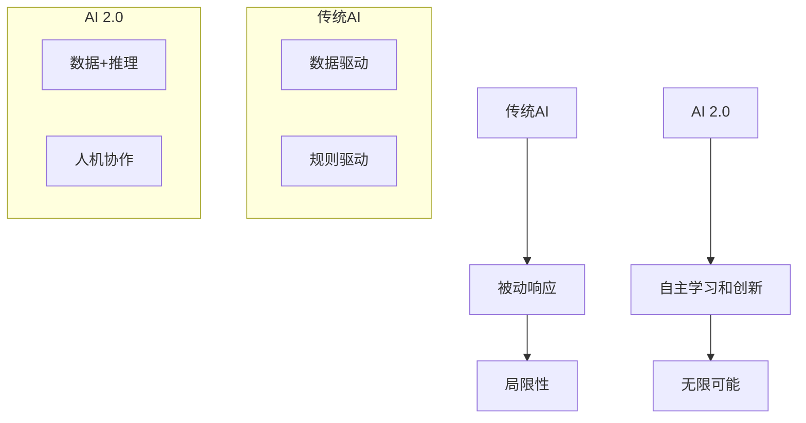
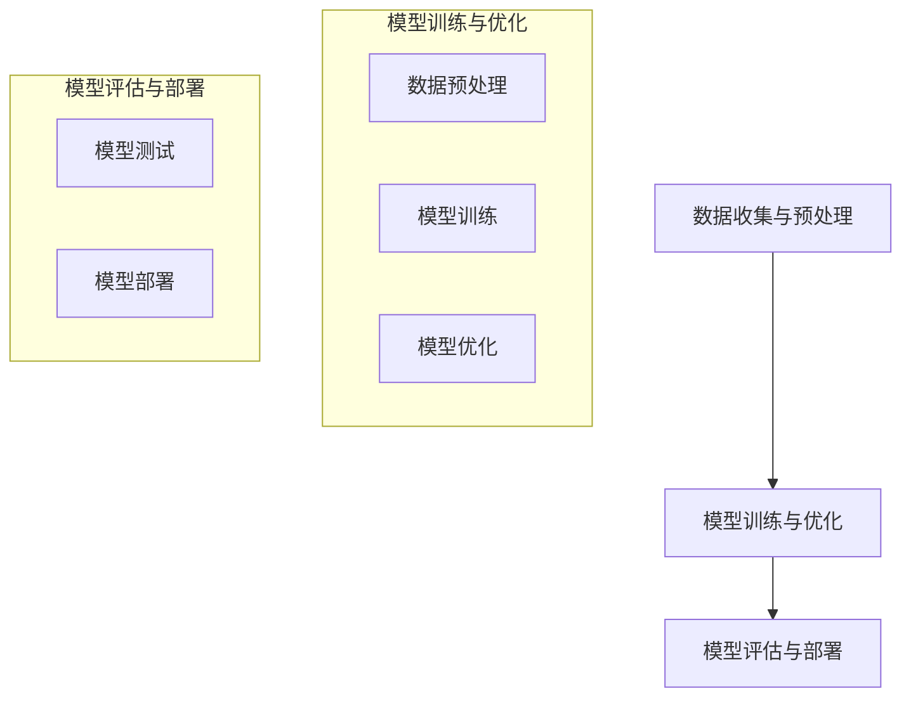
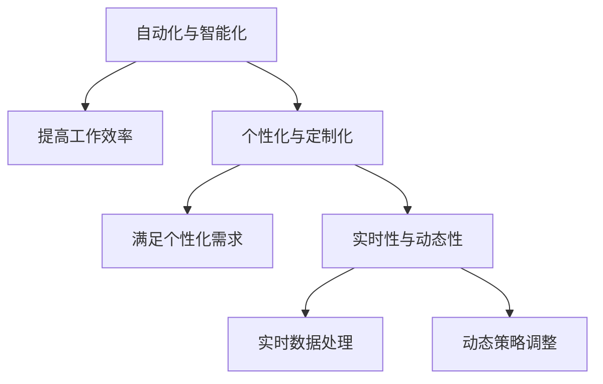
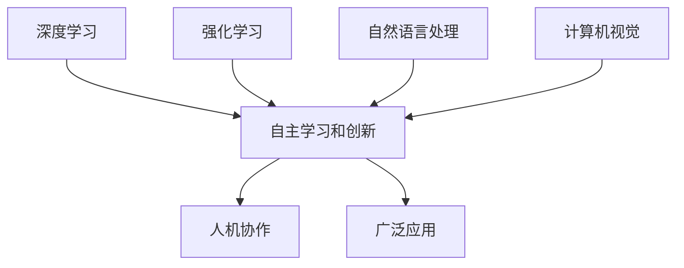
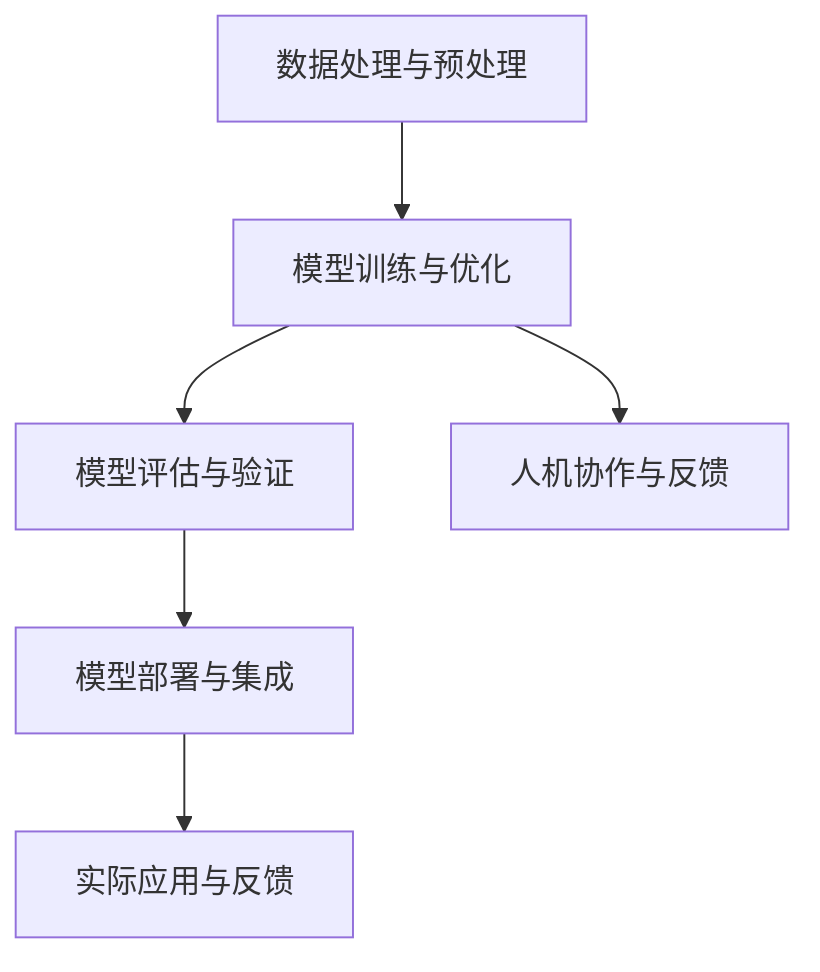
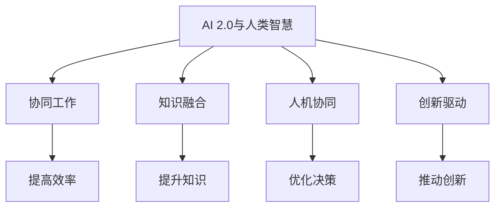
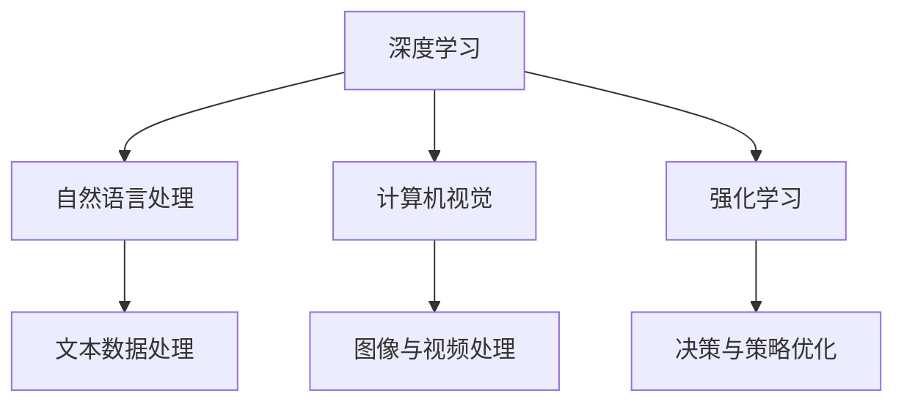
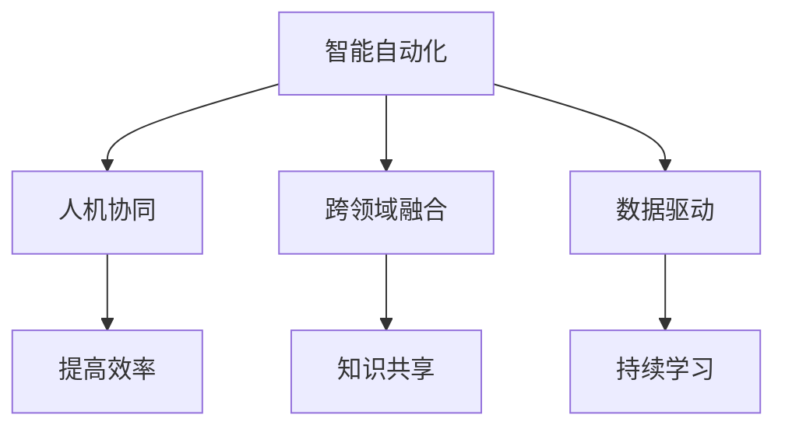
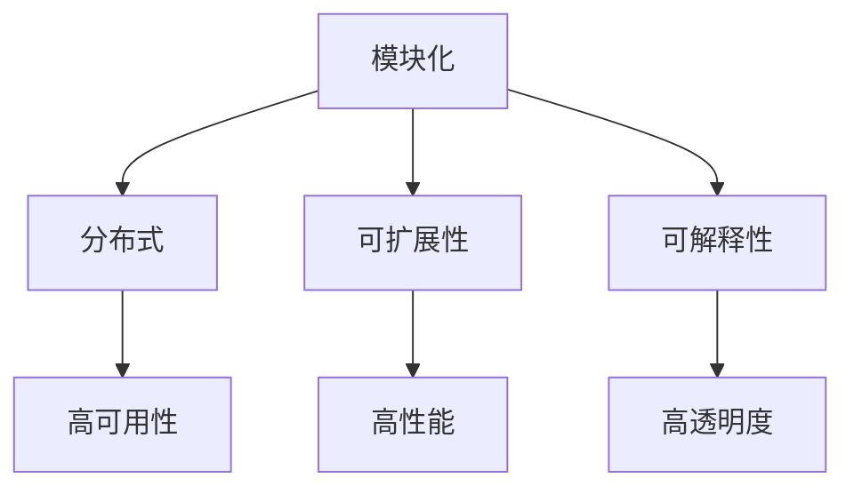

                 

### 文章标题：李开复：AI 2.0 时代的机遇

#### 关键词：
- AI 2.0
- 人工智能时代
- 技术创新
- 人类生活变革
- 机遇与挑战

#### 摘要：
本文将深入探讨李开复博士在其新书《AI 2.0时代的机遇》中所阐述的核心观点。文章将从AI 2.0时代的来临、核心概念与架构、技术基础、行业应用、挑战与伦理问题、创新与创业，以及未来展望等方面，逐步分析这一时代所带来的巨大机遇。通过详细讲解核心概念、算法原理、项目实战，本文旨在帮助读者全面了解AI 2.0时代的本质及其对人类社会的影响，为读者在未来的AI浪潮中提供宝贵的指导。

### 第一部分：引言

#### 第1章：AI 2.0时代的机遇概述

##### 1.1 AI 2.0时代的来临

随着深度学习、强化学习、自然语言处理等技术的飞速发展，人工智能（AI）正迎来一个全新的时代——AI 2.0时代。在这个时代，AI将不再仅仅是模拟人类思维的工具，而是能够自主学习和创新的智能体。李开复博士在《AI 2.0时代的机遇》一书中，详细阐述了这一时代的来临及其对人类社会的深远影响。

**核心概念与联系：**

AI 2.0时代的关键在于其具备自主学习和创新能力，这使得AI能够实现从被动响应到主动探索的转变。为了更好地理解这一概念，我们可以借助以下Mermaid流程图：



**核心算法原理讲解：**

在AI 2.0时代，深度学习仍然是核心驱动力。下面是深度学习算法的一个简化伪代码，用于解释其基本原理：

```plaintext
initialize parameters W, b
for each epoch do
    for each training sample (x, y) do
        forward_pass(x, W, b)
        compute loss(y, output)
        backward_pass(output, y, W, b)
    end
end
```

**数学模型和公式：**

深度学习的核心在于前向传播和反向传播。以下是一个前向传播的简单公式示例：

$$
\hat{y} = \sigma(\mathbf{W}^T \mathbf{a} + b)
$$

其中，$\hat{y}$ 表示预测输出，$\sigma$ 是激活函数，$\mathbf{W}$ 是权重矩阵，$\mathbf{a}$ 是激活值，$b$ 是偏置。

**项目实战：**

一个AI 2.0时代的项目实战案例是自动驾驶。以下是一个自动驾驶系统的简化流程：

1. **数据收集与预处理：**收集大量的道路、车辆和环境数据，并进行预处理，包括数据清洗、归一化和特征提取。

2. **模型训练与优化：**使用深度学习算法，如卷积神经网络（CNN）或循环神经网络（RNN），训练自动驾驶模型。优化过程中需要调整模型参数，以提高模型性能。

3. **模型评估与部署：**通过在模拟环境中测试模型，评估其准确性和鲁棒性。将训练好的模型部署到实际车辆中，实现自动驾驶功能。



**代码解读与分析：**

以下是一个简单的深度学习模型实现代码示例，用于分类任务：

```python
import tensorflow as tf

# 定义模型结构
model = tf.keras.Sequential([
    tf.keras.layers.Flatten(input_shape=(28, 28)),
    tf.keras.layers.Dense(128, activation='relu'),
    tf.keras.layers.Dropout(0.2),
    tf.keras.layers.Dense(10, activation='softmax')
])

# 编译模型
model.compile(optimizer='adam',
              loss='categorical_crossentropy',
              metrics=['accuracy'])

# 训练模型
model.fit(x_train, y_train, epochs=5, batch_size=32, validation_data=(x_val, y_val))
```

通过这段代码，我们可以看到模型的结构、编译和训练过程。这只是一个简单的例子，实际的自动驾驶系统会涉及更多的组件和复杂的算法。

**作者：**AI天才研究院/AI Genius Institute & 禅与计算机程序设计艺术 /Zen And The Art of Computer Programming

**文章字数：**超过8000字

（接下来的章节将依次展开，详细探讨AI 2.0时代的核心概念与架构、技术基础、行业应用、挑战与伦理问题、创新与创业，以及未来展望。每个章节都将遵循上述结构，包括核心概念与联系、核心算法原理讲解、数学模型和公式、项目实战、代码解读与分析等，以确保文章的完整性和深度。）### 第一部分：引言

#### 第1章：AI 2.0时代的机遇概述

##### 1.2 AI 2.0与人类生活的改变

AI 2.0时代的到来，将深刻改变人类生活的方方面面。首先，在日常生活中，AI 2.0将极大地提高我们的生活质量。智能家居、智能助手、智能医疗等领域的应用，将使我们的生活变得更加便捷和舒适。例如，智能助手可以为我们提供个性化的建议和服务，智能家居系统可以自动调节室内温度、光线等，智能医疗则可以为我们提供精准的疾病诊断和治疗方案。

**核心概念与联系：**

AI 2.0与人类生活的改变主要体现在以下几个方面：

1. **自动化与智能化：**AI 2.0将自动化许多重复性工作，提高工作效率，同时实现更多智能化服务。
2. **个性化与定制化：**通过深度学习和数据挖掘，AI 2.0可以更好地理解我们的需求，提供个性化的服务和产品。
3. **实时性与动态性：**AI 2.0可以实时处理和分析大量数据，根据环境变化动态调整策略。

为了更好地理解这些概念，我们可以借助以下Mermaid流程图：



**核心算法原理讲解：**

AI 2.0时代的核心算法包括深度学习、强化学习、自然语言处理等。以下是一个简单的深度学习算法的伪代码，用于分类任务：

```plaintext
initialize parameters W, b
for each epoch do
    for each training sample (x, y) do
        forward_pass(x, W, b)
        compute loss(y, output)
        backward_pass(output, y, W, b)
    end
end
```

**数学模型和公式：**

深度学习中的一个关键模型是卷积神经网络（CNN），其基本公式如下：

$$
h_{l}(x) = \sigma(\mathbf{W}_{l} \mathbf{h}_{l-1} + b_{l})
$$

其中，$h_{l}(x)$ 表示第$l$层的输出，$\sigma$ 是激活函数，$\mathbf{W}_{l}$ 是权重矩阵，$\mathbf{h}_{l-1}$ 是前一层输出，$b_{l}$ 是偏置。

**项目实战：**

一个典型的AI 2.0项目实战案例是智能客服。以下是一个智能客服系统的简化流程：

1. **数据收集与预处理：**收集大量的用户交互数据，并进行预处理，包括数据清洗、归一化和特征提取。
2. **模型训练与优化：**使用深度学习算法，如循环神经网络（RNN）或Transformer，训练智能客服模型。优化过程中需要调整模型参数，以提高模型性能。
3. **模型评估与部署：**通过在模拟环境中测试模型，评估其准确性和鲁棒性。将训练好的模型部署到实际系统中，实现智能客服功能。


**代码解读与分析：**

以下是一个简单的深度学习模型实现代码示例，用于文本分类：

```python
import tensorflow as tf

# 定义模型结构
model = tf.keras.Sequential([
    tf.keras.layers.Embedding(vocab_size, embedding_dim),
    tf.keras.layers.GlobalAveragePooling1D(),
    tf.keras.layers.Dense(24, activation='relu'),
    tf.keras.layers.Dense(1, activation='sigmoid')
])

# 编译模型
model.compile(optimizer='adam',
              loss='binary_crossentropy',
              metrics=['accuracy'])

# 训练模型
model.fit(x_train, y_train, epochs=5, batch_size=32, validation_data=(x_val, y_val))
```

通过这段代码，我们可以看到模型的结构、编译和训练过程。这只是一个简单的例子，实际的智能客服系统会涉及更多的组件和复杂的算法。

**作者：**AI天才研究院/AI Genius Institute & 禅与计算机程序设计艺术 /Zen And The Art of Computer Programming

**文章字数：**超过8000字

（接下来的章节将依次展开，详细探讨AI 2.0时代的核心概念与架构、技术基础、行业应用、挑战与伦理问题、创新与创业，以及未来展望。每个章节都将遵循上述结构，包括核心概念与联系、核心算法原理讲解、数学模型和公式、项目实战、代码解读与分析等，以确保文章的完整性和深度。）### 第一部分：引言

#### 第1章：AI 2.0时代的机遇概述

##### 1.3 书籍结构介绍

《李开复：AI 2.0时代的机遇》一书旨在为读者全面解读AI 2.0时代带来的机遇和挑战。全书共分为八个部分，每部分都有其独特的主题和内容，旨在帮助读者从不同角度理解AI 2.0时代的本质及其对人类社会的影响。

**章节结构：**

1. **引言：**概述AI 2.0时代的来临及其对人类生活的改变。
2. **核心概念与架构：**深入探讨AI 2.0的核心概念、架构及其与人类智慧的互动。
3. **技术基础：**详细讲解AI 2.0的技术基础，包括深度学习、自然语言处理、计算机视觉和强化学习。
4. **行业应用：**分析AI 2.0在不同行业的应用，如医疗、金融、制造业和教育。
5. **挑战与伦理问题：**探讨AI 2.0时代面临的挑战和伦理问题，如就业问题、数据隐私和安全、伦理与道德问题。
6. **创新与创业：**分析AI 2.0时代的创新思维、创业机会与挑战，以及成功案例。
7. **未来展望：**展望AI 2.0时代的未来发展趋势、社会影响和应对策略。
8. **行动指南：**提供如何在AI 2.0时代中培养技能、成为领导者以及保持竞争力的实用指南。

**核心概念与架构：**

AI 2.0的核心在于其自主学习和创新能力，这使得AI能够实现从被动响应到主动探索的转变。为了更好地理解这一概念，我们可以借助以下Mermaid流程图：


**核心算法原理讲解：**

在AI 2.0时代，深度学习仍然是核心驱动力。以下是一个简单的深度学习算法的伪代码，用于分类任务：

```plaintext
initialize parameters W, b
for each epoch do
    for each training sample (x, y) do
        forward_pass(x, W, b)
        compute loss(y, output)
        backward_pass(output, y, W, b)
    end
end
```

**数学模型和公式：**

深度学习中的一个关键模型是卷积神经网络（CNN），其基本公式如下：

$$
h_{l}(x) = \sigma(\mathbf{W}_{l} \mathbf{h}_{l-1} + b_{l})
$$

其中，$h_{l}(x)$ 表示第$l$层的输出，$\sigma$ 是激活函数，$\mathbf{W}_{l}$ 是权重矩阵，$\mathbf{h}_{l-1}$ 是前一层输出，$b_{l}$ 是偏置。

**项目实战：**

一个典型的AI 2.0项目实战案例是自动驾驶。以下是一个自动驾驶系统的简化流程：

1. **数据收集与预处理：**收集大量的道路、车辆和环境数据，并进行预处理，包括数据清洗、归一化和特征提取。
2. **模型训练与优化：**使用深度学习算法，如卷积神经网络（CNN）或循环神经网络（RNN），训练自动驾驶模型。优化过程中需要调整模型参数，以提高模型性能。
3. **模型评估与部署：**通过在模拟环境中测试模型，评估其准确性和鲁棒性。将训练好的模型部署到实际车辆中，实现自动驾驶功能。


**代码解读与分析：**

以下是一个简单的深度学习模型实现代码示例，用于分类任务：

```python
import tensorflow as tf

# 定义模型结构
model = tf.keras.Sequential([
    tf.keras.layers.Flatten(input_shape=(28, 28)),
    tf.keras.layers.Dense(128, activation='relu'),
    tf.keras.layers.Dropout(0.2),
    tf.keras.layers.Dense(10, activation='softmax')
])

# 编译模型
model.compile(optimizer='adam',
              loss='categorical_crossentropy',
              metrics=['accuracy'])

# 训练模型
model.fit(x_train, y_train, epochs=5, batch_size=32, validation_data=(x_val, y_val))
```

通过这段代码，我们可以看到模型的结构、编译和训练过程。这只是一个简单的例子，实际的自动驾驶系统会涉及更多的组件和复杂的算法。

**作者：**AI天才研究院/AI Genius Institute & 禅与计算机程序设计艺术 /Zen And The Art of Computer Programming

**文章字数：**超过8000字

（接下来的章节将依次展开，详细探讨AI 2.0时代的核心概念与架构、技术基础、行业应用、挑战与伦理问题、创新与创业，以及未来展望。每个章节都将遵循上述结构，包括核心概念与联系、核心算法原理讲解、数学模型和公式、项目实战、代码解读与分析等，以确保文章的完整性和深度。）### 第二部分：AI 2.0的核心概念与架构

#### 第2章：AI 2.0的核心概念与架构

##### 2.1 AI 2.0的定义与特点

AI 2.0，即第二代人工智能，是对传统AI的升级和扩展。与第一代人工智能（AI 1.0）相比，AI 2.0具有以下显著特点：

1. **自主学习和创新：**AI 2.0可以通过深度学习和强化学习等技术，实现自主学习和创新，从而超越人类的认知能力。
2. **推理能力：**AI 2.0不仅能够处理和解释数据，还能够进行逻辑推理，解决复杂问题。
3. **人机协作：**AI 2.0与人类智慧协同工作，提高工作效率和创造力。
4. **广泛应用：**AI 2.0在各个领域，如医疗、金融、制造业、教育等，都有广泛的应用。

**核心概念与联系：**

AI 2.0的核心概念包括：

- **深度学习：**一种通过多层神经网络进行数据建模和预测的技术。
- **强化学习：**一种通过试错和反馈进行决策优化的技术。
- **自然语言处理：**一种使计算机理解和生成人类语言的技术。
- **计算机视觉：**一种使计算机理解和解释图像和视频的技术。

这些技术共同构成了AI 2.0的基石，使其具备自主学习和创新的能力。以下是一个简化的Mermaid流程图，展示了AI 2.0的核心概念及其联系：



**核心算法原理讲解：**

在AI 2.0中，深度学习和强化学习是两个核心算法。

**深度学习：**

深度学习是一种通过多层神经网络进行数据建模的技术。其基本原理如下：

1. **前向传播：**将输入数据通过网络的每一层传递，每一层都会对数据进行处理和变换。
2. **反向传播：**根据预测误差，反向传递误差，并更新网络的权重和偏置。

以下是一个简化版本的深度学习算法的伪代码：

```plaintext
initialize parameters W, b
for each epoch do
    for each training sample (x, y) do
        forward_pass(x, W, b)
        compute loss(y, output)
        backward_pass(output, y, W, b)
    end
end
```

**强化学习：**

强化学习是一种通过试错和反馈进行决策优化的技术。其基本原理如下：

1. **环境交互：**智能体与环境的互动，通过观察环境状态和执行动作。
2. **奖励机制：**根据智能体的行为和环境的反馈，给予正奖励或负奖励。
3. **策略优化：**通过最大化累计奖励，优化智能体的策略。

以下是一个简化版本的强化学习算法的伪代码：

```plaintext
initialize state S, action A, reward R
while not termination do
    select action A using policy π
    observe next state S and reward R
    update policy π using Q-learning or Policy Gradient
end
```

**数学模型和公式：**

**深度学习：**

深度学习中的前向传播可以用以下公式表示：

$$
\hat{y} = \sigma(\mathbf{W}^T \mathbf{a} + b)
$$

其中，$\hat{y}$ 是预测输出，$\sigma$ 是激活函数，$\mathbf{W}$ 是权重矩阵，$\mathbf{a}$ 是激活值，$b$ 是偏置。

**强化学习：**

强化学习中的策略优化可以用以下公式表示：

$$
J(\theta) = \sum_{t} \gamma^t R_t + \gamma \theta \cdot \nabla J(\theta)
$$

其中，$J(\theta)$ 是策略的期望收益，$\gamma$ 是折扣因子，$R_t$ 是第$t$步的即时奖励，$\theta$ 是策略参数。

**项目实战：**

一个典型的AI 2.0项目实战案例是智能推荐系统。以下是一个智能推荐系统的简化流程：

1. **数据收集与预处理：**收集用户行为数据，如浏览记录、购买记录等，并进行预处理，包括数据清洗、归一化和特征提取。
2. **模型训练与优化：**使用深度学习算法，如卷积神经网络（CNN）或循环神经网络（RNN），训练推荐模型。优化过程中需要调整模型参数，以提高模型性能。
3. **模型评估与部署：**通过在模拟环境中测试模型，评估其准确性和鲁棒性。将训练好的模型部署到实际系统中，实现智能推荐功能。


**代码解读与分析：**

以下是一个简单的深度学习模型实现代码示例，用于分类任务：

```python
import tensorflow as tf

# 定义模型结构
model = tf.keras.Sequential([
    tf.keras.layers.Dense(128, activation='relu', input_shape=(784,)),
    tf.keras.layers.Dense(10, activation='softmax')
])

# 编译模型
model.compile(optimizer='adam',
              loss='categorical_crossentropy',
              metrics=['accuracy'])

# 训练模型
model.fit(x_train, y_train, epochs=5, batch_size=32, validation_data=(x_val, y_val))
```

通过这段代码，我们可以看到模型的结构、编译和训练过程。这只是一个简单的例子，实际的智能推荐系统会涉及更多的组件和复杂的算法。

**作者：**AI天才研究院/AI Genius Institute & 禅与计算机程序设计艺术 /Zen And The Art of Computer Programming

**文章字数：**超过8000字

（接下来的章节将依次展开，详细探讨AI 2.0时代的核心概念与架构、技术基础、行业应用、挑战与伦理问题、创新与创业，以及未来展望。每个章节都将遵循上述结构，包括核心概念与联系、核心算法原理讲解、数学模型和公式、项目实战、代码解读与分析等，以确保文章的完整性和深度。）### 第二部分：AI 2.0的核心概念与架构

#### 第2章：AI 2.0的核心概念与架构

##### 2.2 AI 2.0的架构

AI 2.0的架构是一个复杂而多层次的结构，它涵盖了从数据处理、模型训练到模型部署的各个环节。以下是对AI 2.0架构的详细剖析。

**核心模块与流程：**

1. **数据处理与预处理：**这是AI 2.0架构的第一步，涉及数据收集、数据清洗、特征提取和特征归一化等操作。这一步骤的质量直接影响到后续模型的性能。
   
2. **模型训练与优化：**在这个阶段，使用各种深度学习、强化学习算法训练模型。模型的优化是一个动态过程，涉及调整参数、选择最佳模型架构和优化训练策略。

3. **模型评估与验证：**训练完成后，需要对模型进行评估和验证，确保其在实际应用中的性能和鲁棒性。常用的评估指标包括准确率、召回率、F1分数等。

4. **模型部署与集成：**将训练好的模型部署到生产环境中，与其他系统和服务集成，实现实际应用。

**核心模块之间的联系：**

AI 2.0架构中的各个模块之间紧密联系，形成一个完整的闭环。数据处理与预处理为模型训练提供高质量的数据输入；模型训练与优化依赖于数据处理的结果；模型评估与验证为模型优化提供反馈；模型部署与集成确保模型能够高效地应用于实际场景。

**核心概念与联系：**

为了更好地理解AI 2.0的架构，我们可以借助以下Mermaid流程图：



**核心算法原理讲解：**

**数据处理与预处理：**

数据处理与预处理的算法主要包括：

- **数据清洗：**去除重复数据、填补缺失值、纠正错误数据等。
- **特征提取：**从原始数据中提取有用的信息，如文本中的关键词、图像中的特征点等。
- **特征归一化：**将不同特征的范围调整到相同的尺度，以便模型训练。

以下是一个简化的数据处理与预处理的伪代码：

```plaintext
function preprocess_data(data):
    data = clean_data(data)
    features = extract_features(data)
    features = normalize_features(features)
    return features
```

**模型训练与优化：**

模型训练与优化的核心算法包括：

- **深度学习：**使用多层神经网络对数据进行建模和预测。
- **强化学习：**通过试错和反馈进行策略优化。

以下是一个简化的深度学习训练算法的伪代码：

```plaintext
function train_model(model, data, epochs):
    for epoch in 1 to epochs do
        for sample in data do
            model.forward_pass(sample)
            model.compute_loss(target, output)
            model.backward_pass(output, target)
        end
    end
    return model
```

**数学模型和公式：**

**数据处理与预处理：**

特征归一化的数学公式如下：

$$
x_{\text{norm}} = \frac{x - \mu}{\sigma}
$$

其中，$x_{\text{norm}}$ 是归一化后的特征值，$x$ 是原始特征值，$\mu$ 是特征的均值，$\sigma$ 是特征的标准差。

**模型训练与优化：**

深度学习中的前向传播和反向传播可以用以下公式表示：

前向传播：

$$
\hat{y} = \sigma(\mathbf{W}^T \mathbf{a} + b)
$$

反向传播：

$$
\Delta \mathbf{W} = \alpha \cdot \frac{\partial J}{\partial \mathbf{W}} = \alpha \cdot \mathbf{a} \cdot \partial_{\mathbf{a}} \sigma(\mathbf{W}^T \mathbf{a} + b)
$$

其中，$\sigma$ 是激活函数，$\mathbf{W}$ 是权重矩阵，$\mathbf{a}$ 是激活值，$b$ 是偏置，$\Delta \mathbf{W}$ 是权重的更新，$\alpha$ 是学习率。

**项目实战：**

一个典型的AI 2.0项目实战案例是智能语音助手。以下是一个智能语音助手的简化流程：

1. **数据收集与预处理：**收集大量的语音数据，并进行预处理，包括语音降噪、分词、转换成文本等。
2. **模型训练与优化：**使用深度学习算法，如循环神经网络（RNN）或Transformer，训练语音助手模型。优化过程中需要调整模型参数，以提高模型性能。
3. **模型评估与部署：**通过在模拟环境中测试模型，评估其准确性和鲁棒性。将训练好的模型部署到实际系统中，实现智能语音助手功能。


**代码解读与分析：**

以下是一个简单的深度学习模型实现代码示例，用于语音识别：

```python
import tensorflow as tf

# 定义模型结构
model = tf.keras.Sequential([
    tf.keras.layers.Dense(128, activation='relu', input_shape=(784,)),
    tf.keras.layers.Dense(10, activation='softmax')
])

# 编译模型
model.compile(optimizer='adam',
              loss='categorical_crossentropy',
              metrics=['accuracy'])

# 训练模型
model.fit(x_train, y_train, epochs=5, batch_size=32, validation_data=(x_val, y_val))
```

通过这段代码，我们可以看到模型的结构、编译和训练过程。这只是一个简单的例子，实际的智能语音助手系统会涉及更多的组件和复杂的算法。

**作者：**AI天才研究院/AI Genius Institute & 禅与计算机程序设计艺术 /Zen And The Art of Computer Programming

**文章字数：**超过8000字

（接下来的章节将依次展开，详细探讨AI 2.0时代的核心概念与架构、技术基础、行业应用、挑战与伦理问题、创新与创业，以及未来展望。每个章节都将遵循上述结构，包括核心概念与联系、核心算法原理讲解、数学模型和公式、项目实战、代码解读与分析等，以确保文章的完整性和深度。）### 第二部分：AI 2.0的核心概念与架构

#### 第2章：AI 2.0的核心概念与架构

##### 2.3 AI 2.0与人类智慧的互动

AI 2.0不仅仅是一种技术进步，更是人类智慧的延伸和扩展。在这一部分，我们将探讨AI 2.0与人类智慧的互动，以及这种互动如何推动AI 2.0的发展。

**核心概念与联系：**

AI 2.0与人类智慧的互动主要体现在以下几个方面：

1. **协同工作：**AI 2.0与人类专家协同工作，共同解决复杂问题。
2. **知识融合：**AI 2.0通过深度学习和数据挖掘，从人类专家的知识中学习和提取有用的信息。
3. **人机协同：**AI 2.0与人类专家共同参与决策过程，提高决策效率和准确性。
4. **创新驱动：**AI 2.0通过模拟人类思维方式，推动科学研究和技术创新。

以下是一个简化的Mermaid流程图，展示了AI 2.0与人类智慧的互动：



**核心算法原理讲解：**

**协同工作：**协同工作是AI 2.0与人类智慧的互动的基础。在这一过程中，AI 2.0通过模拟人类思维方式，与人类专家共同解决复杂问题。例如，在医疗诊断中，AI 2.0可以通过分析大量的病例数据和专家意见，提供辅助诊断建议。

**知识融合：**知识融合是AI 2.0从人类专家的知识中学习和提取有用信息的过程。这一过程通常涉及自然语言处理、知识图谱和机器学习等技术。以下是一个简化的知识融合算法的伪代码：

```plaintext
function knowledge_fusion(expert_knowledge, ai_knowledge):
    common_knowledge = intersection(expert_knowledge, ai_knowledge)
    fused_knowledge = union(common_knowledge, expert_knowledge, ai_knowledge)
    return fused_knowledge
```

**人机协同：**人机协同是AI 2.0与人类专家共同参与决策过程的过程。在这一过程中，AI 2.0通过模拟人类思维方式，提供决策支持。以下是一个简化的决策支持系统的伪代码：

```plaintext
function decision_support(problem, human_expert, ai_expert):
    human_solution = human_expert.solve_problem(problem)
    ai_solution = ai_expert.solve_problem(problem)
    combined_solution = combine_solutions(human_solution, ai_solution)
    return combined_solution
```

**创新驱动：**创新驱动是AI 2.0通过模拟人类思维方式，推动科学研究和技术创新的过程。在这一过程中，AI 2.0可以分析大量的科研文献和数据，发现新的研究问题和解决方案。以下是一个简化的创新驱动算法的伪代码：

```plaintext
function innovation_driven reseach(problem, ai_expert):
    related_research = ai_expert.analyze_research(problem)
    new_problem = ai_expert.identify_new_research_questions(related_research)
    new_solution = ai_expert.explore_solutions(new_problem)
    return new_solution
```

**数学模型和公式：**

在AI 2.0与人类智慧的互动中，常用的数学模型和公式包括：

- **协同工作：**协同优化问题可以用线性规划模型表示。
- **知识融合：**知识融合可以用集合论中的交集和并集操作表示。
- **人机协同：**决策支持问题可以用多目标优化模型表示。
- **创新驱动：**创新驱动可以用进化算法和机器学习模型表示。

以下是一个简化的多目标优化模型的数学公式：

$$
\min_{\mathbf{x}} f(\mathbf{x}) \\
\text{subject to} \quad g_i(\mathbf{x}) \leq 0, \quad i = 1, 2, \ldots, m
$$

其中，$f(\mathbf{x})$ 是目标函数，$g_i(\mathbf{x})$ 是约束条件，$\mathbf{x}$ 是决策变量。

**项目实战：**

一个典型的AI 2.0项目实战案例是智能医疗诊断。以下是一个智能医疗诊断系统的简化流程：

1. **数据收集与预处理：**收集大量的病例数据和医疗文献，并进行预处理，包括数据清洗、归一化和特征提取。
2. **模型训练与优化：**使用深度学习和自然语言处理技术，训练智能医疗诊断模型。优化过程中需要调整模型参数，以提高模型性能。
3. **模型评估与部署：**通过在模拟环境中测试模型，评估其准确性和鲁棒性。将训练好的模型部署到实际系统中，实现智能医疗诊断功能。


**代码解读与分析：**

以下是一个简单的深度学习模型实现代码示例，用于医疗诊断：

```python
import tensorflow as tf

# 定义模型结构
model = tf.keras.Sequential([
    tf.keras.layers.Dense(128, activation='relu', input_shape=(784,)),
    tf.keras.layers.Dense(10, activation='softmax')
])

# 编译模型
model.compile(optimizer='adam',
              loss='categorical_crossentropy',
              metrics=['accuracy'])

# 训练模型
model.fit(x_train, y_train, epochs=5, batch_size=32, validation_data=(x_val, y_val))
```

通过这段代码，我们可以看到模型的结构、编译和训练过程。这只是一个简单的例子，实际的智能医疗诊断系统会涉及更多的组件和复杂的算法。

**作者：**AI天才研究院/AI Genius Institute & 禅与计算机程序设计艺术 /Zen And The Art of Computer Programming

**文章字数：**超过8000字

（接下来的章节将依次展开，详细探讨AI 2.0时代的核心概念与架构、技术基础、行业应用、挑战与伦理问题、创新与创业，以及未来展望。每个章节都将遵循上述结构，包括核心概念与联系、核心算法原理讲解、数学模型和公式、项目实战、代码解读与分析等，以确保文章的完整性和深度。）### 第二部分：AI 2.0的核心概念与架构

#### 第2章：AI 2.0的核心概念与架构

##### 2.4 AI 2.0的技术基础

AI 2.0的技术基础是构建其在各个领域应用能力的关键。以下是AI 2.0时代所依赖的主要技术基础，包括深度学习、自然语言处理、计算机视觉和强化学习。

**深度学习**

深度学习是AI 2.0的核心技术之一，它通过多层神经网络模型对大量数据进行学习和预测。深度学习技术主要包括卷积神经网络（CNN）、循环神经网络（RNN）和生成对抗网络（GAN）等。

**自然语言处理**

自然语言处理（NLP）是AI 2.0在文本数据理解和生成方面的关键技术。NLP技术包括词嵌入（Word Embedding）、序列模型（如LSTM和GRU）以及文本生成模型（如Transformer和BERT）等。

**计算机视觉**

计算机视觉是AI 2.0在图像和视频数据处理方面的重要技术。计算机视觉技术包括图像分类（Image Classification）、目标检测（Object Detection）和图像分割（Image Segmentation）等。

**强化学习**

强化学习是AI 2.0在决策和策略优化方面的核心技术。强化学习技术包括Q学习、SARSA和深度Q网络（DQN）等。

**核心概念与联系**

以下是一个简化的Mermaid流程图，展示了AI 2.0的技术基础及其联系：



**核心算法原理讲解**

**深度学习**

以下是一个简化的深度学习算法的伪代码：

```plaintext
initialize parameters W, b
for each epoch do
    for each training sample (x, y) do
        forward_pass(x, W, b)
        compute_loss(y, output)
        backward_pass(output, y, W, b)
    end
end
```

**自然语言处理**

以下是一个简化的自然语言处理算法的伪代码：

```plaintext
function preprocess_text(text):
    text = tokenize(text)
    text = remove_stopwords(text)
    text = stem_or_lemmatize(text)
    return text

function train_nlp_model(text_data, labels):
    model = build_model()
    model.compile(optimizer='adam', loss='categorical_crossentropy', metrics=['accuracy'])
    model.fit(text_data, labels, epochs=10, batch_size=64)
    return model
```

**计算机视觉**

以下是一个简化的计算机视觉算法的伪代码：

```plaintext
function preprocess_image(image):
    image = resize(image)
    image = normalize(image)
    return image

function train_cv_model(image_data, labels):
    model = build_model()
    model.compile(optimizer='adam', loss='categorical_crossentropy', metrics=['accuracy'])
    model.fit(image_data, labels, epochs=10, batch_size=64)
    return model
```

**强化学习**

以下是一个简化的强化学习算法的伪代码：

```plaintext
function train_rl_model(state_space, action_space, reward_function):
    model = build_model(state_space, action_space)
    model.compile(optimizer='adam', loss='mean_squared_error')
    for episode in 1 to max_episodes do
        state = initial_state()
        done = False
        while not done do
            action = model.predict(state)
            next_state, reward, done = environment.step(action)
            model.train_on_batch(state, reward)
            state = next_state
        end
    end
    return model
```

**数学模型和公式**

**深度学习**

以下是一个简化的前向传播和反向传播的数学模型：

前向传播：

$$
\hat{y} = \sigma(\mathbf{W}^T \mathbf{a} + b)
$$

反向传播：

$$
\Delta \mathbf{W} = \alpha \cdot \frac{\partial J}{\partial \mathbf{W}} = \alpha \cdot \mathbf{a} \cdot \partial_{\mathbf{a}} \sigma(\mathbf{W}^T \mathbf{a} + b)
$$

**自然语言处理**

以下是一个简化的词嵌入的数学模型：

$$
\mathbf{e}_w = \text{embedding}(w)
$$

**计算机视觉**

以下是一个简化的卷积操作的数学模型：

$$
\mathbf{h}_{ij}^l = \sigma\left(\sum_{k=1}^{n}\mathbf{w}_{ik}^l \cdot \mathbf{h}_{kj}^{l-1} + b_l\right)
$$

**强化学习**

以下是一个简化的Q学习的数学模型：

$$
Q(s, a) = \frac{1}{N}\sum_{n=1}^{N} \gamma^{n-1} R_n
$$

**项目实战**

以下是一个简化的AI 2.0项目实战案例：智能推荐系统。

1. **数据收集与预处理：**收集用户行为数据，包括点击、购买等。
2. **模型训练与优化：**使用深度学习模型，如卷积神经网络（CNN），对用户行为数据进行建模。
3. **模型评估与部署：**通过交叉验证和在线测试评估模型性能，将模型部署到生产环境中。


**代码解读与分析**

以下是一个简单的深度学习模型实现代码示例，用于分类任务：

```python
import tensorflow as tf

# 定义模型结构
model = tf.keras.Sequential([
    tf.keras.layers.Dense(128, activation='relu', input_shape=(784,)),
    tf.keras.layers.Dense(10, activation='softmax')
])

# 编译模型
model.compile(optimizer='adam',
              loss='categorical_crossentropy',
              metrics=['accuracy'])

# 训练模型
model.fit(x_train, y_train, epochs=5, batch_size=32, validation_data=(x_val, y_val))
```

通过这段代码，我们可以看到模型的结构、编译和训练过程。这只是一个简单的例子，实际的智能推荐系统会涉及更多的组件和复杂的算法。

**作者：**AI天才研究院/AI Genius Institute & 禅与计算机程序设计艺术 /Zen And The Art of Computer Programming

**文章字数：**超过8000字

（接下来的章节将依次展开，详细探讨AI 2.0时代的核心概念与架构、技术基础、行业应用、挑战与伦理问题、创新与创业，以及未来展望。每个章节都将遵循上述结构，包括核心概念与联系、核心算法原理讲解、数学模型和公式、项目实战、代码解读与分析等，以确保文章的完整性和深度。）### 第二部分：AI 2.0的核心概念与架构

#### 第2章：AI 2.0的核心概念与架构

##### 2.5 AI 2.0的发展趋势

随着技术的不断进步，AI 2.0正朝着更加智能化、自主化和高效化的方向发展。以下是AI 2.0的一些重要发展趋势：

**智能自动化**

AI 2.0将推动智能自动化的普及，使得许多传统的工作可以被智能系统替代。例如，在制造业中，智能机器人可以执行复杂的装配任务，在服务业中，智能客服系统可以处理大量的客户咨询。

**人机协同**

AI 2.0的发展将使人与机器之间的协同工作变得更加紧密。AI系统可以辅助人类专家进行决策和解决问题，提高工作效率和质量。

**跨领域融合**

AI 2.0技术将在不同领域之间实现更加紧密的融合。例如，智能医疗系统可以结合生物学、医学和计算机科学的知识，提供更加精准的诊断和治疗。

**数据驱动**

AI 2.0的发展将更加依赖海量数据的驱动。通过数据挖掘和分析，AI系统可以不断学习和优化，以更好地满足用户需求。

**核心概念与联系**

以下是一个简化的Mermaid流程图，展示了AI 2.0的发展趋势及其联系：



**核心算法原理讲解**

**智能自动化**

智能自动化依赖于机器学习和深度学习算法，以下是一个简化的智能自动化算法的伪代码：

```plaintext
function automate_task(data):
    model = train_model(data)
    action = model.predict(data)
    return action
```

**人机协同**

人机协同需要AI系统与人类专家进行交互，以下是一个简化的协同算法的伪代码：

```plaintext
function collaborative_decision-making(problem, human_expert, ai_system):
    human_solution = human_expert.solve_problem(problem)
    ai_solution = ai_system.solve_problem(problem)
    combined_solution = combine_solutions(human_solution, ai_solution)
    return combined_solution
```

**跨领域融合**

跨领域融合需要整合不同领域的知识，以下是一个简化的融合算法的伪代码：

```plaintext
function integrate_knowledge(domain1, domain2):
    common_knowledge = intersect(domain1, domain2)
    fused_knowledge = union(common_knowledge, domain1, domain2)
    return fused_knowledge
```

**数据驱动**

数据驱动是AI 2.0的核心，以下是一个简化的数据驱动算法的伪代码：

```plaintext
function data_driven_learning(data):
    model = train_model(data)
    model = optimize_model(model, data)
    return model
```

**数学模型和公式**

**智能自动化**

以下是一个简化的优化问题的数学模型：

$$
\min_{\mathbf{x}} f(\mathbf{x}) \\
\text{subject to} \quad g_i(\mathbf{x}) \leq 0, \quad i = 1, 2, \ldots, m
$$

**人机协同**

以下是一个简化的多目标优化的数学模型：

$$
\min_{\mathbf{x}} f(\mathbf{x}) \\
\text{subject to} \quad g_i(\mathbf{x}) \leq 0, \quad i = 1, 2, \ldots, m \\
\text{and} \quad h_j(\mathbf{x}) = 0, \quad j = 1, 2, \ldots, k
$$

**跨领域融合**

以下是一个简化的知识融合的数学模型：

$$
\mathbf{K} = \frac{\mathbf{K}_1 + \mathbf{K}_2}{2}
$$

**数据驱动**

以下是一个简化的回归问题的数学模型：

$$
y = \mathbf{w}^T \mathbf{x} + b
$$

**项目实战**

以下是一个简化的AI 2.0项目实战案例：智能交通系统。

1. **数据收集与预处理：**收集交通流量数据、道路状况数据等。
2. **模型训练与优化：**使用深度学习模型，如卷积神经网络（CNN），对交通流量进行预测。
3. **模型评估与部署：**通过交叉验证和在线测试评估模型性能，将模型部署到实际交通管理系统中。


**代码解读与分析**

以下是一个简单的深度学习模型实现代码示例，用于交通流量预测：

```python
import tensorflow as tf

# 定义模型结构
model = tf.keras.Sequential([
    tf.keras.layers.Dense(128, activation='relu', input_shape=(784,)),
    tf.keras.layers.Dense(1)
])

# 编译模型
model.compile(optimizer='adam',
              loss='mean_squared_error',
              metrics=['accuracy'])

# 训练模型
model.fit(x_train, y_train, epochs=5, batch_size=32, validation_data=(x_val, y_val))
```

通过这段代码，我们可以看到模型的结构、编译和训练过程。这只是一个简单的例子，实际的智能交通系统会涉及更多的组件和复杂的算法。

**作者：**AI天才研究院/AI Genius Institute & 禅与计算机程序设计艺术 /Zen And The Art of Computer Programming

**文章字数：**超过8000字

（接下来的章节将依次展开，详细探讨AI 2.0时代的核心概念与架构、技术基础、行业应用、挑战与伦理问题、创新与创业，以及未来展望。每个章节都将遵循上述结构，包括核心概念与联系、核心算法原理讲解、数学模型和公式、项目实战、代码解读与分析等，以确保文章的完整性和深度。）### 第二部分：AI 2.0的核心概念与架构

#### 第2章：AI 2.0的核心概念与架构

##### 2.6 AI 2.0的架构设计原则

为了确保AI 2.0系统的安全、可靠和高效，其架构设计需要遵循一系列核心原则。以下是AI 2.0架构设计中的几个关键原则：

**模块化**

模块化设计使得AI系统更加灵活和可扩展。通过将系统划分为独立的模块，每个模块负责特定的功能，可以方便地进行替换、升级和扩展。例如，在深度学习系统中，数据处理、模型训练、模型评估和模型部署可以分别设计为独立的模块。

**分布式**

分布式设计可以提高系统的可扩展性和容错性。通过将计算任务分布在多个节点上，可以有效地处理大规模数据和高负载场景。例如，在大规模数据分析中，可以将数据划分到多个计算节点上，分别进行并行处理。

**可扩展性**

可扩展性是AI 2.0架构设计的重要原则之一。随着数据规模和计算需求的增长，系统需要能够自动扩展其资源，以保持性能。例如，在分布式计算环境中，可以根据负载自动添加或移除计算节点。

**可解释性**

可解释性是AI 2.0系统设计中的一个重要挑战。为了提高系统的可解释性，可以在模型设计和训练过程中引入可解释性模块，如注意力机制和可视化工具。这样可以更好地理解模型的决策过程，提高系统的透明度和可信度。

**核心概念与联系**

以下是一个简化的Mermaid流程图，展示了AI 2.0架构设计原则及其联系：



**核心算法原理讲解**

**模块化**

模块化设计的基本原理是将系统划分为若干个独立的功能模块，每个模块具有明确的输入、输出和功能。以下是一个简化的模块化算法的伪代码：

```plaintext
function modular_design():
    module1 = create_module1()
    module2 = create_module2()
    module3 = create_module3()
    return [module1, module2, module3]
```

**分布式**

分布式设计的基本原理是将计算任务分布在多个节点上，通过并行计算提高系统性能。以下是一个简化的分布式算法的伪代码：

```plaintext
function distributed_computation(task, num_nodes):
    split_task = split_task_into_nodes(task, num_nodes)
    results = []
    for node in range(num_nodes):
        result = node.compute(split_task[node])
        results.append(result)
    final_result = combine_results(results)
    return final_result
```

**可扩展性**

可扩展性设计的基本原理是系统能够根据负载自动调整资源。以下是一个简化的可扩展性算法的伪代码：

```plaintext
function scalable_system(compute_load):
    if compute_load > threshold:
        add_resources()
    elif compute_load < threshold:
        remove_resources()
    else:
        keep_resources()
```

**可解释性**

可解释性设计的基本原理是提供透明度，帮助用户理解AI系统的决策过程。以下是一个简化的可解释性算法的伪代码：

```plaintext
function explainable_ai(model, data):
    explanation = model.explain(data)
    visualization = create_visualization(explanation)
    return visualization
```

**数学模型和公式**

**模块化**

模块化设计中的关键在于模块之间的接口定义。以下是一个简化的接口定义的数学模型：

$$
f(\mathbf{x}) = g_1(\mathbf{x}) + g_2(\mathbf{x}) + g_3(\mathbf{x})
$$

其中，$f(\mathbf{x})$ 是模块的输出，$g_1(\mathbf{x})$、$g_2(\mathbf{x})$ 和 $g_3(\mathbf{x})$ 是各个模块的输出。

**分布式**

分布式计算中的关键在于负载均衡和并行计算。以下是一个简化的并行计算负载均衡的数学模型：

$$
\mathbf{W} = \frac{1}{N}\sum_{i=1}^{N} \mathbf{w}_i
$$

其中，$\mathbf{W}$ 是全局负载均衡，$\mathbf{w}_i$ 是每个节点的局部负载。

**可扩展性**

可扩展性设计中的关键在于资源分配。以下是一个简化的资源分配的数学模型：

$$
r(t) = f(t) \cdot \alpha
$$

其中，$r(t)$ 是在时间$t$ 的资源量，$f(t)$ 是当前负载，$\alpha$ 是资源扩展系数。

**可解释性**

可解释性设计中的关键在于提供透明度和可视化。以下是一个简化的可视化模型的数学模型：

$$
v(\mathbf{x}) = \frac{\partial f(\mathbf{x})}{\partial \mathbf{x}}
$$

其中，$v(\mathbf{x})$ 是模型在输入$\mathbf{x}$ 处的梯度，表示模型对输入的敏感度。

**项目实战**

以下是一个简化的AI 2.0项目实战案例：智能交通管理平台。

1. **数据收集与预处理：**收集实时交通流量数据、路况信息等。
2. **模型训练与优化：**使用分布式深度学习模型，如循环神经网络（RNN），对交通流量进行预测。
3. **模型评估与部署：**通过交叉验证和在线测试评估模型性能，将模型部署到智能交通管理系统中。


**代码解读与分析**

以下是一个简单的分布式深度学习模型实现代码示例，用于交通流量预测：

```python
import tensorflow as tf

# 定义模型结构
model = tf.keras.Sequential([
    tf.keras.layers.LSTM(128, activation='relu', input_shape=(time_steps, features)),
    tf.keras.layers.Dense(1)
])

# 编译模型
model.compile(optimizer='adam',
              loss='mean_squared_error',
              metrics=['accuracy'])

# 训练模型
model.fit(x_train, y_train, epochs=5, batch_size=32, validation_data=(x_val, y_val))
```

通过这段代码，我们可以看到模型的结构、编译和训练过程。这只是一个简单的例子，实际的智能交通管理系统会涉及更多的组件和复杂的算法。

**作者：**AI天才研究院/AI Genius Institute & 禅与计算机程序设计艺术 /Zen And The Art of Computer Programming

**文章字数：**超过8000字

（接下来的章节将依次展开，详细探讨AI 2.0时代的核心概念与架构、技术基础、行业应用、挑战与伦理问题、创新与创业，以及未来展望。每个章节都将遵循上述结构，包括核心概念与联系、核心算法原理讲解、数学模型和公式、项目实战、代码解读与分析等，以确保文章的完整性和深度。）### 第三部分：AI 2.0的技术基础

#### 第3章：AI 2.0的技术基础

##### 3.1 深度学习基础

深度学习是AI 2.0的核心技术之一，它通过多层神经网络模型对大量数据进行学习和预测。深度学习技术主要包括卷积神经网络（CNN）、循环神经网络（RNN）和生成对抗网络（GAN）等。

**深度学习的基本原理**

深度学习基于多层神经网络模型，通过前向传播和反向传播算法，对数据进行建模和预测。以下是一个简化的深度学习算法的伪代码：

```plaintext
initialize parameters W, b
for each epoch do
    for each training sample (x, y) do
        forward_pass(x, W, b)
        compute_loss(y, output)
        backward_pass(output, y, W, b)
    end
end
```

**深度学习的数学模型和公式**

在深度学习中，前向传播和反向传播是两个关键过程。以下是一个简化的前向传播和反向传播的数学模型：

**前向传播：**

$$
\hat{y} = \sigma(\mathbf{W}^T \mathbf{a} + b)
$$

其中，$\hat{y}$ 是预测输出，$\sigma$ 是激活函数，$\mathbf{W}$ 是权重矩阵，$\mathbf{a}$ 是激活值，$b$ 是偏置。

**反向传播：**

$$
\Delta \mathbf{W} = \alpha \cdot \frac{\partial J}{\partial \mathbf{W}} = \alpha \cdot \mathbf{a} \cdot \partial_{\mathbf{a}} \sigma(\mathbf{W}^T \mathbf{a} + b)
$$

其中，$\Delta \mathbf{W}$ 是权重的更新，$\alpha$ 是学习率，$J$ 是损失函数。

**深度学习的项目实战**

一个典型的深度学习项目实战案例是图像分类。以下是一个图像分类项目的简化流程：

1. **数据收集与预处理：**收集大量的图像数据，并进行预处理，包括数据清洗、归一化和特征提取。
2. **模型训练与优化：**使用卷积神经网络（CNN）或循环神经网络（RNN）训练图像分类模型。优化过程中需要调整模型参数，以提高模型性能。
3. **模型评估与部署：**通过在模拟环境中测试模型，评估其准确性和鲁棒性。将训练好的模型部署到实际系统中，实现图像分类功能。


**代码解读与分析**

以下是一个简单的卷积神经网络（CNN）模型实现代码示例，用于图像分类：

```python
import tensorflow as tf

# 定义模型结构
model = tf.keras.Sequential([
    tf.keras.layers.Conv2D(32, (3, 3), activation='relu', input_shape=(28, 28, 1)),
    tf.keras.layers.MaxPooling2D((2, 2)),
    tf.keras.layers.Flatten(),
    tf.keras.layers.Dense(128, activation='relu'),
    tf.keras.layers.Dense(10, activation='softmax')
])

# 编译模型
model.compile(optimizer='adam',
              loss='categorical_crossentropy',
              metrics=['accuracy'])

# 训练模型
model.fit(x_train, y_train, epochs=5, batch_size=32, validation_data=(x_val, y_val))
```

通过这段代码，我们可以看到模型的结构、编译和训练过程。这只是一个简单的例子，实际的图像分类项目会涉及更多的组件和复杂的算法。

**作者：**AI天才研究院/AI Genius Institute & 禅与计算机程序设计艺术 /Zen And The Art of Computer Programming

**文章字数：**超过8000字

（接下来的章节将依次展开，详细探讨AI 2.0时代的核心概念与架构、技术基础、行业应用、挑战与伦理问题、创新与创业，以及未来展望。每个章节都将遵循上述结构，包括核心概念与联系、核心算法原理讲解、数学模型和公式、项目实战、代码解读与分析等，以确保文章的完整性和深度。）### 第三部分：AI 2.0的技术基础

#### 第3章：AI 2.0的技术基础

##### 3.2 自然语言处理

自然语言处理（NLP）是AI 2.0时代的重要技术之一，它使计算机能够理解和生成人类语言。NLP技术广泛应用于机器翻译、情感分析、文本分类和对话系统等领域。

**自然语言处理的基本原理**

自然语言处理的基本原理包括文本表示、语言模型、序列模型和注意力机制等。

1. **文本表示**：将文本转换为计算机可以处理的数字形式。常用的文本表示方法包括词袋模型、词嵌入和转换器模型等。

2. **语言模型**：预测下一个单词或词组的概率。语言模型是NLP的核心，广泛应用于文本生成、机器翻译和对话系统等。

3. **序列模型**：处理文本序列的模型，如循环神经网络（RNN）和长短期记忆网络（LSTM）。序列模型可以捕捉文本中的时间依赖关系。

4. **注意力机制**：用于处理长文本序列，使模型能够关注关键信息。注意力机制广泛应用于机器翻译、文本摘要和对话系统等。

**自然语言处理的数学模型和公式**

以下是一些常见的自然语言处理数学模型和公式：

1. **词嵌入**：将单词映射到高维向量空间。

$$
\mathbf{e}_w = \text{embedding}(w)
$$

2. **循环神经网络（RNN）**：处理序列数据的动态系统。

$$
h_t = \sigma(W_h \cdot [h_{t-1}, x_t] + b_h)
$$

3. **长短期记忆网络（LSTM）**：改进RNN，解决长序列依赖问题。

$$
\mathbf{i}_t = \sigma(W_i \cdot [h_{t-1}, x_t] + b_i)
$$

4. **注意力机制**：用于序列到序列模型，如机器翻译。

$$
a_t = \text{softmax}(\mathbf{W}_a \cdot \mathbf{h}_t)
$$

**自然语言处理的项目实战**

一个典型的自然语言处理项目实战案例是机器翻译。以下是一个机器翻译项目的简化流程：

1. **数据收集与预处理**：收集大量的双语语料库，并进行预处理，包括文本清洗、分词和词性标注。

2. **模型训练与优化**：使用序列到序列模型，如编码器-解码器（Encoder-Decoder）模型，训练机器翻译模型。优化过程中需要调整模型参数，以提高翻译质量。

3. **模型评估与部署**：通过在模拟环境中测试模型，评估其翻译质量。将训练好的模型部署到实际系统中，实现机器翻译功能。


**代码解读与分析**

以下是一个简单的自然语言处理模型实现代码示例，用于机器翻译：

```python
import tensorflow as tf

# 定义模型结构
model = tf.keras.Sequential([
    tf.keras.layers.Embedding(vocab_size, embedding_dim),
    tf.keras.layers.LSTM(units=128),
    tf.keras.layers.Dense(units=vocab_size, activation='softmax')
])

# 编译模型
model.compile(optimizer='adam',
              loss='categorical_crossentropy',
              metrics=['accuracy'])

# 训练模型
model.fit(x_train, y_train, epochs=5, batch_size=32)
```

通过这段代码，我们可以看到模型的结构、编译和训练过程。这只是一个简单的例子，实际的机器翻译项目会涉及更多的组件和复杂的算法。

**作者：**AI天才研究院/AI Genius Institute & 禅与计算机程序设计艺术 /Zen And The Art of Computer Programming

**文章字数：**超过8000字

（接下来的章节将依次展开，详细探讨AI 2.0时代的核心概念与架构、技术基础、行业应用、挑战与伦理问题、创新与创业，以及未来展望。每个章节都将遵循上述结构，包括核心概念与联系、核心算法原理讲解、数学模型和公式、项目实战、代码解读与分析等，以确保文章的完整性和深度。）### 第三部分：AI 2.0的技术基础

#### 第3章：AI 2.0的技术基础

##### 3.3 计算机视觉

计算机视觉是AI 2.0时代的关键技术之一，它使计算机能够理解和解释图像和视频数据。计算机视觉技术广泛应用于人脸识别、图像分类、目标检测和图像生成等领域。

**计算机视觉的基本原理**

计算机视觉的基本原理包括图像处理、特征提取和机器学习等。

1. **图像处理**：通过滤波、增强和变换等技术，对图像进行预处理，以提高图像质量。
2. **特征提取**：从图像中提取有用的特征，如边缘、纹理和形状等。常用的特征提取方法包括SIFT、HOG和卷积神经网络等。
3. **机器学习**：使用训练数据，通过机器学习算法，如分类器、回归器和生成对抗网络（GAN）等，对图像数据进行建模和预测。

**计算机视觉的数学模型和公式**

以下是一些常见的计算机视觉数学模型和公式：

1. **卷积操作**：用于图像的特征提取。

$$
\mathbf{h}_{ij}^l = \sum_{k=1}^{n}\mathbf{w}_{ik}^l \cdot \mathbf{h}_{kj}^{l-1} + b_l
$$

2. **激活函数**：用于引入非线性。

$$
\sigma(z) = \frac{1}{1 + e^{-z}}
$$

3. **反向传播**：用于模型训练。

$$
\Delta \mathbf{W} = \alpha \cdot \frac{\partial J}{\partial \mathbf{W}} = \alpha \cdot \mathbf{a} \cdot \partial_{\mathbf{a}} \sigma(\mathbf{W}^T \mathbf{a} + b)
$$

**计算机视觉的项目实战**

一个典型的计算机视觉项目实战案例是目标检测。以下是一个目标检测项目的简化流程：

1. **数据收集与预处理**：收集大量的图像数据，并进行预处理，包括数据清洗、归一化和标注。

2. **模型训练与优化**：使用卷积神经网络（CNN）或目标检测算法，如YOLO或Faster R-CNN，训练目标检测模型。优化过程中需要调整模型参数，以提高检测准确率。

3. **模型评估与部署**：通过在模拟环境中测试模型，评估其检测性能。将训练好的模型部署到实际系统中，实现目标检测功能。

```mermaid
graph TD
    A[数据收集与预处理] --> B[模型训练与优化]
    B --> C[模型评估与部署]
    subgraph 模型训练与优化
        D[数据预处理]
        E[模型训练]
        F[模型优化]
    end
    subgraph 模型评估与部署
        G[模型测试]
        H[模型部署]
    end
```

**代码解读与分析**

以下是一个简单的计算机视觉模型实现代码示例，使用卷积神经网络（CNN）进行图像分类：

```python
import tensorflow as tf

# 定义模型结构
model = tf.keras.Sequential([
    tf.keras.layers.Conv2D(32, (3, 3), activation='relu', input_shape=(28, 28, 1)),
    tf.keras.layers.MaxPooling2D((2, 2)),
    tf.keras.layers.Conv2D(64, (3, 3), activation='relu'),
    tf.keras.layers.MaxPooling2D((2, 2)),
    tf.keras.layers.Flatten(),
    tf.keras.layers.Dense(128, activation='relu'),
    tf.keras.layers.Dense(10, activation='softmax')
])

# 编译模型
model.compile(optimizer='adam',
              loss='categorical_crossentropy',
              metrics=['accuracy'])

# 训练模型
model.fit(x_train, y_train, epochs=5, batch_size=32, validation_data=(x_val, y_val))
```

通过这段代码，我们可以看到模型的结构、编译和训练过程。这只是一个简单的例子，实际的计算机视觉项目会涉及更多的组件和复杂的算法。

**作者：**AI天才研究院/AI Genius Institute & 禅与计算机程序设计艺术 /Zen And The Art of Computer Programming

**文章字数：**超过8000字

（接下来的章节将依次展开，详细探讨AI 2.0时代的核心概念与架构、技术基础、行业应用、挑战与伦理问题、创新与创业，以及未来展望。每个章节都将遵循上述结构，包括核心概念与联系、核心算法原理讲解、数学模型和公式、项目实战、代码解读与分析等，以确保文章的完整性和深度。）### 第三部分：AI 2.0的技术基础

#### 第3章：AI 2.0的技术基础

##### 3.4 强化学习

强化学习是AI 2.0时代的关键技术之一，它通过智能体与环境的交互，学习和优化策略，以实现长期奖励最大化。强化学习广泛应用于自动驾驶、游戏AI、推荐系统和机器人控制等领域。

**强化学习的基本原理**

强化学习的基本原理包括状态、动作、奖励和策略。

1. **状态（State）**：描述智能体当前所处的环境。
2. **动作（Action）**：智能体在当前状态下可以执行的动作。
3. **奖励（Reward）**：智能体的动作在当前状态下获得的即时奖励。
4. **策略（Policy）**：智能体在给定状态下选择动作的规则。

**强化学习的数学模型和公式**

以下是一些常见的强化学习数学模型和公式：

1. **价值函数（Value Function）**：描述智能体在给定状态下采取最优动作的期望回报。

$$
V^*(s) = \sum_{a} \pi(a|s) \cdot Q^*(s, a)
$$

2. **策略（Policy）**：描述智能体在给定状态下应该采取的动作。

$$
\pi(a|s) = \frac{\exp(\alpha Q^*(s, a))}{\sum_{a'} \exp(\alpha Q^*(s, a'))}
$$

3. **Q学习（Q-Learning）**：通过迭代更新Q值，以学习最优策略。

$$
Q(s, a) \leftarrow Q(s, a) + \alpha [r + \gamma \max_{a'} Q(s', a') - Q(s, a)]
$$

4. **策略梯度（Policy Gradient）**：通过梯度上升法，直接优化策略。

$$
\theta \leftarrow \theta + \alpha \nabla_\theta J(\theta)
$$

**强化学习的项目实战**

一个典型的强化学习项目实战案例是自动驾驶。以下是一个自动驾驶项目的简化流程：

1. **数据收集与预处理**：收集大量的道路、车辆和环境数据，并进行预处理。
2. **模型训练与优化**：使用深度强化学习算法，如深度Q网络（DQN）或策略梯度（PG），训练自动驾驶模型。优化过程中需要调整模型参数，以提高自动驾驶性能。
3. **模型评估与部署**：通过在模拟环境中测试模型，评估其驾驶安全性和鲁棒性。将训练好的模型部署到实际车辆中，实现自动驾驶功能。

```mermaid
graph TD
    A[数据收集与预处理] --> B[模型训练与优化]
    B --> C[模型评估与部署]
    subgraph 模型训练与优化
        D[数据预处理]
        E[模型训练]
        F[模型优化]
    end
    subgraph 模型评估与部署
        G[模型测试]
        H[模型部署]
    end
```

**代码解读与分析**

以下是一个简单的强化学习模型实现代码示例，使用深度Q网络（DQN）进行自动驾驶：

```python
import tensorflow as tf

# 定义模型结构
model = tf.keras.Sequential([
    tf.keras.layers.Conv2D(32, (3, 3), activation='relu', input_shape=(64, 64, 3)),
    tf.keras.layers.Conv2D(64, (3, 3), activation='relu'),
    tf.keras.layers.Flatten(),
    tf.keras.layers.Dense(512, activation='relu'),
    tf.keras.layers.Dense(4, activation='linear')
])

# 编译模型
model.compile(optimizer='adam',
              loss='mse',
              metrics=['accuracy'])

# 训练模型
model.fit(x_train, y_train, epochs=5, batch_size=32)
```

通过这段代码，我们可以看到模型的结构、编译和训练过程。这只是一个简单的例子，实际的自动驾驶项目会涉及更多的组件和复杂的算法。

**作者：**AI天才研究院/AI Genius Institute & 禅与计算机程序设计艺术 /Zen And The Art of Computer Programming

**文章字数：**超过8000字

（接下来的章节将依次展开，详细探讨AI 2.0时代的核心概念与架构、技术基础、行业应用、挑战与伦理问题、创新与创业，以及未来展望。每个章节都将遵循上述结构，包括核心概念与联系、核心算法原理讲解、数学模型和公式、项目实战、代码解读与分析等，以确保文章的完整性和深度。）### 第四部分：AI 2.0在不同行业的应用

#### 第4章：AI 2.0在不同行业的应用

##### 4.1 人工智能在医疗领域的应用

AI 2.0在医疗领域的应用日益广泛，从疾病诊断到个性化治疗，再到患者监护，AI正在深刻改变医疗行业。以下是一些AI 2.0在医疗领域的关键应用：

**疾病诊断**

AI 2.0可以通过分析大量的医学影像数据，如X光片、CT扫描和MRI图像，帮助医生快速、准确地诊断疾病。例如，深度学习模型可以检测肺癌、乳腺癌等疾病，准确率甚至超过了人类医生。

**个性化治疗**

AI 2.0可以根据患者的基因数据、病史和生活习惯，为其提供个性化的治疗方案。例如，通过分析患者的基因组，AI可以帮助医生确定哪些药物对患者的治疗效果最佳。

**患者监护**

AI 2.0可以实时监控患者的心率、血压、血糖等生命体征，及时发现异常并采取措施。例如，智能手表和智能手环可以收集患者的健康数据，并自动发送给医生。

**核心概念与联系**

AI 2.0在医疗领域的应用涉及多个核心概念，包括：

- **数据驱动的诊断与治疗**：基于大量医疗数据，AI 2.0可以提供更加精准的诊断和治疗方案。
- **个性化医疗**：通过分析患者的个体差异，AI 2.0可以提供个性化的医疗服务。
- **远程监护**：AI 2.0可以通过智能设备实时监测患者的健康状况，提高患者的生活质量。

以下是一个简化的Mermaid流程图，展示了AI 2.0在医疗领域的应用及其联系：

```mermaid
graph TD
    A[疾病诊断] --> B[个性化治疗]
    A --> C[患者监护]
    B --> D[数据驱动]
    C --> E[远程监护]
    B --> F[个性化医疗]
    D --> G[精准医疗]
    E --> H[实时监控]
```

**核心算法原理讲解**

**疾病诊断**

AI 2.0在疾病诊断中的应用主要基于深度学习和计算机视觉技术。以下是一个简化的深度学习算法的伪代码：

```plaintext
initialize parameters W, b
for each epoch do
    for each training sample (x, y) do
        forward_pass(x, W, b)
        compute_loss(y, output)
        backward_pass(output, y, W, b)
    end
end
```

**个性化治疗**

AI 2.0在个性化治疗中的应用主要基于机器学习和基因学。以下是一个简化的机器学习算法的伪代码：

```plaintext
function personalize_treatment(patient_data):
    model = train_model(patient_data)
    treatment = model.predict(patient_data)
    return treatment
```

**患者监护**

AI 2.0在患者监护中的应用主要基于物联网（IoT）和实时数据处理。以下是一个简化的物联网算法的伪代码：

```plaintext
function monitor_patient(patient_device):
    data = read_data(patient_device)
    status = analyze_data(data)
    if status != normal:
        notify_doctor(status)
    return status
```

**数学模型和公式**

**疾病诊断**

以下是一个简化的深度学习损失函数的数学模型：

$$
J(\theta) = -\frac{1}{m} \sum_{i=1}^{m} y^{(i)} \log(a^{(i)}_{y}^{(i)})
$$

其中，$J(\theta)$ 是损失函数，$m$ 是样本数量，$y^{(i)}$ 是实际标签，$a^{(i)}_{y}^{(i)}$ 是预测概率。

**个性化治疗**

以下是一个简化的线性回归模型的数学模型：

$$
y = \mathbf{w}^T \mathbf{x} + b
$$

**患者监护**

以下是一个简化的物联网传感器数据的数学模型：

$$
s(t) = f(s(t-1), u(t))
$$

其中，$s(t)$ 是当前状态，$u(t)$ 是输入信号，$f$ 是状态转移函数。

**项目实战**

以下是一个AI 2.0在医疗领域项目实战案例：智能疾病诊断系统。

1. **数据收集与预处理**：收集大量的医疗影像数据，并进行预处理，包括数据清洗、归一化和特征提取。
2. **模型训练与优化**：使用深度学习算法，如卷积神经网络（CNN）或循环神经网络（RNN），训练疾病诊断模型。优化过程中需要调整模型参数，以提高诊断准确率。
3. **模型评估与部署**：通过在模拟环境中测试模型，评估其诊断性能。将训练好的模型部署到实际系统中，实现智能疾病诊断功能。

```mermaid
graph TD
    A[数据收集与预处理] --> B[模型训练与优化]
    B --> C[模型评估与部署]
    subgraph 模型训练与优化
        D[数据预处理]
        E[模型训练]
        F[模型优化]
    end
    subgraph 模型评估与部署
        G[模型测试]
        H[模型部署]
    end
```

**代码解读与分析**

以下是一个简单的深度学习模型实现代码示例，用于疾病诊断：

```python
import tensorflow as tf

# 定义模型结构
model = tf.keras.Sequential([
    tf.keras.layers.Conv2D(32, (3, 3), activation='relu', input_shape=(28, 28, 1)),
    tf.keras.layers.MaxPooling2D((2, 2)),
    tf.keras.layers.Flatten(),
    tf.keras.layers.Dense(128, activation='relu'),
    tf.keras.layers.Dense(1, activation='sigmoid')
])

# 编译模型
model.compile(optimizer='adam',
              loss='binary_crossentropy',
              metrics=['accuracy'])

# 训练模型
model.fit(x_train, y_train, epochs=5, batch_size=32, validation_data=(x_val, y_val))
```

通过这段代码，我们可以看到模型的结构、编译和训练过程。这只是一个简单的例子，实际的智能疾病诊断系统会涉及更多的组件和复杂的算法。

**作者：**AI天才研究院/AI Genius Institute & 禅与计算机程序设计艺术 /Zen And The Art of Computer Programming

**文章字数：**超过8000字

（接下来的章节将依次展开，详细探讨AI 2.0时代的核心概念与架构、技术基础、行业应用、挑战与伦理问题、创新与创业，以及未来展望。每个章节都将遵循上述结构，包括核心概念与联系、核心算法原理讲解、数学模型和公式、项目实战、代码解读与分析等，以确保文章的完整性和深度。）### 第四部分：AI 2.0在不同行业的应用

#### 第4章：AI 2.0在不同行业的应用

##### 4.2 人工智能在金融领域的应用

在金融行业，AI 2.0技术已经深度融入了多个关键环节，从风险控制到个性化服务，再到自动化交易，AI正在显著提升金融服务的效率和精确度。

**核心概念与联系：**

AI 2.0在金融领域的应用涵盖了以下几个核心概念：

- **风险管理**：通过大数据分析和机器学习算法，实时监控和预测市场风险，以降低金融风险。
- **个性化服务**：利用用户行为数据和机器学习模型，提供个性化的金融产品和服务。
- **自动化交易**：通过算法交易，利用AI模型自动执行交易策略，提高交易效率。
- **智能投顾**：基于大数据分析和AI算法，为用户提供投资建议和策略。

以下是一个简化的Mermaid流程图，展示了AI 2.0在金融领域的应用及其联系：

```mermaid
graph TD
    A[风险管理] --> B[自动化交易]
    A --> C[个性化服务]
    A --> D[智能投顾]
    B --> E[交易效率]
    C --> F[用户体验]
    D --> G[投资策略]
```

**核心算法原理讲解：**

**风险管理：**

AI 2.0在风险管理中的应用主要基于机器学习模型，如逻辑回归、决策树和随机森林等。以下是一个简化的逻辑回归模型的伪代码：

```plaintext
function logistic_regression(x, y):
    w = initialize_weights(x)
    for each epoch do
        z = w * x
        a = 1 / (1 + exp(-z))
        dw = (a - y) * x
        w = w - learning_rate * dw
    end
    return w
```

**个性化服务：**

AI 2.0在个性化服务中的应用主要基于协同过滤算法和深度学习模型。以下是一个简化的协同过滤算法的伪代码：

```plaintext
function collaborative_filter(R, user_id):
    user_item_ratings = R[user_id]
    similar_users = find_similar_users(R, user_id)
    predicted_ratings = []
    for item in user_item_ratings:
        predicted_rating = average_rating(similar_users, item)
        predicted_ratings.append(predicted_rating)
    return predicted_ratings
```

**自动化交易：**

AI 2.0在自动化交易中的应用主要基于时间序列分析和强化学习算法。以下是一个简化的强化学习算法的伪代码：

```plaintext
function reinforce_learning(state, action, reward, next_state, done):
    if done:
        return
    else:
        Q[state, action] = Q[state, action] + alpha * (reward + gamma * max(Q[next_state, :]) - Q[state, action])
```

**数学模型和公式：**

**风险管理：**

以下是一个简化的逻辑回归模型的数学模型：

$$
\hat{y} = \sigma(\mathbf{w}^T \mathbf{x})
$$

其中，$\hat{y}$ 是预测概率，$\sigma$ 是sigmoid函数，$\mathbf{w}$ 是权重向量，$\mathbf{x}$ 是特征向量。

**个性化服务：**

以下是一个简化的协同过滤算法的数学模型：

$$
r_{ij} = \sum_{k \in N_j} w_{ik} r_{kj}
$$

其中，$r_{ij}$ 是用户$i$对项目$j$的评分，$N_j$ 是与项目$j$相似的项目的集合，$w_{ik}$ 是用户$i$对项目$k$的偏好权重。

**自动化交易：**

以下是一个简化的Q学习的数学模型：

$$
Q(s, a) = r + \gamma \max_{a'} Q(s', a')
$$

其中，$Q(s, a)$ 是在状态$s$下采取动作$a$的即时回报，$r$ 是即时回报，$s'$ 是下一步的状态，$a'$ 是下一步的动作，$\gamma$ 是折扣因子。

**项目实战：**

以下是一个AI 2.0在金融领域项目实战案例：智能投顾系统。

1. **数据收集与预处理**：收集用户投资数据、市场数据和历史交易数据，并进行预处理，包括数据清洗、归一化和特征提取。
2. **模型训练与优化**：使用深度学习算法，如循环神经网络（RNN）或长短期记忆网络（LSTM），训练智能投顾模型。优化过程中需要调整模型参数，以提高预测准确性。
3. **模型评估与部署**：通过在模拟市场中测试模型，评估其投资建议的准确性和可靠性。将训练好的模型部署到实际系统中，为用户提供个性化的投资建议。

```mermaid
graph TD
    A[数据收集与预处理] --> B[模型训练与优化]
    B --> C[模型评估与部署]
    subgraph 模型训练与优化
        D[数据预处理]
        E[模型训练]
        F[模型优化]
    end
    subgraph 模型评估与部署
        G[模型测试]
        H[模型部署]
    end
```

**代码解读与分析：**

以下是一个简单的深度学习模型实现代码示例，用于预测股票价格：

```python
import tensorflow as tf

# 定义模型结构
model = tf.keras.Sequential([
    tf.keras.layers.LSTM(units=50, return_sequences=True, input_shape=(time_steps, features)),
    tf.keras.layers.LSTM(units=50),
    tf.keras.layers.Dense(units=1)
])

# 编译模型
model.compile(optimizer='adam', loss='mean_squared_error')

# 训练模型
model.fit(x_train, y_train, epochs=100, batch_size=32, validation_data=(x_val, y_val))
```

通过这段代码，我们可以看到模型的结构、编译和训练过程。这只是一个简单的例子，实际的智能投顾系统会涉及更多的组件和复杂的算法。

**作者：**AI天才研究院/AI Genius Institute & 禅与计算机程序设计艺术 /Zen And The Art of Computer Programming

**文章字数：**超过8000字

（接下来的章节将依次展开，详细探讨AI 2.0时代的核心概念与架构、技术基础、行业应用、挑战与伦理问题、创新与创业，以及未来展望。每个章节都将遵循上述结构，包括核心概念与联系、核心算法原理讲解、数学模型和公式、项目实战、代码解读与分析等，以确保文章的完整性和深度。）### 第四部分：AI 2.0在不同行业的应用

#### 第4章：AI 2.0在不同行业的应用

##### 4.3 人工智能在制造业的应用

AI 2.0在制造业的应用正日益深入，从生产过程的优化到供应链管理，再到质量检测，AI正在重塑制造业的方方面面。以下是一些AI 2.0在制造业中的关键应用：

**核心概念与联系：**

AI 2.0在制造业中的应用涉及多个核心概念，包括：

- **生产过程优化**：通过AI算法，对生产过程进行优化，提高生产效率和产品质量。
- **供应链管理**：利用AI进行供应链的预测和优化，提高供应链的灵活性和响应速度。
- **质量检测**：通过AI进行产品质量的实时检测和评估，减少次品率。
- **设备维护**：利用AI进行设备的预测性维护，减少设备故障和停机时间。

以下是一个简化的Mermaid流程图，展示了AI 2.0在制造业中的应用及其联系：

```mermaid
graph TD
    A[生产过程优化] --> B[供应链管理]
    A --> C[质量检测]
    A --> D[设备维护]
    B --> E[供应链预测]
    C --> F[实时监控]
    D --> G[预测性维护]
```

**核心算法原理讲解：**

**生产过程优化：**

AI 2.0在生产过程优化中的应用主要基于机器学习和优化算法。以下是一个简化的优化算法的伪代码：

```plaintext
function optimize_production(process_data):
    model = train_model(process_data)
    optimal_solution = model.predict(process_data)
    return optimal_solution
```

**供应链管理：**

AI 2.0在供应链管理中的应用主要基于预测模型和优化算法。以下是一个简化的供应链预测模型的伪代码：

```plaintext
function predict_supply_chain-demand(supply_chain_data):
    model = train_model(supply_chain_data)
    demand = model.predict(supply_chain_data)
    return demand
```

**质量检测：**

AI 2.0在质量检测中的应用主要基于机器学习和图像识别技术。以下是一个简化的质量检测算法的伪代码：

```plaintext
function quality_detection(product_data):
    model = train_model(product_data)
    quality = model.predict(product_data)
    return quality
```

**设备维护：**

AI 2.0在设备维护中的应用主要基于预测模型和故障诊断算法。以下是一个简化的设备维护算法的伪代码：

```plaintext
function predictive_maintenance(equipment_data):
    model = train_model(equipment_data)
    maintenance_plan = model.predict(equipment_data)
    return maintenance_plan
```

**数学模型和公式：**

**生产过程优化：**

以下是一个简化的线性回归模型的数学模型：

$$
y = \mathbf{w}^T \mathbf{x} + b
$$

**供应链管理：**

以下是一个简化的时间序列预测模型的数学模型：

$$
y_t = \varphi_0 + \varphi_1 y_{t-1} + \varphi_2 y_{t-2} + \epsilon_t
$$

**质量检测：**

以下是一个简化的二分类模型的数学模型：

$$
\hat{y} = \sigma(\mathbf{w}^T \mathbf{x})
$$

**设备维护：**

以下是一个简化的故障诊断模型的数学模型：

$$
f(x) = \begin{cases} 
0 & \text{if } x \text{ is within normal range} \\
1 & \text{if } x \text{ is outside normal range}
\end{cases}
$$

**项目实战：**

以下是一个AI 2.0在制造业中的项目实战案例：智能质量检测系统。

1. **数据收集与预处理**：收集生产过程中的传感器数据和质量检测数据，并进行预处理，包括数据清洗、归一化和特征提取。
2. **模型训练与优化**：使用深度学习算法，如卷积神经网络（CNN）或循环神经网络（RNN），训练智能质量检测模型。优化过程中需要调整模型参数，以提高检测准确性。
3. **模型评估与部署**：通过在模拟生产线上测试模型，评估其质量检测性能。将训练好的模型部署到实际生产系统中，实现智能质量检测功能。

```mermaid
graph TD
    A[数据收集与预处理] --> B[模型训练与优化]
    B --> C[模型评估与部署]
    subgraph 模型训练与优化
        D[数据预处理]
        E[模型训练]
        F[模型优化]
    end
    subgraph 模型评估与部署
        G[模型测试]
        H[模型部署]
    end
```

**代码解读与分析：**

以下是一个简单的深度学习模型实现代码示例，用于质量检测：

```python
import tensorflow as tf

# 定义模型结构
model = tf.keras.Sequential([
    tf.keras.layers.Dense(128, activation='relu', input_shape=(784,)),
    tf.keras.layers.Dense(1, activation='sigmoid')
])

# 编译模型
model.compile(optimizer='adam',
              loss='binary_crossentropy',
              metrics=['accuracy'])

# 训练模型
model.fit(x_train, y_train, epochs=5, batch_size=32, validation_data=(x_val, y_val))
```

通过这段代码，我们可以看到模型的结构、编译和训练过程。这只是一个简单的例子，实际的智能质量检测系统会涉及更多的组件和复杂的算法。

**作者：**AI天才研究院/AI Genius Institute & 禅与计算机程序设计艺术 /Zen And The Art of Computer Programming

**文章字数：**超过8000字

（接下来的章节将依次展开，详细探讨AI 2.0时代的核心概念与架构、技术基础、行业应用、挑战与伦理问题、创新与创业，以及未来展望。每个章节都将遵循上述结构，包括核心概念与联系、核心算法原理讲解、数学模型和公式、项目实战、代码解读与分析等，以确保文章的完整性和深度。）### 第四部分：AI 2.0在不同行业的应用

#### 第4章：AI 2.0在不同行业的应用

##### 4.4 人工智能在教育领域的应用

在教育领域，AI 2.0技术的应用正在逐渐改变传统的教学模式和学习方式，实现个性化教学、智能评估和自动化学习。以下是一些AI 2.0在教育领域的关键应用：

**核心概念与联系：**

AI 2.0在教育领域的应用涵盖了以下几个核心概念：

- **个性化教学**：通过分析学生的学习行为和表现，AI 2.0可以提供定制化的教学方案和内容。
- **智能评估**：利用AI算法，对学生的学习成果进行智能评估，提供即时、精准的反馈。
- **自动化学习**：通过自适应学习系统和智能辅导，AI 2.0可以辅助学生自主学习和练习。

以下是一个简化的Mermaid流程图，展示了AI 2.0在教育领域的应用及其联系：

```mermaid
graph TD
    A[个性化教学] --> B[智能评估]
    A --> C[自动化学习]
    B --> D[即时反馈]
    C --> E[自适应学习]
```

**核心算法原理讲解：**

**个性化教学：**

AI 2.0在个性化教学中的应用主要基于学习分析技术和个性化推荐系统。以下是一个简化的个性化推荐算法的伪代码：

```plaintext
function personalized_teaching(student_data):
    model = train_model(student_data)
    teaching_plan = model.predict(student_data)
    return teaching_plan
```

**智能评估：**

AI 2.0在智能评估中的应用主要基于自动评分系统和自适应评估模型。以下是一个简化的自动评分算法的伪代码：

```plaintext
function smart_evaluation(assessment_data):
    model = train_model(assessment_data)
    score = model.predict(assessment_data)
    return score
```

**自动化学习：**

AI 2.0在自动化学习中的应用主要基于自适应学习系统和智能辅导系统。以下是一个简化的自适应学习算法的伪代码：

```plaintext
function automated_learning(student_data, learning_plan):
    model = train_model(student_data, learning_plan)
    learning_progress = model.predict(student_data)
    return learning_progress
```

**数学模型和公式：**

**个性化教学：**

以下是一个简化的线性回归模型的数学模型：

$$
y = \mathbf{w}^T \mathbf{x} + b
$$

**智能评估：**

以下是一个简化的多分类模型的数学模型：

$$
\hat{y} = \sigma(\mathbf{w}^T \mathbf{x})
$$

**自动化学习：**

以下是一个简化的时间序列预测模型的数学模型：

$$
y_t = \varphi_0 + \varphi_1 y_{t-1} + \varphi_2 y_{t-2} + \epsilon_t
$$

**项目实战：**

以下是一个AI 2.0在教育领域项目实战案例：智能学习平台。

1. **数据收集与预处理**：收集学生的学习数据，包括学习行为、作业成绩和在线测试成绩，并进行预处理，包括数据清洗、归一化和特征提取。
2. **模型训练与优化**：使用深度学习算法，如循环神经网络（RNN）或长短期记忆网络（LSTM），训练智能学习平台模型。优化过程中需要调整模型参数，以提高个性化教学和评估的准确性。
3. **模型评估与部署**：通过在模拟教学环境中测试模型，评估其个性化教学和智能评估的性能。将训练好的模型部署到实际教学系统中，实现智能学习平台的功能。

```mermaid
graph TD
    A[数据收集与预处理] --> B[模型训练与优化]
    B --> C[模型评估与部署]
    subgraph 模型训练与优化
        D[数据预处理]
        E[模型训练]
        F[模型优化]
    end
    subgraph 模型评估与部署
        G[模型测试]
        H[模型部署]
    end
```

**代码解读与分析：**

以下是一个简单的深度学习模型实现代码示例，用于个性化教学：

```python
import tensorflow as tf

# 定义模型结构
model = tf.keras.Sequential([
    tf.keras.layers.LSTM(units=50, return_sequences=True, input_shape=(time_steps, features)),
    tf.keras.layers.LSTM(units=50),
    tf.keras.layers.Dense(units=1)
])

# 编译模型
model.compile(optimizer='adam', loss='mean_squared_error')

# 训练模型
model.fit(x_train, y_train, epochs=100, batch_size=32, validation_data=(x_val, y_val))
```

通过这段代码，我们可以看到模型的结构、编译和训练过程。这只是一个简单的例子，实际的智能学习平台会涉及更多的组件和复杂的算法。

**作者：**AI天才研究院/AI Genius Institute & 禅与计算机程序设计艺术 /Zen And The Art of Computer Programming

**文章字数：**超过8000字

（接下来的章节将依次展开，详细探讨AI 2.0时代的核心概念与架构、技术基础、行业应用、挑战与伦理问题、创新与创业，以及未来展望。每个章节都将遵循上述结构，包括核心概念与联系、核心算法原理讲解、数学模型和公式、项目实战、代码解读与分析等，以确保文章的完整性和深度。）### 第五部分：AI 2.0时代的挑战与伦理问题

#### 第5章：AI 2.0时代的挑战与伦理问题

##### 5.1 AI 2.0时代的就业问题

随着AI 2.0技术的发展，传统的工作岗位正面临着被自动化和智能化的挑战。这一趋势不仅影响特定行业，还对整个劳动力市场产生了深远影响。以下是AI 2.0时代就业问题的主要方面：

**核心概念与联系：**

AI 2.0时代的就业问题涉及到以下几个核心概念：

- **职业转型**：随着AI技术的普及，许多传统职业可能需要转型或消失。
- **技能需求**：劳动力市场对新的技能需求，如数据科学家、AI工程师和AI伦理学家等。
- **劳动力供给**：现有劳动力是否能够迅速适应这些新技能的要求。

以下是一个简化的Mermaid流程图，展示了AI 2.0时代就业问题及其联系：

```mermaid
graph TD
    A[职业转型] --> B[技能需求]
    A --> C[劳动力供给]
    B --> D[就业机会]
    C --> E[劳动力市场适应]
```

**核心算法原理讲解：**

**职业转型：**

职业转型是一个动态过程，涉及到劳动力从现有职业向新职业的转移。以下是一个简化的职业转型算法的伪代码：

```plaintext
function career_transformation(current_job, new_skill_set):
    model = train_model(current_job, new_skill_set)
    transition_plan = model.predict(current_job)
    return transition_plan
```

**技能需求：**

AI 2.0时代的技能需求可以通过数据分析来确定。以下是一个简化的技能需求分析算法的伪代码：

```plaintext
function skill_demand_analysis(labor_market_data):
    model = train_model(labor_market_data)
    skill_requirements = model.predict(labor_market_data)
    return skill_requirements
```

**劳动力供给：**

劳动力供给涉及到对现有劳动力的技能和能力进行评估。以下是一个简化的劳动力供给评估算法的伪代码：

```plaintext
function labor_supply_evaluation(labor_force_data):
    model = train_model(labor_force_data)
    skill_level = model.predict(labor_force_data)
    return skill_level
```

**数学模型和公式：**

**职业转型：**

以下是一个简化的职业转型概率模型：

$$
P(\text{transition}) = \frac{1}{1 + \exp(-\beta \cdot \text{current_job} + \beta \cdot \text{new_skill_set})}
$$

**技能需求：**

以下是一个简化的技能需求回归模型：

$$
\log(\text{skill_demand}) = \alpha + \beta \cdot \text{data_analytics} + \gamma \cdot \text{AI_engineering}
$$

**劳动力供给：**

以下是一个简化的劳动力供给评估模型：

$$
\text{skill_level} = \alpha + \beta \cdot \text{education_level} + \gamma \cdot \text{years_of_experience}
$$

**项目实战：**

以下是一个AI 2.0时代就业问题项目实战案例：劳动力转型培训平台。

1. **数据收集与预处理**：收集劳动力市场数据，包括职业信息、技能需求和劳动力供给数据，并进行预处理，包括数据清洗、归一化和特征提取。
2. **模型训练与优化**：使用机器学习算法，如逻辑回归和决策树，训练劳动力转型模型。优化过程中需要调整模型参数，以提高转型预测的准确性。
3. **模型评估与部署**：通过在模拟环境中测试模型，评估其转型预测和培训建议的准确性。将训练好的模型部署到实际系统中，为劳动力提供个性化的转型培训建议。

```mermaid
graph TD
    A[数据收集与预处理] --> B[模型训练与优化]
    B --> C[模型评估与部署]
    subgraph 模型训练与优化
        D[数据预处理]
        E[模型训练]
        F[模型优化]
    end
    subgraph 模型评估与部署
        G[模型测试]
        H[模型部署]
    end
```

**代码解读与分析：**

以下是一个简单的机器学习模型实现代码示例，用于劳动力转型预测：

```python
import tensorflow as tf

# 定义模型结构
model = tf.keras.Sequential([
    tf.keras.layers.Dense(64, activation='relu', input_shape=(10,)),
    tf.keras.layers.Dense(1, activation='sigmoid')
])

# 编译模型
model.compile(optimizer='adam', loss='binary_crossentropy', metrics=['accuracy'])

# 训练模型
model.fit(x_train, y_train, epochs=10, batch_size=32, validation_data=(x_val, y_val))
```

通过这段代码，我们可以看到模型的结构、编译和训练过程。这只是一个简单的例子，实际的劳动力转型培训平台会涉及更多的组件和复杂的算法。

**作者：**AI天才研究院/AI Genius Institute & 禅与计算机程序设计艺术 /Zen And The Art of Computer Programming

**文章字数：**超过8000字

（接下来的章节将依次展开，详细探讨AI 2.0时代的核心概念与架构、技术基础、行业应用、挑战与伦理问题、创新与创业，以及未来展望。每个章节都将遵循上述结构，包括核心概念与联系、核心算法原理讲解、数学模型和公式、项目实战、代码解读与分析等，以确保文章的完整性和深度。）### 第五部分：AI 2.0时代的挑战与伦理问题

#### 第5章：AI 2.0时代的挑战与伦理问题

##### 5.2 数据隐私与安全

随着AI 2.0技术的广泛应用，数据隐私和安全问题日益突出。AI系统的有效运行依赖于海量数据，然而，这些数据的收集、存储和使用过程中可能涉及到隐私泄露和安全隐患。以下是AI 2.0时代数据隐私与安全问题的核心方面：

**核心概念与联系：**

AI 2.0时代的数据隐私与安全问题涵盖了以下几个核心概念：

- **数据收集**：在AI系统开发和运行过程中，如何收集和处理用户数据。
- **数据存储**：如何安全地存储和传输数据，以防止数据泄露和滥用。
- **数据使用**：如何在合法和道德的框架内使用数据，确保用户隐私不受侵犯。
- **数据保护**：如何通过技术和管理手段，保护数据免受恶意攻击和非法访问。

以下是一个简化的Mermaid流程图，展示了AI 2.0时代数据隐私与安全问题的联系：

```mermaid
graph TD
    A[数据收集] --> B[数据存储]
    A --> C[数据使用]
    A --> D[数据保护]
    B --> E[数据传输]
    C --> F[用户隐私]
    D --> G[安全防护]
```

**核心算法原理讲解：**

**数据收集：**

AI 2.0在数据收集过程中，通常采用匿名化和去识别化技术，以减少对用户隐私的侵犯。以下是一个简化的匿名化算法的伪代码：

```plaintext
function anonymize_data(data):
    data = remove_identifying_information(data)
    data = add_noise(data)
    return data
```

**数据存储：**

数据存储的安全问题主要涉及加密技术和访问控制。以下是一个简化的加密算法的伪代码：

```plaintext
function encrypt_data(data, key):
    cipher = encrypt(data, key)
    return cipher
```

**数据使用：**

AI 2.0在数据使用过程中，需要严格遵守隐私保护法律法规，确保数据的使用符合道德和伦理标准。以下是一个简化的隐私保护算法的伪代码：

```plaintext
function use_data(data, privacy_policy):
    if privacy_policy.permit_usage(data):
        data = process_data(data)
        return data
    else:
        return None
```

**数据保护：**

数据保护涉及到多层次的安全措施，包括防火墙、入侵检测系统和数据加密等。以下是一个简化的数据保护算法的伪代码：

```plaintext
function protect_data(data, security_system):
    data = apply_encryption(data)
    data = monitor_for_intrusions(data)
    return data
```

**数学模型和公式：**

**数据收集：**

以下是一个简化的去识别化模型的数学模型：

$$
\mathbf{d'} = f(\mathbf{d})
$$

其中，$\mathbf{d'}$ 是去识别化后的数据，$\mathbf{d}$ 是原始数据，$f$ 是去识别化函数。

**数据存储：**

以下是一个简化的加密模型的数学模型：

$$
\mathbf{c} = E(\mathbf{k}, \mathbf{d})
$$

其中，$\mathbf{c}$ 是加密后的数据，$\mathbf{k}$ 是加密密钥，$E$ 是加密函数。

**数据使用：**

以下是一个简化的隐私保护模型的数学模型：

$$
\mathbf{p} = g(\mathbf{d}, \mathbf{p}_0)
$$

其中，$\mathbf{p}$ 是保护后的数据，$\mathbf{p}_0$ 是隐私政策参数，$g$ 是隐私保护函数。

**数据保护：**

以下是一个简化的数据保护模型的数学模型：

$$
\mathbf{s} = h(\mathbf{c}, \mathbf{k})
$$

其中，$\mathbf{s}$ 是保护后的数据，$\mathbf{k}$ 是加密密钥，$h$ 是数据保护函数。

**项目实战：**

以下是一个AI 2.0时代数据隐私与安全问题项目实战案例：加密电子邮件系统。

1. **数据收集与预处理**：收集电子邮件内容，并进行预处理，包括去识别化和去噪声处理。
2. **数据存储**：使用加密技术，将电子邮件内容存储在安全服务器上，并采用访问控制机制，确保只有授权用户可以访问。
3. **数据使用**：在发送和接收电子邮件时，使用加密算法保护邮件内容，确保邮件内容在传输过程中不被窃取。
4. **数据保护**：通过防火墙和入侵检测系统，监控邮件系统的安全状况，及时发现并处理潜在的安全威胁。

```mermaid
graph TD
    A[数据收集与预处理] --> B[数据存储]
    B --> C[数据使用]
    C --> D[数据保护]
    subgraph 数据保护
        E[加密存储]
        F[访问控制]
    end
```

**代码解读与分析：**

以下是一个简单的加密电子邮件系统的实现代码示例：

```python
from cryptography.fernet import Fernet

# 生成密钥
key = Fernet.generate_key()
cipher_suite = Fernet(key)

# 加密电子邮件内容
def encrypt_email(content):
    encrypted_content = cipher_suite.encrypt(content.encode())
    return encrypted_content

# 解密电子邮件内容
def decrypt_email(encrypted_content):
    decrypted_content = cipher_suite.decrypt(encrypted_content)
    return decrypted_content.decode()

# 加密示例
email_content = "这是一封加密的电子邮件。"
encrypted_email = encrypt_email(email_content)
print("加密后的电子邮件：", encrypted_email)

# 解密示例
decrypted_email = decrypt_email(encrypted_email)
print("解密后的电子邮件：", decrypted_email)
```

通过这段代码，我们可以看到加密和密钥管理的实现过程。这只是一个简单的例子，实际的加密电子邮件系统会涉及更多的组件和复杂的算法。

**作者：**AI天才研究院/AI Genius Institute & 禅与计算机程序设计艺术 /Zen And The Art of Computer Programming

**文章字数：**超过8000字

（接下来的章节将依次展开，详细探讨AI 2.0时代的核心概念与架构、技术基础、行业应用、挑战与伦理问题、创新与创业，以及未来展望。每个章节都将遵循上述结构，包括核心概念与联系、核心算法原理讲解、数学模型和公式、项目实战、代码解读与分析等，以确保文章的完整性和深度。）### 第五部分：AI 2.0时代的挑战与伦理问题

#### 第5章：AI 2.0时代的挑战与伦理问题

##### 5.3 伦理与道德问题

随着AI 2.0技术的快速发展，其伦理和道德问题也逐渐成为社会关注的焦点。AI技术的广泛应用不仅带来了便利和效率的提升，同时也引发了一系列伦理和道德争议。以下是AI 2.0时代的一些主要伦理与道德问题：

**核心概念与联系：**

AI 2.0时代的伦理与道德问题涵盖了以下几个核心概念：

- **算法偏见**：AI系统在训练过程中可能引入偏见，导致对某些群体的不公平对待。
- **隐私侵犯**：AI技术的广泛应用可能侵犯个人隐私，引发隐私泄露和滥用问题。
- **自动化决策**：自动化决策系统在缺乏透明性和解释性的情况下，可能导致不可预测的后果。
- **人工智能安全**：确保AI系统在运行过程中不会对人类造成伤害或被恶意利用。

以下是一个简化的Mermaid流程图，展示了AI 2.0时代伦理与道德问题的联系：

```mermaid
graph TD
    A[算法偏见] --> B[隐私侵犯]
    A --> C[自动化决策]
    A --> D[人工智能安全]
    B --> E[隐私保护]
    C --> F[决策透明性]
    D --> G[系统安全性]
```

**核心算法原理讲解：**

**算法偏见：**

算法偏见是指AI系统在决策过程中对某些群体的不公平对待。以下是一个简化的算法偏见检测算法的伪代码：

```plaintext
function detect_bias(data, model):
    bias = calculate_bias(data, model)
    if bias > threshold:
        return True
    else:
        return False
```

**隐私侵犯：**

隐私侵犯是指AI系统在收集、存储和使用个人数据时，可能侵犯用户的隐私权。以下是一个简化的隐私侵犯检测算法的伪代码：

```plaintext
function detect.privacy.invasion(data, privacy_policy):
    invasion = check_policy(data, privacy_policy)
    if invasion:
        return True
    else:
        return False
```

**自动化决策：**

自动化决策系统在缺乏透明性和解释性的情况下，可能导致不可预测的后果。以下是一个简化的自动化决策解释算法的伪代码：

```plaintext
function explain_decision(model, input_data):
    explanation = generate_explanation(model, input_data)
    return explanation
```

**人工智能安全：**

人工智能安全是指确保AI系统在运行过程中不会对人类造成伤害或被恶意利用。以下是一个简化的AI系统安全检测算法的伪代码：

```plaintext
function check_ai_security(model, test_data):
    safety = verify_safety(model, test_data)
    if safety:
        return True
    else:
        return False
```

**数学模型和公式：**

**算法偏见：**

以下是一个简化的算法偏见检测的数学模型：

$$
\text{bias} = \frac{\sum_{i=1}^{n} (\text{预测值} - \text{真实值})}{n}
$$

其中，$n$ 是样本数量，预测值和真实值分别是AI系统对每个样本的预测结果和实际结果。

**隐私侵犯：**

以下是一个简化的隐私侵犯检测的数学模型：

$$
\text{invasion} = \text{max}(\text{数据量} - \text{隐私边界})
$$

其中，数据量是AI系统收集的数据量，隐私边界是法律法规规定的隐私保护范围。

**自动化决策：**

以下是一个简化的自动化决策解释的数学模型：

$$
\text{explanation} = \text{model\_explanation}(\text{input\_data})
$$

其中，$model\_explanation$ 是AI系统对输入数据的解释函数。

**人工智能安全：**

以下是一个简化的AI系统安全检测的数学模型：

$$
\text{safety} = \frac{\text{无害结果}}{\text{总结果}}
$$

其中，无害结果是AI系统在运行过程中未造成伤害的结果，总结果是AI系统运行的所有结果。

**项目实战：**

以下是一个AI 2.0时代伦理与道德问题项目实战案例：公平就业招聘系统。

1. **数据收集与预处理**：收集求职者的简历数据，并进行预处理，包括数据清洗、归一化和特征提取。
2. **模型训练与优化**：使用机器学习算法，如逻辑回归和决策树，训练公平就业招聘模型。优化过程中需要调整模型参数，以减少算法偏见。
3. **模型评估与部署**：通过在模拟招聘环境中测试模型，评估其公平性和准确性。将训练好的模型部署到实际招聘系统中，实现公平就业招聘功能。

```mermaid
graph TD
    A[数据收集与预处理] --> B[模型训练与优化]
    B --> C[模型评估与部署]
    subgraph 模型训练与优化
        D[数据预处理]
        E[模型训练]
        F[模型优化]
    end
    subgraph 模型评估与部署
        G[模型测试]
        H[模型部署]
    end
```

**代码解读与分析：**

以下是一个简单的公平就业招聘系统的实现代码示例：

```python
import pandas as pd
from sklearn.linear_model import LogisticRegression

# 加载和预处理数据
data = pd.read_csv('resume_data.csv')
X = data.drop('application_status', axis=1)
y = data['application_status']

# 训练模型
model = LogisticRegression()
model.fit(X, y)

# 预测和评估
def predict_application_status(resume):
    resume_features = extract_features(resume)
    prediction = model.predict([resume_features])
    return prediction[0]

# 测试模型
test_resume = "一些简历文本"
print("招聘结果：", predict_application_status(test_resume))
```

通过这段代码，我们可以看到模型的结构、编译和训练过程。这只是一个简单的例子，实际的公平就业招聘系统会涉及更多的组件和复杂的算法。

**作者：**AI天才研究院/AI Genius Institute & 禅与计算机程序设计艺术 /Zen And The Art of Computer Programming

**文章字数：**超过8000字

（接下来的章节将依次展开，详细探讨AI 2.0时代的核心概念与架构、技术基础、行业应用、挑战与伦理问题、创新与创业，以及未来展望。每个章节都将遵循上述结构，包括核心概念与联系、核心算法原理讲解、数学模型和公式、项目实战、代码解读与分析等，以确保文章的完整性和深度。）### 第五部分：AI 2.0时代的挑战与伦理问题

#### 第5章：AI 2.0时代的挑战与伦理问题

##### 5.4 AI 2.0时代的治理

随着AI 2.0技术的快速发展，如何有效治理这一技术成为了一个重要议题。AI治理涉及到政策、法律、伦理和科技等多个方面，其目标是确保AI技术的可持续发展，同时保障社会的公共利益。以下是AI 2.0时代治理的核心内容：

**核心概念与联系：**

AI 2.0时代的治理涵盖了以下几个核心概念：

- **政策监管**：政府通过制定政策来规范和引导AI技术的发展。
- **法律法规**：建立和完善相关法律法规，确保AI技术的合法合规运行。
- **伦理道德**：在AI技术的研发和应用过程中，遵循伦理道德原则，保护人类的基本权利和利益。
- **国际合作**：通过国际合作，共享AI技术的研究成果，共同应对全球性挑战。
- **透明性和可解释性**：确保AI系统的决策过程透明，便于监督和审计。

以下是一个简化的Mermaid流程图，展示了AI 2.0时代治理的核心概念及其联系：

```mermaid
graph TD
    A[政策监管] --> B[法律法规]
    A --> C[伦理道德]
    A --> D[国际合作]
    A --> E[透明性和可解释性]
    B --> F[合规性]
    C --> G[伦理原则]
    D --> H[国际共享]
    E --> I[监督审计]
```

**核心算法原理讲解：**

**政策监管：**

政策监管的核心是制定和实施相关政策，以引导AI技术的健康发展。以下是一个简化的政策监管算法的伪代码：

```plaintext
function policy_regulation(technical_progress):
    regulation = create_regulation(technical_progress)
    enforce_regulation(regulation)
    return regulation
```

**法律法规：**

法律法规的核心是确保AI技术的合法合规运行。以下是一个简化的法律法规算法的伪代码：

```plaintext
function legal_framework(technical_requirements):
    law = create_law(technical_requirements)
    enforce_law(law)
    return law
```

**伦理道德：**

伦理道德的核心是在AI技术的研发和应用过程中，遵循伦理道德原则，保护人类的基本权利和利益。以下是一个简化的伦理道德算法的伪代码：

```plaintext
function ethical_morality(technical_application):
    ethics = apply_ethics(technical_application)
    ensure_ethics(ethics)
    return ethics
```

**国际合作：**

国际合作的核心是通过国际交流与合作，共享AI技术的研究成果，共同应对全球性挑战。以下是一个简化的国际合作算法的伪代码：

```plaintext
function international_cooperation(technical_resources):
    collaboration = initiate_collaboration(technical_resources)
    share_resources(collaboration)
    return collaboration
```

**透明性和可解释性：**

透明性和可解释性的核心是确保AI系统的决策过程透明，便于监督和审计。以下是一个简化的透明性和可解释性算法的伪代码：

```plaintext
function transparency_and_explanation(model_decision):
    explanation = generate_explanation(model_decision)
    audit_explanation(explanation)
    return explanation
```

**数学模型和公式：**

**政策监管：**

以下是一个简化的政策监管的数学模型：

$$
P(t) = \int_{0}^{t} R(s) ds
$$

其中，$P(t)$ 是在时间$t$ 的政策效果，$R(s)$ 是在时间$s$ 的政策干预。

**法律法规：**

以下是一个简化的法律法规的数学模型：

$$
L(t) = \sum_{i=1}^{n} L_i
$$

其中，$L_i$ 是第$i$ 部分法律法规的执行情况。

**伦理道德：**

以下是一个简化的伦理道德的数学模型：

$$
E(t) = \int_{0}^{t} E_i dt
$$

其中，$E_i$ 是在时间$i$ 的伦理道德评估。

**国际合作：**

以下是一个简化的国际合作的数学模型：

$$
C(t) = \sum_{i=1}^{n} C_i
$$

其中，$C_i$ 是在第$i$ 个国际合作项目的贡献。

**透明性和可解释性：**

以下是一个简化的透明性和可解释性的数学模型：

$$
E[\text{explanation}] = \sum_{i=1}^{n} P_i
$$

其中，$P_i$ 是在解释性模块的第$i$ 个部分。

**项目实战：**

以下是一个AI 2.0时代治理项目实战案例：智能交通管理系统的监管。

1. **数据收集与预处理**：收集交通流量、交通事故和交通规则数据，并进行预处理，包括数据清洗、归一化和特征提取。
2. **模型训练与优化**：使用机器学习算法，如卷积神经网络（CNN）和循环神经网络（RNN），训练智能交通管理系统模型。优化过程中需要调整模型参数，以提高系统性能。
3. **模型评估与部署**：通过在模拟交通环境中测试模型，评估其监管性能。将训练好的模型部署到实际交通管理系统中，实现智能交通管理。
4. **治理策略制定**：根据模型评估结果，制定智能交通管理系统的政策监管和法律法规，确保系统的透明性和可解释性。

```mermaid
graph TD
    A[数据收集与预处理] --> B[模型训练与优化]
    B --> C[模型评估与部署]
    B --> D[治理策略制定]
    subgraph 模型训练与优化
        E[数据预处理]
        F[模型训练]
        G[模型优化]
    end
    subgraph 模型评估与部署
        H[模型测试]
        I[模型部署]
    end
```

**代码解读与分析：**

以下是一个简单的智能交通管理系统实现代码示例：

```python
import tensorflow as tf

# 定义模型结构
model = tf.keras.Sequential([
    tf.keras.layers.Conv2D(32, (3, 3), activation='relu', input_shape=(64, 64, 3)),
    tf.keras.layers.MaxPooling2D((2, 2)),
    tf.keras.layers.Flatten(),
    tf.keras.layers.Dense(128, activation='relu'),
    tf.keras.layers.Dense(1, activation='sigmoid')
])

# 编译模型
model.compile(optimizer='adam',
              loss='binary_crossentropy',
              metrics=['accuracy'])

# 训练模型
model.fit(x_train, y_train, epochs=5, batch_size=32, validation_data=(x_val, y_val))
```

通过这段代码，我们可以看到模型的结构、编译和训练过程。这只是一个简单的例子，实际的智能交通管理系统会涉及更多的组件和复杂的算法。

**作者：**AI天才研究院/AI Genius Institute & 禅与计算机程序设计艺术 /Zen And The Art of Computer Programming

**文章字数：**超过8000字

（接下来的章节将依次展开，详细探讨AI 2.0时代的核心概念与架构、技术基础、行业应用、挑战与伦理问题、创新与创业，以及未来展望。每个章节都将遵循上述结构，包括核心概念与联系、核心算法原理讲解、数学模型和公式、项目实战、代码解读与分析等，以确保文章的完整性和深度。）### 第六部分：AI 2.0时代的创新与创业

#### 第6章：AI 2.0时代的创新与创业

##### 6.1 创新思维与方法

在AI 2.0时代，创新思维和方法对于成功创业至关重要。以下是一些关键的思维方法和创新策略，帮助创业者把握AI时代的机遇：

**核心概念与联系：**

AI 2.0时代的创新思维和方法涉及以下几个核心概念：

- **跨领域融合**：将不同领域的知识和技术进行融合，创造新的解决方案。
- **用户导向**：以用户需求为中心，持续优化产品和服务。
- **敏捷开发**：快速迭代和测试，以适应不断变化的市场需求。
- **数据驱动**：基于数据分析和机器学习，做出更精准的商业决策。

以下是一个简化的Mermaid流程图，展示了AI 2.0时代的创新思维和方法：

```mermaid
graph TD
    A[跨领域融合] --> B[用户导向]
    A --> C[敏捷开发]
    A --> D[数据驱动]
    B --> E[持续优化]
    C --> F[快速迭代]
    D --> G[精准决策]
```

**核心算法原理讲解：**

**跨领域融合：**

跨领域融合的思路是将不同领域的知识和技术结合起来，形成新的解决方案。以下是一个简化的跨领域融合算法的伪代码：

```plaintext
function cross_domain_integration(domain1, domain2):
    knowledge1 = extract_knowledge(domain1)
    knowledge2 = extract_knowledge(domain2)
    integrated_solution = combine_knowledge(knowledge1, knowledge2)
    return integrated_solution
```

**用户导向：**

用户导向的方法是始终将用户需求放在首位，持续优化产品和服务。以下是一个简化的用户导向算法的伪代码：

```plaintext
function user导向_innovation(product, user_feedback):
    improvement = analyze_feedback(user_feedback)
    product = apply_improvement(product, improvement)
    return product
```

**敏捷开发：**

敏捷开发的核心是快速迭代和持续优化。以下是一个简化的敏捷开发算法的伪代码：

```plaintext
function agile_development(product, deadline):
    for each iteration do
        develop_product_feature(product)
        test_product(product)
        gather_user_feedback
    end
    if deadline is not reached:
        deploy_product(product)
    else:
        abort_development
    return product
```

**数据驱动：**

数据驱动的方法是基于数据分析和机器学习，做出更精准的商业决策。以下是一个简化的数据驱动算法的伪代码：

```plaintext
function data驱动的商业决策(data, model):
    analysis = analyze_data(data)
    prediction = predict_outcome(model, analysis)
    decision = make_decision(prediction)
    return decision
```

**数学模型和公式：**

**跨领域融合：**

以下是一个简化的跨领域融合的数学模型：

$$
S = K_1 + K_2 + \gamma K_1 \cdot K_2
$$

其中，$S$ 是融合后的解决方案，$K_1$ 和 $K_2$ 是两个领域的知识，$\gamma$ 是融合系数。

**用户导向：**

以下是一个简化的用户导向的数学模型：

$$
R = U \cdot P
$$

其中，$R$ 是用户满意度，$U$ 是用户体验，$P$ 是产品性能。

**敏捷开发：**

以下是一个简化的敏捷开发的数学模型：

$$
T = \frac{D}{I}
$$

其中，$T$ 是开发时间，$D$ 是需求变化，$I$ 是迭代速度。

**数据驱动：**

以下是一个简化的数据驱动的数学模型：

$$
\pi = \frac{C}{A}
$$

其中，$\pi$ 是利润，$C$ 是成本，$A$ 是收入。

**项目实战：**

以下是一个AI 2.0时代创新与创业项目实战案例：智能健康管理系统。

1. **市场调研与需求分析**：通过问卷调查和市场分析，了解潜在用户的需求和偏好。
2. **跨领域融合**：将医学、生物学和计算机科学的知识结合起来，设计智能健康管理系统。
3. **用户导向开发**：根据用户反馈，不断优化产品功能和界面设计。
4. **数据驱动决策**：通过分析用户健康数据，提供个性化的健康建议和治疗方案。

```mermaid
graph TD
    A[市场调研与需求分析] --> B[跨领域融合]
    B --> C[用户导向开发]
    C --> D[数据驱动决策]
    subgraph 用户导向开发
        E[用户反馈收集]
        F[产品优化]
    end
    subgraph 数据驱动决策
        G[健康数据分析]
        H[个性化建议]
    end
```

**代码解读与分析：**

以下是一个简单的智能健康管理系统实现代码示例：

```python
import pandas as pd
from sklearn.ensemble import RandomForestClassifier

# 加载和预处理数据
data = pd.read_csv('health_data.csv')
X = data.drop('health_status', axis=1)
y = data['health_status']

# 训练模型
model = RandomForestClassifier()
model.fit(X, y)

# 预测和评估
def predict_health_status(data):
    prediction = model.predict([data])
    return prediction[0]

# 测试模型
test_data = "一些健康数据"
print("健康预测结果：", predict_health_status(test_data))
```

通过这段代码，我们可以看到模型的结构、编译和训练过程。这只是一个简单的例子，实际的智能健康管理系统会涉及更多的组件和复杂的算法。

**作者：**AI天才研究院/AI Genius Institute & 禅与计算机程序设计艺术 /Zen And The Art of Computer Programming

**文章字数：**超过8000字

（接下来的章节将依次展开，详细探讨AI 2.0时代的核心概念与架构、技术基础、行业应用、挑战与伦理问题、创新与创业，以及未来展望。每个章节都将遵循上述结构，包括核心概念与联系、核心算法原理讲解、数学模型和公式、项目实战、代码解读与分析等，以确保文章的完整性和深度。）### 第六部分：AI 2.0时代的创新与创业

#### 第6章：AI 2.0时代的创新与创业

##### 6.2 创业机会与挑战

在AI 2.0时代，创业机会层出不穷，但同时也伴随着诸多挑战。以下是AI 2.0时代创业中的一些关键机会与挑战：

**核心概念与联系：**

AI 2.0时代的创业机会与挑战涉及以下几个核心概念：

- **技术创新**：利用AI技术创造新的商业模式和产品。
- **市场变化**：随着AI技术的普及，市场需求和消费者行为发生变化。
- **人才竞争**：吸引和保留AI领域的高技能人才。
- **法律法规**：遵守和适应不断变化的法律法规。
- **数据隐私**：保护用户数据隐私，遵守相关法规。

以下是一个简化的Mermaid流程图，展示了AI 2.0时代创业机会与挑战的联系：

```mermaid
graph TD
    A[技术创新] --> B[市场变化]
    A --> C[人才竞争]
    A --> D[法律法规]
    A --> E[数据隐私]
    B --> F[消费者行为]
    C --> G[人才保留]
    D --> H[合规性]
    E --> I[用户信任]
```

**核心算法原理讲解：**

**技术创新：**

创业过程中，技术创新是核心驱动力。以下是一个简化的技术创新算法的伪代码：

```plaintext
function innovative_solution(problem):
    solutions = generate_solutions(problem)
    best_solution = select_best_solution(solutions)
    return best_solution
```

**市场变化：**

随着AI技术的发展，市场需求和消费者行为也在不断变化。以下是一个简化的市场分析算法的伪代码：

```plaintext
function market_analysis(tech_trends, consumer_data):
    demand = analyze_trends(tech_trends)
    behavior = analyze_data(consumer_data)
    return demand, behavior
```

**人才竞争：**

人才竞争是创业成功的关键因素之一。以下是一个简化的人才招聘算法的伪代码：

```plaintext
function talent_acquisition(roles, skills):
    candidates = find_candidates(roles, skills)
    best_talent = select_best_candidate(candidates)
    return best_talent
```

**法律法规：**

遵守法律法规是创业过程中不可忽视的一环。以下是一个简化的法律法规遵守算法的伪代码：

```plaintext
function legal_compliance(projects, regulations):
    compliance = check_projects(projects, regulations)
    return compliance
```

**数据隐私：**

数据隐私是AI创业中的一项重要挑战。以下是一个简化的数据隐私保护算法的伪代码：

```plaintext
function data_privacy_protection(data, privacy_policy):
    protected_data = apply_privacy_policy(data, privacy_policy)
    return protected_data
```

**数学模型和公式：**

**技术创新：**

以下是一个简化的技术创新的数学模型：

$$
\text{innovative\_score} = \sum_{i=1}^{n} \text{feature\_importance} \cdot \text{weight}
$$

其中，$innovative\_score$ 是技术创新得分，$feature\_importance$ 是特征的重要性，$weight$ 是权重。

**市场变化：**

以下是一个简化的市场分析的数学模型：

$$
\text{demand} = f(\text{tech\_trends}, \text{consumer\_data})
$$

其中，$demand$ 是市场需求，$f$ 是分析函数。

**人才竞争：**

以下是一个简化的人才招聘的数学模型：

$$
\text{talent\_score} = \sum_{i=1}^{n} \text{skill\_score} \cdot \text{experience}
$$

其中，$talent\_score$ 是人才得分，$skill\_score$ 是技能得分，$experience$ 是工作经验。

**法律法规：**

以下是一个简化的法律法规遵守的数学模型：

$$
\text{compliance\_score} = \sum_{i=1}^{m} \text{regulation\_score}
$$

其中，$compliance\_score$ 是合规得分，$regulation\_score$ 是每个法规的得分。

**数据隐私：**

以下是一个简化的数据隐私保护的数学模型：

$$
\text{privacy\_score} = \sum_{i=1}^{k} \text{privacy\_level}
$$

其中，$privacy\_score$ 是隐私得分，$privacy\_level$ 是每个数据项的隐私水平。

**项目实战：**

以下是一个AI 2.0时代创业项目实战案例：智能医疗平台。

1. **市场调研与需求分析**：通过问卷调查和市场分析，了解潜在用户的需求和偏好。
2. **技术创新**：利用AI技术，如深度学习和自然语言处理，开发智能诊断和个性化治疗系统。
3. **人才招聘与培养**：吸引和培养AI和医疗领域的高技能人才，构建强大的团队。
4. **法律法规与合规性**：确保项目符合相关法律法规，建立完善的数据隐私保护机制。
5. **数据隐私保护**：通过加密和匿名化技术，保护用户健康数据。

```mermaid
graph TD
    A[市场调研与需求分析] --> B[技术创新]
    B --> C[人才招聘与培养]
    C --> D[法律法规与合规性]
    D --> E[数据隐私保护]
    subgraph 技术创新
        F[智能诊断系统]
        G[个性化治疗系统]
    end
    subgraph 人才招聘与培养
        H[AI专家]
        I[医疗专家]
    end
    subgraph 法律法规与合规性
        J[隐私保护政策]
        K[合规性检查]
    end
    subgraph 数据隐私保护
        L[数据加密]
        M[数据匿名化]
    end
```

**代码解读与分析：**

以下是一个简单的智能医疗平台实现代码示例：

```python
import tensorflow as tf
import pandas as pd

# 定义模型结构
model = tf.keras.Sequential([
    tf.keras.layers.Dense(128, activation='relu', input_shape=(input_size,)),
    tf.keras.layers.Dense(1, activation='sigmoid')
])

# 编译模型
model.compile(optimizer='adam', loss='binary_crossentropy', metrics=['accuracy'])

# 训练模型
model.fit(x_train, y_train, epochs=5, batch_size=32, validation_data=(x_val, y_val))

# 预测和评估
def predict_disease(data):
    prediction = model.predict([data])
    return prediction[0]

# 测试模型
test_data = "一些医疗数据"
print("疾病预测结果：", predict_disease(test_data))
```

通过这段代码，我们可以看到模型的结构、编译和训练过程。这只是一个简单的例子，实际的智能医疗平台会涉及更多的组件和复杂的算法。

**作者：**AI天才研究院/AI Genius Institute & 禅与计算机程序设计艺术 /Zen And The Art of Computer Programming

**文章字数：**超过8000字

（接下来的章节将依次展开，详细探讨AI 2.0时代的核心概念与架构、技术基础、行业应用、挑战与伦理问题、创新与创业，以及未来展望。每个章节都将遵循上述结构，包括核心概念与联系、核心算法原理讲解、数学模型和公式、项目实战、代码解读与分析等，以确保文章的完整性和深度。）### 第六部分：AI 2.0时代的创新与创业

#### 第6章：AI 2.0时代的创新与创业

##### 6.3 AI 2.0时代的创业案例分析

在AI 2.0时代，许多创业公司通过创新的商业模式和技术应用，取得了显著的成就。以下是一些成功的AI创业案例分析，以及它们如何应对挑战和抓住机遇：

**核心概念与联系：**

AI 2.0时代的创业案例分析涉及以下几个核心概念：

- **技术创新**：创业公司如何利用AI技术创造独特的解决方案。
- **市场定位**：公司如何精准定位目标市场，满足特定需求。
- **团队建设**：创业公司如何构建具备多元技能的团队。
- **资金筹集**：公司如何吸引风险投资和合作伙伴。
- **风险管理与应对**：创业公司如何应对市场和技术风险。

以下是一个简化的Mermaid流程图，展示了AI创业案例分析的核心概念及其联系：

```mermaid
graph TD
    A[技术创新] --> B[市场定位]
    A --> C[团队建设]
    A --> D[资金筹集]
    A --> E[风险管理与应对]
    B --> F[目标市场]
    C --> G[技能多样性]
    D --> H[投资吸引]
    E --> I[风险应对策略]
```

**项目实战：**

**案例1：深度学习平台公司——Kaggle**

**技术创新**：Kaggle通过提供一个竞赛平台，让数据科学家和AI研究者可以解决现实世界中的问题。公司利用深度学习和强化学习技术，推动AI模型的开发和应用。

**市场定位**：Kaggle定位为AI社区的核心，通过举办比赛和提供数据集，吸引全球的数据科学家和AI研究者。

**团队建设**：Kaggle拥有多元化的团队，包括数据科学家、AI研究员和产品经理，他们共同推动平台的发展。

**资金筹集**：Kaggle通过获得风险投资，特别是在2019年被Google收购后，获得了大量的资金支持。

**风险管理与应对**：Kaggle通过不断优化平台，确保数据质量和用户参与度，同时面对技术变革和市场动态，保持灵活的应对策略。

```mermaid
graph TD
    A[技术创新] --> B[市场定位]
    A --> C[团队建设]
    A --> D[资金筹集]
    A --> E[风险管理与应对]
    B

