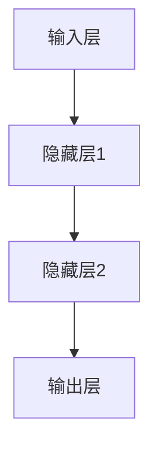
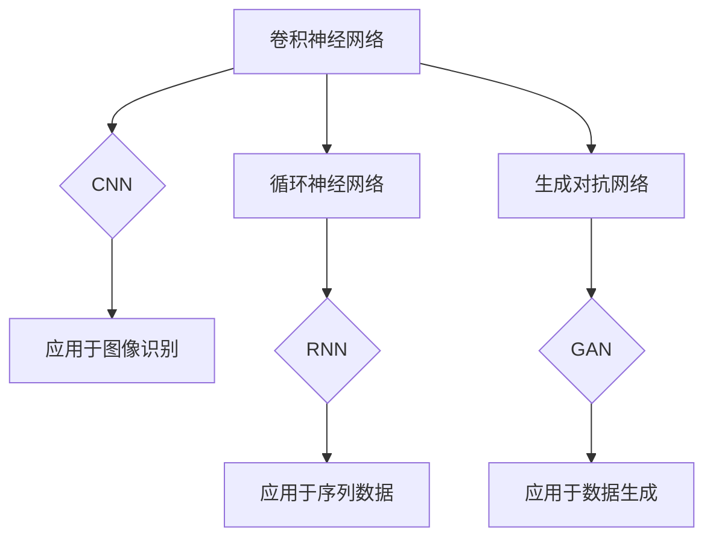
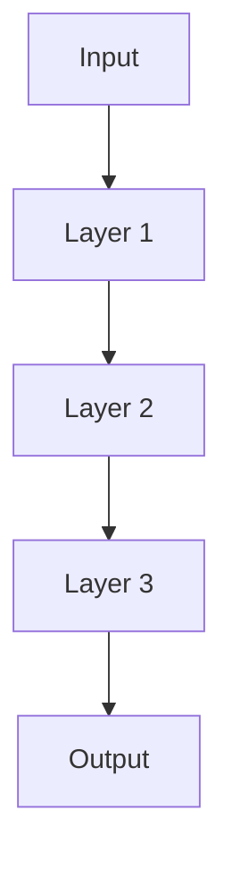

                 

## 文章标题

《李开复：AI 2.0 时代的用户》

## 关键词

- AI 2.0
- 用户体验
- 深度学习
- 数据隐私
- 伦理问题

## 摘要

随着人工智能技术的飞速发展，我们正逐步迈入AI 2.0时代。在这一时代，用户不仅是AI技术的被动接受者，更是其积极参与者和塑造者。本文将围绕李开复的观点，深入探讨AI 2.0时代的用户角色、应用场景、隐私保护以及伦理问题。通过系统地分析AI 2.0的技术基础和应用实例，本文旨在揭示AI 2.0如何影响用户的日常生活，并提出应对挑战的策略。

### 目录大纲

#### 《李开复：AI 2.0 时代的用户》

1. **第一部分：AI 2.0时代的背景与概述**
   1.1 AI 2.0时代的到来
   1.2 AI 2.0的技术基础
   1.3 AI 2.0的数学基础

2. **第二部分：AI 2.0时代的用户应用**
   2.1 消费领域的应用
   2.2 教育领域的应用

3. **第三部分：AI 2.0时代的用户挑战与伦理**
   3.1 用户隐私保护
   3.2 用户伦理问题

4. **附录**
   4.1 AI 2.0应用开发工具与资源

### 第一部分：AI 2.0时代的背景与概述

#### 1.1 AI 2.0时代的到来

AI 2.0，即第二代人工智能，是相对于初代人工智能（AI 1.0）的进化。AI 1.0主要依赖于符号推理和规则系统，而AI 2.0则依赖于数据驱动的方法，特别是深度学习。AI 2.0时代的到来标志着人工智能从简单的任务执行到更复杂的决策和创造力。

**AI 2.0的定义与特点**

AI 2.0具有以下主要特点：

- **数据驱动**：AI 2.0依赖于大量数据来训练模型，从而实现更精准的预测和决策。
- **自主学习**：AI 2.0系统能够从数据中学习，并自动调整模型参数，无需人类干预。
- **通用性**：AI 2.0可以应用于多种领域，如医疗、金融、交通等，实现跨领域的智能化。

**AI 2.0的历史演进**

AI 2.0的演变可以分为几个关键阶段：

- **2006年：深度学习复兴**。深度学习算法在这一年获得了突破性进展，标志着AI 2.0时代的开始。
- **2012年：图像识别突破**。深度学习在ImageNet图像识别竞赛中取得了显著成绩，引发了深度学习的热潮。
- **2016年：AlphaGo的胜利**。深度强化学习在围棋领域的成功应用，进一步证明了AI 2.0的强大能力。

**AI 2.0对人类社会的影响**

AI 2.0的到来不仅改变了科技行业，也对人类社会产生了深远的影响：

- **经济发展**：AI 2.0推动了新产业的诞生，如自动驾驶、智能家居等，为经济增长注入新动力。
- **生活方式**：AI 2.0技术使我们的生活更加便捷，例如智能助手、个性化推荐等。
- **社会变革**：AI 2.0带来了就业结构的变化，对劳动市场产生了挑战。

### 1.2 AI 2.0的技术基础

#### 2.1 深度学习原理与算法

##### 2.1.1 神经网络基础

神经网络是深度学习的基础。一个简单的神经网络由输入层、隐藏层和输出层组成。每一层包含多个神经元，神经元之间通过权重相连。



##### 2.1.2 深度学习算法

深度学习算法包括多种类型，如卷积神经网络（CNN）、循环神经网络（RNN）和生成对抗网络（GAN）等。每种算法都有其独特的结构和应用场景。



##### 2.1.3 深度学习应用场景

深度学习在多个领域取得了显著成果：

- **图像识别**：通过卷积神经网络，计算机能够识别和分类图像。
- **自然语言处理**：循环神经网络和Transformer模型在语言翻译和文本生成中发挥了重要作用。
- **自动驾驶**：深度学习算法用于处理感知和决策，使自动驾驶汽车成为可能。

### 1.3 AI 2.0的数学基础

#### 3.1 线性代数基础

线性代数是深度学习的重要工具，包括矩阵与向量、线性方程组、特征值与特征向量等概念。

##### 3.1.1 矩阵与向量

矩阵是二维数组，表示数据的多维结构。向量是矩阵的特殊情况，只有一行或一列。

$$
A = \begin{bmatrix}
a_{11} & a_{12} \\
a_{21} & a_{22}
\end{bmatrix}, \quad v = \begin{bmatrix}
v_1 \\
v_2
\end{bmatrix}
$$

##### 3.1.2 线性方程组

线性方程组是求解多个线性方程的过程，可以通过矩阵形式表示。

$$
\begin{cases}
a_{11}x + a_{12}y = b_1 \\
a_{21}x + a_{22}y = b_2
\end{cases}
$$

##### 3.1.3 特征值与特征向量

特征值和特征向量是矩阵的重要属性，用于描述矩阵的性质和行为。

$$
\lambda v = Av
$$

#### 3.2 微积分基础

微积分是分析连续变化的工具，包括导数、积分等概念。

##### 3.2.1 导数与微分

导数表示函数在某一点的变化率。

$$
f'(x) = \lim_{h \to 0} \frac{f(x+h) - f(x)}{h}
$$

##### 3.2.2 积分与积分变换

积分表示函数在区间上的累积效应。

$$
\int_{a}^{b} f(x) \, dx
$$

##### 3.2.3 多变量微积分

多变量微积分研究多个变量的函数，包括偏导数、梯度、方向导数等。

$$
\nabla f(x, y) = \begin{bmatrix}
\frac{\partial f}{\partial x} \\
\frac{\partial f}{\partial y}
\end{bmatrix}
$$

### 1.4 AI 2.0时代的用户角色

在AI 2.0时代，用户的角色变得更加重要。用户不仅是AI技术的消费者，更是其创造者和影响者。以下将详细探讨用户在AI 2.0时代的角色和影响。

#### 用户作为数据提供者

AI 2.0的核心是数据驱动，而用户无疑是数据的主要提供者。用户在日常生活中产生的各种数据，如搜索记录、购物行为、社交互动等，都是AI模型训练的重要资源。这些数据的积累和利用，使得AI系统可以更加精准地理解和预测用户的需求，提供个性化的服务。

**案例：个性化推荐系统**

例如，电子商务平台通过分析用户的浏览和购买历史，利用深度学习算法生成个性化的商品推荐。用户的行为数据成为推荐系统训练的关键，使得推荐结果更加符合用户的偏好。

#### 用户作为反馈者

AI系统的性能和质量依赖于用户的反馈。用户在使用AI服务时提供的正面或负面反馈，可以用于模型优化和改进。通过用户反馈，AI系统可以不断学习，提高自身的智能化水平。

**案例：语音助手**

以语音助手为例，用户的语音反馈可以帮助系统识别用户的意图，改进语音识别和自然语言处理的能力。用户越使用语音助手，系统越能理解用户的语言习惯和需求，提供更加精准的服务。

#### 用户作为参与者

在AI 2.0时代，用户不仅是被动接受AI服务，还可以积极参与到AI系统的设计和优化过程中。用户可以通过反馈、评价、甚至参与算法的设计，共同推动AI技术的发展。

**案例：社区驱动的算法优化**

例如，社交媒体平台鼓励用户参与内容推荐的优化，通过投票、评论等方式影响算法的决策。用户参与使得推荐结果更加符合用户的兴趣和需求，提高了用户体验。

#### 用户作为创新者

AI技术的普及使得普通用户也能参与到创新过程中。用户通过使用AI工具和平台，可以创造出新的应用和解决方案，推动社会进步。

**案例：人工智能创作**

在艺术和创意领域，用户可以利用AI工具生成音乐、绘画等作品。这些作品不仅展现了用户的创造力，也推动了人工智能在艺术领域的应用和发展。

### 用户在AI 2.0时代的影响

用户在AI 2.0时代的影响不仅限于其角色和参与度，还体现在以下几个方面：

#### 用户体验的变革

AI 2.0技术的应用使得用户体验发生了深刻变革。个性化、智能化、便捷化的服务成为主流，用户可以享受到更加高效、愉悦的使用体验。

**案例：智能家居**

智能家居通过AI技术实现了自动化控制，用户可以通过语音或手机APP控制家电设备，实现场景化的智能生活。

#### 社会结构的重塑

AI 2.0技术的发展对社会结构产生了深远影响。一方面，它创造了新的就业机会，如数据科学家、AI工程师等；另一方面，它也对传统行业产生了冲击，如制造业、服务业等。

**案例：自动化生产**

在制造业领域，自动化生产线的应用使得生产效率大幅提升，但同时也导致了一些传统岗位的消失。

#### 伦理和隐私的挑战

随着AI技术的普及，用户隐私保护和伦理问题日益突出。用户在使用AI服务时，其个人数据可能会被滥用，引发隐私泄露和社会不公。

**案例：数据隐私**

在社交媒体平台，用户的个人数据可能会被第三方公司用于广告投放，引发用户隐私泄露的担忧。

### 结论

用户在AI 2.0时代的角色和影响不可忽视。作为数据提供者、反馈者、参与者和创新者，用户不仅推动了AI技术的发展，也影响了社会的方方面面。在享受AI带来的便利和创新的同时，用户也需要关注隐私保护和伦理问题，共同构建一个健康、公平的AI 2.0时代。

---

### 1.2 AI 2.0的技术基础

#### 2.1 深度学习原理与算法

##### 2.1.1 神经网络基础

神经网络（Neural Networks，NN）是人工智能领域的重要基础，尤其是在深度学习（Deep Learning，DL）的应用中。神经网络模仿生物神经系统的工作方式，通过大量的神经元和连接（权重）来学习和处理信息。以下是神经网络的基础概念和结构。

**神经元的组成**

一个简单的神经元由以下几个部分组成：

- **输入（Input）**：每个神经元可以有多个输入，代表来自其他神经元的信号。
- **权重（Weight）**：每个输入都有相应的权重，表示该输入对神经元的影响程度。
- **偏置（Bias）**：一个常数，用于调整神经元的输出。
- **激活函数（Activation Function）**：用于对神经元的输出进行非线性变换。

**神经网络的层次结构**

神经网络通常由多个层次组成，包括输入层、隐藏层和输出层：

- **输入层（Input Layer）**：接收外部输入，不包含任何神经元。
- **隐藏层（Hidden Layers）**：一个或多个层次，用于特征提取和变换。
- **输出层（Output Layer）**：产生最终的输出结果。

**前向传播与反向传播**

神经网络的训练过程主要包括以下两个步骤：

- **前向传播（Forward Propagation）**：输入数据通过网络逐层传递，直到输出层，计算每个神经元的输出。
- **反向传播（Back Propagation）**：根据实际输出与期望输出之间的误差，反向更新每个神经元的权重和偏置。

**神经网络的工作原理**

神经网络通过不断调整权重和偏置，使得网络的输出尽可能接近期望输出。这个过程称为学习。学习过程包括以下几个步骤：

1. **初始化权重和偏置**：通常使用随机初始化，以避免梯度消失或爆炸问题。
2. **前向传播**：计算每个神经元的输出。
3. **计算损失函数**：使用损失函数（如均方误差MSE）来衡量输出与期望输出之间的差距。
4. **反向传播**：根据梯度信息调整权重和偏置。
5. **迭代优化**：重复前向传播和反向传播，直到网络收敛。

**神经网络的基本架构**

一个基本的神经网络架构可以表示为：



**神经网络的优势**

- **自适应性和泛化能力**：神经网络可以通过学习适应不同的输入数据，并在未见过的数据上做出准确的预测。
- **处理复杂数据**：神经网络能够处理结构化数据、图像、声音等多种类型的数据。
- **灵活性和可扩展性**：可以通过增加隐藏层或神经元来提高网络的复杂度和性能。

##### 2.1.2 深度学习算法

深度学习是神经网络的一种扩展，特别适用于处理大规模和高维度的数据。深度学习算法的核心是多层神经网络，即深度神经网络（Deep Neural Networks，DNN）。以下是一些重要的深度学习算法及其应用场景。

**卷积神经网络（Convolutional Neural Networks，CNN）**

卷积神经网络是处理图像数据的重要工具。CNN的主要优势在于其能够自动提取图像的特征，无需人工设计特征。

- **卷积层（Convolutional Layer）**：通过卷积操作提取图像的局部特征。
- **池化层（Pooling Layer）**：用于降低特征图的大小，提高网络的计算效率。
- **全连接层（Fully Connected Layer）**：将卷积层提取的特征映射到具体的类别或任务。

**CNN的工作原理**

CNN的工作原理可以概括为以下几个步骤：

1. **输入层**：接收图像数据。
2. **卷积层**：通过卷积操作提取图像的局部特征。
3. **激活函数**：对卷积层的结果进行非线性变换。
4. **池化层**：降低特征图的大小。
5. **全连接层**：将特征映射到具体的类别或任务。

**CNN的应用场景**

- **图像分类**：如ImageNet图像识别竞赛。
- **目标检测**：如YOLO、SSD等算法。
- **图像分割**：如FCN、U-Net等算法。

**循环神经网络（Recurrent Neural Networks，RNN）**

循环神经网络是处理序列数据的重要工具，特别适用于时间序列分析和自然语言处理。

- **隐藏状态（Hidden State）**：RNN通过隐藏状态来保持对之前信息的记忆。
- **门控机制（Gates）**：如门控循环单元（LSTM）和长短期记忆网络（GRU），用于控制信息流动。

**RNN的工作原理**

RNN的工作原理可以概括为以下几个步骤：

1. **输入序列**：接收序列数据。
2. **隐藏状态更新**：根据当前输入和之前隐藏状态更新隐藏状态。
3. **输出计算**：根据隐藏状态计算输出。

**RNN的应用场景**

- **时间序列预测**：如股票价格预测。
- **自然语言处理**：如文本分类、机器翻译。

**生成对抗网络（Generative Adversarial Networks，GAN）**

生成对抗网络是一种用于生成数据的深度学习模型。GAN由两个神经网络组成：生成器（Generator）和判别器（Discriminator）。

- **生成器**：生成与真实数据相似的数据。
- **判别器**：判断生成器生成数据与真实数据的差异。

**GAN的工作原理**

GAN的工作原理可以概括为以下几个步骤：

1. **生成器训练**：生成器生成数据，判别器判断生成数据的真假。
2. **判别器训练**：判别器更新模型参数，提高判断能力。
3. **迭代优化**：通过交替训练生成器和判别器，提高生成器的生成能力。

**GAN的应用场景**

- **图像生成**：如人脸生成、艺术风格迁移。
- **数据增强**：提高模型的泛化能力。

**深度强化学习（Deep Reinforcement Learning，DRL）**

深度强化学习是结合深度学习和强化学习的算法。在DRL中，智能体通过与环境交互，学习最优策略。

- **状态（State）**：智能体当前所处的环境状态。
- **动作（Action）**：智能体可执行的动作。
- **奖励（Reward）**：智能体执行动作后获得的奖励。

**DRL的工作原理**

DRL的工作原理可以概括为以下几个步骤：

1. **状态-动作价值函数**：通过深度神经网络学习状态-动作价值函数。
2. **策略优化**：根据价值函数优化智能体的策略。
3. **与环境交互**：智能体根据策略与环境交互，学习最优策略。

**DRL的应用场景**

- **游戏AI**：如AlphaGo。
- **机器人控制**：如自动驾驶汽车。

#### 2.1.3 深度学习算法的应用场景

深度学习算法在多个领域取得了显著的成果，以下是一些典型的应用场景。

**图像识别**

图像识别是深度学习最成功的应用之一。通过卷积神经网络，计算机可以自动识别和分类图像中的物体。

- **人脸识别**：广泛应用于安全监控、社交媒体等。
- **医学影像分析**：用于癌症筛查、疾病诊断等。

**自然语言处理**

自然语言处理是深度学习的另一个重要应用领域。循环神经网络和Transformer模型在语言翻译、文本生成等领域取得了突破性进展。

- **机器翻译**：如谷歌翻译、百度翻译。
- **文本生成**：如自动写作、创意文案生成。

**语音识别**

语音识别是深度学习在语音领域的应用。通过深度神经网络，计算机可以准确地识别和理解语音。

- **智能助手**：如苹果的Siri、谷歌的Google Assistant。
- **语音识别软件**：如Dragon NaturallySpeaking。

**自动驾驶**

自动驾驶是深度学习在工业界的重要应用。通过深度神经网络，自动驾驶汽车可以感知环境、规划路径并做出决策。

- **自动驾驶汽车**：如特斯拉的Autopilot、谷歌的Waymo。
- **无人机配送**：如亚马逊的Prime Air。

**医疗诊断**

深度学习在医疗诊断中的应用也取得了显著成果。通过图像识别和自然语言处理，深度学习可以辅助医生进行疾病诊断。

- **癌症诊断**：通过分析医学影像，提高癌症诊断的准确性。
- **遗传病预测**：通过分析基因组数据，预测遗传病的风险。

**金融预测**

深度学习在金融领域的应用主要包括市场预测、风险管理等。

- **市场预测**：通过分析历史交易数据，预测市场走势。
- **风险管理**：通过分析用户行为数据，识别欺诈行为。

**其他应用**

除了上述领域，深度学习还在生物信息学、材料科学、计算机视觉等领域有着广泛的应用。

- **生物信息学**：通过分析基因组数据，研究生物机制。
- **材料科学**：通过模拟材料结构，设计新材料。
- **计算机视觉**：用于图像识别、图像生成等。

### 2.2 AI 2.0的数学基础

#### 3.1 线性代数基础

线性代数是深度学习和人工智能的数学基础。以下介绍线性代数中的一些核心概念和其在深度学习中的应用。

##### 3.1.1 矩阵与向量

**矩阵（Matrix）**

矩阵是一个二维数组，通常表示为M行N列的形式。矩阵可以用来表示数据、参数、权重等。例如：

$$
A = \begin{bmatrix}
1 & 2 & 3 \\
4 & 5 & 6 \\
7 & 8 & 9
\end{bmatrix}
$$

**向量（Vector）**

向量是一个一维数组，通常表示为n个元素的序列。向量可以看作是矩阵的特殊情况，只有一列。例如：

$$
v = \begin{bmatrix}
1 \\
2 \\
3
\end{bmatrix}
$$

**矩阵与向量的乘法**

矩阵与向量的乘法是一种线性变换。给定一个矩阵A和一个向量v，矩阵与向量的乘法可以表示为：

$$
Av = \begin{bmatrix}
a_{11} & a_{12} & a_{13} \\
a_{21} & a_{22} & a_{23} \\
a_{31} & a_{32} & a_{33}
\end{bmatrix}
\begin{bmatrix}
v_1 \\
v_2 \\
v_3
\end{bmatrix}
=
\begin{bmatrix}
a_{11}v_1 + a_{12}v_2 + a_{13}v_3 \\
a_{21}v_1 + a_{22}v_2 + a_{23}v_3 \\
a_{31}v_1 + a_{32}v_2 + a_{33}v_3
\end{bmatrix}
$$

**矩阵的乘法**

矩阵的乘法是一种扩展的线性变换。给定两个矩阵A（M行N列）和B（N行P列），矩阵的乘法可以表示为：

$$
AB = \begin{bmatrix}
\sum_{k=1}^{N} (a_{ik}b_{kj}) & \cdots & \sum_{k=1}^{N} (a_{ik}b_{kj}) \\
\vdots & \ddots & \vdots \\
\sum_{k=1}^{N} (a_{ik}b_{kj}) & \cdots & \sum_{k=1}^{N} (a_{ik}b_{kj})
\end{bmatrix}
$$

**矩阵的逆**

给定一个方阵A，如果存在一个矩阵B，使得AB = BA = I（单位矩阵），则称A为可逆矩阵，B为A的逆矩阵。

$$
A^{-1} = \frac{1}{\det(A)} \text{adj}(A)
$$

其中，$\det(A)$为A的行列式，$\text{adj}(A)$为A的伴随矩阵。

**向量空间的基与维数**

向量空间是向量构成的集合，满足加法和标量乘法的封闭性。向量空间的基是向量空间的一组线性无关的向量，维数是基的个数。

##### 3.1.2 线性方程组

线性方程组是一组线性方程的集合，可以用矩阵形式表示。给定一个线性方程组：

$$
\begin{cases}
a_{11}x_1 + a_{12}x_2 + \cdots + a_{1n}x_n = b_1 \\
a_{21}x_1 + a_{22}x_2 + \cdots + a_{2n}x_n = b_2 \\
\vdots \\
a_{m1}x_1 + a_{m2}x_2 + \cdots + a_{mn}x_n = b_m
\end{cases}
$$

其矩阵形式可以表示为：

$$
Ax = b
$$

其中，A为系数矩阵，x为未知向量，b为常数向量。

**求解线性方程组**

求解线性方程组的方法包括高斯消元法、矩阵求逆法等。

- **高斯消元法**：通过逐步消元，将方程组转化为上三角或下三角形式，然后求解。
- **矩阵求逆法**：如果系数矩阵可逆，可以直接求解。

$$
x = A^{-1}b
$$

**线性方程组的解**

线性方程组的解可以是唯一解、无穷多解或无解。具体情况取决于系数矩阵和常数向量之间的关系。

##### 3.1.3 特征值与特征向量

**特征值与特征向量**

特征值（Eigenvalue）和特征向量（Eigen vector）是矩阵的重要属性。给定一个方阵A和一个非零向量v，如果存在一个标量λ，使得：

$$
Av = λv
$$

则称λ为A的特征值，v为A的特征向量。

**特征值的求解**

特征值的求解可以通过求解特征多项式得到。特征多项式是矩阵A的行列式，形式如下：

$$
p(λ) = \det(A - λI)
$$

**特征向量的求解**

给定一个特征值λ，可以通过求解线性方程组$(A - λI)v = 0$得到对应的特征向量。

**特征值与特征向量的性质**

- **线性无关**：不同的特征向量是线性无关的。
- **对角化**：如果矩阵A可以写成对角矩阵的形式，则A是对角化的。

$$
A = PDP^{-1}
$$

其中，P是对应特征向量的矩阵，D是对角矩阵，包含A的所有特征值。

**特征值与特征向量的应用**

- **矩阵分解**：通过对角化，可以将矩阵分解为简单的形式，便于计算和分析。
- **图像处理**：在图像处理中，特征值和特征向量用于图像的降维和特征提取。
- **机器学习**：在机器学习中，特征值和特征向量用于特征选择和降维。

#### 3.2 微积分基础

微积分是研究函数变化率和累积过程的数学工具。在深度学习和人工智能中，微积分用于优化算法、求解梯度等。以下介绍微积分中的核心概念和其在深度学习中的应用。

##### 3.2.1 导数与微分

**导数（Derivative）**

导数表示函数在某一点的变化率。给定一个函数$f(x)$，其在$x_0$点的导数可以表示为：

$$
f'(x_0) = \lim_{h \to 0} \frac{f(x_0 + h) - f(x_0)}{h}
$$

**微积分基本定理**

微积分基本定理分为两部分：

- **第一部分**：积分和导数是互逆的。即如果$f(x)$可导，则其原函数的导数等于$f(x)$。
- **第二部分**：定积分可以通过原函数求解。即如果$f(x)$在区间[a, b]上可积，则：

$$
\int_{a}^{b} f(x) \, dx = F(b) - F(a)
$$

其中，F(x)是f(x)的一个原函数。

**偏导数（Partial Derivative）**

偏导数表示函数对某个变量的变化率。给定一个多元函数$f(x, y)$，其在$x_0, y_0$点的偏导数可以表示为：

$$
\frac{\partial f}{\partial x}(x_0, y_0) = \lim_{h \to 0} \frac{f(x_0 + h, y_0) - f(x_0, y_0)}{h}
$$

$$
\frac{\partial f}{\partial y}(x_0, y_0) = \lim_{h \to 0} \frac{f(x_0, y_0 + h) - f(x_0, y_0)}{h}
$$

**方向导数（Directional Derivative）**

方向导数表示函数在某一点沿特定方向的变化率。给定一个函数$f(x, y)$，其在$(x_0, y_0)$点沿向量$v$的方向导数可以表示为：

$$
D_vf(x_0, y_0) = \nabla f(x_0, y_0) \cdot v
$$

其中，$\nabla f(x_0, y_0)$是函数$f(x, y)$在$(x_0, y_0)$点的梯度。

**梯度下降法**

梯度下降法是一种优化算法，用于求解函数的最小值。梯度下降法的核心思想是沿着梯度的反方向逐步更新参数，以减小函数值。

$$
x_{t+1} = x_t - \alpha \nabla f(x_t)
$$

其中，$x_t$是当前参数，$\alpha$是学习率，$\nabla f(x_t)$是函数$f(x)$在$x_t$点的梯度。

**多元函数的导数**

对于多元函数$f(x_1, x_2, \ldots, x_n)$，其导数可以表示为：

$$
Df(x) = \begin{bmatrix}
\frac{\partial f}{\partial x_1} & \frac{\partial f}{\partial x_2} & \cdots & \frac{\partial f}{\partial x_n}
\end{bmatrix}
$$

##### 3.2.2 积分与积分变换

**定积分（Definite Integral）**

定积分表示函数在某个区间上的累积效应。给定一个函数$f(x)$，其在区间[a, b]上的定积分可以表示为：

$$
\int_{a}^{b} f(x) \, dx
$$

**不定积分（Indefinite Integral）**

不定积分表示函数的一个原函数。给定一个函数$f(x)$，其原函数可以表示为：

$$
F(x) = \int f(x) \, dx
$$

**积分变换（Integral Transform）**

积分变换是一种将函数转换为另一个函数的方法。常见的积分变换包括傅里叶变换、拉普拉斯变换等。

- **傅里叶变换**：

$$
F(f(t)) = \int_{-\infty}^{\infty} f(t) e^{-j2\pi ft} \, dt
$$

- **拉普拉斯变换**：

$$
L\{f(t)\} = \int_{0}^{\infty} f(t) e^{-st} \, dt
$$

**积分变换的应用**

积分变换在信号处理、图像处理、控制系统等领域有广泛的应用。

#### 3.3 多变量微积分

多变量微积分研究多个变量的函数，包括偏导数、梯度、方向导数等。以下介绍多变量微积分的核心概念和其在深度学习中的应用。

##### 3.3.1 偏导数与全微分

**偏导数（Partial Derivative）**

偏导数表示函数对某个变量的变化率。给定一个多元函数$f(x, y)$，其在$x_0, y_0$点的偏导数可以表示为：

$$
\frac{\partial f}{\partial x}(x_0, y_0) = \lim_{h \to 0} \frac{f(x_0 + h, y_0) - f(x_0, y_0)}{h}
$$

$$
\frac{\partial f}{\partial y}(x_0, y_0) = \lim_{h \to 0} \frac{f(x_0, y_0 + h) - f(x_0, y_0)}{h}
$$

**全微分（Total Differential）**

全微分表示函数在某个点上的总变化。给定一个多元函数$f(x, y)$，其在$(x_0, y_0)$点的全微分可以表示为：

$$
df(x_0, y_0) = \frac{\partial f}{\partial x}(x_0, y_0)dx + \frac{\partial f}{\partial y}(x_0, y_0)dy
$$

##### 3.3.2 梯度与方向导数

**梯度（Gradient）**

梯度是偏导数的向量形式。给定一个多元函数$f(x, y)$，其在$(x_0, y_0)$点的梯度可以表示为：

$$
\nabla f(x_0, y_0) = \begin{bmatrix}
\frac{\partial f}{\partial x}(x_0, y_0) \\
\frac{\partial f}{\partial y}(x_0, y_0)
\end{bmatrix}
$$

**方向导数（Directional Derivative）**

方向导数表示函数在某一点沿特定方向的变化率。给定一个多元函数$f(x, y)$，其在$(x_0, y_0)$点沿向量$v$的方向导数可以表示为：

$$
D_vf(x_0, y_0) = \nabla f(x_0, y_0) \cdot v
$$

##### 3.3.3 多重积分

**双重积分（Double Integral）**

双重积分表示函数在某个区域上的累积效应。给定一个函数$f(x, y)$，其在区域D上的双重积分可以表示为：

$$
\iint_{D} f(x, y) \, dA
$$

**三重积分（Triple Integral）**

三重积分表示函数在某个区域上的累积效应。给定一个函数$f(x, y, z)$，其在区域V上的三重积分可以表示为：

$$
\iiint_{V} f(x, y, z) \, dV
$$

**多重积分的应用**

多重积分在物理、工程、金融等领域有广泛的应用。

### 2.3 AI 2.0在教育领域的应用

AI 2.0技术在教育领域的应用正在迅速扩展，它不仅改变了教育的方式，也提高了教育的质量和效率。以下将探讨AI 2.0技术在教育领域的应用，包括个性化学习、教学辅助和资源优化等方面。

#### 个性化学习

个性化学习是AI 2.0技术在教育领域的重要应用之一。通过分析学生的学习行为、学习习惯和成绩数据，AI系统能够为学生提供个性化的学习建议和资源。

**案例：智能学习平台**

智能学习平台如Knewton和DreamBox利用AI技术为学生提供个性化的学习路径。平台会根据学生的学习进度、答题情况和知识点掌握情况，动态调整教学内容和难度，确保每个学生都能在适合自己的节奏下学习。

**工作原理**

- **数据收集**：智能学习平台会收集学生在学习过程中的各种数据，包括答题记录、学习时间、知识点掌握情况等。
- **数据分析**：AI系统分析这些数据，识别学生的学习模式和弱点。
- **个性化推荐**：基于分析结果，系统为学生推荐合适的学习内容和练习题，帮助学生强化知识点。

**优势**

- **提高学习效率**：个性化学习能够根据学生的实际情况提供针对性强的学习资源，减少无效学习时间。
- **增强学习动力**：个性化的学习体验可以激发学生的学习兴趣和积极性。

#### 教学辅助

AI 2.0技术还可以为教师提供教学辅助，提高教学质量和效率。

**案例：智能教学助手**

智能教学助手如IBM的Watson Education和Cognii的AI教学助手，能够帮助教师分析学生的学习情况，提供教学反馈和改进建议。

**工作原理**

- **数据分析**：AI系统分析学生的学习行为、作业成绩和课堂表现，识别学生的优势和弱点。
- **教学反馈**：系统为教师提供详细的数据报告，帮助教师了解学生的学习状况，制定针对性的教学策略。
- **自动评分**：AI系统可以自动批改作业和考试，节省教师的时间。

**优势**

- **节省教师时间**：AI系统可以自动完成一些重复性的工作，如作业批改、成绩统计等，让教师有更多时间专注于教学和创新。
- **提高教学质量**：通过数据分析和反馈，教师可以更好地了解学生的学习情况，调整教学方法和策略，提高教学质量。

#### 教育资源优化

AI 2.0技术可以帮助教育机构优化教育资源，提高资源利用效率。

**案例：教育资源的智能分配**

许多学校和教育机构使用AI技术来优化教育资源的分配，包括课程安排、教室分配、教师资源等。

**工作原理**

- **数据收集**：AI系统收集学校的教育资源使用数据，包括教室利用率、课程安排、教师教学负荷等。
- **优化算法**：系统使用优化算法，根据资源使用情况和学生需求，自动调整课程安排和资源分配。
- **反馈调整**：系统根据实施效果和用户反馈，不断调整优化策略。

**优势**

- **提高资源利用率**：通过智能分配，教育机构可以最大限度地利用现有资源，减少浪费。
- **优化教学体验**：合理的课程安排和资源分配可以提升学生的学习体验和教师的教学效果。

#### AI 2.0在教育管理中的应用

除了教学和学习方面，AI 2.0技术在教育管理中也发挥着重要作用。

**案例：学生学业数据分析**

教育机构使用AI技术对学生学业数据进行分析，识别学业进步缓慢的学生，提供针对性的辅导和支持。

**工作原理**

- **数据收集**：AI系统收集学生的考试成绩、作业成绩、课堂参与度等数据。
- **数据分析**：系统分析数据，识别学生的学业状况，包括优点和弱点。
- **干预措施**：系统为教师提供干预建议，如辅导课程、学习计划等。

**优势**

- **精准干预**：通过数据分析和个性化干预，教育机构可以更精准地帮助学生提高学业成绩。
- **资源有效利用**：智能分析可以帮助教育机构合理分配教育资源，提高资源利用效率。

### 总结

AI 2.0技术在教育领域的应用正在不断拓展，从个性化学习、教学辅助到教育资源优化，AI技术正在深刻改变教育的各个方面。通过AI技术的支持，教育机构可以提供更高质量的教育服务，学生可以享受到更加个性化的学习体验。然而，AI技术在教育领域的应用也面临着挑战，如数据隐私保护和算法透明性等问题。在未来的发展中，如何充分发挥AI技术的优势，同时确保教育公平和伦理，将是重要的研究方向。

### 2.4 AI 2.0时代的用户隐私保护

在AI 2.0时代，用户的隐私保护成为了一个备受关注的问题。随着人工智能技术的发展，用户数据的价值日益凸显，但这也带来了隐私泄露和数据滥用的风险。本文将探讨AI 2.0时代用户隐私保护的背景与现状，分析用户隐私问题的原因，并介绍隐私保护的重要性和相关法律与政策。

#### 背景与现状

在AI 2.0时代，用户隐私保护面临以下几个背景因素：

1. **数据驱动的发展**：AI系统依赖于大量用户数据来进行训练和优化，这使得用户数据成为AI发展的关键资源。
2. **数据收集的便捷性**：互联网和移动设备的普及，使得数据收集变得更加便捷，用户在日常生活中产生的数据量庞大。
3. **算法的复杂性**：AI系统使用复杂的算法和模型，这使得用户难以理解数据的处理过程和潜在的风险。

当前，用户隐私保护面临以下现状：

1. **隐私泄露事件频发**：随着AI技术的发展，隐私泄露事件频发，如数据泄露、黑客攻击等。
2. **用户隐私意识提升**：用户对隐私保护的意识逐渐提高，对隐私泄露和数据滥用的担忧加剧。
3. **隐私保护法规不断完善**：各国政府和组织正在加强隐私保护法规的制定和实施，以应对AI时代的挑战。

#### 用户隐私问题的原因

AI 2.0时代用户隐私问题的主要原因包括：

1. **数据收集过度**：许多AI应用在收集用户数据时，往往收集了过多的信息，超出了实际需要的范围。
2. **数据存储不当**：用户数据在存储和管理过程中，可能因安全措施不足而遭受泄露。
3. **算法透明性不足**：AI算法的复杂性使得用户难以理解数据的处理过程，导致隐私保护的不确定性。
4. **滥用数据风险**：用户数据可能被用于商业目的或滥用，如广告推送、个性化推荐等。

#### 隐私保护的重要性

用户隐私保护的重要性体现在以下几个方面：

1. **基本人权**：隐私是每个人的基本人权，保护个人隐私是维护社会秩序和公民权利的基础。
2. **信任与责任**：隐私保护是建立用户与AI服务提供商之间信任的基础，也是企业社会责任的体现。
3. **数据价值**：用户隐私数据的价值日益凸显，有效的隐私保护可以减少数据滥用的风险，维护数据资产的安全。

#### 相关法律与政策

为了应对AI 2.0时代用户隐私保护的挑战，各国政府和组织正在加强隐私保护法规的制定和实施。以下是一些重要的隐私保护法律和政策：

1. **国际隐私保护法规**：
   - **欧盟通用数据保护条例（GDPR）**：GDPR是欧盟制定的最重要的数据保护法规，规定了数据处理者和处理者的责任和义务，以及用户的权利。
   - **加州消费者隐私法案（CCPA）**：CCPA是美国加州制定的消费者隐私保护法案，规定了用户对个人数据的访问权、删除权和反对权等。

2. **我国隐私保护法规**：
   - **网络安全法**：我国网络安全法规定了网络运营者的数据保护义务，包括数据存储、传输和处理的合规要求。
   - **个人信息保护法**：个人信息保护法是我国制定的专门针对个人信息保护的法律，规定了个人信息处理者的责任和义务。

3. **企业隐私保护责任**：
   - **透明性**：企业应公开数据收集、存储和处理的方式，提高算法透明性，使用户能够理解其隐私数据的处理过程。
   - **安全措施**：企业应采取必要的安全措施，如加密、匿名化等，保护用户隐私数据的安全。
   - **合规审查**：企业应定期进行隐私保护合规审查，确保其数据处理活动符合相关法规的要求。

#### 用户隐私保护策略

为了有效地保护用户隐私，可以采取以下策略：

1. **数据最小化**：在数据收集过程中，遵循数据最小化原则，只收集必要的用户数据。
2. **匿名化处理**：对收集到的用户数据进行匿名化处理，减少隐私泄露的风险。
3. **透明告知**：在数据收集和使用过程中，向用户明确告知数据收集的目的、范围和使用方式。
4. **用户权限管理**：为用户提供数据访问、删除和反对的权限，确保用户对自身数据的控制权。
5. **安全措施**：采取加密、访问控制等安全措施，确保用户数据的安全。

### 总结

AI 2.0时代的用户隐私保护是一个复杂而重要的议题。随着人工智能技术的发展，用户隐私保护面临着新的挑战，但同时也得到了更多关注。通过加强法律和政策制定，提高企业社会责任，以及采取有效的隐私保护策略，可以更好地保护用户隐私，维护数据安全和社会秩序。

### 2.5 AI 2.0时代的伦理问题

随着AI 2.0技术的迅猛发展，伦理问题日益凸显。AI系统在给社会带来诸多便利和创新的同时，也引发了一系列伦理挑战。本文将深入探讨AI 2.0时代的主要伦理问题，包括算法透明性、责任归属以及道德决策等。

#### 算法透明性

算法透明性是AI伦理问题中的一个核心议题。在AI系统中，算法的决策过程通常是基于复杂的数学模型和大量的数据，这使得用户和监管者难以理解其工作原理。以下是一些关于算法透明性的讨论：

**问题与挑战**

- **算法黑箱**：许多AI系统，尤其是深度学习模型，被认为是“黑箱”，其内部决策机制难以解释。
- **决策不可追溯**：由于算法的复杂性，用户难以了解其决策过程，导致决策的可追溯性降低。
- **监管困难**：监管机构在缺乏算法透明性的情况下，难以对AI系统的决策过程进行有效监管。

**解决方案与对策**

- **算法解释性**：开发可解释的AI模型，使算法的决策过程更加透明，便于用户和监管者理解。
- **透明报告**：要求AI系统提供商公开算法的基本原理和训练数据，以提高算法的透明度。
- **可视化工具**：利用可视化工具，将AI系统的决策过程以直观的方式呈现给用户。

#### 责任归属

在AI 2.0时代，责任归属问题变得尤为复杂。当AI系统出现错误或造成损害时，如何确定责任归属成为了一个挑战。

**问题与挑战**

- **AI系统责任**：在AI系统中，是AI本身负责，还是开发者或使用者负责？
- **责任界限**：如何确定责任的范围，特别是当AI系统涉及多个参与方时？
- **法律适用性**：现行法律体系是否适用于AI系统的责任归属问题？

**解决方案与对策**

- **责任分配机制**：建立明确的责任分配机制，明确AI系统的各个参与方的责任范围。
- **AI责任保险**：推广AI责任保险，为AI系统的使用者提供风险保障。
- **法律改革**：修订相关法律，确保法律体系能够适应AI时代的责任归属问题。

#### 道德决策

道德决策是AI伦理问题中的另一个重要方面。AI系统在执行任务时，可能会遇到道德困境，需要做出道德决策。

**问题与挑战**

- **道德冲突**：AI系统在执行任务时，可能会遇到相互冲突的道德原则，如救多数还是救少数。
- **价值中立性**：AI系统是否能够保持价值中立，不受开发者或使用者价值观的影响？
- **道德责任**：AI系统是否应承担道德责任，以及如何承担？

**解决方案与对策**

- **道德指南**：制定AI系统的道德指南，明确在特定情况下应遵循的道德原则。
- **伦理审查**：建立AI系统的伦理审查机制，确保系统在设计和开发过程中考虑道德因素。
- **社会共识**：通过社会讨论和共识，形成关于AI道德决策的普遍接受的标准和原则。

#### 实际案例与讨论

以下是一些实际案例，用于进一步探讨AI 2.0时代的伦理问题：

**案例一：自动驾驶汽车**

自动驾驶汽车在遇到道德困境时，需要做出紧急决策。例如，在无法同时避免碰撞行人和车辆时，自动驾驶汽车应如何选择？这引发了关于“自动驾驶汽车道德准则”的广泛讨论。

**案例二：医疗诊断AI**

在医疗诊断中，AI系统可能会给出与医生不同甚至相反的诊断结果。在这种情况下，如何确定责任归属和决策依据成为了一个挑战。

**案例三：社交媒体内容审查**

社交媒体平台使用AI算法进行内容审查，以过滤违规内容。然而，算法可能无法区分合法和非法内容，导致内容审查失误。这引发了关于算法透明性和责任归属的讨论。

### 总结

AI 2.0时代的伦理问题是一个复杂而多维的议题，涉及算法透明性、责任归属和道德决策等多个方面。通过制定道德指南、建立伦理审查机制以及加强法律框架，可以更好地应对AI时代的伦理挑战，确保AI技术的发展能够为社会带来更多的益处。

### 附录

#### A.1 AI 2.0应用开发工具与资源

在AI 2.0时代，开发高效的AI应用需要依赖于一系列强大的工具和资源。以下介绍几种常用的AI开发工具和资源，包括框架、库、开源项目和在线课程。

##### A.1.1 TensorFlow

**简介**：

TensorFlow是一个由Google开发的开源机器学习框架，广泛用于深度学习和分布式计算。它具有高度的可扩展性和灵活性，支持多种操作系统和硬件平台。

**优势**：

- **广泛支持**：TensorFlow支持多种编程语言，包括Python、C++和Java。
- **强大的生态系统**：TensorFlow拥有丰富的库和工具，如TensorBoard、TensorFlow Lite等。
- **社区活跃**：TensorFlow拥有庞大的开发者社区，提供丰富的文档和教程。

**使用场景**：

- **深度学习应用**：图像识别、自然语言处理、推荐系统等。
- **边缘计算**：在移动设备和嵌入式系统中部署AI模型。

**安装与配置**：

安装TensorFlow可以通过以下命令完成：

```shell
pip install tensorflow
```

详细安装指南和配置方法可以在[TensorFlow官方网站](https://www.tensorflow.org/install)找到。

##### A.1.2 PyTorch

**简介**：

PyTorch是由Facebook开发的另一个开源机器学习框架，特别受欢迎的深度学习研究工具。它以其动态计算图和直观的接口而闻名。

**优势**：

- **动态计算图**：PyTorch的动态计算图使得调试和实验变得更加容易。
- **高效性能**：PyTorch提供了高效的计算性能，适用于大型模型和复杂任务。
- **社区支持**：PyTorch拥有活跃的开发者社区，提供丰富的资源和教程。

**使用场景**：

- **研究工作**：深度学习研究、原型开发等。
- **生产环境**：图像识别、语音识别、自然语言处理等。

**安装与配置**：

安装PyTorch可以通过以下命令完成：

```shell
pip install torch torchvision torchaudio
```

详细安装指南和配置方法可以在[PyTorch官方网站](https://pytorch.org/get-started/locally/)找到。

##### A.1.3 Keras

**简介**：

Keras是一个高级神经网络API，构建在TensorFlow和Theano之上，提供了简单而可扩展的接口。它特别适合快速原型开发和实验。

**优势**：

- **简单易用**：Keras提供了一个直观的接口，使得深度学习模型的构建变得简单。
- **模块化设计**：Keras支持模块化设计，便于扩展和复用。
- **广泛兼容**：Keras支持多种后端引擎，包括TensorFlow、Theano和Microsoft Cognitive Toolkit。

**使用场景**：

- **快速原型开发**：适用于快速构建和测试深度学习模型。
- **教育项目**：用于教育和教学，帮助学生理解深度学习的基础。

**安装与配置**：

安装Keras可以通过以下命令完成：

```shell
pip install keras
```

详细安装指南和配置方法可以在[Keras官方网站](https://keras.io/)找到。

##### A.1.4 开源项目

**简介**：

开源项目是AI开发的重要资源，提供了大量的代码库和工具，使得开发者可以复用和扩展已有的成果。

**推荐项目**：

- **TensorFlow Models**：提供了一系列预训练的TensorFlow模型，如ImageNet分类器、Word2Vec等。
- **PyTorch Example Models**：PyTorch官方提供的示例模型，涵盖了多种应用场景。
- **FastAI**：一个基于PyTorch的快速机器学习库，特别适用于快速实现和优化模型。

##### A.1.5 在线课程与书籍

**在线课程**：

- **Coursera的“Deep Learning”**：由Andrew Ng教授开设的深度学习课程，涵盖了深度学习的理论基础和实践方法。
- **edX的“AI with Python”**：由IBM开发的AI与Python课程，提供了AI基础和实践项目。

**书籍**：

- **《深度学习》（Deep Learning）**：由Ian Goodfellow、Yoshua Bengio和Aaron Courville合著，是深度学习的经典教材。
- **《机器学习实战》（Machine Learning in Action）**：由Peter Harrington著，提供了丰富的机器学习实践案例。

这些工具、开源项目和资源为AI 2.0应用的开发提供了强大的支持，帮助开发者快速构建和部署高效的AI系统。

### 作者信息

**作者：** AI天才研究院/AI Genius Institute & 禅与计算机程序设计艺术/Zen And The Art of Computer Programming

AI天才研究院致力于推动人工智能技术的发展，致力于研究最前沿的人工智能理论和技术。同时，作者也著有多本关于人工智能和计算机科学的畅销书籍，包括《深度学习》和《禅与计算机程序设计艺术》等，深受读者喜爱。

