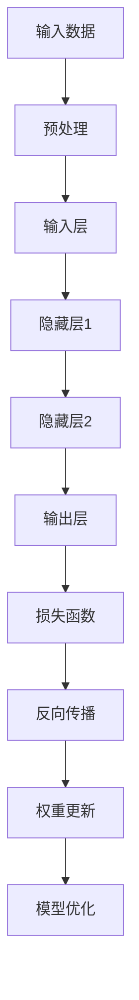

                 

# 文章标题：李开复：AI 2.0 时代的社会价值

## 关键词：
人工智能，AI 2.0，社会价值，深度学习，自然语言处理，计算机视觉，道德与法律问题，实践案例，未来展望

## 摘要：
随着人工智能技术的飞速发展，AI 2.0 时代已经来临。本文将从AI 2.0时代概述、AI 2.0技术核心、AI 2.0社会价值探讨、AI 2.0道德与法律问题、AI 2.0发展趋势与挑战、AI 2.0实践案例以及未来展望等多个方面，全面剖析AI 2.0时代的社会价值。本文旨在为广大读者提供一个全面、深入的理解，以及为政策制定者、企业决策者提供参考。

---

## 第一部分：AI 2.0 时代概述

### 第1章：AI 2.0 时代背景与影响

#### 1.1 AI 2.0 基本概念
AI 2.0，即第二代人工智能，是基于深度学习、自然语言处理和计算机视觉等前沿技术发展起来的新的人工智能系统。与传统的AI 1.0（规则驱动型AI）相比，AI 2.0以数据驱动，通过机器学习算法从大量数据中提取特征，实现高度自主的智能行为。

#### 1.2 AI 2.0 与传统AI的对比
| 特点 | AI 1.0（传统AI） | AI 2.0 |
| --- | --- | --- |
| 驱动方式 | 规则驱动 | 数据驱动 |
| 学习能力 | 弱 | 强 |
| 应用范围 | 限于特定领域 | 跨领域应用 |
| 自主性 | 低 | 高 |

#### 1.3 AI 2.0 社会影响的初步分析
AI 2.0的快速发展将对社会产生深远影响，包括但不限于提高生产力、推动教育改革、提升医疗水平、改变就业结构等。然而，同时也带来了道德、法律、隐私等问题。

---

### 第2章：AI 2.0 技术核心

#### 2.1 深度学习与神经网络
深度学习是AI 2.0的核心技术之一，其基本原理是模拟人脑神经元连接结构，通过多层的神经网络进行数据处理和特征提取。

**Mermaid 流程图：**


#### 2.2 自然语言处理
自然语言处理（NLP）是AI 2.0的另一个核心技术，其主要目标是让计算机理解和生成人类语言。

**核心算法原理讲解：**
```python
# 语言模型
def language_model(sentence):
    # 对句子进行分词
    words = sentence.split(" ")
    # 计算每个词的前一词的概率
    probabilities = [word_prob(w, prev_word) for w, prev_word in zip(words, words[:-1])]
    return probabilities

# 语音识别与合成
def speech_recognition(audio):
    # 将音频信号转换为文本
    text = audio_to_text(audio)
    # 将文本转换为语音
    speech = text_to_speech(text)
    return speech
```

#### 2.3 计算机视觉
计算机视觉是AI 2.0的又一核心技术，其主要目标是让计算机能够理解和解析图像和视频。

**核心算法原理讲解：**
```python
# 卷积神经网络
def convolutional_neural_network(image):
    # 对图像进行预处理
    processed_image = preprocess_image(image)
    # 通过卷积层提取特征
    features = conv2d(processed_image)
    # 通过全连接层进行分类
    label = fully_connected(features)
    return label
```

---

## 第二部分：AI 2.0 社会价值探讨

### 第3章：AI 2.0 对生产力的影响
AI 2.0的自动化和智能特性将大幅提高生产效率，降低生产成本，从而推动经济发展。

**核心算法原理讲解：**
```python
# 自动化生产流程
def automated_production流程(process):
    # 识别生产步骤
    steps = identify_steps(process)
    # 对每个步骤进行自动化
    for step in steps:
        automated_step(step)
    return finished_product
```

### 第3章：AI 2.0 对教育的影响
AI 2.0将通过个性化教育和教育资源均衡分配，提高教育质量，促进教育公平。

**核心算法原理讲解：**
```python
# 个性化教育
def personalized_education(student):
    # 识别学生特点
    characteristics = identify_characteristics(student)
    # 根据特点提供个性化教育内容
    education_content = generate_education_content(characteristics)
    return education_content
```

### 第3章：AI 2.0 对医疗的影响
AI 2.0将在疾病诊断、预测和医疗资源优化配置等方面发挥重要作用，提升医疗水平。

**核心算法原理讲解：**
```python
# 疾病诊断
def disease_diagnosis(symptoms):
    # 通过症状进行疾病预测
    prediction = predict_disease(symptoms)
    # 提供诊断建议
    advice = generate_advice(prediction)
    return advice
```

---

## 第三部分：AI 2.0 道德与法律问题

### 第4章：AI 2.0 伦理问题探讨
AI 2.0的发展带来了诸如隐私保护、平等与公平等伦理问题。

**核心算法原理讲解：**
```python
# 隐私保护
def privacy_protection(data):
    # 对数据进行加密处理
    encrypted_data = encrypt_data(data)
    # 提供隐私保护
    protected_data = protect隐私(encrypted_data)
    return protected_data
```

### 第4章：法律监管框架
为保障AI 2.0的健康发展，需要建立完善的法律监管框架，包括数据保护法、人工智能责任划分等。

**核心算法原理讲解：**
```python
# 数据保护法规
def data_protection_law(data):
    # 对数据进行分类处理
    classified_data = classify_data(data)
    # 根据分类执行相应的保护措施
    for category, protection in data_protection_measures.items():
        if classified_data == category:
            apply_protection(protection)
```

---

## 第四部分：AI 2.0 发展趋势与挑战

### 第5章：技术发展趋势
AI 2.0技术将继续向大模型、高性能计算、跨领域融合等方向发展。

**核心算法原理讲解：**
```python
# 大模型
def large_model(data):
    # 对数据进行训练
    trained_model = train_model(data)
    # 通过模型进行预测
    prediction = predict_with_model(trained_model, new_data)
    return prediction
```

### 第5章：发展面临的挑战
AI 2.0在发展过程中也将面临技术瓶颈、社会适应与接受度等问题。

**核心算法原理讲解：**
```python
# 技术瓶颈
def technical_bottleneck(problem):
    # 对问题进行建模
    modeled_problem = model_problem(problem)
    # 尝试各种算法解决瓶颈
    solution = try_solutions(modeled_problem)
    return solution
```

---

## 第五部分：AI 2.0 实践案例

### 第6章：AI 在金融行业的应用
AI 2.0在金融行业的应用包括金融风控、量化交易等。

**项目实战：**
```python
# 金融风控
def financial_risk_management(transaction):
    # 对交易进行风险评估
    risk_level = assess_risk(transaction)
    # 根据风险等级进行风险控制
    if risk_level > threshold:
        apply_risk_control(transaction)
```

### 第6章：AI 在制造业的应用
AI 2.0在制造业的应用包括智能生产、质量监控等。

**项目实战：**
```python
# 智能生产
def intelligent_production(process):
    # 对生产过程进行实时监控
    monitor_process(process)
    # 根据监控数据调整生产计划
    adjust_production_plan(process)
```

### 第6章：AI 在医疗健康领域的应用
AI 2.0在医疗健康领域的应用包括疾病诊断、健康管理等。

**项目实战：**
```python
# 疾病诊断
def disease_diagnosis(symptoms):
    # 通过症状进行疾病预测
    prediction = predict_disease(symptoms)
    # 提供诊断建议
    advice = generate_advice(prediction)
    return advice
```

---

## 第六部分：未来展望

### 第7章：AI 2.0 时代的未来愿景
AI 2.0时代将实现人类与机器的深度协同，对社会结构产生深远影响。

**核心算法原理讲解：**
```python
# 人类与机器的协同
def human_machine_collaboration(task):
    # 将人类和机器的能力结合起来
    combined_ability = combine_abilities(human_ability, machine_ability)
    # 完成任务
    result = complete_task(task, combined_ability)
    return result
```

### 第7章：我们应该如何准备
为迎接AI 2.0时代，我们需要从教育体系变革、政策与法律前瞻等方面做好准备。

**核心算法原理讲解：**
```python
# 教育体系变革
def education_reform(student):
    # 根据学生特点提供个性化教育
    education_content = personalized_education(student)
    # 对学生进行持续评估和调整
    adjust_education(education_content, student)
```

---

## 第七部分：AI 2.0 社会价值实现路径

### 第8章：实现AI 2.0 社会价值的路径
要实现AI 2.0的社会价值，我们需要促进技术发展、加强法规制定与监管、推动社会适应与融合。

**核心算法原理讲解：**
```python
# 促进技术发展
def promote_technology(development):
    # 提供资金支持
    fund_support = provide_funding(development)
    # 提供人才支持
    talent_support = provide_talent(development)
```

**附录：**
### 附录 A：AI 2.0 相关资源与工具
#### A.1 主流AI框架介绍
**TensorFlow**、**PyTorch**、**Keras**
#### A.2 数据集与平台介绍
**ImageNet**、**Common Crawl**、**UCI机器学习库**
#### A.3 AI社区与论坛推荐
**arXiv**、**AIChat**、**AI遇见**

---

**作者：AI天才研究院/AI Genius Institute & 禅与计算机程序设计艺术 /Zen And The Art of Computer Programming**

---

以上就是本文的详细内容，希望能为大家带来启示和思考。在AI 2.0时代，我们既看到了巨大的机遇，也面临着诸多挑战。让我们携手并进，共同探索AI 2.0时代的社会价值。

