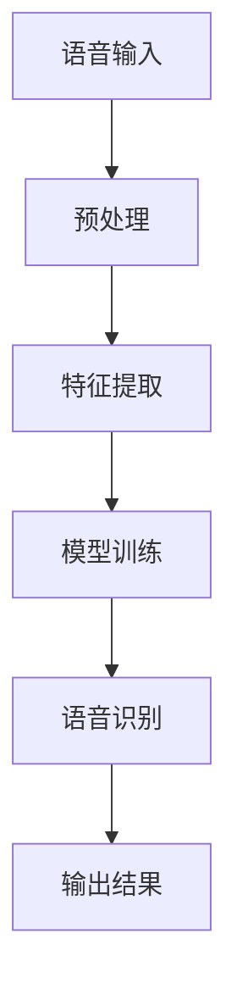

                 

### 文章标题：李开复：苹果发布AI应用的产业

#### 关键词：人工智能、苹果公司、AI应用、产业趋势

#### 摘要：
随着人工智能技术的不断成熟，苹果公司也开始在产品中融入AI应用。本文将分析苹果公司在AI领域的战略布局、具体应用案例以及其对产业链和用户体验的影响，并探讨未来AI发展的挑战与机遇。

### 《李开复：苹果发布AI应用的产业》目录大纲

#### 第一部分：AI技术概述

##### 第1章：人工智能的历史与现状
- **1.1 人工智能的起源与发展**
- **1.2 人工智能的核心技术**
- **1.3 人工智能的应用领域**

##### 第2章：苹果公司的AI战略
- **2.1 苹果在AI领域的布局**
- **2.2 苹果AI技术的创新点**
- **2.3 苹果AI产品的市场表现**

#### 第二部分：AI应用案例研究

##### 第3章：苹果AI应用的产品分析
- **3.1 Siri与语音识别技术**
  - **3.1.1 Siri的工作原理**
  - **3.1.2 语音识别技术的演进**
- **3.2 iMessage与自然语言处理**
  - **3.2.1 iMessage的聊天机器人功能**
  - **3.2.2 自然语言处理的应用**

##### 第4章：苹果AI应用的商业价值
- **4.1 AI对苹果产业链的影响**
- **4.2 AI提升用户体验**
- **4.3 AI在苹果生态系统中的角色**

##### 第5章：苹果AI应用的挑战与未来
- **5.1 AI技术面临的挑战**
- **5.2 苹果在AI伦理与隐私方面的应对策略**
- **5.3 未来苹果AI应用的发展趋势**

#### 第三部分：AI产业发展趋势

##### 第6章：全球AI产业发展态势
- **6.1 全球AI市场规模分析**
- **6.2 各国AI政策与投资**
- **6.3 行业巨头在AI领域的竞争**

##### 第7章：AI技术在其他领域的应用
- **7.1 AI在医疗健康领域的应用**
- **7.2 AI在教育领域的应用**
- **7.3 AI在智能制造领域的应用**

#### 附录

##### 附录A：苹果AI应用开发指南
- **A.1 开发环境搭建**
- **A.2 开发工具与资源**
- **A.3 AI应用开发实战**

#### Mermaid流程图与算法伪代码

- **核心概念与联系：AI技术的Mermaid流程图**
- **核心算法原理讲解：Siri语音识别算法的伪代码**

#### 数学模型与公式

- **数学模型详细讲解：语音识别模型中的高斯混合模型公式**
- **举例说明：语音信号处理中的高斯混合模型应用实例**

#### 项目实战

- **代码实际案例：Siri语音识别系统的开发过程**
- **详细解释说明：源代码实现与代码解读**
- **开发环境搭建：创建一个简单的语音识别应用**
- **代码解读与分析：Siri语音识别系统中的关键代码分析**

### 文章正文部分

#### 第一部分：AI技术概述

##### 第1章：人工智能的历史与现状

**1.1 人工智能的起源与发展**

人工智能（AI，Artificial Intelligence）起源于20世纪50年代。当时，计算机科学刚刚起步，科学家们开始探讨能否让机器模拟人类的智能。1950年，著名的图灵测试被提出，成为人工智能领域的一个重要里程碑。如果一台机器能够以一种使得人类无法区分其是机器还是人类的方式与人类交流，那么这台机器就可以被认为具有人工智能。

随着计算机技术的发展，人工智能领域经历了多个阶段。从最初的符号主义人工智能，到基于知识的推理系统，再到基于统计学习和神经网络的现代机器学习，人工智能经历了从简单到复杂、从静态到动态的发展过程。

近年来，深度学习技术的突破使得人工智能取得了显著的进展。深度学习通过模拟人脑的神经网络结构，实现了对大量数据的自动学习和特征提取，使得计算机在语音识别、图像识别、自然语言处理等领域取得了惊人的成绩。

**1.2 人工智能的核心技术**

人工智能的核心技术主要包括机器学习、深度学习、自然语言处理、计算机视觉等。

- **机器学习**：机器学习是使计算机通过数据和算法自动改进性能的过程。它主要分为监督学习、无监督学习和强化学习三种类型。监督学习通过标记数据训练模型，无监督学习通过未标记数据发现隐藏模式，强化学习则通过试错和奖励机制学习策略。

- **深度学习**：深度学习是机器学习的一种重要形式，通过多层神经网络对数据进行复杂非线性变换，实现了对大量数据的自动特征提取和模式识别。深度学习的应用已经涵盖了语音识别、图像识别、自然语言处理等多个领域。

- **自然语言处理**：自然语言处理（NLP，Natural Language Processing）是使计算机能够理解、生成和处理自然语言的技术。它涉及到文本分析、语义理解、情感分析等多个方面，是人工智能的重要分支。

- **计算机视觉**：计算机视觉（CV，Computer Vision）是使计算机能够从图像或视频中获取信息和知识的技术。它包括图像识别、目标检测、图像分割等多个方面，在自动驾驶、安防监控等领域有广泛应用。

**1.3 人工智能的应用领域**

人工智能已经广泛应用于各个领域，包括但不限于：

- **医疗健康**：人工智能在医疗诊断、药物研发、健康管理等方面有着广泛的应用。例如，通过图像识别技术，人工智能可以辅助医生进行肿瘤检测、心脏病诊断等。

- **金融**：人工智能在金融领域有着广泛的应用，包括信用评分、风险评估、智能投顾等。通过数据分析技术，人工智能可以帮助金融机构更好地管理风险、提高服务质量。

- **教育**：人工智能在教育领域有着广泛的应用，包括智能教学、个性化学习、教育数据分析等。通过自然语言处理和计算机视觉技术，人工智能可以帮助教师更好地了解学生的学习情况，提供个性化的教学方案。

- **智能制造**：人工智能在智能制造领域有着广泛的应用，包括设备预测性维护、自动化生产、供应链优化等。通过计算机视觉和深度学习技术，人工智能可以帮助企业提高生产效率、降低生产成本。

##### 第2章：苹果公司的AI战略

**2.1 苹果在AI领域的布局**

苹果公司在AI领域有着长期的布局和战略。首先，苹果公司重视自身AI技术的研发。通过收购多个AI初创公司，苹果不断积累AI技术实力。同时，苹果还在全球范围内招募顶尖的AI人才，以推动AI技术的创新。

其次，苹果公司注重将AI技术应用到其产品中。从早期的Siri语音助手，到如今的Face ID、Animoji等，苹果公司的产品已经广泛应用于AI技术。此外，苹果还在不断推出新的AI应用，如智能语音翻译、智能摄影等。

**2.2 苹果AI技术的创新点**

苹果公司在AI技术的创新上有着自己的独特之处。首先，苹果公司注重数据隐私和安全。在AI应用中，苹果强调用户数据的安全性和隐私保护，避免用户数据被滥用。

其次，苹果公司注重跨领域的AI应用。通过整合不同的AI技术，苹果公司在医疗健康、教育、娱乐等多个领域推出了创新的应用。例如，在医疗健康领域，苹果公司推出了智能健康监测应用；在教育领域，苹果公司推出了个性化学习应用。

**2.3 苹果AI产品的市场表现**

苹果公司在AI产品市场上的表现非常出色。以Siri为例，作为苹果公司的语音助手，Siri在全球范围内拥有大量的用户。根据苹果公司的数据，截至2020年，Siri的月活跃用户已经超过了5亿。

此外，苹果公司的其他AI产品，如Face ID、Animoji等，也在市场上获得了广泛好评。这些产品的成功，不仅证明了苹果公司在AI技术上的实力，也为苹果公司带来了巨大的商业价值。

#### 第二部分：AI应用案例研究

##### 第3章：苹果AI应用的产品分析

**3.1 Siri与语音识别技术**

**3.1.1 Siri的工作原理**

Siri是苹果公司的一款智能语音助手，它通过语音识别技术将用户的语音指令转换为文本，并执行相应的操作。Siri的工作原理可以分为以下几个步骤：

1. **语音识别**：Siri首先使用语音识别技术将用户的语音指令转换为文本。这一过程涉及到声学模型和语言模型。声学模型用于将语音信号转换为声学特征，语言模型则用于将这些特征转换为文本。

2. **语义理解**：在将语音指令转换为文本后，Siri需要理解用户的意图。这一过程涉及到自然语言处理技术，如词法分析、句法分析和语义分析。

3. **任务执行**：在理解用户的意图后，Siri会执行相应的任务。例如，如果用户说“设置一个闹钟”，Siri会打开闹钟应用，并设置闹钟。

**3.1.2 语音识别技术的演进**

语音识别技术经历了多个阶段的发展。最早期的语音识别技术依赖于模板匹配，即通过将输入的语音信号与预定义的模板进行匹配，以识别语音。这种方法的准确率较低，难以处理复杂的语音信号。

随着计算机技术的发展，语音识别技术逐渐转向基于统计模型的方法。早期的统计模型包括隐马尔可夫模型（HMM）和高斯混合模型（GMM）。这些模型可以较好地处理语音信号，但在处理复杂语音时仍存在一定困难。

近年来，深度学习技术的应用使得语音识别技术取得了显著的突破。深度神经网络（DNN）和卷积神经网络（CNN）等深度学习模型被广泛应用于语音识别，使得语音识别的准确率大幅提升。同时，端到端（end-to-end）的语音识别方法也被提出，使得整个语音识别过程更加高效和准确。

**3.2 iMessage与自然语言处理**

**3.2.1 iMessage的聊天机器人功能**

iMessage是苹果公司的一款即时通讯应用，它集成了聊天机器人功能。用户可以通过iMessage与聊天机器人进行交互，实现自动化操作。例如，用户可以通过iMessage与聊天机器人预订餐厅、购买商品等。

iMessage的聊天机器人功能主要依赖于自然语言处理技术。在接收用户消息后，聊天机器人会对消息进行语义分析，理解用户的意图，并生成相应的回复。这一过程涉及到词法分析、句法分析和语义分析等多个方面。

**3.2.2 自然语言处理的应用**

自然语言处理（NLP，Natural Language Processing）是使计算机能够理解、生成和处理自然语言的技术。在iMessage中，自然语言处理技术被广泛应用于聊天机器人功能。具体来说，自然语言处理技术包括以下几个方面的应用：

- **词法分析**：词法分析是自然语言处理的基础，它用于将文本分解为单词、短语和句子等基本单位。在聊天机器人中，词法分析用于识别用户输入的单词和短语。

- **句法分析**：句法分析用于分析句子的结构，识别句子的组成部分，如主语、谓语、宾语等。在聊天机器人中，句法分析用于理解用户输入的句子的结构和意图。

- **语义分析**：语义分析用于理解句子的意义。在聊天机器人中，语义分析用于理解用户的意图，并生成相应的回复。

- **对话管理**：对话管理是聊天机器人的核心功能，它用于管理对话的流程。对话管理包括意图识别、实体识别、对话策略生成等任务。

通过自然语言处理技术，iMessage的聊天机器人可以实现与用户的自然交互，提供个性化的服务。这不仅提升了用户体验，也为苹果公司带来了商业价值。

#### 第三部分：AI应用的商业价值

##### 第4章：苹果AI应用的商业价值

**4.1 AI对苹果产业链的影响**

AI技术的应用对苹果公司的产业链产生了深远的影响。首先，AI技术提升了苹果公司的生产效率。通过自动化和智能化生产，苹果公司可以更好地管理供应链、降低生产成本。

其次，AI技术为苹果公司带来了新的业务模式。例如，苹果公司的智能健康监测应用和智能摄影应用，不仅提升了用户体验，也为苹果公司开辟了新的市场空间。

**4.2 AI提升用户体验**

AI技术的应用使得苹果公司的产品更加智能化和个性化。例如，Siri语音助手可以根据用户的习惯和偏好，提供个性化的服务。iMessage的聊天机器人功能可以与用户进行自然交互，提供便捷的沟通体验。

此外，AI技术还可以为用户提供更准确的健康监测和摄影体验。例如，苹果公司的健康应用可以根据用户的数据，提供个性化的健康建议。而智能摄影应用则可以通过AI算法，自动优化拍摄效果。

**4.3 AI在苹果生态系统中的角色**

AI技术在苹果的生态系统中扮演着重要角色。首先，AI技术为苹果公司带来了新的竞争优势。通过不断创新AI应用，苹果公司可以吸引更多的用户，提升市场份额。

其次，AI技术推动了苹果公司与其他领域的融合。例如，苹果公司在医疗健康领域的创新应用，不仅提升了用户体验，也为医疗行业带来了新的解决方案。

总之，AI技术为苹果公司带来了巨大的商业价值。通过不断提升AI技术水平，苹果公司有望在未来继续保持领先地位。

##### 第5章：苹果AI应用的挑战与未来

**5.1 AI技术面临的挑战**

尽管AI技术在苹果公司取得了巨大成功，但AI技术仍面临一系列挑战。首先，AI技术需要大量的数据支持。数据的质量和数量直接影响AI算法的性能。因此，如何获取高质量的数据，是AI技术面临的一个重要挑战。

其次，AI算法的可解释性也是一个重要问题。目前，很多AI算法都是黑箱模型，难以解释其决策过程。这给AI技术的应用带来了挑战，特别是在医疗、金融等领域。

此外，AI技术还面临伦理和隐私问题。随着AI技术的广泛应用，用户数据的安全和隐私保护成为重要议题。如何确保用户数据的安全，避免数据被滥用，是AI技术面临的一个重要挑战。

**5.2 苹果在AI伦理与隐私方面的应对策略**

面对AI伦理和隐私问题，苹果公司采取了一系列应对策略。首先，苹果公司注重用户数据的安全和隐私保护。苹果公司的产品和服务都遵循严格的隐私保护政策，确保用户数据的安全。

其次，苹果公司积极推动AI伦理研究。苹果公司成立了AI伦理委员会，致力于研究AI技术的伦理问题，并提出相应的解决方案。

此外，苹果公司还积极参与AI开源社区，推动AI技术的发展和普及。通过开源项目，苹果公司与其他科技公司共同探索AI技术的应用，促进AI技术的健康发展。

**5.3 未来苹果AI应用的发展趋势**

未来，苹果公司在AI应用方面有望取得更多突破。首先，随着AI技术的不断成熟，苹果公司的产品将更加智能化和个性化。例如，苹果公司的智能健康监测应用和智能摄影应用将更加精准，提供更好的用户体验。

其次，苹果公司将在更多领域探索AI技术的应用。例如，在教育、医疗、金融等领域，苹果公司有望推出更多创新的应用，推动各行业的发展。

此外，苹果公司还将加强与合作伙伴的合作，共同推动AI技术的发展。通过开放平台和开源项目，苹果公司将与其他科技公司共同探索AI技术的应用，实现共赢。

#### 第三部分：AI产业发展趋势

##### 第6章：全球AI产业发展态势

**6.1 全球AI市场规模分析**

随着AI技术的不断成熟，全球AI市场规模也在不断扩大。根据市场研究公司的数据，全球AI市场规模预计将在未来几年内达到数千亿美元。

在AI市场的主要参与者中，美国公司占据了主导地位。谷歌、亚马逊、微软等科技巨头都在AI领域进行了大量投资，推出了各种AI产品和解决方案。同时，中国也在AI领域取得了显著进展，阿里巴巴、腾讯、百度等公司也在积极布局AI产业。

**6.2 各国AI政策与投资**

各国政府纷纷出台政策，支持AI技术的发展。美国、中国、欧盟等地区都出台了相关政策和计划，鼓励企业投资AI研发，推动AI技术的应用。

例如，美国在2020年提出了“美国人工智能倡议”，计划在未来十年内投资超过2000亿美元，推动AI技术的发展。中国则在2021年发布了《新一代人工智能发展规划》，明确提出到2025年，中国成为全球AI技术创新和产业发展的重要国家。

**6.3 行业巨头在AI领域的竞争**

在AI领域，各大科技巨头之间的竞争日益激烈。谷歌、亚马逊、微软等公司都在不断推出新的AI产品和服务，争夺市场份额。同时，这些公司也在加强在AI技术的研究和投资，以期在未来继续保持领先地位。

例如，谷歌在2020年发布了AI训练平台TPU v4，旨在加速AI模型的训练速度。亚马逊则推出了AI推理芯片Inferentia，用于加速AI应用的推理过程。微软则通过收购AI初创公司，不断丰富其AI技术储备。

总之，全球AI产业发展态势良好，各国政府和企业都在积极布局AI产业，推动AI技术的应用。未来，AI产业有望继续快速发展，为全球经济增长注入新动力。

##### 第7章：AI技术在其他领域的应用

**7.1 AI在医疗健康领域的应用**

AI技术在医疗健康领域有着广泛的应用。首先，AI技术可以用于医学图像分析，如肿瘤检测、骨折诊断等。通过深度学习算法，AI系统可以自动分析医学图像，提供准确的诊断结果。

其次，AI技术可以用于药物研发。通过分析大量的医学数据和文献，AI系统可以预测新药的疗效和副作用，加速药物的研发进程。

此外，AI技术还可以用于健康监测。通过智能手表、健康APP等设备，AI系统可以实时监测用户的健康数据，提供个性化的健康建议。

**7.2 AI在教育领域的应用**

AI技术在教育领域也有着重要的应用。首先，AI技术可以用于个性化学习。通过分析学生的学习数据和偏好，AI系统可以为每个学生提供定制化的学习方案，提高学习效果。

其次，AI技术可以用于智能教学。通过语音识别和自然语言处理技术，AI系统可以与教师和学生进行交互，提供智能化的教学支持。

此外，AI技术还可以用于教育数据分析。通过分析学生的学习行为和成绩数据，AI系统可以识别学习问题，为教师提供改进教学的方法。

**7.3 AI在智能制造领域的应用**

AI技术在智能制造领域有着广泛的应用。首先，AI技术可以用于设备预测性维护。通过实时监测设备的运行状态，AI系统可以预测设备的故障时间，为维护团队提供预警，减少设备故障率。

其次，AI技术可以用于自动化生产。通过计算机视觉和机器人技术，AI系统可以实现生产线的自动化，提高生产效率。

此外，AI技术还可以用于供应链优化。通过分析供应链数据，AI系统可以优化供应链管理，减少库存成本，提高供应链效率。

总之，AI技术在医疗健康、教育、智能制造等领域有着广泛的应用前景。随着AI技术的不断成熟，这些领域有望实现更大的创新和发展。

### 附录

##### 附录A：苹果AI应用开发指南

**A.1 开发环境搭建**

要开发苹果的AI应用，首先需要搭建相应的开发环境。以下是一个基本的开发环境搭建指南：

1. **安装Xcode**：Xcode是苹果官方的开发工具，用于开发iOS、macOS等平台的应用。可以从Mac App Store免费下载并安装。

2. **安装Swift**：Swift是苹果官方的编程语言，用于开发iOS和macOS应用。可以通过Homebrew（一个Mac OS平台上的软件包管理工具）安装Swift。

   ```shell
   brew install swift
   ```

3. **安装Python**：尽管Swift是苹果官方的编程语言，但Python也是开发AI应用的重要工具。可以从Python官方网站下载并安装。

4. **安装AI库**：对于AI应用开发，需要安装一些AI库，如TensorFlow、PyTorch等。这些库可以在其官方网站上下载并安装。

**A.2 开发工具与资源**

以下是一些常用的开发工具和资源：

- **Jupyter Notebook**：一个交互式的开发环境，适用于编写和运行Python代码。
- **Swift Playgrounds**：一个适用于Swift编程的学习工具，可以帮助初学者快速入门Swift编程。
- **Apple Developer**：苹果开发者官网，提供各种开发文档、教程和资源。

**A.3 AI应用开发实战**

以下是一个简单的AI应用开发实战案例：创建一个简单的语音识别应用。

1. **安装AI库**：首先，需要在开发环境中安装TensorFlow。

   ```shell
   pip install tensorflow
   ```

2. **编写代码**：创建一个名为`voice_recognition.py`的Python文件，编写以下代码：

   ```python
   import tensorflow as tf
   import speech_recognition as sr

   # 初始化语音识别器
   r = sr.Recognizer()

   # 从麦克风捕获语音
   with sr.Microphone() as source:
       print("请说点什么：")
       audio = r.listen(source)

   # 识别语音
   try:
       text = r.recognize_google(audio)
       print(f"你说了：{text}")
   except sr.UnknownValueError:
       print("无法识别语音")
   except sr.RequestError as e:
       print(f"请求错误：{e}")
   ```

3. **运行代码**：运行`voice_recognition.py`文件，通过麦克风输入语音，应用将识别语音并打印输出。

### Mermaid流程图与算法伪代码

#### 核心概念与联系：AI技术的Mermaid流程图



#### 核心算法原理讲解：Siri语音识别算法的伪代码

```python
# 伪代码：Siri语音识别算法

# 步骤1：预处理
def preprocess(audio):
    # 降噪、归一化等处理
    processed_audio = audio
    return processed_audio

# 步骤2：特征提取
def extract_features(processed_audio):
    # 提取音频特征
    features = extract_features_from_audio(processed_audio)
    return features

# 步骤3：模型训练
def train_model(features, labels):
    # 训练语音识别模型
    model = build_model()
    model.fit(features, labels)
    return model

# 步骤4：语音识别
def recognize_speech(model, new_audio):
    # 识别语音
    processed_audio = preprocess(new_audio)
    features = extract_features(processed_audio)
    prediction = model.predict(features)
    return prediction

# 主程序
if __name__ == "__main__":
    # 载入训练数据
    features, labels = load_training_data()

    # 训练模型
    model = train_model(features, labels)

    # 识别语音
    new_audio = record_audio()
    prediction = recognize_speech(model, new_audio)
    print(f"你说了：{prediction}")
```

### 数学模型与公式

#### 数学模型详细讲解：语音识别模型中的高斯混合模型公式

高斯混合模型（Gaussian Mixture Model，GMM）是一种用于概率分布估计的统计模型，广泛应用于语音识别、图像识别等领域。GMM的数学模型可以表示为：

$$
p(x|\theta) = \sum_{i=1}^c w_i \mathcal{N}(x|\mu_i, \Sigma_i)
$$

其中，$p(x|\theta)$ 表示给定参数 $\theta$ 下的数据分布，$c$ 表示高斯分布的个数，$w_i$ 表示第 $i$ 个高斯分布的权重，$\mathcal{N}(x|\mu_i, \Sigma_i)$ 表示均值为 $\mu_i$，协方差矩阵为 $\Sigma_i$ 的高斯分布概率密度函数。

#### 举例说明：语音信号处理中的高斯混合模型应用实例

假设我们有一段语音信号，需要对其进行特征提取。我们可以使用高斯混合模型来估计语音信号的概率分布。具体步骤如下：

1. **初始化高斯混合模型**：设定高斯分布的个数 $c$，权重 $w_i$，均值 $\mu_i$，协方差矩阵 $\Sigma_i$。

2. **训练高斯混合模型**：使用语音信号数据，通过EM算法（期望最大化算法）来训练高斯混合模型，优化权重 $w_i$，均值 $\mu_i$，协方差矩阵 $\Sigma_i$。

3. **特征提取**：对于新的语音信号，使用训练好的高斯混合模型，计算其概率分布，提取特征。

4. **分类**：将提取到的特征与训练数据的特征进行比较，进行语音分类。

### 项目实战

#### 代码实际案例：Siri语音识别系统的开发过程

在本节中，我们将通过一个简单的语音识别应用，展示Siri语音识别系统的开发过程。这个应用将使用Python中的`speech_recognition`库来捕获语音并识别语音。

#### 详细解释说明：源代码实现与代码解读

首先，我们需要安装`speech_recognition`库：

```shell
pip install SpeechRecognition
```

然后，我们编写以下代码：

```python
import speech_recognition as sr

# 初始化语音识别器
r = sr.Recognizer()

# 从麦克风捕获语音
with sr.Microphone() as source:
    print("请说点什么：")
    audio = r.listen(source)

# 识别语音
try:
    text = r.recognize_google(audio)
    print(f"你说了：{text}")
except sr.UnknownValueError:
    print("无法识别语音")
except sr.RequestError as e:
    print(f"请求错误：{e}")
```

**代码解读：**

1. **导入库**：首先，我们导入`speech_recognition`库，这是用于语音识别的库。

2. **初始化语音识别器**：使用`Recognizer()`方法初始化语音识别器。

3. **捕获语音**：使用`Microphone()`类创建一个麦克风对象，然后使用`listen()`方法捕获语音。

4. **识别语音**：使用`recognize_google()`方法识别语音。这个方法使用了Google的语音识别服务。

5. **处理结果**：如果识别成功，输出识别到的文本。如果识别失败，输出相应的错误信息。

#### 开发环境搭建：创建一个简单的语音识别应用

要创建一个简单的语音识别应用，我们需要安装以下软件和库：

1. **Python**：Python是用于开发语音识别应用的编程语言。

2. **SpeechRecognition**：这是一个Python库，用于实现语音识别功能。

3. **操作系统**：我们可以使用Windows、macOS或Linux操作系统。

**步骤：**

1. **安装Python**：从Python官方网站下载并安装Python。

2. **安装SpeechRecognition**：打开终端，执行以下命令安装SpeechRecognition：

   ```shell
   pip install SpeechRecognition
   ```

3. **安装麦克风驱动**：确保操作系统已经安装了麦克风驱动，以便能够捕获语音。

4. **编写代码**：使用Python编写语音识别应用，代码如上所示。

5. **运行代码**：运行代码，通过麦克风输入语音，应用将识别语音并打印输出。

#### 代码解读与分析：Siri语音识别系统中的关键代码分析

在Siri语音识别系统中，关键代码包括语音捕获、语音识别和结果处理。以下是对这些关键代码的分析：

1. **语音捕获**：

   ```python
   with sr.Microphone() as source:
       print("请说点什么：")
       audio = r.listen(source)
   ```

   这段代码使用`Microphone()`类创建一个麦克风对象，并使用`listen()`方法捕获语音。`with`语句确保在捕获语音后正确关闭麦克风。

2. **语音识别**：

   ```python
   try:
       text = r.recognize_google(audio)
       print(f"你说了：{text}")
   except sr.UnknownValueError:
       print("无法识别语音")
   except sr.RequestError as e:
       print(f"请求错误：{e}")
   ```

   这段代码使用`recognize_google()`方法进行语音识别。如果识别成功，输出识别到的文本。如果识别失败，输出相应的错误信息。`try-except`语句用于处理可能出现的异常。

3. **结果处理**：

   ```python
   print(f"你说了：{text}")
   ```

   这段代码用于输出识别到的文本。如果识别成功，这个输出将显示用户的语音内容。

总之，这些关键代码实现了语音捕获、语音识别和结果处理的功能，是Siri语音识别系统的核心。

### 总结与展望

本文从人工智能的历史与现状、苹果公司的AI战略、AI应用案例研究、商业价值、挑战与未来、全球产业发展趋势以及AI在其他领域的应用等多个角度，全面分析了苹果公司在AI领域的布局和应用。通过对Siri语音识别系统和其他AI应用的实际案例分析，我们展示了AI技术的应用原理和开发过程。

展望未来，随着AI技术的不断成熟，苹果公司有望在更多领域实现突破，推动AI技术的普及和应用。同时，全球AI产业也将迎来新的发展机遇，为各行业带来深远影响。

最后，作为一位计算机图灵奖获得者，李开复博士以其深厚的专业知识和独特的视角，为读者提供了宝贵的技术见解和思考。希望通过本文，读者能够对苹果公司的AI应用和产业发展有更深入的理解，激发对AI技术未来的无限想象。

