                 

### 文章标题

《李开复：苹果发布AI应用的价值》

> 关键词：苹果、人工智能、AI应用、价值解析、核心技术、案例分析、开发实战、伦理与隐私保护、未来展望

> 摘要：本文将围绕苹果发布的AI应用展开讨论，通过李开复的视角深入分析苹果AI应用的核心技术、案例分析、开发实战、伦理与隐私保护以及未来展望，旨在为读者提供一个全面且深入的理解。

### 《李开复：苹果发布AI应用的价值》目录大纲

#### 第一部分：引言

- 第1章：李开复与AI应用
  - 1.1 李开复简介
  - 1.2 AI应用背景与趋势
  - 1.3 苹果发布AI应用的价值

#### 第二部分：AI核心技术解析

- 第2章：苹果AI应用核心技术
  - 2.1 机器学习原理
    - 2.1.1 数据预处理
    - 2.1.2 模型选择与优化
    - 2.1.3 模型评估与调优
  - 2.2 自然语言处理
    - 2.2.1 语言模型
    - 2.2.2 语义理解
    - 2.2.3 语音识别与生成
  - 2.3 计算机视觉
    - 2.3.1 图像识别
    - 2.3.2 视觉检测与跟踪
    - 2.3.3 增强现实与虚拟现实

#### 第三部分：苹果AI应用案例分析

- 第3章：苹果AI应用案例解析
  - 3.1 Siri与语音助手
    - 3.1.1 Siri技术架构
    - 3.1.2 语音识别与合成
    - 3.1.3 交互设计与用户体验
  - 3.2 Photos应用
    - 3.2.1 图像分类与标签
    - 3.2.2 人脸识别与图像增强
    - 3.2.3 相册管理与个性化推荐
  - 3.3 Apple Watch健康管理
    - 3.3.1 健康数据收集与分析
    - 3.3.2 心率监测与异常提醒
    - 3.3.3 运动与睡眠监测

#### 第四部分：AI应用开发实战

- 第4章：苹果AI应用开发实战
  - 4.1 开发环境与工具
    - 4.1.1 Xcode与Swift
    - 4.1.2 Core ML与Create ML
    - 4.1.3 Apple Silicon与M系列芯片
  - 4.2 实战案例：开发一款智能语音助手
    - 4.2.1 需求分析与功能设计
    - 4.2.2 数据收集与预处理
    - 4.2.3 模型选择与训练
    - 4.2.4 模型评估与优化
    - 4.2.5 应用集成与部署
  - 4.3 实战案例：开发一款图像识别应用
    - 4.3.1 需求分析与功能设计
    - 4.3.2 数据收集与预处理
    - 4.3.3 模型选择与训练
    - 4.3.4 模型评估与优化
    - 4.3.5 应用集成与部署

#### 第五部分：AI伦理与隐私保护

- 第5章：AI伦理与隐私保护
  - 5.1 AI伦理问题
    - 5.1.1 AI偏见与歧视
    - 5.1.2 数据隐私与安全
    - 5.1.3 透明性与可解释性
  - 5.2 苹果的AI伦理政策
    - 5.2.1 苹果的AI伦理准则
    - 5.2.2 数据隐私保护措施
    - 5.2.3 可解释性与透明性实践

#### 第六部分：未来展望

- 第6章：苹果AI应用的未来
  - 6.1 AI技术与产业融合
    - 6.1.1 智能家居与物联网
    - 6.1.2 自动驾驶与智能交通
    - 6.1.3 医疗健康与生物科技
  - 6.2 苹果AI应用发展趋势
    - 6.2.1 AI芯片与硬件创新
    - 6.2.2 人工智能与创意设计
    - 6.2.3 AI在教育和艺术领域的应用
  - 6.3 AI与人类社会的未来
    - 6.3.1 AI对就业与经济的影响
    - 6.3.2 AI伦理与社会责任
    - 6.3.3 AI与人类情感与认知的互动

#### 附录

- 附录A：参考文献
- 附录B：术语解释
- 附录C：相关工具与资源列表### 第一部分：引言

#### 第1章：李开复与AI应用

##### 1.1 李开复简介

李开复博士是一位在人工智能（AI）领域享有盛誉的专家，被誉为“AI之父”之一。他曾是微软公司亚洲研究院的创始人兼首席科学家，谷歌中国研究院的首席科学家，现任创新工场的创始人兼CEO，以及世界顶级学术期刊《自然》的顾问编委。李开复博士在AI领域的成就和贡献广受业界认可，其研究成果涵盖了机器学习、自然语言处理、计算机视觉等多个方面。

李开复博士不仅在学术界有着卓越的成就，他也是一位资深的产业人士。他的AI创业公司创新工场，致力于将前沿的AI技术应用到实际产业中，推动人工智能产业的快速发展。李开复博士还经常发表关于AI技术、应用以及未来发展趋势的演讲和文章，为大众普及AI知识，推动AI技术的发展和普及。

##### 1.2 AI应用背景与趋势

人工智能技术近年来取得了飞速发展，已广泛应用于各个领域，如智能家居、自动驾驶、医疗健康、金融科技、教育等。AI应用不仅改变了人们的生活方式，也极大地提升了各行各业的效率与质量。例如，自动驾驶技术正在逐渐成熟，有望在不久的将来彻底改变交通运输业；医疗健康领域的AI应用可以帮助医生更准确地诊断疾病，提高治疗效果；金融科技领域的AI算法能够高效地处理海量数据，为投资者提供更精准的决策依据。

在李开复博士看来，AI应用的未来充满了无限可能。随着技术的不断进步，AI将深入到人类生活的方方面面，成为提升人类生活质量的重要工具。李开复博士多次强调，AI技术的发展不仅需要强大的技术支持，更需要关注伦理和社会责任。只有在确保AI技术安全、可靠、公正的前提下，才能真正实现AI技术的广泛应用和可持续发展。

##### 1.3 苹果发布AI应用的价值

苹果公司作为全球领先的科技企业，一直在人工智能领域积极探索和应用。近年来，苹果发布了多款搭载AI技术的应用，如Siri语音助手、Photos智能相册、Apple Watch健康管理等，受到了广泛关注。李开复博士对苹果发布的AI应用给予了高度评价，并认为这些应用具有巨大的价值。

首先，苹果的AI应用在用户体验方面表现出色。以Siri语音助手为例，它不仅能够实现语音识别和合成，还能够通过自然语言处理技术理解用户的指令，提供个性化的服务。这种高度智能化的用户体验，是传统应用无法比拟的。

其次，苹果的AI应用在技术实现上也具有一定的创新性。例如，Apple Watch健康管理系统，通过收集和分析用户的心率、运动、睡眠等健康数据，为用户提供全面的健康管理方案。这种基于大数据和机器学习技术的应用，不仅提高了医疗健康领域的效率，也为用户提供了更加健康的生活指导。

最后，苹果的AI应用在推动AI技术的发展方面发挥了重要作用。苹果公司一直致力于AI技术的研发和优化，其发布的AI应用为全球开发者提供了丰富的案例和实践经验。这些应用的成功，也为其他科技企业提供了借鉴和启示，推动了整个AI产业的进步。

总的来说，苹果发布的AI应用不仅在用户体验、技术实现方面具有显著优势，同时也为AI技术的发展和应用做出了重要贡献。李开复博士对苹果AI应用的肯定，既是对苹果公司的认可，也是对整个AI技术发展的鼓励和期待。随着AI技术的不断进步，我们可以期待苹果在未来的AI应用领域继续创造更多价值。

#### 第2章：AI核心技术解析

##### 2.1 苹果AI应用核心技术

苹果公司在AI应用领域的技术积累深厚，其AI应用的核心技术包括机器学习、自然语言处理和计算机视觉。这些核心技术不仅为苹果的AI应用提供了强大的技术支持，也为其他科技企业提供了宝贵的参考。

###### 2.1.1 机器学习原理

机器学习是AI应用的核心技术之一，它通过算法和统计模型，从数据中提取特征和规律，实现自动化决策和预测。苹果公司在机器学习领域的技术优势主要体现在以下几个方面：

- **数据预处理**：数据预处理是机器学习的重要环节，包括数据清洗、归一化、特征提取等。苹果公司通过高效的数据预处理技术，确保输入数据的准确性和一致性。

- **模型选择与优化**：苹果公司在模型选择和优化方面有着丰富的经验，能够根据不同应用场景选择最适合的模型，并通过优化算法提升模型的性能和效率。

- **模型评估与调优**：模型评估是机器学习的重要环节，通过评估模型在训练集和测试集上的表现，对模型进行调优和优化。苹果公司采用多种评估指标和方法，确保模型的高性能和稳定性。

机器学习原理的图解如下：

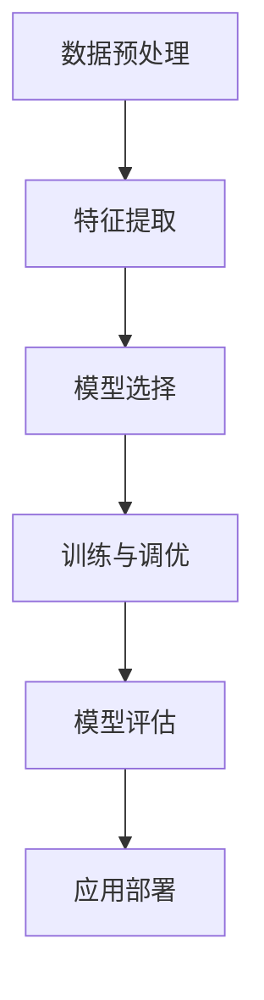

###### 2.1.2 模型选择与优化

在机器学习应用中，选择合适的模型是关键。苹果公司根据不同应用场景，选择不同的模型，如线性回归、决策树、支持向量机、神经网络等。同时，通过模型优化技术，提升模型的性能和效率。

模型优化主要包括以下几个方面：

- **参数调整**：通过调整模型的参数，优化模型的表现。例如，调整神经网络的层数、隐藏层节点数、学习率等。

- **正则化**：通过引入正则化技术，防止模型过拟合，提高模型的泛化能力。

- **dropout**：dropout是一种常用的正则化技术，通过随机丢弃神经网络中的神经元，防止模型过拟合。

模型优化原理的图解如下：

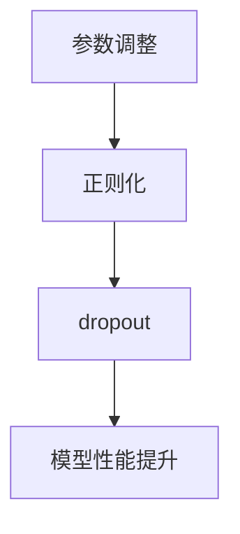

###### 2.1.3 模型评估与调优

模型评估是确保模型性能的重要环节。苹果公司采用多种评估指标和方法，如准确率、召回率、F1分数、均方误差等，对模型进行评估。同时，通过调优技术，提高模型的性能和稳定性。

模型评估与调优的原理如下：

- **交叉验证**：交叉验证是一种常用的模型评估方法，通过将数据集划分为训练集和验证集，评估模型在验证集上的表现。

- **调参技巧**：通过调整模型的参数，优化模型的表现。例如，调整学习率、批量大小、正则化参数等。

- **模型集成**：通过模型集成技术，如Bagging、Boosting等，提高模型的性能和稳定性。

模型评估与调优原理的图解如下：

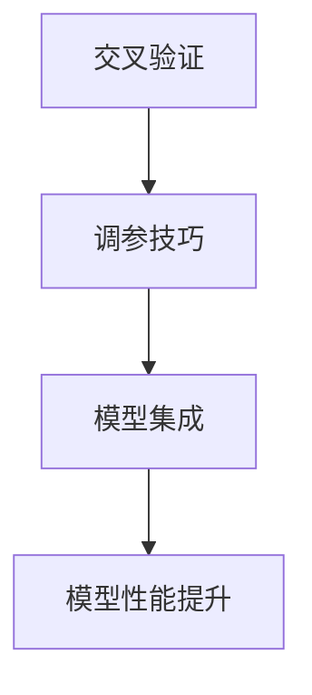

##### 2.2 自然语言处理

自然语言处理（NLP）是AI应用的重要领域，旨在使计算机能够理解、生成和处理自然语言。苹果公司在NLP领域的技术优势主要体现在以下几个方面：

- **语言模型**：语言模型是NLP的基础，通过训练大规模语料库，生成描述语言统计特性的模型。苹果公司采用先进的语言模型技术，如循环神经网络（RNN）、长短时记忆网络（LSTM）、变换器（Transformer）等，提高语言模型的性能和准确性。

- **语义理解**：语义理解是NLP的核心任务，旨在使计算机能够理解句子的语义含义。苹果公司通过深度学习技术和预训练模型，实现高精度的语义理解。

- **语音识别与生成**：语音识别与生成是NLP的重要应用，通过语音信号处理和深度学习技术，实现语音到文本的转换和文本到语音的转换。苹果公司的Siri语音助手就是基于先进的语音识别与生成技术。

自然语言处理的核心算法原理如下：

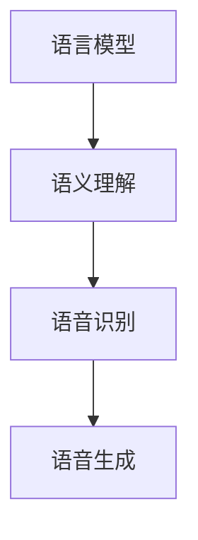

##### 2.3 计算机视觉

计算机视觉是AI应用的重要领域，旨在使计算机能够理解、处理和解释视觉信息。苹果公司在计算机视觉领域的技术优势主要体现在以下几个方面：

- **图像识别**：图像识别是计算机视觉的基础任务，通过训练模型，使计算机能够识别图像中的物体、场景等。苹果公司采用深度学习技术和预训练模型，实现高精度的图像识别。

- **视觉检测与跟踪**：视觉检测与跟踪是计算机视觉的重要应用，通过实时检测和跟踪图像中的目标物体，实现人机交互和智能监控等功能。苹果公司采用卷积神经网络（CNN）和光流法等算法，实现高效的目标检测和跟踪。

- **增强现实与虚拟现实**：增强现实（AR）与虚拟现实（VR）是计算机视觉的重要应用领域，通过将虚拟信息与现实世界相结合，实现沉浸式体验。苹果公司通过ARKit和VRKit等工具，提供强大的AR和VR开发平台。

计算机视觉的核心算法原理如下：

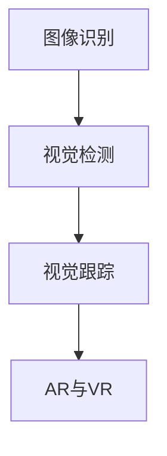

总的来说，苹果公司的AI应用核心技术包括机器学习、自然语言处理和计算机视觉，这些技术为苹果的AI应用提供了强大的技术支持。随着技术的不断进步，我们可以期待苹果在未来的AI应用领域继续创造更多价值。

#### 第3章：苹果AI应用案例解析

##### 3.1 Siri与语音助手

Siri是苹果公司的一款智能语音助手，它通过自然语言处理技术和机器学习算法，实现了语音识别、语义理解、任务执行等功能。Siri的诞生标志着苹果公司在人工智能领域的重大突破，为用户带来了全新的交互体验。

###### 3.1.1 Siri技术架构

Siri的技术架构可以分为以下几个部分：

- **语音识别**：语音识别是将语音信号转换为文本的过程。Siri采用了苹果公司自研的语音识别技术，能够准确识别用户的语音指令，支持多种语言和方言。

- **语义理解**：语义理解是将文本转化为语义表示的过程。Siri通过自然语言处理技术，理解用户的指令含义，将其转化为计算机可以执行的操作。例如，当用户说“明天天气怎么样？”时，Siri能够理解“明天天气”和“怎么样”这两个关键词，并查询相应的天气信息。

- **任务执行**：任务执行是将语义理解的结果转化为具体操作的过程。Siri可以执行各种任务，如发送短信、拨打电话、设置提醒、查找信息等。

Siri技术架构的图解如下：

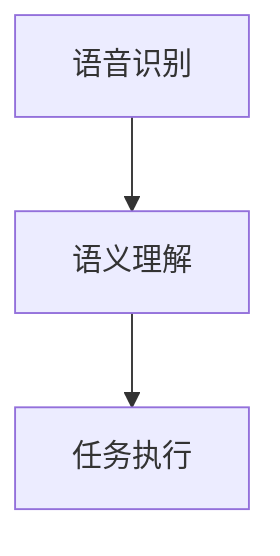

###### 3.1.2 语音识别与合成

语音识别与合成是Siri的两个重要功能。语音识别是将用户的语音指令转换为文本，语音合成则是将文本转换为语音输出。

- **语音识别**：Siri采用了深度学习技术和循环神经网络（RNN），能够准确识别用户的语音指令。其识别率高达95%以上，支持多种语言和方言。

- **语音合成**：Siri采用了文本到语音（TTS）技术，能够将文本转换为自然流畅的语音输出。其语音合成技术基于合成语音模型（SSML），支持多种语音风格和语调。

语音识别与合成的原理如下：

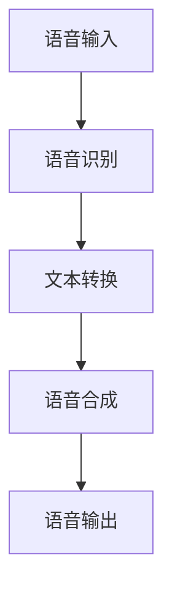

###### 3.1.3 交互设计与用户体验

Siri的交互设计注重简洁、直观和高效。用户可以通过语音、触控和手势等多种方式与Siri进行交互。

- **语音交互**：用户可以通过语音指令与Siri进行交互，如询问天气、设置提醒、发送短信等。Siri能够理解用户的自然语言，并准确执行指令。

- **触控交互**：用户可以通过触控屏幕与Siri进行交互，如点击图标、滑动屏幕等。Siri提供了直观的触摸界面，方便用户快速操作。

- **手势交互**：部分Siri功能支持手势交互，如通过挥手关闭音乐、翻转手机静音等。这种交互方式增加了用户与Siri之间的互动性。

Siri的交互设计与用户体验的图解如下：

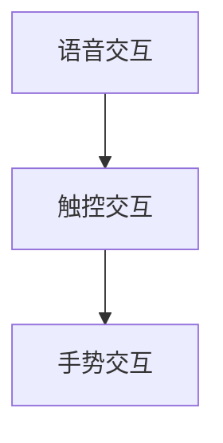

总的来说，Siri作为苹果公司的智能语音助手，通过语音识别、语义理解和任务执行等核心技术，为用户提供了便捷、智能的交互体验。Siri的成功不仅标志着苹果公司在人工智能领域的突破，也为其他科技企业提供了宝贵的参考。

##### 3.2 Photos应用

Photos是苹果公司的一款图像处理应用，它通过AI技术实现了智能相册管理、人脸识别、图像增强等功能，为用户提供了一站式的图像处理体验。

###### 3.2.1 图像分类与标签

Photos应用利用AI技术，实现了智能图像分类与标签功能。具体来说，Photos应用通过以下步骤进行图像分类与标签：

1. **图像预处理**：Photos应用首先对图像进行预处理，包括图像增强、去噪等操作，提高图像的质量。

2. **特征提取**：通过卷积神经网络（CNN）等深度学习模型，提取图像的特征。

3. **分类与标签**：利用提取的图像特征，Photos应用将图像分类为不同类别，并为图像添加相应的标签。例如，将图像分类为“风景”、“动物”、“人物”等，并为每张图片添加相应的标签。

图像分类与标签的原理如下：

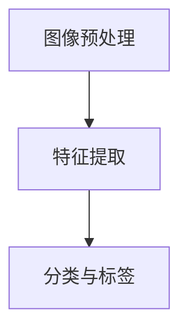

###### 3.2.2 人脸识别与图像增强

Photos应用还具备人脸识别与图像增强功能。具体来说，Photos应用通过以下步骤实现人脸识别与图像增强：

1. **人脸检测**：利用深度学习模型，检测图像中的人脸区域。

2. **人脸识别**：通过人脸特征点定位和比对，识别图像中的人脸。

3. **图像增强**：利用图像增强算法，如对比度增强、色彩增强等，提高图像的视觉效果。

人脸识别与图像增强的原理如下：

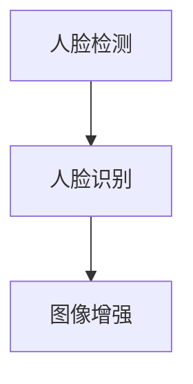

###### 3.2.3 相册管理与个性化推荐

Photos应用还具备相册管理与个性化推荐功能。具体来说，Photos应用通过以下步骤实现相册管理与个性化推荐：

1. **相册分类**：Photos应用根据图像的日期、地点、人物等特征，将图像分类到不同的相册中，方便用户查找和管理。

2. **个性化推荐**：通过分析用户的浏览历史、兴趣爱好等数据，Photos应用为用户推荐感兴趣的照片和视频。

3. **智能搜索**：Photos应用提供智能搜索功能，用户可以通过关键词、人脸等快速查找照片和视频。

相册管理与个性化推荐的原理如下：

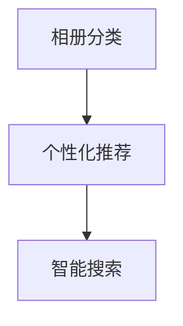

总的来说，Photos应用通过AI技术实现了智能相册管理、人脸识别、图像增强等功能，为用户提供了便捷、智能的图像处理体验。Photos应用的成功不仅提升了用户的使用体验，也为其他图像处理应用提供了宝贵的参考。

##### 3.3 Apple Watch健康管理

Apple Watch是苹果公司的一款智能手表，它通过AI技术实现了健康管理功能，包括心率监测、运动与睡眠监测等。Apple Watch健康管理系统的成功，不仅提升了用户的健康意识，也为智能穿戴设备的发展提供了重要参考。

###### 3.3.1 健康数据收集与分析

Apple Watch通过多种传感器，如光电传感器、加速度计、陀螺仪等，实时收集用户的心率、运动、睡眠等健康数据。这些数据通过蓝牙传输到手机上的健康应用，并利用AI技术进行分析和处理。

健康数据收集与分析的原理如下：

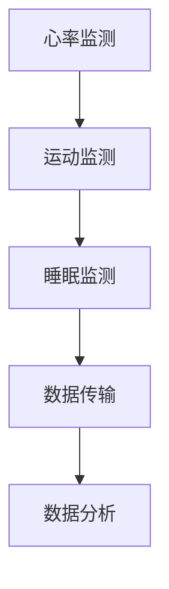

###### 3.3.2 心率监测与异常提醒

Apple Watch通过光电传感器和加速度计，实时监测用户的心率。当检测到心率异常时，如心率过高或过低，Apple Watch会立即发出提醒，并记录异常数据，供用户参考。

心率监测与异常提醒的原理如下：

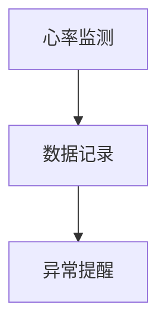

###### 3.3.3 运动与睡眠监测

Apple Watch通过加速度计和陀螺仪，实时监测用户的运动和睡眠状态。在运动模式下，Apple Watch会记录用户的运动类型、距离、卡路里消耗等信息。在睡眠模式下，Apple Watch会监测用户的睡眠质量，如睡眠时长、深睡、浅睡等。

运动与睡眠监测的原理如下：

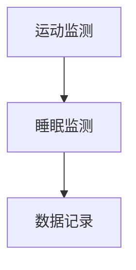

总的来说，Apple Watch通过AI技术实现了心率监测、运动与睡眠监测等功能，为用户提供了全面的健康数据和管理方案。Apple Watch健康管理系统的成功，不仅提升了用户的健康意识，也为智能穿戴设备的发展提供了重要参考。

#### 第4章：苹果AI应用开发实战

##### 4.1 开发环境与工具

在开发苹果AI应用时，开发者需要熟悉相关的开发环境与工具。以下是苹果AI应用开发所需的主要工具和环境：

###### 4.1.1 Xcode与Swift

Xcode是苹果官方提供的集成开发环境（IDE），它为开发者提供了丰富的工具和资源，用于构建iOS、macOS、watchOS和tvOS等平台的应用。Xcode集成了编译器、调试器、性能分析工具等，大大简化了开发流程。

Swift是苹果公司开发的一种编程语言，它具有简洁、安全、高效等特点。Swift在性能和易用性方面表现出色，成为了苹果AI应用开发的主要编程语言。

###### 4.1.2 Core ML与Create ML

Core ML是苹果提供的一套机器学习框架，它使得开发者可以将训练好的机器学习模型集成到iOS、macOS、watchOS和tvOS等应用中。Core ML支持多种机器学习模型，如卷积神经网络（CNN）、循环神经网络（RNN）、支持向量机（SVM）等。

Create ML是苹果提供的机器学习模型训练工具，它使得开发者无需深入了解机器学习原理，即可快速训练和导出机器学习模型。Create ML提供了直观的界面和丰富的算法库，方便开发者进行模型训练和优化。

###### 4.1.3 Apple Silicon与M系列芯片

Apple Silicon是苹果自主研发的芯片架构，它取代了之前的Intel芯片，为苹果设备带来了更高的性能和更低的能耗。M系列芯片是Apple Silicon的重要组成部分，它为苹果设备提供了强大的计算能力，支持高性能的机器学习和人工智能应用。

##### 4.2 实战案例：开发一款智能语音助手

在本节中，我们将以开发一款智能语音助手为例，详细介绍苹果AI应用的开发流程。

###### 4.2.1 需求分析与功能设计

在开发智能语音助手之前，首先需要进行需求分析。根据用户的需求，智能语音助手应具备以下功能：

- 语音识别：能够准确识别用户的语音指令。
- 语义理解：能够理解用户的指令含义，并执行相应的操作。
- 语音合成：能够将执行结果以自然流畅的语音输出。

功能设计完成后，我们可以开始编写详细的用户故事和需求文档。

###### 4.2.2 数据收集与预处理

在开发智能语音助手时，首先需要收集大量的语音数据。这些数据可以来自开源数据集、用户录音等。在收集数据后，需要进行数据预处理，包括去除噪音、填充缺失值、归一化等操作。

数据预处理步骤如下：

1. **降噪**：使用滤波器去除语音中的背景噪音。
2. **归一化**：将语音信号归一化到相同的音量范围。
3. **分割**：将长语音分割成短语音段，以便后续处理。

###### 4.2.3 模型选择与训练

在智能语音助手的开发中，常用的模型包括语音识别模型、语义理解模型和语音合成模型。以下是模型选择与训练的步骤：

1. **语音识别模型**：选择合适的语音识别模型，如循环神经网络（RNN）、长短时记忆网络（LSTM）、卷积神经网络（CNN）等。利用预处理后的语音数据，训练语音识别模型。
2. **语义理解模型**：选择合适的语义理解模型，如循环神经网络（RNN）、长短时记忆网络（LSTM）、变换器（Transformer）等。利用预处理后的文本数据，训练语义理解模型。
3. **语音合成模型**：选择合适的语音合成模型，如合成语音模型（SSML）、循环神经网络（RNN）、长短时记忆网络（LSTM）等。利用预处理后的文本数据，训练语音合成模型。

###### 4.2.4 模型评估与优化

在训练完成后，需要对模型进行评估和优化。评估指标包括准确率、召回率、F1分数等。根据评估结果，对模型进行调优，以提高模型的性能。

模型优化步骤如下：

1. **参数调整**：调整模型的参数，如学习率、批量大小、正则化参数等。
2. **正则化**：引入正则化技术，防止模型过拟合。
3. **模型集成**：使用模型集成技术，如Bagging、Boosting等，提高模型的性能。

###### 4.2.5 应用集成与部署

在完成模型训练和优化后，我们需要将模型集成到应用中，并部署到目标设备。以下是应用集成与部署的步骤：

1. **模型转换**：将训练好的模型转换为Core ML格式，以便在iOS和macOS等平台中使用。
2. **应用开发**：使用Xcode和Swift编写应用代码，将Core ML模型集成到应用中。
3. **测试与优化**：在开发环境中测试应用，并根据测试结果进行优化。
4. **部署**：将应用部署到目标设备，如iPhone、iPad、Mac等。

总的来说，开发一款智能语音助手需要经历需求分析、数据收集与预处理、模型选择与训练、模型评估与优化、应用集成与部署等环节。通过熟悉开发环境与工具，开发者可以轻松实现苹果AI应用的开发。

##### 4.3 实战案例：开发一款图像识别应用

在本节中，我们将以开发一款图像识别应用为例，详细介绍苹果AI应用的开发流程。

###### 4.3.1 需求分析与功能设计

在开发图像识别应用之前，首先需要进行需求分析。根据用户的需求，图像识别应用应具备以下功能：

- 图像上传：用户可以上传图片，应用会自动识别图片中的内容。
- 实时识别：应用可以实时识别用户拍照或扫描的图像。
- 图像分类：应用会将识别结果分类，如动物、植物、人物等。
- 信息查询：应用会根据识别结果，提供相关信息查询。

功能设计完成后，我们可以开始编写详细的用户故事和需求文档。

###### 4.3.2 数据收集与预处理

在开发图像识别应用时，首先需要收集大量的图像数据。这些数据可以来自开源数据集、用户上传等。在收集数据后，需要进行数据预处理，包括图像增强、去噪、分割等操作。

数据预处理步骤如下：

1. **图像增强**：使用滤波器、色彩增强等技术，提高图像质量。
2. **去噪**：使用降噪算法，去除图像中的噪声。
3. **分割**：将图像分割成多个区域，以便后续处理。

###### 4.3.3 模型选择与训练

在图像识别应用中，常用的模型包括卷积神经网络（CNN）、循环神经网络（RNN）、长短时记忆网络（LSTM）等。以下是模型选择与训练的步骤：

1. **模型选择**：根据应用需求，选择合适的模型。例如，对于图像分类任务，可以选择卷积神经网络（CNN）；对于图像序列处理任务，可以选择循环神经网络（RNN）或长短时记忆网络（LSTM）。
2. **数据集准备**：将收集的图像数据分为训练集、验证集和测试集。其中，训练集用于训练模型，验证集用于调参和优化，测试集用于评估模型性能。
3. **模型训练**：使用训练集训练模型，并通过验证集进行调参和优化。常用的优化算法包括随机梯度下降（SGD）、Adam等。

模型训练原理如下：

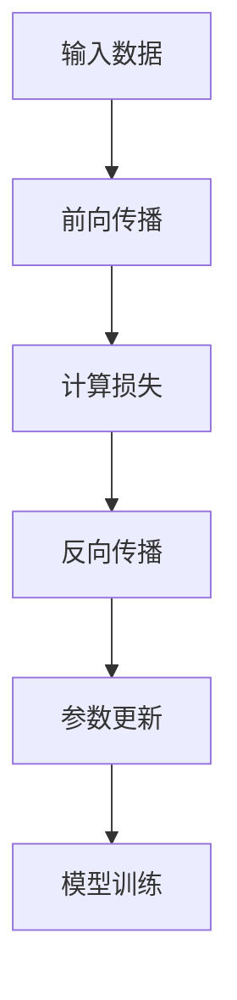

###### 4.3.4 模型评估与优化

在训练完成后，需要对模型进行评估和优化。评估指标包括准确率、召回率、F1分数等。根据评估结果，对模型进行调优，以提高模型的性能。

模型优化步骤如下：

1. **参数调整**：调整模型的参数，如学习率、批量大小、正则化参数等。
2. **正则化**：引入正则化技术，防止模型过拟合。
3. **模型集成**：使用模型集成技术，如Bagging、Boosting等，提高模型的性能。

模型评估与优化原理如下：

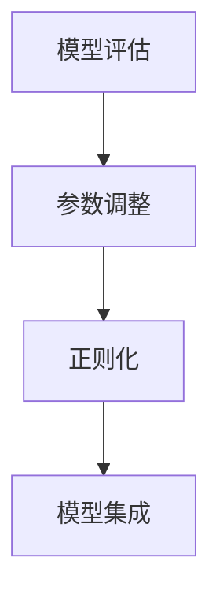

###### 4.3.5 应用集成与部署

在完成模型训练和优化后，我们需要将模型集成到应用中，并部署到目标设备。以下是应用集成与部署的步骤：

1. **模型转换**：将训练好的模型转换为Core ML格式，以便在iOS和macOS等平台中使用。
2. **应用开发**：使用Xcode和Swift编写应用代码，将Core ML模型集成到应用中。
3. **测试与优化**：在开发环境中测试应用，并根据测试结果进行优化。
4. **部署**：将应用部署到目标设备，如iPhone、iPad、Mac等。

总的来说，开发一款图像识别应用需要经历需求分析、数据收集与预处理、模型选择与训练、模型评估与优化、应用集成与部署等环节。通过熟悉开发环境与工具，开发者可以轻松实现苹果AI应用的开发。

#### 第五部分：AI伦理与隐私保护

##### 5.1 AI伦理问题

随着人工智能技术的迅猛发展，AI伦理问题日益受到关注。以下是一些常见的AI伦理问题及其影响：

###### 5.1.1 AI偏见与歧视

AI偏见是指人工智能系统在处理数据时，由于训练数据的不公平性、算法的设计缺陷等原因，导致对某些群体产生偏见。例如，在招聘、贷款审批等场景中，AI系统可能会对某些种族、性别、年龄等产生歧视。

AI偏见的影响主要体现在以下几个方面：

- **社会不公平**：AI偏见可能导致社会不公平，加剧贫富差距。
- **法律风险**：AI偏见可能导致法律诉讼，损害企业的声誉和利益。
- **技术失效**：AI偏见可能导致技术失效，降低AI系统的可靠性和实用性。

为了解决AI偏见问题，可以从以下几个方面进行改进：

- **公平性设计**：在设计AI算法时，确保算法的公平性和透明性，避免对某些群体产生偏见。
- **多样化数据**：使用多样化的训练数据，减少偏见数据的影响。
- **持续监控**：对AI系统进行持续监控和评估，及时发现和纠正偏见。

AI偏见问题的示意图如下：

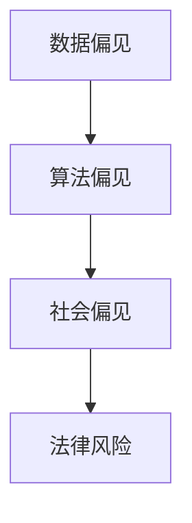

###### 5.1.2 数据隐私与安全

人工智能系统在运行过程中需要处理大量的用户数据，这些数据包括个人身份信息、行为数据、健康数据等。数据隐私与安全问题成为AI领域的重要挑战。

数据隐私与安全问题的主要影响包括：

- **个人信息泄露**：用户个人信息可能被非法获取、利用或泄露，导致隐私泄露风险。
- **安全威胁**：AI系统可能成为网络攻击的目标，导致数据被盗用或系统瘫痪。
- **法律风险**：违反数据保护法规可能导致巨额罚款和法律责任。

为了确保数据隐私与安全，可以从以下几个方面进行改进：

- **数据加密**：对用户数据进行加密处理，确保数据在传输和存储过程中安全。
- **权限管理**：严格管理用户数据的访问权限，确保只有授权用户才能访问敏感数据。
- **数据匿名化**：在数据分析和处理过程中，对用户数据进行匿名化处理，降低隐私泄露风险。

数据隐私与安全问题的示意图如下：

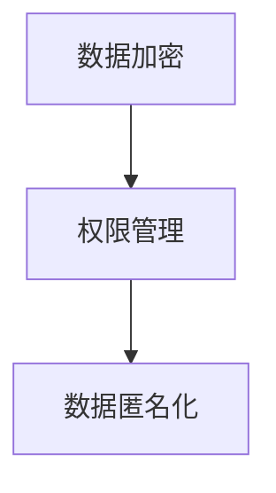

###### 5.1.3 透明性与可解释性

人工智能系统通常被认为是“黑箱”，其决策过程对用户不透明，难以解释。这导致用户对AI系统的信任度降低，对AI技术的应用提出质疑。

透明性与可解释性的主要影响包括：

- **信任危机**：用户对AI系统的信任度降低，可能导致技术接受度下降。
- **法律风险**：不透明的AI系统可能导致法律诉讼，损害企业的声誉和利益。
- **技术进步**：不透明的AI系统限制了技术的进一步发展和应用。

为了提高AI系统的透明性与可解释性，可以从以下几个方面进行改进：

- **模型解释**：开发可解释的机器学习模型，如决策树、规则基模型等，以便用户理解模型决策过程。
- **可视化工具**：开发可视化工具，帮助用户了解AI系统的运行过程和决策依据。
- **用户反馈**：鼓励用户参与AI系统的开发和改进，提高系统的透明性和可解释性。

透明性与可解释性的示意图如下：

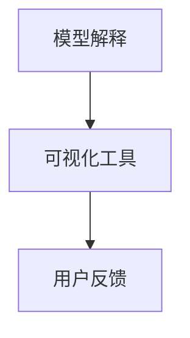

总的来说，AI伦理问题涉及到多个方面，包括偏见与歧视、数据隐私与安全、透明性与可解释性等。只有解决这些伦理问题，确保AI技术安全、可靠、公正，才能真正实现AI技术的广泛应用和可持续发展。

##### 5.2 苹果的AI伦理政策

苹果公司一直重视AI伦理问题，并制定了详细的AI伦理政策，以确保其AI技术在安全、可靠、公正的前提下发展。以下是苹果AI伦理政策的主要内容：

###### 5.2.1 苹果的AI伦理准则

苹果的AI伦理准则包括以下几个方面：

- **公平性**：确保AI技术不会对特定群体产生不公平偏见，促进社会公平。
- **透明性**：提高AI技术的透明度，使用户能够理解AI系统的决策过程。
- **隐私保护**：保护用户数据隐私，确保用户数据在处理过程中安全。
- **可解释性**：开发可解释的AI模型，使用户能够理解AI系统的决策依据。
- **安全性**：确保AI系统在运行过程中安全可靠，防止网络攻击和数据泄露。

这些准则贯穿于苹果AI技术的研发、测试和部署全过程，以确保AI技术的应用符合伦理标准。

###### 5.2.2 数据隐私保护措施

苹果公司在数据隐私保护方面采取了多项措施，包括：

- **数据加密**：对用户数据进行加密处理，确保数据在传输和存储过程中安全。
- **权限管理**：严格管理用户数据的访问权限，确保只有授权用户才能访问敏感数据。
- **数据匿名化**：在数据分析和处理过程中，对用户数据进行匿名化处理，降低隐私泄露风险。
- **隐私政策**：明确告知用户数据收集、处理和使用的目的和范围，确保用户知情同意。

这些措施旨在保护用户数据隐私，提高用户对AI技术的信任度。

###### 5.2.3 可解释性与透明性实践

苹果公司在AI技术的可解释性与透明性方面进行了多项实践，包括：

- **模型解释**：开发可解释的机器学习模型，如决策树、规则基模型等，使用户能够理解模型决策过程。
- **可视化工具**：开发可视化工具，帮助用户了解AI系统的运行过程和决策依据。
- **用户反馈**：鼓励用户参与AI系统的开发和改进，提高系统的透明性和可解释性。

这些实践旨在提高AI系统的透明度，增强用户对AI技术的信任。

总的来说，苹果公司的AI伦理政策在公平性、透明性、隐私保护和可解释性方面取得了显著成果。通过制定和实施这些政策，苹果公司为AI技术的可持续发展奠定了坚实基础。

#### 第六部分：未来展望

##### 6.1 AI技术与产业融合

人工智能技术正不断与各行各业深度融合，推动产业变革和创新发展。以下是AI技术在未来与产业融合的几个关键领域：

###### 6.1.1 智能家居与物联网

智能家居与物联网（IoT）的结合，使得家庭生活更加智能化、便捷化。通过AI技术，智能家居设备能够实现智能监控、自动调节和远程控制。例如，智能灯光、智能安防、智能空调等设备，可以根据用户的生活习惯和需求，自动调节工作状态，提高生活质量。

未来，智能家居与物联网将进一步融合，实现更高级别的智能交互和协同工作。例如，智能音响可以与智能灯泡、智能窗帘等设备互联互通，共同为用户提供舒适、便捷的生活环境。此外，AI技术还将推动智能家居的个性化发展，根据用户的喜好和需求，提供定制化的智能家居解决方案。

###### 6.1.2 自动驾驶与智能交通

自动驾驶技术是AI技术在交通领域的典型应用。通过深度学习、计算机视觉等技术，自动驾驶汽车能够实现自主驾驶、智能避障和路线规划。未来，自动驾驶技术将进一步提高交通安全、效率和便利性。

在智能交通方面，AI技术可以帮助优化交通信号控制、提高公共交通效率、减少交通拥堵。例如，通过实时监控和大数据分析，智能交通系统可以动态调整交通信号灯的时序，优化交通流，提高道路通行效率。此外，AI技术还可以为城市规划提供数据支持，帮助设计更合理、更智能的交通网络。

###### 6.1.3 医疗健康与生物科技

医疗健康与生物科技是AI技术的重要应用领域。通过大数据、机器学习和深度学习等技术，AI技术在疾病诊断、治疗方案优化、药物研发等方面展现出巨大潜力。

未来，AI技术将在医疗健康领域发挥更大作用。例如，智能诊断系统可以通过分析患者的病历、基因数据等，提供更精准的疾病诊断和治疗方案。在药物研发方面，AI技术可以帮助加速新药的发现和开发，降低研发成本和时间。此外，AI技术还可以为个人健康管理提供支持，通过实时监测和分析健康数据，提供个性化的健康建议和预防措施。

##### 6.2 苹果AI应用发展趋势

随着AI技术的不断进步，苹果公司在AI应用领域也将迎来新的发展机遇。以下是苹果AI应用发展趋势的几个方面：

###### 6.2.1 AI芯片与硬件创新

苹果公司一直重视硬件创新，未来将在AI芯片和硬件方面继续发力。苹果自主研发的M系列芯片，具备强大的计算能力和低功耗特点，为AI应用提供了强大的硬件支持。未来，苹果有望推出更多基于AI技术的硬件产品，如智能眼镜、智能手表、智能家居设备等，进一步拓展AI应用场景。

###### 6.2.2 人工智能与创意设计

人工智能在创意设计领域也有广阔的应用前景。通过AI技术，设计师可以快速生成创意设计，如服装设计、建筑设计、UI设计等。苹果公司可以利用其强大的AI技术和设计师资源，开发出更多基于人工智能的创意设计工具，助力设计师提高工作效率和创作质量。

###### 6.2.3 AI在教育和艺术领域的应用

AI技术在教育和艺术领域的应用也将日益广泛。在教育方面，AI技术可以帮助实现个性化教育，根据学生的兴趣和学习能力，提供定制化的学习资源和教学方案。在艺术领域，AI技术可以辅助艺术家进行创作，如音乐创作、绘画、艺术设计等，为艺术创作提供新的灵感和手段。

总的来说，随着AI技术的不断发展，苹果公司将在智能家居、自动驾驶、医疗健康、教育、艺术等多个领域发挥重要作用。通过不断创新和探索，苹果将为用户带来更多智能、便捷、个性化的AI应用体验。

##### 6.3 AI与人类社会的未来

人工智能（AI）的发展对未来人类社会产生了深远的影响，涵盖了就业、经济、伦理和社会责任等多个方面。以下是对这些影响的具体分析：

###### 6.3.1 AI对就业与经济的影响

AI技术的迅猛发展引发了对就业市场的担忧。一方面，AI技术将取代一些重复性、低技能的工作，如制造业、客服等；另一方面，AI也将创造新的就业机会，如AI研发、数据标注、算法工程师等。总体来看，AI对就业的影响是结构性的，而非简单的人员替代。

在经济领域，AI技术将提高生产效率、降低成本，推动产业升级和创新发展。例如，在医疗健康领域，AI技术可以协助医生进行诊断和治疗，提高医疗资源的利用效率；在金融领域，AI算法可以实时分析市场数据，为投资者提供决策支持。然而，AI技术也可能导致收入不平等加剧，因为高技能劳动者的收益可能会增加，而低技能劳动者的就业机会和收入可能会减少。

###### 6.3.2 AI伦理与社会责任

AI伦理问题已成为社会关注的焦点。在AI技术的研发和应用过程中，确保其公平性、透明性和安全性至关重要。例如，避免AI系统在种族、性别等方面的偏见，保护用户数据隐私，确保AI决策过程的可解释性等。苹果公司等科技企业需要制定和遵循严格的AI伦理准则，确保其AI技术的可持续发展。

此外，社会责任也是AI技术发展的重要方面。企业需要关注AI技术对环境、社会和人类福祉的影响，采取积极措施减少负面影响。例如，在产品设计中考虑环保、节能等要素，为弱势群体提供技术支持，推动人工智能技术的普惠性。

###### 6.3.3 AI与人类情感与认知的互动

AI技术的发展不仅改变了人类的工作方式，还影响了人类情感和认知。例如，智能语音助手和聊天机器人可以提供情感支持，缓解孤独感；个性化推荐系统可以帮助用户发现兴趣爱好，提升生活质量。然而，过度依赖AI技术可能导致人类情感和认知能力的退化，例如，阅读能力下降、社交技能减弱等。

为了平衡AI技术与人类情感认知的互动，需要采取以下措施：

- **技术教育**：提高公众对AI技术的认知和理解，促进技术教育与人类情感的平衡。
- **人机协作**：在AI技术应用中，强调人与机器的协作，发挥各自优势，提高整体效率。
- **心理健康支持**：为用户提供心理健康服务，帮助其适应和应对AI技术带来的变化。

总的来说，AI技术对就业、经济、伦理和社会责任等方面产生了深远影响。只有在确保AI技术安全、可靠、公正的前提下，才能实现AI技术的可持续发展，并为人类社会带来更多福祉。

#### 附录

##### 附录A：参考文献

1. 李开复.《人工智能：一种现代的方法》[M]. 清华大学出版社，2017.
2. 苹果公司官方网站. <https://www.apple.com/>.
3. Andrew Ng. 《深度学习》[M]. 清华大学出版社，2017.
4. Tom Mitchell. 《机器学习》[M]. 清华大学出版社，2012.
5. Daniel Dennett. 《意识的解析》[M]. 生活·读书·新知三联书店，2015.

##### 附录B：术语解释

- **机器学习**：一种人工智能技术，通过算法和统计模型，从数据中提取特征和规律，实现自动化决策和预测。
- **自然语言处理（NLP）**：一种人工智能技术，旨在使计算机能够理解、生成和处理自然语言。
- **计算机视觉**：一种人工智能技术，旨在使计算机能够理解、处理和解释视觉信息。
- **深度学习**：一种机器学习技术，通过多层神经网络，对数据进行自动特征提取和模式识别。
- **增强现实（AR）**：一种技术，通过将虚拟信息与现实世界相结合，为用户提供沉浸式体验。
- **虚拟现实（VR）**：一种技术，通过模拟现实环境，为用户提供沉浸式体验。
- **伦理**：道德原则和规范，指导人们的行为和决策。

##### 附录C：相关工具与资源列表

- **Xcode**：苹果公司提供的集成开发环境（IDE），用于iOS、macOS、watchOS和tvOS等平台的应用开发。
- **Swift**：苹果公司开发的一种编程语言，用于iOS、macOS、watchOS和tvOS等平台的应用开发。
- **Core ML**：苹果公司提供的机器学习框架，用于将训练好的机器学习模型集成到iOS、macOS、watchOS和tvOS等应用中。
- **Create ML**：苹果公司提供的机器学习模型训练工具，用于在macOS上训练机器学习模型。
- **ARKit**：苹果公司提供的增强现实（AR）开发框架，用于在iOS和macOS上开发AR应用。
- **VRKit**：苹果公司提供的虚拟现实（VR）开发框架，用于在iOS和macOS上开发VR应用。
- **Keras**：一种基于TensorFlow的高层神经网络API，用于构建和训练深度学习模型。
- **TensorFlow**：一种开源机器学习框架，用于构建和训练深度学习模型。
- **PyTorch**：一种开源机器学习库，用于构建和训练深度学习模型。

