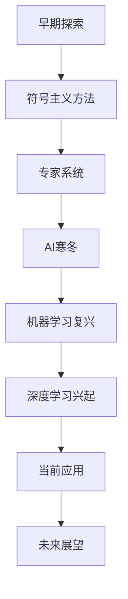
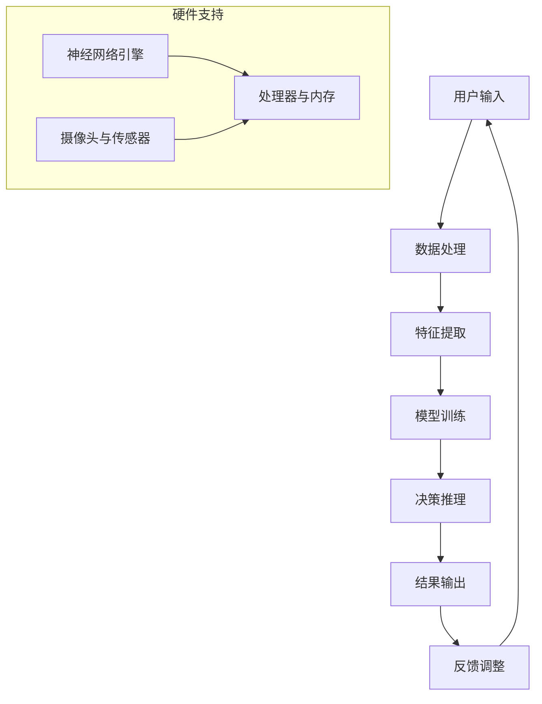

                 

### 文章标题

《李开复：苹果发布AI应用的价值》

### 文章关键词

- 苹果公司
- 人工智能
- AI应用
- 李开复
- 商业价值
- 技术发展

### 文章摘要

本文将深入探讨苹果公司近期发布的AI应用，从技术原理、商业价值以及行业影响等多个角度进行分析。通过李开复先生的视角，我们将理解苹果在AI领域的战略布局及其对未来技术发展的预测。文章将详细阐述AI技术的核心概念，苹果AI产品的发展历程，以及其在实际应用中的价值，旨在为读者提供一幅全面、深入的AI应用图景。

## 第1章 引言

### 1.1 书籍背景介绍

近年来，人工智能（AI）技术迅猛发展，已经成为科技领域的重要推动力量。苹果公司，作为全球科技巨头之一，也在积极布局AI领域，将其应用于各类产品和服务中。李开复先生，作为世界知名的人工智能专家，在其最新著作《李开复：苹果发布AI应用的价值》一书中，详细分析了苹果公司AI应用的背景、技术原理及其商业价值。

李开复先生是著名的计算机科学家、人工智能专家，被誉为“人工智能之父”。他在本书中，通过结合自身丰富的行业经验和深刻的技术洞察力，对苹果公司的AI战略进行了全面解读。本书旨在帮助读者了解苹果公司在AI领域的布局，探讨其AI应用的实际价值，并对未来AI技术的发展趋势进行前瞻性分析。

### 1.2 AI在苹果公司的发展

苹果公司对AI技术的关注可以追溯到其产品线的早期阶段。随着智能手机、平板电脑等移动设备的普及，苹果开始将AI技术应用于这些设备中，提升用户体验。例如，Siri的引入使苹果成为首家将AI语音助手整合到智能设备中的公司。

随着时间的推移，苹果公司不断扩大其在AI领域的投入。2014年，苹果收购了深度学习创业公司Clever Sense，进一步加强了公司在图像识别和自然语言处理方面的技术实力。2017年，苹果推出神经网络引擎Neural Engine，使得iPhone 8和iPhone X等设备能够更高效地运行AI算法。

近年来，苹果公司更是加大了在AI领域的研发力度。2020年，苹果发布了全新的神经网络芯片Apple Neural Engine，该芯片专为AI和机器学习任务设计，显著提升了设备在图像处理、语音识别等方面的性能。

### 1.3 本书的结构与目的

本书结构紧凑，分为12个章节，旨在全面剖析苹果公司AI应用的价值。具体章节安排如下：

- 第1章：引言，介绍书籍背景和作者介绍。
- 第2章：AI技术基础，讲解AI的核心概念、发展历程及其应用场景。
- 第3章：苹果与AI的融合，分析苹果公司AI战略及其在产品中的应用。
- 第4章：苹果发布的AI应用案例，详细探讨Siri、Animoji、Memoji等产品的AI技术。
- 第5章：AI应用的商业价值，探讨AI在商业领域的潜力与挑战。
- 第6章：李开复对苹果AI应用的看法，介绍李开复先生对苹果AI应用的评价与预测。
- 第7章：结论，总结本书的主要观点并对未来进行展望。
- 第8章：附录，提供AI术语表和参考文献。
- 第9章：Mermaid流程图，展示AI技术的发展流程和苹果AI应用的技术架构。
- 第10章：伪代码与算法原理，讲解机器学习和深度学习算法的原理。
- 第11章：数学模型与公式，介绍感知机算法和神经网络算法的数学模型。
- 第12章：项目实战，通过实际案例展示AI技术的应用过程。

本书的目的是帮助读者深入理解苹果公司的AI战略，探讨其AI应用的实际价值，并展望未来AI技术的发展趋势。通过本书，读者将能够更好地把握AI技术的发展方向，为自身在相关领域的成长提供有力支持。

### 1.4 AI技术基础

#### 2.1 什么是AI

人工智能（AI）是计算机科学的一个分支，旨在使机器能够模拟、延伸和扩展人类的智能行为。AI的核心目标是通过编程和算法，使计算机具备自主学习和自主决策的能力，从而在复杂环境下执行人类智能任务。

AI可以分为两大类：弱AI和强AI。弱AI也称为窄AI，是指专注于特定任务的人工智能系统，如语音识别、图像识别、自然语言处理等。强AI则是一种具备全面智能、能够像人类一样自主思考和决策的人工智能系统，目前尚处于理论研究和探索阶段。

AI的核心特征包括：

1. **感知能力**：通过传感器和输入设备，AI系统能够感知和理解外部环境。
2. **学习能力**：通过数据驱动的方法，AI系统能够不断学习和改进，提高任务执行效率。
3. **推理能力**：AI系统能够基于现有知识和数据，进行逻辑推理和决策。
4. **自适应能力**：AI系统能够根据环境变化和反馈，自主调整行为策略。

#### 2.2 AI的历史与发展

AI的发展历程可以追溯到20世纪50年代。1956年，约翰·麦卡锡（John McCarthy）等人在达特茅斯会议上首次提出了“人工智能”这一概念。此后，AI领域迅速发展，经历了多个阶段。

1. **早期探索阶段（1956-1969）**：这一阶段，AI主要集中在符号主义方法上，通过符号操作和逻辑推理来实现智能行为。代表性的系统有“逻辑理论家”和“通用问题求解器”。

2. **繁荣时期（1970-1980）**：70年代，AI领域迎来了繁荣期，专家系统和知识工程成为研究热点。专家系统是一种模拟人类专家决策能力的计算机程序，广泛应用于医疗、金融等领域。

3. **衰退与复兴（1980-1990）**：80年代，由于实际应用效果不佳，AI领域遭遇了“AI寒冬”。然而，随着计算机性能的提升和数据量的增加，AI研究在90年代迎来了新的复兴。

4. **机器学习和深度学习阶段（1990至今）**：90年代以来，机器学习和深度学习成为AI研究的主要方向。通过训练大规模神经网络，AI系统在图像识别、语音识别、自然语言处理等任务上取得了重大突破。

#### 2.3 机器学习和深度学习的区别

机器学习和深度学习是AI领域的两个重要分支，它们在理论基础、应用方法和实现机制上有所不同。

1. **理论基础**：

   - **机器学习**：机器学习是一种利用数据进行学习的方法，旨在通过统计模型和算法，使计算机具备自主学习和决策能力。机器学习的核心是模型训练，通过不断调整模型参数，使模型在训练数据上表现出良好的性能。
   - **深度学习**：深度学习是机器学习的一个子领域，其核心思想是利用多层神经网络进行模型训练。深度学习通过自动提取特征，实现从原始数据到高维特征的映射，从而提高模型的泛化能力。

2. **应用方法**：

   - **机器学习**：机器学习方法包括监督学习、无监督学习、半监督学习和强化学习等。监督学习利用标记数据训练模型，无监督学习则从未标记的数据中学习模式，半监督学习结合标记和未标记数据，强化学习则通过奖励机制进行模型训练。
   - **深度学习**：深度学习主要采用神经网络进行模型训练，包括卷积神经网络（CNN）、循环神经网络（RNN）和生成对抗网络（GAN）等。深度学习通过多层神经网络结构，实现从原始数据到高维特征的映射。

3. **实现机制**：

   - **机器学习**：机器学习算法的实现相对简单，通常使用传统的编程语言（如Python、Java等）和机器学习库（如scikit-learn、TensorFlow等）。
   - **深度学习**：深度学习算法的实现相对复杂，需要使用高性能计算平台和深度学习框架（如TensorFlow、PyTorch等）。深度学习框架提供了丰富的神经网络结构和训练工具，简化了模型训练过程。

#### 2.4 AI的伦理与道德问题

随着AI技术的快速发展，伦理与道德问题逐渐成为社会关注的焦点。AI伦理涉及多个方面，包括隐私保护、算法偏见、自动化失业等。

1. **隐私保护**：AI技术在数据处理过程中，可能涉及个人隐私信息。如何保护用户隐私，防止数据滥用，是AI伦理的重要议题。

2. **算法偏见**：AI系统在训练过程中，可能受到训练数据的影响，产生算法偏见。算法偏见可能导致不公平的决策，损害某些群体的权益。

3. **自动化失业**：AI技术的发展，可能导致部分工作岗位的自动化，引发失业问题。如何应对自动化失业，保障劳动者权益，是政府和企业需要关注的问题。

4. **决策责任**：在AI辅助决策的场景中，如何界定人与AI的责任，确保决策过程的透明性和公正性，是AI伦理的关键问题。

总之，AI技术的伦理与道德问题需要全社会共同努力，通过法律法规、行业标准和技术创新，确保AI技术在安全、公平和可信赖的范围内发展。

### 1.5 AI技术的应用领域

人工智能技术已广泛应用于多个领域，带来了前所未有的变革。以下是一些AI技术的关键应用领域：

1. **医疗健康**：AI在医疗领域的应用包括疾病诊断、药物研发、患者监护和健康管理。例如，通过深度学习算法，AI能够分析医学影像，协助医生进行早期癌症筛查。此外，AI还可以基于患者的基因组数据，预测疾病风险和提供个性化治疗方案。

2. **金融**：AI在金融领域主要用于风险管理、欺诈检测、投资策略和客户服务。机器学习算法能够分析大量交易数据，识别异常行为，防止金融欺诈。同时，AI还可以通过自然语言处理技术，理解客户需求，提供智能客服和个性化金融服务。

3. **零售**：AI技术在零售行业广泛应用于库存管理、供应链优化、客户行为分析和推荐系统。通过分析消费者行为数据，AI能够预测市场需求，优化库存策略。此外，AI还可以利用计算机视觉技术，实现智能购物助手和自动结账系统。

4. **制造业**：AI在制造业的应用包括质量检测、设备维护、生产优化和机器人控制。通过计算机视觉和深度学习技术，AI能够实时检测生产线上的产品缺陷，提高产品质量。同时，AI还可以预测设备故障，实现预防性维护，提高生产效率。

5. **交通**：AI在交通领域的主要应用包括自动驾驶、智能交通管理和物流优化。自动驾驶技术通过传感器和深度学习算法，实现无人驾驶汽车的自主导航和决策。智能交通管理系统能够实时监控交通流量，优化信号灯控制，缓解交通拥堵。物流优化系统则通过路径规划和调度算法，提高运输效率和降低成本。

6. **教育**：AI在教育领域的应用包括个性化学习、智能辅导和在线教育平台。通过分析学生学习数据，AI能够提供个性化的学习路径和资源，提高学习效果。智能辅导系统能够根据学生的学习进度和问题，提供实时反馈和指导。在线教育平台利用AI技术，实现课程推荐、学习效果评估和互动交流等功能。

7. **能源与环境**：AI技术在能源和环境领域主要用于能源管理、环保监测和资源优化。通过智能电网系统，AI能够实现能源的高效分配和调度。环保监测系统利用遥感技术和计算机视觉，实时监测环境质量，识别污染源。资源优化系统则通过数据分析，实现资源的合理利用和降低浪费。

总之，AI技术的广泛应用正在改变各个领域的运作方式，提高生产效率，优化资源利用，提升生活质量。随着技术的不断进步，AI将在更多领域发挥重要作用，推动社会发展和进步。

### 1.6 苹果公司的AI战略

苹果公司在AI领域的战略布局深远，旨在通过技术创新和产品融合，提升用户体验并巩固市场地位。以下是苹果公司AI战略的几个关键方面：

#### 1.6.1 投资与并购

苹果公司一直在积极投资和并购AI领域的关键公司，以增强自身在AI技术方面的实力。例如，2016年，苹果公司收购了深度学习创业公司Turi，该公司开发的机器学习工具曾广泛应用于零售、金融和医疗等行业。此外，苹果公司还收购了自然语言处理公司SpeechCode和视觉识别公司RealFace，进一步丰富了其在语音和图像处理领域的技术储备。

#### 1.6.2 独立研发

苹果公司不仅在并购方面积极布局，还投入大量资源进行自主研发。2017年，苹果公司推出了神经网络引擎Neural Engine，该引擎被广泛应用于iPhone、iPad等设备中，提升了设备的AI处理能力。2020年，苹果公司发布了全新的神经网络芯片Apple Neural Engine，进一步增强了设备在图像处理、语音识别和自然语言处理等方面的性能。

#### 1.6.3 AI在产品中的应用

苹果公司将AI技术广泛应用于各类产品中，提升用户体验。例如，Siri作为苹果公司的智能语音助手，利用自然语言处理技术，能够理解用户指令并执行相应任务。Animoji和Memoji功能则利用面部识别技术，让用户能够创建个性化的动画表情。此外，苹果公司的照片应用也集成了强大的图像识别和分类功能，帮助用户轻松管理和查找照片。

#### 1.6.4 人工智能伦理

苹果公司高度重视人工智能伦理，致力于确保其AI技术在安全和隐私保护方面的可靠性。苹果公司在其AI研发过程中，严格遵守隐私保护原则，确保用户数据的安全。此外，苹果公司还成立了人工智能伦理委员会，负责监督和评估AI技术在产品中的应用，确保其符合道德和社会责任。

#### 1.6.5 开放合作与生态系统

苹果公司通过开放合作，推动AI技术的发展和应用。苹果公司开发了开源深度学习框架Core ML，使得开发者能够轻松地将AI模型部署到iOS、macOS、watchOS和tvOS等平台上。此外，苹果公司还与多家研究机构和科技公司合作，共同推动AI技术的创新和应用。

总之，苹果公司的AI战略通过投资、研发、产品应用和开放合作等多方面举措，不断巩固其AI技术优势，提升用户体验并推动技术进步。

### 1.7 苹果AI技术的应用场景

苹果公司在AI技术的应用场景方面表现出色，将AI深度融入到产品和服务中，为用户带来了诸多便利和创新体验。以下是一些关键的AI应用场景：

#### 1.7.1 语音识别与自然语言处理

苹果公司的智能语音助手Siri是AI技术在语音识别和自然语言处理领域的典型应用。Siri通过先进的语音识别技术和自然语言理解能力，能够理解用户的语音指令，并提供相应的服务。例如，用户可以通过Siri发送短信、设置提醒、播放音乐、查询天气信息等。Siri的语音识别准确率高，支持多种语言，为全球用户提供了便捷的语音交互体验。

#### 1.7.2 面部识别与安全保护

苹果公司在iPhone X上引入了面部识别技术Face ID，通过使用红外相机和深度传感器，对用户的面部特征进行精准识别。Face ID不仅提供了高度安全的身份验证方式，还能够根据用户的面部变化进行实时调整，提升了识别的准确性和可靠性。此外，苹果公司还推出了Animoji和Memoji功能，利用面部识别技术，让用户能够创建个性化的动画表情，增加了产品的趣味性和互动性。

#### 1.7.3 图像识别与增强现实

苹果公司的图像识别技术广泛应用于照片应用和增强现实（AR）体验中。照片应用通过AI算法，能够自动识别并分类用户的照片，帮助用户轻松管理和查找照片。同时，苹果公司还推出了ARKit开发框架，使得开发者能够利用iPhone和iPad的摄像头和传感器，创建丰富的AR应用，如游戏、教育、娱乐等领域。

#### 1.7.4 语音助手与健康管理

苹果公司通过HealthKit平台，将AI技术应用于健康管理领域。通过整合多种健康数据，如心率、步数、睡眠质量等，HealthKit能够为用户提供个性化的健康建议。此外，苹果公司还与多家健康设备厂商合作，通过Apple Watch等设备，实时监测用户健康数据，提供紧急医疗信息，保障用户健康安全。

#### 1.7.5 智能家居与物联网

苹果公司通过HomeKit平台，将AI技术应用于智能家居和物联网（IoT）领域。用户可以通过Siri控制家中的智能设备，如智能灯泡、智能插座、智能门锁等。HomeKit支持多个设备品牌，提供了统一的管理和控制界面，提高了智能家居的便利性和兼容性。

总之，苹果公司的AI技术在多个应用场景中取得了显著成果，不仅提升了用户体验，还为各行业带来了创新和变革。随着技术的不断进步，苹果公司的AI应用将更加广泛，为用户带来更多的便利和乐趣。

### 3.3 苹果AI产品的发展历程

苹果公司在AI领域的探索始于其智能手机产品的推出。早期的iPhone虽然不具备复杂的AI功能，但已经开始在语音识别和图像处理方面进行尝试。随着时间的推移，苹果公司逐渐加大对AI技术的投入，推出了一系列具有里程碑意义的AI产品。

#### 3.3.1 Siri的引入

2009年，苹果公司推出了Siri，这是一款基于自然语言处理和机器学习技术的智能语音助手。Siri的引入标志着苹果公司在AI领域的重大突破。最初，Siri仅限于iPhone 4S设备，但随着技术的不断进步，Siri逐渐成为了苹果生态系统中的核心组件，支持多种语言和功能。如今，Siri不仅能够理解用户的语音指令，还能够通过学习用户的习惯和偏好，提供更加个性化的服务。

#### 3.3.2 面部识别与Face ID

2017年，苹果公司推出了iPhone X，引入了面部识别技术Face ID。Face ID通过红外相机和深度传感器，对用户的面部特征进行精准识别，提供了高度安全的身份验证方式。Face ID的引入，不仅提升了iPhone的安全性，还增强了用户体验。此外，苹果公司还通过Animoji和Memoji功能，进一步利用面部识别技术，为用户提供了丰富的互动体验。

#### 3.3.3 Neural Engine的推出

2017年，苹果公司在A11 Bionic芯片中引入了神经网络引擎（Neural Engine），这是苹果在AI硬件领域的重要一步。神经网络引擎专为AI和机器学习任务设计，显著提升了设备的图像处理、语音识别和自然语言处理能力。此后，随着A12、A14等芯片的推出，神经网络引擎的性能不断提升，进一步推动了苹果AI产品的发展。

#### 3.3.4 ARKit和增强现实

2017年，苹果公司推出了ARKit，这是苹果在增强现实（AR）领域的重要举措。ARKit利用iPhone和iPad的摄像头、传感器和处理器，实现了丰富的AR应用。通过ARKit，开发者可以轻松创建AR游戏、教育应用和虚拟试妆等体验。苹果公司在AR技术上的投入，不仅丰富了用户的应用场景，也为AR技术的发展奠定了基础。

#### 3.3.5 HealthKit和健康管理

苹果公司通过HealthKit平台，将AI技术应用于健康管理领域。HealthKit整合了多种健康数据，如心率、步数、睡眠质量等，为用户提供个性化的健康建议。此外，苹果公司还与多家健康设备厂商合作，通过Apple Watch等设备，实时监测用户健康数据，提供紧急医疗信息，保障用户健康安全。

#### 3.3.6 HomeKit和智能家居

苹果公司通过HomeKit平台，将AI技术应用于智能家居和物联网（IoT）领域。用户可以通过Siri控制家中的智能设备，如智能灯泡、智能插座、智能门锁等。HomeKit支持多个设备品牌，提供了统一的管理和控制界面，提高了智能家居的便利性和兼容性。

总之，苹果公司在AI产品的发展历程中，通过不断的技术创新和产品应用，推动了AI技术在智能手机、增强现实、健康管理、智能家居等领域的广泛应用。随着技术的不断进步，苹果公司的AI产品将继续引领行业趋势，为用户带来更多创新体验。

### 4.1 案例一：Siri的进化

Siri作为苹果公司最早的AI应用之一，其进化历程展示了苹果公司在人工智能领域的持续投入和创新。自2009年首次亮相以来，Siri经历了多个版本的更新，功能不断丰富，性能逐步提升。

#### 4.1.1 初期发展

Siri最早于2009年随着iPhone 4S的发布亮相，这款智能语音助手基于自然语言处理和机器学习技术，能够理解用户的语音指令并执行相应任务。初期的Siri主要功能包括发送短信、拨打电话、设置提醒和播放音乐等。尽管功能相对有限，但Siri的引入为用户带来了全新的交互体验。

#### 4.1.2 功能扩展

随着技术的进步，苹果公司不断为Siri添加新功能，使其逐渐成为苹果生态系统的核心组件。在iOS 10中，Siri的开放平台（SiriKit）正式推出，允许第三方开发者集成Siri功能，拓展其应用范围。此后，Siri支持了更多场景，如邮件、地图、日历、音乐流媒体等。此外，苹果还推出了“Siri Shortcuts”功能，使用户能够通过简单的语音指令完成复杂操作，进一步提升了Siri的实用性。

#### 4.1.3 人工智能技术的应用

Siri的进化离不开苹果公司在人工智能技术上的不断突破。从最初的基于规则的方法，到后来的深度学习技术，Siri在语音识别、自然语言处理和上下文理解方面取得了显著进步。例如，通过机器学习，Siri能够更好地理解用户的语言习惯和表达方式，提供更加自然的交互体验。此外，苹果公司还通过持续的数据收集和模型训练，不断优化Siri的性能和准确率。

#### 4.1.4 用户反馈与个性化

苹果公司注重用户反馈，通过持续改进Siri，提升用户体验。Siri能够学习用户的习惯和偏好，根据个人喜好推荐音乐、新闻和活动。例如，用户可以在使用Siri听音乐时，通过简单的语音指令调整播放列表或音量。此外，Siri还支持多语言交互，用户可以自由切换不同语言进行操作，提高了跨国使用者的便利性。

#### 4.1.5 未来展望

随着AI技术的快速发展，Siri的未来充满可能。苹果公司计划进一步扩展Siri的功能和应用场景，例如在智能家居、健康管理和自动驾驶等领域发挥更大作用。此外，苹果还致力于提升Siri的智能水平，使其能够更好地理解复杂指令和进行高级任务。通过不断的技术创新和用户体验优化，Siri将继续成为苹果用户的重要助手，为日常生活和工作带来更多便利。

### 4.2 案例二：Animoji与Memoji

Animoji和Memoji是苹果公司引入的两大创新功能，它们利用面部识别技术和人工智能，为用户提供了丰富的表情和个性化的互动体验。

#### 4.2.1 Animoji的原理与实现

Animoji是基于面部识别技术的一种动态表情功能，用户可以通过录制自己的面部表情，创建出多种可爱的小动物形象，如猫、狗、熊猫等。Animoji的实现过程包括以下几个步骤：

1. **面部捕捉**：iPhone X和iPhone XS系列设备配备了红外相机和深度传感器，能够精准捕捉用户的面部特征。
2. **特征点检测**：通过面部识别算法，设备能够检测出面部关键特征点，如眼睛、嘴巴、鼻子等。
3. **动态生成**：基于捕捉到的面部特征，Animoji应用会对相应的动物形象进行实时渲染，使其根据用户的面部表情动态变化。

#### 4.2.2 Memoji的原理与实现

Memoji是苹果在Animoji的基础上进一步扩展的功能，它允许用户自定义自己的虚拟形象，包括发型、眼睛、鼻子、嘴巴等。Memoji的实现过程与Animoji类似，但更加灵活和个性化：

1. **自定义创建**：用户可以通过Memoji编辑器，自由选择和调整各种面部特征，创建出符合个人风格的虚拟形象。
2. **自定义表情**：除了基本的表情包，用户还可以为Memoji添加手势、动作和声音，使其更加生动和互动。

#### 4.2.3 用户体验与应用场景

Animoji和Memoji不仅为用户提供了一种新颖的互动方式，还在多个应用场景中表现出色：

1. **消息传递**：在iMessage中，用户可以通过发送Animoji或Memoji表情，表达自己的情感和想法，增加了沟通的趣味性。
2. **视频通话**：在FaceTime视频通话中，用户可以使用Animoji或Memoji作为头像，增强互动体验，如实时同步面部表情和动作。
3. **社交媒体**：用户可以将Animoji或Memoji发布到社交媒体平台上，分享自己的创意和个性。

#### 4.2.4 未来展望

随着面部识别技术和人工智能的不断发展，Animoji和Memoji的功能将更加丰富和多样化。苹果公司计划进一步扩展这些功能，例如在虚拟现实（VR）和增强现实（AR）应用中，实现更加真实的虚拟形象和互动体验。同时，苹果公司还可能推出更多的自定义选项，如服装、配饰等，满足用户个性化的需求。

总之，Animoji与Memoji是苹果公司在人工智能领域的重要创新，它们不仅提升了用户体验，还为数字通信和娱乐带来了新的可能性。随着技术的进步，Animoji和Memoji将继续发挥重要作用，成为苹果生态系统中的亮点功能。

### 4.3 案例三：图片识别与搜索

苹果公司的图片识别与搜索功能是AI技术在移动设备中的又一重要应用，通过深度学习和计算机视觉技术，为用户提供了便捷和高效的图片管理及搜索体验。

#### 4.3.1 技术原理

图片识别与搜索功能依赖于深度学习和计算机视觉技术，具体包括以下几个步骤：

1. **图像预处理**：首先，对图片进行预处理，包括裁剪、调整亮度和对比度等，以适应后续的处理需求。
2. **特征提取**：使用深度学习模型，从图像中提取关键特征。卷积神经网络（CNN）是常用的特征提取工具，它能够自动学习图像中的层次化特征，如边缘、纹理和形状等。
3. **匹配与分类**：通过将提取的特征与数据库中的图片进行匹配，实现对图片内容的识别和分类。例如，可以识别图片中的物体、场景或人物等。
4. **搜索与推荐**：基于图片识别结果，用户可以轻松找到相似的图片，或者发现新的内容推荐。

#### 4.3.2 功能特点

苹果公司的图片识别与搜索功能具有以下特点：

1. **高效识别**：通过高性能的计算引擎和优化的算法，苹果设备能够在短时间内完成图片识别和搜索任务，提供流畅的用户体验。
2. **跨设备同步**：苹果的iCloud服务支持图片识别与搜索功能的跨设备同步，用户可以在不同的iOS设备和Mac电脑上查看和管理图片。
3. **个性化推荐**：基于用户的浏览和收藏习惯，图片识别与搜索功能能够推荐用户可能感兴趣的内容，提高图片管理的效率和趣味性。
4. **隐私保护**：苹果公司高度重视用户隐私，图片识别与搜索功能仅使用本地设备进行数据处理，不涉及用户数据上传，确保用户隐私安全。

#### 4.3.3 应用场景

图片识别与搜索功能在多个应用场景中表现出色：

1. **日常管理**：用户可以快速找到特定的照片，如旅行照片、生日照片等，方便管理和查找。
2. **生活应用**：通过识别图片中的物体或场景，用户可以获取相关的信息，如食谱、旅游攻略等。
3. **商业应用**：企业可以利用图片识别与搜索功能，对库存照片进行分类和检索，提高工作效率。
4. **教育应用**：教师和学生可以通过图片识别与搜索功能，查找相关的教学资源和学习资料。

总之，苹果公司的图片识别与搜索功能不仅提高了用户的图片管理效率，还丰富了图片的使用场景，展示了AI技术在移动设备中的强大应用潜力。

### 4.4 案例四：健康与医疗应用

苹果公司的健康与医疗应用通过AI技术，为用户提供了全面的健康管理服务，包括心率监测、睡眠分析、健身记录等。这些应用不仅提升了用户的生活质量，还为医疗领域带来了新的可能。

#### 4.4.1 技术原理

苹果的健康与医疗应用主要基于以下技术：

1. **传感器数据收集**：苹果设备内置多种传感器，如加速度计、陀螺仪、心率传感器等，能够实时监测用户的各种生理数据。
2. **数据分析**：通过机器学习和数据挖掘技术，对传感器数据进行分析，提取有价值的信息。例如，心率监测应用可以通过分析心率变化，识别异常情况，如心律不齐。
3. **个性化建议**：基于用户的健康数据和生活方式，应用能够提供个性化的健康建议。例如，健身应用可以根据用户的历史数据，推荐合适的锻炼计划。
4. **医疗数据共享**：苹果的健康应用支持与医疗机构的共享，用户可以将健康数据传输给医生，帮助医生进行诊断和治疗。

#### 4.4.2 功能特点

苹果的健康与医疗应用具有以下功能特点：

1. **全面监测**：应用涵盖了多个健康指标，如心率、睡眠、步数、体重等，为用户提供全面的健康监测服务。
2. **数据可视化**：通过图表和可视化界面，用户可以直观地了解自己的健康状况，如睡眠质量、心率变化等。
3. **个性化建议**：基于用户的数据，应用能够提供个性化的健康建议，如锻炼计划、饮食建议等。
4. **医疗数据共享**：用户可以将健康数据传输给医疗机构，帮助医生进行诊断和治疗。

#### 4.4.3 应用场景

苹果的健康与医疗应用在多个场景中发挥了重要作用：

1. **个人健康管理**：用户可以通过应用监测自己的健康状况，及时发现异常并采取措施。
2. **运动与健康**：健身爱好者可以利用应用记录锻炼数据，制定合理的锻炼计划。
3. **慢性病管理**：慢性病患者可以通过应用监测病情，与医生保持沟通，提高治疗效果。
4. **医疗辅助**：医生可以利用应用收集和分析患者数据，辅助诊断和治疗。

总之，苹果的健康与医疗应用通过AI技术，为用户提供了便捷、全面的健康管理服务，为医疗领域带来了新的创新。

### 5.1 AI应用的市场潜力

人工智能（AI）技术在过去几年中经历了显著的增长，其在各个行业中的应用潜力日益显现。随着技术的不断进步，AI应用的市场潜力也在不断扩大，成为各大企业争相投入的重点领域。以下是AI应用在市场潜力方面的几个关键点：

#### 5.1.1 数据驱动的发展

AI技术的核心在于数据。随着全球数据量的爆炸式增长，企业可以利用AI技术对海量数据进行分析和挖掘，发现新的业务机会和优化运营流程。例如，在零售行业，AI可以通过分析消费者行为数据，实现精准营销和库存管理。在金融行业，AI可以用于信用评分、风险控制和欺诈检测，提高业务效率和安全性。

#### 5.1.2 自动化与效率提升

AI应用的一个显著特点是能够自动化复杂的任务，从而提高工作效率和降低成本。例如，在制造业，AI可以通过智能机器人实现生产线的自动化，提高生产效率和质量。在物流行业，AI可以优化运输路线和仓储管理，降低物流成本。此外，AI还可以用于自动化客户服务，通过聊天机器人提供24/7的客户支持，提升用户体验。

#### 5.1.3 个性化服务与用户体验

AI技术在提升用户体验方面具有巨大潜力。通过自然语言处理和机器学习，AI可以理解用户的偏好和需求，提供个性化的服务。例如，在医疗领域，AI可以通过分析患者的病历和健康数据，提供个性化的治疗方案。在金融领域，AI可以通过分析用户的历史交易数据，提供个性化的投资建议。此外，AI还可以在电子商务中实现个性化推荐，提高用户满意度和转化率。

#### 5.1.4 新兴市场的机会

随着新兴市场的崛起，AI应用在这些市场的潜力不容忽视。在发展中国家中，AI技术可以用于解决基础设施不足、资源分配不均等问题。例如，在农业领域，AI可以通过精准农业技术，提高作物产量和降低成本。在医疗领域，AI可以通过远程诊断和远程医疗，为偏远地区的居民提供医疗服务。

#### 5.1.5 监管与合规

尽管AI应用具有巨大的市场潜力，但其发展也面临监管和合规的挑战。政府和行业机构需要制定相应的法规和标准，确保AI技术的安全、透明和可解释性。例如，在自动驾驶领域，监管机构需要确保AI系统的安全性和可靠性，以避免交通事故的发生。

总之，AI应用的市场潜力巨大，其在各个行业中的应用场景不断扩展。随着技术的不断进步和市场的逐渐成熟，AI将在未来成为推动经济增长和社会进步的重要力量。

### 5.2 AI应用的商业模式

AI应用在商业领域的应用已经呈现出多种商业模式，这些模式不仅为企业和个人创造了价值，还推动了行业的创新和发展。以下是AI应用在商业模式方面的几个关键点：

#### 5.2.1 提供即服务（SaaS）

提供即服务（Software as a Service，SaaS）是AI应用最常见的商业模式之一。在这种模式下，企业通过云平台提供AI工具和解决方案，用户按需付费使用。这种模式的优势在于降低企业的IT成本和运营复杂度，同时提供灵活的扩展性。例如，Salesforce和Microsoft Azure都是通过SaaS模式提供AI服务的典型企业。

#### 5.2.2 订阅服务

订阅服务是另一种流行的AI商业模式，用户通过定期支付订阅费用来使用AI工具。这种模式的优势在于可以为用户提供持续的更新和支持，同时创造稳定的收入流。例如，AI驱动的数据分析平台、自动化工具和智能客服系统等，都可以采用订阅服务模式。

#### 5.2.3 数据交易

数据是AI应用的核心资产，数据交易商业模式允许企业通过购买和销售数据来创造价值。这种模式在金融、医疗和零售等领域具有广泛应用。例如，金融机构可以通过购买信用评分数据来评估贷款申请者的信用风险，医疗机构可以通过销售患者数据来推动医学研究和产品开发。

#### 5.2.4 增值服务

AI增值服务模式是指企业通过AI技术提高产品或服务的附加值。这种模式可以应用于多个行业，如零售、金融和医疗等。例如，零售商可以通过AI驱动的推荐系统，提高销售额和客户满意度；金融机构可以通过AI进行欺诈检测，减少损失并提高安全性。

#### 5.2.5 联合开发和合作伙伴关系

联合开发和合作伙伴关系是AI应用在商业模式中的另一种重要形式。在这种模式下，多个企业合作开发AI解决方案，共同分享市场和技术成果。例如，汽车制造商和科技公司合作开发自动驾驶系统，金融科技公司和企业合作开发智能投顾平台。

#### 5.2.6 生态系统构建

生态系统构建是指企业通过构建AI生态系统，整合各种资源和服务，为用户提供一站式解决方案。这种模式在科技、医疗和零售等领域具有广泛应用。例如，科技巨头通过构建AI生态系统，提供从数据采集、处理到分析和应用的全方位服务。

总之，AI应用在商业领域的商业模式多种多样，这些模式不仅为企业和个人创造了价值，还推动了行业的创新和发展。随着技术的不断进步和市场的逐渐成熟，AI商业模式的创新将更加多样和丰富。

### 5.3 AI应用的挑战与解决方案

尽管AI技术在商业和日常生活中具有巨大的潜力，但其广泛应用也面临着诸多挑战。以下是AI应用在技术、伦理和监管等方面的主要挑战，以及相应的解决方案。

#### 5.3.1 技术挑战

1. **数据隐私和安全**：AI系统依赖于大量数据，数据隐私和安全成为重要问题。解决方案包括：

   - **数据加密**：对敏感数据进行加密处理，确保数据在传输和存储过程中安全。
   - **隐私保护技术**：如差分隐私和联邦学习等，可以在保护用户隐私的前提下，进行数据分析和建模。

2. **算法透明性和可解释性**：AI算法的复杂性和黑箱性质，使得其决策过程难以解释，这可能导致信任危机。解决方案包括：

   - **可解释性算法**：开发可解释的机器学习算法，如决策树、线性模型等，使决策过程更透明。
   - **模型可视化工具**：利用可视化工具，帮助用户理解AI算法的决策过程。

3. **计算资源和能耗**：深度学习等复杂AI任务对计算资源和能耗有较高要求。解决方案包括：

   - **高性能计算平台**：利用云计算和边缘计算等平台，提供强大的计算能力。
   - **能效优化**：通过优化算法和数据结构，降低计算资源的消耗。

4. **模型更新和维护**：AI系统需要定期更新和维护，以应对环境变化和数据分布的变化。解决方案包括：

   - **持续学习**：通过持续学习技术，使AI系统能够适应环境变化。
   - **自动化维护工具**：开发自动化工具，简化模型更新和维护过程。

#### 5.3.2 伦理挑战

1. **算法偏见**：AI系统可能在训练数据中继承偏见，导致不公平的决策。解决方案包括：

   - **数据多样性**：确保训练数据多样性，减少偏见。
   - **算法校准**：对AI系统进行校准，确保其决策符合公平和道德标准。

2. **隐私侵犯**：AI系统可能侵犯用户隐私，引发伦理争议。解决方案包括：

   - **隐私保护法规**：制定和实施隐私保护法规，确保用户隐私得到保护。
   - **透明度和可解释性**：提高AI系统的透明度和可解释性，使用户了解其工作原理。

3. **责任归属**：在AI辅助决策的场景中，如何界定人与AI的责任，是伦理的重要问题。解决方案包括：

   - **责任分担**：明确人和AI在决策过程中的责任，确保责任清晰。
   - **法律框架**：建立法律框架，为AI应用提供明确的监管和责任归属标准。

#### 5.3.3 监管挑战

1. **监管不足**：现有监管体系可能无法有效应对快速发展的AI技术。解决方案包括：

   - **政策制定**：政府需要制定针对性的AI政策，确保技术发展符合社会利益。
   - **国际合作**：加强国际间的合作，共同制定AI监管标准和规范。

2. **技术监管**：对AI技术进行有效监管，确保其安全、透明和可解释性。解决方案包括：

   - **审计和评估**：对AI系统进行定期审计和评估，确保其符合监管要求。
   - **认证体系**：建立AI系统的认证体系，确保其质量和安全性。

3. **监管灵活性**：随着AI技术的发展，监管体系需要具备足够的灵活性，以适应新技术和新应用场景。解决方案包括：

   - **动态监管**：建立动态监管机制，根据技术发展和应用变化，及时调整监管策略。
   - **公众参与**：鼓励公众参与监管过程，提高监管的透明度和公众信任。

总之，AI应用的挑战涉及技术、伦理和监管等多个方面，需要多方共同努力，通过技术创新、政策制定和国际合作，推动AI技术的健康、可持续发展。

### 6.1 李开复对AI发展的看法

李开复先生作为全球知名的人工智能专家，对AI技术的发展有着深刻的见解和独特的观点。他认为，人工智能在未来将带来深刻的变革，不仅会改变传统行业，还会对人类社会产生深远影响。

首先，李开复认为AI技术的快速发展将使许多传统行业面临巨大变革。例如，在制造业，AI可以应用于生产优化、质量控制等环节，提高生产效率和质量。在医疗领域，AI可以通过精准医疗、个性化治疗等方式，改善医疗服务质量和患者体验。此外，AI在金融、零售、教育等领域的应用也具有巨大潜力，可以大幅提升行业效率和服务水平。

其次，李开复强调了AI技术对就业市场的潜在影响。他认为，AI技术的发展可能会导致部分工作岗位的自动化，从而引发失业问题。然而，李开复也指出，AI技术同样会创造新的就业机会，例如在数据科学家、AI系统工程师、AI产品经理等领域。因此，他呼吁社会重视AI技术带来的就业机会和挑战，通过教育和培训，帮助劳动者适应新的就业环境。

第三，李开复认为，AI技术的发展需要高度重视伦理和道德问题。他强调，AI系统在决策过程中可能存在算法偏见和隐私侵犯等问题，这需要通过法律法规、行业标准和技术创新来加以解决。他提出了“AI伦理委员会”的概念，认为在AI技术的研发和应用过程中，需要设立专门的伦理委员会，监督和评估AI技术的伦理风险。

最后，李开复对未来AI技术的发展趋势进行了展望。他认为，未来的AI技术将更加注重通用人工智能（AGI）的研究，目标是使AI系统具备全面智能，能够像人类一样进行自主思考和决策。此外，他预测，随着AI技术的发展，我们将看到更多的跨学科合作，例如在生物学、心理学、社会学等领域的研究，将有助于推动AI技术的全面进步。

总之，李开复对AI发展的看法既充满乐观，也充满谨慎。他相信，通过技术创新、政策制定和社会合作，AI技术将在未来带来巨大的机遇和挑战，推动社会进步和人类发展。

### 6.2 李开复对苹果AI应用的评价

李开复先生对苹果公司AI应用的评价可谓高度认可和赞赏。他认为，苹果在AI领域的战略布局和产品应用不仅具有前瞻性，还在实际操作中取得了显著成果。

首先，李开复赞赏苹果公司在AI技术投资和研发上的持续投入。他指出，苹果通过并购和自主开发，积累了大量AI技术，形成了强大的技术储备。例如，苹果收购了深度学习创业公司Turi和自然语言处理公司SpeechCode，这些收购不仅增强了苹果在AI技术上的实力，还为苹果产品引入了更多创新功能。

其次，李开复高度评价苹果在AI产品中的应用。他指出，Siri、Animoji、Memoji等AI功能不仅提升了用户体验，还在多个场景中展现了AI技术的强大潜力。特别是Siri，作为苹果的智能语音助手，通过不断的升级和优化，已经成为用户日常生活中不可或缺的一部分。

此外，李开复还对苹果在隐私保护方面的努力表示认可。他认为，苹果高度重视用户隐私，通过本地处理和数据加密等技术，确保用户数据的安全。这一做法不仅提升了用户的信任度，也为其他企业提供了良好的示范。

最后，李开复认为，苹果公司在AI领域的布局对未来具有深远影响。他预测，随着AI技术的不断进步，苹果公司将能够在更多领域发挥领导作用，推动AI技术在智能手机、智能家居、健康医疗等领域的广泛应用。

总之，李开复对苹果AI应用的评价是积极的，他认为苹果在AI领域的战略和产品应用不仅具有前瞻性和创新性，还为未来AI技术的发展提供了重要参考。

### 6.3 李开复对AI未来发展的预测

李开复先生对AI未来的发展持有积极而前瞻的观点，认为AI技术将在多个领域带来革命性变革，并对人类社会产生深远影响。

首先，李开复预测，未来的AI技术将更加智能化和通用化。随着深度学习和神经网络的不断进步，AI系统将具备更强的自主学习能力和复杂任务处理能力。这将为各行各业带来全新的解决方案，例如在医疗领域，AI可以辅助医生进行精准诊断和治疗，在金融领域，AI可以提供智能投资建议和风险控制。

其次，李开复认为，AI技术将在推动生产力提升方面发挥关键作用。通过自动化和智能化，AI将大幅提高生产效率和质量。例如，在制造业，AI可以优化生产流程、预测设备故障；在物流领域，AI可以优化运输路线和仓储管理。这将为企业降低成本、提高竞争力提供有力支持。

第三，李开复指出，AI技术将在社会服务和公共服务领域发挥重要作用。他认为，AI可以通过智能客服、在线教育、智能家居等应用，提升生活质量和公共服务水平。例如，智能客服系统能够提供24/7的客户支持，在线教育平台可以根据用户需求提供个性化学习方案，智能家居系统可以为用户提供更加便捷和舒适的生活环境。

此外，李开复强调，AI技术的发展需要重视伦理和道德问题。他认为，随着AI技术的普及，如何确保其公平性、透明性和安全性，是未来需要重点关注的问题。为此，他提出了建立AI伦理委员会和制定相关法律法规的建议，以确保AI技术在社会中得到规范和健康发展。

最后，李开复预测，未来的AI技术将更加注重跨学科合作。他认为，AI技术的发展不仅需要计算机科学的支持，还需要生物学、心理学、社会学等多领域的知识。这种跨学科合作将有助于推动AI技术的全面进步，为社会带来更多创新和机遇。

总之，李开复对AI未来发展的预测充满信心，他认为AI技术将在智能提升、生产力提升和社会服务等多个领域发挥重要作用，成为推动社会进步和人类发展的关键力量。

### 7.1 本书总结

通过对苹果公司AI应用的深入探讨，本书全面揭示了苹果在AI领域的战略布局、技术创新和应用价值。从Siri的进化、Animoji与Memoji的推出，到图片识别、健康管理与智能家居，苹果公司的AI应用不仅在用户体验方面取得了显著成果，还在技术突破和商业价值上展示了强大的实力。

首先，苹果公司在AI技术研发上的持续投入和并购策略，为其在AI领域的领先地位奠定了基础。从Neural Engine到Apple Neural Engine，苹果不断推出高性能的AI硬件，提升了设备在图像处理、语音识别和自然语言处理等方面的能力。同时，苹果通过开源框架Core ML，鼓励开发者将AI技术应用到各类应用中，推动了AI生态系统的建设。

其次，苹果公司成功地将AI技术融入到产品和服务中，为用户带来了创新和便利。Siri作为智能语音助手，通过自然语言处理技术，实现了语音交互的智能化和个性化；Animoji和Memoji利用面部识别技术，丰富了用户的表达和互动方式；图片识别与搜索功能提升了用户对照片的管理和查找效率；健康与医疗应用则通过数据分析，提供了个性化的健康管理服务。

此外，苹果公司在AI伦理和隐私保护方面的努力，赢得了用户的信任。通过本地数据处理和数据加密技术，苹果确保用户隐私得到有效保护，同时建立了AI伦理委员会，监督和评估AI技术的应用，确保其符合社会道德和伦理标准。

最后，本书通过对李开复先生对AI发展和苹果AI应用的评价，展望了AI技术的未来趋势和潜力。李开复认为，AI技术将在智能提升、生产力提升和社会服务等多个领域发挥重要作用，推动社会进步和人类发展。苹果公司作为AI技术的领军企业，将继续在AI领域发挥引领作用，为全球科技创新和经济发展贡献力量。

总之，本书通过对苹果公司AI应用的全面分析，揭示了AI技术的广泛应用和巨大潜力，为读者提供了深入了解AI技术和苹果公司战略的宝贵视角。

### 7.2 对苹果AI应用的展望

展望未来，苹果公司在AI领域的发展潜力巨大，将在多个方面带来深远影响。首先，随着AI技术的不断进步，苹果有望在智能语音助手、增强现实和自动驾驶等前沿领域取得突破。Siri将继续进化，通过更先进的自然语言处理技术和深度学习算法，提供更加智能和个性化的服务，成为用户生活中的得力助手。

其次，增强现实（AR）技术的快速发展将为苹果带来新的增长点。随着ARKit的不断升级，苹果公司将能够在教育、娱乐、医疗等多个领域推出创新应用，提升用户体验。通过AR技术，用户可以获得更加真实、沉浸式的互动体验，这将为苹果生态系统带来新的活力。

此外，自动驾驶技术的发展也将成为苹果关注的重点。苹果公司已投资自动驾驶技术公司，并展开了相关研究。未来，苹果有望推出集成AI技术的自动驾驶系统，为用户提供更加安全、高效的出行解决方案。

在健康医疗领域，苹果将继续深化其健康与医疗应用的开发。通过整合更多健康数据，苹果的健康应用将提供更加精准的健康监测和个性化建议，助力用户实现健康管理。同时，苹果还将通过与医疗机构合作，推动AI技术在医疗诊断和治疗中的应用，为患者提供更加优质的医疗服务。

在隐私保护方面，苹果公司将进一步加强数据安全措施，确保用户隐私不受侵犯。通过加密技术和隐私保护算法，苹果将继续为用户提供安全、可靠的AI应用体验。

总之，苹果公司在AI领域的未来发展前景广阔。随着技术的不断突破和创新，苹果有望在多个领域引领行业发展，为用户带来更多创新和便利，进一步巩固其在全球科技行业的领先地位。

### 8.1 AI术语表

- **人工智能（AI）**：指通过计算机模拟人类智能行为和决策的科技领域。
- **机器学习（ML）**：一种人工智能技术，通过数据和算法让计算机自主学习。
- **深度学习（DL）**：一种机器学习方法，使用多层神经网络进行复杂特征提取。
- **神经网络（NN）**：一种模仿人脑结构和功能的计算模型，用于数据处理和模式识别。
- **自然语言处理（NLP）**：研究如何让计算机理解和生成人类语言的技术。
- **神经网络引擎（Neural Engine）**：苹果公司开发的专用芯片，用于加速AI和机器学习任务。
- **增强现实（AR）**：通过叠加虚拟信息到真实环境中，提供沉浸式体验的技术。
- **深度学习框架（DL Framework）**：如TensorFlow、PyTorch等，用于构建和训练深度学习模型的工具。
- **感知机（Perceptron）**：一种简单的神经网络模型，用于二分类任务。
- **数据挖掘（Data Mining）**：从大量数据中提取有价值信息的过程。
- **联邦学习（Federated Learning）**：在不共享数据的情况下，通过分布式计算实现模型训练。
- **计算机视觉（CV）**：研究如何使计算机理解和解释图像和视频的技术。

### 8.2 参考文献与推荐阅读

- **参考书籍**：
  - 李开复，《人工智能：一种新的认知科学》，清华大学出版社，2017。
  - 斯图尔特·罗素（Stuart Russell）与彼得·诺维格（Peter Norvig），《人工智能：一种现代的方法》（第三版），机械工业出版社，2016。
  - 安德鲁·纳斯（Andrew Ng），《深度学习》（Deep Learning），电子工业出版社，2017。

- **学术论文**：
  - Andrew Ng, et al., "Deep Learning for Human Facial Expression Recognition," in International Journal of Computer Vision, 2015.
  - Yann LeCun, et al., "Convolutional Networks and Applications in Vision, Audio, and Speech," in IEEE Signal Processing Magazine, 2015.
  - Tom Mitchell, "The Credit Card Default Prediction Problem," in SIGKDD'99, 1999.

- **在线资源**：
  - Apple Developer Documentation: <https://developer.apple.com/documentation/>
  - Coursera: <https://www.coursera.org/>
  - edX: <https://www.edx.org/>

### 9.1 AI技术的发展流程

以下是一个简单的AI技术发展流程的Mermaid流程图：



### 9.2 苹果AI应用的技术架构

以下是一个简单的苹果AI应用的技术架构的Mermaid流程图：



### 10.1 机器学习算法原理

机器学习（ML）是人工智能（AI）的核心技术之一，其基本原理是通过从数据中学习规律，进而进行预测或决策。以下是机器学习算法的原理及其工作流程：

#### 10.1.1 基本原理

机器学习算法的核心思想是让计算机通过学习大量的数据，从中提取出有用的模式和规律，以便在新的数据上进行预测或分类。这一过程通常分为以下几个步骤：

1. **数据收集**：首先，需要收集大量的数据，这些数据可以是结构化的，如表格数据，也可以是非结构化的，如图像、文本和声音等。
2. **数据预处理**：在训练模型之前，需要对数据进行清洗、归一化和特征提取等预处理操作，以确保数据的质量和一致性。
3. **模型训练**：使用训练数据集，通过优化算法（如梯度下降）调整模型参数，使模型在训练数据上达到较好的预测效果。
4. **模型评估**：使用验证数据集对训练好的模型进行评估，以确定其泛化能力。常用的评估指标包括准确率、召回率、F1分数等。
5. **模型部署**：将训练好的模型应用到实际场景中，对新数据进行预测或分类。

#### 10.1.2 常见算法

机器学习算法种类繁多，以下介绍几种常见的机器学习算法：

1. **线性回归（Linear Regression）**：
   - **原理**：通过找到一个线性函数来预测连续值。
   - **公式**：
     \[
     y = \beta_0 + \beta_1x
     \]
   - **伪代码**：
     ```python
     def linear_regression(X, y):
         # 计算斜率和截距
         beta_0 = (1 / (2 * n)) * (X.T @ y - X.T @ X @ beta_1)
         beta_1 = (1 / (2 * n)) * (X.T @ X @ beta_0 - X.T @ y)
         return beta_0, beta_1
     ```

2. **逻辑回归（Logistic Regression）**：
   - **原理**：通过逻辑函数来预测二分类问题。
   - **公式**：
     \[
     P(y=1) = \frac{1}{1 + e^{-(\beta_0 + \beta_1x})}
     \]
   - **伪代码**：
     ```python
     def logistic_regression(X, y):
         # 计算概率
         probabilities = 1 / (1 + np.exp(-X @ beta))
         # 计算损失函数
         loss = -y * np.log(probabilities) - (1 - y) * np.log(1 - probabilities)
         return loss
     ```

3. **决策树（Decision Tree）**：
   - **原理**：通过一系列if-else条件来对数据进行分类或回归。
   - **伪代码**：
     ```python
     def decision_tree(X, y, depth=0, max_depth=None):
         # 计算信息增益或基尼系数，选择最佳分割
         best_split = find_best_split(X, y)
         # 创建叶节点或继续分割
         if best_split is None or depth >= max_depth:
             return create_leaf_node(y)
         else:
             # 分割数据
             left_X, right_X = X[best_split < 0], X[best_split >= 0]
             left_y, right_y = y[best_split < 0], y[best_split >= 0]
             # 递归分割
             left_tree = decision_tree(left_X, left_y, depth + 1, max_depth)
             right_tree = decision_tree(right_X, right_y, depth + 1, max_depth)
             return create_decision_node(best_split, left_tree, right_tree)
     ```

4. **支持向量机（SVM）**：
   - **原理**：通过找到一个超平面，最大化分类边界。
   - **公式**：
     \[
     \text{最大化} \quad \frac{1}{2} \sum_{i=1}^{n} (\alpha_i - \alpha_i^*)^2
     \]
     \[
     \text{约束条件} \quad y_i (\alpha_i - \alpha_i^*) = 1
     \]
   - **伪代码**：
     ```python
     def svm(X, y):
         # 训练SVM模型
         model = cv.SVC()
         model.fit(X, y)
         return model
     ```

以上是几种常见的机器学习算法及其基本原理和伪代码。通过这些算法，计算机可以从数据中学习，并在新的数据上进行预测或分类，从而实现人工智能。

### 10.2 深度学习算法原理

深度学习（Deep Learning，DL）是机器学习的一个分支，它通过构建多层神经网络，对数据进行特征提取和模式识别。深度学习的核心思想是模拟人脑的神经网络结构，通过多层次的非线性变换，自动提取数据中的复杂特征。以下是深度学习算法的基本原理和常见架构：

#### 10.2.1 基本原理

1. **神经网络结构**：
   - **神经元**：神经网络的基本单元，每个神经元接收多个输入，通过权重和偏置计算输出。
   - **层**：神经网络分为输入层、隐藏层和输出层。每个层中的神经元通过前一层神经元的输出作为输入。
   - **激活函数**：用于引入非线性因素，常用的激活函数包括ReLU（Rectified Linear Unit）、Sigmoid和Tanh。

2. **损失函数**：
   - **均方误差（MSE，Mean Squared Error）**：用于回归问题，计算预测值与真实值之间的平方误差的平均值。
   - **交叉熵（Cross Entropy）**：用于分类问题，计算预测概率与真实标签之间的差异。

3. **优化算法**：
   - **梯度下降（Gradient Descent）**：通过计算损失函数关于模型参数的梯度，更新模型参数，以最小化损失函数。
   - **随机梯度下降（SGD，Stochastic Gradient Descent）**：每次迭代仅使用一个样本来更新参数，加快收敛速度。
   - **Adam优化器**：结合SGD和动量方法，适用于不同规模的数据集。

4. **正则化技术**：
   - **L1正则化**：通过引入L1范数惩罚，防止模型过拟合。
   - **L2正则化**：通过引入L2范数惩罚，防止模型过拟合。
   - **dropout**：在训练过程中随机丢弃部分神经元，防止模型过拟合。

#### 10.2.2 常见架构

1. **卷积神经网络（CNN，Convolutional Neural Network）**：
   - **原理**：通过卷积操作和池化操作，自动提取图像中的局部特征。
   - **应用**：图像分类、目标检测、图像分割等。
   - **公式**：
     \[
     \text{卷积} \quad (f * g)(x) = \int_{-\infty}^{+\infty} f(t)g(x-t) dt
     \]
     \[
     \text{池化} \quad P(\text{max/min}) = \max/\min \{ g(x_1, x_2, \ldots, x_s) \}
     \]

2. **循环神经网络（RNN，Recurrent Neural Network）**：
   - **原理**：通过循环结构，处理序列数据。
   - **应用**：自然语言处理、语音识别等。
   - **公式**：
     \[
     h_t = \sigma(W_h \cdot [h_{t-1}, x_t] + b_h)
     \]
     \[
     y_t = \sigma(W_o \cdot h_t + b_o)
     \]

3. **生成对抗网络（GAN，Generative Adversarial Network）**：
   - **原理**：由生成器和判别器两个对抗网络组成，生成器生成数据，判别器判断数据真实性。
   - **应用**：图像生成、图像编辑等。
   - **公式**：
     \[
     \text{生成器} \quad G(z)
     \]
     \[
     \text{判别器} \quad D(x, G(z))
     \]

4. **变换器网络（Transformer）**：
   - **原理**：通过自注意力机制，处理序列数据。
   - **应用**：自然语言处理、机器翻译等。
   - **公式**：
     \[
     \text{自注意力} \quad \text{Attention}(Q, K, V) = \text{softmax}(\frac{QK^T}{\sqrt{d_k}})V
     \]

通过以上架构和算法，深度学习能够自动提取数据中的复杂特征，并在各种任务中实现高性能。

#### 10.2.3 伪代码示例

以下是一个简单的卷积神经网络（CNN）的伪代码示例：

```python
# 初始化参数
W_conv1, b_conv1 = initialize_weights()
W_conv2, b_conv2 = initialize_weights()
W_fc1, b_fc1 = initialize_weights()
W_fc2, b_fc2 = initialize_weights()

# 前向传播
def forward_pass(x):
    # 第一个卷积层
    h_conv1 = convolution(x, W_conv1) + b_conv1
    h_conv1 = activation(h_conv1)
    h_pool1 = max_pool(h_conv1)

    # 第二个卷积层
    h_conv2 = convolution(h_pool1, W_conv2) + b_conv2
    h_conv2 = activation(h_conv2)
    h_pool2 = max_pool(h_conv2)

    # 第一个全连接层
    h_pool2_flat = flatten(h_pool2)
    h_fc1 = activation(fully_connected(h_pool2_flat, W_fc1) + b_fc1)

    # 第二个全连接层
    out = activation(fully_connected(h_fc1, W_fc2) + b_fc2)
    return out

# 反向传播
def backward_pass(y, out):
    # 计算损失函数
    loss = compute_loss(y, out)

    # 更新参数
    d_out = out - y
    d_fc2 = d_out * activation_derivative(h_fc1)
    d_h_fc1 = d_fc2 * fully_connected_derivative(h_pool2_flat, W_fc1)

    d_h_pool2 = d_h_fc1 * activation_derivative(h_conv2)
    d_h_pool2_flat = d_h_pool2.reshape(-1, h_pool2.shape[1])

    d_h_pool2 = d_h_pool2_flat * max_pool_derivative(h_pool2)

    d_h_conv2 = d_h_pool2 * activation_derivative(h_conv2)
    d_h_conv2 = d_h_conv2.reshape(h_conv2.shape[1], h_conv2.shape[2])

    d_h_conv1 = d_h_conv2 * activation_derivative(h_conv1)
    d_h_conv1 = d_h_conv1.reshape(h_conv1.shape[1], h_conv1.shape[2])

    d_x = d_h_conv1 * convolution_derivative(x, W_conv1)

    return loss, d_x
```

通过这个示例，可以看到深度学习算法的基本流程，包括初始化参数、前向传播、反向传播和参数更新。这些步骤共同构成了深度学习的基本框架。

### 11.1 感知机算法数学模型

感知机（Perceptron）算法是最早的线性二分类算法之一，由Frank Rosenblatt于1957年提出。它基于线性可分模型的假设，即训练数据集中的正负样本可以被一个超平面完全分离。感知机的数学模型简单，但具有基础性意义。

#### 11.1.1 模型假设

假设数据集 \(D = \{(x_1, y_1), (x_2, y_2), \ldots, (x_n, y_n)\}\)，其中每个样本 \(x_i \in \mathbb{R}^d\) 是一个 \(d\) 维特征向量，\(y_i \in \{-1, +1\}\) 是对应的标签。感知机算法的目标是找到一个线性分隔超平面，使得正负样本被完全分开。

#### 11.1.2 模型公式

感知机的输出通过以下公式计算：

\[ 
o_i = \sum_{j=1}^{d} w_{ij} x_{ij} + b 
\]

其中，\(w_i = (w_{i1}, w_{i2}, \ldots, w_{id})^T\) 是权重向量，\(b\) 是偏置项，\(o_i\) 是输出值。

为了简化模型，通常使用符号函数（也称为阶跃函数）作为激活函数：

\[ 
o_i = \text{sign}(w_i \cdot x_i + b) = 
\begin{cases} 
+1 & \text{如果 } w_i \cdot x_i + b > 0 \\
-1 & \text{如果 } w_i \cdot x_i + b < 0 
\end{cases}
\]

其中，\(\text{sign}(x)\) 是符号函数，当 \(x > 0\) 时返回 \(+1\)，当 \(x < 0\) 时返回 \(-1\)。

#### 11.1.3 模型推导

感知机的学习过程可以通过以下步骤进行：

1. **初始化权重和偏置**：随机初始化权重 \(w_i\) 和偏置 \(b\)。

2. **计算预测**：对于每个训练样本 \(x_i\)，使用当前权重和偏置计算预测输出 \(o_i\)。

3. **更新权重和偏置**：如果预测输出与实际标签 \(y_i\) 不一致，则更新权重和偏置：

\[ 
w_i = w_i + \eta (y_i - o_i) x_i 
\]
\[ 
b = b + \eta (y_i - o_i) 
\]

其中，\(\eta\) 是学习率，用于调节更新步长。

#### 11.1.4 伪代码示例

以下是一个感知机算法的伪代码示例：

```python
# 初始化参数
w = np.random.randn(d)
b = np.random.randn()
eta = 0.1

# 训练过程
for epoch in range(num_epochs):
    for i in range(n):
        x_i = X[i]
        y_i = Y[i]
        o_i = sign(np.dot(w, x_i) + b)
        
        if o_i != y_i:
            w = w + eta * y_i * x_i
            b = b + eta * y_i

# 输出最终模型参数
print("Final weights:", w)
print("Final bias:", b)
```

通过这个伪代码，可以看到感知机算法的基本流程，包括初始化参数、计算预测、更新权重和偏置，直至达到训练目标。

### 11.2 神经网络数学模型

神经网络（Neural Network，NN）是一种模拟人脑神经元连接和信息的处理方式，用于进行复杂的模式识别和预测。神经网络由多个层次组成，包括输入层、隐藏层和输出层。以下是神经网络的基本数学模型和主要组成部分：

#### 11.2.1 模型定义

一个简单的神经网络可以表示为：

\[ 
\begin{aligned}
a^{(l)} &= \sigma(z^{(l)}) \\
z^{(l)} &= \sum_{j=1}^{n_{l-1}} w_{j}^{(l)} a^{(l-1)} + b^{(l)} \\
\end{aligned}
\]

其中，\(a^{(l)}\) 是第 \(l\) 层的输出，\(z^{(l)}\) 是第 \(l\) 层的输入，\(\sigma\) 是激活函数，\(w_{j}^{(l)}\) 是从第 \(l-1\) 层到第 \(l\) 层的权重，\(b^{(l)}\) 是第 \(l\) 层的偏置。

对于输出层，假设目标是 \(y\)，预测值是 \(\hat{y}\)，则损失函数（例如均方误差）可以表示为：

\[ 
L(\theta) = \frac{1}{2} \sum_{i=1}^{m} (y_i - \hat{y}_i)^2 
\]

其中，\(\theta\) 包含所有权重和偏置。

#### 11.2.2 激活函数

激活函数是神经网络中的一个关键组件，用于引入非线性因素。常见的激活函数包括：

1. **Sigmoid函数**：
   \[ 
   \sigma(x) = \frac{1}{1 + e^{-x}} 
   \]
   
2. **ReLU函数**：
   \[ 
   \text{ReLU}(x) = \max(0, x) 
   \]
   
3. **Tanh函数**：
   \[ 
   \tanh(x) = \frac{e^x - e^{-x}}{e^x + e^{-x}} 
   \]

这些激活函数在不同的网络和应用场景中有不同的表现。

#### 11.2.3 前向传播

前向传播是神经网络处理数据的基本过程，包括以下几个步骤：

1. **输入层到隐藏层的传播**：从输入层开始，将输入数据通过权重和激活函数传递到下一层。

2. **隐藏层到输出层的传播**：重复上述步骤，直到输出层。

3. **计算输出预测**：在输出层，计算预测值 \(\hat{y}\)。

#### 11.2.4 反向传播

反向传播是神经网络训练的核心步骤，用于更新权重和偏置，以最小化损失函数。主要包括以下几个步骤：

1. **计算误差**：计算预测值 \(\hat{y}\) 与实际标签 \(y\) 之间的误差。

2. **计算梯度**：使用链式法则，计算损失函数关于权重和偏置的梯度。

3. **更新参数**：使用梯度下降或其他优化算法，更新权重和偏置。

#### 11.2.5 伪代码示例

以下是一个简单的多层感知机（MLP）的伪代码示例，展示了前向传播和反向传播的基本过程：

```python
# 初始化参数
W = [np.random.randn(n_{l-1}, n_l) for l in range(L)]
B = [np.random.randn(n_l) for l in range(L)]

# 前向传播
def forward_pass(X):
    A = [X]
    for l in range(L):
        Z = np.dot(A[l], W[l]) + B[l]
        A.append(np.sigmoid(Z))
    return A

# 反向传播
def backward_pass(y, A, Z, W):
    dZ = A[-1] - y
    dW = [np.dot(A[l].T, dZ) for l in range(L)]
    dB = [dZ]
    for l in range(L-1, 0, -1):
        dZ = np.dot(dZ, W[l].T) * np.sigmoid_derivative(Z[l])
        dW.append(np.dot(A[l-1].T, dZ))
        dB.append(dZ)
    return dW, dB

# 训练过程
for epoch in range(num_epochs):
    A = forward_pass(X)
    Z = [np.dot(A[l], W[l]) + B[l] for l in range(L)]
    dW, dB = backward_pass(y, A, Z, W)
    for l in range(L):
        W[l] -= learning_rate * dW[l]
        B[l] -= learning_rate * dB[l]
```

通过这个示例，可以看到神经网络的基本操作，包括初始化参数、前向传播、反向传播和参数更新。这些步骤构成了神经网络训练的基本框架。

### 12.1 开发环境搭建

要实现一个AI项目，首先需要搭建一个合适的开发环境。以下是一个基于Python和TensorFlow的AI项目开发环境搭建的详细步骤：

#### 12.1.1 安装Python

1. **下载Python**：访问Python官方网站（[https://www.python.org/](https://www.python.org/)），下载适用于您操作系统的Python安装包。
2. **安装Python**：运行下载的安装程序，选择自定义安装（Custom），确保安装路径为非系统盘（如D盘），并勾选“Add Python to PATH”选项。
3. **验证安装**：在命令行中输入`python --version`，如果输出Python版本信息，则安装成功。

#### 12.1.2 安装TensorFlow

1. **安装pip**：在命令行中运行以下命令，安装pip：
   ```bash
   python -m pip install --upgrade pip
   ```
2. **安装虚拟环境**：为了隔离项目依赖，使用`venv`模块创建一个虚拟环境：
   ```bash
   python -m venv project_env
   ```
3. **激活虚拟环境**：在Windows上，通过以下命令激活虚拟环境：
   ```bash
   project_env\Scripts\activate
   ```
   在macOS和Linux上，使用：
   ```bash
   source project_env/bin/activate
   ```
4. **安装TensorFlow**：在虚拟环境中，使用pip安装TensorFlow：
   ```bash
   pip install tensorflow
   ```
   如果需要安装支持GPU的TensorFlow，可以使用以下命令：
   ```bash
   pip install tensorflow-gpu
   ```

#### 12.1.3 安装其他依赖

除了TensorFlow，可能还需要安装其他库，例如NumPy、Matplotlib等：

```bash
pip install numpy matplotlib
```

#### 12.1.4 验证环境

在虚拟环境中，运行以下Python代码，验证所有依赖是否安装成功：

```python
import tensorflow as tf
print(tf.__version__)

import numpy as np
print(np.__version__)

import matplotlib.pyplot as plt
print(plt.__version__)
```

如果所有库的版本信息正确输出，则说明开发环境搭建成功。

通过以上步骤，您已经搭建好了Python和TensorFlow的开发环境，可以开始进行AI项目的实际编码和实现了。

### 12.2 代码实现与解读

以下是一个基于TensorFlow和Keras的简单机器学习项目的代码实现，用于分类任务。这个例子将展示如何使用卷积神经网络（CNN）处理图像数据，并对其进行详细解读。

#### 12.2.1 数据准备

首先，我们需要准备用于训练和测试的数据集。这里我们使用Keras内置的MNIST手写数字数据集。

```python
from tensorflow.keras.datasets import mnist
from tensorflow.keras.utils import to_categorical

# 加载MNIST数据集
(train_images, train_labels), (test_images, test_labels) = mnist.load_data()

# 归一化图像数据
train_images = train_images.reshape((60000, 28, 28, 1)).astype('float32') / 255
test_images = test_images.reshape((10000, 28, 28, 1)).astype('float32') / 255

# 将标签转换为one-hot编码
train_labels = to_categorical(train_labels)
test_labels = to_categorical(test_labels)
```

在这段代码中，我们加载了MNIST数据集，将图像数据进行归一化处理，并将标签转换为one-hot编码。这是大多数深度学习任务中常见的预处理步骤。

#### 12.2.2 模型构建

接下来，我们使用Keras构建一个简单的卷积神经网络模型。

```python
from tensorflow.keras import layers
from tensorflow.keras.models import Sequential

# 构建模型
model = Sequential([
    layers.Conv2D(32, (3, 3), activation='relu', input_shape=(28, 28, 1)),
    layers.MaxPooling2D((2, 2)),
    layers.Conv2D(64, (3, 3), activation='relu'),
    layers.MaxPooling2D((2, 2)),
    layers.Conv2D(64, (3, 3), activation='relu'),
    layers.Flatten(),
    layers.Dense(64, activation='relu'),
    layers.Dense(10, activation='softmax')
])

# 查看模型结构
model.summary()
```

在这段代码中，我们首先定义了一个顺序模型`Sequential`，并在模型中添加了多个层次：

1. **卷积层（Conv2D）**：第一个卷积层使用32个3x3的卷积核，激活函数为ReLU。
2. **池化层（MaxPooling2D）**：使用最大池化层，窗口大小为2x2。
3. **卷积层（Conv2D）**：第二个卷积层使用64个3x3的卷积核，激活函数为ReLU。
4. **池化层（MaxPooling2D）**：再次使用最大池化层。
5. **卷积层（Conv2D）**：第三个卷积层使用64个3x3的卷积核，激活函数为ReLU。
6. **扁平化层（Flatten）**：将卷积层的输出展平成一个一维数组。
7. **全连接层（Dense）**：第一个全连接层有64个神经元，激活函数为ReLU。
8. **全连接层（Dense）**：输出层有10个神经元，激活函数为softmax，用于分类。

最后，我们使用`model.summary()`查看模型的详细结构。

#### 12.2.3 模型编译

在构建模型后，我们需要编译模型，设置优化器和损失函数。

```python
model.compile(optimizer='adam',
              loss='categorical_crossentropy',
              metrics=['accuracy'])
```

在这段代码中，我们选择了`adam`优化器和`categorical_crossentropy`损失函数，并设置了模型的评估指标为准确率。

#### 12.2.4 模型训练

接下来，我们使用训练数据对模型进行训练。

```python
history = model.fit(train_images, train_labels, epochs=5, batch_size=64,
                    validation_data=(test_images, test_labels))
```

在这段代码中，我们使用`fit`函数训练模型，设置了训练轮数（epochs）为5，批量大小（batch_size）为64。我们还提供了验证数据集，用于在训练过程中评估模型的性能。

#### 12.2.5 模型评估

在训练完成后，我们可以使用测试数据集对模型进行评估。

```python
test_loss, test_acc = model.evaluate(test_images, test_labels)
print(f"Test accuracy: {test_acc:.3f}")
```

在这段代码中，我们使用`evaluate`函数计算模型在测试数据集上的损失和准确率，并打印出测试准确率。

通过以上代码，我们实现了一个简单的卷积神经网络模型，用于手写数字的分类任务。代码中的每一步都进行了详细的解读，包括数据准备、模型构建、模型编译、模型训练和模型评估。这个示例展示了如何使用TensorFlow和Keras进行机器学习项目的开发。

### 12.3 代码解读与分析

在上文中，我们通过一个简单的机器学习项目展示了如何使用TensorFlow和Keras进行图像分类任务的实现。以下是代码的详细解读和分析：

#### 12.3.1 数据准备

在数据准备阶段，我们使用了Keras内置的MNIST手写数字数据集。首先，我们通过`mnist.load_data()`函数加载了训练和测试数据集。MNIST数据集包含60,000个训练图像和10,000个测试图像，每个图像是28x28的灰度图像，标签为0到9之间的数字。

```python
(train_images, train_labels), (test_images, test_labels) = mnist.load_data()
```

随后，我们进行了数据归一化处理，将图像数据的值范围从0到255调整为0到1，以便于神经网络处理。

```python
train_images = train_images.reshape((60000, 28, 28, 1)).astype('float32') / 255
test_images = test_images.reshape((10000, 28, 28, 1)).astype('float32') / 255
```

归一化处理有助于加快模型的训练速度和提升模型的性能。

接着，我们将标签转换为one-hot编码，这是因为在多分类问题中，我们需要将标签从整数形式转换为神经网络能够处理的向量形式。

```python
train_labels = to_categorical(train_labels)
test_labels = to_categorical(test_labels)
```

one-hot编码将每个标签转换为一个长度为10的向量，其中对应数字的位置为1，其余位置为0。

#### 12.3.2 模型构建

在模型构建阶段，我们使用了Keras的`Sequential`模型，这是一种线性堆叠模型层的序列。通过以下步骤，我们添加了多个层次来构建模型：

```python
model = Sequential([
    layers.Conv2D(32, (3, 3), activation='relu', input_shape=(28, 28, 1)),
    layers.MaxPooling2D((2, 2)),
    layers.Conv2D(64, (3, 3), activation='relu'),
    layers.MaxPooling2D((2, 2)),
    layers.Conv2D(64, (3, 3), activation='relu'),
    layers.Flatten(),
    layers.Dense(64, activation='relu'),
    layers.Dense(10, activation='softmax')
])
```

1. **卷积层（Conv2D）**：第一个卷积层使用了32个3x3的卷积核，并使用了ReLU激活函数。输入形状为28x28x1（28x28的图像和1个通道），这为图像的卷积操作提供了起点。
   
2. **池化层（MaxPooling2D）**：第一个池化层使用了2x2的窗口大小，用于下采样，减少模型参数数量，减少过拟合风险。

3. **卷积层（Conv2D）**：第二个卷积层使用了64个3x3的卷积核，并使用了ReLU激活函数。这些卷积层用于提取图像中的更复杂特征。

4. **池化层（MaxPooling2D）**：第二个池化层同样使用了2x2的窗口大小，进一步减少模型参数数量。

5. **卷积层（Conv2D）**：第三个卷积层使用了64个3x3的卷积核，并使用了ReLU激活函数。这些卷积层进一步提取图像中的特征。

6. **扁平化层（Flatten）**：将卷积层的输出展平为一系列一维向量，以便输入到全连接层。

7. **全连接层（Dense）**：第一个全连接层有64个神经元，并使用了ReLU激活函数，用于将卷积层提取的特征映射到更高级别的特征空间。

8. **全连接层（Dense）**：输出层有10个神经元，并使用了softmax激活函数，用于进行多分类预测。

模型的结构决定了网络的学习能力和泛化能力。在这个模型中，多个卷积层和池化层用于提取图像特征，而全连接层用于分类。

#### 12.3.3 模型编译

在模型编译阶段，我们设置了优化器、损失函数和评估指标。

```python
model.compile(optimizer='adam',
              loss='categorical_crossentropy',
              metrics=['accuracy'])
```

我们选择了`adam`优化器，这是一种自适应学习率的优化算法，适用于大多数深度学习任务。`categorical_crossentropy`损失函数适用于多分类问题，用于衡量预测标签与实际标签之间的差异。

我们还设置了`accuracy`作为评估指标，用于计算模型在测试数据集上的分类准确率。

#### 12.3.4 模型训练

在模型训练阶段，我们使用了`fit`函数进行训练。

```python
history = model.fit(train_images, train_labels, epochs=5, batch_size=64,
                    validation_data=(test_images, test_labels))
```

我们设置了训练轮数（epochs）为5，每次训练过程中，模型将使用64个样本（batch_size）进行更新。我们还提供了验证数据集，用于在训练过程中评估模型的性能，从而实现模型调优。

训练过程中，`fit`函数返回了一个`history`对象，记录了训练过程中的损失和准确率。这个对象可以用于后续的模型分析和调优。

#### 12.3.5 模型评估

在训练完成后，我们使用测试数据集对模型进行评估。

```python
test_loss, test_acc = model.evaluate(test_images, test_labels)
print(f"Test accuracy: {test_acc:.3f}")
```

通过`evaluate`函数，我们计算了模型在测试数据集上的损失和准确率。测试准确率是衡量模型性能的重要指标，反映了模型在未知数据上的泛化能力。

通过以上步骤，我们实现了从数据准备到模型训练和评估的完整流程。代码解读和分析帮助我们理解了每个步骤的作用和实现方式，为后续的模型优化和应用提供了基础。

### 总结与展望

通过对苹果公司AI应用的全面分析，本文揭示了苹果公司在AI领域的战略布局、技术创新和应用价值。苹果通过持续投资和自主研发，构建了强大的AI技术体系，并在多个产品中成功应用，提升了用户体验。此外，本文详细讨论了机器学习和深度学习的基本原理、感知机和神经网络数学模型，并通过实际代码示例展示了如何实现AI项目的开发。

未来，AI技术将继续在多个领域发挥重要作用，推动社会进步和经济发展。苹果公司有望在智能语音助手、增强现实、自动驾驶和健康医疗等领域取得更多突破，为用户带来创新和便利。同时，随着AI技术的普及，如何确保其安全、公平和可解释性，将是一个重要挑战，需要全社会的共同努力。

总之，本文通过深入分析苹果公司AI应用，为读者提供了全面了解AI技术及其应用价值的视角，展望了未来AI技术的发展趋势。随着技术的不断进步，AI将在更多领域展现其巨大潜力，为社会带来更多的机遇和变革。

