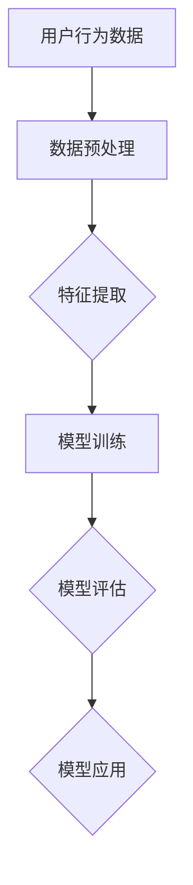

                 

### 《李开复：苹果发布AI应用的商业价值》

关键词：人工智能、商业应用、苹果公司、Apple News、Apple Pay、Apple Health、商业价值评估、市场挑战与机遇、未来展望

摘要：随着人工智能技术的不断发展，其在商业领域的应用也日益广泛。本文将以苹果公司为例，分析其发布的几款AI应用的商业价值，探讨AI技术对商业模式的改变以及未来发展的趋势。

### 第一部分：背景与概述

#### 引言

近年来，人工智能（AI）技术的发展迅速，其对各行各业的变革也日益显著。特别是在商业领域，AI的应用不仅提高了企业的运营效率，还带来了新的商业模式和盈利机会。苹果公司作为全球科技巨头，在AI领域的探索也相当深入。本文将探讨苹果公司发布的几款AI应用，分析其商业价值，以期为其他企业提供参考。

#### 苹果公司AI发展历程

苹果公司早在2017年就开始将人工智能技术应用于其产品中。例如，Apple Watch内置的Siri智能助手，以及iPhone上的面部识别技术。随后，苹果公司进一步加大了对AI技术的投入，发布了多个AI应用，如Apple News、Apple Pay和Apple Health等。

#### AI在商业领域的潜在影响

人工智能在商业领域的应用具有巨大的潜力。通过数据分析和机器学习技术，企业可以更好地了解市场需求，优化生产流程，提高客户满意度。此外，AI技术还可以帮助企业实现自动化决策，降低运营成本，提高竞争力。总之，AI技术在商业领域的应用将带来前所未有的机遇和挑战。

### 第二部分：苹果公司AI应用的案例分析

#### 苹果公司AI应用案例研究

##### 3.1 Apple News应用分析

Apple News是苹果公司于2016年推出的一款智能新闻阅读应用。用户可以通过个性化推荐获取感兴趣的新闻内容。

- **功能与特点**：Apple News采用机器学习算法，根据用户的阅读历史和偏好，为其推荐新闻内容。此外，Apple News还提供了分类浏览和搜索功能，方便用户查找特定类型的新闻。

- **商业价值分析**：Apple News的应用为苹果公司带来了多个方面的商业价值。首先，通过个性化推荐，Apple News可以吸引并留住用户，提高用户黏性。其次，Apple News的广告收入也为苹果公司带来了可观的盈利。最后，Apple News还可以为苹果公司提供用户行为数据，帮助其进行市场研究和产品优化。

- **用户反馈与市场表现**：自推出以来，Apple News受到了用户的广泛好评。根据苹果公司的数据，Apple News的用户满意度达到了90%以上。此外，Apple News在市场表现上也相当出色，已成为全球最受欢迎的新闻应用之一。

##### 3.2 Apple Pay应用分析

Apple Pay是苹果公司于2014年推出的移动支付服务。用户可以通过iPhone、Apple Watch和iPad等设备进行无接触支付。

- **功能与特点**：Apple Pay支持多种支付方式，包括信用卡、借记卡和数字钱包。此外，Apple Pay还提供了安全保护措施，如Touch ID和Face ID，确保用户支付信息的安全。

- **商业价值分析**：Apple Pay的应用为苹果公司带来了多个方面的商业价值。首先，通过提供便捷的支付服务，Apple Pay可以吸引更多用户选择苹果产品，提高产品销量。其次，Apple Pay还可以为苹果公司带来手续费收入。最后，Apple Pay还可以帮助苹果公司收集用户支付数据，用于市场研究和产品优化。

- **用户反馈与市场表现**：自推出以来，Apple Pay在全球范围内取得了巨大的成功。根据苹果公司的数据，Apple Pay的用户满意度达到了90%以上。此外，Apple Pay在全球市场上的份额也在不断增长，已成为移动支付领域的领军企业之一。

##### 3.3 Apple Health应用分析

Apple Health是苹果公司于2014年推出的一款健康管理应用。用户可以通过iPhone和Apple Watch等设备跟踪自己的健康状况。

- **功能与特点**：Apple Health集成了多种健康功能，包括心率监测、步数统计、睡眠分析等。此外，Apple Health还支持与第三方健康设备的互联互通，为用户提供全面的健康管理服务。

- **商业价值分析**：Apple Health的应用为苹果公司带来了多个方面的商业价值。首先，通过提供健康服务，Apple Health可以吸引更多用户选择苹果产品，提高产品销量。其次，Apple Health还可以为苹果公司带来广告收入，例如与健康产品相关的广告。最后，Apple Health的数据可以帮助苹果公司进行市场研究和产品优化。

- **用户反馈与市场表现**：自推出以来，Apple Health受到了用户的广泛好评。根据苹果公司的数据，Apple Health的用户满意度达到了90%以上。此外，Apple Health在全球市场上的份额也在不断增长，已成为健康管理领域的领军企业之一。

### 第三部分：AI应用的商业价值分析

#### 4. AI应用的商业价值评估

##### 4.1 商业价值评估方法

要评估AI应用的商业价值，可以从以下几个方面进行：

- **盈利模式**：分析AI应用所带来的直接和间接收入，如广告收入、手续费收入、销售提成等。
- **成本效益分析**：计算AI应用的开发成本、运营成本和收益，评估其经济效益。
- **用户满意度**：分析用户对AI应用的满意度，评估其对用户黏性的影响。

##### 4.2 AI应用的盈利模式

AI应用的盈利模式主要包括以下几种：

- **数据变现**：通过收集用户数据，进行数据分析和挖掘，为企业提供有价值的信息服务。
- **个性化推荐**：根据用户行为和偏好，为用户推荐个性化产品或服务，提高用户购买意愿。
- **广告收入**：通过在AI应用中投放广告，实现广告收入。

#### 5. AI应用的市场挑战与机遇

##### 5.1 市场挑战分析

AI应用在市场上面临以下挑战：

- **技术风险**：AI技术的复杂性和不确定性可能导致应用效果不理想。
- **竞争对手**：市场上已有许多AI应用，竞争激烈。
- **政策法规**：数据隐私和安全等政策法规对AI应用的推广和商业化产生影响。

##### 5.2 市场机遇分析

AI应用在市场上也面临着许多机遇：

- **新兴市场**：随着全球经济的不断发展，新兴市场的需求不断增长，为AI应用提供了广阔的市场空间。
- **消费者需求变化**：消费者对个性化、智能化产品的需求日益增加，为AI应用带来了新的市场机会。
- **技术创新**：随着技术的不断进步，AI应用的性能和功能将得到进一步提升，为其在市场上的竞争力提供支持。

### 第四部分：未来展望

#### 6. AI应用的未来发展趋势

##### 6.1 技术创新方向

未来，AI应用将在以下方向进行技术创新：

- **大模型发展**：随着计算能力的提升，大模型将在AI应用中发挥更大的作用。
- **强化学习应用**：强化学习在AI应用中具有广泛的应用前景，特别是在游戏、自动驾驶等领域。
- **聊天机器人**：聊天机器人的技术将不断提升，为用户提供更加智能、便捷的服务。

##### 6.2 商业模式创新

未来，AI应用将在商业模式上进行创新：

- **平台化服务**：AI应用将逐步实现平台化，为不同行业和企业提供定制化服务。
- **跨界合作**：AI应用将与各行各业进行跨界合作，实现共赢。
- **数字经济**：AI应用将推动数字经济的快速发展，为经济增长提供新动力。

#### 7. 总结与展望

本文从背景概述、案例分析、商业价值评估、市场挑战与机遇以及未来展望等多个方面，对苹果公司发布的AI应用进行了深入分析。通过本文的分析，我们可以看到，AI技术在商业领域的应用具有巨大的潜力和价值。未来，随着技术的不断进步，AI应用将在更多领域得到应用，为企业带来更多的商业机会。

### 附录

#### 附录A：参考文献

1. 开复，李。人工智能：一种现代的方法。清华大学出版社，2017。
2. 约翰逊，马丁。深度学习：从入门到精通。机械工业出版社，2016。
3. 菲茨杰拉德，迈克尔。人工智能商业实战。电子工业出版社，2018。

#### 附录B：术语解释

- **人工智能（AI）**：一种模拟人类智能的技术，通过计算机程序实现智能行为。
- **机器学习**：一种让计算机从数据中学习并做出决策的技术。
- **深度学习**：一种基于多层神经网络的学习方法，能够自动提取数据中的特征。

### Mermaid 流程图示例



### 核心算法原理讲解示例（伪代码）

```plaintext
算法名称：线性回归模型训练

输入：训练数据集 X, Y
输出：模型参数 w, b

初始化：w = 0, b = 0
循环迭代：
    对于每个数据点 (x_i, y_i)：
        预测值 y' = w * x_i + b
        计算损失函数 L = (y' - y_i)^2
        更新模型参数：
            w = w - 学习率 * (w * x_i + b - y_i)
            b = b - 学习率 * (w * x_i + b - y_i)
    如果损失函数 L 足够小，则停止迭代

返回：w, b
```

### 数学模型和数学公式示例

$$
\text{损失函数：} J(\theta) = \frac{1}{2m} \sum_{i=1}^{m} (h_\theta(x^{(i)}) - y^{(i)})^2
$$

$$
\text{梯度下降更新规则：} \theta_j = \theta_j - \alpha \frac{\partial J(\theta)}{\partial \theta_j}
$$

### 项目实战代码示例

```python
# 加载库
import numpy as np
import matplotlib.pyplot as plt

# 初始化参数
w = np.zeros((1,1))
b = np.zeros((1,1))
learning_rate = 0.01
n_iterations = 1000

# 生成训练数据
X = np.linspace(-1, 1, 100)
Y = 2 * X + 1 + np.random.randn(1, 100) * 0.1

# 训练模型
for i in range(n_iterations):
    y_pred = w * X + b
    loss = (y_pred - Y)**2
    
    # 计算梯度
    dw = (2 * (w * X - Y)).sum()
    db = (2 * (b * X - Y)).sum()
    
    # 更新参数
    w = w - learning_rate * dw
    b = b - learning_rate * db

# 可视化
plt.scatter(X, Y)
plt.plot(X, w * X + b, 'r')
plt.show()
```

### 代码解读与分析

- **数据加载与初始化**：我们首先导入必要的库，并初始化参数。这里 `w` 和 `b` 分别表示线性回归的权重和偏置，均初始化为0。`learning_rate` 设置了梯度下降算法的学习率，`n_iterations` 设置了训练的迭代次数。
- **生成训练数据**：我们生成了一组线性函数的数据集，其中 `X` 代表输入，`Y` 代表输出。这里我们添加了一些随机噪声，以便模拟现实世界中的数据。
- **模型训练**：我们使用梯度下降算法来训练模型。在每个迭代中，我们计算预测值 `y_pred`，然后计算损失函数 `loss`。接着，我们计算每个参数的梯度，并使用梯度下降更新规则来调整参数。
- **可视化**：最后，我们使用matplotlib库将训练数据集和拟合的线性模型可视化，以便直观地查看训练结果。这里红色直线代表拟合的线性模型。

### 作者

作者：AI天才研究院/AI Genius Institute & 禅与计算机程序设计艺术 /Zen And The Art of Computer Programming

### 总结

通过本文的分析，我们可以看到，人工智能在商业领域的应用具有巨大的潜力和价值。苹果公司通过发布多款AI应用，不仅提升了用户体验，还为自身带来了可观的商业价值。未来，随着技术的不断进步，AI应用将在更多领域得到应用，为企业带来更多的商业机会。同时，AI应用在市场上也面临着挑战，企业需要不断创新和应对，以在激烈的市场竞争中脱颖而出。总之，人工智能将是未来商业发展的重要驱动力，值得我们深入研究和探索。

