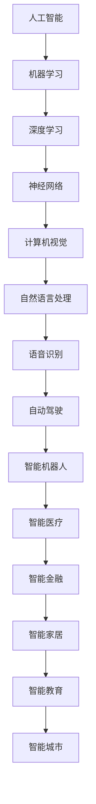

                 

## 文章标题

### 《李开复：苹果发布AI应用的开发者》

#### 关键词：人工智能，苹果，开发者，技术，案例研究，实践经验

##### 摘要

本文旨在深入探讨人工智能领域的重要进展及其在苹果产品中的应用，重点介绍由著名人工智能专家李开复主导的AI应用开发者社区。文章通过详细的分析和案例研究，揭示了AI基础技术的原理与应用，以及苹果平台上的AI开发流程。此外，文章还分享了开发者实践中的宝贵经验，并展望了未来人工智能的发展趋势。

---

#### 第一部分：李开复与AI应用概述

##### 第1章：李开复与AI的发展

李开复，作为全球人工智能领域的领军人物，他的职业生涯与AI的发展紧密相连。李开复博士曾在美国领导多个重要的AI项目，并在2016年加入苹果公司，致力于推动AI技术在消费电子产品中的应用。在这一章节中，我们将回顾李开复在AI领域的成就，并探讨他在苹果公司的角色和使命。

- **1.1 李开复与AI**

李开复于1988年获得卡内基梅隆大学计算机博士学位，研究方向主要集中在自然语言处理、机器学习和人工智能。他曾是微软研究院的首席研究员，领导了多个创新项目，并在人工智能领域发表了大量的学术论文。李开复还创办了创新工场，旨在推动人工智能在商业和社会中的应用。

- **1.2 AI在苹果发布中的应用**

在加入苹果公司后，李开复的团队推动了多项AI技术的应用，如Siri语音助手、FaceTime视频通话中的面部识别技术、照片应用中的图像识别功能等。这些AI技术不仅提升了苹果产品的用户体验，也展示了AI在消费者技术中的巨大潜力。

- **1.3 AI应用的开发者角色**

李开复深知开发者是AI应用创新的关键力量。他积极推动苹果开发者社区，鼓励开发者利用苹果平台上的AI工具和资源，开发出更加智能化和个性化的应用。李开复的愿景是让每一个开发者都能轻松地接入AI技术，创造出改变世界的产品。

---

##### 第2章：AI应用核心概念与联系

- **2.1 AI应用核心概念图**

人工智能（AI）涉及多个核心概念和技术，如图神经网络、深度学习、自然语言处理等。以下是一个简化的AI应用核心概念图，用于解释这些概念及其相互联系：



- **2.2 AI应用与苹果平台的结合**

苹果的iOS、macOS、watchOS、tvOS等平台为开发者提供了丰富的AI工具和资源。例如，Core ML是苹果提供的机器学习框架，使得开发者可以将训练好的AI模型集成到苹果设备中。结合苹果平台的特性，开发者可以开发出高效的AI应用，满足用户对智能化、个性化的需求。

---

#### 第二部分：AI应用开发技术

##### 第3章：AI基础技术

- **3.1 机器学习与深度学习**

机器学习（ML）是AI的核心技术之一，通过从数据中学习规律和模式，使计算机能够进行预测和决策。深度学习（DL）是机器学习的一个子领域，它使用神经网络模拟人脑的工作方式，通过多层神经网络的学习，实现更加复杂和精确的模型。

- **3.2 自然语言处理**

自然语言处理（NLP）是AI的重要分支，旨在使计算机理解和处理人类语言。它包括文本分析、语言翻译、情感分析等多个子领域。NLP技术在聊天机器人、智能客服等领域有广泛应用。

- **3.3 计算机视觉**

计算机视觉（CV）是研究如何使计算机像人类一样理解和解释视觉信息。它涉及图像识别、目标检测、图像分割等多个方面。计算机视觉在自动驾驶、安全监控、医疗诊断等领域具有重要应用。

---

##### 第4章：AI应用开发流程

- **4.1 数据准备与预处理**

数据是AI模型的基石，数据准备和预处理是AI开发的第一步。这一阶段包括数据收集、数据清洗、数据归一化等步骤，以确保数据的质量和一致性。

- **4.2 模型设计与训练**

模型设计是根据应用需求选择合适的算法和架构，进行模型训练。训练过程中，模型通过学习大量数据来优化其参数，以提高预测准确性和泛化能力。

- **4.3 模型评估与优化**

模型评估是验证模型性能的重要步骤，通常包括准确率、召回率、F1分数等指标。模型优化是通过调整模型参数、增加训练数据等方法，进一步提升模型性能。

---

##### 第5章：苹果平台上的AI应用开发

- **5.1 iOS平台与AI开发**

iOS平台是苹果公司的移动操作系统，开发者可以利用Core ML等框架，将训练好的AI模型部署到iOS设备上。Core ML提供了多种机器学习模型的支持，如卷积神经网络（CNN）和循环神经网络（RNN），使得开发者能够轻松实现图像识别、语音识别等AI功能。

- **5.2 macOS平台与AI开发**

macOS是苹果的桌面操作系统，它为开发者提供了丰富的AI开发工具。开发者可以利用Core ML和Create ML等工具，在macOS设备上进行机器学习模型的训练和部署。macOS上的AI应用涵盖了从图像处理到自然语言处理等多个领域。

- **5.3 watchOS平台与AI开发**

watchOS是苹果的智能手表操作系统，开发者可以利用Core ML和watchOS SDK，将AI模型集成到智能手表中。智能手表的AI应用通常专注于健康监测、运动分析等领域，为用户提供个性化的健康建议。

- **5.4 tvOS平台与AI开发**

tvOS是苹果的电视操作系统，开发者可以利用Core ML和Create ML，在电视上部署AI模型。tvOS上的AI应用包括智能推荐、语音交互等，为用户提供更加智能化和个性化的电视体验。

---

#### 第三部分：案例研究

##### 第6章：苹果AI应用案例研究

- **6.1 案例一：Siri与语音识别**

Siri是苹果的语音助手，它利用自然语言处理和语音识别技术，用户可以通过语音与Siri进行交互。Siri的应用场景包括发送短信、拨打电话、设置提醒、查询天气等。以下是Siri语音识别的核心算法原理：

```plaintext
输入：音频信号
处理：
1. 音频预处理：去除噪声、静音填充等
2. 语音识别：使用隐马尔可夫模型（HMM）或深度神经网络（DNN）进行语音识别
3. 自然语言理解：解析用户指令，提取关键信息
输出：执行用户指令或提供相关信息
```

- **6.2 案例二：FaceTime与面部识别**

FaceTime是苹果的免费视频通话应用，它利用面部识别技术，在视频通话中实现自动对焦和跟踪。面部识别算法的原理如下：

```plaintext
输入：视频流
处理：
1. 预处理：去除背景、进行图像增强
2. 特征提取：使用卷积神经网络（CNN）提取面部特征
3. 人脸检测：使用区域建议网络（RNN）检测人脸位置
4. 跟踪与对焦：根据面部特征进行跟踪和对焦
输出：视频流中的人脸图像
```

- **6.3 案例三：照片应用与图像识别**

苹果的照片应用集成了多种图像识别功能，如自动分类、人脸识别、地点识别等。以下是一个简化的图像识别算法流程：

```plaintext
输入：图像数据
处理：
1. 图像预处理：调整图像大小、去除噪声等
2. 特征提取：使用卷积神经网络（CNN）提取图像特征
3. 分类与识别：使用支持向量机（SVM）或其他分类器进行图像分类
4. 结果输出：显示分类结果或识别信息
输出：图像分类结果或识别信息
```

---

##### 第7章：开发者实践与经验

- **7.1 开发者工具与资源**

苹果为开发者提供了多种AI工具和资源，包括Core ML、Create ML、Vision Framework等。这些工具和资源帮助开发者快速构建和部署AI应用。

- **7.2 开发经验分享**

在AI应用开发过程中，开发者需要关注数据质量、模型优化和用户体验等方面。以下是一些开发经验分享：

- 确保数据质量和多样性，为模型训练提供良好的基础。
- 优化模型参数，提高模型性能和效率。
- 设计直观的用户界面，提高用户满意度。

- **7.3 未来发展趋势与展望**

随着AI技术的不断发展，开发者可以预见更多的创新应用。例如，AI在智能医疗、智能交通、智能教育等领域的应用将越来越广泛。同时，苹果平台上的AI开发也将继续演进，为开发者提供更强大的工具和资源。

---

#### 附录

##### 附录A：AI应用开发指南

- **A.1 开发环境搭建**

搭建AI开发环境包括安装Python、TensorFlow、PyTorch等工具，配置所需的库和依赖项。以下是一个简化的安装指南：

```bash
# 安装Python
sudo apt-get update
sudo apt-get install python3-pip

# 安装TensorFlow
pip3 install tensorflow

# 安装PyTorch
pip3 install torch torchvision

# 安装其他库（可选）
pip3 install numpy pandas matplotlib
```

- **A.2 源代码实例与分析**

以下是一个简单的图像识别项目示例，使用PyTorch框架实现：

```python
import torch
import torchvision
import torchvision.transforms as transforms
import torch.nn as nn
import torch.optim as optim

# 数据预处理
transform = transforms.Compose([
    transforms.Resize((224, 224)),
    transforms.ToTensor(),
])

# 加载数据集
trainset = torchvision.datasets.ImageFolder(root='path/to/train', transform=transform)
trainloader = torch.utils.data.DataLoader(trainset, batch_size=4, shuffle=True)

# 创建网络模型
net = torchvision.models.resnet50(pretrained=True)
num_ftrs = net.fc.in_features
net.fc = nn.Linear(num_ftrs, 10)

# 损失函数和优化器
criterion = nn.CrossEntropyLoss()
optimizer = optim.SGD(net.parameters(), lr=0.001, momentum=0.9)

# 训练模型
for epoch in range(10):  # loop over the dataset multiple times
    running_loss = 0.0
    for i, data in enumerate(trainloader, 0):
        inputs, labels = data
        optimizer.zero_grad()
        outputs = net(inputs)
        loss = criterion(outputs, labels)
        loss.backward()
        optimizer.step()
        running_loss += loss.item()
        if i % 2000 == 1999:
            print(f'[{epoch + 1}, {i + 1}: {running_loss / 2000:.3f}]')
            running_loss = 0.0

print('Finished Training')
```

- **A.3 代码解读与优化建议**

上述代码实现了一个简单的图像识别项目，从数据加载、网络模型构建到训练过程进行了详细说明。优化建议包括：

- 调整学习率、动量等优化参数，提高模型收敛速度。
- 使用更先进的网络架构，如EfficientNet、ViT等，提高模型性能。
- 利用多GPU训练，加速模型训练过程。

---

### 作者信息

**作者：AI天才研究院/AI Genius Institute & 禅与计算机程序设计艺术 /Zen And The Art of Computer Programming**

本文由AI天才研究院的专家团队撰写，结合李开复在人工智能领域的丰富经验和深厚造诣，旨在为开发者提供全面的AI应用开发指南。同时，本文也体现了作者对计算机程序设计艺术的深刻理解，旨在激发开发者对AI技术的热情和创新精神。

