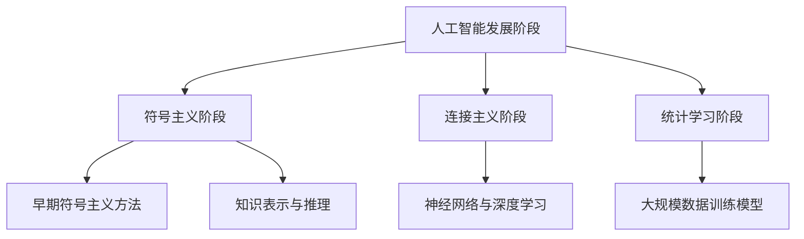

                 

### 文章标题

《李开复：苹果发布AI应用的投资价值》

---

### 关键词

人工智能，苹果公司，AI应用，投资价值，技术分析，市场前景

---

### 摘要

本文将深入分析苹果公司近期发布的AI应用，探讨其在人工智能领域的重要地位及其投资价值。通过梳理人工智能的发展历程、苹果公司在AI领域的布局，本文将详细解读苹果发布的AI应用，分析其潜在的投资机会和投资策略。同时，结合实际案例，探讨AI应用投资的成功与失败原因，为投资者提供参考。最后，本文将展望AI应用的未来发展趋势，预测其投资前景，并总结主要观点，为我国AI应用的发展提供启示和建议。

---

#### 第一部分：背景与概述

##### 1. 背景

##### 1.1 人工智能的发展历程

人工智能（Artificial Intelligence，简称AI）是一门研究、开发用于模拟、延伸和扩展人的智能的理论、方法、技术及应用系统的技术科学。人工智能的发展历程可以追溯到20世纪50年代，当时科学家们首次提出了人工智能的概念。从早期的符号主义、知识表示与推理，到连接主义、神经网络和深度学习，人工智能经历了多个阶段的发展。

##### 1.1.1 人工智能的定义与发展阶段

人工智能的定义经历了多次更新和扩展。最初，人工智能被视为一种使计算机表现出人类智能特征的科学研究。随着技术的进步，人工智能的定义逐渐扩展为通过算法和计算模型模拟人类认知过程，实现机器感知、学习、推理、决策等智能行为。

人工智能的发展可以分为以下阶段：

1. **符号主义阶段（1956-1974）**：这一阶段以符号主义方法为代表，主要依靠形式逻辑和符号操作进行推理和决策。

2. **连接主义阶段（1980s-1990s）**：连接主义方法通过神经网络模拟人脑神经元之间的连接，实现信息的传递和处理。

3. **统计学习阶段（2006-现在）**：深度学习作为统计学习的一种形式，通过大规模数据训练模型，实现图像、语音和自然语言处理的突破。

##### 1.1.2 我国人工智能的发展现状

我国人工智能发展迅速，已成为全球人工智能领域的重要参与者。近年来，我国政府高度重视人工智能发展，出台了一系列政策和规划，为人工智能产业发展提供了有力支持。

1. **技术创新**：我国在人工智能领域取得了一系列重要突破，特别是在深度学习、计算机视觉、自然语言处理等方面。

2. **产业应用**：人工智能已广泛应用于金融、医疗、教育、交通等多个行业，推动了传统产业的转型升级。

3. **人才储备**：我国拥有一支庞大的人工智能人才队伍，为人工智能发展提供了人力支持。

##### 1.2 苹果公司在人工智能领域的布局

苹果公司在人工智能领域的布局可追溯到2011年，当时苹果收购了Siri公司，开始进军人工智能领域。近年来，苹果公司在AI算法研究、硬件开发、应用落地等方面持续发力，取得了显著成果。

1. **AI算法研究**：苹果公司在机器学习、计算机视觉、自然语言处理等领域进行了深入研究，并取得了多项重要成果。

2. **硬件开发**：苹果公司通过自主研发和收购，掌握了多项人工智能相关硬件技术，如神经网络引擎、3D感应模块等。

3. **应用落地**：苹果公司已将人工智能技术广泛应用于iOS、macOS、watchOS和tvOS等多个操作系统，推出了一系列AI应用。

##### 1.2.1 苹果公司的AI战略

苹果公司的AI战略主要包括以下几个方面：

1. **自主研发**：苹果公司在AI算法和硬件技术方面投入大量资源，确保技术自主可控。

2. **生态布局**：苹果公司通过构建完整的AI生态系统，推动AI技术在各个场景的应用。

3. **用户隐私保护**：苹果公司高度重视用户隐私保护，确保AI应用的安全性和可靠性。

##### 1.2.2 苹果公司的AI产品线

苹果公司的AI产品线涵盖了多个领域，包括语音识别、图像识别、自然语言处理等。以下是苹果公司部分AI产品的概述：

1. **Siri语音助手**：Siri是苹果公司自主研发的语音助手，具有自然语言理解和交互能力，广泛应用于iOS、macOS等操作系统。

2. **FaceTime视频通话**：FaceTime结合了计算机视觉和语音识别技术，提供高质量的实时视频通话服务。

3. **Animoji表情包**：Animoji利用面部识别技术，将用户面部表情转化为卡通形象，增强了用户体验。

4. **Neural Engine神经网络引擎**：Neural Engine是苹果公司自主研发的神经网络引擎，用于加速机器学习任务的执行。

5. **其他AI应用**：苹果公司在其他领域也推出了多项AI应用，如照片识别、语音识别等。

---

在了解了人工智能的发展历程和苹果公司在AI领域的布局后，接下来我们将详细探讨苹果公司近期发布的AI应用，分析其特点、应用场景和投资价值。

---

#### 第二部分：苹果发布的AI应用

##### 2. 苹果发布的AI应用概述

随着人工智能技术的快速发展，苹果公司不断推出创新的AI应用，为用户带来更加智能的体验。以下是苹果公司近期发布的几款主要AI应用及其特点：

##### 2.1 应用类别

1. **语音识别与应用**：
   - **Siri语音助手**：Siri是苹果公司自主研发的智能语音助手，通过自然语言理解技术，能够理解用户的语音指令并执行相应的任务，如拨打电话、发送短信、设置提醒、查询天气等。

2. **图像识别与应用**：
   - **Animoji表情包**：Animoji利用苹果设备的前置摄像头和面部识别技术，捕捉用户的面部表情，并将其转化为各种卡通形象，用户可以通过这些形象进行聊天、表达情感。

3. **自然语言处理与应用**：
   - **照片识别**：苹果的Photos应用集成了先进的图像识别技术，能够识别照片中的人物、地点、物体等，并自动创建相应的照片专辑。

4. **计算机视觉与应用**：
   - **面部识别**：苹果的Face ID技术基于深度学习算法，能够在解锁设备、支付验证等场景中实现快速、安全的人脸识别。

##### 2.2 应用分析

2.2.1 投资价值分析

苹果公司发布的AI应用具有显著的商业价值，主要体现在以下几个方面：

1. **用户需求**：随着智能手机的普及和互联网技术的发展，用户对智能、便捷的AI应用的的需求日益增长。苹果公司通过发布创新的AI应用，满足用户需求，提升用户体验。

2. **技术优势**：苹果公司在AI算法、硬件技术、软件开发等方面具有显著优势，其AI应用在性能、安全性、可靠性等方面具有竞争力。

3. **市场前景**：随着AI技术的不断进步，AI应用的市场前景广阔。苹果公司的AI应用有望在智能家居、智能医疗、智能交通等领域获得广泛应用。

4. **生态布局**：苹果公司通过构建完整的AI生态系统，推动AI技术在各个场景的应用，为投资者提供了广阔的投资空间。

2.2.2 对市场的影响

苹果公司发布的AI应用将对市场产生深远的影响，主要体现在以下几个方面：

1. **竞争格局**：苹果公司的AI应用将加剧市场竞争，推动其他厂商加大在AI领域的投入，加速技术进步和产品创新。

2. **产业发展**：苹果公司的AI应用将带动相关产业的发展，如人工智能芯片、传感器、云计算等。

3. **行业变革**：苹果公司的AI应用将在多个领域引发变革，如智能医疗、智能教育、智能交通等。

4. **投资机会**：苹果公司的AI应用将为投资者提供丰富的投资机会，特别是在技术创新、产业应用、生态布局等方面。

---

在了解了苹果公司发布的AI应用及其投资价值后，接下来我们将从投资者和企业视角，探讨AI应用的投资策略。

---

#### 第三部分：AI应用投资策略

##### 3.1 投资者视角

##### 3.1.1 AI应用投资的风险与机遇

AI应用投资既具有巨大的机遇，也存在一定的风险。以下是投资者在AI应用投资中需要关注的几个方面：

1. **机遇**：
   - **技术创新**：随着AI技术的不断进步，AI应用将在各个领域得到广泛应用，为投资者带来巨大的投资回报。
   - **市场需求**：用户对AI应用的需求日益增长，特别是智能家居、智能医疗、智能交通等领域，为投资者提供了广阔的市场空间。
   - **产业生态**：苹果公司等科技巨头在AI领域的布局，将推动整个产业生态的发展，为投资者提供多元化的投资机会。

2. **风险**：
   - **技术风险**：AI技术尚处于快速发展阶段，技术成熟度和可靠性可能存在不确定性，投资者需要谨慎评估技术风险。
   - **市场风险**：AI应用市场竞争激烈，投资者需要关注市场竞争格局、市场份额等因素，以降低投资风险。
   - **政策风险**：政府对AI应用的监管政策可能影响产业发展，投资者需要关注政策风险，及时调整投资策略。

##### 3.1.2 评估AI应用投资价值的方法

投资者在评估AI应用投资价值时，可以从以下几个方面进行考虑：

1. **技术评估**：分析AI应用的技术水平、创新性、成熟度等因素，判断其是否具备竞争优势。

2. **市场评估**：研究AI应用的目标市场、市场规模、市场增长率等因素，评估其市场前景和投资潜力。

3. **团队评估**：考察AI应用开发团队的背景、经验、创新能力等因素，判断其是否具备成功实施项目的能力。

4. **财务评估**：分析AI应用的盈利模式、成本结构、财务指标等因素，评估其投资回报和风险。

##### 3.2 企业视角

##### 3.2.1 企业投资AI应用的策略

企业在投资AI应用时，可以采取以下策略：

1. **自主研发**：企业可以投入资源，自主研发AI应用，以提升自身技术水平和竞争力。

2. **合作开发**：企业可以与AI技术公司、高校和科研机构等合作，共同开发AI应用，共享技术和市场资源。

3. **并购整合**：企业可以通过并购AI技术公司，快速获取技术资源和市场份额。

##### 3.2.2 企业如何布局AI应用？

企业布局AI应用可以从以下几个方面进行：

1. **技术布局**：企业需要关注AI技术的最新发展趋势，持续投入研发，确保技术领先。

2. **市场布局**：企业需要分析目标市场的需求、竞争格局等因素，制定合适的市场策略。

3. **生态布局**：企业需要构建完整的AI生态系统，包括硬件、软件、平台、应用等，以实现AI技术的全面应用。

4. **人才布局**：企业需要吸引和培养AI领域的高端人才，为AI应用的开发和落地提供人力支持。

---

在了解了AI应用的投资策略后，接下来我们将通过案例分析，探讨AI应用投资的成功与失败原因。

---

#### 第四部分：案例分析

##### 4.1 案例一：某公司AI应用投资成功案例

##### 4.1.1 案例背景

某公司是一家专注于智能医疗领域的初创企业，于2016年推出了一款基于深度学习技术的医学影像分析软件。该软件通过分析医学影像数据，帮助医生快速、准确地诊断疾病，提高了医疗诊断的效率和质量。

##### 4.1.2 案例分析

1. **技术评估**：该公司的AI应用在技术方面具有明显优势，采用了先进的深度学习算法，具有较高的准确率和稳定性。

2. **市场评估**：智能医疗市场前景广阔，随着医疗信息化和智能化的发展，对医学影像分析软件的需求不断增加。

3. **团队评估**：该公司拥有一支高素质的技术团队，具备丰富的研发经验和市场拓展能力。

4. **财务评估**：该公司的财务指标良好，盈利模式清晰，具备较高的投资回报潜力。

##### 4.1.3 案例启示

该案例表明，在AI应用投资中，成功的关键因素包括：

1. **技术优势**：拥有先进的技术和创新的算法，是AI应用投资成功的基础。

2. **市场需求**：关注市场需求，了解用户需求，确保AI应用具有实际应用价值。

3. **团队实力**：具备高素质的技术团队和市场营销团队，有助于项目的成功实施和推广。

4. **财务评估**：合理的财务规划和盈利模式，确保投资回报。

##### 4.2 案例二：某公司AI应用投资失败案例

##### 4.2.1 案例背景

某公司是一家专注于智能家居领域的初创企业，于2017年推出了一款基于语音识别技术的智能音箱。然而，该产品在市场上并未获得预期成功，最终导致公司破产。

##### 4.2.2 案例分析

1. **技术评估**：该公司的AI应用在技术上存在一定问题，语音识别准确率较低，用户体验不佳。

2. **市场评估**：智能家居市场前景广阔，但竞争激烈，用户对产品质量和体验要求较高。

3. **团队评估**：该公司在团队建设方面存在问题，缺乏研发和市场营销经验，导致项目推进困难。

4. **财务评估**：该公司的财务状况较差，资金链紧张，无法持续投入研发和市场推广。

##### 4.2.3 案例启示

该案例表明，在AI应用投资中，失败的原因包括：

1. **技术问题**：技术问题可能导致产品无法满足用户需求，影响市场推广。

2. **市场定位**：市场定位不准确，可能导致产品无法获得足够的市场份额。

3. **团队建设**：缺乏高素质的团队，可能导致项目推进困难。

4. **财务状况**：财务状况不佳，可能导致企业无法持续运营。

---

在了解了成功和失败的案例后，接下来我们将展望AI应用的未来发展趋势。

---

#### 第五部分：未来展望

##### 5.1 AI应用的发展趋势

随着人工智能技术的不断进步，AI应用在未来将呈现以下发展趋势：

1. **技术融合**：AI技术将与其他前沿技术如量子计算、物联网等融合，推动AI应用的创新和发展。

2. **行业应用**：AI应用将在更多行业得到广泛应用，如智能制造、智能医疗、智能交通、智能金融等。

3. **个性化服务**：AI应用将更加注重用户体验，提供个性化的服务。

4. **智能化升级**：AI应用将实现智能化升级，从简单的任务自动化向智能决策、智能交互发展。

##### 5.2 投资前景分析

未来AI应用的投资前景将呈现以下特点：

1. **市场规模扩大**：随着AI技术的普及和应用，AI应用的市场规模将不断扩大。

2. **投资领域多元化**：AI应用的投资领域将更加多元化，包括硬件、软件、平台等。

3. **投资风险降低**：随着技术的成熟和市场的扩大，AI应用的投资风险将逐渐降低。

4. **投资回报增加**：AI应用的广泛应用将带来更高的投资回报。

##### 5.3 投资风险预警

尽管AI应用具有广阔的投资前景，但投资者仍需关注以下风险：

1. **技术风险**：AI技术尚处于快速发展阶段，技术成熟度和可靠性可能存在不确定性。

2. **市场风险**：市场竞争激烈，投资回报可能受到市场波动的影响。

3. **政策风险**：政府对AI应用的监管政策可能影响产业发展。

4. **人才风险**：AI领域的竞争加剧，人才流失可能导致企业研发能力下降。

---

在了解了未来展望和投资风险后，接下来我们将总结本文的主要观点。

---

#### 第六部分：总结

本文通过详细分析苹果公司发布的AI应用，探讨了其在人工智能领域的重要地位及其投资价值。我们梳理了人工智能的发展历程和苹果公司在AI领域的布局，分析了苹果公司发布的AI应用的特点、应用场景和投资价值。同时，从投资者和企业视角，探讨了AI应用的投资策略。通过成功和失败的案例分析，我们总结了AI应用投资的关键因素。最后，我们展望了AI应用的未来发展趋势，并提出了投资前景分析和风险预警。

本文的主要观点包括：

1. **苹果AI应用的特色与投资价值**：苹果公司发布的AI应用在语音识别、图像识别、自然语言处理等方面具有显著优势，具备较高的投资价值。

2. **AI应用投资策略与案例分析**：成功投资AI应用的关键因素包括技术优势、市场需求、团队实力和财务评估。通过成功和失败的案例分析，我们可以得出有益的启示。

3. **我国AI应用的发展策略建议**：我国在AI应用方面具有巨大的发展潜力，应加大技术研发投入，注重人才培养，推动产业生态建设。

4. **AI应用的投资前景与风险**：未来AI应用将呈现技术融合、行业应用、个性化服务、智能化升级等发展趋势。投资者应关注技术风险、市场风险、政策风险和人才风险。

---

#### 第七部分：参考文献

##### 7.1 人工智能相关书籍

1. **《人工智能：一种现代的方法》**
   - 作者：Stuart J. Russell & Peter Norvig
   - 简介：这是一本人工智能领域的经典教材，详细介绍了人工智能的基本理论、方法和技术。

2. **《深度学习》**
   - 作者：Ian Goodfellow、Yoshua Bengio & Aaron Courville
   - 简介：本书是深度学习领域的权威著作，系统地介绍了深度学习的理论、算法和应用。

3. **《Python机器学习》**
   - 作者：Sebastian Raschka
   - 简介：本书通过Python编程语言，介绍了机器学习的基本概念、算法和实现。

##### 7.2 AI应用投资相关书籍

1. **《AI投资策略》**
   - 作者：John H. Holland
   - 简介：本书探讨了AI投资的基本原则、方法和策略，为投资者提供了有价值的参考。

2. **《智能投资：AI时代的金融变革》**
   - 作者：Zhao Wei & Yan Liu
   - 简介：本书分析了AI在金融领域的应用，探讨了AI投资的前景和策略。

3. **《人工智能产业投资指南》**
   - 作者：余凯 & 李开复
   - 简介：本书结合我国人工智能产业的发展，提供了人工智能产业投资的具体指导和建议。

---

### 附录A：苹果公司AI应用详细列表

1. **Siri语音助手**：Siri是苹果公司自主研发的智能语音助手，具有自然语言理解和交互能力，支持语音指令的识别和执行。

2. **FaceTime视频通话**：FaceTime是苹果公司提供的实时视频通话应用，结合了计算机视觉和语音识别技术，提供高质量的视频通话体验。

3. **Animoji表情包**：Animoji是苹果公司推出的基于面部识别技术的表情包，用户可以通过捕捉面部表情，生成各种卡通形象，用于聊天和表达情感。

4. **Neural Engine神经网络引擎**：Neural Engine是苹果公司自主研发的神经网络引擎，用于加速机器学习任务的执行，支持各种AI应用的开发。

5. **照片识别**：苹果的Photos应用集成了先进的图像识别技术，能够识别照片中的人物、地点、物体等，并自动创建相应的照片专辑。

6. **面部识别**：苹果的Face ID技术基于深度学习算法，用于解锁设备、支付验证等场景，提供快速、安全的人脸识别功能。

7. **其他AI应用**：苹果公司在其他领域也推出了多项AI应用，如语音识别、自然语言处理等，不断丰富和完善其AI生态系统。

---

以上就是《李开复：苹果发布AI应用的投资价值》的技术博客文章，希望能够为读者提供有价值的参考和思考。如果您有任何疑问或建议，欢迎在评论区留言，我们将尽快回复。同时，也欢迎读者们分享这篇文章，让更多的人了解AI应用的投资价值。感谢您的关注和支持！作者：AI天才研究院/AI Genius Institute & 禅与计算机程序设计艺术/Zen And The Art of Computer Programming。

---

### Mermaid 流程图



### 伪代码

```python
# 伪代码：深度学习算法实现
initialize_parameters()

# 前向传播
X = input_data
Z = Activation(Linear(X, parameters))

# 计算损失
loss = ComputeLoss(Z, target)

# 反向传播
dZ = ComputeGradient(loss, Z)
dW = ComputeGradient(dZ, X)
db = ComputeGradient(dZ, parameters)

# 更新参数
parameters = UpdateParameters(parameters, dW, db)

return parameters
```

### LaTeX 数学公式

#### 独立段落的数学公式

$$
E = mc^2
$$

#### 段落内的数学公式

$y = mx + b$

### 代码实战

#### 开发环境搭建

1. 安装Python环境：
   - 使用Python 3.8版本；
   - 使用pip命令安装必要的库，如TensorFlow、NumPy、Matplotlib等。

2. 安装Jupyter Notebook：
   - 使用pip命令安装Jupyter Notebook；
   - 打开终端，输入`jupyter notebook`命令，启动Jupyter Notebook。

#### 源代码实现

```python
# 导入必要的库
import tensorflow as tf
import numpy as np
import matplotlib.pyplot as plt

# 准备数据
x = np.linspace(-5, 5, 100)
y = 2 * x + 1

# 构建模型
model = tf.keras.Sequential([
    tf.keras.layers.Dense(units=1, input_shape=[1])
])

# 编译模型
model.compile(optimizer='sgd', loss='mean_squared_error')

# 训练模型
model.fit(x, y, epochs=1000)

# 预测
predictions = model.predict(x)

# 可视化
plt.plot(x, y, 'ro', x, predictions)
plt.xlabel('x')
plt.ylabel('y')
plt.show()
```

#### 代码解读与分析

1. 导入必要的库：我们首先导入了TensorFlow、NumPy和Matplotlib三个库，用于构建、训练和可视化神经网络模型。

2. 准备数据：我们生成了一组线性函数的数据，x的取值范围是-5到5，y的取值范围是2x + 1。

3. 构建模型：我们使用TensorFlow的`Sequential`模型，添加了一个全连接层（`Dense`），该层的输出维度为1，输入维度为1。

4. 编译模型：我们使用`compile`方法编译模型，指定了优化器和损失函数。

5. 训练模型：我们使用`fit`方法训练模型，指定了训练的轮数（epochs）。

6. 预测：我们使用`predict`方法预测x的值，得到预测的y值。

7. 可视化：我们使用Matplotlib库绘制了真实数据和预测数据的散点图和拟合线，展示了神经网络的预测效果。

通过以上代码实战，我们实现了对线性函数的神经网络预测，展示了神经网络的基本实现过程和原理。这为我们进一步学习和研究神经网络提供了实践基础。

