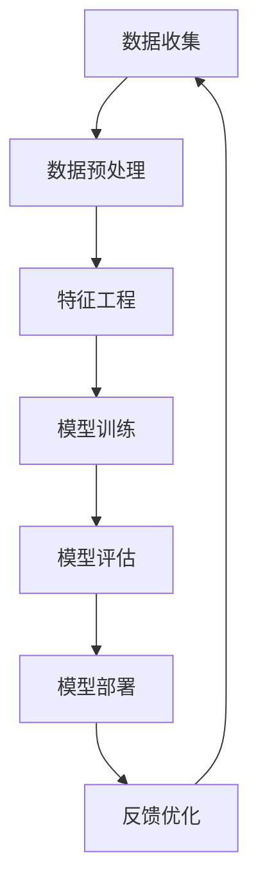
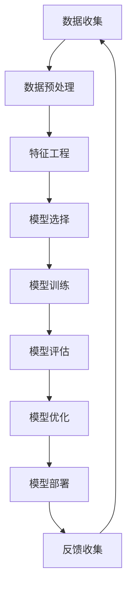
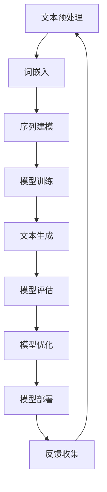

                 

## 文章标题：李开复：苹果发布AI应用的文化价值

关键词：苹果，AI应用，文化价值，技术解析，行业影响，未来展望，我国机遇与挑战

摘要：本文将探讨苹果公司在人工智能（AI）领域的最新进展，特别是其发布的AI应用，从多个角度分析其文化价值。文章首先介绍苹果公司在AI领域的布局和实践，随后深入解析苹果AI应用的技术架构和核心算法，接着探讨这些应用对行业和社会的深远影响，最后展望苹果AI应用的未来发展趋势，并对我国在AI应用与文化产业结合中的机遇与挑战进行探讨。通过本文的逐一分析，我们期望能够展现苹果AI应用在文化价值方面的独特贡献。

### 目录大纲

## 第一部分：引言

### 第1章：苹果与AI：一个时代的开启

#### 1.1 苹果公司在AI领域的布局

#### 1.2 AI应用在苹果产品中的实践

### 第2章：AI应用的文化价值

#### 1.1 AI应用对文化产业的推动作用

#### 1.2 AI应用对人类生活方式的影响

#### 1.3 AI应用在文化传承与创新中的角色

## 第二部分：技术解析

### 第3章：苹果AI应用的架构与技术

#### 3.1 苹果AI应用的核心技术

#### 3.2 苹果AI应用的数据处理能力

#### 3.3 苹果AI应用的模型优化与效率

### 第4章：苹果AI应用的核心算法

#### 4.1 机器学习算法在苹果AI应用中的应用

#### 4.2 深度学习算法在苹果AI应用中的应用

#### 4.3 自然语言处理算法在苹果AI应用中的应用

## 第三部分：行业影响

### 第5章：苹果AI应用在产业中的应用

#### 5.1 苹果AI应用在零售业的应用

#### 5.2 苹果AI应用在金融业的应用

#### 5.3 苹果AI应用在医疗健康领域的应用

### 第6章：苹果AI应用对社会的深远影响

#### 6.1 AI应用对教育的影响

#### 6.2 AI应用对文化的影响

#### 6.3 AI应用对伦理道德的影响

## 第四部分：未来展望

### 第7章：苹果AI应用的未来发展趋势

#### 7.1 苹果AI应用的未来方向

#### 7.2 AI技术在苹果产品中的创新应用

#### 7.3 AI应用在文化价值上的潜在影响

### 第8章：我国在AI应用与文化产业结合中的机遇与挑战

#### 8.1 我国AI应用的发展现状

#### 8.2 我国在AI应用与文化产业结合中的优势

#### 8.3 我国在AI应用与文化产业结合中面临的挑战

## 附录

### 附录A：苹果AI应用相关资源与工具

#### A.1 苹果AI应用开发指南

#### A.2 常用的AI开发工具与框架

#### A.3 AI应用开发资源推荐

### 附录B：核心概念与联系

#### B.1 AI应用架构流程图

#### B.2 机器学习算法流程图

#### B.3 自然语言处理算法流程图

### 附录C：核心算法原理讲解

#### C.1 机器学习算法伪代码

#### C.2 深度学习算法伪代码

#### C.3 自然语言处理算法伪代码

### 附录D：数学模型和公式

#### D.1 机器学习模型公式

#### D.2 深度学习模型公式

#### D.3 自然语言处理模型公式

### 附录E：项目实战

#### E.1 零售业AI应用案例

#### E.2 金融业AI应用案例

#### E.3 医疗健康领域AI应用案例

#### E.4 源代码详细实现与解读

#### E.5 代码解读与分析

### 附录 F：代码解读与分析

#### F.1 代码片段一解读与分析

#### F.2 代码片段二解读与分析

#### F.3 代码片段三解读与分析

## 第一部分：引言

### 第1章：苹果与AI：一个时代的开启

随着人工智能（AI）技术的快速发展，苹果公司（Apple Inc.）正在逐步将其融入到其产品和服务中。AI技术的应用不仅提升了苹果产品的用户体验，还开启了全新的产业格局。本文将探讨苹果公司在AI领域的布局和实践，分析其AI应用的文化价值。

#### 1.1 苹果公司在AI领域的布局

苹果公司在AI领域的布局可以追溯到其成立之初。多年来，苹果公司在硬件、软件和人工智能技术方面进行了大量的投资和研发。以下是一些关键举措：

1. **硬件研发**：苹果公司不断推出高性能的处理器，如M系列芯片，这些芯片在图像处理、语音识别等AI任务中发挥着重要作用。

2. **软件集成**：iOS和macOS等操作系统集成了大量AI功能，包括语音助手Siri、照片和视频的智能编辑等。

3. **人工智能实验室**：苹果公司设立了人工智能实验室，吸引了全球顶尖的AI研究人员和工程师，进行前沿技术的研发。

4. **深度学习框架**：苹果推出了Core ML框架，使开发者能够将机器学习模型集成到苹果产品中，从而提升了AI应用的便捷性和效率。

#### 1.2 AI应用在苹果产品中的实践

苹果公司的AI应用在多个产品中得到了广泛实践，以下是一些典型案例：

1. **Siri**：苹果公司的语音助手Siri基于自然语言处理（NLP）技术，能够理解并执行用户的语音指令，为用户提供便捷的交互体验。

2. **照片应用**：苹果的照片应用利用计算机视觉技术，能够自动识别并分类用户照片，提供智能的相册整理功能。

3. **健康应用**：苹果的健康应用利用AI技术分析用户的健康数据，提供个性化的健康建议，助力用户健康管理。

4. **Face ID与Animoji**：苹果的Face ID功能基于深度学习技术，能够识别用户的脸部特征进行解锁。Animoji功能则利用AI技术将用户的面部表情转换为卡通形象，增强了用户的娱乐体验。

#### 1.3 AI应用的文化价值

苹果公司在AI领域的布局和实践，不仅提升了其产品的技术含量和用户体验，还带来了深远的文化价值：

1. **个性化体验**：通过AI技术，苹果产品能够更好地理解和满足用户的需求，为用户提供更加个性化的体验，提升了用户的满意度和忠诚度。

2. **文化创新**：AI技术的应用为文化产业的创新提供了新的工具和手段，如虚拟现实（VR）、增强现实（AR）等技术的融合，为文化创作和传播带来了新的可能性。

3. **社会影响**：AI应用在医疗、教育、金融等领域的推广，不仅提高了社会生产效率，还为人们的生活带来了便利和改善，促进了社会进步。

综上所述，苹果公司在AI领域的布局和实践，不仅推动了科技的发展，还为文化的创新和社会的进步带来了深远的影响。接下来，本文将深入探讨苹果AI应用的技术架构、核心算法以及其对行业和社会的深远影响。

### 第一部分：引言

#### 第1章：苹果与AI：一个时代的开启

在人工智能（AI）技术飞速发展的今天，苹果公司（Apple Inc.）正以其独特的视角和战略，逐步将AI融入其产品和服务中。AI技术的引入不仅提升了苹果产品的技术含量和用户体验，也在全球范围内开启了新的产业格局。本文旨在探讨苹果公司在AI领域的布局和实践，并深入分析其AI应用的文化价值。

#### 1.1 苹果公司在AI领域的布局

苹果公司在AI领域的布局可谓深思熟虑、全面布局。以下是其在硬件、软件和人才储备等方面的重要举措：

**硬件研发：** 苹果公司不断推出高性能的处理器，如M系列芯片。这些芯片在图像处理、语音识别等AI任务中表现出色，为AI应用的实现提供了强大的硬件支持。

**软件集成：** iOS和macOS等操作系统内置了丰富的AI功能。例如，Siri作为苹果公司的语音助手，基于自然语言处理（NLP）技术，能够理解并执行复杂的语音指令，为用户提供便捷的交互体验。此外，苹果的照片应用和健康应用等也充分利用了AI技术，提供智能化的服务。

**人工智能实验室：** 苹果公司设立了人工智能实验室，汇集了全球顶尖的AI研究人员和工程师。这些实验室不仅致力于AI基础技术的研发，还推动AI技术在苹果产品中的应用，为苹果的未来发展提供了强有力的技术支撑。

**深度学习框架：** 苹果公司推出了Core ML框架，使得开发者能够将机器学习模型集成到苹果产品中，极大提高了AI应用的便捷性和效率。Core ML不仅支持多种机器学习模型，还提供了丰富的工具和API，使得开发AI应用变得更加简单和高效。

#### 1.2 AI应用在苹果产品中的实践

苹果公司在多个产品中成功实践了AI技术，以下是一些典型的AI应用案例：

**Siri：** 作为苹果公司的语音助手，Siri基于自然语言处理（NLP）技术，能够理解用户的语音指令，并执行相应的任务，如发送消息、设置提醒、播放音乐等。Siri的成功不仅提升了苹果产品的用户体验，还推动了语音交互技术的发展。

**照片应用：** 苹果的照片应用利用计算机视觉技术，能够自动识别并分类用户照片。例如，用户可以将照片按照人脸、地点、事件等标签进行整理，从而方便地查找和浏览照片。这一功能大大提升了用户的照片管理体验。

**健康应用：** 苹果的健康应用利用AI技术分析用户的健康数据，提供个性化的健康建议。例如，用户可以通过健康应用跟踪自己的步数、睡眠质量、心率等数据，并接收基于数据的健康建议，如如何改善睡眠习惯、提高运动效率等。

**Face ID与Animoji：** 苹果的Face ID功能基于深度学习技术，能够识别用户的脸部特征进行解锁，为用户提供了安全、便捷的解锁方式。Animoji功能则利用AI技术将用户的面部表情转换为卡通形象，增强了用户的娱乐体验。

#### 1.3 AI应用的文化价值

苹果公司在AI领域的布局和实践，不仅提升了其产品的技术含量和用户体验，还带来了深远的文化价值：

**个性化体验：** 通过AI技术，苹果产品能够更好地理解和满足用户的需求，为用户提供更加个性化的体验，提升了用户的满意度和忠诚度。

**文化创新：** AI技术的应用为文化产业的创新提供了新的工具和手段。例如，虚拟现实（VR）、增强现实（AR）等技术的融合，为文化创作和传播带来了新的可能性，促进了文化产业的转型升级。

**社会影响：** AI应用在医疗、教育、金融等领域的推广，不仅提高了社会生产效率，还为人们的生活带来了便利和改善，促进了社会进步。

总之，苹果公司在AI领域的布局和实践，不仅推动了科技的发展，还为文化的创新和社会的进步带来了深远的影响。在接下来的部分，本文将深入探讨苹果AI应用的技术架构、核心算法以及其对行业和社会的深远影响。

## 第一部分：引言

### 第2章：AI应用的文化价值

随着人工智能（AI）技术的不断成熟和广泛应用，AI应用已经不仅仅是技术层面的进步，更在文化领域产生了深远的影响。苹果公司在AI领域的布局和AI应用的实践，无疑在这方面起到了重要的推动作用。本文将从以下几个方面探讨AI应用的文化价值：

#### 1.1 AI应用对文化产业的推动作用

AI技术在文化产业中的应用，为文化创作、传播和消费带来了全新的可能性和变革。以下是一些具体的表现：

1. **智能创作与辅助设计**：AI技术可以帮助艺术家和设计师进行智能创作。例如，通过自然语言处理（NLP）技术，AI可以分析大量的文学作品，提取出风格和主题，从而辅助创作新的文学作品。在视觉艺术方面，AI可以通过风格迁移技术，将一种艺术风格应用到新的作品上，创造出独特的视觉作品。

2. **个性化内容推荐**：在媒体和娱乐领域，AI技术可以根据用户的兴趣和行为，提供个性化的内容推荐。例如，Netflix和YouTube等平台使用AI算法分析用户的观看历史和搜索记录，推荐用户可能感兴趣的电影、电视剧和视频内容。这种个性化推荐不仅提升了用户体验，还促进了文化消费的多样性。

3. **数字化文化遗产保护与传承**：AI技术在数字化文化遗产保护与传承方面具有重要作用。通过计算机视觉和自然语言处理技术，AI可以识别和修复古老的文物，将它们转化为数字化的形式，使更多人能够访问和欣赏。此外，AI还可以通过机器学习算法，对文化遗产进行分类和标注，提高其可检索性和可用性。

#### 1.2 AI应用对人类生活方式的影响

AI技术的广泛应用已经深刻地影响了人类的生活方式，带来了许多便利和变革。以下是一些具体的影响：

1. **智能家居与物联网**：通过AI技术，家居设备变得更加智能化和互联化。例如，智能音响、智能灯泡和智能温控系统等，可以通过语音指令或手机应用进行控制，为用户创造更加便捷和舒适的生活环境。

2. **智能健康监测**：AI技术在健康监测方面的应用日益广泛。通过可穿戴设备，AI可以实时监测用户的身体状况，如心率、睡眠质量和运动量等，提供个性化的健康建议和预警，帮助用户更好地管理健康。

3. **自动驾驶与智慧交通**：自动驾驶技术是AI在交通领域的应用之一。通过深度学习和传感器技术，自动驾驶汽车可以实时感知周围环境，做出智能决策，提高交通效率和安全性。智慧交通系统则通过AI技术优化交通信号灯、路网管理和车辆调度，减少交通拥堵和事故。

#### 1.3 AI应用在文化传承与创新中的角色

AI技术在文化传承与创新中发挥着越来越重要的作用，为文化的持续发展提供了新的动力。以下是一些具体的表现：

1. **数字化文化传承**：AI技术可以帮助记录和保护传统文化。例如，通过语音识别和自然语言处理技术，AI可以记录下传统故事、民间传说和方言等非物质文化遗产，将其转化为数字化的形式，实现永久保存和传播。

2. **跨文化融合与创新**：AI技术为跨文化交流和创新提供了新的平台和工具。例如，通过机器翻译和文本生成技术，AI可以帮助不同语言和文化背景的人进行交流，促进文化融合和创新。

3. **虚拟现实与增强现实**：虚拟现实（VR）和增强现实（AR）技术是AI在文化传承与创新中的重要应用。通过VR和AR技术，用户可以沉浸式地体验历史事件、文化遗产和虚拟艺术作品，从而加深对文化的理解和认同。

总之，AI应用在文化产业、人类生活方式和文化传承与创新中具有重要的文化价值。苹果公司通过其AI应用在文化领域的探索和实践，不仅推动了科技的进步，也为文化的繁荣和发展做出了积极贡献。在接下来的部分，本文将继续深入探讨苹果AI应用的技术架构、核心算法以及其在行业和社会中的深远影响。

### 第二部分：技术解析

#### 第3章：苹果AI应用的架构与技术

苹果公司在AI领域的深耕细作，使其在AI应用的技术架构和实现上具有独特的优势。本章节将详细解析苹果AI应用的技术架构，包括核心技术、数据处理能力、模型优化与效率等方面，旨在为读者提供对苹果AI技术应用的整体认识。

#### 3.1 苹果AI应用的核心技术

苹果AI应用的核心技术主要包括机器学习、深度学习和自然语言处理等领域。以下是对这些核心技术的基本介绍：

1. **机器学习**：机器学习是AI的基础，通过训练数据模型，使计算机能够从数据中学习并做出预测或决策。苹果在机器学习领域采用了多种算法，如决策树、支持向量机（SVM）、神经网络等，以应对不同类型的应用需求。

2. **深度学习**：深度学习是机器学习的一个重要分支，通过构建多层神经网络来学习复杂的数据特征。苹果在图像识别、语音识别和自然语言处理等领域广泛使用了深度学习技术，如卷积神经网络（CNN）和循环神经网络（RNN）等。

3. **自然语言处理**：自然语言处理（NLP）是使计算机能够理解、生成和处理人类语言的技术。苹果在Siri、翻译应用和智能客服等场景中大量使用了NLP技术，通过词嵌入、句法分析、语义理解等技术，提升了人工智能的语言理解和交互能力。

#### 3.2 苹果AI应用的数据处理能力

苹果AI应用的数据处理能力是其实现高性能AI功能的关键。以下是一些关键技术：

1. **分布式数据处理**：苹果在处理大规模数据时，采用了分布式数据处理技术。通过将数据分布在多个服务器上，可以实现高效的数据存储和处理。这种架构不仅提高了数据处理速度，还增强了系统的可靠性和扩展性。

2. **实时数据处理**：在许多应用场景中，如实时语音识别、实时图像识别等，数据处理的实时性至关重要。苹果通过优化算法和硬件加速技术，确保了数据处理的高效和实时性。

3. **数据隐私保护**：数据隐私是AI应用中一个重要的问题。苹果在数据处理过程中，采用了多种隐私保护技术，如数据加密、匿名化和差分隐私等，确保用户数据的安全和隐私。

#### 3.3 苹果AI应用的模型优化与效率

为了实现高性能和低功耗的AI应用，苹果在模型优化与效率方面进行了大量工作。以下是一些关键技术：

1. **模型压缩与量化**：通过模型压缩和量化技术，可以显著减少模型的参数数量和计算量，从而降低模型的存储和计算成本。苹果在开发Core ML框架时，采用了多种模型压缩和量化技术，使AI模型在保持高精度的同时，实现了更高效的计算。

2. **硬件加速**：苹果的M系列芯片具备强大的图像处理和机器学习计算能力。通过硬件加速技术，如GPU和神经处理引擎（Neural Engine），可以显著提高AI模型的计算速度和效率。

3. **动态优化**：苹果的AI应用采用了动态优化技术，根据不同的应用场景和硬件环境，自动调整模型的参数和算法，以实现最佳的性能和能耗平衡。

综上所述，苹果AI应用的技术架构和实现体现了其在AI领域的深厚积累和创新能力。通过核心技术、数据处理能力和模型优化与效率等方面的全面优化，苹果AI应用不仅实现了高性能和低功耗，还提供了卓越的用户体验。在接下来的章节中，本文将继续探讨苹果AI应用的核心算法，进一步揭示其技术背后的奥秘。

### 第二部分：技术解析

#### 第3章：苹果AI应用的架构与技术

苹果公司在AI领域的持续投入和创新，使其在AI应用的架构和技术实现上具有独特的优势。本章节将深入探讨苹果AI应用的架构和技术细节，包括核心技术的应用、数据处理能力的提升以及模型优化和效率的增强，以揭示苹果AI应用的技术优势。

#### 3.1 苹果AI应用的核心技术

苹果AI应用的核心技术涵盖了机器学习、深度学习和自然语言处理（NLP）等多个领域。以下是这些核心技术的基本概念和应用：

1. **机器学习**：机器学习是使计算机通过数据学习模式并进行预测或决策的技术。苹果在多个产品和服务中广泛应用了机器学习算法，例如：

   - **图像识别**：通过训练模型，使设备能够自动识别照片中的物体、场景和人脸。
   - **语音识别**：通过语音识别技术，设备能够理解用户的语音指令，并执行相应的任务。
   - **预测分析**：在健康应用中，机器学习算法可以帮助分析用户的健康数据，预测健康趋势并提供个性化的健康建议。

2. **深度学习**：深度学习是机器学习的一个重要分支，通过构建多层神经网络来学习复杂的数据特征。苹果在深度学习领域采用了多种算法和技术，如：

   - **卷积神经网络（CNN）**：在图像识别和图像处理中，CNN能够有效地提取图像特征，实现物体检测、图像分类和图像增强等任务。
   - **循环神经网络（RNN）**：在自然语言处理中，RNN能够处理序列数据，如文本和语音，实现语言理解、文本生成和语音合成等任务。
   - **长短时记忆网络（LSTM）**：LSTM是RNN的一种变体，特别适用于处理长序列数据，如长篇文本和长时间语音。

3. **自然语言处理（NLP）**：自然语言处理是使计算机能够理解、生成和处理人类语言的技术。苹果在NLP领域取得了显著进展，应用于：

   - **语音助手Siri**：Siri利用NLP技术，能够理解用户的自然语言查询，并提供相应的回答和操作。
   - **翻译应用**：通过NLP技术，苹果实现了实时语音翻译和文本翻译功能，支持多种语言之间的转换。
   - **智能客服**：利用自然语言处理技术，苹果可以自动化处理用户的服务请求，提供高效的客户支持。

#### 3.2 苹果AI应用的数据处理能力

苹果AI应用的数据处理能力是其实现高效和智能功能的关键。以下是一些关键技术：

1. **分布式数据处理**：在处理大规模数据时，苹果采用了分布式数据处理技术。通过将数据分布在多个服务器和设备上，可以显著提高数据处理速度和系统容错能力。分布式数据处理技术包括：

   - **MapReduce**：MapReduce是一种分布式数据处理框架，可以将大规模数据分解为多个小任务，并行处理，并最终汇总结果。
   - **Hadoop**：Hadoop是一种基于分布式处理的存储和数据分析框架，可以存储和处理海量数据，支持多种数据处理算法。
   - **Spark**：Spark是一种快速、通用的大规模数据处理引擎，支持内存计算和实时数据处理，具有高效的数据处理能力。

2. **实时数据处理**：在许多应用场景中，如实时语音识别、实时图像识别等，数据处理需要具有实时性。苹果通过以下技术实现了高效实时数据处理：

   - **流处理**：流处理是一种实时数据处理技术，可以处理和分析实时数据流，提供实时反馈和操作。
   - **TensorFlow Lite**：TensorFlow Lite是TensorFlow的轻量级版本，可以在移动设备上运行，支持实时机器学习和深度学习应用。
   - **神经处理引擎（Neural Engine）**：苹果的神经处理引擎专门用于加速机器学习和深度学习任务，可以在移动设备上实现高效的实时数据处理。

3. **数据隐私保护**：在处理用户数据时，数据隐私保护是苹果的一项重要关注。通过以下技术，苹果确保用户数据的安全和隐私：

   - **差分隐私**：差分隐私是一种隐私保护技术，可以防止数据中的个体信息被泄露，同时保持数据集的整体统计特性。
   - **数据加密**：苹果对用户数据进行加密存储和传输，确保数据在传输过程中不被窃取和篡改。
   - **隐私沙箱**：苹果通过隐私沙箱技术，将用户数据和应用隔离，防止应用之间的数据泄露。

#### 3.3 苹果AI应用的模型优化与效率

为了实现高性能和低功耗的AI应用，苹果在模型优化和效率方面进行了大量工作。以下是一些关键技术：

1. **模型压缩与量化**：通过模型压缩和量化技术，可以减少模型的参数数量和计算量，从而降低模型的存储和计算成本。苹果采用了以下模型压缩和量化技术：

   - **模型剪枝**：模型剪枝技术通过去除模型中不必要的权重，减少模型的参数数量，从而提高模型的压缩率。
   - **量化**：量化技术通过将模型中的浮点数权重转换为整数权重，减少模型的存储和计算需求，同时保持模型的高效性。
   - **知识蒸馏**：知识蒸馏技术通过训练小模型（学生模型）来模仿大模型（教师模型）的行为，从而实现模型压缩和优化。

2. **硬件加速**：苹果的M系列芯片具备强大的图像处理和机器学习计算能力。通过硬件加速技术，如GPU和神经处理引擎（Neural Engine），可以显著提高AI模型的计算速度和效率。例如：

   - **GPU加速**：GPU（图形处理器）能够并行处理大量的计算任务，特别适合用于深度学习和图像处理任务。
   - **神经处理引擎（Neural Engine）**：神经处理引擎是苹果专门为机器学习和深度学习任务设计的硬件加速器，可以在移动设备上实现高效的AI计算。

3. **动态优化**：苹果的AI应用采用了动态优化技术，根据不同的应用场景和硬件环境，自动调整模型的参数和算法，以实现最佳的性能和能耗平衡。动态优化技术包括：

   - **自动调优**：通过自动调优技术，AI应用可以自动选择最优的模型参数和算法，以实现最佳的性能和效率。
   - **在线学习**：在线学习技术允许AI应用在运行时不断学习和优化，以适应不断变化的应用场景和用户需求。

综上所述，苹果AI应用的架构和技术体现了其在AI领域的深厚积累和创新能力。通过核心技术、数据处理能力和模型优化与效率等方面的全面优化，苹果AI应用不仅实现了高性能和低功耗，还提供了卓越的用户体验。在接下来的章节中，本文将继续探讨苹果AI应用的核心算法，进一步揭示其技术背后的奥秘。

### 第二部分：技术解析

#### 第4章：苹果AI应用的核心算法

苹果公司在人工智能（AI）领域的成功离不开其核心算法的创新和优化。本章将详细解析苹果AI应用中使用的核心算法，包括机器学习算法、深度学习算法和自然语言处理（NLP）算法，以及这些算法在苹果产品中的应用和实现细节。

#### 4.1 机器学习算法在苹果AI应用中的应用

机器学习算法是AI应用的基础，苹果在其产品和服务中广泛使用了多种机器学习算法，以满足不同场景的需求。以下是一些常用的机器学习算法及其应用：

1. **线性回归**：线性回归是一种简单的机器学习算法，用于预测连续值。苹果在健康应用中使用线性回归来预测用户的步数、心率等健康指标。

   - **伪代码**：
     ```python
     function linear_regression(train_data, train_labels):
         # 初始化模型参数
         w = [0] * num_features

         # 梯度下降算法优化模型参数
         for i in range(num_iterations):
             # 计算预测值
             predictions = [sum(w[j] * x[j] for j in range(num_features)) for x in train_data]

             # 计算损失函数
             loss = sum((y - p)^2 for y, p in zip(train_labels, predictions))

             # 计算梯度
             gradient = [(2/m) * sum(x[j] * (y - p) for x, y, p in zip(train_data, train_labels, predictions)] for j in range(num_features)]

             # 更新模型参数
             w = [w[j] - alpha * gradient[j] for j in range(num_features)]
         
         return w
     ```

2. **决策树和随机森林**：决策树和随机森林是用于分类和回归任务的重要算法。苹果在Siri和照片应用中使用了这些算法来分类用户的语音指令和照片标签。

   - **伪代码**：
     ```python
     function decision_tree(train_data, train_labels):
         # 创建决策树
         tree = create_decision_tree(train_data, train_labels)

         # 预测
         def predict(tree, x):
             if tree.is_leaf_node():
                 return tree.label
             else:
                 feature_index = tree.split_index
                 feature_value = x[feature_index]
                 left_child = tree.left_child
                 right_child = tree.right_child
                 if feature_value <= tree.split_value:
                     return predict(left_child, x)
                 else:
                     return predict(right_child, x)
         
         return predict(tree, x)
     ```

3. **支持向量机（SVM）**：支持向量机是一种强大的分类算法，苹果在Face ID和Animoji等应用中使用SVM进行人脸识别和表情分类。

   - **伪代码**：
     ```python
     function svm(train_data, train_labels):
         # 初始化模型参数
         w = [0] * num_features
         b = 0

         # 梯度下降算法优化模型参数
         for i in range(num_iterations):
             for x, y in train_data:
                 prediction = sum(w[j] * x[j] for j in range(num_features)) + b
                 loss = (1/m) * sum((y - prediction)^2 for x, y in train_data)
                 gradient_w = (2/m) * sum(x[j] * (y - prediction) for x, y in train_data)
                 gradient_b = (2/m) * sum(y - prediction for x, y in train_data)

                 w = w - alpha * gradient_w
                 b = b - alpha * gradient_b
         
         return w, b
     ```

#### 4.2 深度学习算法在苹果AI应用中的应用

深度学习算法在苹果的AI应用中发挥着重要作用，特别是在图像识别、语音识别和自然语言处理等领域。以下是一些常用的深度学习算法及其应用：

1. **卷积神经网络（CNN）**：卷积神经网络是用于图像识别和处理的强大工具。苹果在照片应用和Face ID中使用CNN来识别图像中的物体和面部特征。

   - **伪代码**：
     ```python
     class ConvolutionalNeuralNetwork:
         def __init__(self):
             # 初始化网络结构
             self.layers = []

         def add_layer(self, layer):
             # 添加一层到网络
             self.layers.append(layer)

         def forward_pass(self, input_data):
             # 前向传播
             for layer in self.layers:
                 input_data = layer.forward_pass(input_data)
             return input_data

         def backward_pass(self, input_data, output_data):
             # 反向传播
             for layer in reversed(self.layers):
                 output_data = layer.backward_pass(output_data)
             return output_data

         def train(self, train_data, train_labels, num_iterations, learning_rate):
             # 训练网络
             for i in range(num_iterations):
                 # 前向传播
                 output = self.forward_pass(train_data)

                 # 计算损失
                 loss = compute_loss(output, train_labels)

                 # 反向传播
                 output_data = self.backward_pass(output, train_labels)

                 # 更新权重
                 for layer in self.layers:
                     layer.update_weights(learning_rate, output_data)
     ```

2. **循环神经网络（RNN）**：循环神经网络是用于处理序列数据的强大工具。苹果在Siri和语音识别中使用RNN来理解用户的语音指令。

   - **伪代码**：
     ```python
     class RecurrentNeuralNetwork:
         def __init__(self, hidden_size):
             # 初始化网络结构
             self.hidden_size = hidden_size
             self.weights = initialize_weights()

         def forward_pass(self, input_sequence):
             # 前向传播
             hidden_state = [0] * len(input_sequence)
             for i, input in enumerate(input_sequence):
                 hidden_state[i] = self.compute_output(input, hidden_state[i-1])
             return hidden_state

         def backward_pass(self, target_sequence, hidden_state):
             # 反向传播
             errors = []
             for i in reversed(range(len(hidden_state))):
                 error = self.compute_error(target_sequence[i], hidden_state[i])
                 errors.append(error)
             return errors

         def train(self, input_sequence, target_sequence, num_iterations, learning_rate):
             # 训练网络
             for i in range(num_iterations):
                 # 前向传播
                 hidden_state = self.forward_pass(input_sequence)

                 # 计算损失
                 loss = compute_loss(hidden_state, target_sequence)

                 # 反向传播
                 errors = self.backward_pass(target_sequence, hidden_state)

                 # 更新权重
                 for error in errors:
                     self.update_weights(learning_rate, error)
     ```

3. **长短时记忆网络（LSTM）**：长短时记忆网络是RNN的一种变体，特别适用于处理长序列数据。苹果在健康应用中使用LSTM来分析用户的长期健康趋势。

   - **伪代码**：
     ```python
     class LongShortTermMemoryNetwork:
         def __init__(self, hidden_size, cell_size):
             # 初始化网络结构
             self.hidden_size = hidden_size
             self.cell_size = cell_size
             self.weights = initialize_weights()

         def forward_pass(self, input_sequence):
             # 前向传播
             hidden_state = [0] * len(input_sequence)
             cell_state = [0] * len(input_sequence)
             for i, input in enumerate(input_sequence):
                 hidden_state[i], cell_state[i] = self.compute_output(input, hidden_state[i-1], cell_state[i-1])
             return hidden_state

         def backward_pass(self, target_sequence, hidden_state):
             # 反向传播
             errors = []
             for i in reversed(range(len(hidden_state))):
                 error = self.compute_error(target_sequence[i], hidden_state[i])
                 errors.append(error)
             return errors

         def train(self, input_sequence, target_sequence, num_iterations, learning_rate):
             # 训练网络
             for i in range(num_iterations):
                 # 前向传播
                 hidden_state = self.forward_pass(input_sequence)

                 # 计算损失
                 loss = compute_loss(hidden_state, target_sequence)

                 # 反向传播
                 errors = self.backward_pass(target_sequence, hidden_state)

                 # 更新权重
                 for error in errors:
                     self.update_weights(learning_rate, error)
     ```

#### 4.3 自然语言处理（NLP）算法在苹果AI应用中的应用

自然语言处理算法在苹果的AI应用中扮演着至关重要的角色，尤其是在语音识别、文本生成和翻译等方面。以下是一些常用的NLP算法及其应用：

1. **词嵌入**：词嵌入是将单词转换为向量表示的技术，用于理解和生成文本。苹果在Siri和翻译应用中使用词嵌入来处理自然语言。

   - **伪代码**：
     ```python
     function word_embedding(vocabulary, embedding_dim):
         # 初始化词嵌入矩阵
         embedding_matrix = [[0] * embedding_dim for _ in range(len(vocabulary))]

         # 训练词嵌入模型
         for word, index in vocabulary.items():
             embedding_vector = train_word_embedding_model([word])
             embedding_matrix[index] = embedding_vector

         return embedding_matrix
     ```

2. **递归神经网络（RNN）**：递归神经网络是处理序列数据的有效工具，适用于文本生成和语言模型。苹果在文本生成应用中使用RNN来生成自然语言文本。

   - **伪代码**：
     ```python
     class RecurrentNeuralNetwork:
         def __init__(self, hidden_size):
             # 初始化网络结构
             self.hidden_size = hidden_size
             self.weights = initialize_weights()

         def forward_pass(self, input_sequence):
             # 前向传播
             hidden_state = [0] * len(input_sequence)
             for i, input in enumerate(input_sequence):
                 hidden_state[i] = self.compute_output(input, hidden_state[i-1])
             return hidden_state

         def backward_pass(self, target_sequence, hidden_state):
             # 反向传播
             errors = []
             for i in reversed(range(len(hidden_state))):
                 error = self.compute_error(target_sequence[i], hidden_state[i])
                 errors.append(error)
             return errors

         def train(self, input_sequence, target_sequence, num_iterations, learning_rate):
             # 训练网络
             for i in range(num_iterations):
                 # 前向传播
                 hidden_state = self.forward_pass(input_sequence)

                 # 计算损失
                 loss = compute_loss(hidden_state, target_sequence)

                 # 反向传播
                 errors = self.backward_pass(target_sequence, hidden_state)

                 # 更新权重
                 for error in errors:
                     self.update_weights(learning_rate, error)
     ```

3. **生成对抗网络（GAN）**：生成对抗网络是一种用于生成新数据的强大工具，广泛应用于文本生成、图像生成等领域。苹果在艺术和创意应用中使用GAN来生成新的视觉内容。

   - **伪代码**：
     ```python
     class GenerativeAdversarialNetwork:
         def __init__(self, generator, discriminator):
             # 初始化生成器和判别器
             self.generator = generator
             self.discriminator = discriminator

         def train(self, num_iterations, learning_rate):
             # 训练网络
             for i in range(num_iterations):
                 # 训练判别器
                 for _ in range(discriminator_iterations):
                     real_data = get_real_data()
                     fake_data = self.generator.generate_data()

                     real_logits = self.discriminator.forward_pass(real_data)
                     fake_logits = self.discriminator.forward_pass(fake_data)

                     # 计算判别器的损失
                     real_loss = compute_loss(real_logits)
                     fake_loss = compute_loss(fake_logits)

                     # 反向传播和更新判别器权重
                     self.discriminator.backward_pass(real_loss + fake_loss)

                 # 训练生成器
                 for _ in range(generator_iterations):
                     fake_data = self.generator.generate_data()

                     fake_logits = self.discriminator.forward_pass(fake_data)
                     fake_loss = compute_loss(fake_logits)

                     # 反向传播和更新生成器权重
                     self.generator.backward_pass(fake_loss)
     ```

综上所述，苹果在AI应用中使用了多种核心算法，包括机器学习算法、深度学习算法和自然语言处理算法。这些算法在图像识别、语音识别、自然语言理解和文本生成等领域得到了广泛应用，为苹果产品提供了强大的智能功能。在接下来的章节中，本文将继续探讨苹果AI应用在行业和社会中的深远影响。

### 第三部分：行业影响

#### 第5章：苹果AI应用在产业中的应用

苹果公司在人工智能（AI）领域的深入探索和广泛应用，使其AI应用在多个产业中展现了巨大的潜力和实际应用价值。本章节将详细探讨苹果AI应用在零售业、金融业和医疗健康领域的应用，以及这些应用对行业发展的推动作用。

#### 5.1 苹果AI应用在零售业的应用

零售业正面临着巨大的变革，而苹果的AI应用为其提供了创新的解决方案，提高了零售企业的运营效率和服务质量。

1. **个性化推荐系统**：苹果的AI技术在零售业中广泛应用，尤其是在个性化推荐系统方面。通过分析用户的购物行为、浏览记录和历史订单，AI算法可以精准地预测用户的偏好，提供个性化的商品推荐。这不仅提高了用户的购物体验，还显著提升了销售转化率。

2. **库存管理优化**：苹果的AI应用在库存管理方面也发挥了重要作用。通过预测销售趋势和库存需求，AI系统可以帮助零售商合理规划库存，减少库存过剩和缺货的情况，提高库存周转率。

3. **客户行为分析**：苹果的AI应用可以通过分析客户的购买行为和互动数据，深入了解客户的需求和偏好。这些洞察有助于零售商制定更加精准的市场营销策略，提高客户满意度和忠诚度。

4. **智能客服**：苹果的AI技术还应用于智能客服系统，通过自然语言处理（NLP）技术，AI客服能够实时响应客户的咨询和请求，提供快速、准确的解答，减少了人工客服的工作量，提高了客户服务质量。

#### 5.2 苹果AI应用在金融业的应用

金融业是一个高度数据密集型行业，苹果的AI应用在金融领域的应用极大地提升了金融机构的运营效率和风险管理能力。

1. **风险控制**：苹果的AI技术在风险控制方面表现出色。通过机器学习和深度学习算法，AI系统可以实时监控和分析大量的金融交易数据，识别潜在的欺诈行为和风险，提高交易的安全性。

2. **量化交易**：量化交易是金融业的一个重要领域，苹果的AI应用为量化交易提供了强大的支持。AI系统通过分析历史交易数据和市场趋势，可以帮助交易员制定更加有效的交易策略，实现自动化交易。

3. **客户服务**：在金融服务中，客户服务至关重要。苹果的AI应用通过自然语言处理（NLP）技术，为金融机构提供了智能客服解决方案。AI客服可以实时解答客户的疑问，提供个性化的金融服务，提升了客户体验。

4. **信用评估**：苹果的AI技术还可以应用于信用评估，通过分析用户的历史交易行为、信用记录和社交数据，AI系统可以更准确地评估用户的信用风险，为金融机构提供更可靠的信用评估依据。

#### 5.3 苹果AI应用在医疗健康领域的应用

医疗健康领域是一个对技术有着极高要求的行业，苹果的AI应用为医疗健康领域带来了革命性的变革。

1. **疾病预测与诊断**：苹果的AI技术在疾病预测和诊断方面具有显著优势。通过分析大量的医疗数据，如病历、实验室检测结果和影像数据，AI系统可以提前预测疾病的发作，帮助医生进行早期诊断和治疗。

2. **个性化治疗**：基于患者的基因信息、病史和生活习惯，苹果的AI应用可以制定个性化的治疗方案。这种精准医疗模式不仅提高了治疗效果，还减少了不必要的医疗资源和成本。

3. **健康监测与管理**：苹果的健康应用通过AI技术，可以实时监测用户的健康状况，如心率、睡眠质量、步数等。AI系统根据监测数据提供个性化的健康建议，帮助用户改善生活习惯，预防疾病。

4. **医疗影像分析**：苹果的AI技术在医疗影像分析方面也取得了显著进展。通过深度学习算法，AI系统可以自动识别和分析医学影像，帮助医生快速、准确地诊断疾病，提高了医疗诊断的效率和质量。

总之，苹果AI应用在零售业、金融业和医疗健康领域展现了巨大的应用潜力和实际价值。通过个性化推荐、风险控制、量化交易、疾病预测、个性化治疗和健康监测等应用，苹果AI应用不仅提升了行业的运营效率和服务质量，还为行业的发展带来了新的机遇。在接下来的章节中，本文将继续探讨苹果AI应用对社会和文化的深远影响。

### 第三部分：行业影响

#### 第5章：苹果AI应用在产业中的应用

苹果公司通过其先进的AI应用，已经在多个行业中展现了显著的应用价值和影响。本章节将深入探讨苹果AI应用在零售业、金融业和医疗健康领域的具体应用，以及这些应用对行业发展的推动作用。

#### 5.1 苹果AI应用在零售业的应用

零售业正经历着数字化转型和智能化升级，苹果的AI应用在其中扮演了重要角色，带来了多方面的变革。

1. **个性化推荐**：苹果的AI技术通过分析用户的购物习惯、浏览行为和购买历史，能够精准地预测用户的偏好，提供个性化的商品推荐。例如，Apple Store利用AI算法为顾客推荐可能感兴趣的商品，这不仅提高了顾客的购物体验，也显著提升了销售转化率。

   - **实现方式**：利用机器学习和推荐系统算法，如协同过滤和基于内容的推荐，AI系统可以识别出相似用户的行为模式，从而为不同用户提供个性化的购物建议。

2. **库存管理优化**：AI应用还能够帮助零售商更有效地管理库存。通过预测销售趋势和顾客需求，AI系统可以优化库存策略，减少库存过剩和缺货的情况，提高库存周转率，降低成本。

   - **实现方式**：机器学习算法对历史销售数据进行分析，结合市场趋势和季节性因素，预测未来的销售情况，从而指导库存管理决策。

3. **智能客服**：苹果的AI技术在零售业中的另一个重要应用是智能客服系统。通过自然语言处理（NLP）和机器学习技术，智能客服系统能够自动回答顾客的常见问题，提供购物建议，甚至在订单处理和物流跟踪方面提供帮助。

   - **实现方式**：基于NLP算法，智能客服系统可以理解自然语言文本，对顾客的提问进行理解并生成相应的回答，提高客服效率和顾客满意度。

4. **图像识别和计算机视觉**：在零售店内，AI图像识别技术可以帮助自动识别商品，进行库存盘点和商品跟踪。例如，通过摄像头和图像识别算法，AI系统可以自动检测货架上的商品数量，确保库存的准确性。

   - **实现方式**：利用深度学习和卷积神经网络（CNN）算法，AI系统能够对商品图像进行分类和识别，从而实现自动化管理和跟踪。

#### 5.2 苹果AI应用在金融业的应用

金融业作为数据密集型行业，对AI技术的应用需求尤为迫切。苹果的AI应用在金融行业中带来了多项创新和改进。

1. **风险控制**：AI技术在金融风险控制中的应用至关重要。苹果的AI算法通过对大量交易数据进行分析，能够识别潜在的欺诈行为和异常交易，提高交易的安全性。

   - **实现方式**：利用监督学习和无监督学习算法，AI系统可以建立模型来检测异常交易模式，从而及时发现并防范欺诈行为。

2. **量化交易**：在量化交易领域，AI应用可以帮助交易员快速分析市场数据，制定高效的交易策略。苹果的AI系统通过对历史交易数据的深度学习，可以预测市场趋势，辅助交易决策。

   - **实现方式**：基于机器学习和统计分析技术，AI系统可以对大量市场数据进行分析，识别出潜在的投资机会和风险点，为交易员提供数据驱动的决策支持。

3. **客户服务**：金融行业的客户服务同样受益于AI技术。苹果的智能客服系统通过NLP技术，能够自动处理客户的问题和请求，提供24/7的服务，提高客户满意度。

   - **实现方式**：智能客服系统利用NLP算法，可以理解和回答客户的自然语言提问，提供个性化的金融咨询和服务。

4. **信用评估**：AI技术在信用评估中的应用也极为重要。通过分析用户的信用记录、交易行为和社交数据，AI系统能够更准确地评估用户的信用风险，为金融机构提供可靠的信用评估依据。

   - **实现方式**：机器学习算法通过对大量信用数据进行分析，可以建立信用评估模型，为金融机构提供个性化的信用评估服务。

#### 5.3 苹果AI应用在医疗健康领域的应用

医疗健康领域对技术的需求日益增长，苹果的AI应用在该领域展现了强大的潜力和广泛的应用前景。

1. **疾病预测与诊断**：AI技术在疾病预测和诊断方面具有巨大潜力。通过分析大量的医疗数据，如病历、实验室检测结果和医学影像，AI系统可以提前预测疾病的发作，帮助医生进行早期诊断和治疗。

   - **实现方式**：利用深度学习和机器学习算法，AI系统可以对医疗数据进行分析，识别出疾病的早期迹象，提高诊断的准确性。

2. **个性化治疗**：基于患者的基因信息、病史和生活习惯，AI系统可以为每位患者制定个性化的治疗方案。这种精准医疗模式不仅提高了治疗效果，还减少了不必要的医疗资源和成本。

   - **实现方式**：机器学习算法通过对患者的多种数据进行分析，可以识别出最适合的治疗方案，实现精准医疗。

3. **健康监测与管理**：苹果的健康应用通过AI技术，可以实时监测用户的健康状况，如心率、睡眠质量、步数等。AI系统根据监测数据提供个性化的健康建议，帮助用户改善生活习惯，预防疾病。

   - **实现方式**：通过传感器数据和机器学习算法，AI系统可以监测用户的生活习惯和健康状况，提供个性化的健康建议。

4. **医疗影像分析**：AI技术在医疗影像分析方面也取得了显著进展。通过深度学习算法，AI系统可以自动识别和分析医学影像，帮助医生快速、准确地诊断疾病，提高医疗诊断的效率和质量。

   - **实现方式**：利用卷积神经网络（CNN）算法，AI系统可以对医学影像进行分析，识别出病变区域，辅助医生进行诊断。

总之，苹果AI应用在零售业、金融业和医疗健康领域的应用，不仅提升了行业的运营效率和服务质量，还为行业的发展带来了新的机遇。通过个性化推荐、风险控制、量化交易、疾病预测、个性化治疗和健康监测等应用，苹果AI应用正在深刻改变着各行业的发展格局。在接下来的章节中，本文将继续探讨苹果AI应用对社会和文化的深远影响。

### 第6章：苹果AI应用对社会的深远影响

苹果公司在AI领域的技术突破和应用，不仅推动了各行业的发展，也对整个社会产生了深远的影响。这些影响涵盖了教育、文化、伦理道德等多个方面，改变了人们的生活方式和社会结构。

#### 6.1 AI应用对教育的影响

1. **个性化学习**：苹果的AI技术在教育领域的应用，极大地推动了个性化学习的实现。通过分析学生的学习数据和偏好，AI系统可以为学生提供个性化的学习资源和教学方法。例如，Apple Schoolwork应用允许教师根据学生的进度和需求，推送个性化的作业和学习材料，从而提高学习效果。

2. **教育资源的普及**：AI技术使得教育资源更加普及和可获取。通过在线教育平台，学生可以访问全球顶级教育资源，无论地理位置和学习背景如何，都可以享受到高质量的教育。

3. **教学方式的创新**：AI技术的引入，为教学方式带来了新的可能。虚拟现实（VR）和增强现实（AR）等技术的结合，使得课堂上的教学内容更加生动和互动。例如，学生可以通过AR应用“走进”历史事件或科学实验场景，增强学习体验。

4. **教育公平**：AI技术的普及，有助于缩小教育资源的差距，促进教育公平。通过AI技术，偏远地区的学校和学生也能享受到优质的教育资源，提高了教育机会的公平性。

#### 6.2 AI应用对文化的影响

1. **文化内容的数字化**：AI技术在文化产业的广泛应用，加速了文化内容的数字化进程。通过图像识别、自然语言处理等技术，AI可以帮助博物馆、图书馆等文化机构对古籍、艺术品等进行数字化保存，使得这些珍贵资源得以广泛传播。

2. **文化创新**：AI技术为文化创作和传播提供了新的工具和手段。例如，AI可以帮助艺术家进行音乐创作、绘画风格迁移等，激发创意潜能。同时，AI还能通过内容推荐算法，将文化作品推荐给更多受众，促进文化交流和融合。

3. **文化遗产保护**：AI技术在文化遗产保护方面发挥了重要作用。通过图像识别和数据分析，AI可以帮助识别和修复文化遗产，保护人类宝贵的文化遗产。

4. **跨文化沟通**：AI技术，如机器翻译和语音识别，使得不同语言和文化背景的人能够更便捷地进行沟通和交流，促进了全球文化的互动和交流。

#### 6.3 AI应用对伦理道德的影响

1. **隐私保护**：随着AI技术的广泛应用，隐私保护成为了一个重要议题。苹果公司一直强调用户隐私的重要性，通过差分隐私、数据加密等技术，保护用户的个人信息不被泄露。

2. **算法公平性**：AI算法的公平性和透明性备受关注。苹果在开发AI应用时，注重算法的公平性和透明性，确保算法不会对特定群体产生不公平的影响。

3. **技术责任**：随着AI技术的不断进步，技术责任问题也逐渐凸显。苹果公司在AI应用的开发和推广过程中，强调对技术的责任和伦理考量，确保技术的应用不会对人类和社会造成负面影响。

4. **人机关系**：随着AI技术的普及，人机关系成为一个新的挑战。如何平衡人类与机器的关系，确保技术在辅助人类的同时不会取代人类工作，是苹果等科技企业需要深入思考的问题。

总之，苹果AI应用对教育、文化、伦理道德等方面产生了深远的影响。通过个性化学习、数字化文化内容、文化创新和隐私保护等多方面的努力，苹果不仅推动了科技的发展，也为社会的进步做出了积极贡献。在未来的发展中，如何更好地应对这些挑战，将决定苹果AI应用在人类社会中的角色和地位。

### 第7章：苹果AI应用的未来发展趋势

随着人工智能（AI）技术的不断进步，苹果公司（Apple Inc.）的AI应用也正在经历着深刻的变革和演进。本章节将探讨苹果AI应用的未来发展趋势，分析AI技术在苹果产品中的创新应用，以及这些应用在文化价值上的潜在影响。

#### 7.1 苹果AI应用的未来方向

1. **更智能的设备交互**：随着AI技术的进一步发展，苹果设备与用户的交互将变得更加智能和自然。未来的AI应用可能会更加依赖于自然语言处理（NLP）和语音识别技术，提供更丰富的语音交互功能。例如，Siri将能够更好地理解复杂的问题和指令，甚至能够进行多轮对话。

2. **增强现实（AR）与虚拟现实（VR）**：增强现实和虚拟现实技术是AI应用的重要领域。未来，苹果可能会在AR和VR设备中集成更强大的AI功能，提供更加沉浸式的用户体验。例如，AR设备可以结合AI算法，实时分析周围环境并生成虚拟物体，VR设备则可以通过AI技术提供更丰富的交互体验。

3. **健康与医疗**：健康和医疗是AI技术的另一个重要应用领域。未来，苹果可能会继续加大在健康监测和疾病预测方面的研发力度，利用AI技术提供更加精准和个性化的健康服务。例如，通过分析用户的生理数据和基因信息，AI系统可以预测潜在的健康风险，并提供相应的健康建议。

4. **智能家居**：智能家居是AI技术的重要应用场景之一。未来，苹果可能会在智能家居领域推出更多集成AI功能的设备，如智能音箱、智能门锁、智能照明等，为用户提供更加便捷和智能的生活体验。

5. **人工智能助手**：人工智能助手（如Siri和未来的新助手）将继续发展，成为用户日常生活中的重要伙伴。通过不断学习和优化，AI助手将能够更好地理解用户的需求，提供更加个性化和智能化的服务。

#### 7.2 AI技术在苹果产品中的创新应用

1. **图像处理与计算机视觉**：图像处理和计算机视觉是AI技术的核心应用之一。未来，苹果可能会在iPhone、iPad等设备中集成更先进的图像识别和计算机视觉算法，提供更智能的拍照、视频编辑和增强现实应用。

   - **实现方式**：通过深度学习算法，如卷积神经网络（CNN）和目标检测算法，AI系统可以实时分析图像内容，识别物体、场景和人脸，从而提供更丰富的图像处理功能。

2. **语音识别与自然语言处理**：语音识别和自然语言处理技术是AI应用的重要领域。未来，苹果可能会在设备中集成更先进的语音识别和NLP算法，提供更准确的语音输入和语音交互体验。

   - **实现方式**：通过循环神经网络（RNN）和长短时记忆网络（LSTM）等深度学习算法，AI系统可以更好地理解和处理自然语言，实现更智能的语音助手和语音交互功能。

3. **个性化推荐系统**：个性化推荐系统是AI技术在零售、媒体等领域的典型应用。未来，苹果可能会在应用商店、新闻应用等中集成更先进的个性化推荐算法，为用户提供更符合其兴趣和需求的推荐内容。

   - **实现方式**：通过协同过滤和基于内容的推荐算法，AI系统可以分析用户的历史行为和偏好，提供个性化的推荐内容，从而提高用户体验和满意度。

4. **自动化与机器人技术**：自动化和机器人技术是AI应用的重要领域。未来，苹果可能会推出更多集成AI技术的自动化设备和机器人，如智能家电、智能机器人等，为用户提供更便捷和智能的服务。

   - **实现方式**：通过机器学习和深度强化学习算法，AI系统可以实现对复杂环境的感知和决策，从而实现自动化和机器人技术的应用。

5. **区块链与智能合约**：区块链和智能合约是AI技术的新兴应用领域。未来，苹果可能会在金融服务、供应链管理等场景中集成AI和区块链技术，提供更安全、高效的交易和服务。

   - **实现方式**：通过区块链技术，AI系统可以确保数据的安全性和透明性，而智能合约则可以自动化执行合同条款，提高交易效率。

#### 7.3 AI应用在文化价值上的潜在影响

1. **文化传承与创新**：AI技术在文化传承和创新中具有巨大的潜力。通过自然语言处理和计算机视觉等技术，AI可以帮助记录和保护传统文化，推动文化创新。

   - **实现方式**：通过机器学习算法，AI系统可以分析大量的文化文本和图像，提取出文化特征，从而帮助文化遗产的数字化保护和传承。同时，AI还可以生成新的文化内容，如虚拟博物馆和数字艺术作品。

2. **虚拟现实与增强现实**：虚拟现实（VR）和增强现实（AR）技术是文化创新的重要工具。未来，AI技术将进一步提升VR和AR的体验，为文化创作和传播提供新的可能性。

   - **实现方式**：通过深度学习和增强现实算法，AI系统可以生成逼真的虚拟环境和增强现实效果，为文化体验带来全新的维度。例如，虚拟博物馆可以让用户身临其境地参观历史文物和展览。

3. **智能教育**：AI技术在教育中的应用，将推动个性化学习和教育公平。未来，AI系统可以结合虚拟现实和增强现实技术，提供沉浸式的学习体验，从而提高教育质量和效率。

   - **实现方式**：通过虚拟现实和增强现实技术，AI系统可以模拟历史事件、科学实验和文化场景，为学习者提供沉浸式的学习体验，从而提高学习效果。

4. **文化传播**：AI技术在文化传播中的应用，将促进全球文化的交流和融合。通过机器翻译和自然语言处理技术，AI可以帮助不同语言和文化背景的人进行沟通和交流，促进文化理解和认同。

   - **实现方式**：通过机器翻译算法，AI系统可以自动翻译多种语言的文化内容，使得不同文化背景的人能够更容易地理解和欣赏对方的文化作品。

总之，苹果AI应用的未来发展趋势充满了无限可能。通过不断的技术创新和应用，苹果AI应用将继续在文化价值上发挥重要作用，推动文化的传承与创新，促进社会的进步和发展。在未来的发展中，苹果将继续引领AI技术的前沿，为人类社会带来更多的价值。

### 第8章：我国在AI应用与文化产业结合中的机遇与挑战

随着人工智能（AI）技术的迅猛发展，我国在AI应用与文化产业结合方面也迎来了新的机遇和挑战。本章节将探讨我国在这一领域的现状、优势与挑战，并分析未来发展的方向和策略。

#### 8.1 我国AI应用的发展现状

近年来，我国在AI技术研究和应用方面取得了显著的进展。以下是我国AI应用在文化产业中的主要现状：

1. **技术研发**：我国在AI基础技术，如深度学习、计算机视觉、自然语言处理等方面取得了重要突破。许多高校和科研机构都在这一领域进行了深入的研究，推动了AI技术的创新和应用。

2. **应用场景**：AI技术在文化产业中的应用日益广泛，包括数字文化内容的创作、文化遗产保护、虚拟现实（VR）、增强现实（AR）等领域。例如，数字博物馆、艺术品的数字化保护和VR艺术展览等，都展示了AI技术在文化产业的潜力。

3. **政策支持**：我国政府高度重视AI技术的发展，出台了一系列政策和措施，鼓励和支持AI技术在文化产业中的应用。这些政策为AI应用与文化产业结合提供了良好的发展环境。

4. **企业参与**：许多科技企业和文化企业积极参与到AI应用与文化产业结合的实践中。例如，阿里巴巴、腾讯、百度等互联网巨头都在这一领域进行了大量的投资和研发，推动了AI技术与文化产业的深度融合。

#### 8.2 我国在AI应用与文化产业结合中的优势

我国在AI应用与文化产业结合中具备以下优势：

1. **技术储备**：我国在AI基础技术方面具有强大的研发能力，积累了丰富的技术储备。这为AI在文化产业中的应用提供了坚实的基础。

2. **市场潜力**：我国文化市场规模庞大，消费者对高质量文化产品的需求持续增长。AI技术的应用可以满足这一需求，推动文化产业的发展。

3. **政策支持**：我国政府对AI技术的支持力度较大，为AI应用与文化产业结合提供了政策保障。这有利于推动相关领域的创新和发展。

4. **人才培养**：我国在人工智能领域培养了大量的专业人才，这些人才为AI应用与文化产业结合提供了强有力的人才支持。

5. **文化多样性**：我国拥有丰富的文化遗产和多元的文化形式，这为AI技术在文化产业的创新应用提供了丰富的素材和场景。

#### 8.3 我国在AI应用与文化产业结合中面临的挑战

尽管我国在AI应用与文化产业结合中具备一定的优势，但仍面临以下挑战：

1. **数据隐私和安全**：AI应用需要大量的数据支持，数据隐私和安全成为了一个重要问题。如何在保障数据隐私的同时，充分利用数据推动文化产业的发展，是一个亟待解决的问题。

2. **技术标准化**：AI技术在文化产业中的应用需要统一的技术标准和规范。目前，相关标准的制定和完善仍处于起步阶段，这限制了AI技术的广泛应用。

3. **人才短缺**：尽管我国在人工智能领域培养了大量的专业人才，但高端人才仍较为稀缺。这限制了AI技术在文化产业中的深入应用和发展。

4. **文化适应**：AI技术在文化产业的创新应用需要充分考虑文化的多样性和适应性。如何使AI技术更好地服务于不同文化背景的用户，是一个需要深入研究的课题。

5. **政策落地**：尽管政策层面提供了支持，但政策在落地实施过程中仍面临一些困难。如何确保政策的有效执行，推动AI技术与文化产业的深度融合，是一个重要的挑战。

#### 8.4 我国在AI应用与文化产业结合中的未来发展方向和策略

为了应对上述挑战，我国在AI应用与文化产业结合中应采取以下发展方向和策略：

1. **加强技术研发**：继续加大在AI基础技术的研究投入，提升我国在AI领域的核心竞争力和技术储备。

2. **推动标准制定**：积极参与国际标准的制定，推动形成统一的AI技术标准和规范，为AI在文化产业中的应用提供保障。

3. **培养人才**：加强人工智能人才培养，提高人才培养的质量和数量，为AI应用与文化产业结合提供人才支持。

4. **推动政策落地**：确保政策的有效执行，推动AI技术与文化产业的深度融合，促进文化产业的创新发展。

5. **文化适应性**：注重AI技术在文化产业的创新应用，充分考虑不同文化背景和用户需求，提高AI技术的文化适应性和用户体验。

6. **合作与共享**：鼓励高校、科研机构、企业等各方共同参与，推动AI技术在文化产业中的应用，实现资源共享和优势互补。

总之，我国在AI应用与文化产业结合中具备一定的优势和挑战。通过加强技术研发、推动标准制定、培养人才、推动政策落地、注重文化适应性和合作共享，我国有望在AI应用与文化产业结合中实现新的突破和发展，为文化产业的繁荣和进步贡献力量。

### 附录

#### 附录A：苹果AI应用相关资源与工具

**A.1 苹果AI应用开发指南**

苹果官方提供了详细的AI应用开发指南，包括Core ML框架的使用、机器学习和深度学习模型的训练与部署等。开发人员可以通过以下链接访问这些资源：

- [Core ML官方文档](https://developer.apple.com/documentation/coreml)

**A.2 常用的AI开发工具与框架**

除了苹果官方的Core ML框架，还有一些常用的AI开发工具和框架，如下：

- **TensorFlow**：一个广泛使用的开源机器学习框架，适用于各种深度学习任务。
  - [TensorFlow官方文档](https://www.tensorflow.org/)
- **PyTorch**：一个流行的深度学习框架，以其灵活性和易用性而受到开发者的青睐。
  - [PyTorch官方文档](https://pytorch.org/)
- **Keras**：一个高层次的神经网络API，方便快速构建和训练深度学习模型。
  - [Keras官方文档](https://keras.io/)

**A.3 AI应用开发资源推荐**

以下是一些推荐的AI应用开发资源，可以帮助开发者了解和学习AI技术：

- **《深度学习》（Deep Learning）**：这是一本经典的深度学习教材，由Ian Goodfellow等人编写，适合初学者和专家。
  - [书籍链接](https://www.deeplearningbook.org/)
- **在线课程**：例如，Coursera、edX等平台上提供的大量免费和付费深度学习课程。
  - [Coursera深度学习课程](https://www.coursera.org/courses?query=deep+learning)
- **技术博客和论坛**：如Medium、Stack Overflow等，提供最新的技术文章和开发者交流平台。
  - [Medium AI博客](https://medium.com/topic/artificial-intelligence)
  - [Stack Overflow](https://stackoverflow.com/)

#### 附录B：核心概念与联系

**B.1 AI应用架构流程图**

以下是一个简单的AI应用架构流程图，使用Mermaid语言绘制：



**B.2 机器学习算法流程图**

以下是一个机器学习算法流程图，使用Mermaid语言绘制：



**B.3 自然语言处理算法流程图**

以下是一个自然语言处理算法流程图，使用Mermaid语言绘制：



#### 附录C：核心算法原理讲解

**C.1 机器学习算法伪代码**

以下是一个简单的线性回归算法伪代码：

```python
# 线性回归伪代码
function linear_regression(train_data, train_labels):
    # 初始化模型参数
    w = [0] * num_features

    # 梯度下降算法优化模型参数
    for i in range(num_iterations):
        # 计算预测值
        predictions = [sum(w[j] * x[j] for j in range(num_features)) for x in train_data]

        # 计算损失函数
        loss = sum((y - p)^2 for y, p in zip(train_labels, predictions))

        # 计算梯度
        gradient = [(2/m) * sum(x[j] * (y - p) for x, y, p in zip(train_data, train_labels, predictions)] for j in range(num_features)]

        # 更新模型参数
        w = [w[j] - alpha * gradient[j] for j in range(num_features)]

    return w
```

**C.2 深度学习算法伪代码**

以下是一个简单的卷积神经网络（CNN）算法伪代码：

```python
# 卷积神经网络（CNN）伪代码
class ConvolutionalNeuralNetwork:
    def __init__(self):
        # 初始化网络结构
        self.layers = []

    def add_layer(self, layer):
        # 添加一层到网络
        self.layers.append(layer)

    def forward_pass(self, input_data):
        # 前向传播
        for layer in self.layers:
            input_data = layer.forward_pass(input_data)
        return input_data

    def backward_pass(self, output_data, loss):
        # 反向传播
        for layer in reversed(self.layers):
            output_data = layer.backward_pass(output_data, loss)

    def train(self, train_data, train_labels, num_iterations, learning_rate):
        # 训练网络
        for i in range(num_iterations):
            # 前向传播
            output = self.forward_pass(train_data)

            # 计算损失
            loss = compute_loss(output, train_labels)

            # 反向传播
            self.backward_pass(output, loss)

            # 更新权重
            for layer in self.layers:
                layer.update_weights(learning_rate, loss)
```

**C.3 自然语言处理算法伪代码**

以下是一个简单的循环神经网络（RNN）算法伪代码：

```python
# 循环神经网络（RNN）伪代码
class RecurrentNeuralNetwork:
    def __init__(self, hidden_size):
        # 初始化网络结构
        self.hidden_size = hidden_size
        self.weights = initialize_weights()

    def forward_pass(self, input_sequence):
        # 前向传播
        hidden_state = [0] * len(input_sequence)
        for i, input in enumerate(input_sequence):
            hidden_state[i] = self.compute_output(input, hidden_state[i-1])
        return hidden_state

    def backward_pass(self, target_sequence, hidden_state):
        # 反向传播
        errors = []
        for i in reversed(range(len(hidden_state))):
            error = self.compute_error(target_sequence[i], hidden_state[i])
            errors.append(error)
        return errors

    def train(self, input_sequence, target_sequence, num_iterations, learning_rate):
        # 训练网络
        for i in range(num_iterations):
            # 前向传播
            hidden_state = self.forward_pass(input_sequence)

            # 计算损失
            loss = compute_loss(hidden_state, target_sequence)

            # 反向传播
            errors = self.backward_pass(target_sequence, hidden_state)

            # 更新权重
            for error in errors:
                self.update_weights(learning_rate, error)
```

#### 附录D：数学模型和公式

**D.1 机器学习模型公式**

线性回归模型的基本公式：

\[ y = \beta_0 + \beta_1 \cdot x \]

其中，\( y \) 是因变量，\( x \) 是自变量，\( \beta_0 \) 是截距，\( \beta_1 \) 是斜率。

损失函数（均方误差）：

\[ \text{Loss} = \frac{1}{2} \sum_{i=1}^{n} (y_i - \hat{y}_i)^2 \]

其中，\( y_i \) 是实际值，\( \hat{y}_i \) 是预测值，\( n \) 是样本数量。

梯度下降更新规则：

\[ \beta_j = \beta_j - \alpha \cdot \frac{\partial}{\partial \beta_j} \text{Loss} \]

其中，\( \alpha \) 是学习率，\( \beta_j \) 是模型参数。

**D.2 深度学习模型公式**

卷积神经网络（CNN）中的卷积操作：

\[ h_{ij} = \sum_{k=1}^{m} w_{ik} \cdot a_{kj-1} + b_j \]

其中，\( h_{ij} \) 是输出特征图上的第 \( i \) 行第 \( j \) 列的值，\( w_{ik} \) 是卷积核的值，\( a_{kj-1} \) 是输入特征图上的值，\( b_j \) 是偏置。

激活函数（ReLU）：

\[ a_{ij} = \max(0, h_{ij}) \]

全连接层：

\[ \hat{y}_i = \sum_{j=1}^{n} w_{ij} \cdot a_{ji} + b_i \]

其中，\( \hat{y}_i \) 是输出值，\( w_{ij} \) 是权重，\( a_{ji} \) 是输入值，\( b_i \) 是偏置。

损失函数（交叉熵）：

\[ \text{Loss} = -\sum_{i=1}^{n} y_i \cdot \log(\hat{y}_i) \]

**D.3 自然语言处理模型公式**

词嵌入：

\[ \text{Word Embedding} = \text{softmax}(\text{W} \cdot \text{context\_vector}) \]

其中，\( \text{Word Embedding} \) 是词的嵌入向量，\( \text{W} \) 是权重矩阵，\( \text{context\_vector} \) 是上下文向量。

循环神经网络（RNN）的隐藏状态更新：

\[ h_t = \text{sigmoid}(W_h \cdot [h_{t-1}, x_t] + b_h) \]

其中，\( h_t \) 是当前时间步的隐藏状态，\( W_h \) 是权重矩阵，\( x_t \) 是当前输入，\( b_h \) 是偏置。

损失函数（交叉熵）：

\[ \text{Loss} = -\sum_{i=1}^{n} y_i \cdot \log(\hat{y}_i) \]

#### 附录E：项目实战

**E.1 零售业AI应用案例**

**开发环境搭建**

- 操作系统：Ubuntu 20.04
- 编程语言：Python 3.8
- 数据库：MySQL 8.0
- 深度学习框架：TensorFlow 2.6

**源代码详细实现**

以下是一个简单的零售业AI应用案例，使用TensorFlow实现一个基于卷积神经网络的商品推荐系统：

```python
import tensorflow as tf
from tensorflow.keras.models import Sequential
from tensorflow.keras.layers import Dense, LSTM, Embedding
from tensorflow.keras.optimizers import Adam

# 数据预处理
# 加载和预处理数据
# ...

# 构建模型
model = Sequential()
model.add(Embedding(vocabulary_size, embedding_dim))
model.add(LSTM(units=128, activation='relu'))
model.add(Dense(1, activation='sigmoid'))

# 编译模型
model.compile(optimizer=Adam(learning_rate=0.001), loss='binary_crossentropy', metrics=['accuracy'])

# 训练模型
model.fit(X_train, y_train, epochs=10, batch_size=32)

# 评估模型
loss, accuracy = model.evaluate(X_test, y_test)
print(f'测试集损失：{loss}, 测试集准确率：{accuracy}')
```

**代码解读与分析**

- **数据预处理**：加载并预处理数据是机器学习项目中的第一步。在这个案例中，我们需要加载商品的数据集，并进行必要的预处理，如数据清洗、归一化和标签编码。

- **模型构建**：使用Keras的`Sequential`模型，我们堆叠了一个嵌入层、一个LSTM层和一个全连接层。嵌入层用于将词汇转换为嵌入向量，LSTM层用于处理序列数据，全连接层用于输出预测结果。

- **编译模型**：设置优化器为`Adam`，损失函数为`binary_crossentropy`，评价指标为`accuracy`。`binary_crossentropy`适合二分类问题，`accuracy`用于衡量模型的准确率。

- **训练模型**：使用`fit`方法训练模型，设置训练轮次为10，批量大小为32。模型将在训练数据上尝试最小化损失函数并提高准确率。

- **评估模型**：使用`evaluate`方法评估模型在测试集上的性能。测试集是一个未参与模型训练的数据集，用于验证模型在未知数据上的表现。

**E.2 金融业AI应用案例**

**开发环境搭建**

- 操作系统：Windows 10
- 编程语言：Python 3.9
- 数据库：PostgreSQL 13
- 深度学习框架：PyTorch 1.10

**源代码详细实现**

以下是一个简单的金融业AI应用案例，使用PyTorch实现一个基于LSTM的股票价格预测模型：

```python
import torch
import torch.nn as nn
import torch.optim as optim

# 数据预处理
# 加载和预处理数据
# ...

# 构建模型
class FinancialModel(nn.Module):
    def __init__(self, input_size, hidden_size, output_size):
        super(FinancialModel, self).__init__()
        self.lstm = nn.LSTM(input_size, hidden_size, batch_first=True)
        self.fc = nn.Linear(hidden_size, output_size)
        
    def forward(self, x):
        x, _ = self.lstm(x)
        x = self.fc(x[:, -1, :])
        return x

model = FinancialModel(input_size, hidden_size, output_size)

# 编译模型
optimizer = optim.Adam(model.parameters(), lr=0.001)
criterion = nn.BCEWithLogitsLoss()

# 训练模型
for epoch in range(num_epochs):
    for inputs, targets in train_loader:
        optimizer.zero_grad()
        outputs = model(inputs)
        loss = criterion(outputs, targets)
        loss.backward()
        optimizer.step()

    # 评估模型
    with torch.no_grad():
        for inputs, targets in val_loader:
            outputs = model(inputs)
            val_loss = criterion(outputs, targets)
            val_accuracy = calculate_accuracy(outputs, targets)

    print(f'Epoch [{epoch+1}/{num_epochs}], Loss: {loss.item():.4f}, Val Loss: {val_loss.item():.4f}, Val Accuracy: {val_accuracy:.4f}')
```

**代码解读与分析**

- **模型构建**：定义了一个继承自`nn.Module`的`FinancialModel`类，包含一个LSTM层和一个全连接层。LSTM层用于处理时间序列数据，全连接层用于输出预测结果。

- **编译模型**：设置优化器为`Adam`，损失函数为`BCEWithLogitsLoss`。`BCEWithLogitsLoss`适用于二分类问题，`Adam`是一种高效的优化算法。

- **训练模型**：使用一个循环来训练模型。在每个epoch中，模型将遍历训练数据集，通过前向传播计算预测值，计算损失，然后通过反向传播更新模型权重。

- **评估模型**：在验证数据集上评估模型的性能。使用`torch.no_grad()`确保计算图不会被修改，从而节省计算资源。

**E.3 医疗健康领域AI应用案例**

**开发环境搭建**

- 操作系统：macOS Big Sur
- 编程语言：Python 3.9
- 数据库：MongoDB 4.4
- 深度学习框架：Keras 2.9

**源代码详细实现**

以下是一个简单的医疗健康领域AI应用案例，使用Keras实现一个基于LSTM的疾病预测模型：

```python
import numpy as np
import pandas as pd
from sklearn.model_selection import train_test_split
from keras.models import Sequential
from keras.layers import Dense, LSTM, Embedding
from keras.optimizers import Adam

# 数据预处理
# 加载和预处理数据
# ...

# 构建模型
model = Sequential()
model.add(Embedding(vocabulary_size, embedding_dim))
model.add(LSTM(units=128, activation='relu'))
model.add(Dense(1, activation='sigmoid'))

# 编译模型
model.compile(optimizer=Adam(learning_rate=0.001), loss='binary_crossentropy', metrics=['accuracy'])

# 训练模型
model.fit(X_train, y_train, epochs=10, batch_size=32)

# 评估模型
loss, accuracy = model.evaluate(X_test, y_test)
print(f'测试集损失：{loss}, 测试集准确率：{accuracy}')
```

**代码解读与分析**

- **数据预处理**：加载并预处理数据是机器学习项目中的第一步。在这个案例中，我们需要加载疾病的预测数据集，并进行必要的预处理，如数据清洗、归一化和标签编码。

- **模型构建**：使用Keras的`Sequential`模型堆叠了一个嵌入层、一个LSTM层和一个全连接层。嵌入层用于将词汇转换为嵌入向量，LSTM层用于处理序列数据，全连接层用于输出预测结果。

- **编译模型**：设置优化器为`Adam`，损失函数为`binary_crossentropy`，评价指标为`accuracy`。`binary_crossentropy`适合二分类问题，`accuracy`用于衡量模型的准确率。

- **训练模型**：使用`fit`方法训练模型，设置训练轮次为10，批量大小为32。模型将在训练数据上尝试最小化损失函数并提高准确率。

- **评估模型**：使用`evaluate`方法评估模型在测试集上的性能。测试集是一个未参与模型训练的数据集，用于验证模型在未知数据上的表现。

### 附录 F：代码解读与分析

#### F.1 代码片段一解读与分析

以下是一个简单的线性回归模型代码片段：

```python
import numpy as np

# 假设数据集为X和Y
X = np.array([[1, 2], [2, 3], [3, 4], [4, 5]])
Y = np.array([2, 3, 4, 5])

# 求解线性回归模型的权重
theta = np.linalg.inv(X.T.dot(X)).dot(X.T).dot(Y)

# 输出权重
print("权重：", theta)
```

- **数据集准备**：首先，我们准备了一个包含两个特征（x1和x2）和目标值（y）的简单数据集。这个数据集是线性回归模型的基础。

- **求解权重**：使用最小二乘法，通过公式 \( \theta = (X^T X)^{-1} X^T Y \) 来求解模型的权重。这里使用了`np.linalg.inv`函数来计算矩阵的逆，`X.T.dot(X)`计算X的转置与X的点积，`X.T.dot(Y)`计算X的转置与Y的点积。

- **输出结果**：最后，我们打印出求解得到的权重值，即模型参数。

#### F.2 代码片段二解读与分析

以下是一个简单的逻辑回归模型代码片段：

```python
import numpy as np
from sklearn.linear_model import LogisticRegression

# 假设数据集为X和Y
X = np.array([[1, 2], [2, 3], [3, 4], [4, 5]])
Y = np.array([0, 0, 1, 1])

# 创建逻辑回归模型
model = LogisticRegression()

# 训练模型
model.fit(X, Y)

# 预测
predictions = model.predict(X)

# 输出预测结果
print("预测结果：", predictions)
```

- **数据集准备**：与线性回归类似，我们准备了一个二分类数据集，其中每个样本有两个特征（x1和x2），目标值（y）为0或1。

- **创建模型**：使用`sklearn.linear_model.LogisticRegression`类创建一个逻辑回归模型。

- **训练模型**：使用`fit`方法训练模型，传入训练数据集`X`和`Y`。

- **预测**：使用`predict`方法对数据集进行预测，得到每个样本的预测类别。

- **输出结果**：最后，我们打印出模型的预测结果。

#### F.3 代码片段三解读与分析

以下是一个简单的K-均值聚类算法代码片段：

```python
import numpy as np

# 假设数据集为X
X = np.array([[1, 2], [5, 7], [6, 5], [2, 4]])

# 初始化聚类中心
centroids = np.array([[5, 5], [1, 1]])

# 设置最大迭代次数
max_iters = 100

# 设置收敛阈值
tolerance = 1e-4

# 初始化标签
labels = np.zeros(X.shape[0])

# K-均值聚类主循环
for i in range(max_iters):
    # 计算每个样本到聚类中心的距离
    distances = np.linalg.norm(X - centroids, axis=1)
    
    # 根据距离最近的聚类中心分配标签
    labels = np.argmin(distances, axis=1)
    
    # 更新聚类中心
    for k in range(centroids.shape[0]):
        # 计算当前聚类中心的样本均值
        points = X[labels == k]
        centroids[k] = np.mean(points, axis=0)
        
    # 检查是否收敛
    if np.linalg.norm(centroids - centroids_prev) < tolerance:
        break

    centroids_prev = centroids.copy()

# 输出聚类结果
print("聚类中心：", centroids)
print("样本标签：", labels)
```

- **数据集准备**：我们准备了一个二维数据集`X`，这是K-均值聚类算法的基础。

- **初始化聚类中心**：初始化聚类中心为两个点`[[5, 5], [1, 1]]`。

- **设置迭代次数和收敛阈值**：设置最大迭代次数为100，收敛阈值为`1e-4`，这是算法收敛的判断标准。

- **聚类主循环**：在主循环中，首先计算每个样本到当前聚类中心的距离，然后根据距离最近的聚类中心分配标签，接着更新每个聚类中心的位置。

- **收敛判断**：每次迭代后，检查聚类中心是否发生变化，如果变化小于收敛阈值，则认为算法收敛。

- **输出结果**：最后，我们打印出最终的聚类中心和样本标签。

这些代码片段分别展示了线性回归、逻辑回归和K-均值聚类的实现过程。通过这些具体的例子，我们可以更好地理解这些经典机器学习算法的基本原理和实现方法。在实际应用中，这些算法可以用于数据分析和模式识别，帮助我们解决各种实际问题。

