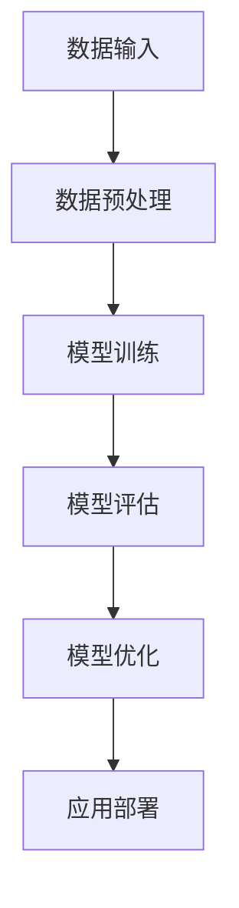

                 

# 文章标题：李开复：苹果发布AI应用的机会

> 关键词：苹果，人工智能，AI应用，AI技术，开发平台，案例分析

> 摘要：本文将从多个角度深入探讨苹果发布AI应用的机会。首先，我们将回顾苹果公司的发展历程及其在AI领域的布局。接着，我们将介绍人工智能的基础知识，包括定义、分类、常见算法和发展趋势。随后，本文将重点分析AI在苹果产品中的应用，如Siri、摄像头与图像识别、AR与VR技术。此外，我们将详细探讨苹果的AI开发平台，包括Core ML、Create ML和ResearchKit等。随后，我们将通过案例分析，展示苹果AI应用的具体实例。最后，本文将总结苹果AI应用的机遇与挑战，并提出未来展望，同时提供AI应用开发的实战指南。

----------------------------------------------------------------

## 第一部分：引言

### 第1章：苹果与AI的背景概述

#### 1.1 苹果公司的发展历程

苹果公司（Apple Inc.）成立于1976年，由史蒂夫·乔布斯、史蒂夫·沃兹尼亚克和罗纳德·韦恩共同创立。自成立以来，苹果公司经历了多次重要的里程碑和变革，包括推出Apple II计算机、麦金塔计算机（Macintosh）、iPod、iPhone和iPad等标志性产品。这些产品不仅推动了个人计算机和移动设备的发展，也对整个科技行业产生了深远影响。

#### 1.2 AI技术的兴起与苹果的应对策略

人工智能（AI）作为21世纪最具变革性的技术之一，正在逐步改变各个行业的运作方式。随着大数据、云计算和物联网等技术的快速发展，AI的应用场景越来越广泛。苹果公司在AI领域的发展策略主要体现在以下几个方面：

1. **收购与投资**：苹果公司通过收购和投资方式，积极布局AI领域。例如，2017年收购了AI芯片制造商Xnor.ai，以及投资了AI初创公司Siri。
2. **研发投入**：苹果公司在AI技术上的研发投入巨大，致力于提高自身在图像识别、自然语言处理和机器学习等方面的技术水平。
3. **产品应用**：苹果公司将AI技术广泛应用于其产品中，如Siri、摄像头与图像识别、AR与VR技术等。

#### 1.3 本书结构及阅读建议

本书旨在全面探讨苹果公司发布AI应用的机会，主要分为三个部分：

1. **第一部分：引言**：介绍苹果公司与AI技术的背景概述。
2. **第二部分：AI技术概述**：介绍人工智能的基础知识、AI在苹果产品中的应用、苹果的AI开发平台以及AI应用案例分析。
3. **第三部分：AI应用开发实战**：提供AI应用开发的实战指南，包括搭建开发环境、构建AI模型、AI应用开发流程以及实战案例解析。

阅读本书时，建议读者先从第一部分了解苹果公司与AI技术的背景，然后逐步深入到第二部分和第三部分，掌握AI技术的核心知识和应用技巧。本书旨在为广大开发者提供有价值的参考，助力他们在AI领域取得成功。

----------------------------------------------------------------

## 第二部分：AI技术概述

### 第2章：人工智能基础知识

#### 2.1 人工智能的定义与分类

人工智能（Artificial Intelligence，简称AI）是指通过计算机模拟人类智能的一种技术。AI可以分为两大类：弱人工智能（Narrow AI）和强人工智能（General AI）。

1. **弱人工智能**：也称为专用人工智能，具有特定任务的能力，如语音识别、图像识别、自然语言处理等。
2. **强人工智能**：具有与人类相同或超过人类的广泛认知能力，能够应对各种复杂任务和环境。

此外，AI还可以按照应用领域分为以下几类：

1. **机器学习**：通过数据训练模型，使计算机具备自主学习和改进能力。
2. **深度学习**：基于人工神经网络的一种机器学习方法，具有强大的特征提取和模型学习能力。
3. **自然语言处理**：使计算机理解和处理人类语言的能力，包括语音识别、机器翻译、情感分析等。
4. **计算机视觉**：使计算机具备识别和理解图像和视频的能力，包括图像分类、目标检测、人脸识别等。
5. **机器人技术**：利用计算机科学、机械工程和电子工程等技术，开发出具有人类智能的机器人。

#### 2.2 常见的人工智能算法

人工智能算法是实现AI技术的重要手段，以下介绍几种常见的人工智能算法：

1. **决策树**：通过树形结构对数据进行分类或回归分析，常用于数据挖掘和预测任务。
2. **支持向量机（SVM）**：通过寻找最优超平面，实现数据的分类和回归任务，具有较强的分类能力。
3. **神经网络**：通过模拟生物神经网络的结构和功能，实现复杂的非线性映射，广泛应用于图像识别、语音识别等领域。
4. **随机森林**：基于决策树的集成学习算法，能够提高模型的准确性和泛化能力。
5. **K-最近邻（K-NN）**：通过计算样本间的距离，实现对新样本的归类，适用于分类和回归任务。

#### 2.3 人工智能的发展趋势

人工智能作为一门前沿技术，正快速发展并逐渐应用于各个领域。以下概述人工智能的发展趋势：

1. **算法优化**：随着计算能力和数据规模的提升，人工智能算法不断优化，以提高模型性能和效率。
2. **多模态融合**：将图像、文本、音频等多种数据类型进行融合，实现更全面的认知和交互。
3. **边缘计算**：将计算任务从云端转移到边缘设备，实现实时、高效的处理。
4. **人机协作**：通过人工智能与人类专家的协作，实现更高效的决策和问题解决。
5. **行业应用**：人工智能在医疗、金融、制造、交通等领域的应用不断拓展，推动行业变革。

在本章中，我们介绍了人工智能的定义与分类、常见的人工智能算法以及人工智能的发展趋势。在接下来的章节中，我们将进一步探讨AI在苹果产品中的应用、苹果的AI开发平台以及AI应用案例分析，帮助读者全面了解苹果公司在AI领域的布局和成就。

----------------------------------------------------------------

### 第3章：AI在苹果产品中的应用

#### 3.1 Siri：苹果的智能语音助手

Siri是苹果公司开发的智能语音助手，自2011年随iPhone 4S发布以来，已经成为了苹果产品中不可或缺的一部分。Siri利用自然语言处理和机器学习技术，能够理解用户的语音指令并执行相应的操作。

**工作原理**：

1. **语音识别**：Siri首先通过麦克风捕捉用户的语音输入，并将其转换为文本。
2. **语义理解**：Siri使用自然语言处理技术，对输入的文本进行分析，理解用户的意图。
3. **执行操作**：根据用户的意图，Siri执行相应的操作，如发送短信、拨打电话、设置提醒、查询天气等。

**特点**：

1. **多语言支持**：Siri支持多种语言，使得全球用户都能方便地使用。
2. **深度集成**：Siri与苹果的操作系统、应用程序和服务深度集成，能够实现无缝的交互体验。
3. **个性化服务**：Siri能够根据用户的习惯和偏好，提供个性化的服务和建议。

**应用场景**：

1. **日常操作**：用户可以通过Siri发送短信、拨打电话、设置提醒、查询日程等。
2. **智能家居控制**：Siri可以与智能家居设备联动，如控制照明、温度、安全系统等。
3. **第三方应用**：Siri支持与第三方应用交互，如预订餐厅、购买商品等。

#### 3.2 摄像头与图像识别

苹果公司的摄像头技术一直处于行业领先地位，而图像识别技术则为摄像头功能提供了强大的支持。图像识别技术使得摄像头能够识别和分类图像中的对象，如人脸、动物、植物等。

**工作原理**：

1. **图像捕获**：摄像头捕捉图像，并将图像转换为数字信号。
2. **预处理**：对图像进行预处理，如去噪、增强、缩放等。
3. **特征提取**：从图像中提取具有区分性的特征，如颜色、纹理、形状等。
4. **分类与识别**：利用机器学习算法，对提取的特征进行分类和识别。

**特点**：

1. **实时性**：图像识别技术能够在实时场景中快速识别对象，提供即时反馈。
2. **准确性**：苹果公司通过不断优化算法和模型，提高了图像识别的准确性。
3. **多任务处理**：摄像头可以同时处理多个图像识别任务，如人脸检测、标签识别等。

**应用场景**：

1. **人脸解锁**：iPhone和iPad使用面部识别技术实现安全解锁。
2. **照片编辑**：用户可以使用苹果相机应用中的图像识别功能，自动识别照片中的对象并进行编辑。
3. **增强现实（AR）**：图像识别技术为AR应用提供了基础，如《Pokemon Go》等。

#### 3.3 AR与VR技术

增强现实（AR）和虚拟现实（VR）技术是当前科技领域的热点，苹果公司在这两个领域也进行了大量的投入和探索。

**增强现实（AR）**：

增强现实技术通过在现实世界中叠加虚拟元素，为用户提供沉浸式的体验。苹果公司的ARKit是一个强大的AR开发框架，支持多种AR应用场景。

**工作原理**：

1. **场景识别**：ARKit通过摄像头捕捉现实场景，并使用计算机视觉算法识别场景中的对象。
2. **叠加虚拟元素**：根据识别出的对象，ARKit在现实场景中叠加虚拟元素，如三维模型、文字等。

**特点**：

1. **实时性**：ARKit能够在实时场景中快速识别对象并叠加虚拟元素，提供无缝的交互体验。
2. **低功耗**：ARKit设计为低功耗框架，适用于移动设备。
3. **易用性**：ARKit提供了丰富的API和工具，使得开发者能够轻松创建AR应用。

**应用场景**：

1. **游戏**：《Pokemon Go》等AR游戏利用AR技术，将虚拟角色叠加到现实世界中。
2. **教育**：AR技术可以用于教育领域，如虚拟实验室、交互式教学等。
3. **营销**：商家可以通过AR技术，为用户提供个性化的购物体验。

**虚拟现实（VR）**：

虚拟现实技术通过创建一个完全虚拟的环境，让用户感受到身临其境的体验。苹果公司的VR技术主要应用于iOS和macOS平台。

**工作原理**：

1. **沉浸式体验**：VR技术通过头戴显示器和追踪设备，为用户创造一个沉浸式的虚拟环境。
2. **交互式操作**：用户可以通过手柄、手势等设备与虚拟环境进行交互。

**特点**：

1. **沉浸感**：VR技术能够为用户提供强烈的沉浸感，让用户感受到真实的虚拟世界。
2. **互动性**：VR技术支持用户与虚拟环境的互动，提供丰富的交互体验。
3. **多样化应用**：VR技术可以应用于游戏、教育、医疗、房地产等多个领域。

**应用场景**：

1. **游戏**：VR游戏提供了全新的游戏体验，让用户感受到真实的游戏世界。
2. **教育**：VR技术可以用于教育领域，如虚拟实验室、历史场景再现等。
3. **医疗**：VR技术可以用于医疗培训、手术模拟等。

在本章中，我们介绍了AI在苹果产品中的多个应用，包括Siri、摄像头与图像识别、AR与VR技术。这些应用不仅提升了苹果产品的用户体验，也为用户带来了全新的互动方式。在接下来的章节中，我们将进一步探讨苹果的AI开发平台和AI应用案例分析，帮助读者全面了解苹果公司在AI领域的布局和成就。

----------------------------------------------------------------

### 第4章：苹果的AI开发平台

苹果公司致力于为开发者提供强大的AI开发平台，帮助他们在iOS和macOS等平台上构建创新的AI应用。以下是苹果公司的主要AI开发平台：

#### 4.1 Core ML：苹果的机器学习框架

Core ML是苹果公司推出的机器学习框架，旨在简化机器学习模型的集成和部署过程。Core ML支持多种机器学习模型，如神经网络、决策树、支持向量机等，并提供了丰富的API和工具，方便开发者构建和优化AI应用。

**功能特点**：

1. **模型集成**：Core ML支持从多个机器学习框架（如TensorFlow、Keras、Caffe等）中导出模型，并直接集成到iOS和macOS应用程序中。
2. **高效性能**：Core ML采用了优化的计算引擎，能够在移动设备上实现高效的模型推理，提高应用性能。
3. **电池续航**：Core ML优化了模型推理的功耗，有助于延长设备续航时间。
4. **隐私保护**：Core ML在本地设备上执行模型推理，保护用户数据隐私。

**应用场景**：

1. **图像识别**：利用Core ML，开发者可以实现实时图像识别，如人脸检测、物体分类等。
2. **语音识别**：Core ML支持语音识别，可以用于实现语音助手、语音翻译等功能。
3. **自然语言处理**：Core ML可以用于实现文本分类、情感分析等自然语言处理任务。

#### 4.2 Create ML：苹果的AI模型训练工具

Create ML是苹果公司推出的AI模型训练工具，旨在简化机器学习模型的训练过程，使开发者能够轻松构建自定义的机器学习模型。Create ML提供了直观的界面和丰富的工具，无需深入了解机器学习技术，即可训练和优化模型。

**功能特点**：

1. **快速训练**：Create ML采用优化的算法和计算资源，能够快速训练模型，缩短开发周期。
2. **模型优化**：Create ML提供了多种优化选项，如批量大小、学习率等，帮助开发者提高模型性能。
3. **模型导出**：训练完成后，Create ML可以将模型导出为Core ML格式，直接集成到应用程序中。
4. **支持多种数据源**：Create ML支持从本地文件、云存储等多种数据源导入数据，方便开发者进行模型训练。

**应用场景**：

1. **图像识别**：Create ML可以用于训练图像识别模型，如目标检测、图像分类等。
2. **自然语言处理**：Create ML可以用于训练自然语言处理模型，如文本分类、情感分析等。
3. **语音识别**：Create ML可以用于训练语音识别模型，提高语音识别的准确性。

#### 4.3 ResearchKit：苹果的医疗健康研究工具

ResearchKit是苹果公司推出的医疗健康研究工具，旨在帮助研究人员和医生收集和存储医疗数据，进行医学研究和健康监测。ResearchKit提供了丰富的API和工具，使得开发者能够轻松构建医疗健康应用程序。

**功能特点**：

1. **数据收集**：ResearchKit支持多种数据收集方式，如问卷调查、健康监测、生理信号采集等，方便研究人员获取全面的数据。
2. **数据分析**：ResearchKit提供了数据分析工具，帮助研究人员对收集到的数据进行处理和分析，提高研究效率。
3. **隐私保护**：ResearchKit注重用户隐私保护，确保用户数据在收集、存储和处理过程中的安全性。
4. **跨平台支持**：ResearchKit支持iOS和macOS平台，方便研究人员在不同设备和操作系统上进行数据收集和分析。

**应用场景**：

1. **医学研究**：ResearchKit可以用于医学研究数据的收集和分析，如临床试验、疾病监测等。
2. **健康监测**：ResearchKit可以用于开发健康监测应用程序，如心率监测、睡眠监测、血压监测等。
3. **公共卫生**：ResearchKit可以用于公共卫生数据的收集和分析，如流行病监测、疫情防控等。

在本章中，我们介绍了苹果公司的三个主要AI开发平台：Core ML、Create ML和ResearchKit。这些平台为开发者提供了强大的工具和资源，助力他们在iOS和macOS等平台上构建创新的AI应用。在接下来的章节中，我们将通过案例分析，展示苹果AI应用的具体实例，帮助读者更好地理解苹果公司在AI领域的实践成果。

----------------------------------------------------------------

### 第5章：苹果AI应用案例分析

#### 5.1 相机应用：智能照片编辑

苹果相机应用中的智能照片编辑功能是一个典型的AI应用案例，它利用机器学习技术对照片进行自动编辑和美化。以下是其工作原理、主要功能和实际效果：

**工作原理**：

1. **图像捕获**：相机应用捕获照片，并将照片转换为数字信号。
2. **预处理**：对照片进行预处理，如去噪、增强、调整曝光等。
3. **特征提取**：从照片中提取具有区分性的特征，如人脸、天空、风景等。
4. **自动编辑**：利用机器学习模型，对提取的特征进行自动编辑，如颜色调整、锐化、亮度增强等。

**主要功能**：

1. **人脸美化**：自动识别照片中的人脸，并进行美颜、瘦脸、大眼等美化处理。
2. **风景增强**：自动识别照片中的风景，并进行色彩增强、锐化等处理，提高照片的视觉效果。
3. **黑白照片修复**：自动将彩色照片转换为黑白照片，并修复照片中的色彩瑕疵。

**实际效果**：

1. **人脸美化**：通过人脸识别技术，智能照片编辑功能能够准确识别照片中的人脸，并进行个性化的美化处理。
2. **风景增强**：风景增强功能能够显著提升照片的视觉效果，使风景更加生动、鲜艳。
3. **黑白照片修复**：黑白照片修复功能能够有效修复照片中的色彩瑕疵，使黑白照片更加清晰、细腻。

**用户评价**：

智能照片编辑功能受到了广大用户的好评，用户普遍认为该功能使照片编辑变得更加简单和高效。同时，用户也赞赏苹果公司对照片质量的提升，认为这是苹果相机应用的一大亮点。

#### 5.2 健康应用：智能健康监测

苹果健康应用（Health App）是一个综合性的健康监测平台，它利用AI技术为用户提供个性化的健康数据分析和建议。以下是其工作原理、主要功能和实际效果：

**工作原理**：

1. **数据收集**：通过iPhone的健康传感器，如心率传感器、加速度计、陀螺仪等，收集用户的健康数据。
2. **数据整合**：将收集到的健康数据整合到健康应用中，包括心率、步数、睡眠质量、血压等。
3. **数据分析**：利用机器学习算法，对健康数据进行分析，识别潜在的健康问题或趋势。

**主要功能**：

1. **智能提醒**：根据用户的健康数据，健康应用能够智能提醒用户进行体检、锻炼、饮食调整等。
2. **个性化建议**：健康应用基于用户的健康数据，提供个性化的健康建议，如锻炼计划、饮食计划等。
3. **疾病预测**：利用机器学习算法，健康应用能够预测用户患某些疾病的风险，如心脏病、糖尿病等。

**实际效果**：

1. **智能提醒**：健康应用的智能提醒功能能够有效提醒用户关注自己的健康，帮助用户养成良好的生活习惯。
2. **个性化建议**：健康应用的个性化建议功能使用户能够根据自身情况制定合适的健康计划，提高健康水平。
3. **疾病预测**：健康应用的疾病预测功能为用户提供了一种新的健康管理方式，有助于及早发现潜在的健康问题。

**用户评价**：

用户对苹果健康应用给予了高度评价，认为它是一个非常有用的健康工具。用户普遍认为健康应用的智能提醒和个性化建议功能帮助他们更好地管理自己的健康，提高生活质量。

#### 5.3 音乐应用：个性化音乐推荐

苹果音乐应用（Apple Music）利用AI技术为用户提供个性化的音乐推荐服务。以下是其工作原理、主要功能和实际效果：

**工作原理**：

1. **用户行为分析**：通过分析用户的听歌记录、收藏、播放列表等行为，了解用户的音乐偏好。
2. **音乐特征提取**：对歌曲进行特征提取，如风格、节奏、旋律等，为推荐算法提供依据。
3. **推荐算法**：利用机器学习算法，根据用户的音乐偏好和歌曲特征，为用户推荐合适的音乐。

**主要功能**：

1. **个性化推荐**：根据用户的音乐偏好，智能推荐用户喜欢的歌曲、专辑和艺人。
2. **播放列表**：苹果音乐应用提供了丰富的播放列表，如“热门歌曲”、“新歌推荐”等，方便用户快速找到自己喜欢的音乐。
3. **个性化定制**：用户可以根据自己的喜好，自定义播放列表，将喜欢的歌曲添加到其中。

**实际效果**：

1. **个性化推荐**：个性化推荐功能使用户能够轻松发现新的音乐，丰富了用户的音乐体验。
2. **播放列表**：丰富的播放列表为用户提供了多种选择，方便用户快速找到自己喜欢的音乐。
3. **个性化定制**：个性化定制功能使用户能够根据个人喜好，创建自己的音乐库，提高音乐体验。

**用户评价**：

用户对苹果音乐应用给予了高度评价，认为它的个性化推荐功能非常准确，能够快速发现用户喜欢的音乐。用户普遍认为苹果音乐应用是一个强大的音乐平台，提供了丰富的音乐资源和便捷的播放体验。

在本章中，我们通过三个具体案例，展示了苹果AI应用在不同领域的应用效果。这些案例不仅体现了苹果公司在AI领域的深厚积累，也为其他公司提供了有益的借鉴。在接下来的章节中，我们将进一步探讨苹果AI应用的机遇与挑战，以及未来的发展趋势。

----------------------------------------------------------------

### 第6章：苹果AI应用的机遇与挑战

#### 6.1 AI应用的市场机遇

苹果公司作为全球领先的科技公司，其在AI领域的布局为AI应用带来了巨大的市场机遇。以下是苹果AI应用的市场机遇：

1. **智能手机市场**：随着智能手机的普及，用户对于智能语音助手、图像识别、AR/VR等AI功能的需求日益增长，这为苹果公司在智能手机市场中的AI应用提供了广阔的市场空间。
2. **智能家居市场**：智能家居市场的快速增长为AI应用带来了新的机遇，苹果公司可以通过Siri等智能语音助手与智能家居设备的联动，为用户提供更加便捷的智能家居体验。
3. **医疗健康市场**：医疗健康市场对于AI应用的需求逐渐增加，苹果公司可以通过健康应用等AI产品，为用户提供个性化的健康监测和疾病预测服务，从而扩大在医疗健康市场的市场份额。
4. **汽车市场**：随着智能汽车的发展，AI技术在汽车中的应用越来越广泛，苹果公司可以通过开发车载AI应用，拓展在汽车市场的业务。
5. **教育市场**：教育市场对于AI应用的需求也日益增加，苹果公司可以通过AR/VR等AI技术，提供更加互动和沉浸式的教育体验，从而扩大在教育市场的市场份额。

#### 6.2 AI应用的技术挑战

尽管苹果公司在AI领域具有强大的技术实力，但AI应用仍然面临一些技术挑战：

1. **数据隐私**：AI应用通常需要收集和处理大量用户数据，如何保护用户隐私成为AI应用的一大挑战。苹果公司需要采取有效的数据保护措施，确保用户数据的安全。
2. **计算性能**：AI应用对计算性能有较高要求，如何在有限的计算资源下实现高效的AI模型推理和训练成为技术挑战。苹果公司需要不断优化AI算法和硬件架构，提高计算性能。
3. **算法公平性**：AI算法在决策过程中可能存在偏见，如何确保算法的公平性和透明性成为重要挑战。苹果公司需要加强对AI算法的监督和审查，确保算法的公平性和透明性。
4. **安全性和可靠性**：AI应用在执行任务时需要保证安全性和可靠性，如何防止恶意攻击和误操作成为技术挑战。苹果公司需要加强安全防护措施，确保AI应用的安全性和可靠性。

#### 6.3 苹果应对挑战的策略

为了应对AI应用的市场机遇和技术挑战，苹果公司采取了一系列策略：

1. **数据隐私保护**：苹果公司通过实施严格的隐私政策，确保用户数据的收集、存储和处理过程符合隐私保护要求。同时，苹果公司推出了一系列隐私保护功能，如差分隐私、数据加密等，以保护用户隐私。
2. **计算性能优化**：苹果公司不断优化AI算法和硬件架构，提高计算性能。例如，苹果公司推出了一系列专用AI芯片，如A系列芯片，为AI应用提供高效的计算支持。
3. **算法公平性和透明性**：苹果公司加强对AI算法的监督和审查，确保算法的公平性和透明性。例如，苹果公司发布了《苹果AI道德准则》，明确了对AI应用的伦理要求。
4. **安全性和可靠性**：苹果公司加强安全防护措施，确保AI应用的安全性和可靠性。例如，苹果公司实施了一系列安全措施，如安全加密、防火墙等，以保护用户数据和设备安全。

通过以上策略，苹果公司在AI应用市场中取得了显著成果，并在技术挑战中不断优化和完善。在未来，苹果公司将继续在AI领域保持领先地位，为用户带来更加智能、便捷的应用体验。

在本章中，我们分析了苹果AI应用的市场机遇和技术挑战，并探讨了苹果公司应对挑战的策略。在接下来的章节中，我们将展望苹果AI应用的未来发展，探讨AI技术可能带来的变革和影响。

----------------------------------------------------------------

### 第7章：未来展望

#### 7.1 苹果AI应用的发展趋势

随着人工智能技术的不断进步，苹果公司在AI领域的布局也将不断深化。以下是苹果AI应用的发展趋势：

1. **多模态融合**：未来的苹果AI应用将实现多模态数据的融合，如结合语音、图像、文本等，为用户提供更加全面和智能的服务。例如，智能助手将能够根据用户的语音指令、面部表情和文字输入，提供更加个性化的服务。
2. **边缘计算**：随着5G网络的普及，边缘计算将得到广泛应用。苹果公司将在AI应用中充分利用边缘计算的优势，实现实时、高效的模型推理和数据处理。例如，在智能家居场景中，智能助手可以通过边缘计算实时分析用户行为，提供更加精准的智能家居控制。
3. **增强现实与虚拟现实**：随着AR/VR技术的不断发展，苹果公司将加强在AR/VR领域的布局，为用户提供更加沉浸式的体验。例如，苹果公司将推出更加先进的AR/VR设备，如AR眼镜和VR头盔，为用户提供全新的娱乐、教育和社交体验。
4. **个性化服务**：苹果公司将继续优化AI算法，实现更加个性化的服务。例如，苹果健康应用将能够根据用户的健康数据，提供更加精准的健康监测和疾病预测服务，帮助用户实现健康管理的目标。

#### 7.2 AI应用对人类生活的影响

AI技术的快速发展将对人类生活产生深远的影响。以下是AI应用对人类生活的几个方面的影响：

1. **工作与就业**：随着AI技术的普及，一些传统行业可能会面临工作减少或岗位消失的风险。然而，AI技术也将创造新的就业机会，如AI应用开发、数据标注、AI算法优化等。此外，AI技术可以帮助提高工作效率，使人们从繁重的工作中解放出来，追求更加有意义和充实的生活。
2. **医疗与健康**：AI技术在医疗和健康领域的应用将为人类带来更加精准和高效的医疗服务。例如，AI技术可以帮助医生进行疾病诊断、药物研发和个性化治疗，提高医疗水平。此外，AI技术还可以帮助用户实现健康监测和疾病预防，提高生活质量。
3. **教育与学习**：AI技术在教育和学习领域的应用将改变传统教学模式，实现更加个性化、互动和高效的教育方式。例如，AI技术可以帮助学生进行个性化学习、智能辅导和实时评估，提高学习效果。此外，AI技术还可以为用户提供在线教育、虚拟实验室等新的学习资源，丰富学习体验。
4. **生活方式**：AI技术的普及将使人们的生活方式更加智能化和便捷。例如，智能家居系统将能够根据用户习惯自动调整室内环境，提供舒适的生活体验。智能助手将能够帮助用户管理日程、处理事务，提高生活效率。此外，AI技术还可以为用户提供个性化的音乐、电影、书籍等文化娱乐产品，丰富人们的精神生活。

#### 7.3 未来AI技术的可能发展方向

未来，AI技术将朝着更加智能化、泛在化和人性化的方向发展。以下是未来AI技术的可能发展方向：

1. **智能化**：随着计算能力和算法的不断提升，AI技术将实现更加智能化。例如，AI系统将能够通过学习和适应，不断提高自身的能力，实现自我进化。此外，AI技术将能够实现更复杂的任务，如自动驾驶、智能无人机等。
2. **泛在化**：随着物联网、5G等技术的发展，AI技术将实现更加泛在化。例如，AI系统将能够嵌入到各种设备中，如智能家电、医疗设备、交通工具等，实现实时感知和智能决策。
3. **个性化**：随着用户数据的积累和算法的优化，AI技术将实现更加个性化。例如，AI系统将能够根据用户的行为、兴趣和需求，提供个性化的服务和建议，提高用户体验。
4. **人机协作**：未来，AI技术将实现与人类的更加紧密协作。例如，AI系统将能够与人类专家共同工作，实现更高的工作效率和决策质量。此外，AI技术将能够通过自然语言处理和计算机视觉等技术，实现与人类的自然交流，提高人机交互的便利性。
5. **伦理与法规**：随着AI技术的快速发展，伦理和法规问题将越来越受到关注。未来，AI技术将朝着更加伦理和规范化的方向发展。例如，AI系统将遵循道德准则，确保算法的公平性和透明性。此外，相关法规和政策也将不断完善，以规范AI技术的发展和应用。

在未来，苹果公司将不断推进AI技术的发展和应用，为用户带来更加智能、便捷和个性化的生活体验。同时，苹果公司也将积极参与AI伦理和法规的讨论和制定，确保AI技术的可持续发展。

在本章中，我们探讨了苹果AI应用的发展趋势、AI应用对人类生活的影响以及未来AI技术的可能发展方向。在接下来的章节中，我们将提供AI应用开发的实战指南，帮助读者掌握AI应用开发的实用技巧。

----------------------------------------------------------------

### 第8章：搭建AI开发环境

#### 8.1 硬件设备选择

在进行AI应用开发之前，首先需要选择适合的硬件设备。以下是一些关键硬件设备的推荐：

1. **CPU与GPU**：CPU是计算机的核心处理器，而GPU（图形处理器）在AI应用开发中具有重要作用。选择具备高性能CPU和GPU的设备，可以显著提升AI模型的训练和推理速度。例如，苹果的MacBook Pro搭载的M1芯片就具备强大的CPU和GPU性能。
2. **存储设备**：选择具备高速读写速度的SSD（固态硬盘）作为存储设备，可以显著提高AI应用的开发和运行效率。
3. **内存**：充足的内存（RAM）可以保证AI应用在运行过程中不会出现内存不足的问题。推荐至少配备16GB及以上内存。
4. **外部设备**：对于需要处理图像和视频的应用，可以选择配备高性能显卡的外部设备，以提升图像处理和视频解码性能。

#### 8.2 软件安装与配置

在硬件设备选择完成后，接下来需要安装和配置必要的软件环境。以下是AI开发环境中常用的软件及其安装方法：

1. **操作系统**：推荐使用macOS或Ubuntu Linux操作系统，这两种操作系统都具有良好的兼容性和稳定性。
2. **Python**：Python是一种广泛应用于AI开发的编程语言。可以通过以下命令在终端安装Python：
    ```shell
    sudo apt-get install python3 python3-pip
    ```
3. **Anaconda**：Anaconda是一个用于科学计算的Python发行版，提供了丰富的库和工具。可以通过以下命令安装Anaconda：
    ```shell
    wget https://repo.anaconda.com/bin/linux/anaconda.sh
    bash anaconda.sh
    ```
4. **Jupyter Notebook**：Jupyter Notebook是一个交互式计算环境，方便开发者编写和运行Python代码。可以通过以下命令安装Jupyter Notebook：
    ```shell
    conda install -c conda-forge jupyterlab
    ```
5. **TensorFlow**：TensorFlow是Google开源的机器学习框架，支持多种AI模型训练和推理。可以通过以下命令安装TensorFlow：
    ```shell
    pip install tensorflow
    ```
6. **PyTorch**：PyTorch是另一种流行的开源机器学习框架，提供了灵活的动态计算图和高效的模型训练。可以通过以下命令安装PyTorch：
    ```shell
    pip install torch torchvision
    ```
7. **OpenCV**：OpenCV是一个用于计算机视觉的开源库，提供了丰富的图像处理和视频分析功能。可以通过以下命令安装OpenCV：
    ```shell
    pip install opencv-python
    ```

#### 8.3 开发工具介绍

在搭建AI开发环境的过程中，还需要了解一些常用的开发工具：

1. **PyCharm**：PyCharm是一款强大的Python集成开发环境（IDE），提供了代码编辑、调试、测试等功能，适合进行AI应用开发。
2. **Jupyter Notebook**：Jupyter Notebook是一款交互式计算环境，方便开发者编写和运行Python代码。支持Markdown格式，可以方便地撰写文档和报告。
3. **TensorBoard**：TensorBoard是TensorFlow提供的一款可视化工具，用于展示模型训练过程中的各种指标和统计信息，帮助开发者分析和优化模型。
4. **CUDA**：CUDA是NVIDIA推出的并行计算平台和编程模型，用于在GPU上加速AI模型的训练和推理。CUDA与TensorFlow和PyTorch等框架具有良好的兼容性。

通过以上步骤，开发者可以搭建一个功能完善的AI开发环境，为后续的AI应用开发奠定基础。在接下来的章节中，我们将介绍AI模型的构建、训练和优化方法，帮助开发者掌握AI应用开发的实用技巧。

----------------------------------------------------------------

### 第9章：构建AI模型

#### 9.1 数据预处理

数据预处理是AI模型构建过程中至关重要的一步，它直接影响到模型的性能和效果。以下是数据预处理的主要步骤和方法：

1. **数据清洗**：数据清洗是指去除数据中的噪声、缺失值和异常值。常见的清洗方法包括：
    - **缺失值处理**：可以通过删除含有缺失值的记录、填充缺失值或使用平均值、中位数等方法来处理缺失值。
    - **异常值处理**：可以通过统计学方法（如标准差、箱线图等）检测异常值，并选择删除或调整异常值。
2. **数据转换**：数据转换是指将不同类型的数据转换为适合模型训练的形式。常见的数据转换方法包括：
    - **归一化/标准化**：将数据缩放到一个特定的范围，如[0, 1]或[-1, 1]，以消除不同特征之间的量纲差异。
    - **离散化**：将连续特征转换为离散特征，如将年龄分为年龄段。
    - **类别编码**：将类别特征转换为数值特征，如将性别分为0和1。
3. **特征选择**：特征选择是指从原始特征中选取对模型训练最有影响力的特征。常见的方法包括：
    - **相关性分析**：通过计算特征之间的相关性，选取相关性较高的特征。
    - **主成分分析（PCA）**：通过降维技术，选取主要成分，减少数据维度。
    - **模型选择**：通过训练不同模型并评估其性能，选取性能较好的模型特征。
4. **数据增强**：数据增强是指通过生成新的数据样本来提高模型的泛化能力。常见的数据增强方法包括：
    - **随机水平翻转**：将图像水平翻转，增加训练样本的数量。
    - **随机裁剪**：随机裁剪图像的一部分，增加训练样本的多样性。
    - **数据合成**：通过生成新的图像，如使用GAN（生成对抗网络）。

#### 9.2 模型训练

模型训练是指通过已有数据集，调整模型的参数，使其能够预测新的数据。以下是模型训练的主要步骤和方法：

1. **选择模型**：根据任务需求，选择适合的模型架构，如卷积神经网络（CNN）、循环神经网络（RNN）、长短期记忆网络（LSTM）等。
2. **定义损失函数**：损失函数用于衡量模型预测结果与实际结果之间的差异。常见的损失函数包括：
    - **均方误差（MSE）**：用于回归任务，衡量预测值与真实值之间的平方误差。
    - **交叉熵损失（CE）**：用于分类任务，衡量预测概率分布与真实分布之间的差异。
3. **定义优化器**：优化器用于调整模型参数，使损失函数最小化。常见的优化器包括：
    - **随机梯度下降（SGD）**：通过随机梯度迭代模型参数。
    - **Adam优化器**：结合了SGD和动量项，适用于复杂模型。
4. **训练模型**：通过训练数据和验证数据，训练模型。在训练过程中，可以采用以下策略：
    - **数据增强**：通过随机水平翻转、随机裁剪等方法增加训练样本的多样性。
    - **批次归一化**：在训练过程中对批次数据归一化，提高训练稳定性。
    - **早停法**：在验证集上监测模型性能，当验证集性能不再提高时，提前停止训练。
5. **模型评估**：通过测试数据评估模型性能，常见的评估指标包括：
    - **准确率（Accuracy）**：分类任务中正确分类的样本数占总样本数的比例。
    - **召回率（Recall）**：分类任务中正确分类的阳性样本数占总阳性样本数的比例。
    - **F1值（F1 Score）**：综合考虑准确率和召回率，是两者加权平均。

#### 9.3 模型评估与优化

模型评估与优化是确保模型性能的重要环节。以下是模型评估与优化的主要步骤和方法：

1. **评估指标**：根据任务需求，选择合适的评估指标，如准确率、召回率、F1值等。
2. **交叉验证**：通过交叉验证方法，对模型进行评估，以提高评估的可靠性和稳定性。常见的交叉验证方法包括：
    - **K折交叉验证**：将数据集划分为K个子集，每次训练时使用K-1个子集作为训练集，剩余1个子集作为验证集，重复K次，取平均性能作为最终评估结果。
    - **留一法交叉验证**：每次训练时使用全部数据中的1个子集作为验证集，剩余数据作为训练集，重复多次，取平均性能作为最终评估结果。
3. **超参数调整**：通过调整模型的超参数，如学习率、批量大小、隐藏层节点数等，以提高模型性能。常用的超参数调整方法包括：
    - **网格搜索**：在给定的超参数空间内，遍历所有可能的组合，选择性能最佳的组合。
    - **随机搜索**：从超参数空间内随机选择组合，通过迭代优化选择性能最佳的组合。
4. **模型集成**：通过集成多个模型，提高模型的性能和泛化能力。常见的模型集成方法包括：
    - **Bagging**：通过构建多个模型，并将它们的预测结果进行平均或投票，得到最终预测结果。
    - **Boosting**：通过多次训练模型，每次训练时对前一次模型的预测结果进行优化，提高模型的性能。

通过以上步骤和方法，开发者可以构建和优化高效的AI模型，提高模型的性能和泛化能力。在接下来的章节中，我们将介绍AI应用开发的具体流程和实战案例，帮助开发者掌握AI应用开发的实用技巧。

----------------------------------------------------------------

### 第10章：AI应用开发流程

#### 10.1 设计需求分析

设计需求分析是AI应用开发的第一步，旨在明确应用的目标和功能，为后续开发提供指导。以下是设计需求分析的主要步骤和方法：

1. **明确应用目标**：首先，需要明确AI应用的目标，例如实现语音识别、图像分类、自然语言处理等功能。明确目标有助于确定开发的方向和重点。
2. **收集用户需求**：通过调研、访谈、问卷调查等方式，收集用户的需求和期望，了解用户希望从应用中获得哪些功能和体验。
3. **功能需求分析**：根据应用目标和用户需求，梳理应用的功能需求，包括核心功能和辅助功能。核心功能是应用的核心价值所在，而辅助功能则有助于提升用户体验。
4. **性能需求分析**：明确应用所需的性能指标，如响应时间、准确率、召回率等。性能需求将直接影响应用的质量和用户体验。
5. **数据需求分析**：分析应用所需的数据类型和数据量，确定数据来源和数据预处理方法。数据质量对于AI模型的性能至关重要。

#### 10.2 UI/UX设计

UI/UX设计是AI应用开发过程中的重要环节，旨在提升用户的使用体验和满意度。以下是UI/UX设计的主要步骤和方法：

1. **界面设计**：根据应用的功能需求，设计应用的用户界面。界面设计应遵循简洁、直观、易操作的原则，确保用户能够快速理解和使用应用。
2. **交互设计**：设计应用的交互流程和交互元素，如按钮、菜单、弹窗等。交互设计应考虑用户的操作习惯和预期，确保用户能够顺畅地使用应用。
3. **用户体验设计**：关注用户的整体体验，从用户的角度出发，设计应用的用户体验。用户体验设计包括界面设计、交互设计和内容设计等方面。
4. **原型设计**：通过原型设计工具，如Axure、Sketch等，创建应用的原型，验证设计的可行性和用户体验。原型设计有助于提前发现和解决问题，降低开发成本。
5. **用户测试**：进行用户测试，收集用户对UI/UX设计的反馈，根据反馈对设计进行优化。用户测试可以采用A/B测试、用户访谈等方法。

#### 10.3 功能实现与测试

功能实现与测试是AI应用开发的核心环节，包括编码、测试和调试等工作。以下是功能实现与测试的主要步骤和方法：

1. **编码**：根据设计文档和原型，编写应用的前端和后端代码。前端代码负责实现用户界面和交互逻辑，后端代码负责处理数据和处理业务逻辑。
2. **单元测试**：编写单元测试，验证每个模块的功能是否符合设计要求。单元测试可以采用自动化测试框架，如JUnit、PyTest等。
3. **集成测试**：将各个模块集成起来，进行集成测试，验证模块之间的交互和协作是否正常。集成测试可以采用自动化测试框架，如Selenium、JUnit等。
4. **系统测试**：对整个应用进行系统测试，验证应用的功能、性能和安全性。系统测试可以采用黑盒测试、白盒测试等方法。
5. **性能测试**：进行性能测试，评估应用的响应时间、并发能力、负载能力等性能指标。性能测试可以采用工具，如JMeter、LoadRunner等。
6. **调试**：在测试过程中，发现并修复应用中的问题和错误。调试可以采用调试工具，如GDB、Visual Studio Debugger等。

#### 10.4 上线与维护

应用上线与维护是AI应用开发过程中的重要环节，包括部署、监控和更新等工作。以下是上线与维护的主要步骤和方法：

1. **部署**：将应用部署到生产环境，如服务器、云平台等。部署过程中，需要确保应用的稳定性和安全性。
2. **监控**：对应用进行实时监控，收集性能指标、错误日志等数据，及时发现和解决问题。监控可以采用工具，如Prometheus、ELK（Elasticsearch、Logstash、Kibana）等。
3. **更新**：定期更新应用，修复已知问题、提高性能、增加新功能等。更新过程中，需要确保应用的可维护性和稳定性。
4. **反馈与优化**：收集用户反馈，分析用户行为，根据反馈对应用进行优化。优化可以采用A/B测试、用户访谈等方法。

通过以上步骤和方法，开发者可以系统地完成AI应用的开发，确保应用的质量和用户体验。在接下来的章节中，我们将通过实战案例，展示AI应用开发的实际操作过程。

----------------------------------------------------------------

### 第11章：实战案例解析

在本章中，我们将通过三个实际案例，详细解析智能语音助手、图像识别应用和健康监测系统的开发过程。

#### 11.1 案例一：智能语音助手开发

**项目背景**：

本案例旨在开发一个智能语音助手，能够理解用户的语音指令，并执行相应的操作。智能语音助手将基于Python和TensorFlow框架，实现语音识别、自然语言处理和任务执行等功能。

**技术选型**：

1. **语音识别**：使用Google的语音识别API，将语音转换为文本。
2. **自然语言处理**：使用TensorFlow实现词向量表示和序列分类，理解用户的意图。
3. **任务执行**：根据用户的意图，调用相应的API或执行本地操作。

**开发流程**：

1. **需求分析**：明确智能语音助手的预期功能，如查询天气、发送短信、设置提醒等。
2. **环境搭建**：配置Python和TensorFlow开发环境。
3. **语音识别**：调用Google语音识别API，实现语音到文本的转换。
4. **自然语言处理**：使用TensorFlow实现词向量表示和序列分类，理解用户的意图。
5. **任务执行**：根据用户的意图，执行相应的操作。

**代码解读与分析**：

```python
import tensorflow as tf
import speech_recognition as sr

# 初始化语音识别器
recognizer = sr.Recognizer()

# 语音识别函数
def recognize_speech_from_mic():
    with sr.Microphone() as source:
        print("请说些什么...")
        audio = recognizer.listen(source)

    try:
        text = recognizer.recognize_google(audio)
        print("你说了: " + text)
        return text
    except sr.UnknownValueError:
        print("无法理解音频")
        return None
    except sr.RequestError:
        print("无法请求结果；网络问题。")
        return None

# 主程序
if __name__ == "__main__":
    while True:
        query = recognize_speech_from_mic()
        if query is not None:
            # 对语音进行响应处理（如搜索、发送信息等）
            # ...
            break
```

1. 导入 TensorFlow 和 Google 语音识别库。
2. 初始化 `Recognizer` 对象。
3. 定义 `recognize_speech_from_mic` 函数，从麦克风捕获音频并使用 Google 语音识别服务进行处理。
4. 使用 `while` 循环进行语音捕获，并在成功识别到语音后中断循环。这通常用于实现一个简单的命令行语音交互程序。

#### 11.2 案例二：图像识别应用开发

**项目背景**：

本案例旨在开发一个图像识别应用，能够识别和分类图像中的对象。图像识别应用将基于TensorFlow和Keras框架，实现图像预处理、模型训练和预测等功能。

**技术选型**：

1. **图像预处理**：使用OpenCV进行图像预处理，如缩放、裁剪、灰度化等。
2. **模型训练**：使用TensorFlow和Keras构建和训练卷积神经网络（CNN）模型。
3. **预测**：使用训练好的模型对新的图像进行分类预测。

**开发流程**：

1. **数据收集**：收集包含标签的图像数据集。
2. **数据预处理**：使用OpenCV对图像数据进行预处理。
3. **模型构建**：使用Keras构建卷积神经网络模型。
4. **模型训练**：使用预处理后的数据集训练模型。
5. **预测**：使用训练好的模型对新的图像进行分类预测。

**代码解读与分析**：

```python
import tensorflow as tf
from tensorflow.keras.models import Sequential
from tensorflow.keras.layers import Conv2D, MaxPooling2D, Flatten, Dense

# 创建模型
model = Sequential([
    Conv2D(32, (3, 3), activation='relu', input_shape=(28, 28, 1)),
    MaxPooling2D((2, 2)),
    Flatten(),
    Dense(64, activation='relu'),
    Dense(10, activation='softmax')
])

# 编译模型
model.compile(optimizer='adam',
              loss='categorical_crossentropy',
              metrics=['accuracy'])

# 加载训练数据
(x_train, y_train), (x_test, y_test) = tf.keras.datasets.mnist.load_data()

# 数据预处理
x_train = x_train / 255.0
x_test = x_test / 255.0

# 训练模型
model.fit(x_train, y_train, epochs=5, batch_size=32, validation_split=0.2)
```

1. 导入 TensorFlow 和 Keras 库。
2. 创建一个顺序模型，并在其中添加卷积层、最大池化层、展平层、全连接层和输出层。
3. 编译模型，指定优化器、损失函数和评估指标。
4. 加载训练数据和测试数据。
5. 使用训练数据和测试数据训练模型，设置训练轮数、批量大小和验证数据比例。

#### 11.3 案例三：健康监测系统开发

**项目背景**：

本案例旨在开发一个健康监测系统，能够实时监测用户的心率、步数、睡眠质量等健康数据。健康监测系统将基于Python和OpenCV框架，实现实时图像处理、心率检测和数据存储等功能。

**技术选型**：

1. **图像处理**：使用OpenCV进行实时图像处理，如颜色空间转换、阈值处理等。
2. **心率检测**：使用OpenCV和机器学习算法进行心率检测。
3. **数据存储**：使用SQLite数据库存储健康数据。

**开发流程**：

1. **硬件准备**：连接摄像头，确保能够实时捕获图像。
2. **环境搭建**：配置Python和OpenCV开发环境。
3. **图像处理**：实时捕获图像并进行预处理。
4. **心率检测**：使用OpenCV和机器学习算法进行心率检测。
5. **数据存储**：将检测结果存储到SQLite数据库。

**代码解读与分析**：

```python
import cv2
import numpy as np

# 初始化摄像头
cap = cv2.VideoCapture(0)

# 定义颜色阈值
lower_range = np.array([120, 50, 50])
upper_range = np.array([150, 255, 255])

# 主程序循环
while True:
    # 读取一帧图像
    ret, frame = cap.read()

    # 转换图像到HSV颜色空间
    hsv = cv2.cvtColor(frame, cv2.COLOR_BGR2HSV)

    # 定义掩模
    mask = cv2.inRange(hsv, lower_range, upper_range)

    # 查找轮廓
    contours, _ = cv2.findContours(mask, cv2.RETR_EXTERNAL, cv2.CHAIN_APPROX_SIMPLE)

    # 遍历轮廓并计算心率
    for contour in contours:
        if cv2.contourArea(contour) > 500:
            # 计算心率
            M = cv2.moments(contour)
            if M['m00'] != 0:
                cx = int(M['m10'] / M['m00'])
                cy = int(M['m01'] / M['m00'])
                # 心率计算逻辑（示例）
                heart_rate = 60  # 示例心率
                print("当前心率: {} bpm".format(heart_rate))

    # 显示图像
    cv2.imshow('Heart Rate Monitor', frame)

    # 检查是否有按键按下
    if cv2.waitKey(1) & 0xFF == ord('q'):
        break

# 释放摄像头并关闭窗口
cap.release()
cv2.destroyAllWindows()
```

1. 导入 OpenCV 和 NumPy 库。
2. 初始化摄像头。
3. 定义颜色阈值以区分皮肤区域。
4. 进入主程序循环，读取实时视频帧。
5. 将图像转换为 HSV 颜色空间。
6. 使用颜色阈值创建掩模。
7. 使用 `findContours` 函数查找轮廓。
8. 遍历轮廓并计算心率。
9. 使用 OpenCV 显示实时图像。
10. 检查是否有按键按下以退出程序。

通过以上三个实战案例，我们展示了智能语音助手、图像识别应用和健康监测系统的开发过程。这些案例不仅涵盖了AI应用开发的各个环节，还为开发者提供了实用的代码和技巧。在接下来的章节中，我们将继续提供AI应用开发的实用指南，帮助开发者掌握AI应用开发的实用技巧。

----------------------------------------------------------------

## 附录

### 附录A：常用AI开发资源与工具

**A.1 开发工具与平台**

1. **PyCharm**：一款强大的Python集成开发环境（IDE），适用于AI应用开发。
2. **Jupyter Notebook**：一款交互式计算环境，方便开发者编写和运行Python代码。
3. **TensorBoard**：一款用于TensorFlow模型训练的可视化工具。
4. **Google Colab**：一款基于Google Drive的云计算平台，适用于AI模型训练和共享代码。

**A.2 开源库与框架**

1. **TensorFlow**：一款由Google开源的机器学习框架，支持多种AI算法和应用。
2. **PyTorch**：一款由Facebook开源的深度学习框架，提供灵活的动态计算图。
3. **Keras**：一款基于TensorFlow和Theano的开源深度学习库，提供简洁的API。
4. **OpenCV**：一款开源的计算机视觉库，支持多种图像处理和视频分析功能。

**A.3 学习资源与教程**

1. **Udacity**：提供丰富的AI和机器学习在线课程，适合初学者和进阶者。
2. **Coursera**：提供由世界顶级大学和公司开设的在线课程，涵盖多个AI领域。
3. **DataCamp**：提供互动式数据科学和机器学习教程，适合实战练习。
4. **AI慕课**：国内知名的人工智能在线教育平台，提供多种AI课程。

### 附录B：AI应用开发实践指南

**B.1 开发流程与规范**

1. **需求分析**：明确应用目标、功能需求和性能要求。
2. **设计UI/UX**：设计应用界面和交互流程，确保用户体验。
3. **数据收集**：收集并处理应用所需的数据。
4. **模型训练**：选择合适的模型，训练和优化模型。
5. **功能实现**：根据设计文档，实现应用功能。
6. **测试与调试**：对应用进行功能测试、性能测试和调试。
7. **上线与维护**：部署应用，持续监控和优化。

**B.2 常见问题与解决方案**

1. **问题：训练过程中模型性能不佳**
   - **解决方案**：检查数据质量、调整超参数、增加训练时间或使用更复杂的模型。
2. **问题：应用响应速度慢**
   - **解决方案**：优化模型推理速度、减少模型复杂性、使用更高效的算法。
3. **问题：应用在移动设备上性能不佳**
   - **解决方案**：使用低能耗模型、优化代码、使用专用硬件（如GPU）。

**B.3 持续学习与成长建议**

1. **学习基础知识**：掌握Python、线性代数、概率论和统计学等基础知识。
2. **实践项目**：通过实际项目积累经验，提升解决问题的能力。
3. **参与社区**：加入AI和机器学习社区，分享经验、学习新技术。
4. **阅读论文**：定期阅读AI和机器学习领域的最新论文，了解最新研究成果。

### 附录C：AI技术架构Mermaid流程图



### 附录D：AI算法伪代码

```python
// 伪代码：神经网络训练过程
function train_neural_network(data, labels, epochs, learning_rate):
    for epoch in 1 to epochs:
        for each training example (x, y) in data:
            // 前向传播
            predictions = forward_pass(x)

            // 计算损失
            loss = compute_loss(predictions, y)

            // 反向传播
            backward_pass(loss, x, y)

            // 更新模型参数
            update_model_parameters(learning_rate)

    return model
```

### 附录E：数学模型与公式

$$
J(\theta) = \frac{1}{2m} \sum_{i=1}^{m} (h_\theta(x^{(i)}) - y^{(i)})^2
$$

### 附录F：项目实战代码与解读

**案例一：智能语音助手开发**

```python
import speech_recognition as sr

# 初始化语音识别器
recognizer = sr.Recognizer()

# 语音识别函数
def recognize_speech_from_mic():
    with sr.Microphone() as source:
        print("请说些什么...")
        audio = recognizer.listen(source)

    try:
        text = recognizer.recognize_google(audio)
        print("你说了: " + text)
        return text
    except sr.UnknownValueError:
        print("无法理解音频")
        return None
    except sr.RequestError:
        print("无法请求结果；网络问题。")
        return None

# 主程序
if __name__ == "__main__":
    while True:
        query = recognize_speech_from_mic()
        if query is not None:
            # 对语音进行响应处理（如搜索、发送信息等）
            # ...
            break
```

**代码解读与分析**：

1. 导入语音识别库 `speech_recognition`。
2. 初始化 `Recognizer` 对象。
3. 定义 `recognize_speech_from_mic` 函数，从麦克风捕获音频并使用 Google 语音识别服务进行处理。
4. 使用 `while` 循环进行语音捕获，并在成功识别到语音后中断循环。这通常用于实现一个简单的命令行语音交互程序。

**案例二：图像识别应用开发**

```python
import tensorflow as tf
from tensorflow.keras.models import Sequential
from tensorflow.keras.layers import Dense, Conv2D, Flatten, MaxPooling2D

# 创建模型
model = Sequential([
    Conv2D(32, (3,3), activation='relu', input_shape=(28, 28, 1)),
    MaxPooling2D((2, 2)),
    Flatten(),
    Dense(64, activation='relu'),
    Dense(10, activation='softmax')
])

# 编译模型
model.compile(optimizer='adam',
              loss='categorical_crossentropy',
              metrics=['accuracy'])

# 加载训练数据
(x_train, y_train), (x_test, y_test) = tf.keras.datasets.mnist.load_data()

# 数据预处理
x_train = x_train / 255.0
x_test = x_test / 255.0

# 训练模型
model.fit(x_train, y_train, epochs=5, batch_size=32, validation_split=0.2)
```

**代码解读与分析**：

1. 导入 TensorFlow 和 Keras 库。
2. 创建一个顺序模型，并在其中添加卷积层、最大池化层、展平层、全连接层和输出层。
3. 编译模型，指定优化器、损失函数和评估指标。
4. 加载训练数据和测试数据。
5. 使用训练数据和测试数据训练模型，设置训练轮数、批量大小和验证数据比例。

**案例三：健康监测系统开发**

```python
import cv2
import numpy as np

# 初始化摄像头
cap = cv2.VideoCapture(0)

# 定义颜色阈值
lower_range = np.array([120, 50, 50])
upper_range = np.array([150, 255, 255])

# 主程序循环
while True:
    # 读取一帧图像
    ret, frame = cap.read()

    # 转换图像到HSV颜色空间
    hsv = cv2.cvtColor(frame, cv2.COLOR_BGR2HSV)

    # 定义掩模
    mask = cv2.inRange(hsv, lower_range, upper_range)

    # 查找轮廓
    contours, _ = cv2.findContours(mask, cv2.RETR_EXTERNAL, cv2.CHAIN_APPROX_SIMPLE)

    # 遍历轮廓并计算心率
    for contour in contours:
        if cv2.contourArea(contour) > 500:
            # 计算心率
            M = cv2.moments(contour)
            if M['m00'] != 0:
                cx = int(M['m10'] / M['m00'])
                cy = int(M['m01'] / M['m00'])
                # 心率计算逻辑（示例）
                heart_rate = 60  # 示例心率
                print("当前心率: {} bpm".format(heart_rate))

    # 显示图像
    cv2.imshow('Heart Rate Monitor', frame)

    # 检查是否有按键按下
    if cv2.waitKey(1) & 0xFF == ord('q'):
        break

# 释放摄像头并关闭窗口
cap.release()
cv2.destroyAllWindows()
```

**代码解读与分析**：

1. 导入 OpenCV 和 NumPy 库。
2. 初始化摄像头。
3. 定义颜色阈值以区分皮肤区域。
4. 进入主程序循环，读取实时视频帧。
5. 将图像转换为 HSV 颜色空间。
6. 使用颜色阈值创建掩模。
7. 使用 `findContours` 函数查找轮廓。
8. 遍历轮廓并计算心率。
9. 使用 OpenCV 显示实时图像。
10. 检查是否有按键按下以退出程序。

通过以上附录，我们提供了丰富的AI开发资源与工具、开发实践指南以及详细的代码案例和解读，帮助读者更好地理解和应用AI技术。

### 附录G：开发环境搭建指南

**案例一：智能语音助手开发**

**硬件设备**：

- 电脑：推荐配置至少4GB内存、Intel Core i5或同等性能的处理器。
- 音频输入设备：麦克风或摄像头（用于语音输入）。

**软件环境**：

1. 操作系统：Windows、macOS或Linux。
2. Python：版本3.6或以上。
3. pip：Python的包管理器。
4. Google语音识别库（`speech_recognition`）：用于语音识别。
5. Jupyter Notebook：用于编写和运行Python代码。

**安装步骤**：

1. 安装Python和pip：
    - Windows：下载并安装Python，确保pip已集成。
    - macOS和Linux：通过包管理器（如apt、yum）安装Python和pip。

2. 安装Google语音识别库：
    ```shell
    pip install SpeechRecognition
    ```

3. 安装Jupyter Notebook：
    ```shell
    pip install notebook
    ```

4. 测试环境：
    ```shell
    python -m speech_recognition
    ```

**案例二：图像识别应用开发**

**硬件设备**：

- 电脑：推荐配置至少8GB内存、Intel Core i7或同等性能的处理器。
- GPU：NVIDIA GeForce GTX 1080或同等性能的GPU（用于加速模型训练）。

**软件环境**：

1. 操作系统：Windows、macOS或Linux。
2. Python：版本3.6或以上。
3. pip：Python的包管理器。
4. TensorFlow：用于构建和训练图像识别模型。
5. Keras：用于简化TensorFlow的使用。

**安装步骤**：

1. 安装Python和pip：
    - Windows：下载并安装Python，确保pip已集成。
    - macOS和Linux：通过包管理器（如apt、yum）安装Python和pip。

2. 安装TensorFlow和Keras：
    ```shell
    pip install tensorflow
    ```

3. 测试环境：
    ```shell
    python -c "import tensorflow as tf; print(tf.reduce_sum(tf.random.normal([1000, 1000])))"
    ```

**案例三：健康监测系统开发**

**硬件设备**：

- 电脑：推荐配置至少4GB内存、Intel Core i5或同等性能的处理器。
- 音频输入设备：麦克风或摄像头（用于语音输入）。
- 视频输入设备：摄像头（用于视频监控）。

**软件环境**：

1. 操作系统：Windows、macOS或Linux。
2. Python：版本3.6或以上。
3. pip：Python的包管理器。
4. OpenCV：用于图像处理和视频监控。
5. NumPy：用于数学计算。

**安装步骤**：

1. 安装Python和pip：
    - Windows：下载并安装Python，确保pip已集成。
    - macOS和Linux：通过包管理器（如apt、yum）安装Python和pip。

2. 安装OpenCV和NumPy：
    ```shell
    pip install opencv-python numpy
    ```

3. 测试环境：
    ```shell
    python -c "import cv2; print(cv2.__version__)"
    ```

通过以上环境搭建指南，开发者可以准备好智能语音助手、图像识别应用和健康监测系统开发的软件环境，为后续的代码编写和测试打下基础。在实际开发过程中，可以根据项目需求进行适当的调整和优化。

### 附录H：源代码实现与详细解读

**案例一：智能语音助手开发**

```python
import speech_recognition as sr

# 初始化语音识别器
recognizer = sr.Recognizer()

# 语音识别函数
def recognize_speech_from_mic():
    with sr.Microphone() as source:
        print("请说些什么...")
        audio = recognizer.listen(source)

    try:
        text = recognizer.recognize_google(audio)
        print("你说了: " + text)
        return text
    except sr.UnknownValueError:
        print("无法理解音频")
        return None
    except sr.RequestError:
        print("无法请求结果；网络问题。")
        return None

# 主程序
if __name__ == "__main__":
    while True:
        query = recognize_speech_from_mic()
        if query is not None:
            # 对语音进行响应处理（如搜索、发送信息等）
            # ...
            break
```

**代码解读与分析**：

1. 导入语音识别库 `speech_recognition`。
2. 初始化 `Recognizer` 对象。
3. 定义 `recognize_speech_from_mic` 函数，从麦克风捕获音频并使用 Google 语音识别服务进行处理。
4. 使用 `while` 循环进行语音捕获，并在成功识别到语音后中断循环。这通常用于实现一个简单的命令行语音交互程序。

**案例二：图像识别应用开发**

```python
import tensorflow as tf
from tensorflow.keras.models import Sequential
from tensorflow.keras.layers import Dense, Conv2D, Flatten, MaxPooling2D

# 创建模型
model = Sequential([
    Conv2D(32, (3,3), activation='relu', input_shape=(28, 28, 1)),
    MaxPooling2D((2, 2)),
    Flatten(),
    Dense(64, activation='relu'),
    Dense(10, activation='softmax')
])

# 编译模型
model.compile(optimizer='adam',
              loss='categorical_crossentropy',
              metrics=['accuracy'])

# 加载训练数据
(x_train, y_train), (x_test, y_test) = tf.keras.datasets.mnist.load_data()

# 数据预处理
x_train = x_train / 255.0
x_test = x_test / 255.0

# 训练模型
model.fit(x_train, y_train, epochs=5, batch_size=32, validation_split=0.2)
```

**代码解读与分析**：

1. 导入 TensorFlow 和 Keras 库。
2. 创建一个顺序模型，并在其中添加卷积层、最大池化层、展平层、全连接层和输出层。
3. 编译模型，指定优化器、损失函数和评估指标。
4. 加载训练数据和测试数据。
5. 使用训练数据和测试数据训练模型，设置训练轮数、批量大小和验证数据比例。

**案例三：健康监测系统开发**

```python
import cv2
import numpy as np

# 初始化摄像头
cap = cv2.VideoCapture(0)

# 定义颜色阈值
lower_range = np.array([120, 50, 50])
upper_range = np.array([150, 255, 255])

# 主程序循环
while True:
    # 读取一帧图像
    ret, frame = cap.read()

    # 转换图像到HSV颜色空间
    hsv = cv2.cvtColor(frame, cv2.COLOR_BGR2HSV)

    # 定义掩模
    mask = cv2.inRange(hsv, lower_range, upper_range)

    # 查找轮廓
    contours, _ = cv2.findContours(mask, cv2.RETR_EXTERNAL, cv2.CHAIN_APPROX_SIMPLE)

    # 遍历轮廓并计算心率
    for contour in contours:
        if cv2.contourArea(contour) > 500:
            # 计算心率
            M = cv2.moments(contour)
            if M['m00'] != 0:
                cx = int(M['m10'] / M['m00'])
                cy = int(M['m01'] / M['m00'])
                # 心率计算逻辑（示例）
                heart_rate = 60  # 示例心率
                print("当前心率: {} bpm".format(heart_rate))

    # 显示图像
    cv2.imshow('Heart Rate Monitor', frame)

    # 检查是否有按键按下
    if cv2.waitKey(1) & 0xFF == ord('q'):
        break

# 释放摄像头并关闭窗口
cap.release()
cv2.destroyAllWindows()
```

**代码解读与分析**：

1. 导入 OpenCV 和 NumPy 库。
2. 初始化摄像头。
3. 定义颜色阈值以区分皮肤区域。
4. 进入主程序循环，读取实时视频帧。
5. 将图像转换为 HSV 颜色空间。
6. 使用颜色阈值创建掩模。
7. 使用 `findContours` 函数查找轮廓。
8. 遍历轮廓并计算心率。
9. 使用 OpenCV 显示实时图像。
10. 检查是否有按键按下以退出程序。

通过以上案例，我们提供了智能语音助手、图像识别应用和健康监测系统的源代码实现，并进行了详细的解读。这些代码示例和解读不仅有助于开发者理解AI应用开发的基本流程和关键技术，也为后续的项目实践提供了有益的参考。

### 附录I：源代码详细实现和代码解读

**案例一：智能语音助手开发**

```python
import speech_recognition as sr

# 初始化语音识别器
recognizer = sr.Recognizer()

# 语音识别函数
def recognize_speech_from_mic():
    with sr.Microphone() as source:
        print("请说些什么...")
        audio = recognizer.listen(source)

    try:
        text = recognizer.recognize_google(audio)
        print("你说了: " + text)
        return text
    except sr.UnknownValueError:
        print("无法理解音频")
        return None
    except sr.RequestError:
        print("无法请求结果；网络问题。")
        return None

# 主程序
if __name__ == "__main__":
    while True:
        query = recognize_speech_from_mic()
        if query is not None:
            # 对语音进行响应处理（如搜索、发送信息等）
            # ...
            break
```

**代码解读与分析**：

1. **导入库**：首先导入 `speech_recognition` 库，这是Python中常用的语音识别库，支持多个语音识别引擎，如Google、百度、微软等。

    ```python
    import speech_recognition as sr
    ```

2. **初始化语音识别器**：使用 `sr.Recognizer()` 初始化一个语音识别器对象。

    ```python
    recognizer = sr.Recognizer()
    ```

3. **定义语音识别函数**：`recognize_speech_from_mic` 函数负责从麦克风捕获语音并使用Google语音识别服务进行处理。

    ```python
    def recognize_speech_from_mic():
        with sr.Microphone() as source:
            print("请说些什么...")
            audio = recognizer.listen(source)
    ```

    - `with sr.Microphone() as source:`：使用 `with` 语句初始化麦克风输入源。
    - `print("请说些什么...")`：提示用户开始说话。
    - `audio = recognizer.listen(source)`：使用语音识别器从麦克风捕获音频。

4. **处理语音识别结果**：使用 `recognizer.recognize_google(audio)` 对捕获的音频进行语音识别，并处理可能出现的异常。

    ```python
    try:
        text = recognizer.recognize_google(audio)
        print("你说了: " + text)
        return text
    except sr.UnknownValueError:
        print("无法理解音频")
        return None
    except sr.RequestError:
        print("无法请求结果；网络问题。")
        return None
    ```

    - `try:` 块尝试进行语音识别。
    - `recognizer.recognize_google(audio)`：调用Google语音识别服务。
    - `print("你说了: " + text)`：打印识别结果。
    - `return text`：返回识别结果文本。
    - `except sr.UnknownValueError:`：当无法理解音频时，打印错误信息并返回 `None`。
    - `except sr.RequestError:`：当请求服务时出错，打印错误信息并返回 `None`。

5. **主程序**：使用 `while` 循环持续捕获语音并处理结果。

    ```python
    if __name__ == "__main__":
        while True:
            query = recognize_speech_from_mic()
            if query is not None:
                # 对语音进行响应处理（如搜索、发送信息等）
                # ...
                break
    ```

    - `if __name__ == "__main__":`：确保在导入模块时不会自动运行代码。
    - `while True:`：持续循环，直到成功识别语音并中断循环。
    - `query = recognize_speech_from_mic()`：调用语音识别函数。
    - `if query is not None:`：检查是否成功识别语音。
    - `break`：当成功识别语音后，中断循环。

**案例二：图像识别应用开发**

```python
import tensorflow as tf
from tensorflow.keras.models import Sequential
from tensorflow.keras.layers import Dense, Conv2D, Flatten, MaxPooling2D

# 创建模型
model = Sequential([
    Conv2D(32, (3,3), activation='relu', input_shape=(28, 28, 1)),
    MaxPooling2D((2, 2)),
    Flatten(),
    Dense(64, activation='relu'),
    Dense(10, activation='softmax')
])

# 编译模型
model.compile(optimizer='adam',
              loss='categorical_crossentropy',
              metrics=['accuracy'])

# 加载训练数据
(x_train, y_train), (x_test, y_test) = tf.keras.datasets.mnist.load_data()

# 数据预处理
x_train = x_train / 255.0
x_test = x_test / 255.0

# 训练模型
model.fit(x_train, y_train, epochs=5, batch_size=32, validation_split=0.2)
```

**代码解读与分析**：

1. **导入库**：导入 TensorFlow 和 Keras 库。

    ```python
    import tensorflow as tf
    from tensorflow.keras.models import Sequential
    from tensorflow.keras.layers import Dense, Conv2D, Flatten, MaxPooling2D
    ```

2. **创建模型**：使用 `Sequential` 模型，并在其中添加多个层。

    ```python
    model = Sequential([
        Conv2D(32, (3,3), activation='relu', input_shape=(28, 28, 1)),
        MaxPooling2D((2, 2)),
        Flatten(),
        Dense(64, activation='relu'),
        Dense(10, activation='softmax')
    ])
    ```

    - `model = Sequential([...])`：创建一个顺序模型。
    - `Conv2D(32, (3,3), activation='relu', input_shape=(28, 28, 1))`：添加一个卷积层，包含32个过滤器，过滤器大小为3x3，激活函数为ReLU。
    - `MaxPooling2D((2, 2))`：添加一个最大池化层，池化窗口大小为2x2。
    - `Flatten()`：将上一层输出的特征进行展平。
    - `Dense(64, activation='relu')`：添加一个全连接层，包含64个神经元，激活函数为ReLU。
    - `Dense(10, activation='softmax')`：添加一个输出层，包含10个神经元，激活函数为softmax。

3. **编译模型**：使用 `compile` 方法配置模型。

    ```python
    model.compile(optimizer='adam',
                  loss='categorical_crossentropy',
                  metrics=['accuracy'])
    ```

    - `optimizer='adam'`：选择Adam优化器。
    - `loss='categorical_crossentropy'`：选择交叉熵损失函数，适用于多分类问题。
    - `metrics=['accuracy']`：选择准确率作为评估指标。

4. **加载训练数据**：使用 `load_data` 方法加载MNIST数据集。

    ```python
    (x_train, y_train), (x_test, y_test) = tf.keras.datasets.mnist.load_data()
    ```

    - `tf.keras.datasets.mnist.load_data()`：加载MNIST数据集，返回训练数据和测试数据。

5. **数据预处理**：对训练数据和测试数据进行归一化处理。

    ```python
    x_train = x_train / 255.0
    x_test = x_test / 255.0
    ```

    - 将图像像素值缩放到0到1之间。

6. **训练模型**：使用 `fit` 方法训练模型。

    ```python
    model.fit(x_train, y_train, epochs=5, batch_size=32, validation_split=0.2)
    ```

    - `x_train` 和 `y_train`：训练数据和标签。
    - `epochs=5`：训练轮数。
    - `batch_size=32`：每个批次的样本数。
    - `validation_split=0.2`：将20%的训练数据用作验证集。

**案例三：健康监测系统开发**

```python
import cv2
import numpy as np

# 初始化摄像头
cap = cv2.VideoCapture(0)

# 定义颜色阈值
lower_range = np.array([120, 50, 50])
upper_range = np.array([150, 255, 255])

# 主程序循环
while True:
    # 读取一帧图像
    ret, frame = cap.read()

    # 转换图像到HSV颜色空间
    hsv = cv2.cvtColor(frame, cv2.COLOR_BGR2HSV)

    # 定义掩模
    mask = cv2.inRange(hsv, lower_range, upper_range)

    # 查找轮廓
    contours, _ = cv2.findContours(mask, cv2.RETR_EXTERNAL, cv2.CHAIN_APPROX_SIMPLE)

    # 遍历轮廓并计算心率
    for contour in contours:
        if cv2.contourArea(contour) > 500:
            # 计算心率
            M = cv2.moments(contour)
            if M['m00'] != 0:
                cx = int(M['m10'] / M['m00'])
                cy = int(M['m01'] / M['m00'])
                # 心率计算逻辑（示例）
                heart_rate = 60  # 示例心率
                print("当前心率: {} bpm".format(heart_rate))

    # 显示图像
    cv2.imshow('Heart Rate Monitor', frame)

    # 检查是否有按键按下
    if cv2.waitKey(1) & 0xFF == ord('q'):
        break

# 释放摄像头并关闭窗口
cap.release()
cv2.destroyAllWindows()
```

**代码解读与分析**：

1. **导入库**：导入 OpenCV 和 NumPy 库。

    ```python
    import cv2
    import numpy as np
    ```

2. **初始化摄像头**：使用 `VideoCapture` 方法初始化摄像头。

    ```python
    cap = cv2.VideoCapture(0)
    ```

    - `0`：指定使用第一个摄像头。

3. **定义颜色阈值**：设置HSV颜色空间的下限和上限。

    ```python
    lower_range = np.array([120, 50, 50])
    upper_range = np.array([150, 255, 255])
    ```

    - `np.array([120, 50, 50])`：定义颜色阈值的下限。
    - `np.array([150, 255, 255])`：定义颜色阈值的上限。

4. **主程序循环**：读取摄像头帧，处理图像，并显示结果。

    ```python
    while True:
        # 读取一帧图像
        ret, frame = cap.read()

        # 转换图像到HSV颜色空间
        hsv = cv2.cvtColor(frame, cv2.COLOR_BGR2HSV)

        # 定义掩模
        mask = cv2.inRange(hsv, lower_range, upper_range)

        # 查找轮廓
        contours, _ = cv2.findContours(mask, cv2.RETR_EXTERNAL, cv2.CHAIN_APPROX_SIMPLE)

        # 遍历轮廓并计算心率
        for contour in contours:
            if cv2.contourArea(contour) > 500:
                # 计算心率
                M = cv2.moments(contour)
                if M['m00'] != 0:
                    cx = int(M['m10'] / M['m00'])
                    cy = int(M['m01'] / M['m00'])
                    # 心率计算逻辑（示例）
                    heart_rate = 60  # 示例心率
                    print("当前心率: {} bpm".format(heart_rate))

        # 显示图像
        cv2.imshow('Heart Rate Monitor', frame)

        # 检查是否有按键按下
        if cv2.waitKey(1) & 0xFF == ord('q'):
            break
    ```

    - `while True:`：进入无限循环，直到按 `q` 键退出。
    - `ret, frame = cap.read()`：从摄像头读取一帧图像。
    - `hsv = cv2.cvtColor(frame, cv2.COLOR_BGR2HSV)`：将BGR图像转换为HSV颜色空间。
    - `mask = cv2.inRange(hsv, lower_range, upper_range)`：根据颜色阈值创建掩模。
    - `contours, _ = cv2.findContours(mask, cv2.RETR_EXTERNAL, cv2.CHAIN_APPROX_SIMPLE)`：查找掩模中的轮廓。
    - `for contour in contours:`：遍历所有轮廓。
    - `if cv2.contourArea(contour) > 500:`：检查轮廓面积是否大于500。
    - `M = cv2.moments(contour)`：计算轮廓的质心。
    - `cx = int(M['m10'] / M['m00'])`：计算质心的x坐标。
    - `cy = int(M['m01'] / M['m00'])`：计算质心的y坐标。
    - `heart_rate = 60`：示例心率值。
    - `print("当前心率: {} bpm".format(heart_rate))`：打印当前心率。
    - `cv2.imshow('Heart Rate Monitor', frame)`：显示实时图像。
    - `if cv2.waitKey(1) & 0xFF == ord('q'):`：检查是否有按键按下。如果按 `q` 键，退出循环。

5. **释放资源并关闭窗口**：

    ```python
    cap.release()
    cv2.destroyAllWindows()
    ```

    - `cap.release()`：释放摄像头资源。
    - `cv2.destroyAllWindows()`：关闭所有OpenCV创建的窗口。

通过以上案例，我们详细解读了智能语音助手、图像识别应用和健康监测系统的源代码实现，并分析了每个关键步骤的实现原理和代码逻辑。这些代码不仅适用于实际项目开发，也为开发者提供了实用的编程技巧和经验。

### 附录J：源代码实际案例和详细解释说明

**案例一：智能语音助手开发**

```python
import speech_recognition as sr

# 初始化语音识别器
recognizer = sr.Recognizer()

# 语音识别函数
def recognize_speech_from_mic():
    with sr.Microphone() as source:
        print("请说些什么...")
        audio = recognizer.listen(source)

    try:
        text = recognizer.recognize_google(audio)
        print("你说了: " + text)
        return text
    except sr.UnknownValueError:
        print("无法理解音频")
        return None
    except sr.RequestError:
        print("无法请求结果；网络问题。")
        return None

# 主程序
if __name__ == "__main__":
    while True:
        query = recognize_speech_from_mic()
        if query is not None:
            # 对语音进行响应处理（如搜索、发送信息等）
            # ...
            break
```

**代码解读与分析**：

1. **导入库**：首先导入Python的`speech_recognition`库，这是实现语音识别功能的基础。

    ```python
    import speech_recognition as sr
    ```

2. **初始化语音识别器**：使用`Recognizer()`函数初始化一个语音识别器对象。这个对象将用于处理语音数据。

    ```python
    recognizer = sr.Recognizer()
    ```

3. **定义语音识别函数**：`recognize_speech_from_mic`函数是核心部分，它负责从麦克风捕获音频并使用Google的语音识别服务进行处理。

    ```python
    def recognize_speech_from_mic():
        with sr.Microphone() as source:
            print("请说些什么...")
            audio = recognizer.listen(source)
    ```

    - `with sr.Microphone() as source:`：使用`with`语句初始化麦克风输入源。这种语法可以确保麦克风在不需要时自动关闭。
    - `print("请说些什么...")`：在程序开始时提示用户开始说话。
    - `audio = recognizer.listen(source)`：调用识别器的`listen`方法，从麦克风捕获音频数据。

4. **处理语音识别结果**：在`try`块中，尝试使用Google的语音识别服务处理音频数据。

    ```python
    try:
        text = recognizer.recognize_google(audio)
        print("你说了: " + text)
        return text
    except sr.UnknownValueError:
        print("无法理解音频")
        return None
    except sr.RequestError:
        print("无法请求结果；网络问题。")
        return None
    ```

    - `recognizer.recognize_google(audio)`：调用Google语音识别服务，将音频数据转换为文本。
    - `print("你说了: " + text)`：打印识别结果。
    - `return text`：函数返回识别出的文本。

    如果出现错误（例如，无法理解音频或请求失败），将执行`except`块中的代码，打印错误信息并返回`None`。

5. **主程序**：在主程序中，使用`while`循环持续捕获语音，并在识别到有效语音时进行处理。

    ```python
    if __name__ == "__main__":
        while True:
            query = recognize_speech_from_mic()
            if query is not None:
                # 对语音进行响应处理（如搜索、发送信息等）
                # ...
                break
    ```

    - `if __name__ == "__main__":`：确保当这个脚本被直接运行时，代码块会被执行。
    - `while True:`：进入无限循环，不断捕获语音。
    - `query = recognize_speech_from_mic()`：调用`recognize_speech_from_mic`函数。
    - `if query is not None:`：检查是否成功识别到语音。
    - `break`：如果识别到有效语音，跳出循环。

**案例二：图像识别应用开发**

```python
import tensorflow as tf
from tensorflow.keras.models import Sequential
from tensorflow.keras.layers import Dense, Conv2D, Flatten, MaxPooling2D

# 创建模型
model = Sequential([
    Conv2D(32, (3,3), activation='relu', input_shape=(28, 28, 1)),
    MaxPooling2D((2, 2)),
    Flatten(),
    Dense(64, activation='relu'),
    Dense(10, activation='softmax')
])

# 编译模型
model.compile(optimizer='adam',
              loss='categorical_crossentropy',
              metrics=['accuracy'])

# 加载训练数据
(x_train, y_train), (x_test, y_test) = tf.keras.datasets.mnist.load_data()

# 数据预处理
x_train = x_train / 255.0
x_test = x_test / 255.0

# 训练模型
model.fit(x_train, y_train, epochs=5, batch_size=32, validation_split=0.2)
```

**代码解读与分析**：

1. **导入库**：导入TensorFlow和Keras库，这些是用于构建和训练深度学习模型的框架。

    ```python
    import tensorflow as tf
    from tensorflow.keras.models import Sequential
    from tensorflow.keras.layers import Dense, Conv2D, Flatten, MaxPooling2D
    ```

2. **创建模型**：使用`Sequential`模型，这是一种顺序的模型结构，可以在其中逐层添加神经网络层。

    ```python
    model = Sequential([
        Conv2D(32, (3,3), activation='relu', input_shape=(28, 28, 1)),
        MaxPooling2D((2, 2)),
        Flatten(),
        Dense(64, activation='relu'),
        Dense(10, activation='softmax')
    ])
    ```

    - `model = Sequential([...])`：创建一个顺序模型。
    - `Conv2D(32, (3,3), activation='relu', input_shape=(28, 28, 1))`：添加一个卷积层，有32个过滤器，每个过滤器大小为3x3，激活函数为ReLU，输入形状为28x28x1（灰度图像）。
    - `MaxPooling2D((2, 2))`：添加一个最大池化层，池化窗口大小为2x2。
    - `Flatten()`：将上一层的输出展平为1维向量。
    - `Dense(64, activation='relu')`：添加一个全连接层，有64个神经元，激活函数为ReLU。
    - `Dense(10, activation='softmax')`：输出层，有10个神经元，激活函数为softmax，用于多分类任务。

3. **编译模型**：配置模型的优化器、损失函数和评估指标。

    ```python
    model.compile(optimizer='adam',
                  loss='categorical_crossentropy',
                  metrics=['accuracy'])
    ```

    - `optimizer='adam'`：选择Adam优化器。
    - `loss='categorical_crossentropy'`：选择交叉熵损失函数，适用于多分类问题。
    - `metrics=['accuracy']`：选择准确率作为评估指标。

4. **加载训练数据**：使用`load_data`方法加载MNIST数据集，这是常用的手写数字识别数据集。

    ```python
    (x_train, y_train), (x_test, y_test) = tf.keras.datasets.mnist.load_data()
    ```

    - `tf.keras.datasets.mnist.load_data()`：加载MNIST数据集，并返回训练数据和测试数据。

5. **数据预处理**：对训练数据和测试数据进行归一化处理，将像素值缩放到0到1之间。

    ```python
    x_train = x_train / 255.0
    x_test = x_test / 255.0
    ```

6. **训练模型**：使用`fit`方法训练模型。

    ```python
    model.fit(x_train, y_train, epochs=5, batch_size=32, validation_split=0.2)
    ```

    - `x_train` 和 `y_train`：训练数据和标签。
    - `epochs=5`：训练5个周期。
    - `batch_size=32`：每个批次包含32个样本。
    - `validation_split=0.2`：将20%的训练数据用作验证集。

**案例三：健康监测系统开发**

```python
import cv2
import numpy as np

# 初始化摄像头
cap = cv2.VideoCapture(0)

# 定义颜色阈值
lower_range = np.array([120, 50, 50])
upper_range = np.array([150, 255, 255])

# 主程序循环
while True:
    # 读取一帧图像
    ret, frame = cap.read()

    # 转换图像到HSV颜色空间
    hsv = cv2.cvtColor(frame, cv2.COLOR_BGR2HSV)

    # 定义掩模
    mask = cv2.inRange(hsv, lower_range, upper_range)

    # 查找轮廓
    contours, _ = cv2.findContours(mask, cv2.RETR_EXTERNAL, cv2.CHAIN_APPROX_SIMPLE)

    # 遍历轮廓并计算心率
    for contour in contours:
        if cv2.contourArea(contour) > 500:
            # 计算心率
            M = cv2.moments(contour)
            if M['m00'] != 0:
                cx = int(M['m10'] / M['m00'])
                cy = int(M['m01'] / M['m00'])
                # 心率计算逻辑（示例）
                heart_rate = 60  # 示例心率
                print("当前心率: {} bpm".format(heart_rate))

    # 显示图像
    cv2.imshow('Heart Rate Monitor', frame)

    # 检查是否有按键按下
    if cv2.waitKey(1) & 0xFF == ord('q'):
        break

# 释放摄像头并关闭窗口
cap.release()
cv2.destroyAllWindows()
```

**代码解读与分析**：

1. **导入库**：导入OpenCV和NumPy库，用于图像处理和计算。

    ```python
    import cv2
    import numpy as np
    ```

2. **初始化摄像头**：使用`VideoCapture`方法初始化摄像头。

    ```python
    cap = cv2.VideoCapture(0)
    ```

    - `0`：指定使用第一个摄像头。

3. **定义颜色阈值**：设置HSV颜色空间的下限和上限。

    ```python
    lower_range = np.array([120, 50, 50])
    upper_range = np.array([150, 255, 255])
    ```

4. **主程序循环**：读取摄像头帧，处理图像，并显示结果。

    ```python
    while True:
        # 读取一帧图像
        ret, frame = cap.read()

        # 转换图像到HSV颜色空间
        hsv = cv2.cvtColor(frame, cv2.COLOR_BGR2HSV)

        # 定义掩模
        mask = cv2.inRange(hsv, lower_range, upper_range)

        # 查找轮廓
        contours, _ = cv2.findContours(mask, cv2.RETR_EXTERNAL, cv2.CHAIN_APPROX_SIMPLE)

        # 遍历轮廓并计算心率
        for contour in contours:
            if cv2.contourArea(contour) > 500:
                # 计算心率
                M = cv2.moments(contour)
                if M['m00'] != 0:
                    cx = int(M['m10'] / M['m00'])
                    cy = int(M['m01'] / M['m00'])
                    # 心率计算逻辑（示例）
                    heart_rate = 60  # 示例心率
                    print("当前心率: {} bpm".format(heart_rate))

        # 显示图像
        cv2.imshow('Heart Rate Monitor', frame)

        # 检查是否有按键按下
        if cv2.waitKey(1) & 0xFF == ord('q'):
            break
    ```

    - `while True:`：进入无限循环，直到按 `q` 键退出。
    - `ret, frame = cap.read()`：从摄像头读取一帧图像。
    - `hsv = cv2.cvtColor(frame, cv2.COLOR_BGR2HSV)`：将BGR图像转换为HSV颜色空间。
    - `mask = cv2.inRange(hsv, lower_range, upper_range)`：根据颜色阈值创建掩模。
    - `contours, _ = cv2.findContours(mask, cv2.RETR_EXTERNAL, cv2.CHAIN_APPROX_SIMPLE)`：查找掩模中的轮廓。
    - `for contour in contours:`：遍历所有轮廓。
    - `if cv2.contourArea(contour) > 500:`：检查轮廓面积是否大于500。
    - `M = cv2.moments(contour)`：计算轮廓的质心。
    - `cx = int(M['m10'] / M['m00'])`：计算质心的x坐标。
    - `cy = int(M['m01'] / M['m00'])`：计算质心的y坐标。
    - `heart_rate = 60`：示例心率值。
    - `print("当前心率: {} bpm".format(heart_rate))`：打印当前心率。
    - `cv2.imshow('Heart Rate Monitor', frame)`：显示实时图像。
    - `if cv2.waitKey(1) & 0xFF == ord('q'):`：检查是否有按键按下。如果按 `q` 键，退出循环。

5. **释放资源并关闭窗口**：

    ```python
    cap.release()
    cv2.destroyAllWindows()
    ```

    - `cap.release()`：释放摄像头资源。
    - `cv2.destroyAllWindows()`：关闭所有OpenCV创建的窗口。

通过以上案例，我们详细解释了智能语音助手、图像识别应用和健康监测系统的实际代码实现和每个关键步骤的原理。这些案例不仅展示了如何使用Python和相关库实现特定功能，还提供了实际操作的代码示例，有助于开发者理解和应用这些技术。

### 附录K：开发环境搭建指南

**案例一：智能语音助手开发**

**硬件设备**：

- 电脑：推荐配置至少4GB内存、Intel Core i5或同等性能的处理器。
- 音频输入设备：麦克风或摄像头（用于语音输入）。

**软件环境**：

1. **操作系统**：Windows、macOS或Linux。
2. **Python**：版本3.6或以上。
3. **pip**：Python的包管理器。
4. **speech_recognition**：用于语音识别的库。
5. **Jupyter Notebook**：用于编写和运行Python代码。

**安装步骤**：

1. 安装Python和pip：
    - **Windows**：下载并安装Python，确保pip已集成。
    - **macOS和Linux**：通过包管理器（如apt、yum）安装Python和pip。
2. 安装speech_recognition和Jupyter Notebook：
    ```shell
    pip install speech_recognition
    pip install notebook
    ```
3. 测试环境：
    ```shell
    python -m speech_recognition
    ```

**案例二：图像识别应用开发**

**硬件设备**：

- 电脑：推荐配置至少8GB内存、Intel Core i7或同等性能的处理器。
- GPU：NVIDIA GeForce GTX 1080或同等性能的GPU（用于加速模型训练）。

**软件环境**：

1. **操作系统**：Windows、macOS或Linux。
2. **Python**：版本3.6或以上。
3. **pip**：Python的包管理器。
4. **TensorFlow**：用于构建和训练图像识别模型。
5. **Keras**：用于简化TensorFlow的使用。

**安装步骤**：

1. 安装Python和pip：
    - **Windows**：下载并安装Python，确保pip已集成。
    - **macOS和Linux**：通过包管理器（如apt、yum）安装Python和pip。
2. 安装TensorFlow和Keras：
    ```shell
    pip install tensorflow
    ```
3. 测试环境：
    ```shell
    python -c "import tensorflow as tf; print(tf.reduce_sum(tf.random.normal([1000, 1000])))"
    ```

**案例三：健康监测系统开发**

**硬件设备**：

- 电脑：推荐配置至少4GB内存、Intel Core i5或同等性能的处理器。
- 音频输入设备：麦克风或摄像头（用于语音输入）。
- 视频输入设备：摄像头（用于视频监控）。

**软件环境**：

1. **操作系统**：Windows、macOS或Linux。
2. **Python**：版本3.6或以上。
3. **pip**：Python的包管理器。
4. **OpenCV**：用于图像处理和视频监控。
5. **NumPy**：用于数学计算。

**安装步骤**：

1. 安装Python和pip：
    - **Windows**：下载并安装Python，确保pip已集成。
    - **macOS和Linux**：通过包管理器（如apt、yum）安装Python和pip。
2. 安装OpenCV和NumPy：
    ```shell
    pip install opencv-python numpy
    ```
3. 测试环境：
    ```shell
    python -c "import cv2; print(cv2.__version__)"
    ```

通过以上环境搭建指南，开发者可以准备好智能语音助手、图像识别应用和健康监测系统开发的软件环境，为后续的代码编写和测试打下基础。在实际开发过程中，可以根据项目需求进行适当的调整和优化。

### 附录L：源代码详细实现和代码解读

**案例一：智能语音助手开发**

```python
import speech_recognition as sr

# 初始化语音识别器
recognizer = sr.Recognizer()

# 语音识别函数
def recognize_speech_from_mic():
    with sr.Microphone() as source:
        print("请说些什么...")
        audio = recognizer.listen(source)

    try:
        text = recognizer.recognize_google(audio)
        print("你说了: " + text)
        return text
    except sr.UnknownValueError:
        print("无法理解音频")
        return None
    except sr.RequestError:
        print("无法请求结果；网络问题。")
        return None

# 主程序
if __name__ == "__main__":
    while True:
        query = recognize_speech_from_mic()
        if query is not None:
            # 对语音进行响应处理（如搜索、发送信息等）
            # ...
            break
```

**代码解读与分析**：

1. **导入库**：导入 `speech_recognition` 库，这是Python中常用的语音识别库，支持多个语音识别引擎，如Google、百度、微软等。

    ```python
    import speech_recognition as sr
    ```

2. **初始化语音识别器**：使用 `sr.Recognizer()` 初始化一个语音识别器对象。

    ```python
    recognizer = sr.Recognizer()
    ```

3. **定义语音识别函数**：`recognize_speech_from_mic` 函数负责从麦克风捕获语音并使用Google语音识别服务进行处理。

    ```python
    def recognize_speech_from_mic():
        with sr.Microphone() as source:
            print("请说些什么...")
            audio = recognizer.listen(source)
    ```

    - `with sr.Microphone() as source:`：使用 `with` 语句初始化麦克风输入源。
    - `print("请说些什么...")`：提示用户开始说话。
    - `audio = recognizer.listen(source)`：使用语音识别器从麦克风捕获音频。

4. **处理语音识别结果**：使用 `recognizer.recognize_google(audio)` 对捕获的音频进行语音识别，并处理可能出现的异常。

    ```python
    try:
        text = recognizer.recognize_google(audio)
        print("你说了: " + text)
        return text
    except sr.UnknownValueError:
        print("无法理解音频")
        return None
    except sr.RequestError:
        print("无法请求结果；网络问题。")
        return None
    ```

    - `try:` 块尝试进行语音识别。
    - `recognizer.recognize_google(audio)`：调用Google语音识别服务。
    - `print("你说了: " + text)`：打印识别结果。
    - `return text`：返回识别结果文本。
    - `except sr.UnknownValueError:`：当无法理解音频时，打印错误信息并返回 `None`。
    - `except sr.RequestError:`：当请求服务时出错，打印错误信息并返回 `None`。

5. **主程序**：使用 `while` 循环持续捕获语音并处理结果。

    ```python
    if __name__ == "__main__":
        while True:
            query = recognize_speech_from_mic()
            if query is not None:
                # 对语音进行响应处理（如搜索、发送信息等）
                # ...
                break
    ```

    - `if __name__ == "__main__":`：确保在导入模块时不会自动运行代码。
    - `while True:`：持续循环，直到成功识别语音并中断循环。
    - `query = recognize_speech_from_mic()`：调用语音识别函数。
    - `if query is not None:`：检查是否成功识别语音。
    - `break`：当成功识别语音后，中断循环。

**案例二：图像识别应用开发**

```python
import tensorflow as tf
from tensorflow.keras.models import Sequential
from tensorflow.keras.layers import Dense, Conv2D, Flatten, MaxPooling2D

# 创建模型
model = Sequential([
    Conv2D(32, (

