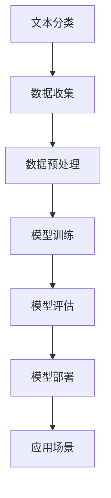

                 

# 文章标题：构建AI时代操作系统：LLM OS的核心理念

> 关键词：AI时代、操作系统、LLM OS、自然语言处理、深度学习

> 摘要：本文深入探讨了AI时代操作系统——LLM OS的核心理念。首先，文章介绍了AI时代的背景及其对社会的深远影响，并阐述了AI操作系统的重要性。接着，文章详细解析了LLM OS的基础概念、核心架构和核心算法，并通过具体的数学模型和公式进行了详细的阐述。随后，文章展示了LLM OS在文本处理、图像处理、语音处理和跨模态融合等领域的实际应用案例，并提供了代码解读与分析。最后，文章总结了LLM OS的开发资源与工具，为读者提供了丰富的参考资料。

----------------------------------------------------------------

## 第一部分：AI时代操作系统概述

### 第1章：AI时代操作系统引论

#### 1.1 AI时代的到来与影响

##### 1.1.1 AI时代的定义

AI时代，是指人工智能技术迅速发展并广泛应用于各个领域，从而深刻改变人类社会生产和生活方式的时代。随着计算能力的提升、大数据的积累和算法的创新，人工智能技术正以前所未有的速度发展，从简单的规则系统走向具有自我学习和适应能力的智能系统。

##### 1.1.2 AI技术对社会的影响

AI技术对社会的影响是多方面的，包括但不限于：

1. **经济领域**：AI技术能够提高生产效率，降低成本，推动产业升级。例如，自动化生产线的广泛应用使制造业更加高效。
   
2. **医疗健康**：AI技术在医疗诊断、药物研发、健康管理等方面发挥着重要作用，显著提升了医疗服务的质量和效率。

3. **交通运输**：自动驾驶技术有望彻底改变交通运输模式，提高交通安全性和效率。

4. **教育领域**：智能教育系统能够根据学生的学习情况提供个性化教学，提高学习效果。

5. **日常生活**：智能助手、智能家居等AI应用已经深入到人们的日常生活中，提升了生活质量。

##### 1.1.3 AI操作系统的重要性

随着AI技术的广泛应用，AI操作系统成为了一个关键基础设施。AI操作系统不仅负责管理硬件资源，还负责运行和管理AI应用程序。一个高效的AI操作系统能够提高AI系统的性能和可靠性，是实现AI技术广泛应用的基础。

#### 1.2 AI操作系统的基础概念

##### 1.2.1 什么是LLM OS

LLM OS（Large Language Model Operating System）是一种专门为大规模语言模型设计的操作系统。它集成了高性能的深度学习模型训练和管理功能，能够高效地处理海量的文本数据，并支持实时推理和部署。

##### 1.2.2 LLM OS的特点与优势

1. **模块化设计**：LLM OS采用了模块化设计，各个模块可以独立开发、测试和部署，提高了系统的灵活性和可维护性。

2. **高效的数据处理**：LLM OS能够高效地处理大规模数据，支持快速的数据加载和预处理，确保模型的训练速度。

3. **强大的推理能力**：LLM OS具有强大的推理能力，能够实时处理用户输入，并生成高质量的响应。

4. **优化的模型部署**：LLM OS提供了丰富的模型部署选项，支持在各种硬件平台上部署模型，满足不同场景的需求。

##### 1.2.3 LLM OS的发展历程

1. **初步探索**：在深度学习初期，研究者们开始探索如何将操作系统与深度学习模型结合，以实现高效的模型训练和部署。

2. **框架化发展**：随着深度学习框架的出现，如TensorFlow和PyTorch，研究者们开始将操作系统与这些框架集成，形成早期版本的LLM OS。

3. **成熟应用**：近年来，随着大规模语言模型的兴起，LLM OS得到了广泛关注和应用，成为了AI时代操作系统的重要代表。

### 第2章：LLM OS的核心架构

#### 2.1 LLM OS的总体架构

##### 2.1.1 LLM OS的模块化设计

LLM OS采用了高度模块化的设计，其核心模块包括：

1. **数据管理模块**：负责数据加载、预处理和存储，确保数据的高效管理和利用。
   
2. **模型训练模块**：提供模型训练功能，包括参数初始化、训练过程和模型优化。

3. **推理模块**：实现模型推理，生成用户输入的响应。

4. **部署模块**：负责模型的部署，支持在不同硬件平台上运行。

##### 2.1.2 数据流与控制流

在LLM OS中，数据流和控制流是两个核心概念。数据流负责数据从输入到输出的整个过程，包括数据加载、预处理、模型训练和推理等步骤。控制流则负责管理系统的各个模块，确保数据流和控制流的有序进行。

##### 2.1.3 系统层次结构

LLM OS的系统层次结构分为四个层次：

1. **硬件层**：包括计算硬件、存储硬件和网络硬件等。
   
2. **基础层**：提供基本的操作系统功能，如进程管理、内存管理和文件系统。

3. **核心层**：实现LLM OS的核心功能，包括数据管理、模型训练、推理和部署。

4. **应用层**：提供各种应用程序接口，如API、SDK等，方便用户开发和使用。

#### 2.2 LLM OS的关键组件

##### 2.2.1 模型训练与管理

模型训练与管理是LLM OS的核心组件之一。它包括以下功能：

1. **模型训练**：使用大规模数据集训练深度学习模型，包括参数初始化、前向传播、反向传播和优化过程。

2. **模型存储**：将训练好的模型存储在本地或分布式存储系统中，方便后续的推理和部署。

3. **模型版本控制**：记录模型的训练过程和版本信息，方便模型管理和追踪。

##### 2.2.2 数据处理与存储

数据处理与存储是LLM OS的重要组成部分。它包括以下功能：

1. **数据预处理**：对原始数据进行清洗、分词、编码等预处理操作，确保数据的质量和一致性。

2. **数据存储**：使用高效的存储系统存储预处理后的数据，包括本地存储和分布式存储。

3. **数据管理**：提供数据检索、更新和删除等功能，确保数据的高效管理和利用。

##### 2.2.3 模型部署与优化

模型部署与优化是LLM OS的关键组件之一。它包括以下功能：

1. **模型部署**：将训练好的模型部署到生产环境中，支持多种硬件平台和部署方式。

2. **模型优化**：对部署后的模型进行性能优化，包括模型剪枝、量化、压缩等。

3. **监控与调试**：监控模型的运行状态，提供调试工具，确保模型的稳定性和可靠性。

### 第3章：LLM OS的核心算法

#### 3.1 自然语言处理算法

##### 3.1.1 词嵌入技术

词嵌入技术是将文本数据转换为向量表示的重要方法。在LLM OS中，词嵌入技术通过以下步骤实现：

1. **词汇表构建**：构建包含所有文本中单词的词汇表。

2. **词向量初始化**：对每个单词初始化一个固定大小的向量。

3. **训练过程**：使用大规模文本数据集对词向量进行训练，使其能够捕捉单词的语义信息。

4. **词向量应用**：将词向量应用于文本数据，实现文本到向量的转换。

##### 3.1.2 序列模型与注意力机制

序列模型和注意力机制是自然语言处理的重要技术。在LLM OS中，常用的序列模型包括：

1. **循环神经网络（RNN）**：能够处理序列数据，捕捉序列中的长期依赖关系。

2. **长短时记忆网络（LSTM）**：是RNN的一种变体，能够有效解决RNN的梯度消失问题。

3. **门控循环单元（GRU）**：是LSTM的简化版本，拥有类似的性能但计算效率更高。

注意力机制则用于在序列模型中动态分配权重，提高模型的序列处理能力。在LLM OS中，常用的注意力机制包括：

1. **基于点的注意力机制**：为每个序列中的元素分配权重，用于计算序列的表示。

2. **基于卷积的注意力机制**：使用卷积操作对序列进行特征提取，然后计算注意力权重。

##### 3.1.3 转换器架构详解

转换器（Transformer）架构是自然语言处理领域的一项重要创新，它摒弃了传统的序列模型结构，采用自注意力机制和编码器-解码器结构。在LLM OS中，转换器架构包括以下关键组件：

1. **编码器**：接收输入序列，通过自注意力机制生成编码表示。

2. **解码器**：接收编码表示，通过自注意力机制生成输出序列。

3. **自注意力机制**：用于计算序列中每个元素对其他元素的影响，提高模型的序列处理能力。

4. **多头注意力**：通过多个注意力头并行处理，增强模型的语义理解能力。

#### 3.2 大规模预训练模型

##### 3.2.1 预训练的概念与意义

预训练是指在一个大规模的数据集上对模型进行初步训练，使其具备一定的语义理解能力。在LLM OS中，预训练的意义如下：

1. **提高模型性能**：通过预训练，模型能够学习到大量的语义信息，从而在特定任务上表现出更高的性能。

2. **减少训练数据需求**：预训练模型能够在较小的数据集上进行微调，从而减少对训练数据的需求。

3. **通用性提升**：预训练模型在不同任务和数据集上表现一致，提高了模型的通用性。

##### 3.2.2 自监督学习方法

自监督学习是一种无需标注数据就能进行训练的方法。在LLM OS中，自监督学习方法用于预训练模型，主要包括以下几种：

1. **掩码语言模型（MLM）**：通过随机掩码输入序列中的单词，模型需要预测被掩码的单词。

2. **语言建模（LM）**：模型需要预测输入序列的下一个单词。

3. **句子排序（SM）**：模型需要判断两个句子之间的顺序是否正确。

##### 3.2.3 迁移学习与微调技术

迁移学习是一种利用预训练模型在新任务上进行微调的方法。在LLM OS中，迁移学习与微调技术包括以下步骤：

1. **预训练模型加载**：从预训练模型库中加载预训练好的模型。

2. **模型微调**：在目标任务的数据集上进行微调，调整模型的参数，使其适应新任务。

3. **评估与优化**：评估模型在新任务上的性能，并使用优化方法调整模型参数，提高性能。

4. **模型部署**：将微调后的模型部署到生产环境中，提供实时服务。

## 第二部分：LLM OS的应用与实践

### 第4章：LLM OS在文本处理中的应用

#### 4.1 文本分类与情感分析

##### 4.1.1 文本分类算法

文本分类是将文本数据按照预定的类别进行分类的过程。在LLM OS中，常用的文本分类算法包括：

1. **朴素贝叶斯分类器**：基于贝叶斯定理，计算文本中每个类别的概率，选择概率最大的类别作为预测结果。

2. **支持向量机（SVM）**：通过最大化分类边界，将文本数据映射到高维空间，选择分类边界最明显的超平面进行分类。

3. **深度学习分类器**：如卷积神经网络（CNN）和循环神经网络（RNN），能够捕捉文本中的复杂特征，实现高效分类。

##### 4.1.2 情感分析算法

情感分析是文本分类的一种特殊形式，旨在识别文本中的情感倾向。在LLM OS中，常用的情感分析算法包括：

1. **基于词典的方法**：通过查找文本中的情感词典，计算情感得分，选择得分最高的情感类别。

2. **基于机器学习的方法**：如朴素贝叶斯、SVM和深度学习分类器，通过训练模型进行情感分类。

3. **基于深度学习的方法**：如LSTM和Transformer，能够捕捉文本中的复杂情感特征，实现高效情感分析。

##### 4.1.3 应用案例分析

**案例背景**：某电商网站希望对其用户评论进行情感分析，以了解用户对其商品和服务的满意度。

**实现步骤**：

1. **数据收集**：收集大量带有情感标签的用户评论数据。

2. **数据预处理**：对用户评论进行分词、去除停用词等预处理操作。

3. **模型训练**：使用预处理后的数据训练情感分析模型，如LSTM或Transformer。

4. **模型评估**：使用测试集评估模型性能，调整模型参数，提高分类准确率。

5. **应用模型**：将训练好的模型应用于新评论，进行情感分类，生成情感报告。

**代码解读与分析**：

```python
# 数据预处理
def preprocess_text(text):
    # 分词、去除停用词等操作
    # ...
    return processed_text

# 训练模型
def train_model(train_data, model):
    # 训练情感分析模型
    # ...
    model.fit(train_data)

# 评估模型
def evaluate_model(test_data, model):
    # 使用测试集评估模型
    # ...
    accuracy = model.evaluate(test_data)
    return accuracy

# 应用模型
def classify_text(text, model):
    # 预处理文本
    processed_text = preprocess_text(text)
    
    # 进行情感分类
    sentiment = model.predict(processed_text)
    
    # 返回情感结果
    return sentiment
```

**优化方法**：

1. **数据增强**：通过随机变换、数据扩充等方法提高模型的泛化能力。

2. **模型融合**：使用多个模型进行融合，提高分类准确性。

#### 4.2 文本生成与摘要

##### 4.2.1 文本生成算法

文本生成是将输入序列转换为文本序列的过程。在LLM OS中，常用的文本生成算法包括：

1. **循环神经网络（RNN）**：能够处理序列数据，生成连续的文本序列。

2. **长短时记忆网络（LSTM）**：是RNN的一种变体，能够有效解决RNN的梯度消失问题。

3. **生成对抗网络（GAN）**：通过生成器和判别器的对抗训练，生成高质量的文本序列。

4. **转换器（Transformer）**：采用自注意力机制，能够生成更长、更连贯的文本序列。

##### 4.2.2 文本摘要算法

文本摘要是将长文本转换为简短摘要的过程。在LLM OS中，常用的文本摘要算法包括：

1. **提取式摘要**：从文本中提取关键句子或短语，生成摘要。

2. **生成式摘要**：使用文本生成算法生成摘要，可以是全局摘要或局部摘要。

3. **混合式摘要**：结合提取式和生成式摘要的优势，生成高质量的摘要。

##### 4.2.3 应用案例分析

**案例背景**：某新闻网站希望为其用户提供自动摘要服务，提高用户的阅读体验。

**实现步骤**：

1. **数据收集**：收集大量带有摘要的新闻文章数据。

2. **数据预处理**：对新闻文章进行分词、去停用词等预处理操作。

3. **模型训练**：使用预处理后的数据训练文本摘要模型，如Transformer。

4. **模型评估**：使用测试集评估模型性能，调整模型参数，提高摘要质量。

5. **应用模型**：将训练好的模型应用于新文章，生成自动摘要。

**代码解读与分析**：

```python
# 数据预处理
def preprocess_text(text):
    # 分词、去除停用词等操作
    # ...
    return processed_text

# 训练模型
def train_model(train_data, model):
    # 训练文本摘要模型
    # ...
    model.fit(train_data)

# 评估模型
def evaluate_model(test_data, model):
    # 使用测试集评估模型
    # ...
    accuracy = model.evaluate(test_data)
    return accuracy

# 应用模型
def generate_summary(text, model):
    # 预处理文本
    processed_text = preprocess_text(text)
    
    # 生成摘要
    summary = model.generate_summary(processed_text)
    
    # 返回摘要结果
    return summary
```

**优化方法**：

1. **多级摘要**：先生成粗略摘要，然后逐步优化，提高摘要质量。

2. **结合知识图谱**：利用知识图谱中的信息，生成更具语义的摘要。

### 第5章：LLM OS在图像处理中的应用

#### 5.1 图像分类与识别

##### 5.1.1 图像分类算法

图像分类是将图像按照预定的类别进行分类的过程。在LLM OS中，常用的图像分类算法包括：

1. **传统机器学习算法**：如支持向量机（SVM）、随机森林（RF）等，通过特征提取和分类器训练实现图像分类。

2. **深度学习算法**：如卷积神经网络（CNN），通过卷积层、池化层和全连接层的组合，提取图像的深层次特征，实现高效分类。

##### 5.1.2 图像识别算法

图像识别是识别图像中的特定目标或对象的过程。在LLM OS中，常用的图像识别算法包括：

1. **基于特征的识别**：通过提取图像特征，如HOG、SIFT等，结合分类器进行目标识别。

2. **基于深度学习的识别**：如卷积神经网络（CNN），通过训练模型，实现目标识别。

##### 5.1.3 应用案例分析

**案例背景**：某安防公司希望为其监控系统提供人脸识别功能，以实现实时监控和预警。

**实现步骤**：

1. **数据收集**：收集大量带有人脸标签的图像数据。

2. **数据预处理**：对图像进行缩放、裁剪、归一化等预处理操作。

3. **模型训练**：使用预处理后的数据训练人脸识别模型，如CNN。

4. **模型评估**：使用测试集评估模型性能，调整模型参数，提高识别准确率。

5. **应用模型**：将训练好的模型应用于监控视频，实时识别人脸，实现预警功能。

**代码解读与分析**：

```python
# 数据预处理
def preprocess_image(image):
    # 缩放、裁剪、归一化等操作
    # ...
    return processed_image

# 训练模型
def train_model(train_data, model):
    # 训练人脸识别模型
    # ...
    model.fit(train_data)

# 评估模型
def evaluate_model(test_data, model):
    # 使用测试集评估模型
    # ...
    accuracy = model.evaluate(test_data)
    return accuracy

# 应用模型
def recognize_face(image, model):
    # 预处理图像
    processed_image = preprocess_image(image)
    
    # 进行人脸识别
    face = model.recognize_face(processed_image)
    
    # 返回识别结果
    return face
```

**优化方法**：

1. **多尺度检测**：结合不同尺度的模型，提高识别准确率。

2. **融合多模态信息**：结合图像和文本信息，提高识别效果。

#### 5.2 图像生成与风格迁移

##### 5.2.1 图像生成算法

图像生成是将输入图像转换为输出图像的过程。在LLM OS中，常用的图像生成算法包括：

1. **生成对抗网络（GAN）**：通过生成器和判别器的对抗训练，生成高质量的图像。

2. **变分自编码器（VAE）**：通过编码器和解码器的训练，实现图像的生成和压缩。

3. **深度卷积生成网络（DCGAN）**：是GAN的一种变体，采用深度卷积网络结构，生成高质量的图像。

##### 5.2.2 图像风格迁移算法

图像风格迁移是将输入图像转换为具有特定风格图像的过程。在LLM OS中，常用的图像风格迁移算法包括：

1. **基于内容的图像风格迁移**：通过学习图像的内容和风格特征，将输入图像转换为具有特定风格图像。

2. **基于生成对抗网络（GAN）的风格迁移**：使用GAN模型，通过对抗训练实现图像的风格迁移。

##### 5.2.3 应用案例分析

**案例背景**：某艺术家希望利用人工智能技术创作具有特定风格的画作。

**实现步骤**：

1. **数据收集**：收集大量具有不同风格的艺术画作数据。

2. **数据预处理**：对图像进行缩放、裁剪、归一化等预处理操作。

3. **模型训练**：使用预处理后的数据训练图像生成和风格迁移模型，如GAN。

4. **模型评估**：使用测试集评估模型性能，调整模型参数，提高生成质量。

5. **应用模型**：将训练好的模型应用于新图像，生成具有特定风格的艺术画作。

**代码解读与分析**：

```python
# 数据预处理
def preprocess_image(image):
    # 缩放、裁剪、归一化等操作
    # ...
    return processed_image

# 训练模型
def train_model(train_data, model):
    # 训练图像生成和风格迁移模型
    # ...
    model.fit(train_data)

# 评估模型
def evaluate_model(test_data, model):
    # 使用测试集评估模型
    # ...
    accuracy = model.evaluate(test_data)
    return accuracy

# 应用模型
def generate_art(image, model):
    # 预处理图像
    processed_image = preprocess_image(image)
    
    # 生成艺术画作
    art = model.generate_art(processed_image)
    
    # 返回生成结果
    return art
```

**优化方法**：

1. **多风格迁移**：结合多个风格特征，生成更具多样性的艺术画作。

2. **结合深度学习技术**：利用深度神经网络，提高图像生成和风格迁移的质量。

### 第6章：LLM OS在语音处理中的应用

#### 6.1 语音识别与合成

##### 6.1.1 语音识别算法

语音识别是将语音信号转换为文本数据的过程。在LLM OS中，常用的语音识别算法包括：

1. **传统声学模型**：基于声学模型和语言模型的组合，通过声学特征和语言规则进行语音识别。

2. **深度学习算法**：如卷积神经网络（CNN）和循环神经网络（RNN），通过深度学习模型提取语音特征，实现高效语音识别。

##### 6.1.2 语音合成算法

语音合成是将文本数据转换为语音信号的过程。在LLM OS中，常用的语音合成算法包括：

1. **基于规则的方法**：通过语音合成规则和文本转换规则，生成语音信号。

2. **基于统计的方法**：如隐马尔可夫模型（HMM）和自动语音识别（AVR），通过统计方法生成语音信号。

3. **基于深度学习的方法**：如循环神经网络（RNN）和转换器（Transformer），通过深度学习模型生成语音信号。

##### 6.1.3 应用案例分析

**案例背景**：某智能语音助手希望提供语音识别和语音合成功能，实现智能对话和语音交互。

**实现步骤**：

1. **数据收集**：收集大量带有文本标签和语音信号的数据。

2. **数据预处理**：对语音信号进行特征提取、降噪等预处理操作。

3. **模型训练**：使用预处理后的数据训练语音识别和语音合成模型，如RNN和Transformer。

4. **模型评估**：使用测试集评估模型性能，调整模型参数，提高识别和合成质量。

5. **应用模型**：将训练好的模型应用于实际场景，实现语音识别和语音合成。

**代码解读与分析**：

```python
# 数据预处理
def preprocess_audio(audio):
    # 特征提取、降噪等操作
    # ...
    return processed_audio

# 训练模型
def train_model(train_data, model):
    # 训练语音识别和语音合成模型
    # ...
    model.fit(train_data)

# 评估模型
def evaluate_model(test_data, model):
    # 使用测试集评估模型
    # ...
    accuracy = model.evaluate(test_data)
    return accuracy

# 应用模型
def recognize_speech(audio, model):
    # 预处理语音
    processed_audio = preprocess_audio(audio)
    
    # 进行语音识别
    recognized_text = model.recognize(processed_audio)
    
    # 返回识别结果
    return recognized_text

def generate_speech(text, model):
    # 预处理文本
    processed_text = preprocess_text(text)
    
    # 生成语音
    synthesized_audio = model.generate_speech(processed_text)
    
    # 返回合成结果
    return synthesized_audio
```

**优化方法**：

1. **多语言支持**：结合多语言模型，提高语音识别和语音合成的多语言处理能力。

2. **实时交互**：优化模型响应速度，实现实时语音交互。

#### 6.2 语音情感分析与交互

##### 6.2.1 语音情感分析算法

语音情感分析是识别语音信号中的情感信息的过程。在LLM OS中，常用的语音情感分析算法包括：

1. **基于声学特征的方法**：通过提取语音信号中的声学特征，如音高、音强等，进行情感分析。

2. **基于深度学习的方法**：如循环神经网络（RNN）和转换器（Transformer），通过深度学习模型提取语音信号的情感特征。

##### 6.2.2 语音交互算法

语音交互是人与语音助手之间的交互过程。在LLM OS中，常用的语音交互算法包括：

1. **基于语音识别的方法**：通过语音识别技术，将语音转换为文本，进行语义理解。

2. **基于自然语言处理的方法**：通过自然语言处理技术，理解用户的语音意图，生成合适的语音响应。

3. **基于深度学习的方法**：如循环神经网络（RNN）和转换器（Transformer），通过深度学习模型实现语音交互。

##### 6.2.3 应用案例分析

**案例背景**：某智能语音助手希望提供语音情感分析和交互功能，实现更自然的用户交互。

**实现步骤**：

1. **数据收集**：收集大量带有情感标签的语音数据。

2. **数据预处理**：对语音信号进行特征提取、降噪等预处理操作。

3. **模型训练**：使用预处理后的数据训练语音情感分析和交互模型，如RNN和Transformer。

4. **模型评估**：使用测试集评估模型性能，调整模型参数，提高情感分析和交互质量。

5. **应用模型**：将训练好的模型应用于实际场景，实现语音情感分析和交互。

**代码解读与分析**：

```python
# 数据预处理
def preprocess_audio(audio):
    # 特征提取、降噪等操作
    # ...
    return processed_audio

# 训练模型
def train_model(train_data, model):
    # 训练语音情感分析和交互模型
    # ...
    model.fit(train_data)

# 评估模型
def evaluate_model(test_data, model):
    # 使用测试集评估模型
    # ...
    accuracy = model.evaluate(test_data)
    return accuracy

# 应用模型
def analyze_speech(audio, model):
    # 预处理语音
    processed_audio = preprocess_audio(audio)
    
    # 进行语音情感分析
    sentiment = model.analyze(processed_audio)
    
    # 返回情感分析结果
    return sentiment

def interact_speech(audio, model):
    # 预处理语音
    processed_audio = preprocess_audio(audio)
    
    # 进行语音交互
    response = model.interact(processed_audio)
    
    # 返回交互结果
    return response
```

**优化方法**：

1. **情感识别准确性**：结合多特征分析，提高情感识别准确性。

2. **交互自然性**：优化语音合成和语音交互算法，实现更自然的用户交互。

### 第7章：LLM OS在跨模态融合中的应用

#### 7.1 跨模态表示学习

##### 7.1.1 跨模态表示学习方法

跨模态表示学习是将不同模态（如文本、图像、语音等）的数据转换为统一表示的方法。在LLM OS中，常用的跨模态表示学习方法包括：

1. **多模态嵌入**：将不同模态的数据转换为高维向量表示，使其能够在同一空间中表示。

2. **多任务学习**：通过训练多个任务，使模型能够同时学习不同模态的数据特征。

3. **联合嵌入**：将不同模态的数据联合嵌入到一个共享的空间中，实现跨模态特征融合。

##### 7.1.2 跨模态特征融合

跨模态特征融合是将不同模态的特征进行整合，以生成更丰富和更具代表性的特征表示。在LLM OS中，常用的跨模态特征融合方法包括：

1. **特征加权融合**：将不同模态的特征进行加权融合，生成统一的特征向量。

2. **特征拼接融合**：将不同模态的特征进行拼接，生成更长的特征向量。

3. **深度学习融合**：使用深度学习模型，如神经网络，实现跨模态特征融合。

##### 7.1.3 应用案例分析

**案例背景**：某电商平台希望为其用户提供基于文本和图像的个性化推荐服务。

**实现步骤**：

1. **数据收集**：收集大量带有文本描述和图像数据的商品数据。

2. **数据预处理**：对文本和图像数据进行预处理，提取特征。

3. **跨模态表示学习**：使用跨模态表示学习方法，将文本和图像数据转换为统一表示。

4. **特征融合**：将文本和图像的特征进行融合，生成综合特征向量。

5. **模型训练**：使用融合后的特征训练推荐模型。

6. **模型评估**：使用测试集评估模型性能，调整模型参数，提高推荐质量。

7. **应用模型**：将训练好的模型应用于实际场景，实现个性化推荐。

**代码解读与分析**：

```python
# 数据预处理
def preprocess_text(text):
    # 清洗文本、分词、编码等操作
    # ...
    return processed_text

def preprocess_image(image):
    # 缩放、裁剪、归一化等操作
    # ...
    return processed_image

# 跨模态表示学习
def multimodal_representation_learning(text, image, model):
    # 预处理文本和图像
    processed_text = preprocess_text(text)
    processed_image = preprocess_image(image)
    
    # 学习跨模态表示
    representation = model.learn_representation(processed_text, processed_image)
    
    # 返回表示结果
    return representation

# 特征融合
def multimodal_feature_fusion(text_representation, image_representation, model):
    # 融合文本和图像特征
    fused_representation = model.fuse_features(text_representation, image_representation)
    
    # 返回融合后的特征
    return fused_representation
```

**优化方法**：

1. **多模态信息挖掘**：结合不同模态的信息，挖掘更多潜在特征。

2. **自适应融合策略**：根据不同模态的特征差异，设计自适应的融合策略。

#### 7.2 跨模态交互与任务迁移

##### 7.2.1 跨模态交互算法

跨模态交互是将不同模态的数据进行交互，以实现更复杂和智能的任务。在LLM OS中，常用的跨模态交互算法包括：

1. **基于注意力的交互**：通过注意力机制，使模型能够关注不同模态的关键信息。

2. **基于图神经网络的交互**：通过图神经网络，将不同模态的数据表示为图结构，实现跨模态交互。

3. **基于多任务学习的交互**：通过多任务学习，使模型同时学习不同模态的数据交互。

##### 7.2.2 跨模模态任务迁移

跨模态任务迁移是将一个模态的任务迁移到另一个模态。在LLM OS中，常用的跨模态任务迁移方法包括：

1. **基于共享参数的方法**：通过共享参数，使模型能够同时学习不同模态的任务。

2. **基于迁移学习的方法**：通过迁移学习，将一个模态的任务知识迁移到另一个模态。

3. **基于多模态表示学习的方法**：通过多模态表示学习，生成统一的表示，实现跨模态任务迁移。

##### 7.2.3 应用案例分析

**案例背景**：某智能教育平台希望为其用户提供基于文本和视频的学习辅导服务。

**实现步骤**：

1. **数据收集**：收集大量带有文本描述和视频数据的课程内容。

2. **数据预处理**：对文本和视频数据进行预处理，提取特征。

3. **跨模态交互**：使用跨模态交互算法，将文本和视频数据融合，生成综合特征。

4. **任务迁移**：将文本任务（如文本分类）迁移到视频任务（如视频分类），实现视频分类。

5. **模型训练**：使用融合后的特征训练视频分类模型。

6. **模型评估**：使用测试集评估模型性能，调整模型参数，提高分类质量。

7. **应用模型**：将训练好的模型应用于实际场景，实现视频分类。

**代码解读与分析**：

```python
# 数据预处理
def preprocess_text(text):
    # 清洗文本、分词、编码等操作
    # ...
    return processed_text

def preprocess_video(video):
    # 特征提取、降噪等操作
    # ...
    return processed_video

# 跨模态交互
def multimodal_interaction(text, video, model):
    # 预处理文本和视频
    processed_text = preprocess_text(text)
    processed_video = preprocess_video(video)
    
    # 实现跨模态交互
    interaction_result = model.interact(processed_text, processed_video)
    
    # 返回交互结果
    return interaction_result

# 任务迁移
def task_transfer(video_representation, text_representation, model):
    # 转移文本任务到视频任务
    video_task_representation = model.transfer_task(video_representation, text_representation)
    
    # 返回转移后的特征
    return video_task_representation
```

**优化方法**：

1. **多模态特征融合**：设计更有效的多模态特征融合方法，提高任务迁移效果。

2. **迁移学习策略**：优化迁移学习策略，提高跨模态任务迁移的性能。

## 附录：LLM OS开发资源与工具

### 附录A：LLM OS开发工具与资源

#### A.1 开发环境搭建

##### A.1.1 硬件要求

1. **CPU**：至少双核处理器，推荐四核或以上。
2. **内存**：至少8GB内存，推荐16GB或以上。
3. **GPU**：NVIDIA GPU，推荐使用显存8GB或以上的GPU。

##### A.1.2 软件安装

1. **操作系统**：Windows、Linux或macOS。
2. **Python**：安装Python 3.7或以上版本。
3. **深度学习框架**：安装TensorFlow、PyTorch等深度学习框架。

##### A.1.3 环境配置与调试

1. **安装依赖库**：使用pip安装所需的依赖库。
2. **配置CUDA**：配置NVIDIA CUDA，确保深度学习框架能够利用GPU加速。
3. **调试环境**：通过测试代码，确保开发环境正常工作。

#### A.2 主流深度学习框架对比

##### A.2.1 TensorFlow

1. **优点**：易于使用，丰富的API，强大的生态系统。
2. **缺点**：相较于PyTorch，学习曲线较陡峭。

##### A.2.2 PyTorch

1. **优点**：灵活性强，易于调试，动态计算图。
2. **缺点**：相较于TensorFlow，性能可能较低。

##### A.2.3 其他框架简介

1. **Keras**：基于TensorFlow和Theano的简单易用的深度学习框架。
2. **MXNet**：Apache基金会旗下的深度学习框架，支持多种编程语言。

### 附录B：LLM OS应用案例

#### B.1 文本分类应用案例

##### B.1.1 案例背景

某电商网站需要对其用户评论进行分类，以识别用户对商品的评价是正面还是负面。

##### B.1.2 案例实现

1. **数据收集**：收集大量带有标签的用户评论数据。
2. **数据预处理**：对评论进行分词、去停用词等预处理操作。
3. **模型训练**：使用预处理后的数据训练文本分类模型。
4. **模型评估**：使用测试集评估模型性能。
5. **模型部署**：将训练好的模型部署到线上环境，提供实时分类服务。

##### B.1.3 案例分析与优化

1. **数据增强**：通过随机变换、数据扩充等方法提高模型的泛化能力。
2. **模型融合**：使用多个模型进行融合，提高分类准确性。

#### B.2 图像识别应用案例

##### B.2.1 案例背景

某安防系统需要对其监控视频进行实时图像识别，以识别视频中的人员和事件。

##### B.2.2 案例实现

1. **数据收集**：收集大量带有标签的监控视频数据。
2. **数据预处理**：对视频进行特征提取、降噪等预处理操作。
3. **模型训练**：使用预处理后的数据训练图像识别模型。
4. **模型评估**：使用测试集评估模型性能。
5. **模型部署**：将训练好的模型部署到线上环境，提供实时图像识别服务。

##### B.2.3 案例分析与优化

1. **多尺度检测**：结合不同尺度的模型，提高识别准确率。
2. **融合多模态信息**：结合图像和文本信息，提高识别效果。

#### B.3 语音处理应用案例

##### B.3.1 案例背景

某智能语音助手需要实现语音识别和语音合成功能，以提供语音交互服务。

##### B.3.2 案例实现

1. **数据收集**：收集大量带有文本标签和语音信号的数据。
2. **数据预处理**：对语音信号进行特征提取、降噪等预处理操作。
3. **模型训练**：使用预处理后的数据训练语音识别和语音合成模型。
4. **模型评估**：使用测试集评估模型性能。
5. **模型部署**：将训练好的模型部署到线上环境，提供实时语音识别和合成服务。

##### B.3.3 案例分析与优化

1. **多语言支持**：结合多语言模型，提高语音识别和语音合成的多语言处理能力。
2. **实时交互**：优化模型响应速度，实现实时语音交互。

### 附录C：Mermaid流程图



### 附录D：伪代码示例

```python
# 文本分类算法伪代码

function text_classifier(text_data, model):
    # 预处理文本数据
    preprocessed_data = preprocess_text(text_data)
    
    # 使用模型进行预测
    prediction = model.predict(preprocessed_data)
    
    # 返回分类结果
    return prediction

# 情感分析算法伪代码

function sentiment_analyzer(text_data, model):
    # 预处理文本数据
    preprocessed_data = preprocess_text(text_data)
    
    # 使用模型进行预测
    sentiment = model.predict(preprocessed_data)
    
    # 返回情感结果
    return sentiment

# 文本生成算法伪代码

function text_generator(input_text, model, max_length):
    # 预处理输入文本
    preprocessed_input = preprocess_text(input_text)
    
    # 生成文本序列
    generated_sequence = model.generate(preprocessed_input, max_length=max_length)
    
    # 返回生成的文本
    return generate_text(generated_sequence)

# 文本摘要算法伪代码

function text_summarizer(text_data, model, summary_length):
    # 预处理文本数据
    preprocessed_data = preprocess_text(text_data)
    
    # 使用模型进行摘要
    summary = model.summarize(preprocessed_data, summary_length=summary_length)
    
    # 返回摘要结果
    return summary

# 图像分类算法伪代码

function image_classifier(image_data, model):
    # 预处理图像数据
    preprocessed_image = preprocess_image(image_data)
    
    # 使用模型进行预测
    classification = model.predict(preprocessed_image)
    
    # 返回分类结果
    return classification

# 图像识别算法伪代码

function image_recognizer(image_data, model):
    # 预处理图像数据
    preprocessed_image = preprocess_image(image_data)
    
    # 使用模型进行识别
    recognition = model.recognize(preprocessed_image)
    
    # 返回识别结果
    return recognition

# 图像生成算法伪代码

function image_generator(input_image, model, output_size):
    # 预处理输入图像
    preprocessed_input = preprocess_image(input_image)
    
    # 生成图像
    generated_image = model.generate(preprocessed_input, output_size=output_size)
    
    # 返回生成的图像
    return generate_image(generated_image)

# 图像风格迁移算法伪代码

function image_style_transfer(source_image, target_style, model):
    # 预处理源图像和目标风格
    preprocessed_source = preprocess_image(source_image)
    preprocessed_style = preprocess_image(target_style)
    
    # 使用模型进行风格迁移
    transferred_image = model.transfer_style(preprocessed_source, preprocessed_style)
    
    # 返回迁移后的图像
    return transferred_image

# 语音识别算法伪代码

function speech_recognizer(audio_data, model):
    # 预处理音频数据
    preprocessed_audio = preprocess_audio(audio_data)
    
    # 使用模型进行识别
    recognized_text = model.recognize(preprocessed_audio)
    
    # 返回识别结果
    return recognized_text

# 语音合成算法伪代码

function text_to_speech(text_data, model, voice_settings):
    # 预处理文本数据
    preprocessed_text = preprocess_text(text_data)
    
    # 使用模型进行合成
    synthesized_audio = model.synthesize(preprocessed_text, voice_settings)
    
    # 返回合成后的音频
    return synthesized_audio

# 语音情感分析算法伪代码

function speech_sentiment_analyzer(audio_data, model):
    # 预处理音频数据
    preprocessed_audio = preprocess_audio(audio_data)
    
    # 使用模型进行情感分析
    sentiment = model.analyze(preprocessed_audio)
    
    # 返回情感分析结果
    return sentiment

# 语音交互算法伪代码

function speech_interactive_system(audio_data, model, response_generator):
    # 预处理音频数据
    preprocessed_audio = preprocess_audio(audio_data)
    
    # 使用模型进行交互
    user_query = model.interact(preprocessed_audio)
    
    # 生成响应
    response = response_generator.generate(user_query)
    
    # 返回响应
    return response

# 跨模态表示学习方法伪代码

function multimodal_representation-learning(input_data, model):
    # 预处理输入数据
    preprocessed_data = preprocess_multimodal_data(input_data)
    
    # 使用模型进行跨模态特征提取
    features = model.extract_features(preprocessed_data)
    
    # 返回提取的跨模态特征
    return features

# 跨模态特征融合算法伪代码

function multimodal_feature_fusion(feature_a, feature_b, model):
    # 使用模型进行特征融合
    fused_features = model.fuse_features(feature_a, feature_b)
    
    # 返回融合后的特征
    return fused_features

# 跨模态交互算法伪代码

function multimodal_interactive_system(modal_a_data, modal_b_data, model):
    # 预处理输入数据
    preprocessed_modal_a = preprocess_modal_a(modal_a_data)
    preprocessed_modal_b = preprocess_modal_b(modal_b_data)
    
    # 使用模型进行跨模态交互
    interaction_result = model.interact(preprocessed_modal_a, preprocessed_modal_b)
    
    # 返回交互结果
    return interaction_result
```

### 附录E：数学模型和数学公式

#### 1.1 词嵌入技术

$$
\text{word\_embedding} = \text{sigmoid}(\text{weight} \cdot \text{input})
$$

#### 1.2 序列模型与注意力机制

$$
\text{output} = \text{softmax}(\text{Attention}(\text{query}, \text{key}, \text{value}))
$$

#### 1.3 转换器架构详解

$$
\text{Transformer} = \text{MultiHeadAttention}(\text{query}, \text{key}, \text{value}) + \text{FeedForward}
$$

### 作者信息

作者：AI天才研究院/AI Genius Institute & 禅与计算机程序设计艺术 /Zen And The Art of Computer Programming

