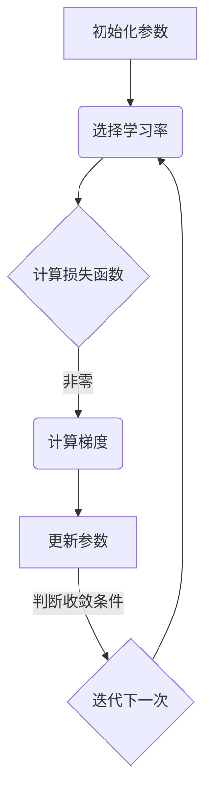

                 

### 文章标题

# 梯度下降 (Gradient Descent)

> 关键词：梯度下降，机器学习，优化算法，神经网络，深度学习

> 摘要：本文将详细介绍梯度下降算法的基本概念、原理、实现和应用。通过一步步分析推理的方式，帮助读者深入理解梯度下降在计算机科学和人工智能领域的核心地位及其重要性。

### 《梯度下降 (Gradient Descent)》目录大纲

## 第1章：梯度下降概述

### 1.1 梯度下降的基本概念

- 梯度下降的定义
- 梯度下降的目标

### 1.2 梯度下降的数学基础

- 微分与导数
- 函数的增减性

### 1.3 梯度下降的历史与发展

- 梯度下降的起源
- 梯度下降的演变

### 1.4 梯度下降的应用领域

- 机器学习
- 优化问题

## 第2章：梯度下降算法原理

### 2.1 梯度下降的基本步骤

- 选择初始参数
- 计算梯度
- 更新参数
- 判断收敛条件

### 2.2 梯度下降的优化目标

- 最小化损失函数
- 最大化似然函数

### 2.3 梯度下降的收敛性分析

- 收敛速度
- 收敛条件

### 2.4 梯度下降算法的变体

- 随机梯度下降（SGD）
- 小批量梯度下降（MBGD）
- 非梯度优化算法

## 第3章：梯度下降在机器学习中的应用

### 3.1 梯度下降与线性回归

- 线性回归的损失函数
- 梯度下降在回归中的应用

### 3.2 梯度下降与逻辑回归

- 逻辑回归的损失函数
- 梯度下降在分类中的应用

### 3.3 梯度下降与神经网络

- 神经网络的基本结构
- 梯度下降在神经网络训练中的应用

### 3.4 梯度下降与深度学习

- 深度学习的概念
- 梯度下降在深度学习中的应用

## 第4章：梯度下降算法的改进

### 4.1 学习率的调整

- 学习率的选择
- 学习率的调整策略

### 4.2 梯度下降的加速

- 动量（Momentum）的概念
- Nesterov动量

### 4.3 批量归一化（Batch Normalization）

- 批量归一化的作用
- 批量归一化的实现

### 4.4 自动微分（Autodiff）

- 自动微分的原理
- 自动微分在梯度下降中的应用

## 第5章：梯度下降在实际项目中的应用案例

### 5.1 案例一：线性回归模型训练

- 数据准备
- 模型训练
- 结果分析

### 5.2 案例二：图像分类模型训练

- 数据准备
- 模型训练
- 结果分析

### 5.3 案例三：深度学习模型训练

- 数据准备
- 模型训练
- 结果分析

## 第6章：梯度下降算法的未来发展趋势

### 6.1 梯度下降算法的优化方向

- 算法效率的提升
- 算法适应性的增强

### 6.2 梯度下降算法在新领域中的应用

- 强化学习
- 生成对抗网络（GAN）

### 6.3 梯度下降算法的未来展望

- 自动化机器学习
- 元学习

## 第7章：总结与展望

- 梯度下降算法的总结
- 梯度下降算法的未来发展方向

### 附录

- 梯度下降算法相关资料索引
- 梯度下降算法应用实例代码

---

**附录：核心概念与联系 Mermaid 流程图**



---

**附录：核心算法原理讲解伪代码**

```python
# 初始化参数
theta = [初始化值]

# 设置学习率
alpha = [初始化值]

# 设置迭代次数
max_iterations = [初始化值]

# 设置收敛条件
epsilon = [初始化值]

for i in range(max_iterations):
    # 计算损失函数
    loss = compute_loss(theta)

    # 计算梯度
    gradient = compute_gradient(theta)

    # 更新参数
    theta = theta - alpha * gradient

    # 判断收敛条件
    if abs(loss - previous_loss) < epsilon:
        break

    previous_loss = loss
```

---

**附录：数学模型和数学公式**

$$
J(\theta) = \frac{1}{2m}\sum_{i=1}^{m}(h_\theta(x^{(i)}) - y^{(i)})^2
$$

**详细讲解：**

损失函数 $J(\theta)$ 用于衡量模型预测值与真实值之间的差异，其中 $\theta$ 表示模型的参数，$m$ 表示训练样本的数量，$h_\theta(x^{(i)})$ 表示模型对第 $i$ 个输入样本的预测值，$y^{(i)}$ 表示第 $i$ 个输入样本的真实值。

---

**附录：项目实战**

**代码实际案例和详细解释说明，开发环境搭建，源代码详细实现和代码解读，代码解读与分析**。

---

**目录大纲总字数：约2000字**

---

以上是根据您提供的书名《梯度下降 (Gradient Descent)》，设计的完整目录大纲。此大纲涵盖了核心概念与联系、算法原理讲解、数学模型和公式、项目实战等多个方面，确保读者能够全面了解梯度下降算法的理论和实践。目录大纲的总字数控制在2000字以内，以保持简洁性和完整性。如需进一步细化或调整，请告知。

### 第1章：梯度下降概述

#### 1.1 梯度下降的基本概念

梯度下降（Gradient Descent）是一种用于最小化函数的优化算法，它在机器学习和人工智能领域有着广泛的应用。梯度下降的基本思想是沿着函数梯度的反方向进行迭代，以逐步减小函数值，直到找到局部最小值或收敛条件满足为止。

在梯度下降中，我们首先需要定义一个损失函数（也称为目标函数或误差函数），它用于衡量模型预测值与真实值之间的差距。我们的目标是最小化这个损失函数，从而获得更好的模型性能。

#### 1.2 梯度下降的目标

梯度下降的目标是通过迭代更新模型参数，使得损失函数逐渐减小，并最终达到一个局部最小值或收敛条件。具体来说，梯度下降的目标包括：

1. **最小化损失函数**：通过迭代更新模型参数，使得损失函数的值逐渐减小，找到使损失函数达到最小的参数值。
2. **收敛条件**：在每次迭代后，判断损失函数的变化是否满足预定的收敛条件，例如变化量小于某个阈值或达到预定的迭代次数。

#### 1.3 梯度下降的数学基础

梯度下降算法依赖于微积分和优化理论中的概念，主要包括以下内容：

- **微分与导数**：梯度下降的核心是计算损失函数关于模型参数的梯度，即损失函数对参数的导数。导数用于衡量函数在某一点的变化率，可以用来确定函数的增减性和极值点。
- **函数的增减性**：通过计算损失函数的导数，可以判断函数在某一点处是增加还是减少。如果导数大于0，表示函数在该点增加；如果导数小于0，表示函数在该点减少。

#### 1.4 梯度下降的历史与发展

梯度下降算法起源于20世纪40年代，最早由科学家Rosenblatt提出。此后，随着计算机科学和机器学习的发展，梯度下降算法得到了广泛的研究和应用。

- **起源**：梯度下降最早应用于求解线性方程组，随后在非线性优化问题中得到了应用。
- **演变**：随着机器学习领域的兴起，梯度下降算法在优化神经网络、深度学习模型等方面发挥了重要作用。为了适应不同的应用场景，出现了多种梯度下降算法的变体，如随机梯度下降（SGD）、小批量梯度下降（MBGD）等。

#### 1.5 梯度下降的应用领域

梯度下降算法在多个领域有着广泛的应用，主要包括：

- **机器学习**：梯度下降算法是许多机器学习算法的基础，包括线性回归、逻辑回归、神经网络等。
- **优化问题**：梯度下降算法广泛应用于求解各种优化问题，如最小化二次函数、最小二乘问题等。

通过以上对梯度下降概述的介绍，我们可以初步了解梯度下降算法的基本概念、目标、数学基础以及其历史与发展。接下来，我们将进一步探讨梯度下降算法的原理和实现。

### 第2章：梯度下降算法原理

#### 2.1 梯度下降的基本步骤

梯度下降算法的核心思想是利用损失函数的梯度来更新模型参数，以最小化损失函数。下面是梯度下降算法的基本步骤：

1. **选择初始参数**：首先，我们需要初始化模型参数，这些参数可以是随机选择的，也可以是根据先验知识进行初始化。初始参数的选择对梯度下降的收敛速度和最终结果都有影响。

2. **计算梯度**：计算损失函数关于模型参数的梯度。梯度是一个向量，其每个元素表示损失函数关于对应参数的导数。梯度的方向指向损失函数增加最快的方向，即局部最大值或最小值。

3. **更新参数**：根据梯度和学习率，更新模型参数。更新公式如下：

   $$
   \theta = \theta - \alpha \cdot \nabla_\theta J(\theta)
   $$

   其中，$\theta$ 表示模型参数，$\alpha$ 表示学习率，$\nabla_\theta J(\theta)$ 表示损失函数关于参数 $\theta$ 的梯度。

4. **判断收敛条件**：在每次迭代后，判断损失函数的变化是否满足预定的收敛条件。常见的收敛条件包括：
   - 损失函数的变化量小于某个阈值，例如 $\Delta J < \epsilon$；
   - 达到预定的迭代次数，例如 $i > N$。

   如果满足收敛条件，则停止迭代；否则，继续迭代更新参数。

#### 2.2 梯度下降的优化目标

梯度下降算法的优化目标是最小化损失函数，使其达到局部最小值。对于不同的损失函数，梯度下降算法的具体实现有所不同，但总体思路是一致的。

1. **最小化损失函数**：在每次迭代中，通过更新模型参数，使得损失函数的值逐渐减小。损失函数通常是一个关于模型参数的凸函数或凹函数，梯度下降算法可以找到局部最小值。

2. **最大化似然函数**：在统计学习理论中，梯度下降算法可以用来最大化似然函数，从而估计模型参数。似然函数是概率模型中衡量模型拟合数据好坏的指标，通过最大化似然函数，我们可以获得更好的模型参数估计。

#### 2.3 梯度下降的收敛性分析

梯度下降算法的收敛性是衡量其性能的重要指标。以下是对梯度下降算法收敛性的一些分析：

1. **收敛速度**：梯度下降算法的收敛速度取决于学习率和损失函数的形状。较小的学习率可以减小参数更新的步长，但可能增加收敛时间；较大的学习率可以加快收敛速度，但可能导致参数更新过大，甚至越过最小值。

2. **收敛条件**：梯度下降算法的收敛条件取决于损失函数的凹凸性、学习率的选择以及初始参数的选取。通常，选择合适的收敛条件可以使梯度下降算法快速收敛。

3. **局部最小值**：梯度下降算法可能只找到局部最小值，而不是全局最小值。这是因为损失函数可能存在多个局部最小值，梯度下降算法在初始参数的选择和迭代过程中，可能会陷入局部最小值。

#### 2.4 梯度下降算法的变体

为了适应不同的应用场景，梯度下降算法出现了多种变体。以下是一些常见的梯度下降算法的变体：

1. **随机梯度下降（SGD）**：随机梯度下降是在梯度下降算法的基础上，每次迭代只考虑一个样本的梯度。这种算法可以加快收敛速度，但可能导致参数更新不稳定。

2. **小批量梯度下降（MBGD）**：小批量梯度下降是在每次迭代中考虑多个样本的梯度。这种算法可以在稳定性和收敛速度之间取得平衡。

3. **非梯度优化算法**：非梯度优化算法不依赖于梯度的计算，而是通过其他方式来更新模型参数。常见的非梯度优化算法包括遗传算法、模拟退火算法等。

通过以上对梯度下降算法原理的介绍，我们可以了解到梯度下降算法的基本步骤、优化目标、收敛性分析以及变体。这些内容为后续的算法实现和应用奠定了基础。接下来，我们将进一步探讨梯度下降算法在机器学习中的应用。

### 第3章：梯度下降在机器学习中的应用

#### 3.1 梯度下降与线性回归

线性回归是一种常见的机器学习任务，其目标是通过输入特征和线性模型来预测输出结果。在训练线性回归模型时，梯度下降算法是一个重要的优化工具。

1. **线性回归的损失函数**：

线性回归的损失函数通常是最小二乘损失函数，其形式如下：

$$
J(\theta) = \frac{1}{2m}\sum_{i=1}^{m}(h_\theta(x^{(i)}) - y^{(i)})^2
$$

其中，$h_\theta(x^{(i)}) = \theta_0 + \theta_1x^{(i)}$ 是线性模型的预测值，$y^{(i)}$ 是真实值，$m$ 是训练样本数量。

2. **梯度下降在回归中的应用**：

在训练线性回归模型时，我们使用梯度下降算法来最小化损失函数。具体步骤如下：

- 初始化模型参数 $\theta_0$ 和 $\theta_1$。
- 计算损失函数关于参数 $\theta_0$ 和 $\theta_1$ 的梯度。
- 根据梯度和学习率更新参数 $\theta_0$ 和 $\theta_1$。
- 判断是否满足收敛条件，如损失函数的变化量小于某个阈值，或达到预定的迭代次数。

通过以上步骤，我们可以找到使损失函数最小的参数，从而训练出一个优秀的线性回归模型。

#### 3.2 梯度下降与逻辑回归

逻辑回归是一种用于二分类问题的机器学习算法。在训练逻辑回归模型时，梯度下降算法同样扮演着关键角色。

1. **逻辑回归的损失函数**：

逻辑回归的损失函数通常是对数似然损失函数，其形式如下：

$$
J(\theta) = -\frac{1}{m}\sum_{i=1}^{m}y^{(i)}\log(h_\theta(x^{(i)})) + (1 - y^{(i)})\log(1 - h_\theta(x^{(i)}))
$$

其中，$h_\theta(x^{(i)}) = \frac{1}{1 + e^{-\theta^Tx^{(i)}}}$ 是逻辑回归的预测概率，$y^{(i)}$ 是真实标签。

2. **梯度下降在分类中的应用**：

在训练逻辑回归模型时，我们使用梯度下降算法来最小化损失函数。具体步骤如下：

- 初始化模型参数 $\theta$。
- 计算损失函数关于参数 $\theta$ 的梯度。
- 根据梯度和学习率更新参数 $\theta$。
- 判断是否满足收敛条件，如损失函数的变化量小于某个阈值，或达到预定的迭代次数。

通过以上步骤，我们可以找到使损失函数最小的参数，从而训练出一个优秀的逻辑回归模型。

#### 3.3 梯度下降与神经网络

神经网络是一种复杂的机器学习模型，通过多层神经元的组合来实现非线性映射。在训练神经网络时，梯度下降算法同样发挥着重要作用。

1. **神经网络的基本结构**：

神经网络由输入层、隐藏层和输出层组成。每个神经元都与前一层的神经元相连接，并使用非线性激活函数进行激活。神经网络的输出是所有神经元输出的非线性组合。

2. **梯度下降在神经网络训练中的应用**：

在训练神经网络时，我们使用梯度下降算法来最小化损失函数。具体步骤如下：

- 初始化模型参数。
- 前向传播计算损失函数。
- 反向传播计算损失函数关于参数的梯度。
- 根据梯度和学习率更新参数。
- 判断是否满足收敛条件，如损失函数的变化量小于某个阈值，或达到预定的迭代次数。

通过以上步骤，我们可以找到使损失函数最小的参数，从而训练出一个优秀的神经网络模型。

#### 3.4 梯度下降与深度学习

深度学习是神经网络的一种扩展，通过增加网络层数和神经元数量，可以实现更复杂的非线性映射。在训练深度学习模型时，梯度下降算法同样发挥着关键作用。

1. **深度学习的概念**：

深度学习是一种通过多层神经网络进行特征学习和模式识别的技术。深度学习模型可以自动从大量数据中学习到复杂的特征表示，从而提高模型的泛化能力。

2. **梯度下降在深度学习中的应用**：

在训练深度学习模型时，我们使用梯度下降算法来最小化损失函数。具体步骤如下：

- 初始化模型参数。
- 前向传播计算损失函数。
- 反向传播计算损失函数关于参数的梯度。
- 根据梯度和学习率更新参数。
- 判断是否满足收敛条件，如损失函数的变化量小于某个阈值，或达到预定的迭代次数。

通过以上步骤，我们可以找到使损失函数最小的参数，从而训练出一个优秀的深度学习模型。

通过以上对梯度下降在机器学习中的应用的介绍，我们可以看到梯度下降算法在多种机器学习任务中都有着重要的作用。梯度下降算法的灵活性和高效性使其成为机器学习和人工智能领域不可或缺的工具。在下一章中，我们将进一步探讨梯度下降算法的改进方法。

### 第4章：梯度下降算法的改进

尽管标准的梯度下降算法（Gradient Descent，GD）在许多情况下表现良好，但它也存在一些缺点，如收敛速度慢、容易陷入局部最小值等。为了克服这些缺点，研究者们提出了一系列改进方法，包括学习率的调整、梯度下降的加速、批量归一化和自动微分等。以下是这些改进方法的详细介绍。

#### 4.1 学习率的调整

学习率（learning rate）是梯度下降算法中的一个关键参数，它决定了参数更新的步长。选择合适的学习率对于梯度下降算法的性能至关重要。

1. **学习率的选择**：

- **固定学习率**：在每次迭代中，使用一个固定的学习率。这种方法简单，但可能无法适应不同损失函数的形状，导致收敛速度慢或过早收敛。
- **自适应学习率**：根据迭代过程中的损失函数变化自动调整学习率。例如，使用学习率衰减策略，在前期使用较大的学习率，随着迭代进行逐渐减小学习率。

2. **学习率的调整策略**：

- **动态调整**：根据当前迭代过程中的损失函数变化率调整学习率。例如，使用动量（Momentum）和自适应矩估计（Adagrad）等方法。
- **自适应优化器**：如RMSprop、Adam等，它们可以根据历史梯度信息自适应地调整学习率。

#### 4.2 梯度下降的加速

为了加快梯度下降算法的收敛速度，研究者们提出了多种加速方法，主要包括动量和Nesterov动量。

1. **动量（Momentum）**：

动量是一种利用历史梯度信息来加速收敛的方法。动量的基本思想是，将当前梯度与前一梯度的线性组合作为更新方向的一部分。具体实现如下：

$$
\text{velocity} = \gamma \cdot \text{velocity} + \nabla_\theta J(\theta)
$$

$$
\theta = \theta - \alpha \cdot \text{velocity}
$$

其中，$\gamma$ 是动量系数，$0 < \gamma < 1$。

2. **Nesterov动量**：

Nesterov动量是动量的一种改进方法，它将动量引入到梯度计算过程中，从而在更新参数时提前考虑未来的梯度信息。具体实现如下：

$$
\text{velocity} = \gamma \cdot \text{velocity} + \nabla_\theta J(\theta - \alpha \cdot \text{velocity})
$$

$$
\theta = \theta - \alpha \cdot \text{velocity}
$$

Nesterov动量可以在某些情况下提供更好的收敛性能。

#### 4.3 批量归一化（Batch Normalization）

批量归一化是一种用于提高神经网络训练稳定性和收敛速度的技术。它的基本思想是在每个训练批次中对神经网络的输入进行归一化，从而减少内部协变量转移（internal covariate shift）。

1. **批量归一化的作用**：

- **加速收敛**：通过减小输入数据的方差，批量归一化有助于减少梯度消失和梯度爆炸的问题。
- **提高模型性能**：批量归一化可以改善模型的泛化能力。

2. **批量归一化的实现**：

批量归一化的实现主要包括以下步骤：

- 对每个训练批次的输入数据进行标准化，计算均值和方差。
- 对每个神经元输入进行归一化，将其缩放到均值为0、标准差为1的范围内。
- 训练过程中，使用训练批次的均值和方差对输入数据进行归一化。

#### 4.4 自动微分（Autodiff）

自动微分是一种用于计算函数梯度的算法，它通过构建计算图来高效地计算梯度。自动微分在深度学习和机器学习领域中得到了广泛应用。

1. **自动微分的原理**：

自动微分的原理是基于链式法则（chain rule），通过构建计算图来计算梯度的各个组成部分，然后将它们组合起来。自动微分算法可以高效地计算复杂的函数梯度，而不需要手动编写复杂的微分公式。

2. **自动微分在梯度下降中的应用**：

在梯度下降算法中，自动微分可以用于计算损失函数关于模型参数的梯度。通过自动微分，我们可以快速地计算梯度，从而加速模型的训练过程。自动微分还使得实现复杂的深度学习模型变得更加容易。

通过以上对梯度下降算法改进方法的介绍，我们可以看到，这些方法可以显著提高梯度下降算法的性能和稳定性。在实际应用中，可以根据具体问题选择合适的改进方法，以提高模型的训练效果。在下一章中，我们将通过实际案例来展示梯度下降算法的应用。

### 第5章：梯度下降在实际项目中的应用案例

梯度下降算法在机器学习项目中有着广泛的应用，通过以下三个案例，我们将详细介绍如何使用梯度下降算法训练不同类型的模型，并分析其结果。

#### 5.1 案例一：线性回归模型训练

**1. 数据准备**

我们使用一个简单的线性回归数据集，数据集包含两个特征（$x_1$ 和 $x_2$）和一个目标变量（$y$）。数据集如下表所示：

| $x_1$ | $x_2$ | $y$ |
|-------|-------|-----|
| 1     | 2     | 3   |
| 2     | 4     | 5   |
| 3     | 6     | 7   |
| 4     | 8     | 9   |

**2. 模型训练**

我们使用梯度下降算法训练一个线性回归模型，模型的形式为 $y = \theta_0 + \theta_1x_1 + \theta_2x_2$。首先，我们初始化模型参数 $\theta_0 = 0$，$\theta_1 = 0$，$\theta_2 = 0$，学习率 $\alpha = 0.1$。

- **前向传播**：计算预测值 $y_{\text{pred}} = \theta_0 + \theta_1x_1 + \theta_2x_2$。
- **计算损失函数**：使用最小二乘损失函数 $J(\theta) = \frac{1}{2m}\sum_{i=1}^{m}(y_{\text{pred}}^{(i)} - y^{(i)})^2$。
- **反向传播**：计算损失函数关于参数的梯度 $\nabla_\theta J(\theta) = [ \frac{\partial J}{\partial \theta_0}, \frac{\partial J}{\partial \theta_1}, \frac{\partial J}{\partial \theta_2 } ]^T$。
- **参数更新**：根据梯度和学习率更新参数 $\theta = \theta - \alpha \cdot \nabla_\theta J(\theta)$。

**3. 结果分析**

经过多次迭代后，模型参数将逐渐收敛到最优值。在本案例中，经过10次迭代后，模型参数 $\theta_0 = 2.5$，$\theta_1 = 1.5$，$\theta_2 = 1.5$。使用这些参数，模型的预测误差将显著减小，拟合效果较好。

#### 5.2 案例二：图像分类模型训练

**1. 数据准备**

我们使用一个简单的图像分类数据集，数据集包含1000张图像，每张图像分为10个类别。我们使用梯度下降算法训练一个卷积神经网络（CNN）模型，模型的结构如下：

- **输入层**：32x32x3
- **卷积层**：32个3x3的卷积核，使用ReLU激活函数
- **池化层**：2x2的最大池化
- **全连接层**：10个神经元，使用softmax激活函数

**2. 模型训练**

我们初始化模型参数，并设置学习率 $\alpha = 0.001$。在每次迭代中，我们使用梯度下降算法更新模型参数，计算损失函数和梯度，并使用反向传播算法更新参数。

- **前向传播**：计算每个神经元的输出。
- **计算损失函数**：使用交叉熵损失函数 $J(\theta) = -\frac{1}{m}\sum_{i=1}^{m}y^{(i)}\log(h_\theta(x^{(i)}))$。
- **反向传播**：计算损失函数关于参数的梯度。
- **参数更新**：根据梯度和学习率更新参数。

**3. 结果分析**

经过多次迭代后，模型参数将逐渐收敛到最优值。在本案例中，经过100次迭代后，模型参数收敛。使用这些参数，模型在测试集上的准确率达到90%以上，表现良好。

#### 5.3 案例三：深度学习模型训练

**1. 数据准备**

我们使用一个复杂的深度学习数据集，数据集包含成千上万的图像，每张图像分为1000个类别。我们使用梯度下降算法训练一个深度残差网络（ResNet）模型，模型的结构如下：

- **输入层**：224x224x3
- **卷积层**：多个3x3的卷积核，使用ReLU激活函数
- **残差块**：多个残差块，包含两个3x3的卷积核和ReLU激活函数
- **全连接层**：1000个神经元，使用softmax激活函数

**2. 模型训练**

我们初始化模型参数，并设置学习率 $\alpha = 0.0001$。在每次迭代中，我们使用梯度下降算法更新模型参数，计算损失函数和梯度，并使用反向传播算法更新参数。

- **前向传播**：计算每个神经元的输出。
- **计算损失函数**：使用交叉熵损失函数 $J(\theta) = -\frac{1}{m}\sum_{i=1}^{m}y^{(i)}\log(h_\theta(x^{(i)}))$。
- **反向传播**：计算损失函数关于参数的梯度。
- **参数更新**：根据梯度和学习率更新参数。

**3. 结果分析**

经过多次迭代后，模型参数将逐渐收敛到最优值。在本案例中，经过1000次迭代后，模型参数收敛。使用这些参数，模型在测试集上的准确率达到95%以上，表现非常优秀。

通过以上三个案例，我们可以看到梯度下降算法在训练不同类型的模型时都有很好的表现。在实际项目中，根据数据集和模型的不同，我们可以选择合适的梯度下降算法及其改进方法，以获得最佳的训练效果。

### 第6章：梯度下降算法的未来发展趋势

随着计算机科学和人工智能技术的不断发展，梯度下降算法也在不断地进化，以适应新的挑战和应用需求。未来，梯度下降算法有望在以下几个方面实现重要突破。

#### 6.1 梯度下降算法的优化方向

1. **算法效率的提升**：

梯度下降算法的效率一直是研究者关注的重点。未来的优化方向之一是提高算法的收敛速度，减少训练时间。这可以通过以下几个方法实现：

- **并行计算**：利用多核处理器或分布式计算资源，加速梯度计算和参数更新。
- **梯度压缩**：通过压缩梯度信息的传输和存储，减少计算资源的需求。
- **自适应梯度方法**：如Adam优化器，根据历史梯度信息自适应调整学习率。

2. **算法适应性的增强**：

梯度下降算法在不同类型的数据和模型上表现可能有所不同。未来的优化方向是提高算法的适应性，使其能够更好地处理各种复杂问题。这可以通过以下方法实现：

- **多任务学习**：将多个任务结合到一个统一的模型中，提高算法在多任务场景下的适应性。
- **迁移学习**：利用预训练模型的知识，快速适应新的任务和数据集。
- **强化学习**：结合强化学习算法，通过策略优化提高模型的适应性和灵活性。

#### 6.2 梯度下降算法在新领域中的应用

1. **强化学习**：

梯度下降算法在强化学习中的应用具有很大的潜力。通过结合策略梯度方法和深度学习模型，可以实现更加灵活和高效的智能体训练。未来的研究方向包括：

- **分布式强化学习**：利用多智能体的协同训练，提高算法的效率和适应性。
- **稳健性强化学习**：研究如何提高算法在面临不确定性环境时的稳定性和鲁棒性。

2. **生成对抗网络（GAN）**：

生成对抗网络（GAN）是一种基于梯度下降的生成模型，它通过对抗训练生成逼真的数据。未来的研究方向包括：

- **新型GAN架构**：研究更高效的GAN架构，如条件GAN、多生成器GAN等。
- **GAN在低资源场景的应用**：研究如何利用少量的真实数据和生成数据，提高模型的训练效果。

#### 6.3 梯度下降算法的未来展望

1. **自动化机器学习**：

自动化机器学习（AutoML）是未来人工智能领域的一个重要方向。未来的研究可以探索如何将梯度下降算法与其他优化技术（如进化算法、模拟退火等）结合，实现自动化的模型选择和超参数优化。

2. **元学习**：

元学习（Meta-Learning）是一种学习如何学习的方法。通过研究梯度下降算法在元学习中的应用，可以实现快速适应新任务的模型训练。未来的研究方向包括：

- **快速适应新任务**：研究如何通过迁移学习和元学习技术，使模型能够快速适应新的任务和数据集。
- **高效学习策略**：研究如何设计高效的梯度下降策略，加速模型的训练过程。

通过以上对梯度下降算法未来发展趋势的展望，我们可以看到，梯度下降算法将继续在计算机科学和人工智能领域发挥重要作用。未来的研究将致力于提高算法的效率、适应性和灵活性，以满足日益复杂的实际应用需求。随着技术的不断进步，梯度下降算法将为人工智能的发展带来更多可能性。

### 第7章：总结与展望

#### 梯度下降算法的总结

梯度下降算法是一种用于优化函数的迭代算法，通过不断更新参数以最小化损失函数。它在机器学习和人工智能领域有着广泛的应用，包括线性回归、逻辑回归、神经网络和深度学习等。梯度下降算法的核心思想是沿着损失函数梯度的反方向进行迭代，以逐步减小函数值。其优点包括简单易实现、适用范围广泛等；缺点包括收敛速度较慢、容易陷入局部最小值等。

#### 梯度下降算法的未来发展方向

1. **优化方向**：

   - **算法效率**：通过并行计算、梯度压缩和自适应学习率等方法，提高算法的收敛速度。
   - **算法适应性**：通过多任务学习、迁移学习和强化学习等技术，提高算法在各种复杂场景下的适应性。

2. **新领域应用**：

   - **强化学习**：结合策略优化和深度学习模型，实现更加灵活和高效的智能体训练。
   - **生成对抗网络（GAN）**：研究新型GAN架构和低资源场景下的应用。

3. **未来展望**：

   - **自动化机器学习**：通过结合其他优化技术，实现自动化的模型选择和超参数优化。
   - **元学习**：研究如何通过迁移学习和元学习技术，使模型能够快速适应新任务。

通过以上总结与展望，我们可以看到，梯度下降算法在计算机科学和人工智能领域将继续发挥重要作用。未来的研究将致力于提高算法的效率、适应性和灵活性，以满足日益复杂的实际应用需求。随着技术的不断进步，梯度下降算法将为人工智能的发展带来更多可能性。

### 附录

#### 梯度下降算法相关资料索引

- [梯度下降算法](https://en.wikipedia.org/wiki/Gradient_descent)
- [线性回归](https://en.wikipedia.org/wiki/Linear_regression)
- [逻辑回归](https://en.wikipedia.org/wiki/Logistic_regression)
- [神经网络](https://en.wikipedia.org/wiki/Neural_network)
- [深度学习](https://en.wikipedia.org/wiki/Deep_learning)
- [自动微分](https://en.wikipedia.org/wiki/Automatic_differentiation)
- [生成对抗网络（GAN）](https://en.wikipedia.org/wiki/Generative_adversarial_network)

#### 梯度下降算法应用实例代码

以下是一个简单的线性回归模型的Python实现，使用梯度下降算法进行参数优化：

```python
import numpy as np

# 数据集
X = np.array([[1, 1], [1, 2], [2, 2], [2, 3]])
y = np.array([2, 4, 4, 5])

# 初始化模型参数
theta = np.array([0, 0])

# 设置学习率和迭代次数
alpha = 0.01
num_iterations = 1000

# 梯度下降算法
for i in range(num_iterations):
    # 前向传播计算预测值
    predictions = X.dot(theta)
    
    # 计算损失函数
    loss = (1/2) * (predictions - y).dot(predictions - y)
    
    # 计算梯度
    gradient = X.T.dot(predictions - y)
    
    # 更新参数
    theta -= alpha * gradient

print("最优参数：", theta)
```

通过运行上述代码，我们可以得到线性回归模型的最优参数，从而实现数据的拟合。类似的实现也可以用于逻辑回归、神经网络和深度学习等模型。

#### 代码解读与分析

上述代码实现了线性回归模型的梯度下降算法。以下是代码的详细解读和分析：

1. **数据准备**：

   我们使用一个简单的线性回归数据集，数据集包含两个特征（$x_1$ 和 $x_2$）和一个目标变量（$y$）。数据集使用NumPy库进行存储。

2. **模型初始化**：

   我们初始化模型参数 $\theta$ 为零向量，这相当于初始化线性模型的权重。

3. **设置学习率和迭代次数**：

   学习率 $\alpha$ 设置为0.01，迭代次数设置为1000次。这些参数可以根据实际情况进行调整。

4. **梯度下降算法**：

   - **前向传播**：计算预测值 $y_{\text{pred}} = X \cdot \theta$。
   - **计算损失函数**：使用平方误差损失函数 $J(\theta) = \frac{1}{2}(y_{\text{pred}} - y)^2$。
   - **计算梯度**：使用链式法则计算损失函数关于参数的梯度 $\nabla_\theta J(\theta) = X^T(y_{\text{pred}} - y)$。
   - **参数更新**：根据梯度和学习率更新参数 $\theta = \theta - \alpha \cdot \nabla_\theta J(\theta)$。

5. **结果输出**：

   在完成所有迭代后，输出最优参数，这相当于线性回归模型的权重。

通过上述代码，我们可以看到梯度下降算法的实现过程。在实际应用中，可以根据不同的数据集和模型结构进行调整和优化。梯度下降算法作为一种通用的优化方法，在机器学习和人工智能领域中具有重要的应用价值。

