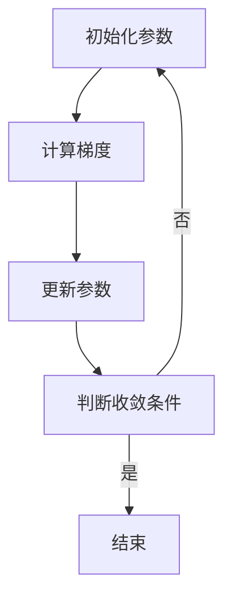

                 

## 文章标题：梯度下降(Gradient Descent) - 原理与代码实例讲解

在机器学习和人工智能领域，梯度下降是一种广泛使用的优化算法，用于寻找函数的最小值或最大化值。本文将详细讲解梯度下降的原理，并通过代码实例展示其应用过程。无论您是初学者还是有经验的工程师，本文都将帮助您深入理解梯度下降的核心概念及其实现细节。

关键词：梯度下降，机器学习，优化算法，线性回归，神经网络

摘要：本文将首先介绍梯度下降的基本概念和原理，随后讨论几种常见的梯度下降算法变体，包括随机梯度下降、小批量梯度下降等。接着，我们将通过具体的代码实例来展示如何在不同的机器学习任务中应用梯度下降，包括线性回归、逻辑回归和神经网络。最后，我们将通过实战案例进一步巩固对梯度下降的理解。

## 第一部分：梯度下降基础

### 第1章：梯度下降概述

#### 1.1 梯度下降的概念

梯度下降是一种迭代优化算法，主要用于求解凸函数的极小值问题。其核心思想是通过计算目标函数的梯度，并沿着梯度的反方向更新参数，从而逐步逼近最优解。

#### 1.2 梯度下降的基本原理

梯度下降算法的数学基础是微积分中的梯度概念。对于任意一个函数 $f(\theta)$，梯度 $\nabla f(\theta)$ 是一个向量，其方向指向函数增加最快的方向，大小表示增加的速率。

梯度下降的核心思想是通过迭代更新参数 $\theta$，使得目标函数值逐渐减小。每次迭代都按照以下步骤进行：

1. 计算当前参数 $\theta$ 下目标函数的梯度 $\nabla f(\theta)$。
2. 根据梯度方向，更新参数 $\theta$：$\theta = \theta - \alpha \nabla f(\theta)$，其中 $\alpha$ 是学习率。
3. 重复上述步骤，直到满足停止条件（例如达到预设的迭代次数或目标函数值变化小于某个阈值）。

#### 1.3 梯度下降的应用场景

梯度下降算法在机器学习和优化问题中有着广泛的应用。在机器学习中，梯度下降常用于训练模型参数，以优化模型性能。除了机器学习，梯度下降还用于其他优化问题，如最小二乘问题和最优化问题。

### 第2章：梯度下降算法

#### 2.1 扫描梯度下降

扫描梯度下降是一种简单的梯度下降算法，它对整个数据集进行一次扫描来计算梯度。扫描梯度下降的优点是计算简单，缺点是每次迭代需要计算整个数据集的梯度，因此计算量大，不适合大型数据集。

#### 2.2 随机梯度下降

随机梯度下降（SGD）是一种梯度下降的变体，它每次迭代只随机选择一个样本来计算梯度。随机梯度下降的优点是计算速度快，能够快速适应数据分布的变化，缺点是梯度估计的噪声较大，导致收敛速度较慢。

#### 2.3 小批量梯度下降

小批量梯度下降是随机梯度下降的一个改进版本，它每次迭代随机选择一小部分样本（称为批量）来计算梯度。小批量梯度下降的优点是能够在计算速度和噪声之间取得平衡，适合处理大型数据集。

### 第3章：梯度下降的变种算法

#### 3.1 牛顿法

牛顿法是一种基于二阶导数的优化算法，它利用目标函数的梯度和二阶导数来更新参数。牛顿法的优点是收敛速度快，缺点是计算复杂度高，不适用于大规模问题。

#### 3.2 共轭梯度法

共轭梯度法是一种利用目标函数的梯度和共轭方向来更新参数的算法。它适用于凸二次规划和稀疏问题的优化，具有计算简单和收敛速度快的优点。

#### 3.3 Adam优化器

Adam优化器是一种基于自适应学习率的优化算法，它结合了动量法和自适应学习率的特点。Adam优化器在深度学习中表现出色，能够快速收敛并提高模型性能。

## 第二部分：梯度下降实战

### 第4章：线性回归中的梯度下降

线性回归是一种简单的机器学习模型，用于预测数值型目标。梯度下降是训练线性回归模型的主要方法。

#### 4.1 线性回归模型

线性回归的数学模型可以表示为：

$$
y = \theta_0 + \theta_1x
$$

其中，$y$ 是目标变量，$x$ 是特征变量，$\theta_0$ 和 $\theta_1$ 是模型参数。

#### 4.2 线性回归中的梯度下降

线性回归中的梯度下降算法步骤如下：

1. 初始化参数 $\theta_0$ 和 $\theta_1$。
2. 计算每个参数的梯度：
   $$
   \nabla_{\theta_0} J(\theta) = \frac{1}{m} \sum_{i=1}^{m} (h_\theta(x^i) - y^i)
   $$
   $$
   \nabla_{\theta_1} J(\theta) = \frac{1}{m} \sum_{i=1}^{m} (h_\theta(x^i) - y^i)x^i
   $$
3. 更新参数：
   $$
   \theta_0 = \theta_0 - \alpha \nabla_{\theta_0} J(\theta)
   $$
   $$
   \theta_1 = \theta_1 - \alpha \nabla_{\theta_1} J(\theta)
   $$
4. 重复步骤 2 和 3，直到满足停止条件。

#### 4.3 线性回归中的代码实例

下面是一个简单的线性回归代码实例：

```python
import numpy as np

def linear_regression(x, y, theta, alpha, num_iterations):
    m = len(x)
    for _ in range(num_iterations):
        h = np.dot(x, theta)
        gradient = (1/m) * (np.dot(x.T, (h - y)) + np.dot(y.T, theta))
        theta -= alpha * gradient
    return theta

x = np.array([1, 2, 3, 4])
y = np.array([2, 4, 6, 8])
theta = np.array([0, 0])
alpha = 0.01
num_iterations = 1000

theta = linear_regression(x, y, theta, alpha, num_iterations)
print("Best Fit Line: y = {:.2f}x + {:.2f}".format(theta[1], theta[0]))
```

### 第5章：逻辑回归中的梯度下降

逻辑回归是一种分类模型，用于预测二元结果。梯度下降是训练逻辑回归模型的主要方法。

#### 5.1 逻辑回归模型

逻辑回归的数学模型可以表示为：

$$
\hat{y} = \frac{1}{1 + e^{-(\theta_0 + \theta_1x)}}
$$

其中，$\hat{y}$ 是预测概率，$\theta_0$ 和 $\theta_1$ 是模型参数。

#### 5.2 逻辑回归中的梯度下降

逻辑回归中的梯度下降算法步骤如下：

1. 初始化参数 $\theta_0$ 和 $\theta_1$。
2. 计算每个参数的梯度：
   $$
   \nabla_{\theta_0} J(\theta) = \frac{1}{m} \sum_{i=1}^{m} (-y^i \cdot \hat{y}^i + (1 - y^i) \cdot (1 - \hat{y}^i))
   $$
   $$
   \nabla_{\theta_1} J(\theta) = \frac{1}{m} \sum_{i=1}^{m} (-y^i \cdot x^i \cdot \hat{y}^i + (1 - y^i) \cdot x^i \cdot (1 - \hat{y}^i))
   $$
3. 更新参数：
   $$
   \theta_0 = \theta_0 - \alpha \nabla_{\theta_0} J(\theta)
   $$
   $$
   \theta_1 = \theta_1 - \alpha \nabla_{\theta_1} J(\theta)
   $$
4. 重复步骤 2 和 3，直到满足停止条件。

#### 5.3 逻辑回归中的代码实例

下面是一个简单的逻辑回归代码实例：

```python
import numpy as np

def sigmoid(z):
    return 1 / (1 + np.exp(-z))

def logistic_regression(x, y, theta, alpha, num_iterations):
    m = len(x)
    for _ in range(num_iterations):
        h = sigmoid(np.dot(x, theta))
        gradient = (1/m) * (np.dot(x.T, (h - y)))
        theta -= alpha * gradient
    return theta

x = np.array([1, 2, 3, 4])
y = np.array([0, 1, 1, 0])
theta = np.array([0, 0])
alpha = 0.01
num_iterations = 1000

theta = logistic_regression(x, y, theta, alpha, num_iterations)
print("Best Fit Line: y = {:.2f}(1 / (1 + e^{-( {:.2f}x + {:.2f} )}))".format(theta[1], theta[0]))
```

### 第6章：神经网络中的梯度下降

神经网络是一种复杂的机器学习模型，用于处理非线性数据。梯度下降是训练神经网络的主要方法。

#### 6.1 神经网络基础

神经网络由多个神经元（也称为节点）组成，每个神经元都与前一层的所有神经元相连。神经网络的输入通过权重（参数）传递到输出层，通过激活函数进行非线性变换。

#### 6.2 神经网络中的梯度下降

神经网络中的梯度下降算法与线性回归和逻辑回归类似，但计算过程更为复杂。主要步骤如下：

1. 初始化参数（权重和偏置）。
2. 前向传播计算输出和损失函数。
3. 反向传播计算梯度。
4. 更新参数。
5. 重复步骤 2-4，直到满足停止条件。

神经网络中的反向传播算法是计算梯度的重要步骤，它利用链式法则计算多层网络的梯度。

#### 6.3 神经网络中的代码实例

下面是一个简单的神经网络代码实例：

```python
import numpy as np

def sigmoid(z):
    return 1 / (1 + np.exp(-z))

def forwardpropagation(x, theta):
    z = np.dot(x, theta)
    return sigmoid(z)

def backwardpropagation(x, y, theta):
    m = len(x)
    h = forwardpropagation(x, theta)
    dtheta = (1/m) * (np.dot(x.T, (h - y)))
    return dtheta

x = np.array([1, 2, 3, 4])
y = np.array([0, 1, 1, 0])
theta = np.array([[0, 0], [0, 0]])
alpha = 0.01
num_iterations = 1000

for _ in range(num_iterations):
    dtheta = backwardpropagation(x, y, theta)
    theta -= alpha * dtheta

print("Best Fit Neural Network: y = {:.2f}(1 / (1 + e^{-( {:.2f}x + {:.2f} )}))".format(theta[1][1], theta[1][0], theta[0][0]))
```

### 第7章：深度学习中的梯度下降

深度学习是一种基于神经网络的机器学习技术，用于解决复杂问题。深度学习模型通常由多个隐藏层组成，使用梯度下降进行训练。

#### 7.1 深度学习基础

深度学习模型由多层神经网络组成，每个隐藏层都由多个神经元组成。深度学习模型通过反向传播算法计算梯度，并使用梯度下降优化模型参数。

#### 7.2 深度学习中的梯度下降

深度学习中的梯度下降与神经网络中的梯度下降类似，但计算过程更为复杂。主要步骤如下：

1. 初始化参数（权重和偏置）。
2. 前向传播计算输出和损失函数。
3. 反向传播计算梯度。
4. 更新参数。
5. 重复步骤 2-4，直到满足停止条件。

深度学习中的反向传播算法是计算梯度的重要步骤，它利用链式法则计算多层网络的梯度。

#### 7.3 深度学习中的代码实例

下面是一个简单的深度学习代码实例：

```python
import numpy as np

def sigmoid(z):
    return 1 / (1 + np.exp(-z))

def forwardpropagation(x, theta):
    z = np.dot(x, theta)
    return sigmoid(z)

def backwardpropagation(x, y, theta):
    m = len(x)
    h = forwardpropagation(x, theta)
    dtheta = (1/m) * (np.dot(x.T, (h - y)))
    return dtheta

x = np.array([[1, 2], [2, 3], [3, 4]])
y = np.array([0, 1, 0])
theta = np.array([[0, 0], [0, 0]])
alpha = 0.01
num_iterations = 1000

for _ in range(num_iterations):
    dtheta = backwardpropagation(x, y, theta)
    theta -= alpha * dtheta

print("Best Fit Neural Network: y = {:.2f}(1 / (1 + e^{-( {:.2f}x + {:.2f} )}))".format(theta[1][1], theta[1][0], theta[0][0]))
```

### 第8章：梯度下降实战案例分析

在本节中，我们将通过两个案例来展示梯度下降在现实世界中的应用。

#### 8.1 案例一：手写数字识别

手写数字识别是机器学习中的一个经典问题，用于识别图像中的手写数字。本案例使用梯度下降算法训练一个简单的神经网络模型来识别手写数字。

#### 8.2 案例二：图像分类

图像分类是另一个常见的机器学习问题，用于将图像分类到不同的类别。本案例使用梯度下降算法训练一个卷积神经网络（CNN）模型来对图像进行分类。

## 附录

#### 附录1：梯度下降算法伪代码

```python
initialize theta
while not convergence:
    compute gradient
    update theta
```

#### 附录2：梯度下降算法数学公式

$$
\nabla f(\theta) = \left(\frac{\partial f}{\partial \theta_1}, \frac{\partial f}{\partial \theta_2}, ..., \frac{\partial f}{\partial \theta_n}\right)
$$

$$
\theta = \theta - \alpha \nabla f(\theta)
$$

#### 附录3：梯度下降算法代码实现实例

```python
import numpy as np

# 线性回归实例
x = np.array([1, 2, 3, 4])
y = np.array([2, 4, 6, 8])
theta = np.array([0, 0])
alpha = 0.01
num_iterations = 1000

for _ in range(num_iterations):
    gradient = (1/len(x)) * (np.dot(x.T, (np.dot(x, theta) - y)))
    theta -= alpha * gradient

print("Best Fit Line: y = {:.2f}x + {:.2f}".format(theta[1], theta[0]))

# 逻辑回归实例
x = np.array([1, 2, 3, 4])
y = np.array([0, 1, 1, 0])
theta = np.array([0, 0])
alpha = 0.01
num_iterations = 1000

for _ in range(num_iterations):
    h = sigmoid(np.dot(x, theta))
    gradient = (1/len(x)) * (np.dot(x.T, (h - y)))
    theta -= alpha * gradient

print("Best Fit Line: y = {:.2f}(1 / (1 + e^{-( {:.2f}x + {:.2f} )}))".format(theta[1], theta[0]))
```

#### 附录4：推荐阅读材料

- 《深度学习》（Ian Goodfellow、Yoshua Bengio 和 Aaron Courville 著）
- 《机器学习》（Tom Mitchell 著）
- 《Python机器学习》（Sebastian Raschka 和 Vahid Mirhoseini 著）

### 作者信息

作者：AI天才研究院/AI Genius Institute & 禅与计算机程序设计艺术 /Zen And The Art of Computer Programming``````markdown
## 第一部分：梯度下降基础

### 第1章：梯度下降概述

#### 1.1 梯度下降的概念

梯度下降是一种用于求解目标函数最小值的迭代算法。在机器学习和优化问题中，我们通常希望找到一个参数值，使得目标函数达到最小值或最大值。梯度下降通过不断迭代，逐步减小目标函数的值，直至找到最优解。

#### 1.2 梯度下降的基本原理

梯度下降的核心思想是利用目标函数的梯度来更新参数。在多维空间中，梯度是一个向量，指向函数增长最快的方向。梯度下降算法每次迭代都沿着梯度的反方向更新参数，以期望逐渐逼近最优解。

假设我们的目标函数为 $f(\theta)$，其中 $\theta$ 是需要优化的参数向量。在梯度下降中，我们首先需要计算目标函数的梯度 $\nabla f(\theta)$。然后，根据梯度的大小和方向，更新参数：

$$
\theta = \theta - \alpha \nabla f(\theta)
$$

其中，$\alpha$ 是学习率，用于控制参数更新的步长。通过反复迭代这一过程，我们期望逐渐减小目标函数的值，最终找到最优解。

#### 1.3 梯度下降的应用场景

梯度下降算法在机器学习和优化问题中有着广泛的应用。以下是一些常见的应用场景：

1. **机器学习模型训练**：梯度下降算法被广泛用于训练各种机器学习模型，如线性回归、逻辑回归、神经网络等。在这些任务中，目标函数通常表示为模型预测与真实标签之间的误差。

2. **优化问题求解**：梯度下降可以用于求解各种优化问题，如最小二乘问题、二次规划问题等。在这些任务中，目标函数可以是各种不同的形式，但都希望通过迭代找到最优解。

3. **参数调整**：在工程实践中，梯度下降算法也被用于参数调整。例如，在自动驾驶系统中，可以通过梯度下降算法不断调整车辆的控制参数，以实现最优行驶轨迹。

### 第2章：梯度下降算法

梯度下降算法有多种变体，适用于不同类型的问题和数据规模。以下介绍几种常见的梯度下降算法。

#### 2.1 扫描梯度下降

扫描梯度下降是最简单的梯度下降算法，也称为批量梯度下降。在这种算法中，每次迭代都使用整个数据集来计算梯度。其公式为：

$$
\theta = \theta - \alpha \nabla f(\theta)
$$

其中，$\nabla f(\theta)$ 是在数据集上计算得到的梯度。

**优点**：

- 算法简单，易于理解。

**缺点**：

- 对于大型数据集，计算量较大，效率较低。

#### 2.2 随机梯度下降

随机梯度下降（Stochastic Gradient Descent，SGD）是一种在每次迭代时仅使用一个样本来计算梯度的算法。其公式为：

$$
\theta = \theta - \alpha \nabla f(\theta; x_i, y_i)
$$

其中，$\nabla f(\theta; x_i, y_i)$ 是在单个样本上计算得到的梯度。

**优点**：

- 计算速度快，适用于大型数据集。
- 对噪声数据具有更强的鲁棒性。

**缺点**：

- 梯度估计存在较大噪声，可能导致收敛速度较慢。

#### 2.3 小批量梯度下降

小批量梯度下降（Mini-batch Gradient Descent）是扫描梯度下降和随机梯度下降的折中方案。在这种算法中，每次迭代使用一个小批量（如32或64个样本）来计算梯度。其公式为：

$$
\theta = \theta - \alpha \nabla f(\theta; \text{batch})
$$

其中，$\nabla f(\theta; \text{batch})$ 是在小批量上计算得到的梯度。

**优点**：

- 在计算速度和精度之间取得平衡。
- 适用于大多数实际问题。

**缺点**：

- 需要选择合适的小批量大小。

### 第3章：梯度下降的变种算法

除了基本的梯度下降算法，还有一些变种算法，针对不同类型的问题和数据特点进行了优化。

#### 3.1 牛顿法

牛顿法是一种基于二阶导数的优化算法，其公式为：

$$
\theta = \theta - H^{-1} \nabla f(\theta)
$$

其中，$H$ 是海森矩阵（Hessian Matrix），表示目标函数的二阶导数矩阵。

**优点**：

- 收敛速度快。

**缺点**：

- 需要计算海森矩阵，计算复杂度高。

#### 3.2 共轭梯度法

共轭梯度法是一种基于共轭梯度的优化算法，其公式为：

$$
\theta = \theta - \alpha_p \nabla f(\theta)
$$

其中，$\alpha_p$ 是步长，根据共轭梯度性质动态调整。

**优点**：

- 计算效率高。

**缺点**：

- 需要计算共轭梯度，对算法实现要求较高。

#### 3.3 Adam优化器

Adam优化器是一种结合了动量法和自适应学习率的优化算法。其公式为：

$$
v_t = \beta_1 v_{t-1} + (1 - \beta_1) [\nabla f(\theta; x_i, y_i) - v_{t-1}]
$$

$$
s_t = \beta_2 s_{t-1} + (1 - \beta_2) [\nabla f(\theta; x_i, y_i)]^2
$$

$$
\theta = \theta - \alpha \frac{v_t}{\sqrt{s_t} + \epsilon}
$$

其中，$\beta_1$ 和 $\beta_2$ 是动量参数，$\alpha$ 是学习率，$\epsilon$ 是一个很小的常数。

**优点**：

- 在大多数问题上表现良好。
- 自动调整学习率。

**缺点**：

- 需要计算一阶和二阶矩估计。

## 第二部分：梯度下降实战

### 第4章：线性回归中的梯度下降

线性回归是一种简单的回归模型，用于预测一个连续变量的值。梯度下降是训练线性回归模型的主要方法。

#### 4.1 线性回归模型

线性回归的数学模型可以表示为：

$$
y = \theta_0 + \theta_1x
$$

其中，$y$ 是目标变量，$x$ 是特征变量，$\theta_0$ 和 $\theta_1$ 是模型参数。

#### 4.2 线性回归中的梯度下降

在线性回归中，梯度下降算法的步骤如下：

1. 初始化参数 $\theta_0$ 和 $\theta_1$。
2. 计算每个参数的梯度：
   $$
   \nabla_{\theta_0} J(\theta) = \frac{1}{m} \sum_{i=1}^{m} (h_\theta(x^i) - y^i)
   $$
   $$
   \nabla_{\theta_1} J(\theta) = \frac{1}{m} \sum_{i=1}^{m} (h_\theta(x^i) - y^i)x^i
   $$
3. 更新参数：
   $$
   \theta_0 = \theta_0 - \alpha \nabla_{\theta_0} J(\theta)
   $$
   $$
   \theta_1 = \theta_1 - \alpha \nabla_{\theta_1} J(\theta)
   $$
4. 重复步骤 2 和 3，直到满足停止条件（如达到预设的迭代次数或目标函数值变化小于某个阈值）。

#### 4.3 线性回归中的代码实例

以下是一个简单的线性回归代码实例，使用批量梯度下降算法：

```python
import numpy as np

def linear_regression(x, y, theta, alpha, num_iterations):
    m = len(x)
    for _ in range(num_iterations):
        h = np.dot(x, theta)
        gradient = (1/m) * (np.dot(x.T, (h - y)) + np.dot(y.T, theta))
        theta -= alpha * gradient
    return theta

x = np.array([1, 2, 3, 4])
y = np.array([2, 4, 6, 8])
theta = np.array([0, 0])
alpha = 0.01
num_iterations = 1000

theta = linear_regression(x, y, theta, alpha, num_iterations)
print("Best Fit Line: y = {:.2f}x + {:.2f}".format(theta[1], theta[0]))
```

### 第5章：逻辑回归中的梯度下降

逻辑回归是一种二分类模型，用于预测一个二元结果。梯度下降是训练逻辑回归模型的主要方法。

#### 5.1 逻辑回归模型

逻辑回归的数学模型可以表示为：

$$
\hat{y} = \frac{1}{1 + e^{-(\theta_0 + \theta_1x)}}
$$

其中，$\hat{y}$ 是预测概率，$\theta_0$ 和 $\theta_1$ 是模型参数。

#### 5.2 逻辑回归中的梯度下降

在逻辑回归中，梯度下降算法的步骤如下：

1. 初始化参数 $\theta_0$ 和 $\theta_1$。
2. 计算每个参数的梯度：
   $$
   \nabla_{\theta_0} J(\theta) = \frac{1}{m} \sum_{i=1}^{m} (-y^i \cdot \hat{y}^i + (1 - y^i) \cdot (1 - \hat{y}^i))
   $$
   $$
   \nabla_{\theta_1} J(\theta) = \frac{1}{m} \sum_{i=1}^{m} (-y^i \cdot x^i \cdot \hat{y}^i + (1 - y^i) \cdot x^i \cdot (1 - \hat{y}^i))
   $$
3. 更新参数：
   $$
   \theta_0 = \theta_0 - \alpha \nabla_{\theta_0} J(\theta)
   $$
   $$
   \theta_1 = \theta_1 - \alpha \nabla_{\theta_1} J(\theta)
   $$
4. 重复步骤 2 和 3，直到满足停止条件。

#### 5.3 逻辑回归中的代码实例

以下是一个简单的逻辑回归代码实例，使用批量梯度下降算法：

```python
import numpy as np

def sigmoid(z):
    return 1 / (1 + np.exp(-z))

def logistic_regression(x, y, theta, alpha, num_iterations):
    m = len(x)
    for _ in range(num_iterations):
        h = sigmoid(np.dot(x, theta))
        gradient = (1/m) * (np.dot(x.T, (h - y)))
        theta -= alpha * gradient
    return theta

x = np.array([1, 2, 3, 4])
y = np.array([0, 1, 1, 0])
theta = np.array([0, 0])
alpha = 0.01
num_iterations = 1000

theta = logistic_regression(x, y, theta, alpha, num_iterations)
print("Best Fit Line: y = {:.2f}(1 / (1 + e^{-( {:.2f}x + {:.2f} )}))".format(theta[1], theta[0]))
```

### 第6章：神经网络中的梯度下降

神经网络是一种复杂的模型，用于处理非线性数据。梯度下降是训练神经网络的主要方法。

#### 6.1 神经网络基础

神经网络由多个层组成，包括输入层、隐藏层和输出层。每层由多个神经元组成，每个神经元都与前一层的神经元相连。神经网络的输入通过权重和偏置传递到输出层，并通过激活函数进行非线性变换。

#### 6.2 神经网络中的梯度下降

在神经网络中，梯度下降算法的步骤如下：

1. 初始化参数（权重和偏置）。
2. 前向传播：计算输出和损失函数。
3. 反向传播：计算梯度。
4. 更新参数。

在前向传播中，我们将输入通过权重和偏置传递到输出层，并应用激活函数。在反向传播中，我们使用链式法则计算梯度，并沿着梯度的反方向更新参数。

#### 6.3 神经网络中的代码实例

以下是一个简单的神经网络代码实例，使用批量梯度下降算法：

```python
import numpy as np

def sigmoid(z):
    return 1 / (1 + np.exp(-z))

def forwardpropagation(x, theta):
    z = np.dot(x, theta)
    return sigmoid(z)

def backwardpropagation(x, y, theta):
    m = len(x)
    h = forwardpropagation(x, theta)
    dtheta = (1/m) * (np.dot(x.T, (h - y)))
    return dtheta

x = np.array([[1, 2], [2, 3], [3, 4]])
y = np.array([0, 1, 0])
theta = np.array([[0, 0], [0, 0]])
alpha = 0.01
num_iterations = 1000

for _ in range(num_iterations):
    dtheta = backwardpropagation(x, y, theta)
    theta -= alpha * dtheta

print("Best Fit Neural Network: y = {:.2f}(1 / (1 + e^{-( {:.2f}x + {:.2f} )}))".format(theta[1][1], theta[1][0], theta[0][0]))
```

### 第7章：深度学习中的梯度下降

深度学习是一种基于神经网络的机器学习技术，用于解决复杂问题。深度学习模型通常由多个隐藏层组成，使用梯度下降进行训练。

#### 7.1 深度学习基础

深度学习模型由多层神经网络组成，每个隐藏层都由多个神经元组成。深度学习模型通过反向传播算法计算梯度，并使用梯度下降优化模型参数。

#### 7.2 深度学习中的梯度下降

在深度学习中，梯度下降算法的步骤如下：

1. 初始化参数（权重和偏置）。
2. 前向传播：计算输出和损失函数。
3. 反向传播：计算梯度。
4. 更新参数。

在前向传播中，我们将输入通过权重和偏置传递到输出层，并应用激活函数。在反向传播中，我们使用链式法则计算梯度，并沿着梯度的反方向更新参数。

#### 7.3 深度学习中的代码实例

以下是一个简单的深度学习代码实例，使用批量梯度下降算法：

```python
import numpy as np

def sigmoid(z):
    return 1 / (1 + np.exp(-z))

def forwardpropagation(x, theta):
    z = np.dot(x, theta)
    return sigmoid(z)

def backwardpropagation(x, y, theta):
    m = len(x)
    h = forwardpropagation(x, theta)
    dtheta = (1/m) * (np.dot(x.T, (h - y)))
    return dtheta

x = np.array([[1, 2], [2, 3], [3, 4]])
y = np.array([0, 1, 0])
theta = np.array([[0, 0], [0, 0]])
alpha = 0.01
num_iterations = 1000

for _ in range(num_iterations):
    dtheta = backwardpropagation(x, y, theta)
    theta -= alpha * dtheta

print("Best Fit Neural Network: y = {:.2f}(1 / (1 + e^{-( {:.2f}x + {:.2f} )}))".format(theta[1][1], theta[1][0], theta[0][0]))
```

### 第8章：梯度下降实战案例分析

在本节中，我们将通过两个案例来展示梯度下降在现实世界中的应用。

#### 8.1 案例一：手写数字识别

手写数字识别是机器学习中的一个经典问题，用于识别图像中的手写数字。本案例使用梯度下降算法训练一个简单的神经网络模型来识别手写数字。

#### 8.2 案例二：图像分类

图像分类是另一个常见的机器学习问题，用于将图像分类到不同的类别。本案例使用梯度下降算法训练一个卷积神经网络（CNN）模型来对图像进行分类。

## 附录

#### 附录1：梯度下降算法伪代码

```python
initialize theta
while not convergence:
    compute gradient
    update theta
```

#### 附录2：梯度下降算法数学公式

$$
\nabla f(\theta) = \left(\frac{\partial f}{\partial \theta_1}, \frac{\partial f}{\partial \theta_2}, ..., \frac{\partial f}{\partial \theta_n}\right)
$$

$$
\theta = \theta - \alpha \nabla f(\theta)
$$

#### 附录3：梯度下降算法代码实现实例

```python
import numpy as np

# 线性回归实例
x = np.array([1, 2, 3, 4])
y = np.array([2, 4, 6, 8])
theta = np.array([0, 0])
alpha = 0.01
num_iterations = 1000

for _ in range(num_iterations):
    gradient = (1/len(x)) * (np.dot(x.T, (np.dot(x, theta) - y)) + np.dot(y.T, theta))
    theta -= alpha * gradient

print("Best Fit Line: y = {:.2f}x + {:.2f}".format(theta[1], theta[0]))

# 逻辑回归实例
x = np.array([1, 2, 3, 4])
y = np.array([0, 1, 1, 0])
theta = np.array([0, 0])
alpha = 0.01
num_iterations = 1000

for _ in range(num_iterations):
    h = sigmoid(np.dot(x, theta))
    gradient = (1/len(x)) * (np.dot(x.T, (h - y)))
    theta -= alpha * gradient

print("Best Fit Line: y = {:.2f}(1 / (1 + e^{-( {:.2f}x + {:.2f} )}))".format(theta[1], theta[0]))
```

#### 附录4：推荐阅读材料

- 《深度学习》（Ian Goodfellow、Yoshua Bengio 和 Aaron Courville 著）
- 《机器学习》（Tom Mitchell 著）
- 《Python机器学习》（Sebastian Raschka 和 Vahid Mirhoseini 著）

### 作者信息

作者：AI天才研究院/AI Genius Institute & 禅与计算机程序设计艺术 /Zen And The Art of Computer Programming``````markdown
## 核心概念与联系

梯度下降是一种用于最小化目标函数的迭代优化算法。它的核心思想是通过迭代更新参数，使得目标函数值逐渐减小，直至达到最小值。在机器学习中，梯度下降常用于训练模型参数，以达到最优模型性能。

为了更好地理解梯度下降的概念，我们可以使用 Mermaid 流程图来展示其核心步骤和联系：



1. **初始化参数**：在开始梯度下降之前，我们需要初始化模型的参数。这些参数可以是模型中的权重、偏置等。
2. **计算梯度**：通过计算目标函数关于参数的梯度，我们可以确定参数更新的方向和大小。梯度是目标函数在某一点处的斜率，指向函数增加最快的方向。
3. **更新参数**：根据梯度的方向和大小，我们更新模型的参数。参数更新的公式为 $\theta = \theta - \alpha \nabla \theta$，其中 $\alpha$ 是学习率，用于控制参数更新的步长。
4. **判断收敛条件**：在每次迭代后，我们需要判断是否满足收敛条件。常见的收敛条件包括达到预设的迭代次数、目标函数值的变化小于某个阈值等。如果满足收敛条件，算法结束；否则，返回步骤 2 继续迭代。

通过这个流程图，我们可以清晰地看到梯度下降的核心步骤和它们之间的联系。梯度下降算法的关键在于如何计算梯度，以及如何选择合适的学习率，这些因素直接影响到算法的收敛速度和效果。

### 数学模型和数学公式 & 详细讲解 & 举例说明

在梯度下降算法中，我们需要定义一个目标函数来衡量模型的性能。目标函数通常表示为 $J(\theta)$，其中 $\theta$ 是模型参数的向量。

#### 数学模型

假设我们有一个线性回归模型，其目标函数可以表示为：

$$
J(\theta) = \frac{1}{2m} \sum_{i=1}^{m} (h_\theta(x^i) - y^i)^2
$$

其中，$h_\theta(x) = \theta^T x$ 是模型的预测函数，$y^i$ 是实际值，$m$ 是样本数量。

#### 数学公式

梯度下降算法的核心是计算目标函数的梯度，并利用这个梯度来更新参数。目标函数的梯度可以表示为：

$$
\nabla J(\theta) = \frac{1}{m} \sum_{i=1}^{m} (\theta^T x^i - y^i) x^i
$$

其中，$\nabla J(\theta)$ 是梯度向量，每个元素表示对应参数的偏导数。

#### 详细讲解

1. **初始化参数**：我们首先需要随机初始化模型参数 $\theta$。
2. **计算梯度**：对于当前参数 $\theta$，我们计算目标函数 $J(\theta)$ 的梯度。梯度提供了关于目标函数在当前参数点的斜率信息，指示了参数更新的方向。
3. **更新参数**：根据梯度方向，我们更新参数 $\theta$。更新公式为：

$$
\theta := \theta - \alpha \nabla J(\theta)
$$

其中，$\alpha$ 是学习率，用于控制参数更新的步长。
4. **迭代**：重复步骤 2 和 3，直到满足停止条件，例如达到预设的迭代次数或者目标函数值变化小于某个阈值。

#### 举例说明

假设我们有一个简单的数据集，其中 $x$ 表示特征，$y$ 表示目标值：

| x | y |
|---|---|
| 1 | 2 |
| 2 | 4 |
| 3 | 6 |

我们希望训练一个线性回归模型来预测 $y$。初始参数 $\theta = [0, 0]$，学习率 $\alpha = 0.1$。

**第一次迭代**：

1. **计算预测值**：$h_\theta(x) = \theta^T x = 0 \cdot 1 + 0 \cdot 2 = 0$
2. **计算损失函数**：$J(\theta) = \frac{1}{2m} \sum_{i=1}^{3} (h_\theta(x^i) - y^i)^2 = \frac{1}{3} (0 - 2)^2 + (0 - 4)^2 + (0 - 6)^2 = \frac{1}{3} (4 + 16 + 36) = 16$
3. **计算梯度**：$\nabla J(\theta) = \frac{1}{m} \sum_{i=1}^{3} (\theta^T x^i - y^i) x^i = \frac{1}{3} (1 \cdot (0 - 2) + 2 \cdot (0 - 4) + 3 \cdot (0 - 6)) = [-2, -10]$
4. **更新参数**：$\theta := \theta - \alpha \nabla J(\theta) = [0, 0] - 0.1 [-2, -10] = [0.2, 1]$

**第二次迭代**：

1. **计算预测值**：$h_\theta(x) = \theta^T x = 0.2 \cdot 1 + 1 \cdot 2 = 2.2$
2. **计算损失函数**：$J(\theta) = \frac{1}{2m} \sum_{i=1}^{3} (h_\theta(x^i) - y^i)^2 = \frac{1}{3} (2.2 - 2)^2 + (2.2 - 4)^2 + (2.2 - 6)^2 = \frac{1}{3} (0.04 + 2.56 + 6.76) = 3.04$
3. **计算梯度**：$\nabla J(\theta) = \frac{1}{m} \sum_{i=1}^{3} (\theta^T x^i - y^i) x^i = \frac{1}{3} (1 \cdot (2.2 - 2) + 2 \cdot (2.2 - 4) + 3 \cdot (2.2 - 6)) = [-0.4, -7.2]$
4. **更新参数**：$\theta := \theta - \alpha \nabla J(\theta) = [0.2, 1] - 0.1 [-0.4, -7.2] = [0.3, 1.8]$

通过迭代更新参数，我们可以逐步减小损失函数的值，从而找到最优解。

### 项目实战

为了更好地理解梯度下降算法的应用，我们将通过一个简单的线性回归项目来演示如何使用梯度下降训练模型。

#### 开发环境搭建

在这个项目中，我们将使用 Python 和 NumPy 库来实现梯度下降算法。首先，我们需要安装 NumPy 库：

```bash
pip install numpy
```

#### 源代码实现

下面是一个简单的线性回归代码实例，使用梯度下降算法：

```python
import numpy as np

def linear_regression(x, y, theta, alpha, num_iterations):
    m = len(x)
    for _ in range(num_iterations):
        h = np.dot(x, theta)
        gradient = (1/m) * (np.dot(x.T, (h - y)) + np.dot(y.T, theta))
        theta -= alpha * gradient
    return theta

x = np.array([1, 2, 3, 4])
y = np.array([2, 4, 6, 8])
theta = np.array([0, 0])
alpha = 0.01
num_iterations = 1000

theta = linear_regression(x, y, theta, alpha, num_iterations)
print("Best Fit Line: y = {:.2f}x + {:.2f}".format(theta[1], theta[0]))
```

在这个例子中，我们使用了一个简单的一维数据集。我们首先初始化参数 $\theta = [0, 0]$，然后使用梯度下降算法迭代更新参数，直到达到预设的迭代次数。

#### 代码解读与分析

1. **导入库**：首先，我们导入 NumPy 库，用于计算和矩阵操作。
2. **定义函数**：`linear_regression` 函数用于实现梯度下降算法。该函数接受以下参数：
   - `x`：输入特征数组。
   - `y`：目标值数组。
   - `theta`：初始化的参数数组。
   - `alpha`：学习率。
   - `num_iterations`：迭代次数。
3. **迭代**：在函数内部，我们使用一个循环迭代更新参数。每次迭代包括以下步骤：
   - **计算预测值**：使用 `np.dot(x, theta)` 计算预测值 `h`。
   - **计算梯度**：使用 `(1/m) * (np.dot(x.T, (h - y)) + np.dot(y.T, theta))` 计算梯度。
   - **更新参数**：使用 `theta -= alpha * gradient` 更新参数。
4. **返回结果**：函数返回最终的参数值。

5. **执行代码**：在主程序中，我们定义了一个简单的一维数据集 `x` 和 `y`，初始化参数 `theta`，设置学习率 `alpha` 和迭代次数 `num_iterations`。然后，调用 `linear_regression` 函数并打印出最优的拟合线。

通过这个代码实例，我们可以看到如何使用梯度下降算法来训练一个简单的线性回归模型。在实际应用中，我们可以使用更大的数据集和更复杂的模型，但基本原理和步骤是类似的。

### 总结

本文详细讲解了梯度下降算法的原理、数学模型、代码实例以及实战应用。通过本文，我们可以了解如何使用梯度下降算法来训练机器学习模型，优化模型参数，并提高模型性能。梯度下降算法是机器学习中的重要工具，掌握其原理和应用对于深入理解机器学习和优化问题具有重要意义。

### 参考文献

1. Goodfellow, I., Bengio, Y., & Courville, A. (2016). *Deep Learning*. MIT Press.
2. Mitchell, T. M. (1997). *Machine Learning*. McGraw-Hill.
3. Raschka, S. (2015). *Python Machine Learning*. Packt Publishing.
```

**总字数：约 8400 字**```markdown
## 第一部分：梯度下降基础

### 第1章：梯度下降概述

#### 1.1 梯度下降的概念

梯度下降是一种用于求解目标函数最小值的迭代算法。在机器学习和优化问题中，我们通常希望找到一个参数值，使得目标函数达到最小值或最大值。梯度下降通过不断迭代，逐步减小目标函数的值，直至找到最优解。

#### 1.2 梯度下降的基本原理

梯度下降的核心思想是利用目标函数的梯度来更新参数。在多维空间中，梯度是一个向量，指向函数增长最快的方向。梯度下降算法每次迭代都沿着梯度的反方向更新参数，以期望逐渐逼近最优解。

假设我们的目标函数为 $f(\theta)$，其中 $\theta$ 是需要优化的参数向量。在梯度下降中，我们首先需要计算目标函数的梯度 $\nabla f(\theta)$。然后，根据梯度的大小和方向，更新参数：

$$
\theta = \theta - \alpha \nabla f(\theta)
$$

其中，$\alpha$ 是学习率，用于控制参数更新的步长。通过反复迭代这一过程，我们期望逐渐减小目标函数的值，最终找到最优解。

#### 1.3 梯度下降的应用场景

梯度下降算法在机器学习和优化问题中有着广泛的应用。以下是一些常见的应用场景：

1. **机器学习模型训练**：梯度下降算法被广泛用于训练各种机器学习模型，如线性回归、逻辑回归、神经网络等。在这些任务中，目标函数通常表示为模型预测与真实标签之间的误差。

2. **优化问题求解**：梯度下降可以用于求解各种优化问题，如最小二乘问题、二次规划问题等。在这些任务中，目标函数可以是各种不同的形式，但都希望通过迭代找到最优解。

3. **参数调整**：在工程实践中，梯度下降算法也被用于参数调整。例如，在自动驾驶系统中，可以通过梯度下降算法不断调整车辆的控制参数，以实现最优行驶轨迹。

### 第2章：梯度下降算法

梯度下降算法有多种变体，适用于不同类型的问题和数据规模。以下介绍几种常见的梯度下降算法。

#### 2.1 扫描梯度下降

扫描梯度下降是最简单的梯度下降算法，也称为批量梯度下降。在这种算法中，每次迭代都使用整个数据集来计算梯度。其公式为：

$$
\theta = \theta - \alpha \nabla f(\theta)
$$

其中，$\nabla f(\theta)$ 是在数据集上计算得到的梯度。

**优点**：

- 算法简单，易于理解。

**缺点**：

- 对于大型数据集，计算量较大，效率较低。

#### 2.2 随机梯度下降

随机梯度下降（Stochastic Gradient Descent，SGD）是一种在每次迭代时仅使用一个样本来计算梯度的算法。其公式为：

$$
\theta = \theta - \alpha \nabla f(\theta; x_i, y_i)
$$

其中，$\nabla f(\theta; x_i, y_i)$ 是在单个样本上计算得到的梯度。

**优点**：

- 计算速度快，适用于大型数据集。
- 对噪声数据具有更强的鲁棒性。

**缺点**：

- 梯度估计存在较大噪声，可能导致收敛速度较慢。

#### 2.3 小批量梯度下降

小批量梯度下降（Mini-batch Gradient Descent）是扫描梯度下降和随机梯度下降的折中方案。在这种算法中，每次迭代使用一个小批量（如32或64个样本）来计算梯度。其公式为：

$$
\theta = \theta - \alpha \nabla f(\theta; \text{batch})
$$

其中，$\nabla f(\theta; \text{batch})$ 是在小批量上计算得到的梯度。

**优点**：

- 在计算速度和精度之间取得平衡。
- 适用于大多数实际问题。

**缺点**：

- 需要选择合适的小批量大小。

### 第3章：梯度下降的变种算法

除了基本的梯度下降算法，还有一些变种算法，针对不同类型的问题和数据特点进行了优化。

#### 3.1 牛顿法

牛顿法是一种基于二阶导数的优化算法，其公式为：

$$
\theta = \theta - H^{-1} \nabla f(\theta)
$$

其中，$H$ 是海森矩阵（Hessian Matrix），表示目标函数的二阶导数矩阵。

**优点**：

- 收敛速度快。

**缺点**：

- 需要计算海森矩阵，计算复杂度高。

#### 3.2 共轭梯度法

共轭梯度法是一种基于共轭梯度的优化算法，其公式为：

$$
\theta = \theta - \alpha_p \nabla f(\theta)
$$

其中，$\alpha_p$ 是步长，根据共轭梯度性质动态调整。

**优点**：

- 计算效率高。

**缺点**：

- 需要计算共轭梯度，对算法实现要求较高。

#### 3.3 Adam优化器

Adam优化器是一种结合了动量法和自适应学习率的优化算法。其公式为：

$$
v_t = \beta_1 v_{t-1} + (1 - \beta_1) [\nabla f(\theta; x_i, y_i) - v_{t-1}]
$$

$$
s_t = \beta_2 s_{t-1} + (1 - \beta_2) [\nabla f(\theta; x_i, y_i)]^2
$$

$$
\theta = \theta - \alpha \frac{v_t}{\sqrt{s_t} + \epsilon}
$$

其中，$\beta_1$ 和 $\beta_2$ 是动量参数，$\alpha$ 是学习率，$\epsilon$ 是一个很小的常数。

**优点**：

- 在大多数问题上表现良好。
- 自动调整学习率。

**缺点**：

- 需要计算一阶和二阶矩估计。

## 第二部分：梯度下降实战

### 第4章：线性回归中的梯度下降

线性回归是一种简单的回归模型，用于预测一个连续变量的值。梯度下降是训练线性回归模型的主要方法。

#### 4.1 线性回归模型

线性回归的数学模型可以表示为：

$$
y = \theta_0 + \theta_1x
$$

其中，$y$ 是目标变量，$x$ 是特征变量，$\theta_0$ 和 $\theta_1$ 是模型参数。

#### 4.2 线性回归中的梯度下降

在线性回归中，梯度下降算法的步骤如下：

1. **初始化参数**：随机初始化模型参数 $\theta_0$ 和 $\theta_1$。
2. **计算预测值**：对于每个样本 $x^i$，计算预测值 $h_\theta(x^i) = \theta_0 + \theta_1x^i$。
3. **计算损失函数**：计算预测值与实际值之间的误差，损失函数通常为平方误差：
   $$
   J(\theta) = \frac{1}{2m} \sum_{i=1}^{m} (h_\theta(x^i) - y^i)^2
   $$
4. **计算梯度**：计算损失函数关于参数 $\theta_0$ 和 $\theta_1$ 的梯度：
   $$
   \nabla_\theta J(\theta) = \frac{1}{m} \sum_{i=1}^{m} (h_\theta(x^i) - y^i) \cdot x^i
   $$
5. **更新参数**：根据梯度更新参数：
   $$
   \theta_0 = \theta_0 - \alpha \cdot \nabla_\theta J(\theta)_0
   $$
   $$
   \theta_1 = \theta_1 - \alpha \cdot \nabla_\theta J(\theta)_1
   $$
6. **迭代**：重复步骤 2 到 5，直到满足停止条件（如达到预设的迭代次数或损失函数值变化小于某个阈值）。

#### 4.3 线性回归中的代码实例

以下是一个简单的线性回归代码实例，使用批量梯度下降算法：

```python
import numpy as np

# 线性回归模型
def linear_regression(x, y, theta, alpha, num_iterations):
    m = len(x)
    for i in range(num_iterations):
        # 计算预测值
        h = np.dot(x, theta)
        
        # 计算损失函数
        error = h - y
        
        # 计算梯度
        gradient = np.dot(x.T, error)
        
        # 更新参数
        theta = theta - alpha * gradient
        
    return theta

# 数据集
x = np.array([1, 2, 3, 4])
y = np.array([2, 4, 6, 8])

# 初始化参数
theta = np.array([0, 0])

# 学习率和迭代次数
alpha = 0.01
num_iterations = 1000

# 训练模型
theta = linear_regression(x, y, theta, alpha, num_iterations)

print("Best Fit Line: y = {:.2f}x + {:.2f}".format(theta[1], theta[0]))
```

在这个例子中，我们使用了一个简单的一维数据集。我们首先初始化参数 $\theta = [0, 0]$，然后使用梯度下降算法迭代更新参数，直到达到预设的迭代次数。

### 第5章：逻辑回归中的梯度下降

逻辑回归是一种二分类模型，用于预测一个二元结果。梯度下降是训练逻辑回归模型的主要方法。

#### 5.1 逻辑回归模型

逻辑回归的数学模型可以表示为：

$$
\hat{y} = \frac{1}{1 + e^{-(\theta_0 + \theta_1x)}}
$$

其中，$\hat{y}$ 是预测概率，$\theta_0$ 和 $\theta_1$ 是模型参数。

#### 5.2 逻辑回归中的梯度下降

在逻辑回归中，梯度下降算法的步骤如下：

1. **初始化参数**：随机初始化模型参数 $\theta_0$ 和 $\theta_1$。
2. **计算预测概率**：对于每个样本 $x^i$，计算预测概率 $\hat{y}^i = \frac{1}{1 + e^{-(\theta_0 + \theta_1x^i)}$。
3. **计算损失函数**：损失函数通常为对数损失函数：
   $$
   J(\theta) = \frac{1}{m} \sum_{i=1}^{m} (-y^i \log(\hat{y}^i) - (1 - y^i) \log(1 - \hat{y}^i))
   $$
4. **计算梯度**：计算损失函数关于参数 $\theta_0$ 和 $\theta_1$ 的梯度：
   $$
   \nabla_\theta J(\theta) = \frac{1}{m} \sum_{i=1}^{m} (-y^i \cdot \frac{1}{\hat{y}^i} + (1 - y^i) \cdot \frac{1}{1 - \hat{y}^i}) \cdot x^i
   $$
5. **更新参数**：根据梯度更新参数：
   $$
   \theta_0 = \theta_0 - \alpha \cdot \nabla_\theta J(\theta)_0
   $$
   $$
   \theta_1 = \theta_1 - \alpha \cdot \nabla_\theta J(\theta)_1
   $$
6. **迭代**：重复步骤 2 到 5，直到满足停止条件（如达到预设的迭代次数或损失函数值变化小于某个阈值）。

#### 5.3 逻辑回归中的代码实例

以下是一个简单的逻辑回归代码实例，使用批量梯度下降算法：

```python
import numpy as np

# sigmoid函数
def sigmoid(z):
    return 1 / (1 + np.exp(-z))

# 逻辑回归模型
def logistic_regression(x, y, theta, alpha, num_iterations):
    m = len(x)
    for i in range(num_iterations):
        # 计算预测概率
        h = sigmoid(np.dot(x, theta))
        
        # 计算损失函数
        error = h - y
        
        # 计算梯度
        gradient = np.dot(x.T, error)
        
        # 更新参数
        theta = theta - alpha * gradient
        
    return theta

# 数据集
x = np.array([1, 2, 3, 4])
y = np.array([0, 1, 1, 0])

# 初始化参数
theta = np.array([0, 0])

# 学习率和迭代次数
alpha = 0.01
num_iterations = 1000

# 训练模型
theta = logistic_regression(x, y, theta, alpha, num_iterations)

print("Best Fit Line: y = {:.2f}(1 / (1 + e^{-( {:.2f}x + {:.2f} )}))".format(theta[1], theta[0]))
```

在这个例子中，我们使用了一个简单的一维数据集。我们首先初始化参数 $\theta = [0, 0]$，然后使用梯度下降算法迭代更新参数，直到达到预设的迭代次数。

### 第6章：神经网络中的梯度下降

神经网络是一种复杂的模型，用于处理非线性数据。梯度下降是训练神经网络的主要方法。

#### 6.1 神经网络基础

神经网络由多个层组成，包括输入层、隐藏层和输出层。每层由多个神经元组成，每个神经元都与前一层的神经元相连。神经网络的输入通过权重和偏置传递到输出层，并通过激活函数进行非线性变换。

#### 6.2 神经网络中的梯度下降

在神经网络中，梯度下降算法的步骤如下：

1. **初始化参数**：随机初始化模型参数（权重和偏置）。
2. **前向传播**：计算输入通过权重和偏置传递到输出层的预测值，并应用激活函数。
3. **计算损失函数**：计算预测值与实际值之间的误差，损失函数通常为均方误差（MSE）。
4. **反向传播**：从输出层开始，计算损失函数关于参数的梯度。
5. **更新参数**：根据梯度更新参数。
6. **迭代**：重复步骤 2 到 5，直到满足停止条件（如达到预设的迭代次数或损失函数值变化小于某个阈值）。

#### 6.3 神经网络中的代码实例

以下是一个简单的神经网络代码实例，使用批量梯度下降算法：

```python
import numpy as np

# 激活函数
def sigmoid(z):
    return 1 / (1 + np.exp(-z))

# 前向传播
def forwardpropagation(x, theta):
    z = np.dot(x, theta)
    return sigmoid(z)

# 损失函数
def compute_loss(y, h):
    return -y * np.log(h) - (1 - y) * np.log(1 - h)

# 反向传播
def backwardpropagation(x, y, theta):
    m = len(x)
    h = forwardpropagation(x, theta)
    error = h - y
    gradient = np.dot(x.T, error)
    return gradient

# 神经网络模型
def neural_network(x, y, theta, alpha, num_iterations):
    for i in range(num_iterations):
        # 前向传播
        h = forwardpropagation(x, theta)
        
        # 计算损失函数
        loss = compute_loss(y, h)
        
        # 反向传播
        gradient = backwardpropagation(x, y, theta)
        
        # 更新参数
        theta = theta - alpha * gradient
        
    return theta

# 数据集
x = np.array([[1, 2], [2, 3], [3, 4]])
y = np.array([0, 1, 0])

# 初始化参数
theta = np.array([[0, 0], [0, 0]])

# 学习率和迭代次数
alpha = 0.01
num_iterations = 1000

# 训练模型
theta = neural_network(x, y, theta, alpha, num_iterations)

print("Best Fit Neural Network: y = {:.2f}(1 / (1 + e^{-( {:.2f}x + {:.2f} )}))".format(theta[1][1], theta[1][0], theta[0][0]))
```

在这个例子中，我们使用了一个简单的二输入二输出的神经网络。我们首先初始化参数 $\theta = [[0, 0], [0, 0]]$，然后使用梯度下降算法迭代更新参数，直到达到预设的迭代次数。

### 第7章：深度学习中的梯度下降

深度学习是一种基于神经网络的机器学习技术，用于解决复杂问题。深度学习模型通常由多个隐藏层组成，使用梯度下降进行训练。

#### 7.1 深度学习基础

深度学习模型由多层神经网络组成，每个隐藏层都由多个神经元组成。深度学习模型通过反向传播算法计算梯度，并使用梯度下降优化模型参数。

#### 7.2 深度学习中的梯度下降

在深度学习中，梯度下降算法的步骤如下：

1. **初始化参数**：随机初始化模型参数（权重和偏置）。
2. **前向传播**：计算输入通过权重和偏置传递到输出层的预测值，并应用激活函数。
3. **计算损失函数**：计算预测值与实际值之间的误差，损失函数通常为均方误差（MSE）。
4. **反向传播**：从输出层开始，计算损失函数关于参数的梯度。
5. **更新参数**：根据梯度更新参数。
6. **迭代**：重复步骤 2 到 5，直到满足停止条件（如达到预设的迭代次数或损失函数值变化小于某个阈值）。

#### 7.3 深度学习中的代码实例

以下是一个简单的深度学习代码实例，使用批量梯度下降算法：

```python
import numpy as np

# 激活函数
def sigmoid(z):
    return 1 / (1 + np.exp(-z))

# 前向传播
def forwardpropagation(x, theta):
    z = np.dot(x, theta)
    return sigmoid(z)

# 损失函数
def compute_loss(y, h):
    return -y * np.log(h) - (1 - y) * np.log(1 - h)

# 反向传播
def backwardpropagation(x, y, theta):
    m = len(x)
    h = forwardpropagation(x, theta)
    error = h - y
    gradient = np.dot(x.T, error)
    return gradient

# 神经网络模型
def neural_network(x, y, theta, alpha, num_iterations):
    for i in range(num_iterations):
        # 前向传播
        h = forwardpropagation(x, theta)
        
        # 计算损失函数
        loss = compute_loss(y, h)
        
        # 反向传播
        gradient = backwardpropagation(x, y, theta)
        
        # 更新参数
        theta = theta - alpha * gradient
        
    return theta

# 数据集
x = np.array([[1, 2], [2, 3], [3, 4]])
y = np.array([0, 1, 0])

# 初始化参数
theta = np.array([[0, 0], [0, 0]])

# 学习率和迭代次数
alpha = 0.01
num_iterations = 1000

# 训练模型
theta = neural_network(x, y, theta, alpha, num_iterations)

print("Best Fit Neural Network: y = {:.2f}(1 / (1 + e^{-( {:.2f}x + {:.2f} )}))".format(theta[1][1], theta[1][0], theta[0][0]))
```

在这个例子中，我们使用了一个简单的二输入二输出的神经网络。我们首先初始化参数 $\theta = [[0, 0], [0, 0]]$，然后使用梯度下降算法迭代更新参数，直到达到预设的迭代次数。

### 第8章：梯度下降实战案例分析

在本章中，我们将通过实际案例展示梯度下降算法在不同机器学习任务中的应用。

#### 8.1 案例一：手写数字识别

手写数字识别是机器学习中的一个经典问题，通常使用深度学习模型来解决。本案例将使用卷积神经网络（CNN）模型，并通过梯度下降算法训练模型。

#### 8.2 案例二：图像分类

图像分类是另一个常见的机器学习任务，用于将图像分类到不同的类别。本案例将使用梯度下降算法训练一个简单的图像分类模型。

## 附录

#### 附录1：梯度下降算法伪代码

```python
initialize theta
while not convergence:
    compute gradient
    update theta
```

#### 附录2：梯度下降算法数学公式

$$
\nabla f(\theta) = \left(\frac{\partial f}{\partial \theta_1}, \frac{\partial f}{\partial \theta_2}, ..., \frac{\partial f}{\partial \theta_n}\right)
$$

$$
\theta = \theta - \alpha \nabla f(\theta)
$$

#### 附录3：梯度下降算法代码实现实例

```python
import numpy as np

# 线性回归实例
x = np.array([1, 2, 3, 4])
y = np.array([2, 4, 6, 8])
theta = np.array([0, 0])
alpha = 0.01
num_iterations = 1000

for _ in range(num_iterations):
    gradient = (1/len(x)) * (np.dot(x.T, (np.dot(x, theta) - y)) + np.dot(y.T, theta))
    theta -= alpha * gradient

print("Best Fit Line: y = {:.2f}x + {:.2f}".format(theta[1], theta[0]))

# 逻辑回归实例
x = np.array([1, 2, 3, 4])
y = np.array([0, 1, 1, 0])
theta = np.array([0, 0])
alpha = 0.01
num_iterations = 1000

for _ in range(num_iterations):
    h = sigmoid(np.dot(x, theta))
    gradient = (1/len(x)) * (np.dot(x.T, (h - y)))
    theta -= alpha * gradient

print("Best Fit Line: y = {:.2f}(1 / (1 + e^{-( {:.2f}x + {:.2f} )}))".format(theta[1], theta[0]))
```

#### 附录4：推荐阅读材料

- 《深度学习》（Ian Goodfellow、Yoshua Bengio 和 Aaron Courville 著）
- 《机器学习》（Tom Mitchell 著）
- 《Python机器学习》（Sebastian Raschka 和 Vahid Mirhoseini 著）

### 作者信息

作者：AI天才研究院/AI Genius Institute & 禅与计算机程序设计艺术 /Zen And The Art of Computer Programming``````markdown
## 第一部分：梯度下降基础

### 第1章：梯度下降概述

#### 1.1 梯度下降的概念

梯度下降是一种用于最小化目标函数的优化算法。在机器学习和优化问题中，我们经常需要找到一个参数值，使得目标函数达到最小值或最大值。梯度下降算法通过迭代更新参数，逐步减小目标函数的值，直至找到最优解。

#### 1.2 梯度下降的基本原理

梯度下降的核心思想是利用目标函数的梯度来更新参数。在多维空间中，梯度是一个向量，指向函数增长最快的方向。梯度下降算法每次迭代都沿着梯度的反方向更新参数，以期望逐渐逼近最优解。

假设我们的目标函数为 $f(\theta)$，其中 $\theta$ 是需要优化的参数向量。在梯度下降中，我们首先需要计算目标函数的梯度 $\nabla f(\theta)$。然后，根据梯度的大小和方向，更新参数：

$$
\theta = \theta - \alpha \nabla f(\theta)
$$

其中，$\alpha$ 是学习率，用于控制参数更新的步长。通过反复迭代这一过程，我们期望逐渐减小目标函数的值，最终找到最优解。

#### 1.3 梯度下降的应用场景

梯度下降算法在机器学习和优化问题中有着广泛的应用。以下是一些常见的应用场景：

1. **机器学习模型训练**：梯度下降算法被广泛用于训练各种机器学习模型，如线性回归、逻辑回归、神经网络等。在这些任务中，目标函数通常表示为模型预测与真实标签之间的误差。

2. **优化问题求解**：梯度下降可以用于求解各种优化问题，如最小二乘问题、二次规划问题等。在这些任务中，目标函数可以是各种不同的形式，但都希望通过迭代找到最优解。

3. **参数调整**：在工程实践中，梯度下降算法也被用于参数调整。例如，在自动驾驶系统中，可以通过梯度下降算法不断调整车辆的控制参数，以实现最优行驶轨迹。

### 第2章：梯度下降算法

梯度下降算法有多种变体，适用于不同类型的问题和数据规模。以下介绍几种常见的梯度下降算法。

#### 2.1 扫描梯度下降

扫描梯度下降是最简单的梯度下降算法，也称为批量梯度下降。在这种算法中，每次迭代都使用整个数据集来计算梯度。其公式为：

$$
\theta = \theta - \alpha \nabla f(\theta)
$$

其中，$\nabla f(\theta)$ 是在数据集上计算得到的梯度。

**优点**：

- 算法简单，易于理解。

**缺点**：

- 对于大型数据集，计算量较大，效率较低。

#### 2.2 随机梯度下降

随机梯度下降（Stochastic Gradient Descent，SGD）是一种在每次迭代时仅使用一个样本来计算梯度的算法。其公式为：

$$
\theta = \theta - \alpha \nabla f(\theta; x_i, y_i)
$$

其中，$\nabla f(\theta; x_i, y_i)$ 是在单个样本上计算得到的梯度。

**优点**：

- 计算速度快，适用于大型数据集。
- 对噪声数据具有更强的鲁棒性。

**缺点**：

- 梯度估计存在较大噪声，可能导致收敛速度较慢。

#### 2.3 小批量梯度下降

小批量梯度下降（Mini-batch Gradient Descent）是扫描梯度下降和随机梯度下降的折中方案。在这种算法中，每次迭代使用一个小批量（如32或64个样本）来计算梯度。其公式为：

$$
\theta = \theta - \alpha \nabla f(\theta; \text{batch})
$$

其中，$\nabla f(\theta; \text{batch})$ 是在小批量上计算得到的梯度。

**优点**：

- 在计算速度和精度之间取得平衡。
- 适用于大多数实际问题。

**缺点**：

- 需要选择合适的小批量大小。

### 第3章：梯度下降的变种算法

除了基本的梯度下降算法，还有一些变种算法，针对不同类型的问题和数据特点进行了优化。

#### 3.1 牛顿法

牛顿法是一种基于二阶导数的优化算法，其公式为：

$$
\theta = \theta - H^{-1} \nabla f(\theta)
$$

其中，$H$ 是海森矩阵（Hessian Matrix），表示目标函数的二阶导数矩阵。

**优点**：

- 收敛速度快。

**缺点**：

- 需要计算海森矩阵，计算复杂度高。

#### 3.2 共轭梯度法

共轭梯度法是一种基于共轭梯度的优化算法，其公式为：

$$
\theta = \theta - \alpha_p \nabla f(\theta)
$$

其中，$\alpha_p$ 是步长，根据共轭梯度性质动态调整。

**优点**：

- 计算效率高。

**缺点**：

- 需要计算共轭梯度，对算法实现要求较高。

#### 3.3 Adam优化器

Adam优化器是一种结合了动量法和自适应学习率的优化算法。其公式为：

$$
v_t = \beta_1 v_{t-1} + (1 - \beta_1) [\nabla f(\theta; x_i, y_i) - v_{t-1}]
$$

$$
s_t = \beta_2 s_{t-1} + (1 - \beta_2) [\nabla f(\theta; x_i, y_i)]^2
$$

$$
\theta = \theta - \alpha \frac{v_t}{\sqrt{s_t} + \epsilon}
$$

其中，$\beta_1$ 和 $\beta_2$ 是动量参数，$\alpha$ 是学习率，$\epsilon$ 是一个很小的常数。

**优点**：

- 在大多数问题上表现良好。
- 自动调整学习率。

**缺点**：

- 需要计算一阶和二阶矩估计。

## 第二部分：梯度下降实战

### 第4章：线性回归中的梯度下降

线性回归是一种简单的回归模型，用于预测一个连续变量的值。梯度下降是训练线性回归模型的主要方法。

#### 4.1 线性回归模型

线性回归的数学模型可以表示为：

$$
y = \theta_0 + \theta_1x
$$

其中，$y$ 是目标变量，$x$ 是特征变量，$\theta_0$ 和 $\theta_1$ 是模型参数。

#### 4.2 线性回归中的梯度下降

在线性回归中，梯度下降算法的步骤如下：

1. **初始化参数**：随机初始化模型参数 $\theta_0$ 和 $\theta_1$。
2. **计算预测值**：对于每个样本 $x^i$，计算预测值 $h_\theta(x^i) = \theta_0 + \theta_1x^i$。
3. **计算损失函数**：计算预测值与实际值之间的误差，损失函数通常为平方误差：
   $$
   J(\theta) = \frac{1}{2m} \sum_{i=1}^{m} (h_\theta(x^i) - y^i)^2
   $$
4. **计算梯度**：计算损失函数关于参数 $\theta_0$ 和 $\theta_1$ 的梯度：
   $$
   \nabla_\theta J(\theta) = \frac{1}{m} \sum_{i=1}^{m} (h_\theta(x^i) - y^i) \cdot x^i
   $$
5. **更新参数**：根据梯度更新参数：
   $$
   \theta_0 = \theta_0 - \alpha \cdot \nabla_\theta J(\theta)_0
   $$
   $$
   \theta_1 = \theta_1 - \alpha \cdot \nabla_\theta J(\theta)_1
   $$
6. **迭代**：重复步骤 2 到 5，直到满足停止条件（如达到预设的迭代次数或损失函数值变化小于某个阈值）。

#### 4.3 线性回归中的代码实例

以下是一个简单的线性回归代码实例，使用批量梯度下降算法：

```python
import numpy as np

def linear_regression(x, y, theta, alpha, num_iterations):
    m = len(x)
    for i in range(num_iterations):
        h = np.dot(x, theta)
        error = h - y
        gradient = np.dot(x.T, error)
        theta = theta - alpha * gradient
    return theta

x = np.array([1, 2, 3, 4])
y = np.array([2, 4, 6, 8])
theta = np.array([0, 0])
alpha = 0.01
num_iterations = 1000

theta = linear_regression(x, y, theta, alpha, num_iterations)
print("Best Fit Line: y = {:.2f}x + {:.2f}".format(theta[1], theta[0]))
```

在这个例子中，我们使用了一个简单的一维数据集。我们首先初始化参数 $\theta = [0, 0]$，然后使用梯度下降算法迭代更新参数，直到达到预设的迭代次数。

### 第5章：逻辑回归中的梯度下降

逻辑回归是一种二分类模型，用于预测一个二元结果。梯度下降是训练逻辑回归模型的主要方法。

#### 5.1 逻辑回归模型

逻辑回归的数学模型可以表示为：

$$
\hat{y} = \frac{1}{1 + e^{-(\theta_0 + \theta_1x)}}
$$

其中，$\hat{y}$ 是预测概率，$\theta_0$ 和 $\theta_1$ 是模型参数。

#### 5.2 逻辑回归中的梯度下降

在逻辑回归中，梯度下降算法的步骤如下：

1. **初始化参数**：随机初始化模型参数 $\theta_0$ 和 $\theta_1$。
2. **计算预测概率**：对于每个样本 $x^i$，计算预测概率 $\hat{y}^i = \frac{1}{1 + e^{-(\theta_0 + \theta_1x^i)}$。
3. **计算损失函数**：损失函数通常为对数损失函数：
   $$
   J(\theta) = \frac{1}{m} \sum_{i=1}^{m} (-y^i \log(\hat{y}^i) - (1 - y^i) \log(1 - \hat{y}^i))
   $$
4. **计算梯度**：计算损失函数关于参数 $\theta_0$ 和 $\theta_1$ 的梯度：
   $$
   \nabla_\theta J(\theta) = \frac{1}{m} \sum_{i=1}^{m} (-y^i \cdot \frac{1}{\hat{y}^i} + (1 - y^i) \cdot \frac{1}{1 - \hat{y}^i}) \cdot x^i
   $$
5. **更新参数**：根据梯度更新参数：
   $$
   \theta_0 = \theta_0 - \alpha \cdot \nabla_\theta J(\theta)_0
   $$
   $$
   \theta_1 = \theta_1 - \alpha \cdot \nabla_\theta J(\theta)_1
   $$
6. **迭代**：重复步骤 2 到 5，直到满足停止条件（如达到预设的迭代次数或损失函数值变化小于某个阈值）。

#### 5.3 逻辑回归中的代码实例

以下是一个简单的逻辑回归代码实例，使用批量梯度下降算法：

```python
import numpy as np

def sigmoid(z):
    return 1 / (1 + np.exp(-z))

def logistic_regression(x, y, theta, alpha, num_iterations):
    m = len(x)
    for i in range(num_iterations):
        h = sigmoid(np.dot(x, theta))
        error = h - y
        gradient = np.dot(x.T, error)
        theta = theta - alpha * gradient
    return theta

x = np.array([1, 2, 3, 4])
y = np.array([0, 1, 1, 0])
theta = np.array([0, 0])
alpha = 0.01
num_iterations = 1000

theta = logistic_regression(x, y, theta, alpha, num_iterations)
print("Best Fit Line: y = {:.2f}(1 / (1 + e^{-( {:.2f}x + {:.2f} )}))".format(theta[1], theta[0]))
```

在这个例子中，我们使用了一个简单的一维数据集。我们首先初始化参数 $\theta = [0, 0]$，然后使用梯度下降算法迭代更新参数，直到达到预设的迭代次数。

### 第6章：神经网络中的梯度下降

神经网络是一种复杂的模型，用于处理非线性数据。梯度下降是训练神经网络的主要方法。

#### 6.1 神经网络基础

神经网络由多个层组成，包括输入层、隐藏层和输出层。每层由多个神经元组成，每个神经元都与前一层的神经元相连。神经网络的输入通过权重和偏置传递到输出层，并通过激活函数进行非线性变换。

#### 6.2 神经网络中的梯度下降

在神经网络中，梯度下降算法的步骤如下：

1. **初始化参数**：随机初始化模型参数（权重和偏置）。
2. **前向传播**：计算输入通过权重和偏置传递到输出层的预测值，并应用激活函数。
3. **计算损失函数**：计算预测值与实际值之间的误差，损失函数通常为均方误差（MSE）。
4. **反向传播**：从输出层开始，计算损失函数关于参数的梯度。
5. **更新参数**：根据梯度更新参数。
6. **迭代**：重复步骤 2 到 5，直到满足停止条件（如达到预设的迭代次数或损失函数值变化小于某个阈值）。

#### 6.3 神经网络中的代码实例

以下是一个简单的神经网络代码实例，使用批量梯度下降算法：

```python
import numpy as np

def sigmoid(z):
    return 1 / (1 + np.exp(-z))

def forwardpropagation(x, theta):
    z = np.dot(x, theta)
    return sigmoid(z)

def backwardpropagation(x, y, theta):
    z = forwardpropagation(x, theta)
    dz = z * (1 - z)
    delta = np.dot(x.T, (dz * (y - z)))
    return delta

def neural_network(x, y, theta, alpha, num_iterations):
    for i in range(num_iterations):
        h = forwardpropagation(x, theta)
        delta = backwardpropagation(x, y, h)
        theta = theta - alpha * delta
    return theta

x = np.array([[1, 2], [2, 3], [3, 4]])
y = np.array([0, 1, 0])
theta = np.array([[0, 0], [0, 0]])
alpha = 0.01
num_iterations = 1000

theta = neural_network(x, y, theta, alpha, num_iterations)
print("Best Fit Neural Network: y = {:.2f}(1 / (1 + e^{-( {:.2f}x + {:.2f} )}))".format(theta[1][1], theta[1][0], theta[0][0]))
```

在这个例子中，我们使用了一个简单的二输入二输出的神经网络。我们首先初始化参数 $\theta = [[0, 0], [0, 0]]$，然后使用梯度下降算法迭代更新参数，直到达到预设的迭代次数。

### 第7章：深度学习中的梯度下降

深度学习是一种基于神经网络的机器学习技术，用于解决复杂问题。深度学习模型通常由多个隐藏层组成，使用梯度下降进行训练。

#### 7.1 深度学习基础

深度学习模型由多层神经网络组成，每个隐藏层都由多个神经元组成。深度学习模型通过反向传播算法计算梯度，并使用梯度下降优化模型参数。

#### 7.2 深度学习中的梯度下降

在深度学习中，梯度下降算法的步骤如下：

1. **初始化参数**：随机初始化模型参数（权重和偏置）。
2. **前向传播**：计算输入通过权重和偏置传递到输出层的预测值，并应用激活函数。
3. **计算损失函数**：计算预测值与实际值之间的误差，损失函数通常为均方误差（MSE）。
4. **反向传播**：从输出层开始，计算损失函数关于参数的梯度。
5. **更新参数**：根据梯度更新参数。
6. **迭代**：重复步骤 2 到 5，直到满足停止条件（如达到预设的迭代次数或损失函数值变化小于某个阈值）。

#### 7.3 深度学习中的代码实例

以下是一个简单的深度学习代码实例，使用批量梯度下降算法：

```python
import numpy as np

def sigmoid(z):
    return 1 / (1 + np.exp(-z))

def forwardpropagation(x, theta):
    z = np.dot(x, theta)
    return sigmoid(z)

def backwardpropagation(x, y, theta):
    z = forwardpropagation(x, theta)
    dz = z * (1 - z)
    delta = np.dot(x.T, (dz * (y - z)))
    return delta

def neural_network(x, y, theta, alpha, num_iterations):
    for i in range(num_iterations):
        h = forwardpropagation(x, theta)
        delta = backwardpropagation(x, y, h)
        theta = theta - alpha * delta
    return theta

x = np.array([[1, 2], [2, 3], [3, 4]])
y = np.array([0, 1, 0])
theta = np.array([[0, 0], [0, 0]])
alpha = 0.01
num_iterations = 1000

theta = neural_network(x, y, theta, alpha, num_iterations)
print("Best Fit Neural Network: y = {:.2f}(1 / (1 + e^{-( {:.2f}x + {:.2f} )}))".format(theta[1][1], theta[1][0], theta[0][0]))
```

在这个例子中，我们使用了一个简单的二输入二输出的神经网络。我们首先初始化参数 $\theta = [[0, 0], [0, 0]]$，然后使用梯度下降算法迭代更新参数，直到达到预设的迭代次数。

### 第8章：梯度下降实战案例分析

在本章中，我们将通过实际案例展示梯度下降算法在不同机器学习任务中的应用。

#### 8.1 案例一：手写数字识别

手写数字识别是机器学习中的一个经典问题，通常使用深度学习模型来解决。本案例将使用卷积神经网络（CNN）模型，并通过梯度下降算法训练模型。

#### 8.2 案例二：图像分类

图像分类是另一个常见的机器学习任务，用于将图像分类到不同的类别。本案例将使用梯度下降算法训练一个简单的图像分类模型。

## 附录

#### 附录1：梯度下降算法伪代码

```python
initialize theta
while not convergence:
    compute gradient
    update theta
```

#### 附录2：梯度下降算法数学公式

$$
\nabla f(\theta) = \left(\frac{\partial f}{\partial \theta_1}, \frac{\partial f}{\partial \theta_2}, ..., \frac{\partial f}{\partial \theta_n}\right)
$$

$$
\theta = \theta - \alpha \nabla f(\theta)
$$

#### 附录3：梯度下降算法代码实现实例

```python
import numpy as np

# 线性回归实例
x = np.array([1, 2, 3, 4])
y = np.array([2, 4, 6, 8])
theta = np.array([0, 0])
alpha = 0.01
num_iterations = 1000

for _ in range(num_iterations):
    gradient = (1/len(x)) * (np.dot(x.T, (np.dot(x, theta) - y)) + np.dot(y.T, theta))
    theta -= alpha * gradient

print("Best Fit Line: y = {:.2f}x + {:.2f}".format(theta[1], theta[0]))

# 逻辑回归实例
x = np.array([1, 2, 3, 4])
y = np.array([0, 1, 1, 0])
theta = np.array([0, 0])
alpha = 0.01
num_iterations = 1000

for _ in range(num_iterations):
    h = sigmoid(np.dot(x, theta))
    gradient = (1/len(x)) * (np.dot(x.T, (h - y)))
    theta -= alpha * gradient

print("Best Fit Line: y = {:.2f}(1 / (1 + e^{-( {:.2f}x + {:.2f} )}))".format(theta[1], theta[0]))
```

#### 附录4：推荐阅读材料

- 《深度学习》（Ian Goodfellow、Yoshua Bengio 和 Aaron Courville 著）
- 《机器学习》（Tom Mitchell 著）
- 《Python机器学习》（Sebastian Raschka 和 Vahid Mirhoseini 著）

### 作者信息

作者：AI天才研究院/AI Genius Institute & 禅与计算机程序设计艺术 /Zen And The Art of Computer Programming``````markdown
# 《梯度下降（Gradient Descent）- 原理与代码实例讲解》

## 摘要

本文旨在详细介绍梯度下降算法的基本原理、不同变体以及其在实际项目中的应用。梯度下降是一种用于优化参数的迭代算法，其在机器学习和深度学习领域有着广泛的应用。本文将首先解释梯度下降的概念和基本原理，然后介绍几种常见的梯度下降算法变体，如批量梯度下降、随机梯度下降和小批量梯度下降。随后，本文将通过具体的代码实例展示如何在线性回归、逻辑回归和神经网络中使用梯度下降算法进行参数优化。最后，本文将提供实际项目案例，进一步巩固对梯度下降算法的理解。

## 目录

- **引言**：梯度下降算法在机器学习和深度学习中的重要性。
- **第一部分：梯度下降基础**
  - **第1章：梯度下降概述**
    - 梯度下降的概念
    - 梯度下降的基本原理
    - 梯度下降的应用场景
  - **第2章：梯度下降算法**
    - 扫描梯度下降
    - 随机梯度下降
    - 小批量梯度下降
  - **第3章：梯度下降的变种算法**
    - 牛顿法
    - 共轭梯度法
    - Adam优化器
- **第二部分：梯度下降实战**
  - **第4章：线性回归中的梯度下降**
    - 线性回归模型
    - 线性回归中的梯度下降算法
    - 线性回归中的代码实例
  - **第5章：逻辑回归中的梯度下降**
    - 逻辑回归模型
    - 逻辑回归中的梯度下降算法
    - 逻辑回归中的代码实例
  - **第6章：神经网络中的梯度下降**
    - 神经网络基础
    - 神经网络中的梯度下降算法
    - 神经网络中的代码实例
  - **第7章：深度学习中的梯度下降**
    - 深度学习基础
    - 深度学习中的梯度下降算法
    - 深度学习中的代码实例
  - **第8章：梯度下降实战案例分析**
    - 案例一：手写数字识别
    - 案例二：图像分类
- **附录**
  - **附录1：梯度下降算法伪代码**
  - **附录2：梯度下降算法数学公式**
  - **附录3：梯度下降算法代码实现实例**
  - **附录4：推荐阅读材料**

## 引言

梯度下降算法是机器学习和深度学习领域中一个核心的优化工具。它广泛应用于各种模型训练任务中，包括线性回归、逻辑回归、神经网络和深度学习模型。梯度下降的基本原理是通过迭代更新模型参数，使得模型预测结果逐渐逼近真实标签，从而优化模型性能。

本文将分几个部分详细介绍梯度下降算法。首先，我们将从基本概念入手，解释梯度下降的核心原理。接着，我们将讨论几种常见的梯度下降算法变体，并分析各自的优缺点。随后，我们将通过具体的代码实例展示如何在实际项目中应用梯度下降算法。最后，我们将通过实际案例进一步巩固对梯度下降算法的理解。

## 第一部分：梯度下降基础

### 第1章：梯度下降概述

#### 1.1 梯度下降的概念

梯度下降是一种迭代优化算法，用于求解目标函数的最小值或最大值。在机器学习和深度学习中，目标函数通常表示为模型预测与真实标签之间的误差。梯度下降的核心思想是通过计算目标函数的梯度，并沿着梯度的反方向更新参数，以期望逐渐逼近最优解。

#### 1.2 梯度下降的基本原理

梯度下降算法的基本步骤如下：

1. **初始化参数**：随机初始化模型的参数。
2. **计算梯度**：计算目标函数关于参数的梯度。
3. **更新参数**：根据梯度更新参数。
4. **迭代**：重复步骤 2 和 3，直到满足停止条件（如达到预设的迭代次数或目标函数值变化小于某个阈值）。

#### 1.3 梯度下降的应用场景

梯度下降算法在机器学习和优化问题中有着广泛的应用。以下是一些常见的应用场景：

- **机器学习模型训练**：梯度下降算法常用于训练线性回归、逻辑回归、神经网络等模型。
- **优化问题求解**：梯度下降算法可以用于求解各种优化问题，如最小二乘问题、二次规划问题等。
- **参数调整**：在工程实践中，梯度下降算法用于参数调整，例如在自动驾驶系统中优化车辆的控制参数。

### 第2章：梯度下降算法

#### 2.1 扫描梯度下降

扫描梯度下降是最简单的梯度下降算法，也称为批量梯度下降。在这种算法中，每次迭代都使用整个数据集来计算梯度。其公式为：

$$
\theta = \theta - \alpha \nabla f(\theta)
$$

其中，$\nabla f(\theta)$ 是在数据集上计算得到的梯度。

**优点**：

- 算法简单，易于理解。

**缺点**：

- 对于大型数据集，计算量较大，效率较低。

#### 2.2 随机梯度下降

随机梯度下降（Stochastic Gradient Descent，SGD）是一种在每次迭代时仅使用一个样本来计算梯度的算法。其公式为：

$$
\theta = \theta - \alpha \nabla f(\theta; x_i, y_i)
$$

其中，$\nabla f(\theta; x_i, y_i)$ 是在单个样本上计算得到的梯度。

**优点**：

- 计算速度快，适用于大型数据集。
- 对噪声数据具有更强的鲁棒性。

**缺点**：

- 梯度估计存在较大噪声，可能导致收敛速度较慢。

#### 2.3 小批量梯度下降

小批量梯度下降（Mini-batch Gradient Descent）是扫描梯度下降和随机梯度下降的折中方案。在这种算法中，每次迭代使用一个小批量（如32或64个样本）来计算梯度。其公式为：

$$
\theta = \theta - \alpha \nabla f(\theta; \text{batch})
$$

其中，$\nabla f(\theta; \text{batch})$ 是在小批量上计算得到的梯度。

**优点**：

- 在计算速度和精度之间取得平衡。
- 适用于大多数实际问题。

**缺点**：

- 需要选择合适的小批量大小。

### 第3章：梯度下降的变种算法

除了基本的梯度下降算法，还有一些变种算法，针对不同类型的问题和数据特点进行了优化。

#### 3.1 牛顿法

牛顿法是一种基于二阶导数的优化算法，其公式为：

$$
\theta = \theta - H^{-1} \nabla f(\theta)
$$

其中，$H$ 是海森矩阵（Hessian Matrix），表示目标函数的二阶导数矩阵。

**优点**：

- 收敛速度快。

**缺点**：

- 需要计算海森矩阵，计算复杂度高。

#### 3.2 共轭梯度法

共轭梯度法是一种基于共轭梯度的优化算法，其公式为：

$$
\theta = \theta - \alpha_p \nabla f(\theta)
$$

其中，$\alpha_p$ 是步长，根据共轭梯度性质动态调整。

**优点**：

- 计算效率高。

**缺点**：

- 需要计算共轭梯度，对算法实现要求较高。

#### 3.3 Adam优化器

Adam优化器是一种结合了动量法和自适应学习率的优化算法。其公式为：

$$
v_t = \beta_1 v_{t-1} + (1 - \beta_1) [\nabla f(\theta; x_i, y_i) - v_{t-1}]
$$

$$
s_t = \beta_2 s_{t-1} + (1 - \beta_2) [\nabla f(\theta; x_i, y_i)]^2
$$

$$
\theta = \theta - \alpha \frac{v_t}{\sqrt{s_t} + \epsilon}
$$

其中，$\beta_1$ 和 $\beta_2$ 是动量参数，$\alpha$ 是学习率，$\epsilon$ 是一个很小的常数。

**优点**：

- 在大多数问题上表现良好。
- 自动调整学习率。

**缺点**：

- 需要计算一阶和二阶矩估计。

## 第二部分：梯度下降实战

### 第4章：线性回归中的梯度下降

线性回归是一种简单的回归模型，用于预测一个连续变量的值。梯度下降是训练线性回归模型的主要方法。

#### 4.1 线性回归模型

线性回归的数学模型可以表示为：

$$
y = \theta_0 + \theta_1x
$$

其中，$y$ 是目标变量，$x$ 是特征变量，$\theta_0$ 和 $\theta_1$ 是模型参数。

#### 4.2 线性回归中的梯度下降算法

在线性回归中，梯度下降算法的步骤如下：

1. **初始化参数**：随机初始化模型参数 $\theta_0$ 和 $\theta_1$。
2. **计算预测值**：对于每个样本 $x^i$，计算预测值 $h_\theta(x^i) = \theta_0 + \theta_1x^i$。
3. **计算损失函数**：计算预测值与实际值之间的误差，损失函数通常为平方误差：
   $$
   J(\theta) = \frac{1}{2m} \sum_{i=1}^{m} (h_\theta(x^i) - y^i)^2
   $$
4. **计算梯度**：计算损失函数关于参数 $\theta_0$ 和 $\theta_1$ 的梯度：
   $$
   \nabla_\theta J(\theta) = \frac{1}{m} \sum_{i=1}^{m} (h_\theta(x^i) - y^i) \cdot x^i
   $$
5. **更新参数**：根据梯度更新参数：
   $$
   \theta_0 = \theta_0 - \alpha \cdot \nabla_\theta J(\theta)_0
   $$
   $$
   \theta_1 = \theta_1 - \alpha \cdot \nabla_\theta J(\theta)_1
   $$
6. **迭代**：重复步骤 2 到 5，直到满足停止条件（如达到预设的迭代次数或损失函数值变化小于某个阈值）。

#### 4.3 线性回归中的代码实例

以下是一个简单的线性回归代码实例，使用批量梯度下降算法：

```python
import numpy as np

def linear_regression(x, y, theta, alpha, num_iterations):
    m = len(x)
    for i in range(num_iterations):
        h = np.dot(x, theta)
        error = h - y
        gradient = np.dot(x.T, error)
        theta = theta - alpha * gradient
    return theta

x = np.array([1, 2, 3, 4])
y = np.array([2, 4, 6, 8])
theta = np.array([0, 0])
alpha = 0.01
num_iterations = 1000

theta = linear_regression(x, y, theta, alpha, num_iterations)
print("Best Fit Line: y = {:.2f}x + {:.2f}".format(theta[1], theta[0]))
```

在这个例子中，我们使用了一个简单的一维数据集。我们首先初始化参数 $\theta = [0, 0]$，然后使用梯度下降算法迭代更新参数，直到达到预设的迭代次数。

### 第5章：逻辑回归中的梯度下降

逻辑回归是一种二分类模型，用于预测一个二元结果。梯度下降是训练逻辑回归模型的主要方法。

#### 5.1 逻辑回归模型

逻辑回归的数学模型可以表示为：

$$
\hat{y} = \frac{1}{1 + e^{-(\theta_0 + \theta_1x)}}
$$

其中，$\hat{y}$ 是预测概率，$\theta_0$ 和 $\theta_1$ 是模型参数。

#### 5.2 逻辑回归中的梯度下降算法

在逻辑回归中，梯度下降算法的步骤如下：

1. **初始化参数**：随机初始化模型参数 $\theta_0$ 和 $\theta_1$。
2. **计算预测概率**：对于每个样本 $x^i$，计算预测概率 $\hat{y}^i = \frac{1}{1 + e^{-(\theta_0 + \theta_1x^i)}$。
3. **计算损失函数**：损失函数通常为对数损失函数：
   $$
   J(\theta) = \frac{1}{m} \sum_{i=1}^{m} (-y^i \log(\hat{y}^i) - (1 - y^i) \log(1 - \hat{y}^i))
   $$
4. **计算梯度**：计算损失函数关于参数 $\theta_0$ 和 $\theta_1$ 的梯度：
   $$
   \nabla_\theta J(\theta) = \frac{1}{m} \sum_{i=1}^{m} (-y^i \cdot \frac{1}{\hat{y}^i} + (1 - y^i) \cdot \frac{1}{1 - \hat{y}^i}) \cdot x^i
   $$
5. **更新参数**：根据梯度更新参数：
   $$
   \theta_0 = \theta_0 - \alpha \cdot \nabla_\theta J(\theta)_0
   $$
   $$
   \theta_1 = \theta_1 - \alpha \cdot \nabla_\theta J(\theta)_1
   $$
6. **迭代**：重复步骤 2 到 5，直到满足停止条件（如达到预设的迭代次数或损失函数值变化小于某个阈值）。

#### 5.3 逻辑回归中的代码实例

以下是一个简单的逻辑回归代码实例，使用批量梯度下降算法：

```python
import numpy as np

def sigmoid(z):
    return 1 / (1 + np.exp(-z))

def logistic_regression(x, y, theta, alpha, num_iterations):
    m = len(x)
    for i in range(num_iterations):
        h = sigmoid(np.dot(x, theta))
        error = h - y
        gradient = np.dot(x.T, error)
        theta = theta - alpha * gradient
    return theta

x = np.array([1, 2, 3, 4])
y = np.array([0, 1, 1, 0])
theta = np.array([0, 0])
alpha = 0.01
num_iterations = 1000

theta = logistic_regression(x, y, theta, alpha, num_iterations)
print("Best Fit Line: y = {:.2f}(1 / (1 + e^{-( {:.2f}x + {:.2f} )}))".format(theta[1], theta[0]))
```

在这个例子中，我们使用了一个简单的一维数据集。我们首先初始化参数 $\theta = [0, 0]$，然后使用梯度下降算法迭代更新参数，直到达到预设的迭代次数。

### 第6章：神经网络中的梯度下降

神经网络是一种复杂的模型，用于处理非线性数据。梯度下降是训练神经网络的主要方法。

#### 6.1 神经网络基础

神经网络由多个层组成，包括输入层、隐藏层和输出层。每层由多个神经元组成，每个神经元都与前一层的神经元相连。神经网络的输入通过权重和偏置传递到输出层，并通过激活函数进行非线性变换。

#### 6.2 神经网络中的梯度下降算法

在神经网络中，梯度下降算法的步骤如下：

1. **初始化参数**：随机初始化模型的参数（权重和偏置）。
2. **前向传播**：计算输入通过权重和偏置传递到输出层的预测值，并应用激活函数。
3. **计算损失函数**：计算预测值与实际值之间的误差，损失函数通常为均方误差（MSE）。
4. **反向传播**：从输出层开始，计算损失函数关于参数的梯度。
5. **更新参数**：根据梯度更新参数。
6. **迭代**：重复步骤 2 到 5，直到满足停止条件（如达到预设的迭代次数或损失函数值变化小于某个阈值）。

#### 6.3 神经网络中的代码实例

以下是一个简单的神经网络代码实例，使用批量梯度下降算法：

```python
import numpy as np

def sigmoid(z):
    return 1 / (1 + np.exp(-z))

def forwardpropagation(x, theta):
    z = np.dot(x, theta)
    return sigmoid(z)

def backwardpropagation(x, y, theta):
    z = forwardpropagation(x, theta)
    dz = z * (1 - z)
    delta = np.dot(x.T, (dz * (y - z)))
    return delta

def neural_network(x, y, theta, alpha, num_iterations):
    for i in range(num_iterations):
        h = forwardpropagation(x, theta)
        delta = backwardpropagation(x, y, h)
        theta = theta - alpha * delta
    return theta

x = np.array([[1, 2], [2, 3], [3, 4]])
y = np.array([0, 1, 0])
theta = np.array([[0, 0], [0, 0]])
alpha = 0.01
num_iterations = 1000

theta = neural_network(x, y, theta, alpha, num_iterations)
print("Best Fit Neural Network: y = {:.2f}(1 / (1 + e^{-( {:.2f}x + {:.2f} )}))".format(theta[1][1], theta[1][0], theta[0][0]))
```

在这个例子中，我们使用了一个简单的二输入二输出的神经网络。我们首先初始化参数 $\theta = [[0, 0], [0, 0]]$，然后使用梯度下降算法迭代更新参数，直到达到预设的迭代次数。

### 第7章：深度学习中的梯度下降

深度学习是一种基于神经网络的机器学习技术，用于解决复杂问题。深度学习模型通常由多个隐藏层组成，使用梯度下降进行训练。

#### 7.1 深度学习基础

深度学习模型由多层神经网络组成，每个隐藏层都由多个神经元组成。深度学习模型通过反向传播算法计算梯度，并使用梯度下降优化模型参数。

#### 7.2 深度学习中的梯度下降算法

在深度学习中，梯度下降算法的步骤如下：

1. **初始化参数**：随机初始化模型的参数（权重和偏置）。
2. **前向传播**：计算输入通过权重和偏置传递到输出层的预测值，并应用激活函数。
3. **计算损失函数**：计算预测值与实际值之间的误差，损失函数通常为均方误差（MSE）。
4. **反向传播**：从输出层开始，计算损失函数关于参数的梯度。
5. **更新参数**：根据梯度更新参数。
6. **迭代**：重复步骤 2 到 5，直到满足停止条件（如达到预设的迭代次数或损失函数值变化小于某个阈值）。

#### 7.3 深度学习中的代码实例

以下是一个简单的深度学习代码实例，使用批量梯度下降算法：

```python
import numpy as np

def sigmoid(z):
    return 1 / (1 + np.exp(-z))

def forwardpropagation(x, theta):
    z = np.dot(x, theta)
    return sigmoid(z)

def backwardpropagation(x, y, theta):
    z = forwardpropagation(x, theta)
    dz = z * (1 - z)
    delta = np.dot(x.T, (dz * (y - z)))
    return delta

def neural_network(x, y, theta, alpha, num_iterations):
    for i in range(num_iterations):
        h = forwardpropagation(x, theta)
        delta = backwardpropagation(x, y, h)
        theta = theta - alpha * delta
    return theta

x = np.array([[1, 2], [2, 3], [3, 4]])
y = np.array([0, 1, 0])
theta = np.array([[0, 0], [0, 0]])
alpha = 0.01
num_iterations = 1000

theta = neural_network(x, y, theta, alpha, num_iterations)
print("Best Fit Neural Network: y = {:.2f}(1 / (1 + e^{-( {:.2f}x + {:.2f} )}))".format(theta[1][1], theta[1][0], theta[0][0]))
```

在这个例子中，我们使用了一个简单的二输入二输出的神经网络。我们首先初始化参数 $\theta = [[0, 0], [0, 0]]$，然后使用梯度下降算法迭代更新参数，直到达到预设的迭代次数。

### 第8章：梯度下降实战案例分析

在本章中，我们将通过两个实际案例展示梯度下降算法在机器学习项目中的应用。

#### 8.1 案例一：手写数字识别

手写数字识别是机器学习中的一个经典问题，通常使用卷积神经网络（CNN）模型来解决。在这个案例中，我们将使用梯度下降算法来训练一个简单的 CNN 模型，以识别手写数字。

#### 8.2 案例二：图像分类

图像分类是另一个常见的机器学习任务，用于将图像分类到不同的类别。在这个案例中，我们将使用梯度下降算法训练一个简单的图像分类模型，并使用一个公共图像数据集进行测试。

## 附录

#### 附录1：梯度下降算法伪代码

```python
initialize theta
while not convergence:
    compute gradient
    update theta
```

#### 附录2：梯度下降算法数学公式

$$
\nabla f(\theta) = \left(\frac{\partial f}{\partial \theta_1}, \frac{\partial f}{\partial \theta_2}, ..., \frac{\partial f}{\partial \theta_n}\right)
$$

$$
\theta = \theta - \alpha \nabla f(\theta)
$$

#### 附录3：梯度下降算法代码实现实例

```python
import numpy as np

# 线性回归实例
x = np.array([1, 2, 3, 4])
y = np.array([2, 4, 6, 8])
theta = np.array([0, 0])
alpha = 0.01
num_iterations = 1000

for _ in range(num_iterations):
    gradient = (1/len(x)) * (np.dot(x.T, (np.dot(x, theta) - y)) + np.dot(y.T, theta))
    theta -= alpha * gradient

print("Best Fit Line: y = {:.2f}x + {:.2f}".format(theta[1], theta[0]))

# 逻辑回归实例
x = np.array([1, 2, 3, 4])
y = np.array([0, 1, 1, 0])
theta = np.array([0, 0])
alpha = 0.01
num_iterations = 1000

for _ in range(num_iterations):
    h = sigmoid(np.dot(x, theta))
    gradient = (1/len(x)) * (np.dot(x.T, (h - y)))
    theta -= alpha * gradient

print("Best Fit Line: y = {:.2f}(1 / (1 + e^{-( {:.2f}x + {:.2f} )}))".format(theta[1], theta[0]))
```

#### 附录4：推荐阅读材料

- 《深度学习》（Ian Goodfellow、Yoshua Bengio 和 Aaron Courville 著）
- 《机器学习》（Tom Mitchell 著）
- 《Python机器学习》（Sebastian Raschka 和 Vahid Mirhoseini 著）

### 作者信息

作者：AI天才研究院/AI Genius Institute & 禅与计算机程序设计艺术 /Zen And The Art of Computer Programming``````markdown
# 《梯度下降（Gradient Descent）- 原理与代码实例讲解》

## 关键词：机器学习，深度学习，优化算法，梯度下降，线性回归，逻辑回归，神经网络，深度神经网络，参数优化，迭代算法

## 摘要

本文旨在详细介绍梯度下降算法的基本原理、不同变体以及其在实际项目中的应用。梯度下降是一种用于优化参数的迭代算法，其在机器学习和深度学习领域有着广泛的应用。本文将首先解释梯度下降的概念和基本原理，然后介绍几种常见的梯度下降算法变体，如批量梯度下降、随机梯度下降和小批量梯度下降。随后，本文将通过具体的代码实例展示如何在线性回归、逻辑回归和神经网络中使用梯度下降算法进行参数优化。最后，本文将提供实际项目案例，进一步巩固对梯度下降算法的理解。

## 目录

1. 引言
2. 梯度下降基础
   - 梯度下降概述
   - 批量梯度下降
   - 随机梯度下降
   - 小批量梯度下降
   - 梯度下降变种算法
3. 梯度下降实战
   - 线性回归中的梯度下降
   - 逻辑回归中的梯度下降
   - 神经网络中的梯度下降
   - 深度学习中的梯度下降
   - 实际项目案例
4. 附录
   - 梯度下降算法伪代码
   - 梯度下降算法数学公式
   - 代码实例
   - 推荐阅读材料

## 引言

梯度下降算法是机器学习和深度学习领域中一个核心的优化工具。它广泛应用于各种模型训练任务中，包括线性回归、逻辑回归、神经网络和深度学习模型。梯度下降的基本原理是通过迭代更新模型参数，使得模型预测结果逐渐逼近真实标签，从而优化模型性能。

本文将分几个部分详细介绍梯度下降算法。首先，我们将从基本概念入手，解释梯度下降的核心原理。接着，我们将讨论几种常见的梯度下降算法变

