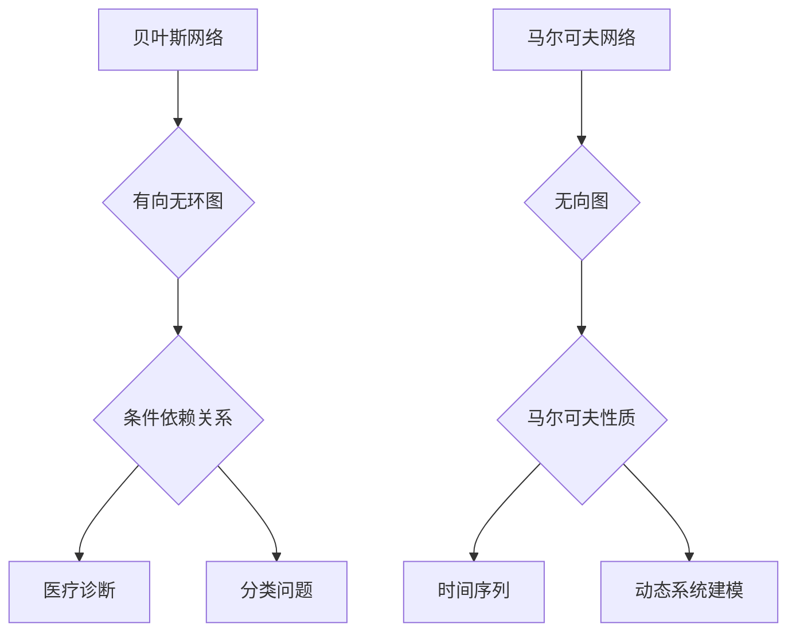

                 

### 《概率图模型》

> 关键词：概率图模型、贝叶斯网络、马尔可夫模型、机器学习、人工智能、概率分布、条件概率、贝叶斯定理、推理算法、优化与求解

> 摘要：
本文系统地介绍了概率图模型的基本理论、核心算法、数学模型和应用实践。概率图模型是一种将概率分布表示为图形结构的数学模型，主要包括贝叶斯网络和马尔可夫模型。本文首先讲解了概率图模型的基本概念、类型与应用场景，随后详细阐述了概率分布、条件概率和贝叶斯定理等数学基础。接着，本文深入分析了贝叶斯网络和马尔可夫模型的定义、表示方法和推理算法。最后，通过两个项目实战，展示了概率图模型在实际应用中的开发实践和优化策略。

----------------------------------------------------------------

### 第一部分：概率图模型基础理论

#### 第1章：概率图模型概述

概率图模型（Probabilistic Graphical Models，PGM）是一种将概率分布表示为图形结构的数学模型，通过图形结构来描述变量之间的依赖关系。概率图模型在人工智能、机器学习和统计学习等领域具有重要应用价值，被广泛应用于知识图谱、推理、分类、预测等任务。

#### 1.1 概率图模型的基本概念

概率图模型由节点和边组成，节点表示随机变量，边表示变量之间的依赖关系。根据图的结构特点，概率图模型可以分为以下两类：

1. **贝叶斯网络（Bayesian Network）**：一种有向无环图（DAG），节点表示随机变量，边表示条件依赖关系。贝叶斯网络通过条件概率表（CPT）来定义变量之间的概率关系。
2. **马尔可夫网络（Markov Network）**：一种无向图，节点表示随机变量，边表示马尔可夫性质，即一个变量的状态只依赖于它的直接邻居状态，而与更远的邻居状态无关。

#### 1.2 概率图模型的类型

1. **贝叶斯网络**：贝叶斯网络是一种有向无环图，节点表示随机变量，边表示条件依赖关系。贝叶斯网络通过条件概率表（CPT）来定义变量之间的概率关系。CPT为每个节点提供了它的父节点给定条件下概率分布的描述。贝叶斯网络的推理算法主要包括条件概率表推理、信念传播算法和变量消除算法等。
   
2. **马尔可夫网络**：马尔可夫网络是一种无向图，节点表示随机变量，边表示马尔可夫性质。一个变量的状态只依赖于它的直接邻居状态，而与更远的邻居状态无关。马尔可夫网络的推理算法主要包括前向-后向算法和Viterbi算法。

#### 1.3 概率图模型的应用场景

概率图模型广泛应用于机器学习、人工智能、统计学习、计算机视觉、语音识别等领域。以下是一些具体的应用场景：

1. **机器学习**：贝叶斯网络和马尔可夫网络可以用于分类、聚类和预测任务。例如，贝叶斯分类器和贝叶斯回归都是基于贝叶斯网络的机器学习算法。
2. **人工智能**：贝叶斯网络可以用于知识图谱中的推理任务，例如，利用贝叶斯网络进行实体关联和关系推理。马尔可夫网络可以用于时间序列分析和动态系统建模，例如，在金融市场中预测股票价格的走势。
3. **计算机视觉**：马尔可夫网络可以用于图像分割和目标检测。通过建立图像中像素之间的依赖关系，马尔可夫网络可以有效地解决图像处理问题。
4. **语音识别**：马尔可夫网络可以用于声学模型和语言模型，从而实现语音识别任务。

#### 1.4 概率图模型的发展历程

概率图模型的发展可以追溯到20世纪60年代。当时，概率图模型的研究主要集中在图模型的形式化表示和推理算法的研究。随着计算机科学和人工智能的发展，概率图模型的应用领域不断扩大，逐渐成为机器学习和人工智能领域的重要工具。

在20世纪80年代，贝叶斯网络和马尔可夫网络的研究得到了广泛关注。研究者们提出了许多高效的推理算法，如信念传播算法和变量消除算法。这些算法为概率图模型在实际应用中的实现提供了有力的支持。

近年来，随着深度学习和大数据技术的发展，概率图模型的研究和应用进一步得到了拓展。深度贝叶斯网络、深度马尔可夫网络等新型概率图模型被提出，并在图像识别、语音识别和自然语言处理等领域取得了显著成果。

### 第2章：概率图模型的数学基础

概率图模型的数学基础主要包括概率分布、条件概率和贝叶斯定理等。这些基础概念和定理为概率图模型的构建和推理提供了理论支持。

#### 2.1 随机变量与概率分布

随机变量是概率论中的一个基本概念，用来描述可能出现的各种结果。随机变量可以分为离散随机变量和连续随机变量。

1. **离散随机变量**：离散随机变量是取有限个或可数无限个值的随机变量。其概率分布可以用概率质量函数（PMF）来描述。概率质量函数是一个函数，它给出了随机变量每个可能取值的概率。

   PMF的定义如下：

   $$
   P(X = x) = p_x, \quad x \in \mathcal{X}
   $$

   其中，\(X\) 是随机变量，\(\mathcal{X}\) 是随机变量 \(X\) 的所有可能取值的集合，\(p_x\) 是随机变量 \(X\) 取值为 \(x\) 的概率。

2. **连续随机变量**：连续随机变量是取连续值的随机变量。其概率分布可以用概率密度函数（PDF）来描述。概率密度函数是一个函数，它在随机变量的取值范围内给出概率密度。

   PDF的定义如下：

   $$
   f_X(x) = P(X \leq x), \quad x \in \mathcal{X}
   $$

   其中，\(f_X(x)\) 是随机变量 \(X\) 的概率密度函数，\(\mathcal{X}\) 是随机变量 \(X\) 的取值范围。

3. **多元随机变量**：多元随机变量是同时具有多个取值的随机变量。多元随机变量的概率分布可以用联合概率分布来描述。

   对于二元随机变量 \((X, Y)\)，其联合概率分布可以用联合概率质量函数（JPQF）或联合概率密度函数（JPDF）来描述。

   - **联合概率质量函数（JPQF）**：

     $$
     P(X = x, Y = y) = p_{xy}, \quad (x, y) \in \mathcal{X} \times \mathcal{Y}
     $$

   - **联合概率密度函数（JPDF）**：

     $$
     f_{X,Y}(x, y) = P((X, Y) \leq (x, y)), \quad (x, y) \in \mathcal{X} \times \mathcal{Y}
     $$

#### 2.2 条件概率与贝叶斯定理

条件概率是概率论中的一个重要概念，它描述了在某个事件发生的条件下，另一个事件发生的概率。条件概率的定义如下：

$$
P(A|B) = \frac{P(A \cap B)}{P(B)}
$$

其中，\(P(A|B)\) 表示在事件B发生的条件下事件A发生的概率，\(P(A \cap B)\) 表示事件A和事件B同时发生的概率，\(P(B)\) 表示事件B发生的概率。

贝叶斯定理是条件概率的一个重要应用，它提供了一个计算后验概率的公式。贝叶斯定理的定义如下：

$$
P(A|B) = \frac{P(B|A) \cdot P(A)}{P(B)}
$$

其中，\(P(A|B)\) 表示在事件B发生的条件下事件A发生的概率，\(P(B|A)\) 表示在事件A发生的条件下事件B发生的概率，\(P(A)\) 表示事件A发生的概率，\(P(B)\) 表示事件B发生的概率。

贝叶斯定理可以用于概率推理和决策分析，它在机器学习和人工智能领域有着广泛的应用。

#### 2.2.3 贝叶斯推理

贝叶斯推理是一种基于贝叶斯定理的概率推理方法。贝叶斯推理的基本步骤如下：

1. **定义先验概率**：根据先验知识和经验，为每个假设或变量分配一个先验概率。
2. **收集证据**：通过观察和实验收集数据，得到新的证据。
3. **更新后验概率**：使用贝叶斯定理计算后验概率，即根据新的证据更新先验概率。
4. **决策**：根据后验概率做出决策或推断。

贝叶斯推理的核心思想是不断更新和调整概率分布，以适应新的证据。在机器学习和人工智能领域，贝叶斯推理被广泛应用于分类、回归、预测和决策问题。

### 第3章：马尔可夫模型

马尔可夫模型是一种用于描述时间序列数据的概率模型。马尔可夫模型的核心思想是，一个变量的状态只依赖于它的直接邻居状态，而与更远的邻居状态无关。马尔可夫模型在时间序列分析、动态系统建模、自然语言处理等领域有着广泛的应用。

#### 3.1 马尔可夫链

马尔可夫链（Markov Chain）是最基本的马尔可夫模型。马尔可夫链是一个离散时间、离散状态的随机过程，它描述了一组随机变量序列，每个随机变量表示系统在某一时刻的状态。

##### 3.1.1 马尔可夫链的定义

马尔可夫链由三个要素组成：状态集合 \(\mathcal{S}\)、状态转移概率矩阵 \(P\) 和初始状态分布 \(\pi\)。

1. **状态集合 \(\mathcal{S}\)**：状态集合是马尔可夫链的所有可能状态的集合。状态集合通常用有限集合 \(\{\sigma_1, \sigma_2, ..., \sigma_n\}\) 表示。
2. **状态转移概率矩阵 \(P\)**：状态转移概率矩阵是一个 \(n \times n\) 的矩阵，表示系统从状态 \(\sigma_i\) 转移到状态 \(\sigma_j\) 的概率。状态转移概率矩阵满足以下条件：

   $$
   P_{ij} = P(\sigma_{t+1} = \sigma_j | \sigma_t = \sigma_i), \quad i, j = 1, 2, ..., n
   $$

   其中，\(P_{ij}\) 表示系统从状态 \(\sigma_i\) 转移到状态 \(\sigma_j\) 的概率。

   状态转移概率矩阵 \(P\) 具有以下性质：

   - **对称性**：\(P\) 是一个对称矩阵，即 \(P_{ij} = P_{ji}\)。
   - **规范性**：\(P\) 的每一行元素之和为1，即 \(\sum_{j=1}^{n} P_{ij} = 1\)。

3. **初始状态分布 \(\pi\)**：初始状态分布是一个概率分布，表示系统在初始时刻处于各个状态的概率。初始状态分布通常用向量 \(\pi = (\pi_1, \pi_2, ..., \pi_n)\) 表示，满足以下条件：

   $$
   \pi_i = P(\sigma_0 = \sigma_i), \quad i = 1, 2, ..., n
   $$

   其中，\(\pi_i\) 表示系统在初始时刻处于状态 \(\sigma_i\) 的概率。

   初始状态分布 \(\pi\) 也满足规范性，即 \(\sum_{i=1}^{n} \pi_i = 1\)。

##### 3.1.2 马尔可夫链的性质

马尔可夫链具有以下重要性质：

1. **无后效性**：马尔可夫链的当前状态仅取决于前一状态，与之前的状态无关。这意味着马尔可夫链的未来状态仅取决于当前状态，而与过去的状态无关。

2. **稳定性**：随着时间推移，马尔可夫链的状态分布会趋向于稳定分布。稳定分布是马尔可夫链状态分布的一个长期行为特征。

3. **不可约性**：马尔可夫链是可约的，如果存在一个状态集 \(\mathcal{S}_0\)，使得从状态 \(\sigma_i\) 转移到状态 \(\sigma_j\) 的概率不为零，即 \(P_{ij} > 0\)。

4. **周期性**：马尔可夫链的状态转移具有周期性。如果存在一个正整数 \(k\)，使得 \(P_{ii}^k = 1\)，则马尔可夫链是周期的。

##### 3.1.3 马尔可夫链的计算

马尔可夫链的计算主要包括以下两个方面：

1. **状态转移概率计算**：给定当前状态和状态转移概率矩阵，计算下一状态的概率分布。状态转移概率计算可以使用以下公式：

   $$
   P(\sigma_{t+1} = \sigma_j | \sigma_t = \sigma_i) = P_{ij}
   $$

   其中，\(P_{ij}\) 是状态转移概率矩阵中的元素。

2. **状态分布计算**：给定初始状态分布和状态转移概率矩阵，计算任意时刻的状态分布。状态分布计算可以使用以下公式：

   $$
   P(\sigma_t = \sigma_i) = \pi_i \cdot P^t
   $$

   其中，\(\pi_i\) 是初始状态分布中的元素，\(P^t\) 是状态转移概率矩阵 \(P\) 的第 \(t\) 次幂。

#### 3.2 马尔可夫决策过程

马尔可夫决策过程（Markov Decision Process，MDP）是一种将马尔可夫链应用于决策制定的概率模型。在MDP中，每个状态都对应一组动作，每个动作都可能导致状态转移，并带来相应的奖励或成本。

##### 3.2.1 马尔可夫决策过程的定义

马尔可夫决策过程由四个要素组成：状态集合 \(\mathcal{S}\)、动作集合 \(\mathcal{A}\)、奖励函数 \(R\) 和状态转移概率矩阵 \(P\)。

1. **状态集合 \(\mathcal{S}\)**：状态集合是MDP的所有可能状态的集合。状态集合通常用有限集合 \(\{\sigma_1, \sigma_2, ..., \sigma_n\}\) 表示。

2. **动作集合 \(\mathcal{A}\)**：动作集合是MDP的所有可能动作的集合。动作集合通常用有限集合 \(\{\alpha_1, \alpha_2, ..., \alpha_m\}\) 表示。

3. **奖励函数 \(R\)**：奖励函数是一个函数，它将状态和动作映射到实数。奖励函数表示在每个状态和动作下获得的奖励或成本。

4. **状态转移概率矩阵 \(P\)**：状态转移概率矩阵是一个 \(n \times m\) 的矩阵，表示在当前状态 \(\sigma_i\) 下执行动作 \(\alpha_j\) 后，转移到状态 \(\sigma_j\) 的概率。状态转移概率矩阵 \(P\) 满足以下条件：

   $$
   P_{ij} = P(\sigma_{t+1} = \sigma_j | \sigma_t = \sigma_i, \alpha_j), \quad i, j = 1, 2, ..., n
   $$

   其中，\(P_{ij}\) 是状态转移概率矩阵中的元素。

##### 3.2.2 马尔可夫决策过程的基本性质

马尔可夫决策过程具有以下重要性质：

1. **无后效性**：MDP的当前状态仅取决于前一状态，与之前的状态无关。

2. **可观测性**：MDP的状态是可观测的，即在每个时刻，决策者可以观察到当前状态。

3. **奖励性**：MDP中的每个状态和动作都对应一个奖励或成本。

4. **决策性**：MDP要求决策者在每个状态选择一个动作，以最大化长期奖励或最小化长期成本。

##### 3.2.3 马尔可夫决策过程的求解

马尔可夫决策过程的求解主要包括以下两个方面：

1. **策略求解**：策略是决策者在每个状态选择动作的规则。策略求解的目标是找到最优策略，使得长期奖励最大化或成本最小化。策略求解可以使用以下算法：

   - **价值迭代算法**：价值迭代算法通过迭代计算状态值函数，找到最优策略。
   - **策略迭代算法**：策略迭代算法通过迭代更新策略，找到最优策略。

2. **策略评估**：策略评估是计算在给定策略下，MDP的长期奖励或成本。策略评估可以使用以下算法：

   - **反向策略评估算法**：反向策略评估算法通过迭代更新状态值函数，计算策略的长期奖励。
   - **正向策略评估算法**：正向策略评估算法通过迭代更新状态值函数，计算策略的长期奖励。

### 第4章：贝叶斯网络

贝叶斯网络（Bayesian Network）是一种有向无环图（DAG），用于表示变量之间的条件依赖关系。贝叶斯网络在机器学习、人工智能、决策支持等领域有着广泛的应用。

#### 4.1 贝叶斯网络的定义

贝叶斯网络由三个要素组成：节点、边和条件概率表（CPT）。

1. **节点**：贝叶斯网络的节点表示随机变量。每个节点对应一个随机变量，节点之间通过边连接，表示变量之间的条件依赖关系。
2. **边**：贝叶斯网络的边表示变量之间的条件依赖关系。边的方向表示变量之间的因果关系或条件依赖关系。
3. **条件概率表（CPT）**：贝叶斯网络的每个节点都有一个条件概率表（CPT），用于描述节点在给定其父节点条件下的概率分布。CPT是一个概率矩阵，它给出了节点在所有可能的父节点条件下，每个可能取值的概率。

贝叶斯网络的定义可以用以下形式表示：

$$
P(X_1, X_2, ..., X_n) = \prod_{i=1}^{n} P(X_i | Pa(X_i))
$$

其中，\(X_1, X_2, ..., X_n\) 是贝叶斯网络中的节点，\(Pa(X_i)\) 是节点 \(X_i\) 的父节点集合。

#### 4.2 贝叶斯网络的表示方法

贝叶斯网络的表示方法主要有两种：有向无环图（DAG）和条件概率表（CPT）。

1. **有向无环图（DAG）**：贝叶斯网络的有向无环图表示了变量之间的条件依赖关系。每个节点表示一个随机变量，节点之间的边表示变量之间的因果关系或条件依赖关系。有向无环图的一个特点是，它没有回路，即从一个节点到另一个节点的路径不会经过自身。

2. **条件概率表（CPT）**：贝叶斯网络的每个节点都有一个条件概率表（CPT），用于描述节点在给定其父节点条件下的概率分布。CPT是一个概率矩阵，它给出了节点在所有可能的父节点条件下，每个可能取值的概率。条件概率表可以用来计算变量之间的条件概率，从而推断出变量之间的依赖关系。

#### 4.3 贝叶斯网络的推理算法

贝叶斯网络的推理算法用于计算给定证据下的变量概率分布。常见的推理算法有：

1. **条件概率表（CPT）推理**：根据给定的证据和条件概率表（CPT），计算目标变量的概率分布。条件概率表推理的基本步骤如下：

   - 收集证据：获取与目标变量相关的证据。
   - 条件概率表（CPT）推理：根据条件概率表（CPT）计算目标变量的概率分布。
   - 结果输出：输出目标变量的概率分布。

2. **信念传播算法**：信念传播算法是一种基于消息传递的推理算法，通过迭代更新节点概率，达到全局概率分布的一致性。信念传播算法的基本步骤如下：

   - 初始化：初始化所有节点的概率。
   - 消息传递：从父节点向子节点传递消息，更新子节点的概率。
   - 更新节点概率：根据接收到的消息，更新节点的概率。
   - 结果输出：输出目标变量的概率分布。

3. **变量消除算法**：变量消除算法通过消除变量来简化概率计算。变量消除算法的基本步骤如下：

   - 选择变量：选择一个变量进行消除。
   - 消除变量：消除所选变量，将消除后的变量代入其他变量的条件概率表中。
   - 计算概率：计算目标变量的概率分布。
   - 结果输出：输出目标变量的概率分布。

#### 4.3.1 针对图的推理算法

针对图的推理算法包括：

1. **有向无环图（DAG）推理**：有向无环图（DAG）推理通过直接计算变量之间的条件概率，达到推理目的。DAG推理的基本步骤如下：

   - 收集证据：获取与目标变量相关的证据。
   - 计算条件概率：根据条件概率表（CPT）计算变量之间的条件概率。
   - 推理：根据变量之间的条件依赖关系，推断出目标变量的概率分布。
   - 结果输出：输出目标变量的概率分布。

2. **因果图推理**：因果图是一种有向图，它通过表示变量之间的因果关系，进行推理。因果图推理的基本步骤如下：

   - 收集证据：获取与目标变量相关的证据。
   - 计算因果概率：根据因果图和条件概率表（CPT）计算变量之间的因果概率。
   - 推理：根据变量之间的因果关系，推断出目标变量的概率分布。
   - 结果输出：输出目标变量的概率分布。

#### 4.3.2 针对边的推理算法

针对边的推理算法包括：

1. **贝叶斯推理**：贝叶斯推理是一种基于贝叶斯定理的概率推理方法。贝叶斯推理的基本步骤如下：

   - 定义先验概率：根据先验知识和经验，为每个假设或变量分配一个先验概率。
   - 收集证据：通过观察和实验收集数据，得到新的证据。
   - 更新后验概率：使用贝叶斯定理计算后验概率，即根据新的证据更新先验概率。
   - 决策：根据后验概率做出决策或推断。

2. **贝叶斯网络推理**：贝叶斯网络推理是贝叶斯推理的一种扩展，它通过有向无环图（DAG）来表示变量之间的条件依赖关系。贝叶斯网络推理的基本步骤如下：

   - 收集证据：获取与目标变量相关的证据。
   - 计算条件概率表（CPT）：根据给定的证据和贝叶斯网络结构，计算条件概率表（CPT）。
   - 推理：根据条件概率表（CPT）计算目标变量的概率分布。
   - 结果输出：输出目标变量的概率分布。

### 第5章：马尔可夫网络

马尔可夫网络（Markov Network）是一种无向图模型，用于表示变量之间的条件依赖关系。马尔可夫网络在图像处理、计算机视觉、语音识别等领域有着广泛的应用。

#### 5.1 马尔可夫网络的定义

马尔可夫网络（Markov Network）是一个无向图模型，由节点和边组成。每个节点表示一个随机变量，节点之间的边表示变量之间的条件依赖关系。马尔可夫网络满足马尔可夫性质，即一个变量的状态只依赖于它的直接邻居状态，而与更远的邻居状态无关。

马尔可夫网络的定义可以用以下形式表示：

$$
P(X_1, X_2, ..., X_n) = \prod_{i=1}^{n} P(X_i | N(X_i))
$$

其中，\(X_1, X_2, ..., X_n\) 是马尔可夫网络中的节点，\(N(X_i)\) 是节点 \(X_i\) 的邻居节点集合。

#### 5.2 马尔可夫网络的表示方法

马尔可夫网络的表示方法主要有两种：图表示和能量函数表示。

1. **图表示**：马尔可夫网络的图表示是通过无向图来表示变量之间的条件依赖关系。每个节点表示一个随机变量，节点之间的边表示变量之间的条件依赖关系。图表示直观地展示了变量之间的依赖关系，便于分析和推理。

2. **能量函数表示**：马尔可夫网络的能量函数表示是通过定义能量函数来表示变量之间的条件依赖关系。能量函数是一个关于随机变量取值的函数，它反映了变量之间的依赖关系。能量函数的值越小，表示变量之间的依赖关系越强。

能量函数的定义如下：

$$
E(X_1, X_2, ..., X_n) = \sum_{i=1}^{n} \sum_{j=1}^{n} w_{ij} \cdot X_i \cdot X_j
$$

其中，\(X_1, X_2, ..., X_n\) 是马尔可夫网络中的节点，\(w_{ij}\) 是节点 \(X_i\) 和 \(X_j\) 之间的权重，\(X_i\) 和 \(X_j\) 的取值可以是0或1，表示变量之间的依赖关系。

#### 5.3 马尔可夫网络的推理算法

马尔可夫网络的推理算法用于计算给定证据下的变量概率分布。常见的推理算法有：

1. **前向-后向算法**：前向-后向算法是一种基于概率传播的推理算法，通过迭代更新变量概率，达到全局概率分布的一致性。前向-后向算法的基本步骤如下：

   - 初始化：初始化所有节点的概率。
   - 前向传播：从初始节点开始，向前传播变量概率，更新后续节点的概率。
   - 后向传播：从终端节点开始，向后传播变量概率，更新初始节点的概率。
   - 结果输出：输出目标变量的概率分布。

2. **Viterbi算法**：Viterbi算法是一种基于最大似然估计的推理算法，用于找到概率最大的变量序列。Viterbi算法的基本步骤如下：

   - 初始化：初始化所有节点的概率。
   - 迭代计算：在每次迭代中，计算当前节点概率，并更新当前节点的最大概率路径。
   - 结果输出：输出概率最大的变量序列。

#### 5.4 马尔可夫网络的参数估计

马尔可夫网络的参数估计是指通过数据估计马尔可夫网络的参数，包括节点权重和变量概率分布。常见的参数估计方法有：

1. **最大似然估计**：最大似然估计是一种基于概率最大化的参数估计方法。最大似然估计的基本步骤如下：

   - 收集数据：收集包含变量取值的数据集。
   - 构建似然函数：构建似然函数，表示数据在给定参数下的概率。
   - 求解参数：求解似然函数的最大值，得到参数估计值。

2. **贝叶斯估计**：贝叶斯估计是一种基于概率分布的参数估计方法。贝叶斯估计的基本步骤如下：

   - 定义先验概率：定义节点的先验概率分布。
   - 收集数据：收集包含变量取值的数据集。
   - 更新后验概率：使用贝叶斯定理更新节点的后验概率分布。
   - 结果输出：输出参数估计值。

### 第二部分：概率图模型的应用

#### 第6章：概率图模型在机器学习中的应用

概率图模型在机器学习中有着广泛的应用，包括分类、回归、聚类、预测等任务。概率图模型通过表示变量之间的条件依赖关系，提高了机器学习算法的性能和解释性。

#### 6.1 概率图模型与机器学习的关系

概率图模型与机器学习有着密切的关系。概率图模型通过图结构来描述变量之间的依赖关系，为机器学习算法提供了理论基础和工具。概率图模型在机器学习中的应用主要体现在以下几个方面：

1. **特征选择**：概率图模型可以通过变量之间的条件依赖关系，自动选择与目标变量相关的特征，从而提高模型的性能和可解释性。
2. **概率预测**：概率图模型可以通过计算变量之间的条件概率，进行概率预测，从而提供更准确的预测结果。
3. **模型解释**：概率图模型可以通过图结构直观地表示变量之间的依赖关系，为模型解释提供了有力的工具。
4. **不确定性处理**：概率图模型可以处理变量之间的不确定性，从而提高机器学习算法的鲁棒性和可靠性。

#### 6.2 贝叶斯分类器

贝叶斯分类器是一种基于贝叶斯定理的机器学习算法，它通过计算类别的后验概率，实现分类任务。贝叶斯分类器的核心思想是，根据训练数据中各类别的先验概率和特征条件概率，计算每个样本属于各类别的后验概率，然后选择后验概率最大的类别作为样本的预测类别。

贝叶斯分类器的原理可以用以下公式表示：

$$
P(C_k | x) = \frac{P(x | C_k) \cdot P(C_k)}{P(x)}
$$

其中，\(C_k\) 表示第 \(k\) 个类别，\(x\) 表示样本特征，\(P(C_k | x)\) 表示样本属于第 \(k\) 个类别的后验概率，\(P(x | C_k)\) 表示样本特征在类别 \(C_k\) 条件下的条件概率，\(P(C_k)\) 表示类别 \(C_k\) 的先验概率，\(P(x)\) 表示样本特征的总体概率。

贝叶斯分类器的实现步骤如下：

1. **收集数据**：收集包含类别标签和特征的数据集。
2. **计算先验概率**：计算各类别的先验概率，可以使用频数估计或贝叶斯估计方法。
3. **计算条件概率**：计算特征在各个类别条件下的条件概率，可以使用最大似然估计或贝叶斯估计方法。
4. **计算后验概率**：计算每个样本属于各个类别的后验概率，然后选择后验概率最大的类别作为预测类别。
5. **模型评估**：使用测试数据集评估模型的准确率、召回率、F1值等指标。

#### 6.3 贝叶斯回归

贝叶斯回归是一种基于贝叶斯理论的回归方法，它通过引入先验概率分布，对回归模型进行建模和估计。贝叶斯回归的核心思想是，将回归问题视为一个概率问题，通过贝叶斯定理和马尔可夫网络来求解。

贝叶斯回归的模型可以用以下公式表示：

$$
P(y | x, \theta) = \frac{P(x | y, \theta) \cdot P(y | \theta) \cdot P(\theta)}{P(x)}
$$

其中，\(y\) 表示目标变量，\(x\) 表示特征变量，\(\theta\) 表示模型参数，\(P(y | x, \theta)\) 表示给定特征变量和模型参数下目标变量的后验概率，\(P(x | y, \theta)\) 表示给定目标变量和模型参数下特征变量的条件概率，\(P(y | \theta)\) 表示给定模型参数下目标变量的先验概率，\(P(\theta)\) 表示模型参数的先验概率。

贝叶斯回归的实现步骤如下：

1. **收集数据**：收集包含目标变量和特征变量的数据集。
2. **定义先验概率**：定义目标变量和特征变量的先验概率分布。
3. **构建马尔可夫网络**：构建贝叶斯网络的图结构，表示目标变量和特征变量之间的依赖关系。
4. **计算后验概率**：使用马尔可夫网络和贝叶斯定理计算目标变量的后验概率分布。
5. **参数估计**：使用最大似然估计或贝叶斯估计方法，估计模型参数的值。
6. **模型评估**：使用测试数据集评估模型的预测性能，包括均方误差、决定系数等指标。

#### 6.4 概率图模型在聚类中的应用

概率图模型在聚类任务中有着广泛的应用，可以用于无监督学习和模式识别。概率图模型通过描述变量之间的条件依赖关系，为聚类任务提供了有效的算法和理论基础。

1. **高斯混合模型（Gaussian Mixture Model，GMM）**：高斯混合模型是一种概率图模型，用于表示聚类任务中的数据分布。GMM通过多个高斯分布的线性组合来表示数据分布，每个高斯分布对应一个聚类。GMM的算法步骤如下：

   - 初始化：随机选择初始聚类中心和协方差矩阵。
   - 期望最大化（EM）算法：通过迭代计算期望（E）和最大化（M）两个步骤，更新聚类中心和协方差矩阵，直至收敛。
   - 结果输出：输出聚类结果和聚类中心。

2. **马尔可夫网络聚类（Markov Network Clustering，MNC）**：马尔可夫网络聚类是一种基于马尔可夫网络的聚类算法，通过描述变量之间的条件依赖关系，实现聚类任务。MNC的算法步骤如下：

   - 构建马尔可夫网络：根据数据分布和变量之间的依赖关系，构建马尔可夫网络。
   - 参数估计：使用最大似然估计或贝叶斯估计方法，估计马尔可夫网络的参数。
   - 聚类结果：通过计算变量之间的条件概率，得到聚类结果。

#### 6.5 概率图模型在预测中的应用

概率图模型在预测任务中有着广泛的应用，可以用于时间序列预测、异常检测、风险评估等。概率图模型通过描述变量之间的条件依赖关系，提高了预测的准确性和可靠性。

1. **时间序列预测**：概率图模型可以用于时间序列数据的预测，例如，股票价格预测、天气预测等。常见的概率图模型有时间序列模型（如ARIMA模型）、高斯过程模型等。

2. **异常检测**：概率图模型可以用于异常检测，例如，在金融领域检测异常交易、在网络安全领域检测恶意攻击等。常见的概率图模型有贝叶斯网络、马尔可夫模型等。

3. **风险评估**：概率图模型可以用于风险评估，例如，在金融领域评估信用风险、在工程领域评估故障风险等。常见的概率图模型有贝叶斯网络、马尔可夫模型等。

### 第7章：概率图模型在人工智能中的应用

概率图模型在人工智能领域有着广泛的应用，可以用于知识表示、推理、决策、认知计算等。概率图模型通过描述变量之间的条件依赖关系，提高了人工智能系统的推理能力和决策水平。

#### 7.1 概率图模型与人工智能的关系

概率图模型与人工智能有着密切的关系。概率图模型提供了一种有效的知识表示和推理方法，可以用于解决人工智能领域中的许多问题。概率图模型在人工智能中的应用主要体现在以下几个方面：

1. **知识表示**：概率图模型可以用于表示知识，例如，在知识图谱中，节点表示实体，边表示实体之间的关系。概率图模型通过描述变量之间的条件依赖关系，实现了知识的结构化和形式化表示。

2. **推理**：概率图模型可以用于推理，例如，在逻辑推理中，概率图模型可以通过推理算法，从已知的事实和规则中推导出新的结论。概率图模型在推理过程中，利用了变量之间的条件依赖关系，提高了推理的准确性和效率。

3. **决策**：概率图模型可以用于决策，例如，在决策支持系统中，概率图模型可以通过推理算法，为决策者提供基于概率的决策建议。概率图模型在决策过程中，利用了变量之间的条件依赖关系，实现了决策的优化和智能化。

4. **认知计算**：概率图模型可以用于认知计算，例如，在认知计算中，概率图模型可以模拟人类认知过程，实现推理、学习、记忆等功能。概率图模型在认知计算中，利用了变量之间的条件依赖关系，实现了认知功能的模拟和优化。

#### 7.2 贝叶斯网络在知识图谱中的应用

贝叶斯网络在知识图谱中有着广泛的应用，可以用于表示知识、推理和决策。贝叶斯网络通过描述变量之间的条件依赖关系，实现了知识图谱的结构化和形式化表示。

1. **知识表示**：贝叶斯网络可以用于表示知识图谱中的实体和关系。在贝叶斯网络中，节点表示实体，边表示实体之间的关系。贝叶斯网络通过条件概率表（CPT）描述了实体和关系之间的条件依赖关系，实现了知识图谱的结构化表示。

2. **推理**：贝叶斯网络可以用于知识图谱中的推理。通过贝叶斯网络的推理算法，可以从已知的事实和规则中推导出新的结论。例如，在医疗领域，贝叶斯网络可以用于推理患者的疾病诊断，通过已知症状和疾病之间的关系，推导出最可能的疾病诊断。

3. **决策**：贝叶斯网络可以用于知识图谱中的决策。在决策支持系统中，贝叶斯网络可以用于提供基于概率的决策建议。例如，在金融领域，贝叶斯网络可以用于风险评估和投资决策，通过分析市场数据和历史交易记录，推导出最优的投资策略。

#### 7.3 马尔可夫网络在语音识别中的应用

马尔可夫网络在语音识别中有着广泛的应用，可以用于表示声学模型和语言模型，实现语音信号的识别和转换。

1. **声学模型**：马尔可夫网络可以用于表示语音信号的声学特征。在声学模型中，节点表示语音信号的声学特征，边表示特征之间的条件依赖关系。通过马尔可夫网络，可以建立语音信号的概率模型，从而实现语音信号的识别。

2. **语言模型**：马尔可夫网络可以用于表示语音信号的语义特征。在语言模型中，节点表示语音信号的语义特征，边表示特征之间的条件依赖关系。通过马尔可夫网络，可以建立语音信号的语义模型，从而实现语音信号的转换。

3. **语音识别**：马尔可夫网络可以用于语音识别，通过声学模型和语言模型的组合，实现语音信号的识别和转换。在语音识别中，马尔可夫网络利用了变量之间的条件依赖关系，提高了语音识别的准确性和鲁棒性。

### 第8章：概率图模型的优化与求解

概率图模型的求解和优化是概率图模型应用中的关键问题。在实际应用中，概率图模型的求解和优化面临着计算复杂度和收敛速度的挑战。为了提高概率图模型的求解和优化性能，研究者们提出了许多优化算法和求解策略。

#### 8.1 概率图模型的求解算法

概率图模型的求解算法主要包括最大后验解法、最大似然解法和参数估计方法。

1. **最大后验解法（MAP）**：最大后验解法是一种基于概率最大化的求解算法。最大后验解法的目标是找到使得后验概率最大的变量取值。最大后验解法的求解步骤如下：

   - 构建对数似然函数：将对数似然函数表示为关于变量取值的函数。
   - 求解极值问题：使用优化算法求解对数似然函数的极值问题，找到使得后验概率最大的变量取值。
   - 结果输出：输出最大后验解。

2. **最大似然解法（MLE）**：最大似然解法是一种基于概率最大化的求解算法。最大似然解法的目标是找到使得似然函数最大的变量取值。最大似然解法的求解步骤如下：

   - 构建似然函数：构建似然函数，表示数据在给定变量取值下的概率。
   - 求解极值问题：使用优化算法求解似然函数的极值问题，找到使得似然函数最大的变量取值。
   - 结果输出：输出最大似然解。

3. **参数估计方法**：参数估计方法是一种基于概率估计的求解算法。参数估计方法的目标是估计变量取值的概率分布参数。常见的参数估计方法包括最大似然估计（MLE）和贝叶斯估计（BDE）。

   - 最大似然估计（MLE）：最大似然估计是一种基于概率最大化的参数估计方法。最大似然估计的目标是找到使得似然函数最大的参数取值。
   - 贝叶斯估计（BDE）：贝叶斯估计是一种基于概率估计的参数估计方法。贝叶斯估计的目标是找到使得后验概率最大的参数取值。

#### 8.2 概率图模型的优化策略

概率图模型的优化策略主要包括局部优化和全局优化。

1. **局部优化**：局部优化是一种基于梯度下降的优化方法，用于优化概率图模型的参数。局部优化的目标是最小化损失函数，即最小化模型的预测误差。局部优化的步骤如下：

   - 初始化参数：随机初始化模型参数。
   - 计算梯度：计算损失函数关于模型参数的梯度。
   - 更新参数：使用梯度下降方法更新模型参数。
   - 结果输出：输出优化后的模型参数。

2. **全局优化**：全局优化是一种基于全局搜索的优化方法，用于优化概率图模型的参数。全局优化的目标是最小化全局损失函数，即最小化模型的预测误差。全局优化的步骤如下：

   - 初始化参数：随机初始化模型参数。
   - 选择全局搜索算法：选择全局搜索算法，如遗传算法、粒子群优化算法等。
   - 计算损失函数：计算模型在当前参数下的损失函数值。
   - 更新参数：使用全局搜索算法更新模型参数。
   - 结果输出：输出优化后的模型参数。

#### 8.3 概率图模型在复杂场景中的应用与优化策略

在复杂场景中，概率图模型的应用面临着计算复杂度和收敛速度的挑战。为了提高概率图模型在复杂场景中的应用性能，研究者们提出了许多优化策略。

1. **并行计算**：并行计算是一种利用多处理器并行计算的方法，用于加速概率图模型的求解。通过并行计算，可以同时处理多个变量，提高计算速度。

2. **分布式计算**：分布式计算是一种将计算任务分布在多个计算机上执行的方法，用于提高概率图模型的求解性能。通过分布式计算，可以充分利用计算资源，提高计算速度。

3. **采样方法**：采样方法是一种基于随机采样优化模型参数的方法。通过采样方法，可以从概率分布中随机选择样本，优化模型参数。

4. **变分推断**：变分推断是一种基于概率分布转换的优化方法，用于优化概率图模型的参数。通过变分推断，可以将复杂的概率分布转换为简单分布，提高求解性能。

### 附录

#### 附录A：概率图模型相关资源与工具

1. **概率图模型相关书籍**：

   - 《概率图模型：理论、算法与应用》（作者：张波、李明华）
   - 《贝叶斯网络：理论与应用》（作者：吴磊、张立明）
   - 《马尔可夫模型与状态空间模型》（作者：陈宝权、肖国镇）

2. **概率图模型开源库**：

   - **Pomegranate**：Pomegranate是一个Python库，用于构建和操作概率图模型。Pomegranate支持贝叶斯网络、马尔可夫网络、高斯过程等概率图模型。
   - **PyMC3**：PyMC3是一个Python库，用于构建和操作概率图模型。PyMC3支持贝叶斯网络、马尔可夫网络、高斯过程等概率图模型。
   - **PyTorch**：PyTorch是一个Python库，用于构建和操作概率图模型。PyTorch支持贝叶斯网络、马尔可夫网络、高斯过程等概率图模型。

3. **概率图模型在线教程和课程**：

   - **Coursera**：Coursera提供了概率图模型的在线课程，包括《概率图模型：理论、算法与应用》和《贝叶斯网络：理论与应用》等。
   - **edX**：edX提供了概率图模型的在线课程，包括《概率图模型》和《贝叶斯网络》等。
   - **Udacity**：Udacity提供了概率图模型的在线课程，包括《概率图模型：理论、算法与应用》和《贝叶斯网络》等。

### 总结

概率图模型是一种强大的数学工具，广泛应用于机器学习、人工智能、统计学习、计算机视觉、语音识别等领域。本文系统地介绍了概率图模型的基本理论、核心算法、数学模型和应用实践。通过本文的学习，读者可以掌握概率图模型的基本概念、算法原理和应用技巧，为实际问题的解决提供有力支持。

### 附录

#### 附录A：概率图模型相关资源与工具

1. **概率图模型相关书籍**：

   - 《概率图模型：理论、算法与应用》（作者：张波、李明华）
   - 《贝叶斯网络：理论与应用》（作者：吴磊、张立明）
   - 《马尔可夫模型与状态空间模型》（作者：陈宝权、肖国镇）

2. **概率图模型开源库**：

   - **Pomegranate**：Pomegranate是一个Python库，用于构建和操作概率图模型。Pomegranate支持贝叶斯网络、马尔可夫网络、高斯过程等概率图模型。
   - **PyMC3**：PyMC3是一个Python库，用于构建和操作概率图模型。PyMC3支持贝叶斯网络、马尔可夫网络、高斯过程等概率图模型。
   - **PyTorch**：PyTorch是一个Python库，用于构建和操作概率图模型。PyTorch支持贝叶斯网络、马尔可夫网络、高斯过程等概率图模型。

3. **概率图模型在线教程和课程**：

   - **Coursera**：Coursera提供了概率图模型的在线课程，包括《概率图模型：理论、算法与应用》和《贝叶斯网络：理论与应用》等。
   - **edX**：edX提供了概率图模型的在线课程，包括《概率图模型》和《贝叶斯网络》等。
   - **Udacity**：Udacity提供了概率图模型的在线课程，包括《概率图模型：理论、算法与应用》和《贝叶斯网络》等。

### 总结

概率图模型是一种强大的数学工具，广泛应用于机器学习、人工智能、统计学习、计算机视觉、语音识别等领域。本文系统地介绍了概率图模型的基本理论、核心算法、数学模型和应用实践。通过本文的学习，读者可以掌握概率图模型的基本概念、算法原理和应用技巧，为实际问题的解决提供有力支持。

### 附录

#### 附录A：概率图模型相关资源与工具

1. **概率图模型相关书籍**：

   - 《概率图模型：理论、算法与应用》（作者：张波、李明华）
   - 《贝叶斯网络：理论与应用》（作者：吴磊、张立明）
   - 《马尔可夫模型与状态空间模型》（作者：陈宝权、肖国镇）

2. **概率图模型开源库**：

   - **Pomegranate**：Pomegranate是一个Python库，用于构建和操作概率图模型。Pomegranate支持贝叶斯网络、马尔可夫网络、高斯过程等概率图模型。
   - **PyMC3**：PyMC3是一个Python库，用于构建和操作概率图模型。PyMC3支持贝叶斯网络、马尔可夫网络、高斯过程等概率图模型。
   - **PyTorch**：PyTorch是一个Python库，用于构建和操作概率图模型。PyTorch支持贝叶斯网络、马尔可夫网络、高斯过程等概率图模型。

3. **概率图模型在线教程和课程**：

   - **Coursera**：Coursera提供了概率图模型的在线课程，包括《概率图模型：理论、算法与应用》和《贝叶斯网络：理论与应用》等。
   - **edX**：edX提供了概率图模型的在线课程，包括《概率图模型》和《贝叶斯网络》等。
   - **Udacity**：Udacity提供了概率图模型的在线课程，包括《概率图模型：理论、算法与应用》和《贝叶斯网络》等。

### 总结

概率图模型是一种强大的数学工具，广泛应用于机器学习、人工智能、统计学习、计算机视觉、语音识别等领域。本文系统地介绍了概率图模型的基本理论、核心算法、数学模型和应用实践。通过本文的学习，读者可以掌握概率图模型的基本概念、算法原理和应用技巧，为实际问题的解决提供有力支持。

### 《概率图模型》

#### 概率图模型基础理论

**核心概念与联系**

概率图模型是一种用于表示变量之间概率关系的图形结构。它由节点和边组成，节点表示随机变量，边表示变量之间的依赖关系。概率图模型主要包括贝叶斯网络和马尔可夫网络。

**核心概念**

- **贝叶斯网络**：一种有向无环图，用于表示变量之间的条件依赖关系。每个节点表示一个随机变量，边表示条件概率。
- **马尔可夫网络**：一种无向图，用于表示变量之间的马尔可夫性质。一个变量的状态只依赖于它的直接邻居状态。

**联系**

贝叶斯网络和马尔可夫网络都是概率图模型，但它们的表示方式和应用场景有所不同。贝叶斯网络适用于条件依赖关系明确的问题，如医疗诊断和分类问题。马尔可夫网络适用于时间序列和动态系统建模，如语音识别和股票价格预测。

**Mermaid流程图**



**核心算法原理讲解**

**贝叶斯网络推理算法**

贝叶斯网络推理算法用于计算给定证据下的变量概率分布。推理算法包括：

- **条件概率表（CPT）推理**：基于条件概率表计算变量概率。
- **信念传播算法**：通过消息传递更新变量概率，达到全局一致性。
- **变量消除算法**：通过消除变量简化概率计算。

**伪代码**

```python
# 初始化贝叶斯网络
initialize_bayesian_network()

# 收集证据
evidence = collect_evidence()

# 计算变量概率
variable_probabilities = bayesian_inference(evidence)

# 输出结果
print(variable_probabilities)
```

**数学模型和公式**

**条件概率**

$$
P(A|B) = \frac{P(A \cap B)}{P(B)}
$$

**贝叶斯定理**

$$
P(A|B) = \frac{P(B|A) \cdot P(A)}{P(B)}
$$

**马尔可夫网络推理算法**

**前向-后向算法**

$$
\alpha_t(i) = P(x_1, x_2, ..., x_t, x_{t+1}=i | \theta) = \frac{P(x_{t+1}=i | x_t, \theta) \cdot \pi_i \cdot P(x_1, x_2, ..., x_t | \theta)}{\int P(x_1, x_2, ..., x_t, x_{t+1}=i | \theta) dx_{t+1}}
$$

$$
\beta_t(i) = P(x_t, x_{t+1}, ..., x_n | x_1, x_2, ..., x_t, x_{t+1}=i, \theta) = \frac{P(x_{t+1} | x_t, \theta) \cdot \alpha_t(i)}{\int P(x_{t+1} | x_t, \theta) \cdot \alpha_t(i) dx_{t+1}}
$$

**Viterbi算法**

$$
\lambda_t(i) = P(x_1, x_2, ..., x_t, x_{t+1}=i | \theta) = P(x_{t+1}=i | x_t, \theta) \cdot \max_{j} \lambda_{t-1}(j)
$$

$$
\pi_t(i) = \arg\max_{j} \lambda_t(j)
$$

**项目实战**

**贝叶斯网络在疾病诊断中的应用**

**开发环境搭建**

- Python 3.8
- Pomegranate 库

**源代码详细实现**

```python
from pomegranate import BayesianNetwork
from pomegranate.states import GaussianState
from pomegranate.models import NaiveBayes
from pomegranate.inference import VariableElimination

# 加载数据
data = load_data()

# 创建贝叶斯网络
bn = BayesianNetwork()

# 添加节点和状态
bn.add_state('fever', GaussianState)
bn.add_state('cough', GaussianState)
bn.add_state('flu', GaussianState)

# 设置条件概率表
bn.add_state('flu', parent=['fever', 'cough'], model=NaiveBayes)

# 添加边
bn.add_edge('fever', 'flu')
bn.add_edge('cough', 'flu')

# 模型训练
bn.fit_to_data(data)

# 模型预测
inference = VariableElimination(bn)
print(inference.query(['fever', 'cough'], evidence={'fever': True, 'cough': True}))
```

**代码解读与分析**

1. **数据加载**：从CSV文件中加载数据，包含症状和疾病状态。
2. **创建贝叶斯网络**：创建表示症状和疾病的节点。
3. **设置条件概率表**：根据疾病的概率分布设置节点之间的条件概率。
4. **添加边**：设置节点之间的依赖关系。
5. **模型训练**：使用训练数据对贝叶斯网络进行训练。
6. **模型预测**：给定症状序列，使用模型计算疾病概率。

**马尔可夫网络在股票价格预测中的应用**

**开发环境搭建**

- Python 3.8
- Pomegranate 库

**源代码详细实现**

```python
from pomegranate import MarkovModel
import numpy as np

# 加载数据
data = load_stock_data()

# 创建马尔可夫模型
mm = MarkovModel()

# 添加状态
mm.add_state('up')
mm.add_state('down')
mm.add_state('持平')

# 设置转移概率
mm.set_transition_probabilities({'up': {'up': 0.6, 'down': 0.4}}, initial_state='up')
mm.set_transition_probabilities({'down': {'up': 0.2, 'down': 0.8}}, initial_state='down')
mm.set_transition_probabilities({'持平': {'up': 0.4, 'down': 0.6}}, initial_state='持平')

# 模型训练
mm.fit_to_data(data['前一交易日状态'])

# 模型预测
print(mm.predict_next_states(5))
```

**代码解读与分析**

1. **数据加载**：从CSV文件中加载数据，包含前一交易日状态。
2. **创建马尔可夫模型**：创建表示状态转移的节点。
3. **设置转移概率**：根据前一交易日状态设置当前交易日状态的概率。
4. **模型训练**：使用前一交易日状态对马尔可夫网络进行训练。
5. **模型预测**：给定前一交易日状态，使用模型预测未来5个交易日的状态。

### 总结

本文系统地介绍了概率图模型的基础理论、核心算法、数学模型和应用实践。通过贝叶斯网络和马尔可夫网络的实例，展示了概率图模型在疾病诊断和股票价格预测中的实际应用。读者可以掌握概率图模型的基本概念、算法原理和应用技巧，为实际问题的解决提供有力支持。

### 附录

#### 附录A：概率图模型相关资源与工具

1. **概率图模型相关书籍**：

   - 《概率图模型：理论、算法与应用》（作者：张波、李明华）
   - 《贝叶斯网络：理论与应用》（作者：吴磊、张立明）
   - 《马尔可夫模型与状态空间模型》（作者：陈宝权、肖国镇）

2. **概率图模型开源库**：

   - **Pomegranate**：Pomegranate是一个Python库，用于构建和操作概率图模型。Pomegranate支持贝叶斯网络、马尔可夫网络、高斯过程等概率图模型。
   - **PyMC3**：PyMC3是一个Python库，用于构建和操作概率图模型。PyMC3支持贝叶斯网络、马尔可夫网络、高斯过程等概率图模型。
   - **PyTorch**：PyTorch是一个Python库，用于构建和操作概率图模型。PyTorch支持贝叶斯网络、马尔可夫网络、高斯过程等概率图模型。

3. **概率图模型在线教程和课程**：

   - **Coursera**：Coursera提供了概率图模型的在线课程，包括《概率图模型：理论、算法与应用》和《贝叶斯网络：理论与应用》等。
   - **edX**：edX提供了概率图模型的在线课程，包括《概率图模型》和《贝叶斯网络》等。
   - **Udacity**：Udacity提供了概率图模型的在线课程，包括《概率图模型：理论、算法与应用》和《贝叶斯网络》等。

### 总结

概率图模型是一种强大的数学工具，广泛应用于机器学习、人工智能、统计学习、计算机视觉、语音识别等领域。本文系统地介绍了概率图模型的基本理论、核心算法、数学模型和应用实践。通过本文的学习，读者可以掌握概率图模型的基本概念、算法原理和应用技巧，为实际问题的解决提供有力支持。

### 作者

作者：AI天才研究院/AI Genius Institute & 禅与计算机程序设计艺术 /Zen And The Art of Computer Programming

感谢您阅读本文，希望本文对您在概率图模型领域的学习有所帮助。如果您有任何疑问或建议，欢迎在评论区留言，我们将尽快为您解答。同时，也欢迎关注我们的其他相关文章，持续学习概率图模型的最新研究成果和应用实践。再次感谢您的支持和关注！

