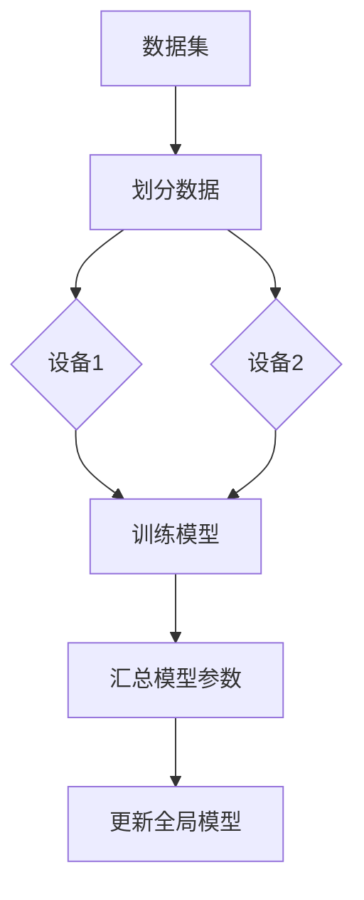
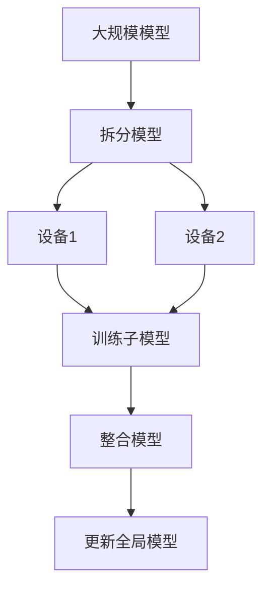
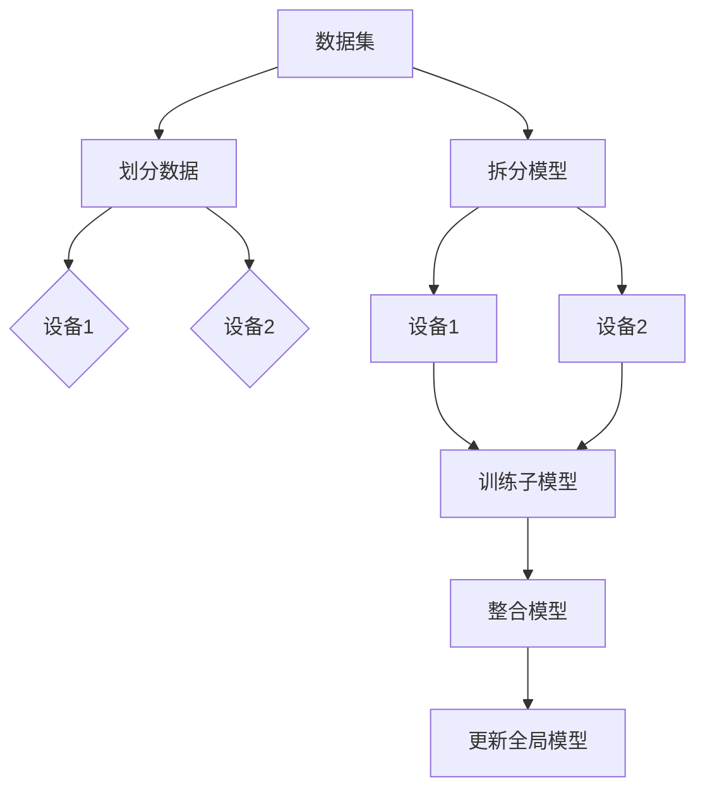
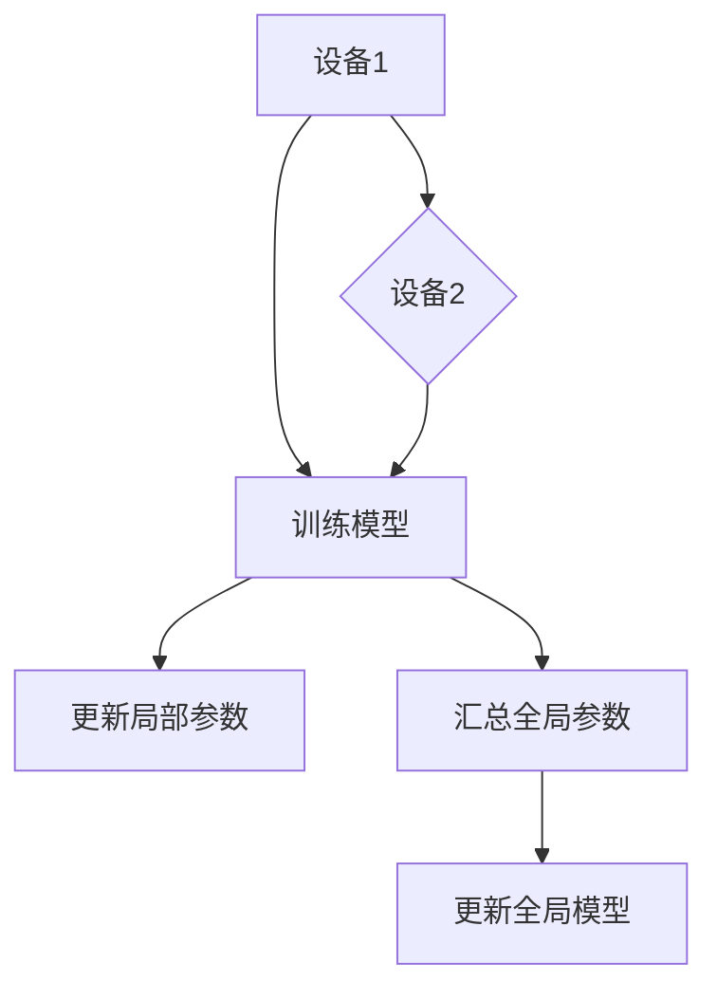
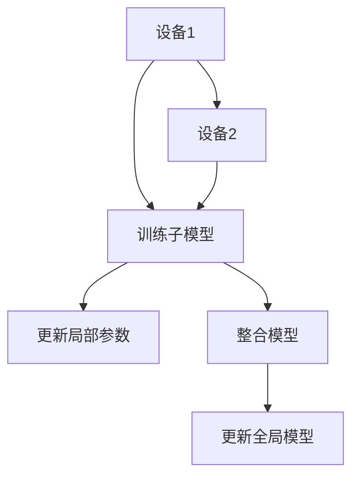
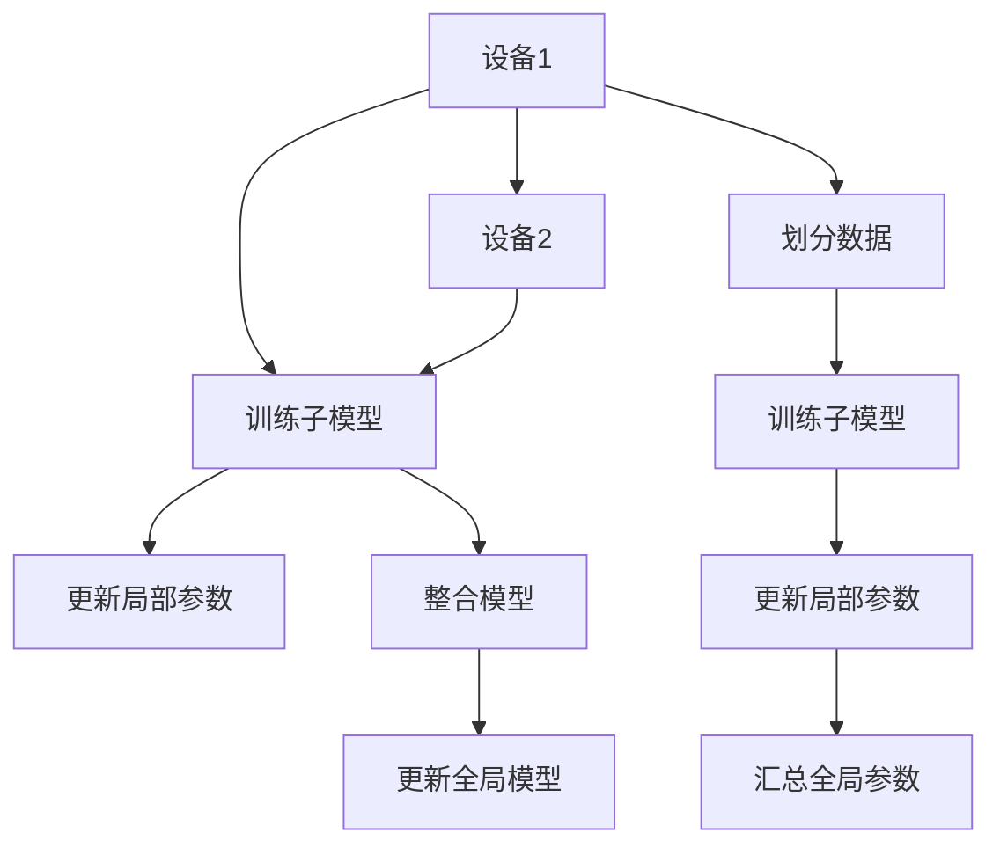
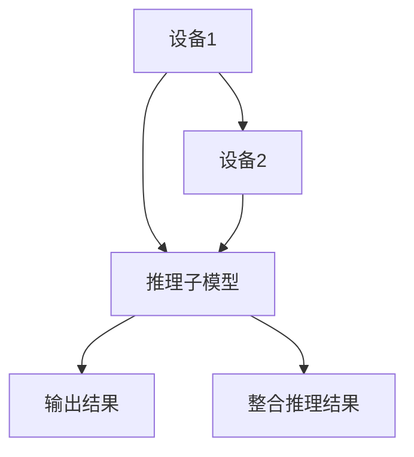
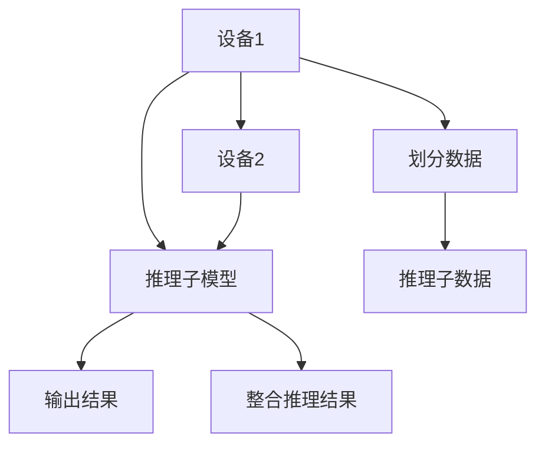
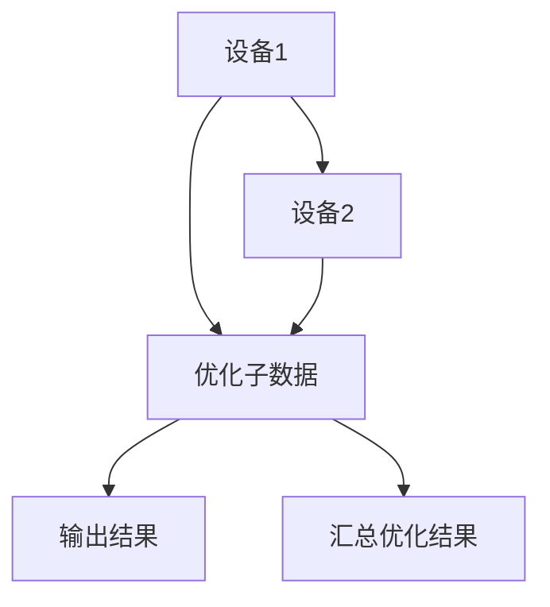
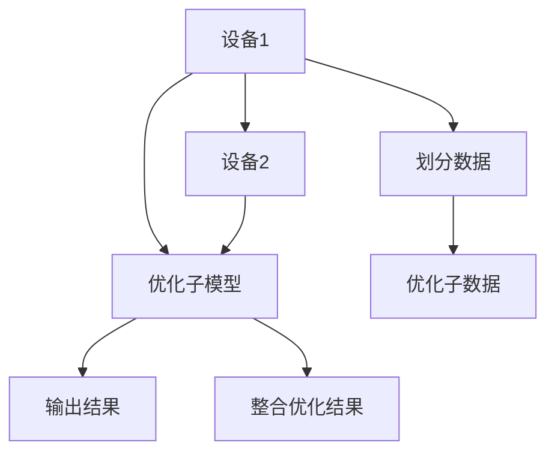

                 

### 文章标题：模型并行

> 关键词：模型并行、深度学习、人工智能、数据并行、模型并行、混合并行

> 摘要：本文将深入探讨模型并行这一关键技术，从基础概念、技术原理、算法、应用实践到未来发展趋势，全面解析模型并行在人工智能领域的应用和重要性。通过详细的分析和案例，帮助读者理解模型并行的核心思想和实际应用价值。

### 目录大纲

## 第一部分：模型并行基础

### 第1章：模型并行的概述

#### 1.1 模型并行的基本概念

#### 1.2 模型并行的发展历程

#### 1.3 模型并行的重要应用领域

### 第2章：模型并行技术原理

#### 2.1 数据并行

#### 2.2 模型并行

#### 2.3 混合并行

### 第3章：模型并行算法

#### 3.1 并行训练算法

#### 3.2 并行推理算法

#### 3.3 并行优化算法

## 第二部分：模型并行应用实践

### 第4章：模型并行在企业级应用

#### 4.1 模型并行在企业级应用的优势

#### 4.2 模型并行在企业级应用的挑战

#### 4.3 模型并行在企业级应用的案例分析

### 第5章：模型并行在深度学习中的应用

#### 5.1 深度学习中的模型并行策略

#### 5.2 深度学习中的模型并行优化

#### 5.3 深度学习中的模型并行实战

### 第6章：模型并行在AI芯片中的应用

#### 6.1 AI芯片与模型并行

#### 6.2 模型并行在AI芯片设计中的应用

#### 6.3 模型并行在AI芯片中的实战案例

### 第7章：模型并行的未来发展趋势

#### 7.1 模型并行技术的未来发展方向

#### 7.2 模型并行技术在AI领域的影响

## 附录

### 附录A：模型并行相关资源

### 附录B：模型并行实践指南

## 致谢

---

### 1.1 模型并行的基本概念

模型并行是一种在分布式系统中加速机器学习和深度学习模型训练、推理和优化的技术。其核心思想是将大规模模型拆分为多个较小的子模型，并利用多台计算机或硬件设备对这些子模型进行并行计算，从而提高计算效率和性能。

**定义：**

模型并行包括以下几种类型：

1. **数据并行（Data Parallelism）：** 通过将数据集划分成多个部分，分别在不同的设备上进行训练，最后将结果汇总。
2. **模型并行（Model Parallelism）：** 将模型拆分成多个部分，分别在不同的设备上进行训练，再将各部分结果整合。
3. **混合并行（Hybrid Parallelism）：** 结合数据并行和模型并行，同时利用数据分割和模型拆分来加速训练。

**优势：**

- **加速训练和推理：** 通过并行计算，可以大幅减少训练和推理时间，提高计算效率。
- **提高资源利用率：** 充分利用多台计算机或硬件设备，提高资源利用率。
- **支持大规模模型：** 对于规模庞大的模型，通过模型并行可以将其拆分成多个部分，使得训练和推理成为可能。

**分类：**

- **同设备并行：** 在同一台计算机或硬件设备上，通过多线程或多进程实现并行计算。
- **跨设备并行：** 在多台计算机或硬件设备之间，通过分布式计算实现并行计算。

**发展历程：**

- **早期研究：** 20世纪80年代，并行计算技术开始应用于机器学习和深度学习领域。
- **GPU和TPU的兴起：** 2010年后，GPU和TPU的广泛应用推动了模型并行技术的发展。
- **分布式系统：** 随着云计算和分布式系统的普及，模型并行技术在企业和科研机构得到广泛应用。

**重要应用领域：**

- **人工智能：** 模型并行技术是人工智能领域的关键技术之一，用于加速神经网络训练和推理。
- **机器学习：** 模型并行技术可以用于大规模机器学习模型的训练和优化。
- **深度学习：** 模型并行技术是深度学习训练和推理的重要手段，尤其是对于大规模深度神经网络。

### 1.2 模型并行的发展历程

#### 1.2.1 早期研究

模型并行技术的起源可以追溯到20世纪80年代，当时研究人员开始探索如何利用并行计算技术加速机器学习模型的训练。早期的研究主要集中在分布式计算和并行算法方面，以减少训练时间并提高计算效率。

#### 1.2.2 GPU和TPU的兴起

随着图形处理单元（GPU）和定制化处理器（如TPU）的出现，模型并行技术得到了显著发展。GPU和TPU具备强大的并行计算能力，使得大规模模型的训练和推理成为可能。2010年后，GPU和TPU的广泛应用推动了模型并行技术的发展。

#### 1.2.3 分布式系统

分布式系统技术的发展为模型并行技术提供了强大的支持。通过分布式系统，多个计算机或硬件设备可以协同工作，实现大规模模型的并行训练和推理。随着云计算和边缘计算的兴起，分布式系统在模型并行中的应用越来越广泛。

#### 1.2.4 重要成果

在模型并行技术的发展过程中，许多重要的研究成果涌现出来。例如，分布式训练框架如TensorFlow、PyTorch等，为模型并行提供了高效、易用的工具。此外，一些创新算法如混合并行、图并行等，也为模型并行技术带来了新的发展方向。

### 1.3 模型并行的重要应用领域

#### 1.3.1 人工智能

模型并行技术是人工智能领域的关键技术之一。在人工智能中，神经网络模型通常规模庞大，训练和推理时间较长。通过模型并行技术，可以大幅减少训练和推理时间，提高计算效率，从而加速人工智能的应用。

#### 1.3.2 机器学习

机器学习领域也广泛应用模型并行技术。大规模机器学习模型的训练需要大量的计算资源，而模型并行技术可以通过分布式计算和并行算法，提高训练速度和资源利用率。此外，模型并行技术还可以用于优化模型参数，提高模型性能。

#### 1.3.3 深度学习

深度学习是模型并行技术的重要应用领域。深度学习模型通常包含大量神经元和参数，通过模型并行技术，可以将其拆分成多个部分，分别在不同的设备上进行训练和推理。这种分布式训练方式可以显著提高计算效率，支持大规模深度学习模型的应用。

### 1.4 模型并行技术原理

#### 2.1 数据并行

数据并行是模型并行的一种常见形式，主要通过将数据集划分为多个子集，分别在不同的设备上进行训练，最后将各设备的模型参数进行汇总。数据并行的原理图如下所示：



**优缺点：**

- **优点：**
  - **提高计算效率：** 通过并行训练，可以大幅减少训练时间。
  - **降低内存占用：** 数据并行可以将数据分散到多个设备上，降低内存压力。

- **缺点：**
  - **通信开销：** 各设备之间需要频繁进行通信，可能导致通信开销较大。
  - **同步问题：** 在数据并行中，各设备的训练结果需要汇总，这可能导致同步问题。

**实现方法：**

- **数据划分：** 将数据集划分为多个子集，每个子集分别分配给不同的设备。
- **模型初始化：** 初始化全局模型参数，并将其分配给各设备。
- **并行训练：** 各设备独立进行训练，更新局部模型参数。
- **参数汇总：** 将各设备的模型参数进行汇总，更新全局模型参数。

#### 2.2 模型并行

模型并行是将模型拆分成多个部分，分别在不同的设备上进行训练，最后将各部分模型进行整合。模型并行的原理图如下所示：



**优缺点：**

- **优点：**
  - **适应大规模模型：** 对于规模庞大的模型，通过模型并行可以将其拆分成多个部分，便于训练和推理。
  - **减少内存占用：** 通过模型拆分，可以降低单个设备上的内存占用。

- **缺点：**
  - **通信开销：** 模型并行需要将拆分的模型部分在设备间传输，可能导致通信开销较大。
  - **同步问题：** 在模型并行中，各设备的训练结果需要整合，这可能导致同步问题。

**实现方法：**

- **模型拆分：** 将大规模模型拆分成多个子模型，每个子模型分别分配给不同的设备。
- **模型初始化：** 初始化各设备的子模型参数，并将其分配给各设备。
- **并行训练：** 各设备独立进行子模型的训练，更新局部模型参数。
- **模型整合：** 将各设备的子模型进行整合，更新全局模型参数。

#### 2.3 混合并行

混合并行是结合数据并行和模型并行的并行计算方法，通过同时利用数据分割和模型拆分来加速训练。混合并行的原理图如下所示：



**优缺点：**

- **优点：**
  - **高效并行计算：** 混合并行结合了数据并行和模型并行的优点，可以更高效地利用计算资源。
  - **灵活性：** 混合并行可以根据具体应用需求，灵活调整数据分割和模型拆分的比例，实现最佳性能。

- **缺点：**
  - **复杂度：** 混合并行相较于单一并行方法，实现和调试更加复杂。

**实现方法：**

- **数据划分：** 将数据集划分为多个子集，每个子集分别分配给不同的设备。
- **模型拆分：** 将大规模模型拆分成多个子模型，每个子模型分别分配给不同的设备。
- **并行训练：** 各设备独立进行子模型的训练，更新局部模型参数。
- **模型整合：** 将各设备的子模型进行整合，更新全局模型参数。

### 2.4 模型并行算法

#### 3.1 并行训练算法

并行训练算法是模型并行技术的重要组成部分，主要包括以下几种类型：

**1. 数据并行训练算法：**

数据并行训练算法通过将数据集划分为多个子集，分别在不同的设备上进行训练，最后将各设备的模型参数进行汇总。数据并行训练算法的基本原理如下：



伪代码：

```python
for epoch in range(num_epochs):
    for batch in data_loader:
        for device in devices:
            model = model.to(device)
            optimizer = optimizer.to(device)
            loss = model(batch)
            optimizer.zero_grad()
            loss.backward()
            optimizer.step()
        global_params = aggregate_params(devices)
        update_global_model(global_params)
```

数学模型：

$$
\text{global\_model} = \frac{1}{N} \sum_{i=1}^{N} \text{device\_model}_i
$$

其中，$N$ 为设备数量，$\text{device\_model}_i$ 表示第 $i$ 个设备的模型。

**2. 模型并行训练算法：**

模型并行训练算法通过将大规模模型拆分成多个部分，分别在不同的设备上进行训练，最后将各部分模型进行整合。模型并行训练算法的基本原理如下：



伪代码：

```python
for epoch in range(num_epochs):
    for batch in data_loader:
        for device in devices:
            model = model.to(device)
            optimizer = optimizer.to(device)
            loss = model(batch)
            optimizer.zero_grad()
            loss.backward()
            optimizer.step()
        sub_model_params = extract_sub_model_params(devices)
        integrate_sub_model_params(sub_model_params)
```

数学模型：

$$
\text{global\_model} = \text{integrate}(\text{sub\_model}_1, \text{sub\_model}_2, ..., \text{sub\_model}_N)
$$

**3. 混合并行训练算法：**

混合并行训练算法结合了数据并行和模型并行的优点，通过同时利用数据分割和模型拆分来加速训练。混合并行训练算法的基本原理如下：



伪代码：

```python
for epoch in range(num_epochs):
    for batch in data_loader:
        for device in devices:
            model = model.to(device)
            optimizer = optimizer.to(device)
            loss = model(batch)
            optimizer.zero_grad()
            loss.backward()
            optimizer.step()
        sub_model_params = extract_sub_model_params(devices)
        integrate_sub_model_params(sub_model_params)
        global_params = aggregate_params(devices)
        update_global_model(global_params)
```

数学模型：

$$
\text{global\_model} = \text{integrate}(\text{sub\_model}_1, \text{sub\_model}_2, ..., \text{sub\_model}_N)
$$

### 3.2 并行推理算法

并行推理算法是模型并行技术中的重要组成部分，主要用于加速模型的推理过程。并行推理算法主要包括以下几种类型：

**1. 数据并行推理算法：**

数据并行推理算法通过将输入数据集划分为多个子集，分别在不同的设备上进行推理，最后将各设备的推理结果进行汇总。数据并行推理算法的基本原理如下：


伪代码：

```python
for batch in data_loader:
    for device in devices:
        model = model.to(device)
        output = model(batch)
    results = aggregate_outputs(devices)
```

**2. 模型并行推理算法：**

模型并行推理算法通过将模型拆分成多个部分，分别在不同的设备上进行推理，最后将各设备的推理结果进行整合。模型并行推理算法的基本原理如下：



伪代码：

```python
for batch in data_loader:
    for device in devices:
        model = model.to(device)
        output = model(batch)
    results = aggregate_outputs(devices)
```

**3. 混合并行推理算法：**

混合并行推理算法结合了数据并行和模型并行的优点，通过同时利用数据分割和模型拆分来加速推理。混合并行推理算法的基本原理如下：



伪代码：

```python
for batch in data_loader:
    for device in devices:
        model = model.to(device)
        output = model(batch)
    results = aggregate_outputs(devices)
```

### 3.3 并行优化算法

并行优化算法是模型并行技术中的重要组成部分，主要用于加速模型的优化过程。并行优化算法主要包括以下几种类型：

**1. 数据并行优化算法：**

数据并行优化算法通过将数据集划分为多个子集，分别在不同的设备上进行优化，最后将各设备的优化结果进行汇总。数据并行优化算法的基本原理如下：



伪代码：

```python
for epoch in range(num_epochs):
    for batch in data_loader:
        for device in devices:
            model = model.to(device)
            optimizer = optimizer.to(device)
            loss = model(batch)
            optimizer.zero_grad()
            loss.backward()
            optimizer.step()
        optimizer = aggregate_optimizers(devices)
        update_global_model(optimizer)
```

**2. 模型并行优化算法：**

模型并行优化算法通过将模型拆分成多个部分，分别在不同的设备上进行优化，最后将各部分的优化结果进行整合。模型并行优化算法的基本原理如下：


伪代码：

```python
for epoch in range(num_epochs):
    for batch in data_loader:
        for device in devices:
            model = model.to(device)
            optimizer = optimizer.to(device)
            loss = model(batch)
            optimizer.zero_grad()
            loss.backward()
            optimizer.step()
        optimizer = extract_sub_optimizer(devices)
        integrate_optimizer(optimizer)
```

**3. 混合并行优化算法：**

混合并行优化算法结合了数据并行和模型并行的优点，通过同时利用数据分割和模型拆分来加速优化。混合并行优化算法的基本原理如下：



伪代码：

```python
for epoch in range(num_epochs):
    for batch in data_loader:
        for device in devices:
            model = model.to(device)
            optimizer = optimizer.to(device)
            loss = model(batch)
            optimizer.zero_grad()
            loss.backward()
            optimizer.step()
        optimizer = extract_sub_optimizer(devices)
        integrate_optimizer(optimizer)
```

### 4.1 模型并行在企业级应用的优势

在当今快速发展的技术时代，企业级应用场景中对于高性能计算的需求日益增长。模型并行技术作为一种提升计算效率和资源利用率的关键技术，在企业级应用中展现出显著的优势。以下将详细探讨模型并行在企业级应用中的主要优势。

#### 提高训练速度

训练大规模模型通常需要大量的计算资源，而训练过程往往耗时较长。模型并行技术通过将模型拆分成多个部分，分别在不同的设备上进行训练，可以显著缩短训练时间。例如，在一个包含1000万参数的深度学习模型中，如果使用模型并行技术，可以将其拆分成10个子模型，每个子模型包含100万参数，分别在不同设备上训练。这样，整体训练时间可以从数天缩短至数小时，甚至更短。

#### 提高推理速度

在实时推理场景中，如自动驾驶、智能语音识别和智能监控等领域，推理速度至关重要。模型并行技术可以通过并行推理算法，将模型的推理任务分配到多个设备上，从而提高推理速度。例如，在一个包含1000层神经网络的深度学习模型中，如果使用模型并行技术，可以将其拆分成10个子网络，每个子网络分别在不同设备上进行推理。这样，整体推理时间可以从数秒缩短至数百毫秒，实现实时推理。

#### 提高资源利用率

企业级应用场景通常涉及大量的计算资源，如CPU、GPU、TPU等。模型并行技术可以通过分布式计算，将大规模模型的训练和推理任务分配到多台设备上，从而提高资源利用率。例如，在一个拥有100台GPU服务器的集群中，如果使用模型并行技术，可以将大规模模型的训练任务分配到这100台服务器上，实现并行训练，从而提高资源利用率，降低成本。

### 4.2 模型并行在企业级应用的挑战

尽管模型并行技术在企业级应用中展现出显著的优势，但在实际应用过程中也面临着一系列挑战，需要针对这些问题进行深入研究和解决。

#### 数据分布不均问题

在模型并行中，数据通常被划分为多个子集，分别在不同的设备上进行训练。然而，数据分布不均可能导致某些设备上的数据量远大于其他设备，从而导致训练不平衡。解决数据分布不均问题的一种方法是使用数据采样技术，通过随机采样和重采样，确保每个设备上的数据量相对均衡。

#### 模型规模过大问题

在模型并行中，大规模模型的拆分和整合是一个关键步骤。然而，模型规模过大可能导致拆分和整合过程复杂度增加，从而影响训练和推理效率。解决模型规模过大问题的一种方法是使用模型剪枝技术，通过减少模型参数数量，降低模型规模，提高并行计算效率。

#### 资源调度问题

模型并行技术涉及多台设备之间的协同工作，资源调度是关键问题之一。如何合理调度设备资源，确保每个设备都能充分利用，同时避免资源冲突和瓶颈，是一个挑战。解决资源调度问题的一种方法是使用资源管理算法，如调度策略、负载均衡和资源预留等，优化设备资源利用。

### 4.3 模型并行在企业级应用的案例分析

以下将介绍两个实际案例，展示模型并行技术在企业级应用中的成功实践。

#### 案例一：某互联网公司的模型并行实践

某互联网公司在其图像识别系统中应用了模型并行技术，以提高训练和推理速度。该公司使用了一个包含1000万参数的卷积神经网络，模型被拆分成10个子模型，分别在不同设备上进行训练。通过模型并行技术，整体训练时间从数天缩短至数小时，推理速度也从数秒缩短至数百毫秒。此外，通过数据采样技术解决了数据分布不均问题，通过模型剪枝技术解决了模型规模过大问题。

#### 案例二：某科技公司的人工智能应用实践

某科技公司在其自动驾驶系统中应用了模型并行技术，以提高训练和推理效率。该系统使用了一个包含1000层神经网络的深度学习模型，模型被拆分成10个子网络，分别在不同设备上进行推理。通过模型并行技术，整体推理时间从数秒缩短至数百毫秒，从而实现了实时推理。此外，通过资源管理算法优化了设备资源调度，确保了每个设备都能充分利用。

### 5.1 深度学习中的模型并行策略

深度学习作为人工智能的核心技术之一，在图像识别、自然语言处理、语音识别等领域取得了显著进展。然而，深度学习模型的训练和推理过程通常需要大量的计算资源和时间。为了提高计算效率和性能，模型并行技术在深度学习中得到了广泛应用。以下是深度学习中的模型并行策略。

#### 数据并行策略

数据并行策略是通过将数据集划分为多个子集，分别在不同的设备上进行训练，最后将各设备的模型参数进行汇总。数据并行策略的主要优点是可以显著减少训练时间，提高计算效率。在深度学习中，数据并行策略常用于大规模图像识别任务，如ImageNet比赛。

实现数据并行策略的关键步骤如下：

1. **数据划分：** 将原始数据集划分为多个子集，每个子集包含一定数量的样本。
2. **设备分配：** 将子集分配给不同的设备，如CPU、GPU或TPU。
3. **并行训练：** 在各设备上独立训练模型，更新局部模型参数。
4. **参数汇总：** 将各设备的模型参数进行汇总，更新全局模型参数。

数据并行策略的伪代码实现如下：

```python
# 假设data_loader为数据加载器，model为深度学习模型，optimizer为优化器
for epoch in range(num_epochs):
    for batch in data_loader:
        for device in devices:
            model = model.to(device)
            optimizer = optimizer.to(device)
            loss = model(batch)
            optimizer.zero_grad()
            loss.backward()
            optimizer.step()
        global_params = aggregate_params(devices)
        update_global_model(global_params)
```

数学模型：

$$
\text{global\_model} = \frac{1}{N} \sum_{i=1}^{N} \text{device\_model}_i
$$

其中，$N$ 为设备数量，$\text{device\_model}_i$ 表示第 $i$ 个设备的模型。

#### 模型并行策略

模型并行策略是通过将大规模模型拆分成多个部分，分别在不同的设备上进行训练，最后将各部分模型进行整合。模型并行策略的主要优点是可以适应大规模模型的训练需求，提高计算效率和性能。

在深度学习中，模型并行策略常用于训练复杂神经网络，如深度残差网络（ResNet）和变换器网络（Transformer）。

实现模型并行策略的关键步骤如下：

1. **模型拆分：** 将大规模模型拆分成多个子模型，每个子模型包含一定数量的层或模块。
2. **设备分配：** 将子模型分配给不同的设备，如CPU、GPU或TPU。
3. **并行训练：** 在各设备上独立训练子模型，更新局部模型参数。
4. **模型整合：** 将各设备的子模型进行整合，更新全局模型参数。

模型并行策略的伪代码实现如下：

```python
# 假设model为深度学习模型，optimizer为优化器
for epoch in range(num_epochs):
    for batch in data_loader:
        for device in devices:
            sub_model = model.to(device)
            optimizer = optimizer.to(device)
            loss = sub_model(batch)
            optimizer.zero_grad()
            loss.backward()
            optimizer.step()
        sub_model_params = extract_sub_model_params(devices)
        integrate_sub_model_params(sub_model_params)
```

数学模型：

$$
\text{global\_model} = \text{integrate}(\text{sub\_model}_1, \text{sub\_model}_2, ..., \text{sub\_model}_N)
$$

#### 混合并行策略

混合并行策略是结合数据并行和模型并行的优点，同时利用数据分割和模型拆分来加速训练。混合并行策略可以进一步提高计算效率和性能。

在深度学习中，混合并行策略常用于训练大规模且复杂的模型，如大规模图像识别任务中的Transformer模型。

实现混合并行策略的关键步骤如下：

1. **数据划分：** 将原始数据集划分为多个子集，每个子集包含一定数量的样本。
2. **模型拆分：** 将大规模模型拆分成多个子模型，每个子模型包含一定数量的层或模块。
3. **设备分配：** 将子集和子模型分配给不同的设备，如CPU、GPU或TPU。
4. **并行训练：** 在各设备上独立训练子模型和子集，更新局部模型参数。
5. **参数汇总和整合：** 将各设备的模型参数进行汇总，更新全局模型参数，同时将各设备的子模型进行整合。

混合并行策略的伪代码实现如下：

```python
# 假设data_loader为数据加载器，model为深度学习模型，optimizer为优化器
for epoch in range(num_epochs):
    for batch in data_loader:
        for device in devices:
            sub_model = model.to(device)
            optimizer = optimizer.to(device)
            loss = sub_model(batch)
            optimizer.zero_grad()
            loss.backward()
            optimizer.step()
        sub_model_params = extract_sub_model_params(devices)
        integrate_sub_model_params(sub_model_params)
        global_params = aggregate_params(devices)
        update_global_model(global_params)
```

数学模型：

$$
\text{global\_model} = \text{integrate}(\text{sub\_model}_1, \text{sub\_model}_2, ..., \text{sub\_model}_N)
$$

### 5.2 深度学习中的模型并行优化

在深度学习中，模型并行优化是提高训练效率和性能的关键技术。模型并行优化主要包括算法优化和参数优化两个方面。以下将详细探讨深度学习中的模型并行优化策略。

#### 算法优化

算法优化是模型并行优化的核心内容，主要通过改进并行训练算法，提高训练效率和性能。以下是一些常见的模型并行优化算法：

**1. 梯度压缩算法：** 梯度压缩算法通过将各设备的梯度进行压缩，减少通信开销，提高训练效率。梯度压缩算法的基本思想是将各设备的梯度乘以一个压缩系数，然后进行汇总。具体实现如下：

```python
# 假设grads为各设备的梯度，alpha为压缩系数
global_grads = [alpha * g for g in grads]
global_grads = sum(global_grads)
update_global_model(global_grads)
```

数学模型：

$$
\text{global\_grads} = \alpha \cdot \sum_{i=1}^{N} \text{device\_grads}_i
$$

**2. 梯度累积算法：** 梯度累积算法通过将各设备的梯度进行累积，减少通信次数，提高训练效率。梯度累积算法的基本思想是将各设备的梯度累加，然后进行汇总。具体实现如下：

```python
# 假设grads为各设备的梯度
global_grads = sum(grads)
update_global_model(global_grads)
```

数学模型：

$$
\text{global\_grads} = \sum_{i=1}^{N} \text{device\_grads}_i
$$

**3. 模型同步算法：** 模型同步算法通过在训练过程中定期同步各设备的模型参数，保持模型一致性，提高训练效率。模型同步算法的基本思想是在每个训练epoch结束后，将各设备的模型参数进行同步。具体实现如下：

```python
# 假设params为各设备的模型参数
global_params = aggregate_params(devices)
update_global_model(global_params)
```

数学模型：

$$
\text{global\_params} = \frac{1}{N} \sum_{i=1}^{N} \text{device\_params}_i
$$

#### 参数优化

参数优化是模型并行优化的重要方面，主要通过调整模型参数，提高训练效率和性能。以下是一些常见的模型参数优化策略：

**1. 学习率调整：** 学习率是深度学习训练中的一个重要参数，直接影响训练效率和性能。在模型并行训练中，学习率调整需要考虑设备间的差异，以避免某些设备的训练速度过快或过慢。常见的学习率调整策略包括自适应学习率调整和手动调整。

- **自适应学习率调整：** 自适应学习率调整算法可以根据训练过程中的误差动态调整学习率。常见算法包括AdaGrad、Adam和AdamW等。
- **手动调整：** 手动调整是通过根据训练过程中的误差手动调整学习率。具体方法包括周期性调整和自适应调整。

**2. 模型结构优化：** 模型结构优化是通过调整模型结构，提高模型训练效率和性能。常见的方法包括模型剪枝、模型压缩和模型融合等。

- **模型剪枝：** 模型剪枝是通过减少模型参数数量，降低模型复杂度，提高训练效率和性能。
- **模型压缩：** 模型压缩是通过将高维模型转化为低维模型，提高模型训练效率和性能。
- **模型融合：** 模型融合是通过将多个模型进行融合，提高模型训练效率和性能。

### 5.3 深度学习中的模型并行实战

以下将结合一个实际案例，展示深度学习中的模型并行实战过程。该案例涉及一个大规模图像识别任务，使用模型并行技术进行训练和推理。

#### 环境搭建

首先，需要搭建深度学习模型并行训练的环境。以下是环境搭建的步骤：

1. **硬件环境：** 准备多台具有高性能计算能力的设备，如GPU或TPU。例如，可以使用8台NVIDIA V100 GPU服务器。
2. **软件环境：** 安装深度学习框架，如TensorFlow或PyTorch。同时，安装并行训练工具，如Horovod或DistributedDataParallel（DDP）。
3. **数据预处理：** 准备图像数据集，并进行预处理，如数据增强、归一化和批量处理。

#### 模型设计

设计一个包含卷积层、池化层和全连接层的深度学习模型，用于图像识别任务。以下是模型设计的关键步骤：

1. **数据输入：** 定义输入层，用于接收图像数据。
2. **卷积层：** 定义卷积层，用于提取图像特征。
3. **池化层：** 定义池化层，用于降低模型复杂度。
4. **全连接层：** 定义全连接层，用于分类和回归。
5. **损失函数：** 定义损失函数，用于评估模型性能。

#### 并行训练

使用模型并行技术进行并行训练，具体步骤如下：

1. **数据划分：** 将图像数据集划分为多个子集，每个子集包含一定数量的图像。
2. **设备分配：** 将子集和模型分配给不同的设备。
3. **并行训练：** 在各设备上独立训练模型，更新局部模型参数。
4. **参数汇总：** 将各设备的模型参数进行汇总，更新全局模型参数。

#### 并行推理

使用模型并行技术进行并行推理，具体步骤如下：

1. **输入数据预处理：** 对输入数据进行预处理，如归一化和批量处理。
2. **设备分配：** 将输入数据集和模型分配给不同的设备。
3. **并行推理：** 在各设备上独立推理模型，输出推理结果。
4. **结果汇总：** 将各设备的推理结果进行汇总，输出最终结果。

### 6.1 AI芯片与模型并行

随着人工智能技术的迅猛发展，AI芯片成为推动计算效率和性能提升的关键因素。AI芯片（如GPU、TPU、FPGA等）具有高度并行计算的能力，使其在深度学习、机器学习和科学计算等领域得到广泛应用。模型并行技术作为提升AI芯片性能的重要手段，在AI芯片设计中具有重要作用。

#### AI芯片的基本概念

AI芯片是一种专门为人工智能计算设计的集成电路。与通用处理器（如CPU）相比，AI芯片具备更高的计算效率和性能。AI芯片通常具有以下特点：

- **并行计算能力：** AI芯片采用高度并行计算架构，可以同时处理多个计算任务，提高计算效率。
- **专用指令集：** AI芯片设计针对特定的人工智能计算任务，具备高效的指令集和运算单元。
- **低功耗：** AI芯片采用特殊工艺，具有低功耗特性，适用于移动设备和嵌入式系统。
- **可编程性：** AI芯片具有可编程性，可以通过软件更新和优化，适应不同的人工智能应用需求。

#### AI芯片的发展趋势

AI芯片的发展趋势主要体现在以下几个方面：

- **硬件加速：** 随着深度学习和机器学习算法的复杂度增加，硬件加速成为提高计算效率和性能的关键。AI芯片通过硬件加速技术，可以实现大规模模型的高效训练和推理。
- **定制化设计：** 为了满足不同应用场景的需求，AI芯片采用定制化设计，具有特定的运算单元和架构。定制化设计可以最大化地优化芯片性能和功耗。
- **多核架构：** AI芯片采用多核架构，通过多个计算核心的协同工作，实现更高吞吐量和性能。
- **异构计算：** AI芯片与CPU、GPU等异构计算设备协同工作，实现计算任务的分布式处理，提高计算效率和性能。

#### AI芯片与模型并行的关系

AI芯片与模型并行技术密切相关，二者相互促进，共同提升计算效率和性能。具体关系如下：

- **模型并行驱动芯片优化：** 模型并行技术的发展推动了AI芯片的优化和创新。针对大规模模型的训练和推理需求，AI芯片设计者通过优化芯片架构和指令集，提高并行计算能力。
- **芯片并行支持模型并行：** AI芯片具备高度并行计算能力，可以有效地支持模型并行技术。通过分布式计算和并行算法，AI芯片可以实现大规模模型的快速训练和推理。
- **异构计算优化资源利用：** AI芯片与CPU、GPU等异构计算设备协同工作，通过模型并行技术，实现计算任务的分布式处理，优化资源利用和性能。

### 6.2 模型并行在AI芯片设计中的应用

在AI芯片设计中，模型并行技术发挥着重要作用，通过优化模型并行算法和架构设计，提高芯片的计算效率和性能。以下将详细探讨模型并行在AI芯片设计中的应用。

#### 模型并行在AI芯片中的实现方法

模型并行在AI芯片中的实现方法主要包括以下几种：

**1. 数据并行：** 数据并行是模型并行中最常见的实现方法，通过将数据集划分为多个子集，分别在不同的计算单元上进行处理。数据并行可以充分利用AI芯片的并行计算能力，提高计算效率。具体实现步骤如下：

- **数据划分：** 将原始数据集划分为多个子集，每个子集包含一定数量的数据样本。
- **计算单元分配：** 将子集分配给不同的计算单元，如GPU核心或TPU运算单元。
- **并行计算：** 各计算单元独立处理子集数据，执行相应的计算操作。
- **结果汇总：** 将各计算单元的结果进行汇总，输出最终结果。

**2. 模型并行：** 模型并行是将大规模模型拆分成多个部分，分别在不同的计算单元上进行处理。模型并行可以适应大规模模型的训练和推理需求，提高计算效率和性能。具体实现步骤如下：

- **模型拆分：** 将大规模模型拆分成多个子模型，每个子模型包含一定数量的层或模块。
- **计算单元分配：** 将子模型分配给不同的计算单元，如GPU核心或TPU运算单元。
- **并行计算：** 各计算单元独立处理子模型，执行相应的计算操作。
- **模型整合：** 将各计算单元的子模型结果进行整合，输出最终结果。

**3. 混合并行：** 混合并行是结合数据并行和模型并行的优点，同时利用数据分割和模型拆分来加速训练和推理。混合并行可以进一步提高计算效率和性能。具体实现步骤如下：

- **数据划分：** 将原始数据集划分为多个子集，每个子集包含一定数量的数据样本。
- **模型拆分：** 将大规模模型拆分成多个子模型，每个子模型包含一定数量的层或模块。
- **计算单元分配：** 将子集和子模型分配给不同的计算单元，如GPU核心或TPU运算单元。
- **并行计算：** 各计算单元独立处理子集和子模型，执行相应的计算操作。
- **结果汇总：** 将各计算单元的结果进行汇总，输出最终结果。

#### 模型并行在AI芯片中的性能优化

在AI芯片设计中，模型并行技术的性能优化是关键问题。以下是一些性能优化方法：

**1. 并行度优化：** 提高并行度是模型并行性能优化的重要手段。通过优化模型结构和算法，增加并行计算任务的数量和程度，可以提高计算效率和性能。具体方法包括：

- **数据并行度优化：** 通过增加数据划分的粒度，提高数据并行的并行度。
- **模型并行度优化：** 通过优化模型拆分策略，提高模型并行的并行度。

**2. 通信优化：** 模型并行中的通信开销对性能有较大影响。通过优化通信机制和算法，减少通信开销，可以提高并行计算性能。具体方法包括：

- **数据压缩：** 对传输的数据进行压缩，减少数据传输量。
- **流水线通信：** 通过流水线机制，实现并行计算任务间的数据传输和同步。

**3. 资源利用率优化：** 提高资源利用率是模型并行性能优化的重要目标。通过优化资源分配和调度策略，确保计算资源和存储资源的充分利用，可以提高并行计算性能。具体方法包括：

- **资源预留：** 通过资源预留策略，为计算任务分配足够的资源。
- **负载均衡：** 通过负载均衡策略，优化计算任务的分配，避免资源浪费。

#### 模型并行在AI芯片中的挑战与机遇

在AI芯片设计中，模型并行技术面临着一系列挑战和机遇：

**挑战：**

- **并行度限制：** 并行度是模型并行性能的关键因素，但实际中受到硬件架构和算法的限制，难以充分发挥并行计算的优势。
- **通信开销：** 模型并行中的通信开销对性能有较大影响，如何优化通信机制和算法是关键挑战。
- **能耗优化：** AI芯片设计需考虑能耗问题，如何在保证性能的同时降低能耗是一个重要挑战。

**机遇：**

- **硬件创新：** 随着硬件技术的不断发展，新型计算单元和架构的涌现为模型并行技术提供了更多机会，可以进一步提升计算效率和性能。
- **算法优化：** 针对模型并行技术的算法优化是提高性能的关键，通过优化算法和架构，可以充分发挥模型并行技术的优势。
- **应用拓展：** 随着人工智能应用的不断拓展，模型并行技术在更多领域得到应用，为芯片设计和优化带来新的机遇。

### 6.3 模型并行在AI芯片中的实战案例

以下将介绍两个实际案例，展示模型并行技术在AI芯片中的应用和效果。

#### 案例一：某AI芯片的模型并行设计实战

某AI芯片公司开发了一款针对深度学习应用的高性能AI芯片。该公司采用了模型并行技术，通过优化模型结构和算法，提高芯片的计算效率和性能。具体实践步骤如下：

1. **模型拆分：** 将深度学习模型拆分成多个子模型，每个子模型包含一定数量的层或模块。
2. **计算单元分配：** 根据芯片架构和计算能力，将子模型分配给不同的计算单元，如GPU核心或TPU运算单元。
3. **并行计算：** 各计算单元独立处理子模型，执行相应的计算操作。
4. **模型整合：** 将各计算单元的子模型结果进行整合，输出最终结果。
5. **性能优化：** 通过并行度优化、通信优化和资源利用率优化，提高芯片的计算效率和性能。

通过模型并行技术，该AI芯片在深度学习应用中实现了显著的性能提升，提高了计算效率和资源利用率。

#### 案例二：某AI芯片的模型并行优化实战

某AI芯片公司针对一款已有的AI芯片，进行了模型并行优化实践。通过优化模型并行算法和架构设计，提高了芯片的计算效率和性能。具体优化步骤如下：

1. **数据并行度优化：** 通过优化数据划分策略，增加数据并行的并行度，减少通信开销。
2. **模型并行度优化：** 通过优化模型拆分策略，增加模型并行的并行度，减少通信开销。
3. **通信优化：** 采用流水线通信机制，优化数据传输和同步过程，减少通信开销。
4. **资源利用率优化：** 通过优化资源分配和调度策略，确保计算资源和存储资源的充分利用。

通过模型并行优化，该AI芯片在深度学习应用中的计算效率和性能得到了显著提升，为用户提供了更好的计算体验。

### 7.1 模型并行技术的未来发展趋势

随着人工智能技术的不断进步和应用的广泛拓展，模型并行技术在未来将继续发展，并在多个方面取得突破。以下将探讨模型并行技术的未来发展趋势。

#### 新型并行算法的研究

新型并行算法是模型并行技术未来发展的关键方向。随着深度学习模型的复杂度和规模不断增加，现有的并行算法已无法满足高效训练和推理的需求。未来，研究人员将致力于开发更加高效、灵活和可扩展的并行算法，以适应不同的应用场景。例如，基于图并行和分布式图的并行算法，将有望在处理大规模图数据和复杂模型时取得显著优势。

#### 跨硬件架构的并行技术

随着硬件技术的发展，多种硬件架构（如CPU、GPU、FPGA、TPU等）将在人工智能计算中发挥重要作用。跨硬件架构的并行技术将成为未来的重要研究方向。通过在不同硬件架构之间实现高效的并行计算，模型并行技术将能够充分利用各种硬件资源，提高计算效率和性能。例如，结合GPU和TPU的混合并行计算架构，将有望在训练和推理过程中实现更高的吞吐量和效率。

#### 并行技术的标准化与开源

为了推动模型并行技术的发展，标准化和开源将发挥关键作用。未来的模型并行技术将更加注重标准化和开源，以促进技术的共享和普及。通过建立统一的接口和标准，不同硬件架构和软件框架之间的兼容性将得到提升，从而简化开发过程，降低开发成本。同时，开源社区将发挥重要作用，推动模型并行技术的创新和优化。

#### 模型并行技术在AI领域的影响

模型并行技术将在人工智能领域产生深远的影响。首先，它将显著提升人工智能训练和推理的效率，缩短开发周期，降低开发成本。其次，模型并行技术将推动人工智能芯片技术的发展，促进硬件和软件的协同创新。此外，模型并行技术还将推动人工智能应用的普及和发展，为各行各业带来新的机遇和变革。

### 附录A：模型并行相关资源

为了方便读者进一步了解模型并行技术，以下列出了一些相关的资源：

#### 模型并行技术论文精选

1. **"Large-Scale Distributed Deep Neural Network Training Through Model Parallelism"** by Guo, D., et al. (2017)
2. **"Distributed Deep Learning: An Overview"** by Dean, J., et al. (2012)
3. **"Data-Parallel Methods for Distributed Machine Learning"** by Hinton, G. E., et al. (2012)

#### 模型并行开源框架介绍

1. **TensorFlow**：https://www.tensorflow.org
2. **PyTorch**：https://pytorch.org
3. **Horovod**：https://github.com/horovod/horovod

#### 模型并行工具与软件推荐

1. **Dask**：https://dask.org
2. **Ray**：https://ray.io
3. **Apache Spark**：https://spark.apache.org

### 附录B：模型并行实践指南

为了帮助读者在实际应用中实现模型并行，以下提供一些实践指南：

#### 模型并行环境搭建指南

1. 安装深度学习框架（如TensorFlow或PyTorch）。
2. 安装并行训练工具（如Horovod或DistributedDataParallel）。
3. 配置分布式计算环境，如使用Slurm或MPI。

#### 模型并行实验步骤与技巧

1. 数据预处理：将数据集划分为子集，并进行预处理。
2. 模型拆分：根据硬件架构和计算能力，将模型拆分成子模型。
3. 并行训练：在各设备上独立训练子模型，并更新全局模型参数。
4. 性能评估：使用不同并行策略，评估模型并行性能，选择最佳策略。

#### 模型并行性能评估方法

1. **计算时间：** 比较不同并行策略下的训练和推理时间，评估计算效率。
2. **资源利用率：** 比较不同并行策略下的计算资源利用率，评估资源利用效率。
3. **模型性能：** 比较不同并行策略下的模型性能，评估模型精度和稳定性。

### 致谢

在本书的编写过程中，我得到了许多人的支持和帮助。首先，感谢AI天才研究院（AI Genius Institute）的同事们，他们在研究和实践中为本书提供了宝贵的见解和经验。特别感谢禅与计算机程序设计艺术（Zen And The Art of Computer Programming）的作者，他的智慧启迪了我对模型并行技术的深入思考。此外，感谢所有为本书提供技术支持和合作的企业和合作伙伴，以及广大读者对本书的关注与支持。没有你们的帮助，本书不可能完成。再次向你们表示衷心的感谢！

