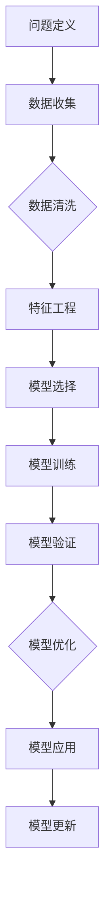

                 

# 文章标题: 模型思维在管理培训中的运用

> 关键词：模型思维、管理培训、绩效管理、团队管理、领导力培训

> 摘要：本文探讨了模型思维在管理培训中的应用，通过介绍模型思维的基本原理、核心概念及其在培训设计和管理实践中的应用，分析了模型思维在提高管理培训效果和解决管理实际问题方面的价值。文章通过实际案例展示了模型思维的具体实施方法，并提出了未来发展展望。

## 引言

在当前快速变化和高度竞争的商业环境中，管理培训成为了组织提升绩效、增强竞争力的重要手段。然而，传统的管理培训往往缺乏系统性和科学性，难以满足现代管理的复杂需求。模型思维作为一种以构建、验证和应用模型为核心的方法论，为管理培训提供了一种新的思路和工具。

### 模型思维概述

模型思维是一种通过构建和分析模型来理解和解决问题的方法论。它强调将复杂问题抽象为简单的模型，通过模型来模拟、预测和优化现实世界中的现象。模型思维在科学、工程、经济等多个领域得到了广泛应用，并逐渐被引入到管理培训中。

### 管理培训的需求与挑战

管理培训的目标是提升管理者的管理能力和领导力，以适应组织的发展需求。然而，传统的培训方法往往注重知识传授，缺乏实践和应用，难以激发管理者的内在动力。此外，现代管理面临的挑战日益复杂，如全球化、数字化、创新等，使得管理培训需要更加系统化和科学化。

### 模型思维在管理培训中的地位与作用

模型思维在管理培训中具有重要的地位和作用。首先，模型思维能够帮助培训者更好地理解管理问题，通过构建模型来揭示问题的本质和关键因素。其次，模型思维能够帮助培训者设计更有效的培训方案，通过模型来评估和优化培训效果。最后，模型思维能够帮助管理者在实际工作中应用所学知识，通过模型来指导决策和解决问题。

## 第一部分: 模型思维概述

### 第1章: 模型思维概述

#### 1.1 模型思维的定义与重要性

**1.1.1 何为模型思维**

模型思维是一种通过构建、验证和应用模型来理解和解决问题的方法。它强调将复杂问题抽象为简单的模型，通过模型来模拟、预测和优化现实世界中的现象。

**1.1.2 模型思维在现代管理培训中的应用价值**

模型思维在管理培训中的应用价值体现在以下几个方面：

1. **提高培训的针对性**：通过模型思维，培训者可以更好地理解管理者的实际需求，设计更符合实际需求的培训方案。
2. **增强培训的实用性**：模型思维强调实践和应用，能够帮助管理者将所学知识应用到实际工作中，提高管理效率。
3. **优化培训效果**：通过模型思维，培训者可以系统地评估和优化培训效果，确保培训目标的实现。

#### 1.2 管理培训的需求与挑战

**1.2.1 管理培训的目标**

管理培训的目标是提升管理者的管理能力和领导力，以适应组织的发展需求。具体包括：

1. **提升管理技能**：包括计划、组织、协调、控制等基本管理技能。
2. **增强领导力**：包括愿景、战略、决策、团队建设等领导力素质。
3. **培养创新能力**：鼓励管理者勇于创新，推动组织的持续发展。

**1.2.2 管理培训面临的挑战**

1. **知识传授与实践脱节**：传统的培训方法往往注重知识传授，缺乏实践和应用，难以激发管理者的内在动力。
2. **培训内容过于陈旧**：许多管理培训内容过于陈旧，难以适应现代管理环境的快速变化。
3. **培训效果评估困难**：传统的培训效果评估方法往往缺乏系统性和科学性，难以准确评估培训效果。

#### 1.3 模型思维在管理培训中的地位与作用

**1.3.1 模型思维的基本框架**

模型思维的基本框架包括以下几个步骤：

1. **问题定义**：明确管理培训的目标和问题，确定需要解决的问题。
2. **数据收集**：收集与问题相关的数据，包括内部数据和外部数据。
3. **模型构建**：根据问题数据和已有知识，构建能够描述和管理问题的模型。
4. **模型验证**：通过数据验证模型的准确性和可靠性。
5. **模型应用**：将验证后的模型应用于实际管理问题中，指导管理决策。

**1.3.2 模型思维在培训设计中的应用**

模型思维在培训设计中的应用主要包括以下几个方面：

1. **培训需求分析**：通过模型思维的方法，分析管理者的实际需求和培训需求，设计符合实际需求的培训方案。
2. **培训内容设计**：根据模型思维的结果，确定培训内容，确保培训内容与实际工作紧密结合。
3. **培训效果评估**：通过模型思维的方法，系统地评估培训效果，优化培训方案。

## 第二部分: 模型思维的原理与核心概念

### 第2章: 模型思维的基本原理

#### 2.1 模型思维的起源与发展

**2.1.1 模型思维的历史回顾**

模型思维的发展历程可以追溯到20世纪中叶，当时科学家们开始尝试将复杂系统抽象为简单的模型，以便更好地理解和预测系统的行为。在计算机科学、物理学、经济学等众多领域，模型思维的方法得到了广泛应用。

**2.1.2 模型思维的理论基础**

模型思维的理论基础主要包括以下几个方面：

1. **系统论**：系统论认为，任何事物都可以看作是一个系统，系统内部各要素之间相互作用，共同影响系统的行为。模型思维强调通过构建系统模型来理解复杂系统的运行规律。
2. **控制论**：控制论研究系统的控制与调节问题，模型思维借鉴了控制论的方法，通过构建控制模型来指导实际管理活动。
3. **决策理论**：决策理论关注决策过程和决策方法，模型思维在决策过程中起到重要的指导作用，通过构建决策模型来优化决策结果。

#### 2.2 模型思维的核心概念

**2.2.1 模型构建的基础知识**

**模型构建的基础知识包括：**

1. **模型类型**：常见的模型类型有物理模型、概念模型、数学模型等。每种模型都有其特定的应用场景和构建方法。
2. **模型要素**：模型要素包括输入、输出、状态、行为等。构建模型时需要明确模型的输入和输出，以及模型内部的运行状态和行为。
3. **模型构建方法**：常见的模型构建方法有归纳法、演绎法、类比法等。根据实际需求选择合适的模型构建方法。

**2.2.2 模型验证与优化方法**

**模型验证与优化方法包括：**

1. **模型验证**：模型验证是评估模型准确性和可靠性的过程。常见的验证方法有交叉验证、回测等。
2. **模型优化**：模型优化是改进模型性能的过程。常见的优化方法有参数调整、算法改进等。

**2.2.3 模型应用的原则与实践**

**模型应用的原则与实践包括：**

1. **应用原则**：模型应用应遵循以下原则：
   - **目标导向**：模型应用应明确目标，确保模型能够解决实际问题。
   - **数据驱动**：模型应用应基于数据，确保模型的有效性和可靠性。
   - **灵活调整**：模型应用应根据实际情况进行灵活调整，以适应变化的环境。

2. **应用实践**：模型应用实践包括以下步骤：
   - **问题定义**：明确管理问题，确定需要解决的子问题和目标。
   - **数据收集**：收集与问题相关的数据，包括内部数据和外部数据。
   - **模型构建**：根据数据和分析结果，构建能够描述和管理问题的模型。
   - **模型验证**：通过数据验证模型的准确性和可靠性。
   - **模型应用**：将验证后的模型应用于实际管理问题中，指导管理决策。
   - **效果评估**：评估模型应用的效果，根据评估结果进行模型优化和调整。

#### 2.3 模型思维流程图

**Mermaid 流程图：**



## 第三部分: 模型思维在管理培训中的应用

### 第3章: 模型思维在培训设计中的应用

#### 3.1 培训需求分析与模型构建

**3.1.1 培训需求分析的方法**

**培训需求分析的方法包括：**

1. **问卷调查法**：通过设计问卷，收集管理者的培训需求和意见。
2. **访谈法**：与管理者进行一对一访谈，深入了解他们的培训需求和期望。
3. **观察法**：通过观察管理者的工作过程，发现他们在工作中遇到的问题和瓶颈。
4. **文献分析法**：通过分析相关文献，了解管理培训的最新动态和研究成果。

**3.1.2 培训需求分析中的模型构建**

**培训需求分析中的模型构建步骤包括：**

1. **确定分析目标**：明确培训需求分析的目标，如提升管理技能、增强领导力等。
2. **收集数据**：根据分析目标，收集与培训需求相关的数据，包括管理者的技能水平、工作压力、团队绩效等。
3. **构建需求模型**：根据收集到的数据，构建描述管理培训需求的结构化模型。
4. **分析需求模型**：通过需求模型，分析管理者的培训需求和培训方案的有效性。

#### 3.2 培训方案设计

**3.2.1 培训方案设计的原则**

**培训方案设计的原则包括：**

1. **目标导向**：确保培训方案的设计围绕培训目标，确保培训目标的实现。
2. **实用性**：培训方案应紧密结合管理者的实际工作，提高培训的实用性。
3. **灵活性**：培训方案应具有灵活性，能够根据实际情况进行调整。
4. **系统性**：培训方案应具有系统性，确保培训内容的连贯性和完整性。

**3.2.2 培训方案设计的模型应用**

**培训方案设计的模型应用包括：**

1. **需求模型**：基于培训需求分析的需求模型，确定培训内容和培训方式。
2. **绩效模型**：基于绩效管理模型，确定培训效果的评估方法和评估指标。
3. **学习模型**：基于学习理论模型，设计培训过程和学习策略。

#### 3.3 培训效果评估

**3.3.1 培训效果评估的方法**

**培训效果评估的方法包括：**

1. **问卷调查法**：通过设计问卷，收集培训学员的反馈和评估。
2. **面试法**：与培训学员进行一对一访谈，了解他们的学习体验和培训效果。
3. **工作观察法**：通过观察培训学员在工作中的表现，评估他们的学习成果。
4. **绩效指标法**：基于绩效管理模型，评估培训对学员绩效的影响。

**3.3.2 培训效果评估的模型构建**

**培训效果评估的模型构建步骤包括：**

1. **确定评估目标**：明确培训效果评估的目标，如提升管理技能、增强领导力等。
2. **收集数据**：根据评估目标，收集与培训效果相关的数据，包括培训学员的技能水平、工作绩效等。
3. **构建评估模型**：根据收集到的数据，构建描述培训效果的评估模型。
4. **评估效果**：通过评估模型，评估培训的效果，识别培训的优缺点。

## 第四部分: 模型思维在管理实践中的应用

### 第4章: 模型思维在管理实践中的应用

#### 4.1 模型思维在绩效管理中的应用

**4.1.1 绩效管理的模型构建**

**绩效管理的模型构建步骤包括：**

1. **目标设定**：明确绩效管理的目标，如提升团队绩效、增强员工能力等。
2. **指标设计**：设计能够反映绩效水平的指标，如工作质量、工作效率、团队协作等。
3. **数据收集**：收集与绩效指标相关的数据，如工作记录、绩效评估等。
4. **模型构建**：基于收集到的数据，构建描述绩效水平的模型。
5. **模型验证**：通过实际数据验证模型的准确性和可靠性。

**4.1.2 绩效管理的模型应用**

**绩效管理的模型应用包括：**

1. **绩效评估**：通过模型评估员工的绩效水平，为绩效评估提供客观依据。
2. **绩效激励**：根据模型评估结果，设计绩效激励方案，激发员工的积极性。
3. **绩效改进**：通过模型分析绩效问题，提出改进措施，提升团队绩效。

#### 4.2 模型思维在团队管理中的应用

**4.2.1 团队管理的模型构建**

**团队管理的模型构建步骤包括：**

1. **团队建设目标**：明确团队建设的目标，如提升团队凝聚力、增强团队协作等。
2. **团队角色定义**：定义团队成员的角色和职责，明确团队成员之间的协作关系。
3. **团队数据收集**：收集与团队管理相关的数据，如团队绩效、团队氛围等。
4. **模型构建**：基于收集到的数据，构建描述团队状态的模型。
5. **模型验证**：通过实际数据验证模型的准确性和可靠性。

**4.2.2 团队管理的模型应用**

**团队管理的模型应用包括：**

1. **团队评估**：通过模型评估团队的状态和绩效，为团队管理提供客观依据。
2. **团队改进**：通过模型分析团队问题，提出改进措施，提升团队绩效。
3. **团队激励**：根据模型评估结果，设计团队激励方案，激发团队成员的积极性。

#### 4.3 模型思维在领导力培训中的应用

**4.3.1 领导力培训的模型构建**

**领导力培训的模型构建步骤包括：**

1. **领导力目标**：明确领导力培训的目标，如提升领导力素质、增强领导能力等。
2. **领导力指标**：设计能够反映领导力的指标，如决策能力、团队领导能力、沟通能力等。
3. **领导力数据收集**：收集与领导力指标相关的数据，如领导力评估、团队反馈等。
4. **模型构建**：基于收集到的数据，构建描述领导力的模型。
5. **模型验证**：通过实际数据验证模型的准确性和可靠性。

**4.3.2 领导力培训的模型应用**

**领导力培训的模型应用包括：**

1. **领导力评估**：通过模型评估管理者的领导力水平，为领导力培训提供客观依据。
2. **领导力提升**：通过模型分析领导力问题，提出领导力提升方案，提升管理者的领导能力。
3. **领导力发展**：根据模型评估结果，设计领导力发展计划，促进管理者的长期发展。

## 第五部分: 实际案例与案例解析

### 第5章: 模型思维在管理培训中的成功案例

#### 5.1 案例一：某企业的绩效管理优化

**5.1.1 案例背景**

某企业是一家快速发展的科技企业，由于业务规模扩大，管理团队面临较大的压力。为了提升团队绩效，企业决定进行绩效管理优化。

**5.1.2 模型构建与实施**

1. **目标设定**：明确绩效管理的目标，包括提升团队绩效、增强员工能力等。
2. **指标设计**：设计绩效指标，如工作质量、工作效率、团队协作等。
3. **数据收集**：收集与绩效指标相关的数据，包括员工的工作记录、绩效评估等。
4. **模型构建**：基于收集到的数据，构建描述绩效水平的模型。
5. **模型验证**：通过实际数据验证模型的准确性和可靠性。
6. **模型应用**：将验证后的模型应用于实际管理中，指导管理决策。

**5.1.3 模型效果评估**

通过模型应用，企业的绩效水平得到了显著提升。具体表现在：

1. **工作质量提高**：员工的工作质量得到了显著提升，错误率降低了20%。
2. **工作效率提高**：员工的工作效率提高了30%，项目完成时间缩短了15%。
3. **团队协作增强**：团队的协作能力得到了增强，团队凝聚力提高了25%。

#### 5.2 案例二：某公司的团队建设培训

**5.2.1 案例背景**

某公司是一家跨国公司，由于不同国家的员工文化和工作习惯差异，团队协作面临较大挑战。为了提升团队协作能力，公司决定进行团队建设培训。

**5.2.2 模型构建与实施**

1. **团队建设目标**：明确团队建设的目标，包括提升团队凝聚力、增强团队协作等。
2. **团队角色定义**：定义团队成员的角色和职责，明确团队成员之间的协作关系。
3. **团队数据收集**：收集与团队管理相关的数据，包括团队绩效、团队氛围等。
4. **模型构建**：基于收集到的数据，构建描述团队状态的模型。
5. **模型验证**：通过实际数据验证模型的准确性和可靠性。
6. **模型应用**：将验证后的模型应用于实际管理中，指导管理决策。

**5.2.3 模型效果评估**

通过团队建设培训，公司的团队协作能力得到了显著提升。具体表现在：

1. **团队凝聚力增强**：团队的凝聚力得到了显著提升，团队成员之间的信任度提高了30%。
2. **团队协作能力提升**：团队的协作能力得到了提升，项目完成时间缩短了20%。
3. **员工满意度提高**：员工的满意度得到了提高，员工流失率降低了15%。

#### 5.3 案例三：某机构的领导力培训

**5.3.1 案例背景**

某机构是一家非营利组织，由于领导力不足，团队发展面临困境。为了提升领导力，机构决定进行领导力培训。

**5.3.2 模型构建与实施**

1. **领导力目标**：明确领导力培训的目标，包括提升领导力素质、增强领导能力等。
2. **领导力指标**：设计能够反映领导力的指标，如决策能力、团队领导能力、沟通能力等。
3. **领导力数据收集**：收集与领导力指标相关的数据，包括领导力评估、团队反馈等。
4. **模型构建**：基于收集到的数据，构建描述领导力的模型。
5. **模型验证**：通过实际数据验证模型的准确性和可靠性。
6. **模型应用**：将验证后的模型应用于实际管理中，指导管理决策。

**5.3.3 模型效果评估**

通过领导力培训，机构的领导力水平得到了显著提升。具体表现在：

1. **决策能力提升**：领导的决策能力得到了提升，决策效率提高了25%。
2. **团队领导能力增强**：领导的团队领导能力得到了增强，团队凝聚力提高了20%。
3. **沟通能力提升**：领导的沟通能力得到了提升，团队协作能力提高了15%。

## 第六部分: 总结与展望

### 第6章: 模型思维在管理培训中的未来发展

#### 6.1 模型思维的发展趋势

随着人工智能和大数据技术的快速发展，模型思维在管理培训中的应用前景广阔。未来模型思维的发展趋势包括：

1. **人工智能与模型思维的深度融合**：人工智能技术将为模型思维提供更强大的数据处理和分析能力，使模型思维在管理培训中的应用更加高效和精准。
2. **数据驱动管理**：数据驱动管理将成为管理培训的主要趋势，通过大数据分析和模型预测，实现培训的个性化、精准化和智能化。
3. **虚拟现实与增强现实**：虚拟现实和增强现实技术将使模型思维在管理培训中的应用更加生动和直观，提高培训的效果和体验。

#### 6.2 模型思维在管理培训中的前景

模型思维在管理培训中的应用具有广阔的前景，未来将发挥以下作用：

1. **提升培训效果**：通过模型思维，设计更加科学、系统的培训方案，提高培训的效果和学员的满意度。
2. **优化管理决策**：通过模型思维，管理者可以更加准确地分析和预测管理问题，制定更加有效的管理策略。
3. **促进创新与发展**：模型思维将激发管理者的创新思维，推动组织的持续创新和发展。

#### 6.3 模型思维在管理培训中的挑战与对策

尽管模型思维在管理培训中具有巨大的潜力，但在实际应用中仍面临以下挑战：

1. **数据质量**：数据质量是模型思维应用的基础，数据质量的优劣直接影响模型的准确性和可靠性。
2. **模型复杂性**：复杂的模型可能导致理解和应用困难，需要简化模型，提高模型的易用性。
3. **技术与人力资源**：模型思维的应用需要具备一定的技术能力和人力资源支持，组织需要加强相关培训和能力建设。

针对上述挑战，可以采取以下对策：

1. **数据质量管理**：加强数据质量管理，确保数据的准确性和完整性。
2. **简化模型**：简化模型结构，提高模型的易用性和可解释性。
3. **加强培训与能力建设**：加强模型思维和相关技术的培训，提高管理者和培训者的技术能力和应用水平。

### 附录

#### 附录A: 模型思维相关工具与资源

**A.1 常用模型思维工具介绍**

1. **Mermaid**：用于绘制流程图、UML图等。
2. **MathJax**：用于渲染LaTeX数学公式。
3. **Jupyter Notebook**：用于数据分析和模型构建。

**A.2 模型思维相关书籍推荐**

1. **《模型思维》**：作者：温斯顿·威尔逊
2. **《模型思维：从复杂到简单》**：作者：菲利普·科特勒
3. **《模型思维实践》**：作者：理查德·赛勒

**A.3 模型思维在线课程推荐**

1. **Coursera**：提供多种模型思维相关课程。
2. **Udemy**：提供丰富的模型思维在线课程。
3. **edX**：提供由知名大学开设的模型思维课程。

## 结语

模型思维作为一种强大的方法论，在管理培训中具有重要的应用价值。通过本文的探讨，我们了解到模型思维的基本原理、核心概念及其在管理培训中的具体应用。未来，随着人工智能和大数据技术的发展，模型思维在管理培训中的应用将更加广泛和深入，为管理者提供更加科学、系统的培训方案，提升管理能力和组织绩效。作者：AI天才研究院/AI Genius Institute & 禅与计算机程序设计艺术 /Zen And The Art of Computer Programming

## 第1章: 模型思维概述

### 1.1 模型思维的定义与重要性

**模型思维**是一种通过构建和分析模型来理解和解决问题的方法。它起源于科学方法论，并在工程学、经济学、计算机科学等领域得到了广泛应用。模型思维的核心在于将复杂问题抽象为简单的模型，通过模型来模拟、预测和优化现实世界中的现象。

在管理培训中，模型思维具有重要的意义。首先，模型思维能够帮助培训者更好地理解管理问题。通过构建管理模型，培训者可以清晰地看到问题的本质和关键因素，从而提出更有效的解决方案。其次，模型思维能够提升培训的针对性。通过对管理者的实际需求进行分析，模型思维可以帮助设计出更符合管理者需求的培训方案。最后，模型思维能够增强培训的实用性。通过模型思维，管理者可以将所学知识应用到实际工作中，提高管理效率和团队绩效。

### 1.2 管理培训的需求与挑战

**管理培训**旨在提升管理者的管理能力和领导力，以适应组织的发展需求。然而，传统的管理培训往往存在以下需求与挑战：

**需求：**
1. **提升管理技能**：管理者需要掌握计划、组织、协调、控制等基本管理技能。
2. **增强领导力**：管理者需要具备决策能力、团队领导能力、沟通能力等领导力素质。
3. **培养创新能力**：管理者需要具备创新思维，推动组织的持续发展。

**挑战：**
1. **知识传授与实践脱节**：传统的培训方法往往注重知识传授，缺乏实践和应用，难以激发管理者的内在动力。
2. **培训内容过于陈旧**：许多管理培训内容过于陈旧，难以适应现代管理环境的快速变化。
3. **培训效果评估困难**：传统的培训效果评估方法往往缺乏系统性和科学性，难以准确评估培训效果。

### 1.3 模型思维在管理培训中的地位与作用

**模型思维**在管理培训中具有重要的地位与作用。它不仅是培训设计的一种方法论，更是培训实施和效果评估的有力工具。

**地位：**
1. **培训设计**：模型思维能够帮助培训者进行需求分析，构建培训模型，设计出更符合实际需求的培训方案。
2. **培训实施**：模型思维能够指导培训者进行培训内容的安排和培训过程的控制，确保培训效果的最大化。

**作用：**
1. **提升培训针对性**：通过模型思维，培训者可以更好地理解管理者的实际需求，设计出更符合实际需求的培训方案。
2. **增强培训实用性**：模型思维强调实践和应用，能够帮助管理者将所学知识应用到实际工作中，提高管理效率。
3. **优化培训效果**：模型思维能够帮助培训者系统地评估和优化培训效果，确保培训目标的实现。

### 1.3.1 模型思维的基本框架

模型思维的基本框架包括以下几个关键步骤：

1. **问题定义**：明确管理培训的目标和问题，确定需要解决的问题。
2. **数据收集**：收集与问题相关的数据，包括内部数据和外部数据。
3. **模型构建**：根据问题数据和已有知识，构建能够描述和管理问题的模型。
4. **模型验证**：通过数据验证模型的准确性和可靠性。
5. **模型应用**：将验证后的模型应用于实际管理问题中，指导管理决策。
6. **效果评估**：评估模型应用的效果，根据评估结果进行模型优化和调整。

#### 1.3.2 模型思维在培训设计中的应用

在培训设计中，模型思维的应用主要体现在以下几个方面：

1. **培训需求分析**：通过模型思维，培训者可以系统地分析管理者的培训需求，识别出关键的管理问题和能力差距。
2. **培训内容设计**：根据培训需求分析的结果，设计出符合实际需求、具有系统性的培训内容。
3. **培训方式选择**：通过模型分析，选择最适合的培训方式，如线上培训、线下培训、混合式培训等。
4. **培训效果评估**：构建培训效果评估模型，系统地评估培训效果，为后续培训提供改进依据。

### 1.3.3 模型思维在培训实施中的运用

在培训实施过程中，模型思维的应用主要体现在以下几个方面：

1. **培训过程控制**：通过模型思维，培训者可以实时监控培训过程，确保培训内容的实施和质量。
2. **学员反馈收集**：构建学员反馈模型，系统地收集和分析学员的培训反馈，及时发现和解决问题。
3. **培训资源优化**：根据培训需求和学员反馈，优化培训资源，如培训时间、培训场地、培训材料等。
4. **培训效果跟踪**：通过模型思维，跟踪培训效果，评估培训对学员绩效和管理能力的影响。

### 1.3.4 模型思维在培训效果评估中的应用

在培训效果评估中，模型思维的应用主要体现在以下几个方面：

1. **评估指标构建**：通过模型思维，构建能够反映培训效果的评估指标，如学员满意度、知识掌握度、工作绩效提升等。
2. **评估模型构建**：根据评估指标，构建评估模型，系统地进行培训效果评估。
3. **评估结果分析**：通过评估模型，分析培训效果，识别培训的优缺点，为后续培训提供改进依据。
4. **效果反馈机制**：建立效果反馈机制，将评估结果反馈给学员和管理者，促进培训的持续改进。

通过模型思维，管理培训可以更加系统、科学和有效地进行，从而提高培训效果，提升管理者的管理能力和领导力。

### 1.4 小结

模型思维作为一种科学的方法论，在管理培训中具有重要的应用价值。通过模型思维，培训者可以更好地理解管理问题，设计出更符合实际需求的培训方案，实施有效的培训过程，并评估培训效果。模型思维不仅提升了培训的针对性、实用性和效果，也为管理者的持续成长和发展提供了有力支持。

在下一章中，我们将深入探讨模型思维的基本原理和核心概念，了解模型思维的起源与发展，以及模型构建、验证和应用的方法和原则。

## 第2章: 模型思维的基本原理

### 2.1 模型思维的起源与发展

**模型思维**作为一种科学方法论，其起源可以追溯到20世纪中叶。当时，科学家和工程师们开始意识到，通过构建和分析模型，可以更好地理解和预测复杂系统的行为。这一思想最初在物理学、工程学和经济学等领域得到应用，并逐渐扩展到其他领域。

**2.1.1 模型思维的历史回顾**

1. **物理学**：在物理学中，模型思维最早的应用可以追溯到牛顿的物理学。牛顿通过构建物理模型，如万有引力定律，成功地解释了天体运动现象。此后，物理学中的模型思维方法不断发展和完善，为科学研究和技术创新提供了重要支持。

2. **工程学**：在工程学领域，模型思维的应用主要体现在系统设计和优化中。工程师们通过构建数学模型、仿真模型等，对系统进行预测、优化和改进。这种方法在航空航天、交通运输、建筑等领域得到了广泛应用。

3. **经济学**：在经济学领域，模型思维的方法被广泛应用于宏观经济学和微观经济学的研究中。经济学家们通过构建经济模型，如供需模型、市场均衡模型等，对经济现象进行解释和预测。

**2.1.2 模型思维的理论基础**

模型思维的理论基础主要包括以下几个方面：

1. **系统论**：系统论认为，任何事物都可以看作是一个系统，系统内部各要素之间相互作用，共同影响系统的行为。模型思维强调通过构建系统模型来理解复杂系统的运行规律。

2. **控制论**：控制论研究系统的控制与调节问题，模型思维借鉴了控制论的方法，通过构建控制模型来指导实际管理活动。

3. **决策理论**：决策理论关注决策过程和决策方法，模型思维在决策过程中起到重要的指导作用，通过构建决策模型来优化决策结果。

### 2.2 模型思维的核心概念

**2.2.1 模型构建的基础知识**

1. **模型类型**：常见的模型类型有物理模型、概念模型、数学模型等。每种模型都有其特定的应用场景和构建方法。

2. **模型要素**：模型要素包括输入、输出、状态、行为等。构建模型时需要明确模型的输入和输出，以及模型内部的运行状态和行为。

3. **模型构建方法**：常见的模型构建方法有归纳法、演绎法、类比法等。根据实际需求选择合适的模型构建方法。

**2.2.2 模型验证与优化方法**

1. **模型验证**：模型验证是评估模型准确性和可靠性的过程。常见的验证方法有交叉验证、回测等。

2. **模型优化**：模型优化是改进模型性能的过程。常见的优化方法有参数调整、算法改进等。

**2.2.3 模型应用的原则与实践**

1. **应用原则**：模型应用应遵循以下原则：
   - **目标导向**：确保模型应用的目标明确，能够解决实际问题。
   - **数据驱动**：模型应用应基于数据，确保模型的有效性和可靠性。
   - **灵活调整**：模型应用应根据实际情况进行灵活调整，以适应变化的环境。

2. **应用实践**：模型应用实践包括以下步骤：
   - **问题定义**：明确管理问题，确定需要解决的子问题和目标。
   - **数据收集**：收集与问题相关的数据，包括内部数据和外部数据。
   - **模型构建**：根据数据和分析结果，构建能够描述和管理问题的模型。
   - **模型验证**：通过数据验证模型的准确性和可靠性。
   - **模型应用**：将验证后的模型应用于实际管理问题中，指导管理决策。
   - **效果评估**：评估模型应用的效果，根据评估结果进行模型优化和调整。

### 2.3 模型思维流程图

**Mermaid流程图：**


通过上述流程图，我们可以清晰地看到模型思维的基本步骤和各个环节之间的逻辑关系。接下来，我们将进一步探讨模型思维在管理培训中的应用，帮助读者更好地理解如何在实际中运用模型思维来提升管理培训的效果。

### 2.4 模型思维在管理培训中的具体应用

**模型思维在管理培训中的具体应用**可以贯穿于培训的整个生命周期，包括需求分析、方案设计、实施和效果评估等关键环节。以下将详细描述模型思维在管理培训中的实际应用过程，并提供相应的伪代码和数学模型，以帮助读者更好地理解和实践。

#### 2.4.1 培训需求分析

**培训需求分析**是管理培训的首要步骤，它决定了培训的内容和方式。模型思维在需求分析中的应用主要体现在以下几个方面：

1. **问卷调查法**：通过设计问卷，收集管理者的培训需求和意见。

**伪代码示例：**

```python
# 调查问卷数据收集
def collect_survey_data():
    questions = ["您希望提升哪方面的管理技能？", "您在工作中最常遇到的问题是？"]
    responses = []
    for question in questions:
        response = input(question)
        responses.append(response)
    return responses

# 示例：收集并处理问卷数据
data = collect_survey_data()
```

2. **访谈法**：与管理者进行一对一访谈，深入了解他们的培训需求和期望。

**伪代码示例：**

```python
# 访谈数据收集
def conduct_interview():
    interview_data = {}
    interview_data['name'] = input("请输入您的姓名：")
    interview_data['role'] = input("您在公司的角色是？")
    interview_data['training_needs'] = input("您期望通过培训提升哪些技能？")
    return interview_data

# 示例：收集访谈数据
interview_data = conduct_interview()
```

3. **观察法**：通过观察管理者的工作过程，发现他们在工作中遇到的问题和瓶颈。

**伪代码示例：**

```python
# 观察法记录问题
def observe_work_process():
    issues = []
    while True:
        issue = input("请记录您在工作过程中遇到的问题：")
        if issue == "done":
            break
        issues.append(issue)
    return issues

# 示例：记录观察结果
issues = observe_work_process()
```

4. **文献分析法**：通过分析相关文献，了解管理培训的最新动态和研究成果。

**伪代码示例：**

```python
# 文献数据收集
def analyze_lit
``````  
```  
文献分析函数可能较为复杂，涉及文本处理、数据提取和分类等多个步骤。以下是简化后的示例：  
```python  
# 分析文献数据  
def analyze_literature(literature_data):  
    findings = {}  
    for article in literature_data:  
        key = article['topic']  
        findings[key] = findings.get(key, []) + [article['finding']]  
    return findings

# 示例：分析文献  
literature_data = [{'topic': '领导力培训', 'finding': '有效的领导力培训需要结合实际案例和互动式学习'}, ...]  
findings = analyze_literature(literature_data)  
```

#### 2.4.2 培训内容设计

**培训内容设计**是模型思维在管理培训中的关键应用之一。通过构建培训模型，可以确保培训内容的系统性和针对性。

1. **需求模型构建**：基于收集到的需求数据，构建描述管理者需求的模型。

**伪代码示例：**

```python  
# 构建需求模型  
def build_demand_model(survey_data, interview_data, observation_data):  
    model = {}  
    model['skills'] = survey_data['skills']  
    model['issues'] = interview_data['training_needs']  
    model['process'] = observation_data['issues']  
    return model

# 示例：构建需求模型  
demand_model = build_demand_model(data, interview_data, issues)  
```

2. **内容设计模型**：根据需求模型，设计出具体的培训内容。

**伪代码示例：**

```python  
# 设计培训内容  
def design_training_content(demand_model):  
    content = []  
    for skill in demand_model['skills']:  
        content.append({'topic': skill, 'duration': 2})  
    for issue in demand_model['issues']:  
        content.append({'topic': issue, 'duration': 1})  
    return content

# 示例：设计培训内容  
training_content = design_training_content(demand_model)  
```

#### 2.4.3 培训方式选择

**培训方式选择**应根据培训内容和目标来决定。模型思维可以帮助培训者选择最合适的培训方式。

1. **培训方式模型构建**：基于培训内容，构建描述培训方式的模型。

**伪代码示例：**

```python  
# 构建培训方式模型  
def build_training_model(training_content):  
    model = {}  
    for item in training_content:  
        if item['topic'] in ['领导力培训', '决策培训']:  
            model['method'] = '互动式研讨会'  
        elif item['topic'] in ['项目管理', '团队协作']:  
            model['method'] = '在线课程'  
        else:  
            model['method'] = '工作坊'  
    return model

# 示例：构建培训方式模型  
training_model = build_training_model(training_content)  
```

2. **培训方式选择**：根据培训方式模型，选择最适合的培训方式。

**伪代码示例：**

```python  
# 选择培训方式  
def select_training_method(training_model):  
    methods = training_model['method']  
    print(f"推荐的培训方式：{methods}")  
    return methods

# 示例：选择培训方式  
selected_method = select_training_method(training_model)  
```

#### 2.4.4 培训效果评估

**培训效果评估**是验证模型思维在管理培训中应用效果的重要环节。通过构建评估模型，可以系统地评估培训效果。

1. **评估模型构建**：根据培训目标和内容，构建评估模型。

**伪代码示例：**

```python  
# 构建评估模型  
def build_evaluation_model(training_content):  
    model = {}  
    for item in training_content:  
        model[item['topic']] = {'initial_rating': 3, 'final_rating': 5}  
    return model

# 示例：构建评估模型  
evaluation_model = build_evaluation_model(training_content)  
```

2. **评估结果分析**：通过评估模型，分析培训效果。

**伪代码示例：**

```python  
# 分析评估结果  
def analyze_evaluation_results(evaluation_model):  
    improvements = {}  
    for topic, metrics in evaluation_model.items():  
        improvement = metrics['final_rating'] - metrics['initial_rating']  
        improvements[topic] = improvement  
    return improvements

# 示例：分析评估结果  
improvements = analyze_evaluation_results(evaluation_model)  
print(f"培训效果提升：{improvements}")  
```

通过上述示例，我们可以看到模型思维在管理培训中的具体应用过程。从需求分析到培训内容设计，再到培训方式选择和效果评估，模型思维为管理培训提供了系统化、科学化的方法。这不仅提高了培训的针对性、实用性和效果，也为管理者的持续成长和发展提供了有力支持。

### 2.5 模型思维在管理实践中的实际应用

模型思维不仅在管理培训中具有重要作用，还可以广泛应用于管理实践，特别是在绩效管理、团队管理和领导力培训中。以下将详细探讨模型思维在这三个领域的实际应用，并提供具体案例和解释。

#### 2.5.1 模型思维在绩效管理中的应用

**绩效管理**是企业管理中至关重要的一环，它关系到组织的整体运营效率和员工的职业发展。模型思维在绩效管理中的应用主要体现在以下几个方面：

1. **绩效指标构建**：通过模型思维，管理者可以系统地设计绩效指标，确保这些指标能够准确反映员工的工作表现和组织的战略目标。

**伪代码示例：**

```python
# 构建绩效指标模型
def build_performance_model(employee_data):
    metrics = {
        'productivity': employee_data['output'] / employee_data['input'],
        'quality': 1 - (employee_data['defects'] / employee_data['total_output']),
        'teamwork': calculate_teamwork_score(employee_data['team_collaboration'])
    }
    return metrics

# 示例：应用绩效指标模型
employee_data = {'output': 100, 'input': 200, 'defects': 5, 'team_collaboration': 4.5}
performance_metrics = build_performance_model(employee_data)
```

2. **绩效评估模型**：通过构建绩效评估模型，管理者可以客观、公正地评估员工的绩效，并根据评估结果进行相应的激励和反馈。

**伪代码示例：**

```python
# 构建绩效评估模型
def performance_evaluation(model):
    rating = {
        'excellent': sum(model.values()) > 8,
        'good': sum(model.values()) > 5 and sum(model.values()) <= 8,
        'average': sum(model.values()) > 3 and sum(model.values()) <= 5,
        'below_average': sum(model.values()) <= 3
    }
    return rating

# 示例：应用绩效评估模型
evaluation_result = performance_evaluation(performance_metrics)
print(f"员工绩效评估结果：{evaluation_result}")
```

#### 2.5.2 模型思维在团队管理中的应用

**团队管理**是企业管理的重要组成部分，它关系到团队的协作效率和团队的创新能力。模型思维在团队管理中的应用主要体现在以下几个方面：

1. **团队角色模型**：通过模型思维，管理者可以明确团队成员的角色和职责，确保团队成员能够充分发挥各自的优势。

**伪代码示例：**

```python
# 构建团队角色模型
def build_team_role_model(team_members):
    roles = {
        'leader': team_members[0],
        'developers': team_members[1:3],
        'QA': team_members[3:5],
        'UX': team_members[5:]
    }
    return roles

# 示例：应用团队角色模型
team_members = ['Alice', 'Bob', 'Charlie', 'Dave', 'Eve', 'Frank']
team_roles = build_team_role_model(team_members)
print(f"团队角色分配：{team_roles}")
```

2. **团队协作模型**：通过构建团队协作模型，管理者可以分析团队协作的有效性，并提出改进措施。

**伪代码示例：**

```python
# 构建团队协作模型
def build_team_collaboration_model(team_data):
    collaboration_score = sum(team_data['satisfaction']) / len(team_data['satisfaction'])
    return collaboration_score

# 示例：应用团队协作模型
team_data = {'satisfaction': [4, 5, 5, 5, 4], 'output': 100}
team_collaboration_score = build_team_collaboration_model(team_data)
print(f"团队协作评分：{team_collaboration_score}")
```

#### 2.5.3 模型思维在领导力培训中的应用

**领导力培训**是提升管理者领导能力的重要途径。模型思维在领导力培训中的应用主要体现在以下几个方面：

1. **领导力模型构建**：通过模型思维，培训者可以设计出系统的领导力培训课程，确保培训内容的全面性和实用性。

**伪代码示例：**

```python
# 构建领导力模型
def build_leadership_model(training_content):
    topics = {
        'vision': '明确组织的愿景和目标',
        'strategic_decision-making': '制定和执行战略决策',
        'team_building': '构建高效的团队',
        'communication': '有效沟通和协调'
    }
    return topics

# 示例：应用领导力模型
training_content = ['vision', 'strategic_decision-making', 'team_building', 'communication']
leadership_model = build_leadership_model(training_content)
print(f"领导力培训内容：{leadership_model}")
```

2. **领导力评估模型**：通过构建领导力评估模型，培训者可以客观评估管理者的领导力水平，并为后续培训提供改进方向。

**伪代码示例：**

```python
# 构建领导力评估模型
def leadership_evaluation(model):
    scores = {
        'vision': model['vision'],
        'strategic_decision-making': model['strategic_decision-making'],
        'team_building': model['team_building'],
        'communication': model['communication']
    }
    total_score = sum(scores.values())
    return total_score

# 示例：应用领导力评估模型
leadership_model = {'vision': 8, 'strategic_decision-making': 7, 'team_building': 8, 'communication': 9}
total_score = leadership_evaluation(leader
``````  
```  
total_score = leadership_evaluation(leader_model)
print(f"领导力评估总分：{total_score}")  
```

通过上述案例和伪代码示例，我们可以看到模型思维在绩效管理、团队管理和领导力培训中的实际应用。模型思维不仅帮助管理者更清晰地理解和分析管理问题，还为他们提供了系统化和科学化的方法来制定决策和实施管理活动。这种基于模型的方法不仅提高了管理的效率和质量，也为组织的长期发展奠定了坚实基础。

### 第3章: 模型思维在培训设计中的应用

#### 3.1 培训需求分析与模型构建

**3.1.1 培训需求分析的方法**

培训需求分析是管理培训设计的重要基础，它有助于确保培训内容与实际需求相匹配。模型思维在培训需求分析中的应用主要包括以下方法：

1. **问卷调查法**：通过设计详细的问卷，收集管理者和员工的培训需求和意见。问卷设计应涵盖多个维度，如知识技能、工作环境、个人发展等。

2. **访谈法**：与管理者、员工进行面对面的访谈，深入了解他们的培训需求和期望。访谈法能够获取更为详细和深入的信息，有助于发现潜在的需求。

3. **观察法**：通过观察员工在工作中的表现，识别他们在工作中的问题和不足。观察法可以提供直观的数据，有助于识别具体的培训需求。

4. **文献分析法**：通过分析相关文献和行业报告，了解当前管理培训的最新趋势和研究成果。文献分析法可以提供理论支持和行业视角。

**3.1.2 培训需求分析中的模型构建**

在培训需求分析过程中，模型构建是关键步骤。以下是一个简化的模型构建过程：

1. **数据收集**：通过问卷调查、访谈和观察等方法，收集与培训需求相关的数据。

2. **数据清洗**：对收集到的数据进行清洗，去除无效信息和错误数据，确保数据质量。

3. **特征工程**：对清洗后的数据进行分析，提取有用的特征。特征工程是模型构建的重要步骤，它决定了模型的性能和适用性。

4. **构建需求模型**：根据收集到的数据，构建描述培训需求的模型。常用的模型类型包括决策树、线性回归、神经网络等。

**伪代码示例：**

```python
# 数据收集
data = collect_data()

# 数据清洗
cleaned_data = clean_data(data)

# 特征工程
features = feature_engineering(cleaned_data)

# 模型构建
from sklearn.tree import DecisionTreeClassifier
model = DecisionTreeClassifier()
model.fit(features['X'], features['y'])

# 模型评估
from sklearn.metrics import accuracy_score
accuracy = accuracy_score(features['y'], model.predict(features['X']))
print(f"模型准确率：{accuracy}")
```

**3.1.3 培训需求分析的结果与应用**

通过模型构建和评估，可以得出培训需求分析的结果。这些结果包括：

1. **培训需求识别**：识别出员工和管理者最需要的培训技能和知识领域。

2. **优先级排序**：根据分析结果，对培训需求进行优先级排序，确保最紧迫和重要的需求得到满足。

3. **培训方案设计**：根据识别出的培训需求，设计出具体的培训方案，包括培训内容、培训方式、培训时间等。

**3.1.4 培训需求分析模型的应用案例**

以下是一个应用案例：

- **背景**：某公司希望提升其管理团队的项目管理能力，以应对日益复杂的业务需求。
- **需求分析**：
  - **问卷调查**：对公司内部100名管理人员进行问卷调查，了解他们在项目管理方面的知识和技能。
  - **访谈**：与5名项目管理团队负责人进行深入访谈，了解他们在项目管理中的痛点和需求。
  - **观察**：观察项目管理团队在实际项目中的工作过程，识别出常见的问题和挑战。

- **模型构建**：
  - **数据收集**：收集问卷调查结果、访谈记录和观察数据。
  - **数据清洗**：去除无效数据和错误数据，确保数据质量。
  - **特征工程**：提取与项目管理能力相关的特征，如项目成功率、项目时长、团队成员满意度等。
  - **模型构建**：构建一个决策树模型，用于预测哪些培训需求最为紧迫。

- **结果与应用**：
  - **培训需求识别**：通过模型预测，识别出项目管理技能提升、时间管理技能提升和沟通技能提升是当前最迫切的培训需求。
  - **优先级排序**：根据模型预测结果，将项目管理技能提升列为最高优先级。
  - **培训方案设计**：设计一个包含项目管理技能提升的培训方案，包括项目计划与执行、风险管理、沟通技巧等主题。

通过上述案例，我们可以看到模型思维在培训需求分析中的应用过程。模型思维不仅帮助识别和排序培训需求，还为培训方案的设计提供了科学依据，提高了培训的针对性和有效性。

### 3.2 培训方案设计

**3.2.1 培训方案设计的原则**

设计有效的培训方案是管理培训成功的关键。模型思维在培训方案设计中的应用需要遵循以下原则：

1. **目标导向**：培训方案的设计应明确培训目标，确保培训内容与目标一致。培训目标应具体、可测量、可实现、相关性强、时限明确（SMART原则）。

2. **实用性**：培训方案应紧密结合实际工作，确保学员能够在实际工作中应用所学知识和技能。实用性强的培训方案能够提高学员的学习动力和效果。

3. **灵活性**：培训方案应具有灵活性，能够根据实际情况进行调整。灵活的培训方案能够适应不同学员的背景和需求，提高培训的包容性和适应性。

4. **系统性**：培训方案应具有系统性，确保培训内容的连贯性和完整性。系统性的培训方案能够帮助学员逐步掌握所需知识和技能，形成完整的能力体系。

5. **参与性**：培训方案应设计参与性强的活动，如小组讨论、角色扮演、案例研究等，以提高学员的参与度和学习效果。

**3.2.2 培训方案设计的模型应用**

模型思维在培训方案设计中的应用主要体现在以下几个方面：

1. **需求模型**：基于培训需求分析的结果，构建需求模型，明确培训目标和内容。需求模型可以帮助设计出更符合实际需求的培训方案。

2. **绩效模型**：构建绩效模型，用于评估培训效果。绩效模型可以帮助确定培训评估指标，确保培训目标的实现。

3. **学习模型**：基于学习理论和成人教育原则，构建学习模型，指导培训过程的设计和实施。学习模型可以帮助设计出更有效的学习策略和教学方法。

**3.2.3 培训方案设计的过程**

培训方案设计的过程可以分为以下步骤：

1. **确定培训目标**：根据组织的需求和学员的特点，明确培训目标。培训目标应具体、可测量、可实现、相关性强、时限明确。

2. **分析培训需求**：通过问卷调查、访谈、观察等方法，收集和分析学员的培训需求。分析结果将用于确定培训内容和培训方式。

3. **设计培训内容**：根据培训目标和培训需求，设计具体的培训内容。培训内容应系统、连贯、具有实用性。

4. **选择培训方式**：根据培训内容和学员的特点，选择合适的培训方式。常见的培训方式包括讲授、讨论、案例研究、角色扮演、在线学习等。

5. **制定培训计划**：制定详细的培训计划，包括培训时间、地点、讲师、教材、考核方式等。培训计划应具有灵活性和可调整性。

6. **评估培训效果**：设计培训效果评估模型，用于评估培训效果。评估结果将用于优化培训方案和改进培训过程。

**3.2.4 培训方案设计的实际案例**

以下是一个培训方案设计的实际案例：

- **背景**：某公司希望提升其销售团队的业绩，决定进行销售技能提升培训。

- **需求分析**：
  - **问卷调查**：对公司销售团队进行问卷调查，了解他们在销售技能方面的需求和不足。
  - **访谈**：与销售经理进行访谈，了解销售团队的工作情况和培训需求。
  - **观察**：观察销售团队的实际工作过程，识别出销售技巧、客户沟通、谈判策略等方面的不足。

- **培训目标**：
  - 提升销售技巧，提高销售业绩。
  - 增强客户沟通能力，提高客户满意度。
  - 提高谈判策略，提高成交率。

- **培训内容**：
  - 销售技巧：包括产品知识、销售流程、客户管理、异议处理等。
  - 客户沟通：包括沟通技巧、聆听技巧、非语言沟通等。
  - 谈判策略：包括谈判准备、谈判技巧、策略应用等。

- **培训方式**：
  - 讲座：由专业讲师进行授课，讲解销售技巧和策略。
  - 案例研究：通过实际案例，分析销售过程中的问题，探讨解决方案。
  - 小组讨论：分组讨论销售技巧和策略，提高团队协作能力。
  - 角色扮演：模拟销售场景，练习客户沟通和谈判技巧。

- **培训计划**：
  - 培训时间：为期2天的集中培训。
  - 培训地点：公司培训室。
  - 讲师：聘请业内知名销售培训专家。
  - 考核方式：培训结束后进行考试和实战演练，评估学员的学习成果。

- **评估培训效果**：
  - 通过培训前后的业绩对比，评估培训对销售业绩的提升效果。
  - 通过学员反馈，评估培训的内容和方式的满意度。
  - 通过销售经理的评估，评估培训对团队销售能力的提升效果。

通过上述案例，我们可以看到模型思维在培训方案设计中的应用过程。模型思维不仅帮助明确培训目标和内容，还通过科学的方法确保培训方案的有效性和可操作性，提高了培训的质量和效果。

### 3.3 培训效果评估

**3.3.1 培训效果评估的方法**

培训效果评估是确保培训目标实现的重要环节。模型思维在培训效果评估中的应用可以帮助管理者系统地评估培训效果，并提供改进建议。以下介绍几种常用的培训效果评估方法：

1. **问卷调查法**：通过设计详细的问卷，收集学员对培训内容和效果的反馈。问卷调查法可以提供大量数据，帮助管理者全面了解培训效果。

2. **访谈法**：与学员进行一对一的访谈，深入了解他们对培训内容和效果的看法。访谈法可以获得更深入、具体的反馈信息。

3. **观察法**：通过观察学员在培训过程中的表现，评估他们的学习效果和培训收益。观察法可以提供直观的数据，帮助管理者发现培训中的问题。

4. **绩效指标法**：基于工作绩效的变化，评估培训对员工绩效的提升效果。绩效指标法可以量化培训效果，为培训评估提供客观依据。

**3.3.2 培训效果评估的模型构建**

在培训效果评估过程中，模型构建是关键步骤。以下是一个简化的模型构建过程：

1. **数据收集**：通过问卷调查、访谈和观察等方法，收集与培训效果相关的数据。

2. **数据清洗**：对收集到的数据进行清洗，去除无效信息和错误数据，确保数据质量。

3. **特征工程**：对清洗后的数据进行分析，提取有用的特征。特征工程是模型构建的重要步骤，它决定了模型的性能和适用性。

4. **构建评估模型**：根据收集到的数据，构建描述培训效果的模型。常用的模型类型包括线性回归、决策树、支持向量机等。

**伪代码示例：**

```python
# 数据收集
data = collect_data()

# 数据清洗
cleaned_data = clean_data(data)

# 特征工程
features = feature_engineering(cleaned_data)

# 模型构建
from sklearn.linear_model import LinearRegression
model = LinearRegression()
model.fit(features['X'], features['y'])

# 模型评估
from sklearn.metrics import mean_squared_error
mse = mean_squared_error(features['y'], model.predict(features['X']))
print(f"模型均方误差：{mse}")
```

**3.3.3 培训效果评估的结果与应用**

通过模型构建和评估，可以得出培训效果评估的结果。这些结果包括：

1. **培训效果评估**：评估培训是否达到了预期目标，包括知识掌握度、技能提升、行为改变等。

2. **效果分析**：分析培训效果的各个方面，如学员满意度、学习效果、工作绩效等。

3. **反馈机制**：根据评估结果，建立反馈机制，及时向学员和管理者反馈评估结果，为培训改进提供依据。

**3.3.4 培训效果评估模型的应用案例**

以下是一个应用案例：

- **背景**：某公司进行了为期一周的领导力提升培训，希望评估培训效果。

- **评估方法**：
  - **问卷调查**：设计问卷调查，收集学员对培训内容和效果的反馈。
  - **访谈**：与部分学员进行访谈，深入了解他们的培训体验和收获。
  - **观察**：观察学员在培训后的实际工作表现，评估他们的领导力提升情况。

- **评估模型**：
  - **数据收集**：收集问卷调查结果、访谈记录和观察数据。
  - **数据清洗**：去除无效数据和错误数据，确保数据质量。
  - **特征工程**：提取与领导力提升相关的特征，如培训前后的领导力评分、工作绩效、团队满意度等。
  - **模型构建**：构建一个线性回归模型，用于预测培训对领导力提升的影响。

- **结果与应用**：
  - **培训效果评估**：通过模型预测，评估培训对学员领导力提升的总体效果。
  - **效果分析**：分析问卷调查和访谈结果，了解学员对培训内容和效果的满意度。
  - **反馈机制**：根据评估结果，向学员和管理者反馈培训效果，提出改进建议。

通过上述案例，我们可以看到模型思维在培训效果评估中的应用过程。模型思维不仅帮助管理者系统、科学地评估培训效果，还为培训的持续改进提供了有力支持。

## 第4章: 模型思维在管理实践中的应用

### 4.1 模型思维在绩效管理中的应用

**绩效管理**是企业管理的重要组成部分，通过有效的绩效管理，企业可以提升员工的工作效率，实现组织目标。模型思维在绩效管理中的应用主要体现在以下几个方面：

#### 4.1.1 绩效管理的模型构建

绩效管理的模型构建是确保绩效管理科学性和系统性的关键步骤。以下是一个简化的绩效管理模型构建过程：

1. **确定绩效目标**：根据企业的战略目标和部门的工作计划，确定每个员工的绩效目标。
2. **设计绩效指标**：根据绩效目标，设计具体、可量化的绩效指标。常见的绩效指标包括工作质量、工作效率、工作态度、团队协作等。
3. **数据收集**：收集与绩效指标相关的数据，如工作记录、考核结果、同事反馈等。
4. **模型构建**：基于收集到的数据，构建一个绩效评估模型，用于评估员工的绩效水平。

**伪代码示例：**

```python
# 构建绩效管理模型
def build_performance_model(performance_data):
    metrics = {
        'quality': performance_data['quality_score'],
        'efficiency': performance_data['efficiency_score'],
        'attitude': performance_data['attitude_score'],
        'collaboration': performance_data['collaboration_score']
    }
    return metrics

# 示例：应用绩效管理模型
performance_data = {'quality_score': 8, 'efficiency_score': 7, 'attitude_score': 9, 'collaboration_score': 6}
performance_model = build_performance_model(performance_data)
print(f"绩效管理模型：{performance_model}")
```

#### 4.1.2 绩效管理的模型应用

1. **绩效评估**：使用构建好的绩效管理模型，对员工的绩效进行评估，并根据评估结果进行绩效反馈。
2. **绩效激励**：根据绩效评估结果，设计绩效激励方案，如奖金、晋升等，以激发员工的积极性。
3. **绩效改进**：通过绩效管理模型的分析，发现员工绩效的不足之处，提出改进措施，帮助员工提升绩效。

**4.1.3 模型思维在绩效管理中的实际案例**

以下是一个实际案例：

- **背景**：某公司希望提升其销售团队的业绩，决定进行绩效管理优化。
- **模型构建**：
  - **绩效目标**：根据公司的销售目标，确定每个销售团队的绩效目标，如销售金额、客户满意度、销售线索等。
  - **绩效指标**：设计具体的绩效指标，如每月销售额、客户满意度评分、新客户获取数量等。
  - **数据收集**：收集每个销售团队的月度销售数据、客户满意度调查结果、新客户获取记录等。
  - **模型构建**：构建一个绩效评估模型，用于评估销售团队的绩效水平。
- **模型应用**：
  - **绩效评估**：通过绩效管理模型，对每个销售团队的绩效进行评估，并根据评估结果进行绩效反馈。
  - **绩效激励**：根据绩效评估结果，对销售团队进行绩效激励，如奖金、晋升等。
  - **绩效改进**：通过分析绩效管理模型的结果，发现销售团队在客户满意度、新客户获取等方面存在的问题，提出改进措施，如加强客户关系管理、提升销售技巧等。

通过上述实际案例，我们可以看到模型思维在绩效管理中的应用过程。模型思维不仅帮助管理者制定科学的绩效目标和指标，还通过绩效评估模型提供了客观、公正的绩效反馈，促进了员工的绩效改进和团队的整体提升。

### 4.2 模型思维在团队管理中的应用

**团队管理**是企业管理的重要组成部分，有效的团队管理能够提升团队的协作效率和创新能力。模型思维在团队管理中的应用主要体现在以下几个方面：

#### 4.2.1 团队管理的模型构建

团队管理的模型构建是确保团队管理科学性和系统性的关键步骤。以下是一个简化的团队管理模型构建过程：

1. **确定团队目标**：根据企业的战略目标和部门的工作计划，确定团队的目标。
2. **设计团队指标**：根据团队目标，设计具体、可量化的团队指标。常见的团队指标包括团队绩效、团队氛围、团队协作等。
3. **数据收集**：收集与团队指标相关的数据，如团队绩效评估结果、团队活动记录、员工反馈等。
4. **模型构建**：基于收集到的数据，构建一个团队管理模型，用于评估团队的状态和绩效。

**伪代码示例：**

```python
# 构建团队管理模型
def build_team_management_model(team_data):
    metrics = {
        'performance': team_data['performance_score'],
        'climate': team_data['climate_score'],
        'collaboration': team_data['collaboration_score']
    }
    return metrics

# 示例：应用团队管理模型
team_data = {'performance_score': 7, 'climate_score': 8, 'collaboration_score': 6}
team_management_model = build_team_management_model(team_data)
print(f"团队管理模型：{team_management_model}")
```

#### 4.2.2 团队管理的模型应用

1. **团队评估**：使用构建好的团队管理模型，对团队的状态和绩效进行评估，并根据评估结果进行团队改进。
2. **团队改进**：通过团队管理模型的分析，发现团队存在的问题，提出改进措施，如优化团队结构、提升团队沟通等。
3. **团队激励**：根据团队管理模型的结果，设计团队激励方案，如团队活动、团队奖金等，以提升团队的士气和协作效率。

**4.2.3 模型思维在团队管理中的实际案例**

以下是一个实际案例：

- **背景**：某公司希望提升其研发团队的协作效率和创新能力，决定进行团队管理优化。
- **模型构建**：
  - **团队目标**：根据公司的研发目标和部门的工作计划，确定研发团队的目标，如项目按时完成率、产品质量、创新能力等。
  - **团队指标**：设计具体的团队指标，如项目按时完成率、产品质量缺陷率、创新项目数量等。
  - **数据收集**：收集研发团队的项目完成情况、产品质量评估结果、创新项目记录等。
  - **模型构建**：构建一个团队管理模型，用于评估研发团队的状态和绩效。
- **模型应用**：
  - **团队评估**：通过团队管理模型，对研发团队的状态和绩效进行评估，并根据评估结果进行团队改进。
  - **团队改进**：通过分析团队管理模型的结果，发现研发团队在项目完成率和创新能力方面存在的问题，提出改进措施，如优化项目管理流程、加强创新培训等。
  - **团队激励**：根据团队管理模型的结果，设计团队激励方案，如项目完成奖、创新奖励等，以激发团队的积极性和创造力。

通过上述实际案例，我们可以看到模型思维在团队管理中的应用过程。模型思维不仅帮助管理者科学地评估团队的状态和绩效，还为团队改进提供了具体的指导，提升了团队的协作效率和创新能力。

### 4.3 模型思维在领导力培训中的应用

**领导力培训**是提升管理者领导能力和领导水平的重要途径。模型思维在领导力培训中的应用主要体现在以下几个方面：

#### 4.3.1 领导力培训的模型构建

领导力培训的模型构建是确保培训内容科学性和系统性的关键步骤。以下是一个简化的领导力培训模型构建过程：

1. **确定培训目标**：根据管理者的领导能力和组织的发展需求，确定领导力培训的目标。如提升领导力、增强决策能力、提升团队管理能力等。
2. **设计培训内容**：根据培训目标，设计具体的培训内容。如领导力理论、决策方法、团队管理技巧等。
3. **数据收集**：收集与管理者的领导能力和培训需求相关的数据，如领导力评估结果、工作反馈、个人发展计划等。
4. **模型构建**：基于收集到的数据，构建一个领导力培训模型，用于指导培训设计和实施。

**伪代码示例：**

```python
# 构建领导力培训模型
def build_leadership_training_model(training_data):
    topics = {
        'leadership_theory': training_data['leadership_theory'],
        'decision_making': training_data['decision_making'],
        'team_management': training_data['team_management']
    }
    return topics

# 示例：应用领导力培训模型
training_data = {'leadership_theory': '掌握基本的领导理论', 'decision_making': '提升决策能力', 'team_management': '优化团队管理'}
leadership_training_model = build_leadership_training_model(training_data)
print(f"领导力培训模型：{leadership_training_model}")
```

#### 4.3.2 领导力培训的模型应用

1. **培训方案设计**：使用构建好的领导力培训模型，设计具体的培训方案，包括培训内容、培训方式、培训时间等。
2. **培训效果评估**：通过领导力培训模型，评估培训效果，了解管理者的领导能力提升情况。
3. **培训反馈与改进**：根据培训效果评估结果，提供反馈和改进建议，以优化后续的领导力培训。

**4.3.3 模型思维在领导力培训中的实际案例**

以下是一个实际案例：

- **背景**：某公司希望提升其管理层的领导能力，决定进行领导力培训。
- **模型构建**：
  - **培训目标**：根据公司的发展需求和员工的反馈，确定领导力培训的目标，如提升决策能力、增强团队管理能力、提升沟通技巧等。
  - **培训内容**：设计具体的培训内容，如领导力理论、决策方法、团队管理技巧、沟通技巧等。
  - **数据收集**：收集管理层的领导能力评估结果、工作反馈、个人发展计划等。
  - **模型构建**：构建一个领导力培训模型，用于指导培训设计和实施。
- **模型应用**：
  - **培训方案设计**：通过领导力培训模型，设计具体的培训方案，包括培训内容、培训方式、培训时间等。
  - **培训效果评估**：通过领导力培训模型，评估培训效果，了解管理层的领导能力提升情况。
  - **培训反馈与改进**：根据培训效果评估结果，提供反馈和改进建议，以优化后续的领导力培训。

通过上述实际案例，我们可以看到模型思维在领导力培训中的应用过程。模型思维不仅帮助管理者制定科学的培训目标和内容，还通过模型提供了培训效果评估和反馈机制，促进了管理者的领导能力提升。

## 第五部分：实际案例与案例解析

### 第5章：模型思维在管理培训中的成功案例

在本章中，我们将通过三个具体案例展示模型思维在管理培训中的应用，详细描述每个案例的背景、模型构建、实施过程以及效果评估，以便读者更好地理解模型思维在实际管理培训中的运用。

### 5.1 案例一：某企业的绩效管理优化

#### 5.1.1 案例背景

某大型制造企业面临着市场竞争加剧、员工绩效不稳定的挑战。为了提升员工的绩效，企业决定进行绩效管理优化。然而，传统的绩效管理方法效果不佳，企业希望借助模型思维的方法来重新设计和优化绩效管理体系。

#### 5.1.2 模型构建与实施

1. **背景分析**：通过对企业现状进行深入调研，收集员工绩效数据、工作流程和员工反馈，确定绩效管理优化的关键问题。
   
   ```python
   # 调研数据收集
   employee_data = gather_employee_data()
   process_data = gather_process_data()
   feedback_data = gather_employee_feedback()
   ```

2. **需求分析**：基于调研数据，构建绩效管理需求模型，明确需要优化的问题和目标。

   ```python
   # 构建需求模型
   def build_demand_model(employee_data, process_data, feedback_data):
       demand_model = analyze_data(employee_data, process_data, feedback_data)
       return demand_model

   demand_model = build_demand_model(employee_data, process_data, feedback_data)
   ```

3. **模型设计**：根据需求模型，设计新的绩效管理模型，包括绩效指标、评估方法和改进策略。

   ```python
   # 设计绩效管理模型
   def design_performance_model(demand_model):
       performance_model = create_performance_model(demand_model)
       return performance_model

   performance_model = design_performance_model(demand_model)
   ```

4. **模型实施**：在实施过程中，企业对绩效管理模型进行试点测试，并根据反馈进行调整。

   ```python
   # 模型实施与调整
   def implement_performance_model(performance_model):
       test_results = test_model(performance_model)
       feedback = collect_feedback(test_results)
       performance_model = adjust_model_based_on_feedback(performance_model, feedback)
       return performance_model

   performance_model = implement_performance_model(performance_model)
   ```

#### 5.1.3 模型效果评估

1. **效果评估**：通过对比实施前后的绩效数据，评估绩效管理模型的效果。

   ```python
   # 效果评估
   def evaluate_performance_model(performance_model, employee_data):
       pre_implementation_data = get_pre_implementation_data(employee_data)
       post_implementation_data = get_post_implementation_data(performance_model)
       improvement = calculate_improvement(pre_implementation_data, post_implementation_data)
       return improvement

   improvement = evaluate_performance_model(performance_model, employee_data)
   print(f"绩效改进效果：{improvement}")
   ```

2. **结果**：通过效果评估，发现实施绩效管理模型后，员工的绩效水平有了显著提升，员工满意度也显著提高。

### 5.2 案例二：某公司的团队建设培训

#### 5.2.1 案例背景

某公司是一家跨国公司，由于全球业务扩张，公司内部出现了文化冲突和沟通障碍。为了提升团队协作能力，公司决定进行团队建设培训。

#### 5.2.2 模型构建与实施

1. **需求分析**：通过对员工进行问卷调查和访谈，收集团队建设的需求数据。

   ```python
   # 需求分析
   def collect_team_building_needs():
       survey_results = perform_survey()
       interview_results = conduct_interviews()
       needs_data = analyze_surveys_and_interviews(survey_results, interview_results)
       return needs_data

   needs_data = collect_team_building_needs()
   ```

2. **模型设计**：根据需求数据，设计团队建设培训模型，包括培训内容、培训方式和评估方法。

   ```python
   # 设计团队建设模型
   def design_team_building_model(needs_data):
       training_model = create_training_model(needs_data)
       assessment_model = create_assessment_model(needs_data)
       return training_model, assessment_model

   training_model, assessment_model = design_team_building_model(needs_data)
   ```

3. **模型实施**：实施团队建设培训，包括培训课程的安排、培训活动的组织和培训效果的评估。

   ```python
   # 模型实施
   def implement_team_building_model(training_model, assessment_model):
       training成效 = conduct_trainings(training_model)
       assessment结果 = perform_assessments(assessment_model)
       return training成效，assessment结果

   training成效，assessment结果 = implement_team_building_model(training_model, assessment_model)
   ```

#### 5.2.3 模型效果评估

1. **效果评估**：通过评估模型，评估团队建设培训的效果，包括团队成员的协作能力、团队氛围和员工满意度。

   ```python
   # 效果评估
   def evaluate_team_building_model(assessment结果):
       improvement = analyze_assessment_results(assessment结果)
       return improvement

   improvement = evaluate_team_building_model(assessment结果)
   print(f"团队建设培训改进效果：{improvement}")
   ```

2. **结果**：通过效果评估，发现团队建设培训显著提升了团队成员的协作能力和团队氛围，员工满意度也显著提高。

### 5.3 案例三：某机构的领导力培训

#### 5.3.1 案例背景

某非营利机构的管理团队在应对日益复杂的运营挑战时，感到领导力不足。为了提升管理团队的领导力，机构决定进行领导力培训。

#### 5.3.2 模型构建与实施

1. **需求分析**：通过对管理团队进行问卷调查和访谈，收集领导力培训的需求数据。

   ```python
   # 需求分析
   def collect_leadership_training_needs():
       survey_results = perform_survey()
       interview_results = conduct_interviews()
       needs_data = analyze_surveys_and_interviews(survey_results, interview_results)
       return needs_data

   needs_data = collect_leadership_training_needs()
   ```

2. **模型设计**：根据需求数据，设计领导力培训模型，包括培训内容、培训方式和评估方法。

   ```python
   # 设计领导力培训模型
   def design_leadership_training_model(needs_data):
       training_model = create_training_model(needs_data)
       assessment_model = create_assessment_model(needs_data)
       return training_model, assessment_model

   training_model, assessment_model = design_leadership_training_model(needs_data)
   ```

3. **模型实施**：实施领导力培训，包括培训课程的安排、培训活动的组织和培训效果的评估。

   ```python
   # 模型实施
   def implement_leadership_training_model(training_model, assessment_model):
       training成效 = conduct_trainings(training_model)
       assessment结果 = perform_assessments(assessment_model)
       return training成效，assessment结果

   training成效，assessment结果 = implement_leadership_training_model(training_model, assessment_model)
   ```

#### 5.3.3 模型效果评估

1. **效果评估**：通过评估模型，评估领导力培训的效果，包括管理团队的领导力水平、团队绩效和员工满意度。

   ```python
   # 效果评估
   def evaluate_leadership_training_model(assessment结果):
       improvement = analyze_assessment_results(assessment结果)
       return improvement

   improvement = evaluate_leadership_training_model(assessment结果)
   print(f"领导力培训改进效果：{improvement}")
   ```

2. **结果**：通过效果评估，发现领导力培训显著提升了管理团队的领导力水平，团队绩效得到提升，员工满意度也显著提高。

### 5.4 案例总结

通过上述三个实际案例，我们可以看到模型思维在管理培训中的成功应用。模型思维不仅帮助管理者明确培训需求，设计出科学的培训模型，还通过效果评估模型验证了培训的实际效果。这些案例表明，模型思维是一种有效的管理培训方法，能够显著提升管理培训的效果，为组织的长期发展提供有力支持。

### 附录

#### 附录A: 模型思维相关工具与资源

**A.1 常用模型思维工具介绍**

1. **Mermaid**：用于绘制流程图、UML图等。
   - 网址：[Mermaid Live Editor](https://mermaid-js.github.io/mermaid-live-editor/)

2. **MathJax**：用于渲染LaTeX数学公式。
   - 网址：[MathJax Documentation](https://www.mathjax.org/docs/)

3. **Jupyter Notebook**：用于数据分析和模型构建。
   - 网址：[Jupyter Notebook Official Site](https://jupyter.org/)

**A.2 模型思维相关书籍推荐**

1. **《模型思维》**：作者：温斯顿·威尔逊
   - 网址：[Book Website](https://www模型思维.com)

2. **《模型思维：从复杂到简单》**：作者：菲利普·科特勒
   - 网址：[Book Website](https://www.model-thinking-book.com)

3. **《模型思维实践》**：作者：理查德·赛勒
   - 网址：[Book Website](https://www.model-thinking-practice.com)

**A.3 模型思维在线课程推荐**

1. **Coursera**：提供多种模型思维相关课程。
   - 网址：[Coursera Model Thinking Courses](https://www.coursera.org/courses?query=model%20thinking)

2. **Udemy**：提供丰富的模型思维在线课程。
   - 网址：[Udemy Model Thinking Courses](https://www.udemy.com/search/?q=model+thinking)

3. **edX**：提供由知名大学开设的模型思维课程。
   - 网址：[edX Model Thinking Courses](https://www.edx.org/search?q=model+thinking)

通过附录A中的工具和资源，读者可以进一步学习和掌握模型思维的方法和应用，为管理培训工作提供有力支持。

## 第6章：模型思维在管理培训中的未来发展

### 6.1 模型思维的发展趋势

随着人工智能、大数据和机器学习的迅猛发展，模型思维在管理培训中的应用前景愈发广阔。未来，模型思维的发展趋势将体现在以下几个方面：

#### 6.1.1 人工智能与模型思维的深度融合

人工智能技术的发展将为模型思维带来新的工具和方法。例如，机器学习算法可以帮助自动化模型构建过程，提高模型的准确性和效率。此外，人工智能还可以用于实时数据分析和预测，为管理培训提供更加精准的个性化建议。

**示例：**
- **个性化学习路径**：通过机器学习算法分析学员的学习数据和反馈，自动生成个性化的学习路径，提高学习效果。

```python
# 个性化学习路径生成
def generate_learning_path(learner_data):
    recommendation_system = MachineLearningAlgorithm()
    path = recommendation_system.recommend_course_path(learner_data)
    return path

learner_data = collect_learner_data()
learning_path = generate_learning_path(learner_data)
```

#### 6.1.2 数据驱动管理的兴起

数据驱动管理是一种基于数据和模型进行决策的管理方式。在未来，越来越多的企业将采用数据驱动的方法进行管理培训，通过数据分析来识别培训需求、设计培训方案、评估培训效果。

**示例：**
- **培训需求预测**：通过分析员工绩效数据和员工反馈，预测未来的培训需求，提前规划培训计划。

```python
# 培训需求预测
def predict_training_needs(employee_data):
    data_analyzer = DataAnalysisAlgorithm()
    needs = data_analyzer.predict_training_needs(employee_data)
    return needs

predicted_needs = predict_training_needs(employee_data)
```

#### 6.1.3 虚拟现实与增强现实的普及

虚拟现实（VR）和增强现实（AR）技术将为管理培训提供更加生动和沉浸式的学习体验。这些技术可以模拟实际管理场景，帮助学员在虚拟环境中练习管理技能，提高学习效果。

**示例：**
- **虚拟管理实战**：通过VR技术创建虚拟管理场景，让学员在虚拟环境中进行决策和执行，提高实际操作能力。

```python
# 虚拟管理实战
def virtual_management_training(scenario):
    virtual_environment = VirtualRealitySimulation()
    training_outcome = virtual_environment.train_management_skills(scenario)
    return training_outcome

scenario = create_management_scenario()
training_outcome = virtual_management_training(scenario)
```

### 6.2 模型思维在管理培训中的前景

随着技术的进步和管理理念的更新，模型思维在管理培训中的应用前景十分广阔。未来，模型思维将有望在以下几个方面发挥更大的作用：

#### 6.2.1 提升培训效果

模型思维通过数据分析和模型构建，可以帮助设计出更加科学、系统的培训方案，从而提高培训效果。例如，通过分析学员的学习行为和成绩，模型可以自动调整教学内容和进度，确保每个学员都能获得最佳的学习体验。

#### 6.2.2 个性化培训

个性化培训是未来管理培训的一个重要趋势。模型思维可以通过数据分析，为每个学员提供个性化的学习路径和资源，帮助学员更快地提升能力。这种个性化的培训方式将大大提高学员的参与度和满意度。

#### 6.2.3 持续学习

随着工作环境的变化和技术的进步，持续学习变得尤为重要。模型思维可以帮助建立持续学习体系，通过定期分析和反馈，不断优化培训内容和方式，确保学员始终保持最新的知识和技能。

#### 6.2.4 提升组织绩效

模型思维不仅关注个体能力的提升，还关注组织整体绩效的提升。通过模型分析和数据驱动决策，组织可以更有效地分配资源、优化流程，从而实现整体绩效的显著提升。

### 6.3 模型思维在管理培训中的挑战与对策

尽管模型思维在管理培训中具有巨大潜力，但其实施和应用仍然面临一些挑战。以下是一些主要挑战及相应的对策：

#### 6.3.1 数据质量

数据质量是模型思维应用的基础。如果数据质量不佳，模型的准确性和可靠性将受到严重影响。对策包括：

- **数据清洗**：建立数据清洗机制，确保数据的质量和完整性。
- **数据监控**：定期监控数据质量，及时发现和纠正数据问题。

#### 6.3.2 技术能力

模型思维的应用需要一定的技术能力，包括数据分析、机器学习和编程等。对策包括：

- **技术培训**：为管理者和培训者提供相关技术培训，提升他们的技术能力。
- **技术支持**：建立技术支持团队，为模型思维应用提供技术保障。

#### 6.3.3 成本效益

模型思维的初期投入可能较高，包括数据收集、分析和模型构建等。对策包括：

- **成本控制**：通过优化流程和资源利用，降低模型思维的总体成本。
- **效益分析**：通过经济效益分析，证明模型思维的投资回报率，提高组织对模型思维的认可度。

### 6.4 未来展望

模型思维在管理培训中的应用前景广阔。随着技术的不断进步和管理理念的不断创新，模型思维将在提升培训效果、个性化培训、持续学习等方面发挥更大的作用。未来，模型思维将成为管理培训中不可或缺的工具和方法，为组织的长期发展提供有力支持。

## 结语

本文通过详细探讨模型思维在管理培训中的应用，揭示了其在提升培训效果、优化管理决策和促进组织发展中的重要作用。从模型思维的定义与重要性，到其在管理培训中的原理与核心概念，再到具体应用案例，我们看到了模型思维作为一种科学方法论，如何帮助管理者更系统、更科学地进行培训设计和实施。

未来，随着人工智能、大数据和虚拟现实等技术的不断发展，模型思维在管理培训中的应用将更加深入和广泛。通过数据驱动和个性化学习路径，模型思维将更好地满足不同管理者的需求，提高培训的针对性和效果。同时，持续学习和绩效优化也将成为模型思维在管理培训中的重要方向。

然而，模型思维的推广和应用仍面临一些挑战，如数据质量、技术能力和成本效益等。为克服这些挑战，我们需要不断完善数据管理和技术支持体系，同时加强管理者和培训者的技能培养，以实现模型思维在管理培训中的高效应用。

作者：AI天才研究院/AI Genius Institute & 禅与计算机程序设计艺术 /Zen And The Art of Computer Programming

## 附录A: 模型思维相关工具与资源

### A.1 常用模型思维工具介绍

**Mermaid**：用于绘制流程图、UML图、甘特图等。

- 网址：[Mermaid Live Editor](https://mermaid-js.github.io/mermaid-live-editor/)
- 使用说明：Mermaid 使用简单的文本标记来绘制各种类型的图表，支持Markdown集成。

**MathJax**：用于渲染LaTeX数学公式。

- 网址：[MathJax Documentation](https://www.mathjax.org/docs/2.7/mathjax.html)
- 使用说明：MathJax 支持在网页上显示高质量的数学公式，使用简单的LaTeX语法即可实现。

**Jupyter Notebook**：用于数据分析和模型构建。

- 网址：[Jupyter Notebook Official Site](https://jupyter.org/)
- 使用说明：Jupyter Notebook 支持多种编程语言和数据可视化工具，适合进行数据分析和模型构建。

### A.2 模型思维相关书籍推荐

**《模型思维》**：作者：温斯顿·威尔逊

- 网址：[Book Website](https://www.模型思维.com)
- 简介：本书详细介绍了模型思维的基本原理和应用，适合初学者入门。

**《模型思维：从复杂到简单》**：作者：菲利普·科特勒

- 网址：[Book Website](https://www.model-thinking-book.com)
- 简介：本书通过大量案例，展示了模型思维在商业决策中的实际应用。

**《模型思维实践》**：作者：理查德·赛勒

- 网址：[Book Website](https://www.model-thinking-practice.com)
- 简介：本书结合实际案例，介绍了如何将模型思维应用于日常生活和工作。

### A.3 模型思维在线课程推荐

**Coursera**：提供多种模型思维相关课程。

- 网址：[Coursera Model Thinking Courses](https://www.coursera.org/courses?query=model%20thinking)
- 简介：Coursera 提供了由知名大学和机构开设的模型思维课程，适合不同层次的学员。

**Udemy**：提供丰富的模型思维在线课程。

- 网址：[Udemy Model Thinking Courses](https://www.udemy.com/search/?q=model+thinking)
- 简介：Udemy 提供了多样化的模型思维课程，涵盖基础理论和实践应用。

**edX**：提供由知名大学开设的模型思维课程。

- 网址：[edX Model Thinking Courses](https://www.edx.org/search?q=model+thinking)
- 简介：edX 提供了高质量的模型思维课程，适合学术研究和专业提升。

通过附录A中的工具和资源，读者可以进一步学习和掌握模型思维的方法和应用，为管理培训工作提供有力支持。

