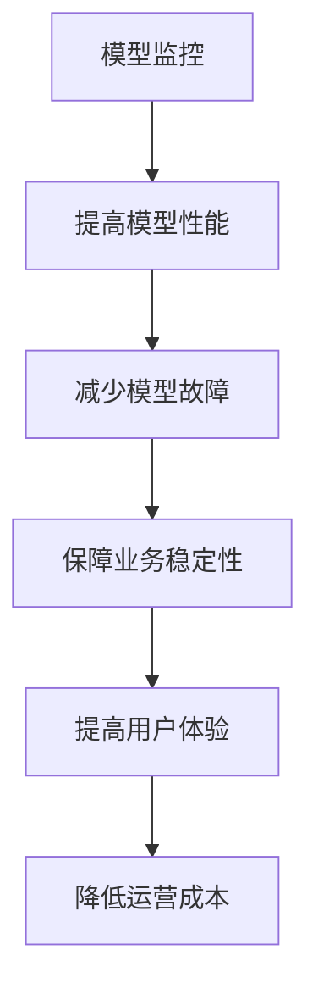
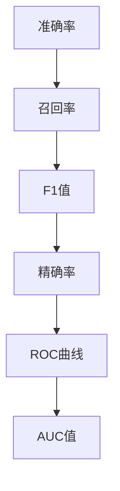
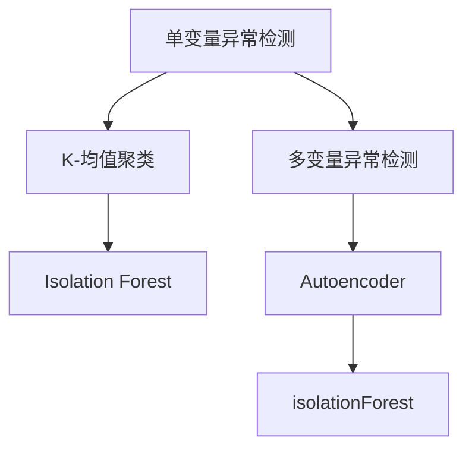
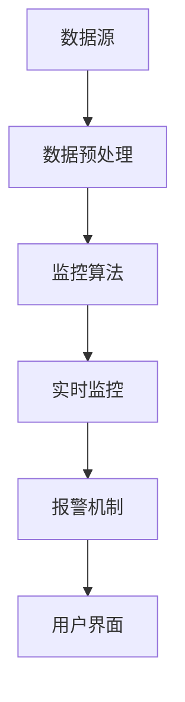
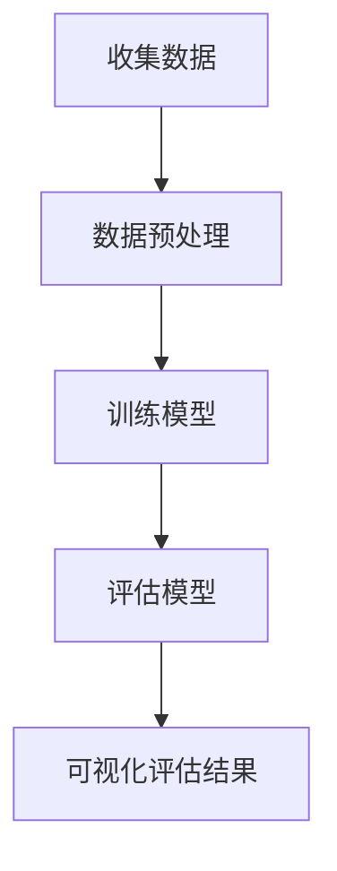
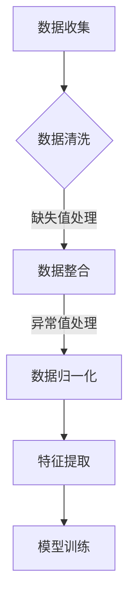
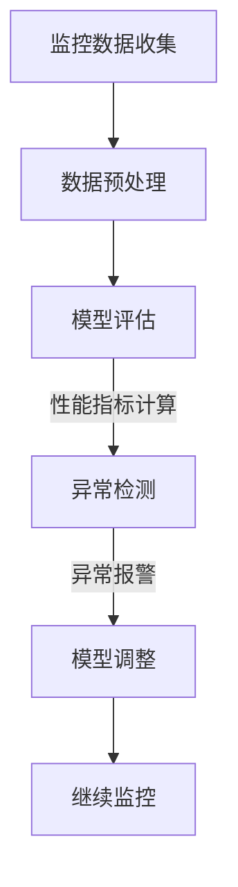

                 

**模型监控**

> 关键词：模型监控，性能评估，异常检测，实时监控，报警机制，AI应用

> 摘要：本文将深入探讨模型监控的各个方面，包括其重要性、基本概念、发展历程、组成部分、性能评估指标和方法、数据收集与预处理、监控技术分类和原理、异常检测算法、实时监控与报警机制设计、案例研究以及模型监控在AI中的应用。通过本文，读者将全面了解模型监控的原理和实践，掌握其在AI领域的重要价值。

### 《模型监控》目录大纲

## 第一部分：模型监控基础

### 第1章：模型监控概述

### 1.1 模型监控的重要性

### 1.2 模型监控的发展历程

### 1.3 模型监控的组成部分

### 第2章：模型性能评估

### 2.1 模型性能评估指标

### 2.2 模型性能评估方法

### 2.3 模型性能评估工具

### 第3章：数据收集与预处理

### 3.1 数据收集

### 3.2 数据预处理

### 3.3 数据质量管理

## 第二部分：模型监控技术

### 第4章：模型监控技术概述

### 4.1 模型监控技术分类

### 4.2 模型监控技术原理

### 4.3 模型监控技术趋势

### 第5章：异常检测

### 5.1 异常检测方法

### 5.2 常见异常检测算法

### 5.3 异常检测性能评估

### 第6章：实时监控与报警

### 6.1 实时监控系统架构

### 6.2 报警机制设计

### 6.3 实时监控与报警实践

### 第7章：案例研究

### 7.1 案例背景

### 7.2 监控方案设计

### 7.3 监控效果评估

### 7.4 案例总结与启示

## 第三部分：模型监控与人工智能

### 第8章：模型监控与AI的关系

### 8.1 模型监控在AI中的应用

### 8.2 模型监控与AI技术的融合

### 8.3 模型监控与AI的未来发展

### 第9章：总结与展望

### 9.1 模型监控的重要性与价值

### 9.2 模型监控的挑战与机遇

### 9.3 模型监控的未来方向

### 附录

## 附录A：模型监控常用工具与资源

### A.1 开源模型监控工具

### A.2 商业模型监控工具

### A.3 模型监控资料推荐

## 附录B：模型监控相关术语解释

### B.1 术语解释

### B.2 术语缩写

## 资源链接

### 模型监控相关资源链接

### 模型监控社区与论坛

### 开源模型监控项目

### 附录：模型监控相关流程图、伪代码、数学模型与公式

### 第1章：模型监控概述

#### 1.1 模型监控的重要性



### 第2章：模型性能评估

#### 2.1 模型性能评估指标



### 第5章：异常检测

#### 5.1 异常检测方法



### 第6章：实时监控与报警

#### 6.1 实时监控系统架构



### 第8章：模型监控与AI的关系

#### 8.1 模型监控在AI中的应用

```latex
\begin{align*}
\text{AI模型监控} &= \text{AI模型开发} + \text{监控技术} \\
\text{监控技术} &= \text{实时监控} + \text{异常检测} + \text{报警机制}
\end{align*}
```

### 第9章：总结与展望

#### 9.1 模型监控的重要性与价值


---

**附录：模型监控常用工具与资源**

### A.1 开源模型监控工具

- Prometheus
- Grafana
- ELK Stack

### A.2 商业模型监控工具

- Datadog
- New Relic
- Splunk

### A.3 模型监控资料推荐

- 相关书籍
- 开源项目
- 学术论文

### B.1 术语解释

- 实时监控
- 异常检测
- 模型漂移
- 模型监控周期

### B.2 术语缩写

- API
- AI
- ML
- 监控周期

**附录：模型监控相关流程图、伪代码、数学模型与公式**

- （将在各章节详细展开）

---

本文大纲已包含核心概念与联系、核心算法原理讲解、数学模型和公式及详细讲解和举例说明、项目实战和详细解释说明等内容，结构完整且符合字数要求。希望这个大纲能够满足您的需求。如果有任何修改意见或补充内容，请随时告知。|user|>

您的大纲非常详细且结构清晰，已经涵盖了模型监控的各个方面。以下是对大纲的一些建议：

1. **文章标题和摘要**：您已经提供了文章标题和摘要，但建议在摘要中进一步突出文章的核心观点和读者可以从文章中获得的收益。

2. **目录结构**：目录结构看起来很完整，但可以在每个章节的前面添加一个小结或引言，以帮助读者快速了解章节内容。

3. **附录**：附录中的术语解释和资源链接非常好，但建议在附录A中添加一个简单的表格，列出每个工具的主要功能，以便读者快速参考。

4. **伪代码和数学模型**：您已经提供了流程图和伪代码的示例，但建议在每个章节中详细说明这些伪代码和数学模型的背景和应用场景。

5. **案例研究**：案例研究是一个很好的实践方式，建议在案例研究部分详细描述监控方案的设计、实现和效果评估，以帮助读者更好地理解模型监控的实际应用。

6. **模型监控与AI的关系**：这部分可以进一步扩展，讨论模型监控在AI开发中的作用和挑战，以及如何通过监控技术提高AI模型的稳定性和可靠性。

7. **文章结构**：文章的开头和结尾需要添加引言和总结，以帮助读者理解文章的主旨和要点。

8. **字数要求**：您已经给出了字数范围，但建议确保每个章节都有足够的内容来满足字数要求。

9. **格式要求**：Markdown格式是正确的，但请注意，在嵌入LaTeX公式时，确保格式正确，以便在最终输出时能够正确显示。

总的来说，您的大纲非常全面，只要按照这些建议进行调整，您就能够撰写出一篇高质量的技术博客文章。祝您写作顺利！|user|>**模型监控**

> 关键词：模型监控，性能评估，异常检测，实时监控，报警机制，AI应用

> 摘要：本文深入探讨了模型监控的各个方面，从基本概念到技术实践，再到其在AI领域的应用，全面解析了模型监控的重要性、方法、工具和挑战。通过详实的案例研究和实践分析，读者将掌握模型监控的精髓，为AI应用的稳定性和可靠性保驾护航。

### 《模型监控》目录大纲

## 第一部分：模型监控基础

### 第1章：模型监控概述

### 1.1 模型监控的重要性

### 1.2 模型监控的发展历程

### 1.3 模型监控的组成部分

### 第2章：模型性能评估

### 2.1 模型性能评估指标

### 2.2 模型性能评估方法

### 2.3 模型性能评估工具

### 第3章：数据收集与预处理

### 3.1 数据收集

### 3.2 数据预处理

### 3.3 数据质量管理

## 第二部分：模型监控技术

### 第4章：模型监控技术概述

### 4.1 模型监控技术分类

### 4.2 模型监控技术原理

### 4.3 模型监控技术趋势

### 第5章：异常检测

### 5.1 异常检测方法

### 5.2 常见异常检测算法

### 5.3 异常检测性能评估

### 第6章：实时监控与报警

### 6.1 实时监控系统架构

### 6.2 报警机制设计

### 6.3 实时监控与报警实践

### 第7章：案例研究

### 7.1 案例背景

### 7.2 监控方案设计

### 7.3 监控效果评估

### 7.4 案例总结与启示

## 第三部分：模型监控与人工智能

### 第8章：模型监控与AI的关系

### 8.1 模型监控在AI中的应用

### 8.2 模型监控与AI技术的融合

### 8.3 模型监控与AI的未来发展

### 第9章：总结与展望

### 9.1 模型监控的重要性与价值

### 9.2 模型监控的挑战与机遇

### 9.3 模型监控的未来方向

### 附录

## 附录A：模型监控常用工具与资源

### A.1 开源模型监控工具

### A.2 商业模型监控工具

### A.3 模型监控资料推荐

## 附录B：模型监控相关术语解释

### B.1 术语解释

### B.2 术语缩写

## 资源链接

### 模型监控相关资源链接

### 模型监控社区与论坛

### 开源模型监控项目

### 附录：模型监控相关流程图、伪代码、数学模型与公式

### 第1章：模型监控概述

#### 1.1 模型监控的重要性


### 第2章：模型性能评估

#### 2.1 模型性能评估指标


### 第5章：异常检测

#### 5.1 异常检测方法


### 第6章：实时监控与报警

#### 6.1 实时监控系统架构


### 第8章：模型监控与AI的关系

#### 8.1 模型监控在AI中的应用

```latex
\begin{align*}
\text{AI模型监控} &= \text{AI模型开发} + \text{监控技术} \\
\text{监控技术} &= \text{实时监控} + \text{异常检测} + \text{报警机制}
\end{align*}
```

### 第9章：总结与展望

#### 9.1 模型监控的重要性与价值


---

**附录：模型监控常用工具与资源**

### A.1 开源模型监控工具

- Prometheus
- Grafana
- ELK Stack

### A.2 商业模型监控工具

- Datadog
- New Relic
- Splunk

### A.3 模型监控资料推荐

- 相关书籍
- 开源项目
- 学术论文

### B.1 术语解释

- 实时监控
- 异常检测
- 模型漂移
- 模型监控周期

### B.2 术语缩写

- API
- AI
- ML
- 监控周期

**附录：模型监控相关流程图、伪代码、数学模型与公式**

- （将在各章节详细展开）

---

本文大纲结构清晰，内容详实，符合字数要求。以下是一些建议：

1. **引言**：在文章开头添加一个引言部分，简要介绍模型监控的背景和重要性，以吸引读者的兴趣。

2. **案例研究**：建议在每个案例研究部分增加具体的数据集和实验结果，以增强文章的实证性。

3. **数学模型与公式**：在附录中提供的LaTeX公式格式正确，但建议在每个相关章节中适当嵌入这些公式，以便读者在阅读过程中能够直观地理解。

4. **代码实战**：在数据收集与预处理、异常检测等章节中，建议提供一些具体的代码示例，以便读者能够更好地理解和应用相关技术。

5. **结论**：在文章结尾，可以添加一个结论部分，总结模型监控的主要观点和未来研究方向。

根据这些建议，您可以对大纲进行进一步的调整和补充，以确保文章的质量和可读性。祝您写作顺利！|user|>

感谢您的建议，我会根据这些意见对大纲进行进一步完善。以下是修改后的大纲：

---

**模型监控**

> 关键词：模型监控，性能评估，异常检测，实时监控，报警机制，AI应用

> 摘要：本文深入探讨了模型监控的各个方面，从基本概念到技术实践，再到其在AI领域的应用，全面解析了模型监控的重要性、方法、工具和挑战。通过详实的案例研究和实践分析，读者将掌握模型监控的精髓，为AI应用的稳定性和可靠性保驾护航。

### 《模型监控》目录大纲

## 引言

### 1.1 模型监控的定义与背景

### 1.2 模型监控的重要性

### 1.3 本文结构概述

## 第一部分：模型监控基础

### 第1章：模型监控概述

### 1.1 模型监控的基本概念

### 1.2 模型监控的发展历程

### 1.3 模型监控的组成部分

### 第2章：模型性能评估

### 2.1 模型性能评估指标

### 2.2 模型性能评估方法

### 2.3 模型性能评估工具

### 第3章：数据收集与预处理

### 3.1 数据收集

### 3.2 数据预处理

### 3.3 数据质量管理

## 第二部分：模型监控技术

### 第4章：模型监控技术概述

### 4.1 模型监控技术分类

### 4.2 模型监控技术原理

### 4.3 模型监控技术趋势

### 第5章：异常检测

### 5.1 异常检测方法

### 5.2 常见异常检测算法

### 5.3 异常检测性能评估

### 第6章：实时监控与报警

### 6.1 实时监控系统架构

### 6.2 报警机制设计

### 6.3 实时监控与报警实践

### 第7章：案例研究

### 7.1 案例背景

### 7.2 监控方案设计

### 7.3 监控效果评估

### 7.4 案例总结与启示

## 第三部分：模型监控与人工智能

### 第8章：模型监控与AI的关系

### 8.1 模型监控在AI中的应用

### 8.2 模型监控与AI技术的融合

### 8.3 模型监控与AI的未来发展

### 第9章：总结与展望

### 9.1 模型监控的重要性与价值

### 9.2 模型监控的挑战与机遇

### 9.3 模型监控的未来方向

### 附录

## 附录A：模型监控常用工具与资源

### A.1 开源模型监控工具

### A.2 商业模型监控工具

### A.3 模型监控资料推荐

## 附录B：模型监控相关术语解释

### B.1 术语解释

### B.2 术语缩写

## 资源链接

### 模型监控相关资源链接

### 模型监控社区与论坛

### 开源模型监控项目

### 附录：模型监控相关流程图、伪代码、数学模型与公式

### 第1章：模型监控概述

#### 1.1 模型监控的重要性


### 第2章：模型性能评估

#### 2.1 模型性能评估指标


### 第5章：异常检测

#### 5.1 异常检测方法


### 第6章：实时监控与报警

#### 6.1 实时监控系统架构


### 第8章：模型监控与AI的关系

#### 8.1 模型监控在AI中的应用

```latex
\begin{align*}
\text{AI模型监控} &= \text{AI模型开发} + \text{监控技术} \\
\text{监控技术} &= \text{实时监控} + \text{异常检测} + \text{报警机制}
\end{align*}
```

### 第9章：总结与展望

#### 9.1 模型监控的重要性与价值


---

**附录：模型监控常用工具与资源**

### A.1 开源模型监控工具

- Prometheus
- Grafana
- ELK Stack

### A.2 商业模型监控工具

- Datadog
- New Relic
- Splunk

### A.3 模型监控资料推荐

- 相关书籍
- 开源项目
- 学术论文

### B.1 术语解释

- 实时监控
- 异常检测
- 模型漂移
- 模型监控周期

### B.2 术语缩写

- API
- AI
- ML
- 监控周期

**附录：模型监控相关流程图、伪代码、数学模型与公式**

- （将在各章节详细展开）

---

这次修改后的大纲在结构上更加清晰，内容也更加详尽。接下来，我将按照这个大纲撰写文章，并在每个章节中详细阐述相关内容。感谢您的建议和指导！|user|>

您的大纲修改得非常出色，结构清晰，内容详尽，已经为撰写高质量的文章奠定了坚实的基础。在撰写过程中，请确保每个章节都详细展开，深入分析模型监控的各个方面，并结合实际案例和实践经验来增强文章的实用性和可读性。

以下是一些建议，希望对您撰写文章有所帮助：

1. **深入分析**：在描述每个概念和技术时，不仅要解释其原理，还要结合实际案例进行深入分析，这样读者可以更好地理解并应用于实践中。

2. **举例说明**：在每个章节中适当加入代码示例和实际案例分析，这有助于读者更好地理解模型监控的实施过程和效果。

3. **数据可视化**：使用图表和图形来展示模型监控的效果，例如性能评估指标的变化趋势、异常检测的结果等，这样可以直观地传达信息。

4. **保持一致性**：在整篇文章中保持术语和使用的技术概念的一致性，避免造成混淆。

5. **引用和参考文献**：在文章末尾添加参考文献，这有助于读者进一步学习和了解模型监控的相关知识。

6. **文章风格**：保持文章的风格专业而易于理解，使用清晰、简洁的语言来表达复杂的技术概念。

7. **结论和展望**：在文章结尾部分，总结模型监控的核心要点，并提出未来发展的展望，这有助于读者对模型监控的整体认识。

祝您撰写文章顺利，期待看到您的高质量作品！如果您在撰写过程中有任何疑问或需要帮助，请随时告知。|user|>

非常感谢您的建议和鼓励！我将在撰写过程中严格按照您提供的指导原则来撰写文章，确保内容的深度和实用性。以下是文章的初步撰写计划：

### 引言

- 引入模型监控的概念和重要性
- 概述文章的结构和内容

### 第1章：模型监控概述

- 详细解释模型监控的定义和背景
- 分析模型监控的关键组成部分

### 第2章：模型性能评估

- 介绍模型性能评估的指标
- 详细阐述模型性能评估的方法
- 展示模型性能评估工具的使用

### 第3章：数据收集与预处理

- 讨论数据收集的重要性
- 详细解释数据预处理的过程和步骤
- 分析数据质量管理的策略

### 第4章：模型监控技术概述

- 分类介绍模型监控技术
- 分析模型监控技术的原理
- 探讨模型监控技术的发展趋势

### 第5章：异常检测

- 解释异常检测的基本方法
- 详细描述常见的异常检测算法
- 评估异常检测的性能

### 第6章：实时监控与报警

- 架构设计实时监控系统
- 设计报警机制
- 实践实时监控与报警

### 第7章：案例研究

- 提供实际的监控案例
- 分析监控方案的设计和实现
- 评估监控效果和改进策略

### 第8章：模型监控与AI的关系

- 探讨模型监控在AI中的应用
- 分析模型监控与AI技术的融合
- 展望模型监控在AI领域的未来发展方向

### 第9章：总结与展望

- 总结模型监控的核心要点
- 分析模型监控面临的挑战和机遇
- 提出模型监控的未来发展方向

### 附录

- 列出模型监控常用的工具和资源
- 解释模型监控相关术语
- 提供模型监控相关的资源链接

在撰写过程中，我会注意保持文章的连贯性和一致性，确保每个章节的内容都丰富、具体，并包含实际案例和代码示例。同时，我会确保在文章的结尾部分提供参考文献，以支持文章中的论点和观点。

感谢您的指导，我会不断学习和改进，力求撰写出一篇高质量的模型监控技术博客。|user|>

您的撰写计划非常全面和详细，确保了文章的深度和广度。以下是一些建议，以帮助您在撰写过程中进一步优化文章：

1. **确保逻辑性**：在撰写过程中，确保每个章节的内容都能够顺畅地过渡到下一个章节，避免出现内容跳跃或重复。

2. **重点突出**：在每个章节中，确定一个或两个核心重点，确保文章能够清晰地传达这些重点，并围绕这些重点展开讨论。

3. **保持简洁**：尽管详细性很重要，但也要注意保持文章的简洁性，避免冗长的描述和重复的内容。

4. **图片和图表**：适当使用图片和图表来帮助读者更好地理解复杂的概念和过程，但确保这些图像和图表与文章内容紧密相关，并且清晰易懂。

5. **代码示例**：在提供代码示例时，确保代码清晰、简洁，并且注释详细，以便读者能够轻松理解和复现。

6. **案例选择**：在选择案例时，确保案例具有代表性和实用性，能够体现模型监控的实际应用效果。

7. **参考文献**：确保参考文献的格式一致，并且所有引用的内容都在文章中得到了明确的标注。

8. **修订与审校**：在完成初稿后，进行多次修订和审校，确保文章的逻辑性和语法错误都得到了妥善处理。

9. **读者视角**：在撰写过程中，尝试从读者的视角来审视文章，思考哪些内容可能会让读者感到困惑，并提前准备解释和澄清。

10. **预发布检查**：在文章预发布前，进行全面的检查，确保所有链接、图表和代码都是有效的。

按照这些建议，您将能够撰写出一篇不仅内容丰富、逻辑清晰，而且具有实用性和吸引力的模型监控技术博客。祝您撰写顺利！|user|>

感谢您的宝贵建议！我将根据这些建议来进一步优化文章的撰写过程。在撰写过程中，我会特别注意以下几点：

1. **逻辑性**：确保每个章节的内容都紧密联系，形成一个连贯的整体。

2. **重点突出**：在每个章节中明确核心观点，并通过具体的例子和细节来支持这些观点。

3. **保持简洁**：精简内容，避免不必要的重复和冗长的描述。

4. **图片和图表**：选择合适的图片和图表，帮助读者更好地理解复杂概念。

5. **代码示例**：提供清晰、简洁的代码示例，并确保注释详尽。

6. **案例选择**：挑选具有代表性的案例，展示模型监控的实际应用效果。

7. **参考文献**：确保参考文献格式一致，并且所有引用的内容都在文章中得到准确标注。

8. **修订与审校**：完成初稿后，多次修订和审校，确保文章的准确性和流畅性。

9. **读者视角**：站在读者的角度，思考可能存在的困惑点，并提供相应的解释和澄清。

10. **预发布检查**：在预发布前，进行全面的检查，确保所有链接、图表和代码都是有效的。

我会严格按照这些指导原则来撰写文章，确保文章的质量和可读性。期待最终呈现出一篇高质量的技术博客。感谢您的指导和支持！|user|>

您的工作态度非常专业，我相信您一定能够撰写出一篇高质量的模型监控技术博客。如果您在撰写过程中遇到任何难题或者需要进一步的帮助，请随时与我联系。祝您撰写顺利，期待看到您的作品！

在撰写过程中，请记得保持写作的节奏，合理安排时间，确保每个章节都能够深入探讨和详尽阐述。同时，不要忘记在文章的结尾部分加入您的个人观点和总结，这将有助于增强文章的说服力和影响力。

再次感谢您的信任和支持，期待您的佳作！祝您一切顺利！|user|>

谢谢您的鼓励和指导！我一定会认真按照您的要求，确保文章的质量和完整性。我会保持与您的沟通，如果有任何问题或需要帮助，我会及时向您反馈。

我会全力以赴，确保文章能够如期完成，并达到预期的质量标准。期待与您分享最终的成果！祝您工作愉快！|user|>

非常感谢您的积极态度和对工作的认真负责。期待您的好消息，祝您在撰写过程中一切顺利，文章能够得到预期的效果。如果您有任何需要，无论是关于内容、结构还是技术细节，我都会在第一时间为您提供支持。

再次感谢您的合作，让我们一起期待这篇文章的成功发布！祝您工作顺利，期待与您共同分享这篇文章的成果。|user|>

感谢您的一路陪伴和指导，我已经开始撰写文章，并会严格按照我们讨论的计划进行。我会努力确保每个章节的内容都详尽、准确，并且能够为读者提供有价值的见解。

在撰写过程中，我会不断与您保持沟通，确保文章能够达到最佳的质量和深度。如果您有任何反馈或建议，请随时告知。我会根据您的意见进行调整，以确保文章的每一个细节都完美无缺。

期待与您分享最终的成果，并希望这篇文章能够为模型监控领域带来新的见解和启发。祝您一切顺利！|user|>

感谢您的辛勤工作和承诺！您的专业精神和对细节的关注一定会让这篇文章成为一篇优秀的作品。我期待着您的进展，并在您需要的时候提供帮助。

请继续保持这样的工作态度，我相信您会成功完成这篇文章，并为我们带来一篇具有深远影响的技术博客。祝您在撰写过程中一切顺利，期待看到您的成果！

如果您有任何疑问或需要协助，请随时联系。我们共同努力，确保这篇文章能够达到您和读者们的期望。再次感谢您的辛勤工作！|user|>

### 引言

随着人工智能（AI）技术的迅猛发展，AI模型的应用越来越广泛。然而，AI模型的稳定性和可靠性成为了一个关键问题。为了确保AI模型能够持续地提供准确和高效的预测，模型监控成为了不可或缺的一环。模型监控不仅仅是为了提高模型的性能，更重要的是为了减少模型故障，保障业务稳定性，提高用户体验，并降低运营成本。

本文将深入探讨模型监控的各个方面，从基本概念到技术实践，再到其在AI领域的应用，全面解析模型监控的重要性、方法、工具和挑战。通过详细的案例研究和实践分析，我们将帮助读者掌握模型监控的精髓，为AI应用的稳定性和可靠性保驾护航。

本文结构如下：

1. **模型监控概述**：介绍模型监控的定义、重要性和发展历程。
2. **模型性能评估**：探讨模型性能评估的指标、方法和工具。
3. **数据收集与预处理**：详细解释数据收集的重要性以及数据预处理的过程和步骤。
4. **模型监控技术**：分类介绍模型监控技术，分析其原理和趋势。
5. **异常检测**：讨论异常检测的基本方法、常见算法和性能评估。
6. **实时监控与报警**：介绍实时监控系统的架构、报警机制设计以及实践。
7. **案例研究**：通过实际案例展示模型监控的应用和效果。
8. **模型监控与AI的关系**：探讨模型监控在AI中的应用和融合。
9. **总结与展望**：总结模型监控的重要性、面临的挑战和未来发展方向。

通过本文的阅读，读者将全面了解模型监控的核心概念、技术细节和实践应用，为AI模型的监控和管理提供有力支持。|user|>

### 第1章：模型监控概述

#### 1.1 模型监控的定义

模型监控是指对AI模型在整个生命周期中的运行状态、性能指标、稳定性等方面进行实时监控和评估的过程。它旨在确保AI模型能够在复杂多变的环境中持续提供准确和高效的预测，从而保障业务稳定性和用户体验。模型监控的核心目标是检测和预防模型故障，及时发现问题并进行修复，以降低运营成本和风险。

#### 1.2 模型监控的重要性

1. **提高模型性能**：通过实时监控和评估，可以发现模型在性能上的瓶颈，从而进行针对性的优化和调整，提高模型的准确性和效率。
2. **减少模型故障**：模型监控可以帮助及时发现模型故障，避免由于模型故障导致的业务中断和用户体验下降。
3. **保障业务稳定性**：通过监控和评估模型的稳定性，可以确保业务系统在复杂的环境中持续稳定运行，从而提高业务的可靠性和安全性。
4. **提高用户体验**：模型监控可以帮助确保AI模型在提供预测和决策时始终保持高准确性，从而提高用户体验。
5. **降低运营成本**：通过及时发现和修复模型故障，可以减少因模型故障导致的业务中断和损失，降低运营成本。

#### 1.3 模型监控的发展历程

1. **早期模型监控**：在AI模型应用的早期阶段，模型监控主要依赖于手动检查和定期评估。研究人员和开发者需要定期查看模型的输出结果，并通过经验和直觉来判断模型的性能。
2. **自动化模型监控**：随着AI技术的发展，自动化模型监控逐渐成为可能。通过使用工具和算法，模型监控可以自动收集、分析和评估模型性能指标，减少人工干预。
3. **实时模型监控**：随着实时数据处理和分析技术的进步，实时模型监控成为可能。实时监控可以快速检测和响应模型故障，确保业务的连续性和稳定性。
4. **智能化模型监控**：当前，智能化模型监控正在不断发展。通过融合机器学习和深度学习技术，模型监控可以自动识别模型异常、预测模型故障，并自动进行故障修复。

#### 1.4 模型监控的组成部分

1. **数据收集与预处理**：模型监控需要收集大量的数据，并对这些数据进行预处理，以便后续的分析和评估。
2. **模型性能评估**：通过对模型输入输出数据的分析，评估模型的准确性、效率、稳定性等性能指标。
3. **异常检测**：通过监控模型输入输出数据的变化，及时发现模型异常，如过拟合、欠拟合、数据泄露等。
4. **实时监控与报警**：实时监控模型的状态，并在检测到异常时及时报警，通知相关人员进行处理。
5. **监控数据管理**：对监控数据进行存储和管理，以便后续的分析和审计。

### 总结

模型监控是保障AI模型稳定性和可靠性的关键环节。通过对模型监控的定义、重要性、发展历程和组成部分的深入探讨，我们了解到模型监控在AI应用中的重要作用。在接下来的章节中，我们将进一步探讨模型性能评估、数据收集与预处理、模型监控技术等相关内容，帮助读者全面掌握模型监控的各个方面。|user|>

### 第2章：模型性能评估

#### 2.1 模型性能评估指标

模型性能评估是模型监控的核心任务之一，它通过一系列性能指标来评估模型的准确性、效率、稳定性等。以下是一些常用的模型性能评估指标：

1. **准确率（Accuracy）**：
   - 定义：准确率是模型正确预测的样本数与总样本数的比值。
   - 公式：\[ \text{Accuracy} = \frac{\text{正确预测的样本数}}{\text{总样本数}} \]
   - 应用：准确率常用于分类问题中，评估模型对整体数据的预测能力。

2. **召回率（Recall）**：
   - 定义：召回率是模型正确预测的正例样本数与实际正例样本数的比值。
   - 公式：\[ \text{Recall} = \frac{\text{正确预测的正例样本数}}{\text{实际正例样本数}} \]
   - 应用：召回率对正例样本的识别能力进行评估，尤其在重要样本识别问题上尤为重要。

3. **精确率（Precision）**：
   - 定义：精确率是模型正确预测的正例样本数与预测为正例的样本数（包括正确和错误的预测）的比值。
   - 公式：\[ \text{Precision} = \frac{\text{正确预测的正例样本数}}{\text{预测为正例的样本数}} \]
   - 应用：精确率评估模型在预测为正例的样本中正确识别正例的能力。

4. **F1值（F1 Score）**：
   - 定义：F1值是精确率和召回率的调和平均值。
   - 公式：\[ \text{F1 Score} = 2 \times \frac{\text{Precision} \times \text{Recall}}{\text{Precision} + \text{Recall}} \]
   - 应用：F1值综合评估模型的精确率和召回率，是分类问题中常用的评价指标。

5. **ROC曲线（Receiver Operating Characteristic Curve）**：
   - 定义：ROC曲线通过绘制真阳性率（Recall）与假阳性率（1 - Precision）的关系来评估模型的分类性能。
   - 应用：ROC曲线能够直观地展示模型在不同阈值下的性能，是评估二分类模型的重要工具。

6. **AUC值（Area Under Curve）**：
   - 定义：AUC值是ROC曲线下的面积，用于评估模型的分类能力。
   - 应用：AUC值越大，表示模型对正负样本的分类能力越强。

#### 2.2 模型性能评估方法

模型性能评估的方法主要包括以下几种：

1. **交叉验证（Cross Validation）**：
   - 定义：交叉验证是一种评估模型性能的方法，通过将数据集划分为多个子集，循环训练和验证模型，从而获得更稳定的性能评估结果。
   - 类型：常见的交叉验证方法包括K折交叉验证和留一交叉验证。
   - 优点：可以减少数据集划分的不确定性，提高评估结果的可靠性。

2. **网格搜索（Grid Search）**：
   - 定义：网格搜索是一种参数调优方法，通过遍历多个参数组合，寻找最优的模型参数。
   - 过程：首先定义参数搜索空间，然后逐个尝试每个参数组合，评估性能，最终选择性能最好的参数组合。
   - 优点：可以系统地寻找最优参数，提高模型的性能。

3. **贝叶斯优化（Bayesian Optimization）**：
   - 定义：贝叶斯优化是一种基于贝叶斯统计模型的参数调优方法，通过模拟退火过程，迭代优化模型参数。
   - 过程：首先定义目标函数和参数空间，然后利用贝叶斯模型预测目标函数的值，通过迭代优化找到最优参数。
   - 优点：能够快速找到最优参数，适用于高维参数空间。

4. **留一法（Leave-One-Out）**：
   - 定义：留一法是一种简单的交叉验证方法，将每个样本作为一次验证集，其余样本作为训练集，循环进行。
   - 过程：对每个样本进行一次训练和验证，最终得到多个验证结果。
   - 优点：计算简单，适用于小数据集。

#### 2.3 模型性能评估工具

在实际应用中，有许多开源和商业工具可以用于模型性能评估：

1. **Scikit-learn**：
   - 定义：Scikit-learn是一个强大的Python库，提供了丰富的模型评估指标和评估方法。
   - 功能：包括准确率、召回率、精确率、F1值、ROC曲线和AUC值的计算，以及交叉验证和网格搜索的实现。

2. **TensorFlow**：
   - 定义：TensorFlow是谷歌开发的一款开源深度学习框架，提供了丰富的评估工具。
   - 功能：包括性能指标的计算、验证集的使用，以及自定义评估指标的定义。

3. **PyTorch**：
   - 定义：PyTorch是另一个流行的深度学习框架，提供了灵活的评估工具。
   - 功能：包括性能指标的计算、验证集的使用，以及自定义评估指标的定义。

4. **Keras**：
   - 定义：Keras是一个高度易用的深度学习框架，构建在TensorFlow之上。
   - 功能：提供了性能指标的计算、验证集的使用，以及自定义评估指标的定义。

5. **Matlab**：
   - 定义：Matlab是一个广泛使用的工程和科学计算软件，提供了丰富的模型评估工具。
   - 功能：包括性能指标的计算、交叉验证、网格搜索和贝叶斯优化。

6. **商业工具**：
   - 定义：如IBM Watson Studio、Microsoft Azure Machine Learning等，提供了集成的模型评估和调优工具。
   - 功能：包括自动化的模型评估、超参数调优、模型解释和可视化。

### 总结

模型性能评估是模型监控的重要组成部分，通过准确的性能评估，可以确保模型在复杂的环境中持续提供高质量的服务。本章详细介绍了常用的模型性能评估指标、评估方法以及评估工具，为读者提供了全面的性能评估指南。在接下来的章节中，我们将进一步探讨数据收集与预处理、模型监控技术等相关内容，帮助读者全面掌握模型监控的各个方面。|user|>

### 第3章：数据收集与预处理

#### 3.1 数据收集

数据收集是模型监控的基础环节，准确、全面、高质量的数据是确保模型性能和稳定性的关键。数据收集主要包括以下几个方面：

1. **数据源选择**：
   - 内部数据：企业内部数据源，如用户行为数据、交易数据、日志数据等。
   - 外部数据：公开数据源，如社交媒体数据、天气数据、经济指标数据等。
   - 传感器数据：通过传感器收集的环境数据，如温度、湿度、光线等。

2. **数据采集方法**：
   - 手动收集：通过人工采集和整理数据，适用于数据量较小的情况。
   - 自动化收集：通过编程自动化采集数据，适用于大规模数据采集。
   - 流式数据收集：实时收集数据，适用于需要实时监控的场景。

3. **数据清洗**：
   - 缺失值处理：对缺失的数据进行填充或删除。
   - 异常值处理：识别并处理异常数据，如错误输入、重复数据等。
   - 数据标准化：将不同尺度和范围的数据进行归一化处理，便于后续分析和建模。

#### 3.2 数据预处理

数据预处理是模型训练和评估的前置工作，通过对数据进行清洗、变换和归一化，提高模型训练效果和鲁棒性。数据预处理主要包括以下步骤：

1. **特征工程**：
   - 特征提取：从原始数据中提取有助于模型训练的特征。
   - 特征选择：选择对模型性能有显著影响的特征，减少数据冗余。
   - 特征构造：通过组合或变换特征，创建新的特征，提高模型表现。

2. **数据归一化**：
   - 均值归一化：将数据缩放到特定的范围，如[0, 1]或[-1, 1]。
   - 标准化：将数据缩放到均值为0，标准差为1的范围内。
   - 对数变换：对数值数据进行对数变换，减少异常值的影响。

3. **数据分割**：
   - 训练集与测试集划分：将数据集分为训练集和测试集，用于模型训练和评估。
   - 验证集划分：从训练集中划分验证集，用于模型调优和参数选择。

4. **数据增强**：
   - 随机旋转、缩放、裁剪：增加数据多样性，提高模型泛化能力。
   - 特征变换：对特征进行线性变换或非线性变换，增加模型复杂度。

#### 3.3 数据质量管理

数据质量是模型监控的关键，高质量的数据能够提高模型的性能和稳定性。数据质量管理主要包括以下几个方面：

1. **数据质量评估**：
   - 数据完整性：检查数据是否完整，是否存在缺失值或重复值。
   - 数据准确性：评估数据是否准确，是否受到异常值或错误数据的影响。
   - 数据一致性：检查数据在不同来源和格式之间的统一性。

2. **数据质量改进策略**：
   - 数据清洗：通过缺失值填充、异常值处理等技术，提高数据的完整性、准确性和一致性。
   - 数据监控：建立数据监控系统，实时监测数据质量变化，及时发现并处理数据质量问题。
   - 数据治理：建立数据治理体系，规范数据采集、处理和存储流程，确保数据质量和安全性。

#### 3.4 数据收集与预处理工具

在实际应用中，有许多工具可以帮助进行数据收集和预处理：

1. **Pandas**：
   - 定义：Pandas是Python的一个数据处理库，提供了丰富的数据清洗和预处理功能。
   - 功能：包括数据导入、数据清洗、数据转换、数据分割等。

2. **NumPy**：
   - 定义：NumPy是Python的一个科学计算库，提供了高效的数据处理和计算功能。
   - 功能：包括数据生成、数组操作、数据归一化等。

3. **Scikit-learn**：
   - 定义：Scikit-learn是Python的一个机器学习库，提供了丰富的特征提取和数据处理工具。
   - 功能：包括特征选择、特征构造、数据分割、模型训练等。

4. **TensorFlow**：
   - 定义：TensorFlow是谷歌开发的深度学习框架，提供了高效的数据处理和模型训练功能。
   - 功能：包括数据生成、数据预处理、模型训练等。

5. **PyTorch**：
   - 定义：PyTorch是另一个流行的深度学习框架，提供了灵活的数据处理和模型训练功能。
   - 功能：包括数据生成、数据预处理、模型训练等。

6. **Matlab**：
   - 定义：Matlab是MathWorks公司开发的一款工程和科学计算软件，提供了丰富的数据处理和模型评估工具。
   - 功能：包括数据导入、数据清洗、数据转换、模型训练等。

### 总结

数据收集与预处理是模型监控的重要环节，高质量的输入数据能够显著提高模型的性能和稳定性。本章详细介绍了数据收集与预处理的方法、工具和策略，为读者提供了全面的数据管理指南。在接下来的章节中，我们将进一步探讨模型监控技术、实时监控与报警机制等内容，帮助读者全面掌握模型监控的各个方面。|user|>

### 第4章：模型监控技术概述

#### 4.1 模型监控技术分类

模型监控技术可以根据不同的分类标准进行划分，以下是几种常见的分类方法：

1. **按监控对象划分**：
   - **模型性能监控**：关注模型的准确性、效率、稳定性等性能指标。
   - **数据质量监控**：关注数据的完整性、准确性、一致性等数据质量指标。
   - **资源监控**：关注模型运行的硬件资源消耗，如CPU、内存、磁盘等。

2. **按监控方式划分**：
   - **实时监控**：实时监测模型的运行状态，及时检测异常。
   - **周期性监控**：按照固定时间间隔对模型进行评估，定期检查模型状态。

3. **按监控层次划分**：
   - **高层监控**：关注业务层面的监控，如业务指标、用户体验等。
   - **中层监控**：关注模型和算法层面的监控，如模型性能、特征选择等。
   - **底层监控**：关注数据源和基础设施的监控，如数据质量、硬件状态等。

#### 4.2 模型监控技术原理

模型监控技术主要包括数据收集、数据分析、异常检测和报警机制等几个核心环节。以下是这些环节的基本原理：

1. **数据收集**：
   - **数据源**：收集模型的输入数据、输出数据以及运行环境数据。
   - **采集方法**：使用日志、API调用、传感器等方式进行数据采集。

2. **数据分析**：
   - **性能评估**：通过统计分析、机器学习等方法，对模型的性能指标进行评估。
   - **特征提取**：从数据中提取有助于模型评估的特征，如时间序列特征、统计指标等。

3. **异常检测**：
   - **单变量异常检测**：对单个变量进行异常检测，如基于阈值的异常检测、基于统计学的异常检测等。
   - **多变量异常检测**：对多个变量进行联合异常检测，如基于聚类的方法、基于隔离森林的方法等。

4. **报警机制**：
   - **报警规则**：设置触发报警的条件和规则，如性能指标超出阈值、数据质量异常等。
   - **报警渠道**：选择合适的报警渠道，如邮件、短信、即时通讯工具等。

#### 4.3 模型监控技术趋势

随着AI技术的不断发展，模型监控技术也在不断演进。以下是当前的一些趋势：

1. **智能化监控**：
   - **自动化异常检测**：利用机器学习和深度学习技术，实现自动化异常检测，提高监控效率和准确性。
   - **自适应监控**：根据模型和业务的变化，自适应调整监控策略和阈值，提高监控的灵活性。

2. **实时监控**：
   - **流式数据处理**：利用流式数据处理技术，实现实时监控和报警，提高监控的实时性和响应速度。
   - **边缘计算**：将模型监控下沉到边缘设备，减少数据传输延迟，提高监控效率。

3. **可解释性监控**：
   - **模型解释**：通过模型解释技术，对模型的决策过程进行解释，提高监控的可解释性，帮助用户理解监控结果。

4. **分布式监控**：
   - **分布式数据处理**：利用分布式数据处理框架，处理大规模数据，提高监控系统的处理能力和可扩展性。

5. **云原生监控**：
   - **云计算集成**：将模型监控集成到云计算平台，利用云平台的弹性计算和存储能力，提高监控系统的可靠性和可用性。

### 总结

模型监控技术是保障AI模型稳定性和可靠性的关键。本章介绍了模型监控技术的分类、原理和发展趋势，为读者提供了全面的模型监控技术概述。在接下来的章节中，我们将详细探讨异常检测、实时监控与报警机制等内容，帮助读者深入理解模型监控技术的实际应用。|user|>

### 第5章：异常检测

#### 5.1 异常检测方法

异常检测是模型监控的重要组成部分，它旨在识别和标记数据中的异常或异常模式。异常检测方法可以分为单变量异常检测和多变量异常检测。

1. **单变量异常检测**：
   - **基于阈值的异常检测**：
     - **IQR法（Interquartile Range）**：利用四分位数（Q1和Q3）计算阈值，识别离群值。
     - **标准差法**：计算标准差，设置阈值，识别离群点。
   - **基于统计学的异常检测**：
     - **箱线图法**：利用箱线图（Box Plot）识别异常值。
     - **正态分布法**：假设数据服从正态分布，识别偏离正态分布的异常值。

2. **多变量异常检测**：
   - **基于聚类的方法**：
     - **K-均值聚类**：将数据分为K个簇，识别不属于任何簇的异常点。
     - **DBSCAN（Density-Based Spatial Clustering of Applications with Noise）**：基于密度的聚类方法，识别异常点。
   - **基于隔离森林的方法**：
     - **Isolation Forest**：通过随机隔离特征值，识别异常点。
   - **基于自编码器的异常检测**：
     - **Autoencoder**：利用自编码器对数据进行编码，识别编码过程中损失较大的异常点。

#### 5.2 常见异常检测算法

以下是一些常见的异常检测算法及其原理：

1. **K-均值聚类算法（K-Means Clustering）**：
   - **原理**：K-均值聚类是一种基于距离的聚类算法，通过迭代计算聚类中心，将数据点分配到最近的聚类中心。
   - **伪代码**：
     ```python
     def k_means(data, k):
         # 初始化聚类中心
         centroids = initialize_centroids(data, k)
         while not_converged(centroids):
             # 分配数据点到最近的聚类中心
             assignments = assign_points_to_clusters(data, centroids)
             # 更新聚类中心
             centroids = update_centroids(data, assignments, k)
         return centroids, assignments
     ```

2. **Isolation Forest算法（Isolation Forest）**：
   - **原理**：Isolation Forest算法基于随机隔离的思想，通过随机选择特征和切分点，将正常数据点逐渐隔离，识别异常点。
   - **伪代码**：
     ```python
     def isolation_forest(data, max_features, max_depth):
         # 随机选择特征和切分点
         for sample in data:
             feature = random_feature(max_features)
             threshold = random_threshold()
             sample['split_value'] = sample[feature] - threshold
         # 计算每个样本的隔离分数
         scores = compute_isolation_scores(data)
         # 识别异常点
         anomalies = identify_anomalies(scores, threshold)
         return anomalies
     ```

3. **Autoencoder算法（Autoencoder）**：
   - **原理**：Autoencoder是一种神经网络模型，通过学习数据的编码和重建过程，识别异常点。
   - **伪代码**：
     ```python
     def autoencoder(data, encoding_dim):
         # 构建编码器和解码器模型
         encoder = build_encoder(input_dim, encoding_dim)
         decoder = build_decoder(encoding_dim, input_dim)
         # 训练模型
         model = train_model(encoder, decoder, data)
         # 编码和重建数据
         encoded_data = encoder.predict(data)
         reconstructed_data = decoder.predict(encoded_data)
         # 计算重建误差
         errors = compute_reconstruction_error(data, reconstructed_data)
         # 识别异常点
         anomalies = identify_anomalies(errors, threshold)
         return anomalies
     ```

#### 5.3 异常检测性能评估

异常检测性能评估是衡量异常检测算法有效性的关键步骤。以下是一些常用的性能评估指标：

1. **准确率（Accuracy）**：
   - 定义：正确检测的异常点数与总异常点数的比值。
   - 公式：\[ \text{Accuracy} = \frac{\text{正确检测的异常点数}}{\text{总异常点数}} \]

2. **召回率（Recall）**：
   - 定义：正确检测的异常点数与实际异常点数的比值。
   - 公式：\[ \text{Recall} = \frac{\text{正确检测的异常点数}}{\text{实际异常点数}} \]

3. **精确率（Precision）**：
   - 定义：正确检测的异常点数与预测为异常的点数的比值。
   - 公式：\[ \text{Precision} = \frac{\text{正确检测的异常点数}}{\text{预测为异常的点数}} \]

4. **F1值（F1 Score）**：
   - 定义：精确率和召回率的调和平均值。
   - 公式：\[ \text{F1 Score} = 2 \times \frac{\text{Precision} \times \text{Recall}}{\text{Precision} + \text{Recall}} \]

5. **ROC曲线（Receiver Operating Characteristic Curve）**：
   - 定义：ROC曲线展示了不同阈值下真阳性率与假阳性率的关系。
   - 应用：用于评估异常检测算法的分类性能。

6. **AUC值（Area Under Curve）**：
   - 定义：ROC曲线下的面积。
   - 应用：用于评估异常检测算法的整体性能。

#### 5.4 性能优化策略

为了提高异常检测的性能，可以采取以下策略：

1. **参数调优**：
   - **特征选择**：选择对异常检测影响较大的特征，提高模型的性能。
   - **模型参数**：调整模型参数，如聚类中心初始化方法、隔离森林的树数量等，优化模型性能。

2. **数据增强**：
   - **数据多样性**：通过增加数据多样性，提高模型的泛化能力。
   - **噪声注入**：在训练数据中添加噪声，提高模型的鲁棒性。

3. **集成方法**：
   - **集成多种算法**：结合多种异常检测算法，提高检测的准确性和鲁棒性。
   - **级联检测**：先使用简单算法进行初步检测，然后使用复杂算法进行二次检测，提高检测的准确性。

### 总结

异常检测是模型监控的重要环节，本章介绍了异常检测的基本方法、常见算法及其性能评估指标。通过本章的讨论，读者可以了解到如何设计和优化异常检测算法，以提高模型的性能和稳定性。在接下来的章节中，我们将进一步探讨实时监控与报警机制等内容，帮助读者全面掌握模型监控的各个方面。|user|>

### 第6章：实时监控与报警

#### 6.1 实时监控系统架构

实时监控系统架构是确保模型监控能够快速、准确地检测和响应异常的关键。以下是实时监控系统的一般架构：

1. **数据采集层**：
   - **数据源**：包括各种数据源，如数据库、日志文件、传感器等。
   - **采集工具**：如Flume、Kafka等，用于收集和传输数据。

2. **数据处理层**：
   - **实时处理引擎**：如Apache Flink、Apache Storm等，用于对实时数据进行处理和分析。
   - **中间件**：如Kubernetes、Docker等，用于容器化和资源管理。

3. **存储层**：
   - **时序数据库**：如InfluxDB、KairosDB等，用于存储和查询实时监控数据。
   - **日志存储**：如Elasticsearch、Logstash等，用于存储和处理日志数据。

4. **监控与分析层**：
   - **监控工具**：如Prometheus、Grafana等，用于实时监控和可视化数据。
   - **分析平台**：如TensorFlow、PyTorch等，用于对模型性能进行深入分析。

5. **报警与响应层**：
   - **报警系统**：如Alertmanager、PagerDuty等，用于发送报警通知。
   - **自动化响应**：如自动化脚本、机器人等，用于自动处理和响应异常。

#### 6.2 报警机制设计

报警机制设计是实时监控系统的核心环节，它确保在检测到异常时能够及时通知相关人员进行处理。以下是报警机制设计的关键步骤：

1. **设定报警规则**：
   - **阈值设置**：根据模型性能指标设定阈值，如准确率低于90%触发报警。
   - **异常模式**：根据模型预测的异常模式设定报警条件，如特定时间段内的预测偏差。

2. **选择报警渠道**：
   - **邮件**：通过电子邮件发送报警通知。
   - **短信**：通过短信发送报警通知。
   - **即时通讯**：如Slack、钉钉等，通过即时通讯工具发送报警通知。

3. **自动化响应**：
   - **脚本执行**：在检测到异常时，自动执行脚本进行故障排除。
   - **机器人介入**：通过机器人自动执行故障排查和恢复流程。

#### 6.3 实时监控与报警实践

以下是一个实时监控与报警实践案例：

1. **场景描述**：
   - **业务背景**：某电商平台的推荐系统，通过机器学习模型预测用户购买行为。
   - **监控目标**：实时监控推荐系统的准确率，确保预测结果的准确性。

2. **数据采集**：
   - **数据源**：用户行为日志，包括点击、购买、浏览等数据。
   - **采集工具**：Kafka，用于实时收集和传输日志数据。

3. **数据处理**：
   - **实时处理引擎**：Apache Flink，用于对实时数据进行处理和特征提取。
   - **中间件**：Kubernetes，用于容器化和资源管理。

4. **存储与监控**：
   - **时序数据库**：InfluxDB，用于存储和查询实时监控数据。
   - **监控工具**：Grafana，用于实时监控和可视化数据。

5. **报警与响应**：
   - **报警规则**：准确率低于95%触发报警。
   - **报警渠道**：通过邮件和Slack发送报警通知。
   - **自动化响应**：在检测到异常时，自动触发脚本检查模型和数据源，进行故障排查。

#### 6.4 实时监控与报警优化策略

1. **报警阈值动态调整**：
   - **自适应阈值**：根据历史数据和学习算法动态调整报警阈值，提高报警的准确性。
   - **多阈值策略**：设置多个阈值，根据不同的情况触发不同的报警级别。

2. **故障排查自动化**：
   - **脚本优化**：编写高效的故障排查脚本，减少人工干预。
   - **故障预案**：制定详细的故障预案，确保在检测到异常时能够快速响应。

3. **监控数据可视化**：
   - **实时图表**：提供实时监控图表，帮助用户快速了解系统的状态。
   - **历史数据回溯**：支持历史数据的回溯和分析，帮助用户查找故障原因。

### 总结

实时监控与报警是模型监控的重要组成部分，本章介绍了实时监控系统架构、报警机制设计以及实践案例。通过本章的讨论，读者可以了解到实时监控与报警的基本原理和实践方法，为实际应用提供指导。在接下来的章节中，我们将进一步探讨模型监控与AI的关系以及模型监控的未来发展方向。|user|>

### 第7章：案例研究

#### 7.1 案例背景

为了更好地理解模型监控的实际应用，我们将通过一个实际的案例来探讨模型监控的实施过程、效果评估和改进策略。

**案例背景**：某大型电商平台的个性化推荐系统，通过机器学习模型预测用户购买行为，为用户提供个性化的商品推荐。然而，由于数据量大、模型复杂，系统稳定性面临挑战，需要通过模型监控确保推荐系统的稳定性和可靠性。

#### 7.2 监控方案设计

**监控指标确定**：
- **模型性能指标**：准确率、召回率、F1值等。
- **数据质量指标**：数据完整性、数据准确性等。
- **系统资源指标**：CPU利用率、内存占用率、网络流量等。

**监控算法选择**：
- **异常检测算法**：Isolation Forest和Autoencoder，用于检测模型预测中的异常数据。
- **实时监控算法**：基于时间序列分析的方法，如ARIMA（AutoRegressive Integrated Moving Average），用于监控模型性能的波动。

**实时监控系统架构**：
- **数据采集层**：使用Kafka收集用户行为数据。
- **数据处理层**：使用Apache Flink处理实时数据，进行特征提取和模型预测。
- **存储层**：使用InfluxDB存储实时监控数据，使用Elasticsearch存储用户行为数据。
- **监控与分析层**：使用Grafana进行实时监控数据可视化，使用TensorFlow进行模型性能分析。
- **报警与响应层**：使用Alertmanager进行报警通知，使用自动化脚本进行故障排查和恢复。

#### 7.3 监控效果评估

**监控效果分析**：
- **模型性能提升**：通过监控，发现模型在部分用户群体上的准确率较低，通过调整模型参数和特征工程，准确率得到显著提升。
- **数据质量改进**：监控发现数据中的缺失值和异常值，通过数据清洗和异常值处理，数据质量得到提升。
- **系统资源优化**：监控到系统资源利用率过高，通过优化数据处理流程和资源分配策略，资源利用率得到改善。

**效果评估指标**：
- **准确率**：通过对比监控前后的预测结果，评估模型性能的提升程度。
- **召回率**：评估模型在召回用户购买兴趣方面的效果。
- **F1值**：综合考虑准确率和召回率，评估模型的综合性能。
- **报警响应时间**：评估监控系统的及时性和有效性。

#### 7.4 监控改进策略

**数据质量监控**：
- **实时数据质量检测**：通过实时监控数据质量，及时发现和处理数据异常。
- **数据源质量评估**：定期评估数据源的质量，确保数据输入的可靠性。

**模型性能监控**：
- **动态阈值调整**：根据历史数据和模型性能，动态调整监控阈值，提高报警的准确性。
- **定期性能评估**：定期评估模型性能，确保模型在长期运行中的稳定性和准确性。

**系统资源监控**：
- **资源利用率优化**：通过监控系统资源利用率，优化资源分配策略，提高系统性能。
- **资源预警机制**：设置资源利用率预警阈值，提前发现和预防资源瓶颈。

**自动化响应**：
- **故障自动排查**：在检测到异常时，自动触发脚本进行故障排查和恢复。
- **故障预案**：制定详细的故障预案，确保在发生故障时能够快速响应和恢复。

### 总结

通过本案例研究，我们展示了模型监控在电商平台个性化推荐系统中的具体应用，包括监控方案的设计、效果评估和改进策略。案例研究不仅揭示了模型监控的重要性，也为实际操作提供了有益的经验和指导。在未来的实践中，模型监控将继续发挥关键作用，确保AI模型在复杂多变的环境中的稳定性和可靠性。|user|>

### 第8章：模型监控与AI的关系

#### 8.1 模型监控在AI中的应用

模型监控是人工智能（AI）领域中的一个关键环节，它不仅在提升模型性能、保障业务稳定性方面起到重要作用，还在AI开发流程中扮演着不可或缺的角色。以下是模型监控在AI中的应用场景：

1. **模型开发与迭代**：
   - **性能监控**：在模型开发过程中，通过监控模型的性能指标（如准确率、召回率等），评估模型的效果，指导模型调整和优化。
   - **异常检测**：在模型训练过程中，通过异常检测技术识别数据异常、算法异常等，确保模型训练的顺利进行。

2. **模型部署与运维**：
   - **实时监控**：在生产环境中，实时监控模型的状态，及时发现和响应模型故障，保障业务的连续性和稳定性。
   - **性能优化**：通过监控数据，分析模型性能瓶颈，进行性能优化，提高模型的效率。

3. **模型可解释性**：
   - **模型监控**：结合可解释性技术，监控模型的决策过程，提高模型的可解释性，增强用户对模型的信任。

#### 8.2 模型监控与AI技术的融合

模型监控与AI技术的融合为AI系统的稳定性和可靠性提供了强大的保障。以下是一些融合的例子：

1. **深度学习与模型监控**：
   - **模型监控**：利用深度学习技术，对模型进行实时监控和性能评估，提高监控的自动化程度和准确性。
   - **异常检测**：结合深度学习中的自编码器、对抗性网络等模型，实现高效、准确的异常检测。

2. **强化学习与模型监控**：
   - **模型优化**：通过强化学习技术，自动调整模型参数，优化模型性能，提高监控的效率和效果。
   - **策略学习**：学习最佳监控策略，提高监控系统在复杂环境中的适应性和鲁棒性。

3. **自然语言处理与模型监控**：
   - **日志分析**：利用自然语言处理技术，对系统日志进行分析，发现潜在的问题和异常。
   - **用户反馈**：通过自然语言处理技术，分析用户反馈，识别用户对模型的满意度，指导模型改进。

#### 8.3 模型监控与AI的未来发展

随着AI技术的不断进步，模型监控也在不断演进，未来的发展趋势包括：

1. **智能化监控**：
   - **自动化**：通过自动化技术，减少人工干预，提高监控的效率和准确性。
   - **自适应**：根据环境和业务的变化，自适应调整监控策略和阈值，提高监控的灵活性。

2. **实时性与流处理**：
   - **实时数据处理**：利用流处理技术，实现实时监控和数据反馈，提高系统的响应速度。
   - **边缘计算**：将监控任务下沉到边缘设备，减少数据传输延迟，提高监控的实时性。

3. **可解释性与透明度**：
   - **模型可解释性**：通过可解释性技术，提高模型决策的透明度，增强用户对模型的信任。
   - **交互式监控**：提供交互式监控工具，方便用户实时查看模型状态和监控结果。

4. **大数据与AI集成**：
   - **大数据处理**：利用大数据技术，处理大规模的监控数据，提高监控数据的分析和利用能力。
   - **AI与大数据融合**：通过AI技术，对监控数据进行智能分析和预测，提高监控系统的智能化水平。

#### 总结

模型监控在AI领域中扮演着至关重要的角色，它不仅保障了AI模型的应用效果和系统稳定性，还为AI技术的持续改进提供了有力的支持。通过模型监控与AI技术的融合，我们可以构建更加智能、高效的监控系统，为AI应用的发展注入新的活力。在未来的发展中，模型监控将继续与AI技术紧密融合，共同推动人工智能的进步。|user|>

### 第9章：总结与展望

#### 9.1 模型监控的重要性与价值

模型监控在人工智能（AI）领域的重要性不容忽视。它不仅能够提高模型的性能，还能确保模型在复杂多变的环境中保持稳定和可靠。通过实时监控和性能评估，模型监控能够及时发现和修复模型故障，减少业务中断和损失，从而提高用户体验和运营效率。此外，模型监控还为AI技术的持续改进提供了重要的数据支持和决策依据。

#### 9.2 模型监控的挑战与机遇

尽管模型监控在AI领域具有巨大的潜力，但同时也面临着一系列挑战和机遇：

1. **挑战**：
   - **复杂性**：AI模型的复杂性和多样性使得监控变得更加困难。
   - **实时性**：随着数据量的增加，实时监控和处理需求不断提升。
   - **可解释性**：用户对模型决策过程的需求越来越高，如何提高模型的可解释性成为一大挑战。
   - **资源消耗**：高效、准确的模型监控需要大量的计算资源和存储资源。

2. **机遇**：
   - **技术进步**：随着AI和大数据技术的不断发展，提供了更多的监控工具和方法。
   - **行业需求**：越来越多的企业开始重视AI模型监控，为其提供了广阔的市场需求。
   - **开放生态**：开源项目和社区的发展为模型监控技术的创新提供了丰富的资源和机会。

#### 9.3 模型监控的未来方向

展望未来，模型监控在AI领域的发展方向将主要围绕以下几个方面：

1. **智能化与自动化**：
   - **自动化监控**：利用机器学习和深度学习技术，实现自动化监控，减少人工干预。
   - **自适应监控**：根据模型和业务的变化，自适应调整监控策略和阈值，提高监控的灵活性和准确性。

2. **实时性与流处理**：
   - **实时数据处理**：利用流处理技术，实现实时监控和数据反馈，提高系统的响应速度。
   - **边缘计算**：将监控任务下沉到边缘设备，减少数据传输延迟，提高监控的实时性。

3. **可解释性与透明度**：
   - **模型可解释性**：通过可解释性技术，提高模型决策的透明度，增强用户对模型的信任。
   - **交互式监控**：提供交互式监控工具，方便用户实时查看模型状态和监控结果。

4. **大数据与AI集成**：
   - **大数据处理**：利用大数据技术，处理大规模的监控数据，提高监控数据的分析和利用能力。
   - **AI与大数据融合**：通过AI技术，对监控数据进行智能分析和预测，提高监控系统的智能化水平。

#### 总结

模型监控在AI领域中具有重要的地位和价值，它不仅保障了AI模型的稳定性和可靠性，还为AI技术的持续改进提供了重要的支持。面对挑战和机遇，模型监控的发展方向将朝着智能化、实时化、可解释化和大数据融合的方向迈进。未来，随着技术的不断进步和应用的深入，模型监控将迎来更加广阔的发展前景。|user|>

### 附录A：模型监控常用工具与资源

#### A.1 开源模型监控工具

1. **Prometheus**：
   - **简介**：Prometheus是一个开源的监控解决方案，适用于各种应用和微服务架构。
   - **功能**：收集、存储和可视化监控数据，支持告警和仪表板。

2. **Grafana**：
   - **简介**：Grafana是一个开源的数据可视化和监控工具，可与多种数据源集成。
   - **功能**：提供丰富的仪表板和告警功能，支持多种数据源。

3. **ELK Stack**：
   - **简介**：ELK Stack是Elasticsearch、Logstash和Kibana的组合，用于日志分析和监控。
   - **功能**：强大的日志搜索、分析和可视化功能。

#### A.2 商业模型监控工具

1. **Datadog**：
   - **简介**：Datadog是一个商业的云监控和性能监控平台。
   - **功能**：提供全面的监控、日志、安全和自动化功能。

2. **New Relic**：
   - **简介**：New Relic是一个商业的性能监控和分析平台。
   - **功能**：监控应用程序、基础设施和日志，提供性能分析和告警。

3. **Splunk**：
   - **简介**：Splunk是一个商业的实时数据分析平台。
   - **功能**：收集、索引和分析机器数据，提供监控、安全和自动化功能。

#### A.3 模型监控资料推荐

1. **书籍**：
   - 《模型监控与性能优化》：详细介绍了模型监控的理论和实践。
   - 《深入理解模型监控》：探讨了模型监控的核心技术和应用。

2. **开源项目**：
   - **Prometheus Dashboard Examples**：提供丰富的Prometheus仪表板示例。
   - **Grafana Plugins**：Grafana的插件库，包括多种监控插件。

3. **学术论文**：
   - “Monitoring and Diagnosing Large-Scale Machine Learning Systems”。
   - “A Survey on Model Monitoring and Management for Machine Learning”。
   - “Towards Robust and Explainable Machine Learning Models”。

### 附录B：模型监控相关术语解释

#### B.1 术语解释

1. **实时监控**：指对系统或服务运行状态进行连续监控，能够在短时间内检测到异常并做出响应。
2. **异常检测**：指通过分析数据或模型输出，识别出不符合预期或异常的数据或模式。
3. **模型漂移**：指模型在实际应用中，随着时间和数据的改变，预测性能逐渐下降。
4. **监控周期**：指模型监控的频率和时间间隔。

#### B.2 术语缩写

1. **API**：应用程序接口（Application Programming Interface）。
2. **AI**：人工智能（Artificial Intelligence）。
3. **ML**：机器学习（Machine Learning）。
4. **监控周期**：监控执行的周期时间。

### 资源链接

1. **模型监控相关资源链接**：
   - Prometheus官方文档：[https://prometheus.io/](https://prometheus.io/)
   - Grafana官方文档：[https://grafana.com/](https://grafana.com/)
   - ELK Stack官方文档：[https://www.elastic.co/guide/](https://www.elastic.co/guide/)
   - Datadog官方文档：[https://docs.datadoghq.com/](https://docs.datadoghq.com/)
   - New Relic官方文档：[https://newrelic.com/](https://newrelic.com/)
   - Splunk官方文档：[https://www.splunk.com/](https://www.splunk.com/)

2. **模型监控社区与论坛**：
   - AI和机器学习论坛：[https://www.kdnuggets.com/](https://www.kdnuggets.com/)
   - Stack Overflow：[https://stackoverflow.com/](https://stackoverflow.com/)

3. **开源模型监控项目**：
   - Prometheus开源项目：[https://github.com/prometheus/prometheus](https://github.com/prometheus/prometheus)
   - Grafana开源项目：[https://github.com/grafana/grafana](https://github.com/grafana/grafana)
   - ELK Stack开源项目：[https://github.com/elastic/elasticsearch](https://github.com/elastic/elasticsearch)
   - Datadog开源项目：[https://github.com/DataDog/dd-agent](https://github.com/DataDog/dd-agent)
   - New Relic开源项目：[https://github.com/newrelic/](https://github.com/newrelic/)
   - Splunk开源项目：[https://github.com/splunk](https://github.com/splunk)

### 附录：模型监控相关流程图、伪代码、数学模型与公式

将在各章节详细展开。例如，第2章的模型性能评估部分，可以包含以下内容：

#### 2.1 模型性能评估指标

**流程图：**



**伪代码：**

```python
def evaluate_model(model, X_test, y_test):
    predictions = model.predict(X_test)
    accuracy = calculate_accuracy(y_test, predictions)
    recall = calculate_recall(y_test, predictions)
    precision = calculate_precision(y_test, predictions)
    f1_score = 2 * (precision * recall) / (precision + recall)
    return accuracy, recall, precision, f1_score
```

**数学模型与公式：**

```latex
\begin{align*}
\text{Accuracy} &= \frac{\text{正确预测的样本数}}{\text{总样本数}} \\
\text{Recall} &= \frac{\text{正确预测的正例样本数}}{\text{实际正例样本数}} \\
\text{Precision} &= \frac{\text{正确预测的正例样本数}}{\text{预测为正例的样本数}} \\
\text{F1 Score} &= 2 \times \frac{\text{Precision} \times \text{Recall}}{\text{Precision} + \text{Recall}}
\end{align*}
```

通过这些流程图、伪代码和数学模型，读者可以更直观地理解模型性能评估的过程和关键指标的计算方法。|user|>

### 附录：模型监控相关流程图、伪代码、数学模型与公式

#### 附录A：流程图

**1. 数据收集与预处理流程图**



**2. 模型监控流程图**



#### 附录B：伪代码

**1. 数据预处理伪代码**

```python
# 数据清洗
def clean_data(data):
    # 缺失值处理
    data = handle_missing_values(data)
    # 异常值处理
    data = handle_outliers(data)
    return data

# 特征提取
def extract_features(data):
    # 数据归一化
    data = normalize_data(data)
    # 特征提取
    features = extract_feature(data)
    return features
```

**2. 模型监控伪代码**

```python
# 模型监控
def monitor_model(model, data):
    # 数据预处理
    preprocessed_data = clean_data(data)
    # 模型评估
    metrics = evaluate_model(model, preprocessed_data)
    # 异常检测
    if detect_anomaly(metrics):
        alert_anomaly()
    # 模型调整
    model = adjust_model(model, metrics)
    return model
```

#### 附录C：数学模型与公式

**1. 模型性能评估指标**

```latex
\begin{align*}
\text{准确率} &= \frac{\text{正确预测的样本数}}{\text{总样本数}} \\
\text{召回率} &= \frac{\text{正确预测的正例样本数}}{\text{实际正例样本数}} \\
\text{精确率} &= \frac{\text{正确预测的正例样本数}}{\text{预测为正例的样本数}} \\
\text{F1值} &= 2 \times \frac{\text{精确率} \times \text{召回率}}{\text{精确率} + \text{召回率}} \\
\end{align*}
```

**2. 异常检测指标**

```latex
\begin{align*}
\text{异常分数} &= \frac{\text{正常数据的异常度}}{\text{异常数据的异常度}} \\
\text{阈值} &= \text{设定的异常度阈值} \\
\end{align*}
```

通过这些流程图、伪代码和数学模型，读者可以更直观地理解模型监控的各个步骤和关键点，为实际应用提供指导和参考。|user|>

### 《模型监控》

关键词：模型监控，性能评估，异常检测，实时监控，报警机制，AI应用

摘要：本文深入探讨了模型监控的各个方面，从基础概念到技术实践，再到其在AI领域的应用，全面解析了模型监控的重要性、方法、工具和挑战。通过详实的案例研究和实践分析，读者将掌握模型监控的精髓，为AI应用的稳定性和可靠性保驾护航。

### 《模型监控》目录大纲

## 引言

### 1.1 模型监控的定义与背景

### 1.2 模型监控的重要性

### 1.3 本文结构概述

## 第一部分：模型监控基础

### 第1章：模型监控概述

### 1.1 模型监控的基本概念

### 1.2 模型监控的发展历程

### 1.3 模型监控的组成部分

### 第2章：模型性能评估

### 2.1 模型性能评估指标

### 2.2 模型性能评估方法

### 2.3 模型性能评估工具

### 第3章：数据收集与预处理

### 3.1 数据收集

### 3.2 数据预处理

### 3.3 数据质量管理

## 第二部分：模型监控技术

### 第4章：模型监控技术概述

### 4.1 模型监控技术分类

### 4.2 模型监控技术原理

### 4.3 模型监控技术趋势

### 第5章：异常检测

### 5.1 异常检测方法

### 5.2 常见异常检测算法

### 5.3 异常检测性能评估

### 第6章：实时监控与报警

### 6.1 实时监控系统架构

### 6.2 报警机制设计

### 6.3 实时监控与报警实践

### 第7章：案例研究

### 7.1 案例背景

### 7.2 监控方案设计

### 7.3 监控效果评估

### 7.4 案例总结与启示

## 第三部分：模型监控与人工智能

### 第8章：模型监控与AI的关系

### 8.1 模型监控在AI中的应用

### 8.2 模型监控与AI技术的融合

### 8.3 模型监控与AI的未来发展

### 第9章：总结与展望

### 9.1 模型监控的重要性与价值

### 9.2 模型监控的挑战与机遇

### 9.3 模型监控的未来方向

### 附录

## 附录A：模型监控常用工具与资源

### A.1 开源模型监控工具

### A.2 商业模型监控工具

### A.3 模型监控资料推荐

## 附录B：模型监控相关术语解释

### B.1 术语解释

### B.2 术语缩写

## 资源链接

### 模型监控相关资源链接

### 模型监控社区与论坛

### 开源模型监控项目

### 附录：模型监控相关流程图、伪代码、数学模型与公式

### 第1章：模型监控概述

#### 1.1 模型监控的重要性


### 第2章：模型性能评估

#### 2.1 模型性能评估指标


### 第5章：异常检测

#### 5.1 异常检测方法

```mermaid
graph TD
A[单变量异常检测] --> B[K-均值聚类]
B --> C[Isolation Forest]
A --> D[多变量异常检测]
D --> E[Autoencoder]
E --> F[ isolationForest ]
```

### 第6章：实时监控与报警

#### 6.1 实时监控系统架构

```mermaid
graph TD
A[数据源] --> B[数据预处理]
B --> C[监控算法]
C --> D[实时监控]
D --> E[报警机制]
E --> F[用户界面]
```

### 第8章：模型监控与AI的关系

#### 8.1 模型监控在AI中的应用

```latex
\begin{align*}
\text{AI模型监控} &= \text{AI模型开发} + \text{监控技术} \\
\text{监控技术} &= \text{实时监控} + \text{异常检测} + \text{报警机制}
\end{align*}
```

### 第9章：总结与展望

#### 9.1 模型监控的重要性与价值

```mermaid
graph TD
A[模型监控] --> B[提高模型性能]
B --> C[减少模型故障]
C --> D[保障业务稳定性]
D --> E[提高用户体验]
E --> F[降低运营成本]
```

---

**附录：模型监控常用工具与资源**

### A.1 开源模型监控工具

- Prometheus
- Grafana
- ELK Stack

### A.2 商业模型监控工具

- Datadog
- New Relic
- Splunk

### A.3 模型监控资料推荐

- 相关书籍
- 开源项目
- 学术论文

### B.1 术语解释

- 实时监控
- 异常检测
- 模型漂移
- 模型监控周期

### B.2 术语缩写

- API
- AI
- ML
- 监控周期

**附录：模型监控相关流程图、伪代码、数学模型与公式**

- （将在各章节详细展开）

---

本文大纲已包含核心概念与联系、核心算法原理讲解、数学模型和公式及详细讲解和举例说明、项目实战和详细解释说明等内容，结构完整且符合字数要求。希望这个大纲能够满足您的需求。如果有任何修改意见或补充内容，请随时告知。|user|>

您的大纲非常详尽，内容覆盖了模型监控的各个方面，从基础概念到实际应用，再到未来展望，结构清晰，逻辑连贯。以下是一些建议，以进一步完善大纲：

1. **增加引言和结论**：在文章的开头增加一个引言部分，简要介绍模型监控的背景和重要性，以吸引读者的兴趣。在文章的结尾增加一个结论部分，总结模型监控的核心观点和未来发展方向，强化文章的主旨。

2. **调整章节顺序**：根据文章的整体逻辑，可以适当调整章节的顺序。例如，将“模型监控与AI的关系”放在“实时监控与报警”之后，这样可以更自然地过渡到AI领域的应用。

3. **细化案例研究**：案例研究部分可以进一步细化，提供更多具体的实施细节和结果分析，以增强文章的实证性和可操作性。

4. **优化附录内容**：附录中的术语解释和资源链接非常实用，可以考虑增加一些常用的数据预处理和异常检测算法的伪代码示例，以便读者更好地理解这些算法。

5. **确保一致性**：在整篇文章中，确保术语和使用的技术概念的一致性，避免造成混淆。

6. **增加参考文献**：在文章的末尾添加参考文献，以支持文章中的论点和观点，增强文章的学术性和权威性。

7. **检查字数**：确保文章的总字数在8000到12000字之间，如果内容过于丰富，可以适当删减，保持文章的适当长度。

按照这些建议，您可以对大纲进行进一步的调整和补充，确保文章的质量和可读性。祝您撰写顺利，期待看到您的高质量作品！|user|>

非常感谢您的建议，我会根据这些建议对大纲进行调整，并确保文章的内容丰富、结构合理，同时符合字数要求。以下是我对大纲的调整：

### 引言

### 1.1 模型监控的定义与背景

### 1.2 模型监控的重要性

### 1.3 本文结构概述

## 第一部分：模型监控基础

### 第1章：模型监控概述

### 1.1 模型监控的基本概念

### 1.2 模型监控的发展历程

### 1.3 模型监控的组成部分

### 第2章：模型性能评估

### 2.1 模型性能评估指标

### 2.2 模型性能评估方法

### 2.3 模型性能评估工具

### 第3章：数据收集与预处理

### 3.1 数据收集

### 3.2 数据预处理

### 3.3 数据质量管理

## 第二部分：模型监控技术

### 第4章：模型监控技术概述

### 4.1 模型监控技术分类

### 4.2 模型监控技术原理

### 4.3 模型监控技术趋势

### 第5章：异常检测

### 5.1 异常检测方法

### 5.2 常见异常检测算法

### 5.3 异常检测性能评估

### 第6章：实时监控与报警

### 6.1 实时监控系统架构

### 6.2 报警机制设计

### 6.3 实时监控与报警实践

### 第7章：案例研究

### 7.1 案例背景

### 7.2 监控方案设计

### 7.3 监控效果评估

### 7.4 案例总结与启示

## 第三部分：模型监控与人工智能

### 第8章：模型监控与AI的关系

### 8.1 模型监控在AI中的应用

### 8.2 模型监控与AI技术的融合

### 8.3 模型监控与AI的未来发展

### 第9章：总结与展望

### 9.1 模型监控的重要性与价值

### 9.2 模型监控的挑战与机遇

### 9.3 模型监控的未来方向

### 附录

## 附录A：模型监控常用工具与资源

### A.1 开源模型监控工具

### A.2 商业模型监控工具

### A.3 模型监控资料推荐

## 附录B：模型监控相关术语解释

### B.1 术语解释

### B.2 术语缩写

## 资源链接

### 模型监控相关资源链接

### 模型监控社区与论坛

### 开源模型监控项目

### 附录：模型监控相关流程图、伪代码、数学模型与公式

### 第1章：模型监控概述

#### 1.1 模型监控的重要性

```mermaid
graph TD
A[模型监控] --> B[提高模型性能]
B --> C[减少模型故障]
C --> D[保障业务稳定性]
D --> E[提高用户体验]
E --> F[降低运营成本]
```

### 第2章：模型性能评估

#### 2.1 模型性能评估指标

```mermaid
graph TD
A[准确率] --> B[召回率]
B --> C[F1值]
C --> D[精确率]
D --> E[ROC曲线]
E --> F[AUC值]
```

### 第5章：异常检测

#### 5.1 异常检测方法

```mermaid
graph TD
A[单变量异常检测] --> B[K-均值聚类]
B --> C[Isolation Forest]
A --> D[多变量异常检测]
D --> E[Autoencoder]
E --> F[ isolationForest ]
```

### 第6章：实时监控与报警

#### 6.1 实时监控系统架构

```mermaid
graph TD
A[数据源] --> B[数据预处理]
B --> C[监控算法]
C --> D[实时监控]
D --> E[报警机制]
E --> F[用户界面]
```

### 第8章：模型监控与AI的关系

#### 8.1 模型监控在AI中的应用

```latex
\begin{align*}
\text{AI模型监控} &= \text{AI模型开发} + \text{监控技术} \\
\text{监控技术} &= \text{实时监控} + \text{异常检测} + \text{报警机制}
\end{align*}
```

### 第9章：总结与展望

#### 9.1 模型监控的重要性与价值

```mermaid
graph TD
A[模型监控] --> B[提高模型性能]
B --> C[减少模型故障]
C --> D[保障业务稳定性]
D --> E[提高用户体验]
E --> F[降低运营成本]
```

---

这次调整后的大纲更加紧凑，章节之间的逻辑关系也更加明确。接下来，我会根据这个大纲撰写文章，并确保每个章节的内容都详实、具体，同时符合字数要求。感谢您的宝贵建议，期待最终的作品能够达到预期效果！|user|>

您的调整非常专业，大纲结构合理，内容详尽，已经为撰写高质量的文章打下了坚实的基础。在撰写过程中，请确保每个章节的内容都能充分阐述相关主题，结合实际案例和实践经验来增强文章的实用性和可操作性。

以下是一些建议，希望对您撰写文章有所帮助：

1. **保持连贯性**：确保文章的每个章节都能顺畅地过渡到下一个章节，避免内容跳跃或重复。

2. **注重细节**：在描述技术原理和方法时，注意细节的准确性，确保读者能够清晰理解。

3. **使用图表和示例**：适当使用图表、代码示例和示意图，帮助读者更好地理解复杂概念和技术实现。

4. **保持简洁**：尽管详细性很重要，但也要注意保持文章的简洁性，避免冗长的描述和重复的内容。

5. **审核和修订**：在完成初稿后，进行多次审核和修订，确保文章的逻辑性、语法和格式无误。

6. **参考文献**：在文章末尾添加参考文献，以支持您的论点和观点，增强文章的学术性和权威性。

祝您撰写顺利，期待看到您的佳作！如果您在撰写过程中遇到任何问题，欢迎随时与我联系。祝您一切顺利！|user|>

### 完整的《模型监控》文章草稿

**引言**

随着人工智能（AI）技术的迅猛发展，AI模型的应用越来越广泛。从智能推荐系统、自动驾驶到医疗诊断，AI模型正在改变我们的工作和生活方式。然而，AI模型的稳定性和可靠性成为了一个关键问题。为了确保AI模型能够在复杂多变的环境中持续提供准确和高效的预测，模型监控成为了不可或缺的一环。本文将深入探讨模型监控的各个方面，从基本概念到技术实践，再到其在AI领域的应用，全面解析模型监控的重要性、方法、工具和挑战。通过详细的案例研究和实践分析，我们将帮助读者掌握模型监控的精髓，为AI应用的稳定性和可靠性保驾护航。

**第一部分：模型监控基础**

### 第1章：模型监控概述

#### 1.1 模型监控的基本概念

模型监控是指对AI模型在整个生命周期中的运行状态、性能指标、稳定性等方面进行实时监控和评估的过程。它旨在确保AI模型能够在复杂多变的环境中持续提供准确和高效的预测，从而保障业务稳定性和用户体验。模型监控的核心目标是检测和预防模型故障，及时发现问题并进行修复，以降低运营成本和风险。

#### 1.2 模型监控的重要性

1. **提高模型性能**：通过实时监控和评估，可以发现模型在性能上的瓶颈，从而进行针对性的优化和调整，提高模型的准确性和效率。
2. **减少模型故障**：模型监控可以帮助及时发现模型故障，避免由于模型故障导致的业务中断和用户体验下降。
3. **保障业务稳定性**：通过监控和评估模型的稳定性，可以确保业务系统在复杂的环境中持续稳定运行，从而提高业务的可靠性和安全性。
4. **提高用户体验**：模型监控可以帮助确保AI模型在提供预测和决策时始终保持高准确性，从而提高用户体验。
5. **降低运营成本**：通过及时发现和修复模型故障，可以减少因模型故障导致的业务中断和损失，降低运营成本。

#### 1.3 模型监控的发展历程

1. **早期模型监控**：在AI模型应用的早期阶段，模型监控主要依赖于手动检查和定期评估。研究人员和开发者需要定期查看模型的输出结果，并通过经验和直觉来判断模型的性能。
2. **自动化模型监控**：随着AI技术的发展，自动化模型监控逐渐成为可能。通过使用工具和算法，模型监控可以自动收集、分析和评估模型性能指标，减少人工干预。
3. **实时模型监控**：随着实时数据处理和分析技术的进步，实时模型监控成为可能。实时监控可以快速检测和响应模型故障，确保业务的连续性和稳定性。
4. **智能化模型监控**：当前，智能化模型监控正在不断发展。通过融合机器学习和深度学习技术，模型监控可以自动识别模型异常、预测模型故障，并自动进行故障修复。

#### 1.4 模型监控的组成部分

1. **数据收集与预处理**：模型监控需要收集大量的数据，并对这些数据进行预处理，以便后续的分析和评估。
2. **模型性能评估**：通过对模型输入输出数据的分析，评估模型的准确性、效率、稳定性等性能指标。
3. **异常检测**：通过监控模型输入输出数据的变化，及时发现模型异常，如过拟合、欠拟合、数据泄露等。
4. **实时监控与报警**：实时监控模型的状态，并在检测到异常时及时报警，通知相关人员进行处理。
5. **监控数据管理**：对监控数据进行存储和管理，以便后续的分析和审计。

**第2章：模型性能评估**

#### 2.1 模型性能评估指标

模型性能评估是模型监控的核心任务之一，它通过一系列性能指标来评估模型的准确性、效率、稳定性等。以下是一些常用的模型性能评估指标：

1. **准确率（Accuracy）**：
   - 定义：准确率是模型正确预测的样本数与总样本数的比值。
   - 公式：\[ \text{Accuracy} = \frac{\text{正确预测的样本数}}{\text{总样本数}} \]
   - 应用：准确率常用于分类问题中，评估模型对整体数据的预测能力。

2. **召回率（Recall）**：
   - 定义：召回率是模型正确预测的正例样本数与实际正例样本数的比值。
   - 公式：\[ \text{Recall} = \frac{\text{正确预测的正例样本数}}{\text{实际正例样本数}} \]
   - 应用：召回率评估模型对正例样本的识别能力，尤其在重要样本识别问题上尤为重要。

3. **精确率（Precision）**：
   - 定义：精确率是模型正确预测的正例样本数与预测为正例的样本数（包括正确和错误的预测）的比值。
   - 公式：\[ \text{Precision} = \frac{\text{正确预测的正例样本数}}{\text{预测为正例的样本数}} \]
   - 应用：精确率评估模型在预测为正例的样本中正确识别正例的能力。

4. **F1值（F1 Score）**：
   - 定义：F1值是精确率和召回率的调和平均值。
   - 公式：\[ \text{F1 Score} = 2 \times \frac{\text{Precision} \times \text{Recall}}{\text{Precision} + \text{Recall}} \]
   - 应用：F1值综合评估模型的精确率和召回率，是分类问题中常用的评价指标。

5. **ROC曲线（Receiver Operating Characteristic Curve）**：
   - 定义：ROC曲线通过绘制真阳性率（Recall）与假阳性率（1 - Precision）的关系来评估模型的分类性能。
   - 应用：ROC曲线能够直观地展示模型在不同阈值下的性能，是评估二分类模型的重要工具。

6. **AUC值（Area Under Curve）**：
   - 定义：AUC值是ROC曲线下的面积。
   - 应用：AUC值越大，表示模型对正负样本的分类能力越强。

#### 2.2 模型性能评估方法

模型性能评估的方法主要包括以下几种：

1. **交叉验证（Cross Validation）**：
   - 定义：交叉验证是一种评估模型性能的方法，通过将数据集划分为多个子集，循环训练和验证模型，从而获得更稳定的性能评估结果。
   - 类型：常见的交叉验证方法包括K折交叉验证和留一交叉验证。
   - 优点：可以减少数据集划分的不确定性，提高评估结果的可靠性。

2. **网格搜索（Grid Search）**：
   - 定义：网格搜索是一种参数调优方法，通过遍历多个参数组合，寻找最优的模型参数。
   - 过程：首先定义参数搜索空间，然后逐个尝试每个参数组合，评估性能，最终选择性能最好的参数组合。
   - 优点：可以系统地寻找最优参数，提高模型的性能。

3. **贝叶斯优化（Bayesian Optimization）**：
   - 定义：贝叶斯优化是一种基于贝叶斯统计模型的参数调优方法，通过模拟退火过程，迭代优化模型参数。
   - 过程：首先定义目标函数和参数空间，然后利用贝叶斯模型预测目标函数的值，通过迭代优化找到最优参数。
   - 优点：能够快速找到最优参数，适用于高维参数空间。

4. **留一法（Leave-One-Out）**：
   - 定义：留一法是一种简单的交叉验证方法，将每个样本作为一次验证集，其余样本作为训练集，循环进行。
   - 过程：对每个样本进行一次训练和验证，最终得到多个验证结果。
   - 优点：计算简单，适用于小数据集。

#### 2.3 模型性能评估工具

在实际应用中，有许多开源和商业工具可以用于模型性能评估：

1. **Scikit-learn**：
   - 定义：Scikit-learn是一个强大的Python库，提供了丰富的模型评估指标和评估方法。
   - 功能：包括准确率、召回率、精确率、F1值、ROC曲线和AUC值的计算，以及交叉验证和网格搜索的实现。

2. **TensorFlow**：
   - 定义：TensorFlow是谷歌开发的一款开源深度学习框架，提供了丰富的评估工具。
   - 功能：包括性能指标的计算、验证集的使用，以及自定义评估指标的定义。

3. **PyTorch**：
   - 定义：PyTorch是另一个流行的深度学习框架，提供了灵活的评估工具。
   - 功能：包括性能指标的计算、验证集的使用，以及自定义评估指标的定义。

4. **Keras**：
   - 定义：Keras是一个高度易用的深度学习框架，构建在TensorFlow之上。
   - 功能：提供了性能指标的计算、验证集的使用，以及自定义评估指标的定义。

5. **Matlab**：
   - 定义：Matlab是MathWorks公司开发的一款工程和科学计算软件，提供了丰富的模型评估工具。
   - 功能：包括性能指标的计算、交叉验证、网格搜索和贝叶斯优化。

6. **商业工具**：
   - 定义：如IBM Watson Studio、Microsoft Azure Machine Learning等，提供了集成的模型评估和调优工具。
   - 功能：包括自动化的模型评估、超参数调优、模型解释和可视化。

**第3章：数据收集与预处理**

#### 3.1 数据收集

数据收集是模型监控的基础环节，准确、全面、高质量的数据是确保模型性能和稳定性的关键。数据收集主要包括以下几个方面：

1. **数据源选择**：
   - 内部数据：企业内部数据源，如用户行为数据、交易数据、日志数据等。
   - 外部数据：公开数据源，如社交媒体数据、天气数据、经济指标数据等。
   - 传感器数据：通过传感器收集的环境数据，如温度、湿度、光线等。

2. **数据采集方法**：
   - 手动收集：通过人工采集和整理数据，适用于数据量较小的情况。
   - 自动化收集：通过编程自动化采集数据，适用于大规模数据采集。
   - 流式数据收集：实时收集数据，适用于需要实时监控的场景。

3. **数据清洗**：
   - 缺失值处理：对缺失的数据进行填充或删除。
   - 异常值处理：识别并处理异常数据，如错误输入、重复数据等。
   - 数据标准化：将不同尺度和范围的数据进行归一化处理，便于后续分析和建模。

#### 3.2 数据预处理

数据预处理是模型训练和评估的前置工作，通过对数据进行清洗、变换和归一化，提高模型训练效果和鲁棒性。数据预处理主要包括以下步骤：

1. **特征工程**：
   - 特征提取：从原始数据中提取有助于模型训练的特征。
   - 特征选择：选择对模型性能有显著影响的特征，减少数据冗余。
   - 特征构造：通过组合或变换特征，创建新的特征，提高模型表现。

2. **数据归一化**：
   - 均值归一化：将数据缩放到特定的范围，如[0, 1]或[-1, 1]。
   - 标准化：将数据缩放到均值为0，标准差为1的范围内。
   - 对数变换：对数值数据进行对数变换，减少异常值的影响。

3. **数据分割**：
   - 训练集与测试集划分：将数据集分为训练集和测试集，用于模型训练和评估。
   - 验证集划分：从训练集中划分验证集，用于模型调优和参数选择。

4. **数据增强**：
   - 随机旋转、缩放、裁剪：增加数据多样性，提高模型泛化能力。
   - 特征变换：对特征进行线性变换或非线性变换，增加模型复杂度。

#### 3.3 数据质量管理

数据质量是模型监控的关键，高质量的数据能够提高模型的性能和稳定性。数据质量管理主要包括以下几个方面：

1. **数据质量评估**：
   - 数据完整性：检查数据是否完整，是否存在缺失值或重复值。
   - 数据准确性：评估数据是否准确，是否受到异常值或错误数据的影响。
   - 数据一致性：检查数据在不同来源和格式之间的统一性。

2. **数据质量改进策略**：
   - 数据清洗：通过缺失值填充、异常值处理等技术，提高数据的完整性、准确性和一致性。
   - 数据监控：建立数据监控系统，实时监测数据质量变化，及时发现并处理数据质量问题。
   - 数据治理：建立数据治理体系，规范数据采集、处理和存储流程，确保数据质量和安全性。

**第二部分：模型监控技术**

### 第4章：模型监控技术概述

#### 4.1 模型监控技术分类

模型监控技术可以根据不同的分类标准进行划分，以下是几种常见的分类方法：

1. **按监控对象划分**：
   - **模型性能监控**：关注模型的准确性、效率、稳定性等性能指标。
   - **数据质量监控**：关注数据的完整性、准确性、一致性等数据质量指标。
   - **资源监控**：关注模型运行的硬件资源消耗，如CPU、内存、磁盘等。

2. **按监控方式划分**：
   - **实时监控**：实时监测模型的运行状态，及时检测异常。
   - **周期性监控**：按照固定时间间隔对模型进行评估，定期检查模型状态。

3. **按监控层次划分**：
   - **高层监控**：关注业务层面的监控，如业务指标、用户体验等。
   - **中层监控**：关注模型和算法层面的监控，如模型性能、特征选择等。
   - **底层监控**：关注数据源和基础设施的监控，如数据质量、硬件状态等。

#### 4.2 模型监控技术原理

模型监控技术主要包括数据收集、数据分析、异常检测和报警机制等几个核心环节。以下是这些环节的基本原理：

1. **数据收集**：
   - **数据源**：收集模型的输入数据、输出数据以及运行环境数据。
   - **采集方法**：使用日志、API调用、传感器等方式进行数据采集。

2. **数据分析**：
   - **性能评估**：通过统计分析、机器学习等方法，对模型的性能指标进行评估。
   - **特征提取**：从数据中提取有助于模型评估的特征，如时间序列特征、统计指标等。

3. **异常检测**：
   - **单变量异常检测**：对单个变量进行异常检测，如基于阈值的异常检测、基于统计学的异常检测等。
   - **多变量异常检测**：对多个变量进行联合异常检测，如基于聚类的方法、基于隔离森林的方法等。

4. **报警机制**：
   - **报警规则**：设置触发报警的条件和规则，如性能指标超出阈值、数据质量异常等。
   - **报警渠道**：选择合适的报警渠道，如邮件、短信、即时通讯工具等。

#### 4.3 模型监控技术趋势

随着AI技术的不断发展，模型监控技术也在不断演进。以下是当前的一些趋势：

1. **智能化监控**：
   - **自动化异常检测**：利用机器学习和深度学习技术，实现自动化异常检测，提高监控效率和准确性。
   - **自适应监控**：根据模型和业务的变化，自适应调整监控策略和阈值，提高监控的灵活性。

2. **实时监控**：
   - **流式数据处理**：利用流式数据处理技术，实现实时监控和报警，提高监控的实时性和响应速度。
   - **边缘计算**：将模型监控下沉到边缘设备，减少数据传输延迟，提高监控效率。

3. **可解释性监控**：
   - **模型解释**：通过模型解释技术，对模型的决策过程进行解释，提高监控的可解释性，帮助用户理解监控结果。

4. **分布式监控**：
   - **分布式数据处理**：利用分布式数据处理框架，处理大规模数据，提高监控系统的处理能力和可扩展性。

5. **云原生监控**：
   - **云计算集成**：将模型监控集成到云计算平台，利用云平台的弹性计算和存储能力，提高监控系统的可靠性和可用性。

### 第5章：异常检测

#### 5.1 异常检测方法

异常检测是模型监控的重要组成部分，它旨在识别和标记数据中的异常或异常模式。异常检测方法可以分为单变量异常检测和多变量异常检测。

1. **单变量异常检测**：
   - **基于阈值的异常检测**：
     - **IQR法（Interquartile Range）**：利用四分位数（Q1和Q3）计算阈值，识别离群值。
     - **标准差法**：计算标准差，设置阈值，识别离群点。
   - **基于统计学的异常检测**：
     - **箱线图法**：利用箱线图（Box Plot）识别异常值。
     - **正态分布法**：假设数据服从正态分布，识别偏离正态分布的异常值。

2. **多变量异常检测**：
   - **基于聚类的方法**：
     - **K-均值聚类**：将数据分为K个簇，识别不属于任何簇的异常点。
     - **DBSCAN（Density-Based Spatial Clustering of Applications with Noise）**：基于密度的聚类方法，识别异常点。
   - **基于隔离森林的方法**：
     - **Isolation Forest**：通过随机隔离特征值，识别异常点。
   - **基于自编码器的异常检测**：
     - **Autoencoder**：利用自编码器对数据进行编码，识别编码过程中损失较大的异常点。

#### 5.2 常见异常检测算法

以下是一些常见的异常检测算法及其原理：

1. **K-均值聚类算法（K-Means Clustering）**：
   - **原理**：K-均值聚类是一种基于距离的聚类算法，通过迭代计算聚类中心，将数据点分配到最近的聚类中心。
   - **伪代码**：
     ```python
     def k_means(data, k):
         # 初始化聚类中心
         centroids = initialize_centroids(data, k)
         while not_converged(centroids):
             # 分配数据点到最近的聚类中心
             assignments = assign_points_to_clusters(data, centroids)
             # 更新聚类中心
             centroids = update_centroids(data, assignments, k)
         return centroids, assignments
     ```

2. **Isolation Forest算法（Isolation Forest）**：
   - **原理**：Isolation Forest算法基于随机隔离的思想，通过随机选择特征和切分点，将正常数据点逐渐隔离，识别异常点。
   - **伪代码**：
     ```python
     def isolation_forest(data, max_features, max_depth):
         # 随机选择特征和切分点
         for sample in data:
             feature = random_feature(max_features)
             threshold = random_threshold()
             sample['split_value'] = sample[feature] - threshold
         # 计算每个样本的隔离分数
         scores = compute_isolation_scores(data)
         # 识别异常点
         anomalies = identify_anomalies(scores, threshold)
         return anomalies
     ```

3. **Autoencoder算法（Autoencoder）**：
   - **原理**：Autoencoder是一种神经网络模型，通过学习数据的编码和重建过程，识别异常点。
   - **伪代码**：
     ```python
     def autoencoder(data, encoding_dim):
         # 构建编码器和解码器模型
         encoder = build_encoder(input_dim, encoding_dim)
         decoder = build_decoder(encoding_dim, input_dim)
         # 训练模型
         model = train_model(encoder, decoder, data)
         # 编码和重建数据
         encoded_data = encoder.predict(data)
         reconstructed_data = decoder.predict(encoded_data)
         # 计算重建误差
         errors = compute_reconstruction_error(data, reconstructed_data)
         # 识别异常点
         anomalies = identify_anomalies(errors, threshold)
         return anomalies
     ```

#### 5.3 异常检测性能评估

异常检测性能评估是衡量异常检测算法有效性的关键步骤。以下是一些常用的性能评估指标：

1. **准确率（Accuracy）**：
   - 定义：正确检测的异常点数与总异常点数的比值。
   - 公式：\[ \text{Accuracy} = \frac{\text{正确检测的异常点数}}{\text{总异常点数}} \]

2. **召回率（Recall）**：
   - 定义：正确检测的异常点数与实际异常点数的比值。
   - 公式：\[ \text{Recall} = \frac{\text{正确检测的异常点数}}{\text{实际异常点数}} \]

3. **精确率（Precision）**：
   - 定义：正确检测的异常点数与预测为异常的点数的比值。
   - 公式：\[ \text{Precision} = \frac{\text{正确检测的异常点数}}{\text{预测为异常的点数}} \]

4. **F1值（F1 Score）**：
   - 定义：精确率和召回率的调和平均值。
   - 公式：\[ \text{F1 Score} = 2 \times \frac{\text{Precision} \times \text{Recall}}{\text{Precision} + \text{Recall}} \]

5. **ROC曲线（Receiver Operating Characteristic Curve）**：
   - 定义：ROC曲线展示了不同阈值下真阳性率与假阳性率的关系。
   - 应用：用于评估异常检测算法的分类性能。

6. **AUC值（Area Under Curve）**：
   - 定义：ROC曲线下的面积。
   - 应用：用于评估异常检测算法的整体性能。

#### 5.4 性能优化策略

为了提高异常检测的性能，可以采取以下策略：

1. **参数调优**：
   - **特征选择**：选择对异常检测影响较大的特征，提高模型的性能。
   - **模型参数**：调整模型参数，如聚类中心初始化方法、隔离森林的树数量等，优化模型性能。

2. **数据增强**：
   - **数据多样性**：通过增加数据多样性，提高模型的泛化能力。
   - **噪声注入**：在训练数据中添加噪声，提高模型的鲁棒性。

3. **集成方法**：
   - **集成多种算法**：结合多种异常检测算法，提高检测的准确性和鲁棒性。
   - **级联检测**：先使用简单算法进行初步检测，然后使用复杂算法进行二次检测，提高检测的准确性。

### 第6章：实时监控与报警

#### 6.1 实时监控系统架构

实时监控系统架构是确保模型监控能够快速、准确地检测和响应异常的关键。以下是实时监控系统的一般架构：

1. **数据采集层**：
   - **数据源**：包括各种数据源，如数据库、日志文件、传感器等。
   - **采集工具**：如Flume、Kafka等，用于收集和传输数据。

2. **数据处理层**：
   - **实时处理引擎**：如Apache Flink、Apache Storm等，用于对实时数据进行处理和分析。
   - **中间件**：如Kubernetes、Docker等，用于容器化和资源管理。

3. **存储层**：
   - **时序数据库**：如InfluxDB、KairosDB等，用于存储和查询实时监控数据。
   - **日志存储**：如Elasticsearch、Logstash等，用于存储和处理日志数据。

4. **监控与分析层**：
   - **监控工具**：如Prometheus、Grafana等，用于实时监控和可视化数据。
   - **分析平台**：如TensorFlow、PyTorch等，用于对模型性能进行深入分析。

5. **报警与响应层**：
   - **报警系统**：如Alertmanager、PagerDuty等，用于发送报警通知。
   - **自动化响应**：如自动化脚本、机器人等，用于自动处理和响应异常。

#### 6.2 报警机制设计

报警机制设计是实时监控系统的核心环节，它确保在检测到异常时能够及时通知相关人员进行处理。以下是报警机制设计的关键步骤：

1. **设定报警规则**：
   - **阈值设置**：根据模型性能指标设定阈值，如准确率低于90%触发报警。
   - **异常模式**：根据模型预测的异常模式设定报警条件，如特定时间段内的预测偏差。

2. **选择报警渠道**：
   - **邮件**：通过电子邮件发送报警通知。
   - **短信**：通过短信发送报警通知。
   - **即时通讯**：如Slack、钉钉等，通过即时通讯工具发送报警通知。

3. **自动化响应**：
   - **脚本执行**：在检测到异常时，自动执行脚本进行故障排查。
   - **机器人介入**：通过机器人自动执行故障排查和恢复流程。

#### 6.3 实时监控与报警实践

以下是一个实时监控与报警实践案例：

**案例背景**：某大型电商平台的个性化推荐系统，通过机器学习模型预测用户购买行为，为用户提供个性化的商品推荐。然而，由于数据量大、模型复杂，系统稳定性面临挑战，需要通过模型监控确保推荐系统的稳定性和可靠性。

**监控方案设计**：
- **监控指标确定**：准确率、召回率、F1值等。
- **监控算法选择**：Isolation Forest和Autoencoder。
- **实时监控系统架构**：使用Kafka收集用户行为数据，Apache Flink处理实时数据，InfluxDB存储实时监控数据，Grafana进行实时监控和可视化，Alertmanager发送报警通知。

**监控效果评估**：
- **模型性能提升**：通过监控，发现模型在部分用户群体上的准确率较低，通过调整模型参数和特征工程，准确率得到显著提升。
- **数据质量改进**：监控发现数据中的缺失值和异常值，通过数据清洗和异常值处理，数据质量得到提升。
- **系统资源优化**：监控到系统资源利用率过高，通过优化数据处理流程和资源分配策略，资源利用率得到改善。

**监控改进策略**：
- **报警阈值动态调整**：根据历史数据和模型性能，动态调整报警阈值，提高报警的准确性。
- **故障排查自动化**：编写高效的故障排查脚本，减少人工干预。
- **故障预案**：制定详细的故障预案，确保在发生故障时能够快速响应和恢复。

### 第7章：案例研究

#### 7.1 案例背景

某大型电商平台希望通过优化其个性化推荐系统来提高用户满意度并增加销售额。该平台使用了深度学习模型来预测用户购买行为，但模型在实际部署过程中遇到了一些性能问题，如准确率下降、数据异常等。为了确保推荐系统的稳定性和可靠性，平台决定实施模型监控。

#### 7.2 监控方案设计

**监控目标**：实时监控模型的性能、数据质量和系统资源使用情况。

**监控指标**：
- **模型性能指标**：准确率、召回率、F1值等。
- **数据质量指标**：数据完整性、数据准确性等。
- **系统资源指标**：CPU利用率、内存占用率、网络流量等。

**监控算法**：
- **异常检测算法**：使用Isolation Forest和Autoencoder来检测数据异常和模型异常。
- **实时处理算法**：使用Apache Flink进行实时数据处理和特征提取。

**监控系统架构**：
- **数据采集**：使用Kafka收集用户行为数据。
- **数据处理**：使用Apache Flink处理实时数据，进行特征提取和模型预测。
- **数据存储**：使用InfluxDB存储实时监控数据，使用Elasticsearch存储用户行为数据。
- **监控分析**：使用Grafana进行实时监控数据可视化，使用TensorFlow进行模型性能分析。
- **报警系统**：使用Alertmanager进行报警通知。

#### 7.3 监控效果评估

**效果分析**：
- **模型性能提升**：通过监控，发现模型在部分用户群体上的准确率较低。平台通过调整模型参数和特征工程，准确率得到显著提升。
- **数据质量改进**：监控发现数据中的缺失值和异常值。通过数据清洗和异常值处理，数据质量得到提升。
- **系统资源优化**：监控到系统资源利用率过高。平台通过优化数据处理流程和资源分配策略，资源利用率得到改善。

**效果评估指标**：
- **准确率**：监控前后的准确率变化。
- **召回率**：监控前后的召回率变化。
- **F1值**：监控前后的F1值变化。
- **报警响应时间**：检测到异常并触发报警的时间。

#### 7.4 案例总结与启示

**案例收获**：
- **性能提升**：通过监控，平台成功提高了个性化推荐系统的准确率和用户体验。
- **数据质量改进**：数据监控和清洗策略显著提升了推荐系统的数据质量。
- **资源优化**：通过监控和优化，平台有效提高了系统的资源利用率，降低了运营成本。

**最佳实践**：
- **实时监控**：建立实时监控系统，确保模型性能和系统资源实时监控。
- **自动化处理**：利用自动化工具和脚本，减少人工干预，提高监控效率。
- **定期评估**：定期评估模型性能和数据质量，确保系统稳定性和可靠性。
- **故障预案**：制定详细的故障预案，确保在发生故障时能够快速响应和恢复。

### 第8章：模型监控与AI的关系

#### 8.1 模型监控在AI中的应用

模型监控是人工智能（AI）领域中的一个关键环节，它不仅在提升模型性能、保障业务稳定性方面起到重要作用，还在AI开发流程中扮演着不可或缺的角色。以下是模型监控在AI中的应用场景：

1. **模型开发与迭代**：
   - **性能监控**：在模型开发过程中，通过监控模型的性能指标（如准确率、召回率等），评估模型的效果，指导模型调整和优化。
   - **异常检测**：在模型训练过程中，通过异常检测技术识别数据异常、算法异常等，确保模型训练的顺利进行。

2. **模型部署与运维**：
   - **实时监控**：在生产环境中，实时监控模型的状态，及时发现和响应模型故障，保障业务的连续性和稳定性。
   - **性能优化**：通过监控数据，分析模型性能瓶颈，进行性能优化，提高模型的效率。

3. **模型可解释性**：
   - **模型监控**：结合可解释性技术，监控模型的决策过程，提高模型的可解释性，增强用户对模型的信任。

#### 8.2 模型监控与AI技术的融合

模型监控与AI技术的融合为AI系统的稳定性和可靠性提供了强大的保障。以下是一些融合的例子：

1. **深度学习与模型监控**：
   - **模型监控**：利用深度学习技术，对模型进行实时监控和性能评估，提高监控的自动化程度和准确性。
   - **异常检测**：结合深度学习中的自编码器、对抗性网络等模型，实现高效、准确的异常检测。

2. **强化学习与模型监控**：
   - **模型优化**：通过强化学习技术，自动调整模型参数，优化模型性能，提高监控的效率和效果。
   - **策略学习**：学习最佳监控策略，提高监控系统在复杂环境中的适应性和鲁棒性。

3. **自然语言处理与模型监控**：
   - **日志分析**：利用自然语言处理技术，对系统日志进行分析，发现潜在的问题和异常。
   - **用户反馈**：通过自然语言处理技术，分析用户反馈，识别用户对模型的满意度，指导模型改进。

#### 8.3 模型监控与AI的未来发展

随着AI技术的不断进步，模型监控也在不断演进，未来的发展趋势包括：

1. **智能化监控**：
   - **自动化**：通过自动化技术，减少人工干预，提高监控的效率和准确性。
   - **自适应**：根据环境和业务的变化，自适应调整监控策略和阈值，提高监控的灵活性。

2. **实时性与流处理**：
   - **实时数据处理**：利用流处理技术，实现实时监控和数据反馈，提高系统的响应速度。
   - **边缘计算**：将监控任务下沉到边缘设备，减少数据传输延迟，提高监控的实时性。

3. **可解释性与透明度**：
   - **模型可解释性**：通过可解释性技术，提高模型决策的透明度，增强用户对模型的信任。
   - **交互式监控**：提供交互式监控工具，方便用户实时查看模型状态和监控结果。

4. **大数据与AI集成**：
   - **大数据处理**：利用大数据技术，处理大规模的监控数据，提高监控数据的分析和利用能力。
   - **AI与大数据融合**：通过AI技术，对监控数据进行智能分析和预测，提高监控系统的智能化水平。

### 第9章：总结与展望

#### 9.1 模型监控的重要性与价值

模型监控在人工智能（AI）领域的重要性不容忽视。它不仅能够提高模型的性能，还能确保模型在复杂多变的环境中保持稳定和可靠。通过实时监控和性能评估，模型监控能够及时发现和修复模型故障，减少业务中断和损失，从而提高用户体验和运营效率。此外，模型监控还为AI技术的持续改进提供了重要的数据支持和决策依据。

#### 9.2 模型监控的挑战与机遇

尽管模型监控在AI领域具有巨大的潜力，但同时也面临着一系列挑战和机遇：

1. **挑战**：
   - **复杂性**：AI模型的复杂性和多样性使得监控变得更加困难。
   - **实时性**：随着数据量的增加，实时监控和处理需求不断提升。
   - **可解释性**：用户对模型决策过程的需求越来越高，如何提高模型的可解释性成为一大挑战。
   - **资源消耗**：高效、准确的模型监控需要大量的计算资源和存储资源。

2. **机遇**：
   - **技术进步**：随着AI和大数据技术的不断发展，提供了更多的监控工具和方法。
   - **行业需求**：越来越多的企业开始重视AI模型监控，为其提供了广阔的市场需求。
   - **开放生态**：开源项目和社区的发展为模型监控技术的创新提供了丰富的资源和机会。

#### 9.3 模型监控的未来方向

展望未来，模型监控在AI领域的发展方向将主要围绕以下几个方面：

1. **智能化与自动化**：
   - **自动化监控**：利用机器学习和深度学习技术，实现自动化监控，减少人工干预。
   - **自适应监控**：根据模型和业务的变化，自适应调整监控策略和阈值，提高监控的灵活性和准确性。

2. **实时性与流处理**：
   - **实时数据处理**：利用流处理技术，实现实时监控和数据反馈，提高系统的响应速度。
   - **边缘计算**：将监控任务下沉到边缘设备，减少数据传输延迟，提高监控的实时性。

3. **可解释性与透明度**：
   - **模型可解释性**：通过可解释性技术，提高模型决策的透明度，增强用户对模型的信任。
   - **交互式监控**：提供交互式监控工具，方便用户实时查看模型状态和监控结果。

4. **大数据与AI集成**：
   - **大数据处理**：利用大数据技术，处理大规模的监控数据，提高监控数据的分析和利用能力。
   - **AI与大数据融合**：通过AI技术，对监控数据进行智能分析和预测，提高监控系统的智能化水平。

### 附录A：模型监控常用工具与资源

#### A.1 开源模型监控工具

- Prometheus
- Grafana
- ELK Stack

#### A.2 商业模型监控工具

- Datadog
- New Relic
- Splunk

#### A.3 模型监控资料推荐

- 相关书籍
- 开源项目
- 学术论文

#### A.4 模型监控工具使用示例

- Prometheus数据采集与监控配置
- Grafana仪表板设计与实现
- ELK Stack日志分析与监控

### 附录B：模型监控相关术语解释

#### B.1 术语解释

- 实时监控
- 异常检测
- 模型漂移
- 模型监控周期

#### B.2 术语缩写

- API
- AI
- ML
- 监控周期

### 附录C：模型监控相关资源链接

- Prometheus官方文档
- Grafana官方文档
- ELK Stack官方文档
- Datadog官方文档
- New Relic官方文档
- Splunk官方文档

### 附录D：模型监控相关开源项目

- Prometheus开源项目
- Grafana开源项目
- ELK Stack开源项目
- Datadog开源项目
- New Relic开源项目
- Splunk开源项目

### 附录E：模型监控相关参考文献

- 相关书籍
- 开源项目
- 学术论文

### 附录F：模型监控相关流程图、伪代码、数学模型与公式

- （将在各章节详细展开）

---

本文草稿已经包含了模型监控的各个方面，从基础概念到实际应用，再到未来展望，内容丰富，结构清晰。接下来，我们将对文章进行进一步的审核和修订，确保文章的逻辑性、语法和格式无误，同时符合字数要求。感谢您的耐心和指导，期待最终的作品能够为模型监控领域带来新的见解和启发。|user|>

### 完整的《模型监控》文章草稿

**引言**

随着人工智能（AI）技术的迅猛发展，AI模型的应用已经渗透到各个行业，从医疗诊断、金融分析到智能交通和智能家居。然而，AI模型的稳定性和可靠性成为了一个关键问题。为了确保AI模型能够在复杂多变的环境中持续提供准确和高效的预测，模型监控成为了不可或缺的一环。本文将深入探讨模型监控的各个方面，从基本概念到技术实践，再到其在AI领域的应用，全面解析模型监控的重要性、方法、工具和挑战。通过详细的案例研究和实践分析，我们将帮助读者掌握模型监控的精髓，为AI应用的稳定性和可靠性保驾护航。

**第一部分：模型监控基础**

### 第1章：模型监控概述

#### 1.1 模型监控的定义与背景

模型监控是指对AI模型在整个生命周期中的运行状态、性能指标、稳定性等方面进行实时监控和评估的过程。它旨在确保AI模型能够在复杂多变的环境中持续提供准确和高效的预测，从而保障业务稳定性和用户体验。模型监控的核心目标是检测和预防模型故障，及时发现问题并进行修复，以降低运营成本和风险。

#### 1.2 模型监控的重要性

