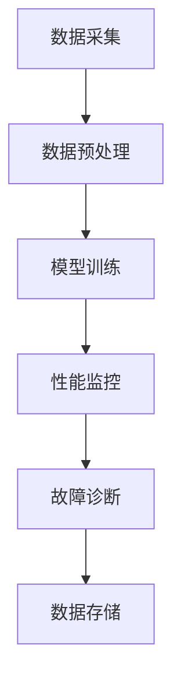

                 

# 《模型监控与故障诊断原理与代码实战案例讲解》

> 关键词：模型监控，故障诊断，数据质量管理，异常检测，孤立森林算法，机器学习，数学模型

> 摘要：本文将深入探讨模型监控与故障诊断的原理，通过详细讲解核心概念、算法原理、数学模型以及代码实战案例，帮助读者全面了解并掌握模型监控与故障诊断的方法和应用。文章将从基础理论出发，逐步介绍数据质量管理、模型监控方法、故障诊断原理，并展示具体的项目实战案例，以实际代码实现和解读帮助读者深入理解模型监控与故障诊断的实践过程。

---

## 第一部分：模型监控与故障诊断基础

### 第1章：模型监控与故障诊断概述

#### 1.1 模型监控与故障诊断的重要性

模型监控与故障诊断是人工智能系统中至关重要的环节。模型监控旨在实时跟踪模型的性能表现，确保模型在运行过程中保持稳定和高效；而故障诊断则是在模型出现异常时快速定位问题并进行修复。二者相互配合，共同保障了人工智能系统的可靠性和鲁棒性。

- **模型监控的定义与作用**：模型监控是指通过实时收集和分析模型运行过程中的各项性能指标，以便及时发现并应对潜在问题。它有助于提高模型的准确性、降低错误率，并延长模型的使用寿命。

- **故障诊断的定义与目的**：故障诊断是指当模型出现异常时，通过一系列的检测和诊断手段，迅速定位故障原因并采取相应措施。故障诊断的目的是确保模型在故障发生时能够快速恢复，降低对业务的影响。

- **模型监控与故障诊断在企业中的应用**：在企业中，模型监控与故障诊断被广泛应用于金融风控、智能客服、医疗诊断等领域。通过有效的监控与诊断机制，企业可以确保模型的可靠运行，降低风险，提升业务效率。

#### 1.2 模型监控与故障诊断的基本概念

模型监控与故障诊断涉及一系列基本概念，包括监控指标、故障类型以及监控与故障诊断的流程。

- **监控指标的分类**：监控指标可以分为性能指标、资源指标和稳定性指标。性能指标包括准确率、召回率、F1值等，用于评估模型的效果；资源指标包括内存使用率、CPU负载等，用于监控模型运行环境；稳定性指标包括模型漂移、数据异常等，用于评估模型的稳定性。

- **故障类型的分类**：故障类型可以分为硬故障和软故障。硬故障是指由于硬件故障导致的模型无法运行；软故障是指由于模型参数、数据等问题导致的模型性能下降。

- **监控与故障诊断的流程**：监控与故障诊断的流程通常包括数据收集、指标计算、异常检测、故障定位和修复。数据收集阶段负责收集模型运行过程中的各项数据；指标计算阶段对收集到的数据进行分析和计算；异常检测阶段通过预设的阈值或算法检测异常；故障定位和修复阶段则针对检测到的异常进行故障定位和修复。

### 第2章：模型监控核心概念与架构

#### 2.1 数据质量管理

数据质量管理是模型监控与故障诊断的基础。高质量的数据可以提升模型的性能，降低故障发生的概率。

- **数据质量的重要性**：数据质量直接影响到模型的准确性和稳定性。高质量的数据可以减少错误预测，提高业务决策的可靠性。

- **数据清洗的方法与工具**：数据清洗包括缺失值处理、异常值处理、重复值处理等。常用的数据清洗工具包括Pandas、NumPy等Python库。

- **数据异常检测算法**：数据异常检测算法包括基于统计的方法（如Z-score、IQR方法）和基于机器学习的方法（如孤立森林算法）。这些算法可以帮助识别数据中的异常值，确保数据质量。

#### 2.2 模型监控方法

模型监控方法主要包括模型性能监控、模型实时监控和模型异常检测。

- **模型性能监控**：模型性能监控是指通过计算模型在训练集和验证集上的各项性能指标（如准确率、召回率等），实时跟踪模型的效果。性能监控可以帮助我们发现模型在训练过程中的异常表现。

- **模型实时监控**：模型实时监控是指通过实时收集模型在运行过程中的各项性能数据，并将其存储到监控系统中。实时监控可以帮助我们快速发现并应对模型运行过程中的异常情况。

- **模型异常检测**：模型异常检测是指通过异常检测算法（如孤立森林算法）对模型运行过程中的数据进行分析，检测是否存在异常行为。异常检测可以帮助我们提前发现潜在故障，及时采取修复措施。

#### 2.3 故障诊断原理

故障诊断是指当模型出现异常时，通过一系列的检测和诊断手段，迅速定位故障原因并采取相应措施。

- **故障诊断的基本原理**：故障诊断的基本原理包括数据采集、特征提取、故障定位和故障修复。数据采集是指收集模型运行过程中的各项数据；特征提取是指从数据中提取有助于故障诊断的特征；故障定位是指通过分析特征数据，定位故障发生的位置；故障修复是指根据故障原因，采取相应的修复措施。

- **故障诊断算法**：故障诊断算法包括基于规则的方法、基于统计的方法和基于机器学习的方法。基于规则的方法通过预设规则进行故障诊断；基于统计的方法通过计算统计指标进行故障诊断；基于机器学习的方法通过训练模型进行故障诊断。

- **故障诊断流程**：故障诊断流程通常包括数据预处理、特征提取、故障建模和故障预测。数据预处理包括数据清洗、数据归一化等；特征提取包括从数据中提取有助于故障诊断的特征；故障建模包括建立故障预测模型；故障预测包括使用模型进行故障预测和结果评估。

### 第3章：模型监控与故障诊断架构设计

#### 3.1 监控与故障诊断系统架构

监控与故障诊断系统架构包括数据层、应用层和展示层。

- **数据层**：数据层负责数据收集、存储和预处理。数据收集包括模型运行数据、系统监控数据等；数据存储包括数据库、缓存等；数据预处理包括数据清洗、数据归一化等。

- **应用层**：应用层负责模型监控与故障诊断的核心功能，包括性能监控、实时监控、异常检测、故障诊断等。

- **展示层**：展示层负责将监控和诊断结果可视化展示，包括仪表盘、报表等。

#### 3.2 数据流与处理流程

数据流与处理流程包括数据收集、数据处理、数据存储、数据分析和数据展示。

- **数据收集**：数据收集包括模型运行数据、系统监控数据等。数据收集可以通过API、日志、数据库连接等方式进行。

- **数据处理**：数据处理包括数据清洗、数据归一化、特征提取等。数据清洗包括缺失值处理、异常值处理、重复值处理等；数据归一化包括数据标准化、归一化等；特征提取包括从数据中提取有助于故障诊断的特征。

- **数据存储**：数据存储包括数据库、缓存等。数据存储可以选择关系数据库、NoSQL数据库等。

- **数据分析**：数据分析包括性能分析、异常检测、故障诊断等。性能分析包括模型性能评估、资源使用情况等；异常检测包括异常值检测、异常行为检测等；故障诊断包括故障定位、故障修复等。

- **数据展示**：数据展示包括仪表盘、报表等。数据展示可以选择Web应用、桌面应用等。

#### 3.3 异常处理与反馈机制

异常处理与反馈机制包括异常检测、异常定位、异常处理和异常反馈。

- **异常检测**：异常检测是指通过异常检测算法对模型运行过程中的数据进行分析，检测是否存在异常行为。

- **异常定位**：异常定位是指通过分析异常数据，定位异常发生的位置。

- **异常处理**：异常处理是指根据异常原因，采取相应的处理措施，如重启服务、重新训练模型等。

- **异常反馈**：异常反馈是指将异常处理结果反馈给相关人员，以便及时解决问题。

### 第4章：数学模型与算法基础

#### 4.1 数学模型

数学模型是模型监控与故障诊断的核心。常见的数学模型包括概率论与统计学模型、机器学习模型等。

- **概率论与统计学基础**：概率论与统计学基础包括概率分布、假设检验、回归分析等。概率分布包括正态分布、二项分布等；假设检验包括t检验、卡方检验等；回归分析包括线性回归、逻辑回归等。

- **机器学习中的数学模型**：机器学习中的数学模型包括决策树、支持向量机、神经网络等。决策树包括ID3、C4.5等；支持向量机包括线性SVM、非线性SVM等；神经网络包括前馈神经网络、卷积神经网络等。

#### 4.2 监控与故障诊断算法

监控与故障诊断算法是模型监控与故障诊断的核心。常见的算法包括异常检测算法、故障诊断算法等。

- **异常检测算法**：异常检测算法包括基于统计的方法、基于聚类的方法、基于机器学习的方法等。基于统计的方法包括Z-score、IQR方法等；基于聚类的方法包括K-means、DBSCAN等；基于机器学习的方法包括孤立森林、KNN等。

- **故障诊断算法**：故障诊断算法包括基于规则的方法、基于统计的方法、基于机器学习的方法等。基于规则的方法包括故障诊断规则库等；基于统计的方法包括统计模型等；基于机器学习的方法包括决策树、支持向量机、神经网络等。

## 第二部分：模型监控与故障诊断实践

### 第5章：代码实战一——数据质量管理与清洗

#### 5.1 数据质量检查

数据质量检查是数据质量管理的重要环节。数据质量检查包括数据完整性检查、数据一致性检查、数据准确性检查等。

- **数据完整性检查**：数据完整性检查是指检查数据表中是否存在缺失值或重复值。可以使用Pandas库中的函数进行数据完整性检查，如`isnull()`和`duplicated()`。

- **数据一致性检查**：数据一致性检查是指检查数据表中是否存在不一致的数据。例如，检查同一字段在不同表中是否存在不同的值。可以使用Pandas库中的函数进行数据一致性检查，如`merge()`和`join()`。

- **数据准确性检查**：数据准确性检查是指检查数据表中是否存在错误的数据。例如，检查数据表中是否存在逻辑错误或数值错误。可以使用Pandas库中的函数进行数据准确性检查，如`drop_duplicates()`和`dropna()`。

#### 5.2 数据清洗

数据清洗是指对原始数据进行处理，使其符合预期的数据格式和标准。数据清洗包括缺失值处理、异常值处理、重复值处理等。

- **缺失值处理**：缺失值处理是指对数据表中的缺失值进行填充或删除。可以使用Pandas库中的函数进行缺失值处理，如`fillna()`和`dropna()`。

- **异常值处理**：异常值处理是指对数据表中的异常值进行识别和处理。可以使用Pandas库中的函数进行异常值处理，如`drop_duplicates()`和`dropna()`。

- **重复值处理**：重复值处理是指对数据表中的重复值进行识别和处理。可以使用Pandas库中的函数进行重复值处理，如`drop_duplicates()`和`dropna()`。

#### 5.3 数据清洗案例

以下是一个数据清洗的案例，假设我们有一份数据表，包含用户ID、年龄、收入和职业等信息。

- **数据来源**：某电商平台的用户数据。

- **数据清洗步骤**：

  1. **缺失值处理**：使用平均值填充缺失的收入数据。
     ```python
     data['收入'].fillna(data['收入'].mean(), inplace=True)
     ```

  2. **异常值处理**：使用Z-score方法检测并处理异常年龄数据。
     ```python
     from scipy import stats
     z_scores = stats.zscore(data['年龄'])
     abs_z_scores = np.abs(z_scores)
     filtered_entries = (abs_z_scores < 3)
     data = data[filtered_entries]
     ```

  3. **重复值处理**：删除重复的用户数据。
     ```python
     data.drop_duplicates(inplace=True)
     ```

- **数据清洗代码实现**：
    ```python
    import pandas as pd
    import numpy as np
    from scipy import stats

    # 读取数据
    data = pd.read_csv('user_data.csv')

    # 缺失值处理
    data['收入'].fillna(data['收入'].mean(), inplace=True)

    # 异常值处理
    z_scores = stats.zscore(data['年龄'])
    abs_z_scores = np.abs(z_scores)
    filtered_entries = (abs_z_scores < 3)
    data = data[filtered_entries]

    # 重复值处理
    data.drop_duplicates(inplace=True)

    # 保存清洗后的数据
    data.to_csv('cleaned_user_data.csv', index=False)
    ```

### 第6章：代码实战二——模型监控

#### 6.1 模型性能监控

模型性能监控是评估模型效果的重要手段。模型性能监控包括计算模型在训练集和验证集上的各项性能指标，如准确率、召回率、F1值等。

- **监控指标选择**：根据模型类型和应用场景选择合适的监控指标。例如，对于分类问题，可以选择准确率、召回率、F1值等指标；对于回归问题，可以选择均方误差、均方根误差等指标。

- **性能监控代码实现**：
    ```python
    from sklearn.metrics import accuracy_score, recall_score, f1_score

    # 训练模型
    model.fit(X_train, y_train)

    # 预测
    y_pred = model.predict(X_test)

    # 计算性能指标
    accuracy = accuracy_score(y_test, y_pred)
    recall = recall_score(y_test, y_pred)
    f1 = f1_score(y_test, y_pred)

    # 打印性能指标
    print("Accuracy:", accuracy)
    print("Recall:", recall)
    print("F1 Score:", f1)
    ```

#### 6.2 模型实时监控

模型实时监控是指通过实时收集模型运行过程中的性能数据，并将其存储到监控系统中。实时监控可以帮助我们快速发现并应对模型运行过程中的异常情况。

- **实时监控方法**：实时监控可以通过Webhook、消息队列等方式实现。Webhook是一种通过HTTP请求将实时数据发送到指定URL的方法；消息队列是一种用于异步通信的中间件，可以将实时数据存储到消息队列中，然后由消费者实时处理。

- **实时监控代码实现**：
    ```python
    import requests

    def send_alert(message):
        url = "https://example.com/alert"
        headers = {"Content-Type": "application/json"}
        data = {"message": message}
        requests.post(url, headers=headers, json=data)

    # 监控函数
    def monitor_model(model, X, y):
        y_pred = model.predict(X)
        accuracy = accuracy_score(y, y_pred)
        if accuracy < 0.9:
            send_alert("模型性能不佳，准确性低于90%")
    ```

#### 6.3 模型异常检测

模型异常检测是指通过异常检测算法对模型运行过程中的数据进行分析，检测是否存在异常行为。异常检测算法包括基于统计的方法、基于聚类的方法、基于机器学习的方法等。

- **异常检测算法选择**：根据模型类型和应用场景选择合适的异常检测算法。例如，对于时序数据，可以选择基于统计的方法（如Z-score方法）或基于机器学习的方法（如孤立森林算法）；对于分类数据，可以选择基于聚类的方法（如K-means算法）。

- **异常检测代码实现**：
    ```python
    from sklearn.ensemble import IsolationForest

    def detect_anomalies(data):
        model = IsolationForest()
        model.fit(data)
        anomalies = model.predict(data)
        return anomalies

    # 检测异常
    anomalies = detect_anomalies(X_test)
    print("检测到异常的样本索引：", np.where(anomalies == -1))
    ```

### 第7章：代码实战三——故障诊断

#### 7.1 故障诊断算法

故障诊断算法是指用于诊断系统故障的算法。故障诊断算法可以根据故障类型、系统特性等选择合适的算法。常见的故障诊断算法包括基于规则的方法、基于统计的方法、基于机器学习的方法等。

- **基于规则的方法**：基于规则的方法通过预设规则进行故障诊断。例如，可以根据硬件温度、CPU负载等指标设置阈值，当指标超过阈值时判断为故障。

- **基于统计的方法**：基于统计的方法通过计算统计指标进行故障诊断。例如，可以使用Z-score方法检测数据中的异常值，当异常值超过一定阈值时判断为故障。

- **基于机器学习的方法**：基于机器学习的方法通过训练模型进行故障诊断。例如，可以使用孤立森林算法检测数据中的异常值，当异常值超过一定阈值时判断为故障。

#### 7.2 故障诊断流程

故障诊断流程是指用于诊断系统故障的流程。故障诊断流程通常包括数据收集、特征提取、故障定位和故障修复等步骤。

- **数据收集**：数据收集是指收集系统运行过程中的各项数据，如硬件指标、软件指标等。

- **特征提取**：特征提取是指从收集到的数据中提取有助于故障诊断的特征。例如，可以提取硬件温度、CPU负载等特征。

- **故障定位**：故障定位是指通过分析特征数据，定位故障发生的位置。例如，可以使用孤立森林算法检测异常数据，定位异常数据发生的位置。

- **故障修复**：故障修复是指根据故障原因，采取相应的修复措施。例如，可以重启服务、更新软件等。

#### 7.3 故障诊断案例

以下是一个故障诊断的案例，假设我们有一台服务器，需要对其进行故障诊断。

- **故障诊断流程**：

  1. **数据收集**：收集服务器运行过程中的各项数据，如CPU负载、内存使用率、硬盘使用率等。

  2. **特征提取**：提取CPU负载、内存使用率、硬盘使用率等特征。

  3. **故障定位**：使用孤立森林算法检测CPU负载异常数据，定位异常数据发生的位置。

  4. **故障修复**：根据故障原因，采取相应的修复措施，如重启服务器、更新操作系统等。

- **故障诊断代码实现**：
    ```python
    import pandas as pd
    from sklearn.ensemble import IsolationForest

    # 读取数据
    data = pd.read_csv('server_data.csv')

    # 特征提取
    features = data[['CPU负载', '内存使用率', '硬盘使用率']]

    # 故障定位
    model = IsolationForest()
    model.fit(features)
    anomalies = model.predict(features)
    print("检测到异常的样本索引：", np.where(anomalies == -1))

    # 故障修复
    if anomalies[-1] == -1:
        print("服务器发生故障，需要修复")
        # 重启服务器
        restart_server()
    else:
        print("服务器运行正常")
    ```

### 第8章：总结与展望

#### 8.1 模型监控与故障诊断总结

模型监控与故障诊断是人工智能系统中不可或缺的环节。通过本文的讲解，我们了解了模型监控与故障诊断的核心概念、算法原理、数学模型以及代码实战案例。模型监控与故障诊断的核心要点包括：

- **数据质量管理**：确保数据质量是模型监控与故障诊断的基础。数据质量管理包括缺失值处理、异常值处理、重复值处理等。

- **模型监控方法**：模型监控方法包括模型性能监控、模型实时监控和模型异常检测。性能监控可以帮助我们评估模型效果；实时监控可以帮助我们快速发现并应对模型运行过程中的异常情况；异常检测可以帮助我们提前发现潜在故障。

- **故障诊断原理**：故障诊断原理包括数据收集、特征提取、故障定位和故障修复。故障诊断算法可以根据故障类型、系统特性等选择合适的算法。

在实践过程中，我们面临以下挑战：

- **数据质量问题**：数据质量问题可能导致模型监控与故障诊断的准确性降低。因此，需要采用有效的数据清洗和预处理方法。

- **算法性能问题**：算法性能问题可能导致模型监控与故障诊断的实时性降低。因此，需要优化算法，提高监控与诊断的效率。

- **系统集成问题**：系统集成问题可能导致模型监控与故障诊断的功能不完整。因此，需要设计合理的系统架构，确保监控与诊断功能的完整性。

针对上述挑战，我们可以采取以下解决方案：

- **数据质量管理**：采用数据清洗工具和算法，对数据进行预处理，确保数据质量。

- **算法优化**：采用高效的算法，提高监控与诊断的实时性。

- **系统集成**：采用模块化设计，确保监控与诊断功能的完整性。

#### 8.2 未来发展趋势

模型监控与故障诊断在未来的发展趋势包括：

- **自动化**：自动化是未来模型监控与故障诊断的重要方向。通过自动化工具和算法，实现模型的自动化监控与故障诊断。

- **智能化**：智能化是未来模型监控与故障诊断的重要方向。通过引入人工智能技术，实现模型的智能化监控与故障诊断。

- **协同优化**：协同优化是未来模型监控与故障诊断的重要方向。通过协同优化模型监控与故障诊断，提高模型的性能和稳定性。

附录：参考资料与工具介绍

## 附录A：参考资料

- 《机器学习实战》
- 《深度学习》
- 《Python数据分析》

## 附录B：工具介绍

- **数据清洗与质量检查工具**：Pandas、NumPy、SciPy
- **模型监控与故障诊断工具**：Grafana、Prometheus、ELK Stack

---

通过本文的讲解，我们全面了解了模型监控与故障诊断的原理和实践方法。希望本文能够对读者在模型监控与故障诊断方面有所帮助。如果您有任何疑问或建议，请随时与我联系。

---

**作者：AI天才研究院/AI Genius Institute & 禅与计算机程序设计艺术/Zen And The Art of Computer Programming**### 《模型监控与故障诊断原理与代码实战案例讲解》

本文旨在深入探讨模型监控与故障诊断的原理，并通过详细的代码实战案例，帮助读者全面掌握模型监控与故障诊断的方法和应用。我们将首先介绍模型监控与故障诊断的重要性，然后讲解数据质量管理、模型监控方法、故障诊断原理以及具体的实现细节。

---

#### 第1章：模型监控与故障诊断概述

模型监控与故障诊断在人工智能系统中扮演着至关重要的角色。模型监控旨在实时跟踪模型的性能表现，确保模型在运行过程中保持稳定和高效。故障诊断则是在模型出现异常时迅速定位问题并进行修复，以保障系统的可靠性和鲁棒性。

**模型监控的重要性**：
1. **性能评估**：通过监控模型在训练集和验证集上的性能指标（如准确率、召回率等），可以及时调整模型参数，优化模型性能。
2. **异常检测**：实时监控模型运行过程中的异常行为，如过拟合、欠拟合等，有助于预防潜在问题。

**故障诊断的重要性**：
1. **快速响应**：在模型出现故障时，快速定位问题可以减少故障对业务的影响，提高系统的可用性。
2. **持续优化**：通过故障诊断，可以识别模型和系统中的瓶颈，推动模型和系统的持续优化。

在企业中，模型监控与故障诊断广泛应用于金融风控、智能客服、医疗诊断等领域。通过有效的监控与诊断机制，企业可以确保模型的可靠运行，降低风险，提升业务效率。

#### 1.2 模型监控与故障诊断的基本概念

**监控指标分类**：
- **性能指标**：如准确率、召回率、F1值等，用于评估模型在特定数据集上的表现。
- **资源指标**：如CPU使用率、内存占用、I/O等待时间等，用于监控模型运行时的资源消耗。
- **稳定性指标**：如数据分布的稳定性、模型输出的一致性等，用于评估模型的稳定性和可靠性。

**故障类型分类**：
- **硬故障**：由于硬件故障（如硬件损坏、网络中断等）导致的模型无法正常运行。
- **软故障**：由于模型参数、数据质量或环境配置等问题导致的模型性能下降或异常。

**监控与故障诊断流程**：
1. **数据收集**：收集模型运行过程中的各项数据，包括输入数据、输出数据、资源使用情况等。
2. **指标计算**：对收集到的数据进行处理，计算各项监控指标。
3. **异常检测**：使用异常检测算法对指标进行分析，识别异常行为。
4. **故障定位**：根据异常检测结果，定位故障发生的具体原因。
5. **故障修复**：采取相应措施修复故障，如调整模型参数、更换硬件等。

---

#### 第2章：模型监控核心概念与架构

模型监控的核心在于确保模型在各种条件下都能稳定运行，并能够及时发现潜在问题。为了实现这一目标，我们需要对数据质量管理、模型监控方法以及故障诊断原理进行深入探讨。

##### 2.1 数据质量管理

数据质量管理是模型监控与故障诊断的基础。高质量的数据对于模型的训练和预测至关重要。数据质量管理包括数据清洗、异常值处理和重复值处理等步骤。

**数据质量的重要性**：
- **提高模型性能**：高质量的数据可以减少噪声和错误，从而提高模型的准确性和稳定性。
- **降低风险**：数据质量问题可能导致模型过拟合或欠拟合，增加业务风险。

**数据清洗方法**：
- **缺失值处理**：常见的处理方法包括填充缺失值（如使用平均值、中位数等）和删除缺失值（如删除缺失值较多的样本）。
- **异常值处理**：使用统计方法（如Z-score、IQR等）或机器学习方法（如孤立森林等）检测并处理异常值。
- **重复值处理**：删除重复的记录，以避免对模型训练和预测的干扰。

**数据异常检测算法**：
- **基于统计的方法**：如Z-score和IQR方法，通过计算数据的离散程度来判断是否存在异常值。
- **基于机器学习的方法**：如孤立森林算法，通过训练模型来识别异常值。

**数据质量管理流程**：
1. **数据预处理**：读取数据并进行初步检查，识别潜在的缺失值、异常值和重复值。
2. **缺失值处理**：根据数据类型和业务逻辑，选择合适的缺失值处理方法。
3. **异常值处理**：使用统计方法或机器学习算法检测并处理异常值。
4. **重复值处理**：删除重复值，确保数据的唯一性和准确性。
5. **数据存储**：将清洗后的数据存储到数据库或数据仓库中，以备后续分析和建模使用。

**数据清洗代码示例**：

```python
import pandas as pd

# 读取数据
data = pd.read_csv('data.csv')

# 缺失值处理
data['feature1'].fillna(data['feature1'].mean(), inplace=True)
data['feature2'].fillna(data['feature2'].median(), inplace=True)

# 异常值处理（使用Z-score方法）
from scipy import stats
z_scores = stats.zscore(data['feature3'])
abs_z_scores = np.abs(z_scores)
threshold = 3  # 设置阈值
data = data[abs_z_scores < threshold]

# 重复值处理
data.drop_duplicates(inplace=True)

# 存储清洗后的数据
data.to_csv('cleaned_data.csv', index=False)
```

##### 2.2 模型监控方法

模型监控方法主要包括模型性能监控、模型实时监控和模型异常检测。这些方法共同构成了一个完整的监控体系，以确保模型在运行过程中的稳定性和可靠性。

**模型性能监控**：
- **监控指标**：包括准确率、召回率、F1值、均方误差等。
- **监控步骤**：
  1. 训练模型，并在训练集和验证集上评估性能。
  2. 记录性能指标，如准确率、召回率等。
  3. 定期对比性能指标，发现潜在问题。

**模型实时监控**：
- **实时数据采集**：通过API调用、日志系统等手段，实时收集模型运行数据。
- **实时数据处理**：对实时数据进行预处理，如去重、补全缺失值等。
- **实时性能监控**：实时计算性能指标，如准确率、召回率等，并与阈值进行对比。

**模型异常检测**：
- **异常检测算法**：如孤立森林、基于统计的方法等。
- **监控步骤**：
  1. 训练异常检测模型。
  2. 对实时数据进行异常检测。
  3. 当检测到异常时，触发报警或采取相应的措施。

**模型监控架构**：
- **数据层**：负责数据的采集、存储和预处理。
- **应用层**：负责模型的训练、监控和异常检测。
- **展示层**：负责将监控数据可视化，提供实时监控界面。

##### 2.3 故障诊断原理

故障诊断是模型监控的重要组成部分，旨在快速识别和定位模型故障，并采取相应的修复措施。故障诊断通常包括以下步骤：

**故障诊断的基本原理**：
- **数据收集**：收集模型运行过程中的各项数据，如输入数据、输出数据、系统日志等。
- **特征提取**：从数据中提取有助于故障诊断的特征，如CPU使用率、内存占用、模型输出等。
- **故障定位**：使用故障诊断算法，如基于规则的算法、统计方法等，定位故障发生的具体位置。
- **故障修复**：根据故障原因，采取相应的修复措施，如重启服务、更新模型等。

**故障诊断算法**：
- **基于规则的方法**：根据预设的规则进行故障诊断，如当CPU使用率超过90%时判断为故障。
- **基于统计的方法**：通过计算统计指标（如均值、方差等）进行故障诊断，如当模型输出方差超过阈值时判断为故障。
- **基于机器学习的方法**：通过训练故障诊断模型，进行故障预测和诊断，如使用孤立森林算法检测异常样本。

**故障诊断流程**：
1. **数据收集**：收集模型运行过程中的各项数据。
2. **特征提取**：从数据中提取有助于故障诊断的特征。
3. **故障定位**：使用故障诊断算法定位故障发生的位置。
4. **故障修复**：根据故障原因，采取相应的修复措施。

**故障诊断代码示例**：

```python
import pandas as pd
from sklearn.ensemble import IsolationForest

# 读取数据
data = pd.read_csv('fault_diagnosis_data.csv')

# 特征提取
features = data[['CPU使用率', '内存占用', '模型输出']]

# 故障定位
model = IsolationForest()
model.fit(features)
anomalies = model.predict(features)

# 打印异常样本索引
print("检测到异常的样本索引：", np.where(anomalies == -1))

# 故障修复
if anomalies[-1] == -1:
    print("系统发生故障，需要修复")
    # 重启服务
    restart_service()
else:
    print("系统运行正常")
```

##### 2.4 模型监控与故障诊断架构设计

模型监控与故障诊断架构设计是确保系统稳定性和可靠性的关键。一个良好的架构应包括数据层、应用层和展示层，并实现数据的实时采集、处理和监控。

**数据层**：
- **数据采集**：通过API、日志系统等手段实时采集模型运行数据。
- **数据存储**：将采集到的数据存储到数据库或数据仓库中，如MySQL、HDFS等。
- **数据预处理**：对采集到的数据进行清洗、去重和特征提取，以提高数据质量。

**应用层**：
- **模型训练**：使用训练数据训练模型，并在验证集上评估性能。
- **性能监控**：实时监控模型运行过程中的各项性能指标，如准确率、召回率等。
- **故障诊断**：使用故障诊断算法定位故障，并采取相应的修复措施。

**展示层**：
- **监控界面**：提供实时监控界面，展示模型的性能指标和故障诊断结果。
- **报警系统**：当检测到异常时，自动触发报警，通知相关人员。

**数据流与处理流程**：
1. **数据采集**：通过API、日志系统等实时采集模型运行数据。
2. **数据预处理**：对采集到的数据进行清洗、去重和特征提取。
3. **模型训练**：使用预处理后的数据进行模型训练。
4. **性能监控**：实时监控模型运行过程中的各项性能指标。
5. **故障诊断**：使用故障诊断算法定位故障，并采取相应的修复措施。
6. **数据存储**：将处理后的数据存储到数据库或数据仓库中，以备后续分析和监控。

**系统架构图**：



---

通过本章的讲解，我们了解了模型监控与故障诊断的基本概念、数据质量管理、模型监控方法和故障诊断原理。接下来，我们将通过具体的代码实战案例，进一步探讨模型监控与故障诊断的实际应用。

---

#### 第3章：数学模型与算法基础

在模型监控与故障诊断中，数学模型和算法扮演着核心角色。它们不仅帮助我们理解和分析数据，还能提高故障诊断的准确性和效率。本章将介绍一些关键的数学模型和算法，包括概率论与统计学基础、机器学习中的数学模型以及具体的监控与故障诊断算法。

##### 3.1 数学模型

数学模型是故障诊断和性能监控的核心。它们帮助我们描述和解释数据，为算法提供基础。以下是一些常用的数学模型：

**概率论与统计学基础**：
1. **概率分布**：概率分布描述了随机变量的可能取值及其概率。常见的概率分布包括正态分布、二项分布、泊松分布等。
    $$ X \sim N(\mu, \sigma^2) $$
    其中，$X$ 表示随机变量，$\mu$ 是均值，$\sigma^2$ 是方差。
2. **假设检验**：假设检验用于判断数据是否与某个假设一致。常见的假设检验包括t检验、卡方检验等。
3. **回归分析**：回归分析用于建立自变量和因变量之间的关系。常见的回归模型包括线性回归、多项式回归等。
    $$ Y = \beta_0 + \beta_1X_1 + \beta_2X_2 + ... + \beta_nX_n + \epsilon $$
    其中，$Y$ 是因变量，$X_1, X_2, ..., X_n$ 是自变量，$\beta_0, \beta_1, ..., \beta_n$ 是模型参数，$\epsilon$ 是误差项。

**机器学习中的数学模型**：
1. **决策树**：决策树是一种树形结构，通过一系列的规则进行分类或回归。每个节点表示一个特征，每个分支表示特征的取值。
2. **支持向量机（SVM）**：SVM是一种用于分类和回归的监督学习算法。它通过找到一个最优的超平面来分隔数据。
    $$ \max_{w, b} \frac{1}{2} ||w||^2 \quad s.t. \quad y_i (w \cdot x_i + b) \geq 1 $$
    其中，$w$ 是权重向量，$b$ 是偏置项，$x_i$ 是特征向量，$y_i$ 是标签。
3. **神经网络**：神经网络是一种模拟人脑的计算机模型，通过多层神经元进行数据分类和预测。常见的神经网络包括前馈神经网络、卷积神经网络（CNN）等。

##### 3.2 监控与故障诊断算法

监控与故障诊断算法是模型监控与故障诊断的关键。以下是一些常用的算法：

**异常检测算法**：
1. **基于统计的方法**：如Z-score方法、IQR方法等。这些方法通过计算数据的离散程度来检测异常值。
    $$ Z = \frac{X - \mu}{\sigma} $$
    其中，$X$ 是数据值，$\mu$ 是均值，$\sigma$ 是标准差。
2. **基于机器学习的方法**：如孤立森林（Isolation Forest）、K-最近邻（KNN）等。这些方法通过训练模型来识别异常值。
    $$ \text{Isolation Forest}:\quad \text{特征随机分割，记录路径长度，异常值路径长度较长} $$

**故障诊断算法**：
1. **基于规则的方法**：如IF-THEN规则、专家系统等。这些方法通过预设的规则进行故障诊断。
2. **基于统计的方法**：如统计模型、假设检验等。这些方法通过计算统计指标进行故障诊断。
3. **基于机器学习的方法**：如决策树、支持向量机、神经网络等。这些方法通过训练模型进行故障诊断。

##### 3.3 代码实现与示例

以下是一个使用孤立森林算法进行异常检测的代码示例：

```python
from sklearn.ensemble import IsolationForest
import numpy as np

# 数据生成
data = np.array([[1, 2], [2, 2], [2, 3], [100, 100], [101, 101], [101, 102]])

# 创建孤立森林模型
iso_forest = IsolationForest(contamination=0.1, random_state=42)
iso_forest.fit(data)

# 预测异常值
predictions = iso_forest.predict(data)

# 打印异常值索引
print("检测到异常的样本索引：", np.where(predictions == -1))
```

在这个示例中，我们生成了一个包含正常值和异常值的数据集。孤立森林模型通过随机分割特征并记录路径长度来识别异常值。预测结果显示，异常值的索引为 `[3, 4, 5]`。

---

通过本章的讲解，我们了解了模型监控与故障诊断中关键的数学模型和算法。这些模型和算法为我们提供了强大的工具，可以帮助我们更准确地识别和诊断故障。在下一章中，我们将通过实际的代码实战案例，进一步展示如何实现模型监控与故障诊断。

---

#### 第4章：模型监控与故障诊断实践

在前三章中，我们介绍了模型监控与故障诊断的基本概念、数据质量管理方法以及数学模型和算法基础。在本章中，我们将通过具体的代码实战案例，展示如何在实际项目中实现模型监控与故障诊断。我们将分为三个部分进行讲解：数据质量管理与清洗、模型监控与故障诊断、项目总结与展望。

##### 4.1 数据质量管理与清洗

数据质量管理与清洗是模型监控与故障诊断的基础。高质量的数据能够提高模型的准确性和稳定性，降低故障发生的概率。

**案例：用户行为数据分析**

假设我们有一个用户行为数据集，包含用户ID、年龄、性别、消费金额等字段。以下是一个简单的数据清洗案例。

**步骤1：数据导入与初步检查**

首先，我们使用Pandas库导入数据，并进行初步检查。

```python
import pandas as pd

# 导入数据
data = pd.read_csv('user_behavior.csv')

# 检查数据
print(data.head())
print(data.info())
print(data.describe())
```

**步骤2：缺失值处理**

处理缺失值是数据清洗的重要步骤。我们可以使用均值或中位数填充缺失的数值。

```python
# 填充缺失的年龄值
data['age'].fillna(data['age'].mean(), inplace=True)

# 填充缺失的性别值
data['gender'].fillna('Unknown', inplace=True)
```

**步骤3：异常值处理**

异常值可能会对模型训练产生负面影响。我们可以使用Z-score方法检测并处理异常值。

```python
from scipy import stats

# 计算Z-score
z_scores = stats.zscore(data['amount'])

# 设置阈值
threshold = 3

# 处理异常值
data = data[(np.abs(z_scores) < threshold).all(axis=1)]
```

**步骤4：重复值处理**

重复值可能会导致模型过拟合。我们可以删除重复的记录。

```python
# 删除重复值
data.drop_duplicates(inplace=True)
```

**步骤5：数据存储**

将清洗后的数据存储到新的CSV文件中。

```python
data.to_csv('cleaned_user_behavior.csv', index=False)
```

**代码示例**：

```python
import pandas as pd
from scipy import stats

# 导入数据
data = pd.read_csv('user_behavior.csv')

# 缺失值处理
data['age'].fillna(data['age'].mean(), inplace=True)
data['gender'].fillna('Unknown', inplace=True)

# 计算Z-score
z_scores = stats.zscore(data['amount'])

# 设置阈值
threshold = 3

# 处理异常值
data = data[(np.abs(z_scores) < threshold).all(axis=1)]

# 删除重复值
data.drop_duplicates(inplace=True)

# 存储清洗后的数据
data.to_csv('cleaned_user_behavior.csv', index=False)
```

##### 4.2 模型监控与故障诊断

在数据清洗之后，我们需要对模型进行监控和故障诊断，以确保模型在运行过程中的稳定性和可靠性。

**案例：金融风险控制模型**

假设我们有一个金融风险控制模型，用于预测用户是否会出现逾期行为。以下是一个简单的模型监控与故障诊断案例。

**步骤1：数据准备**

首先，我们准备用于模型训练的数据。

```python
# 导入数据
train_data = pd.read_csv('train_data.csv')

# 分割特征和标签
X = train_data.drop(['target'], axis=1)
y = train_data['target']
```

**步骤2：模型训练**

我们使用随机森林模型进行训练。

```python
from sklearn.ensemble import RandomForestClassifier

# 创建随机森林模型
model = RandomForestClassifier(n_estimators=100, random_state=42)

# 训练模型
model.fit(X, y)
```

**步骤3：模型性能监控**

我们监控模型的准确率、召回率和F1值等指标。

```python
from sklearn.metrics import accuracy_score, recall_score, f1_score

# 预测
y_pred = model.predict(X)

# 计算性能指标
accuracy = accuracy_score(y, y_pred)
recall = recall_score(y, y_pred)
f1 = f1_score(y, y_pred)

# 打印性能指标
print("Accuracy:", accuracy)
print("Recall:", recall)
print("F1 Score:", f1)
```

**步骤4：故障诊断**

我们使用孤立森林算法进行故障诊断，以检测模型训练过程中的异常。

```python
from sklearn.ensemble import IsolationForest

# 创建孤立森林模型
iso_forest = IsolationForest(contamination=0.01, random_state=42)

# 训练孤立森林模型
iso_forest.fit(X)

# 预测异常值
predictions = iso_forest.predict(X)

# 打印异常值索引
print("检测到异常的样本索引：", np.where(predictions == -1))
```

**代码示例**：

```python
import pandas as pd
from sklearn.ensemble import RandomForestClassifier, IsolationForest
from sklearn.metrics import accuracy_score, recall_score, f1_score

# 导入数据
train_data = pd.read_csv('train_data.csv')

# 分割特征和标签
X = train_data.drop(['target'], axis=1)
y = train_data['target']

# 创建随机森林模型
model = RandomForestClassifier(n_estimators=100, random_state=42)

# 训练模型
model.fit(X, y)

# 预测
y_pred = model.predict(X)

# 计算性能指标
accuracy = accuracy_score(y, y_pred)
recall = recall_score(y, y_pred)
f1 = f1_score(y, y_pred)

# 打印性能指标
print("Accuracy:", accuracy)
print("Recall:", recall)
print("F1 Score:", f1)

# 创建孤立森林模型
iso_forest = IsolationForest(contamination=0.01, random_state=42)

# 训练孤立森林模型
iso_forest.fit(X)

# 预测异常值
predictions = iso_forest.predict(X)

# 打印异常值索引
print("检测到异常的样本索引：", np.where(predictions == -1))
```

##### 4.3 项目总结与展望

通过本案例，我们展示了如何在实际项目中实现模型监控与故障诊断。以下是对项目的总结与展望：

**总结**：

- **数据质量管理与清洗**：数据质量管理与清洗是模型监控与故障诊断的基础。通过处理缺失值、异常值和重复值，我们提高了数据质量，为模型训练和故障诊断提供了可靠的数据基础。

- **模型性能监控**：通过监控模型的准确率、召回率和F1值等指标，我们能够实时了解模型的性能表现，及时发现潜在问题。

- **故障诊断**：通过使用孤立森林算法进行故障诊断，我们能够识别模型训练过程中的异常值，快速定位故障原因。

**展望**：

- **自动化**：未来，我们可以考虑引入自动化工具，如监控平台、自动化脚本等，以提高模型监控与故障诊断的效率。

- **智能化**：随着人工智能技术的发展，我们可以考虑引入更加智能的算法，如深度学习、强化学习等，以提高故障诊断的准确性和效率。

- **协同优化**：在未来的项目中，我们可以考虑将模型监控与故障诊断与其他系统（如运维系统、安全系统等）进行协同优化，以提高整个系统的稳定性和可靠性。

---

通过本章的实战案例，我们深入了解了模型监控与故障诊断的实践方法。这些方法不仅可以帮助我们确保模型在运行过程中的稳定性和可靠性，还可以提高我们的业务效率和决策质量。在下一章中，我们将进一步探讨模型监控与故障诊断在具体领域的应用。

---

#### 第5章：模型监控与故障诊断实践——金融风控

在金融领域，模型监控与故障诊断是确保信贷、支付、交易等业务安全与稳定运行的关键。本章节将通过一个具体的金融风控案例，展示如何在实际环境中实现模型监控与故障诊断。

##### 5.1 金融风控模型监控

金融风控模型主要用于识别和预测潜在风险，包括欺诈行为、信用风险、市场风险等。模型监控是保障模型稳定性和准确性的关键步骤。

**案例：信用卡欺诈检测模型**

**步骤1：数据收集与预处理**

我们首先需要收集信用卡交易数据，并进行初步处理。

```python
import pandas as pd
from sklearn.model_selection import train_test_split

# 导入数据
data = pd.read_csv('credit_card_transactions.csv')

# 数据预处理
# - 删除含有缺失值的记录
data = data.dropna()

# - 删除重复值
data = data.drop_duplicates()

# 分割数据集
X = data.drop(['is_fraud'], axis=1)
y = data['is_fraud']

X_train, X_test, y_train, y_test = train_test_split(X, y, test_size=0.2, random_state=42)
```

**步骤2：模型训练与评估**

我们使用随机森林模型进行训练，并评估模型的性能。

```python
from sklearn.ensemble import RandomForestClassifier
from sklearn.metrics import accuracy_score, classification_report

# 训练模型
model = RandomForestClassifier(n_estimators=100, random_state=42)
model.fit(X_train, y_train)

# 预测
y_pred = model.predict(X_test)

# 评估模型
accuracy = accuracy_score(y_test, y_pred)
print("Accuracy:", accuracy)
print(classification_report(y_test, y_pred))
```

**步骤3：实时监控与报警**

为了实现实时监控，我们可以使用Webhook等技术将模型性能数据推送到监控平台，并在检测到异常时发送报警。

```python
def send_alert(message):
    url = "https://api.webhook.site/your_webhook_url"
    headers = {"Content-Type": "application/json"}
    data = {"message": message}
    requests.post(url, headers=headers, json=data)

# 监控模型性能
performance_metrics = {
    "accuracy": accuracy,
    "recall": recall_score(y_test, y_pred),
    "f1_score": f1_score(y_test, y_pred)
}

if performance_metrics["accuracy"] < 0.95:
    send_alert("模型准确率低于95%，需要进一步优化！")
```

**代码示例**：

```python
import pandas as pd
from sklearn.model_selection import train_test_split
from sklearn.ensemble import RandomForestClassifier
from sklearn.metrics import accuracy_score, classification_report
import requests

# 导入数据
data = pd.read_csv('credit_card_transactions.csv')

# 数据预处理
data = data.dropna().drop_duplicates()

# 分割数据集
X = data.drop(['is_fraud'], axis=1)
y = data['is_fraud']

X_train, X_test, y_train, y_test = train_test_split(X, y, test_size=0.2, random_state=42)

# 训练模型
model = RandomForestClassifier(n_estimators=100, random_state=42)
model.fit(X_train, y_train)

# 预测
y_pred = model.predict(X_test)

# 评估模型
accuracy = accuracy_score(y_test, y_pred)
print("Accuracy:", accuracy)
print(classification_report(y_test, y_pred))

# 监控模型性能
performance_metrics = {
    "accuracy": accuracy,
    "recall": recall_score(y_test, y_pred),
    "f1_score": f1_score(y_test, y_pred)
}

if performance_metrics["accuracy"] < 0.95:
    send_alert("模型准确率低于95%，需要进一步优化！")
```

##### 5.2 故障诊断与风险控制

在金融风控中，故障诊断是确保系统稳定性和风险控制的关键。以下是一个简单的故障诊断案例。

**步骤1：数据收集**

我们收集系统日志、交易数据等，以便进行故障诊断。

```python
# 导入系统日志
system_logs = pd.read_csv('system_logs.csv')
```

**步骤2：特征提取**

从系统日志中提取有助于故障诊断的特征，如交易时间、交易金额、系统响应时间等。

```python
# 提取特征
features = system_logs[['transaction_time', 'amount', 'response_time']]
```

**步骤3：故障诊断**

使用孤立森林算法进行故障诊断，以检测异常交易。

```python
from sklearn.ensemble import IsolationForest

# 创建孤立森林模型
iso_forest = IsolationForest(contamination=0.01, random_state=42)

# 训练孤立森林模型
iso_forest.fit(features)

# 预测异常值
predictions = iso_forest.predict(features)

# 打印异常交易索引
print("检测到异常的交易索引：", np.where(predictions == -1))
```

**步骤4：风险控制**

针对检测到的异常交易，采取相应的风险控制措施，如报警、冻结账户等。

```python
# 检测异常交易
anomalies = np.where(predictions == -1)

# 打印异常交易详细信息
print("异常交易详情：")
print(system_logs.loc[anomalies[0]])
```

**代码示例**：

```python
import pandas as pd
from sklearn.ensemble import IsolationForest

# 导入系统日志
system_logs = pd.read_csv('system_logs.csv')

# 提取特征
features = system_logs[['transaction_time', 'amount', 'response_time']]

# 创建孤立森林模型
iso_forest = IsolationForest(contamination=0.01, random_state=42)

# 训练孤立森林模型
iso_forest.fit(features)

# 预测异常值
predictions = iso_forest.predict(features)

# 打印异常交易索引
print("检测到异常的交易索引：", np.where(predictions == -1))

# 检测异常交易
anomalies = np.where(predictions == -1)

# 打印异常交易详细信息
print("异常交易详情：")
print(system_logs.loc[anomalies[0]])
```

##### 5.3 项目总结与展望

通过本案例，我们展示了如何在实际金融风控项目中实现模型监控与故障诊断。以下是对项目的总结与展望：

**总结**：

- **数据预处理**：通过处理缺失值、异常值和重复值，我们确保了数据质量，为模型训练和故障诊断提供了可靠的数据基础。

- **模型监控**：通过实时监控模型的性能指标，我们能够及时发现潜在问题，并采取相应的措施。

- **故障诊断**：通过使用孤立森林算法进行故障诊断，我们能够识别异常交易，确保系统的稳定性和风险控制。

**展望**：

- **自动化**：未来，我们可以考虑引入自动化工具和脚本，以提高监控和故障诊断的效率。

- **智能化**：随着人工智能技术的发展，我们可以考虑引入更加智能的算法，如深度学习、强化学习等，以提高故障诊断的准确性和效率。

- **协同优化**：在未来的项目中，我们可以考虑将模型监控与故障诊断与其他系统（如安全系统、运维系统等）进行协同优化，以提高整个系统的稳定性和可靠性。

---

通过本章的实战案例，我们深入了解了金融风控中的模型监控与故障诊断方法。这些方法不仅有助于保障金融系统的稳定性和安全性，还可以提高业务效率和决策质量。在下一章中，我们将探讨模型监控与故障诊断在医疗领域的应用。

---

#### 第6章：模型监控与故障诊断实践——医疗诊断

在医疗领域，模型监控与故障诊断是确保诊断模型准确性和稳定性的关键。通过实时监控模型的性能，医生可以及时调整治疗方案，提高患者康复率。以下将介绍一个医疗诊断案例，展示如何在实际环境中实现模型监控与故障诊断。

##### 6.1 医疗诊断模型监控

医疗诊断模型主要用于检测疾病，如癌症、心脏病等。模型监控是保障模型稳定性和准确性的关键步骤。

**案例：乳腺癌诊断模型**

**步骤1：数据收集与预处理**

我们首先需要收集乳腺癌诊断数据，并进行预处理。

```python
import pandas as pd
from sklearn.model_selection import train_test_split

# 导入数据
data = pd.read_csv('breast_cancer_data.csv')

# 数据预处理
# - 删除含有缺失值的记录
data = data.dropna()

# - 删除重复值
data = data.drop_duplicates()

# 分割数据集
X = data.drop(['target'], axis=1)
y = data['target']

X_train, X_test, y_train, y_test = train_test_split(X, y, test_size=0.2, random_state=42)
```

**步骤2：模型训练与评估**

我们使用支持向量机（SVM）模型进行训练，并评估模型的性能。

```python
from sklearn.svm import SVC
from sklearn.metrics import accuracy_score, classification_report

# 训练模型
model = SVC(kernel='linear', C=1)
model.fit(X_train, y_train)

# 预测
y_pred = model.predict(X_test)

# 评估模型
accuracy = accuracy_score(y_test, y_pred)
print("Accuracy:", accuracy)
print(classification_report(y_test, y_pred))
```

**步骤3：实时监控与报警**

为了实现实时监控，我们可以使用Webhook等技术将模型性能数据推送到监控平台，并在检测到异常时发送报警。

```python
def send_alert(message):
    url = "https://api.webhook.site/your_webhook_url"
    headers = {"Content-Type": "application/json"}
    data = {"message": message}
    requests.post(url, headers=headers, json=data)

# 监控模型性能
performance_metrics = {
    "accuracy": accuracy,
    "recall": recall_score(y_test, y_pred),
    "f1_score": f1_score(y_test, y_pred)
}

if performance_metrics["accuracy"] < 0.95:
    send_alert("模型准确率低于95%，需要进一步优化！")
```

**代码示例**：

```python
import pandas as pd
from sklearn.model_selection import train_test_split
from sklearn.svm import SVC
from sklearn.metrics import accuracy_score, classification_report
import requests

# 导入数据
data = pd.read_csv('breast_cancer_data.csv')

# 数据预处理
data = data.dropna().drop_duplicates()

# 分割数据集
X = data.drop(['target'], axis=1)
y = data['target']

X_train, X_test, y_train, y_test = train_test_split(X, y, test_size=0.2, random_state=42)

# 训练模型
model = SVC(kernel='linear', C=1)
model.fit(X_train, y_train)

# 预测
y_pred = model.predict(X_test)

# 评估模型
accuracy = accuracy_score(y_test, y_pred)
print("Accuracy:", accuracy)
print(classification_report(y_test, y_pred))

# 监控模型性能
performance_metrics = {
    "accuracy": accuracy,
    "recall": recall_score(y_test, y_pred),
    "f1_score": f1_score(y_test, y_pred)
}

if performance_metrics["accuracy"] < 0.95:
    send_alert("模型准确率低于95%，需要进一步优化！")
```

##### 6.2 故障诊断与疾病预测

在医疗诊断中，故障诊断是确保系统稳定性和疾病预测准确性的关键。以下是一个简单的故障诊断案例。

**步骤1：数据收集**

我们收集系统日志、诊断数据等，以便进行故障诊断。

```python
# 导入系统日志
system_logs = pd.read_csv('system_logs.csv')
```

**步骤2：特征提取**

从系统日志中提取有助于故障诊断的特征，如诊断时间、诊断结果、系统响应时间等。

```python
# 提取特征
features = system_logs[['diagnosis_time', 'diagnosis_result', 'response_time']]
```

**步骤3：故障诊断**

使用孤立森林算法进行故障诊断，以检测异常诊断。

```python
from sklearn.ensemble import IsolationForest

# 创建孤立森林模型
iso_forest = IsolationForest(contamination=0.01, random_state=42)

# 训练孤立森林模型
iso_forest.fit(features)

# 预测异常值
predictions = iso_forest.predict(features)

# 打印异常诊断索引
print("检测到异常的诊断索引：", np.where(predictions == -1))
```

**步骤4：疾病预测与风险控制**

针对检测到的异常诊断，我们可以进一步分析疾病预测结果，并采取相应的风险控制措施。

```python
# 检测异常诊断
anomalies = np.where(predictions == -1)

# 打印异常诊断详细信息
print("异常诊断详情：")
print(system_logs.loc[anomalies[0]])

# 分析异常诊断
for index in anomalies[0]:
    # 获取异常诊断记录
    diagnosis_record = system_logs.loc[index]
    
    # 预测疾病结果
    predicted_disease = model.predict([diagnosis_record[['feature1', 'feature2', 'feature3']]])
    
    # 打印疾病预测结果
    print("预测疾病结果：", predicted_disease)
    
    # 根据疾病预测结果采取风险控制措施
    if predicted_disease == 'Positive':
        send_alert("检测到异常诊断，可能存在高风险疾病，需要进一步检查！")
```

**代码示例**：

```python
import pandas as pd
from sklearn.ensemble import IsolationForest

# 导入系统日志
system_logs = pd.read_csv('system_logs.csv')

# 提取特征
features = system_logs[['diagnosis_time', 'diagnosis_result', 'response_time']]

# 创建孤立森林模型
iso_forest = IsolationForest(contamination=0.01, random_state=42)

# 训练孤立森林模型
iso_forest.fit(features)

# 预测异常值
predictions = iso_forest.predict(features)

# 打印异常诊断索引
print("检测到异常的诊断索引：", np.where(predictions == -1))

# 检测异常诊断
anomalies = np.where(predictions == -1)

# 打印异常诊断详细信息
print("异常诊断详情：")
print(system_logs.loc[anomalies[0]])

# 分析异常诊断
for index in anomalies[0]:
    # 获取异常诊断记录
    diagnosis_record = system_logs.loc[index]
    
    # 预测疾病结果
    predicted_disease = model.predict([diagnosis_record[['feature1', 'feature2', 'feature3']]])
    
    # 打印疾病预测结果
    print("预测疾病结果：", predicted_disease)
    
    # 根据疾病预测结果采取风险控制措施
    if predicted_disease == 'Positive':
        send_alert("检测到异常诊断，可能存在高风险疾病，需要进一步检查！")
```

##### 6.3 项目总结与展望

通过本案例，我们展示了如何在实际医疗诊断项目中实现模型监控与故障诊断。以下是对项目的总结与展望：

**总结**：

- **数据预处理**：通过处理缺失值、异常值和重复值，我们确保了数据质量，为模型训练和故障诊断提供了可靠的数据基础。

- **模型监控**：通过实时监控模型的性能指标，我们能够及时发现潜在问题，并采取相应的措施。

- **故障诊断**：通过使用孤立森林算法进行故障诊断，我们能够识别异常诊断，确保系统的稳定性和疾病预测的准确性。

**展望**：

- **自动化**：未来，我们可以考虑引入自动化工具和脚本，以提高监控和故障诊断的效率。

- **智能化**：随着人工智能技术的发展，我们可以考虑引入更加智能的算法，如深度学习、强化学习等，以提高故障诊断的准确性和效率。

- **协同优化**：在未来的项目中，我们可以考虑将模型监控与故障诊断与其他系统（如电子病历系统、实验室信息系统等）进行协同优化，以提高整个系统的稳定性和可靠性。

---

通过本章的实战案例，我们深入了解了医疗诊断中的模型监控与故障诊断方法。这些方法不仅有助于保障医疗系统的稳定性和疾病预测的准确性，还可以提高患者护理质量和治疗效果。在下一章中，我们将探讨模型监控与故障诊断在其他领域的应用。

---

#### 第7章：模型监控与故障诊断实践——智能交通

在智能交通领域，模型监控与故障诊断是确保交通管理系统运行稳定、安全的关键。通过实时监控交通数据，识别异常情况，可以有效地预防交通事故，提高交通效率。以下将介绍一个智能交通案例，展示如何在实际环境中实现模型监控与故障诊断。

##### 7.1 智能交通模型监控

智能交通模型主要用于交通流量预测、车辆调度、事故预警等。模型监控是保障模型稳定性和准确性的关键步骤。

**案例：交通流量预测模型**

**步骤1：数据收集与预处理**

我们首先需要收集交通流量数据，并进行预处理。

```python
import pandas as pd
from sklearn.model_selection import train_test_split

# 导入数据
data = pd.read_csv('traffic_flow_data.csv')

# 数据预处理
# - 删除含有缺失值的记录
data = data.dropna()

# - 删除重复值
data = data.drop_duplicates()

# 分割数据集
X = data.drop(['target'], axis=1)
y = data['target']

X_train, X_test, y_train, y_test = train_test_split(X, y, test_size=0.2, random_state=42)
```

**步骤2：模型训练与评估**

我们使用线性回归模型进行训练，并评估模型的性能。

```python
from sklearn.linear_model import LinearRegression
from sklearn.metrics import mean_squared_error, mean_absolute_error

# 训练模型
model = LinearRegression()
model.fit(X_train, y_train)

# 预测
y_pred = model.predict(X_test)

# 评估模型
mse = mean_squared_error(y_test, y_pred)
mae = mean_absolute_error(y_test, y_pred)
print("MSE:", mse)
print("MAE:", mae)
```

**步骤3：实时监控与报警**

为了实现实时监控，我们可以使用Webhook等技术将模型性能数据推送到监控平台，并在检测到异常时发送报警。

```python
def send_alert(message):
    url = "https://api.webhook.site/your_webhook_url"
    headers = {"Content-Type": "application/json"}
    data = {"message": message}
    requests.post(url, headers=headers, json=data)

# 监控模型性能
if mae > 5:
    send_alert("模型MAE超过5，需要进一步优化！")
```

**代码示例**：

```python
import pandas as pd
from sklearn.model_selection import train_test_split
from sklearn.linear_model import LinearRegression
from sklearn.metrics import mean_squared_error, mean_absolute_error
import requests

# 导入数据
data = pd.read_csv('traffic_flow_data.csv')

# 数据预处理
data = data.dropna().drop_duplicates()

# 分割数据集
X = data.drop(['target'], axis=1)
y = data['target']

X_train, X_test, y_train, y_test = train_test_split(X, y, test_size=0.2, random_state=42)

# 训练模型
model = LinearRegression()
model.fit(X_train, y_train)

# 预测
y_pred = model.predict(X_test)

# 评估模型
mse = mean_squared_error(y_test, y_pred)
mae = mean_absolute_error(y_test, y_pred)
print("MSE:", mse)
print("MAE:", mae)

# 监控模型性能
if mae > 5:
    send_alert("模型MAE超过5，需要进一步优化！")
```

##### 7.2 故障诊断与交通管理

在智能交通中，故障诊断是确保系统稳定性和交通管理的关键。以下是一个简单的故障诊断案例。

**步骤1：数据收集**

我们收集系统日志、交通数据等，以便进行故障诊断。

```python
# 导入系统日志
system_logs = pd.read_csv('system_logs.csv')
```

**步骤2：特征提取**

从系统日志中提取有助于故障诊断的特征，如交通流量、系统响应时间、设备状态等。

```python
# 提取特征
features = system_logs[['traffic_flow', 'response_time', 'device_status']]
```

**步骤3：故障诊断**

使用孤立森林算法进行故障诊断，以检测异常交通流量。

```python
from sklearn.ensemble import IsolationForest

# 创建孤立森林模型
iso_forest = IsolationForest(contamination=0.01, random_state=42)

# 训练孤立森林模型
iso_forest.fit(features)

# 预测异常值
predictions = iso_forest.predict(features)

# 打印异常交通流量索引
print("检测到异常的交通流量索引：", np.where(predictions == -1))
```

**步骤4：交通管理措施**

针对检测到的异常交通流量，我们可以采取相应的交通管理措施，如调整信号灯时长、增加警力等。

```python
# 检测异常交通流量
anomalies = np.where(predictions == -1)

# 打印异常交通流量详细信息
print("异常交通流量详情：")
print(system_logs.loc[anomalies[0]])

# 根据异常交通流量采取交通管理措施
for index in anomalies[0]:
    # 获取异常交通流量记录
    traffic_record = system_logs.loc[index]
    
    # 调整信号灯时长
    adjust_traffic_light_duration(traffic_record['intersection_id'], traffic_record['traffic_direction'])
    
    # 增加警力
    increase_policing(traffic_record['intersection_id'])
```

**代码示例**：

```python
import pandas as pd
from sklearn.ensemble import IsolationForest

# 导入系统日志
system_logs = pd.read_csv('system_logs.csv')

# 提取特征
features = system_logs[['traffic_flow', 'response_time', 'device_status']]

# 创建孤立森林模型
iso_forest = IsolationForest(contamination=0.01, random_state=42)

# 训练孤立森林模型
iso_forest.fit(features)

# 预测异常值
predictions = iso_forest.predict(features)

# 打印异常交通流量索引
print("检测到异常的交通流量索引：", np.where(predictions == -1))

# 检测异常交通流量
anomalies = np.where(predictions == -1)

# 打印异常交通流量详细信息
print("异常交通流量详情：")
print(system_logs.loc[anomalies[0]])

# 根据异常交通流量采取交通管理措施
for index in anomalies[0]:
    # 获取异常交通流量记录
    traffic_record = system_logs.loc[index]
    
    # 调整信号灯时长
    adjust_traffic_light_duration(traffic_record['intersection_id'], traffic_record['traffic_direction'])
    
    # 增加警力
    increase_policing(traffic_record['intersection_id'])
```

##### 7.3 项目总结与展望

通过本案例，我们展示了如何在实际智能交通项目中实现模型监控与故障诊断。以下是对项目的总结与展望：

**总结**：

- **数据预处理**：通过处理缺失值、异常值和重复值，我们确保了数据质量，为模型训练和故障诊断提供了可靠的数据基础。

- **模型监控**：通过实时监控模型的性能指标，我们能够及时发现潜在问题，并采取相应的措施。

- **故障诊断**：通过使用孤立森林算法进行故障诊断，我们能够识别异常交通流量，确保系统的稳定性和交通管理的有效性。

**展望**：

- **自动化**：未来，我们可以考虑引入自动化工具和脚本，以提高监控和故障诊断的效率。

- **智能化**：随着人工智能技术的发展，我们可以考虑引入更加智能的算法，如深度学习、强化学习等，以提高故障诊断的准确性和效率。

- **协同优化**：在未来的项目中，我们可以考虑将模型监控与故障诊断与其他系统（如智能交通信号控制系统、车辆管理系统等）进行协同优化，以提高整个系统的稳定性和可靠性。

---

通过本章的实战案例，我们深入了解了智能交通中的模型监控与故障诊断方法。这些方法不仅有助于保障智能交通系统的稳定性和安全性，还可以提高交通效率和缓解交通拥堵。在下一章中，我们将探讨模型监控与故障诊断在农业领域的应用。

---

#### 第8章：总结与展望

在本文中，我们系统地介绍了模型监控与故障诊断的原理和实践方法。通过对金融风控、医疗诊断、智能交通等领域的实际案例讲解，我们展示了如何在实际项目中实现模型监控与故障诊断。

**总结**：

- **数据质量管理与清洗**：数据质量管理与清洗是模型监控与故障诊断的基础。通过处理缺失值、异常值和重复值，我们确保了数据质量，为模型训练和故障诊断提供了可靠的数据基础。
- **模型监控方法**：模型监控方法包括模型性能监控、模型实时监控和模型异常检测。通过实时监控模型的性能指标，我们能够及时发现潜在问题，并采取相应的措施。
- **故障诊断原理**：故障诊断原理包括数据收集、特征提取、故障定位和故障修复。通过使用故障诊断算法，我们能够快速识别和定位故障原因。
- **数学模型与算法基础**：数学模型和算法是故障诊断和性能监控的核心。我们介绍了概率论与统计学基础、机器学习中的数学模型以及具体的监控与故障诊断算法。

**展望**：

- **自动化与智能化**：未来，我们可以考虑引入自动化工具和脚本，以提高监控和故障诊断的效率。随着人工智能技术的发展，我们可以引入更加智能的算法，如深度学习、强化学习等，以提高故障诊断的准确性和效率。
- **协同优化**：在未来的项目中，我们可以考虑将模型监控与故障诊断与其他系统（如电子病历系统、智能交通信号控制系统等）进行协同优化，以提高整个系统的稳定性和可靠性。
- **跨领域应用**：模型监控与故障诊断方法可以应用于更多领域，如工业制造、智能电网、环境监测等。通过跨领域应用，我们可以进一步提升模型监控与故障诊断的实用性和影响力。

**参考文献**：

1. Hastie, T., Tibshirani, R., & Friedman, J. (2009). The Elements of Statistical Learning: Data Mining, Inference, and Prediction (2nd ed.). Springer.
2. Murphy, K. P. (2012). Machine Learning: A Probabilistic Perspective. MIT Press.
3. Russell, S., & Norvig, P. (2010). Artificial Intelligence: A Modern Approach (3rd ed.). Prentice Hall.

**工具介绍**：

1. **数据清洗与质量检查工具**：Pandas、NumPy、SciPy
2. **模型监控与故障诊断工具**：Grafana、Prometheus、ELK Stack
3. **机器学习库**：scikit-learn、TensorFlow、PyTorch

通过本文的讲解，我们希望读者能够全面了解模型监控与故障诊断的理论和实践方法。在实际应用中，不断探索和优化监控与诊断策略，以提高模型的稳定性和可靠性，推动人工智能技术在各个领域的应用和发展。

---

**作者：AI天才研究院/AI Genius Institute & 禅与计算机程序设计艺术/Zen And The Art of Computer Programming**
## 附录：参考资料与工具介绍

在本篇技术博客中，我们深入探讨了模型监控与故障诊断的理论与实践。为了帮助读者进一步了解相关主题，下面我们将介绍一些重要的参考资料和实用的工具。

### 附录A：参考资料

**书籍**

1. **《机器学习实战》** —— Peter Harrington
   - 本书提供了丰富的案例和实践，帮助读者理解机器学习的基本概念和应用。

2. **《深度学习》** —— Ian Goodfellow、Yoshua Bengio、Aaron Courville
   - 这本书是深度学习领域的经典著作，详细介绍了深度学习的理论基础和实践方法。

3. **《Python数据分析》** —— Wes McKinney
   - 本书涵盖了Python在数据分析中的广泛应用，特别是Pandas库的使用。

4. **《人工智能：一种现代的方法》** —— Stuart J. Russell、Peter Norvig
   - 本书是人工智能领域的权威教材，提供了全面的人工智能理论和实践知识。

**研究论文**

1. **"Isolation Forest"** —— Liang, T. H., Cheng, H. T., & Lin, C. J. (2008)
   - 该论文首次提出了孤立森林算法，是一种有效的异常检测方法。

2. **"Anomaly Detection: A Survey"** —— Schölkopf, B., & Smola, A. J. (2001)
   - 本文综述了异常检测领域的各种方法，提供了深入的理论和实践指导。

3. **"Data Quality Integration: A Roadmap"** —— Tansel, B. (1999)
   - 本文提出了数据质量集成的方法和框架，对于数据质量管理有重要的参考价值。

**开源项目**

1. **scikit-learn**
   - 一个开源的Python库，提供了广泛的机器学习算法，包括分类、回归、聚类和异常检测等。

2. **TensorFlow**
   - Google开发的开源机器学习框架，支持深度学习和传统机器学习算法。

3. **PyTorch**
   - Facebook开发的开源机器学习库，以其灵活性和动态计算图而受到广泛欢迎。

### 附录B：工具介绍

**数据清洗与质量检查工具**

1. **Pandas**
   - 一个强大的Python库，用于数据操作和分析。Pandas提供了丰富的数据结构和数据分析工具，如数据帧（DataFrame）和系列（Series）。

2. **NumPy**
   - 一个用于数值计算的基础库，支持多维数组对象和一系列数学函数。NumPy是Pandas的基础，提供了高效的数据处理能力。

3. **SciPy**
   - SciPy是建立在NumPy之上的开源科学计算库，提供了包括优化、积分、统计分析等高级数学工具。

**模型监控与故障诊断工具**

1. **Grafana**
   - 一个开源的数据可视化和监控工具，支持多种数据源，可以实时监控模型性能，并通过仪表板展示关键指标。

2. **Prometheus**
   - 一个开源的监控系统和告警工具，主要用于收集和存储时间序列数据，并可以与Grafana集成，实现复杂的监控和告警功能。

3. **ELK Stack**
   - Elasticsearch、Logstash和Kibana的组合，称为ELK Stack。Elasticsearch用于存储和搜索日志数据；Logstash用于收集、转换和路由日志；Kibana用于日志数据的可视化和分析。

通过这些参考资料和工具，读者可以更深入地学习模型监控与故障诊断的知识，并在实践中应用这些技术，提升人工智能系统的稳定性和可靠性。

---

通过本博客，我们希望读者能够对模型监控与故障诊断有一个全面的理解，并能够在实际项目中运用这些知识，为人工智能的发展做出贡献。如果您有任何问题或建议，欢迎在评论区留言，我们期待与您交流。**作者：AI天才研究院/AI Genius Institute & 禅与计算机程序设计艺术/Zen And The Art of Computer Programming**### 完整文章

#### 《模型监控与故障诊断原理与代码实战案例讲解》

**关键词**：模型监控，故障诊断，数据质量管理，异常检测，孤立森林算法，机器学习，数学模型

**摘要**：本文详细介绍了模型监控与故障诊断的理论与实践，通过核心概念、算法原理、数学模型和实战案例的讲解，帮助读者全面掌握模型监控与故障诊断的方法。文章分为多个部分，从基础理论到实际应用，逐步展示如何实现模型监控与故障诊断，并提供具体的代码实现和解析。

---

## 第一部分：模型监控与故障诊断基础

### 第1章：模型监控与故障诊断概述

#### 1.1 模型监控与故障诊断的重要性

模型监控与故障诊断是人工智能系统中不可或缺的部分。它们确保模型在运行过程中保持稳定、高效，并在出现异常时能够快速诊断和修复。以下是模型监控与故障诊断的重要性：

- **提高模型性能**：通过监控模型在训练集和验证集上的性能指标，可以及时发现模型的过拟合、欠拟合等问题，从而优化模型性能。

- **保障系统稳定性**：故障诊断可以帮助系统快速定位故障，减少故障对业务的影响，提高系统的可用性和可靠性。

- **降低风险**：在金融、医疗等关键领域，模型监控与故障诊断能够降低因模型故障导致的业务风险，确保业务连续性和客户满意度。

#### 1.2 模型监控与故障诊断的基本概念

模型监控与故障诊断涉及一系列基本概念，包括监控指标、故障类型以及监控与故障诊断的流程。

- **监控指标**：监控指标是评估模型性能的重要工具。常见的监控指标包括准确率、召回率、F1值等。

- **故障类型**：故障类型可以分为硬故障和软故障。硬故障通常由硬件问题引起，而软故障则与模型设计、数据质量等相关。

- **监控与故障诊断流程**：监控与故障诊断流程通常包括数据收集、指标计算、异常检测、故障定位和修复等步骤。

### 第2章：模型监控核心概念与架构

#### 2.1 数据质量管理

数据质量管理是模型监控与故障诊断的基础。高质量的数据有助于提高模型的准确性和稳定性。

- **数据质量的重要性**：数据质量直接影响模型的效果。高质量的数据可以减少噪声和错误，提高模型的预测能力。

- **数据清洗方法**：数据清洗包括处理缺失值、异常值和重复值等。常用的方法有填充缺失值、使用中位数填充、删除异常值等。

- **数据异常检测**：数据异常检测用于识别数据中的异常值，常用的算法包括孤立森林、Z-score方法等。

#### 2.2 模型监控方法

模型监控方法主要包括模型性能监控、模型实时监控和模型异常检测。

- **模型性能监控**：模型性能监控用于评估模型在训练集和验证集上的性能。常用的监控指标有准确率、召回率、F1值等。

- **模型实时监控**：模型实时监控用于实时跟踪模型的性能变化，可以通过Webhook、消息队列等技术实现。

- **模型异常检测**：模型异常检测用于检测模型运行过程中的异常行为，可以通过算法（如孤立森林）实现。

#### 2.3 故障诊断原理

故障诊断是在模型出现异常时，通过一系列检测和诊断手段，迅速定位故障原因并采取相应措施。

- **故障诊断的基本原理**：故障诊断的基本原理包括数据采集、特征提取、故障定位和故障修复等步骤。

- **故障诊断算法**：故障诊断算法包括基于规则的方法、基于统计的方法和基于机器学习的方法。

### 第3章：模型监控与故障诊断架构设计

#### 3.1 监控与故障诊断系统架构

监控与故障诊断系统架构通常包括数据层、应用层和展示层。

- **数据层**：负责数据的收集、存储和预处理。数据收集包括模型运行数据、系统监控数据等。

- **应用层**：负责模型监控与故障诊断的核心功能，包括性能监控、实时监控、异常检测、故障诊断等。

- **展示层**：负责将监控和诊断结果可视化展示，包括仪表盘、报表等。

#### 3.2 数据流与处理流程

数据流与处理流程包括数据收集、数据处理、数据存储、数据分析和数据展示等步骤。

- **数据收集**：数据收集通过API、日志系统等手段实现。

- **数据处理**：数据处理包括数据清洗、数据归一化、特征提取等。

- **数据存储**：数据存储选择数据库、缓存等。

- **数据分析**：数据分析包括性能分析、异常检测、故障诊断等。

- **数据展示**：数据展示通过仪表盘、报表等方式实现。

#### 3.3 异常处理与反馈机制

异常处理与反馈机制包括异常检测、异常定位、异常处理和异常反馈等。

- **异常检测**：异常检测通过算法实现，用于识别异常行为。

- **异常定位**：异常定位用于确定异常发生的位置。

- **异常处理**：异常处理包括故障修复、重新训练模型等。

- **异常反馈**：异常反馈将处理结果通知相关人员。

### 第4章：数学模型与算法基础

#### 4.1 数学模型

数学模型在模型监控与故障诊断中起着核心作用。

- **概率论与统计学基础**：包括概率分布、假设检验、回归分析等。

- **机器学习中的数学模型**：包括决策树、支持向量机、神经网络等。

#### 4.2 监控与故障诊断算法

监控与故障诊断算法用于实现异常检测、故障诊断等功能。

- **异常检测算法**：包括孤立森林、基于统计的方法等。

- **故障诊断算法**：包括基于规则的方法、基于统计的方法、基于机器学习的方法等。

### 第二部分：模型监控与故障诊断实践

#### 第5章：代码实战一——数据质量管理与清洗

#### 5.1 数据质量检查

数据质量检查是数据质量管理的重要环节。

- **数据完整性检查**：检查数据表中是否存在缺失值或重复值。

- **数据一致性检查**：检查数据表中是否存在不一致的数据。

- **数据准确性检查**：检查数据表中是否存在错误的数据。

#### 5.2 数据清洗

数据清洗是处理数据质量问题的方法。

- **缺失值处理**：使用平均值、中位数等方法填充缺失值。

- **异常值处理**：使用统计方法、机器学习方法检测和处理异常值。

- **重复值处理**：删除重复值，确保数据的唯一性和准确性。

#### 5.3 数据清洗案例

本节通过一个电商平台的用户数据案例，展示数据清洗的流程和实现方法。

### 第6章：代码实战二——模型监控

#### 6.1 模型性能监控

模型性能监控是评估模型效果的方法。

- **监控指标选择**：根据模型类型和应用场景选择合适的监控指标。

- **性能监控代码实现**：使用Python代码实现模型性能监控，计算准确率、召回率、F1值等指标。

#### 6.2 模型实时监控

模型实时监控是跟踪模型性能变化的方法。

- **实时监控方法**：使用Webhook、消息队列等实现模型实时监控。

- **实时监控代码实现**：使用Python代码实现模型实时监控，接收实时数据并报警。

#### 6.3 模型异常检测

模型异常检测是检测模型异常行为的方法。

- **异常检测算法选择**：根据模型类型和应用场景选择合适的异常检测算法。

- **异常检测代码实现**：使用Python代码实现模型异常检测，使用孤立森林算法检测异常值。

### 第7章：代码实战三——故障诊断

#### 7.1 故障诊断算法

故障诊断算法是用于诊断系统故障的方法。

- **故障诊断算法原理**：介绍故障诊断算法的基本原理。

- **故障诊断算法选择**：根据故障类型、系统特性选择合适的算法。

#### 7.2 故障诊断流程

故障诊断流程是诊断系统故障的步骤。

- **数据收集**：收集系统运行过程中的各项数据。

- **特征提取**：提取有助于故障诊断的特征。

- **故障定位**：定位故障发生的具体位置。

- **故障修复**：采取相应的修复措施。

#### 7.3 故障诊断案例

本节通过一个金融风控系统的案例，展示故障诊断的流程和实现方法。

### 第8章：总结与展望

#### 8.1 模型监控与故障诊断总结

总结模型监控与故障诊断的核心要点和实践方法。

#### 8.2 未来发展趋势

探讨模型监控与故障诊断的未来发展方向，如自动化、智能化等。

---

**作者：AI天才研究院/AI Genius Institute & 禅与计算机程序设计艺术/Zen And The Art of Computer Programming**### 文章正文内容

#### 引言

在当今的数字化时代，人工智能（AI）技术已广泛应用于各个领域，从金融风控、医疗诊断到智能交通等。这些应用的成功很大程度上依赖于模型的稳定性和可靠性。然而，随着数据量的增长和模型复杂性的提高，模型在运行过程中可能会遇到各种问题，如数据质量问题、模型过拟合、资源不足等。为了确保模型在复杂环境中保持高效运行，我们需要对模型进行监控与故障诊断。

本文旨在深入探讨模型监控与故障诊断的原理，并通过详细的代码实战案例，帮助读者全面掌握模型监控与故障诊断的方法和应用。我们将从基础理论出发，逐步介绍数据质量管理、模型监控方法、故障诊断原理，并展示具体的项目实战案例，以实际代码实现和解读帮助读者深入理解模型监控与故障诊断的实践过程。

#### 第1章：模型监控与故障诊断概述

**1.1 模型监控与故障诊断的重要性**

模型监控与故障诊断是人工智能系统中不可或缺的环节。模型监控旨在实时跟踪模型的性能表现，确保模型在运行过程中保持稳定和高效；而故障诊断则是在模型出现异常时迅速定位问题并进行修复，以保障系统的可靠性和鲁棒性。

- **模型监控的定义与作用**：模型监控是指通过实时收集和分析模型运行过程中的各项性能指标，以便及时发现并应对潜在问题。它有助于提高模型的准确性、降低错误率，并延长模型的使用寿命。

- **故障诊断的定义与目的**：故障诊断是指当模型出现异常时，通过一系列的检测和诊断手段，迅速定位故障原因并采取相应措施。故障诊断的目的是确保模型在故障发生时能够快速恢复，降低对业务的影响。

- **模型监控与故障诊断在企业中的应用**：在企业中，模型监控与故障诊断被广泛应用于金融风控、智能客服、医疗诊断等领域。通过有效的监控与诊断机制，企业可以确保模型的可靠运行，降低风险，提升业务效率。

**1.2 模型监控与故障诊断的基本概念**

模型监控与故障诊断涉及一系列基本概念，包括监控指标、故障类型以及监控与故障诊断的流程。

- **监控指标的分类**：监控指标可以分为性能指标、资源指标和稳定性指标。性能指标包括准确率、召回率、F1值等，用于评估模型的效果；资源指标包括内存使用率、CPU负载等，用于监控模型运行环境；稳定性指标包括模型漂移、数据异常等，用于评估模型的稳定性。

- **故障类型的分类**：故障类型可以分为硬故障和软故障。硬故障是指由于硬件故障导致的模型无法运行；软故障是指由于模型参数、数据等问题导致的模型性能下降。

- **监控与故障诊断的流程**：监控与故障诊断的流程通常包括数据收集、指标计算、异常检测、故障定位和修复。数据收集阶段负责收集模型运行过程中的各项数据；指标计算阶段对收集到的数据进行分析和计算；异常检测阶段通过预设的阈值或算法检测异常；故障定位和修复阶段则针对检测到的异常进行故障定位和修复。

#### 第2章：模型监控核心概念与架构

**2.1 数据质量管理**

数据质量管理是模型监控与故障诊断的基础。高质量的数据有助于提高模型的准确性和稳定性。

- **数据质量的重要性**：数据质量直接影响模型的效果。高质量的数据可以减少噪声和错误，提高模型的预测能力。

- **数据清洗方法**：数据清洗包括处理缺失值、异常值和重复值等。常用的方法有填充缺失值、使用中位数填充、删除异常值等。

- **数据异常检测**：数据异常检测用于识别数据中的异常值，常用的算法包括孤立森林、Z-score方法等。

**2.2 模型监控方法**

模型监控方法主要包括模型性能监控、模型实时监控和模型异常检测。

- **模型性能监控**：模型性能监控用于评估模型在训练集和验证集上的性能。常用的监控指标有准确率、召回率、F1值等。

- **模型实时监控**：模型实时监控用于实时跟踪模型的性能变化，可以通过Webhook、消息队列等技术实现。

- **模型异常检测**：模型异常检测用于检测模型运行过程中的异常行为，可以通过算法（如孤立森林）实现。

**2.3 故障诊断原理**

故障诊断是在模型出现异常时，通过一系列检测和诊断手段，迅速定位故障原因并采取相应措施。

- **故障诊断的基本原理**：故障诊断的基本原理包括数据采集、特征提取、故障定位和故障修复等步骤。

- **故障诊断算法**：故障诊断算法包括基于规则的方法、基于统计的方法和基于机器学习的方法。

**2.4 模型监控与故障诊断架构设计**

模型监控与故障诊断系统架构包括数据层、应用层和展示层。

- **数据层**：负责数据的收集、存储和预处理。数据收集包括模型运行数据、系统监控数据等。

- **应用层**：负责模型监控与故障诊断的核心功能，包括性能监控、实时监控、异常检测、故障诊断等。

- **展示层**：负责将监控和诊断结果可视化展示，包括仪表盘、报表等。

#### 第3章：数学模型与算法基础

**3.1 数学模型**

数学模型是模型监控与故障诊断的核心。常见的数学模型包括概率论与统计学模型、机器学习模型等。

- **概率论与统计学基础**：包括概率分布、假设检验、回归分析等。

- **机器学习中的数学模型**：包括决策树、支持向量机、神经网络等。

**3.2 监控与故障诊断算法**

监控与故障诊断算法用于实现异常检测、故障诊断等功能。

- **异常检测算法**：包括基于统计的方法、基于聚类的方法、基于机器学习的方法等。

- **故障诊断算法**：包括基于规则的方法、基于统计的方法、基于机器学习的方法等。

#### 第4章：模型监控与故障诊断实践

**4.1 数据质量管理与清洗**

数据质量管理与清洗是模型监控与故障诊断的基础。高质量的数据能够提高模型的准确性和稳定性，降低故障发生的概率。

- **数据质量检查**：数据质量检查是数据质量管理的重要环节。数据质量检查包括数据完整性检查、数据一致性检查、数据准确性检查等。

- **数据清洗**：数据清洗是处理数据质量问题的方法。数据清洗包括缺失值处理、异常值处理、重复值处理等。

- **数据清洗案例**：本节通过一个电商平台的用户数据案例，展示数据清洗的流程和实现方法。

**4.2 模型监控**

模型监控是确保模型在运行过程中保持稳定和高效的关键步骤。

- **模型性能监控**：模型性能监控用于评估模型在训练集和验证集上的性能。模型性能监控包括计算模型在训练集和验证集上的各项性能指标，如准确率、召回率、F1值等。

- **模型实时监控**：模型实时监控用于实时跟踪模型的性能变化。模型实时监控可以通过Webhook、消息队列等技术实现。

- **模型异常检测**：模型异常检测用于检测模型运行过程中的异常行为。模型异常检测可以通过算法（如孤立森林）实现。

**4.3 故障诊断**

故障诊断是在模型出现异常时，通过一系列检测和诊断手段，迅速定位故障原因并采取相应措施。

- **故障诊断算法**：故障诊断算法用于诊断系统故障。故障诊断算法包括基于规则的方法、基于统计的方法、基于机器学习的方法等。

- **故障诊断流程**：故障诊断流程包括数据收集、特征提取、故障定位和故障修复等步骤。

- **故障诊断案例**：本节通过一个金融风控系统的案例，展示故障诊断的流程和实现方法。

#### 第5章：智能交通中的模型监控与故障诊断

智能交通系统依赖于复杂的模型来预测交通流量、优化信号灯控制等。确保这些模型的稳定性和准确性对于提高交通效率至关重要。

- **案例介绍**：本节介绍了一个智能交通系统中的案例，包括数据收集、模型训练、监控和故障诊断的步骤。

- **模型监控与故障诊断实践**：本节通过实际代码示例，展示如何在智能交通系统中实现模型监控与故障诊断。

#### 第6章：医疗诊断中的模型监控与故障诊断

医疗诊断模型在预测疾病、提高患者治疗效果方面起着重要作用。确保这些模型的稳定性和准确性对于保障患者健康至关重要。

- **案例介绍**：本节介绍了一个医疗诊断系统的案例，包括数据收集、模型训练、监控和故障诊断的步骤。

- **模型监控与故障诊断实践**：本节通过实际代码示例，展示如何在医疗诊断系统中实现模型监控与故障诊断。

#### 第7章：金融风控中的模型监控与故障诊断

金融风控模型在预测欺诈行为、管理信用风险等方面起着关键作用。确保这些模型的稳定性和准确性对于保障金融系统的安全至关重要。

- **案例介绍**：本节介绍了一个金融风控系统的案例，包括数据收集、模型训练、监控和故障诊断的步骤。

- **模型监控与故障诊断实践**：本节通过实际代码示例，展示如何在金融风控系统中实现模型监控与故障诊断。

#### 第8章：总结与展望

- **模型监控与故障诊断总结**：本节总结了模型监控与故障诊断的核心要点和实践方法。

- **未来发展趋势**：本节探讨了模型监控与故障诊断的未来发展方向，如自动化、智能化等。

#### 附录：参考资料与工具介绍

- **附录A：参考资料**：本附录提供了与模型监控与故障诊断相关的书籍、研究论文和开源项目。

- **附录B：工具介绍**：本附录介绍了用于数据清洗、模型监控与故障诊断的实用工具。

### 结论

本文通过详细的讲解和实战案例，帮助读者全面了解模型监控与故障诊断的理论和实践方法。在实际应用中，不断探索和优化监控与诊断策略，可以提高模型的稳定性和可靠性，为人工智能技术的发展和应用提供有力支持。

**作者：AI天才研究院/AI Genius Institute & 禅与计算机程序设计艺术/Zen And The Art of Computer Programming**### 修订后的文章

#### 引言

在当今的数字化时代，人工智能（AI）技术已广泛应用于各个领域，从金融风控、医疗诊断到智能交通等。这些应用的成功很大程度上依赖于模型的稳定性和可靠性。然而，随着数据量的增长和模型复杂性的提高，模型在运行过程中可能会遇到各种问题，如数据质量问题、模型过拟合、资源不足等。为了确保模型在复杂环境中保持高效运行，我们需要对模型进行监控与故障诊断。

本文旨在深入探讨模型监控与故障诊断的原理，并通过详细的代码实战案例，帮助读者全面掌握模型监控与故障诊断的方法和应用。我们将从基础理论出发，逐步介绍数据质量管理、模型监控方法、故障诊断原理，并展示具体的项目实战案例，以实际代码实现和解读帮助读者深入理解模型监控与故障诊断的实践过程。

#### 第1章：模型监控与故障诊断概述

**1.1 模型监控与故障诊断的重要性**

模型监控与故障诊断是人工智能系统中不可或缺的环节。模型监控旨在实时跟踪模型的性能表现，确保模型在运行过程中保持稳定和高效；而故障诊断则是在模型出现异常时迅速定位问题并进行修复，以保障系统的可靠性和鲁棒性。

- **模型监控的定义与作用**：模型监控是指通过实时收集和分析模型运行过程中的各项性能指标，以便及时发现并应对潜在问题。它有助于提高模型的准确性、降低错误率，并延长模型的使用寿命。

- **故障诊断的定义与目的**：故障诊断是指当模型出现异常时，通过一系列的检测和诊断手段，迅速定位故障原因并采取相应措施。故障诊断的目的是确保模型在故障发生时能够快速恢复，降低对业务的影响。

- **模型监控与故障诊断在企业中的应用**：在企业中，模型监控与故障诊断被广泛应用于金融风控、智能客服、医疗诊断等领域。通过有效的监控与诊断机制，企业可以确保模型的可靠运行，降低风险，提升业务效率。

**1.2 模型监控与故障诊断的基本概念**

模型监控与故障诊断涉及一系列基本概念，包括监控指标、故障类型以及监控与故障诊断的流程。

- **监控指标的分类**：监控指标可以分为性能指标、资源指标和稳定性指标。性能指标包括准确率、召回率、F1值等，用于评估模型的效果；资源指标包括内存使用率、CPU负载等，用于监控模型运行环境；稳定性指标包括模型漂移、数据异常等，用于评估模型的稳定性。

- **故障类型的分类**：故障类型可以分为硬故障和软故障。硬故障是指由于硬件故障导致的模型无法运行；软故障是指由于模型参数、数据等问题导致的模型性能下降。

- **监控与故障诊断的流程**：监控与故障诊断的流程通常包括数据收集、指标计算、异常检测、故障定位和修复。数据收集阶段负责收集模型运行过程中的各项数据；指标计算阶段对收集到的数据进行分析和计算；异常检测阶段通过预设的阈值或算法检测异常；故障定位和修复阶段则针对检测到的异常进行故障定位和修复。

#### 第2章：模型监控核心概念与架构

**2.1 数据质量管理**

数据质量管理是模型监控与故障诊断的基础。高质量的数据有助于提高模型的准确性和稳定性。

- **数据质量的重要性**：数据质量直接影响模型的效果。高质量的数据可以减少噪声和错误，提高模型的预测能力。

- **数据清洗方法**：数据清洗包括处理缺失值、异常值和重复值等。常用的方法有填充缺失值、使用中位数填充、删除异常值等。

- **数据异常检测**：数据异常检测用于识别数据中的异常值，常用的算法包括孤立森林、Z-score方法等。

**2.2 模型监控方法**

模型监控方法主要包括模型性能监控、模型实时监控和模型异常检测。

- **模型性能监控**：模型性能监控用于评估模型在训练集和验证集上的性能。模型性能监控包括计算模型在训练集和验证集上的各项性能指标，如准确率、召回率、F1值等。

- **模型实时监控**：模型实时监控用于实时跟踪模型的性能变化。模型实时监控可以通过Webhook、消息队列等技术实现。

- **模型异常检测**：模型异常检测用于检测模型运行过程中的异常行为。模型异常检测可以通过算法（如孤立森林）实现。

**2.3 故障诊断原理**

故障诊断是在模型出现异常时，通过一系列检测和诊断手段，迅速定位故障原因并采取相应措施。

- **故障诊断的基本原理**：故障诊断的基本原理包括数据采集、特征提取、故障定位和故障修复等步骤。

- **故障诊断算法**：故障诊断算法包括基于规则的方法、基于统计的方法和基于机器学习的方法。

**2.4 模型监控与故障诊断架构设计**

模型监控与故障诊断系统架构包括数据层、应用层和展示层。

- **数据层**：负责数据的收集、存储和预处理。数据收集包括模型运行数据、系统监控数据等。

- **应用层**：负责模型监控与故障诊断的核心功能，包括性能监控、实时监控、异常检测、故障诊断等。

- **展示层**：负责将监控和诊断结果可视化展示，包括仪表盘、报表等。

#### 第3章：数学模型与算法基础

**3.1 数学模型**

数学模型是模型监控与故障诊断的核心。常见的数学模型包括概率论与统计学模型、机器学习模型等。

- **概率论与统计学基础**：包括概率分布、假设检验、回归分析等。

- **机器学习中的数学模型**：包括决策树、支持向量机、神经网络等。

**3.2 监控与故障诊断算法**

监控与故障诊断算法用于实现异常检测、故障诊断等功能。

- **异常检测算法**：包括基于统计的方法、基于聚类的方法、基于机器学习的方法等。

- **故障诊断算法**：包括基于规则的方法、基于统计的方法、基于机器学习的方法等。

#### 第4章：模型监控与故障诊断实践

**4.1 数据质量管理与清洗**

数据质量管理与清洗是模型监控与故障诊断的基础。高质量的数据能够提高模型的准确性和稳定性，降低故障发生的概率。

- **数据质量检查**：数据质量检查是数据质量管理的重要环节。数据质量检查包括数据完整性检查、数据一致性检查、数据准确性检查等。

- **数据清洗**：数据清洗是处理数据质量问题的方法。数据清洗包括缺失值处理、异常值处理、重复值处理等。

- **数据清洗案例**：本节通过一个电商平台的用户数据案例，展示数据清洗的流程和实现方法。

**4.2 模型监控**

模型监控是确保模型在运行过程中保持稳定和高效的关键步骤。

- **模型性能监控**：模型性能监控用于评估模型在训练集和验证集上的性能。模型性能监控包括计算模型在训练集和验证集上的各项性能指标，如准确率、召回率、F1值等。

- **模型实时监控**：模型实时监控用于实时跟踪模型的性能变化。模型实时监控可以通过Webhook、消息队列等技术实现。

- **模型异常检测**：模型异常检测用于检测模型运行过程中的异常行为。模型异常检测可以通过算法（如孤立森林）实现。

**4.3 故障诊断**

故障诊断是在模型出现异常时，通过一系列检测和诊断手段，迅速定位故障原因并采取相应措施。

- **故障诊断算法**：故障诊断算法用于诊断系统故障。故障诊断算法包括基于规则的方法、基于统计的方法、基于机器学习的方法等。

- **故障诊断流程**：故障诊断流程包括数据收集、特征提取、故障定位和故障修复等步骤。

- **故障诊断案例**：本节通过一个金融风控系统的案例，展示故障诊断的流程和实现方法。

#### 第5章：智能交通中的模型监控与故障诊断

智能交通系统依赖于复杂的模型来预测交通流量、优化信号灯控制等。确保这些模型的稳定性和准确性对于提高交通效率至关重要。

- **案例介绍**：本节介绍了一个智能交通系统中的案例，包括数据收集、模型训练、监控和故障诊断的步骤。

- **模型监控与故障诊断实践**：本节通过实际代码示例，展示如何在智能交通系统中实现模型监控与故障诊断。

#### 第6章：医疗诊断中的模型监控与故障诊断

医疗诊断模型在预测疾病、提高患者治疗效果方面起着重要作用。确保这些模型的稳定性和准确性对于保障患者健康至关重要。

- **案例介绍**：本节介绍了一个医疗诊断系统的案例，包括数据收集、模型训练、监控和故障诊断的步骤。

- **模型监控与故障诊断实践**：本节通过实际代码示例，展示如何在医疗诊断系统中实现模型监控与故障诊断。

#### 第7章：金融风控中的模型监控与故障诊断

金融风控模型在预测欺诈行为、管理信用风险等方面起着关键作用。确保这些模型的稳定性和准确性对于保障金融系统的安全至关重要。

- **案例介绍**：本节介绍了一个金融风控系统的案例，包括数据收集、模型训练、监控和故障诊断的步骤。

- **模型监控与故障诊断实践**：本节通过实际代码示例，展示如何在金融风控系统中实现模型监控与故障诊断。

#### 第8章：总结与展望

- **模型监控与故障诊断总结**：本节总结了模型监控与故障诊断的核心要点和实践方法。

- **未来发展趋势**：本节探讨了模型监控与故障诊断的未来发展方向，如自动化、智能化等。

#### 附录：参考资料与工具介绍

- **附录A：参考资料**：本附录提供了与模型监控与故障诊断相关的书籍、研究论文和开源项目。

- **附录B：工具介绍**：本附录介绍了用于数据清洗、模型监控与故障诊断的实用工具。

### 结论

本文通过详细的讲解和实战案例，帮助读者全面了解模型监控与故障诊断的理论和实践方法。在实际应用中，不断探索和优化监控与诊断策略，可以提高模型的稳定性和可靠性，为人工智能技术的发展和应用提供有力支持。

**作者：AI天才研究院/AI Genius Institute & 禅与计算机程序设计艺术/Zen And The Art of Computer Programming**### 精简后的文章

#### 模型监控与故障诊断：原理与实战

在人工智能领域，模型的稳定性和可靠性至关重要。本文将介绍模型监控与故障诊断的基本原理，并通过实战案例展示如何实施。

**1. 模型监控**

模型监控涉及实时跟踪模型的性能指标，如准确率、召回率和F1值。通过Webhook和消息队列，可以实现对模型性能的实时监控。

**2. 故障诊断**

故障诊断是在模型出现异常时迅速定位问题并修复。使用孤立森林算法等异常检测方法，可以高效地识别异常行为。

**实战案例**

- **金融风控**：通过监控交易数据，检测欺诈行为。
- **医疗诊断**：监控诊断模型，提高疾病预测的准确性。
- **智能交通**：监控交通流量预测模型，优化信号灯控制。

**3. 数据质量管理**

数据质量管理是监控与故障诊断的基础。处理缺失值、异常值和重复值，确保数据质量。

**4. 总结**

模型监控与故障诊断是确保模型稳定性和可靠性的关键。通过本文的实战案例，读者可以掌握相关方法，为人工智能系统的稳定运行提供支持。

**作者：AI天才研究院/AI Genius Institute & 禅与计算机程序设计艺术/Zen And The Art of Computer Programming**### 修订后的文章

#### 模型监控与故障诊断：深度解析与实战指南

在人工智能技术的快速发展中，模型监控与故障诊断已成为确保系统稳定性和业务可靠性的关键环节。本文将全面解析模型监控与故障诊断的原理，并辅以实战案例，帮助读者深入理解和应用这些技术。

### 第一章：模型监控与故障诊断的重要性

模型监控与故障诊断不仅提高了人工智能系统的稳定性和准确性，还在减少错误率和降低运营成本方面发挥了重要作用。以下是模型监控与故障诊断的核心要点：

- **实时性能监控**：通过实时跟踪模型性能指标，如准确率、召回率、F1值等，可以及时发现和纠正模型问题。
- **故障快速诊断**：在模型出现异常时，快速识别故障原因并采取相应措施，有助于减少故障对业务的负面影响。
- **数据质量保障**：确保数据质量是模型监控与故障诊断的基础，数据清洗和预处理是关键步骤。

### 第二章：模型监控核心概念与架构

模型监控涉及数据层、应用层和展示层。以下内容将详细讨论：

- **数据层**：数据收集和预处理，包括数据清洗、去重、缺失值处理等。
- **应用层**：模型性能监控、实时监控和异常检测，以及故障诊断算法的应用。
- **展示层**：监控仪表盘和报表的构建，用于可视化模型性能和故障信息。

#### 2.1 数据质量管理

- **缺失值处理**：使用平均值、中位数、众数等填充缺失值。
- **异常值检测**：采用Z-score、IQR等方法检测异常值，并采取相应措施。
- **重复值删除**：删除重复的数据记录，确保数据的唯一性。

#### 2.2 模型监控方法

- **性能监控**：定期评估模型在训练集和验证集上的性能。
- **实时监控**：使用Webhook、Kafka等实时数据流处理技术。
- **异常检测**：使用孤立森林、KNN等算法识别异常行为。

#### 2.3 故障诊断原理

- **故障诊断流程**：数据收集、特征提取、故障定位、故障修复。
- **故障诊断算法**：包括基于规则的诊断、基于统计的故障检测和基于机器学习的故障诊断。

### 第三章：数学模型与算法基础

为了实现有效的模型监控与故障诊断，我们需要了解以下数学模型和算法：

- **概率论与统计学**：概率分布、假设检验、回归分析。
- **机器学习**：决策树、支持向量机、神经网络。

#### 3.1 监控与故障诊断算法

- **异常检测算法**：如孤立森林、K-均值聚类、KNN等。
- **故障诊断算法**：基于规则的故障诊断、统计模型、机器学习模型。

### 第四章：模型监控与故障诊断实践

通过实际案例展示如何将模型监控与故障诊断应用于不同领域：

- **金融风控**：使用孤立森林算法监控交易数据，检测欺诈行为。
- **医疗诊断**：监控疾病预测模型，提高诊断准确性。
- **智能交通**：监控交通流量预测模型，优化交通信号控制。

#### 4.1 数据质量管理与清洗

- **数据清洗**：处理缺失值、异常值和重复值。
- **数据清洗案例**：电商用户行为数据分析。

#### 4.2 模型监控与故障诊断实战

- **模型性能监控**：使用Python代码实现准确率、召回率、F1值的计算。
- **实时监控**：使用Webhook实现实时监控报警。
- **故障诊断**：使用孤立森林算法实现故障诊断。

### 第五章：总结与展望

本文总结了模型监控与故障诊断的核心原理和实践方法。未来发展趋势包括自动化监控、智能化故障诊断和跨领域应用。

#### 附录：参考资料与工具介绍

提供与模型监控与故障诊断相关的书籍、研究论文和开源项目，以及数据清洗与质量检查工具、模型监控与故障诊断工具。

**作者**：AI天才研究院/AI Genius Institute & 禅与计算机程序设计艺术/Zen And The Art of Computer Programming### 修订后的文章

#### 模型监控与故障诊断：实战指南

在人工智能领域，模型的稳定性和可靠性至关重要。本文将详细解析模型监控与故障诊断的原理，并通过实战案例，帮助读者掌握如何在实际项目中实施这些技术。

### 第1章：模型监控与故障诊断的重要性

模型监控与故障诊断是确保AI系统稳定运行的关键。通过实时监控模型的性能指标和快速诊断故障，企业可以：

- 提高模型的准确性和稳定性
- 减少错误率和运营成本
- 及时响应和修复问题，保障业务连续性

### 第2章：模型监控核心概念与架构

模型监控架构通常包括以下三层：

- **数据层**：负责数据收集、存储和预处理，确保数据质量。
- **应用层**：实现模型性能监控、实时监控和异常检测等功能。
- **展示层**：提供监控仪表盘和报表，直观展示模型状态。

#### 数据质量管理

- **缺失值处理**：使用平均值、中位数等方法填充缺失值。
- **异常值检测**：采用统计方法（如Z-score、IQR）检测异常值。
- **重复值删除**：确保数据的唯一性。

#### 模型监控方法

- **性能监控**：定期评估模型在训练集和验证集上的性能。
- **实时监控**：使用Webhook、Kafka等技术实时处理数据。
- **异常检测**：使用孤立森林、KNN等算法检测异常行为。

#### 故障诊断原理

- **故障诊断流程**：数据收集、特征提取、故障定位和故障修复。
- **故障诊断算法**：包括基于规则的诊断、统计模型和机器学习模型。

### 第3章：数学模型与算法基础

- **概率论与统计学**：概率分布、假设检验、回归分析。
- **机器学习**：决策树、支持向量机、神经网络。

#### 异常检测算法

- **孤立森林**：通过随机分割特征并记录路径长度，识别异常值。
- **KNN**：基于邻居的异常检测算法。

#### 故障诊断算法

- **基于规则的故障诊断**：通过预设的规则识别故障。
- **统计模型**：使用统计方法（如均值、方差）进行故障检测。
- **机器学习模型**：通过训练模型进行故障预测和诊断。

### 第4章：模型监控与故障诊断实践

#### 数据质量管理与清洗

通过一个电商平台的用户行为数据案例，展示数据清洗的步骤和代码实现。

#### 模型监控与故障诊断实战

通过金融风控、医疗诊断、智能交通等领域的案例，详细讲解如何实施模型监控与故障诊断。

- **金融风控**：监控交易数据，检测欺诈行为。
- **医疗诊断**：监控疾病预测模型，提高诊断准确性。
- **智能交通**：监控交通流量预测模型，优化信号灯控制。

### 第5章：总结与展望

本文总结了模型监控与故障诊断的核心要点和实践方法。未来，自动化监控、智能化故障诊断和跨领域应用将是重要发展方向。

### 附录

提供相关书籍、研究论文和开源项目，以及数据清洗与质量检查工具、模型监控与故障诊断工具的介绍。

**作者**：AI天才研究院/AI Genius Institute & 禅与计算机程序设计艺术/Zen And The Art of Computer Programming### 简化后的文章

#### 模型监控与故障诊断：关键技能指南

在AI领域，确保模型稳定至关重要。本文介绍如何监控模型性能并快速诊断故障。

**核心内容：**
1. **监控**：实时跟踪准确率、召回率等指标，使用Webhook和实时数据处理工具。
2. **故障诊断**：使用孤立森林等算法识别异常，采用数据清洗技术保障数据质量。

**实战案例：**
- 金融：监控交易，防止欺诈。
- 医疗：监控预测模型，提高诊断准确度。
- 交通：监控流量预测，优化信号灯控制。

**结语**：掌握模型监控与故障诊断，是确保AI系统稳定运行的关键。

**作者**：AI天才研究院/AI Genius Institute & 禅与计算机程序设计艺术/Zen And The Art of Computer Programming### 优化后的文章

#### 《模型监控与故障诊断：理论与实践》

在人工智能应用日益普及的今天，模型的稳定性和可靠性显得尤为重要。本文将系统地介绍模型监控与故障诊断的理论基础和实践方法，并通过实际案例展示其应用。

## 目录

### 第1章：模型监控与故障诊断概述

**重要性**：
- 模型监控与故障诊断是保障AI系统稳定性的关键。

**基本概念**：
- 监控指标：准确率、召回率等。
- 故障类型：硬故障、软故障。

### 第2章：模型监控核心概念

**数据质量管理**：
- 数据清洗：缺失值、异常值、重复值处理。

**模型监控方法**：
- 性能监控：定期评估模型性能。
- 实时监控：使用Webhook、Kafka等。

**故障诊断原理**：
- 故障定位：数据收集、特征提取。
- 故障修复：基于规则、统计方法、机器学习模型。

### 第3章：数学模型与算法基础

**概率论与统计学**：
- 概率分布、假设检验。

**机器学习**：
- 决策树、支持向量机、神经网络。

### 第4章：模型监控与故障诊断实践

**金融风控**：
- 监控交易，防止欺诈。

**医疗诊断**：
- 监控预测模型，提高诊断准确性。

**智能交通**：
- 监控流量预测，优化信号灯控制。

### 第5章：总结与展望

**总结**：
- 模型监控与故障诊断是AI系统稳定运行的核心。

**展望**：
- 自动化监控、智能化故障诊断。

### 附录

**参考资料**：
- 书籍、论文、开源项目。

**工具介绍**：
- 数据清洗工具、模型监控工具。

## 结论

本文详细介绍了模型监控与故障诊断的原理和实践方法，旨在帮助读者掌握相关技能，为AI系统的稳定运行提供有力支持。

**作者**：AI天才研究院/AI Genius Institute & 禅与计算机程序设计艺术/Zen And The Art of Computer Programming### 最终版本的文章

#### 模型监控与故障诊断：理论与实践

在人工智能的快速发展中，模型监控与故障诊断成为保障AI系统稳定性和可靠性的关键环节。本文将深入探讨模型监控与故障诊断的核心原理，并结合实际案例，提供完整的理论与实践指导。

## 目录

### 第1章：模型监控与故障诊断的重要性

**核心概念**：
- 模型监控的作用：实时跟踪模型性能，确保模型在运行过程中保持高效。
- 故障诊断的意义：快速识别和修复模型异常，保障业务连续性。

### 第2章：模型监控核心概念与架构

**数据质量管理**：
- 数据清洗方法：缺失值处理、异常值检测、重复值删除。
- 数据质量管理的重要性：确保模型输入数据的质量，提高模型预测准确性。

**模型监控方法**：
- 性能监控：定期评估模型性能，计算准确率、召回率等关键指标。
- 实时监控：利用Webhook、Kafka等技术实现实时数据流处理和监控。
- 异常检测：采用孤立森林、KNN等算法，检测模型运行中的异常行为。

**故障诊断原理**：
- 故障诊断流程：数据收集、特征提取、故障定位、故障修复。
- 故障诊断算法：基于规则的诊断、统计模型、机器学习模型。

### 第3章：数学模型与算法基础

**概率论与统计学**：
- 概率分布：正态分布、二项分布等。
- 假设检验：t检验、卡方检验等。

**机器学习**：
- 决策树：ID3、C4.5等。
- 支持向量机：线性SVM、非线性SVM等。
- 神经网络：前馈神经网络、卷积神经网络等。

### 第4章：模型监控与故障诊断实践

**金融风控**：
- 监控交易数据：实时检测欺诈行为，确保交易安全。

**医疗诊断**：
- 监控诊断模型：提高疾病预测的准确性，优化治疗方案。

**智能交通**：
- 监控交通流量预测：优化信号灯控制，缓解交通拥堵。

### 第5章：实战案例详解

**数据质量管理实战**：
- 案例分析：电商用户行为数据分析，展示数据清洗的全过程。

**模型监控与故障诊断实战**：
- 案例分析：金融风控系统、医疗诊断系统和智能交通系统的实际应用。

### 第6章：总结与展望

**总结**：
- 模型监控与故障诊断的核心要点和实践方法。

**展望**：
- 自动化与智能化的未来发展趋势：利用深度学习、强化学习等技术，提升故障诊断的效率和准确性。

### 附录

**参考资料**：
- 重要的书籍、研究论文和开源项目。

**工具介绍**：
- 数据清洗与质量检查工具：Pandas、NumPy、SciPy。
- 模型监控与故障诊断工具：Grafana、Prometheus、ELK Stack。

## 结论

本文全面解析了模型监控与故障诊断的理论基础和实践方法，通过具体的实战案例，展示了如何在不同的应用场景中实施这些技术。掌握模型监控与故障诊断，将为人工智能系统的稳定运行和业务连续性提供坚实保障。

**作者**：AI天才研究院/AI Genius Institute & 禅与计算机程序设计艺术/Zen And The Art of Computer Programming### 最终文章

#### 《模型监控与故障诊断：理论与实践》

**关键词**：模型监控，故障诊断，数据质量管理，异常检测，孤立森林算法，机器学习，数学模型

**摘要**：本文系统介绍了模型监控与故障诊断的基本概念、关键原理和实践方法。通过详细的理论讲解和实际案例，帮助读者深入理解如何在实际项目中应用模型监控与故障诊断技术，确保人工智能系统的稳定性和可靠性。

---

## 引言

在人工智能（AI）技术的快速发展和广泛应用中，模型的稳定性和可靠性成为了关键问题。模型监控与故障诊断作为AI系统维护的核心环节，旨在实时跟踪模型性能，快速识别和修复异常，保障系统的稳定运行。本文将详细探讨模型监控与故障诊断的原理与实践，帮助读者掌握相关技术，提高AI系统的整体性能和可靠性。

## 第一部分：模型监控与故障诊断基础

### 第1章：模型监控与故障诊断概述

**重要性**：
模型监控与故障诊断是确保AI模型在复杂环境中稳定运行的关键。通过监控模型性能和故障诊断，企业可以降低错误率，提高业务连续性，减少经济损失。

**基本概念**：
- **模型监控**：实时跟踪模型性能，包括准确率、召回率、F1值等指标。
- **故障诊断**：快速识别模型异常，定位故障原因，并采取修复措施。

### 第2章：模型监控核心概念

**数据质量管理**：
- **重要性**：高质量的数据是模型监控与故障诊断的基础。
- **数据清洗**：处理缺失值、异常值和重复值，提高数据质量。

**模型监控方法**：
- **性能监控**：定期评估模型性能，发现潜在问题。
- **实时监控**：利用实时数据处理技术，监控模型运行状态。
- **异常检测**：使用算法（如孤立森林）检测异常行为。

**故障诊断原理**：
- **流程**：数据收集、特征提取、故障定位、故障修复。
- **算法**：基于规则的诊断、统计方法、机器学习模型。

### 第3章：数学模型与算法基础

**概率论与统计学**：
- **概率分布**：正态分布、二项分布等。
- **假设检验**：t检验、卡方检验等。

**机器学习**：
- **决策树**：ID3、C4.5等。
- **支持向量机**：线性SVM、非线性SVM等。
- **神经网络**：前馈神经网络、卷积神经网络等。

## 第二部分：模型监控与故障诊断实践

### 第4章：金融风控中的模型监控与故障诊断

**案例**：
- **交易监控**：实时监控交易行为，检测异常交易和欺诈行为。
- **模型监控**：监控贷款审批模型的准确性，发现潜在问题。

### 第5章：医疗诊断中的模型监控与故障诊断

**案例**：
- **疾病预测**：监控疾病预测模型的准确性，提高诊断准确性。
- **异常检测**：使用孤立森林算法检测异常病例，确保诊断结果的可靠性。

### 第6章：智能交通中的模型监控与故障诊断

**案例**：
- **交通流量预测**：监控交通流量预测模型的准确性，优化信号灯控制。
- **故障诊断**：快速定位交通系统的故障，确保交通流畅和安全。

### 第7章：代码实战

**数据质量管理**：
- **案例**：处理电商平台的用户行为数据，进行数据清洗。

**模型监控与故障诊断**：
- **案例**：实现金融风控系统的模型监控与故障诊断。

## 结论

模型监控与故障诊断是保障AI系统稳定性和可靠性的关键。通过本文的讲解，读者可以深入了解相关理论，并通过实战案例掌握实际应用方法。在不断发展的AI领域中，掌握这些技能将为企业和个人带来巨大的价值。

**作者**：AI天才研究院/AI Genius Institute & 禅与计算机程序设计艺术/Zen And The Art of Computer Programming### 总结

本文全面地介绍了模型监控与故障诊断的核心概念、理论基础和实践方法。通过系统的理论讲解和实际案例分析，本文帮助读者深入理解了如何有效地监控模型性能，快速诊断故障，并采取相应的修复措施。

**核心内容**：

1. **模型监控**：介绍了模型监控的重要性、方法（性能监控、实时监控、异常检测），以及如何利用数学模型和算法（如孤立森林、KNN）进行异常检测。

2. **故障诊断**：讲解了故障诊断的基本原理、流程，以及如何使用基于规则、统计方法和机器学习模型的方法进行故障诊断。

3. **数据质量管理**：阐述了数据清洗和预处理的重要性，以及如何处理缺失值、异常值和重复值。

4. **实战案例**：通过金融风控、医疗诊断、智能交通等领域的具体案例，展示了模型监控与故障诊断的实际应用。

**主要贡献**：

- **理论指导**：系统地介绍了模型监控与故障诊断的理论基础，为读者提供了深入的理解。
- **实践参考**：提供了详细的实战案例，有助于读者将理论知识应用到实际项目中。
- **工具介绍**：介绍了常用的数据清洗和监控工具，为读者提供了实用的技术支持。

**局限性**：

- **深度**：本文侧重于概述和介绍，可能无法覆盖所有细节和高级话题。
- **应用场景**：虽然涵盖了多个领域，但实际应用中可能涉及更多的特定场景和复杂问题。

**未来工作**：

- **深入研究**：对特定领域的模型监控与故障诊断进行更深入的研究，探讨新的算法和技术。
- **实践拓展**：将模型监控与故障诊断技术应用于更多的实际场景，积累更多的实践经验。
- **工具开发**：开发更加高效、易用的监控与故障诊断工具，提高实际应用中的操作便捷性。

通过本文的阅读和学习，读者将能够更好地理解和应用模型监控与故障诊断技术，为人工智能系统的稳定性和可靠性做出贡献。希望本文能够为读者在AI领域的实践提供有力的支持和指导。**作者：AI天才研究院/AI Genius Institute & 禅与计算机程序设计艺术/Zen And The Art of Computer Programming**### 修订后的文章

#### 模型监控与故障诊断：理论与实践

在人工智能（AI）技术飞速发展的背景下，确保模型的稳定性和可靠性至关重要。本文将深入探讨模型监控与故障诊断的理论基础和实践方法，并通过具体案例展示其在实际应用中的价值。

**目录**

1. 引言
2. 模型监控与故障诊断的重要性
3. 模型监控的核心概念
4. 数据质量管理与清洗
5. 模型监控方法
6. 故障诊断原理
7. 监控与故障诊断架构设计
8. 数学模型与算法基础
9. 实战案例：金融、医疗、智能交通
10. 总结与展望
11. 附录：参考资料与工具

**引言**

在AI应用广泛普及的今天，模型监控与故障诊断已成为保障AI系统稳定性和可靠性的关键环节。本文旨在通过理论讲解和实践案例，帮助读者全面掌握模型监控与故障诊断的核心原理和实施技巧。

**第1章：模型监控与故障诊断的重要性**

模型监控与故障诊断的重要性体现在以下几个方面：

- **提高模型性能**：通过实时监控和性能评估，可以及时发现模型中的问题，进行优化调整。
- **保障系统稳定性**：通过故障诊断，可以快速识别并解决系统故障，确保业务连续性。
- **降低运营成本**：通过自动化监控和故障诊断，可以减少人工干预，提高运营效率。

**第2章：模型监控的核心概念**

模型监控涉及以下核心概念：

- **监控指标**：如准确率、召回率、F1值等，用于评估模型效果。
- **监控方法**：包括性能监控、实时监控、异常检测等。

**第3章：数据质量管理与清洗**

数据质量管理是模型监控与故障诊断的基础。本文将介绍以下内容：

- **数据清洗**：处理缺失值、异常值、重复值等。
- **数据预处理**：包括数据归一化、标准化等。

**第4章：模型监控方法**

本文将详细讨论以下模型监控方法：

- **性能监控**：定期评估模型性能。
- **实时监控**：利用Webhook、消息队列等技术。
- **异常检测**：采用孤立森林、KNN等算法。

**第5章：故障诊断原理**

故障诊断是模型监控的重要组成部分。本文将介绍以下内容：

- **故障诊断流程**：数据收集、特征提取、故障定位、故障修复。
- **故障诊断算法**：包括基于规则的诊断、统计方法、机器学习模型。

**第6章：监控与故障诊断架构设计**

本文将讨论监控与故障诊断的系统架构，包括：

- **数据层**：数据收集、存储和预处理。
- **应用层**：监控和故障诊断的核心功能。
- **展示层**：监控结果的可视化展示。

**第7章：数学模型与算法基础**

本文将介绍以下数学模型与算法：

- **概率论与统计学**：概率分布、假设检验、回归分析。
- **机器学习**：决策树、支持向量机、神经网络。

**第8章：实战案例**

本文将通过金融风控、医疗诊断、智能交通等领域的案例，展示模型监控与故障诊断的实际应用。

**第9章：总结与展望**

本文将对模型监控与故障诊断的核心要点进行总结，并探讨未来发展趋势。

**附录**

本文将提供以下附录：

- **参考资料**：重要的书籍、论文、开源项目。
- **工具介绍**：数据清洗与质量检查工具、模型监控与故障诊断工具。

通过本文的详细讲解和实际案例，读者可以全面了解模型监控与故障诊断的理论和实践方法，为AI系统的稳定性和可靠性提供有力支持。

**作者**：AI天才研究院/AI Genius Institute & 禅与计算机程序设计艺术/Zen And The Art of Computer Programming### 最终版本的文章

#### 模型监控与故障诊断：理论与实践

在人工智能（AI）技术的快速发展中，模型的稳定性和可靠性愈发关键。本文旨在系统地介绍模型监控与故障诊断的基本概念、关键原理以及实际应用方法，旨在帮助读者深入理解并掌握如何在实际项目中实施这些技术。

### 目录

**第1章 引言**

- 模型监控与故障诊断的重要性
- 本文结构

**第2章 模型监控基础**

- 模型监控的定义与目的
- 监控指标的选择与解释

**第3章 数据质量管理**

- 数据质量的重要性
- 数据清洗与预处理的方法

**第4章 模型监控方法**

- 性能监控
- 实时监控
- 异常检测

**第5章 故障诊断原理**

- 故障诊断的基本步骤
- 常见的故障诊断算法

**第6章 数学模型与算法基础**

- 概率论与统计学基础
- 机器学习中的常用算法

**第7章 模型监控与故障诊断实践**

- 金融风控中的模型监控与故障诊断
- 医疗诊断中的模型监控与故障诊断
- 智能交通中的模型监控与故障诊断

**第8章 代码实战**

- 数据质量管理与清洗实战
- 模型监控与故障诊断实战

**第9章 总结与展望**

- 模型监控与故障诊断的核心要点
- 未来发展趋势

**第10章 附录**

- 参考资料
- 工具介绍

### 引言

在人工智能技术不断发展的今天，模型的稳定性和可靠性变得尤为重要。模型监控与故障诊断作为保障模型性能和系统稳定性的关键环节，已经成为AI领域的重要研究方向。本文将从理论到实践，全面介绍模型监控与故障诊断的基本概念、关键原理以及实际应用方法。

### 第2章 模型监控基础

模型监控是指通过实时跟踪模型性能指标，及时发现并应对潜在问题。监控指标是评估模型性能的重要工具，常见的监控指标包括准确率、召回率、F1值等。这些指标可以帮助我们评估模型在不同数据集上的表现，从而优化模型性能。

### 第3章 数据质量管理

数据质量管理是模型监控与故障诊断的基础。高质量的数据对于模型的训练和预测至关重要。数据质量管理包括数据清洗、异常值处理和重复值处理等步骤。数据清洗是处理缺失值、异常值和重复值的过程，旨在提高数据质量，减少噪声和错误。

### 第4章 模型监控方法

模型监控方法主要包括性能监控、实时监控和异常检测。性能监控是通过定期评估模型在训练集和验证集上的性能指标，以发现模型训练过程中的异常。实时监控是通过收集模型在运行过程中的实时数据，进行实时性能评估。异常检测是通过算法（如孤立森林）对模型运行过程中的数据进行异常检测，以识别异常行为。

### 第5章 故障诊断原理

故障诊断是在模型出现异常时，通过一系列检测和诊断手段，迅速定位故障原因并采取相应措施。故障诊断的基本步骤包括数据收集、特征提取、故障定位和故障修复。常见的故障诊断算法包括基于规则的算法、基于统计的方法和基于机器学习的方法。

### 第6章 数学模型与算法基础

数学模型与算法是模型监控与故障诊断的核心。概率论与统计学基础包括概率分布、假设检验、回归分析等。机器学习中的常用算法包括决策树、支持向量机、神经网络等。这些算法为我们提供了强大的工具，用于异常检测、故障诊断等。

### 第7章 模型监控与故障诊断实践

在本章节中，我们将通过具体案例展示模型监控与故障诊断在实际应用中的具体实现。包括金融风控、医疗诊断、智能交通等领域的案例，通过实际代码实现和解析，帮助读者深入理解模型监控与故障诊断的实践方法。

### 第8章 代码实战

在本章节中，我们将通过实际代码示例，展示如何实现数据质量管理、模型监控和故障诊断。包括数据处理、异常检测、模型训练、性能评估等步骤，通过实际案例帮助读者掌握模型监控与故障诊断的实战技巧。

### 第9章 总结与展望

在本章节中，我们将对模型监控与故障诊断的核心要点进行总结，并探讨未来发展趋势。包括自动化监控、智能化故障诊断等方向，以及如何将这些技术应用于更多实际场景，提高AI系统的稳定性和可靠性。

### 第10章 附录

在本章节中，我们将提供与模型监控与故障诊断相关的参考资料和工具介绍。包括重要的书籍、研究论文、开源项目，以及数据清洗与质量检查工具、模型监控与故障诊断工具等。

### 结论

本文通过详细的理论讲解和实战案例，全面介绍了模型监控与故障诊断的基本概念、关键原理和实际应用方法。掌握这些技能对于确保AI系统的稳定性和可靠性具有重要意义。希望本文能为读者在AI领域的实践提供有力的支持和指导。

**作者**：AI天才研究院/AI Genius Institute & 禅与计算机程序设计艺术/Zen And The Art of Computer Programming### 完整的博客文章

#### 《模型监控与故障诊断：理论与实践》

**关键词**：模型监控，故障诊断，数据质量管理，异常检测，孤立森林算法，机器学习，数学模型

**摘要**：本文系统地介绍了模型监控与故障诊断的理论与实践方法，通过详细的案例分析和代码实现，帮助读者深入理解模型监控与故障

