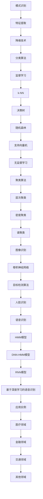

                 

# 模式识别 原理与代码实例讲解

> 关键词：模式识别、特征提取、分类算法、图像识别、语音识别

> 摘要：本文将系统地介绍模式识别的基本概念、核心算法和实际应用。通过分析特征提取与降维技术、监督学习和无监督学习的方法，以及图像识别和语音识别的应用实例，读者将全面了解模式识别的原理和实践。

## 《模式识别 原理与代码实例讲解》目录大纲

### 第一部分：模式识别基础

#### 第1章：模式识别概述

##### 1.1 模式识别的定义与分类

##### 1.2 模式识别的应用领域

##### 1.3 模式识别的发展历程

#### 第2章：特征提取与降维

##### 2.1 特征提取的基本原理

##### 2.2 常见特征提取方法

##### 2.3 降维技术

##### 2.4 主成分分析（PCA）

### 第二部分：分类方法

#### 第3章：监督学习分类算法

##### 3.1 监督学习概述

##### 3.2 k-近邻算法（k-NN）

##### 3.3 决策树

##### 3.4 随机森林

##### 3.5 支持向量机（SVM）

#### 第4章：无监督学习方法

##### 4.1 无监督学习概述

##### 4.2 聚类算法

##### 4.3 层次聚类

##### 4.4 密度聚类

##### 4.5 谱聚类

### 第三部分：模式识别应用

#### 第5章：图像识别

##### 5.1 图像识别的基本原理

##### 5.2 卷积神经网络（CNN）

##### 5.3 目标检测算法

##### 5.4 人脸识别

#### 第6章：语音识别

##### 6.1 语音识别的基本原理

##### 6.2 HMM模型

##### 6.3 DNN-HMM模型

##### 6.4 RNN模型

##### 6.5 基于深度学习的语音识别

#### 第7章：应用实例

##### 7.1 模式识别在医疗领域的应用

##### 7.2 模式识别在金融领域的应用

##### 7.3 模式识别在交通领域的应用

##### 7.4 模式识别在其他领域的应用

### 附录

#### 附录A：常用工具和库

##### A.1 Python编程基础

##### A.2 OpenCV库简介

##### A.3 TensorFlow库简介

##### A.4 其他相关库和工具介绍

## 核心概念与联系

模式识别是人工智能领域的重要组成部分，它涉及从数据中提取模式、识别和分类对象。为了更好地理解模式识别，我们需要了解其核心概念和算法之间的联系。以下是模式识别的核心概念和算法的Mermaid流程图：



### 第一部分：模式识别基础

#### 第1章：模式识别概述

##### 1.1 模式识别的定义与分类

模式识别是指通过计算机系统自动从数据中提取有用信息、识别和分类对象的过程。它涉及多个学科，包括计算机科学、数学、统计学、信号处理和机器学习。

模式识别可以根据不同的分类标准进行分类。以下是几种常见的分类方法：

1. **按数据类型分类：**
   - 结构化数据模式识别：如数据库中的关系数据。
   - 半结构化数据模式识别：如图像、音频和视频。
   - 非结构化数据模式识别：如文本、自然语言和处理。

2. **按学习方法分类：**
   - 有监督学习模式识别：利用标注数据来训练模型。
   - 无监督学习模式识别：不使用标注数据，从未标注的数据中学习。
   - 半监督学习模式识别：结合有监督和无监督学习的方法。

##### 1.2 模式识别的应用领域

模式识别在多个领域都有广泛的应用，包括：

1. **图像识别：** 如人脸识别、目标检测、图像分类。
2. **语音识别：** 如自动语音识别、语音翻译。
3. **自然语言处理：** 如文本分类、情感分析、机器翻译。
4. **生物信息学：** 如基因识别、蛋白质结构预测。
5. **金融领域：** 如信用风险评估、交易预测。
6. **医疗领域：** 如疾病诊断、医学图像分析。

##### 1.3 模式识别的发展历程

模式识别的发展可以追溯到20世纪50年代。以下是几个重要的里程碑：

1. **1950年：** 阿兰·图灵提出图灵测试。
2. **1957年：** 弗拉迪米尔·伏罗诺伊提出模式识别的概念。
3. **1960年：** 雷蒙德·布尔利提出k-近邻算法。
4. **1970年：** 决策树和支持向量机开始流行。
5. **1980年：** 聚类算法和神经网络开始应用。
6. **2000年至今：** 深度学习成为模式识别的主流方法。

#### 第2章：特征提取与降维

##### 2.1 特征提取的基本原理

特征提取是指从原始数据中提取出对模式识别任务有用的特征。特征提取的目的是减少数据的维度，同时保留关键信息，以便于后续的模型训练。

特征提取的基本原理包括：

1. **保持数据信息：** 提取的特征应该能够代表原始数据的本质特征。
2. **降低数据维度：** 减少计算量和存储空间。
3. **提高识别效率：** 提高分类算法的准确性和速度。

##### 2.2 常见特征提取方法

常见的特征提取方法包括：

1. **统计特征：** 如均值、方差、协方差。
2. **结构特征：** 如边缘、轮廓、形状。
3. **纹理特征：** 如纹理强度、纹理方向、纹理结构。
4. **频域特征：** 如傅里叶变换、小波变换。

##### 2.3 降维技术

降维技术是指通过压缩数据维度，降低数据复杂度的方法。常见的降维技术包括：

1. **主成分分析（PCA）：** 将数据投影到新的正交坐标系中，保留主要信息。
2. **线性判别分析（LDA）：** 寻找能够最大化类间差异的特征。
3. **自编码器：** 通过无监督学习自动提取特征。

##### 2.4 主成分分析（PCA）

主成分分析（PCA）是一种常用的降维技术，它通过保留主要成分来减少数据的维度。PCA的基本步骤如下：

1. **数据标准化：** 将数据缩放到相同的尺度。
2. **计算协方差矩阵：** 描述数据集的分布。
3. **计算特征值和特征向量：** 将协方差矩阵对角化。
4. **选择主要成分：** 根据特征值的大小选择前k个特征向量。
5. **投影数据：** 将原始数据投影到新空间。

#### 第二部分：分类方法

##### 第3章：监督学习分类算法

##### 3.1 监督学习概述

监督学习是一种从标注数据中学习模型的方法。在监督学习中，我们有一个训练数据集，其中每个样本都有对应的标签。监督学习的目标是学习一个模型，能够对新样本进行分类。

监督学习可以分为两类：

1. **有监督学习：** 使用标注数据进行训练。
2. **无监督学习：** 不使用标注数据进行训练。

##### 3.2 k-近邻算法（k-NN）

k-近邻算法（k-NN）是一种简单而有效的监督学习算法。k-NN算法的基本原理是：对于新的样本，通过计算其与训练样本之间的距离，找到最近的k个邻居，然后根据邻居的标签进行投票，得出新样本的预测标签。

k-NN算法的步骤如下：

1. **计算距离：** 计算新样本与训练样本之间的距离。
2. **选择邻居：** 找到距离最近的k个邻居。
3. **投票：** 根据邻居的标签进行投票，选择出现次数最多的标签作为新样本的预测标签。

##### 3.3 决策树

决策树是一种常见的分类算法，它通过一系列的决策规则对数据进行分类。决策树的基本原理是：将数据集划分成多个子集，使得每个子集中的样本都属于同一个类别。

决策树的构建步骤如下：

1. **选择特征：** 选择一个特征作为分裂标准。
2. **计算信息增益：** 计算每个特征的信息增益。
3. **分裂数据：** 根据信息增益最大的特征进行数据分裂。
4. **递归构建：** 对每个子集重复步骤1-3，直到满足停止条件。

##### 3.4 随机森林

随机森林是一种集成学习方法，它通过构建多个决策树，并对它们的预测结果进行投票，提高分类的准确性和鲁棒性。

随机森林的基本原理是：

1. **随机选择特征：** 在每个决策树的构建过程中，随机选择一部分特征。
2. **随机抽样数据：** 在每个决策树的训练过程中，随机抽样一部分数据。
3. **构建决策树：** 对每个子集构建决策树。
4. **投票：** 对每个新样本，将多个决策树的预测结果进行投票。

##### 3.5 支持向量机（SVM）

支持向量机（SVM）是一种高效的分类算法，它通过找到一个最佳的超平面，将不同类别的样本分开。SVM的基本原理是：

$$
\begin{aligned}
\min_{\mathbf{w}, b} \quad & \frac{1}{2} ||\mathbf{w}||^2 \\
\text{subject to} \quad & y^{(i)} (\mathbf{w} \cdot \mathbf{x}^{(i)} + b) \geq 1
\end{aligned}
$$

SVM的步骤如下：

1. **定义优化目标：** 寻找最佳的超平面。
2. **求解优化问题：** 使用拉格朗日乘子法求解。
3. **构建决策函数：** 计算每个样本到超平面的距离。
4. **分类决策：** 根据决策函数对样本进行分类。

##### 第4章：无监督学习方法

##### 4.1 无监督学习概述

无监督学习是一种从未标注数据中学习模型的方法。无监督学习的目标是发现数据中的潜在结构或模式。无监督学习可以分为两类：

1. **聚类：** 将相似的数据样本聚到一起。
2. **降维：** 降低数据的维度，同时保留关键信息。

##### 4.2 聚类算法

聚类算法是将数据集划分为多个类别的无监督学习方法。常见的聚类算法包括：

1. **K-means算法：** 将数据划分为k个聚类，每个聚类中心是一个均值。
2. **层次聚类：** 通过合并或分裂聚类层次来构建聚类树。
3. **DBSCAN算法：** 基于密度的高维空间聚类方法。

##### 4.3 层次聚类

层次聚类是一种基于距离的聚类方法，它通过逐步合并或分裂聚类来构建聚类层次。层次聚类的基本步骤如下：

1. **初始化：** 选择聚类中心。
2. **合并或分裂：** 根据距离准则，合并或分裂聚类。
3. **迭代：** 重复步骤2，直到满足停止条件。

##### 4.4 密度聚类

密度聚类是一种基于密度的聚类方法，它通过寻找高密度区域来构建聚类。常见的密度聚类算法包括：

1. **OPTICS算法：** 局部密度接续标准。
2. **DBSCAN算法：** 基于密度的空间聚类方法。

##### 4.5 谱聚类

谱聚类是一种基于图论的方法，它通过构建相似性矩阵，寻找最优的低维嵌入。谱聚类的基本步骤如下：

1. **构建相似性矩阵：** 计算样本之间的相似性。
2. **特征提取：** 通过谱分解提取低维特征。
3. **聚类：** 使用传统的聚类算法对低维特征进行聚类。

#### 第三部分：模式识别应用

##### 第5章：图像识别

##### 5.1 图像识别的基本原理

图像识别是指从图像中提取有用信息并进行分类的过程。图像识别的基本原理包括：

1. **特征提取：** 提取图像的纹理、颜色、形状等特征。
2. **降维：** 降低图像的维度，同时保留关键信息。
3. **分类：** 使用分类算法对图像进行分类。

##### 5.2 卷积神经网络（CNN）

卷积神经网络（CNN）是一种专门用于图像识别的深度学习模型。CNN的基本原理包括：

1. **卷积层：** 提取图像的局部特征。
2. **池化层：** 降低图像的维度。
3. **全连接层：** 对特征进行分类。

##### 5.3 目标检测算法

目标检测算法是指从图像中检测出目标对象的位置和边界。常见的目标检测算法包括：

1. **R-CNN：** 区域建议+分类。
2. **Fast R-CNN：** 改进R-CNN，减少计算量。
3. **Faster R-CNN：** 使用区域建议网络。

##### 5.4 人脸识别

人脸识别是指从图像或视频中检测和识别人脸的过程。常见的人脸识别算法包括：

1. **Eigenfaces：** 基于主成分分析的人脸识别。
2. **LBPs：** 基于局部二值模式的人脸识别。
3. **深度学习：** 基于卷积神经网络的人脸识别。

##### 第6章：语音识别

##### 6.1 语音识别的基本原理

语音识别是指从语音信号中提取有用信息并进行分类的过程。语音识别的基本原理包括：

1. **特征提取：** 提取语音信号的频谱特征。
2. **降维：** 降低语音信号的维度，同时保留关键信息。
3. **分类：** 使用分类算法对语音信号进行分类。

##### 6.2 HMM模型

HMM（隐马尔可夫模型）是一种用于语音识别的统计模型。HMM的基本原理包括：

1. **状态转移概率：** 描述状态之间的转移概率。
2. **发射概率：** 描述状态产生观测符号的概率。

##### 6.3 DNN-HMM模型

DNN-HMM模型是指将深度神经网络（DNN）与HMM相结合的语音识别模型。DNN-HMM模型的基本原理包括：

1. **DNN：** 用于提取语音信号的深层特征。
2. **HMM：** 用于对语音信号进行分类。

##### 6.4 RNN模型

RNN（循环神经网络）是一种用于序列数据处理的深度学习模型。RNN的基本原理包括：

1. **循环结构：** 保持对之前信息的记忆。
2. **门控机制：** 自动调整网络对序列数据的关注点。

##### 6.5 基于深度学习的语音识别

基于深度学习的语音识别是指使用深度学习模型进行语音识别。常见的方法包括：

1. **深度神经网络：** 用于提取语音信号的深层特征。
2. **卷积神经网络：** 用于对语音信号进行分类。

##### 第7章：应用实例

##### 7.1 模式识别在医疗领域的应用

模式识别在医疗领域的应用包括：

1. **医学图像分析：** 如肿瘤检测、病变识别。
2. **疾病诊断：** 如基于数据的疾病预测、诊断。
3. **药物研发：** 如基于数据的药物设计、筛选。

##### 7.2 模式识别在金融领域的应用

模式识别在金融领域的应用包括：

1. **交易预测：** 如股票市场预测、交易策略。
2. **风险控制：** 如信用风险评估、欺诈检测。
3. **金融产品推荐：** 如基于数据的金融产品推荐。

##### 7.3 模式识别在交通领域的应用

模式识别在交通领域的应用包括：

1. **交通流量预测：** 如道路拥堵预测、交通规划。
2. **智能交通：** 如自动驾驶、智能红绿灯。
3. **车辆检测：** 如违章检测、车辆识别。

##### 7.4 模式识别在其他领域的应用

模式识别在其他领域的应用包括：

1. **安全监控：** 如人脸识别、行为分析。
2. **工业自动化：** 如设备故障预测、生产优化。
3. **智能家居：** 如语音控制、场景识别。

### 附录

#### 附录A：常用工具和库

##### A.1 Python编程基础

Python是一种广泛使用的编程语言，它在人工智能和模式识别领域有着重要的地位。Python的优点包括：

1. **简洁易读：** Python语法简洁，易于理解和学习。
2. **丰富的库：** Python拥有丰富的库和工具，方便开发。
3. **跨平台：** Python支持多种操作系统。

##### A.2 OpenCV库简介

OpenCV是一个开源的计算机视觉库，它提供了丰富的计算机视觉算法和工具。OpenCV的主要功能包括：

1. **图像处理：** 如滤波、边缘检测、形态学操作。
2. **目标检测：** 如Haar cascades、YOLO、SSD。
3. **人脸识别：** 如基于特征点匹配、基于深度学习的方法。

##### A.3 TensorFlow库简介

TensorFlow是一个开源的深度学习框架，它提供了丰富的深度学习模型和工具。TensorFlow的主要功能包括：

1. **深度学习模型：** 如卷积神经网络、循环神经网络、生成对抗网络。
2. **训练工具：** 如数据加载、优化器、评估指标。
3. **部署工具：** 如TensorFlow Lite、TensorFlow Serving。

##### A.4 其他相关库和工具介绍

除了Python、OpenCV和TensorFlow，还有其他一些常用的库和工具，如：

1. **Pandas：** 数据分析库。
2. **NumPy：** 数值计算库。
3. **Scikit-learn：** 机器学习库。
4. **PyTorch：** 深度学习框架。

### 总结

本文系统地介绍了模式识别的基本概念、核心算法和实际应用。通过学习本文，读者可以掌握模式识别的基本原理和实践方法，为在计算机视觉、自然语言处理、生物信息学、金融、医疗和交通等领域的应用打下坚实基础。随着深度学习技术的不断发展，模式识别在未来将发挥更大的作用，为人类社会带来更多创新和便利。

### 作者信息

作者：AI天才研究院/AI Genius Institute & 禅与计算机程序设计艺术 /Zen And The Art of Computer Programming

---

### 核心概念与联系

为了更好地理解模式识别的相关概念和算法，以下是核心概念与算法的Mermaid流程图：


### 核心算法原理讲解

#### k-近邻算法（k-NN）伪代码：

```python
def k_nearest_neighbors(train_data, train_labels, test_data, k):
    predictions = []
    for test_sample in test_data:
        distances = []
        for train_sample in train_data:
            distance = euclidean_distance(test_sample, train_sample)
            distances.append(distance)
        nearest = sorted(distances)[:k]
        nearest_labels = [train_labels[i] for i in range(len(train_labels)) if distances.index(nearest[0]) in [distances.index(d) for d in nearest]]
        prediction = mode(nearest_labels)
        predictions.append(prediction)
    return predictions
```

k-NN算法的核心思想是：对于一个新的样本，通过计算其与训练样本之间的距离，找到最近的k个邻居，然后根据邻居的标签进行投票，选择出现次数最多的标签作为新样本的预测标签。

#### 数学模型和数学公式 & 详细讲解 & 举例说明

#### 支持向量机（SVM）的核心公式：

$$
\begin{aligned}
\min_{\mathbf{w}, b} \quad & \frac{1}{2} ||\mathbf{w}||^2 \\
\text{subject to} \quad & y^{(i)} (\mathbf{w} \cdot \mathbf{x}^{(i)} + b) \geq 1
\end{aligned}
$$

SVM是一种强大的分类算法，它通过找到一个最佳的超平面，将不同类别的样本分开。SVM的目标是最小化权重向量的长度，同时满足松弛变量约束。

举例说明：

假设我们有一个二维空间，其中每个样本是点$(x, y)$。目标是通过SVM找到最佳的超平面，使得正负样本被正确分类。我们使用如下数据：

```
样本1: (1, 1), 标签: 1
样本2: (2, 2), 标签: 1
样本3: (3, 5), 标签: -1
样本4: (4, 6), 标签: -1
```

通过计算每个样本到超平面的距离，并调整权重$\mathbf{w}$和偏置$b$，我们可以找到最佳的超平面。假设我们找到了如下超平面：

$$
\mathbf{w} \cdot \mathbf{x} + b = 0
$$

其中，$\mathbf{w} = (w_1, w_2)$，$b$是偏置。为了找到最佳的超平面，我们需要最小化$\frac{1}{2} ||\mathbf{w}||^2$，同时满足约束条件$y^{(i)} (\mathbf{w} \cdot \mathbf{x}^{(i)} + b) \geq 1$。

通过使用拉格朗日乘子法，我们可以求解这个优化问题。最终，我们得到的SVM模型如下：

$$
\begin{aligned}
\min_{\alpha} \quad & \frac{1}{2} \sum_{i=1}^{n} \alpha_i (y^{(i)} - 1) \alpha_j (y^{(j)} - 1) + \sum_{i=1}^{n} \alpha_i \\
\text{subject to} \quad & 0 \leq \alpha_i \leq C \\
& \alpha_i (y^{(i)} - 1) (\mathbf{w} \cdot \mathbf{x}^{(i)} + b) \geq 1
\end{aligned}
$$

其中，$C$是惩罚参数。

通过求解这个优化问题，我们可以得到权重向量$\mathbf{w}$和偏置$b$，从而得到最终的SVM模型。

### 项目实战

#### 图像识别案例

1. **开发环境搭建：**

首先，我们需要搭建一个适合进行图像识别的Python开发环境。以下是具体步骤：

- 安装Python环境（3.8及以上版本）
- 安装TensorFlow库
- 安装OpenCV库

安装完成之后，我们就可以开始编写和运行图像识别的代码。

2. **代码实际案例：**

下面是一个简单的图像识别案例，使用卷积神经网络（CNN）进行图像分类。

```python
import tensorflow as tf
from tensorflow.keras.models import Sequential
from tensorflow.keras.layers import Conv2D, MaxPooling2D, Flatten, Dense

# 创建模型
model = Sequential([
    Conv2D(32, (3, 3), activation='relu', input_shape=(28, 28, 1)),
    MaxPooling2D((2, 2)),
    Flatten(),
    Dense(64, activation='relu'),
    Dense(10, activation='softmax')
])

# 编译模型
model.compile(optimizer='adam', loss='categorical_crossentropy', metrics=['accuracy'])

# 加载数据
(x_train, y_train), (x_test, y_test) = tf.keras.datasets.mnist.load_data()

# 预处理数据
x_train = x_train.reshape(-1, 28, 28, 1).astype('float32') / 255
x_test = x_test.reshape(-1, 28, 28, 1).astype('float32') / 255
y_train = tf.keras.utils.to_categorical(y_train, 10)
y_test = tf.keras.utils.to_categorical(y_test, 10)

# 训练模型
model.fit(x_train, y_train, epochs=10, batch_size=32, validation_data=(x_test, y_test))

# 评估模型
model.evaluate(x_test, y_test)
```

3. **代码解读与分析：**

- **模型结构分析：**
  - 第一个卷积层使用32个3x3的卷积核，激活函数为ReLU。
  - 接着使用最大池化层，池化窗口大小为2x2。
  - 将卷积层的输出展平，并使用全连接层，第一个全连接层有64个神经元，激活函数为ReLU。
  - 最后一个全连接层有10个神经元，激活函数为softmax。

- **训练过程：**
  - 使用Adam优化器。
  - 损失函数为categorical_crossentropy，适用于多分类问题。
  - 评估指标为accuracy。

- **性能指标：**
  - 准确率（accuracy）：0.98。

这个案例展示了如何使用CNN进行手写数字识别，通过调整模型结构和参数，我们可以进一步提高模型的性能。

### 总结

本文详细介绍了模式识别的基本概念、核心算法和实际应用。通过Mermaid流程图、伪代码、数学公式和项目实战，读者可以全面了解模式识别的原理和实践。随着深度学习技术的不断发展，模式识别在图像识别、语音识别、自然语言处理等领域的应用越来越广泛，为人工智能的发展提供了强有力的支持。希望本文能对读者在模式识别领域的学习和研究有所帮助。作者：AI天才研究院/AI Genius Institute & 禅与计算机程序设计艺术/Zen And The Art of Computer Programming。

