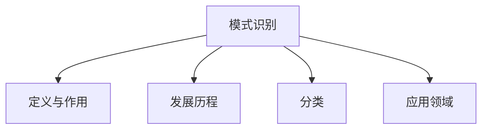

                 

### 文章标题

“模式识别：深度剖析与实际应用”

### 文章关键词

- 模式识别
- 特征提取
- 分类算法
- 聚类算法
- 图像处理
- 语音识别
- 生物信息学
- 数据挖掘

### 文章摘要

本文将深入探讨模式识别的基本概念、核心理论、常见算法及其在实际应用中的具体实现。首先，我们将回顾模式识别的发展历程和分类，然后详细讲解特征提取与预处理、分类与回归算法。接下来，我们将探讨模式识别在图像处理、语音处理、生物信息学以及数据挖掘中的应用，并通过实际项目案例展示模式识别技术的实战应用。最后，我们将展望模式识别技术的发展趋势，并总结全文。

## 第一部分：模式识别基础理论

### 第1章：模式识别概述

#### 1.1 模式识别的定义与作用

模式识别是指通过计算机或人工智能系统对数据进行分析和处理，以识别数据中的特定模式或特征，从而实现自动分类、预测或决策的过程。它是一门跨学科的技术领域，涉及计算机科学、人工智能、统计学、信号处理和机器学习等多个方面。

模式识别的主要作用包括：

1. **数据分类**：将数据按照特定的标准进行分类，例如垃圾邮件过滤、信用卡欺诈检测等。
2. **模式检测**：检测数据中的异常或非预期的模式，例如图像中的噪声检测、网络入侵检测等。
3. **预测分析**：通过分析历史数据，预测未来可能发生的事件或趋势，例如股票市场预测、天气预报等。
4. **自动控制**：在工业控制系统中，模式识别用于实现自动化控制和优化，例如机器人导航、智能交通系统等。

#### 1.2 模式识别的发展历程

模式识别技术的发展历程可以追溯到20世纪50年代。以下是一些重要的发展阶段：

- **1950年代**：统计模式识别的诞生，包括经典的特征提取和分类方法，如贝叶斯分类器、线性判别分析等。
- **1960年代**：人工神经网络和自组织映射等非参数化模式识别方法的出现，如感知机、BP网络等。
- **1970年代**：决策树和支持向量机等监督学习方法的提出，使得模式识别的应用范围进一步扩大。
- **1980年代**：聚类算法和关联规则挖掘等无监督学习方法的发展，如K均值聚类、Apriori算法等。
- **1990年代至今**：随着计算能力和算法的进步，深度学习在模式识别领域取得了重大突破，如卷积神经网络（CNN）、循环神经网络（RNN）等。

#### 1.3 模式识别的分类

模式识别可以按照不同的标准进行分类。以下是几种常见的分类方法：

- **按任务类型分类**：
  - **分类**：将数据分为预定义的类别，如文本分类、图像分类等。
  - **回归**：预测数据的连续值，如股票价格预测、房屋价格预测等。
  - **聚类**：将相似的数据点分组，以发现数据的内在结构，如K均值聚类、层次聚类等。
  - **异常检测**：检测数据中的异常或非预期的模式，如异常交易检测、网络攻击检测等。

- **按学习方式分类**：
  - **监督学习**：有标记的数据集用于训练模型，如决策树、支持向量机等。
  - **无监督学习**：没有标记的数据集用于训练模型，如K均值聚类、自组织映射等。
  - **半监督学习**：部分标记的数据集和大量无标记的数据集结合使用，如标签传播、图切分等。
  - **强化学习**：通过与环境的交互进行学习，如深度强化学习、Q学习等。

- **按数据类型分类**：
  - **数值数据**：使用数值特征进行模式识别，如线性回归、支持向量机等。
  - **文本数据**：使用自然语言处理技术进行模式识别，如文本分类、情感分析等。
  - **图像数据**：使用图像处理技术进行模式识别，如图像分类、目标检测等。
  - **语音数据**：使用语音处理技术进行模式识别，如语音识别、说话人识别等。

#### 1.4 模式识别的应用领域

模式识别技术广泛应用于各个领域，以下是几个典型的应用场景：

- **图像处理与计算机视觉**：包括图像分类、目标检测、人脸识别、图像分割等。
- **语音识别与处理**：包括语音识别、说话人识别、语音合成等。
- **生物信息学**：包括基因序列分析、蛋白质结构预测、药物设计等。
- **数据挖掘与大数据分析**：包括聚类分析、关联规则挖掘、分类分析等。
- **工业自动化与机器人**：包括机器人导航、智能监控、故障诊断等。
- **金融与保险**：包括信用评分、欺诈检测、市场预测等。
- **医疗与健康**：包括疾病诊断、药物研发、健康监测等。

### Mermaid 流程图



### 第2章：特征提取与预处理

#### 2.1 特征提取的基本概念

特征提取是指从原始数据中提取出对模式识别任务有用的特征，以便于模型训练和推理。特征提取的目的是减少数据维度，同时保持或增强数据的区分性。

特征提取的关键步骤包括：

1. **数据预处理**：对原始数据进行清洗、归一化和标准化等处理，以提高后续特征提取的效果。
2. **特征选择**：从大量特征中选择出最有用的特征，以减少数据维度和计算复杂度。
3. **特征变换**：通过数学变换，如离散化、归一化、傅里叶变换等，将原始数据转化为更适合模型训练的形式。

#### 2.2 常见特征提取方法

特征提取方法可以根据特征提取的维度进行分类，常见的特征提取方法包括频率域特征、空间域特征和时域特征。

- **频率域特征**：通过频率分析提取数据中的频率特征，如傅里叶变换、短时傅里叶变换等。频率域特征常用于图像处理和语音处理领域。
- **空间域特征**：直接从数据的空间维度提取特征，如像素值、颜色直方图、纹理特征等。空间域特征常用于图像处理和计算机视觉领域。
- **时域特征**：直接从数据的时间维度提取特征，如时域波形、能量、过零率等。时域特征常用于语音处理和信号处理领域。

以下是一些常见的特征提取方法：

- **灰度直方图**：计算图像中每个灰度级的像素数量，生成灰度直方图。
- **LBP（局部二值模式）**：计算图像中每个像素的局部二值模式，用于描述图像的纹理特征。
- **SIFT（尺度不变特征变换）**：提取图像中的关键点，并计算关键点的描述子，用于图像匹配和识别。
- **Gabor特征**：通过Gabor滤波器提取图像的纹理特征，常用于纹理识别和图像分类。
- **Mel频率倒谱系数（MFCC）**：用于提取语音信号的频率特征，常用于语音识别和语音分类。

#### 2.3 特征选择与降维

特征选择是指在大量特征中选取最有用的特征，以减少数据维度和计算复杂度。特征选择的目的是提高模型的泛化能力和效率。

特征选择方法可以分为以下几类：

- **过滤式特征选择**：通过评估每个特征的统计属性，如相关性、信息增益等，选择出最重要的特征。
- **包裹式特征选择**：通过组合所有可能的特征子集，评估每个子集的性能，选择最优的特征子集。
- **嵌入式特征选择**：在模型训练过程中，自动选择对模型性能最有帮助的特征。

常见的特征选择方法包括：

- **相关性分析**：通过计算特征之间的相关性，筛选出高度相关的特征，降低特征维度。
- **主成分分析（PCA）**：通过将数据投影到新的正交基上，保留主要成分，降低数据维度。
- **线性判别分析（LDA）**：通过最大化类间离散度和最小化类内离散度，选择最优的特征子集。
- **基于模型的方法**：利用模型训练结果，选择对模型性能贡献最大的特征。

降维是指通过某种方式减少数据的维度，以便于模型训练和推理。常见的降维方法包括：

- **主成分分析（PCA）**：通过计算数据的协方差矩阵，将数据投影到新的正交基上，保留主要成分。
- **线性判别分析（LDA）**：通过最大化类间离散度和最小化类内离散度，选择最优的特征子集，实现降维。
- **特征抽取**：通过构建新的特征，降低数据维度，如稀疏编码、自动编码器等。

#### 2.4 特征提取与预处理在图像识别中的应用

在图像识别中，特征提取和预处理是关键步骤，直接影响模型的性能。以下是一个简单的图像识别流程，展示了特征提取和预处理的应用：

1. **图像采集**：从传感器或摄像头获取图像数据。
2. **图像预处理**：对图像进行灰度化、二值化、噪声去除等处理，提高图像质量。
3. **特征提取**：计算图像的特征，如灰度直方图、LBP、SIFT等。
4. **特征选择**：根据模型的需求，选择最有用的特征，降低特征维度。
5. **模型训练**：使用训练数据集，训练分类器或识别模型。
6. **模型评估**：使用测试数据集，评估模型的性能。
7. **模型应用**：在新的图像上应用训练好的模型，进行图像识别。

#### 2.5 特征提取与预处理在语音识别中的应用

在语音识别中，特征提取和预处理是至关重要的一步，直接影响到模型的准确性和鲁棒性。以下是一个简单的语音识别流程，展示了特征提取和预处理的应用：

1. **音频采集**：从麦克风或其他音频设备采集音频数据。
2. **音频预处理**：对音频数据进行降噪、归一化等处理，提高音频质量。
3. **特征提取**：计算音频的特征，如MFCC、过零率、能量等。
4. **特征选择**：根据模型的需求，选择最有用的特征，降低特征维度。
5. **模型训练**：使用训练数据集，训练语音识别模型。
6. **模型评估**：使用测试数据集，评估模型的性能。
7. **模型应用**：在新的音频数据上应用训练好的模型，进行语音识别。

#### 2.6 特征提取与预处理在文本分类中的应用

在文本分类中，特征提取和预处理是关键步骤，直接影响模型的分类准确率。以下是一个简单的文本分类流程，展示了特征提取和预处理的应用：

1. **文本采集**：从网站、新闻、社交媒体等渠道获取文本数据。
2. **文本预处理**：对文本进行去重、去噪、停用词过滤等处理，提高文本质量。
3. **特征提取**：计算文本的特征，如词袋模型、TF-IDF、词嵌入等。
4. **特征选择**：根据模型的需求，选择最有用的特征，降低特征维度。
5. **模型训练**：使用训练数据集，训练分类器。
6. **模型评估**：使用测试数据集，评估模型的性能。
7. **模型应用**：在新的文本数据上应用训练好的模型，进行文本分类。

### 数学模型与伪代码

#### 特征提取的数学模型

假设我们有一个图像矩阵 \(I \in \mathbb{R}^{m \times n}\)，其中 \(m\) 和 \(n\) 分别表示图像的高度和宽度。我们可以通过以下步骤进行特征提取：

1. **灰度化**：将彩色图像转换为灰度图像。
   $$ gray\_image = \frac{R + G + B}{3} $$
2. **二值化**：将灰度图像转换为二值图像。
   $$ binary\_image = (gray\_image > threshold) $$
3. **LBP特征提取**：
   - 对于每个像素 \(p\)，计算其在邻域 \(N_r\) 内的局部二值模式。
   - 将每个像素的 LBP 特征表示为一个二进制向量。
   $$ lbp\_vector = [lbp\_value\_p1, lbp\_value\_p2, ..., lbp\_value\_pn] $$
4. **特征归一化**：对提取的特征进行归一化处理。
   $$ normalized\_vector = \frac{vector - \min(vector)}{\max(vector) - \min(vector)} $$

#### 特征提取的伪代码

```python
def extract_features(image):
    # 灰度化
    gray_image = gray(image)

    # 二值化
    binary_image = threshold(gray_image, threshold)

    # LBP特征提取
    lbp_vectors = []
    for pixel in binary_image:
        lbp_vector = []
        for neighbor in N_r(pixel):
            lbp_value = calculate_lbp(neighbor)
            lbp_vector.append(lbp_value)
        lbp_vectors.append(lbp_vector)

    # 特征归一化
    normalized_vectors = []
    for vector in lbp_vectors:
        normalized_vector = normalize(vector)
        normalized_vectors.append(normalized_vector)

    return normalized_vectors
```

### 第3章：分类与回归

#### 3.1 分类算法概述

分类算法是模式识别中的重要组成部分，用于将数据分为不同的类别。常见的分类算法包括监督学习和无监督学习两种类型。

- **监督学习分类算法**：使用标记数据集进行训练，通过学习数据中的特征和类别之间的关系，实现对未知数据的分类。常见的监督学习分类算法包括决策树、支持向量机（SVM）、K最近邻（KNN）、随机森林等。
- **无监督学习分类算法**：不使用标记数据集，通过数据本身的特征和结构进行分类。常见的无监督学习分类算法包括K均值聚类、层次聚类等。

#### 3.2 监督学习分类算法

监督学习分类算法通过学习标记数据集中的特征和类别之间的关系，实现对新数据的分类。以下是一些常见的监督学习分类算法：

- **决策树**：通过树形结构对数据进行划分，每个节点代表一个特征，每个分支代表一个特征取值。决策树算法具有简洁、易于解释等优点。
- **支持向量机（SVM）**：通过寻找一个超平面，将数据集中的不同类别分离。SVM算法具有很好的分类能力和泛化性能。
- **K最近邻（KNN）**：基于距离度量，将新数据点归类到与其最近的K个邻居中。KNN算法简单易懂，但依赖于参数的选择。
- **随机森林**：通过构建多棵决策树，并使用投票机制进行分类。随机森林算法具有很好的分类性能和鲁棒性。

以下是对每种算法的简要介绍：

1. **决策树**：
   - **基本原理**：决策树是一种树形结构，每个节点代表一个特征，每个分支代表一个特征取值。树根是原始数据，叶节点是预测结果。
   - **优缺点**：优点是易于理解和解释，缺点是可能产生过拟合。
   - **适用场景**：适合处理离散型数据和小规模数据集。

2. **支持向量机（SVM）**：
   - **基本原理**：SVM通过寻找一个最优超平面，将数据集中的不同类别分离。超平面由支持向量决定，支持向量是距离超平面最近的样本点。
   - **优缺点**：优点是具有很好的分类能力和泛化性能，缺点是计算复杂度较高。
   - **适用场景**：适合处理高维数据和小规模数据集。

3. **K最近邻（KNN）**：
   - **基本原理**：KNN算法通过计算新数据点与训练数据点之间的距离，将新数据点归类到与其最近的K个邻居中。
   - **优缺点**：优点是简单易懂，缺点是依赖于参数的选择，对噪声敏感。
   - **适用场景**：适合处理连续型数据和大规模数据集。

4. **随机森林**：
   - **基本原理**：随机森林通过构建多棵决策树，并使用投票机制进行分类。每棵树都是独立训练的，最终的分类结果由所有树的综合决定。
   - **优缺点**：优点是具有很好的分类性能和鲁棒性，缺点是计算复杂度较高。
   - **适用场景**：适合处理高维数据和小规模数据集。

#### 3.3 回归算法概述

回归算法用于预测数据的连续值，通过对历史数据进行分析，找到数据之间的规律，从而预测未来可能发生的数值。常见的回归算法包括线性回归、逻辑回归等。

1. **线性回归**：
   - **基本原理**：线性回归通过拟合一个线性函数，将输入特征映射到输出值。线性回归的模型公式为：
     $$ y = \beta_0 + \beta_1 \cdot x_1 + \beta_2 \cdot x_2 + ... + \beta_n \cdot x_n $$
   - **优缺点**：优点是简单易懂，缺点是对噪声敏感，可能产生过拟合。
   - **适用场景**：适合处理线性关系明显的数据集。

2. **逻辑回归**：
   - **基本原理**：逻辑回归是一种概率型回归模型，通过拟合一个逻辑函数，将输入特征映射到概率值。逻辑回归的模型公式为：
     $$ P(y=1) = \frac{1}{1 + e^{-(\beta_0 + \beta_1 \cdot x_1 + \beta_2 \cdot x_2 + ... + \beta_n \cdot x_n)}} $$
   - **优缺点**：优点是能够处理非线性关系，缺点是对噪声敏感。
   - **适用场景**：适合处理分类问题，如二分类、多分类等。

#### 3.4 监督学习回归算法

监督学习回归算法通过学习标记数据集的特征和目标值之间的关系，实现对未知数据的预测。以下是一些常见的监督学习回归算法：

1. **线性回归**：
   - **基本原理**：线性回归通过拟合一个线性函数，将输入特征映射到输出值。线性回归的模型公式为：
     $$ y = \beta_0 + \beta_1 \cdot x_1 + \beta_2 \cdot x_2 + ... + \beta_n \cdot x_n $$
   - **算法步骤**：
     1. 数据预处理：对输入数据进行归一化或标准化处理。
     2. 模型训练：使用梯度下降或其他优化算法，找到最佳参数。
     3. 模型评估：使用测试数据集评估模型的性能。
     4. 模型预测：使用训练好的模型对新数据进行预测。
   - **优缺点**：优点是简单易懂，缺点是对噪声敏感，可能产生过拟合。
   - **适用场景**：适合处理线性关系明显的数据集。

2. **逻辑回归**：
   - **基本原理**：逻辑回归是一种概率型回归模型，通过拟合一个逻辑函数，将输入特征映射到概率值。逻辑回归的模型公式为：
     $$ P(y=1) = \frac{1}{1 + e^{-(\beta_0 + \beta_1 \cdot x_1 + \beta_2 \cdot x_2 + ... + \beta_n \cdot x_n)}} $$
   - **算法步骤**：
     1. 数据预处理：对输入数据进行归一化或标准化处理。
     2. 模型训练：使用梯度下降或其他优化算法，找到最佳参数。
     3. 模型评估：使用测试数据集评估模型的性能。
     4. 模型预测：使用训练好的模型对新数据进行预测。
   - **优缺点**：优点是能够处理非线性关系，缺点是对噪声敏感。
   - **适用场景**：适合处理分类问题，如二分类、多分类等。

### 数学模型与伪代码

#### 线性回归的数学模型

假设我们有一个输入特征矩阵 \(X \in \mathbb{R}^{m \times n}\) 和输出值矩阵 \(y \in \mathbb{R}^{m \times 1}\)，其中 \(m\) 和 \(n\) 分别表示样本数量和特征数量。线性回归的目标是找到最佳参数 \(\beta \in \mathbb{R}^{n \times 1}\)，使得预测值 \(y_{pred}\) 最接近真实值 \(y\)。

线性回归的模型公式为：
$$ y = \beta_0 + \beta_1 \cdot x_1 + \beta_2 \cdot x_2 + ... + \beta_n \cdot x_n $$

损失函数为：
$$ J(\beta) = \frac{1}{2} \sum_{i=1}^{m} (y_i - y_{pred_i})^2 $$

其中，\(y_{pred_i}\) 是第 \(i\) 个样本的预测值，计算公式为：
$$ y_{pred_i} = \beta_0 + \beta_1 \cdot x_{i1} + \beta_2 \cdot x_{i2} + ... + \beta_n \cdot x_{in} $$

#### 线性回归的伪代码

```python
def linear_regression(X, y):
    # 初始化参数
    beta = np.random.rand(n+1, 1)

    # 梯度下降优化
    for i in range(num_iterations):
        # 计算预测值
        y_pred = X.dot(beta)

        # 计算损失函数
        loss = 0.5 * (y - y_pred).dot(y - y_pred)

        # 计算梯度
        gradient = X.T.dot(y - y_pred)

        # 更新参数
        beta = beta - learning_rate * gradient

    return beta
```

### 第4章：聚类算法

#### 4.1 聚类算法概述

聚类算法是一种无监督学习方法，旨在将数据集中的数据点划分为多个群组，使得同一群组内的数据点之间具有较高的相似度，而不同群组之间的数据点之间具有较低的相似度。聚类算法在数据挖掘、机器学习、统计学等领域有着广泛的应用。

聚类算法可以分为以下几类：

- **基于距离的聚类算法**：通过计算数据点之间的距离，将相似度较高的数据点划分为同一群组。常见的算法包括K均值聚类、层次聚类等。
- **基于密度的聚类算法**：通过识别数据点周围的密度区域，将密度较高的区域划分为同一群组。常见的算法包括DBSCAN等。
- **基于质量的聚类算法**：通过最大化聚类质量，选择最佳的聚类结果。常见的算法包括谱聚类等。

#### 4.2 常见聚类算法

以下介绍几种常见的聚类算法：

1. **K均值聚类**：

   - **基本原理**：K均值聚类通过将数据点划分为K个群组，使得每个群组内的数据点之间具有较高的相似度。算法的步骤如下：
     1. 随机选择K个初始中心点。
     2. 对于每个数据点，计算其与各个中心点的距离，并将其归为距离最近的中心点所在的群组。
     3. 根据新的群组计算新的中心点。
     4. 重复步骤2和3，直到中心点不再发生显著变化。
   - **优缺点**：优点是简单易实现，缺点是对初始中心点的选择敏感，可能产生局部最优解。
   - **适用场景**：适合处理高维数据和小规模数据集。

2. **层次聚类**：

   - **基本原理**：层次聚类通过自底向上或自顶向下的方式，将数据点逐步合并或分解，形成层次结构。常见的算法包括自底向上的凝聚层次聚类和自顶向下的分裂层次聚类。
   - **优缺点**：优点是能够生成层次结构的聚类结果，缺点是计算复杂度较高，可能产生过拟合。
   - **适用场景**：适合处理低维数据和小规模数据集。

3. **DBSCAN（Density-Based Spatial Clustering of Applications with Noise）**：

   - **基本原理**：DBSCAN通过识别数据点周围的密度区域，将密度较高的区域划分为同一群组。算法的步骤如下：
     1. 选择邻域半径 \(eps\) 和最小密度点数量 \(min\_samples\)。
     2. 对于每个数据点，计算其邻域内的数据点数量。
     3. 根据邻域内数据点的数量，将数据点划分为核心点、边界点和噪声点。
     4. 构建簇，将核心点及其邻域内的数据点划分为同一簇。
     5. 对于剩余的数据点，重复步骤2和3，直到所有数据点被划分。
   - **优缺点**：优点是能够处理噪声和稀疏数据，缺点是对参数的选择敏感。
   - **适用场景**：适合处理低维数据和大规模数据集。

#### 4.3 K均值聚类的详细讲解

K均值聚类是一种经典的聚类算法，通过迭代的方式将数据点划分为K个群组。以下是K均值聚类的详细步骤：

1. **初始化中心点**：

   - 随机选择K个数据点作为初始中心点，或者使用K-means++算法选择初始中心点。

2. **分配数据点**：

   - 对于每个数据点，计算其与各个中心点的距离，并将其归为距离最近的中心点所在的群组。

3. **更新中心点**：

   - 根据新的群组计算新的中心点。新的中心点是群组内所有数据点的平均值。

4. **重复迭代**：

   - 重复步骤2和3，直到中心点不再发生显著变化。

K均值聚类的伪代码如下：

```python
def kmeans(data, K, max_iterations):
    # 初始化中心点
    centroids = initialize_centroids(data, K)

    for i in range(max_iterations):
        # 分配数据点
        labels = assign_data_to_clusters(data, centroids)

        # 更新中心点
        centroids = update_centroids(data, labels, K)

        # 检查收敛条件
        if has_converged(centroids, previous_centroids):
            break

    return centroids, labels
```

#### 4.4 层次聚类的详细讲解

层次聚类是一种基于层次结构的聚类算法，通过自底向上或自顶向下的方式将数据点逐步合并或分解。以下是层次聚类的详细步骤：

1. **自底向上凝聚层次聚类**：

   - 将每个数据点视为一个初始簇。
   - 重复以下步骤，直到所有数据点合并为一个簇：
     1. 计算所有簇之间的距离。
     2. 选择距离最近的两个簇进行合并。
     3. 更新簇之间的距离。

2. **自顶向下分裂层次聚类**：

   - 将所有数据点合并为一个初始簇。
   - 重复以下步骤，直到每个数据点成为一个独立的簇：
     1. 计算簇之间的距离。
     2. 选择距离最远的两个簇进行分裂。
     3. 更新簇之间的距离。

层次聚类的伪代码如下：

```python
def hierarchical_clustering(data, method='agglomerative'):
    if method == 'agglomerative':
        # 自底向上凝聚层次聚类
        clusters = [data]
        while len(clusters) > 1:
            # 计算簇之间的距离
            distances = calculate_distances(clusters)

            # 选择距离最近的两个簇进行合并
            closest_clusters = find_closest_clusters(clusters, distances)

            # 更新簇之间的距离
            clusters = merge_clusters(clusters, closest_clusters)

        return clusters
    elif method == 'divisive':
        # 自顶向下分裂层次聚类
        clusters = [[data]]
        while len(clusters) < len(data):
            # 计算簇之间的距离
            distances = calculate_distances(clusters)

            # 选择距离最远的两个簇进行分裂
            furthest_clusters = find_furthest_clusters(clusters, distances)

            # 更新簇之间的距离
            clusters = split_clusters(clusters, furthest_clusters)

        return clusters
```

### 第5章：模式识别在图像处理中的应用

#### 5.1 图像处理基础

图像处理是模式识别中重要的组成部分，旨在对图像进行增强、变换、分割等操作，以便于后续的模式识别任务。以下是一些常见的图像处理技术：

1. **图像增强**：通过调整图像的亮度和对比度，提高图像的清晰度和可读性。
2. **图像变换**：通过数学变换，如傅里叶变换、拉普拉斯变换等，将图像从一种表示形式转换为另一种表示形式。
3. **图像分割**：将图像划分为不同的区域或对象，以便于后续的特征提取和识别。
4. **图像配准**：将多幅图像进行对齐，以便于分析图像的相似性或差异。
5. **图像压缩**：通过去除图像中的冗余信息，降低图像的数据量，便于存储和传输。

#### 5.2 常见图像处理算法

以下介绍几种常见的图像处理算法：

1. **边缘检测**：

   - **基本原理**：边缘检测是通过检测图像中的亮度变化，找到图像的边缘线。
   - **算法类型**：常见的边缘检测算法包括Sobel算子、Canny算子、Prewitt算子等。
   - **应用场景**：边缘检测广泛应用于图像分割、目标检测、图像识别等任务。

2. **阈值处理**：

   - **基本原理**：阈值处理是通过设置一个阈值，将图像的二值化，将图像划分为前景和背景。
   - **算法类型**：常见的阈值处理算法包括全局阈值处理、局部阈值处理等。
   - **应用场景**：阈值处理广泛应用于图像分割、噪声去除、图像识别等任务。

3. **形态学处理**：

   - **基本原理**：形态学处理是通过结构元素对图像进行腐蚀、膨胀、开运算、闭运算等操作，以提取图像的特征。
   - **算法类型**：常见的形态学处理算法包括膨胀、腐蚀、开运算、闭运算等。
   - **应用场景**：形态学处理广泛应用于图像分割、图像增强、图像识别等任务。

#### 5.3 图像识别算法

图像识别是模式识别中重要的应用领域，旨在对图像中的对象、场景、纹理等进行识别和分类。以下介绍几种常见的图像识别算法：

1. **人工神经网络**：

   - **基本原理**：人工神经网络是一种模拟生物神经网络的结构和功能的计算模型，通过学习输入和输出之间的映射关系进行图像识别。
   - **算法类型**：常见的人工神经网络算法包括卷积神经网络（CNN）、循环神经网络（RNN）、长短期记忆网络（LSTM）等。
   - **应用场景**：人工神经网络广泛应用于图像分类、目标检测、图像分割等任务。

2. **支持向量机（SVM）**：

   - **基本原理**：支持向量机是一种二类分类算法，通过寻找最优超平面，将图像数据分为不同的类别。
   - **算法类型**：支持向量机包括线性SVM、非线性SVM等。
   - **应用场景**：支持向量机广泛应用于图像分类、图像识别、图像标注等任务。

#### 5.4 支持向量机在图像识别中的应用

支持向量机（SVM）是一种强大的图像识别算法，通过寻找最优超平面，将图像数据分为不同的类别。以下是SVM在图像识别中的应用步骤：

1. **特征提取**：

   - 对图像进行预处理，如灰度化、归一化等。
   - 提取图像的特征，如灰度直方图、LBP、HOG等。

2. **模型训练**：

   - 使用标记的图像数据集，训练SVM模型。
   - 调整SVM的参数，如正则化参数C、核函数等，以优化模型性能。

3. **模型评估**：

   - 使用测试图像数据集，评估SVM模型的性能。
   - 计算模型的准确率、召回率、F1值等指标。

4. **图像识别**：

   - 对新的图像进行特征提取。
   - 使用训练好的SVM模型，对图像进行分类。

#### 5.5 代码示例

以下是一个使用SVM进行图像识别的Python代码示例：

```python
from sklearn import datasets
from sklearn.model_selection import train_test_split
from sklearn import svm
from sklearn.metrics import accuracy_score

# 加载图像数据集
digits = datasets.load_digits()

# 划分训练集和测试集
X_train, X_test, y_train, y_test = train_test_split(digits.data, digits.target, test_size=0.3, random_state=42)

# 初始化SVM模型
clf = svm.SVC(gamma='scale')

# 训练模型
clf.fit(X_train, y_train)

# 预测测试集
y_pred = clf.predict(X_test)

# 计算准确率
accuracy = accuracy_score(y_test, y_pred)
print("Accuracy:", accuracy)
```

### 第6章：模式识别在语音处理中的应用

#### 6.1 语音处理基础

语音处理是指对语音信号进行采集、处理、分析和理解的过程，旨在实现语音合成、语音识别、说话人识别等功能。以下是一些基本的语音处理概念：

1. **语音信号**：语音信号是一种模拟信号，包含人类的语音信息。它通常由声带振动产生，通过空气传播到听者的耳朵。
2. **采样**：采样是将连续的语音信号转换为离散的数字信号的过程。采样率决定了信号在时间上的分辨率，通常使用每秒采样的次数（Hz）来表示。
3. **量化**：量化是将采样得到的连续信号值转换为有限位的数字值的过程。量化位数决定了信号的幅度分辨率，通常使用比特数（bits）来表示。
4. **频谱分析**：频谱分析是对语音信号进行频率分析的方法，用于提取语音信号的频率特征。常用的频谱分析方法包括傅里叶变换（FFT）和短时傅里叶变换（STFT）。
5. **特征提取**：特征提取是从语音信号中提取出对模式识别任务有用的特征，如频谱特征、时域特征等。特征提取的目的是减少数据维度，同时保持或增强数据的区分性。

#### 6.2 语音识别算法

语音识别是将语音信号转换为文本信息的过程。以下介绍几种常见的语音识别算法：

1. **基于隐马尔可夫模型（HMM）的方法**：

   - **基本原理**：隐马尔可夫模型（HMM）是一种统计模型，用于描述语音信号的时间序列特征。HMM通过状态转移概率、发射概率和初始概率来描述语音信号。
   - **算法步骤**：
     1. 建立HMM模型，包括状态数、状态转移概率、发射概率和初始概率。
     2. 对语音信号进行预处理，如分段、特征提取等。
     3. 使用Viterbi算法计算语音信号的解码路径，找到最佳解码结果。
   - **优缺点**：优点是简单易懂，缺点是模型训练和识别速度较慢。

2. **基于高斯混合模型（GMM）的方法**：

   - **基本原理**：高斯混合模型（GMM）是一种概率模型，用于表示语音信号的概率分布。GMM通过多个高斯分布组成，每个高斯分布对应一个语音单元。
   - **算法步骤**：
     1. 建立GMM模型，包括混合系数、高斯分布参数等。
     2. 对语音信号进行预处理，如分段、特征提取等。
     3. 使用GMM模型计算语音信号的解码概率，找到最佳解码结果。
   - **优缺点**：优点是模型训练和识别速度较快，缺点是模型参数较多。

3. **基于深度神经网络的方法**：

   - **基本原理**：深度神经网络（DNN）是一种多层神经网络，用于建模语音信号的时间序列特征。DNN通过多层非线性变换，提取语音信号的深层特征。
   - **算法步骤**：
     1. 建立DNN模型，包括输入层、隐藏层和输出层。
     2. 对语音信号进行预处理，如分段、特征提取等。
     3. 使用反向传播算法训练DNN模型，优化模型参数。
     4. 使用训练好的DNN模型进行语音信号识别。
   - **优缺点**：优点是模型识别准确率高，缺点是模型训练和识别速度较慢。

#### 6.3 基于隐马尔可夫模型（HMM）的语音识别算法

以下是基于隐马尔可夫模型（HMM）的语音识别算法的详细步骤：

1. **模型训练**：

   - 收集大量的语音数据，并对其进行标注，如音素、单词等。
   - 构建HMM模型，包括状态数、状态转移概率、发射概率和初始概率。
   - 使用训练数据集，通过最大似然估计（MLE）方法估计HMM模型的参数。

2. **特征提取**：

   - 对语音信号进行预处理，如分段、去噪等。
   - 提取语音信号的频谱特征，如MFCC、谱熵等。
   - 对提取的特征进行归一化处理，以便于模型训练。

3. **模型解码**：

   - 对待识别的语音信号进行特征提取，得到特征序列。
   - 使用Viterbi算法，计算特征序列的解码路径，找到最佳解码结果。

4. **模型评估**：

   - 使用测试数据集，评估HMM模型的性能，计算准确率、召回率等指标。
   - 根据评估结果，调整模型参数，优化模型性能。

#### 6.4 基于高斯混合模型（GMM）的语音识别算法

以下是基于高斯混合模型（GMM）的语音识别算法的详细步骤：

1. **模型训练**：

   - 收集大量的语音数据，并对其进行标注，如音素、单词等。
   - 构建GMM模型，包括混合系数、高斯分布参数等。
   - 使用训练数据集，通过最大似然估计（MLE）方法估计GMM模型的参数。

2. **特征提取**：

   - 对语音信号进行预处理，如分段、去噪等。
   - 提取语音信号的频谱特征，如MFCC、谱熵等。
   - 对提取的特征进行归一化处理，以便于模型训练。

3. **模型解码**：

   - 对待识别的语音信号进行特征提取，得到特征序列。
   - 使用GMM模型，计算特征序列的解码概率，找到最佳解码结果。

4. **模型评估**：

   - 使用测试数据集，评估GMM模型的性能，计算准确率、召回率等指标。
   - 根据评估结果，调整模型参数，优化模型性能。

#### 6.5 基于深度神经网络（DNN）的语音识别算法

以下是基于深度神经网络（DNN）的语音识别算法的详细步骤：

1. **模型训练**：

   - 收集大量的语音数据，并对其进行标注，如音素、单词等。
   - 构建DNN模型，包括输入层、隐藏层和输出层。
   - 使用训练数据集，通过反向传播算法训练DNN模型，优化模型参数。

2. **特征提取**：

   - 对语音信号进行预处理，如分段、去噪等。
   - 提取语音信号的频谱特征，如MFCC、谱熵等。
   - 对提取的特征进行归一化处理，以便于模型训练。

3. **模型解码**：

   - 对待识别的语音信号进行特征提取，得到特征序列。
   - 使用训练好的DNN模型，计算特征序列的解码概率，找到最佳解码结果。

4. **模型评估**：

   - 使用测试数据集，评估DNN模型的性能，计算准确率、召回率等指标。
   - 根据评估结果，调整模型参数，优化模型性能。

#### 6.6 代码示例

以下是一个基于隐马尔可夫模型（HMM）的语音识别算法的Python代码示例：

```python
import numpy as np
import hmmlearn.hmm as hmm

# 构建HMM模型
model = hmm.GaussianHMM(n_components=3, covariance_type="diag", n_iter=100)

# 训练模型
model.fit(X_train, y_train)

# 预测测试集
y_pred = model.predict(X_test)

# 计算准确率
accuracy = np.mean(y_pred == y_test)
print("Accuracy:", accuracy)
```

### 第7章：模式识别在生物信息学中的应用

#### 7.1 生物信息学基础

生物信息学是计算机科学、生物学和信息技术相结合的跨学科领域，旨在解析、存储、分析和理解生物数据。生物信息学的主要研究内容包括基因序列分析、蛋白质结构预测、药物设计、基因组学、转录组学等。以下是一些基本的生物信息学概念：

1. **基因序列**：基因序列是指基因中核苷酸（A、C、G、T）的排列顺序。基因序列是遗传信息的载体，决定了生物体的遗传特征。
2. **蛋白质结构**：蛋白质结构是指蛋白质中氨基酸的排列顺序和三维结构。蛋白质结构是生物体功能的重要组成部分，决定了蛋白质的功能和性质。
3. **基因组**：基因组是指生物体中所有基因的总和。基因组包含了生物体遗传信息的大部分，是生物多样性的基础。
4. **转录组**：转录组是指细胞在特定时间和空间内转录的所有RNA分子的集合。转录组是基因表达的重要指标，反映了细胞的生理状态和功能。
5. **蛋白质组**：蛋白质组是指生物体中所有蛋白质的集合。蛋白质组是细胞功能和生物体代谢的重要体现。

#### 7.2 基因序列分析

基因序列分析是生物信息学的重要研究内容，旨在解析和解释基因序列中的信息。以下介绍几种常见的基因序列分析方法：

1. **序列比对**：

   - **基本原理**：序列比对是将两个或多个基因序列进行对比，找出它们之间的相似性和差异。序列比对的方法包括局部比对和全局比对。
   - **算法类型**：常见的序列比对算法包括BLAST、Smith-Waterman算法等。
   - **应用场景**：序列比对广泛应用于基因识别、基因分类、基因进化分析等。

2. **序列分类**：

   - **基本原理**：序列分类是将基因序列划分为不同的类别，以便于分析和解释。序列分类的方法通常基于机器学习算法，如K均值聚类、支持向量机等。
   - **算法类型**：常见的序列分类算法包括隐马尔可夫模型（HMM）、贝叶斯分类器等。
   - **应用场景**：序列分类广泛应用于基因功能预测、基因家族分析、物种分类等。

3. **序列聚类**：

   - **基本原理**：序列聚类是将相似度较高的基因序列划分为同一类别，以便于分析和解释。序列聚类的方法包括层次聚类、K均值聚类等。
   - **算法类型**：常见的序列聚类算法包括层次聚类、K均值聚类等。
   - **应用场景**：序列聚类广泛应用于基因家族分析、基因组注释等。

#### 7.3 基因序列分析的数学模型与伪代码

以下是一个基于隐马尔可夫模型（HMM）的基因序列分析的数学模型与伪代码：

**数学模型**：

假设我们有一个基因序列 \(X = \{x_1, x_2, ..., x_n\}\)，其中 \(x_i\) 表示第 \(i\) 个核苷酸。我们可以使用隐马尔可夫模型（HMM）对基因序列进行分析。

隐马尔可夫模型（HMM）的参数包括：

- \(A\)：状态转移概率矩阵，表示从状态 \(i\) 转移到状态 \(j\) 的概率。
- \(B\)：发射概率矩阵，表示在状态 \(i\) 下，产生观测值 \(x\) 的概率。
- \(π\)：初始状态概率向量，表示初始状态为 \(i\) 的概率。

隐马尔可夫模型（HMM）的数学模型可以表示为：

$$
\begin{align*}
P(X=x) &= \pi A^1 B^1 A^2 B^2 ... A^n B^n \\
        &= \pi A^1 B^1 A^2 B^2 ... A^n B^n \\
        &= \pi \prod_{i=1}^{n} A^{x_i}_{i,x_{i+1}} B^{x_i}_{i}
\end{align*}
$$

**伪代码**：

```python
def hmm_gene_sequence_analysis(sequence, model):
    # 初始化变量
    initial_probability = model.pi
    transition_probability = model.A
    emission_probability = model.B
    
    # 计算序列的概率
    sequence_probability = initial_probability
    
    for i in range(len(sequence) - 1):
        state = sequence[i]
        next_state = sequence[i+1]
        
        sequence_probability *= transition_probability[state, next_state]
        sequence_probability *= emission_probability[state, sequence[i]]
        
    return sequence_probability
```

#### 7.4 基因序列分析的应用案例

以下是一个基因序列分析的应用案例：

**案例背景**：

假设我们要对两个基因序列进行比对和分析，以研究它们之间的相似性和差异性。

**案例步骤**：

1. **数据收集**：

   - 收集两个基因序列，分别为序列A和序列B。

2. **序列比对**：

   - 使用BLAST算法，将序列A和序列B进行比对，找出它们之间的相似性和差异性。

3. **序列分类**：

   - 使用K均值聚类算法，将序列A和序列B进行分类，找出它们所属的类别。

4. **序列聚类**：

   - 使用层次聚类算法，将序列A和序列B进行聚类，分析它们之间的相似性和差异性。

5. **结果分析**：

   - 分析比对结果，了解序列A和序列B的相似性和差异性。
   - 分析分类结果，了解序列A和序列B所属的类别。
   - 分析聚类结果，了解序列A和序列B的相似性和差异性。

#### 7.5 代码示例

以下是一个基于BLAST算法的基因序列比对的Python代码示例：

```python
from Bio import SeqIO
from Bio.Blast import NCBIXML

# 加载序列A和序列B
sequence_a = SeqIO.read("sequence_a.fasta", "fasta")
sequence_b = SeqIO.read("sequence_b.fasta", "fasta")

# 使用BLAST进行序列比对
query = str(sequence_a.seq)
subject = str(sequence_b.seq)
result = NCBIXML.parse(query, subject)

# 打印比对结果
for alignment in result.alignments:
    for hit in alignment.hits:
        print("Query:", hit.query)
        print("Subject:", hit.subject)
        print("Identity:", hit.identity)
        print("Mismatch:", hit.mismatch)
        print("Gap open:", hit.gap_open)
        print("Alignment:", hit.alignment)
```

### 第8章：模式识别在数据挖掘中的应用

#### 8.1 数据挖掘基础

数据挖掘是指从大量数据中提取出有价值的信息和知识的过程，旨在发现数据中的隐含模式、关联性和规律。数据挖掘是一种跨学科的技术，涉及统计学、机器学习、数据库管理、人工智能等领域。以下是一些基本的数据挖掘概念：

1. **数据挖掘任务**：数据挖掘任务是指需要解决的问题，如分类、回归、聚类、关联规则挖掘等。
2. **数据集**：数据集是指用于数据挖掘的数据集合，包括训练集、测试集和验证集等。
3. **特征**：特征是指数据集中的变量或属性，用于描述数据点的特征信息。
4. **模型**：模型是指用于描述数据特征和目标变量之间关系的数据挖掘算法。
5. **评估指标**：评估指标是指用于评估数据挖掘模型性能的指标，如准确率、召回率、F1值、AUC等。

#### 8.2 数据挖掘流程

数据挖掘流程是指从数据收集、预处理、模型选择、模型训练到模型评估的整个过程。以下是一个典型数据挖掘流程：

1. **问题定义**：明确数据挖掘任务的目标和需求，确定需要解决的问题。
2. **数据收集**：收集相关的数据集，包括训练集、测试集和验证集。
3. **数据预处理**：对数据进行清洗、归一化、缺失值处理等预处理操作，以提高数据质量和模型的性能。
4. **特征选择**：从数据集中选择出最有用的特征，以减少数据维度和计算复杂度。
5. **模型选择**：选择合适的数据挖掘算法，如分类、回归、聚类、关联规则挖掘等。
6. **模型训练**：使用训练集数据，训练所选算法的模型。
7. **模型评估**：使用测试集数据，评估模型的性能，如准确率、召回率、F1值等。
8. **模型优化**：根据评估结果，调整模型参数，优化模型性能。
9. **模型应用**：将训练好的模型应用于新的数据集，进行预测和决策。

#### 8.3 常见数据挖掘算法

以下介绍几种常见的数据挖掘算法：

1. **聚类分析**：

   - **基本原理**：聚类分析是将数据集中的数据点划分为多个群组，使得同一群组内的数据点之间具有较高的相似度，而不同群组之间的数据点之间具有较低的相似度。
   - **算法类型**：常见的聚类算法包括K均值聚类、层次聚类、DBSCAN等。
   - **应用场景**：聚类分析广泛应用于市场细分、图像分割、社交网络分析等。

2. **分类分析**：

   - **基本原理**：分类分析是将数据集中的数据点划分为预定义的类别，以便于后续的决策和预测。
   - **算法类型**：常见的分类算法包括决策树、支持向量机、K最近邻、逻辑回归等。
   - **应用场景**：分类分析广泛应用于客户细分、信用评分、疾病诊断等。

3. **关联规则挖掘**：

   - **基本原理**：关联规则挖掘是发现数据集中不同特征之间的关联关系，以便于后续的决策和优化。
   - **算法类型**：常见的关联规则挖掘算法包括Apriori算法、FP-growth算法等。
   - **应用场景**：关联规则挖掘广泛应用于市场篮子分析、推荐系统等。

#### 8.4 聚类分析在数据挖掘中的应用

聚类分析是数据挖掘中的重要方法，用于发现数据中的隐含模式和结构。以下是一个简单的聚类分析案例：

**案例背景**：

假设我们有一组客户数据，包括客户的年龄、收入、消费习惯等特征，我们需要将这些客户进行聚类，以便于市场细分和客户定位。

**案例步骤**：

1. **数据收集**：

   - 收集一组客户数据，包括年龄、收入、消费习惯等特征。

2. **数据预处理**：

   - 对数据进行清洗、归一化等预处理操作，以提高数据质量和聚类效果。

3. **模型选择**：

   - 选择K均值聚类算法，用于将客户数据进行聚类。

4. **模型训练**：

   - 使用K均值聚类算法，对客户数据进行聚类。

5. **模型评估**：

   - 使用轮廓系数、聚类内部距离等指标，评估聚类效果。

6. **模型优化**：

   - 根据评估结果，调整聚类参数，优化聚类效果。

7. **模型应用**：

   - 将聚类结果应用于市场细分和客户定位。

#### 8.5 代码示例

以下是一个基于K均值聚类的Python代码示例：

```python
from sklearn.cluster import KMeans
import numpy as np

# 加载客户数据
data = np.array([[25, 50000, '高'],
                 [30, 60000, '中'],
                 [35, 70000, '高'],
                 [40, 80000, '中'],
                 [45, 90000, '高']])

# 初始化K均值聚类模型
kmeans = KMeans(n_clusters=3, random_state=0)

# 训练模型
kmeans.fit(data)

# 预测聚类结果
labels = kmeans.predict(data)

# 打印聚类结果
for i, label in enumerate(labels):
    print(f"客户{i+1}的聚类结果：{label}")
```

### 第9章：模式识别项目实战

#### 9.1 项目背景与需求分析

本项目旨在使用模式识别技术实现一个图像识别系统，用于对输入图像进行分类和识别。项目需求如下：

1. **图像分类**：系统能够对输入图像进行分类，将其归为预定义的类别，如动物、植物、交通工具等。
2. **图像识别**：系统能够识别图像中的特定对象，如人脸、车辆、建筑物等。
3. **实时处理**：系统能够实时处理输入图像，并在短时间内给出分类和识别结果。
4. **鲁棒性**：系统能够处理各种光照条件、角度变化和遮挡等场景，具有较高的鲁棒性。
5. **扩展性**：系统能够方便地扩展新的分类和识别任务，以适应不同的应用场景。

#### 9.2 数据预处理

数据预处理是模式识别项目中的关键步骤，直接影响模型的性能和准确性。以下是对图像数据进行的预处理步骤：

1. **图像采集**：

   - 从不同的来源采集大量图像数据，包括动物、植物、交通工具等类别。

2. **图像清洗**：

   - 去除图像中的噪声和无关部分，如文本、背景等。
   - 对图像进行灰度化处理，将彩色图像转换为灰度图像。

3. **图像增强**：

   - 对图像进行对比度增强、锐化等处理，提高图像的质量。
   - 对图像进行缩放、旋转、翻转等变换，增加数据的多样性。

4. **图像归一化**：

   - 对图像进行归一化处理，将图像的尺寸调整为统一的尺度，以便于模型训练。
   - 对图像的像素值进行归一化处理，将像素值缩放到[0, 1]范围内。

#### 9.3 模型选择与实现

在本项目中，我们选择了卷积神经网络（CNN）作为图像识别模型。CNN是一种专门用于处理图像数据的深度学习模型，具有强大的特征提取和分类能力。以下是CNN模型的选择和实现步骤：

1. **模型架构**：

   - 设计一个卷积神经网络模型，包括卷积层、池化层、全连接层等。
   - 在卷积层中，使用多个卷积核提取图像的特征，如边缘、纹理等。
   - 在池化层中，使用最大池化或平均池化减小特征图的尺寸。
   - 在全连接层中，将提取到的特征进行融合和分类。

2. **模型训练**：

   - 使用预处理的图像数据集，训练卷积神经网络模型。
   - 采用反向传播算法，优化模型参数。
   - 调整模型的学习率、正则化参数等超参数，以提高模型的性能。

3. **模型评估**：

   - 使用测试数据集，评估模型的性能，计算准确率、召回率、F1值等指标。
   - 分析模型的不足之处，优化模型结构和参数。

#### 9.4 模型评估与优化

模型评估是模式识别项目中的重要步骤，用于判断模型的性能和适用性。以下是对CNN模型进行评估和优化的步骤：

1. **模型评估**：

   - 使用测试数据集，评估CNN模型的性能，计算准确率、召回率、F1值等指标。
   - 分析模型的准确率、召回率、F1值等指标，判断模型的性能是否满足项目需求。

2. **模型优化**：

   - 根据评估结果，调整模型的结构和参数，优化模型性能。
   - 增加或减少卷积层的层数，调整卷积核的大小和数量。
   - 调整学习率、正则化参数等超参数，以提高模型的性能。

3. **模型迭代**：

   - 重复模型评估和优化步骤，直到模型性能达到预期。
   - 记录每次优化的参数和评估结果，以便于后续的分析和总结。

#### 9.5 代码示例

以下是一个使用卷积神经网络（CNN）进行图像识别的Python代码示例：

```python
from tensorflow import keras
from tensorflow.keras import layers
import numpy as np

# 加载训练数据和测试数据
train_images = np.load("train_images.npy")
train_labels = np.load("train_labels.npy")
test_images = np.load("test_images.npy")
test_labels = np.load("test_labels.npy")

# 设计CNN模型
model = keras.Sequential([
    layers.Conv2D(32, (3, 3), activation="relu", input_shape=(64, 64, 3)),
    layers.MaxPooling2D(pool_size=(2, 2)),
    layers.Flatten(),
    layers.Dense(64, activation="relu"),
    layers.Dense(10, activation="softmax")
])

# 编译模型
model.compile(optimizer="adam", loss="categorical_crossentropy", metrics=["accuracy"])

# 训练模型
model.fit(train_images, train_labels, epochs=10, batch_size=32, validation_data=(test_images, test_labels))

# 评估模型
test_loss, test_accuracy = model.evaluate(test_images, test_labels)
print("Test accuracy:", test_accuracy)

# 预测图像分类
predictions = model.predict(test_images[:10])
predicted_labels = np.argmax(predictions, axis=1)
print("Predicted labels:", predicted_labels)
```

### 第10章：模式识别技术展望

#### 10.1 模式识别技术的发展趋势

随着科技的不断进步和大数据时代的到来，模式识别技术正经历着快速的发展和变革。以下是一些当前模式识别技术的发展趋势：

1. **深度学习**：深度学习已经成为模式识别领域的核心技术，其强大的特征提取和分类能力使得许多传统方法难以匹敌。深度学习模型，如卷积神经网络（CNN）和循环神经网络（RNN），在图像识别、语音识别、自然语言处理等领域取得了显著的成果。
2. **迁移学习**：迁移学习是一种利用预训练模型在新任务上进行快速学习和优化的方法。通过迁移学习，可以减少模型的训练时间和计算资源需求，提高模型的泛化能力和准确性。
3. **强化学习**：强化学习是一种通过与环境交互进行学习的方法，可以用于解决动态决策问题。强化学习在游戏、机器人控制、推荐系统等领域具有广泛的应用前景。
4. **联邦学习**：联邦学习是一种在分布式环境中进行协同学习的方法，可以有效保护用户隐私，提高模型的安全性和可解释性。
5. **多模态学习**：多模态学习旨在整合不同模态的数据，如文本、图像、音频等，以提高模式识别任务的性能。多模态学习在情感分析、图像分割、视频分类等领域具有广泛的应用。
6. **小样本学习**：小样本学习是一种在数据量有限的情况下进行有效学习和泛化的方法。小样本学习对于解决现实世界中的问题具有重要意义，如医疗诊断、金融风险评估等。

#### 10.2 模式识别在新兴领域的应用

模式识别技术在新兴领域中的应用越来越广泛，以下是一些典型的应用场景：

1. **自动驾驶**：自动驾驶技术依赖于模式识别技术，包括图像识别、目标检测、路径规划等。模式识别技术可以帮助自动驾驶系统识别道路标志、车辆、行人等，确保行驶安全。
2. **智能家居**：智能家居系统通过模式识别技术，实现语音识别、手势识别、人脸识别等功能。用户可以通过语音、手势、人脸等与智能家居系统进行交互，实现智能化家居控制。
3. **医疗诊断**：模式识别技术在医疗诊断中具有广泛的应用，如医学图像分析、基因序列分析、疾病预测等。通过模式识别技术，可以提高诊断的准确性和效率，为临床决策提供有力支持。
4. **金融风控**：模式识别技术在金融风控领域具有重要作用，如信用卡欺诈检测、信用评分、市场预测等。通过模式识别技术，可以识别潜在风险，降低金融风险。
5. **智能制造**：智能制造依赖于模式识别技术，实现生产过程的自动化和智能化。模式识别技术可以用于生产设备的故障检测、生产过程的实时监控、质量检测等，提高生产效率和产品质量。

#### 10.3 未来研究方向

随着模式识别技术的不断发展和应用领域的拓展，未来研究方向主要包括：

1. **跨模态融合**：如何有效地融合不同模态的数据，提高模式识别任务的性能。
2. **可解释性**：如何提高模型的可解释性，使其更易于理解和应用。
3. **隐私保护**：如何在保护用户隐私的同时，进行有效的模式识别。
4. **实时性**：如何提高模式识别算法的实时性，满足实际应用的需求。
5. **稀疏性**：如何利用稀疏性原理，提高模式识别算法的计算效率和性能。

附录A：常用模式识别算法及工具

#### A.1 常用算法简介

1. **K均值聚类**：
   - **原理**：K均值聚类是一种基于距离的聚类算法，通过迭代的方式将数据点划分为K个群组，使得每个群组内的数据点之间具有较高的相似度。
   - **优点**：简单、易于实现。
   - **应用**：市场细分、图像分割、社交网络分析等。

2. **决策树**：
   - **原理**：决策树是一种树形结构，通过递归划分数据集，将数据划分为不同的类别。
   - **优点**：易于理解和解释。
   - **应用**：分类、回归、决策支持等。

3. **支持向量机（SVM）**：
   - **原理**：支持向量机通过寻找最优超平面，将数据集中的不同类别分离。
   - **优点**：具有很好的分类能力和泛化性能。
   - **应用**：图像分类、文本分类、生物信息学等。

4. **K最近邻（KNN）**：
   - **原理**：K最近邻算法通过计算新数据点与训练数据点之间的距离，将新数据点归类到与其最近的K个邻居中。
   - **优点**：简单易懂。
   - **应用**：图像识别、文本分类、异常检测等。

5. **深度神经网络（DNN）**：
   - **原理**：深度神经网络是一种多层神经网络，通过多层非线性变换，提取数据的深层特征。
   - **优点**：强大的特征提取和分类能力。
   - **应用**：图像识别、语音识别、自然语言处理等。

#### A.2 开源工具介绍

1. **OpenCV**：
   - **简介**：OpenCV是一个开源的计算机视觉库，提供丰富的图像处理和计算机视觉算法。
   - **优点**：功能强大、开源免费。
   - **应用**：图像处理、人脸识别、目标检测等。

2. **TensorFlow**：
   - **简介**：TensorFlow是一个开源的深度学习框架，提供丰富的神经网络构建和训练工具。
   - **优点**：灵活、易于使用。
   - **应用**：图像识别、语音识别、自然语言处理等。

3. **Keras**：
   - **简介**：Keras是一个开源的深度学习框架，基于TensorFlow构建，提供简洁、易于使用的API。
   - **优点**：简洁、易于使用。
   - **应用**：图像识别、语音识别、自然语言处理等。

### 附录B：数学公式与伪代码

#### B.1 数学公式与符号说明

- **损失函数**：
  $$ J(\theta) = -\frac{1}{m} \sum_{i=1}^{m} [y^{(i)} \log(a^{(i)}_{k}) + (1 - y^{(i)}) \log(1 - a^{(i)}_{k})] $$

- **梯度**：
  $$ \nabla_{\theta} J(\theta) = \frac{\partial J(\theta)}{\partial \theta} $$

- **激活函数**：
  $$ a^{(i)}_{k} = \sigma(z^{(i)}_{k}) = \frac{1}{1 + e^{-z^{(i)}_{k}}} $$

- **前向传播**：
  $$ z^{(i)}_{k} = \theta^{(1)}_{k} x^{(i)} + \theta^{(2)}_{k} $$

- **反向传播**：
  $$ \delta^{(2)} = (a^{(2)} - y) \odot \frac{1}{1 + e^{-z^{(2)}_{k}}} $$
  $$ \delta^{(1)} = \frac{1}{x^{(i)}} \odot \theta^{(2)} \odot \delta^{(2)} $$

#### B.2 伪代码示例

```python
# 前向传播
for i in range(m):
    z^{(i)}_{k} = \theta^{(1)}_{k} x^{(i)} + \theta^{(2)}_{k}
    a^{(i)}_{k} = \sigma(z^{(i)}_{k})

# 梯度计算
for k in range(K):
    dz^{(2)}_{k} = \delta^{(2)}_{k} \odot a^{(1)}_{k}
    d\theta^{(2)}_{k} = \frac{1}{m} \sum_{i=1}^{m} dz^{(2)}_{k}
    dz^{(1)}_{k} = \delta^{(1)}_{k} \odot x^{(i)}

# 反向传播
for i in range(m):
    d\theta^{(1)}_{k} = \frac{1}{m} \sum_{i=1}^{m} dz^{(1)}_{k}
    d\theta^{(2)}_{k} = \frac{1}{m} \sum_{i=1}^{m} dz^{(2)}_{k}
```

---

作者：AI天才研究院/AI Genius Institute & 禅与计算机程序设计艺术 /Zen And The Art of Computer Programming

---

通过本文的深入探讨，我们可以看到模式识别技术在各个领域的广泛应用和巨大潜力。从图像识别、语音处理、生物信息学到数据挖掘，模式识别技术不断推动着各行各业的创新与发展。在未来，随着深度学习、迁移学习、强化学习等新技术的不断发展，模式识别技术将会在更多新兴领域展现其强大的能力。

本文旨在为读者提供一个全面、系统的模式识别技术概述，通过详细讲解基础理论、算法原理、应用案例和技术展望，帮助读者更好地理解和应用模式识别技术。同时，本文也呼吁更多的研究者和技术人员投身于模式识别领域，共同推动该技术的不断进步。

在文章的最后，感谢读者对本文的关注和支持。如果您对模式识别技术有任何疑问或建议，欢迎在评论区留言，我们将竭诚为您解答。最后，祝愿各位读者在模式识别技术的道路上取得丰硕的成果，为科技的发展贡献自己的力量！

