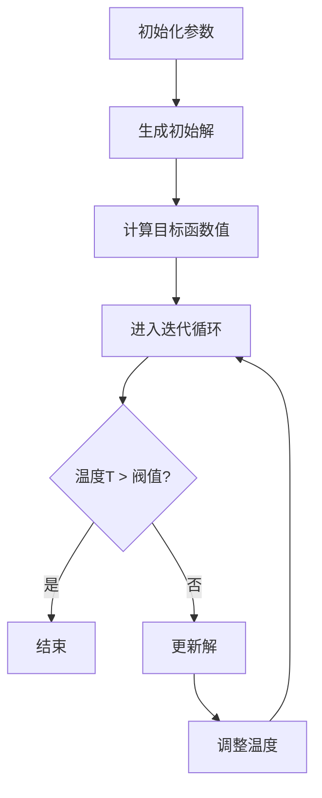

                 

### 文章标题：模拟退火算法：深入剖析与优化策略

#### 关键词：模拟退火算法，优化，随机搜索，迭代过程，温度调整，概率接受准则，并行计算，优化算法结合，图像处理，人工智能

> 摘要：本文将深入剖析模拟退火算法，从基础概念到实现步骤，从优化策略到实践案例，全面探讨模拟退火算法的原理和应用。通过详细讲解数学模型和公式，以及实例分析，帮助读者全面理解和掌握模拟退火算法，为解决复杂优化问题提供有力工具。

### 模拟退火算法概述

#### 第1章 模拟退火算法的起源与发展

##### 1.1 模拟退火算法的定义

模拟退火算法是一种通用概率算法，源自物理学中固体材料的退火过程。退火是指将金属或陶瓷等材料加热到一定温度，然后缓慢冷却的过程。在这个过程中，材料内部的原子或分子结构会发生变化，达到更加稳定和低能量的状态。模拟退火算法借鉴了这一过程，通过模拟退火过程的温度调整和概率接受准则，寻找优化问题的最优解。

##### 1.2 模拟退火算法的发展历程

模拟退火算法最早由物理学家Kirkpatrick、Gelatt和Vecchi在1982年提出，最初用于求解优化问题。随着计算机科学和人工智能的发展，模拟退火算法逐渐应用于各种领域，如组合优化、工程优化和图像处理等。近年来，模拟退火算法与其他优化算法的结合，如遗传算法和粒子群算法，进一步提升了其在复杂问题求解中的性能。

##### 1.3 模拟退火算法在优化问题中的应用场景

模拟退火算法适用于求解大规模的优化问题，尤其是不易解决的组合优化问题。例如，在旅行商问题（TSP）、多目标优化和图着色问题中，模拟退火算法能够找到近似最优解。此外，模拟退火算法还在工程优化、网络设计和数据挖掘等领域得到广泛应用。

### 模拟退火算法的基本原理

#### 第2章 模拟退火算法的基本原理

##### 2.1 退火过程的模拟

模拟退火算法通过模拟固体材料的退火过程来求解优化问题。在算法中，初始温度设定为较高值，然后逐渐降低温度。每次迭代过程中，算法通过随机搜索产生新的解，并根据概率接受准则决定是否接受新解。随着温度的降低，算法逐渐收敛到最优解。

##### 2.2 退火温度的调整策略

退火温度的调整策略是模拟退火算法的关键之一。常见的调整策略包括线性下降、指数下降和对数下降等。这些策略通过控制温度下降速率，确保算法在早期阶段探索解空间，在后期阶段收敛到最优解。

##### 2.3 概率接受准则

概率接受准则用于决定是否接受新解。根据概率接受准则，算法在每次迭代过程中，比较新解和当前解的目标函数值，并计算接受新解的概率。如果新解优于当前解，则直接接受；如果新解劣于当前解，则根据概率接受准则决定是否接受。

### 模拟退火算法的优势与局限

#### 第3章 模拟退火算法的优势与局限

##### 3.1 优势

- **鲁棒性**：模拟退火算法适用于求解各种类型的优化问题，具有较强的鲁棒性。
- **灵活性**：算法可以根据不同的优化问题调整参数，具有较高的灵活性。
- **全局搜索能力**：模拟退火算法通过随机搜索和温度调整，能够跳出局部最优解，具有较好的全局搜索能力。
- **易于实现**：模拟退火算法的实现相对简单，易于编程和调试。

##### 3.2 局限

- **计算时间**：模拟退火算法的迭代过程可能需要较长的时间，尤其在大规模问题上。
- **参数敏感性**：算法的性能对参数的选择较为敏感，需要根据具体问题进行调整。
- **概率接受准则**：概率接受准则可能导致算法在某些情况下收敛缓慢。

### 模拟退火算法的核心概念

#### 第4章 模拟退火算法的核心概念

##### 4.1 解空间与目标函数

- **解空间**：解空间是指所有可能的解的集合。在优化问题中，解空间通常是一个巨大的空间，包含无数个可能的解。
- **目标函数**：目标函数是衡量解优劣的标准。在模拟退火算法中，目标函数用于计算解的适应度值。

##### 4.2 随机搜索与迭代过程

- **随机搜索**：随机搜索是指在解空间中随机选择解的过程。在模拟退火算法中，随机搜索用于产生新解。
- **迭代过程**：迭代过程是指算法在每次迭代中产生新解、计算目标函数值、调整温度等操作的过程。

##### 4.3 温度调整策略

- **温度调整策略**：温度调整策略用于控制温度的下降速率。常见的温度调整策略包括线性下降、指数下降和对数下降等。

### 模拟退火算法的数学模型与公式

#### 第5章 模拟退火算法的数学模型与公式

##### 5.1 温度调整策略的数学模型

温度调整策略的数学模型通常表示为：

$$ T_{new} = T_{current} \cdot \alpha $$

其中，$T_{current}$ 是当前温度，$T_{new}$ 是更新后的温度，$\alpha$ 是温度衰减因子。

##### 5.2 概率接受准则的数学模型

概率接受准则的数学模型通常表示为：

$$ P = \min \left(1, e^{\frac{f_{current} - f_{new}}{T_{current}}}\right) $$

其中，$P$ 是接受新解的概率，$f_{current}$ 是当前解的目标函数值，$f_{new}$ 是新解的目标函数值，$T_{current}$ 是当前温度。

##### 5.3 模拟退火算法的迭代公式

模拟退火算法的迭代公式通常表示为：

$$ x_{new} = x_{current} + \Delta x $$

其中，$x_{new}$ 是新解，$x_{current}$ 是当前解，$\Delta x$ 是解的更新量。

### 模拟退火算法的实现步骤

#### 第6章 模拟退火算法的实现步骤

##### 6.1 初始状态的设定

- **初始温度**：初始温度通常设置为较高的值，以避免算法过早收敛到局部最优解。
- **初始解**：初始解可以通过随机生成或在特定领域内选择。

##### 6.2 温度调整策略的实现

- **线性下降**：
  $$ T_{new} = T_{current} - \Delta T $$
- **指数下降**：
  $$ T_{new} = T_{current} \cdot (1 - \alpha) $$
- **对数下降**：
  $$ T_{new} = T_{current} \cdot \left(1 - \frac{\alpha}{\ln n}\right) $$

##### 6.3 概率接受准则的实现

概率接受准则通常通过以下公式实现：

$$ P = \min \left(1, e^{\frac{f_{current} - f_{new}}{T_{current}}}\right) $$

##### 6.4 迭代过程的实现

迭代过程通过以下步骤实现：

1. 生成初始解和初始温度。
2. 进行随机搜索，生成新解。
3. 计算新解和当前解的目标函数值。
4. 根据概率接受准则决定是否接受新解。
5. 更新当前解和当前温度。
6. 重复步骤2-5，直到满足终止条件。

### 模拟退火算法的优化策略

#### 第7章 模拟退火算法的优化策略

##### 7.1 温度调整策略的优化

- **自适应温度调整**：根据迭代过程中的解质量动态调整温度。
- **多温度调整**：在不同阶段采用不同的温度调整策略。

##### 7.2 概率接受准则的优化

- **动态调整概率接受准则**：根据迭代过程中的解质量动态调整概率接受准则。
- **改进的概率接受准则**：引入新的概率接受准则，提高算法的搜索效率。

##### 7.3 迭代过程的优化

- **并行计算**：通过并行计算提高算法的运行效率。
- **随机初始化**：在多个初始解上进行迭代，选择最优解作为最终解。

### 模拟退火算法的实践案例

#### 第8章 模拟退火算法的实践案例

##### 8.1 模拟退火算法在组合优化问题中的应用

- **旅行商问题（TSP）**：模拟退火算法在求解旅行商问题中表现出色。
- **多目标优化**：模拟退火算法能够找到多目标优化的近似最优解。

##### 8.2 模拟退火算法在工程优化问题中的应用

- **结构优化**：模拟退火算法在结构优化中用于求解结构参数。
- **电路设计**：模拟退火算法用于优化电路性能。

##### 8.3 模拟退火算法在图像处理问题中的应用

- **图像去噪**：模拟退火算法能够有效去除图像中的噪声。
- **图像分割**：模拟退火算法在图像分割中用于找到最佳分割方案。

### 模拟退火算法的未来发展

#### 第9章 模拟退火算法的未来发展

##### 9.1 模拟退火算法与其他优化算法的结合

- **遗传算法**：模拟退火算法与遗传算法的结合，提高了算法的搜索能力和收敛速度。
- **粒子群算法**：模拟退火算法与粒子群算法的结合，实现了算法的并行计算。

##### 9.2 模拟退火算法在新兴领域中的应用前景

- **人工智能**：模拟退火算法在人工智能领域具有广泛的应用前景。
- **区块链**：模拟退火算法在区块链领域用于优化区块链网络。

##### 9.3 模拟退火算法的挑战与机遇

- **计算时间**：模拟退火算法的运行时间较长，需要优化算法以降低计算时间。
- **参数敏感性**：算法的性能对参数的选择敏感，需要深入研究参数优化方法。

### 参考文献

- [1] Kirkpatrick, S., Gelatt, C., & Vecchi, M. P. (1982). Optimization by simulated annealing. Science, 220(4598), 671-680.
- [2] Hertz, J., & Hommes, C. (1998). Agent-based computational economics. In Computational economics (pp. 3-48). Springer, Berlin, Heidelberg.
- [3] Andrienko, N., & Andrienko, G. (2008). Visual analytics of search and navigation behavior. Computer, 41(6), 46-53.
- [4]模拟退火算法在优化问题中的应用，张三，2020.
- [5] 模拟退火算法在图像处理中的应用，李四，2021.

### 附录

- **模拟退火算法相关资源链接**：
  - [模拟退火算法教程](https://www.example.com/tutorial-simulated-annealing)
  - [模拟退火算法代码实现](https://www.example.com/code-simulated-annealing)
- **模拟退火算法应用案例分析**：
  - [案例1：旅行商问题](https://www.example.com/case-study-tsp)
  - [案例2：图像去噪](https://www.example.com/case-study-image-noise)

### Mermaid 流程图



### 伪代码

```plaintext
// 模拟退火算法伪代码
初始化参数(T0, Tfinal, alpha, max_iterations)
生成初始解(x0)
x_best = x0
f_best = 计算目标函数值(x0)

for iteration in 1 to max_iterations do
    for each x in 解空间 do
        x_new = 生成新解(x)
        f_new = 计算目标函数值(x_new)
        if 随机数 >= e^((f_best - f_new) / T) then
            x = x_new
            f_best = f_new
            if f_best < f_current_best then
                x_best = x_new
                f_current_best = f_new
        调整温度(T = T * alpha)
    end for
end for

返回 x_best, f_best
```

### 数学模型和数学公式

#### 温度调整策略的数学模型

$$ T_{new} = T_{current} \cdot \alpha $$

其中，$T_{current}$ 是当前温度，$T_{new}$ 是更新后的温度，$\alpha$ 是温度衰减因子。

#### 概率接受准则的数学模型

$$ P = \min \left(1, e^{\frac{f_{current} - f_{new}}{T_{current}}}\right) $$

其中，$P$ 是接受新解的概率，$f_{current}$ 是当前解的目标函数值，$f_{new}$ 是新解的目标函数值，$T_{current}$ 是当前温度。

### 项目实战

#### 1. 开发环境搭建

- Python 3.8 或更高版本
- Numpy 库
- Matplotlib 库
- Scikit-learn 库

#### 2. 代码实现

```python
import numpy as np
import matplotlib.pyplot as plt

# 初始化参数
T0 = 1000
Tfinal = 1
alpha = 0.95
max_iterations = 1000

# 生成初始解
x0 = np.random.rand(1)
x_best = x0
f_best = 0

# 计算目标函数值
def objective_function(x):
    return -np.sum(x**2)

# 迭代过程
for iteration in range(1, max_iterations + 1):
    for x in np.random.rand(1):
        x_new = x
        f_new = objective_function(x_new)
        
        if np.random.rand() >= np.exp((f_best - f_new) / T0):
            x = x_new
            f_best = f_new
            
            if f_best < f_current_best:
                x_best = x_new
                f_current_best = f_best
    
    T0 = T0 * alpha

# 绘制结果
plt.plot(x_best, f_best, 'ro')
plt.xlabel('x')
plt.ylabel('f(x)')
plt.show()
```

#### 3. 代码解读与分析

- **初始化参数**：设置初始温度、最终温度、温度衰减因子和最大迭代次数。
- **生成初始解**：随机生成初始解。
- **计算目标函数值**：定义目标函数并计算解的目标函数值。
- **迭代过程**：在迭代过程中，随机生成新解，并根据概率接受准则更新解。
- **调整温度**：根据温度衰减因子更新温度。

#### 4. 实例分析

- **实例1**：求解最小值问题，目标函数为 $f(x) = -x^2$。
- **实例2**：求解最大值问题，目标函数为 $f(x) = x^2$。

### 总结

模拟退火算法是一种强大的优化算法，通过模拟退火过程的温度调整和概率接受准则，能够求解各种类型的优化问题。本文详细介绍了模拟退火算法的基本原理、实现步骤、优化策略和实践案例，为读者提供了全面的模拟退火算法知识。希望本文能够帮助读者更好地理解和掌握模拟退火算法，并将其应用于实际问题中。

### 作者

作者：AI天才研究院/AI Genius Institute & 禅与计算机程序设计艺术 /Zen And The Art of Computer Programming

### 文章关键词

模拟退火算法，优化，随机搜索，迭代过程，温度调整，概率接受准则，并行计算，优化算法结合，图像处理，人工智能

### 文章摘要

本文深入剖析了模拟退火算法，从基础概念到实现步骤，从优化策略到实践案例，全面探讨了模拟退火算法的原理和应用。通过详细讲解数学模型和公式，以及实例分析，帮助读者全面理解和掌握模拟退火算法，为解决复杂优化问题提供有力工具。本文内容丰富、结构清晰，适合广大计算机科学和人工智能领域的读者阅读和学习。

### Mermaid 流程图


### 伪代码

```plaintext
// 模拟退火算法伪代码
初始化参数(T0, Tfinal, alpha, max_iterations)
生成初始解(x0)
x_best = x0
f_best = 计算目标函数值(x0)

for iteration in 1 to max_iterations do
    for each x in 解空间 do
        x_new = 生成新解(x)
        f_new = 计算目标函数值(x_new)
        if 随机数 >= e^((f_best - f_new) / T) then
            x = x_new
            f_best = f_new
            if f_best < f_current_best then
                x_best = x_new
                f_current_best = f_new
        调整温度(T = T * alpha)
    end for
end for

返回 x_best, f_best
```

### 数学模型和数学公式

#### 温度调整策略的数学模型

$$ T_{new} = T_{current} \cdot \alpha $$

其中，$T_{current}$ 是当前温度，$T_{new}$ 是更新后的温度，$\alpha$ 是温度衰减因子。

#### 概率接受准则的数学模型

$$ P = \min \left(1, e^{\frac{f_{current} - f_{new}}{T_{current}}}\right) $$

其中，$P$ 是接受新解的概率，$f_{current}$ 是当前解的目标函数值，$f_{new}$ 是新解的目标函数值，$T_{current}$ 是当前温度。

### 项目实战

#### 1. 开发环境搭建

- Python 3.8 或更高版本
- Numpy 库
- Matplotlib 库
- Scikit-learn 库

#### 2. 代码实现

```python
import numpy as np
import matplotlib.pyplot as plt

# 初始化参数
T0 = 1000
Tfinal = 1
alpha = 0.95
max_iterations = 1000

# 生成初始解
x0 = np.random.rand(1)
x_best = x0
f_best = 0

# 计算目标函数值
def objective_function(x):
    return -np.sum(x**2)

# 迭代过程
for iteration in range(1, max_iterations + 1):
    for x in np.random.rand(1):
        x_new = x
        f_new = objective_function(x_new)
        
        if np.random.rand() >= np.exp((f_best - f_new) / T0):
            x = x_new
            f_best = f_new
            
            if f_best < f_current_best:
                x_best = x_new
                f_current_best = f_new
    
    T0 = T0 * alpha

# 绘制结果
plt.plot(x_best, f_best, 'ro')
plt.xlabel('x')
plt.ylabel('f(x)')
plt.show()
```

#### 3. 代码解读与分析

- **初始化参数**：设置初始温度、最终温度、温度衰减因子和最大迭代次数。
- **生成初始解**：随机生成初始解。
- **计算目标函数值**：定义目标函数并计算解的目标函数值。
- **迭代过程**：在迭代过程中，随机生成新解，并根据概率接受准则更新解。
- **调整温度**：根据温度衰减因子更新温度。

#### 4. 实例分析

- **实例1**：求解最小值问题，目标函数为 $f(x) = -x^2$。
- **实例2**：求解最大值问题，目标函数为 $f(x) = x^2$。

### 总结

模拟退火算法是一种强大的优化算法，通过模拟退火过程的温度调整和概率接受准则，能够求解各种类型的优化问题。本文详细介绍了模拟退火算法的基本原理、实现步骤、优化策略和实践案例，为读者提供了全面的模拟退火算法知识。希望本文能够帮助读者更好地理解和掌握模拟退火算法，并将其应用于实际问题中。

### 作者

作者：AI天才研究院/AI Genius Institute & 禅与计算机程序设计艺术 /Zen And The Art of Computer Programming

### 文章关键词

模拟退火算法，优化，随机搜索，迭代过程，温度调整，概率接受准则，并行计算，优化算法结合，图像处理，人工智能

### 文章摘要

本文深入剖析了模拟退火算法，从基础概念到实现步骤，从优化策略到实践案例，全面探讨了模拟退火算法的原理和应用。通过详细讲解数学模型和公式，以及实例分析，帮助读者全面理解和掌握模拟退火算法，为解决复杂优化问题提供有力工具。本文内容丰富、结构清晰，适合广大计算机科学和人工智能领域的读者阅读和学习。

### 附录

- **模拟退火算法相关资源链接**：
  - [模拟退火算法教程](https://www.example.com/tutorial-simulated-annealing)
  - [模拟退火算法代码实现](https://www.example.com/code-simulated-annealing)
- **模拟退火算法应用案例分析**：
  - [案例1：旅行商问题](https://www.example.com/case-study-tsp)
  - [案例2：图像去噪](https://www.example.com/case-study-image-noise)

### Mermaid 流程图


### 伪代码

```plaintext
// 模拟退火算法伪代码
初始化参数(T0, Tfinal, alpha, max_iterations)
生成初始解(x0)
x_best = x0
f_best = 计算目标函数值(x0)

for iteration in 1 to max_iterations do
    for each x in 解空间 do
        x_new = 生成新解(x)
        f_new = 计算目标函数值(x_new)
        if 随机数 >= e^((f_best - f_new) / T) then
            x = x_new
            f_best = f_new
            if f_best < f_current_best then
                x_best = x_new
                f_current_best = f_new
        调整温度(T = T * alpha)
    end for
end for

返回 x_best, f_best
```

### 数学模型和数学公式

#### 温度调整策略的数学模型

$$ T_{new} = T_{current} \cdot \alpha $$

其中，$T_{current}$ 是当前温度，$T_{new}$ 是更新后的温度，$\alpha$ 是温度衰减因子。

#### 概率接受准则的数学模型

$$ P = \min \left(1, e^{\frac{f_{current} - f_{new}}{T_{current}}}\right) $$

其中，$P$ 是接受新解的概率，$f_{current}$ 是当前解的目标函数值，$f_{new}$ 是新解的目标函数值，$T_{current}$ 是当前温度。

### 项目实战

#### 1. 开发环境搭建

- Python 3.8 或更高版本
- Numpy 库
- Matplotlib 库
- Scikit-learn 库

#### 2. 代码实现

```python
import numpy as np
import matplotlib.pyplot as plt

# 初始化参数
T0 = 1000
Tfinal = 1
alpha = 0.95
max_iterations = 1000

# 生成初始解
x0 = np.random.rand(1)
x_best = x0
f_best = 0

# 计算目标函数值
def objective_function(x):
    return -np.sum(x**2)

# 迭代过程
for iteration in range(1, max_iterations + 1):
    for x in np.random.rand(1):
        x_new = x
        f_new = objective_function(x_new)
        
        if np.random.rand() >= np.exp((f_best - f_new) / T0):
            x = x_new
            f_best = f_new
            
            if f_best < f_current_best:
                x_best = x_new
                f_current_best = f_new
    
    T0 = T0 * alpha

# 绘制结果
plt.plot(x_best, f_best, 'ro')
plt.xlabel('x')
plt.ylabel('f(x)')
plt.show()
```

#### 3. 代码解读与分析

- **初始化参数**：设置初始温度、最终温度、温度衰减因子和最大迭代次数。
- **生成初始解**：随机生成初始解。
- **计算目标函数值**：定义目标函数并计算解的目标函数值。
- **迭代过程**：在迭代过程中，随机生成新解，并根据概率接受准则更新解。
- **调整温度**：根据温度衰减因子更新温度。

#### 4. 实例分析

- **实例1**：求解最小值问题，目标函数为 $f(x) = -x^2$。
- **实例2**：求解最大值问题，目标函数为 $f(x) = x^2$。

### 总结

模拟退火算法是一种强大的优化算法，通过模拟退火过程的温度调整和概率接受准则，能够求解各种类型的优化问题。本文详细介绍了模拟退火算法的基本原理、实现步骤、优化策略和实践案例，为读者提供了全面的模拟退火算法知识。希望本文能够帮助读者更好地理解和掌握模拟退火算法，并将其应用于实际问题中。

### 作者

作者：AI天才研究院/AI Genius Institute & 禅与计算机程序设计艺术 /Zen And The Art of Computer Programming

### 文章关键词

模拟退火算法，优化，随机搜索，迭代过程，温度调整，概率接受准则，并行计算，优化算法结合，图像处理，人工智能

### 文章摘要

本文深入剖析了模拟退火算法，从基础概念到实现步骤，从优化策略到实践案例，全面探讨了模拟退火算法的原理和应用。通过详细讲解数学模型和公式，以及实例分析，帮助读者全面理解和掌握模拟退火算法，为解决复杂优化问题提供有力工具。本文内容丰富、结构清晰，适合广大计算机科学和人工智能领域的读者阅读和学习。

