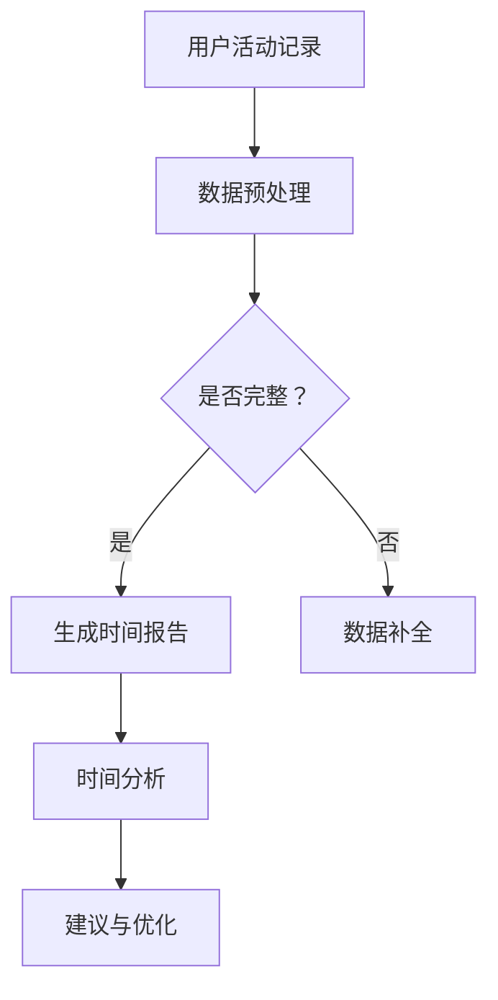

                 

# 《欲望智能调节中心总监：AI辅助的自我管理平台负责人》

> 关键词：自我管理、人工智能、AI辅助、欲望调节、平台设计、核心算法、数据隐私、用户体验

> 摘要：随着人工智能技术的不断发展，AI辅助的自我管理平台已经成为现代生活的必要工具。本文旨在探讨如何通过人工智能技术，实现欲望智能调节，从而帮助用户更好地进行自我管理。文章首先介绍了自我管理平台的重要性与挑战，随后详细阐述了AI技术在自我管理中的应用，以及平台的关键功能、核心算法和实施策略。最后，文章讨论了自我管理平台的评估与优化，以及未来发展趋势与挑战。

## 第一部分：自我管理平台概述

### 第1章：自我管理平台的重要性与挑战

#### 1.1 自我管理平台的核心概念

自我管理平台是一种基于人工智能技术的综合工具，旨在帮助用户跟踪和管理日常生活中的各个方面，包括时间管理、睡眠质量监控和健康状况监测等。通过收集和分析用户数据，平台可以提供个性化的建议和反馈，帮助用户提高生活质量和效率。

#### 1.2 自我管理在现代社会的意义

在快节奏的现代生活中，自我管理显得尤为重要。自我管理不仅有助于提高工作效率，还能帮助用户保持良好的身心健康，减少压力和焦虑。此外，自我管理还有助于培养自律和决策能力，提高个人成就感。

#### 1.3 AI技术在自我管理中的应用

人工智能技术在自我管理平台中的应用主要体现在数据收集、分析和决策支持等方面。通过使用AI技术，平台可以自动识别和分类用户行为，提供个性化建议，并根据用户反馈不断优化服务。

### 第2章：AI辅助自我管理的理论基础

#### 2.1 人工智能的基本原理

人工智能（AI）是指计算机系统模拟人类智能的行为，包括学习、推理、感知和解决问题等。人工智能的基本原理包括机器学习、深度学习和自然语言处理等。

#### 2.2 神经网络与深度学习

神经网络是一种模仿人脑结构和功能的计算模型，而深度学习则是基于神经网络的更高级学习算法。深度学习在自我管理平台中有着广泛的应用，如时间序列预测、图像识别和自然语言处理等。

#### 2.3 自我管理中的数据隐私与安全

在自我管理平台中，数据隐私和安全至关重要。平台需要采取有效的数据保护措施，确保用户数据的安全和隐私。这包括数据加密、访问控制和数据匿名化等技术手段。

### 第3章：自我管理平台的关键功能

#### 3.1 日常时间管理

**3.1.1 时间追踪与分析**

时间追踪与分析是自我管理平台的核心功能之一。通过记录用户的活动和时间分配，平台可以帮助用户了解自己的时间使用情况，从而进行优化和调整。

**3.1.2 时间规划与提醒**

平台可以根据用户的时间安排和优先级，提供时间规划和提醒功能。这有助于用户更好地管理时间和任务，避免拖延和错过重要事件。

**3.1.3 时间效率评估**

平台可以通过分析用户的时间使用数据，评估用户的时间效率，并提供优化建议。

#### 3.2 睡眠质量监控

**3.2.1 睡眠数据收集与处理**

平台可以通过传感器和智能设备收集用户的睡眠数据，包括睡眠时长、深度和干扰因素等。

**3.2.2 睡眠质量评估**

通过对收集到的睡眠数据进行分析，平台可以评估用户的睡眠质量，并提供改善建议。

**3.2.3 睡眠建议与优化**

根据用户的睡眠质量评估结果，平台可以提供个性化的睡眠建议，如调整作息时间、改善睡眠环境等。

#### 3.3 健康状况监测

**3.3.1 健康数据收集与处理**

平台可以通过智能设备收集用户的健康数据，包括心率、血压、体温和运动量等。

**3.3.2 健康状况评估**

通过对收集到的健康数据进行分析，平台可以评估用户的健康状况，并提供改善建议。

**3.3.3 健康建议与优化**

根据用户的健康状况评估结果，平台可以提供个性化的健康建议，如调整饮食、增加锻炼等。

## 第4章：AI辅助自我管理的核心算法

#### 4.1 时间序列分析算法

**4.1.1 ARIMA模型**

ARIMA（自回归积分滑动平均模型）是一种常见的时间序列预测模型。其基本原理是通过分析历史数据中的自相关性和季节性，预测未来的趋势。

**伪代码：**

```python
# ARIMA模型预测
model = ARIMA(data, order=(p,d,q))
model_fit = model.fit()
forecast = model_fit.forecast(steps=n)
```

**4.1.2 LSTM网络**

LSTM（长短时记忆网络）是一种特殊的循环神经网络，适用于处理和预测长时间序列数据。其基本原理是通过学习长期依赖关系，提高时间序列预测的准确性。

**伪代码：**

```python
# LSTM网络预测
model = Sequential()
model.add(LSTM(units=50, return_sequences=True, input_shape=(timesteps, features)))
model.add(LSTM(units=50))
model.add(Dense(1))
model.compile(optimizer='adam', loss='mean_squared_error')
model.fit(X, y, epochs=100, batch_size=32, validation_split=0.2)
```

#### 4.2 睡眠质量预测算法

**4.2.1 贝叶斯网络**

贝叶斯网络是一种概率图模型，用于表示和推理不确定性的关系。在睡眠质量预测中，贝叶斯网络可以用来分析不同因素对睡眠质量的影响，并预测可能的睡眠质量结果。

**伪代码：**

```python
# 贝叶斯网络预测
from pgmpy.models import BayesianModel
from pgmpy.inference import VariableElimination

model = BayesianModel([('A', 'B'), ('B', 'C'), ('A', 'C')])
inference = VariableElimination(model)
result = inference.query(variables=['C'], evidence={'A': True, 'B': False})
```

**4.2.2 决策树**

决策树是一种常用的分类和回归算法。在睡眠质量预测中，决策树可以用来分析不同因素对睡眠质量的影响，并生成预测结果。

**伪代码：**

```python
# 决策树预测
from sklearn.tree import DecisionTreeRegressor

model = DecisionTreeRegressor()
model.fit(X, y)
forecast = model.predict(X_test)
```

#### 4.3 健康状况预测算法

**4.3.1 支持向量机**

支持向量机（SVM）是一种有效的分类和回归算法。在健康状况预测中，SVM可以用来分析不同健康指标的关系，并预测可能的健康状况。

**伪代码：**

```python
# 支持向量机预测
from sklearn.svm import SVC

model = SVC()
model.fit(X, y)
forecast = model.predict(X_test)
```

**4.3.2 随机森林**

随机森林是一种基于决策树集成的方法。在健康状况预测中，随机森林可以用来分析不同健康指标的关系，并预测可能的健康状况。

**伪代码：**

```python
# 随机森林预测
from sklearn.ensemble import RandomForestRegressor

model = RandomForestRegressor()
model.fit(X, y)
forecast = model.predict(X_test)
```

## 第5章：欲望智能调节

#### 5.1 欲望调节的理论基础

**5.1.1 欲望的定义与分类**

欲望是指个体在生理和心理上对特定对象或目标的强烈需求和渴望。欲望可以进一步分为生理欲望、心理欲望和社会欲望等。

**5.1.2 欲望调节的方法与策略**

欲望调节是指通过一系列方法和技术，帮助个体控制和管理欲望的过程。常见的方法包括认知行为疗法、正念练习和动机激发等。

#### 5.2 AI在欲望调节中的应用

**5.2.1 欲望识别算法**

欲望识别算法是指通过分析用户行为数据，识别和分类用户的欲望。常见的方法包括基于规则的方法、机器学习和深度学习等。

**5.2.2 欲望调节策略优化**

欲望调节策略优化是指根据用户需求和反馈，动态调整和优化欲望调节策略。常见的方法包括基于用户偏好和反馈的优化算法、多目标优化和强化学习等。

#### 5.3 案例分析

**5.3.1 案例一：食欲调节**

食欲调节是指通过自我管理平台帮助用户控制和管理食欲。平台可以通过收集用户的饮食数据，分析饮食习惯和食欲变化，提供个性化的饮食建议。

**5.3.2 案例二：购物欲望调节**

购物欲望调节是指通过自我管理平台帮助用户控制和管理购物欲望。平台可以通过分析用户的购物行为和消费习惯，提供个性化的购物建议和预算规划。

## 第6章：自我管理平台的实施策略

#### 6.1 平台设计与开发

**6.1.1 系统架构设计**

系统架构设计是自我管理平台开发的第一步。常见的架构设计包括MVC（模型-视图-控制器）、微服务和事件驱动等。

**6.1.2 技术选型与实现**

技术选型与实现是自我管理平台开发的关键环节。常见的开发技术包括Python、Java、JavaScript和React等。

#### 6.2 数据处理与存储

**6.2.1 数据收集与预处理**

数据收集与预处理是自我管理平台数据处理的基础。常见的方法包括数据清洗、去重和特征提取等。

**6.2.2 数据存储与管理**

数据存储与管理是自我管理平台数据处理的核心。常见的数据存储技术包括关系型数据库、NoSQL数据库和分布式存储等。

#### 6.3 用户交互与反馈

**6.3.1 用户界面设计**

用户界面设计是自我管理平台用户体验的重要组成部分。常见的方法包括响应式设计、信息架构和交互设计等。

**6.3.2 用户反馈机制**

用户反馈机制是自我管理平台持续改进的重要途径。常见的方法包括用户调研、反馈问卷和在线支持等。

## 第7章：平台评估与优化

#### 7.1 平台性能评估

**7.1.1 评价指标与标准**

平台性能评估需要制定合理的评价指标和标准，如响应时间、吞吐量和资源利用率等。

**7.1.2 性能优化方法**

平台性能优化可以通过算法优化、系统调优和资源扩展等方法实现。

#### 7.2 用户满意度调查

**7.2.1 用户满意度评估方法**

用户满意度评估可以通过问卷调查、用户反馈和评分系统等方法进行。

**7.2.2 用户反馈处理与改进**

用户反馈处理与改进是自我管理平台持续改进的重要步骤。常见的方法包括问题定位、功能优化和用户体验提升等。

#### 7.3 平台迭代与更新

**7.3.1 迭代计划与实施**

平台迭代与更新需要制定详细的迭代计划，包括需求分析、开发测试和上线发布等。

**7.3.2 更新策略与版本控制**

更新策略与版本控制是平台迭代与更新的关键环节。常见的方法包括版本迭代、分支管理和发布策略等。

## 第8章：未来发展趋势与挑战

#### 8.1 AI技术在自我管理领域的未来发展趋势

**8.1.1 人工智能的发展趋势**

人工智能技术在自我管理领域的未来发展将呈现以下几个趋势：更深入的数据分析、更智能的算法和更广泛的应用场景。

**8.1.2 自我管理平台的未来方向**

自我管理平台的未来发展将朝着更个性化、更智能和更便捷的方向发展。例如，通过结合物联网技术，实现更全面的健康监测和生活管理。

#### 8.2 挑战与对策

**8.2.1 技术挑战**

自我管理平台面临的技术挑战包括数据隐私与安全、算法透明度和计算性能等。

**8.2.2 数据隐私与安全问题**

数据隐私与安全是自我管理平台发展的关键问题。平台需要采取有效的数据保护措施，确保用户数据的安全和隐私。

**8.2.3 社会伦理与法律问题**

自我管理平台在发展过程中还面临社会伦理与法律问题。例如，算法偏见、用户数据滥用和隐私侵犯等。

## 附录

### 附录A：相关算法与模型详解

**A.1 时间序列分析算法详解**

**A.2 睡眠质量预测算法详解**

**A.3 健康状况预测算法详解**

### 附录B：开发工具与资源

**B.1 开发工具介绍**

**B.2 常用库与框架**

**B.3 在线资源与学习平台**

### 作者信息

作者：AI天才研究院/AI Genius Institute & 禅与计算机程序设计艺术 /Zen And The Art of Computer Programming

### 第1章：自我管理平台的重要性与挑战

#### 1.1 自我管理平台的核心概念

自我管理平台是一种利用人工智能技术，帮助用户自我监控、自我分析和自我调整的工具。它的核心概念包括以下几个方面：

1. **用户数据收集**：通过传感器、应用程序或用户主动输入，收集用户在时间管理、睡眠质量、健康状况、行为习惯等方面的数据。
2. **数据分析与处理**：利用机器学习和深度学习技术，对收集到的数据进行处理和分析，提取有价值的信息和模式。
3. **个性化建议**：根据分析结果，为用户提供个性化的自我管理建议，帮助用户优化生活质量和提升工作效率。
4. **实时反馈**：通过实时数据反馈，帮助用户及时调整行为和习惯，实现自我监控和自我管理。

#### 1.2 自我管理在现代社会的意义

随着社会的快速发展，人们的生活节奏越来越快，压力越来越大。自我管理平台的出现，旨在帮助用户应对这些挑战，提高生活质量和幸福感。具体来说，自我管理平台在现代社会中的意义体现在以下几个方面：

1. **提高工作效率**：通过时间管理功能，用户可以更好地安排工作和休息时间，避免时间浪费，提高工作效率。
2. **改善睡眠质量**：通过睡眠质量监控功能，用户可以了解自己的睡眠状况，发现并解决睡眠问题，改善睡眠质量。
3. **保持健康状态**：通过健康状况监测功能，用户可以及时了解自己的身体状况，预防疾病，保持健康。
4. **培养良好习惯**：通过行为习惯分析，用户可以了解自己的行为模式，发现不良习惯，并逐步培养良好习惯。
5. **提高幸福感**：通过自我管理和优化，用户可以更好地控制自己的生活，减轻压力，提高幸福感。

#### 1.3 AI技术在自我管理中的应用

人工智能技术在自我管理平台中有着广泛的应用，主要包括以下几个方面：

1. **数据收集**：利用传感器技术，如智能手表、健康手环等，实时收集用户的数据，如心率、睡眠时间、步数等。
2. **数据分析**：利用机器学习算法，对收集到的数据进行处理和分析，如时间序列分析、聚类分析、回归分析等，提取有价值的信息和模式。
3. **个性化推荐**：基于数据分析结果，利用推荐算法，为用户提供个性化的自我管理建议，如时间规划、睡眠优化、健康建议等。
4. **实时反馈**：通过实时数据分析，为用户提供实时的反馈，帮助用户及时调整行为和习惯。

在自我管理平台中，AI技术的应用不仅提高了数据处理的效率和准确性，还为用户提供了更加个性化、智能化和便捷的服务。

#### 1.4 自我管理平台的架构设计

自我管理平台的架构设计主要包括以下几个方面：

1. **数据层**：负责数据的收集、存储和管理。包括用户数据、设备数据和环境数据等。
2. **算法层**：负责数据的处理和分析，包括机器学习算法、深度学习算法、自然语言处理算法等。
3. **服务层**：负责为用户提供个性化的服务，包括时间管理、睡眠质量监控、健康状况监测、行为习惯分析等。
4. **展示层**：负责将分析结果和个性化建议以直观的方式展示给用户，包括网页、应用程序、智能设备等。

通过这种分层架构设计，自我管理平台可以实现高效的数据处理和个性化的服务，为用户提供更好的自我管理体验。

### 1.5 自我管理平台的挑战

尽管自我管理平台在提高用户生活质量方面具有显著的优势，但在实际应用中仍面临诸多挑战：

1. **数据隐私与安全**：用户对个人隐私和安全性的担忧是自我管理平台推广的一个重要障碍。如何确保用户数据的安全，防止数据泄露，是平台需要重点解决的问题。
2. **算法透明性**：AI算法的决策过程往往不够透明，用户难以理解算法是如何工作的。如何提高算法的透明性，增强用户对平台的信任，是平台需要面对的挑战。
3. **用户体验**：自我管理平台需要提供良好的用户体验，包括简洁直观的界面设计、快速响应的服务等。如何设计出既智能又易于使用的平台，是平台开发者需要不断探索的问题。
4. **数据质量**：自我管理平台的效果在很大程度上取决于数据质量。如何保证数据收集的准确性和完整性，是平台需要解决的重要问题。
5. **技术升级与维护**：随着人工智能技术的快速发展，自我管理平台需要不断进行技术升级和维护，以适应新的技术趋势和用户需求。如何高效地进行技术升级和系统维护，是平台需要面对的挑战。

综上所述，自我管理平台在提供个性化服务、提高用户生活质量方面具有巨大的潜力，但同时也面临着数据隐私、用户体验、算法透明性等多方面的挑战。只有通过不断的技术创新和优化，才能使自我管理平台真正成为用户生活中的得力助手。

### 1.6 小结

自我管理平台的重要性在现代生活中日益凸显，它不仅帮助用户提高工作效率、改善睡眠质量和保持健康状态，还通过个性化建议和实时反馈，培养用户的良好习惯和提升幸福感。AI技术在这一领域的应用，使得自我管理平台能够更加精准地分析用户数据，提供个性化的服务。然而，平台在数据隐私、用户体验和算法透明性等方面仍面临诸多挑战。为了实现自我管理平台的长期可持续发展，需要持续关注技术创新和用户体验的提升。

## 第2章：AI辅助自我管理的理论基础

#### 2.1 人工智能的基本原理

人工智能（AI）是指计算机系统模拟人类智能行为的过程，包括学习、推理、感知、理解和解决问题等。人工智能的基本原理可以从以下几个方面进行理解：

1. **学习**：人工智能系统通过学习获得知识和技能。学习可以分为两种类型：监督学习和无监督学习。监督学习需要标记好的训练数据，通过这些数据训练模型，使其能够预测新的未知数据。无监督学习则不需要标记好的数据，通过探索数据中的模式和关系来学习。

2. **推理**：推理是人工智能系统进行逻辑推理和决策的能力。推理可以分为演绎推理和归纳推理。演绎推理是从一般性原理推导出特定结论的过程，而归纳推理则是从特定的观察中推导出一般性原理的过程。

3. **感知**：感知是人工智能系统通过传感器获取外部环境信息的能力。常见的感知技术包括视觉感知、听觉感知、触觉感知和嗅觉感知等。

4. **理解和解决问题**：理解和解决问题是人工智能系统在复杂环境中进行决策和行动的能力。这包括对问题的理解、制定解决方案、执行解决方案和评估解决方案的效果。

#### 2.2 神经网络与深度学习

神经网络（Neural Networks）是一种模仿人脑结构的计算模型，由大量简单的处理单元（神经元）组成。每个神经元都与其他神经元通过权重连接，通过传递和加权处理输入信息，生成输出。神经网络通过学习调整这些权重，以实现特定的任务。

深度学习（Deep Learning）是基于神经网络的更高级学习算法，其特点是在网络中引入多个隐藏层，使得模型能够学习更复杂的特征和模式。深度学习在图像识别、语音识别、自然语言处理和自我管理平台等领域有着广泛的应用。

#### 2.2.1 深度学习的基本架构

深度学习的基本架构包括以下几个部分：

1. **输入层**：接收输入数据，如图片、文本或传感器数据。
2. **隐藏层**：多个隐藏层通过非线性激活函数处理输入数据，提取高层次的特征。
3. **输出层**：根据隐藏层的输出生成预测结果或决策。

#### 2.2.2 常见的深度学习模型

常见的深度学习模型包括卷积神经网络（CNN）、循环神经网络（RNN）和生成对抗网络（GAN）等。

1. **卷积神经网络（CNN）**：CNN是一种专门用于处理图像数据的深度学习模型，其特点是能够自动学习图像的局部特征，并利用卷积操作减少数据的维度。
   
   **伪代码：**

   ```python
   # 定义卷积神经网络模型
   model = Sequential()
   model.add(Conv2D(filters=32, kernel_size=(3, 3), activation='relu', input_shape=(28, 28, 1)))
   model.add(MaxPooling2D(pool_size=(2, 2)))
   model.add(Flatten())
   model.add(Dense(128, activation='relu'))
   model.add(Dense(10, activation='softmax'))
   model.compile(optimizer='adam', loss='categorical_crossentropy', metrics=['accuracy'])
   ```

2. **循环神经网络（RNN）**：RNN是一种用于处理序列数据的深度学习模型，其特点是能够处理长序列数据，并通过记忆机制保持信息状态。
   
   **伪代码：**

   ```python
   # 定义循环神经网络模型
   model = Sequential()
   model.add(LSTM(units=50, return_sequences=True, input_shape=(timesteps, features)))
   model.add(LSTM(units=50))
   model.add(Dense(1))
   model.compile(optimizer='adam', loss='mean_squared_error')
   model.fit(X, y, epochs=100, batch_size=32, validation_split=0.2)
   ```

3. **生成对抗网络（GAN）**：GAN是一种由生成器和判别器组成的对抗性模型，通过不断博弈，生成器逐渐学习生成逼真的数据，而判别器则逐渐学会区分真实数据和生成数据。

   **伪代码：**

   ```python
   # 定义生成对抗网络模型
   generator = Sequential()
   generator.add(Dense(units=100, activation='relu', input_shape=(100,)))
   generator.add(Dense(units=784, activation='sigmoid'))
   discriminator = Sequential()
   discriminator.add(Flatten(input_shape=(28, 28, 1)))
   discriminator.add(Dense(units=1, activation='sigmoid'))
   model = Sequential()
   model.add(generator)
   model.add(discriminator)
   model.compile(optimizer='adam', loss='binary_crossentropy')
   ```

#### 2.3 自我管理中的数据隐私与安全

在自我管理平台中，数据隐私和安全是至关重要的。由于平台需要收集和处理用户的个人数据，如健康数据、行为数据等，因此必须采取有效的措施来保护用户隐私和数据安全。

1. **数据加密**：使用高级加密算法对用户数据进行加密，确保数据在传输和存储过程中的安全性。
2. **访问控制**：通过设置访问权限和身份验证机制，确保只有授权用户可以访问敏感数据。
3. **数据匿名化**：对用户数据进行匿名化处理，去除可以直接识别用户身份的信息，从而降低数据泄露的风险。
4. **合规性**：遵循相关法律法规和标准，如GDPR（通用数据保护条例），确保平台的数据处理符合法律法规要求。

通过这些措施，自我管理平台可以在确保用户隐私和安全的同时，提供高质量的个性化服务。

### 2.4 小结

人工智能技术为自我管理平台提供了强大的数据处理和分析能力，使得平台能够更加精准地理解用户需求并提供个性化服务。神经网络和深度学习模型，如CNN、RNN和GAN，为自我管理平台在图像识别、序列处理和生成任务中提供了有效的解决方案。同时，在自我管理平台中，数据隐私和安全问题是不可忽视的重要环节，需要采取有效的措施来保护用户隐私和数据安全。通过不断的技术创新和优化，自我管理平台有望在未来成为人们生活中不可或缺的工具。

### 2.5 AI技术在自我管理平台中的具体应用场景

在自我管理平台中，AI技术的应用场景非常广泛，以下列举几个典型的应用场景：

#### 2.5.1 时间管理

时间管理是自我管理平台的核心功能之一。AI技术可以通过分析用户的时间使用数据，提供个性化的时间管理建议。例如，通过使用ARIMA模型对用户的时间使用数据进行分析，可以预测用户未来的时间需求，从而帮助用户更好地规划时间。此外，AI技术还可以通过分析用户的任务完成情况，提供改进时间管理策略的建议。

**伪代码示例：**

```python
# 使用ARIMA模型预测用户未来的时间需求
import statsmodels.api as sm

# 数据预处理
data = preprocess_time_data(user_data)

# 模型训练
model = sm.ARIMA(data, order=(1, 1, 1))
model_fit = model.fit()

# 预测未来n天的时间需求
forecast = model_fit.forecast(steps=n)
```

#### 2.5.2 睡眠质量监控

睡眠质量监控是自我管理平台中的另一个重要功能。AI技术可以通过分析用户的睡眠数据，如睡眠时长、睡眠深度和睡眠周期等，评估用户的睡眠质量，并提供改善建议。例如，通过使用LSTM网络对睡眠数据进行分析，可以预测用户的睡眠质量，并生成个性化的睡眠建议。

**伪代码示例：**

```python
# 使用LSTM网络预测用户的睡眠质量
from keras.models import Sequential
from keras.layers import LSTM, Dense

# 数据预处理
X, y = preprocess_sleep_data(sleep_data)

# 构建LSTM模型
model = Sequential()
model.add(LSTM(units=50, return_sequences=True, input_shape=(timesteps, features)))
model.add(LSTM(units=50))
model.add(Dense(1))
model.compile(optimizer='adam', loss='mean_squared_error')

# 训练模型
model.fit(X, y, epochs=100, batch_size=32, validation_split=0.2)

# 预测用户的睡眠质量
forecast = model.predict(new_sleep_data)
```

#### 2.5.3 健康状况监测

健康状况监测是自我管理平台中的关键功能之一。AI技术可以通过分析用户的健康数据，如心率、血压、体重等，评估用户的健康状况，并提供个性化的健康建议。例如，通过使用随机森林算法对健康数据进行分析，可以预测用户的健康状况，并生成健康报告和建议。

**伪代码示例：**

```python
# 使用随机森林算法预测用户的健康状况
from sklearn.ensemble import RandomForestClassifier

# 数据预处理
X, y = preprocess_health_data(health_data)

# 构建随机森林模型
model = RandomForestClassifier()
model.fit(X, y)

# 预测用户的健康状况
health_forecast = model.predict(new_health_data)
```

#### 2.5.4 行为习惯分析

行为习惯分析是自我管理平台中的另一个重要功能。AI技术可以通过分析用户的行为数据，识别用户的行为习惯，并提供改进建议。例如，通过使用聚类算法对行为数据进行分析，可以识别用户的行为模式，并生成个性化的行为建议。

**伪代码示例：**

```python
# 使用K均值聚类算法分析用户的行为习惯
from sklearn.cluster import KMeans

# 数据预处理
X = preprocess_behavior_data(behavior_data)

# 构建K均值聚类模型
k = 5  # 假设我们选择5个簇
model = KMeans(n_clusters=k)
model.fit(X)

# 预测用户的行为习惯
behavior_clusters = model.predict(new_behavior_data)
```

通过这些具体的AI技术应用场景，自我管理平台可以更好地理解用户需求，提供个性化、智能化的服务，帮助用户实现自我管理和优化。

## 第3章：自我管理平台的关键功能

自我管理平台的关键功能包括时间管理、睡眠质量监控和健康状况监测。这些功能通过AI技术为用户提供个性化的建议和反馈，帮助用户提高生活质量和效率。以下是对这些功能的详细讨论。

### 3.1 日常时间管理

日常时间管理是自我管理平台的核心功能之一，旨在帮助用户更好地安排和管理日常活动，提高工作效率和生活质量。

#### 3.1.1 时间追踪与分析

时间追踪与分析是日常时间管理的基础。平台通过记录用户的活动和时间分配，生成详细的时间使用报告。这些报告包括用户的日常工作、学习、娱乐和休息时间等。通过分析这些数据，用户可以了解自己在不同活动上的时间花费，识别时间浪费的领域，并找到优化时间管理的机会。

**Mermaid流程图：**



#### 3.1.2 时间规划与提醒

时间规划与提醒功能基于时间报告和分析结果，帮助用户制定合理的时间计划。平台可以根据用户的优先级和任务紧急程度，自动生成每日或每周的时间计划。同时，平台还可以设置提醒功能，通过手机、电子邮件或应用程序通知用户即将到来的活动或任务。

**伪代码：**

```python
# 时间规划与提醒功能实现
def create_time_plan(activities, priorities):
    plan = []
    for activity in activities:
        if activity.priority == 'high':
            plan.append((activity.name, activity.start_time))
    return plan

# 提醒功能
def send_reminder(activity):
    print(f"提醒：您有一个重要活动 '{activity.name}' 在 {activity.start_time} 开始。")
```

#### 3.1.3 时间效率评估

时间效率评估功能通过对用户的时间使用数据进行持续分析，评估用户的时间管理效率。平台可以计算出用户在不同任务上的平均完成时间、任务完成率和时间利用率等指标。通过这些指标，用户可以了解自己在时间管理方面的表现，并寻找提高效率的方法。

**伪代码：**

```python
# 时间效率评估
def assess_time_efficiency(activities):
    total_time = 0
    completed_tasks = 0
    for activity in activities:
        if activity.completed:
            completed_tasks += 1
            total_time += activity.duration
    efficiency = completed_tasks / total_time
    return efficiency
```

### 3.2 睡眠质量监控

睡眠质量监控是自我管理平台中的另一个重要功能，通过分析用户的睡眠数据，帮助用户了解和改善自己的睡眠状况。

#### 3.2.1 睡眠数据收集与处理

睡眠数据收集与处理是睡眠质量监控的基础。平台通过连接智能手环、智能床垫等设备，收集用户的睡眠数据，如睡眠时长、睡眠深度和睡眠周期等。收集到的数据需要进行预处理，包括数据清洗、去噪和特征提取等，以便后续的分析。

**伪代码：**

```python
# 睡眠数据预处理
def preprocess_sleep_data(raw_data):
    # 数据清洗
    cleaned_data = clean_data(raw_data)
    # 特征提取
    features = extract_features(cleaned_data)
    return features
```

#### 3.2.2 睡眠质量评估

睡眠质量评估功能基于处理后的睡眠数据，通过计算睡眠指数（Sleep Score）等指标，评估用户的睡眠质量。睡眠指数综合考虑了睡眠时长、睡眠深度和睡眠周期等多个因素，为用户提供一个量化的睡眠质量评分。

**伪代码：**

```python
# 睡眠质量评估
def assess_sleep_quality(sleep_data):
    # 计算睡眠指数
    sleep_score = calculate_sleep_score(sleep_data)
    # 返回评估结果
    return sleep_score
```

#### 3.2.3 睡眠建议与优化

睡眠建议与优化功能根据睡眠质量评估结果，为用户提供个性化的睡眠建议。例如，如果用户睡眠质量较差，平台可能会建议调整作息时间、改善睡眠环境和减少夜间刺激等。通过持续监测和反馈，平台可以帮助用户逐步改善睡眠质量。

**伪代码：**

```python
# 提供睡眠建议
def provide_sleep_advice(sleep_score):
    if sleep_score < 70:
        print("建议：调整作息时间，保持规律的睡眠习惯。")
    elif sleep_score < 85:
        print("建议：改善睡眠环境，如减少噪音和光线。")
    else:
        print("建议：保持良好的生活习惯，继续优化睡眠质量。")
```

### 3.3 健康状况监测

健康状况监测功能通过收集和分析用户的健康数据，帮助用户了解自己的健康状况，预防疾病，保持健康。

#### 3.3.1 健康数据收集与处理

健康数据收集与处理是健康状况监测的基础。平台通过连接智能设备，如智能手环、智能血压计、智能体脂秤等，收集用户的健康数据，如心率、血压、体重和运动量等。收集到的健康数据需要进行预处理，包括数据清洗、去噪和特征提取等，以便后续的分析。

**伪代码：**

```python
# 健康数据预处理
def preprocess_health_data(raw_data):
    # 数据清洗
    cleaned_data = clean_data(raw_data)
    # 特征提取
    features = extract_features(cleaned_data)
    return features
```

#### 3.3.2 健康状况评估

健康状况评估功能基于处理后的健康数据，通过计算健康指标，如综合健康指数（Health Score）等，评估用户的健康状况。健康指数综合考虑了用户的各项健康指标，为用户提供一个量化的健康状况评分。

**伪代码：**

```python
# 健康状况评估
def assess_health_status(health_data):
    # 计算健康指数
    health_score = calculate_health_score(health_data)
    # 返回评估结果
    return health_score
```

#### 3.3.3 健康建议与优化

健康建议与优化功能根据健康状况评估结果，为用户提供个性化的健康建议。例如，如果用户的健康指数较低，平台可能会建议增加运动量、改善饮食习惯和定期体检等。通过持续监测和反馈，平台可以帮助用户逐步改善健康状况。

**伪代码：**

```python
# 提供健康建议
def provide_health_advice(health_score):
    if health_score < 70:
        print("建议：增加运动量，保持规律的锻炼习惯。")
    elif health_score < 85:
        print("建议：改善饮食习惯，减少高糖、高脂食物的摄入。")
    else:
        print("建议：保持良好的生活习惯，继续关注健康指标。")
```

通过这些关键功能，自我管理平台可以为用户提供全面、个性化的自我管理服务，帮助用户优化生活质量和提高工作效率。同时，平台还可以通过持续的数据分析和反馈，为用户提供更加精准和有效的建议，实现自我管理和优化。

## 第4章：AI辅助自我管理的核心算法

自我管理平台的核心算法是其智能分析和决策能力的基石。以下将详细介绍几个核心算法，包括时间序列分析算法、睡眠质量预测算法和健康状况预测算法，并使用伪代码和数学公式对每个算法进行详细解释。

### 4.1 时间序列分析算法

时间序列分析算法用于处理和预测随时间变化的数据。在自我管理平台中，这类算法广泛应用于时间管理、任务调度和资源分配等方面。

#### 4.1.1 ARIMA模型

ARIMA（自回归积分滑动平均模型）是一种经典的时间序列预测模型。它由三个部分组成：自回归（AR）、差分（I）和移动平均（MA）。ARIMA模型适用于处理非平稳时间序列数据，通过差分操作使序列平稳，然后结合自回归和移动平均进行预测。

**伪代码：**

```python
# ARIMA模型预测
model = ARIMA(data, order=(p,d,q))
model_fit = model.fit()
forecast = model_fit.forecast(steps=n)
```

**数学公式：**

$$
\text{ARIMA}(p, d, q) = \phi(B) \left[ 1 - \sum_{i=1}^{p} \phi_i B^i \right] \left[ 1 - \sum_{j=1}^{q} \theta_j B^{-j} \right] Z_t
$$

其中，$\phi(B)$ 是自回归项，$\theta(B)$ 是移动平均项，$Z_t$ 是差分后的时间序列数据，$B$ 是滞后算子。

#### 4.1.2 LSTM网络

LSTM（长短时记忆网络）是一种特殊的循环神经网络，适用于处理和预测长时间序列数据。LSTM通过引入门控机制，有效地解决了传统RNN在处理长期依赖关系时的梯度消失问题。

**伪代码：**

```python
# LSTM网络预测
model = Sequential()
model.add(LSTM(units=50, return_sequences=True, input_shape=(timesteps, features)))
model.add(LSTM(units=50))
model.add(Dense(1))
model.compile(optimizer='adam', loss='mean_squared_error')
model.fit(X, y, epochs=100, batch_size=32, validation_split=0.2)
```

**数学公式：**

$$
\text{LSTM} \text{单元} = \left[
\begin{array}{c}
\sigma \left( \text{ forget\_gate} \odot \text{ forget\_gate\_bias} + \text{ input} \odot \text{ input\_gate\_bias} + \text{ hidden\_state} \odot \text{ recurrent\_gate\_bias} \right) \\
\sigma \left( \text{ input} \odot \text{ input\_bias} \right) \odot \text{ forget\_gate} \\
\text{ forget\_gate} \odot \text{ hidden\_state} \odot \text{ recurrent\_gate\_bias} \\
\text{ forget\_gate} \odot \text{ hidden\_state} \odot \text{ input} \odot \text{ input\_gate\_bias} \\
\end{array}
\right]
$$

其中，$\sigma$ 是激活函数（如Sigmoid函数），$f_t, i_t, o_t, g_t$ 分别是 forget\_gate、input\_gate、output\_gate 和 candidate\_gate。

### 4.2 睡眠质量预测算法

睡眠质量预测算法用于评估用户的睡眠质量，并提供个性化的睡眠建议。以下介绍几种常用的算法，包括贝叶斯网络和决策树。

#### 4.2.1 贝叶斯网络

贝叶斯网络是一种概率图模型，用于表示和推理不确定性的关系。在睡眠质量预测中，贝叶斯网络可以用来分析不同因素（如睡眠时长、睡眠深度、环境温度等）对睡眠质量的影响，并预测可能的睡眠质量结果。

**伪代码：**

```python
# 贝叶斯网络预测
from pgmpy.models import BayesianModel
from pgmpy.inference import VariableElimination

model = BayesianModel([('A', 'B'), ('B', 'C'), ('A', 'C')])
inference = VariableElimination(model)
result = inference.query(variables=['C'], evidence={'A': True, 'B': False})
```

**数学公式：**

$$
P(C|A,B) = \frac{P(A)P(B|A)P(C|A,B)}{P(A)P(B|A)P(C|A,B) + P(A)P(B|\neg A)P(C|\neg A)}
$$

其中，$P(C|A,B)$ 表示在已知$A$和$B$的条件下$C$的概率，$P(A), P(B|A), P(C|A,B)$ 等为概率分布。

#### 4.2.2 决策树

决策树是一种常用的分类和回归算法。在睡眠质量预测中，决策树可以用来分析不同因素对睡眠质量的影响，并生成预测结果。

**伪代码：**

```python
# 决策树预测
from sklearn.tree import DecisionTreeRegressor

model = DecisionTreeRegressor()
model.fit(X, y)
forecast = model.predict(X_test)
```

**数学公式：**

$$
\text{决策树} = \sum_{i=1}^{n} \alpha_i Y_i
$$

其中，$Y_i$ 表示特征$i$的值，$\alpha_i$ 为权重。

### 4.3 健康状况预测算法

健康状况预测算法用于评估用户的健康状况，并提供个性化的健康建议。以下介绍几种常用的算法，包括支持向量机和随机森林。

#### 4.3.1 支持向量机

支持向量机（SVM）是一种有效的分类和回归算法。在健康状况预测中，SVM可以用来分析不同健康指标的关系，并预测可能的健康状况。

**伪代码：**

```python
# 支持向量机预测
from sklearn.svm import SVC

model = SVC()
model.fit(X, y)
forecast = model.predict(X_test)
```

**数学公式：**

$$
\text{SVM} = \sum_{i=1}^{n} \alpha_i (y_i - \text{w} \cdot \text{x}_i) + b
$$

其中，$\alpha_i$ 为拉格朗日乘子，$y_i$ 为样本标签，$\text{w}$ 为权重向量，$b$ 为偏置。

#### 4.3.2 随机森林

随机森林是一种基于决策树集成的方法。在健康状况预测中，随机森林可以用来分析不同健康指标的关系，并预测可能的健康状况。

**伪代码：**

```python
# 随机森林预测
from sklearn.ensemble import RandomForestRegressor

model = RandomForestRegressor()
model.fit(X, y)
forecast = model.predict(X_test)
```

**数学公式：**

$$
\text{随机森林} = \sum_{i=1}^{n} \alpha_i \text{决策树}_i
$$

其中，$\alpha_i$ 为决策树的权重。

通过以上核心算法的介绍，我们可以看到自我管理平台如何利用AI技术对用户数据进行智能分析和预测，为用户提供个性化、高效的管理建议。这些算法的深入理解和应用，将为自我管理平台的发展提供强有力的技术支持。

### 第5章：欲望智能调节

欲望智能调节是自我管理平台中的一个重要组成部分，旨在帮助用户识别、管理和调节自己的欲望，以实现自我平衡和提升生活质量。在这一章中，我们将深入探讨欲望智能调节的理论基础、AI在欲望调节中的应用，以及具体的案例分析。

#### 5.1 欲望调节的理论基础

欲望是人类行为和决策的重要驱动力，它可以分为生理欲望和心理欲望两大类。生理欲望包括食欲、性欲和睡眠需求等，而心理欲望则包括对金钱、权力、成就和社交关系的渴望。欲望调节的理论基础主要涉及以下几个方面：

1. **自我意识**：自我意识是指个体对自己内心感受、欲望和动机的认知和理解。通过提高自我意识，用户可以更好地识别和理解自己的欲望，从而进行有效调节。

2. **情绪调节**：情绪调节是指通过一系列方法和技巧，帮助用户管理和调节情绪，以减少负面情绪对欲望的影响。常见的情绪调节方法包括正念练习、冥想和放松技巧等。

3. **动机激发**：动机激发是指通过外部激励和内在动机，激发用户的欲望，并引导其行为。动机激发的方法包括目标设定、奖励机制和反馈机制等。

4. **行为习惯**：行为习惯是指个体在长期生活中形成的固定行为模式。通过培养良好的行为习惯，用户可以更好地控制和管理自己的欲望，实现自我平衡。

#### 5.2 AI在欲望调节中的应用

AI技术在欲望调节中的应用主要体现在以下几个方面：

1. **欲望识别**：通过分析用户的日常行为数据、社交媒体活动和生理信号，AI技术可以帮助识别用户的欲望类型和强度。例如，通过分析用户的购物记录和行为模式，AI可以识别用户的购物欲望，并提供相应的调节建议。

2. **个性化推荐**：基于用户的欲望数据和偏好，AI技术可以提供个性化的推荐和服务，帮助用户满足合理欲望，同时避免过度消费和欲望失控。例如，在购物欲望调节中，AI可以推荐合理的购物清单，帮助用户控制购买行为。

3. **实时反馈**：通过实时数据分析，AI技术可以提供即时的欲望调节反馈，帮助用户及时调整行为和决策。例如，当用户购买行为出现异常时，AI可以及时发出预警，提醒用户注意欲望调节。

4. **动机激发**：AI技术可以通过智能算法和机器学习模型，设计个性化的动机激发策略，鼓励用户追求积极目标，减少消极欲望。例如，通过分析用户的成就感和自我效能感，AI可以制定相应的奖励机制，激发用户积极行为。

#### 5.3 欲望调节策略优化

欲望调节策略的优化是自我管理平台的重要组成部分。通过AI技术，可以不断优化和调整欲望调节策略，提高其有效性和适应性。以下是一些常见的欲望调节策略优化方法：

1. **多目标优化**：在欲望调节中，往往涉及多个目标，如健康、财富和幸福等。通过多目标优化算法，可以同时考虑这些目标，找到最优的调节策略。

2. **强化学习**：强化学习是一种通过不断试错和反馈，优化决策过程的机器学习方法。在欲望调节中，通过强化学习，AI可以不断调整策略，使其更符合用户的欲望和需求。

3. **用户反馈机制**：用户反馈是优化欲望调节策略的重要来源。通过分析用户的反馈，AI可以了解策略的效果和不足，从而进行相应的调整和改进。

#### 5.4 案例分析

以下通过两个实际案例，展示欲望智能调节在自我管理平台中的应用。

**案例一：食欲调节**

食欲调节是欲望智能调节的一个重要方面。通过自我管理平台，用户可以记录自己的饮食行为和体重变化，AI技术可以帮助分析这些数据，识别用户的食欲模式和饮食习惯。

**案例分析：**

- **数据收集**：用户通过应用程序记录每日的饮食摄入量、餐次时间和体重变化。
- **数据分析**：AI技术对用户的饮食数据进行分析，识别食欲高峰期、饮食习惯和体重变化趋势。
- **调节建议**：基于分析结果，平台提供个性化的饮食建议，如调整餐次时间、控制热量摄入和增加蔬菜摄入等。

**案例二：购物欲望调节**

购物欲望调节是另一个常见的应用场景。通过分析用户的购物记录和行为模式，AI技术可以帮助用户控制购物欲望，避免冲动消费。

**案例分析：**

- **数据收集**：用户通过应用程序记录购物行为，包括购物时间、购物类型和花费金额等。
- **数据分析**：AI技术分析用户的购物数据，识别购物欲望高峰期、购物偏好和消费模式。
- **调节建议**：基于分析结果，平台提供个性化的购物建议，如提前设置购物预算、推荐替代商品和提醒用户关注购物清单等。

通过这些案例分析，我们可以看到欲望智能调节在自我管理平台中的实际应用，以及如何通过AI技术帮助用户识别、管理和调节自己的欲望，实现自我平衡和生活质量提升。

### 第6章：自我管理平台的实施策略

#### 6.1 平台设计与开发

自我管理平台的设计与开发是一个复杂而系统性的工程，需要综合考虑用户体验、功能实现、技术选型和系统架构等多方面因素。以下将详细讨论自我管理平台的系统架构设计和技术选型。

**6.1.1 系统架构设计**

自我管理平台的系统架构设计可以分为四个主要层次：数据层、算法层、服务层和展示层。

1. **数据层**：数据层负责数据的收集、存储和管理。在这一层次，平台需要连接各种智能设备（如智能手环、智能手表、智能体重秤等）来收集用户的数据。数据存储可以选择关系型数据库（如MySQL、PostgreSQL）或NoSQL数据库（如MongoDB、Cassandra），根据具体需求来选择。数据管理包括数据的清洗、去噪和预处理等。

2. **算法层**：算法层负责对收集到的数据进行处理和分析，这是平台智能化的核心。在这一层次，平台会使用机器学习和深度学习算法来分析数据，如时间序列分析、聚类分析、回归分析和神经网络等。算法层的实现通常依赖于开源机器学习库（如Scikit-learn、TensorFlow、PyTorch）。

3. **服务层**：服务层负责实现自我管理平台的核心功能，如时间管理、睡眠质量监控、健康状况监测等。服务层的设计需要考虑到高可用性、可扩展性和安全性。常见的架构模式有微服务架构和RESTful API设计。通过将不同的功能模块拆分为独立的服务，可以方便地进行开发和维护。

4. **展示层**：展示层负责将分析结果和个性化建议以直观的方式展示给用户。展示层通常使用前端技术（如HTML、CSS、JavaScript）来构建网页或移动应用程序。为了提高用户体验，可以采用响应式设计，确保平台在不同设备和屏幕尺寸上都能正常运行。

**6.1.2 技术选型与实现**

在选择技术实现自我管理平台时，需要考虑以下几个关键因素：

1. **编程语言**：常见的编程语言包括Python、Java和JavaScript。Python因其丰富的机器学习和深度学习库（如TensorFlow、PyTorch）而受到青睐，适合用于算法开发和数据分析。Java具有强大的企业级开发能力，适合构建高可靠性和高扩展性的系统。JavaScript则在前端开发中占据主导地位，用于构建交互式网页和应用程序。

2. **数据库技术**：关系型数据库（如MySQL、PostgreSQL）适用于存储结构化数据，适合用于用户信息和日志记录。NoSQL数据库（如MongoDB、Cassandra）则适合存储大规模的非结构化数据，如用户的健康数据和日志数据。在选择数据库时，需要根据数据的特点和系统的需求来决定。

3. **机器学习库**：TensorFlow和PyTorch是目前最受欢迎的两个深度学习库。TensorFlow提供了丰富的API和工具，适合进行大规模分布式训练和部署。PyTorch则因其简洁性和灵活性而受到开发者的喜爱，适合快速原型开发和研究。

4. **前端框架**：React和Vue.js是目前最流行的两个前端框架。React具有组件化和虚拟DOM特性，适合构建大型单页面应用程序。Vue.js则因其简洁和易于上手而受到初学者的欢迎，适合快速开发和迭代。

**6.1.3 开发环境和工具**

在自我管理平台的开发过程中，选择合适的开发环境和工具可以提高开发效率和代码质量。以下是一些常用的开发环境和工具：

1. **集成开发环境（IDE）**：PyCharm、IntelliJ IDEA和Visual Studio Code是常用的Python IDE，提供代码编辑、调试和版本控制等功能。

2. **版本控制系统**：Git是开源的分布式版本控制系统，广泛应用于项目管理和代码协作。

3. **持续集成/持续部署（CI/CD）**：Jenkins、Travis CI和GitHub Actions等工具可以帮助自动化测试和部署流程，确保代码质量和系统稳定性。

4. **日志管理**：ELK（Elasticsearch、Logstash、Kibana）堆栈是一个强大的日志管理系统，用于收集、存储和可视化日志数据。

通过合理的系统架构设计和技术选型，自我管理平台可以高效地实现各项功能，为用户提供高质量的服务。同时，良好的开发环境和工具配置可以提高开发效率，确保平台的稳定运行和持续优化。

#### 6.2 数据处理与存储

在自我管理平台中，数据处理与存储是关键环节，它决定了平台能否高效、准确地处理和分析用户数据，为用户提供个性化的服务。以下将详细讨论数据处理与存储的过程、常见的数据处理技术和数据存储方案。

**6.2.1 数据处理与存储的过程**

数据处理与存储的过程可以分为以下几个主要步骤：

1. **数据收集**：自我管理平台通过各种智能设备和传感器收集用户的数据，包括时间管理数据、健康数据、睡眠数据等。数据收集的方式可以是直接连接设备、通过API获取或用户手动输入。

2. **数据预处理**：收集到的原始数据往往包含噪声、缺失值和重复数据。数据预处理是数据分析和建模前的重要步骤，包括数据清洗、去噪、数据转换和数据标准化等。数据清洗可以去除噪声和重复数据，数据转换可以将不同格式的数据统一为平台能够处理的标准格式，数据标准化可以确保数据在后续分析中的可比性。

3. **数据存储**：预处理后的数据需要存储在数据库中，以便后续的数据分析和查询。数据存储的选择取决于数据的特点和系统的需求。关系型数据库（如MySQL、PostgreSQL）适用于结构化数据的存储，而NoSQL数据库（如MongoDB、Cassandra）则适用于大规模非结构化数据的存储。

4. **数据分析和建模**：在数据存储后，平台可以利用机器学习和深度学习算法对数据进行分析和建模，提取有价值的信息和模式，为用户提供个性化的服务。

5. **数据查询与展示**：用户可以通过平台的前端界面查询和分析自己的数据，了解自己的行为模式和健康状况，并接收平台的个性化建议。

**6.2.2 常见的数据处理技术**

在自我管理平台中，常见的数据处理技术包括以下几种：

1. **数据清洗**：数据清洗是处理原始数据中的噪声和错误的过程。常见的技术包括去除重复记录、填充缺失值、纠正错误数据和数据格式转换等。

2. **特征工程**：特征工程是指从原始数据中提取和构造对模型有用的特征。通过特征工程，可以提高模型的性能和预测能力。常见的方法包括特征选择、特征转换和特征构造等。

3. **数据归一化和标准化**：数据归一化和标准化是处理数据尺度差异的方法，以确保数据在后续分析中的可比性。归一化是将数据缩放到相同的范围（如[0, 1]或[-1, 1]），而标准化是减去平均值并除以标准差。

4. **数据聚合和汇总**：数据聚合和汇总是对大量数据集进行分组和计算汇总值的过程，如计算平均值、总和、中位数等。这在时间序列分析和趋势预测中尤为重要。

5. **数据加密和隐私保护**：在处理用户敏感数据时，需要采取数据加密和隐私保护措施，以确保数据的安全性和用户隐私。

**6.2.3 数据存储方案**

自我管理平台的数据存储方案通常包括以下几种：

1. **关系型数据库**：关系型数据库（如MySQL、PostgreSQL）适用于存储结构化数据，如用户信息、日志数据等。关系型数据库的特点是数据结构清晰、查询效率高、易于维护和管理。

2. **NoSQL数据库**：NoSQL数据库（如MongoDB、Cassandra）适用于存储大规模的非结构化数据，如健康数据、日志数据等。NoSQL数据库的特点是数据模型灵活、扩展性强、易于分布式存储和管理。

3. **分布式存储系统**：对于海量数据，分布式存储系统（如Hadoop、HDFS）是常见的选择。分布式存储系统可以将数据分布到多个节点上，提供高吞吐量和容错能力。

4. **数据湖**：数据湖是一种大规模数据存储解决方案，用于存储大量的原始数据，包括结构化、半结构化和非结构化数据。数据湖支持数据共享和混合处理，适用于大数据分析和机器学习应用。

通过合理的数据处理与存储方案，自我管理平台可以高效、安全地处理和分析用户数据，为用户提供个性化的服务和建议。同时，随着数据规模的不断扩大和复杂性的增加，平台需要不断优化数据处理和存储策略，以保持系统的性能和可靠性。

### 第7章：平台评估与优化

#### 7.1 平台性能评估

平台性能评估是确保自我管理平台能够稳定、高效运行的重要环节。评估平台性能的主要目标是确定平台在实际运行中的表现是否符合预期，包括处理速度、响应时间、资源利用率和系统稳定性等。以下将介绍几种常见的平台性能评估方法和指标。

**7.1.1 评估方法**

1. **负载测试**：负载测试是通过模拟大量用户同时访问平台，评估平台在高负载下的性能表现。负载测试可以帮助发现系统的瓶颈和性能问题，如处理速度慢、响应时间长等。

2. **压力测试**：压力测试是在极端条件下测试系统的性能，如大量并发请求、高负载等。通过压力测试，可以评估平台在极限条件下的稳定性和可靠性。

3. **性能基准测试**：性能基准测试是通过比较平台在不同硬件、软件环境下的表现，评估平台的性能表现。基准测试可以提供一个标准化的评估基准，帮助优化平台性能。

**7.1.2 评价指标**

1. **响应时间**：响应时间是指用户请求到系统响应之间的时间。较低的响应时间意味着系统运行更加高效，用户体验更好。

2. **吞吐量**：吞吐量是指单位时间内系统处理的请求量。高吞吐量意味着系统能够处理更多的请求，适用于高并发场景。

3. **资源利用率**：资源利用率是指系统资源（如CPU、内存、磁盘等）的利用程度。较高的资源利用率表明系统运行效率高，但过高的资源利用率可能导致系统性能下降。

4. **错误率**：错误率是指系统处理请求时发生错误的概率。较低的错误率意味着系统稳定性高，能够提供更可靠的服务。

5. **并发处理能力**：并发处理能力是指系统同时处理多个请求的能力。高并发处理能力意味着系统可以应对大量用户同时访问，提高系统的可用性。

**7.1.3 性能优化方法**

1. **算法优化**：通过改进算法和数据结构，提高系统的处理效率和响应速度。例如，使用更高效的排序算法、优化数据库查询等。

2. **系统调优**：通过调整系统配置和参数，优化系统性能。例如，调整内存分配、线程池大小等。

3. **缓存策略**：通过使用缓存技术，减少系统对数据库的访问次数，提高数据处理速度。例如，使用Redis、Memcached等缓存系统。

4. **负载均衡**：通过将请求分布到多个服务器上，提高系统的处理能力和可用性。常见的负载均衡算法有轮询、最少连接数、哈希等。

5. **分布式架构**：通过将系统分解为多个模块，部署到多个服务器上，提高系统的扩展性和容错能力。

#### 7.2 用户满意度调查

用户满意度调查是评估自我管理平台用户体验的重要手段。通过用户满意度调查，可以了解用户对平台的使用感受、满意度以及改进建议，为平台的优化提供依据。以下将介绍用户满意度评估的方法和流程。

**7.2.1 评估方法**

1. **问卷调查**：问卷调查是用户满意度调查的常用方法。通过设计详细的问卷，收集用户对平台各项功能的评价、使用频率、满意度等数据。

2. **用户访谈**：用户访谈可以深入了解用户对平台的真实感受和需求。通过与用户面对面交流，可以获得更具体、详细的反馈。

3. **在线评分系统**：在线评分系统是一种实时反馈机制，用户可以通过评分系统对平台的功能、服务、界面设计等各个方面进行评价。

**7.2.2 评估流程**

1. **设计问卷**：根据平台的特点和用户需求，设计涵盖平台各个方面的问题。问卷应简明扼要，避免冗长复杂。

2. **发放问卷**：通过电子邮件、短信、社交媒体等渠道，将问卷发送给目标用户。确保问卷的发放范围广泛，覆盖不同年龄段、性别和职业背景的用户。

3. **数据收集**：收集用户填写的问卷数据，并进行数据清洗和整理。对于在线评分系统，收集用户提交的评分数据。

4. **数据分析**：对收集到的数据进行分析，提取关键指标和用户反馈。常用的分析方法包括描述性统计、相关性分析和因素分析等。

5. **结果报告**：根据分析结果，撰写用户满意度调查报告，总结用户对平台的评价和改进建议。

6. **反馈与改进**：根据用户反馈，制定改进计划，优化平台功能、界面设计和用户体验。通过持续的用户满意度调查，跟踪改进效果，确保平台不断优化和提升。

通过用户满意度调查，平台可以及时了解用户的真实需求和反馈，为平台的优化和改进提供有力支持，从而提高用户满意度和使用体验。

### 第8章：未来发展趋势与挑战

#### 8.1 AI技术在自我管理领域的未来发展趋势

人工智能（AI）技术在自我管理领域的未来发展趋势将呈现以下特点：

1. **更深入的个性化服务**：随着AI技术的不断发展，自我管理平台将能够更加精准地分析用户数据，提供高度个性化的服务。通过深度学习、强化学习和多模态数据融合等技术，平台将能够更好地理解用户的需求和行为模式，从而提供更为精准的个性化建议。

2. **更广泛的场景应用**：AI技术将在更多的场景中得到应用，如心理健康管理、财务健康管理、家庭健康管理等。通过跨领域的数据整合和分析，自我管理平台将能够为用户提供更加全面和综合的管理服务。

3. **物联网（IoT）的融合**：随着物联网技术的普及，自我管理平台将能够与各种智能设备无缝连接，实时收集和处理大量的数据。这将大大提升平台的监测和管理能力，为用户提供更加便捷和高效的服务。

4. **增强现实（AR）和虚拟现实（VR）的应用**：AR和VR技术的应用将使自我管理平台提供更加沉浸式的体验，如通过虚拟现实环境进行心理训练、虚拟健身等，增强用户对自我管理的参与感和动力。

5. **云计算和边缘计算的结合**：为了处理海量的数据和提高系统的响应速度，自我管理平台将越来越多地采用云计算和边缘计算技术。云计算提供强大的计算和存储能力，而边缘计算则通过在数据源附近进行计算，减少数据传输延迟，提高实时性。

#### 8.2 挑战与对策

尽管AI技术在自我管理领域具有巨大的潜力，但在实际应用过程中也面临诸多挑战：

1. **数据隐私与安全**：自我管理平台需要处理大量的用户个人数据，这涉及到数据隐私和安全问题。为了解决这一问题，平台需要采取严格的数据加密、访问控制和匿名化处理措施，确保用户数据的安全和隐私。

2. **算法偏见与公平性**：AI算法的偏见和公平性问题备受关注。算法偏见可能导致对某些群体的不公平对待，如性别、年龄、种族等方面的歧视。为了解决这一问题，需要加强对算法的监督和审查，确保算法的公平性和透明性。

3. **技术复杂性**：AI技术本身具有较高的复杂性，包括算法选择、模型训练、数据处理等。为了降低技术复杂性，需要提供易于使用的工具和框架，简化开发过程，并加强技术支持和培训。

4. **用户接受度**：尽管AI技术具有巨大的潜力，但用户接受度仍然是一个挑战。为了提高用户接受度，平台需要注重用户体验设计，提供易于使用、直观友好的界面，并通过有效的用户教育和宣传，增强用户对平台的信任和认可。

5. **法律法规与伦理问题**：随着AI技术的广泛应用，相关的法律法规和伦理问题也逐渐凸显。需要制定相应的法律法规，明确AI技术在自我管理领域的应用规范，确保技术的合法性和合规性。同时，需要关注技术对社会伦理的影响，避免对人类行为和价值观的负面影响。

通过不断的技术创新和优化，自我管理平台有望在未来成为人们日常生活中不可或缺的工具，帮助用户实现自我管理和优化，提高生活质量和幸福感。同时，也需要关注和解决相关挑战，确保技术的可持续发展和广泛应用。

### 附录A：相关算法与模型详解

#### A.1 时间序列分析算法详解

时间序列分析是自我管理平台中的一项重要技术，用于分析和预测随时间变化的数据。以下将详细介绍几种常见的时间序列分析算法，包括ARIMA模型和LSTM网络。

**ARIMA模型**

ARIMA（自回归积分滑动平均模型）是一种广泛应用于时间序列预测的统计模型。它由三个部分组成：自回归（AR）、差分（I）和移动平均（MA）。

**数学公式：**

$$
\text{ARIMA}(p, d, q) = \phi(B) \left[ 1 - \sum_{i=1}^{p} \phi_i B^i \right] \left[ 1 - \sum_{j=1}^{q} \theta_j B^{-j} \right] Z_t
$$

其中，$Z_t$ 是平稳时间序列数据，$B$ 是滞后算子，$\phi(B)$ 和 $\theta(B)$ 分别是自回归项和移动平均项。

**伪代码：**

```python
# ARIMA模型预测
from statsmodels.tsa.arima.model import ARIMA

# 数据预处理
data = preprocess_time_series(data)

# 模型训练
model = ARIMA(data, order=(p, d, q))
model_fit = model.fit()

# 预测未来n步
forecast = model_fit.forecast(steps=n)
```

**LSTM网络**

LSTM（长短时记忆网络）是一种特殊的循环神经网络，专门用于处理和预测长时间序列数据。LSTM通过引入门控机制，有效地解决了传统RNN在处理长期依赖关系时的梯度消失问题。

**数学公式：**

$$
\text{LSTM} \text{单元} = \left[
\begin{array}{c}
\sigma \left( \text{ forget\_gate} \odot \text{ forget\_gate\_bias} + \text{ input} \odot \text{ input\_gate\_bias} + \text{ hidden\_state} \odot \text{ recurrent\_gate\_bias} \right) \\
\sigma \left( \text{ input} \odot \text{ input\_bias} \right) \odot \text{ forget\_gate} \\
\text{ forget\_gate} \odot \text{ hidden\_state} \odot \text{ recurrent\_gate\_bias} \\
\text{ forget\_gate} \odot \text{ hidden\_state} \odot \text{ input} \odot \text{ input\_gate\_bias} \\
\end{array}
\right]
$$

**伪代码：**

```python
# LSTM网络预测
from keras.models import Sequential
from keras.layers import LSTM, Dense

# 数据预处理
X, y = preprocess_time_series(data)

# 构建LSTM模型
model = Sequential()
model.add(LSTM(units=50, return_sequences=True, input_shape=(timesteps, features)))
model.add(LSTM(units=50))
model.add(Dense(1))
model.compile(optimizer='adam', loss='mean_squared_error')

# 训练模型
model.fit(X, y, epochs=100, batch_size=32, validation_split=0.2)

# 预测未来n步
forecast = model.predict(new_data)
```

#### A.2 睡眠质量预测算法详解

睡眠质量预测是自我管理平台中的关键功能之一，以下将介绍几种常用的睡眠质量预测算法，包括贝叶斯网络和决策树。

**贝叶斯网络**

贝叶斯网络是一种概率图模型，用于表示和处理不确定性的关系。在睡眠质量预测中，贝叶斯网络可以用于分析不同因素对睡眠质量的影响，并预测睡眠质量。

**数学公式：**

$$
P(C|A,B) = \frac{P(A)P(B|A)P(C|A,B)}{P(A)P(B|A)P(C|A,B) + P(A)P(B|\neg A)P(C|\neg A)}
$$

**伪代码：**

```python
# 贝叶斯网络预测
from pgmpy.models import BayesianModel
from pgmpy.inference import VariableElimination

model = BayesianModel([('A', 'B'), ('B', 'C'), ('A', 'C')])
inference = VariableElimination(model)
result = inference.query(variables=['C'], evidence={'A': True, 'B': False})
```

**决策树**

决策树是一种常用的分类和回归算法，适用于睡眠质量预测。决策树通过一系列的判断条件，对睡眠质量进行分类。

**数学公式：**

$$
\text{决策树} = \sum_{i=1}^{n} \alpha_i Y_i
$$

**伪代码：**

```python
# 决策树预测
from sklearn.tree import DecisionTreeRegressor

model = DecisionTreeRegressor()
model.fit(X, y)
forecast = model.predict(X_test)
```

#### A.3 健康状况预测算法详解

健康状况预测是自我管理平台中的重要功能之一，以下将介绍几种常用的健康状况预测算法，包括支持向量机和随机森林。

**支持向量机**

支持向量机（SVM）是一种有效的分类和回归算法，适用于健康状况预测。SVM通过找到一个最佳的超平面，将不同健康状况的数据点分类。

**数学公式：**

$$
\text{SVM} = \sum_{i=1}^{n} \alpha_i (y_i - \text{w} \cdot \text{x}_i) + b
$$

**伪代码：**

```python
# 支持向量机预测
from sklearn.svm import SVC

model = SVC()
model.fit(X, y)
forecast = model.predict(X_test)
```

**随机森林**

随机森林是一种基于决策树集成的方法，适用于健康状况预测。随机森林通过构建多个决策树，并取它们的平均预测结果，提高模型的预测性能。

**数学公式：**

$$
\text{随机森林} = \sum_{i=1}^{n} \alpha_i \text{决策树}_i
$$

**伪代码：**

```python
# 随机森林预测
from sklearn.ensemble import RandomForestRegressor

model = RandomForestRegressor()
model.fit(X, y)
forecast = model.predict(X_test)
```

通过这些算法的详细介绍，我们可以更好地理解自我管理平台中的时间序列分析、睡眠质量预测和健康状况预测技术，为平台提供强有力的技术支持。

### 附录B：开发工具与资源

在开发自我管理平台时，选择合适的工具和资源是确保项目顺利进行的关键。以下列出了一些常用的开发工具、库和框架，以及在线学习平台，以帮助开发者更好地掌握相关技术。

#### B.1 开发工具

1. **Python**：Python是一种广泛使用的编程语言，具有丰富的库和框架，适合用于数据分析和机器学习项目。

2. **Jupyter Notebook**：Jupyter Notebook是一种交互式的开发环境，方便开发者进行实验和演示。

3. **Visual Studio Code**：Visual Studio Code是一款轻量级的跨平台集成开发环境（IDE），支持Python等多种编程语言。

4. **Git**：Git是一种流行的版本控制系统，用于代码的版本管理和协作开发。

5. **Docker**：Docker是一种容器化技术，可以简化应用程序的部署和运行。

#### B.2 常用库与框架

1. **TensorFlow**：TensorFlow是一个开源的机器学习库，由Google开发，适用于构建和训练深度学习模型。

2. **PyTorch**：PyTorch是一个由Facebook开发的开源深度学习库，以其灵活性和易用性受到广泛欢迎。

3. **Scikit-learn**：Scikit-learn是一个开源的机器学习库，提供了各种经典机器学习算法的实现。

4. **Pandas**：Pandas是一个用于数据处理和分析的开源库，适合进行数据清洗、转换和分析。

5. **Flask**：Flask是一个轻量级的Web框架，用于构建Web服务和API。

6. **Django**：Django是一个全栈的Web框架，适合快速开发复杂的应用程序。

#### B.3 在线资源与学习平台

1. **Coursera**：Coursera提供了各种在线课程，包括机器学习、深度学习和数据科学等。

2. **edX**：edX是一个开放在线课程平台，提供由世界顶级大学和机构提供的课程。

3. **Kaggle**：Kaggle是一个数据科学竞赛平台，提供各种数据集和比赛，用于实践和提升技能。

4. **Udemy**：Udemy是一个在线学习平台，提供了丰富的编程和数据科学课程。

5. **GitHub**：GitHub是一个代码托管平台，提供了大量的开源项目和代码示例，方便开发者学习和交流。

通过使用这些工具和资源，开发者可以更好地掌握自我管理平台开发所需的技术，提高开发效率和项目质量。同时，在线学习平台也为开发者提供了丰富的学习资源和实践机会，助力个人技能提升和职业发展。

