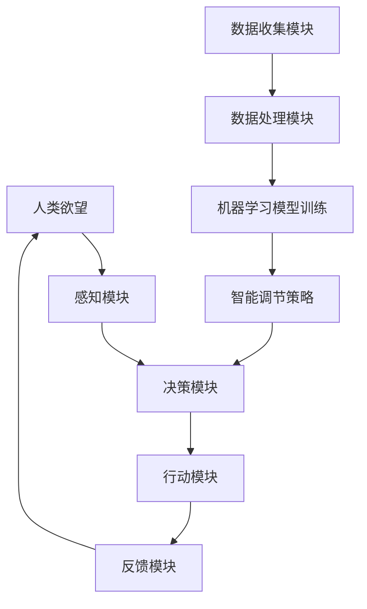

                 

# 文章标题：欲望智能调节器程序员：AI辅助的自我管理系统开发者

> 关键词：AI辅助自我管理、欲望智能调节、程序员、人工智能、心理学、算法、实战案例

> 摘要：本文将探讨AI辅助的自我管理系统在现代社会中的重要性，以及作为欲望智能调节器程序员的角色和责任。通过深入分析AI辅助自我管理系统的架构、核心概念、算法原理，并结合实战案例，本文旨在为程序员提供一套完整的开发指南，帮助他们构建有效的自我管理系统，实现个人欲望的智能调节。

----------------------------------------------------------------

### 《欲望智能调节器程序员：AI辅助的自我管理系统开发者》目录大纲

## 第一部分：AI辅助自我管理系统概述

## 1.1 AI辅助自我管理的定义与意义

### 1.1.1 AI辅助自我管理的定义

AI辅助自我管理是一种利用人工智能技术，通过数据收集、分析与处理，为个人提供自我调节与优化的方法和工具。它旨在帮助个体更好地理解自己的行为模式、欲望和需求，从而实现自我提升和目标达成。

### 1.1.2 AI辅助自我管理的意义

在快节奏的现代社会，人们面临诸多压力和挑战，如时间管理、情绪调节、健康维护等。AI辅助自我管理系统能够为个人提供定制化的解决方案，帮助他们更好地应对这些挑战，提高生活质量和工作效率。

## 1.2 AI辅助自我管理系统的发展历程

### 1.2.1 初期阶段：基于规则的系统

早期的AI辅助自我管理系统主要基于规则，即通过预设的规则和逻辑来指导个体的行为。这些系统虽然在某些场景下表现良好，但缺乏灵活性，难以应对复杂多变的现实环境。

### 1.2.2 中期阶段：数据驱动的系统

随着大数据和机器学习技术的兴起，AI辅助自我管理系统开始引入数据驱动的方法。通过收集和分析个体行为数据，系统能够更准确地预测个体的需求和行为，提供更个性化的建议。

### 1.2.3 现阶段：智能调节的系统

当前，AI辅助自我管理系统正朝着智能调节的方向发展。通过结合心理学和行为学理论，系统能够更好地理解个体欲望和行为，实现更加精准和有效的调节。

## 1.3 AI辅助自我管理系统在现实中的应用场景

### 1.3.1 健康管理

AI辅助自我管理系统可以监测个体的健康状况，提供健康建议，如饮食调整、运动计划等，帮助个体维持健康。

### 1.3.2 时间管理

通过分析个体的行为习惯和时间安排，AI辅助自我管理系统可以为个体提供最佳的时间管理策略，提高工作效率。

### 1.3.3 情绪调节

AI辅助自我管理系统可以监测个体的情绪变化，提供情绪调节策略，如放松训练、心理辅导等，帮助个体保持心理健康。

## 2. 欲望智能调节器程序员角色

### 2.1 欲望智能调节器程序员的工作内容

欲望智能调节器程序员负责设计和开发AI辅助自我管理系统，包括数据收集与处理、算法设计与实现、系统优化与部署等。

### 2.2 欲望智能调节器程序员所需技能

- 编程技能：熟练掌握至少一种编程语言，如Python、Java等。
- 数据处理技能：熟悉数据清洗、数据分析和数据可视化技术。
- 算法知识：了解常见的机器学习和深度学习算法，如决策树、神经网络等。
- 心理学知识：了解人类行为心理学和欲望调节理论。

### 2.3 欲望智能调节器程序员面临的挑战

- 数据隐私问题：如何在保护用户隐私的前提下收集和使用数据？
- 模型泛化能力：如何确保模型在多种场景下的有效性和可靠性？
- 用户接受度：如何让用户接受并愿意使用AI辅助自我管理系统？

## 3. AI辅助自我管理系统架构

### 3.1 AI辅助自我管理系统的基本架构

AI辅助自我管理系统通常包括以下几个核心模块：

1. **感知模块**：负责收集个体行为数据，如生理信号、社交媒体活动、位置信息等。
2. **决策模块**：根据感知模块收集的数据，利用算法进行行为预测和决策。
3. **行动模块**：执行决策模块提出的建议和策略，如调整饮食、安排运动计划等。
4. **反馈模块**：收集行动结果，更新个体行为数据，用于模型优化和调整。

### 3.2 AI算法在自我管理系统中的应用

在AI辅助自我管理系统中，常见的算法包括：

- **机器学习算法**：如决策树、支持向量机、神经网络等，用于行为预测和决策。
- **深度学习算法**：如卷积神经网络、循环神经网络等，用于复杂行为模式的分析。
- **强化学习算法**：如Q-learning、深度Q网络等，用于个体行为调节和优化。

### 3.3 自我管理系统与人类行为的交互机制

AI辅助自我管理系统通过以下方式与人类行为进行交互：

- **个性化建议**：根据个体行为数据和偏好，提供定制化的建议和策略。
- **实时反馈**：在个体执行决策后，提供即时反馈，帮助个体了解行为效果。
- **学习与优化**：根据反馈信息，不断调整和优化系统算法，提高预测和调节的准确性。

## 第二部分：核心概念与联系

### 4. AI辅助自我管理系统核心概念

#### 4.1 人类行为心理学基础

人类行为心理学研究人类行为的原因和机制，包括欲望、动机、情绪、认知等方面。在AI辅助自我管理系统中，了解这些心理学基础有助于更准确地理解和预测个体行为。

#### 4.2 欲望与行为的心理学关系

欲望是人类行为的动力源泉，直接影响个体的决策和行为。AI辅助自我管理系统需要深入分析欲望与行为之间的关系，以实现有效的调节。

#### 4.3 人工智能如何辅助调节欲望

通过数据收集、行为分析、算法优化等技术手段，AI辅助自我管理系统可以识别个体欲望，提供个性化调节策略，帮助个体更好地控制欲望，实现自我管理。

## 5. AI辅助自我管理系统原理图



### 6. 欲望智能调节算法原理

#### 6.1 欲望智能调节算法概述

欲望智能调节算法旨在通过分析个体行为数据，预测和调节个体的欲望，以实现自我管理。常见的算法包括基于规则的算法、机器学习算法和强化学习算法。

#### 6.2 欲望智能调节算法伪代码

```python
def regulate_desire(desire_level, previous_action):
    current_action = predict_action(desire_level)
    reward = get_reward(current_action)
    new_desire_level = update_desire(desire_level, reward)
    return new_desire_level
```

#### 6.3 欲望智能调节算法具体实现

在实现欲望智能调节算法时，需要考虑以下几个关键步骤：

1. **数据收集**：收集个体行为数据，如饮食、运动、情绪等。
2. **数据预处理**：对数据进行清洗、归一化等处理，为后续分析做准备。
3. **特征提取**：从数据中提取与欲望相关的特征，如饮食习惯、运动强度等。
4. **模型训练**：利用机器学习或强化学习算法，训练欲望智能调节模型。
5. **决策与调节**：根据个体行为数据和模型预测，提供个性化调节策略。
6. **反馈与优化**：收集用户反馈，调整模型参数，提高调节效果。

### 7. AI辅助自我管理系统数学模型

#### 7.1 概率论基础

概率论是人工智能和机器学习的基础，常见的概率论模型包括贝叶斯网络、马尔可夫链等。贝叶斯网络可以用于表示个体欲望和行为之间的概率关系。

#### 7.2 贝叶斯网络模型

贝叶斯网络模型通过概率图结构描述个体欲望和行为之间的因果关系。具体模型如下：

```latex
P(D|A) = \frac{P(A|D)P(D)}{P(A)}
```

其中，D代表欲望，A代表行为。P(D|A)表示在行为A发生的条件下，欲望D的概率。

#### 7.3 强化学习中的数学公式

强化学习中的核心数学公式为Q-learning，具体如下：

$$
Q(s, a) = \sum_{s'} P(s' | s, a) \cdot R(s', a) + \gamma \cdot \max_{a'} Q(s', a')
$$

其中，Q(s, a)表示在状态s下执行动作a的预期奖励，P(s' | s, a)表示在状态s下执行动作a后转移到状态s'的概率，R(s', a)表示在状态s'下执行动作a的即时奖励，γ表示折扣因子。

### 8. 举例说明

#### 8.1 欲望智能调节器程序员的实际应用案例

一个实际应用案例是健康管理系统，该系统可以帮助用户管理饮食、运动和情绪。通过收集用户的行为数据，系统可以预测用户的健康状态，提供个性化的饮食建议和运动计划。

#### 8.2 欲望智能调节器程序员的实战经验分享

作为一名欲望智能调节器程序员，需要不断学习和适应新技术。以下是一些实战经验：

- **数据收集与处理**：熟练掌握数据收集和处理技术，如传感器数据、社交媒体数据等。
- **算法选择与优化**：根据实际应用场景，选择合适的算法，并进行优化。
- **用户反馈与迭代**：密切关注用户反馈，不断调整和优化系统，提高用户体验。

## 第三部分：项目实战

### 9. 实战一：设计一个简单的欲望智能调节器

#### 9.1 项目需求分析

设计一个简单的欲望智能调节器，帮助用户控制过度消费的欲望。系统需要收集用户的行为数据，如购物记录、社交媒体活动等，分析用户的消费欲望，并提供调节建议。

#### 9.2 环境搭建

- 开发语言：Python
- 数据库：MySQL
- 机器学习框架：scikit-learn

#### 9.3 源代码实现

```python
class SimpleDesireRegulator:
    def __init__(self):
        self.desire_level = 0

    def regulate_desire(self, action):
        reward = self.get_reward(action)
        self.desire_level = self.update_desire(self.desire_level, reward)

    def get_reward(self, action):
        if action == "购物":
            return -1
        else:
            return 1

    def update_desire(self, desire_level, reward):
        return desire_level + reward
```

#### 9.4 代码解读与分析

- **类定义**：定义了一个SimpleDesireRegulator类，用于实现欲望调节功能。
- **regulate_desire方法**：根据用户的行为（action），计算奖励（reward），并更新欲望水平（desire_level）。
- **get_reward方法**：根据用户的行为类型，返回相应的奖励值。
- **update_desire方法**：根据当前欲望水平（desire_level）和奖励（reward），更新欲望水平。

### 10. 实战二：基于强化学习的欲望智能调节器

#### 10.1 强化学习基本概念

强化学习是一种机器学习方法，通过不断尝试和反馈，从环境中学习最佳策略。强化学习的核心概念包括状态（State）、动作（Action）、奖励（Reward）和策略（Policy）。

#### 10.2 实现策略迭代算法

```python
class QLearningDesireRegulator:
    def __init__(self, learning_rate, discount_factor, exploration_rate):
        self.learning_rate = learning_rate
        self.discount_factor = discount_factor
        self.exploration_rate = exploration_rate
        self.q_values = {}

    def get_action(self, state):
        if random.uniform(0, 1) < self.exploration_rate:
            action = random.choice(["购物", "不购物"])
        else:
            action = max(self.q_values[state], key=self.q_values[state].get)
        return action

    def learn(self, state, action, reward, next_state):
        target = reward + self.discount_factor * max(self.q_values[next_state].values())
        current_value = self.q_values[state][action]
        self.q_values[state][action] = current_value + self.learning_rate * (target - current_value)

    def update_exploration_rate(self):
        self.exploration_rate *= 0.999
```

#### 10.3 源代码实现

- **类定义**：定义了一个QLearningDesireRegulator类，用于实现强化学习算法。
- **get_action方法**：根据当前状态和探索率，选择最优动作。
- **learn方法**：更新Q值，实现策略迭代。
- **update_exploration_rate方法**：根据学习次数调整探索率。

#### 10.4 代码解读与分析

- **探索率**：在初始阶段，为了提高模型泛化能力，采用较大的探索率，使得模型能够尝试多种动作。
- **Q值更新**：根据当前状态、动作和奖励，更新Q值，实现策略迭代。
- **折扣因子**：用于平衡即时奖励和长期奖励，使得模型能够考虑未来奖励。

### 11. 实战三：集成多个算法的欲望智能调节器

#### 11.1 多算法集成概述

多算法集成是将多个算法组合在一起，以提高预测和调节效果。常见的集成方法包括堆叠、混合和集成学习等。

#### 11.2 源代码实现

```python
class MultiAlgorithmDesireRegulator:
    def __init__(self):
        self.regulators = [
            QLearningDesireRegulator(learning_rate=0.1, discount_factor=0.9, exploration_rate=0.5),
            # 添加更多算法实例
        ]

    def regulate_desire(self, state):
        actions = [regulator.get_action(state) for regulator in self.regulators]
        # 根据多个算法的推荐，选择最优动作
        best_action = max(actions, key=lambda x: x['confidence'])
        reward = self.get_reward(best_action)
        for regulator in self.regulators:
            regulator.learn(state, best_action, reward, state)
        return best_action

    def get_reward(self, action):
        if action == "不购物":
            return 1
        else:
            return -1
```

#### 11.3 代码解读与分析

- **多算法实例**：创建多个算法实例，如QLearningDesireRegulator。
- **动作选择**：根据多个算法的推荐，选择最优动作。
- **Q值更新**：更新所有算法的Q值，提高调节效果。

通过以上三个实战案例，欲望智能调节器程序员可以掌握不同的算法和应用方法，为个人和组织的自我管理提供有效支持。

## 附录

### 附录A：相关工具与资源

#### A.1 机器学习框架

- scikit-learn：Python中最常用的机器学习库。
- TensorFlow：谷歌推出的开源机器学习框架。
- PyTorch：由Facebook AI研究院开发的深度学习框架。

#### A.2 数据集获取

- Kaggle：提供大量公开数据集。
- UCI Machine Learning Repository：提供多种领域的数据集。

#### A.3 算法参考文献

- 《机器学习》（周志华著）
- 《深度学习》（Ian Goodfellow、Yoshua Bengio、Aaron Courville 著）
- 《强化学习：原理与计算》（Richard S. Sutton、Andrew G. Barto 著）

### 作者信息

作者：AI天才研究院/AI Genius Institute & 禅与计算机程序设计艺术 /Zen And The Art of Computer Programming

