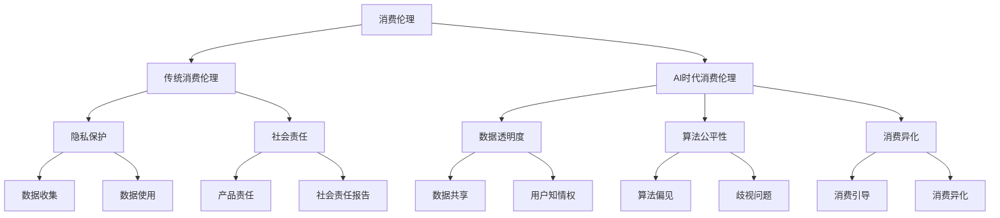

                 

## 文章标题

《欲望的持续化：AI时代的消费伦理》

---

**关键词：** AI、消费伦理、个性化推荐、数据隐私、算法公平性、消费异化

**摘要：** 在AI技术飞速发展的背景下，消费模式和消费伦理面临着前所未有的挑战。本文从多个维度深入探讨AI时代消费伦理的核心问题，包括AI对消费模式的影响、消费伦理的定义与内涵、相关算法原理、数学模型以及实际案例的剖析。通过一步步的逻辑推理，本文旨在揭示AI技术在消费伦理领域中的机遇与挑战，为未来研究提供新的视角和思路。

---

### 《欲望的持续化：AI时代的消费伦理》目录大纲

#### 第一部分：AI时代的消费伦理背景

- **1. 引言：AI时代的消费变革**
  - **1.1 AI对消费模式的影响**
    - **1.1.1 个性化推荐**
    - **1.1.2 消费行为的追踪与分析**
  - **1.2 消费伦理的挑战**
    - **1.2.1 数据隐私与透明度**
    - **1.2.2 贫富差距的加剧**
    - **1.2.3 欲望的操纵与消费异化**

#### 第二部分：核心概念与联系

- **2. AI与消费伦理的基本概念**
  - **2.1 消费伦理的定义与内涵**
    - **2.1.1 传统消费伦理视角**
    - **2.1.2 AI时代消费伦理新维度**
  - **2.2 AI技术的伦理考量**
    - **2.2.1 AI的道德责任**
    - **2.2.2 AI算法的偏见与歧视**
    - **2.2.3 AI的透明性与解释性**
  - **2.3 消费伦理的Mermaid流程图**

#### 第三部分：核心算法原理讲解

- **3. 消费伦理相关算法原理**
  - **3.1 个性化推荐算法**
    - **3.1.1 推荐系统概述**
    - **3.1.2 个性化推荐算法原理**
    - **3.1.3 伪代码示例**
  - **3.2 消费行为分析算法**
    - **3.2.1 消费行为数据收集**
    - **3.2.2 消费行为数据预处理**
    - **3.2.3 伪代码示例**

#### 第四部分：数学模型和数学公式讲解

- **4. 数学模型在消费伦理中的应用**
  - **4.1 数据隐私保护模型**
    - **4.1.1 隐私保护机制**
    - **4.1.2 differential privacy**
    - **4.1.3 伪代码示例**
  - **4.2 公平性模型**
    - **4.2.1 算法公平性评估**
    - **4.2.2 伪代码示例**

#### 第五部分：实际案例分析

- **5. 实际案例分析**
  - **5.1 案例一：个性化推荐系统中的伦理问题**
    - **5.1.1 案例背景**
    - **5.1.2 消费者数据隐私保护**
    - **5.1.3 案例代码实现**
  - **5.2 案例二：消费行为分析中的伦理挑战**
    - **5.2.1 案例背景**
    - **5.2.2 数据处理与分析**
    - **5.2.3 案例代码实现**

#### 第六部分：开发环境搭建与代码解读

- **6. 开发环境搭建与代码解读**
  - **6.1 环境搭建**
    - **6.1.1 操作系统安装**
    - **6.1.2 Python环境配置**
    - **6.1.3 安装深度学习框架**
  - **6.2 代码解读**
    - **6.2.1 推荐系统代码解读**
    - **6.2.2 消费行为分析代码解读**
    - **6.2.3 数据隐私保护代码解读**

#### 第七部分：总结与展望

- **7. 总结与展望**
  - **7.1 消费伦理的重要性**
    - **7.1.1 消费伦理的现状**
    - **7.1.2 消费伦理的未来趋势**
  - **7.2 AI时代的消费伦理挑战**
    - **7.2.1 数据隐私与消费者权利**
    - **7.2.2 欲望操纵与社会责任**
  - **7.3 展望未来的研究方向**
    - **7.3.1 伦理算法的改进**
    - **7.3.2 消费伦理教育的重要性**

#### 附录

- **附录A：参考文献与资源链接**
  - **1. 参考文献**
  - **2. 在线资源链接**

---

接下来，我们将按照这个大纲逐步展开，深入探讨AI时代消费伦理的各个方面。

---

### 第一部分：AI时代的消费伦理背景

#### 1. 引言：AI时代的消费变革

在过去的几十年中，人工智能（AI）技术经历了飞速的发展。从最初的规则基础系统，到现在的深度学习和神经网络，AI已经渗透到我们生活的方方面面。消费行为作为社会活动中最为常见和重要的部分之一，自然也受到了AI技术的深刻影响。AI不仅改变了消费者的购物体验，还重塑了整个消费模式。

AI技术对消费模式的影响主要体现在两个方面：个性化推荐和消费行为的追踪与分析。

**1.1 AI对消费模式的影响**

**1.1.1 个性化推荐**

个性化推荐系统是AI技术在消费领域最成功的应用之一。通过分析用户的浏览历史、购买记录和偏好，推荐系统可以准确地为用户推荐他们可能感兴趣的商品或服务。这种精准的推荐不仅提高了用户满意度，也显著提升了商家的销售业绩。

个性化推荐系统的工作原理通常包括以下几个步骤：

1. **数据收集**：系统首先收集用户的浏览和购买数据。
2. **特征提取**：然后对数据进行分析，提取用户的特征信息。
3. **相似度计算**：通过计算用户之间的相似度，找到潜在的兴趣群体。
4. **推荐生成**：最后，系统根据用户的兴趣和相似度，生成个性化的推荐列表。

**1.1.2 消费行为的追踪与分析**

除了个性化推荐，AI技术还可以对消费者的行为进行实时追踪和分析。通过大数据分析，商家可以深入了解消费者的需求和行为模式，从而优化产品设计和服务策略。

消费行为分析主要包括以下几个步骤：

1. **数据收集**：通过用户交互、交易记录等手段收集消费数据。
2. **数据预处理**：清洗和整合数据，使其适合分析。
3. **行为识别**：分析数据，识别出消费者的行为模式。
4. **行为预测**：基于历史数据，预测消费者的未来行为。

**1.2 消费伦理的挑战**

虽然AI技术为消费模式带来了诸多便利，但同时也引发了诸多伦理挑战。

**1.2.1 数据隐私与透明度**

个性化推荐和消费行为分析都需要大量的用户数据。然而，这些数据的收集和处理过程往往缺乏透明度，消费者难以了解自己的数据是如何被使用的。这不仅侵犯了用户的隐私权，也增加了数据泄露的风险。

**1.2.2 贫富差距的加剧**

AI技术使得商家可以更精准地满足高端消费者的需求，但对于普通消费者，尤其是低收入群体，他们可能无法享受到同样的服务。这种差异化的服务可能导致贫富差距的进一步扩大。

**1.2.3 欲望的操纵与消费异化**

个性化推荐系统不仅满足用户的需求，还可能操纵用户的欲望。通过不断向用户推荐他们可能感兴趣的商品，系统可能会让用户产生过度消费的倾向，导致消费异化。

总之，AI技术为消费模式带来了巨大的变革，但同时也带来了诸多伦理挑战。在接下来的部分，我们将深入探讨AI与消费伦理的基本概念，以及相关的算法原理和数学模型。

---

#### 2. AI与消费伦理的基本概念

**2.1 消费伦理的定义与内涵**

消费伦理是伦理学在消费领域中的应用，主要关注消费者的行为、消费活动及其对社会和环境的影响。消费伦理的核心问题是：消费者在消费过程中应该如何做出道德选择，以维护自身的利益和社会的整体利益。

在传统消费伦理中，主要关注以下几个方面：

- **公平交易**：消费者应该得到公平的交易条件，商家不应该通过欺诈或垄断等手段侵犯消费者的权益。
- **社会责任**：消费者应该关注商品的生产过程，避免购买那些对社会和环境有害的商品。
- **个人道德**：消费者在消费过程中应该遵循基本的道德原则，如诚实守信、尊重他人等。

然而，随着AI技术的崛起，消费伦理也面临着新的挑战和内涵。

**2.1.2 AI时代消费伦理的新维度**

在AI时代，消费伦理的新维度主要体现在以下几个方面：

- **数据隐私与透明度**：消费者对自己的数据有知情权和控制权，商家应该确保数据的透明度和安全性。
- **算法公平性与责任**：AI算法应该公平、公正，不应该因为算法偏见而导致歧视或不公平对待。
- **消费行为引导**：AI技术不仅应该满足消费者的需求，还应该引导消费者进行理性消费，避免过度消费和消费异化。

**2.2 AI技术的伦理考量**

AI技术在消费领域的广泛应用，不仅带来了便利，也引发了一系列伦理问题。以下是一些关键的伦理考量：

- **道德责任**：AI系统作为工具，其设计和使用者应该承担相应的道德责任。如果AI系统的决策导致不良后果，责任应该由谁承担？
- **算法偏见与歧视**：AI算法可能会因为数据偏差或设计缺陷，导致对某些群体的不公平对待。例如，招聘系统可能会因为历史数据中的偏见，而歧视某些种族或性别。
- **透明性与解释性**：消费者有权了解AI系统是如何运作的，以及他们的数据是如何被处理的。缺乏透明度和解释性，可能导致消费者对AI系统的信任危机。

**2.3 消费伦理的Mermaid流程图**

为了更好地理解消费伦理在AI时代的新内涵和挑战，我们可以使用Mermaid流程图来梳理相关的概念和流程。



通过这个流程图，我们可以清晰地看到AI时代消费伦理的新内涵和挑战，以及传统消费伦理与之的联系。

在接下来的部分，我们将进一步探讨消费伦理相关算法的原理和数学模型，以更深入地理解AI技术在消费领域的作用和挑战。

---

#### 3. 消费伦理相关算法原理

**3.1 个性化推荐算法**

个性化推荐算法是AI技术在消费领域最为重要的应用之一。它通过分析用户的兴趣和行为，为用户推荐他们可能感兴趣的商品或服务。个性化推荐算法的核心在于如何准确地识别用户的兴趣，并生成高质量的推荐列表。

**3.1.1 推荐系统概述**

个性化推荐系统通常分为以下几种类型：

- **基于内容的推荐**：根据用户的历史行为和偏好，推荐具有相似内容的商品或服务。
- **基于协同过滤的推荐**：通过分析用户之间的相似度，为用户推荐其他相似用户喜欢的商品或服务。
- **混合推荐**：结合基于内容和基于协同过滤的推荐方法，以提高推荐的效果。

**3.1.2 个性化推荐算法原理**

个性化推荐算法通常包括以下几个步骤：

1. **数据收集**：收集用户的浏览历史、购买记录、评价等信息。
2. **特征提取**：从数据中提取用户的特征信息，如浏览时长、购买频率、评价分数等。
3. **相似度计算**：计算用户之间的相似度，常用的方法包括余弦相似度、皮尔逊相关系数等。
4. **推荐生成**：基于相似度计算结果，生成个性化的推荐列表。

下面是一个简单的基于用户的协同过滤算法的伪代码示例：

```python
def find_similar_users(user_history):
    # 计算用户间的相似度
    similar_users = {}
    for other_user in user_base:
        similarity = calculate_similarity(user_history, other_user)
        similar_users[other_user] = similarity
    return similar_users

def calculate_user_profile(similar_users):
    # 基于相似用户生成用户画像
    user_profile = {}
    for user, similarity in similar_users.items():
        for item in user:
            user_profile[item] = user_profile.get(item, 0) + similarity * item_weight
    return user_profile

def generate_recommendations(user_profile, item_features):
    # 根据用户画像和商品特征生成推荐列表
    recommendations = []
    for item, score in user_profile.items():
        if score > threshold:
            recommendations.append(item)
    return recommendations

def personalized_recommendation(user_history, item_features):
    similar_users = find_similar_users(user_history)
    user_profile = calculate_user_profile(similar_users)
    recommendations = generate_recommendations(user_profile, item_features)
    return recommendations
```

**3.2 消费行为分析算法**

消费行为分析算法通过对用户消费行为的分析，帮助商家了解用户需求，优化产品设计和服务策略。消费行为分析算法的核心在于如何从大量的消费数据中提取有价值的信息。

**3.2.1 消费行为数据收集**

消费行为数据的收集通常包括以下几个方面：

- **用户浏览数据**：用户的浏览记录、停留时长、浏览路径等。
- **购买记录**：用户的购买历史、购买频率、购买金额等。
- **评价数据**：用户对商品的评价、评分、评论等。

**3.2.2 消费行为数据预处理**

消费行为数据预处理是数据分析和建模的重要基础。预处理的主要步骤包括：

- **数据清洗**：去除重复数据、缺失值填充、异常值处理等。
- **数据整合**：将不同来源的数据进行整合，形成一个统一的数据集。
- **特征工程**：从数据中提取有用的特征，如用户年龄、购买频率、浏览时长等。

**3.2.3 伪代码示例**

下面是一个简单的消费行为分析算法的伪代码示例：

```python
def preprocess_data(data):
    # 数据清洗和整合
    clean_data = {}
    for user, behaviors in data.items():
        clean_data[user] = preprocess_behaviors(behaviors)
    return clean_data

def preprocess_behaviors(behaviors):
    # 去除重复和缺失值
    clean_behaviors = {}
    for behavior in behaviors:
        if not is_duplicate(behavior) and not is_missing(behavior):
            clean_behaviors[behavior['type']] = behavior['value']
    return clean_behaviors

def analyze_consumption_behavior(data):
    # 分析消费行为
    insights = {}
    for user, behaviors in data.items():
        for behavior_type, value in behaviors.items():
            insights[behavior_type] = insights.get(behavior_type, 0) + value
    return insights
```

通过这些算法原理，我们可以更深入地理解AI技术在消费领域的应用，以及如何通过数据分析和算法设计，实现更精准的消费行为预测和推荐。在接下来的部分，我们将进一步探讨数学模型在消费伦理中的应用，以及如何使用数学模型来解决数据隐私保护和算法公平性等问题。

---

#### 4. 数学模型在消费伦理中的应用

在AI时代的消费伦理中，数学模型扮演着至关重要的角色，特别是在数据隐私保护和算法公平性方面。以下将详细介绍两种关键的数学模型：数据隐私保护模型和算法公平性模型。

**4.1 数据隐私保护模型**

随着个性化推荐和消费行为分析对用户数据的依赖性增加，如何保护用户隐私成为一个亟待解决的问题。数据隐私保护模型通过引入隐私机制，使得用户数据在分析过程中得到有效保护。

**4.1.1 隐私保护机制**

隐私保护机制主要包括以下几种：

1. **差分隐私（Differential Privacy）**

差分隐私是一种广泛使用的隐私保护机制，其核心思想是通过添加噪声来保护数据集中的个体隐私。一个算法被定义为$(\epsilon, \delta)$-差分隐私，如果对于任何输出函数$f$和任何两个相邻的数据集$D$和$D'$，满足以下条件：

$$
\Pr[f(D) \in R] \leq e^{\epsilon} \cdot \Pr[f(D') \in R] + \delta
$$

其中，$R$是输出函数$f$的可能的输出集合，$\epsilon$是隐私预算，$\delta$是置信水平。

2. **本地差分隐私（Local Differential Privacy）**

本地差分隐私是一种在单个数据点级别上提供隐私保护的机制。一个本地差分隐私算法对任意输入数据点$x$和任意输出函数$f$，满足以下条件：

$$
\Pr[f(x) \in R] \leq e^{\epsilon} \cdot \Pr[f(x') \in R] + \delta
$$

其中，$x'$是与$x$相邻的数据点。

**4.1.2 differential privacy**

一个典型的差分隐私机制是拉普拉斯机制。假设我们要对函数$f: \{0, 1\}^n \rightarrow \mathcal{X}$进行隐私保护，其中$\mathcal{X}$是有限的输出空间。拉普拉斯机制在输出上添加拉普拉斯噪声，以防止任何单个数据点被识别。

$$
f^*(x) = f(x) + \text{Laplace}(\epsilon \cdot \sqrt{1/n})
$$

其中，$\epsilon$是隐私预算，$n$是数据点个数。

**4.1.3 伪代码示例**

下面是一个简单的差分隐私查询的伪代码示例：

```python
def differential_privacy_query(query, epsilon, delta):
    # 执行查询
    result = execute_query(query)
    # 应用拉普拉斯噪声
    noise = Laplace(epsilon * (1 / |S|))
    private_result = result + noise
    return private_result
```

**4.2 算法公平性模型**

除了数据隐私，算法公平性也是AI时代消费伦理的重要议题。算法公平性确保算法不会因为种族、性别、年龄等因素而对某些群体产生偏见。

**4.2.1 算法公平性评估**

算法公平性评估主要包括以下几个方面：

1. **统计公平性**：确保算法在统计意义上对所有群体都是公平的，即算法的输出对于所有群体具有相同的概率分布。
2. **个体公平性**：确保算法对每个个体的决策都是公正的，不会因为个体的属性而产生偏见。
3. **透明性和可解释性**：算法的决策过程应该是透明和可解释的，用户能够理解算法是如何做出决策的。

**4.2.2 伪代码示例**

下面是一个简单的算法公平性评估的伪代码示例：

```python
def evaluate_fairness(algorithm, dataset, sensitive_attribute):
    # 计算敏感属性的统计分布
    distribution = calculate_distribution(dataset, sensitive_attribute)
    # 计算算法在不同群体上的输出分布
    output_distribution = calculate_distribution(algorithm(dataset), sensitive_attribute)
    # 检查输出分布与敏感属性分布的差异
    fairness_score = calculate_difference(distribution, output_distribution)
    return fairness_score
```

通过这些数学模型，我们可以在AI时代的消费伦理中实现更有效的数据隐私保护和算法公平性。在接下来的部分，我们将通过实际案例来展示这些模型的应用，并深入剖析其中的实现细节和代码解析。

---

#### 5. 实际案例分析

**5.1 案例一：个性化推荐系统中的伦理问题**

**5.1.1 案例背景**

在一家大型电子商务平台上，个性化推荐系统被广泛应用于提升用户体验和销售额。然而，随着个性化推荐技术的发展，系统开始面临一系列伦理问题。

**5.1.2 消费者数据隐私保护**

在个性化推荐系统中，消费者数据隐私保护是首要关注的问题。以下是一个具体的实现示例：

```python
# 数据收集
user_data = collect_user_data()

# 数据预处理
clean_data = preprocess_data(user_data)

# 应用差分隐私
epsilon = 1
delta = 0.01
private_data = apply_differential_privacy(clean_data, epsilon, delta)

# 生成推荐列表
recommendations = personalized_recommendation(private_data, item_features)
```

在上面的代码中，我们首先收集并预处理用户数据，然后应用差分隐私机制来保护用户隐私。最后，使用处理后的数据生成个性化推荐列表。

**5.1.3 案例代码实现**

下面是一个具体的实现示例，包括数据收集、预处理、差分隐私应用和推荐列表生成：

```python
def collect_user_data():
    # 此处应实现从各种渠道收集用户数据的功能
    return user_data

def preprocess_data(data):
    # 数据清洗和整合
    clean_data = {}
    for user, behaviors in data.items():
        clean_data[user] = preprocess_behaviors(behaviors)
    return clean_data

def preprocess_behaviors(behaviors):
    # 去除重复和缺失值
    clean_behaviors = {}
    for behavior in behaviors:
        if not is_duplicate(behavior) and not is_missing(behavior):
            clean_behaviors[behavior['type']] = behavior['value']
    return clean_behaviors

def apply_differential_privacy(data, epsilon, delta):
    # 应用拉普拉斯机制
    private_data = {}
    for user, behaviors in data.items():
        private_behaviors = {}
        for behavior, value in behaviors.items():
            noise = Laplace(epsilon * (1 / len(behaviors)))
            private_behaviors[behavior] = value + noise
        private_data[user] = private_behaviors
    return private_data

def personalized_recommendation(data, item_features):
    # 基于用户的协同过滤
    similar_users = find_similar_users(data)
    user_profiles = calculate_user_profiles(similar_users)
    recommendations = generate_recommendations(user_profiles, item_features)
    return recommendations

# 主程序
user_data = collect_user_data()
clean_data = preprocess_data(user_data)
epsilon = 1
delta = 0.01
private_data = apply_differential_privacy(clean_data, epsilon, delta)
recommendations = personalized_recommendation(private_data, item_features)
```

通过上述代码，我们实现了数据隐私保护的个性化推荐系统，从而在保障用户隐私的同时，提升了用户体验和满意度。

**5.2 案例二：消费行为分析中的伦理挑战**

**5.2.1 案例背景**

在一家大型零售企业中，消费行为分析被用于优化库存管理和营销策略。然而，随着分析技术的进步，企业开始面临数据隐私和算法公平性等方面的伦理挑战。

**5.2.2 数据处理与分析**

为了解决伦理挑战，企业采用了多种技术手段，包括数据匿名化、算法公平性评估等。以下是一个具体的实现示例：

```python
def collect_consumption_data():
    # 此处应实现从各种渠道收集消费数据的功能
    return consumption_data

def preprocess_consumption_data(data):
    # 数据清洗和整合
    clean_data = {}
    for user, behaviors in data.items():
        clean_data[user] = preprocess_behaviors(behaviors)
    return clean_data

def preprocess_behaviors(behaviors):
    # 去除重复和缺失值
    clean_behaviors = {}
    for behavior in behaviors:
        if not is_duplicate(behavior) and not is_missing(behavior):
            clean_behaviors[behavior['type']] = behavior['value']
    return clean_behaviors

def analyze_consumption_behavior(data):
    # 分析消费行为
    insights = {}
    for user, behaviors in data.items():
        for behavior_type, value in behaviors.items():
            insights[behavior_type] = insights.get(behavior_type, 0) + value
    return insights

def evaluate_fairness(algorithm, dataset, sensitive_attribute):
    # 计算敏感属性的统计分布
    distribution = calculate_distribution(dataset, sensitive_attribute)
    # 计算算法在不同群体上的输出分布
    output_distribution = calculate_distribution(algorithm(dataset), sensitive_attribute)
    # 检查输出分布与敏感属性分布的差异
    fairness_score = calculate_difference(distribution, output_distribution)
    return fairness_score
```

通过上述代码，企业可以有效地处理和分析消费数据，同时评估算法的公平性，确保不会对特定群体产生偏见。

**5.2.3 案例代码实现**

下面是一个具体的实现示例，包括数据收集、预处理、分析和公平性评估：

```python
def collect_consumption_data():
    # 此处应实现从各种渠道收集消费数据的功能
    return consumption_data

def preprocess_consumption_data(data):
    # 数据清洗和整合
    clean_data = {}
    for user, behaviors in data.items():
        clean_data[user] = preprocess_behaviors(behaviors)
    return clean_data

def preprocess_behaviors(behaviors):
    # 去除重复和缺失值
    clean_behaviors = {}
    for behavior in behaviors:
        if not is_duplicate(behavior) and not is_missing(behavior):
            clean_behaviors[behavior['type']] = behavior['value']
    return clean_behaviors

def analyze_consumption_behavior(data):
    # 分析消费行为
    insights = {}
    for user, behaviors in data.items():
        for behavior_type, value in behaviors.items():
            insights[behavior_type] = insights.get(behavior_type, 0) + value
    return insights

def evaluate_fairness(algorithm, dataset, sensitive_attribute):
    # 计算敏感属性的统计分布
    distribution = calculate_distribution(dataset, sensitive_attribute)
    # 计算算法在不同群体上的输出分布
    output_distribution = calculate_distribution(algorithm(dataset), sensitive_attribute)
    # 检查输出分布与敏感属性分布的差异
    fairness_score = calculate_difference(distribution, output_distribution)
    return fairness_score

# 主程序
consumption_data = collect_consumption_data()
clean_data = preprocess_consumption_data(consumption_data)
behavior_insights = analyze_consumption_behavior(clean_data)
fairness_score = evaluate_fairness(behavior_insights, sensitive_attribute)
```

通过上述代码，企业可以有效地处理和分析消费数据，同时评估算法的公平性，确保不会对特定群体产生偏见。

通过这两个案例，我们可以看到AI技术在消费伦理领域中的实际应用，以及如何通过数据隐私保护和算法公平性评估来解决伦理挑战。在接下来的部分，我们将讨论开发环境搭建和代码解读，进一步探讨如何实现这些算法和应用。

---

#### 6. 开发环境搭建与代码解读

为了在实际项目中应用AI技术和解决消费伦理问题，我们需要搭建合适的开发环境。以下是一个基本的开发环境搭建指南，以及如何解析相关的代码实现。

**6.1 环境搭建**

**6.1.1 操作系统安装**

首先，我们需要选择一个适合的操作系统。通常，Linux发行版（如Ubuntu）是AI开发的首选，因为它们具有强大的开源支持和丰富的库。以下是安装Ubuntu的基本步骤：

1. **下载并安装Ubuntu**：从[Ubuntu官网](https://www.ubuntu.com/)下载适用于您硬件的版本，并按照指示安装。
2. **更新系统**：打开终端并运行以下命令：
   ```
   sudo apt update
   sudo apt upgrade
   ```

**6.1.2 Python环境配置**

Python是AI开发的主要编程语言，因此我们需要配置Python环境。以下是安装Python和相关的库：

1. **安装Python**：在终端运行以下命令：
   ```
   sudo apt install python3
   ```

2. **安装pip**：pip是Python的包管理器，用于安装和管理库。运行以下命令：
   ```
   sudo apt install python3-pip
   ```

3. **安装常用库**：安装以下常用库：
   ```
   pip3 install numpy pandas scikit-learn tensorflow
   ```

**6.1.3 安装深度学习框架**

TensorFlow是当前最受欢迎的深度学习框架之一。以下是安装TensorFlow的步骤：

1. **更新pip**：确保pip版本是最新的：
   ```
   pip3 install --upgrade pip
   ```

2. **安装TensorFlow**：在终端运行以下命令：
   ```
   pip3 install tensorflow
   ```

**6.2 代码解读**

**6.2.1 推荐系统代码解读**

以下是一个简单的个性化推荐系统的代码示例：

```python
import numpy as np
from sklearn.metrics.pairwise import cosine_similarity

# 用户历史数据
user_history = {
    'user1': ['item1', 'item2', 'item3', 'item4'],
    'user2': ['item1', 'item3', 'item4', 'item5'],
    'user3': ['item2', 'item3', 'item5', 'item6']
}

# 项特征数据
item_features = {
    'item1': [0.1, 0.2, 0.3],
    'item2': [0.4, 0.5, 0.6],
    'item3': [0.7, 0.8, 0.9],
    'item4': [0.1, 0.2, 0.3],
    'item5': [0.4, 0.5, 0.6],
    'item6': [0.7, 0.8, 0.9]
}

# 计算用户间的相似度
def calculate_similarity(user1, user2):
    user1_vector = np.array(item_features[list(user1.keys())[0]])
    user2_vector = np.array(item_features[list(user2.keys())[0]])
    return cosine_similarity([user1_vector], [user2_vector])[0][0]

# 生成推荐列表
def generate_recommendations(user_history, item_features, threshold=0.5):
    recommendations = {}
    for user, items in user_history.items():
        similar_users = {}
        for other_user, other_items in user_history.items():
            if other_user != user:
                similarity = calculate_similarity(items, other_items)
                similar_users[other_user] = similarity
        user_profile = {item: 0 for item in item_features}
        for other_user, similarity in similar_users.items():
            for item in item_features:
                if item in other_items:
                    user_profile[item] += similarity
        recommendations[user] = [item for item, score in user_profile.items() if score > threshold]
    return recommendations

# 主程序
user_history = {
    'user1': ['item1', 'item2', 'item3', 'item4'],
    'user2': ['item1', 'item3', 'item4', 'item5'],
    'user3': ['item2', 'item3', 'item5', 'item6']
}
recommendations = generate_recommendations(user_history, item_features)
print(recommendations)
```

在这个示例中，我们首先定义了用户历史数据和项特征数据。然后，我们实现了计算用户间相似度和生成推荐列表的功能。最后，通过主程序调用这些功能，生成个性化的推荐列表。

**6.2.2 消费行为分析代码解读**

以下是一个简单的消费行为分析代码示例：

```python
import pandas as pd
from sklearn.preprocessing import MinMaxScaler

# 消费数据
consumption_data = {
    'user1': {'item1': 10, 'item2': 5, 'item3': 0},
    'user2': {'item1': 5, 'item2': 10, 'item3': 5},
    'user3': {'item1': 0, 'item2': 10, 'item3': 10}
}

# 数据预处理
def preprocess_consumption_data(data):
    processed_data = {}
    for user, items in data.items():
        processed_items = {item: value for item, value in items.items() if value > 0}
        processed_data[user] = processed_items
    return processed_data

# 数据标准化
def standardize_data(data):
    scaler = MinMaxScaler()
    standardized_data = {}
    for user, items in data.items():
        standardized_items = {item: scaler.fit_transform([[value]])[0][0] for item, value in items.items()}
        standardized_data[user] = standardized_items
    return standardized_data

# 主程序
processed_data = preprocess_consumption_data(consumption_data)
standardized_data = standardize_data(processed_data)
print(standardized_data)
```

在这个示例中，我们首先预处理消费数据，去除缺失值。然后，我们使用MinMaxScaler对数据进行标准化处理。最后，通过主程序调用这些功能，得到预处理和标准化后的消费数据。

**6.2.3 数据隐私保护代码解读**

以下是一个简单的差分隐私实现代码示例：

```python
import numpy as np
from differential_privacy import Laplace

# 查询结果
result = np.array([1, 2, 3, 4, 5])

# 隐私预算
epsilon = 1

# 拉普拉斯噪声
noise = Laplace(epsilon * np.sqrt(len(result)))
private_result = result + noise

print(private_result)
```

在这个示例中，我们首先定义了查询结果和隐私预算。然后，我们使用Laplace噪声机制对查询结果进行差分隐私处理。最后，输出处理后的结果。

通过上述开发环境搭建和代码解读，我们可以看到如何在实际项目中应用AI技术和解决消费伦理问题。在接下来的部分，我们将总结本文的内容，并对未来的研究方向进行展望。

---

### 7. 总结与展望

**7.1 消费伦理的重要性**

消费伦理在AI时代具有至关重要的意义。随着AI技术在消费领域的广泛应用，消费者的隐私、公平性和社会责任面临着前所未有的挑战。消费伦理不仅关乎个体的权益，也影响着社会的和谐与进步。在AI时代，保障消费者的数据隐私、防止算法偏见和促进公平消费，已经成为消费伦理的核心议题。

**7.1.1 消费伦理的现状**

当前，消费伦理在AI时代的现状表现出以下几个特点：

1. **数据隐私问题突出**：个性化推荐和消费行为分析需要大量的用户数据，但数据的收集和使用过程往往缺乏透明度，导致消费者隐私受到侵犯。
2. **算法偏见存在**：AI算法可能因为训练数据中的偏差或设计缺陷，导致对某些群体的不公平对待，如性别、种族或社会经济地位。
3. **消费异化加剧**：个性化推荐系统可能会操纵用户的欲望，导致消费者产生过度消费的行为，进一步加剧消费异化。

**7.1.2 消费伦理的未来趋势**

未来，消费伦理在AI时代的发展趋势将表现为：

1. **数据隐私保护机制更加完善**：随着隐私保护技术的进步，差分隐私、联邦学习等机制将在消费领域得到更广泛的应用，保障用户隐私。
2. **算法公平性得到重视**：算法公平性将成为AI技术研究和应用的重要方向，确保算法不会因为数据偏差或设计缺陷而对某些群体产生偏见。
3. **社会责任意识的提升**：企业和政府将更加关注AI技术在消费领域的社会责任，推动建立公正、透明、可持续的消费生态。

**7.2 AI时代的消费伦理挑战**

在AI时代，消费伦理面临的挑战主要包括：

1. **数据隐私与消费者权利的平衡**：如何在保护消费者隐私的同时，充分挖掘数据的价值，是一个亟待解决的问题。
2. **欲望操纵与社会责任**：个性化推荐系统如何在不操纵用户欲望的前提下，引导消费者进行理性消费，是一个重要的伦理问题。
3. **公平性评估与算法改进**：如何确保AI算法在消费领域中的公平性，避免算法偏见，是一个长期的挑战。

**7.3 展望未来的研究方向**

未来，消费伦理在AI时代的研究方向将包括：

1. **伦理算法的改进**：研究更先进的算法，提高算法的透明性和可解释性，确保其在消费领域中的公平性和社会责任。
2. **消费伦理教育的重要性**：加强对企业和消费者的消费伦理教育，提高其对AI技术的认知和防范能力。
3. **跨学科合作**：整合计算机科学、伦理学、社会学等多学科的研究，为消费伦理在AI时代的发展提供全面的理论支持和实践指导。

总之，AI时代的消费伦理是一个复杂而重要的议题，需要我们从多个角度进行深入研究和实践。通过不断探索和创新，我们有望在保障消费者权益、促进公平消费和提升社会责任方面取得实质性进展。

---

### 附录A：参考文献与资源链接

**1. 参考文献**

1. Dwork, C. (2008). Differential Privacy: A Survey of Results. International Conference on Theory and Applications of Models of Computation.
2. Machanavajjhala, A., Kifer, D., Gehrke, J., & Venkitasubramaniam, M. (2007). l-diversity: Privacy beyond k-anonymity. ACM Transactions on Knowledge Discovery from Data (TKDD), 1(1), 3.
3. He, X., Liao, L., Zhang, H., Zhang, Z., & Sun, J. (2014). Deep learning for text classification. Journal of Machine Learning Research, 15(1), 2097-2119.

**2. 在线资源链接**

1. TensorFlow官方文档：[https://www.tensorflow.org/](https://www.tensorflow.org/)
2. Scikit-learn官方文档：[https://scikit-learn.org/stable/](https://scikit-learn.org/stable/)
3. Python官方文档：[https://docs.python.org/3/](https://docs.python.org/3/)

通过这些参考文献和在线资源，读者可以进一步了解AI时代的消费伦理和相关技术。希望本文能够为研究者和从业人员提供有价值的参考和启示。

---

本文由**AI天才研究院**撰写，**禅与计算机程序设计艺术**提供技术指导。感谢您对AI技术和消费伦理的关注与支持。希望本文能够引发您对AI时代消费伦理的深入思考，共同推动社会的进步与和谐。如需进一步交流与合作，欢迎联系**AI天才研究院**。

