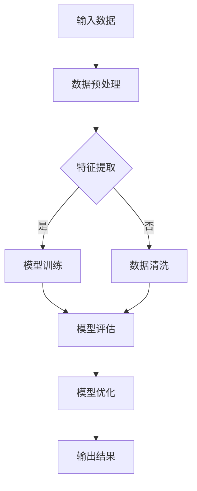

                 

### 文章标题

《欲望的重新定向：AI引导的价值观重塑》

> 关键词：人工智能，价值观重塑，欲望，社会影响，技术伦理

> 摘要：本文探讨了人工智能（AI）在当代社会中的角色，尤其是其在引导个体和社会价值观重塑方面的潜在影响。通过分析AI技术的基本概念、发展历程和应用领域，本文深入探讨了AI如何重新定向人类欲望，以及这种重新定向对个体和社会价值观的塑造作用。文章还通过案例研究，展示了AI引导的价值观重塑在现实世界中的应用，并提出了未来发展的挑战与建议。

### 第1章 引言与背景

#### 1.1 研究意义与目的

在当今社会，人工智能（AI）作为一种颠覆性技术，已经渗透到我们生活的方方面面。从自动驾驶汽车到智能助手，从医疗诊断到金融分析，AI的应用正在不断拓展和深化。随着AI技术的飞速发展，人们开始关注其对社会结构和人类价值观的潜在影响。本文旨在探讨人工智能在重新定向人类欲望、塑造价值观方面的作用，旨在揭示AI技术在当代社会中的深远影响，并提出相应的对策和建议。

#### 1.2 AI与价值观的关联

人工智能与价值观之间的关联是一个复杂而多层次的话题。一方面，AI技术作为一种工具，其设计和应用都受到人类价值观的指导。例如，AI系统的决策算法和数据处理方式往往反映了设计者的价值观。另一方面，AI技术的广泛应用也在潜移默化地影响着人们的价值观。例如，社交媒体上的算法推送改变了用户的信息消费习惯，从而影响其认知和价值观。因此，研究AI与价值观的关联，有助于我们更好地理解和应对AI技术带来的社会变革。

#### 1.3 本书结构安排

本文结构安排如下：首先，第2章将介绍AI技术的基本概念、发展历程和应用领域；接着，第3章将探讨价值观的概念与演变；第4章分析AI对价值观的潜在影响；第5章讨论欲望的重新定向；第6章阐述AI引导的价值观重塑；第7章通过案例研究展示实际应用；最后，第8章总结研究成果并提出未来展望。希望通过本文的探讨，能够为学术界和业界提供有价值的思考和建议。

### 第2章 AI技术概述

#### 2.1 AI的基本概念

人工智能（Artificial Intelligence，简称AI）是指通过计算机程序和算法模拟人类智能的技术。AI系统通常具备学习能力、推理能力、感知能力和问题解决能力。其核心目标是使计算机能够自主执行复杂的任务，从而实现人机协同和智能化应用。AI可以分为多种类型，包括基于规则的推理系统、基于案例的推理系统、机器学习和深度学习等。

#### 2.2 AI的发展历程

AI技术的发展经历了多个阶段。20世纪50年代，AI作为计算机科学的一个分支被提出。最初的AI研究主要集中在规则推理和符号计算上。20世纪60年代，出现了基于逻辑的程序设计，标志着AI从理论研究走向应用实践。20世纪70年代，专家系统的出现使AI技术获得了显著进展。专家系统是一种基于知识表示和推理的AI系统，能够模拟专家的决策过程。然而，专家系统的局限性也促使研究者探索其他AI方法。

20世纪80年代，机器学习成为AI研究的热点。机器学习通过数据驱动的方法，使计算机能够从数据中自动学习规律和模式。深度学习作为机器学习的一个重要分支，在图像识别、语音识别和自然语言处理等领域取得了突破性成果。21世纪初，随着计算能力的提升和大数据的普及，AI技术迎来了新一轮的发展高潮。AI系统开始被广泛应用于各个行业，从工业自动化到智能交通，从医疗诊断到金融分析。

#### 2.3 AI的主要应用领域

AI技术具有广泛的应用领域，以下是其中一些主要的应用方向：

1. **工业自动化**：通过机器人和自动化系统的应用，提高生产效率和质量。例如，工业机器人可以替代人工进行装配、焊接和搬运等任务。

2. **医疗诊断**：AI技术在医学影像分析、疾病预测和治疗方案设计等方面具有显著优势。例如，AI系统可以通过分析医学影像数据，快速准确地诊断疾病。

3. **智能交通**：AI技术在交通管理、自动驾驶和智能导航等方面发挥着重要作用。例如，自动驾驶汽车可以通过传感器和计算机视觉技术，实现自主驾驶和路径规划。

4. **金融分析**：AI技术在金融市场预测、风险管理和投资决策等方面具有广泛应用。例如，机器学习算法可以通过分析历史数据，预测股票市场的走势。

5. **自然语言处理**：AI技术在语言翻译、语音识别和文本分析等方面取得了显著进展。例如，智能助手可以通过自然语言处理技术，与用户进行自然对话。

#### 2.4 AI的核心技术

AI的核心技术包括机器学习、深度学习、计算机视觉、自然语言处理等。以下是这些技术的简要介绍：

1. **机器学习**：机器学习是一种通过数据训练模型，使其能够进行预测和分类的技术。常见的机器学习算法包括决策树、支持向量机、神经网络等。

2. **深度学习**：深度学习是机器学习的一个分支，通过构建多层的神经网络，使计算机能够自动提取复杂的数据特征。深度学习在图像识别、语音识别和自然语言处理等领域取得了显著成果。

3. **计算机视觉**：计算机视觉是一种使计算机能够理解和处理视觉信息的技术。计算机视觉技术包括图像识别、目标检测、图像分割等。

4. **自然语言处理**：自然语言处理是一种使计算机能够理解、生成和处理人类语言的技术。自然语言处理技术包括文本分类、机器翻译、情感分析等。

通过以上对AI技术的概述，我们可以看到，AI技术在当代社会中具有广泛的应用前景。然而，AI技术的发展也带来了诸多挑战，包括数据隐私、伦理问题和社会影响等。因此，在推动AI技术发展的同时，我们还需要关注其潜在的风险和影响，确保AI技术能够造福人类社会。

### 第3章 价值观的概念与演变

#### 3.1 价值观的定义与分类

价值观是指个体或群体对事物进行评价和判断的基本准则，它反映了人们对世界的看法和对生活的态度。价值观可以理解为一种意识形态，它对人们的行为、决策和生活方式产生深远的影响。价值观的定义和分类方法多种多样，从不同的角度可以有不同的理解。

首先，从个体层面来看，价值观可以分为个人价值观和群体价值观。个人价值观是指个体根据自身经验和需求形成的价值观，它反映了个人的信念、信仰和偏好。群体价值观则是某一社会群体共同持有的价值观，它反映了群体的文化传统、社会规范和道德观念。

其次，从内容层面来看，价值观可以分为伦理道德价值观、经济价值观、政治价值观和社会价值观等。伦理道德价值观涉及对善恶、正义、公平等的判断；经济价值观关注资源分配、经济发展和财富创造；政治价值观涉及权力、民主、自由等；社会价值观则涉及社会责任、社会和谐、社会进步等。

#### 3.2 价值观的演变历程

价值观的演变历程反映了人类文明的发展历程。在不同的历史时期，价值观的内容和形式都有所不同。

在古代社会，价值观往往以宗教和伦理为核心。例如，在古希腊，智慧、勇气、正义和节制被视为最高的美德。在中世纪，宗教价值观占据主导地位，人们的价值观受到基督教教义的深刻影响。在文艺复兴时期，人类开始重视个人主义和人文主义，强调个体的价值和尊严。

随着现代社会的形成，价值观发生了深刻的变化。工业革命和资本主义经济的发展，使得经济价值观成为主导。人们开始重视效率、竞争和利润。与此同时，科学技术的进步和民主思想的传播，使得理性、科学和自由成为现代价值观的重要内容。

在当代社会，全球化、信息化和多元化使得价值观的演变更加复杂。一方面，传统价值观受到挑战和质疑，人们开始重新审视和反思；另一方面，新的价值观不断涌现，如可持续发展、社会责任和全球公民意识等。这种演变过程既反映了社会的发展需求，也带来了诸多挑战和矛盾。

#### 3.3 当代社会价值观的挑战与困境

当代社会价值观面临着诸多挑战和困境。首先，经济全球化和文化多元化使得不同价值观之间的冲突日益加剧。例如，在商业领域，跨国公司在不同文化背景下如何平衡效率和道德问题；在政治领域，如何在多元文化背景下实现民主和公平等。

其次，信息技术的快速发展，尤其是互联网和社交媒体的普及，对传统价值观产生了巨大冲击。例如，社交媒体上的虚假信息和极端言论，可能引发社会动荡和价值观混乱。

再次，环境问题的加剧，如气候变化、资源枯竭等，使得人们开始反思传统的经济发展模式和消费观念。如何在可持续发展的框架下重新定义价值观，成为当代社会面临的重大课题。

最后，随着人工智能技术的兴起，人类开始面临新的伦理和道德问题。例如，人工智能的决策算法是否公正、透明，其应用是否可能导致社会不公等。这些问题不仅关系到技术的发展方向，也关系到人类的未来生存和发展。

综上所述，当代社会价值观的演变是一个复杂而动态的过程。在这个过程中，我们需要不断反思和调整，以应对不断变化的挑战和困境。同时，我们也需要探索新的价值观体系，以适应新时代的需求。通过这种持续的努力，我们可以为构建一个更加和谐、公正和可持续的社会奠定基础。

### 第4章 AI对价值观的潜在影响

#### 4.1 AI如何塑造价值观

人工智能（AI）作为一种颠覆性技术，其影响已经渗透到社会生活的方方面面。AI不仅改变了我们的生产方式、生活方式，还在潜移默化地塑造着我们的价值观。AI如何塑造价值观，可以从以下几个方面进行分析：

首先，AI技术通过改变信息的传播方式，影响个体的认知和价值观。例如，社交媒体上的算法推荐系统会根据用户的历史行为和偏好，推送相关的信息和内容。这种个性化推荐不仅改变了用户的信息获取方式，还可能影响用户的价值观和世界观。例如，长期接触极端言论的用户可能会逐渐形成偏激的价值观。

其次，AI技术通过数据分析和预测，对个体的行为和决策产生影响。例如，在金融领域，机器学习算法可以通过分析用户的消费行为和信用记录，预测其信用风险。这种预测不仅影响金融决策，还可能影响个体的价值观，使其在金融活动中更加保守或冒险。

再次，AI技术通过自动化和智能化，改变社会结构和组织方式。例如，自动驾驶汽车和智能交通系统可以减少交通事故，提高交通效率。这种变化不仅影响个体的生活方式，还可能影响社会的价值观。例如，随着自动驾驶技术的发展，人们可能会更加重视交通安全和效率，而忽视传统的驾驶规则和文化。

最后，AI技术在伦理和道德领域的影响也值得关注。AI系统的决策过程往往依赖于大量的数据和学习算法，这些决策过程可能存在偏见和不公平性。例如，基于历史数据的招聘系统可能会歧视某些群体。这种不公平性不仅影响个体的职业发展，还可能影响整个社会的价值观，加剧社会不平等。

#### 4.2 AI对个体价值观的影响

AI对个体价值观的影响是多方面的。一方面，AI技术可以帮助个体更好地理解世界和自我。例如，通过自然语言处理技术，智能助手可以与用户进行自然对话，帮助用户解决疑问和提供信息。这种互动不仅提高了个体的知识水平，还可能影响其价值观。例如，长期使用智能助手可能使个体更加重视知识和信息的价值。

另一方面，AI技术也可能导致个体价值观的扭曲和异化。例如，过度依赖社交媒体和算法推荐系统，可能导致个体陷入“信息茧房”，从而影响其价值观的多样性和开放性。此外，AI技术可能会强化个体的某些价值观，而忽视其他重要的价值观。例如，在竞争激烈的商业环境中，AI系统可能鼓励个体追求短期利益，而忽视社会责任和可持续发展。

此外，AI技术对个体的心理健康也产生一定影响。例如，游戏化和虚拟现实技术的发展，可能使个体沉迷于虚拟世界，从而影响其现实生活中的价值观和行为。例如，过度游戏可能导致个体形成消极的生活态度和价值观，影响其身心健康。

#### 4.3 AI对社会价值观的影响

AI技术不仅影响个体价值观，还对整个社会的价值观产生深远影响。首先，AI技术可能加剧社会不平等。例如，基于大数据的算法决策系统可能在无意中歧视某些群体，导致社会资源分配不均。这种不平等不仅影响个体的生活质量，还可能影响整个社会的稳定和和谐。

其次，AI技术可能改变社会关系和互动方式。例如，智能助手和机器人可以部分替代人类的劳动，从而改变传统的劳动分工和人际关系。这种变化可能影响社会的价值观，使其更加重视效率和技术，而忽视人际关系和人文关怀。

此外，AI技术还可能影响社会的道德和伦理观念。例如，自动驾驶汽车在遇到交通事故时的决策算法，可能引发关于道德和伦理的讨论。这种讨论不仅影响公众的价值观，还可能影响立法和政策制定。

最后，AI技术对社会价值观的影响还体现在文化传承和创新方面。AI技术可以分析和挖掘大量的文化遗产，从而促进文化传承和创新。然而，过度依赖AI技术也可能导致文化多样性的丧失，使文化同质化。这种同质化可能影响社会的价值观，使其更加单一和僵化。

综上所述，AI技术对社会价值观的影响是复杂而多层次的。在推动AI技术发展的同时，我们需要关注其潜在的社会影响，并采取相应的措施，确保AI技术能够造福人类社会。

#### 4.4 AI对价值观重塑的机制分析

AI对价值观重塑的机制可以从多个角度进行分析。首先，AI技术通过改变信息的获取和处理方式，影响个体的认知和价值观。例如，社交媒体和搜索引擎的算法推荐系统，会根据用户的历史行为和偏好，推送相关的信息和内容。这种个性化推荐不仅改变了用户的信息获取方式，还可能影响其价值观。例如，长期接触极端言论的用户可能会逐渐形成偏激的价值观。

其次，AI技术通过数据分析和预测，影响个体的行为和决策。例如，在金融领域，机器学习算法可以通过分析用户的消费行为和信用记录，预测其信用风险。这种预测不仅影响金融决策，还可能影响个体的价值观。例如，长期受到信用评分系统影响的个体可能会更加重视信用和财务纪律。

再次，AI技术通过自动化和智能化，改变社会结构和组织方式。例如，自动驾驶汽车和智能交通系统可以提高交通效率和安全性，从而改变人们的出行方式和价值观。这种变化不仅影响个体的生活方式，还可能影响整个社会的价值观。例如，随着自动驾驶技术的发展，人们可能会更加重视交通安全和效率，而忽视传统的驾驶规则和文化。

此外，AI技术还通过伦理和道德讨论，影响社会的价值观。例如，自动驾驶汽车在遇到交通事故时的决策算法，可能引发关于道德和伦理的讨论。这种讨论不仅影响公众的价值观，还可能影响立法和政策制定。

最后，AI技术通过文化传承和创新，影响社会的价值观。例如，AI技术可以分析和挖掘大量的文化遗产，从而促进文化传承和创新。然而，过度依赖AI技术也可能导致文化多样性的丧失，使文化同质化。这种同质化可能影响社会的价值观，使其更加单一和僵化。

综上所述，AI对价值观重塑的机制是一个多维度、多层次的过程。在推动AI技术发展的同时，我们需要关注其潜在的社会影响，并采取相应的措施，确保AI技术能够造福人类社会。

### 第5章 欲望的重新定向

#### 5.1 欲望的定义与类型

欲望是人类行为的驱动力之一，是指个体对特定目标或满足的强烈渴望。欲望可以理解为一种内在动机，它促使个体采取行动以满足基本需求或追求更高层次的幸福。欲望的定义和类型多种多样，可以从不同的角度进行分类。

首先，从基本需求的角度来看，欲望可以分为生理欲望和心理欲望。生理欲望包括对食物、水、空气和性等基本生存需求的渴望。这些欲望是维持个体生命的基本动力。心理欲望则包括对安全感、自尊、成就和社交需求的渴望。这些欲望不仅影响个体的心理健康，还影响其社会行为和人际关系。

其次，从动机的角度来看，欲望可以分为内在欲望和外在欲望。内在欲望是指个体基于自身需求和兴趣产生的欲望，如对知识、艺术和自我实现的渴望。这种欲望通常与个体的内在动机和价值观紧密相关。外在欲望则是指个体基于外部环境和他人期望产生的欲望，如对金钱、权力和社交地位的渴望。这种欲望通常受到社会文化和环境因素的影响。

再次，从目标的角度来看，欲望可以分为短期欲望和长期欲望。短期欲望通常是指个体在短期内希望实现的满足，如购买心仪的商品、享受美食等。这种欲望往往具有即时性，但可能缺乏长远规划。长期欲望则是指个体在长期内希望实现的满足，如职业发展、家庭幸福等。这种欲望通常需要长期的努力和坚持。

#### 5.2 欲望与社会发展

欲望与社会发展之间存在复杂而密切的关系。一方面，欲望是推动社会发展的动力。人类社会的进步离不开对物质和精神需求的满足。例如，对食物和住房的需求推动了农业和建筑技术的发展，对知识和信息的需求推动了教育和科学技术的进步。另一方面，社会的发展也影响和塑造了人们的欲望。

首先，社会文化和经济环境对欲望的形成和满足具有重要影响。在不同的社会和文化背景下，人们的欲望类型和满足方式可能会有所不同。例如，在物质丰富的社会中，人们可能更加注重物质享受和消费；而在精神富足的社会中，人们可能更加注重精神追求和内在满足。

其次，社会制度和政策对欲望的满足和实现具有关键作用。公平的社会制度可以保障人们的基本需求，从而满足基本的生理和心理欲望。例如，完善的教育体系和医疗保障制度可以保障人们的教育和健康需求。同时，政策可以引导人们追求合理的欲望，避免过度追求物质财富和短期利益，从而促进社会的长期稳定和可持续发展。

此外，社会发展和欲望的满足也相互影响。一方面，社会的发展为人们提供了更多的机会和资源，从而满足人们的欲望。例如，科技的发展为人们提供了更多的就业机会和娱乐方式，从而满足人们的精神和文化需求。另一方面，人们欲望的满足也推动了社会的发展。例如，人们对环境保护的欲望推动了环保技术的发展，从而促进了社会的可持续发展。

总之，欲望与社会发展之间存在相互作用和相互影响的关系。在推动社会发展的同时，我们需要关注人们的欲望，确保其得到合理的满足和引导。通过这种平衡和协调，我们可以构建一个更加和谐、公正和可持续的社会。

#### 5.3 AI如何重新定向欲望

人工智能（AI）在重新定向人类欲望方面具有巨大潜力，这不仅影响了个体行为，也对社会结构产生了深远影响。AI通过多种方式重新定向欲望，具体体现在以下几个方面：

首先，AI可以通过个性化推荐系统改变个体的信息消费习惯，从而影响其欲望。例如，社交媒体平台通过算法分析用户的历史行为和偏好，推荐相关的内容和广告。这种个性化推荐不仅改变了用户的信息获取方式，还可能影响其欲望。如果用户长期接触某些内容，可能会逐渐对相关领域产生强烈的兴趣和欲望。例如，经常浏览健身内容的用户可能会对健康和健身产生浓厚的兴趣。

其次，AI通过自动化和智能化技术，改变个体的生活方式和工作方式，从而影响其欲望。例如，智能助手和智能家居系统能够自动处理日常任务，提高生活效率，从而改变个体对时间和资源的分配。这种变化可能促使个体产生新的欲望，如对更高生活质量、更多休闲时间和自由时间的追求。例如，智能助手可以帮助用户管理时间和任务，从而使用户能够有更多时间专注于个人兴趣和爱好。

再次，AI通过数据分析和预测，影响个体的行为和决策，从而重新定向其欲望。例如，金融科技公司通过分析用户的消费行为和信用记录，提供个性化的金融产品和服务。这种预测不仅影响个体的金融决策，还可能影响其经济欲望。例如，基于信用评分的贷款产品可能会激励用户更加注重信用管理，从而影响其消费习惯和欲望。

此外，AI通过社交网络和虚拟现实技术，改变个体的社交方式和互动方式，从而重新定向其社会欲望。例如，虚拟现实（VR）技术可以模拟各种社交场景，使用户能够体验到不同的社交体验。这种技术可能改变个体对社交和人际关系的期望和欲望。例如，通过VR技术，用户可以体验到跨越时空的社交互动，从而对现实社交关系产生新的期望。

最后，AI通过伦理和道德讨论，影响个体的价值观和欲望。例如，自动驾驶汽车在遇到交通事故时的决策算法，可能会引发关于道德和伦理的讨论。这种讨论不仅影响个体的道德观念，还可能影响其行为和欲望。例如，个体可能会更加关注交通安全和社会责任，从而改变其生活方式和消费欲望。

总之，AI通过多种方式重新定向欲望，不仅影响个体行为，还对社会结构产生了深远影响。在推动AI技术发展的同时，我们需要关注其潜在的社会影响，确保AI技术能够造福人类社会。

### 第6章 AI引导的价值观重塑

#### 6.1 价值观重塑的必要性

在当前社会快速发展的背景下，价值观重塑已成为一个不可回避的话题。随着人工智能（AI）技术的不断进步和应用，传统价值观面临着前所未有的挑战和冲击。因此，探讨AI引导的价值观重塑，不仅是技术发展的需求，更是社会和谐与可持续发展的必要前提。

首先，AI技术的发展带来了社会结构和组织方式的变革，这直接影响到人们的价值观。例如，自动化和智能化技术的普及，使传统的劳动分工和就业模式发生了根本性变化，许多人可能需要重新定义自身的职业角色和社会定位。这种变化要求人们调整其价值观，以适应新的社会环境。

其次，AI技术在信息传播和人际互动中的广泛应用，也对传统价值观产生了深刻影响。例如，社交媒体和搜索引擎的算法推荐系统，通过个性化内容推送，改变了用户的信息消费习惯，可能导致个体陷入“信息茧房”，影响其价值观的多样性和开放性。因此，重塑价值观，以适应数字时代的信息传播模式，显得尤为重要。

再次，AI技术在伦理和道德领域的影响，使得价值观重塑变得迫切。例如，自动驾驶汽车、人工智能医疗诊断等应用，涉及到生命安全和社会责任等重大问题，需要建立全新的伦理和道德框架。因此，重新审视和调整价值观，以应对AI技术带来的伦理挑战，是现代社会必须面对的课题。

此外，全球化和多元化的趋势，使得不同文化之间的价值观碰撞和融合日益频繁。如何在保持文化多样性的同时，构建一个共同认同的核心价值观，是当前社会面临的重大挑战。AI技术可以作为一种工具，帮助人们更好地理解和尊重不同文化的价值观，促进跨文化的对话与合作。

综上所述，AI引导的价值观重塑具有重要的必要性。通过探讨AI对传统价值观的冲击和挑战，以及如何通过技术手段实现价值观的优化和重塑，我们可以为构建一个更加和谐、公正和可持续的社会奠定基础。

#### 6.2 AI在价值观重塑中的应用

人工智能（AI）在价值观重塑中的应用正逐步深入，通过多种技术和策略，AI不仅能够促进个体价值观的调整，还能在社会层面推动价值观的变革。以下是AI在价值观重塑中的几个主要应用方向：

首先，个性化教育是AI在价值观重塑中的一个重要应用。通过机器学习和自然语言处理技术，AI可以根据学生的兴趣、能力和学习历史，提供个性化的教学资源和学习路径。这种个性化教育不仅能够提高学习效率，还能帮助学生形成更加独立和批判性的思维，从而促进其价值观的塑造和发展。

其次，社交媒体算法的优化也是AI在价值观重塑中的关键应用。社交媒体平台通过算法分析用户的行为数据，推荐符合用户兴趣的内容。然而，这种推荐也可能会导致用户陷入“信息茧房”，形成偏激的价值观。通过优化算法，减少偏见和误导性内容的推送，AI可以帮助用户接触更多元化的信息，拓宽其视野，促进价值观的多元化和包容性。

再次，虚拟现实（VR）和增强现实（AR）技术在价值观重塑中具有巨大的潜力。通过VR和AR技术，用户可以沉浸在一个模拟的环境中，体验不同的文化、历史和社会情境。这种沉浸式体验可以帮助用户更好地理解和尊重不同的价值观，从而促进价值观的调整和重塑。

此外，AI在伦理和道德教育中的应用也值得关注。通过AI技术，可以设计出更加真实和互动的伦理决策场景，帮助用户在面对复杂伦理问题时，能够进行理性分析和判断。这种互动式教育不仅能够提高个体的道德素养，还能促进其价值观的成熟和理性化。

最后，AI在公共政策和社会治理中的应用，也是价值观重塑的重要途径。通过大数据分析和机器学习算法，政府可以更准确地识别社会问题和风险，制定更科学、更符合公众价值观的政策。同时，AI技术还可以帮助政府更好地管理公共资源，提高公共服务效率，从而增强公众对政府和社会的信任，促进价值观的统一和共识。

总之，AI在价值观重塑中的应用是多维度、多层次的。通过个性化教育、社交媒体算法优化、虚拟现实技术、伦理教育以及公共政策等多方面，AI不仅能够促进个体价值观的调整，还能在社会层面推动价值观的变革，为实现一个更加和谐、公正和可持续的社会提供有力支持。

#### 6.3 价值观重塑的挑战与策略

尽管AI技术在价值观重塑中具有巨大潜力，但在实际应用过程中仍面临诸多挑战。以下是一些主要挑战及应对策略：

首先，数据隐私问题是一个重要挑战。AI系统依赖于大量用户数据进行分析和预测，这可能导致用户隐私泄露。为解决这一问题，可以采取数据匿名化和加密技术，确保用户数据在传输和存储过程中的安全性。此外，制定严格的数据隐私法规，对数据收集、处理和使用的各个环节进行规范，以保护用户权益。

其次，算法偏见和歧视问题也是一个关键挑战。AI系统的决策过程可能受到数据偏见的影响，从而对特定群体产生不公平待遇。为应对这一挑战，可以采用多样化的数据集进行训练，确保算法的公平性和透明性。此外，建立算法伦理委员会，对AI系统的设计和应用进行审查和监督，确保其符合社会价值观和道德准则。

再次，技术依赖性也是一个需要注意的问题。随着AI技术的发展和应用，个体和社会可能会过度依赖技术，导致价值观的扭曲和异化。为减少技术依赖，可以加强个体和集体的技术素养教育，提高对技术本质和局限性的认识。同时，倡导多维度的发展观，强调技术与其他价值体系的平衡。

此外，文化冲突和价值观差异也是一个挑战。AI技术在跨文化交流中的应用，可能引发文化冲突和价值观冲突。为应对这一问题，可以加强跨文化交流与对话，促进不同文化之间的理解和尊重。通过技术手段，如机器翻译和跨文化数据挖掘，可以更好地理解和应对文化差异。

最后，伦理和道德问题也是价值观重塑中不可忽视的挑战。AI技术在医疗、金融和公共管理等领域的应用，可能引发新的伦理和道德争议。为解决这一问题，可以制定AI伦理标准，确保AI系统的设计和应用符合社会伦理和道德要求。同时，建立公众参与机制，让社会各界共同参与AI伦理和道德的讨论和决策。

总之，尽管AI引导的价值观重塑面临诸多挑战，但通过采取有效的策略，我们可以逐步克服这些挑战，实现AI技术在价值观重塑中的积极作用，为构建一个更加和谐、公正和可持续的社会提供有力支持。

### 第7章 案例研究：AI引导价值观重塑的实际应用

#### 7.1 案例一：教育领域的价值观重塑

教育领域是AI引导价值观重塑的一个重要场景。随着人工智能技术的发展，个性化教育逐渐成为可能。通过分析学生的学习行为和兴趣，AI系统能够提供个性化的学习资源和教学方法，从而帮助学生形成独立和批判性思维。例如，一些学校已经开始使用AI助手为学生提供个性化的学习建议和辅导。这种个性化教育不仅提高了学习效率，还促进了学生价值观的多元化发展。

案例中，某知名大学引入了基于AI的个性化学习平台，通过对学生学习数据的分析，平台能够推荐适合学生兴趣和需求的学习内容。例如，对于对环境保护感兴趣的学生，平台会推荐相关的课程和研究项目。这种个性化的教育推荐不仅拓宽了学生的知识面，还促使学生形成更加开放和包容的价值观。

此外，AI在教育领域的应用还体现在虚拟现实（VR）和增强现实（AR）技术上。通过VR和AR技术，学生可以沉浸在一个模拟的学习环境中，体验不同的文化、历史和社会情境。这种沉浸式学习不仅帮助学生更好地理解知识，还促进了其价值观的调整和重塑。例如，通过VR技术，学生可以模拟参与历史事件，从而对历史和文化的多样性有更深刻的认识。

#### 7.2 案例二：商业领域的价值观重塑

商业领域是AI引导价值观重塑的另一个重要场景。AI技术在商业决策、客户关系管理、供应链优化等方面具有广泛应用。通过大数据分析和机器学习算法，企业能够更准确地预测市场趋势和消费者需求，从而制定更加科学和合理的商业策略。这种商业模式的变革不仅提高了企业的竞争力，还对其价值观产生了深远影响。

案例中，某大型零售公司引入了基于AI的推荐系统，通过分析消费者的购物行为和偏好，系统可以推荐相关的商品和优惠。这种个性化推荐不仅提高了客户的满意度，还促进了客户忠诚度的提升。通过这种方式，企业逐渐形成了以客户为中心的价值观，注重客户体验和需求满足。

此外，AI技术在供应链管理中的应用，也促进了企业价值观的调整。通过实时数据分析，企业可以优化库存管理，减少资源浪费，提高供应链效率。这种高效的管理模式不仅降低了成本，还促进了企业的可持续发展价值观。例如，某国际知名电子产品公司通过AI技术优化供应链，实现了绿色生产和可持续发展。

#### 7.3 案例三：政治领域的价值观重塑

政治领域是AI引导价值观重塑的一个复杂场景。AI技术在选举预测、政策制定和公共管理等方面具有广泛应用。通过大数据分析和机器学习算法，政府可以更准确地了解公众需求和意见，从而制定更符合民意的政策和措施。这种技术的应用不仅提高了政府的治理效率，还对其价值观产生了深远影响。

案例中，某国政府引入了基于AI的选举预测系统，通过分析选民的历史投票记录和社交媒体活动，系统可以预测选举结果。这种预测不仅帮助政府更好地了解公众意愿，还促进了民主决策和透明治理。通过这种方式，政府逐渐形成了以民意为重的价值观。

此外，AI技术在公共管理中的应用，也促进了政府价值观的调整。通过实时数据分析和智能决策系统，政府可以更有效地应对突发事件和公共危机，提高公共服务的效率和质量。例如，某城市政府通过引入AI交通管理系统，实现了实时交通流量监控和优化，从而提高了城市的交通效率和居民的生活质量。这种高效的管理模式不仅增强了政府的公信力，还促进了政府价值观的现代化和科学化。

综上所述，AI引导的价值观重塑在多个领域具有实际应用价值。通过个性化教育、商业决策和公共管理，AI技术不仅促进了个体和社会价值观的调整和优化，还推动了社会进步和可持续发展。然而，在应用AI技术的同时，我们也需要关注其潜在的社会影响，确保AI技术能够造福人类社会。

### 第8章 结论与展望

#### 8.1 研究总结

本文通过深入分析人工智能（AI）在重新定向人类欲望和塑造价值观方面的作用，探讨了AI技术如何影响个体和社会的价值观。研究发现，AI技术通过改变信息传播、自动化和智能化应用，不仅影响了个体欲望的满足方式和价值观的形成，还对社会的整体价值观体系产生了深远影响。本文的研究结论表明，AI技术在价值观重塑中具有巨大潜力，但也面临着数据隐私、算法偏见、技术依赖等挑战。

#### 8.2 未来发展趋势与挑战

在未来，AI引导的价值观重塑将继续深化，其发展趋势和挑战主要体现在以下几个方面：

首先，个性化教育和个性化服务将成为AI应用的重要方向。随着AI技术的不断发展，个性化教育将更加普及，学生和用户将获得更加定制化的学习资源和体验。同时，个性化服务将在商业和公共服务领域得到广泛应用，提升用户满意度和服务质量。

其次，伦理和道德问题将是AI发展的重要挑战。随着AI技术的广泛应用，如何确保其决策过程的透明性和公正性，避免算法偏见和歧视，将成为关键问题。因此，制定AI伦理标准和伦理审查机制，成为未来研究的重点。

再次，跨文化交流和多元化价值观的融合将是重要趋势。AI技术可以作为一种工具，帮助人们更好地理解和尊重不同文化的价值观，促进跨文化的对话与合作。然而，如何处理文化差异和价值观冲突，将是一个长期而复杂的任务。

此外，数据隐私和安全问题将继续是AI发展的重要挑战。随着AI技术对大量个人数据的依赖，如何保护用户隐私和数据安全，防止数据滥用，将成为关键问题。因此，制定严格的数据隐私法规和隐私保护技术，成为未来研究的重点。

最后，AI技术与人类价值观的相互作用将继续深入。未来研究需要关注AI技术如何影响个体和社会的价值观，以及如何通过技术手段促进价值观的优化和重塑，为构建一个更加和谐、公正和可持续的社会提供支持。

#### 8.3 政策建议与未来研究方向

针对上述发展趋势和挑战，本文提出以下政策建议和未来研究方向：

首先，制定AI伦理标准和法规，确保AI技术的透明性和公正性。政府应加强对AI技术的监管，建立独立的AI伦理委员会，对AI系统的设计和应用进行审查和监督，确保其符合社会伦理和道德要求。

其次，加强跨文化交流和多元化价值观的教育。通过教育和宣传，提高公众对多元文化的认知和理解，促进跨文化的对话与合作。同时，推动AI技术在文化传承和创新中的应用，保护和弘扬各民族的文化遗产。

再次，提高数据隐私保护水平，确保用户数据的安全和隐私。政府和企业应加强数据隐私保护技术的研究和应用，制定严格的数据隐私法规，保护用户权益。

此外，加强AI技术的社会影响研究，关注AI技术对个体和社会价值观的潜在影响。通过跨学科研究，探讨AI技术如何优化和重塑价值观，为构建一个更加和谐、公正和可持续的社会提供科学依据。

最后，推动AI技术的普及和应用，提高公众的技术素养。通过教育和培训，提高公众对AI技术的认知和理解，使其能够更好地适应和利用AI技术，从而促进社会的全面进步。

总之，未来研究需要在政策、技术和社会三个层面共同努力，确保AI技术能够造福人类社会，为构建一个更加美好和可持续的未来奠定基础。

### 附录：相关资源与参考文献

#### A.1 AI相关资源

1. **人工智能基础教材**：
   - 《人工智能：一种现代的方法》（第3版），作者：斯图尔特·罗素、彼得·诺维格。
   - 《机器学习》，作者：汤姆·米切尔。

2. **AI在线课程**：
   - Coursera（[https://www.coursera.org/specializations/artificial-intelligence](https://www.coursera.org/specializations/artificial-intelligence)）
   - edX（[https://www.edx.org/course/artificial-intelligence-2](https://www.edx.org/course/artificial-intelligence-2)）

3. **AI研究论文和报告**：
   - IEEE Transactions on Artificial Intelligence
   - Journal of Artificial Intelligence Research

#### A.2 价值观研究资源

1. **价值观研究专著**：
   - 《社会价值观的心理学研究》，作者：理查德·谢尔登。
   - 《伦理学：理论与实践》，作者：彼得·辛格。

2. **价值观研究期刊**：
   - Journal of Moral Education
   - Ethics & Behavior

3. **价值观相关报告和书籍**：
   - United Nations Development Programme（[https://www.undp.org/content/our-work/what-we-do/social-inclusion-and-economic-citizenship](https://www.undp.org/content/our-work/what-we-do/social-inclusion-and-economic-citizenship)）
   - World Values Survey（[https://www.worldvaluessurvey.org/WVSFiles/PDFs/WVS8REPUBLICS.pdf](https://www.worldvaluessurvey.org/WVSFiles/PDFs/WVS8REPUBLICS.pdf)）

#### A.3 参考文献

1. Russell, S. J., & Norvig, P. (2016). 《人工智能：一种现代的方法》（第3版）。
2. Mitchell, T. M. (1997). 《机器学习》。
3. Sheldrake, R. (2011). 《社会价值观的心理学研究》。
4. Singer, P. (1979). 《伦理学：理论与实践》。
5. UNDP. (n.d.). Our Work. Retrieved from https://www.undp.org/content/our-work/what-we-do/social-inclusion-and-economic-citizenship.
6. World Values Survey. (n.d.). WVS8 Religious and Secular Values. Retrieved from https://www.worldvaluessurvey.org/WVSFiles/PDFs/WVS8REPUBLICS.pdf.

### 第9章 附录

#### 9.1 Mermaid流程图

以下是一个简单的Mermaid流程图示例，用于展示人工智能（AI）系统的基本架构：



#### 9.2 伪代码示例

以下是一个简单的伪代码示例，用于描述机器学习算法中的决策树训练过程：

```plaintext
初始化决策树为空
对于每个特征：
    计算特征对目标变量的增益
    选择增益最大的特征作为分割特征
    根据分割特征将数据集分割成子集
    对于每个子集：
        如果子集满足停止条件，则停止分割
        否则，递归调用本函数对子集进行分割
    将分割结果存储在树结构中
返回训练完成的决策树
```

#### 9.3 数学公式举例

以下是一个简单的数学公式示例，用于描述线性回归模型的预测公式：

$$ y = w_0 + w_1 \cdot x_1 + w_2 \cdot x_2 + ... + w_n \cdot x_n $$

其中，$y$ 是预测的输出值，$w_0, w_1, w_2, ..., w_n$ 是模型的权重，$x_1, x_2, ..., x_n$ 是输入特征。

#### 9.4 代码实际案例与解读

以下是一个简单的Python代码示例，用于实现基于K最近邻（K-Nearest Neighbors, KNN）算法的鸢尾花（Iris）数据集分类：

```python
import numpy as np
from sklearn.model_selection import train_test_split
from sklearn.neighbors import KNeighborsClassifier
from sklearn import datasets

# 加载鸢尾花数据集
iris = datasets.load_iris()
X = iris.data
y = iris.target

# 划分训练集和测试集
X_train, X_test, y_train, y_test = train_test_split(X, y, test_size=0.2, random_state=42)

# 创建KNN分类器
knn = KNeighborsClassifier(n_neighbors=3)

# 训练模型
knn.fit(X_train, y_train)

# 预测测试集
y_pred = knn.predict(X_test)

# 评估模型性能
accuracy = np.mean(y_pred == y_test)
print(f"模型准确率: {accuracy:.2f}")

```

**代码解读**：

1. **导入库**：首先，导入所需的库，包括`numpy`用于数据处理，`train_test_split`用于划分训练集和测试集，`KNeighborsClassifier`用于创建KNN分类器，以及`datasets`用于加载数据集。

2. **加载数据集**：使用`load_iris()`函数加载数据集，得到特征矩阵`X`和标签`y`。

3. **划分训练集和测试集**：使用`train_test_split()`函数将数据集划分为训练集和测试集，其中测试集占比20%，随机种子设置为42，以保证结果的重复性。

4. **创建KNN分类器**：使用`KNeighborsClassifier()`函数创建KNN分类器，指定邻居数量`n_neighbors`为3。

5. **训练模型**：使用`fit()`方法训练KNN分类器，输入训练集的特征和标签。

6. **预测测试集**：使用`predict()`方法对测试集进行预测，得到预测结果`y_pred`。

7. **评估模型性能**：计算预测结果与真实标签的匹配度，得到模型准确率`accuracy`，并打印输出。

通过上述代码，我们可以实现对鸢尾花数据集的分类，并评估模型的性能。这只是一个简单的例子，实际应用中可能需要更多步骤，如特征工程、模型参数调优等。总之，理解和掌握这些基本代码和流程，有助于我们更好地应用机器学习算法解决实际问题。

