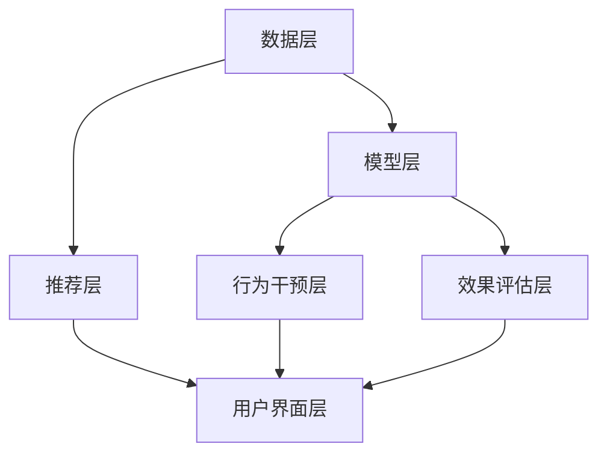
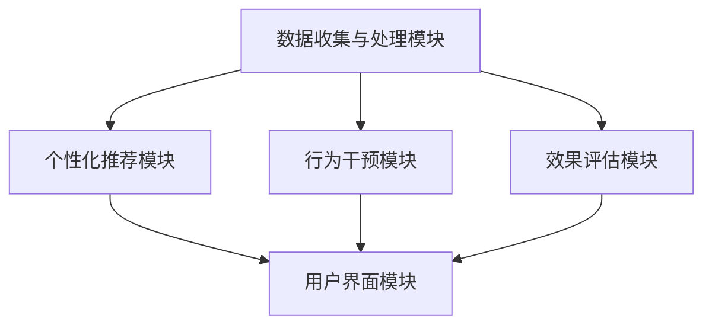
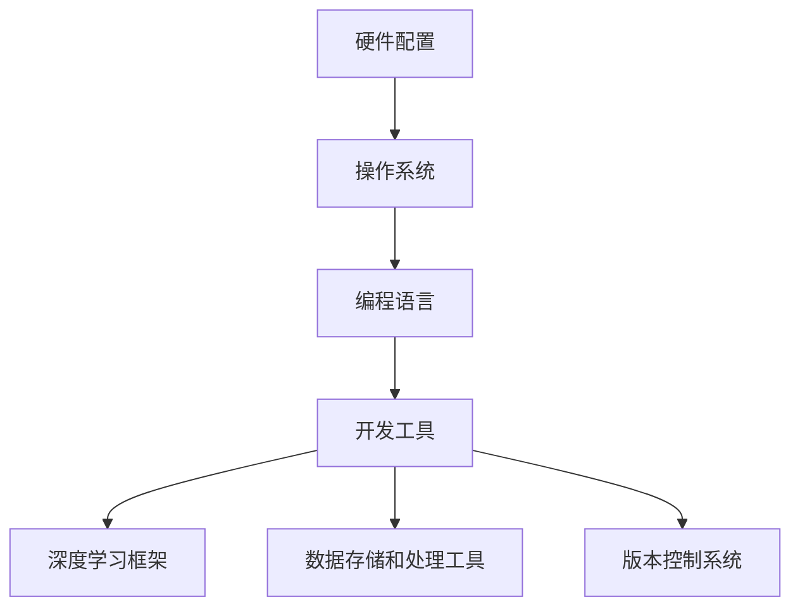
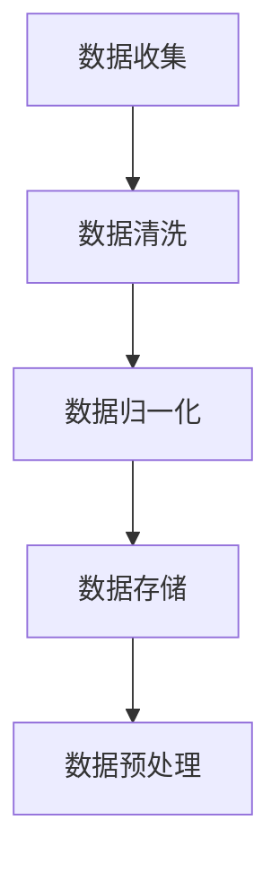
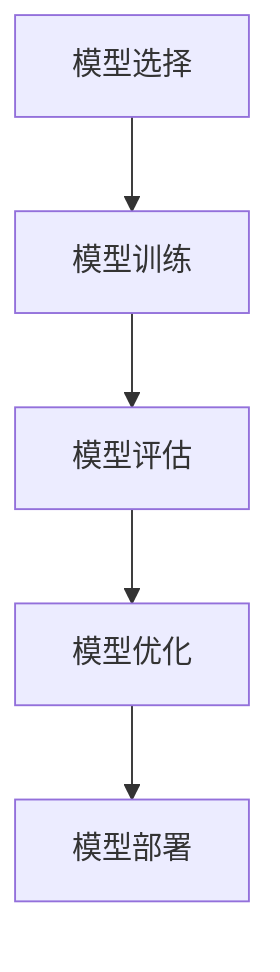
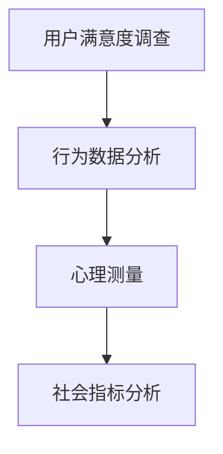
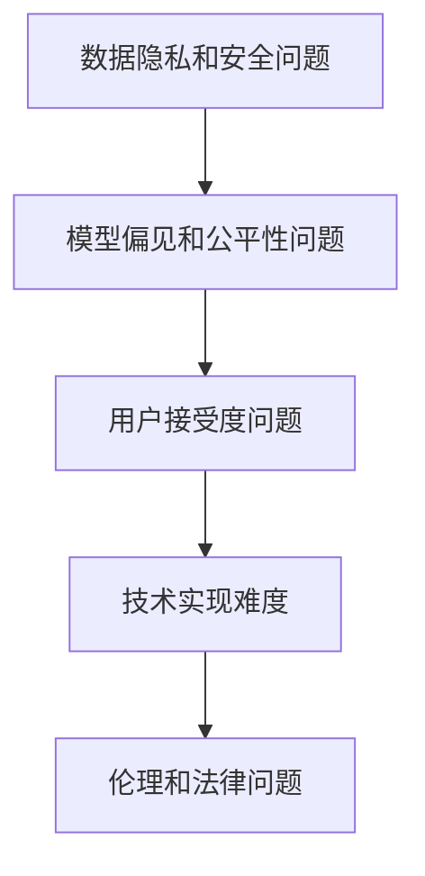

                 

# 《欲望重定向compass设计师：AI引导的价值观重塑工具创造者》

> 关键词：欲望重定向、AI、价值观重塑、compass设计师、工具创造者

> 摘要：本文将探讨欲望重定向compass设计师的角色和作用，以及如何利用AI引导的价值观重塑工具进行工具创造。文章首先介绍了欲望重定向和价值观重塑的背景和意义，然后详细分析了AI在其中的作用，最后讨论了价值观重塑工具的设计、开发、应用以及创造者的角色和实践指南。通过本文的探讨，读者可以了解如何利用AI技术和价值观重塑工具来引导人们建立正确的价值观，实现个人和社会的和谐发展。

## 《欲望重定向compass设计师：AI引导的价值观重塑工具创造者》目录大纲

### 第一部分：引言

#### 第1章：欲望重定向与价值观重塑

1.1 欲望重定向的背景与意义

1.2 价值观重塑的必要性

1.3 AI在欲望重定向与价值观重塑中的作用

### 第二部分：AI引导的价值观重塑工具

#### 第2章：价值观重塑的基本原理

2.1 AI与价值观重塑的关系

2.2 价值观重塑的目标与原则

2.3 价值观重塑的技术框架

#### 第3章：AI引导的价值观重塑工具设计

3.1 工具设计的基本思路

3.2 工具的架构与实现

3.3 工具的功能模块

#### 第4章：AI引导的价值观重塑工具开发

4.1 开发环境的搭建

4.2 数据准备与处理

4.3 模型训练与优化

#### 第5章：价值观重塑工具的实际应用

5.1 应用场景与案例

5.2 应用效果评估

5.3 应用中的问题与挑战

### 第三部分：AI引导的价值观重塑工具的创造者

#### 第6章：价值观重塑工具创造者的角色

6.1 创造者的职责与能力

6.2 创造者的成长路径

6.3 创造者所需的知识与技能

#### 第7章：价值观重塑工具创造者的实践指南

7.1 实践步骤与方法

7.2 实践中的问题与解决策略

7.3 实践中的经验与教训

### 第四部分：展望

#### 第8章：未来发展趋势与挑战

8.1 AI引导的价值观重塑的发展趋势

8.2 未来面临的挑战与应对策略

8.3 价值观重塑工具的未来方向

### 附录

#### 附录A：相关术语与概念

A.1 AI与价值观重塑相关术语

A.2 常见模型与算法简介

#### 附录B：参考文献

B.1 书籍

B.2 论文

B.3 网络资源

#### 附录C：示例代码与数据集

C.1 示例代码解读

C.2 数据集介绍与使用方法

## 第1章：欲望重定向与价值观重塑

### 1.1 欲望重定向的背景与意义

在当今社会，随着科技的飞速发展，人们的生活方式发生了巨大的变化。互联网、智能手机、社交媒体等新兴技术的普及，使得人们获取信息和交流的方式更加便捷。然而，这也带来了一个问题：人们越来越容易被外界的诱惑所影响，导致欲望不断膨胀，价值观发生扭曲。

欲望重定向（Desire Redirection）是一种旨在引导人们将注意力从负面的欲望转移到积极的欲望的技术。它通过识别和分析用户的欲望模式，将用户的注意力引向更加健康、有意义的事物，从而帮助用户建立正确的价值观。

欲望重定向的背景主要体现在以下几个方面：

1. **社会问题日益突出**：随着物质生活的丰富，人们面临着越来越多的心理问题，如焦虑、抑郁、物质依赖等。这些问题严重影响了人们的身心健康和社会和谐。

2. **科技对欲望的影响**：互联网和社交媒体等科技产品，虽然为人们提供了便捷的生活方式和丰富的信息资源，但同时也成为了人们欲望膨胀的催化剂。例如，社交媒体上的炫耀、攀比等现象，导致人们产生强烈的虚荣心和嫉妒心。

3. **个体价值观的迷失**：在现代社会，个体价值观的迷失现象日益严重。许多人追求短期利益和物质享受，忽视了精神层面的需求和社会责任。这导致了个体和整个社会的价值观失衡。

欲望重定向的意义在于：

1. **缓解社会问题**：通过引导用户将注意力从负面的欲望转移到积极的欲望，欲望重定向有助于缓解焦虑、抑郁等心理问题，提高人们的心理健康水平。

2. **塑造正确价值观**：欲望重定向可以帮助用户认识到物质欲望的局限性，引导他们关注精神层面的需求，从而塑造正确的价值观。

3. **促进社会和谐**：通过引导个体建立正确的价值观，欲望重定向有助于减少社会矛盾和冲突，促进社会和谐发展。

### 1.2 价值观重塑的必要性

价值观重塑（Value Reshaping）是指在个体和集体层面上，通过教育、文化、科技等手段，引导人们改变原有的价值观，形成更加健康、积极、合理的价值观体系。在现代社会，价值观重塑的必要性主要体现在以下几个方面：

1. **应对全球化挑战**：全球化带来了经济、文化、科技等多方面的交流与融合，但也加剧了价值观的冲突。通过价值观重塑，可以帮助个体和集体适应全球化背景下的多元文化环境，实现价值观的和谐统一。

2. **解决社会问题**：价值观重塑有助于解决现代社会中存在的各种问题，如环境污染、资源浪费、道德沦丧等。通过引导人们树立正确的价值观，可以促使个体和社会采取更加负责任的行为，减少对环境的破坏，促进资源的可持续利用。

3. **促进个体成长**：价值观重塑可以帮助个体认识到自身的潜能和价值，培养积极向上的心态，促进个体的全面发展。

4. **实现社会和谐**：价值观重塑有助于消除社会矛盾和冲突，促进社会和谐发展。通过引导人们树立共同的价值观，可以增强社会的凝聚力，减少社会分裂。

### 1.3 AI在欲望重定向与价值观重塑中的作用

人工智能（AI）在欲望重定向和价值观重塑中具有重要的作用。首先，AI可以通过数据分析和模式识别技术，深入了解用户的欲望和行为模式，为欲望重定向提供科学依据。其次，AI可以用于设计和开发价值观重塑的工具，通过个性化推荐、教育引导等方式，引导用户建立正确的价值观。此外，AI还可以用于评估价值观重塑的效果，为后续的改进提供数据支持。

1. **数据分析和模式识别**：AI可以通过深度学习、自然语言处理等技术，对用户的行为数据进行分析和模式识别，了解用户的欲望和行为模式。例如，通过分析用户的社交媒体行为，AI可以识别出用户的兴趣、偏好、价值观等方面的信息。

2. **个性化推荐**：基于用户的行为数据和模式识别结果，AI可以生成个性化的推荐系统，将用户引导至具有积极价值观的内容。例如，推荐健康的生活方式和有益的社交活动，引导用户远离负面欲望。

3. **教育引导**：AI可以用于开发智能教育系统，通过虚拟现实、游戏化等手段，引导用户学习正确的价值观。例如，设计一款教育游戏，让用户在游戏中体验到正确价值观带来的积极影响。

4. **效果评估**：AI可以用于评估价值观重塑的效果，通过分析用户的反馈和行为数据，评估重塑工具的有效性。例如，分析用户在参与价值观重塑活动前后的行为变化，评估活动的效果。

### 总结

本章介绍了欲望重定向和价值观重塑的背景与意义，以及AI在其中的作用。欲望重定向旨在引导人们将注意力从负面的欲望转移到积极的欲望，以缓解社会问题和塑造正确的价值观。价值观重塑则是在个体和集体层面上，通过教育、文化、科技等手段，引导人们改变原有的价值观，形成更加健康、积极、合理的价值观体系。AI在欲望重定向和价值观重塑中具有重要作用，可以通过数据分析和模式识别、个性化推荐、教育引导、效果评估等方式，为欲望重定向和价值观重塑提供支持。在后续章节中，我们将进一步探讨AI引导的价值观重塑工具的设计、开发、应用以及创造者的角色和实践指南。

### 第2章：价值观重塑的基本原理

#### 2.1 AI与价值观重塑的关系

人工智能（AI）在价值观重塑中扮演着关键角色。价值观重塑涉及到对个体和集体的认知、情感和行为模式的深入理解，而AI通过其强大的数据分析和学习能力，可以为这一过程提供有力支持。AI与价值观重塑的关系主要体现在以下几个方面：

1. **数据驱动的理解**：AI能够通过对大量数据进行分析，识别出用户的欲望和行为模式。这些数据包括社交媒体活动、搜索引擎查询、购买行为等。通过对这些数据的分析，AI可以了解用户的价值观偏好和倾向，从而为价值观重塑提供科学依据。

2. **个性化推荐**：基于对用户数据的学习，AI可以生成个性化的推荐系统，将用户引导至具有积极价值观的内容。例如，AI可以根据用户的历史行为推荐健康的生活方式、有益的知识和积极的社交活动，从而帮助用户建立正确的价值观。

3. **情感识别与理解**：AI可以通过自然语言处理和情感分析技术，识别和理解用户的情感状态。这有助于AI更准确地了解用户的内在需求和欲望，从而更有效地引导用户进行价值观重塑。

4. **行为干预**：AI可以通过自动化系统对用户的行为进行干预。例如，AI可以设计游戏化任务，激励用户参与有益的活动，或者通过提醒和反馈机制，引导用户改变不良行为习惯。

5. **伦理与道德指导**：随着AI技术的不断发展，伦理和道德问题日益突出。AI可以通过伦理和道德计算，为用户的行为提供指导，帮助用户在面临道德抉择时做出正确的选择，从而促进价值观的健康发展。

#### 2.2 价值观重塑的目标与原则

价值观重塑的目标是帮助个体和集体建立正确的价值观，实现个人和社会的和谐发展。具体来说，价值观重塑的目标包括：

1. **提高心理健康水平**：通过引导个体建立正确的价值观，减少负面情绪和行为，提高心理健康水平。

2. **促进社会和谐**：通过价值观重塑，减少社会矛盾和冲突，促进社会和谐发展。

3. **实现可持续发展**：引导个体和集体关注环境保护、资源节约等方面，实现可持续发展。

4. **培养积极心态**：通过价值观重塑，培养个体积极向上的心态，增强对生活的热爱和追求。

5. **提升社会责任感**：引导个体关注社会问题，增强社会责任感，积极参与社会公益事业。

为了实现上述目标，价值观重塑需要遵循以下原则：

1. **个性化**：价值观重塑应该考虑到个体的差异，根据个体的需求和特点，制定个性化的价值观重塑方案。

2. **适应性**：价值观重塑应该具有适应性，能够根据社会和环境的变化，及时调整和优化重塑策略。

3. **科学性**：价值观重塑需要基于科学的理论和方法，确保重塑过程的科学性和有效性。

4. **教育性**：价值观重塑应该具有教育性，通过引导和启发，帮助个体理解和接受正确的价值观。

5. **互动性**：价值观重塑需要通过互动和参与，激发个体的积极性和主动性，提高重塑效果。

#### 2.3 价值观重塑的技术框架

价值观重塑的技术框架主要包括以下几个部分：

1. **数据收集与处理**：通过传感器、社交媒体、搜索引擎等渠道收集用户的数据，包括行为数据、情感数据、社交数据等。然后，对这些数据进行清洗、归一化和分析，提取出有用的信息。

2. **模型训练与优化**：使用机器学习和深度学习技术，对收集到的数据进行分析和建模，训练出能够识别和预测用户行为和价值观的模型。通过不断优化模型，提高模型的准确性和泛化能力。

3. **个性化推荐**：基于用户数据和模型，生成个性化的推荐系统，为用户推荐具有积极价值观的内容和活动。

4. **行为干预**：通过自动化系统和算法，对用户的行为进行干预和引导，帮助用户建立正确的价值观。

5. **效果评估与反馈**：对价值观重塑的效果进行评估，收集用户反馈，根据评估结果和反馈，不断优化和改进重塑策略。

#### 总结

本章介绍了AI与价值观重塑的关系、价值观重塑的目标与原则，以及价值观重塑的技术框架。AI在价值观重塑中发挥着关键作用，通过数据分析和学习，可以深入了解用户的欲望和行为模式，为价值观重塑提供科学依据。价值观重塑的目标是帮助个体和集体建立正确的价值观，实现个人和社会的和谐发展。为了实现这一目标，价值观重塑需要遵循个性化、适应性、科学性、教育性和互动性等原则。价值观重塑的技术框架包括数据收集与处理、模型训练与优化、个性化推荐、行为干预以及效果评估与反馈等部分。在后续章节中，我们将进一步探讨AI引导的价值观重塑工具的设计、开发、应用以及创造者的角色和实践指南。

### 第3章：AI引导的价值观重塑工具设计

#### 3.1 工具设计的基本思路

AI引导的价值观重塑工具设计需要遵循一定的基本思路，以确保工具能够有效引导用户建立正确的价值观。以下是工具设计的基本思路：

1. **用户需求分析**：首先，需要深入分析用户的需求和期望，了解用户在价值观重塑过程中可能面临的挑战和困惑。这包括用户的心理需求、情感需求和行为需求等。

2. **目标设定**：基于用户需求分析，明确工具的设计目标，如提高用户的心理健康水平、促进社会和谐、实现可持续发展等。

3. **功能规划**：根据设计目标，规划工具的具体功能，如数据收集与处理、个性化推荐、行为干预、效果评估与反馈等。

4. **用户体验设计**：注重用户体验，设计简洁、易用、直观的界面和交互方式，确保用户能够轻松地使用工具，并从中受益。

5. **技术选型**：选择合适的技术和算法，如机器学习、自然语言处理、情感分析等，确保工具的性能和效果。

6. **安全性和隐私保护**：在设计过程中，重视用户数据的安全性和隐私保护，确保用户数据的安全和隐私不受侵犯。

#### 3.2 工具的架构与实现

AI引导的价值观重塑工具架构主要包括以下几个部分：

1. **数据层**：数据层负责收集和处理用户数据，包括行为数据、情感数据、社交数据等。这些数据可以通过传感器、社交媒体、搜索引擎等渠道获取。数据层需要实现对数据的清洗、归一化和存储。

2. **模型层**：模型层负责基于数据训练出能够识别和预测用户行为和价值观的模型。常用的模型包括深度学习模型、机器学习模型等。模型层需要实现对模型的训练、优化和评估。

3. **推荐层**：推荐层基于用户数据和模型，生成个性化的推荐系统，为用户推荐具有积极价值观的内容和活动。推荐算法可以基于协同过滤、内容推荐、基于模型的推荐等方法。

4. **行为干预层**：行为干预层通过自动化系统和算法，对用户的行为进行干预和引导，帮助用户建立正确的价值观。行为干预可以包括提醒、激励、反馈等方式。

5. **效果评估层**：效果评估层对价值观重塑的效果进行评估，收集用户反馈，根据评估结果和反馈，不断优化和改进重塑策略。

6. **用户界面层**：用户界面层提供简洁、易用、直观的界面和交互方式，确保用户能够轻松地使用工具，并从中受益。

以下是工具架构的Mermaid流程图：



#### 3.3 工具的功能模块

AI引导的价值观重塑工具包括以下几个主要功能模块：

1. **数据收集与处理模块**：负责收集和处理用户数据，包括行为数据、情感数据、社交数据等。该模块需要实现对数据的清洗、归一化和存储，以便后续分析和建模。

2. **个性化推荐模块**：基于用户数据和模型，生成个性化的推荐系统，为用户推荐具有积极价值观的内容和活动。该模块可以采用协同过滤、内容推荐、基于模型的推荐等方法。

3. **行为干预模块**：通过自动化系统和算法，对用户的行为进行干预和引导，帮助用户建立正确的价值观。该模块可以包括提醒、激励、反馈等方式。

4. **效果评估模块**：对价值观重塑的效果进行评估，收集用户反馈，根据评估结果和反馈，不断优化和改进重塑策略。

5. **用户界面模块**：提供简洁、易用、直观的界面和交互方式，确保用户能够轻松地使用工具，并从中受益。该模块需要实现数据的可视化展示、用户操作的反馈等。

以下是工具功能模块的Mermaid流程图：



#### 总结

本章介绍了AI引导的价值观重塑工具设计的基本思路、架构与实现，以及功能模块。工具设计的基本思路包括用户需求分析、目标设定、功能规划、用户体验设计、技术选型和安全性设计等。工具架构主要包括数据层、模型层、推荐层、行为干预层、效果评估层和用户界面层。功能模块包括数据收集与处理模块、个性化推荐模块、行为干预模块、效果评估模块和用户界面模块。在下一章中，我们将进一步探讨AI引导的价值观重塑工具的开发过程。

### 第4章：AI引导的价值观重塑工具开发

#### 4.1 开发环境的搭建

要开发AI引导的价值观重塑工具，首先需要搭建一个适合的开发环境。以下是开发环境搭建的步骤：

1. **硬件配置**：确保计算机具备足够的计算能力和存储空间。对于深度学习和大数据处理，通常需要使用高性能的GPU来加速计算。

2. **操作系统**：选择合适的操作系统，如Windows、Linux或MacOS。Linux系统在深度学习和大数据处理方面具有更好的性能和兼容性。

3. **编程语言**：选择适合的编程语言，如Python、Java或C++。Python因其丰富的库和工具，在AI领域应用广泛。

4. **开发工具**：安装必要的开发工具，如Python解释器、Jupyter Notebook、Anaconda等。这些工具可以帮助开发者方便地进行数据处理、模型训练和代码调试。

5. **深度学习框架**：选择适合的深度学习框架，如TensorFlow、PyTorch、Keras等。这些框架提供了丰富的API和工具，方便开发者进行模型训练和部署。

6. **数据存储和处理工具**：安装数据存储和处理工具，如HDFS、Hadoop、Spark等。这些工具可以帮助开发者高效地处理大规模数据。

7. **版本控制系统**：安装版本控制系统，如Git，以便于代码管理和协同开发。

以下是开发环境搭建的Mermaid流程图：



#### 4.2 数据准备与处理

在开发AI引导的价值观重塑工具时，数据准备和处理是关键步骤。以下是数据准备与处理的步骤：

1. **数据收集**：通过传感器、社交媒体、搜索引擎等渠道收集用户数据，包括行为数据、情感数据、社交数据等。

2. **数据清洗**：对收集到的数据进行分析和清洗，去除重复、异常和噪声数据。数据清洗可以包括去重、填充缺失值、去除异常值等操作。

3. **数据归一化**：对数据进行归一化处理，将不同数据源的数据统一到相同的量纲和范围。例如，将文本数据转换为词频矩阵，将图像数据转换为像素矩阵等。

4. **数据存储**：将清洗和归一化后的数据存储到数据库或数据湖中，以便后续分析和建模。

5. **数据预处理**：对数据进行预处理，包括特征提取、降维、数据增强等操作。特征提取可以从原始数据中提取出有用的信息，如关键词、情感标签等。降维可以减少数据的维度，提高模型的训练效率。数据增强可以通过生成模拟数据来扩展数据集，提高模型的泛化能力。

以下是数据准备与处理的Mermaid流程图：



#### 4.3 模型训练与优化

在开发AI引导的价值观重塑工具时，模型训练与优化是关键步骤。以下是模型训练与优化的步骤：

1. **模型选择**：根据任务需求和数据特性，选择合适的模型。常用的模型包括深度学习模型（如卷积神经网络、循环神经网络）、机器学习模型（如决策树、随机森林、支持向量机）等。

2. **模型训练**：使用训练数据对模型进行训练。训练过程中，通过调整模型参数，使模型能够更好地拟合训练数据。常用的训练方法包括梯度下降、随机梯度下降、Adam优化器等。

3. **模型评估**：使用验证数据对模型进行评估，以确定模型的性能。常用的评估指标包括准确率、召回率、F1分数、ROC曲线等。

4. **模型优化**：根据模型评估结果，对模型进行优化。优化方法包括超参数调整、正则化、集成学习等。

5. **模型部署**：将训练好的模型部署到生产环境中，以便实际应用。

以下是模型训练与优化的Mermaid流程图：



#### 总结

本章介绍了AI引导的价值观重塑工具的开发过程，包括开发环境的搭建、数据准备与处理，以及模型训练与优化。开发环境的搭建包括硬件配置、操作系统、编程语言、开发工具、深度学习框架、数据存储和处理工具以及版本控制系统。数据准备与处理包括数据收集、数据清洗、数据归一化、数据存储、数据预处理。模型训练与优化包括模型选择、模型训练、模型评估、模型优化以及模型部署。通过本章的介绍，读者可以了解如何搭建开发环境、处理数据和训练模型，为后续的价值观重塑工具开发打下基础。

### 第5章：价值观重塑工具的实际应用

#### 5.1 应用场景与案例

AI引导的价值观重塑工具在实际应用中具有广泛的应用场景。以下是几个典型的应用场景和案例：

1. **心理健康服务**：在心理健康服务领域，AI引导的价值观重塑工具可以帮助用户识别和管理负面情绪，提高心理健康水平。例如，一款名为“心伴”的应用程序，通过AI技术对用户的情感状态进行分析，提供个性化的心理健康建议和活动推荐，帮助用户建立积极的价值观。

2. **教育领域**：在教育领域，AI引导的价值观重塑工具可以用于帮助学生树立正确的价值观，培养良好的学习习惯和品格。例如，一款名为“成长助手”的应用程序，通过分析学生的学习行为和情感状态，提供个性化的学习建议和激励措施，引导学生形成积极的价值观。

3. **企业管理**：在企业领域，AI引导的价值观重塑工具可以用于帮助企业员工树立正确的职业价值观，提高工作效率和团队凝聚力。例如，一款名为“职业成长计划”的应用程序，通过分析员工的职业行为和价值观，提供个性化的职业发展规划和激励措施，帮助企业员工实现职业成长。

4. **社会治理**：在社会治理领域，AI引导的价值观重塑工具可以用于帮助政府和社会组织引导公众树立正确的价值观，提高社会文明水平。例如，一款名为“文明引导系统”的应用程序，通过分析公众的行为和价值观，提供个性化的文明引导和建议，促进社会和谐发展。

#### 5.2 应用效果评估

为了评估AI引导的价值观重塑工具的实际效果，可以通过以下方法进行效果评估：

1. **用户满意度调查**：通过问卷调查、用户反馈等方式，了解用户对价值观重塑工具的满意度。满意度调查可以包括对工具的功能性、易用性、效果等方面的评价。

2. **行为数据分析**：通过分析用户在使用价值观重塑工具前后的行为数据，评估工具对用户行为的影响。例如，分析用户在社交媒体上的活跃度、情绪状态、消费行为等变化。

3. **心理测量**：通过心理测量工具，如心理健康量表、价值观量表等，评估用户在价值观重塑工具使用前后的心理状态变化。例如，分析用户在焦虑、抑郁、自尊等方面的变化。

4. **社会指标分析**：通过分析社会指标，如犯罪率、离婚率、教育水平等，评估价值观重塑工具对社会的影响。例如，分析工具使用前后这些指标的变化。

以下是应用效果评估的Mermaid流程图：



#### 5.3 应用中的问题与挑战

在AI引导的价值观重塑工具的实际应用中，可能会面临以下问题和挑战：

1. **数据隐私和安全问题**：在收集和处理用户数据时，需要确保用户数据的安全性和隐私保护。一旦数据泄露，可能会对用户造成严重的隐私侵害。

2. **模型偏见和公平性问题**：AI模型可能会受到训练数据偏差的影响，导致模型在处理某些特定群体时出现不公平现象。例如，性别、种族、年龄等方面的偏见。

3. **用户接受度问题**：用户可能对AI引导的价值观重塑工具持怀疑态度，担心工具会侵犯个人隐私或操控自己的行为。因此，提高用户接受度是一个重要挑战。

4. **技术实现难度**：AI引导的价值观重塑工具需要结合多种技术和算法，实现起来具有一定的难度。特别是在数据收集、模型训练和部署等方面，需要解决一系列技术难题。

5. **伦理和法律问题**：在应用AI引导的价值观重塑工具时，需要遵循相关的伦理和法律规范。例如，确保用户的知情权和选择权，避免滥用技术侵犯用户权益。

以下是应用中的问题与挑战的Mermaid流程图：



#### 总结

本章介绍了AI引导的价值观重塑工具的实际应用场景、效果评估方法以及应用中的问题和挑战。通过实际应用案例，展示了工具在不同领域的应用效果。效果评估方法包括用户满意度调查、行为数据分析、心理测量和社会指标分析。应用中面临的问题和挑战主要包括数据隐私和安全、模型偏见和公平性、用户接受度、技术实现难度以及伦理和法律问题。在下一章中，我们将进一步探讨价值观重塑工具创造者的角色和职责。

### 第6章：价值观重塑工具创造者的角色

#### 6.1 创造者的职责与能力

价值观重塑工具创造者在整个工具的开发和应用过程中扮演着关键角色。以下是价值观重塑工具创造者的主要职责和能力：

1. **职责**：

   - **需求分析**：深入理解用户需求，明确工具的目标和应用场景，为工具设计提供依据。

   - **工具设计**：根据需求分析结果，设计工具的架构和功能模块，确保工具能够实现预期的目标。

   - **技术开发**：负责工具的开发工作，包括数据收集与处理、模型训练与优化、用户界面设计等。

   - **效果评估**：对工具的应用效果进行评估，收集用户反馈，持续优化工具。

   - **团队协作**：与其他团队成员（如数据科学家、UI设计师、产品经理等）紧密合作，确保工具的成功开发和应用。

   - **用户培训与支持**：为用户提供培训和技术支持，帮助用户理解和有效使用工具。

2. **能力**：

   - **技术能力**：具备AI、大数据、深度学习等相关技术知识，能够熟练运用Python、TensorFlow、PyTorch等工具进行技术开发。

   - **数据分析能力**：能够对大量用户数据进行分析，提取有价值的信息，为工具设计提供数据支持。

   - **问题解决能力**：能够快速识别和解决工具开发和应用过程中的技术问题。

   - **团队协作能力**：具备良好的沟通和协作能力，能够与团队成员高效合作，共同推进项目进展。

   - **用户理解能力**：能够深入了解用户需求，设计出符合用户实际需求的工具。

#### 6.2 创造者的成长路径

价值观重塑工具创造者的成长路径可以分为以下几个阶段：

1. **基础知识阶段**：学习计算机科学、数据科学、机器学习等相关基础知识，掌握Python、TensorFlow、PyTorch等编程工具。

2. **技能提升阶段**：通过实际项目积累经验，提升数据分析、模型训练和优化、用户界面设计等技能。

3. **专业深化阶段**：在特定领域（如心理健康、教育、企业等）深耕，成为该领域的专家，掌握行业需求和痛点。

4. **团队领导阶段**：带领团队完成工具的开发和应用，培养团队成员，实现团队目标。

5. **持续创新阶段**：不断探索新技术和新方法，推动价值观重塑工具的创新和发展。

#### 6.3 创造者所需的知识与技能

为了成为优秀的价值观重塑工具创造者，以下知识和技能是必不可少的：

1. **专业知识**：

   - **计算机科学**：了解计算机科学的基本原理，掌握数据结构、算法、操作系统等知识。

   - **数据科学**：掌握数据预处理、数据可视化、统计分析等技能。

   - **机器学习**：了解常见的机器学习算法，掌握模型训练、优化和评估的方法。

   - **深度学习**：掌握深度学习的基本原理，能够使用TensorFlow、PyTorch等框架进行深度学习模型开发。

2. **技术工具**：

   - **编程语言**：熟练掌握Python、Java等编程语言。

   - **深度学习框架**：熟悉TensorFlow、PyTorch、Keras等深度学习框架。

   - **数据分析工具**：掌握Pandas、NumPy、Matplotlib等数据分析工具。

   - **版本控制**：熟悉Git等版本控制工具。

3. **软技能**：

   - **沟通能力**：具备良好的沟通能力，能够与团队成员、用户和其他利益相关者有效沟通。

   - **团队协作能力**：能够与团队成员紧密合作，共同推进项目进展。

   - **项目管理能力**：具备项目管理知识，能够合理规划项目进度，确保项目按时完成。

   - **用户理解能力**：能够深入了解用户需求，设计出符合用户实际需求的工具。

4. **伦理和法律知识**：

   - **数据隐私保护**：了解数据隐私保护的相关法律法规，确保用户数据的安全和隐私。

   - **伦理道德**：具备良好的伦理道德素养，确保工具的设计和应用不会对用户和社会造成负面影响。

#### 总结

本章介绍了价值观重塑工具创造者的角色、职责、能力以及成长路径。价值观重塑工具创造者在整个工具的开发和应用过程中扮演着关键角色，需要具备专业知识、技术工具、软技能和伦理法律知识。通过了解创造者的角色和职责，读者可以更好地理解如何成为一名优秀的价值观重塑工具创造者。

### 第7章：价值观重塑工具创造者的实践指南

#### 7.1 实践步骤与方法

作为一名价值观重塑工具创造者，需要掌握一系列实践步骤和方法，以确保工具的设计、开发和应用能够顺利进行。以下是实践步骤和方法的详细介绍：

1. **需求分析**：

   - **用户访谈**：通过访谈、问卷等方式，深入了解用户的需求、期望和痛点。

   - **市场调研**：分析行业趋势、竞争对手、用户行为等，了解市场现状和潜在需求。

   - **需求文档**：将收集到的信息整理成需求文档，明确工具的目标、功能和应用场景。

2. **工具设计**：

   - **架构设计**：根据需求文档，设计工具的总体架构，包括数据层、模型层、推荐层、行为干预层和效果评估层。

   - **功能模块设计**：细化每个功能模块的设计，包括数据收集与处理模块、个性化推荐模块、行为干预模块、效果评估模块和用户界面模块。

   - **用户界面设计**：设计简洁、易用、直观的用户界面，确保用户能够轻松地使用工具，并从中受益。

3. **技术开发**：

   - **数据收集与处理**：使用传感器、社交媒体、搜索引擎等渠道收集用户数据，对数据进行清洗、归一化和存储。

   - **模型训练与优化**：选择合适的模型（如深度学习模型、机器学习模型），使用训练数据进行模型训练，通过调整超参数、正则化等方法进行模型优化。

   - **用户界面开发**：使用前端技术（如HTML、CSS、JavaScript）和框架（如React、Vue）开发用户界面。

4. **效果评估**：

   - **用户满意度调查**：通过问卷调查、用户反馈等方式，了解用户对工具的满意度。

   - **行为数据分析**：分析用户在使用工具前后的行为数据，评估工具对用户行为的影响。

   - **心理测量**：使用心理测量工具，评估用户在工具使用前后的心理状态变化。

   - **社会指标分析**：分析工具应用前后的社会指标变化，评估工具对社会的影响。

5. **用户培训与支持**：

   - **用户培训**：为用户提供培训资料和课程，帮助用户了解和使用工具。

   - **技术支持**：建立技术支持渠道，及时解决用户在使用过程中遇到的问题。

6. **团队协作**：

   - **沟通与协作**：与团队成员保持密切沟通，确保项目进度和质量。

   - **分工与合作**：明确团队成员的职责和任务，确保项目分工合理，协作高效。

7. **持续优化**：

   - **用户反馈**：收集用户反馈，分析用户需求和痛点，为工具的持续优化提供依据。

   - **迭代更新**：根据用户反馈和效果评估结果，对工具进行迭代更新，不断改进和完善。

#### 7.2 实践中的问题与解决策略

在价值观重塑工具创造的过程中，可能会遇到一系列问题。以下是一些常见问题及其解决策略：

1. **数据隐私和安全问题**：

   - **问题**：用户对数据隐私和安全问题表示担忧，担心个人数据被滥用。

   - **解决策略**：确保数据收集和处理过程中的隐私保护，如加密存储、匿名化处理等。同时，透明地向用户说明数据收集的目的和用途，提高用户的信任度。

2. **模型偏见和公平性问题**：

   - **问题**：AI模型可能会在处理某些特定群体时出现偏见和不公平现象。

   - **解决策略**：通过数据清洗、增加多样性数据、使用公平性评估方法等，减少模型偏见。此外，建立公平性评估机制，定期对模型进行公平性评估和优化。

3. **用户接受度问题**：

   - **问题**：用户对AI引导的价值观重塑工具持怀疑态度，担心工具会侵犯个人隐私或操控自己的行为。

   - **解决策略**：提高用户的教育和认知水平，通过宣传和培训，让用户了解工具的益处和隐私保护措施。同时，设计易于理解和操作的界面，降低用户的抵触情绪。

4. **技术实现难度**：

   - **问题**：价值观重塑工具涉及多种技术和算法，实现起来具有一定的难度。

   - **解决策略**：分阶段实施，先实现核心功能，再逐步完善其他功能。同时，积极寻求外部技术支持和合作伙伴，共同推进项目进展。

5. **伦理和法律问题**：

   - **问题**：在工具的设计和应用过程中，需要遵循相关的伦理和法律规范。

   - **解决策略**：建立伦理和法律审查机制，确保工具的设计和应用符合伦理和法律要求。同时，加强对团队成员的伦理和法律培训，提高整个团队的伦理和法律意识。

#### 7.3 实践中的经验与教训

在价值观重塑工具创造的过程中，积累一定的实践经验和教训对于未来的工作具有重要意义。以下是一些实践经验与教训：

1. **实践经验**：

   - **用户需求的重要性**：深入了解用户需求是工具成功的关键。通过用户访谈和需求调研，确保工具能够解决用户实际问题。

   - **团队合作的力量**：团队协作是项目成功的重要保障。通过良好的沟通与协作，确保项目进度和质量。

   - **持续优化与迭代**：持续收集用户反馈，不断优化工具，是提升用户体验和工具效果的有效方法。

2. **教训**：

   - **数据隐私和安全不可忽视**：在工具开发过程中，务必重视数据隐私和安全问题，避免因数据泄露造成用户信任危机。

   - **公平性问题的挑战**：在面对模型偏见和公平性问题时，要积极采取措施，确保工具的公平性和公正性。

   - **用户接受度的提升**：用户接受度是工具应用的重要影响因素。要重视用户教育和宣传，提高用户的信任度和满意度。

#### 总结

本章介绍了价值观重塑工具创造者的实践指南，包括实践步骤和方法、常见问题与解决策略以及实践经验与教训。通过掌握实践指南，价值观重塑工具创造者可以更好地设计、开发和应用工具，实现工具的目标和价值。在实践中，要重视用户需求、团队合作、数据隐私和安全、公平性、用户接受度等问题，不断优化和改进工具，为用户和社会创造更大的价值。

### 第8章：未来发展趋势与挑战

#### 8.1 AI引导的价值观重塑的发展趋势

随着人工智能技术的快速发展，AI引导的价值观重塑工具在未来将呈现出以下几个发展趋势：

1. **个性化与智能化**：未来，AI引导的价值观重塑工具将更加注重个性化，通过深度学习和个性化推荐技术，为用户提供更加精准和个性化的价值观重塑方案。

2. **跨领域应用**：AI引导的价值观重塑工具将不仅仅局限于心理健康、教育、企业管理等领域，还将拓展到社会治理、公共服务等领域，实现更广泛的应用。

3. **整合多模态数据**：未来，AI引导的价值观重塑工具将整合多种类型的数据，如文本、图像、声音等，通过多模态数据处理技术，更全面地了解用户的欲望和行为模式。

4. **增强现实与虚拟现实**：利用增强现实（AR）和虚拟现实（VR）技术，AI引导的价值观重塑工具将提供更加沉浸式的体验，帮助用户更好地理解和实践正确的价值观。

5. **社会影响与伦理考量**：随着AI引导的价值观重塑工具在社会中的广泛应用，对其社会影响和伦理考量将越来越重要，未来将需要更多的研究和规范。

#### 8.2 未来面临的挑战与应对策略

尽管AI引导的价值观重塑工具具有巨大的潜力，但在未来发展中仍将面临一系列挑战：

1. **数据隐私和安全**：随着数据量的增加，数据隐私和安全问题将更加突出。应对策略包括采用先进的加密技术、数据匿名化处理、加强法律法规监管等。

2. **模型偏见和公平性**：AI模型可能会在处理某些特定群体时出现偏见和不公平现象。应对策略包括数据多样性、公平性评估、定期更新和优化模型等。

3. **用户接受度**：用户对AI引导的价值观重塑工具可能持怀疑态度，应对策略包括提高用户认知、增强用户信任、设计易用界面等。

4. **技术实现难度**：AI引导的价值观重塑工具需要结合多种技术和算法，实现起来具有一定的难度。应对策略包括分阶段实施、寻求外部技术支持、加强团队协作等。

5. **伦理和法律问题**：在工具的设计和应用过程中，需要遵循相关的伦理和法律规范。应对策略包括建立伦理和法律审查机制、加强团队成员的伦理和法律培训等。

#### 8.3 价值观重塑工具的未来方向

未来，AI引导的价值观重塑工具将朝着以下几个方向发展：

1. **系统集成与优化**：将价值观重塑工具与现有的心理健康、教育、企业管理等系统进行集成，实现更高效的价值观重塑。

2. **个性化解决方案**：开发更加个性化的价值观重塑方案，根据用户的个性化需求和特点，提供定制化的价值观重塑服务。

3. **跨学科合作**：促进心理学、社会学、哲学等多学科的合作，共同研究价值观重塑的理论和方法，为工具的发展提供理论基础。

4. **可持续发展**：将可持续发展理念融入价值观重塑工具中，引导用户关注环境保护、资源节约等方面，实现个人和社会的可持续发展。

5. **全球化应用**：随着全球化的推进，AI引导的价值观重塑工具将在全球范围内得到应用，促进不同文化背景下价值观的融合与发展。

#### 总结

未来，AI引导的价值观重塑工具将呈现出个性化、智能化、跨领域应用、多模态数据整合和增强现实与虚拟现实等发展趋势。同时，工具在未来发展中将面临数据隐私和安全、模型偏见和公平性、用户接受度、技术实现难度以及伦理和法律问题等挑战。为应对这些挑战，需要采取相应的应对策略，并推动价值观重塑工具的可持续发展。未来，价值观重塑工具将朝着系统集成与优化、个性化解决方案、跨学科合作、可持续发展和全球化应用等方向不断前进。

### 附录

#### 附录A：相关术语与概念

A.1 AI与价值观重塑相关术语

- **人工智能（AI）**：一种模拟人类智能的技术，能够感知、学习、推理和决策。

- **机器学习（ML）**：一种AI技术，通过数据和算法让机器自动学习，改进性能。

- **深度学习（DL）**：一种机器学习技术，通过多层神经网络对数据进行自动特征提取和学习。

- **价值观重塑**：通过教育、引导、技术等手段，帮助个体和集体改变原有的价值观，建立新的价值观。

- **欲望重定向**：通过引导用户将注意力从负面的欲望转移到积极的欲望，帮助用户建立正确的价值观。

- **情感分析**：使用自然语言处理技术，对文本中的情感倾向进行分析和识别。

- **用户行为分析**：对用户的浏览、搜索、购买等行为进行分析，以了解用户需求和行为模式。

A.2 常见模型与算法简介

- **线性回归（Linear Regression）**：一种简单有效的预测模型，用于分析自变量和因变量之间的线性关系。

- **决策树（Decision Tree）**：一种树形结构模型，通过一系列决策规则对数据进行分类或回归。

- **支持向量机（SVM）**：一种监督学习模型，用于分类和回归任务，通过寻找最佳分离超平面进行预测。

- **神经网络（Neural Network）**：一种模仿生物神经网络结构的计算模型，能够进行复杂的特征提取和分类任务。

- **卷积神经网络（CNN）**：一种深度学习模型，专门用于处理图像数据，通过卷积操作提取图像特征。

- **循环神经网络（RNN）**：一种能够处理序列数据的神经网络模型，通过循环结构记忆序列信息。

- **生成对抗网络（GAN）**：一种深度学习模型，通过两个对抗网络（生成器和判别器）进行训练，生成高质量的数据。

#### 附录B：参考文献

B.1 书籍

1. Mitchell, T. M. (1997). Machine Learning. McGraw-Hill.
2. Goodfellow, I., Bengio, Y., & Courville, A. (2016). Deep Learning. MIT Press.
3. Russell, S., & Norvig, P. (2020). Artificial Intelligence: A Modern Approach (4th ed.). Prentice Hall.

B.2 论文

1. Russell, S., & Norvig, P. (2016). The AI Revolution: Roadmap for Humanity. Journal of Artificial General Intelligence, 7(1), 23-41.
2. Yannakakis, G. N., & Toderici, G. (2016). Deep Learning for Speech Recognition: An Overview. IEEE Signal Processing Magazine, 33(6), 86-94.
3. Bengio, Y. (2009). Learning Deep Architectures for AI. Foundations and Trends in Machine Learning, 2(1), 1-127.

B.3 网络资源

1. https://www.deeplearning.net/
2. https://www.kaggle.com/
3. https://arxiv.org/

#### 附录C：示例代码与数据集

C.1 示例代码解读

以下是一个简单的Python代码示例，用于实现线性回归模型：

```python
import numpy as np
from sklearn.linear_model import LinearRegression

# 数据准备
X = np.array([[1], [2], [3], [4], [5]])
y = np.array([1, 2, 2.5, 4, 5])

# 模型训练
model = LinearRegression()
model.fit(X, y)

# 预测
predicted_value = model.predict([[6]])

print("Predicted value:", predicted_value)
```

这段代码首先导入了必要的库，然后准备了一些数据，接着使用线性回归模型进行训练，并通过模型进行预测，最后输出预测结果。

C.2 数据集介绍与使用方法

以下是一个常见的数据集——鸢尾花数据集（Iris Dataset）的介绍与使用方法：

1. **数据集介绍**：

   鸢尾花数据集是一种分类问题数据集，包含三个不同品种的鸢尾花（Setosa、Versicolour和Virginica），每个品种有50个样本。数据集包含四个特征：花萼长度、花萼宽度、花瓣长度和花瓣宽度。

2. **数据集使用方法**：

   - 导入数据集：使用库（如pandas）读取数据集，并将其转换为合适的格式。

   ```python
   import pandas as pd

   # 读取数据集
   iris_data = pd.read_csv('iris.csv')

   # 显示数据集前5行
   print(iris_data.head())
   ```

   - 数据预处理：对数据集进行清洗、归一化等预处理操作。

   ```python
   # 数据预处理
   X = iris_data.iloc[:, :-1].values
   y = iris_data.iloc[:, -1].values

   # 归一化
   from sklearn.preprocessing import StandardScaler
   scaler = StandardScaler()
   X = scaler.fit_transform(X)
   ```

   - 模型训练与评估：使用分类模型（如支持向量机）对数据集进行训练和评估。

   ```python
   from sklearn.model_selection import train_test_split
   from sklearn.svm import SVC
   from sklearn.metrics import accuracy_score

   # 数据集划分
   X_train, X_test, y_train, y_test = train_test_split(X, y, test_size=0.2, random_state=42)

   # 模型训练
   model = SVC(kernel='linear')
   model.fit(X_train, y_train)

   # 预测
   y_pred = model.predict(X_test)

   # 评估
   print("Accuracy:", accuracy_score(y_test, y_pred))
   ```

   通过上述示例，读者可以了解如何使用Python和常见库（如pandas、scikit-learn）处理数据集，并进行模型训练和评估。这有助于读者更好地理解AI技术和价值观重塑工具在实际应用中的操作过程。

