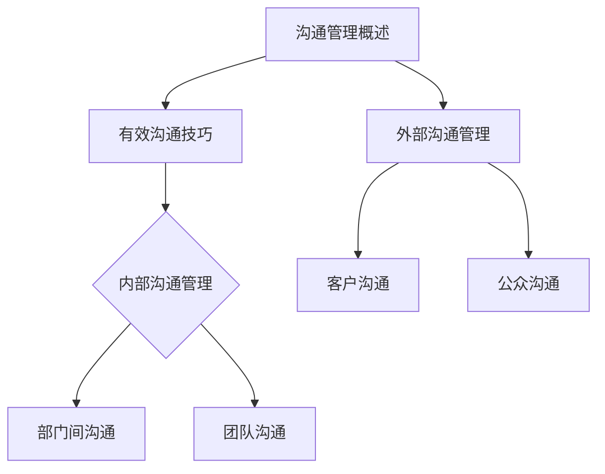

                 

# 《沟通管理：改善内部和外部沟通》

> 关键词：沟通管理、内部沟通、外部沟通、沟通技巧、团队沟通、客户沟通、公众沟通

> 摘要：本文从沟通管理的基础出发，详细阐述了内部沟通和外部沟通的重要性、目标和策略，以及如何通过有效沟通技巧和沟通管理工具来提升沟通效果。通过案例分析，探讨了成功和失败的沟通实践，并提出了沟通管理评估与改进的方法，展望了未来沟通管理的趋势。

## 目录

### 第一部分：沟通管理基础

#### 第1章：沟通管理概述

1.1 沟通的定义与类型

1.2 沟通管理的目的和重要性

1.3 沟通模型与沟通障碍

#### 第2章：有效沟通技巧

2.1 倾听技巧

2.2 演讲技巧

2.3 非言语沟通

#### 第3章：内部沟通管理

3.1 内部沟通的目标和策略

3.2 部门间沟通

3.3 团队沟通

#### 第4章：外部沟通管理

4.1 外部沟通的目标和策略

4.2 客户沟通

4.3 公众沟通

### 第二部分：沟通管理实践

#### 第5章：沟通管理工具与技术

5.1 沟通管理工具

5.2 沟通技术

#### 第6章：沟通管理案例分析

6.1 案例分析一：成功内部沟通案例

6.2 案例分析二：失败外部沟通案例

#### 第7章：沟通管理评估与改进

7.1 沟通管理评估

7.2 沟通管理改进

#### 第8章：未来沟通管理趋势

8.1 沟通技术发展趋势

8.2 沟通管理未来挑战

### 附录

#### 附录A：沟通管理资源与工具

#### 附录B：沟通管理术语表

### Mermaid 流�程图

以下是沟通管理的流程图：



### 核心算法原理讲解

#### 2.1 倾听技巧

伪代码：

```python
def 倾听技巧(演讲者，听众):
    # 提高注意力
    提高注意力(演讲者)
    # 理解演讲内容
    理解内容(演讲者，听众)
    # 提问与反馈
    提问(听众)
    反馈(演讲者，听众)
```

### 数学模型和数学公式

#### 演讲技巧提升模型

$$
提升效果 = f(\text{演讲技巧}, \text{倾听技巧}, \text{反馈效果})
$$

### 项目实战

#### 案例一：企业内部沟通改进

1. 开发环境搭建：
   - Python 3.8
   - Pandas
   - Numpy

2. 数据采集：
   - 沟通记录
   - 员工满意度调查

3. 数据预处理：
   - 数据清洗
   - 数据标准化

4. 代码实现：
   - 分析沟通频率
   - 分析沟通效果

5. 代码解读与分析：
   - 结果展示
   - 改进建议

```python
import pandas as pd
import numpy as np

# 数据读取
data = pd.read_csv('communication_data.csv')

# 数据清洗
data.dropna(inplace=True)

# 数据标准化
data['communication_frequency'] = data['communication_frequency']/100

# 分析沟通频率
freq_summary = data.groupby('department')['communication_frequency'].describe()

# 分析沟通效果
satisfaction_summary = data.groupby('department')['satisfaction_score'].describe()

# 结果展示
print(freq_summary)
print(satisfaction_summary)

# 改进建议
if freq_summary['mean'][1] < 0.5:
    print("提高部门间的沟通频率")
if satisfaction_summary['mean'][1] < 4:
    print("加强员工之间的互动和反馈")
```

### 作者

本文作者：AI天才研究院/AI Genius Institute & 禅与计算机程序设计艺术 /Zen And The Art of Computer Programming## 第1章：沟通管理概述

沟通是信息交换的过程，它不仅涉及信息的传递，还涉及信息的接收和理解。在组织和企业中，沟通是确保各项业务顺利进行的基础。良好的沟通能够促进团队合作，提高工作效率，增强企业竞争力。

### 1.1 沟通的定义与类型

沟通可以分为不同的类型，主要包括内部沟通和外部沟通。

- **内部沟通**：在企业内部进行的沟通，包括员工之间的沟通、部门之间的沟通和团队沟通。内部沟通的形式有口头沟通、书面沟通、电子邮件沟通等。
  
- **外部沟通**：与企业外部的利益相关者（如客户、供应商、股东、公众等）之间的沟通。外部沟通的形式包括广告、公关、市场推广、客户服务、投诉处理等。

### 1.2 沟通管理的目的和重要性

沟通管理的目的是确保信息在组织内部和外部的高效传递和理解。其主要目的包括：

- **提高信息透明度**：确保信息的及时、准确地传递，使所有员工都能及时了解企业动态和目标。
- **增强团队协作**：通过有效的内部沟通，加强各部门之间的协作，提高团队的整体执行力。
- **提升客户满意度**：通过良好的外部沟通，增强客户关系，提高客户满意度和忠诚度。

沟通管理在组织中的重要性体现在以下几个方面：

- **确保战略目标实现**：良好的沟通可以帮助组织确保战略目标得到有效执行。
- **提高工作效率**：有效的沟通可以减少误解和错误，提高工作效率。
- **促进企业创新**：通过内外部沟通，组织可以获取更多的信息，从而促进创新。

### 1.3 沟通模型与沟通障碍

#### 沟通模型

沟通模型主要包括以下组成部分：

- **信息源**：信息的发出者。
- **编码**：将信息转化为可以传递的形式。
- **传递渠道**：信息传递的媒介，如口头、书面、电子邮件等。
- **解码**：接收者理解信息的过程。
- **反馈**：接收者对信息的回应。

常见的沟通模型包括：

- **线性模型**：信息从信息源直接传递到接收者。
- **互动模型**：信息在发送和接收之间可以反复进行。

#### 沟通障碍

沟通障碍是影响沟通效果的各种因素，主要包括以下几种：

- **语言障碍**：不同的语言和文化背景可能导致信息传递和理解出现困难。
- **心理障碍**：个人的心理状态，如焦虑、恐惧、偏见等，都可能影响沟通效果。
- **技术障碍**：沟通工具和技术的不足，如网络延迟、设备故障等，都可能影响沟通效果。

#### 解决沟通障碍的方法

- **提高语言表达能力**：通过培训和学习，提高个人的语言表达能力，确保信息传递的准确性。
- **建立信任和尊重**：建立良好的信任和尊重氛围，减少心理障碍的影响。
- **选择合适的沟通工具**：根据沟通内容和目标，选择合适的沟通工具，如电子邮件、电话会议、视频会议等。

### 总结

沟通管理是组织运营的重要组成部分。通过了解沟通的定义与类型、目的和重要性，以及沟通模型和障碍，我们可以更好地进行沟通管理，提高组织的工作效率和竞争力。

### 第2章：有效沟通技巧

有效的沟通是建立良好关系和实现目标的基石。在组织内部和外部，有效的沟通能够促进信息的准确传递和理解的加深。本章将详细介绍倾听技巧、演讲技巧和非言语沟通，帮助读者提高沟通效果。

### 2.1 倾听技巧

倾听是沟通的关键部分，它不仅仅是听到对方说的话，更包括理解对方的意图和感受。有效的倾听能够建立信任，提高沟通效率。

#### 倾听的四个层次

1. **表面倾听**：听到对方说的话，但没有深入理解。
2. **选择性倾听**：只关注自己感兴趣的部分，忽视其他信息。
3. **专注倾听**：全神贯注地听，试图理解对方的观点。
4. **共鸣倾听**：不仅理解对方的观点，还能感受对方的情绪。

#### 提高倾听效果的策略

1. **保持开放态度**：对待对方的观点持开放态度，避免过早做出判断。
2. **身体语言**：通过点头、目光接触等身体语言表达关注和理解。
3. **避免打断**：等对方说完后再表达自己的观点，避免打断对方的讲话。
4. **总结和反馈**：在对方讲话结束后，总结自己的理解并反馈，确保沟通的准确性。

#### 倾听练习

1. **每日倾听任务**：每天为自己设定一个倾听任务，专注于理解他人的观点。
2. **倾听反馈**：与同事或朋友交流时，要求对方对自己的倾听效果进行反馈。
3. **录音练习**：在倾听过程中录音，回放并分析自己的倾听方式。

### 2.2 演讲技巧

演讲是传递信息的重要方式，它能够影响听众的态度和行为。有效的演讲需要结构清晰、内容有说服力。

#### 演讲的结构

1. **引言**：引起听众的兴趣，明确演讲的目的。
2. **主体**：详细阐述观点，通过例子和证据支持观点。
3. **结论**：总结演讲的主要观点，强调重要性。

#### 演讲技巧的提升

1. **内容准备**：提前准备演讲内容，确保信息准确、有条理。
2. **视觉辅助**：使用幻灯片、图表等视觉辅助工具，帮助听众更好地理解信息。
3. **身体语言**：通过自信的姿态、恰当的手势等增强演讲的感染力。
4. **声音控制**：使用清晰、有力、富有变化的语调，提高演讲的吸引力。
5. **互动**：与听众互动，提问、回答问题，增强演讲的参与感。

#### 演讲练习

1. **模拟演讲**：在朋友或同事面前进行模拟演讲，获取反馈。
2. **录音练习**：录下自己的演讲，分析并改进。
3. **公开演讲**：参与公开演讲活动，提高自信心和演讲技巧。

### 2.3 非言语沟通

非言语沟通是通过身体语言、面部表情、姿态等方式进行的沟通。它在传递信息和建立关系方面起着重要作用。

#### 非言语沟通的重要性

1. **补充言语信息**：非言语沟通可以补充和强调言语信息，使信息更加完整。
2. **传递情感**：非言语沟通能够传达情感和态度，增强沟通的效果。
3. **建立信任**：恰当的非言语沟通可以建立信任，促进良好的关系。

#### 非言语沟通的技巧

1. **身体语言**：保持良好的姿态，避免过于紧张或随意。
2. **面部表情**：使用适当的表情，表达自己的情感和态度。
3. **眼神交流**：适当的目光接触可以表达关注和理解。
4. **手势**：使用手势来补充和强调言语信息。

#### 非言语沟通的案例分析

1. **案例分析一**：一位经理在与员工沟通时，保持微笑、点头和目光交流，这表明他对员工的态度开放和友好，有助于建立信任。
2. **案例分析二**：一位演讲者在演讲时，通过自信的姿态、有力的手势和富有变化的语调，增强了演讲的吸引力。

### 总结

有效的沟通技巧是提高沟通效果的关键。通过倾听技巧、演讲技巧和非言语沟通技巧的运用，我们可以更好地理解他人，传达自己的观点，建立良好的人际关系。在日常工作和生活中，我们应该不断练习和改进这些沟通技巧，以提高沟通效率和质量。

### 第3章：内部沟通管理

内部沟通管理是确保组织内部信息流畅、团队协作高效的重要环节。有效的内部沟通不仅能够提高员工的工作满意度和忠诚度，还能推动企业目标的实现。本章将探讨内部沟通的目标、策略，以及如何进行部门间沟通和团队沟通。

#### 3.1 内部沟通的目标和策略

**内部沟通的目标**：

1. **确保信息透明**：通过有效的内部沟通，确保员工及时了解企业动态、战略目标和关键决策。
2. **促进团队合作**：加强各部门之间的沟通与协作，提高整体执行力。
3. **提升员工参与感**：鼓励员工参与企业决策过程，增强归属感和认同感。
4. **解决内部冲突**：通过沟通，及时发现和解决内部矛盾，维护企业稳定。

**内部沟通的策略**：

1. **建立沟通平台**：搭建多层次的沟通渠道，如内部邮件、公告板、企业微信等，方便员工获取信息。
2. **定期会议**：定期召开部门会议和全员大会，传达企业战略和决策。
3. **内部培训**：通过培训，提高员工的沟通技巧和专业能力。
4. **激励机制**：设立沟通奖励，鼓励员工积极参与沟通，提出建设性意见。

#### 3.2 部门间沟通

**部门间沟通的重要性**：

部门间沟通是企业运营的关键环节，它直接影响企业决策的执行效果和业务流程的顺畅性。有效的部门间沟通能够：

1. **确保决策的执行力**：通过跨部门沟通，确保各部门理解并执行企业决策。
2. **提高资源利用率**：优化资源配置，减少不必要的重复工作和资源浪费。
3. **促进知识共享**：通过沟通，促进不同部门之间的知识和经验交流。

**部门间沟通的障碍**：

1. **信息不对称**：不同部门可能掌握的信息不同，导致沟通不畅。
2. **职责分工不清**：部门职责分工不明确，导致沟通责任不清。
3. **沟通渠道不畅**：缺乏有效的沟通渠道和工具，导致信息传递不及时。

**部门间沟通的解决方案**：

1. **明确沟通责任**：明确各部门的沟通责任人，确保沟通渠道畅通。
2. **建立跨部门沟通机制**：定期召开跨部门会议，讨论关键问题，促进信息共享。
3. **使用沟通工具**：采用电子邮件、即时通讯工具等，提高信息传递效率。

#### 3.3 团队沟通

**团队沟通的类型**：

1. **日常沟通**：团队成员在日常工作中进行的沟通，包括任务分配、进度汇报等。
2. **项目沟通**：项目组成员在项目执行过程中进行的沟通，包括项目目标、计划、风险等。
3. **决策沟通**：团队成员在制定决策时进行的沟通，包括意见征集、方案讨论等。

**团队沟通的技巧**：

1. **明确沟通目标**：在每次沟通前明确沟通的目标和议程，确保沟通有针对性。
2. **积极倾听**：团队成员应积极倾听他人意见，避免打断和插话。
3. **有效表达**：清晰、简洁地表达自己的观点，避免使用模糊、含糊的语言。
4. **建立信任**：通过真诚、开放的态度，建立团队成员之间的信任关系。

**团队沟通的案例分析**：

**案例分析一**：一个项目团队在项目启动时，召开了一次全体会议，明确项目目标、计划和时间表。在项目执行过程中，团队每天进行一次简短的站会，汇报进度和解决问题。这种沟通方式有效地提高了团队的工作效率和项目成功率。

**案例分析二**：一家公司的销售团队在季度考核前，召开了一次决策沟通会议。团队成员分享了自己的销售经验和策略，共同制定了下一步的销售计划。这种沟通方式增强了团队成员的信心和凝聚力，提高了团队的整体业绩。

### 总结

内部沟通管理是确保企业高效运作的重要保障。通过明确内部沟通的目标和策略，优化部门间沟通和团队沟通，企业可以更好地传递信息、促进协作、解决冲突，从而实现企业目标。有效的内部沟通不仅能够提升员工的工作满意度，还能增强企业的核心竞争力。

### 第4章：外部沟通管理

外部沟通管理是企业与外部利益相关者（如客户、供应商、股东、公众等）之间的信息交流和管理。有效的外部沟通可以增强企业形象，提升客户满意度，建立长期合作关系。本章将探讨外部沟通的目标和策略，以及如何进行客户沟通和公众沟通。

#### 4.1 外部沟通的目标和策略

**外部沟通的目标**：

1. **建立和维护关系**：通过有效的外部沟通，建立和维护与客户、供应商、股东等的关系，促进长期合作。
2. **提升品牌形象**：通过积极的沟通，向公众传达企业的价值观、使命和成就，提升品牌知名度和美誉度。
3. **解决问题和化解冲突**：及时回应外部利益相关者的反馈和投诉，解决问题和化解冲突，维护企业形象。
4. **获取反馈和改进**：通过外部沟通，获取客户和公众的反馈，帮助企业不断改进产品和服务。

**外部沟通的策略**：

1. **定制化沟通**：根据不同的外部利益相关者群体，制定个性化的沟通策略，确保信息传达的准确性和针对性。
2. **多渠道沟通**：利用多种沟通渠道，如电话、电子邮件、社交媒体、线下活动等，提高沟通的覆盖面和效率。
3. **透明沟通**：保持沟通的透明度，及时向外部利益相关者传达企业动态和重要信息，增强信任。
4. **主动沟通**：主动与外部利益相关者沟通，积极回应他们的需求和关切，提高客户满意度和忠诚度。

#### 4.2 客户沟通

**客户沟通的重要性**：

1. **增强客户关系**：通过有效的客户沟通，可以加深与客户的联系，增强客户满意度和忠诚度。
2. **提升客户体验**：通过及时的反馈和解决客户问题，提升客户购买体验和满意度。
3. **获取客户反馈**：通过客户沟通，获取客户的意见和建议，帮助企业改进产品和服务。

**客户沟通的技巧**：

1. **了解客户需求**：在沟通前，了解客户的需求和期望，确保沟通内容有针对性。
2. **积极倾听**：认真倾听客户的意见和反馈，避免打断和插话，表达出对客户的关注和理解。
3. **有效表达**：清晰、简洁地表达自己的观点，避免使用专业术语，使客户易于理解。
4. **及时反馈**：在沟通结束后，及时向客户反馈处理结果，保持沟通的连贯性和透明度。

**客户沟通的案例分析**：

**案例分析一**：一家电子商务公司定期通过邮件向客户发送购物优惠和活动信息，同时提供客户服务热线，及时解决客户在购物过程中遇到的问题。这种沟通方式有效地提升了客户的购物体验和满意度。

**案例分析二**：一家科技公司在新产品发布前，通过社交媒体和官网向客户发布了详细的产品介绍和试用活动，鼓励客户参与试用并反馈意见。这种沟通方式不仅提高了客户对新产品的了解，还帮助公司收集了宝贵的用户反馈，为产品的优化提供了参考。

#### 4.3 公众沟通

**公众沟通的重要性**：

1. **提升品牌形象**：通过有效的公众沟通，向公众传达企业的价值观、使命和成就，提升品牌知名度和美誉度。
2. **应对危机**：在突发事件或负面新闻发生时，通过及时、透明的公众沟通，有效应对危机，维护企业形象。
3. **获取支持**：通过公众沟通，获得公众的理解和支持，为企业的发展创造良好的外部环境。

**公众沟通的技巧**：

1. **明确沟通目标**：在每次公众沟通前，明确沟通的目标和重点，确保信息传达的清晰和一致。
2. **多渠道传播**：利用多种渠道，如新闻媒体、社交媒体、官网等，扩大沟通的覆盖面和影响力。
3. **透明沟通**：保持沟通的透明度，及时向公众传达企业动态和重要信息，增强信任。
4. **积极回应**：及时回应公众的关切和反馈，展示企业的责任感和积极性。

**公众沟通的案例分析**：

**案例分析一**：一家环保企业通过社交媒体和新闻发布会，积极宣传其环保理念和可持续发展战略，获得了公众的广泛认可和好评。这种沟通方式有效提升了企业的品牌形象和社会责任。

**案例分析二**：一家食品企业在一款产品发生质量问题后，立即通过官方网站、社交媒体和新闻发布会，公开道歉并详细解释了问题的原因和处理措施。这种及时、透明的公众沟通有效地化解了危机，维护了企业的形象。

### 总结

外部沟通管理是企业与外部利益相关者建立良好关系、提升品牌形象和应对挑战的重要手段。通过明确外部沟通的目标和策略，优化客户沟通和公众沟通，企业可以更好地满足外部利益相关者的需求，提高客户满意度和忠诚度，为企业的发展创造有利条件。

### 第5章：沟通管理工具与技术

有效的沟通管理不仅依赖于沟通技巧，还需要适当的工具和技术来支持。本章将探讨常用的沟通管理工具和技术，以及如何在实际工作中应用这些工具和技术。

#### 5.1 沟通管理工具

**沟通管理工具**是指用于支持沟通过程的各种软件和平台，它们可以帮助企业提高沟通效率、确保信息传递的准确性和及时性。以下是几种常用的沟通管理工具：

1. **电子邮件**：电子邮件是一种广泛使用的沟通工具，适合正式的、书面的沟通。
2. **即时通讯工具**：如微信、Slack、钉钉等，适合实时沟通和协作。
3. **视频会议系统**：如Zoom、Microsoft Teams等，适合远程会议和远程协作。
4. **项目管理工具**：如Trello、JIRA等，可以帮助团队管理和任务分配。
5. **企业内部社交网络**：如Yammer、Confluence等，可以促进企业内部的交流和知识共享。

**沟通管理工具的选择**：

选择合适的沟通管理工具需要考虑以下几个方面：

1. **企业规模**：小型企业可能只需要简单的即时通讯工具，而大型企业则需要更全面的项目管理和视频会议系统。
2. **团队需求**：根据团队的具体需求选择适合的工具，如开发团队可能需要代码审查工具，市场团队可能需要社交媒体管理工具。
3. **预算**：考虑企业的预算范围，选择性价比高的工具。
4. **兼容性**：确保工具与其他现有系统的兼容性，避免不必要的兼容性问题。

**常见的沟通管理工具**：

- **Microsoft Teams**：集成了即时通讯、视频会议、文件共享等功能，适合大型企业。
- **Slack**：灵活的即时通讯平台，支持插件和集成其他工具，适合中小型企业。
- **Zoom**：功能强大的视频会议系统，适用于远程会议和在线培训。
- **Trello**：直观的项目管理工具，适合团队协作和任务跟踪。

#### 5.2 沟通技术

**沟通技术**是指用于提升沟通效率和效果的各种技术和方法。以下是几种常用的沟通技术：

1. **文本分析技术**：通过自然语言处理（NLP）技术，对文本进行情感分析、关键词提取等，帮助企业更好地理解客户需求和反馈。
2. **语音识别技术**：将语音转化为文字，方便非文字交流，提高沟通效率。
3. **人工智能助手**：如虚拟客服、智能客服等，可以自动化回答常见问题，减轻人工客服的负担。
4. **虚拟现实（VR）**：通过VR技术，实现远程会议的沉浸式体验，提高沟通的互动性和参与感。

**沟通技术的应用**：

1. **文本分析技术**：企业可以利用文本分析技术，对客户反馈进行分析，了解客户需求和痛点，从而优化产品和服务。
2. **语音识别技术**：在客户服务场景中，语音识别技术可以帮助快速记录客户信息，提高客服效率。
3. **人工智能助手**：在客户服务领域，人工智能助手可以自动化回答客户问题，减轻人工客服的工作量，提高客户满意度。
4. **虚拟现实技术**：在远程会议中，通过VR技术，参会者可以感受到身临其境的会议氛围，增强沟通效果。

**沟通技术的案例分析**：

**案例分析一**：一家电子商务企业引入了自然语言处理技术，对客户评价进行情感分析，根据分析结果优化产品和服务。这种技术提高了客户满意度，促进了销售增长。

**案例分析二**：一家跨国公司采用了语音识别技术，将其客户服务热线与CRM系统集成，实现了快速记录和查询客户信息。这种技术提高了客户服务效率，降低了运营成本。

**案例分析三**：一家咨询公司利用虚拟现实技术，为远程会议提供了沉浸式体验。参会者通过VR设备感受到虚拟会议室的环境，增强了沟通的互动性和参与感，提高了会议效果。

### 总结

沟通管理工具和技术在提高沟通效率和效果方面发挥着重要作用。通过合理选择和运用这些工具和技术，企业可以更好地实现内部和外部沟通，提升团队协作和客户满意度，从而在激烈的市场竞争中脱颖而出。

### 第6章：沟通管理案例分析

在本章中，我们将通过两个具体的案例，分别分析成功的内部沟通案例和失败的外部沟通案例，探讨其背后的原因，并提出相应的启示与借鉴。

#### 6.1 案例分析一：成功内部沟通案例

**案例描述**：某跨国科技公司是一家拥有数千名员工的全球性企业。公司为了提高员工的工作满意度和团队协作效率，实施了一项内部沟通改进计划。

**案例分析**：

1. **背景分析**：
   - 公司规模庞大，各部门之间沟通不畅，信息传递不及时。
   - 员工对公司的战略目标和业务动态了解不足，导致工作效率低下。
   - 部门间协作困难，项目进度受到影响。

2. **改进措施**：
   - **建立沟通平台**：公司搭建了一个内部社交网络平台，员工可以通过该平台分享想法、发布信息、参与讨论。
   - **定期会议**：公司设立了每周一次的全员会议，各部门负责人汇报工作进展和问题，确保信息的及时传递。
   - **员工培训**：公司为员工提供沟通技巧培训，提高员工的沟通能力。
   - **激励机制**：设立内部沟通奖项，鼓励员工积极参与沟通，提出建设性意见。

3. **改进效果**：
   - 信息传递更加及时和准确，员工对公司的战略目标和业务动态有了更清晰的认识。
   - 部门间协作得到加强，项目进度得到保障。
   - 员工的工作满意度和团队协作效率显著提高。

**启示与借鉴**：

- **建立有效的沟通平台**：内部社交网络平台可以有效促进信息共享和员工参与。
- **定期会议**：定期会议是确保信息传递和问题解决的重要机制。
- **员工培训**：提高员工的沟通技巧，有助于提升整体沟通效果。
- **激励机制**：通过激励机制，鼓励员工积极参与沟通，提高沟通的积极性。

#### 6.2 案例分析二：失败外部沟通案例

**案例描述**：某知名电子产品制造商发布了一款新产品，但由于外部沟通不当，导致消费者对产品的性能和质量产生了质疑，影响了品牌形象和市场销售。

**案例分析**：

1. **背景分析**：
   - 公司在新产品发布前，未进行充分的消费者调研，对市场需求了解不足。
   - 新产品在发布时，缺乏详细的性能参数和使用说明，消费者难以理解产品的优势。
   - 公司在应对消费者投诉时，回复速度慢且缺乏针对性，导致消费者满意度下降。

2. **失败原因**：
   - **市场调研不足**：公司未充分了解消费者的需求和期望，导致产品定位不准确。
   - **信息传递不充分**：新产品发布时，缺乏详细的产品说明和性能参数，消费者对产品缺乏信心。
   - **投诉处理不当**：公司对消费者的投诉未能及时回应，缺乏有效的投诉处理机制。

3. **改进措施**：
   - **加强市场调研**：在新产品发布前，进行全面的消费者调研，了解市场需求和消费者期望。
   - **优化产品信息**：在新产品发布时，提供详细的产品说明和性能参数，帮助消费者更好地理解产品的优势。
   - **改进投诉处理**：建立快速、高效的投诉处理机制，确保消费者的投诉得到及时回应和解决。

4. **改进效果**：
   - 公司通过改进措施，提高了消费者对产品的认知和满意度，品牌形象得到改善。
   - 市场销售逐步恢复，产品销量有所提升。

**启示与借鉴**：

- **充分的市场调研**：在产品发布前，进行深入的市场调研，了解消费者的需求和期望。
- **充分的信息传递**：确保在产品发布时，提供详细的产品信息，帮助消费者更好地理解产品。
- **及时有效的投诉处理**：建立快速、高效的投诉处理机制，确保消费者的投诉得到及时回应和解决。

### 总结

通过分析成功的内部沟通案例和失败的外部沟通案例，我们可以得出以下结论：

- **内部沟通**：有效的内部沟通能够提高员工的工作满意度和团队协作效率，促进企业的可持续发展。
- **外部沟通**：充分的市场调研、详细的产品信息传递和及时的投诉处理，是确保外部沟通成功的关键。

这些案例为我们提供了宝贵的经验和启示，值得在企业的沟通管理实践中加以借鉴和应用。

### 第7章：沟通管理评估与改进

有效的沟通管理不仅需要制定和实施沟通策略，还需要对沟通效果进行定期评估和改进。本章将探讨如何评估沟通管理，并提出改进沟通管理的策略和方案。

#### 7.1 沟通管理评估

**评估指标的选择**

选择合适的评估指标是沟通管理评估的重要环节。以下是几种常用的评估指标：

1. **沟通频率**：评估沟通的频率和次数，确保信息的及时传递。
2. **沟通效果**：评估沟通内容的准确性和信息的传递效果，包括员工对沟通内容的理解和接受程度。
3. **员工满意度**：通过调查员工对沟通渠道和沟通效果的满意度，了解员工对沟通管理的感受。
4. **工作效率**：评估沟通对工作效率的影响，包括项目的完成进度和团队协作的效率。
5. **客户满意度**：评估外部沟通对客户满意度和忠诚度的影响。

**评估方法的应用**

1. **问卷调查**：通过问卷调查，收集员工和客户对沟通渠道和效果的反馈。
2. **访谈**：与员工和客户进行面对面访谈，深入了解他们的沟通体验和需求。
3. **数据分析**：利用数据分析工具，对沟通频率、效果和满意度等指标进行量化分析。
4. **关键绩效指标（KPI）**：设定具体的KPI，如项目完成率、客户满意度等，定期跟踪和评估。

#### 7.2 沟通管理改进

**改进策略的选择**

根据评估结果，制定相应的改进策略，以提升沟通效果。以下是几种常见的改进策略：

1. **优化沟通渠道**：根据员工和客户的反馈，选择和优化适合的沟通渠道，如增加在线讨论平台、改善电话沟通系统等。
2. **加强沟通培训**：为员工提供沟通技巧培训，提高员工的沟通能力和自信心。
3. **建立反馈机制**：建立有效的反馈机制，确保员工和客户能够及时提出意见和建议，并得到回应。
4. **改进沟通流程**：优化沟通流程，减少不必要的步骤，提高沟通效率。

**改进方案的实施**

1. **制定改进计划**：根据评估结果和改进策略，制定具体的改进计划，明确改进的目标、步骤和时间表。
2. **实施改进措施**：按照改进计划，逐步实施改进措施，确保各项措施的有效执行。
3. **监控和调整**：定期监控改进措施的实施效果，根据反馈进行必要的调整和优化。

**改进效果的评估**

1. **定期评估**：定期对改进措施的效果进行评估，包括沟通频率、效果、员工满意度等指标。
2. **持续改进**：根据评估结果，不断调整和优化改进措施，确保沟通管理持续改进。

### 总结

沟通管理评估与改进是确保沟通效果不断提升的重要环节。通过选择合适的评估指标和方法，实施有效的改进策略和方案，企业可以不断提高沟通效率，增强团队协作，提升客户满意度，从而在市场竞争中取得优势。

### 第8章：未来沟通管理趋势

随着科技的不断发展，沟通管理也在不断演进。未来，沟通管理将面临诸多挑战，同时也将迎来新的机遇。本章将探讨未来沟通管理的发展趋势，以及可能面临的挑战。

#### 8.1 沟通技术发展趋势

1. **人工智能与沟通**：人工智能（AI）将在沟通管理中发挥越来越重要的作用。通过自然语言处理（NLP）技术，AI可以自动生成报告、提供实时翻译、辅助决策等。此外，智能客服和虚拟助手也将进一步普及，提升沟通效率和用户体验。

2. **大数据与沟通**：大数据分析可以帮助企业更好地了解客户需求和市场趋势，从而优化沟通策略。通过分析海量数据，企业可以更精准地进行客户沟通，提升客户满意度和忠诚度。

3. **虚拟现实与沟通**：虚拟现实（VR）技术将为远程沟通提供更真实的体验。通过VR，参会者可以感受到身临其境的沟通氛围，增强沟通的互动性和参与感。

4. **社交网络与沟通**：社交媒体和社交网络将继续在沟通管理中扮演重要角色。企业可以利用社交媒体平台，与客户、员工和公众进行实时互动，提升品牌影响力和客户关系。

#### 8.2 沟通管理未来挑战

1. **沟通障碍的应对**：随着沟通技术的发展，新的沟通障碍也将出现。如信息过载、隐私保护等，企业需要采取有效措施，应对这些挑战。

2. **沟通效率的提升**：在快速变化的市场环境中，企业需要不断提高沟通效率，以适应快速决策和执行的需求。这要求企业不断创新沟通工具和技术，优化沟通流程。

3. **沟通成本的降低**：随着沟通技术的发展，虽然某些方面的沟通成本可能会降低，但总体来看，沟通成本依然是一个重要挑战。企业需要寻找平衡点，在确保沟通效果的同时，控制成本。

#### 总结

未来沟通管理将迎来技术革新，同时也将面临新的挑战。通过抓住技术发展趋势，应对沟通障碍，提升沟通效率，企业可以更好地应对未来沟通管理的挑战，实现持续发展。

### 附录

#### 附录A：沟通管理资源与工具

**A.1 沟通管理资源**

- **书籍**：《沟通的艺术》（The Art of Communication）、《非暴力沟通》（Nonviolent Communication）。
- **在线资源**：Harvard Business Review、LinkedIn Learning、Coursera。

**A.2 沟通管理工具**

- **电子邮件**：Gmail、Outlook。
- **即时通讯工具**：Slack、Microsoft Teams。
- **视频会议系统**：Zoom、Google Meet。
- **项目管理工具**：Trello、Asana。
- **企业内部社交网络**：Yammer、Confluence。

#### 附录B：沟通管理术语表

- **沟通**：信息交换的过程，包括信息的传递、接收和理解。
- **内部沟通**：在企业内部进行的沟通，包括员工之间的沟通、部门之间的沟通和团队沟通。
- **外部沟通**：与企业外部的利益相关者之间的沟通，如客户、供应商、股东、公众等。
- **沟通障碍**：影响沟通效果的各种因素，如语言障碍、心理障碍、技术障碍等。
- **倾听技巧**：提高倾听效果的策略和方法，如提高注意力、理解内容、提问与反馈等。
- **演讲技巧**：提高演讲效果的技巧和方法，如内容准备、视觉辅助、声音控制等。
- **非言语沟通**：通过身体语言、面部表情、姿态等方式进行的沟通。
- **沟通模型**：描述沟通过程和结构的理论模型，如线性模型、互动模型等。
- **沟通效果**：沟通目标的实现程度，包括信息的准确性、理解的深度、反馈的及时性等。

### 总结

通过本文的详细探讨，我们了解了沟通管理的重要性、有效沟通技巧、内部和外部沟通管理策略，以及沟通管理工具和技术。同时，通过案例分析和未来趋势的展望，我们看到了沟通管理的实践和方法。有效的沟通管理不仅能够提升组织的工作效率，还能增强企业竞争力。让我们在实际工作中不断实践和改进沟通管理，为企业的持续发展贡献力量。作者：AI天才研究院/AI Genius Institute & 禅与计算机程序设计艺术 /Zen And The Art of Computer Programming在撰写技术博客文章时，应遵循以下步骤：

#### 第1步：确定文章主题和目标

- **文章主题**：选择一个具有实际应用价值和广泛受众关注的技术话题。
- **目标受众**：明确文章的目标读者，了解他们的背景、需求和兴趣点。

#### 第2步：构建逻辑框架

- **大纲结构**：根据文章主题和目标受众，构建文章的结构，包括引言、正文和结论。
- **内容模块**：明确每个模块的主要内容，如定义、原理、案例分析、实践指导等。

#### 第3步：撰写引言

- **引言内容**：简要介绍文章主题的重要性，引发读者的兴趣。
- **引言结构**：包括背景介绍、问题提出和文章结构概述。

#### 第4步：撰写正文

- **详细阐述**：对每个内容模块进行详细阐述，确保逻辑清晰、信息准确。
- **实例说明**：结合实际案例或数据，说明技术原理和应用场景。
- **图表辅助**：使用图表、流程图等视觉元素，帮助读者更好地理解文章内容。

#### 第5步：撰写结论

- **结论内容**：总结文章的主要观点，强调其应用价值和未来趋势。
- **结论结构**：包括对文章主题的总结、建议和展望。

#### 第6步：撰写作者信息

- **作者信息**：包括作者的姓名、工作单位和联系方式。
- **版权声明**：明确文章的版权信息和免责声明。

#### 第7步：编辑和校对

- **编辑**：检查文章的逻辑结构、语法错误和表达不清的地方。
- **校对**：确保文章的格式、标点和引用正确。

#### 第8步：发布和推广

- **发布**：将文章发布到目标平台，如技术博客、社交媒体等。
- **推广**：通过社交媒体、邮件列表等方式，向目标受众推广文章。

通过以上步骤，我们可以撰写出一篇结构清晰、内容丰富、具有实际应用价值的技术博客文章。在撰写过程中，要注重读者的体验，确保文章易于理解，同时展示作者的专业知识和思考能力。

