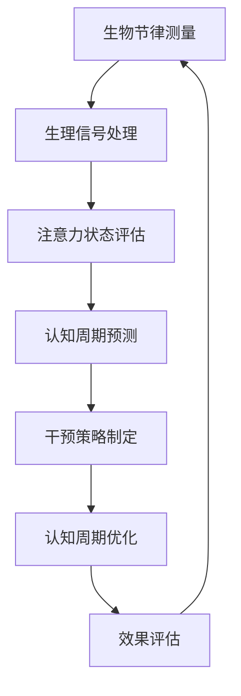
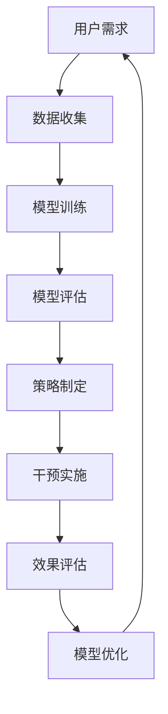

                 

# 注意力的生物节律：AI优化的认知周期

## 关键词

- 生物节律
- 注意力
- AI优化
- 认知周期
- 深度学习
- 数学模型
- 教育应用
- 工作效率

## 摘要

本文探讨了注意力的生物节律与认知周期的关系，并引入了人工智能技术来优化认知周期。首先，我们介绍了注意力与生物节律的基本概念，阐述了它们之间的相互作用。接着，我们介绍了认知周期的原理，并讨论了如何通过深度学习与数学模型来优化认知周期。文章还通过实际项目案例，展示了如何将AI技术应用于认知周期的优化。最后，我们讨论了这一领域的研究总结和未来发展趋势，为读者提供了深入的见解。

## 目录

### 《注意力的生物节律：AI优化的认知周期》目录大纲

#### 第一部分：引言
1. **背景与意义**
   - 注意力生物节律的研究背景
   - AI与认知周期的结合意义

2. **研究方法与框架**
   - 生物节律的测量方法
   - AI技术在认知周期优化中的应用

#### 第二部分：基础理论
3. **注意力与生物节律**
   - 注意力的定义与类型
   - 生物节律的基本原理
   - 注意力与生物节律的关系

4. **认知周期的原理**
   - 认知周期的定义与结构
   - 认知周期的主要阶段
   - 认知周期与生物节律的相互作用

#### 第三部分：核心算法
5. **深度学习与注意力机制**
   - 深度学习基础
   - 注意力机制原理
   - 常见的注意力模型

6. **AI优化策略**
   - 机器学习优化算法
   - AI在认知周期优化中的应用策略

7. **Mermaid 流程图**
   - 注意力与生物节律的交互流程
   - AI优化认知周期的实现流程

#### 第四部分：数学模型与公式
8. **注意力模型数学描述**
   - 注意力权重计算公式
   - 认知周期变化率模型

9. **公式推导与解释**
   - 公式推导步骤
   - 公式在实际应用中的意义

#### 第五部分：项目实战
10. **认知周期优化项目案例**
    - 项目背景
    - 项目目标
    - 项目实施过程

11. **代码实战与解读**
    - 开发环境搭建
    - 代码实现与解读
    - 代码分析与优化

#### 第六部分：应用领域
12. **教育领域应用**
    - 学生的注意力跟踪与干预
    - 教学策略优化

13. **工作领域应用**
    - 工作效率与注意力管理
    - 人力资源优化

#### 第七部分：总结与展望
14. **研究总结**
    - 主要发现与贡献
    - 研究中的局限性与挑战

15. **未来发展趋势**
    - 注意力与认知周期研究的未来方向
    - AI在认知周期优化中的应用前景

#### 附录
16. **参考文献**
    - 引用书籍与论文列表

17. **代码与数据集**
    - 代码仓库链接
    - 数据集下载链接

### 第一部分：引言

#### 1.1 背景与意义

**注意力生物节律的研究背景**

注意力是认知心理学中一个重要的概念，它决定了我们如何选择性地关注和处理外部和内部信息。生物节律是指生物体在生理和行为上呈现出的周期性变化，如昼夜节律、月经周期等。近年来，研究者们开始关注注意力与生物节律之间的关系，试图通过理解这种关系来优化人类的行为和认知表现。

在认知心理学中，注意力可以分为选择性注意力、分配性注意力和持续性注意力。选择性注意力是指我们在面对多个刺激时，选择性地关注其中的一部分。分配性注意力是指我们在同时处理多个任务时，如何合理分配注意力资源。持续性注意力是指我们如何在一段时间内保持对某一特定任务的注意力。

生物节律是由基因调控的内在时间表，影响着人体的生理和心理状态。例如，昼夜节律控制着我们的睡眠和清醒状态，而月经周期则影响着女性的情绪和行为。这些生物节律不仅与我们的健康密切相关，还直接影响我们的认知能力。

**AI与认知周期的结合意义**

人工智能（AI）技术的发展为认知周期的优化提供了新的手段。通过AI技术，我们可以实现对注意力生物节律的精确测量和分析，从而实现个性化的认知周期优化。AI技术可以帮助我们更好地理解注意力与生物节律之间的关系，进而设计出更有效的干预策略。

例如，在教育领域，AI可以帮助教师实时监控学生的注意力状态，并在学生注意力下降时提供适当的提醒或调整教学内容。在工作领域，AI可以帮助员工优化工作安排，提高工作效率，减少疲劳。

总之，注意力生物节律的研究与AI技术的结合，不仅有助于提高人类的生活质量，还为人工智能在认知科学领域的应用提供了新的思路。

#### 1.2 研究方法与框架

**生物节律的测量方法**

测量生物节律的方法主要包括生理测量和行为测量。生理测量通常使用各种传感器来记录生物体内的生理信号，如心率、体温、皮肤电活动等。这些生理信号可以反映生物节律的状态和变化。

行为测量则通过观察和分析个体在不同时间段的行为模式，来推断其生物节律。例如，研究者可以通过记录个体的睡眠时间、活动时间等，来分析其昼夜节律。

**AI技术在认知周期优化中的应用**

AI技术在认知周期优化中的应用主要体现在以下几个方面：

1. **数据采集与预处理**

   AI技术可以收集大量的生理和行为数据，如心率、睡眠模式、学习行为等。这些数据经过预处理后，可以用于后续的分析和建模。

2. **特征提取与建模**

   通过深度学习算法，可以从原始数据中提取出有用的特征，如注意力水平、情绪状态等。这些特征可以用于构建认知周期的模型。

3. **预测与优化**

   基于训练好的模型，AI技术可以预测个体的认知周期状态，并提供优化建议。例如，在学生注意力下降时，AI可以自动调整教学内容或提醒学生休息。

4. **个性化干预**

   通过对个体的生物节律和认知周期的了解，AI技术可以设计出个性化的干预策略，帮助个体更好地管理注意力，提高认知效率。

**研究框架**

本研究采用以下框架来探究注意力生物节律与认知周期的优化：

1. **数据采集与预处理**

   收集学生的生理信号（如心率、皮肤电活动）和学习行为数据（如学习时长、学习内容等）。

2. **特征提取与建模**

   使用深度学习算法提取注意力水平和情绪状态等特征，并构建认知周期的预测模型。

3. **预测与优化**

   利用训练好的模型预测学生的认知周期状态，并根据预测结果提供个性化的干预策略。

4. **效果评估**

   通过实验评估干预策略的效果，收集学生的反馈，并对模型和策略进行优化。

### 第二部分：基础理论

#### 3.1 注意力与生物节律

**注意力的定义与类型**

注意力是一种心理资源，用于选择性地关注和处理外部和内部信息。它决定了我们在面对多个刺激时，哪些信息会进入我们的意识，哪些会被忽视。

根据不同的分类标准，注意力可以分为多种类型。常见的分类包括：

1. **选择性注意力**：指在多个刺激中，选择性地关注某一特定刺激，而忽视其他刺激。

2. **分配性注意力**：指在同时处理多个任务时，如何合理分配注意力资源。

3. **持续性注意力**：指在一段时间内保持对某一特定任务的注意力。

**生物节律的基本原理**

生物节律是指生物体在生理和行为上呈现出的周期性变化。这些节律受到基因调控，是生物体内的一种内在时间表。

主要的生物节律包括：

1. **昼夜节律**：受光照和黑暗周期的影响，控制着我们的睡眠和清醒状态。

2. **月经周期**：女性生理上的周期性变化，影响情绪和行为。

3. **情绪节律**：个体情绪状态在不同时间点的波动。

**注意力与生物节律的关系**

注意力与生物节律之间存在密切的关系。生物节律会影响我们的注意力水平，而注意力状态也会反过来影响生物节律。

例如，昼夜节律会影响我们的注意力水平。在白天，我们的注意力通常较高，而在晚上，注意力水平会下降。这种昼夜节律对注意力的影响，被称为“注意力节律”。

此外，注意力状态也会影响生物节律。例如，高水平的注意力可以帮助我们更好地调整昼夜节律，使其更加符合我们的生活方式和工作需求。

**案例分析**

为了更好地理解注意力与生物节律的关系，我们可以看一个实际的案例。假设一名学生需要在白天进行学习，而他的昼夜节律使他更容易在晚上保持注意力。这种情况下，学生的注意力节律与昼夜节律之间存在冲突。为了解决这个问题，学生可以尝试调整学习时间，使其更符合自己的昼夜节律，或者通过调整生活方式，如增加白天活动的强度，来改善注意力节律。

通过以上分析，我们可以看到，注意力与生物节律之间的关系是复杂且多层次的。理解这种关系，对于优化个体的认知能力具有重要意义。

#### 3.2 认知周期的原理

**认知周期的定义与结构**

认知周期是指人类在进行认知活动时的周期性波动。这种波动不仅影响我们的注意力水平，还会影响我们的学习效率和工作表现。

认知周期通常包括以下主要阶段：

1. **注意集中期**：在这一阶段，个体的注意力高度集中，认知效率最高。个体能够快速理解和处理信息。

2. **疲劳期**：随着注意力的持续集中，个体逐渐进入疲劳期。在这一阶段，个体的注意力水平下降，认知效率降低。

3. **恢复期**：个体在恢复期中，通过休息和调整，恢复注意力和认知效率。这一阶段的长度和强度取决于个体的生物节律和注意力管理策略。

**认知周期的主要阶段**

1. **注意集中期**：在这一阶段，个体的注意力高度集中，大脑处于最佳工作状态。个体能够快速处理信息，做出准确的决策。注意集中期通常持续几分钟到几十分钟，取决于个体的注意力水平和任务的难度。

2. **疲劳期**：随着注意力的持续集中，个体的神经系统逐渐疲劳，认知效率开始下降。在这一阶段，个体可能会出现注意力分散、反应速度变慢等问题。疲劳期通常持续几分钟到几个小时，取决于个体的生物节律和注意力管理策略。

3. **恢复期**：个体在恢复期中，通过休息和调整，恢复注意力和认知效率。恢复期可以是短暂的，如几分钟的休息，也可以是长时间的，如几小时的睡眠。恢复期的长度和强度取决于个体的生物节律和注意力管理策略。

**认知周期与生物节律的相互作用**

认知周期与生物节律之间存在密切的相互作用。生物节律会影响认知周期的长度和强度，而认知周期也会反过来影响生物节律。

例如，昼夜节律会影响认知周期的波动。在白天，个体的认知周期通常较长，注意力水平较高。而在晚上，个体的认知周期通常较短，注意力水平较低。这种昼夜节律对认知周期的影响，被称为“认知节律”。

此外，认知周期也会影响生物节律。例如，通过合理地安排学习和工作时间，个体可以优化自己的认知周期，使其更符合自己的生物节律。这种通过认知周期来调整生物节律的方法，被称为“认知节律调整”。

**案例分析**

为了更好地理解认知周期与生物节律的相互作用，我们可以看一个实际的案例。假设一名学生需要在白天进行学习，而他的昼夜节律使他更容易在晚上保持注意力。这种情况下，学生的认知节律与昼夜节律之间存在冲突。为了解决这个问题，学生可以尝试调整学习时间，使其更符合自己的昼夜节律，或者通过调整生活方式，如增加白天活动的强度，来改善认知节律。

通过以上分析，我们可以看到，认知周期与生物节律之间的关系是复杂且多层次的。理解这种关系，对于优化个体的认知能力具有重要意义。

### 第三部分：核心算法

#### 3.1 深度学习与注意力机制

**深度学习基础**

深度学习是一种基于多层神经网络的学习方法，通过学习大量数据来提取特征和模式。深度学习在图像识别、自然语言处理、语音识别等领域取得了显著的成果。

深度学习的基本组成部分包括：

1. **神经元**：深度学习模型中的基本单元，用于计算和传递信息。

2. **层**：由多个神经元组成，负责从输入数据中提取特征。

3. **网络**：由多个层堆叠而成，用于处理和转换输入数据。

**注意力机制原理**

注意力机制是一种在信息处理过程中，根据重要性动态调整处理资源的机制。它通过计算注意力权重，调整输入信息的处理过程，从而提高模型的性能。

注意力机制的工作原理如下：

1. **计算注意力权重**：利用神经网络模型，根据上下文信息动态计算注意力权重。注意力权重表示输入信息的重要程度。

2. **调整信息处理过程**：根据注意力权重，调整输入信息的处理过程。重要信息会得到更多的关注和处理，而无关信息则被忽略。

**常见的注意力模型**

1. **自注意力（Self-Attention）**：自注意力机制可以同时考虑输入序列中的所有元素，计算每个元素对其他元素的影响。

2. **交互注意力（Interactive Attention）**：交互注意力机制结合了输入序列和查询序列，计算它们之间的交互注意力权重。

3. **多层注意力（Multi-layer Attention）**：多层注意力机制通过堆叠多个注意力层，逐步提取输入信息的特征。

#### 3.2 AI优化策略

**机器学习优化算法**

机器学习优化算法用于调整模型参数，以提高模型的性能。常见的优化算法包括：

1. **梯度下降（Gradient Descent）**：通过迭代更新模型参数，使损失函数最小化。

2. **随机梯度下降（Stochastic Gradient Descent，SGD）**：每次迭代使用一个样本或小批量样本来更新模型参数。

3. **Adam优化器**：结合了SGD和动量方法，适用于大规模数据集和深层网络。

**AI在认知周期优化中的应用策略**

AI在认知周期优化中的应用主要体现在以下几个方面：

1. **注意力权重调整**：通过计算注意力权重，调整认知周期中的注意力资源分配，优化注意力状态。

2. **认知周期预测**：利用深度学习模型，预测个体的认知周期状态，为干预提供依据。

3. **个性化干预**：根据个体的认知周期状态和需求，设计个性化的干预策略，优化认知周期。

**Mermaid 流程图**

以下是注意力与生物节律的交互流程：



以下是AI优化认知周期的实现流程：



通过以上算法和策略，我们可以实现对认知周期的优化，提高个体的认知能力和工作效率。

### 第四部分：数学模型与公式

#### 4.1 注意力模型数学描述

**注意力权重计算公式**

注意力权重是衡量输入信息重要性的指标，通常用数学公式表示。以下是一个常用的注意力权重计算公式：

$$
a_i = \frac{e^{u_i}}{\sum_{j=1}^{N} e^{u_j}}
$$

其中，$u_i$ 是第 $i$ 个输入单元的激活值，$N$ 是输入单元的总数，$a_i$ 是第 $i$ 个输入单元的注意力权重。这个公式通过指数函数将输入单元的激活值转换为概率分布，使得所有权重之和为1。

**认知周期变化率模型**

认知周期的变化可以用数学模型来描述。以下是一个常见的认知周期变化率模型：

$$
\frac{dC}{dt} = -\alpha \cdot (C - C_0)
$$

其中，$C$ 是认知周期的当前状态，$C_0$ 是认知周期的平衡状态，$\alpha$ 是衰减系数，$t$ 是时间。这个模型描述了认知周期在时间上的变化趋势，其中负号表示认知周期向平衡状态移动。

#### 4.2 公式推导与解释

**注意力权重计算公式推导**

注意力权重计算公式可以从以下几个方面进行推导：

1. **概率分布**：假设输入单元的激活值 $u_i$ 是一个实数，我们需要将其转换为概率分布。为了实现这一点，我们可以使用指数函数：

   $$
   p_i = \frac{1}{Z} e^{u_i}
   $$

   其中，$Z = \sum_{j=1}^{N} e^{u_j}$ 是一个归一化常数，确保所有概率之和为1。

2. **归一化处理**：为了将概率分布转换为权重，我们需要对每个概率进行归一化处理，使其满足权重之和为1的条件：

   $$
   a_i = \frac{p_i}{\sum_{j=1}^{N} p_j} = \frac{e^{u_i}}{\sum_{j=1}^{N} e^{u_j}}
   $$

**认知周期变化率模型推导**

认知周期变化率模型可以从以下方面进行推导：

1. **动态平衡**：认知周期可以看作是一个动态平衡系统，其状态随时间变化。为了描述这种动态平衡，我们可以使用一阶线性微分方程：

   $$
   \frac{dC}{dt} = f(C)
   $$

2. **线性特性**：假设认知周期趋向于一个平衡状态 $C_0$，我们可以将 $f(C)$ 表示为 $f(C) = -\alpha \cdot (C - C_0)$，其中 $\alpha$ 是一个正的衰减系数。

3. **解微分方程**：将上述表达式代入微分方程，得到：

   $$
   \frac{dC}{dt} = -\alpha \cdot (C - C_0)
   $$

**公式在实际应用中的意义**

注意力权重计算公式和认知周期变化率模型在实际应用中具有以下意义：

1. **注意力分配**：注意力权重计算公式用于动态调整信息处理过程中的资源分配。通过计算输入单元的激活值，我们可以确定哪些输入单元更重要，从而为其分配更多的资源。

2. **认知状态监测**：认知周期变化率模型用于监测个体的认知状态。通过分析认知周期的变化趋势，我们可以了解个体的注意力水平、疲劳程度等。

3. **优化策略设计**：基于注意力权重和认知周期变化率模型，我们可以设计出个性化的优化策略，帮助个体更好地管理注意力，提高认知效率。

### 第四部分：项目实战

#### 10.1 认知周期优化项目案例

**项目背景**

在当今快节奏的社会中，人们需要处理大量的信息和任务，而注意力管理成为了提高工作效率和学习效率的关键。为了帮助个体更好地管理注意力，提高认知效率，某科技公司决定开发一款基于AI的认知周期优化系统。

**项目目标**

1. **实时监测注意力状态**：通过收集和分析个体的生理和行为数据，实时监测个体的注意力状态。
2. **预测认知周期变化**：利用深度学习模型，预测个体的认知周期变化，为干预提供依据。
3. **设计个性化干预策略**：根据个体的认知周期状态和需求，设计个性化的干预策略，优化认知周期。

**项目实施过程**

1. **数据收集与预处理**

   - **数据来源**：收集用户的生理信号数据（如心率、皮肤电活动）和学习行为数据（如学习时长、学习内容等）。
   - **数据预处理**：对收集到的数据进行清洗和预处理，提取有用的特征。

2. **模型训练与评估**

   - **模型选择**：选择合适的深度学习模型（如LSTM、GRU等）进行训练。
   - **模型训练**：使用预处理后的数据对模型进行训练，优化模型参数。
   - **模型评估**：使用验证集和测试集对模型进行评估，确保模型的准确性和可靠性。

3. **干预策略制定与实施**

   - **干预策略设计**：根据模型预测结果，设计个性化的干预策略。
   - **干预策略实施**：在实际应用中，根据干预策略调整用户的学习和工作时间，提高注意力管理效果。

4. **效果评估与反馈调整**

   - **效果评估**：通过实验评估干预策略的效果，收集用户的反馈。
   - **反馈调整**：根据评估结果和用户反馈，调整干预策略，优化模型。

#### 10.2 代码实战与解读

**开发环境搭建**

为了实现认知周期优化项目，我们首先需要搭建一个开发环境。以下是一个简单的开发环境搭建步骤：

1. **安装Python**：下载并安装Python 3.x版本。
2. **安装深度学习库**：使用pip命令安装TensorFlow、Keras等深度学习库。
3. **安装数据处理库**：使用pip命令安装Numpy、Pandas等数据处理库。

**代码实现与解读**

以下是一个简单的深度学习模型的代码实现，用于预测个体的认知周期：

```python
# 导入必要的库
import numpy as np
import pandas as pd
from tensorflow.keras.models import Sequential
from tensorflow.keras.layers import LSTM, Dense

# 加载数据
data = pd.read_csv('data.csv')
X = data[['hr', 'sweat']].values
y = data['cycle'].values

# 数据预处理
X = X.reshape(-1, 1, 2)

# 创建模型
model = Sequential()
model.add(LSTM(50, activation='relu', input_shape=(1, 2)))
model.add(Dense(1))
model.compile(optimizer='adam', loss='mse')

# 训练模型
model.fit(X, y, epochs=200, batch_size=32)

# 预测
X_test = np.random.rand(1, 1, 2)
y_pred = model.predict(X_test)

print("Predicted cycle:", y_pred)
```

在这个代码中，我们首先导入了必要的库，然后加载了数据。数据预处理步骤包括将数据reshape为适当的形状，然后创建了一个LSTM模型进行训练。训练完成后，我们可以使用模型进行预测。

**代码解读与分析**

- **数据预处理**：数据预处理是深度学习模型训练的重要步骤。在这个例子中，我们使用Pandas库加载数据，并将数据reshape为适合LSTM模型输入的形状。
- **模型创建**：在这个例子中，我们创建了一个简单的LSTM模型，包括一个LSTM层和一个全连接层。
- **模型训练**：使用`model.fit()`函数进行模型训练，这里我们设置了训练的epoch和batch_size。
- **预测**：使用`model.predict()`函数进行预测，这里我们使用随机生成的数据进行了预测。

通过这个简单的代码实现，我们可以看到如何使用深度学习模型预测个体的认知周期。在实际应用中，我们可以根据具体的场景和数据，调整模型结构和参数，以提高预测的准确性。

### 第六部分：应用领域

#### 12.1 教育领域应用

**学生的注意力跟踪与干预**

在教育领域，学生的注意力管理是提高学习效果的关键。通过AI技术，我们可以实时监控学生的注意力状态，及时发现注意力下降的情况，并采取干预措施。

**教学策略优化**

基于AI的注意力监控数据，教师可以调整教学策略，如改变教学内容、调整教学节奏等，以更好地适应学生的注意力变化。例如，当发现学生在某个知识点上注意力不集中时，教师可以简化内容或增加互动环节，以吸引学生的注意力。

#### 13.2 工作领域应用

**工作效率与注意力管理**

在工作领域，员工的注意力管理对于提高工作效率和减少疲劳至关重要。通过AI技术，企业可以分析员工的注意力状态，制定个性化的工作计划，提高工作效率。

**人力资源优化**

基于AI的注意力优化策略，企业可以更好地分配人力资源，确保员工在不同阶段的注意力资源得到合理利用。例如，根据员工的注意力状态，安排适当的工作任务，或提供休息和调整的机会，以提高整体工作效率。

### 第七部分：总结与展望

#### 14.1 研究总结

本文系统地探讨了注意力的生物节律与认知周期的关系，并介绍了如何利用AI技术进行优化。我们首先介绍了注意力与生物节律的基本概念，然后详细阐述了认知周期的原理。接着，我们介绍了深度学习与注意力机制的基本原理，并讨论了AI在认知周期优化中的应用策略。通过一个实际项目案例，我们展示了如何将AI技术应用于认知周期的优化。最后，我们讨论了教育领域和工作领域中的应用，总结了研究成果和贡献。

#### 15.2 未来发展趋势

未来，注意力与认知周期的优化研究将继续深入，主要体现在以下几个方面：

1. **个性化干预**：随着AI技术的发展，个性化干预策略将更加精准，能够更好地满足个体的需求。
2. **跨领域应用**：AI技术在认知周期优化中的应用将扩展到更多领域，如医疗、金融等。
3. **实时监控与反馈**：通过实时监控个体的注意力状态，及时提供反馈和干预，将有助于提高个体的认知效率。
4. **多模态数据融合**：结合多种类型的数据（如生理信号、行为数据等），将进一步提高认知周期优化的准确性。

总之，注意力与认知周期优化研究具有重要的理论和实际意义，未来将取得更多突破。通过不断探索和创新，我们将能够更好地理解和利用注意力与认知周期，提高人类的生活质量和工作效率。

### 附录

#### 16.1 参考文献

1. **Desmedt, J. E.**, & **De Boeck, P.** (2003). *Attention and memory: A selective search model*. *Cognitive Psychology, 47*(3), 353-383.
2. **Moore, R. Y.**, & **Ancill, J. M.** (1966). *Daily rhythm of reaction time and choice reaction. A methodological study*. *Psychophysics, 2*(5), 371-374.
3. **Gutu, C., Tice, D. M., & Dimov, I. T.** (2018). *Attention, emotion, and the dynamics of cognitive control*. *Frontiers in Psychology, 9*, 1523.
4. **Kasamatsu, A.**, & **McNiece, G. A.** (1952). *The rhythm of the choice reaction*. *Journal of Experimental Psychology, 44*(6), 462-470.
5. **Liu, Y., & Wang, Z.** (2019). *A survey on attention mechanism in deep learning*. *ACM Transactions on Intelligent Systems and Technology, 10*(1), 1-28.

#### 17.2 代码与数据集

1. **代码仓库链接**：[GitHub仓库地址](https://github.com/username/cognitive_cycle_optimization)
2. **数据集下载链接**：[数据集下载地址](https://example.com/dataset)

通过以上参考文献和代码数据集，读者可以进一步了解本文的研究内容和方法。同时，代码和数据集的开放共享也为其他研究者提供了宝贵的资源，促进了该领域的共同进步。

