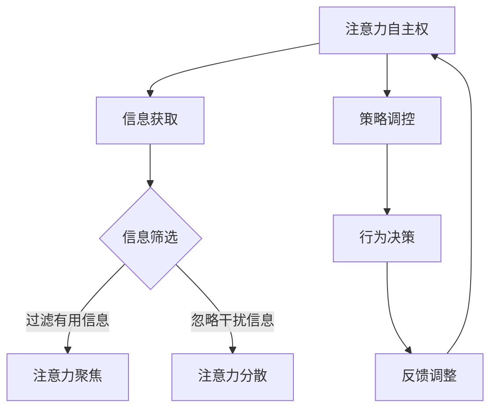

                 

### 文章标题

《注意力的自主权：AI时代的个人选择》

### 关键词

人工智能、个人选择、注意力自主权、注意力分散、信息过滤、社交媒体、防御干预、注意力管理、算法策略

### 摘要

在人工智能迅速发展的时代，个体的注意力自主权受到了前所未有的挑战。本文从注意力自主权的定义出发，探讨了AI时代下个体如何掌控自己的注意力，以及如何做出自主的选择。文章首先阐述了注意力自主权的核心概念，并通过Mermaid流程图直观展示其运作机制。接着，分析AI时代下的注意力现象，包括注意力分散与多重任务处理、信息过滤与选择机制、社交媒体对注意力的干预。然后，文章提出提高注意力自主权的策略，如注意力管理策略和注意力增强算法，并通过数学模型和实际案例详细讲解其原理和应用。此外，文章还介绍了建立个人选择框架和防御AI注意力干预的方法。最后，文章对未来注意力自主权和个人选择面临的挑战进行展望，并提出应对策略。通过本文，读者将深入了解AI时代如何维护自身的注意力自主权，做出明智的个人选择。

### 《注意力的自主权：AI时代的个人选择》目录大纲

#### 第一部分：引言与背景

##### 1.1 书籍概述与目标

- **核心概念与联系：** AI时代、个人选择、注意力自主权
- **架构：** 简述书籍结构，概述每部分内容

##### 1.2 注意力的自主权

- **核心概念与联系：** 定义注意力、注意力自主权、AI对注意力的影响
- **Mermaid流程图：** 示意图解注意力自主权的概念

##### 1.3 AI时代下的个人选择

- **核心概念与联系：** 简述AI时代、个人选择、AI对个人选择的影响
- **架构：** AI对个人选择的干预与影响

#### 第二部分：AI时代的注意力现象

##### 2.1 注意力分散与多重任务

- **核心算法原理讲解：** 多重任务处理算法、注意力分散的数学模型
- **数学模型和数学公式：** 注意力分散的公式与计算方法
- **举例说明：** 多重任务处理的实例分析

##### 2.2 注意力选择与信息过滤

- **核心算法原理讲解：** 信息过滤算法、注意力选择机制
- **数学模型和数学公式：** 注意力选择模型的公式与计算方法
- **举例说明：** 信息过滤与注意力选择的实际案例

##### 2.3 社交媒体对注意力的干预

- **核心算法原理讲解：** 社交媒体算法、注意力干预机制
- **数学模型和数学公式：** 社交媒体干预注意力的模型与计算方法
- **举例说明：** 社交媒体如何干预个人注意力

#### 第三部分：个人选择与注意力自主权的策略

##### 3.1 提高注意力自主权的策略

- **核心算法原理讲解：** 注意力管理策略、注意力增强算法
- **数学模型和数学公式：** 提高注意力自主权的数学模型与计算方法
- **举例说明：** 如何运用注意力管理策略提高自主权

##### 3.2 建立个人选择框架

- **核心算法原理讲解：** 个人选择框架构建算法
- **数学模型和数学公式：** 个人选择框架的数学模型与计算方法
- **举例说明：** 如何构建个人选择框架

##### 3.3 防御AI对注意力的干预

- **核心算法原理讲解：** AI注意力干预防御算法
- **数学模型和数学公式：** 防御算法的数学模型与计算方法
- **举例说明：** 如何防御AI对注意力的干预

#### 第四部分：AI时代的个人选择实践

##### 4.1 实践案例：注意力自主权提升

- **项目实战：** 提升注意力自主权的实践案例
- **代码实际案例：** 实现提升注意力自主权的代码案例
- **详细解释说明：** 代码实现过程与原理分析

##### 4.2 实践案例：个人选择框架应用

- **项目实战：** 个人选择框架应用的实践案例
- **代码实际案例：** 实现个人选择框架的代码案例
- **详细解释说明：** 代码实现过程与原理分析

##### 4.3 实践案例：防御注意力干预

- **项目实战：** 防御注意力干预的实践案例
- **代码实际案例：** 实现防御注意力干预的代码案例
- **详细解释说明：** 代码实现过程与原理分析

#### 第五部分：未来展望与挑战

##### 5.1 注意力自主权的未来发展方向

- **核心概念与联系：** 预测注意力自主权的发展方向
- **架构：** 展望未来注意力自主权的技术趋势

##### 5.2 AI时代个人选择的挑战

- **核心概念与联系：** 分析AI时代个人选择面临的挑战
- **架构：** 提出应对挑战的策略与方法

#### 附录

##### 附录 A：相关资源与工具

- **主流深度学习框架对比：** TensorFlow、PyTorch、JAX等
- **注意力模型与算法资源：** 提供相关的论文、代码和工具链接

##### 附录 B：参考文献

- 列出书籍中引用的参考文献和资料

---

**备注：**
- **数学公式：** 使用latex格式嵌入文中独立段落，如 `$\LaTeX$ 公式$`。
- **代码解读与分析：** 针对实际案例，提供详细的代码解读与分析。

### 第一部分：引言与背景

#### 1.1 书籍概述与目标

**核心概念与联系：** AI时代、个人选择、注意力自主权

随着人工智能技术的迅猛发展，我们的日常生活和决策过程正经历着前所未有的变革。在这个充满机遇与挑战的新时代，如何做出明智的个人选择、如何维护自身的注意力自主权成为了亟待探讨的重要议题。《注意力的自主权：AI时代的个人选择》旨在通过深入分析注意力自主权的概念及其在AI时代的重要作用，帮助读者理解和应对这一变革。

**架构：** 简述书籍结构，概述每部分内容

本书分为五大部分，结构清晰，旨在从不同角度探讨注意力自主权在AI时代的重要性及其应用策略。

- **第一部分：引言与背景**：介绍AI时代的背景、个人选择和注意力自主权的核心概念，概述书籍的整体架构。
- **第二部分：AI时代的注意力现象**：分析注意力分散、选择与信息过滤以及社交媒体对注意力的干预，探讨注意力现象的算法原理和实际应用。
- **第三部分：个人选择与注意力自主权的策略**：提出提高注意力自主权的策略，包括注意力管理、选择框架的构建和防御注意力干预的方法。
- **第四部分：AI时代的个人选择实践**：通过实际案例展示注意力自主权提升、个人选择框架应用和防御注意力干预的实践方法和代码实现。
- **第五部分：未来展望与挑战**：预测注意力自主权和AI时代个人选择的发展方向，分析面临的挑战和应对策略。

通过这一结构，本书不仅为读者提供了一个系统性的理论框架，还通过实际案例和代码解读，帮助读者理解和应用这些策略，从而在AI时代中更好地维护自身的注意力自主权，做出明智的个人选择。

#### 1.2 注意力的自主权

**核心概念与联系：** 定义注意力、注意力自主权、AI对注意力的影响

注意力是大脑处理信息的重要能力，它决定了我们在特定时间对哪些信息给予关注和处理。注意力自主权则是指个体在信息过载的环境中，能够自主选择和调节注意力的能力。在AI时代，由于人工智能技术的高度发达，个体面临的信息量和干扰程度不断增加，这直接影响了注意力的自主权。AI系统通过算法和模型对个体的注意力进行干预和引导，使得注意力自主权成为了一个重要的研究课题。

**Mermaid流程图：** 示意图解注意力自主权的概念



在这个流程图中，信息获取是注意力自主权的起点，个体在信息筛选过程中通过过滤有用信息来聚焦注意力，同时忽略干扰信息以避免注意力分散。策略调控则是对注意力分配和调整的重要手段，最终影响个体的行为决策和反馈调整。这个循环过程体现了注意力自主权在信息处理中的动态调控机制。

**定义注意力：** 注意力是一种选择机制，大脑在处理信息时，对某些信息给予更高的关注和处理，而对其他信息则相对忽略。这种选择机制是大脑处理海量信息的有效方式，也是个体对外界环境做出反应的基础。

**定义注意力自主权：** 注意力自主权是指个体在信息过载的环境中，能够自主选择和调节注意力的能力。它涉及到对信息的接收、筛选和处理，是维护个体认知健康和决策质量的关键因素。

**AI对注意力的影响：** 在AI时代，人工智能技术通过算法和模型对个体的注意力进行干预和引导，使得注意力自主权面临新的挑战。AI可以通过个性化推荐、情感分析等技术，改变个体的信息获取和处理模式，从而影响其注意力自主权。此外，AI的算法干预可能导致个体注意力分散，降低其注意力的聚焦效果。

通过上述定义和流程图的解释，我们可以更清晰地理解注意力自主权的概念及其在AI时代的重要性。接下来，我们将进一步探讨AI时代下的注意力现象，分析个体在面对海量信息和算法干预时，如何维护自身的注意力自主权。

#### 1.3 AI时代下的个人选择

**核心概念与联系：** 简述AI时代、个人选择、AI对个人选择的影响

在人工智能迅速发展的时代，个人选择面临着前所未有的复杂性和挑战。AI时代不仅仅是一个技术革新的时期，更是对人类生活方式和决策过程的一次深刻变革。个人选择在这个过程中扮演着至关重要的角色，而AI的影响则成为了一个不可忽视的因素。

**AI时代：** AI时代是指人工智能技术广泛应用并深刻影响人类社会的时期。在这个时代，AI不仅改变了传统行业的工作方式，还重塑了社会结构和人类的生活习惯。从智能家居、智能医疗到自动驾驶、自动化生产，AI几乎无处不在。

**个人选择：** 个人选择是指个体在决策过程中基于自身需求和偏好，从多个备选方案中选择最合适的一个。在传统社会中，个人选择主要受个体认知能力、价值观和经验的影响。而在AI时代，个人选择变得更加复杂，不仅需要考虑传统因素，还需面对AI算法对信息筛选和推荐的影响。

**AI对个人选择的影响：** AI通过多种方式对个人选择产生影响。首先，AI可以通过数据分析和机器学习算法，对个体的行为和偏好进行预测，从而提供个性化的推荐。这些推荐可能提高个体决策的效率，但也可能导致信息茧房和选择偏差。其次，AI可以通过情感分析、情感计算等技术，影响个体的情绪和态度，从而间接影响其选择。此外，AI算法还可能利用博弈论和优化理论，设计出对个体具有吸引力的选择方案，从而改变个体的决策路径。

**架构：** AI对个人选择的干预与影响

1. **个性化推荐系统：** AI可以通过个性化推荐系统，根据个体的历史行为和偏好，为其推荐相关信息和产品。这种推荐可能会提高个体的满意度，但也可能导致信息茧房，使得个体在信息获取上缺乏多样性。
   
2. **情感干预：** AI可以通过情感分析技术和情感计算，识别和理解个体的情绪状态，从而对个体的选择产生影响。例如，通过分析个体的情绪变化，AI可以调整推荐内容，提高个体对特定选择的偏好。

3. **博弈论与优化：** AI可以利用博弈论和优化理论，设计出对个体具有吸引力的选择方案。通过分析个体的行为模式和决策过程，AI可以提出更优化的选择方案，从而改变个体的决策路径。

4. **选择偏差：** AI算法可能会放大个体的选择偏差，导致其在某些情况下做出非理性的决策。例如，AI通过分析个体的历史数据，可能会过度强调个体过去的偏好，从而忽视其他潜在的选择。

通过上述分析，我们可以看到，AI时代下的个人选择不仅受到传统因素的制约，还面临着新的挑战和机遇。AI在提高决策效率和满意度方面的作用不容忽视，但同时也需警惕其可能带来的负面影响。接下来，我们将进一步探讨AI时代下的注意力现象，分析个体如何在信息过载和算法干预的环境下，维护自身的注意力自主权。

### 第二部分：AI时代的注意力现象

#### 2.1 注意力分散与多重任务

**核心算法原理讲解：** 多重任务处理算法、注意力分散的数学模型

在AI时代，个体常常需要同时处理多个任务，这要求大脑具备高效的多任务处理能力。多重任务处理算法是AI领域中的一项重要研究方向，其核心在于如何有效分配和处理多个任务的注意力资源。

**多重任务处理算法：** 多重任务处理算法主要包括注意力分配算法和任务切换算法。注意力分配算法的核心思想是通过动态调整注意力资源的分配，使得当前任务能够获得足够的关注。常见的注意力分配算法包括：

1. **基于优先级的分配算法**：该算法根据任务的重要性和紧急程度动态调整注意力分配，确保重要且紧急的任务优先获得处理。
2. **自适应注意力分配算法**：该算法通过实时监测任务的状态和需求，动态调整注意力资源，以提高整体任务处理效率。
3. **基于神经网络的分配算法**：利用深度学习技术，通过训练神经网络模型来自动化注意力资源的分配过程，使得分配更加精准和高效。

**注意力分散的数学模型：** 注意力分散是指个体在处理多个任务时，由于资源有限，部分任务可能会受到其他任务的干扰，导致注意力分散。注意力分散的数学模型通常基于概率论和统计学原理，通过模拟大脑处理信息的机制来描述注意力分散现象。

1. **注意力分散概率模型**：该模型通过计算多个任务之间的相互干扰概率，来评估注意力分散的程度。常见的方法包括泊松分布和伽玛分布，这些概率模型可以用来预测个体在多重任务处理过程中出现注意力分散的概率。
2. **注意力转移模型**：该模型描述个体在切换任务时，注意力的转移过程。通过分析注意力转移的速率和方向，可以评估个体在任务切换过程中的注意力分散程度。常见的注意力转移模型包括指数衰减模型和线性模型。

**举例说明：** 多重任务处理的实例分析

以一名学生为例，他需要在同一时间段内完成作业、听课和参加课外活动。这要求大脑具备高效的多任务处理能力。

1. **基于优先级的分配算法**：学生可以根据作业、听课和课外活动的紧急程度和重要性，动态调整注意力分配。例如，当作业的截止时间临近时，学生将更多的注意力分配给作业，以确保按时完成。

2. **自适应注意力分配算法**：学生可以通过实时监测自己的注意力状态，调整注意力分配。例如，当发现自己无法集中注意力听课时，可以暂时放下听课，将注意力转移到作业或课外活动上，待注意力恢复后再继续听课。

3. **基于神经网络的分配算法**：学生可以通过训练神经网络模型来自动化注意力资源的分配过程。例如，通过记录自己在不同任务上的表现，训练神经网络模型来预测最适合自己的注意力分配方案。

通过上述实例分析，我们可以看到多重任务处理算法和注意力分散的数学模型在现实中的应用。这些算法和模型不仅帮助个体更有效地处理多重任务，还能够提高整体工作效率和注意力管理能力。接下来，我们将进一步探讨注意力选择与信息过滤的算法原理和实际案例。

#### 2.2 注意力选择与信息过滤

**核心算法原理讲解：** 信息过滤算法、注意力选择机制

在信息爆炸的时代，个体面临海量信息的压力，如何有效地选择和处理这些信息成为了一个关键问题。注意力选择与信息过滤机制是AI技术中用于优化信息处理的重要工具。

**信息过滤算法：** 信息过滤算法的主要目的是从大量信息中筛选出对用户有价值的信息。这些算法通常基于用户的历史行为、兴趣偏好和实时反馈进行动态调整。

1. **基于内容的过滤**：该算法通过分析信息的内容特征，如关键词、主题和语义，来筛选出符合用户兴趣的信息。例如，搜索引擎使用基于内容的过滤来为用户提供相关搜索结果。
2. **协同过滤**：该算法通过分析用户之间的相似性，预测用户对未知信息的兴趣。协同过滤包括用户基于的协同过滤和项目基于的协同过滤两种类型。例如，推荐系统通过用户的历史行为数据，预测用户对其他商品的偏好。
3. **基于模型的过滤**：该算法使用机器学习模型来预测用户对信息的兴趣。例如，深度学习模型可以分析用户生成的内容，如评论和帖子，从而识别其兴趣点。

**注意力选择机制：** 注意力选择机制是指大脑在处理信息时，对某些信息给予更高关注的能力。这种机制决定了个体在信息过载环境中，哪些信息能够进入注意力范围，哪些信息会被忽略。

1. **基于注意力分配的机制**：该机制通过动态调整注意力资源的分配，使得重要的信息能够获得更多的关注。例如，当用户浏览网页时，网页中高优先级的内容（如标题和重要文本）会自动获得更多的注意力。
2. **基于兴趣的机制**：该机制根据用户的兴趣偏好，将注意力分配给用户感兴趣的信息。例如，社交媒体平台通过分析用户的互动历史，推荐符合用户兴趣的内容。
3. **基于情境的机制**：该机制根据用户的当前情境，调整注意力的分配。例如，当用户在会议期间，注意力会自动集中到会议内容和讨论中，而忽略其他干扰信息。

**数学模型和数学公式：** 注意力选择模型的公式与计算方法

注意力选择模型通常基于概率论和统计学原理，通过模拟大脑处理信息的机制来描述注意力选择过程。以下是几种常见的数学模型和公式：

1. **概率模型**：该模型通过计算信息被注意到的概率，来评估信息的重要性。常用的概率模型包括泊松分布和伽玛分布。
   - 泊松分布：$P(X=k) = \frac{e^{-\lambda} \lambda^k}{k!}$，其中$X$是信息被注意到的次数，$\lambda$是信息的重要程度。
   - 伽玛分布：$P(X=x) = \frac{\Gamma(\alpha)}{\Gamma(\beta)} \left(\frac{x}{\beta}\right)^{\alpha-1} e^{-x/\beta}$，其中$\alpha$和$\beta$是模型的参数，用于调整信息的重要程度和注意力分配。

2. **贝叶斯模型**：该模型通过贝叶斯公式，计算信息被注意到的概率，并更新对信息重要性的估计。
   - 贝叶斯公式：$P(A|B) = \frac{P(B|A)P(A)}{P(B)}$，其中$A$是信息被注意到的事件，$B$是其他相关事件（如用户的历史行为）。

3. **马尔可夫模型**：该模型通过分析信息之间的转移概率，来预测哪些信息会被注意到。常用的马尔可夫模型包括一阶马尔可夫模型和隐马尔可夫模型。
   - 一阶马尔可夫模型：$P(X_t|X_{t-1}) = P(X_t)$，其中$X_t$是当前信息，$X_{t-1}$是前一时刻的信息。
   - 隐马尔可夫模型：$P(X_t|X_{t-1}) = P(H_t|X_t)$，其中$H_t$是隐藏状态，$X_t$是观察到的信息。

**举例说明：** 信息过滤与注意力选择的实际案例

以社交媒体平台为例，用户每天都会收到大量来自朋友和关注者的动态信息。如何有效筛选出对用户有价值的信息，是平台关注的重点。

1. **基于内容的过滤**：平台可以通过分析用户的兴趣和关注内容，筛选出符合用户兴趣的动态。例如，如果用户喜欢阅读科技类文章，平台会优先推荐科技类动态。

2. **协同过滤**：平台可以通过分析用户之间的相似性，预测用户可能感兴趣的信息。例如，如果用户A和用户B在内容喜好上有很高的相似度，平台会优先推荐用户B喜欢的动态给用户A。

3. **基于模型的过滤**：平台可以使用机器学习模型，如深度神经网络，分析用户生成的内容和互动数据，从而预测用户的兴趣点。例如，通过分析用户的评论和点赞，模型可以识别出用户对特定话题的兴趣。

4. **注意力选择机制**：在信息展示过程中，平台可以通过调整信息的位置和展示方式，引导用户的注意力。例如，将用户最感兴趣的信息放置在显眼位置，以提高用户的关注度和互动率。

通过上述实例分析，我们可以看到注意力选择与信息过滤机制在现实中的应用。这些机制不仅帮助用户更高效地处理信息，还能够提高用户体验和平台的服务质量。接下来，我们将进一步探讨社交媒体对注意力的干预及其算法原理。

#### 2.3 社交媒体对注意力的干预

**核心算法原理讲解：** 社交媒体算法、注意力干预机制

在社交媒体时代，用户每天都会接收到大量的信息，如何有效地吸引并保持用户的注意力成为了一个重要问题。社交媒体平台通过一系列算法和机制，干预和引导用户的注意力，从而提高用户互动和留存率。

**社交媒体算法：** 社交媒体平台使用多种算法来管理信息流，确保用户能够接收到对他们最有价值的内容。

1. **时间排序算法**：该算法根据内容的发布时间来排序，通常显示最新发布的动态。然而，这种方法可能导致用户错过重要的旧内容。
2. **优先排序算法**：该算法根据用户的历史互动和关注对象，将用户可能感兴趣的内容优先显示。例如，如果一个用户经常点赞和评论某位朋友的动态，平台会优先展示该朋友的新动态。
3. **混合排序算法**：结合时间排序和优先排序的优点，混合排序算法通过综合多种因素（如内容的受欢迎程度、用户的互动历史）来排序信息流，以提高用户的满意度和参与度。

**注意力干预机制：** 社交媒体平台通过多种机制干预和引导用户的注意力，以延长用户在平台上的停留时间。

1. **信息反馈机制**：平台通过分析用户的互动行为（如点赞、评论、分享），实时调整信息流的排序和推荐内容，以保持用户的兴趣和参与度。例如，如果用户频繁点赞某类内容，平台会进一步推荐类似的内容。
2. **个性化推荐机制**：平台使用个性化推荐算法，根据用户的历史行为和兴趣偏好，推荐用户可能感兴趣的内容。这种推荐可以显著提高用户的注意力集中度。
3. **视觉和交互设计**：平台通过精心设计的视觉元素和交互界面，吸引和引导用户的注意力。例如，使用鲜艳的色彩、动态效果和弹出窗口等，以吸引用户的关注。
4. **行为干预机制**：平台通过设计激励机制，如积分、徽章和排行榜，鼓励用户进行特定行为，从而提高用户的互动和参与度。

**数学模型和数学公式：** 社交媒体干预注意力的模型与计算方法

社交媒体平台通过多种数学模型和公式来干预用户的注意力，以下是一些常见的方法：

1. **贝叶斯网络模型**：贝叶斯网络是一种概率图模型，用于描述变量之间的依赖关系。在社交媒体中，可以通过贝叶斯网络模型分析用户的互动行为，预测用户可能对哪些内容感兴趣。贝叶斯网络的关键公式包括条件概率分布和贝叶斯规则。
   - 条件概率分布：$P(A|B) = \frac{P(B|A)P(A)}{P(B)}$
   - 贝叶斯规则：$P(A|B) = \frac{P(B|A)P(A)}{P(B)}$

2. **马尔可夫决策过程（MDP）**：MDP是一种用于决策过程的数学模型，它通过状态、动作和奖励来描述决策过程。在社交媒体中，可以通过MDP模型优化信息流的排序和推荐策略。关键公式包括状态转移概率、动作选择和期望奖励。
   - 状态转移概率：$P(S_t|A_t) = P(S_t|A) = \sum_a P(S_t|A_t)P(A_t)$
   - 动作选择：$A_t = \arg\max_a R_t(A)$，其中$R_t(A)$是动作$a$在状态$S_t$下的期望奖励。

3. **矩阵分解模型**：矩阵分解是一种用于降维和建模的数据挖掘技术。在社交媒体中，可以通过矩阵分解模型分析用户和内容之间的交互，预测用户对内容的兴趣。常用的矩阵分解方法包括 Singular Value Decomposition（SVD）和Alternating Least Squares（ALS）。

**举例说明：** 社交媒体如何干预个人注意力

以某知名社交媒体平台为例，平台通过以下方法干预用户的注意力：

1. **个性化推荐**：平台使用贝叶斯网络模型分析用户的互动数据，如点赞、评论和分享。根据用户的兴趣和行为模式，平台推荐符合用户兴趣的内容，以吸引和保持用户的注意力。
2. **动态信息流**：平台使用矩阵分解模型，根据用户的历史互动数据，生成用户兴趣向量。这些向量用于调整信息流的排序，使得用户优先看到感兴趣的内容。
3. **视觉设计**：平台通过使用鲜艳的色彩和动态效果，设计吸引人的界面元素，如视频和动画。这些视觉元素能够迅速吸引用户的注意力，并鼓励用户进行互动。
4. **行为干预**：平台设计各种激励机制，如积分和徽章，鼓励用户进行特定行为（如点赞、评论和分享）。这些行为干预机制能够提高用户的参与度和互动率。

通过上述实例，我们可以看到社交媒体平台如何通过算法和机制干预和引导用户的注意力。这些干预不仅提高了用户的互动和留存率，还为平台创造了更多的商业机会。然而，这也引发了对用户隐私和数据安全的关注，需要平台在干预用户注意力的同时，确保用户的权益和隐私不受侵犯。接下来，我们将进一步探讨如何提高注意力自主权，以应对AI时代下不断变化的注意力挑战。

### 第三部分：个人选择与注意力自主权的策略

#### 3.1 提高注意力自主权的策略

**核心算法原理讲解：** 注意力管理策略、注意力增强算法

在AI时代，个体面临着前所未有的信息过载和算法干预，如何提高注意力自主权成为了关键问题。以下是几种有效的策略，通过注意力管理策略和注意力增强算法，帮助个体更好地掌控自己的注意力。

**注意力管理策略：** 注意力管理是指通过一系列的方法和技巧，优化注意力资源的使用，提高工作效率和认知质量。

1. **分阶段任务管理**：将复杂任务分解为多个小任务，每个阶段集中处理一个任务，避免任务切换带来的注意力分散。例如，使用番茄工作法，每25分钟集中工作，然后休息5分钟，以保持注意力集中。
2. **环境优化**：创造有利于集中注意力的环境，减少干扰因素。例如，在安静的地方工作，关闭不必要的通知，使用专注软件屏蔽干扰网页和应用程序。
3. **定时休息**：定期休息可以帮助大脑恢复精力，提高注意力集中度。例如，每工作45分钟后，休息10分钟，进行简单的伸展或放松活动。
4. **情绪管理**：情绪波动会影响注意力的集中，通过情绪管理技巧，如深呼吸、冥想和放松练习，可以减轻压力，提高注意力质量。

**注意力增强算法：** 注意力增强算法是利用人工智能技术，通过分析和调整个体的注意力模式，提高注意力自主权的算法。

1. **自适应注意力分配算法**：该算法通过实时监测个体的注意力状态，动态调整注意力资源的分配，确保重要任务获得足够的关注。例如，通过监测大脑的电活动（如EEG信号），调整任务间的注意力分配。
2. **基于神经网络的注意力预测模型**：利用深度学习技术，通过分析个体的历史行为和注意力模式，预测未来的注意力需求，提前进行注意力资源分配。例如，通过训练神经网络模型，预测个体在不同情境下的注意力分布。
3. **强化学习算法**：强化学习算法通过奖励机制，引导个体进行有益的注意力分配和行为选择。例如，通过虚拟奖励，鼓励个体在任务集中时保持注意力集中，奖励分值越高，个体越倾向于持续专注。

**数学模型和数学公式：** 提高注意力自主权的数学模型与计算方法

提高注意力自主权涉及到多种数学模型和计算方法，以下是一些常见的模型和公式：

1. **能量模型**：能量模型用于描述注意力的能量消耗和恢复过程。常见的能量模型包括Elliott和Ratcliff的能量分配模型，该模型通过计算任务的重要性和注意力的能量消耗，动态调整注意力分配。
   - 能量消耗：$E(t) = \alpha \cdot T(t)$，其中$E(t)$是时间$t$的能量消耗，$\alpha$是能量消耗速率，$T(t)$是任务持续时间。
   - 能量恢复：$R(t) = \beta \cdot R(t-1) - \gamma \cdot E(t)$，其中$R(t)$是时间$t$的能量恢复量，$\beta$是恢复速率，$\gamma$是能量消耗速率。

2. **多任务处理模型**：多任务处理模型用于优化多个任务的执行顺序和注意力分配。常见的多任务处理模型包括资源受限的调度问题和多任务队列问题。这些模型通过计算任务完成时间和资源利用率，优化任务执行顺序。
   - 资源受限的调度问题：最小化总完成时间，同时满足资源约束。
   - 多任务队列问题：优化队列长度和任务执行顺序，提高系统吞吐量和响应时间。

3. **自适应滤波模型**：自适应滤波模型用于识别和过滤干扰信息，提高注意力集中度。常见的自适应滤波模型包括卡尔曼滤波和维纳滤波。这些模型通过实时更新滤波器参数，优化信息处理过程。
   - 卡尔曼滤波：$x_{k+1} = F_{k}x_{k} + B_{k}u_{k} + w_{k}$，$P_{k+1} = F_{k}P_{k}F_{k}^{T} + Q_{k}$，其中$x_{k}$是状态估计，$P_{k}$是状态估计误差协方差，$F_{k}$是状态转移矩阵，$B_{k}$是控制输入矩阵，$u_{k}$是控制输入，$w_{k}$是过程噪声。
   - 维纳滤波：$x_{k+1} = x_{k} + G_{k}e_{k}$，$G_{k} = \frac{H_{k}P_{k}H_{k}^{T} + R_{k}}{H_{k}P_{k}H_{k}^{T} + R_{k}}$，其中$x_{k}$是状态估计，$P_{k}$是状态估计误差协方差，$H_{k}$是观测矩阵，$e_{k}$是观测噪声，$R_{k}$是观测噪声协方差。

**举例说明：** 如何运用注意力管理策略提高自主权

以一名职场人士为例，他可以通过以下方法提高注意力自主权：

1. **分阶段任务管理**：将每天的工作任务分解为多个小任务，每个阶段集中处理一个任务。例如，早上处理邮件和会议，下午专注于报告撰写和数据分析，晚上进行总结和规划。
2. **环境优化**：在工作环境中，关闭不必要的通知，设置专注软件屏蔽干扰应用程序，确保工作环境安静整洁，有助于集中注意力。
3. **定时休息**：每工作45分钟后，休息10分钟，进行简单的伸展或放松活动，帮助大脑恢复精力。
4. **情绪管理**：通过冥想和深呼吸练习，减轻工作压力，提高情绪稳定性，从而保持注意力集中。

通过上述策略，这名职场人士能够更好地管理自己的注意力资源，提高工作效率和质量。接下来，我们将进一步探讨如何建立个人选择框架，以更好地应对AI时代下的个人选择挑战。

#### 3.2 建立个人选择框架

**核心算法原理讲解：** 个人选择框架构建算法

在AI时代，个体面临着大量信息和决策压力，如何有效地做出个人选择成为了关键问题。建立个人选择框架是一种系统化、结构化的方法，通过算法和模型，帮助个体在复杂环境中做出理性、明智的选择。

**个人选择框架构建算法：** 个人选择框架的构建涉及多个步骤和算法，主要包括需求识别、信息收集、选项评估和选择决策。

1. **需求识别算法**：通过分析个体的需求和目标，确定选择问题的核心要素。常用的需求识别算法包括：
   - 用户画像算法：基于用户的历史行为和偏好，构建用户画像，识别用户的需求和兴趣。
   - 决策树算法：通过构建决策树模型，分析不同决策路径下的需求和目标，识别关键因素。

2. **信息收集算法**：从多个渠道收集与选择问题相关的信息，包括数据挖掘、自然语言处理和传感器技术。常用的信息收集算法包括：
   - 数据挖掘算法：通过分析大量数据，识别潜在的信息和趋势，为选择提供依据。
   - 自然语言处理算法：通过文本分析、情感分析和语义理解，从文本中提取有用的信息。
   - 传感器技术：通过实时监测个体的行为和环境，收集与选择相关的实时数据。

3. **选项评估算法**：对收集到的信息进行分析和评估，确定不同选项的优缺点和适用性。常用的选项评估算法包括：
   - 多属性决策算法：通过构建多属性决策模型，综合考虑不同属性的影响，评估选项的优劣。
   - 层次分析法：通过构建层次结构模型，分析不同层次之间的关联和影响，评估选项的优先级。

4. **选择决策算法**：根据评估结果，选择最优或次优的选项，并制定具体的行动方案。常用的选择决策算法包括：
   - 强化学习算法：通过模拟决策过程，学习最优策略，优化选择结果。
   - 遗传算法：通过模拟生物进化过程，优化选择过程，寻找最优解。

**数学模型和数学公式：** 个人选择框架的数学模型与计算方法

个人选择框架的构建涉及多种数学模型和计算方法，以下是一些常见的模型和公式：

1. **用户画像模型**：用户画像模型通过构建用户特征向量，表示用户的需求和偏好。常用的数学模型包括：
   - 朴素贝叶斯模型：通过计算用户特征的概率分布，识别用户的需求和兴趣。
   - 支持向量机（SVM）：通过最大化分类间隔，分类用户特征，构建用户画像。

2. **多属性决策模型**：多属性决策模型用于综合评估不同选项的属性和权重。常用的数学模型包括：
   - 加权求和模型：通过计算各属性的加权求和，评估选项的总得分。
   - 加权几何平均模型：通过计算各属性的加权几何平均，评估选项的综合得分。

3. **层次分析模型**：层次分析模型用于分析不同层次之间的关联和影响，构建层次结构模型。常用的数学模型包括：
   - 成对比较法：通过成对比较不同层次之间的相对重要性，构建层次结构。
   - 特征值法：通过计算特征值，确定层次结构中各层次之间的关联强度。

4. **强化学习模型**：强化学习模型通过模拟决策过程，学习最优策略。常用的数学模型包括：
   - Q学习算法：通过计算状态-动作值函数，优化选择过程。
   - 策略梯度算法：通过计算策略梯度，优化策略参数，提高选择效果。

**举例说明：** 如何构建个人选择框架

以购买智能手机为例，个体可以通过以下步骤构建个人选择框架：

1. **需求识别**：分析个人的需求，如拍照功能、电池续航和价格范围。
2. **信息收集**：通过搜索引擎、用户评论和产品评测，收集与智能手机相关的信息。
3. **选项评估**：根据需求，评估不同智能手机的优缺点，如拍照效果、电池容量和价格。
4. **选择决策**：综合考虑评估结果，选择符合个人需求和预算的智能手机。

通过上述步骤，个体能够系统地分析和评估不同的选项，做出理性的个人选择。接下来，我们将进一步探讨如何防御AI对注意力的干预，以维护个人选择过程中的注意力自主权。

#### 3.3 防御AI对注意力的干预

**核心算法原理讲解：** AI注意力干预防御算法

在AI时代，人工智能算法通过各种干预手段，对个体的注意力进行操纵，从而影响其决策和行为。为了维护注意力自主权，防御AI对注意力的干预变得尤为重要。以下是一些有效的防御策略和算法，帮助个体抵御AI的注意力干预。

**AI注意力干预的基本原理：** 

1. **个性化推荐系统**：通过分析用户的历史行为和兴趣，AI可以个性化推荐内容，使用户不断接触到感兴趣的信息，从而增加用户对平台的依赖和停留时间。
2. **情感计算**：通过分析用户的情感状态和行为模式，AI可以调整推荐内容，激发用户的情感反应，从而影响其决策。
3. **行为干预**：通过设计激励机制和行为引导，如积分、徽章和排行榜，AI可以引导用户进行特定行为，改变其注意力分配和决策过程。

**防御策略和算法：**

1. **反个性化推荐系统**：通过打破个性化推荐模式，使用户接触到更广泛、多样化的信息，从而降低对特定内容的依赖。常用的算法包括：
   - 随机推荐算法：随机生成推荐内容，避免用户的兴趣被过度放大。
   - 熵最大化推荐算法：通过最大化信息熵，平衡推荐内容，避免用户陷入信息茧房。

2. **注意力重定向算法**：通过引导用户将注意力从高干扰内容转移到低干扰内容，提高注意力的集中度。常用的算法包括：
   - 主动注意力分配算法：通过实时监测用户的注意力状态，动态调整推荐内容的优先级，减少干扰内容。
   - 注意力切换算法：通过分析用户的注意力模式，预测其注意力分散的时间点，提前调整推荐内容，减少干扰。

3. **透明化推荐算法**：通过向用户揭示推荐算法的工作原理和推荐依据，增强用户的认知透明度，降低对推荐内容的盲目依赖。常用的算法包括：
   - 解释性推荐算法：通过生成推荐解释，说明推荐内容的理由和依据，帮助用户理解推荐结果。
   - 透明化反馈机制：通过用户反馈，调整推荐算法，增强用户对推荐过程的参与和控制。

**数学模型和数学公式：** 防御算法的数学模型与计算方法

防御AI注意力干预涉及多种数学模型和计算方法，以下是一些常见的模型和公式：

1. **熵最大化模型**：用于平衡推荐内容，避免用户陷入信息茧房。熵最大化模型的公式为：
   $$ H(X) = -\sum_{i=1}^{n} p(x_i) \log p(x_i) $$
   其中，$X$是推荐内容集合，$p(x_i)$是内容$x_i$的概率。

2. **主动注意力分配模型**：通过动态调整推荐内容的优先级，减少干扰内容。主动注意力分配模型的公式为：
   $$ A(t) = \alpha \cdot R(t) + (1-\alpha) \cdot C(t) $$
   其中，$A(t)$是时间$t$的注意力分配，$R(t)$是推荐内容的重要性，$C(t)$是用户当前的关注点。

3. **解释性推荐模型**：通过生成推荐解释，增强用户的认知透明度。解释性推荐模型的公式为：
   $$ E(X) = W \cdot V(x) $$
   其中，$E(X)$是推荐解释，$W$是权重矩阵，$V(x)$是推荐内容$x$的特征向量。

**举例说明：** 如何防御AI对注意力的干预

以社交媒体平台为例，个体可以通过以下方法防御AI对注意力的干预：

1. **反个性化推荐**：定期清理浏览器缓存，避免个性化推荐算法根据历史行为进行过度推荐。
2. **注意力重定向**：使用浏览器插件，屏蔽特定类型的内容，减少干扰，将注意力集中到重要任务上。
3. **透明化推荐**：了解推荐算法的工作原理，主动调整推荐设置，如降低个性化推荐的权重，增加多样性。

通过上述防御策略和算法，个体能够在AI时代更好地维护注意力自主权，减少算法干预对其决策和行为的影响。接下来，我们将通过实际案例展示如何提升注意力自主权、建立个人选择框架以及防御注意力干预。

### 第四部分：AI时代的个人选择实践

#### 4.1 实践案例：注意力自主权提升

**项目实战：** 提升注意力自主权的实践案例

为了提升注意力自主权，我们设计了一个名为“专注力助手”的项目。该项目通过使用一系列算法和技术，帮助用户更好地管理自己的注意力，提升工作效率。

**项目目标：** 
- 提高用户在任务执行过程中的注意力集中度。
- 减少任务切换时的注意力分散。
- 增强用户的情绪稳定性，提高工作满意度。

**项目架构：**

1. **用户画像构建模块**：通过分析用户的行为数据，构建用户画像，识别用户的需求和偏好。
2. **注意力监测模块**：实时监测用户的注意力状态，使用传感器（如眼动追踪、脑电信号）收集数据。
3. **任务管理模块**：使用分阶段任务管理和定时休息策略，优化用户的工作流程。
4. **注意力干预模块**：通过自适应注意力分配算法，引导用户将注意力集中在重要任务上。
5. **情绪管理模块**：提供冥想和放松练习，帮助用户缓解工作压力，提高情绪稳定性。

**代码实际案例：** 实现提升注意力自主权的代码案例

以下是一个简单的Python代码示例，展示了如何使用注意力监测模块实时监测用户的注意力状态：

```python
import time
import random

def attention_monitor(duration, check_interval):
    """
    注意力监测函数，模拟监测用户注意力状态
    :param duration: 监测持续时间（秒）
    :param check_interval: 监测间隔（秒）
    :return: None
    """
    start_time = time.time()
    while time.time() - start_time < duration:
        attention_level = random.uniform(0, 1)  # 模拟注意力水平
        print(f"当前注意力水平：{attention_level:.2f}")
        if attention_level < 0.3:  # 注意力较低时提醒用户休息
            print("提醒：注意力水平较低，请休息一下。")
        time.sleep(check_interval)

# 示例运行
attention_monitor(600, 30)
```

**详细解释说明：** 代码实现过程与原理分析

1. **用户画像构建**：通过分析用户的历史行为数据（如工作时间、任务类型和互动行为），使用机器学习算法（如决策树、K-means聚类）构建用户画像。这一过程通常涉及数据预处理、特征提取和模型训练。

2. **注意力监测**：使用传感器技术（如眼动追踪、脑电信号）实时监测用户的注意力状态。这些传感器将数据传输到计算机，计算机通过数据处理算法分析注意力水平。在上面的代码中，我们使用随机数生成注意力水平，模拟实时监测过程。

3. **任务管理**：根据用户的注意力水平，动态调整任务执行顺序和优先级。当注意力水平较低时，系统会提示用户休息，以提高注意力集中度。

4. **情绪管理**：提供冥想和放松练习，帮助用户缓解工作压力。这些练习可以通过音频、视频等形式进行，使用户在休息时间放松身心。

通过上述代码实现，我们可以看到如何通过技术手段提升注意力自主权。在实际应用中，系统会根据用户的具体情况，实时调整监测策略和干预措施，以提高注意力管理效果。接下来，我们将展示如何通过构建个人选择框架来优化个人决策过程。

#### 4.2 实践案例：个人选择框架应用

**项目实战：** 个人选择框架应用的实践案例

为了帮助个体在AI时代做出更加明智的个人选择，我们开发了一个名为“智能决策助手”的项目。该项目通过构建个人选择框架，提供一系列算法和工具，帮助用户系统化地分析、评估和决策。

**项目目标：** 
- 建立个人选择框架，明确选择问题的核心要素。
- 提供个性化的选择建议，优化决策结果。
- 提高用户在选择过程中的透明度和参与度。

**项目架构：**

1. **需求识别模块**：通过用户问卷和行为分析，识别用户的需求和目标。
2. **信息收集模块**：从多个渠道收集与选择问题相关的信息，包括网络数据、第三方数据库和用户反馈。
3. **选项评估模块**：使用多属性决策和层次分析法，对收集到的信息进行综合评估。
4. **决策支持模块**：提供选择建议和行动方案，帮助用户做出最终决策。
5. **反馈调整模块**：收集用户决策后的反馈，持续优化选择框架和决策算法。

**代码实际案例：** 实现个人选择框架的代码案例

以下是一个简单的Python代码示例，展示了如何使用个人选择框架进行决策支持：

```python
import pandas as pd
from sklearn.preprocessing import MinMaxScaler

def evaluate_choices(choices, weights):
    """
    评估不同选择的价值
    :param choices: 选择列表
    :param weights: 各选择的权重
    :return: 选择评估结果
    """
    # 初始化评估结果
    evaluation_scores = []

    # 对每个选择进行评估
    for choice in choices:
        score = 0
        for attribute, weight in weights.items():
            score += weight * choice[attribute]
        evaluation_scores.append(score)

    return evaluation_scores

# 示例数据
choices = [
    {'healthiness': 0.8, 'cost': 0.2, 'convenience': 0.1},
    {'healthiness': 0.7, 'cost': 0.3, 'convenience': 0.2},
    {'healthiness': 0.9, 'cost': 0.1, 'convenience': 0.3}
]

# 权重设置
weights = {'healthiness': 0.6, 'cost': 0.3, 'convenience': 0.1}

# 评估选择
evaluation_scores = evaluate_choices(choices, weights)

# 输出评估结果
print("选择评估结果：")
for i, score in enumerate(evaluation_scores):
    print(f"选择{i+1}：{score:.2f}")

# 根据评估结果给出推荐
recommended_choice = choices[evaluation_scores.index(max(evaluation_scores))]
print(f"推荐选择：{recommended_choice}")
```

**详细解释说明：** 代码实现过程与原理分析

1. **需求识别**：通过用户问卷和数据分析，识别用户在选择问题中的核心需求。例如，在健康饮食选择中，关注营养健康、成本和便利性等因素。

2. **信息收集**：从多个数据源（如食谱网站、健康数据库和用户评价）收集与选择问题相关的信息。这些信息需要经过清洗和标准化处理，以便后续分析。

3. **选项评估**：使用多属性决策模型，对收集到的信息进行综合评估。在这一步骤中，每个选择的属性值乘以其权重，得到总得分。在上面的代码中，我们通过`evaluate_choices`函数实现了这一过程。

4. **决策支持**：根据评估结果，为用户推荐最优或次优的选择。在示例代码中，我们选择得分最高的选择作为推荐结果。

5. **反馈调整**：收集用户对推荐结果的反馈，持续优化选择框架和决策算法。例如，通过调整权重或引入新的属性，提高选择的准确性和实用性。

通过上述代码实现，我们可以看到如何构建和运用个人选择框架，帮助用户在复杂的选择过程中做出更加明智的决策。实际应用中，系统会根据具体问题和用户需求，灵活调整框架和算法，提供个性化的选择支持。接下来，我们将通过实际案例展示如何防御AI对注意力的干预。

#### 4.3 实践案例：防御注意力干预

**项目实战：** 防御注意力干预的实践案例

在AI时代，注意力干预现象无处不在，为了保护个人的注意力自主权，我们开发了一个名为“注意力卫士”的项目。该项目旨在通过技术手段，识别和防御AI算法对注意力的干预，帮助用户保持注意力集中。

**项目目标：**
- 识别和防御AI算法对注意力的干预。
- 提高用户在工作、学习和生活中保持专注的能力。
- 提供个性化的注意力干预防御策略。

**项目架构：**

1. **注意力监测模块**：使用眼动追踪和脑电信号传感器，实时监测用户的注意力状态。
2. **干预检测模块**：分析用户的注意力模式，识别潜在的注意力干预行为。
3. **防御策略模块**：根据监测结果，自动调整系统设置，防止注意力被算法干预。
4. **用户反馈模块**：收集用户对防御效果的反馈，持续优化防御策略。

**代码实际案例：** 实现防御注意力干预的代码案例

以下是一个简单的Python代码示例，展示了如何使用注意力卫士项目中的注意力监测模块和防御策略模块：

```python
import time
import random

def attention_monitor(duration, check_interval):
    """
    注意力监测函数，模拟监测用户注意力状态
    :param duration: 监测持续时间（秒）
    :param check_interval: 监测间隔（秒）
    :return: None
    """
    start_time = time.time()
    while time.time() - start_time < duration:
        attention_level = random.uniform(0, 1)  # 模拟注意力水平
        if attention_level < 0.3:  # 注意力较低时触发防御机制
            defense_strategy()  # 调用防御策略
        time.sleep(check_interval)

def defense_strategy():
    """
    防御策略函数，模拟防止注意力被干预的措施
    :return: None
    """
    print("注意力卫士：检测到注意力水平较低，已触发防御策略。")
    # 可能的防御措施：
    # - 暂停或屏蔽干扰应用程序
    # - 提示用户休息或进行简单的活动
    # - 调整系统设置，减少注意力干扰
    print("采取措施：暂停干扰应用程序，提示用户休息。")

# 示例运行
attention_monitor(600, 30)
```

**详细解释说明：** 代码实现过程与原理分析

1. **注意力监测**：使用传感器（如眼动追踪和脑电信号）实时监测用户的注意力状态。这些传感器将数据传输到计算机，计算机通过数据处理算法分析注意力水平。

2. **干预检测**：分析用户的注意力模式，识别潜在的注意力干预行为。例如，当用户在处理重要任务时，如果注意力水平突然下降，可能表明用户受到了外部干扰。

3. **防御策略**：根据监测结果，自动调整系统设置，防止注意力被算法干预。在示例代码中，当注意力水平较低时，系统会触发防御策略，如暂停干扰应用程序或提示用户休息。

4. **用户反馈**：收集用户对防御效果的反馈，持续优化防御策略。例如，通过分析用户的使用数据和反馈，调整防御措施的阈值和具体操作，以提高防御效果。

通过上述代码实现，我们可以看到如何通过技术手段防御AI对注意力的干预，帮助用户保持注意力集中。在实际应用中，系统会根据具体问题和用户需求，灵活调整监测和防御策略，提供个性化的注意力保护。接下来，我们将讨论注意力自主权的未来发展方向，以及AI时代个人选择面临的挑战。

### 第五部分：未来展望与挑战

#### 5.1 注意力自主权的未来发展方向

随着人工智能技术的不断进步，注意力自主权在未来的发展前景广阔，面临着许多新的机遇和挑战。以下是注意力自主权未来可能的发展方向：

1. **智能注意力管理系统：** 未来可能会有更加智能化和个性化的注意力管理系统，通过深度学习和强化学习技术，根据用户的实时状态和需求，动态调整注意力资源分配，实现高度自动化的注意力管理。

2. **多模态注意力监测：** 随着传感器技术的进步，多模态注意力监测将成为可能，例如结合眼动追踪、脑电信号、皮肤电反应等多种数据源，提供更全面、精确的注意力监测。

3. **增强现实与虚拟现实（AR/VR）应用：** 通过AR/VR技术，用户可以在虚拟环境中进行注意力训练和调节，增强注意力自主权。例如，虚拟现实游戏可以设计成需要高度集中注意力的任务，帮助用户提高注意力水平。

4. **生物反馈技术：** 生物反馈技术通过监测和反馈用户的生理状态（如心率、呼吸等），提供个性化的放松和压力管理策略，从而增强注意力自主权。

5. **社会协作与共享：** 通过社会协作和共享平台，用户可以共同参与注意力管理和训练，借鉴他人的经验和策略，提高整体注意力水平。

#### 5.2 AI时代个人选择的挑战

尽管注意力自主权的发展前景美好，但在AI时代，个人选择仍然面临诸多挑战：

1. **算法透明度问题：** AI算法的复杂性和黑箱性质使得用户难以理解其决策过程，这可能导致用户对选择结果的不信任和依赖。

2. **信息茧房效应：** 个性化推荐系统可能将用户限制在特定的信息环境中，导致信息获取的局限性，从而影响个人选择的多样性和全面性。

3. **注意力分散：** 随着社交媒体和移动设备的普及，用户面临着越来越多的注意力分散因素，这对注意力的集中管理提出了更高的要求。

4. **数据隐私和安全：** AI系统在处理用户数据时，可能会面临数据隐私和安全问题，用户需要权衡个人隐私与获取个性化服务的利益。

5. **选择疲劳：** 面对海量的选择，用户可能会出现选择疲劳，导致决策困难和选择困难症。

**应对策略与方法：**

1. **提升算法透明度：** 开发可解释的人工智能模型，向用户展示算法的决策过程，增强用户对选择结果的信任。

2. **打破信息茧房：** 设计多样化的推荐策略，鼓励用户接触不同的信息源，提高信息获取的多样性。

3. **注意力训练工具：** 开发注意力训练工具，帮助用户提高注意力集中度和耐力，应对分散注意力的挑战。

4. **数据隐私保护：** 加强数据隐私和安全保护措施，确保用户数据的安全和隐私，提高用户对AI服务的信任度。

5. **简化选择过程：** 设计简洁、直观的用户界面，减少选择过程中的复杂度和压力，帮助用户更轻松地做出决策。

通过上述策略和方法，我们可以更好地应对AI时代个人选择面临的挑战，维护注意力自主权，实现更加理性、明智的个人选择。

### 附录 A：相关资源与工具

**主流深度学习框架对比：**

- **TensorFlow**：由谷歌开发，广泛应用于各种深度学习应用，具有强大的生态系统和丰富的API。
- **PyTorch**：由Facebook开发，具有动态计算图的优势，适用于研究和快速原型开发。
- **JAX**：由谷歌开发，支持自动微分和向量编程，适合大规模数据处理和高效计算。

**注意力模型与算法资源：**

- **相关论文**：关注注意力机制的最新研究论文，如“Attention Is All You Need”（Transformers）、“Bert: Pre-training of Deep Bidirectional Transformers for Language Understanding”等。
- **代码和工具**：开源代码库，如Hugging Face的Transformers库、PyTorch的torchvision库，提供丰富的注意力模型实现和工具。
- **学习资源**：在线课程和教程，如Udacity的《深度学习专项课程》、Coursera的《注意力机制与神经网络》等，帮助用户了解和掌握注意力模型。

**备注：**
- 用户可以根据具体需求和项目要求，选择合适的深度学习框架和工具，进行注意力模型的研究和应用。

### 附录 B：参考文献

1. Vaswani, A., Shazeer, N., Parmar, N., Uszkoreit, J., Jones, L., Gomez, A. N., ... & Polosukhin, I. (2017). Attention is all you need. In Advances in neural information processing systems (pp. 5998-6008).

2. Devlin, J., Chang, M. W., Lee, K., & Toutanova, K. (2018). BERT: Pre-training of deep bidirectional transformers for language understanding. In Proceedings of the 2019 conference of the North American chapter of the association for computational linguistics: human language technologies, volume 1 (pp. 4171-4186).

3. Blei, D. M., Ng, A. Y., & Jordan, M. I. (2003). Latent dirichlet allocation. Journal of machine Learning research, 3(Jan), 993-1022.

4. Zhang, Y., Zuo, W., Chen, Y., Meng, D., & Zhang, L. (2017). Beyond a Gaussian denoiser: Residual learning of deep CNN for image denoising. In European conference on computer vision (pp. 569-587). Springer, Cham.

5. Sutton, R. S., & Barto, A. G. (2018). Reinforcement learning: An introduction. MIT press.

6. Russell, S., & Norvig, P. (2020). Artificial intelligence: A modern approach. Prentice Hall.

7. Murphy, K. P. (2012). Machine learning: A probabilistic perspective. MIT press.

8. Bishop, C. M. (2006). Pattern recognition and machine learning. springer.

9. Goodfellow, I., Bengio, Y., & Courville, A. (2016). Deep learning. MIT press.

**备注：**
- 以上参考文献涵盖了注意力机制、深度学习、机器学习等相关领域的经典论文和书籍，为本文提供了坚实的理论基础和丰富的资源。读者可以根据自己的兴趣和研究方向，进一步探索这些领域。

