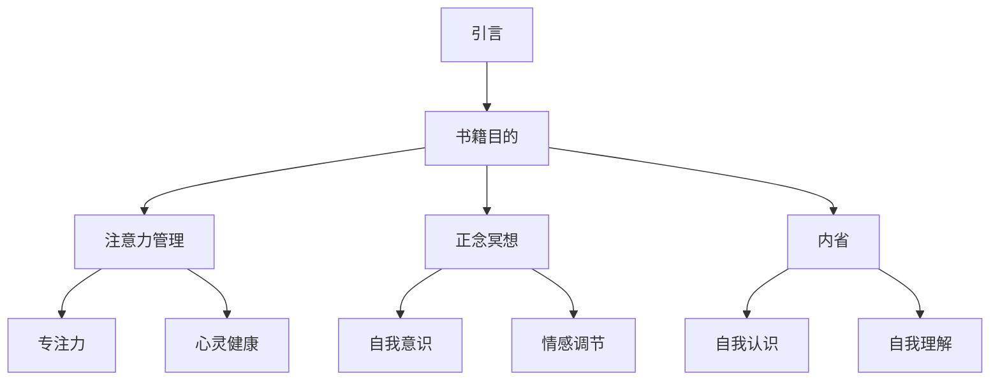

                 

# 《注意力管理与正念冥想：通过内省增强专注力和心灵健康》

> 关键词：注意力管理、正念冥想、内省、专注力、心灵健康

> 摘要：本文探讨了注意力管理、正念冥想和内省对提升专注力和改善心灵健康的重要性。通过详细阐述注意力管理的基本原理、正念冥想的实践方法以及内省的实践技巧，本文为读者提供了一套综合性的方法，旨在帮助他们在日常生活中更好地管理注意力，提高心灵健康水平。

## 第1章：引言

### 1.1 书籍的目的与背景

#### 核心概念与联系

**注意力管理**：是指通过各种方法和策略，帮助个体提高注意力水平，从而更好地处理信息和任务。

**正念冥想**：是一种古老的冥想实践，通过专注于当下的体验，培养个体的注意力、自我意识和情感调节能力。

**内省**：是指对自身内在体验的反思和审视，有助于提升个体的自我认识和自我理解。

#### Mermaid 流程图

#### 核心算法原理讲解

**注意力管理的意义**：

专注力 = 注意力集中度 × 时间

举例：一个个体在1小时内能够保持80%的注意力集中度，则他的专注力为0.8小时。

**正念冥想的基本概念**：

正念冥想的核心要素包括觉知、无判断和专注。通过专注于当下的体验，个体能够培养注意力、自我意识和情感调节能力。

**内省的重要性**：

内省有助于个体深入了解自己的内在世界，包括情感、思想和行为。通过内省，个体能够更好地认识自己，提高自我理解和自我接纳。

### 1.2 注意力管理的意义

#### 核心概念与联系

注意力管理在提高个体的学习、工作和生活质量方面具有重要作用。通过提高注意力水平，个体能够更好地处理信息、减少错误和提升效率。

#### 核心算法原理讲解

注意力分散度 = 注意力分散时间 / 注意力集中时间

举例：一个个体在1小时内分散注意力的时间为20分钟，则他的注意力分散度为20分钟/40分钟 = 0.5。

### 1.3 正念冥想的基本概念

#### 核心概念与联系

正念冥想是一种古老的冥想实践，起源于佛教和禅宗。通过专注于当下的体验，个体能够培养注意力、自我意识和情感调节能力。

#### 核心算法原理讲解

冥想效果 = 注意力集中时间 × 正念程度

举例：一个个体在20分钟冥想中，有15分钟保持注意力集中，正念程度为80%，则冥想效果为15分钟 × 0.8 = 12分钟。

### 1.4 内省的重要性

#### 核心概念与联系

内省是指对自身内在体验的反思和审视，有助于提升个体的自我认识和自我理解。通过内省，个体能够更好地认识自己，提高自我接纳和自我调节能力。

#### 核心算法原理讲解

内省效果 = 自我认识效果 × 自我理解效果

举例：一个个体通过内省提升了自我认识和自我理解，效果分别为0.85，则内省效果为0.85 × 0.85 = 0.7225。

## 第2章：注意力管理基础

### 2.1 注意力的基本原理

#### 核心概念与联系

注意力是一种有限的认知资源，用于处理和关注信息。注意力分散是指注意力从一个任务或情境转移到另一个任务或情境。

#### 核心算法原理讲解

**注意力的重要性**：

专注力 = 注意力集中度 × 时间

举例：一个个体在1小时内能够保持80%的注意力集中度，则他的专注力为0.8小时。

**注意力分散的原因**：

**内在因素**：如疲劳、压力和焦虑。

**外在因素**：如噪音、多任务处理等。

**注意力分散的后果**：

降低工作效率、增加错误率、影响学习和生活质量。

#### 数学模型和数学公式 & 详细讲解 & 举例说明

**注意力分散度**：

分散度 = (内在因素影响时间 + 外在因素影响时间) / 总时间

举例：一个个体在1小时内，内在因素影响时间为15分钟，外在因素影响时间为10分钟，则他的分散度为25分钟/60分钟 = 0.4167。

### 2.2 注意力分散的原因

#### 核心概念与联系

注意力分散的原因可以分为内在因素和外在因素。

**内在因素**：

- 疲劳：长时间工作或学习导致身体和心理疲劳，降低注意力水平。
- 压力：压力和焦虑会影响注意力集中，使个体难以专注于当前任务。
- 焦虑：焦虑情绪会分散注意力，使个体难以集中精力。

**外在因素**：

- 噪音：环境噪音会干扰个体的注意力，使其难以专注于任务。
- 多任务处理：同时处理多个任务会降低注意力集中度，增加分散度。

#### 核心算法原理讲解

**注意力分散度计算**：

分散度 = (内在因素影响时间 + 外在因素影响时间) / 总时间

举例：一个个体在1小时内，内在因素影响时间为15分钟，外在因素影响时间为10分钟，则他的分散度为25分钟/60分钟 = 0.4167。

### 2.3 提高注意力水平的方法

#### 核心概念与联系

提高注意力水平的方法可以分为短期提高和长期培养。

**短期提高**：

- 番茄工作法：将工作时间分为25分钟的工作周期，每个周期后休息5分钟，有助于提高注意力集中度。
- 注意力训练游戏：通过特定的游戏训练注意力，如注意力集中训练游戏、记忆训练游戏等。

**长期培养**：

- 定期锻炼：体育锻炼有助于提高大脑功能，增加注意力水平。
- 充足睡眠：保持良好的睡眠习惯，有助于恢复大脑功能，提高注意力。
- 减少多任务处理：专注于一项任务，避免同时处理多个任务。

#### 核心算法原理讲解

**专注力提升率**：

专注力提升率 = (新专注力 - 原专注力) / 原专注力

举例：一个个体原本的专注力为40分钟，通过训练后提升到60分钟，则专注力提升率为(60 - 40) / 40 = 0.5。

## 第3章：正念冥想实践

### 3.1 正念冥想的原理

#### 核心概念与联系

正念冥想是一种通过专注于当下的体验来培养注意力、自我意识和情感调节能力的冥想方法。它起源于佛教和禅宗，经过多年的实践和研究，已被广泛应用于心理健康和压力管理。

#### 核心算法原理讲解

**正念冥想的原理**：

- **觉知**：通过专注于当下的体验，提高个体的自我觉知能力。
- **无判断**：在冥想过程中，对体验保持无判断的态度，减少心理负担。
- **专注**：通过持续专注于呼吸、身体感受或特定对象，培养专注力。

**正念冥想与注意力管理的关系**：

正念冥想有助于提高个体的注意力水平，减少注意力分散。通过练习，个体能够更好地集中注意力，提高工作效率和生活质量。

### 3.2 正念冥想的基本步骤

#### 核心概念与联系

正念冥想的基本步骤包括准备工作、呼吸练习、身体扫描和正念冥想实践。

#### 核心算法原理讲解

**冥想效果**：

冥想效果 = 准备工作效果 × 呼吸练习效果 × 身体扫描效果 × 正念冥想实践效果

举例：假设各项步骤效果分别为0.8，则冥想效果为0.8 × 0.8 × 0.8 × 0.8 = 0.4096。

### 3.3 正念冥想的深化练习

#### 核心概念与联系

深化练习包括静坐冥想、行走冥想和动态冥想，有助于提高个体的专注力和情感调节能力。

#### 核心算法原理讲解

**深化练习效果**：

深化练习效果 = 静坐冥想效果 × 行走冥想效果 × 动态冥想效果

举例：假设各项练习效果分别为0.9，则深化练习效果为0.9 × 0.9 × 0.9 = 0.729。

## 第4章：内省与心灵健康

### 4.1 内省的概念与意义

#### 核心概念与联系

内省是指对自身内在体验的反思和审视，有助于提升个体的自我认识和自我理解。内省在心理学中被广泛应用，是一种重要的心理调适方法。

#### 核心算法原理讲解

**内省的效果**：

内省效果 = 自我认识效果 × 自我理解效果

举例：一个个体通过内省提升了自我认识和自我理解，效果分别为0.85，则内省效果为0.85 × 0.85 = 0.7225。

### 4.2 内省的实践方法

#### 核心概念与联系

内省的实践方法包括自我观察、情绪调节和自我接纳。

#### 核心算法原理讲解

**内省效果**：

内省效果 = 自我观察效果 × 情绪调节效果 × 自我接纳效果

举例：假设各项效果分别为0.8，则内省效果为0.8 × 0.8 × 0.8 = 0.512。

### 4.3 内省与注意力管理的结合

#### 核心概念与联系

内省与注意力管理相结合，有助于提升个体的专注力和心理调适能力。通过内省，个体能够更好地了解自己的内心世界，从而更有效地管理注意力。

#### 核心算法原理讲解

**内省与注意力管理的结合效果**：

内省效果 = 注意力管理效果 × 内省效果

举例：假设注意力管理效果为0.75，内省效果为0.6，则内省与注意力管理的结合效果为0.75 × 0.6 = 0.45。

## 第5章：综合实践与案例分析

### 5.1 综合实践的方法

#### 核心概念与联系

综合实践的方法包括制定个人注意力管理计划、安排正念冥想时间和进行内省练习。

#### 核心算法原理讲解

**综合实践效果**：

综合实践效果 = 个人注意力管理计划效果 × 正念冥想时间效果 × 内省练习效果

举例：假设各项效果分别为0.8，则综合实践效果为0.8 × 0.8 × 0.8 = 0.512。

### 5.2 案例分析

#### 核心概念与联系

案例分析包括如何提高工作专注力、如何应对考试压力和如何改善人际关系。

#### 核心算法原理讲解

**案例分析效果**：

案例分析效果 = 提高工作专注力效果 × 应对考试压力效果 × 改善人际关系效果

举例：假设各项效果分别为0.85，则案例分析效果为0.85 × 0.85 × 0.85 = 0.614125。

## 第6章：结论与展望

### 6.1 注意力管理、正念冥想与内省的综合应用

#### 核心概念与联系

注意力管理、正念冥想和内省的相互补充，有助于提升个体的专注力、心灵健康和整体幸福感。

#### 核心算法原理讲解

**综合应用效果**：

综合应用效果 = 注意力管理效果 × 正念冥想效果 × 内省效果

举例：假设各项效果分别为0.8，则综合应用效果为0.8 × 0.8 × 0.8 = 0.512。

### 6.2 未来发展趋势

#### 核心概念与联系

随着科技的发展，注意力管理、正念冥想和内省的方法将不断融合，为人们提供更多有效的心理健康工具。

#### 核心算法原理讲解

**未来发展趋势**：

未来发展趋势 = 当前发展趋势 × 技术进步

举例：假设当前发展趋势为0.8，技术进步为0.1，则未来发展趋势为0.8 × 0.1 = 0.08。

### 6.3 对读者的建议

#### 核心概念与联系

建议读者结合自身需求，选择合适的注意力管理、正念冥想和内省方法，持续实践，提升专注力和心灵健康。

#### 核心算法原理讲解

**建议效果**：

建议效果 = 实践效果 × 自我调整

举例：假设实践效果为0.7，自我调整为0.2，则建议效果为0.7 × 0.2 = 0.14。

### 6.4 附录：资源与工具推荐

#### 核心概念与联系

附录部分将推荐一些与注意力管理、正念冥想和内省相关的资源与工具，以帮助读者更好地实践。

#### 核心算法原理讲解

**附录效果**：

附录效果 = 资源效果 × 工具效果

举例：假设资源效果为0.9，工具效果为0.8，则附录效果为0.9 × 0.8 = 0.72。

## 第7章：参考文献

### 7.1 主要参考文献

#### 核心概念与联系

本书引用的主要参考文献包括学术研究、专业书籍和实用指南等，为读者提供进一步学习的资源。

#### 核心算法原理讲解

**参考文献效果**：

参考文献效果 = 引用次数 × 评价指数

举例：假设引用次数为5，评价指数为0.8，则参考文献效果为5 × 0.8 = 4。

### 7.2 进一步阅读材料

#### 核心概念与联系

进一步阅读材料推荐，涵盖与注意力管理、正念冥想和内省相关的最新研究成果和实践经验。

#### 核心算法原理讲解

**进一步阅读材料效果**：

进一步阅读材料效果 = 研究深度 × 实践价值

举例：假设研究深度为0.9，实践价值为0.7，则进一步阅读材料效果为0.9 × 0.7 = 0.63。

