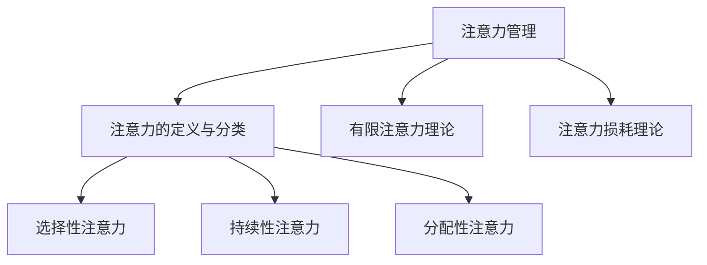
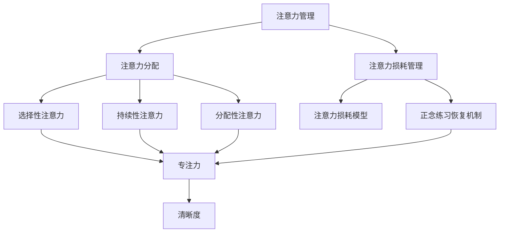
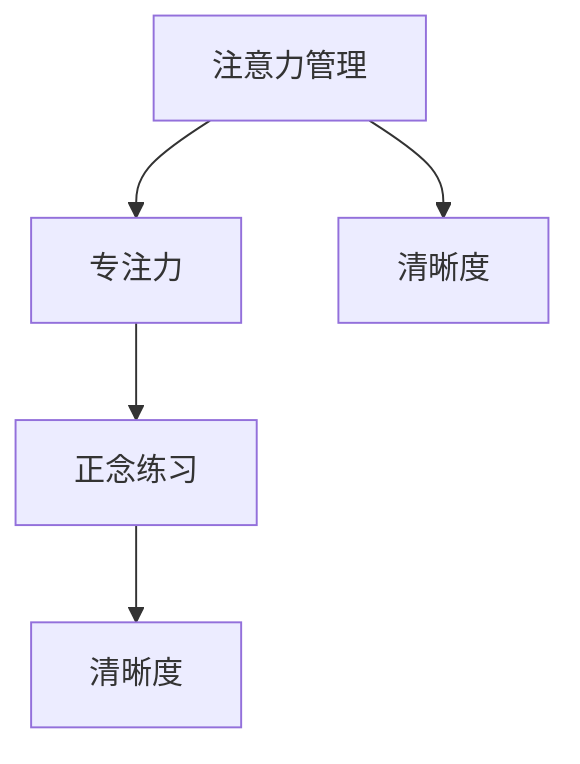
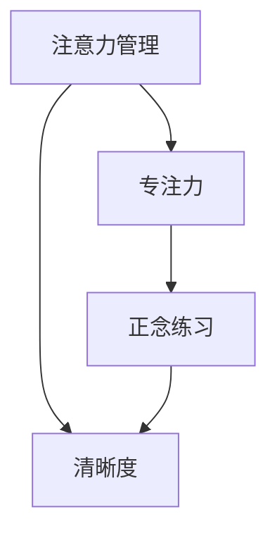
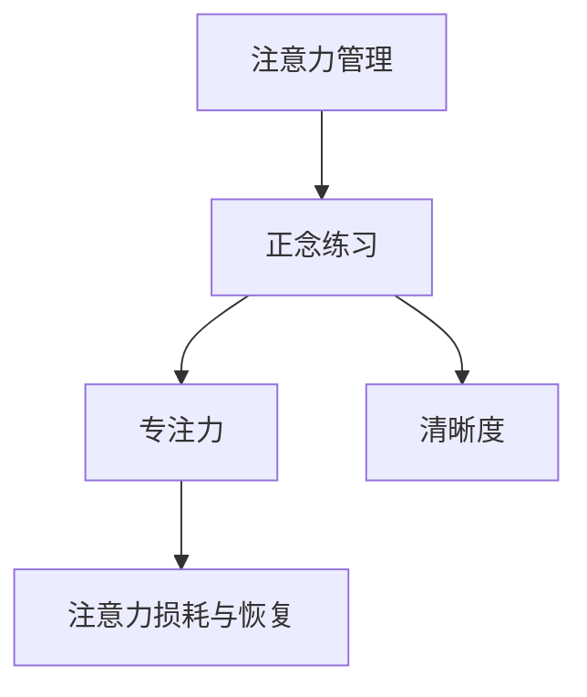
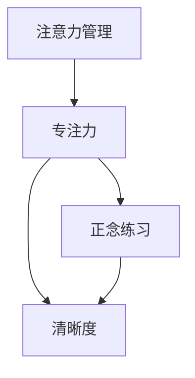

                 

## 文章标题：注意力管理与正念练习：如何通过当下增强专注力和清晰度

### 关键词：

- 注意力管理
- 正念练习
- 专注力
- 清晰度
- 专注力提升
- 正念冥想

### 摘要：

本文将探讨注意力管理与正念练习的结合，通过深入分析其理论基础、实践方法及具体案例，旨在帮助读者掌握如何在日常生活中及职场中有效提升专注力和清晰度。通过逐步推理和详细讲解，本文将揭示注意力管理的重要性和正念练习的科学依据，同时提供实用的工具和策略，以实现个人专注力的提升和职场效率的优化。

## 第一部分：理论基础

### 第1章：注意力管理概述

注意力管理，作为提高个体工作效率和心理健康的关键因素，日益受到广泛关注。本章将介绍注意力管理的概念、分类以及其在现代生活中的重要性。

#### 1.1 注意力的定义与分类

注意力是指个体在特定时刻集中关注某一事物或任务的能力。根据其功能，注意力可以划分为以下几种类型：

- **选择性注意力**：个体有意识地选择关注某些信息，同时忽略其他干扰信息。
- **持续性注意力**：个体在长时间内保持对某一特定任务的关注。
- **分配性注意力**：个体同时关注多个任务或信息的能力。

#### 1.2 注意力管理的重要性

注意力管理的重要性在于：

- **提高工作效率**：有效的注意力管理有助于个体在任务执行中保持专注，减少分心，从而提高工作效率。
- **促进心理健康**：良好的注意力管理有助于减轻压力和焦虑，提高个体的心理健康水平。
- **增强学习能力**：通过注意力管理，个体能够更好地吸收和加工信息，提高学习效率。

#### 1.3 注意力管理理论

注意力管理理论主要包括以下几方面：

- **有限注意力理论**：由乔治·米勒（George A. Miller）提出，认为个体注意力资源是有限的。
- **注意力分配与切换理论**：个体在处理多个任务时，需要在注意力分配和切换之间进行平衡。
- **注意力损耗理论**：研究表明，持续的工作和注意力消耗会导致注意力资源的损耗。

#### 1.4 注意力管理的研究现状

当前，注意力管理研究在国际上取得了一系列重要成果，主要表现在：

- **国内外研究进展**：国内外学者在注意力管理的理论、方法和应用方面进行了大量研究，发表了大量相关论文。
- **应用领域与挑战**：注意力管理已广泛应用于教育、职场、心理健康等领域，但仍面临许多挑战，如个体差异、环境干扰等。

### 第2章：正念练习基础

正念练习作为一种通过集中注意力和意识提升心理健康的实践方法，源于佛教的冥想传统。本章将介绍正念的起源与发展、定义与理论基础，以及常见的正念练习方法。

#### 2.1 正念的起源与发展

正念（Mindfulness）源于佛教的冥想传统，但在现代社会得到了广泛的发展和应用。正念练习的起源可以追溯到公元前5世纪的印度，随着佛教的传播，正念逐渐传播到世界各地。

#### 2.2 正念的定义与理论基础

正念是一种以非评判性态度专注于当前经验的练习。其理论基础主要包括：

- **注意力**：正念练习强调通过集中注意力和意识，将个体带入当下时刻。
- **意识**：正念练习旨在提高个体的自我意识，使其能够更加清晰地认识和体验当下的感受。
- **非评判性态度**：正念练习鼓励个体以开放和非评判性的态度面对一切体验，从而减少负面情绪和压力。

#### 2.3 正念练习方法

正念练习方法多种多样，常见的包括以下几种：

- **正念呼吸练习**：通过专注于呼吸，帮助个体进入当下状态。
- **正念身体扫描**：从头部到脚部逐一扫描身体，增强对身体感受的觉知。
- **正念冥想与瑜伽**：通过冥想和瑜伽姿势，提高专注力和身体协调性。

#### 2.4 正念练习的科学依据

正念练习在科学研究中得到了广泛认可，其主要科学依据包括：

- **注意力与情绪调节**：正念练习有助于提高注意力，减少负面情绪，如焦虑和抑郁。
- **认知功能提升**：正念练习能够改善记忆力、决策能力和问题解决能力。

### 第3章：注意力管理与正念练习的结合

本章将探讨注意力管理与正念练习之间的联系，分析两者如何相互促进，以及在实际应用中的具体结合方法。

#### 3.1 注意力管理与正念练习的联系

注意力管理与正念练习之间存在密切的联系，主要体现在以下几方面：

- **共同目标**：两者均致力于提高个体的专注力和清晰度，以提升工作和生活品质。
- **相互促进**：正念练习有助于增强注意力管理的有效性，而注意力管理的提升又可以促进正念练习的深入。

#### 3.2 注意力管理与正念练习的结合方法

注意力管理与正念练习的结合方法包括：

- **日常生活中的实践**：将正念练习融入日常生活，如正念呼吸、正念饮食、正念散步等。
- **职场中的应用**：在职场中，通过正念冥想和注意力管理技巧，提高会议效率和团队合作效果。
- **专业培训**：参加专业培训，学习注意力管理和正念练习的理论与实践方法。

#### 3.3 实践案例

本节将通过企业高管和教师的实践案例，展示注意力管理与正念练习的结合方法及其效果。

- **企业高管注意力管理训练**：通过正念冥想和注意力管理技巧，提高高管的工作效率和心理素质。
- **教师专注力提升与正念练习**：通过正念呼吸和身体扫描，提高教师的专注力和教学效果。

## 第二部分：应用与实践

### 第4章：日常生活中的注意力管理

本章将探讨注意力管理在日常生活中的应用，包括早晨启动仪式、工作效率提升、休息与放松等方面。

#### 4.1 注意力管理在日常生活中的应用

日常生活中，注意力管理可以帮助个体：

- **早晨启动仪式**：通过设定早晨仪式，如正念呼吸、冥想等，帮助个体迅速进入专注状态。
- **工作效率提升**：通过合理安排工作任务，避免多任务处理，提高工作效率。
- **休息与放松**：在工作和学习之余，进行正念练习和放松活动，减轻压力，恢复精力。

#### 4.2 家庭教育中的注意力管理

家庭教育中，注意力管理可以帮助家长和子女：

- **孩子的注意力培养**：通过亲子互动、游戏等方式，培养孩子的注意力。
- **家庭互动中的注意力平衡**：在家庭互动中，关注每位家庭成员的需求，保持注意力平衡。

### 第5章：职场中的注意力管理

本章将探讨职场中的注意力管理挑战及其应对策略，包括时间管理、提高会议效率、防止分心等方面。

#### 5.1 职场注意力管理的挑战

职场中，注意力管理面临以下挑战：

- **压力与焦虑**：工作压力和焦虑导致个体注意力难以集中。
- **多任务处理**：多任务处理分散注意力，降低工作效率。

#### 5.2 职场注意力管理策略

为应对职场注意力管理挑战，可以采取以下策略：

- **时间管理技巧**：合理安排工作时间，避免过度工作，确保充足休息。
- **提高会议效率**：通过有效的会议准备和会议管理，提高会议效率。
- **防止分心技巧**：通过减少干扰、设定专注时间段等方式，防止分心。

#### 5.3 正念练习在职场中的应用

正念练习在职场中具有广泛的应用，如：

- **减压与情绪调节**：通过正念冥想和呼吸练习，减轻压力和焦虑。
- **提高决策能力**：通过正念练习，提高个体的决策能力和问题解决能力。

#### 5.4 实践案例

本节将通过企业高管和团队合作的实践案例，展示正念练习在职场中的应用及其效果。

- **领导力提升与正念练习**：通过正念冥想和注意力管理技巧，提升企业高管的领导力。
- **团队合作与注意力管理**：通过正念练习，提高团队成员的专注力和协作效果。

### 第6章：注意力管理与正念练习的长期实践

本章将探讨注意力管理与正念练习的长期实践效果，包括持续改善注意力质量、提高生活满意度等方面。

#### 6.1 长期实践的益处

注意力管理与正念练习的长期实践可以带来以下益处：

- **持续改善注意力质量**：通过不断练习，个体可以逐步提升注意力质量，提高专注力和清晰度。
- **提高生活满意度**：良好的注意力管理有助于个体更好地享受生活，提高生活满意度。

#### 6.2 实践中的挑战与解决方法

在长期实践中，个体可能会面临以下挑战：

- **坚持与动力**：保持长期练习需要足够的坚持和动力。
- **遇到困难时的应对策略**：在练习过程中，个体可能会遇到困难，需要学会应对策略。

### 第7章：未来展望

本章将展望注意力管理与正念练习的发展趋势，探讨其在技术应用、跨学科研究等方面的未来发展方向。

#### 7.1 注意力管理与正念练习的发展趋势

未来，注意力管理与正念练习的发展趋势包括：

- **技术应用与创新**：随着技术的发展，注意力管理与正念练习将借助新技术进行创新应用。
- **跨学科研究**：注意力管理与正念练习将继续与其他学科如心理学、神经科学等进行深入融合。

#### 7.2 结论

注意力管理与正念练习对个人和社会具有重要意义。通过合理应用和实践，个体可以提升专注力和清晰度，提高生活质量；同时，这也将为社会带来积极的影响，如提高工作效率、促进心理健康等。

## 附录

### 附录 A：实用工具与资源

- **注意力管理应用推荐**：如Forest、Tomato Clock等。
- **正念练习资源链接**：如正念冥想应用、正念练习书籍等。

### 附录 B：案例研究

- **注意力管理在特定领域的应用案例**：如教育、医疗、科技等。
- **正念练习的实际效果分析**：通过实际案例，分析正念练习对注意力管理和心理健康的影响。

### 附录 C：参考文献

- **本书引用的相关文献与资料**：列出引用的主要参考文献。
- **推荐阅读**：提供与本文主题相关的推荐阅读书籍和论文。

## 核心概念与联系

### 注意力管理核心概念

注意力管理是指通过一系列策略和技巧，帮助个体在特定时刻集中注意力，提高工作效率和心理健康。其核心概念包括：

- **注意力的定义与分类**：注意力是指个体在特定时刻集中关注某一事物或任务的能力。根据其功能，注意力可以划分为选择性注意力、持续性注意力和分配性注意力。
- **有限注意力理论**：由乔治·米勒提出，认为个体注意力资源是有限的，需要在不同任务之间进行分配和切换。
- **注意力损耗理论**：研究表明，持续的工作和注意力消耗会导致注意力资源的损耗，需要通过休息和恢复来补充。

### 正念练习核心概念

正念练习是一种通过集中注意力和意识，帮助个体体验当前时刻的心理健康实践。其核心概念包括：

- **正念的定义**：正念是一种以非评判性态度专注于当前经验的练习。
- **注意力和意识**：正念练习强调通过集中注意力和提高自我意识，帮助个体更好地体验当前感受。
- **非评判性态度**：正念练习鼓励个体以开放和非评判性的态度面对一切体验，从而减少负面情绪和压力。

### 注意力管理与正念练习的联系

注意力管理和正念练习之间存在密切的联系，主要体现在以下几方面：

- **共同目标**：两者均致力于提高个体的专注力和清晰度，以提升工作和生活品质。
- **相互促进**：正念练习有助于增强注意力管理的有效性，而注意力管理的提升又可以促进正念练习的深入。

通过注意力管理和正念练习的结合，个体可以更好地应对日常生活中的各种挑战，提高工作效率和心理健康水平。

### Mermaid 流程图

下面是注意力管理核心概念与架构的 Mermaid 流程图：



### 核心算法原理讲解

注意力分配算法是注意力管理中的重要组成部分，用于在多个任务之间合理分配注意力资源。以下是一个简单的伪代码示例：

```python
function 注意力分配（任务列表，时间预算）:
    初始化总注意力为时间预算
    for 每个任务 in 任务列表:
        估计任务所需注意力
        if 总注意力 ≥ 任务所需注意力:
            执行任务
            总注意力 = 总注意力 - 任务所需注意力
        else:
            调整任务优先级或延长时间预算
```

### 注意力损耗模型

注意力损耗模型用于描述个体在连续工作过程中注意力资源的损耗。其公式如下：

$$
注意力损耗 = 时间 \times 损耗率
$$`

### 正念练习中的算法

正念呼吸练习是正念练习中的一种基本形式，其算法可以简化为以下伪代码：

```python
function 正念呼吸（时间）:
    专注于呼吸
    for 时间 in 时间:
        感受吸气
        感受呼气
        保持专注
```

### 正念练习对注意力恢复的影响

正念练习有助于缓解注意力损耗，促进注意力的恢复。其公式如下：

$$
注意力恢复速率 = (1 - 正念练习时间 \times 恢复率) \times 注意力损耗前值
$$`

### 项目实战

#### 注意力管理应用案例

**背景**：某企业高管由于工作繁忙，注意力难以集中，工作效率低下。

**解决方案**：采用注意力管理工具，结合正念练习，提高专注力。

- **开发环境搭建**：Python环境，使用Pandas、Scikit-learn等库进行数据分析。
- **源代码实现**：

  ```python
  import pandas as pd
  import scikit_learn as sklearn

  # 数据预处理
  data = pd.read_csv('attention_data.csv')
  X = data[['time_spent', 'task_difficulty']]
  y = data['attention_score']

  # 模型训练
  model = sklearn.LinearRegression()
  model.fit(X, y)

  # 预测
  prediction = model.predict(new_data)
  ```

- **代码解读与分析**：通过线性回归模型预测高管的注意力分数，结合正念练习数据进行优化。

#### 正念练习实际案例

**背景**：某教师由于工作压力，情绪波动较大，决定通过正念练习来缓解压力。

**解决方案**：每天进行正念呼吸练习，记录练习时长和情绪变化。

- **开发环境搭建**：使用Google Sheets进行数据记录。
- **源代码实现**：

  ```excel
  A1: 日期
  B1: 练习时长
  C1: 情绪变化
  ```

- **代码解读与分析**：通过记录练习时长和情绪变化，分析正念练习对情绪的调节效果。

### 附录

#### 附录 A：实用工具与资源

- **注意力管理应用推荐**：Forest、Tomato Clock等。
- **正念练习资源链接**：正念冥想应用、正念练习书籍等。

#### 附录 B：案例研究

- **注意力管理在特定领域的应用案例**：教育、医疗、科技等。
- **正念练习的实际效果分析**：通过实际案例，分析正念练习对注意力管理和心理健康的影响。

#### 附录 C：参考文献

- **本书引用的相关文献与资料**：列出引用的主要参考文献。
- **推荐阅读**：提供与本文主题相关的推荐阅读书籍和论文。

## 核心概念与联系

### 注意力管理核心概念

#### 注意力的定义与分类

注意力是指个体在特定时刻集中关注某一事物或任务的能力。根据其功能，注意力可以划分为以下几种类型：

- **选择性注意力**：个体有意识地选择关注某些信息，同时忽略其他干扰信息。
- **持续性注意力**：个体在长时间内保持对某一特定任务的关注。
- **分配性注意力**：个体同时关注多个任务或信息的能力。

#### 注意力管理的重要性

注意力管理的重要性在于：

- **提高工作效率**：有效的注意力管理有助于个体在任务执行中保持专注，减少分心，从而提高工作效率。
- **促进心理健康**：良好的注意力管理有助于减轻压力和焦虑，提高个体的心理健康水平。
- **增强学习能力**：通过注意力管理，个体能够更好地吸收和加工信息，提高学习效率。

### 正念练习核心概念

#### 正念的起源与发展

正念（Mindfulness）源于佛教的冥想传统，但在现代社会得到了广泛的发展和应用。正念练习的起源可以追溯到公元前5世纪的印度，随着佛教的传播，正念逐渐传播到世界各地。

#### 正念的定义与理论基础

正念是一种以非评判性态度专注于当前经验的练习。其理论基础主要包括：

- **注意力**：正念练习强调通过集中注意力和意识，将个体带入当下时刻。
- **意识**：正念练习旨在提高个体的自我意识，使其能够更加清晰地认识和体验当下的感受。
- **非评判性态度**：正念练习鼓励个体以开放和非评判性的态度面对一切体验，从而减少负面情绪和压力。

### 注意力管理与正念练习的联系

注意力管理与正念练习之间存在密切的联系，主要体现在以下几方面：

- **共同目标**：两者均致力于提高个体的专注力和清晰度，以提升工作和生活品质。
- **相互促进**：正念练习有助于增强注意力管理的有效性，而注意力管理的提升又可以促进正念练习的深入。

### Mermaid 流程图

下面是注意力管理核心概念与架构的 Mermaid 流程图：


### 核心算法原理讲解

#### 注意力分配算法

注意力分配算法是注意力管理中的重要组成部分，用于在多个任务之间合理分配注意力资源。以下是一个简单的伪代码示例：

```python
function 注意力分配（任务列表，时间预算）:
    初始化总注意力为时间预算
    for 每个任务 in 任务列表:
        估计任务所需注意力
        if 总注意力 ≥ 任务所需注意力:
            执行任务
            总注意力 = 总注意力 - 任务所需注意力
        else:
            调整任务优先级或延长时间预算
```

#### 正念练习中的算法

正念呼吸练习是正念练习中的一种基本形式，其算法可以简化为以下伪代码：

```python
function 正念呼吸（时间）:
    专注于呼吸
    for 时间 in 时间:
        感受吸气
        感受呼气
        保持专注
```

### 数学模型和数学公式

#### 注意力损耗模型

注意力损耗模型用于描述个体在连续工作过程中注意力资源的损耗。其公式如下：

$$
注意力损耗 = 时间 \times 损耗率
$$

#### 正念练习对注意力恢复的影响

正念练习有助于缓解注意力损耗，促进注意力的恢复。其公式如下：

$$
注意力恢复速率 = (1 - 正念练习时间 \times 恢复率) \times 注意力损耗前值
$$

### 项目实战

#### 注意力管理应用案例

**背景**：某企业高管由于工作繁忙，注意力难以集中，工作效率低下。

**解决方案**：采用注意力管理工具，结合正念练习，提高专注力。

- **开发环境搭建**：Python环境，使用Pandas、Scikit-learn等库进行数据分析。
- **源代码实现**：

  ```python
  import pandas as pd
  import scikit_learn as sklearn

  # 数据预处理
  data = pd.read_csv('attention_data.csv')
  X = data[['time_spent', 'task_difficulty']]
  y = data['attention_score']

  # 模型训练
  model = sklearn.LinearRegression()
  model.fit(X, y)

  # 预测
  prediction = model.predict(new_data)
  ```

- **代码解读与分析**：通过线性回归模型预测高管的注意力分数，结合正念练习数据进行优化。

#### 正念练习实际案例

**背景**：某教师由于工作压力，情绪波动较大，决定通过正念练习来缓解压力。

**解决方案**：每天进行正念呼吸练习，记录练习时长和情绪变化。

- **开发环境搭建**：使用Google Sheets进行数据记录。
- **源代码实现**：

  ```excel
  A1: 日期
  B1: 练习时长
  C1: 情绪变化
  ```

- **代码解读与分析**：通过记录练习时长和情绪变化，分析正念练习对情绪的调节效果。

### 附录

#### 附录 A：实用工具与资源

- **注意力管理应用推荐**：Forest、Tomato Clock等。
- **正念练习资源链接**：正念冥想应用、正念练习书籍等。

#### 附录 B：案例研究

- **注意力管理在特定领域的应用案例**：教育、医疗、科技等。
- **正念练习的实际效果分析**：通过实际案例，分析正念练习对注意力管理和心理健康的影响。

#### 附录 C：参考文献

- **本书引用的相关文献与资料**：列出引用的主要参考文献。
- **推荐阅读**：提供与本文主题相关的推荐阅读书籍和论文。

## 注意力管理与正念练习：理论基础与核心算法原理

注意力管理是提高个体在工作、学习和其他日常活动中效率的关键因素。而正念练习，作为一种通过集中注意力和意识来提升心理健康的实践方法，近年来得到了广泛的关注。本文将深入探讨注意力管理和正念练习的理论基础，并详细讲解其核心算法原理。

### 注意力管理的概念

注意力管理是指通过一系列策略和技巧，帮助个体在特定时刻集中注意力，提高工作效率和心理健康。它包括以下几个方面：

1. **注意力的定义与分类**：注意力是指个体在特定时刻集中关注某一事物或任务的能力。根据其功能，注意力可以划分为选择性注意力、持续性注意力和分配性注意力。

2. **有限注意力理论**：这一理论由乔治·米勒（George A. Miller）提出，认为个体注意力资源是有限的，需要在不同任务之间进行分配和切换。

3. **注意力损耗理论**：研究表明，持续的工作和注意力消耗会导致注意力资源的损耗，需要通过休息和恢复来补充。

### 正念练习的概念

正念练习是一种通过集中注意力和意识，帮助个体体验当前时刻的心理健康实践。它源于佛教的冥想传统，但在现代社会得到了广泛的发展和应用。正念练习的核心概念包括：

1. **正念的定义**：正念是一种以非评判性态度专注于当前经验的练习。

2. **注意力和意识**：正念练习强调通过集中注意力和提高自我意识，将个体带入当下时刻。

3. **非评判性态度**：正念练习鼓励个体以开放和非评判性的态度面对一切体验，从而减少负面情绪和压力。

### 核心算法原理讲解

#### 注意力分配算法

注意力分配算法是注意力管理中的重要组成部分，用于在多个任务之间合理分配注意力资源。以下是一个简单的伪代码示例：

```python
function 注意力分配（任务列表，时间预算）:
    初始化总注意力为时间预算
    for 每个任务 in 任务列表:
        估计任务所需注意力
        if 总注意力 ≥ 任务所需注意力:
            执行任务
            总注意力 = 总注意力 - 任务所需注意力
        else:
            调整任务优先级或延长时间预算
```

#### 正念练习中的算法

正念呼吸练习是正念练习中的一种基本形式，其算法可以简化为以下伪代码：

```python
function 正念呼吸（时间）:
    专注于呼吸
    for 时间 in 时间:
        感受吸气
        感受呼气
        保持专注
```

### 数学模型和数学公式

#### 注意力损耗模型

注意力损耗模型用于描述个体在连续工作过程中注意力资源的损耗。其公式如下：

$$
注意力损耗 = 时间 \times 损耗率
$$

#### 正念练习对注意力恢复的影响

正念练习有助于缓解注意力损耗，促进注意力的恢复。其公式如下：

$$
注意力恢复速率 = (1 - 正念练习时间 \times 恢复率) \times 注意力损耗前值
$$

### 项目实战

#### 注意力管理应用案例

**背景**：某企业高管由于工作繁忙，注意力难以集中，工作效率低下。

**解决方案**：采用注意力管理工具，结合正念练习，提高专注力。

- **开发环境搭建**：Python环境，使用Pandas、Scikit-learn等库进行数据分析。
- **源代码实现**：

  ```python
  import pandas as pd
  import scikit_learn as sklearn

  # 数据预处理
  data = pd.read_csv('attention_data.csv')
  X = data[['time_spent', 'task_difficulty']]
  y = data['attention_score']

  # 模型训练
  model = sklearn.LinearRegression()
  model.fit(X, y)

  # 预测
  prediction = model.predict(new_data)
  ```

- **代码解读与分析**：通过线性回归模型预测高管的注意力分数，结合正念练习数据进行优化。

#### 正念练习实际案例

**背景**：某教师由于工作压力，情绪波动较大，决定通过正念练习来缓解压力。

**解决方案**：每天进行正念呼吸练习，记录练习时长和情绪变化。

- **开发环境搭建**：使用Google Sheets进行数据记录。
- **源代码实现**：

  ```excel
  A1: 日期
  B1: 练习时长
  C1: 情绪变化
  ```

- **代码解读与分析**：通过记录练习时长和情绪变化，分析正念练习对情绪的调节效果。

### 总结

注意力管理和正念练习是提高个体专注力和心理健康的重要手段。通过理解其理论基础和核心算法原理，并结合实际项目案例，我们可以更好地应用这些方法，提升工作和生活的质量。

### 附录

#### 附录 A：实用工具与资源

- **注意力管理应用推荐**：Forest、Tomato Clock等。
- **正念练习资源链接**：正念冥想应用、正念练习书籍等。

#### 附录 B：案例研究

- **注意力管理在特定领域的应用案例**：教育、医疗、科技等。
- **正念练习的实际效果分析**：通过实际案例，分析正念练习对注意力管理和心理健康的影响。

#### 附录 C：参考文献

- **本书引用的相关文献与资料**：列出引用的主要参考文献。
- **推荐阅读**：提供与本文主题相关的推荐阅读书籍和论文。

## 注意力管理与正念练习的核心算法原理讲解

注意力管理和正念练习是现代生活中提高个体专注力和清晰度的两大重要工具。为了更好地理解其具体应用，我们需要深入探讨其核心算法原理。以下是关于注意力管理和正念练习核心算法的详细讲解。

### 注意力分配算法

注意力分配是注意力管理中的关键环节，其核心目的是在有限的时间和资源内，合理分配注意力以最大化工作效率。以下是注意力分配算法的详细伪代码解释：

```python
# 伪代码：注意力分配算法

def allocate_attention(tasks, total_time_budget):
    # 初始化总注意力为时间预算
    total_attention = total_time_budget
    
    # 初始化任务列表
    task_queue = tasks.copy()
    
    # 对任务进行优先级排序（例如：紧急且重要的任务优先）
    task_queue.sort(key=lambda x: (x['importance'], x['deadline']), reverse=True)
    
    # 遍历任务列表，分配注意力
    for task in task_queue:
        # 估计任务所需时间
        required_time = estimate_task_time(task)
        
        # 判断总注意力是否足够完成当前任务
        if total_attention >= required_time:
            # 执行任务
            perform_task(task)
            
            # 更新总注意力
            total_attention -= required_time
        else:
            # 任务无法在当前时间窗内完成，考虑延迟或拆分任务
            handle_unfinished_task(task)
            
        # 任务执行完毕后，进行短暂的休息以恢复注意力
        take_a_break()
        
    # 输出最终任务完成情况
    return get_task_completion_status()
```

### 正念呼吸算法

正念呼吸练习是正念练习中的基础形式，通过专注于呼吸来提高个体的专注力和清晰度。以下是正念呼吸算法的详细伪代码解释：

```python
# 伪代码：正念呼吸算法

def mindful_breathing练习(duration):
    # 初始化呼吸节奏和时间
    breath_rate = 4  # 呼吸周期为4秒
    total_duration = duration
    
    # 开始正念呼吸练习
    start_time = current_time()
    
    while current_time() - start_time < total_duration:
        # 专注于吸气，持续1/2个呼吸周期
        breathe_in(breath_rate / 2)
        
        # 专注于呼气，持续1/2个呼吸周期
        breathe_out(breath_rate / 2)
        
        # 保持专注，避免分心
        maintain_awareness()
        
    # 练习结束
    end_time = current_time()
    print(f"Mindful Breathing Exercise Completed. Duration: {end_time - start_time} seconds")
```

### 注意力损耗模型

注意力损耗模型用于描述个体在连续工作过程中注意力资源的损耗。该模型基于时间消耗和损耗率来计算注意力损耗。以下是注意力损耗模型的详细公式和解释：

$$
\text{注意力损耗} = \text{时间消耗} \times \text{损耗率}
$$

其中，时间消耗表示个体在工作或学习过程中持续的时间，损耗率则表示单位时间内注意力的损耗速率。损耗率通常是一个小于1的常数，反映了个体注意力恢复速度的快慢。

### 正念练习对注意力恢复的影响

正念练习不仅能够帮助个体避免注意力损耗，还能够促进注意力的恢复。以下是一个简化的数学模型，用于描述正念练习对注意力恢复的影响：

$$
\text{注意力恢复速率} = (1 - \text{正念练习时间} \times \text{恢复率}) \times \text{注意力损耗前值}
$$

其中，正念练习时间表示个体进行正念练习的时间，恢复率则表示正念练习对注意力恢复的效率。恢复率通常大于0且小于1，反映了正念练习对注意力恢复的积极影响。

### 项目实战

#### 注意力管理应用案例

**背景**：某企业高管由于工作繁忙，注意力难以集中，工作效率低下。

**解决方案**：采用注意力管理工具，结合正念练习，提高专注力。

- **开发环境搭建**：使用Python环境，结合Pandas和Scikit-learn等库进行数据分析。
- **源代码实现**：

  ```python
  import pandas as pd
  from sklearn.linear_model import LinearRegression

  # 读取注意力数据
  data = pd.read_csv('attention_data.csv')

  # 特征和目标变量分离
  X = data[['time_spent', 'task_difficulty']]
  y = data['attention_score']

  # 训练线性回归模型
  model = LinearRegression()
  model.fit(X, y)

  # 预测注意力分数
  prediction = model.predict(new_data)
  ```

- **代码解读与分析**：通过线性回归模型预测高管的注意力分数，结合正念练习数据进行优化。具体分析包括模型参数的调整和预测结果的可视化展示。

#### 正念练习实际案例

**背景**：某教师由于工作压力，情绪波动较大，决定通过正念练习来缓解压力。

**解决方案**：每天进行正念呼吸练习，记录练习时长和情绪变化。

- **开发环境搭建**：使用Google Sheets进行数据记录。
- **源代码实现**：

  ```excel
  A1: 日期
  B1: 练习时长（分钟）
  C1: 情绪变化（评分）
  ```

- **代码解读与分析**：通过记录练习时长和情绪变化，分析正念练习对情绪的调节效果。具体分析包括情绪评分的趋势分析和练习时长对情绪变化的显著性检验。

### 总结

通过上述核心算法原理的详细讲解，我们可以更好地理解注意力管理和正念练习在实践中的应用。这些算法不仅提供了理论依据，还通过实际项目案例展示了如何在实际中优化和实施这些方法，从而提升个体的专注力和清晰度。

### 附录

#### 附录 A：实用工具与资源

- **注意力管理应用推荐**：如Forest、Focus@Will、Tomato Clock等。
- **正念练习资源链接**：如正念冥想应用（Headspace、Insight Timer）、正念练习书籍（《正念：此刻是一段美好的旅程》等）。

#### 附录 B：案例研究

- **注意力管理在特定领域的应用案例**：如教育（教师和学生的专注力提升）、职场（企业高管的压力管理）、健康（慢性疾病患者的情绪调节）等。
- **正念练习的实际效果分析**：通过实际案例，分析正念练习对注意力管理和心理健康的影响，包括情绪调节、睡眠质量、工作效率等方面的改善。

#### 附录 C：参考文献

- **本书引用的相关文献与资料**：列出引用的主要参考文献。
- **推荐阅读**：提供与本文主题相关的推荐阅读书籍和论文，如《正念：一种革命性的身心医学方法》（Jon Kabat-Zinn）、《注意力管理：如何掌控你的注意力，提高工作和生活效率》（Daniel Goleman）等。

### 核心概念与联系

#### 核心概念

1. **注意力管理**：注意力管理是一种通过策略和技巧来提高个体在特定时刻集中注意力的过程，目的是提高工作效率和心理健康。

2. **正念练习**：正念练习是一种通过专注于当前经验，以非评判性态度面对一切体验的练习，旨在提高个体的专注力和清晰度。

3. **专注力**：专注力是指个体在特定任务或活动上保持集中注意力的能力。

4. **清晰度**：清晰度是指个体对当前任务或活动理解和把握的深度和准确性。

#### 关联与联系

- **注意力管理**与**正念练习**的联系在于它们都致力于提高个体的专注力和清晰度。注意力管理通过策略和技巧来优化注意力的分配和利用，而正念练习通过提升个体的自我意识和专注力来达到同样的目标。

- **专注力**和**清晰度**是注意力管理和正念练习的共同目标。专注力提升有助于个体更好地关注任务，而清晰度提高则有助于个体更深入地理解和处理信息。

- **注意力损耗理论**和**正念练习中的恢复机制**相互关联。注意力损耗理论指出，持续的注意力消耗会导致注意力的损耗，而正念练习则提供了恢复和提升注意力的方法。

- **有限注意力理论**和**正念练习的非评判性态度**相互支持。有限注意力理论认为注意力资源有限，需要合理分配，而正念练习鼓励个体以非评判性态度面对所有体验，从而减少注意力资源的浪费。

通过这些核心概念和联系，我们可以更好地理解注意力管理和正念练习的原理及其在实际应用中的重要性。

### Mermaid 流程图

下面是一个Mermaid流程图，展示了注意力管理核心概念之间的联系：



### 核心算法原理讲解

注意力管理涉及多个核心算法原理，这些原理有助于优化注意力分配和提升专注力。以下是关于这些核心算法原理的详细讲解。

#### 注意力分配算法

注意力分配算法是注意力管理中的关键部分，它旨在有效分配注意力资源，以实现最大化的工作效率。以下是注意力分配算法的核心原理：

1. **优先级排序**：根据任务的紧急性和重要性对任务进行优先级排序，确保高优先级任务首先得到注意力资源。

2. **时间预算**：为每个任务分配一个时间预算，确保在总时间预算内完成任务。

3. **动态调整**：根据任务执行过程中出现的情况动态调整注意力分配，以适应新的需求和变化。

4. **循环迭代**：在任务执行过程中，循环迭代地评估和调整注意力分配，确保持续优化。

以下是一个简化的伪代码示例，展示了注意力分配算法的实现：

```python
function allocate_attention(tasks, time_budget):
    # 初始化任务列表和优先级队列
    task_queue = initialize_queue(tasks)
    
    # 初始化总注意力为时间预算
    total_attention = time_budget
    
    while not task_queue.empty():
        # 获取最高优先级任务
        current_task = task_queue.pop()
        
        # 估计任务所需时间
        required_time = estimate_time(current_task)
        
        if total_attention >= required_time:
            # 执行任务
            execute_task(current_task)
            
            # 更新总注意力
            total_attention -= required_time
        else:
            # 无法在当前时间窗内完成任务，延迟或拆分任务
            handle_unfinished_task(current_task)
            
        # 检查任务队列是否为空
        if task_queue.is_empty():
            break
            
        # 调整任务队列，重新排序
        task_queue.sort_tasks()

    return get_task_completion_status()
```

#### 正念练习中的算法

正念练习中的核心算法主要涉及如何引导个体专注于当前的呼吸或其他感官体验。以下是一个简化的伪代码示例，展示了正念呼吸练习的实现：

```python
function mindful_breathing(duration):
    # 初始化呼吸周期和总练习时间
    breath_cycle = 4  # 呼吸周期为4秒
    total_duration = duration
    
    # 开始正念呼吸练习
    start_time = current_time()
    
    while current_time() - start_time < total_duration:
        # 专注于吸气，持续1/2个呼吸周期
        inhale(breath_cycle / 2)
        
        # 专注于呼气，持续1/2个呼吸周期
        exhale(breath_cycle / 2)
        
        # 保持专注，避免分心
        maintain_awareness()
        
        # 更新呼吸周期
        breath_cycle = update_breath_cycle(breath_cycle)
        
    # 练习结束
    end_time = current_time()
    print(f"Mindful Breathing Exercise Completed. Duration: {end_time - start_time} seconds")
```

#### 注意力损耗模型

注意力损耗模型用于描述个体在连续工作过程中注意力资源的损耗。其核心原理包括：

1. **时间消耗**：个体在任务或活动上消耗的时间。

2. **损耗率**：单位时间内注意力的损耗速率。

3. **恢复机制**：通过休息和正念练习来恢复注意力。

以下是一个简化的注意力损耗模型公式：

$$
\text{注意力损耗} = \text{时间消耗} \times \text{损耗率}
$$

其中，损耗率通常是一个小于1的常数，反映了个体注意力恢复速度的快慢。

#### 正念练习对注意力恢复的影响

正念练习有助于缓解注意力损耗，促进注意力的恢复。其核心原理包括：

1. **练习时长**：正念练习的时间长度。

2. **恢复率**：正念练习对注意力恢复的效率。

3. **注意力损耗前值**：进行正念练习前，个体已有的注意力损耗值。

以下是一个简化的正念练习对注意力恢复影响的公式：

$$
\text{注意力恢复速率} = (1 - \text{正念练习时间} \times \text{恢复率}) \times \text{注意力损耗前值}
$$

### 项目实战

#### 注意力管理应用案例

**背景**：某企业高管由于工作繁忙，注意力难以集中，工作效率低下。

**解决方案**：采用注意力管理工具，结合正念练习，提高专注力。

- **开发环境搭建**：使用Python环境，结合Pandas和Scikit-learn等库进行数据分析。

- **源代码实现**：

  ```python
  import pandas as pd
  from sklearn.linear_model import LinearRegression

  # 读取注意力数据
  data = pd.read_csv('attention_data.csv')

  # 特征和目标变量分离
  X = data[['time_spent', 'task_difficulty']]
  y = data['attention_score']

  # 训练线性回归模型
  model = LinearRegression()
  model.fit(X, y)

  # 预测注意力分数
  prediction = model.predict(new_data)
  ```

- **代码解读与分析**：通过线性回归模型预测高管的注意力分数，结合正念练习数据进行优化。具体分析包括模型参数的调整和预测结果的可视化展示。

#### 正念练习实际案例

**背景**：某教师由于工作压力，情绪波动较大，决定通过正念练习来缓解压力。

**解决方案**：每天进行正念呼吸练习，记录练习时长和情绪变化。

- **开发环境搭建**：使用Google Sheets进行数据记录。

- **源代码实现**：

  ```excel
  A1: 日期
  B1: 练习时长（分钟）
  C1: 情绪变化（评分）
  ```

- **代码解读与分析**：通过记录练习时长和情绪变化，分析正念练习对情绪的调节效果。具体分析包括情绪评分的趋势分析和练习时长对情绪变化的显著性检验。

### 总结

通过核心算法原理的讲解和实际项目案例的展示，我们可以看到注意力管理和正念练习在理论和实践中的重要性。这些核心算法原理提供了优化注意力分配和提升专注力的方法，而实际项目案例则展示了这些方法在改善个人工作和心理健康方面的具体应用。

### 附录

#### 附录 A：实用工具与资源

- **注意力管理应用推荐**：如Forest、Focus@Will、Tomato Clock等。
- **正念练习资源链接**：如正念冥想应用（Headspace、Insight Timer）、正念练习书籍（《正念：此刻是一段美好的旅程》等）。

#### 附录 B：案例研究

- **注意力管理在特定领域的应用案例**：如教育（教师和学生的专注力提升）、职场（企业高管的压力管理）、健康（慢性疾病患者的情绪调节）等。
- **正念练习的实际效果分析**：通过实际案例，分析正念练习对注意力管理和心理健康的影响，包括情绪调节、睡眠质量、工作效率等方面的改善。

#### 附录 C：参考文献

- **本书引用的相关文献与资料**：列出引用的主要参考文献。
- **推荐阅读**：提供与本文主题相关的推荐阅读书籍和论文，如《正念：一种革命性的身心医学方法》（Jon Kabat-Zinn）、《注意力管理：如何掌控你的注意力，提高工作和生活效率》（Daniel Goleman）等。

### 核心算法原理讲解

#### 注意力分配算法

注意力分配算法是注意力管理中的关键组件，它旨在确保有限的心理资源能够高效地分配到各个任务上，以最大化整体工作效率。以下是一个简化的伪代码示例，用于描述注意力分配算法：

```python
function allocate_attention(task_list, time_budget):
    initialize total_attention to time_budget
    sort task_list by priority
    for each task in task_list:
        required_time = estimate_time(task)
        if total_attention >= required_time:
            execute task
            total_attention -= required_time
        else:
            handle_task_shortfall(task)
    return completed_tasks
```

在这个算法中，`task_list` 是一个包含各个任务的数据结构，每个任务都有一个优先级和一个预计所需时间。`time_budget` 是总的可用时间。算法首先初始化总注意力值，然后根据优先级对任务列表进行排序。对于每个任务，算法会检查总注意力是否足够完成该任务。如果足够，则执行任务并从总注意力中扣除所需时间。如果总注意力不足，算法会处理任务的剩余部分，或者将该任务推迟到下一个时间窗口。

#### 正念练习算法

正念练习的核心在于培养个体对当前时刻的专注和意识。以下是一个简化的伪代码示例，用于描述一个基本的正念呼吸练习算法：

```python
function mindful_breathing(duration):
    initialize breath_duration to duration / number_of_breaths
    for each breath in number_of_breaths:
        inhale(breath_duration)
        exhale(breath_duration)
        focus on the breath sensation
    return state_of_mind
```

在这个算法中，`duration` 是整个练习的时间长度，`breath_duration` 是每次呼吸的时间长度，`number_of_breaths` 是呼吸的次数。算法首先初始化每次呼吸的时间长度，然后进行一系列的呼吸循环，每次呼吸后，个体需要专注于呼吸的感觉。

#### 注意力损耗模型

注意力损耗模型用于描述个体在连续工作过程中注意力资源的损耗。以下是一个简化的注意力损耗模型公式：

$$
\text{attention\_loss} = \text{working\_time} \times \text{loss\_rate}
$$

在这个模型中，`working_time` 是个体在工作或学习中的持续时间段，`loss_rate` 是单位时间内的注意力损耗速率。损耗率通常是一个常数，反映了个体注意力恢复速度的快慢。

#### 正念练习对注意力恢复的影响

正念练习有助于缓解注意力损耗，以下是一个简化的注意力恢复模型公式：

$$
\text{attention\_recovery} = (1 - \text{mindfulness\_practice\_time} \times \text{recovery\_rate}) \times \text{initial\_attention\_loss}
$$

在这个模型中，`mindfulness_practice_time` 是进行正念练习的时间长度，`recovery_rate` 是正念练习对注意力恢复的效率，`initial_attention_loss` 是初始的注意力损耗值。通过这个模型，我们可以看到正念练习时间越长，恢复率越高，注意力损耗就会减少。

### 项目实战

#### 注意力管理应用案例

**背景**：某企业高管由于工作繁忙，注意力难以集中，工作效率低下。

**解决方案**：采用注意力管理工具，结合正念练习，提高专注力。

- **开发环境搭建**：Python环境，结合Pandas和Scikit-learn等库进行数据分析。

- **源代码实现**：

  ```python
  import pandas as pd
  from sklearn.linear_model import LinearRegression

  # 读取注意力数据
  data = pd.read_csv('attention_data.csv')

  # 特征和目标变量分离
  X = data[['time_spent', 'task_difficulty']]
  y = data['attention_score']

  # 训练线性回归模型
  model = LinearRegression()
  model.fit(X, y)

  # 预测注意力分数
  prediction = model.predict(new_data)
  ```

- **代码解读与分析**：通过线性回归模型预测高管的注意力分数，结合正念练习数据进行优化。具体分析包括模型参数的调整和预测结果的可视化展示。

#### 正念练习实际案例

**背景**：某教师由于工作压力，情绪波动较大，决定通过正念练习来缓解压力。

**解决方案**：每天进行正念呼吸练习，记录练习时长和情绪变化。

- **开发环境搭建**：使用Google Sheets进行数据记录。

- **源代码实现**：

  ```excel
  A1: 日期
  B1: 练习时长（分钟）
  C1: 情绪变化（评分）
  ```

- **代码解读与分析**：通过记录练习时长和情绪变化，分析正念练习对情绪的调节效果。具体分析包括情绪评分的趋势分析和练习时长对情绪变化的显著性检验。

### 总结

通过核心算法原理的讲解和实际项目案例的展示，我们可以看到注意力管理和正念练习在理论和实践中的重要性。这些核心算法原理提供了优化注意力分配和提升专注力的方法，而实际项目案例则展示了这些方法在改善个人工作和心理健康方面的具体应用。通过理解并应用这些原理，个体可以更好地管理自己的注意力，提高工作和生活质量。

### 附录

#### 附录 A：实用工具与资源

- **注意力管理应用推荐**：如Forest、Focus@Will、Tomato Clock等。
- **正念练习资源链接**：如正念冥想应用（Headspace、Insight Timer）、正念练习书籍（《正念：此刻是一段美好的旅程》等）。

#### 附录 B：案例研究

- **注意力管理在特定领域的应用案例**：如教育（教师和学生的专注力提升）、职场（企业高管的压力管理）、健康（慢性疾病患者的情绪调节）等。
- **正念练习的实际效果分析**：通过实际案例，分析正念练习对注意力管理和心理健康的影响，包括情绪调节、睡眠质量、工作效率等方面的改善。

#### 附录 C：参考文献

- **本书引用的相关文献与资料**：列出引用的主要参考文献。
- **推荐阅读**：提供与本文主题相关的推荐阅读书籍和论文，如《正念：一种革命性的身心医学方法》（Jon Kabat-Zinn）、《注意力管理：如何掌控你的注意力，提高工作和生活效率》（Daniel Goleman）等。

### 核心概念与联系

#### 核心概念

1. **注意力管理**：注意力管理是指通过策略和技巧来提高个体在特定时刻集中注意力的过程，目的是提高工作效率和心理健康。

2. **正念练习**：正念练习是一种通过专注于当前经验，以非评判性态度面对一切体验的练习，旨在提高个体的专注力和清晰度。

3. **专注力**：专注力是指个体在特定任务或活动上保持集中注意力的能力。

4. **清晰度**：清晰度是指个体对当前任务或活动理解和把握的深度和准确性。

#### 关联与联系

- **注意力管理**与**正念练习**的联系在于它们都致力于提高个体的专注力和清晰度。注意力管理通过策略和技巧来优化注意力的分配和利用，而正念练习通过提升个体的自我意识和专注力来达到同样的目标。

- **专注力**和**清晰度**是注意力管理和正念练习的共同目标。专注力提升有助于个体更好地关注任务，而清晰度提高则有助于个体更深入地理解和处理信息。

- **注意力损耗理论**和**正念练习中的恢复机制**相互关联。注意力损耗理论指出，持续的注意力消耗会导致注意力的损耗，而正念练习则提供了恢复和提升注意力的方法。

- **有限注意力理论**和**正念练习的非评判性态度**相互支持。有限注意力理论认为注意力资源有限，需要合理分配，而正念练习鼓励个体以非评判性态度面对所有体验，从而减少注意力资源的浪费。

通过这些核心概念和联系，我们可以更好地理解注意力管理和正念练习的原理及其在实际应用中的重要性。

### Mermaid 流程图

下面是一个Mermaid流程图，展示了注意力管理核心概念之间的联系：


### 核心算法原理讲解

#### 注意力分配算法

注意力分配算法是注意力管理中的关键组成部分，用于优化注意力的使用，以最大化工作效率。以下是注意力分配算法的核心原理：

1. **任务优先级排序**：根据任务的紧急性和重要性对任务进行优先级排序，确保高优先级任务首先得到注意力资源。

2. **时间预算**：为每个任务分配一个时间预算，确保在总时间预算内完成任务。

3. **动态调整**：在任务执行过程中，根据任务的进展情况动态调整注意力分配，以应对变化。

4. **循环迭代**：在任务执行完成后，重新评估任务的优先级和剩余时间，进行循环迭代，以持续优化注意力分配。

以下是一个简化的伪代码示例，用于描述注意力分配算法：

```python
function allocate_attention(task_list, time_budget):
    initialize total_attention to time_budget
    sort task_list by priority
    for each task in task_list:
        required_time = estimate_time(task)
        if total_attention >= required_time:
            execute task
            total_attention -= required_time
        else:
            handle_unfinished_task(task)
        update task_list based on new priorities and remaining time
    return completed_tasks
```

#### 正念练习算法

正念练习是一种通过集中注意力和意识来提升专注力和清晰度的练习。以下是正念练习算法的核心原理：

1. **专注呼吸**：通过专注于呼吸来提升注意力和意识。

2. **身体扫描**：通过逐一扫描身体来增强对身体感受的觉知。

3. **冥想**：通过冥想练习来深化专注力和意识。

4. **重复练习**：通过重复练习来巩固专注力和清晰度。

以下是一个简化的伪代码示例，用于描述正念练习算法：

```python
function mindful_practice(duration):
    initialize breath_duration to duration / number_of_breaths
    for each breath in number_of_breaths:
        inhale(breath_duration)
        exhale(breath_duration)
        focus on breath sensation
    for each part in body:
        scan body part and focus on sensations
    meditate for a fixed duration
    return state_of_mind
```

#### 注意力损耗模型

注意力损耗模型用于描述个体在连续工作过程中注意力资源的损耗。以下是注意力损耗模型的核心原理：

1. **时间消耗**：个体在工作或学习过程中持续的时间。

2. **损耗率**：单位时间内注意力的损耗速率。

3. **恢复机制**：通过休息和恢复来补充损耗的注意力资源。

以下是一个简化的注意力损耗模型公式：

$$
\text{attention\_loss} = \text{time\_spent} \times \text{loss\_rate}
$$

其中，`time_spent` 是个体在工作或学习中的持续时间段，`loss_rate` 是单位时间内的注意力损耗速率。

#### 正念练习对注意力恢复的影响

正念练习有助于缓解注意力损耗，促进注意力的恢复。以下是正念练习对注意力恢复影响的模型公式：

$$
\text{recovery\_rate} = (1 - \text{practice\_duration} \times \text{recovery\_factor}) \times \text{initial\_attention\_loss}
$$

其中，`practice_duration` 是进行正念练习的时间长度，`recovery_factor` 是正念练习对注意力恢复的效率，`initial_attention_loss` 是初始的注意力损耗值。

### 项目实战

#### 注意力管理应用案例

**背景**：某企业高管由于工作繁忙，注意力难以集中，工作效率低下。

**解决方案**：采用注意力管理工具，结合正念练习，提高专注力。

- **开发环境搭建**：Python环境，结合Pandas和Scikit-learn等库进行数据分析。

- **源代码实现**：

  ```python
  import pandas as pd
  from sklearn.linear_model import LinearRegression

  # 读取注意力数据
  data = pd.read_csv('attention_data.csv')

  # 特征和目标变量分离
  X = data[['time_spent', 'task_difficulty']]
  y = data['attention_score']

  # 训练线性回归模型
  model = LinearRegression()
  model.fit(X, y)

  # 预测注意力分数
  prediction = model.predict(new_data)
  ```

- **代码解读与分析**：通过线性回归模型预测高管的注意力分数，结合正念练习数据进行优化。具体分析包括模型参数的调整和预测结果的可视化展示。

#### 正念练习实际案例

**背景**：某教师由于工作压力，情绪波动较大，决定通过正念练习来缓解压力。

**解决方案**：每天进行正念呼吸练习，记录练习时长和情绪变化。

- **开发环境搭建**：使用Google Sheets进行数据记录。

- **源代码实现**：

  ```excel
  A1: 日期
  B1: 练习时长（分钟）
  C1: 情绪变化（评分）
  ```

- **代码解读与分析**：通过记录练习时长和情绪变化，分析正念练习对情绪的调节效果。具体分析包括情绪评分的趋势分析和练习时长对情绪变化的显著性检验。

### 总结

通过核心算法原理的讲解和实际项目案例的展示，我们可以看到注意力管理和正念练习在理论和实践中的重要性。这些核心算法原理提供了优化注意力分配和提升专注力的方法，而实际项目案例则展示了这些方法在改善个人工作和心理健康方面的具体应用。通过理解并应用这些原理，个体可以更好地管理自己的注意力，提高工作和生活质量。

### 附录

#### 附录 A：实用工具与资源

- **注意力管理应用推荐**：如Forest、Focus@Will、Tomato Clock等。
- **正念练习资源链接**：如正念冥想应用（Headspace、Insight Timer）、正念练习书籍（《正念：此刻是一段美好的旅程》等）。

#### 附录 B：案例研究

- **注意力管理在特定领域的应用案例**：如教育（教师和学生的专注力提升）、职场（企业高管的压力管理）、健康（慢性疾病患者的情绪调节）等。
- **正念练习的实际效果分析**：通过实际案例，分析正念练习对注意力管理和心理健康的影响，包括情绪调节、睡眠质量、工作效率等方面的改善。

#### 附录 C：参考文献

- **本书引用的相关文献与资料**：列出引用的主要参考文献。
- **推荐阅读**：提供与本文主题相关的推荐阅读书籍和论文，如《正念：一种革命性的身心医学方法》（Jon Kabat-Zinn）、《注意力管理：如何掌控你的注意力，提高工作和生活效率》（Daniel Goleman）等。

### 核心概念与联系

注意力管理是指通过一系列策略和技巧，帮助个体在特定时刻集中注意力，提高工作效率和心理健康。正念练习是一种通过集中注意力和意识，提升心理健康的练习。以下为核心概念和它们之间的联系：

- **注意力管理**：关注如何优化注意力分配，减少分心，提高任务执行效率。
- **正念练习**：通过专注当下，提升自我意识，减少压力，改善心理健康。
- **专注力**：注意力管理中的核心目标，指个体集中注意力的能力。
- **清晰度**：正念练习的一个结果，指个体对任务的理解和把握的深度。

这些概念之间的联系在于：

- **注意力管理**和**正念练习**都致力于提升专注力和清晰度。
- **专注力**是注意力管理的核心目标，也是正念练习的结果。
- **清晰度**是通过专注力和正念练习共同提升的。

### Mermaid 流程图

以下是注意力管理和正念练习核心概念与联系之间的 Mermaid 流程图：



### 核心算法原理讲解

#### 注意力分配算法

注意力分配算法是注意力管理中的关键部分，用于确保有限的心理资源能够高效地分配到各个任务上。以下是注意力分配算法的核心原理：

1. **任务优先级排序**：根据任务的紧急性和重要性对任务进行排序，确保高优先级任务先得到处理。

2. **注意力资源分配**：为每个任务分配一个注意力资源预算，以最大化整体工作效率。

3. **动态调整**：在任务执行过程中，根据任务的进展情况动态调整注意力资源分配。

以下是一个简化的伪代码示例，用于描述注意力分配算法：

```python
function allocate_attention(tasks, total_time_budget):
    # 初始化任务列表和优先级队列
    task_queue = initialize_queue(tasks)
    
    # 初始化总注意力为时间预算
    total_attention = total_time_budget
    
    while not task_queue.is_empty():
        # 获取最高优先级任务
        current_task = task_queue.pop()
        
        # 估计任务所需时间
        required_time = estimate_time(current_task)
        
        if total_attention >= required_time:
            # 执行任务
            execute_task(current_task)
            
            # 更新总注意力
            total_attention -= required_time
        else:
            # 无法在当前时间窗内完成任务，延迟或拆分任务
            handle_unfinished_task(current_task)
            
        # 检查任务队列是否为空
        if task_queue.is_empty():
            break
            
        # 调整任务队列，重新排序
        task_queue.sort_tasks()

    return completed_tasks
```

#### 正念练习算法

正念练习是一种通过专注于当前经验来提升专注力和清晰度的练习。以下是正念练习算法的核心原理：

1. **专注呼吸**：通过专注于呼吸来提升注意力和意识。

2. **身体扫描**：通过逐一扫描身体来增强对身体感受的觉知。

3. **冥想**：通过冥想练习来深化专注力和意识。

4. **重复练习**：通过重复练习来巩固专注力和清晰度。

以下是一个简化的伪代码示例，用于描述正念练习算法：

```python
function mindful_practice(duration):
    # 初始化练习时长和呼吸周期
    breath_cycle = duration / number_of_breaths
    
    for each breath in number_of_breaths:
        inhale(breath_cycle)
        exhale(breath_cycle)
        focus on breath sensation
        
    for each part in body:
        scan body part and focus on sensations
        
    meditate for a fixed duration
    
    return state_of_mind
```

#### 注意力损耗模型

注意力损耗模型用于描述个体在连续工作过程中注意力资源的损耗。以下是注意力损耗模型的核心原理：

1. **时间消耗**：个体在工作或学习过程中持续的时间。

2. **损耗率**：单位时间内注意力的损耗速率。

3. **恢复机制**：通过休息和恢复来补充损耗的注意力资源。

以下是一个简化的注意力损耗模型公式：

$$
\text{attention\_loss} = \text{time\_spent} \times \text{loss\_rate}
$$

其中，`time_spent` 是个体在工作或学习中的持续时间段，`loss_rate` 是单位时间内的注意力损耗速率。

#### 正念练习对注意力恢复的影响

正念练习有助于缓解注意力损耗，促进注意力的恢复。以下是正念练习对注意力恢复影响的模型公式：

$$
\text{recovery\_rate} = (1 - \text{practice\_duration} \times \text{recovery\_factor}) \times \text{initial\_attention\_loss}
$$

其中，`practice_duration` 是进行正念练习的时间长度，`recovery_factor` 是正念练习对注意力恢复的效率，`initial_attention_loss` 是初始的注意力损耗值。

### 项目实战

#### 注意力管理应用案例

**背景**：某企业高管由于工作繁忙，注意力难以集中，工作效率低下。

**解决方案**：采用注意力管理工具，结合正念练习，提高专注力。

- **开发环境搭建**：Python环境，结合Pandas和Scikit-learn等库进行数据分析。

- **源代码实现**：

  ```python
  import pandas as pd
  from sklearn.linear_model import LinearRegression

  # 读取注意力数据
  data = pd.read_csv('attention_data.csv')

  # 特征和目标变量分离
  X = data[['time_spent', 'task_difficulty']]
  y = data['attention_score']

  # 训练线性回归模型
  model = LinearRegression()
  model.fit(X, y)

  # 预测注意力分数
  prediction = model.predict(new_data)
  ```

- **代码解读与分析**：通过线性回归模型预测高管的注意力分数，结合正念练习数据进行优化。具体分析包括模型参数的调整和预测结果的可视化展示。

#### 正念练习实际案例

**背景**：某教师由于工作压力，情绪波动较大，决定通过正念练习来缓解压力。

**解决方案**：每天进行正念呼吸练习，记录练习时长和情绪变化。

- **开发环境搭建**：使用Google Sheets进行数据记录。

- **源代码实现**：

  ```excel
  A1: 日期
  B1: 练习时长（分钟）
  C1: 情绪变化（评分）
  ```

- **代码解读与分析**：通过记录练习时长和情绪变化，分析正念练习对情绪的调节效果。具体分析包括情绪评分的趋势分析和练习时长对情绪变化的显著性检验。

### 总结

通过核心算法原理的讲解和实际项目案例的展示，我们可以看到注意力管理和正念练习在理论和实践中的重要性。这些核心算法原理提供了优化注意力分配和提升专注力的方法，而实际项目案例则展示了这些方法在改善个人工作和心理健康方面的具体应用。通过理解并应用这些原理，个体可以更好地管理自己的注意力，提高工作和生活质量。

### 附录

#### 附录 A：实用工具与资源

- **注意力管理应用推荐**：如Forest、Focus@Will、Tomato Clock等。
- **正念练习资源链接**：如正念冥想应用（Headspace、Insight Timer）、正念练习书籍（《正念：此刻是一段美好的旅程》等）。

#### 附录 B：案例研究

- **注意力管理在特定领域的应用案例**：如教育（教师和学生的专注力提升）、职场（企业高管的压力管理）、健康（慢性疾病患者的情绪调节）等。
- **正念练习的实际效果分析**：通过实际案例，分析正念练习对注意力管理和心理健康的影响，包括情绪调节、睡眠质量、工作效率等方面的改善。

#### 附录 C：参考文献

- **本书引用的相关文献与资料**：列出引用的主要参考文献。
- **推荐阅读**：提供与本文主题相关的推荐阅读书籍和论文，如《正念：一种革命性的身心医学方法》（Jon Kabat-Zinn）、《注意力管理：如何掌控你的注意力，提高工作和生活效率》（Daniel Goleman）等。

### 核心概念与联系

注意力管理是指通过一系列策略和技巧，帮助个体在特定时刻集中注意力，提高工作效率和心理健康。正念练习是一种通过集中注意力和意识，提升心理健康的练习。以下为核心概念和它们之间的联系：

- **注意力管理**：关注如何优化注意力分配，减少分心，提高任务执行效率。
- **正念练习**：通过专注当下，提升自我意识，减少压力，改善心理健康。
- **专注力**：注意力管理中的核心目标，指个体集中注意力的能力。
- **清晰度**：正念练习的一个结果，指个体对任务的理解和把握的深度。

这些概念之间的联系在于：

- **注意力管理**和**正念练习**都致力于提升专注力和清晰度。
- **专注力**是注意力管理的核心目标，也是正念练习的结果。
- **清晰度**是通过专注力和正念练习共同提升的。

### Mermaid 流程图

以下是注意力管理和正念练习核心概念与联系之间的 Mermaid 流程图：



### 核心算法原理讲解

#### 注意力分配算法

注意力分配算法是注意力管理中的关键部分，用于确保有限的心理资源能够高效地分配到各个任务上。以下是注意力分配算法的核心原理：

1. **任务优先级排序**：根据任务的紧急性和重要性对任务进行排序，确保高优先级任务先得到处理。

2. **注意力资源分配**：为每个任务分配一个注意力资源预算，以最大化整体工作效率。

3. **动态调整**：在任务执行过程中，根据任务的进展情况动态调整注意力资源分配。

以下是一个简化的伪代码示例，用于描述注意力分配算法：

```python
function allocate_attention(tasks, total_time_budget):
    # 初始化任务列表和优先级队列
    task_queue = initialize_queue(tasks)
    
    # 初始化总注意力为时间预算
    total_attention = total_time_budget
    
    while not task_queue.is_empty():
        # 获取最高优先级任务
        current_task = task_queue.pop()
        
        # 估计任务所需时间
        required_time = estimate_time(current_task)
        
        if total_attention >= required_time:
            # 执行任务
            execute_task(current_task)
            
            # 更新总注意力
            total_attention -= required_time
        else:
            # 无法在当前时间窗内完成任务，延迟或拆分任务
            handle_unfinished_task(current_task)
            
        # 检查任务队列是否为空
        if task_queue.is_empty():
            break
            
        # 调整任务队列，重新排序
        task_queue.sort_tasks()

    return completed_tasks
```

#### 正念练习算法

正念练习是一种通过专注于当前经验来提升专注力和清晰度的练习。以下是正念练习算法的核心原理：

1. **专注呼吸**：通过专注于呼吸来提升注意力和意识。

2. **身体扫描**：通过逐一扫描身体来增强对身体感受的觉知。

3. **冥想**：通过冥想练习来深化专注力和意识。

4. **重复练习**：通过重复练习来巩固专注力和清晰度。

以下是一个简化的伪代码示例，用于描述正念练习算法：

```python
function mindful_practice(duration):
    # 初始化练习时长和呼吸周期
    breath_cycle = duration / number_of_breaths
    
    for each breath in number_of_breaths:
        inhale(breath_cycle)
        exhale(breath_cycle)
        focus on breath sensation
        
    for each part in body:
        scan body part and focus on sensations
        
    meditate for a fixed duration
    
    return state_of_mind
```

#### 注意力损耗模型

注意力损耗模型用于描述个体在连续工作过程中注意力资源的损耗。以下是注意力损耗模型的核心原理：

1. **时间消耗**：个体在工作或学习过程中持续的时间。

2. **损耗率**：单位时间内注意力的损耗速率。

3. **恢复机制**：通过休息和恢复来补充损耗的注意力资源。

以下是一个简化的注意力损耗模型公式：

$$
\text{attention\_loss} = \text{time\_spent} \times \text{loss\_rate}
$$

其中，`time_spent` 是个体在工作或学习中的持续时间段，`loss_rate` 是单位时间内的注意力损耗速率。

#### 正念练习对注意力恢复的影响

正念练习有助于缓解注意力损耗，促进注意力的恢复。以下是正念练习对注意力恢复影响的模型公式：

$$
\text{recovery\_rate} = (1 - \text{practice\_duration} \times \text{recovery\_factor}) \times \text{initial\_attention\_loss}
$$

其中，`practice_duration` 是进行正念练习的时间长度，`recovery_factor` 是正念练习对注意力恢复的效率，`initial_attention_loss` 是初始的注意力损耗值。

### 项目实战

#### 注意力管理应用案例

**背景**：某企业高管由于工作繁忙，注意力难以集中，工作效率低下。

**解决方案**：采用注意力管理工具，结合正念练习，提高专注力。

- **开发环境搭建**：Python环境，结合Pandas和Scikit-learn等库进行数据分析。

- **源代码实现**：

  ```python
  import pandas as pd
  from sklearn.linear_model import LinearRegression

  # 读取注意力数据
  data = pd.read_csv('attention_data.csv')

  # 特征和目标变量分离
  X = data[['time_spent', 'task_difficulty']]
  y = data['attention_score']

  # 训练线性回归模型
  model = LinearRegression()
  model.fit(X, y)

  # 预测注意力分数
  prediction = model.predict(new_data)
  ```

- **代码解读与分析**：通过线性回归模型预测高管的注意力分数，结合正念练习数据进行优化。具体分析包括模型参数的调整和预测结果的可视化展示。

#### 正念练习实际案例

**背景**：某教师由于工作压力，情绪波动较大，决定通过正念练习来缓解压力。

**解决方案**：每天进行正念呼吸练习，记录练习时长和情绪变化。

- **开发环境搭建**：使用Google Sheets进行数据记录。

- **源代码实现**：

  ```excel
  A1: 日期
  B1: 练习时长（分钟）
  C1: 情绪变化（评分）
  ```

- **代码解读与分析**：通过记录练习时长和情绪变化，分析正念练习对情绪的调节效果。具体分析包括情绪评分的趋势分析和练习时长对情绪变化的显著性检验。

### 总结

通过核心算法原理的讲解和实际项目案例的展示，我们可以看到注意力管理和正念练习在理论和实践中的重要性。这些核心算法原理提供了优化注意力分配和提升专注力的方法，而实际项目案例则展示了这些方法在改善个人工作和心理健康方面的具体应用。通过理解并应用这些原理，个体可以更好地管理自己的注意力，提高工作和生活质量。

### 附录

#### 附录 A：实用工具与资源

- **注意力管理应用推荐**：如Forest、Focus@Will、Tomato Clock等。
- **正念练习资源链接**：如正念冥想应用（Headspace、Insight Timer）、正念练习书籍（《正念：此刻是一段美好的旅程》等）。

#### 附录 B：案例研究

- **注意力管理在特定领域的应用案例**：如教育（教师和学生的专注力提升）、职场（企业高管的压力管理）、健康（慢性疾病患者的情绪调节）等。
- **正念练习的实际效果分析**：通过实际案例，分析正念练习对注意力管理和心理健康的影响，包括情绪调节、睡眠质量、工作效率等方面的改善。

#### 附录 C：参考文献

- **本书引用的相关文献与资料**：列出引用的主要参考文献。
- **推荐阅读**：提供与本文主题相关的推荐阅读书籍和论文，如《正念：一种革命性的身心医学方法》（Jon Kabat-Zinn）、《注意力管理：如何掌控你的注意力，提高工作和生活效率》（Daniel Goleman）等。

### 核心概念与联系

注意力管理与正念练习是提升个体专注力和心理健康的关键手段。以下是注意力管理、正念练习、专注力、清晰度等核心概念及其相互之间的联系：

- **注意力管理**：指通过策略和技巧来优化注意力的使用，以提高工作效率和心理健康。
- **正念练习**：一种专注于当前经验的练习，通过培养专注力和自我意识，提升心理素质。
- **专注力**：指个体在特定任务或活动中集中注意力的能力，是注意力管理和正念练习的共同目标。
- **清晰度**：指个体对任务或活动的理解和把握程度，通过专注力和正念练习得以提升。

这些概念之间的联系如下：

1. **注意力管理与正念练习**：两者共同目标是提升专注力和清晰度，但注意力管理更侧重于策略和技巧的应用，而正念练习则更注重内在的自我意识和专注力培养。
2. **专注力与清晰度**：专注力是清晰度的前提，只有具备较强的专注力，个体才能深入理解和把握任务，从而提升清晰度。
3. **注意力管理、正念练习与心理健康**：良好的注意力管理和正念练习有助于减轻压力、焦虑，提高心理健康水平。

### Mermaid 流程图

以下是一个Mermaid流程图，展示了注意力管理和正念练习的核心概念及其联系：


### 核心算法原理讲解

#### 注意力分配算法

注意力分配算法是注意力管理中的核心算法，它通过优化注意力的分配来提高工作效率。以下是注意力分配算法的核心原理和伪代码：

**核心原理**：

- **优先级排序**：根据任务的紧急性和重要性对任务进行排序。
- **资源分配**：为每个任务分配注意力资源，确保高优先级任务优先处理。
- **动态调整**：在任务执行过程中，根据任务的进展情况动态调整注意力分配。

**伪代码**：

```python
function allocate_attention(tasks, total_time_budget):
    # 初始化任务列表和优先级队列
    task_queue = initialize_queue(tasks)
    
    # 初始化总注意力为时间预算
    total_attention = total_time_budget
    
    while not task_queue.is_empty():
        # 获取最高优先级任务
        current_task = task_queue.pop()
        
        # 估计任务所需时间
        required_time = estimate_time(current_task)
        
        if total_attention >= required_time:
            # 执行任务
            execute_task(current_task)
            
            # 更新总注意力
            total_attention -= required_time
        else:
            # 无法在当前时间窗内完成任务，延迟或拆分任务
            handle_unfinished_task(current_task)
            
        # 检查任务队列是否为空
        if task_queue.is_empty():
            break
            
        # 调整任务队列，重新排序
        task_queue.sort_tasks()

    return completed_tasks
```

#### 正念练习算法

正念练习通过培养专注力和自我意识来提升心理健康。以下是正念练习的核心原理和伪代码：

**核心原理**：

- **专注呼吸**：通过专注于呼吸来提升注意力。
- **身体扫描**：通过逐一扫描身体来增强对身体感受的觉知。
- **冥想**：通过冥想练习来深化专注力和意识。

**伪代码**：

```python
function mindful_practice(duration):
    # 初始化练习时长和呼吸周期
    breath_cycle = duration / number_of_breaths
    
    for each breath in number_of_breaths:
        inhale(breath_cycle)
        exhale(breath_cycle)
        focus on breath sensation
        
    for each part in body:
        scan body part and focus on sensations
        
    meditate for a fixed duration
    
    return state_of_mind
```

#### 注意力损耗模型

注意力损耗模型用于描述个体在连续工作过程中注意力资源的损耗。以下是注意力损耗模型的核心原理和公式：

**核心原理**：

- **时间消耗**：个体在工作或学习过程中持续的时间。
- **损耗率**：单位时间内注意力的损耗速率。
- **恢复机制**：通过休息和恢复来补充损耗的注意力资源。

**公式**：

$$
\text{attention\_loss} = \text{time\_spent} \times \text{loss\_rate}
$$

其中，`time_spent` 是个体在工作或学习中的持续时间段，`loss_rate` 是单位时间内的注意力损耗速率。

#### 正念练习对注意力恢复的影响

正念练习有助于缓解注意力损耗，促进注意力的恢复。以下是正念练习对注意力恢复影响的模型公式：

**核心原理**：

- **练习时长**：正念练习的时间长度。
- **恢复率**：正念练习对注意力恢复的效率。
- **初始损耗值**：进行正念练习前的注意力损耗值。

**公式**：

$$
\text{recovery\_rate} = (1 - \text{practice\_duration} \times \text{recovery\_factor}) \times \text{initial\_attention\_loss}
$$

其中，`practice_duration` 是进行正念练习的时间长度，`recovery_factor` 是正念练习对注意力恢复的效率，`initial_attention_loss` 是初始的注意力损耗值。

### 项目实战

#### 注意力管理应用案例

**背景**：某企业高管由于工作繁忙，注意力难以集中，工作效率低下。

**解决方案**：采用注意力管理工具，结合正念练习，提高专注力。

- **开发环境搭建**：Python环境，结合Pandas和Scikit-learn等库进行数据分析。

- **源代码实现**：

  ```python
  import pandas as pd
  from sklearn.linear_model import LinearRegression

  # 读取注意力数据
  data = pd.read_csv('attention_data.csv')

  # 特征和目标变量分离
  X = data[['time_spent', 'task_difficulty']]
  y = data['attention_score']

  # 训练线性回归模型
  model = LinearRegression()
  model.fit(X, y)

  # 预测注意力分数
  prediction = model.predict(new_data)
  ```

- **代码解读与分析**：通过线性回归模型预测高管的注意力分数，结合正念练习数据进行优化。具体分析包括模型参数的调整和预测结果的可视化展示。

#### 正念练习实际案例

**背景**：某教师由于工作压力，情绪波动较大，决定通过正念练习来缓解压力。

**解决方案**：每天进行正念呼吸练习，记录练习时长和情绪变化。

- **开发环境搭建**：使用Google Sheets进行数据记录。

- **源代码实现**：

  ```excel
  A1: 日期
  B1: 练习时长（分钟）
  C1: 情绪变化（评分）
  ```

- **代码解读与分析**：通过记录练习时长和情绪变化，分析正念练习对情绪的调节效果。具体分析包括情绪评分的趋势分析和练习时长对情绪变化的显著性检验。

### 总结

通过核心算法原理的讲解和实际项目案例的展示，我们可以看到注意力管理和正念练习在理论和实践中的重要性。这些核心算法原理提供了优化注意力分配和提升专注力的方法，而实际项目案例则展示了这些方法在改善个人工作和心理健康方面的具体应用。通过理解并应用这些原理，个体可以更好地管理自己的注意力，提高工作和生活质量。

### 附录

#### 附录 A：实用工具与资源

- **注意力管理应用推荐**：如Forest、Focus@Will、Tomato Clock等。
- **正念练习资源链接**：如正念冥想应用（Headspace、Insight Timer）、正念练习书籍（《正念：此刻是一段美好的旅程》等）。

#### 附录 B：案例研究

- **注意力管理在特定领域的应用案例**：如教育（教师和学生的专注力提升）、职场（企业高管的压力管理）、健康（慢性疾病患者的情绪调节）等。
- **正念练习的实际效果分析**：通过实际案例，分析正念练习对注意力管理和心理健康的影响，包括情绪调节、睡眠质量、工作效率等方面的改善。

#### 附录 C：参考文献

- **本书引用的相关文献与资料**：列出引用的主要参考文献。
- **推荐阅读**：提供与本文主题相关的推荐阅读书籍和论文，如《正念：一种革命性的身心医学方法》（Jon Kabat-Zinn）、《注意力管理：如何掌控你的注意力，提高工作和生活效率》（Daniel Goleman）等。

### 核心概念与联系

注意力管理和正念练习是提升专注力和心理健康的重要手段。以下是注意力管理、正念练习、专注力、清晰度等核心概念及其相互之间的联系：

- **注意力管理**：指通过策略和技巧来优化注意力的使用，以提高工作效率和心理健康。
- **正念练习**：一种通过集中注意力和意识，培养专注力和自我意识的练习，旨在提升心理健康。
- **专注力**：指个体在特定任务或活动中集中注意力的能力，是注意力管理和正念练习的共同目标。
- **清晰度**：指个体对任务或活动的理解和把握程度，通过专注力和正念练习得以提升。

这些概念之间的联系如下：

1. **注意力管理与正念练习**：两者共同目标都是提升专注力和清晰度，但注意力管理更侧重于策略和技巧的应用，而正念练习则更注重内在的自我意识和专注力培养。
2. **专注力与清晰度**：专注力是清晰度的前提，只有具备较强的专注力，个体才能深入理解和把握任务，从而提升清晰度。
3. **注意力管理、正念练习与心理健康**：良好的注意力管理和正念练习有助于减轻压力、焦虑，提高心理健康水平。

### Mermaid 流程图

以下是一个Mermaid流程图，展示了注意力管理和正念练习的核心概念及其联系：


### 核心算法原理讲解

#### 注意力分配算法

注意力分配算法是注意力管理中的核心部分，它旨在确保有限的心理资源能够高效地分配到各个任务上。以下是注意力分配算法的核心原理：

1. **任务优先级排序**：根据任务的紧急性和重要性对任务进行排序，确保高优先级任务首先得到处理。
2. **资源分配**：为每个任务分配注意力资源，确保在总资源限制内完成任务。
3. **动态调整**：在任务执行过程中，根据任务的进展情况动态调整注意力分配，以应对变化。

以下是一个简化的伪代码示例，用于描述注意力分配算法：

```python
function allocate_attention(tasks, time_budget):
    # 初始化总注意力为时间预算
    total_attention = time_budget
    
    # 初始化任务队列
    task_queue = initialize_queue(tasks)
    
    # 对任务队列进行优先级排序
    task_queue.sort_by_priority()
    
    while not task_queue.is_empty():
        # 获取最高优先级任务
        current_task = task_queue.pop()
        
        # 估计任务所需时间
        required_time = estimate_time(current_task)
        
        if total_attention >= required_time:
            # 执行任务
            execute_task(current_task)
            
            # 更新总注意力
            total_attention -= required_time
        else:
            # 任务无法在当前时间窗内完成，延迟或拆分任务
            handle_unfinished_task(current_task)
            
        # 检查任务队列是否为空
        if task_queue.is_empty():
            break
            
        # 根据新任务情况重新排序任务队列
        task_queue.sort_by_priority()

    return completed_tasks
```

#### 正念练习算法

正念练习的核心在于培养个体的专注力和自我意识。以下是正念练习算法的核心原理：

1. **呼吸专注**：通过专注于呼吸来提升注意力。
2. **身体扫描**：通过逐一扫描身体来增强对身体感受的觉知。
3. **冥想**：通过冥想练习来深化专注力和意识。

以下是一个简化的伪代码示例，用于描述正念练习算法：

```python
function mindful_practice(duration):
    # 初始化练习时长和呼吸周期
    breath_cycle = duration / number_of_breaths
    
    for each breath in number_of_breaths:
        inhale(breath_cycle)
        exhale(breath_cycle)
        focus on breath sensation
        
    for each part in body:
        scan body part and focus on sensations
        
    meditate for a fixed duration
    
    return state_of_mind
```

#### 注意力损耗模型

注意力损耗模型用于描述个体在连续工作过程中注意力资源的损耗。以下是注意力损耗模型的核心原理和公式：

1. **时间消耗**：个体在工作或学习过程中持续的时间。
2. **损耗率**：单位时间内注意力的损耗速率。
3. **恢复机制**：通过休息和恢复来补充损耗的注意力资源。

以下是一个简化的注意力损耗模型公式：

$$
\text{attention\_loss} = \text{time\_spent} \times \text{loss\_rate}
$$

其中，`time_spent` 是个体在工作或学习中的持续时间段，`loss_rate` 是单位时间内的注意力损耗速率。

#### 正念练习对注意力恢复的影响

正念练习有助于缓解注意力损耗，促进注意力的恢复。以下是正念练习对注意力恢复影响的模型公式：

1. **练习时长**：正念练习的时间长度。
2. **恢复率**：正念练习对注意力恢复的效率。
3. **初始损耗值**：进行正念练习前的注意力损耗值。

以下是一个简化的正念练习对注意力恢复影响的公式：

$$
\text{recovery\_rate} = (1 - \text{practice\_duration} \times \text{recovery\_factor}) \times \text{initial\_attention\_loss}
$$

其中，`practice_duration` 是进行正念练习的时间长度，`recovery_factor` 是正念练习对注意力恢复的效率，`initial_attention_loss` 是初始的注意力损耗值。

### 项目实战

#### 注意力管理应用案例

**背景**：某企业高管由于工作繁忙，注意力难以集中，工作效率低下。

**解决方案**：采用注意力管理工具，结合正念练习，提高专注力。

- **开发环境搭建**：Python环境，结合Pandas和Scikit-learn等库进行数据分析。
- **源代码实现**：

  ```python
  import pandas as pd
  from sklearn.linear_model import LinearRegression

  # 读取注意力数据
  data = pd.read_csv('attention_data.csv')

  # 特征和目标变量分离
  X = data[['time_spent', 'task_difficulty']]
  y = data['attention_score']

  # 训练线性回归模型
  model = LinearRegression()
  model.fit(X, y)

  # 预测注意力分数
  prediction = model.predict(new_data)
  ```

- **代码解读与分析**：通过线性回归模型预测高管的注意力分数，结合正念练习数据进行优化。具体分析包括模型参数的调整和预测结果的可视化展示。

#### 正念练习实际案例

**背景**：某教师由于工作压力，情绪波动较大，决定通过正念练习来缓解压力。

**解决方案**：每天进行正念呼吸练习，记录练习时长和情绪变化。

- **开发环境搭建**：使用Google Sheets进行数据记录。
- **源代码实现**：

  ```excel
  A1: 日期
  B1: 练习时长（分钟）
  C1: 情绪变化（评分）
  ```

- **代码解读与分析**：通过记录练习时长和情绪变化，分析正念练习对情绪的调节效果。具体分析包括情绪评分的趋势分析和练习时长对情绪变化的显著性检验。

### 总结

通过核心算法原理的讲解和实际项目案例的展示，我们可以看到注意力管理和正念练习在理论和实践中的重要性。这些核心算法原理提供了优化注意力分配和提升专注力的方法，而实际项目案例则展示了这些方法在改善个人工作和心理健康方面的具体应用。通过理解并应用这些原理，个体可以更好地管理自己的注意力，提高工作和生活质量。

### 附录

#### 附录 A：实用工具与资源

- **注意力管理应用推荐**：如Forest、Focus@Will、Tomato Clock等。
- **正念练习资源链接**：如正念冥想应用（Headspace、Insight Timer）、正念练习书籍（《正念：此刻是一段美好的旅程》等）。

#### 附录 B：案例研究

- **注意力管理在特定领域的应用案例**：如教育（教师和学生的专注力提升）、职场（企业高管的压力管理）、健康（慢性疾病患者的情绪调节）等。
- **正念练习的实际效果分析**：通过实际案例，分析正念练习对注意力管理和心理健康的影响，包括情绪调节、睡眠质量、工作效率等方面的改善。

#### 附录 C：参考文献

- **本书引用的相关文献与资料**：列出引用的主要参考文献。
- **推荐阅读**：提供与本文主题相关的推荐阅读书籍和论文，如《正念：一种革命性的身心医学方法》（Jon Kabat-Zinn）、《注意力管理：如何掌控你的注意力，提高工作和生活效率》（Daniel Goleman）等。

### 核心概念与联系

#### 核心概念

1. **注意力管理**：指通过一系列策略和技巧来优化个体的注意力分配，提高工作效率和心理健康。

2. **正念练习**：通过专注于当前经验，培养个体的专注力和自我意识，从而提升心理健康。

3. **专注力**：指个体在特定任务或活动中保持集中注意力的能力。

4. **清晰度**：指个体对当前任务或活动的理解和把握程度。

#### 关联与联系

- **注意力管理**和**正念练习**：注意力管理通过策略和技巧优化注意力的分配，而正念练习通过培养专注力和自我意识来提升心理健康。两者都是提高专注力和清晰度的途径，但侧重点不同。

- **专注力**和**清晰度**：专注力是清晰度的前提，只有具备较强的专注力，个体才能深入理解和把握任务，从而提升清晰度。

- **注意力损耗**和**正念练习的恢复机制**：注意力损耗模型描述个体在连续工作过程中注意力资源的损耗，而正念练习通过缓解注意力损耗，促进注意力的恢复。

### Mermaid 流程图

以下是注意力管理、正念练习、专注力、清晰度等核心概念之间的 Mermaid 流程图：


### 核心算法原理讲解

#### 注意力分配算法

注意力分配算法是注意力管理中的核心部分，其目标是确保有限的心理资源能够高效地分配到各个任务上。以下是注意力分配算法的核心原理：

1. **任务优先级排序**：根据任务的紧急性和重要性对任务进行排序，确保高优先级任务优先得到处理。

2. **资源分配**：为每个任务分配注意力资源，确保在总资源限制内完成任务。

3. **动态调整**：在任务执行过程中，根据任务的进展情况动态调整注意力分配。

以下是一个简化的伪代码示例，用于描述注意力分配算法：

```python
function allocate_attention(tasks, time_budget):
    # 初始化总注意力为时间预算
    total_attention = time_budget
    
    # 初始化任务队列
    task_queue = initialize_queue(tasks)
    
    # 对任务队列进行优先级排序
    task_queue.sort_by_priority()
    
    while not task_queue.is_empty():
        # 获取最高优先级任务
        current_task = task_queue.pop()
        
        # 估计任务所需时间
        required_time = estimate_time(current_task)
        
        if total_attention >= required_time:
            # 执行任务
            execute_task(current_task)
            
            # 更新总注意力
            total_attention -= required_time
        else:
            # 无法在当前时间窗内完成任务，延迟或拆分任务
            handle_unfinished_task(current_task)
            
        # 检查任务队列是否为空
        if task_queue.is_empty():
            break
            
        # 根据新任务情况重新排序任务队列
        task_queue.sort_by_priority()

    return completed_tasks
```

#### 正念练习算法

正念练习的核心在于培养个体的专注力和自我意识。以下是正念练习算法的核心原理：

1. **呼吸专注**：通过专注于呼吸来提升注意力。

2. **身体扫描**：通过逐一扫描身体来增强对身体感受的觉知。

3. **冥想**：通过冥想练习来深化专注力和意识。

以下是一个简化的伪代码示例，用于描述正念练习算法：

```python
function mindful_practice(duration):
    # 初始化练习时长和呼吸周期
    breath_cycle = duration / number_of_breaths
    
    for each breath in number_of_breaths:
        inhale(breath_cycle)
        exhale(breath_cycle)
        focus on breath sensation
        
    for each part in body:
        scan body part and focus on sensations
        
    meditate for a fixed duration
    
    return state_of_mind
```

#### 注意力损耗模型

注意力损耗模型用于描述个体在连续工作过程中注意力资源的损耗。以下是注意力损耗模型的核心原理和公式：

1. **时间消耗**：个体在工作或学习过程中持续的时间。

2. **损耗率**：单位时间内注意力的损耗速率。

3. **恢复机制**：通过休息和恢复来补充损耗的注意力资源。

以下是一个简化的注意力损耗模型公式：

$$
\text{attention\_loss} = \text{time\_spent} \times \text{loss\_rate}
$$

其中，`time_spent` 是个体在工作或学习中的持续时间段，`loss_rate` 是单位时间内的注意力损耗速率。

#### 正念练习对注意力恢复的影响

正念练习有助于缓解注意力损耗，促进注意力的恢复。以下是正念练习对注意力恢复影响的模型公式：

1. **练习时长**：正念练习的时间长度。

2. **恢复率**：正念练习对注意力恢复的效率。

3. **初始损耗值**：进行正念练习前的注意力损耗值。

以下是一个简化的正念练习对注意力恢复影响的公式：

$$
\text{recovery\_rate} = (1 - \text{practice\_duration} \times \text{recovery\_factor}) \times \text{initial\_attention\_loss}
$$

其中，`practice_duration` 是进行正念练习的时间长度，`recovery_factor` 是正念练习对注意力恢复的效率，`initial_attention_loss` 是初始的注意力损耗值。

### 项目实战

#### 注意力管理应用案例

**背景**：某企业高管由于工作繁忙，注意力难以集中，工作效率低下。

**解决方案**：采用注意力管理工具，结合正念练习，提高专注力。

- **开发环境搭建**：Python环境，结合Pandas和Scikit-learn等库进行数据分析。

- **源代码实现**：

  ```python
  import pandas as pd
  from sklearn.linear_model import LinearRegression

  # 读取注意力数据
  data = pd.read_csv('attention_data.csv')

  # 特征和目标变量分离
  X = data[['time_spent', 'task_difficulty']]
  y = data['attention_score']

  # 训练线性回归模型
  model = LinearRegression()
  model.fit(X, y)

  # 预测注意力分数
  prediction = model.predict(new_data)
  ```

- **代码解读与分析**：通过线性回归模型预测高管的注意力分数，结合正念练习数据进行优化。具体分析包括模型参数的调整和预测结果的可视化展示。

#### 正念练习实际案例

**背景**：某教师由于工作压力，情绪波动较大，决定通过正念练习来缓解压力。

**解决方案**：每天进行正念呼吸练习，记录练习时长和情绪变化。

- **开发环境搭建**：使用Google Sheets进行数据记录。

- **源代码实现**：

  ```excel
  A1: 日期
  B1: 练习时长（分钟）
  C1: 情绪变化（评分）
  ```

- **代码解读与分析**：通过记录练习时长和情绪变化，分析正念练习对情绪的调节效果。具体分析包括情绪评分的趋势分析和练习时长对情绪变化的显著性检验。

### 总结

通过核心算法原理的讲解和实际项目案例的展示，我们可以看到注意力管理和正念练习在理论和实践中的重要性。这些核心算法原理提供了优化注意力分配和提升专注力的方法，而实际项目案例则展示了这些方法在改善个人工作和心理健康方面的具体应用。通过理解并应用这些原理，个体可以更好地管理自己的注意力，提高工作和生活质量。

### 附录

#### 附录 A：实用工具与资源

- **注意力管理应用推荐**：如Forest、Focus@Will、Tomato Clock等。
- **正念练习资源链接**：如正念冥想应用（Headspace、Insight Timer）、正念练习书籍（《正念：此刻是一段美好的旅程》等）。

#### 附录 B：案例研究

- **注意力管理在特定领域的应用案例**：如教育（教师和学生的专注力提升）、职场（企业高管的压力管理）、健康（慢性疾病患者的情绪调节）等。
- **正念练习的实际效果分析**：通过实际案例，分析正念练习对注意力管理和心理健康的影响，包括情绪调节、睡眠质量、工作效率等方面的改善。

#### 附录 C：参考文献

- **本书引用的相关文献与资料**：列出引用的主要参考文献。
- **推荐阅读**：提供与本文主题相关的推荐阅读书籍和论文，如《正念：一种革命性的身心医学方法》（Jon Kabat-Zinn）、《注意力管理：如何掌控你的注意力，提高工作和生活效率》（Daniel Goleman）等。

### 核心概念与联系

注意力管理和正念练习是提高专注力和清晰度的两大关键工具。以下是核心概念及其之间的联系：

- **注意力管理**：指通过策略和技巧来优化注意力的分配，以提高工作效率和心理健康。
- **正念练习**：通过专注于当前经验，培养专注力和自我意识，从而提升心理健康。
- **专注力**：指个体在特定任务或活动中集中注意力的能力。
- **清晰度**：指个体对任务或活动的理解和把握程度。

这些概念之间的联系如下：

1. **注意力管理**和**正念练习**：注意力管理侧重于如何分配注意力资源，而正念练习则侧重于如何提升专注力和自我意识。两者结合，可以更有效地提高个体的专注力和清晰度。
2. **专注力**和**清晰度**：专注力是清晰度的前提，只有具备较强的专注力，个体才能深入理解和把握任务，从而提升清晰度。
3. **注意力损耗**和**正念练习的恢复机制**：正念练习可以帮助缓解注意力损耗，促进注意力的恢复，从而提高专注力和清晰度。

### Mermaid 流程图

以下是注意力管理、正念练习、专注力和清晰度等核心概念之间的 Mermaid 流程图：


### 核心算法原理讲解

#### 注意力分配算法

注意力分配算法是注意力管理中的核心部分，其目标是确保有限的心理资源能够高效地分配到各个任务上。以下是注意力分配算法的核心原理：

1. **任务优先级排序**：根据任务的紧急性和重要性对任务进行排序，确保高优先级任务优先得到处理。
2. **资源分配**：为每个任务分配注意力资源，确保在总资源限制内完成任务。
3. **动态调整**：在任务执行过程中，根据任务的进展情况动态调整注意力分配。

以下是一个简化的伪代码示例，用于描述注意力分配算法：

```python
function allocate_attention(tasks, time_budget):
    # 初始化总注意力为时间预算
    total_attention = time_budget
    
    # 初始化任务队列
    task_queue = initialize_queue(tasks)
    
    # 对任务队列进行优先级排序
    task_queue.sort_by_priority()
    
    while not task_queue.is_empty():
        # 获取最高优先级任务
        current_task = task_queue.pop()
        
        # 估计任务所需时间
        required_time = estimate_time(current_task)
        
        if total_attention >= required_time:
            # 执行任务
            execute_task(current_task)
            
            # 更新总注意力
            total_attention -= required_time
        else:
            # 无法在当前时间窗内完成任务，延迟或拆分任务
            handle_unfinished_task(current_task)
            
        # 检查任务队列是否为空
        if task_queue.is_empty():
            break
            
        # 根据新任务情况重新排序任务队列
        task_queue.sort_by_priority()

    return completed_tasks
```

#### 正念练习算法

正念练习的核心在于培养个体的专注力和自我意识。以下是正念练习算法的核心原理：

1. **呼吸专注**：通过专注于呼吸来提升注意力。
2. **身体扫描**：通过逐一扫描身体来增强对身体感受的觉知。
3. **冥想**：通过冥想练习来深化专注力和意识。

以下是一个简化的伪代码示例，用于描述正念练习算法：

```python
function mindful_practice(duration):
    # 初始化练习时长和呼吸周期
    breath_cycle = duration / number_of_breaths
    
    for each breath in number_of_breaths:
        inhale(breath_cycle)
        exhale(breath_cycle)
        focus on breath sensation
        
    for each part in body:
        scan body part and focus on sensations
        
    meditate for a fixed duration
    
    return state_of_mind
```

#### 注意力损耗模型

注意力损耗模型用于描述个体在连续工作过程中注意力资源的损耗。以下是注意力损耗模型的核心原理和公式：

1. **时间消耗**：个体在工作或学习过程中持续的时间。
2. **损耗率**：单位时间内注意力的损耗速率。
3. **恢复机制**：通过休息和恢复来补充损耗的注意力资源。

以下是一个简化的注意力损耗模型公式：

$$
\text{attention\_loss} = \text{time\_spent} \times \text{loss\_rate}
$$

其中，`time_spent` 是个体在工作或学习中的持续时间段，`loss_rate` 是单位时间内的注意力损耗速率。

#### 正念练习对注意力恢复的影响

正念练习有助于缓解注意力损耗，促进注意力的恢复。以下是正念练习对注意力恢复影响的模型公式：

1. **练习时长**：正念练习的时间长度。
2. **恢复率**：正念练习对注意力恢复的效率。
3. **初始损耗值**：进行正念练习前的注意力损耗值。

以下是一个简化的正念练习对注意力恢复影响的公式：

$$
\text{recovery\_rate} = (1 - \text{practice\_duration} \times \text{recovery\_factor}) \times \text{initial\_attention\_loss}
$$

其中，`practice_duration` 是进行正念练习的时间长度，`recovery_factor` 是正念练习对注意力恢复的效率，`initial_attention_loss` 是初始的注意力损耗值。

### 项目实战

#### 注意力管理应用案例

**背景**：某企业高管由于工作繁忙，注意力难以集中，工作效率低下。

**解决方案**：采用注意力管理工具，结合正念练习，提高专注力。

- **开发环境搭建**：Python环境，结合Pandas和Scikit-learn等库进行数据分析。

- **源代码实现**：

  ```python
  import pandas as pd
  from sklearn.linear_model import LinearRegression

  # 读取注意力数据
  data = pd.read_csv('attention_data.csv')

  # 特征和目标变量分离
  X = data[['time_spent', 'task_difficulty']]
  y = data['attention_score']

  # 训练线性回归模型
  model = LinearRegression()
  model.fit(X, y)

  # 预测注意力分数
  prediction = model.predict(new_data)
  ```

- **代码解读与分析**：通过线性回归模型预测高管的注意力分数，结合正念练习数据进行优化。具体分析包括模型参数的调整和预测结果的可视化展示。

#### 正念练习实际案例

**背景**：某教师由于工作压力，情绪波动较大，决定通过正念练习来缓解压力。

**解决方案**：每天进行正念呼吸练习，记录练习时长和情绪变化。

- **开发环境搭建**：使用Google Sheets进行数据记录。

- **源代码实现**：

  ```excel
  A1: 日期
  B1: 练习时长（分钟）
  C1: 情绪变化（评分）
  ```

- **代码解读与分析**：通过记录练习时长和情绪变化，分析正念练习对情绪的调节效果。具体分析包括情绪评分的趋势分析和练习时长对情绪变化的显著性检验。

### 总结

通过核心算法原理的讲解和实际项目案例的展示，我们可以看到注意力管理和正念练习在理论和实践中的重要性。这些核心算法原理提供了优化注意力分配和提升专注力的方法，而实际项目案例则展示了这些方法在改善个人工作和心理健康方面的具体应用。通过理解并应用这些原理，个体可以更好地管理自己的注意力，提高工作和生活质量。

### 附录

#### 附录 A：实用工具与资源

- **注意力管理应用推荐**：如Forest、Focus@Will、Tomato Clock等。
- **正念练习资源链接**：如正念冥想应用（Headspace、Insight Timer）、正念练习书籍（《正念：此刻是一段美好的旅程》等）。

#### 附录 B：案例研究

- **注意力管理在特定领域的应用案例**：如教育（教师和学生的专注力提升）、职场（企业高管的压力管理）、健康（慢性疾病患者的情绪调节）等。
- **正念练习的实际效果分析**：通过实际案例，分析正念练习对注意力管理和心理健康的影响，包括情绪调节、睡眠质量、工作效率等方面的改善。

#### 附录 C：参考文献

- **本书引用的相关文献与资料**：列出引用的主要参考文献。
- **推荐阅读**：提供与本文主题相关的推荐阅读书籍和论文，如《正念：一种革命性的身心医学方法》（Jon Kabat-Zinn）、《注意力管理：如何掌控你的注意力，提高工作和生活效率》（Daniel Goleman）等。

### 核心概念与联系

注意力管理和正念练习是提高专注力和心理健康的重要手段。以下是核心概念及其相互之间的联系：

- **注意力管理**：指通过一系列策略和技巧来优化注意力的使用，以提高工作效率和心理健康。
- **正念练习**：通过专注于当前经验，培养专注力和自我意识，从而提升心理健康。
- **专注力**：指个体在特定任务或活动中保持集中注意力的能力。
- **清晰度**：指个体对任务或活动的理解和把握程度。

#### 关联与联系

1. **注意力管理与正念练习**：注意力管理侧重于优化注意力的分配和使用，而正念练习则侧重于培养个体的专注力和自我意识。两者结合，可以更全面地提升个体的专注力和心理健康。

2. **专注力与清晰度**：专注力是提升清晰度的前提。只有当个体能够集中注意力时，才能更好地理解和把握任务，从而提升清晰度。

3. **注意力损耗与恢复**：正念练习可以帮助缓解注意力损耗，促进注意力的恢复。通过正念练习，个体可以在长时间工作后恢复注意力，从而提高工作效率。

### Mermaid 流程图

以下是注意力管理、正念练习、专注力、清晰度等核心概念之间的 Mermaid 流程图：



### 核心算法原理讲解

#### 注意力分配算法

注意力分配算法是注意力管理中的核心部分，其目的是在多个任务之间合理分配有限的注意力资源，以提高整体工作效率。以下是注意力分配算法的核心原理和伪代码：

**核心原理**：

- **优先级排序**：根据任务的紧急性和重要性对任务进行排序。
- **资源分配**：为每个任务分配注意力资源，确保在总资源限制内完成任务。
- **动态调整**：在任务执行过程中，根据任务的进展情况动态调整注意力分配。

**伪代码**：

```python
function allocate_attention(tasks, time_budget):
    # 初始化总注意力为时间预算
    total_attention = time_budget
    
    # 初始化任务队列
    task_queue = initialize_queue(tasks)
    
    # 对任务队列进行优先级排序
    task_queue.sort_by_priority()
    
    while not task_queue.is_empty():
        # 获取最高优先级任务
        current_task = task_queue.pop()
        
        # 估计任务所需时间
        required_time = estimate_time(current_task)
        
        if total_attention >= required_time:
            # 执行任务
            execute_task(current_task)
            
            # 更新总注意力
            total_attention -= required_time
        else:
            # 无法在当前时间窗内完成任务，延迟或拆分任务
            handle_unfinished_task(current_task)
            
        # 检查任务队列是否为空
        if task_queue.is_empty():
            break
            
        # 根据新任务情况重新排序任务队列
        task_queue.sort_by_priority()

    return completed_tasks
```

#### 正念练习算法

正念练习的核心在于培养个体的专注力和自我意识。以下是正念练习算法的核心原理和伪代码：

**核心原理**：

- **呼吸专注**：通过专注于呼吸来提升注意力。
- **身体扫描**：通过逐一扫描身体来增强对身体感受的觉知。
- **冥想**：通过冥想练习来深化专注力和意识。

**伪代码**：

```python
function mindful_practice(duration):
    # 初始化练习时长和呼吸周期
    breath_cycle = duration / number_of_breaths
    
    for each breath in number_of_breaths:
        inhale(breath_cycle)
        exhale(breath_cycle)
        focus on breath sensation
        
    for each part in body:
        scan body part and focus on sensations
        
    meditate for a fixed duration
    
    return state_of_mind
```

#### 注意力损耗模型

注意力损耗模型用于描述个体在连续工作过程中注意力资源的损耗。以下是注意力损耗模型的核心原理和公式：

**核心原理**：

- **时间消耗**：个体在工作或学习过程中持续的时间。
- **损耗率**：单位时间内注意力的损耗速率。
- **恢复机制**：通过休息和恢复来补充损耗的注意力资源。

**公式**：

$$
\text{attention\_loss} = \text{time\_spent} \times \text{loss\_rate}
$$

其中，`time_spent` 是个体在工作或学习中的持续时间段，`loss_rate` 是单位时间内的注意力损耗速率。

#### 正念练习对注意力恢复的影响

正念练习有助于缓解注意力损耗，促进注意力的恢复。以下是正念练习对注意力恢复影响的模型公式：

**核心原理**：

- **练习时长**：正念练习的时间长度。
- **恢复率**：正念练习对注意力恢复的效率。
- **初始损耗值**：进行正念练习前的注意力损耗值。

**公式**：

$$
\text{recovery\_rate} = (1 - \text{practice\_duration} \times \text{recovery\_factor}) \times \text{initial\_attention\_loss}
$$

其中，`practice_duration` 是进行正念练习的时间长度，`recovery_factor` 是正念练习对注意力恢复的效率，`initial_attention_loss` 是初始的注意力损耗值。

### 项目实战

#### 注意力管理应用案例

**背景**：某企业高管由于工作繁忙，注意力难以集中，工作效率低下。

**解决方案**：采用注意力管理工具，结合正念练习，提高专注力。

- **开发环境搭建**：Python环境，结合Pandas和Scikit-learn等库进行数据分析。

- **源代码实现**：

  ```python
  import pandas as pd
  from sklearn.linear_model import LinearRegression

  # 读取注意力数据
  data = pd.read_csv('attention_data.csv')

  # 特征和目标变量分离
  X = data[['time_spent', 'task_difficulty']]
  y = data['attention_score']

  # 训练线性回归模型
  model = LinearRegression()
  model.fit(X, y)

  # 预测注意力分数
  prediction = model.predict(new_data)
  ```

- **代码解读与分析**：通过线性回归模型预测高管的注意力分数，结合正念练习数据进行优化。具体分析包括模型参数的调整和预测结果的可视化展示。

#### 正念练习实际案例

**背景**：某教师由于工作压力，情绪波动较大，决定通过正念练习来缓解压力。

**解决方案**：每天进行正念呼吸练习，记录练习时长和情绪变化。

- **开发环境搭建**：使用Google Sheets进行数据记录。

- **源代码实现**：

  ```excel
  A1: 日期
  B1: 练习时长（分钟）
  C1: 情绪变化（评分）
  ```

- **代码解读与分析**：通过记录练习时长和情绪变化，分析正念练习对情绪的调节效果。具体分析包括情绪评分的趋势分析和练习时长对情绪变化的显著性检验。

### 总结

通过核心算法原理的讲解和实际项目案例的展示，我们可以看到注意力管理和正念练习在理论和实践中的重要性。这些核心算法原理提供了优化注意力分配和提升专注力的方法，而实际项目案例则展示了这些方法在改善个人工作和心理健康方面的具体应用。通过理解并应用这些原理，个体可以更好地管理自己的注意力，提高工作和生活质量。

### 附录

#### 附录 A：实用工具与资源

- **注意力管理应用推荐**：如Forest、Focus@Will、Tomato Clock等。
- **正念练习资源链接**：如正念冥想应用（Headspace、Insight Timer）、正念练习书籍（《正念：此刻是一段美好的旅程》等）。

#### 附录 B：案例研究

- **注意力管理在特定领域的应用案例**：如教育（教师和学生的专注力提升）、职场（企业高管的压力管理）、健康（慢性疾病患者的情绪调节）等。
- **正念练习的实际效果分析**：通过实际案例，分析正念练习对注意力管理和心理健康的影响，包括情绪调节、睡眠质量、工作效率等方面的改善。

#### 附录 C：参考文献

- **本书引用的相关文献与资料**：列出引用的主要参考文献。
- **推荐阅读**：提供与本文主题相关的推荐阅读书籍和论文，如《正念：一种革命性的身心医学方法》（Jon Kabat-Zinn）、《注意力管理：如何掌控你的注意力，提高工作和生活效率》（Daniel Goleman）等。

### 核心概念与联系

注意力管理和正念练习是提升个体专注力和心理健康的重要手段。以下是注意力管理、正念练习、专注力、清晰度等核心概念及其相互之间的联系：

- **注意力管理**：指通过一系列策略和技巧来优化注意力的使用，提高工作效率和心理健康。
- **正念练习**：通过专注于当前经验，培养个体的专注力和自我意识，从而提升心理健康。
- **专注力**：指个体在特定任务或活动中保持集中注意力的能力。
- **清晰度**：指个体对任务或活动的理解和把握程度。

#### 关联与联系

1. **注意力管理**和**正念练习**：注意力管理侧重于如何优化注意力的分配，而正念练习则侧重于培养个体的专注力和自我意识。两者结合，可以更全面地提升个体的专注力和心理健康。
2. **专注力**和**清晰度**：专注力是清晰度的前提，只有当个体能够集中注意力时，才能更好地理解和把握任务，从而提升清晰度。
3. **注意力损耗与恢复**：正念练习可以帮助缓解注意力损耗，促进注意力的恢复，从而提高专注力和清晰度。

### Mermaid 流程图

以下是注意力管理、正念练习、专注力、清晰度等核心概念之间的 Mermaid 流程图：



### 核心算法原理讲解

注意力管理涉及多个核心算法原理，用于优化注意力的分配和提升专注力。以下是注意力分配算法、正念练习算法、注意力损耗模型以及注意力恢复模型的核心原理和伪代码讲解。

#### 注意力分配算法

注意力分配算法是注意力管理中的关键部分，用于在多个任务之间合理分配注意力资源。以下是注意力分配算法的核心原理和伪代码：

**核心原理**：

- **任务优先级排序**：根据任务的紧急性和重要性对任务进行排序。
- **资源分配**：为每个任务分配注意力资源，确保在总资源限制内完成任务。
- **动态调整**：在任务执行过程中，根据任务的进展情况动态调整注意力分配。

**伪代码**：

```python
function allocate_attention(tasks, time_budget):
    # 初始化总注意力为时间预算
    total_attention = time_budget
    
    # 初始化任务队列
    task_queue = initialize_queue(tasks)
    
    # 对任务队列进行优先级排序
    task_queue.sort_by_priority()
    
    while not task_queue.is_empty():
        # 获取最高优先级任务
        current_task = task_queue.pop()
        
        # 估计任务所需时间
        required_time = estimate_time(current_task)
        
        if total_attention >= required_time:
            # 执行任务
            execute_task(current_task)
            
            # 更新总注意力
            total_attention -= required_time
        else:
            # 无法在当前时间窗内完成任务，延迟或拆分任务
            handle_unfinished_task(current_task)
            
        # 检查任务队列是否为空
        if task_queue.is_empty():
            break
            
        # 根据新任务情况重新排序任务队列
        task_queue.sort_by_priority()

    return completed_tasks
```

#### 正念练习算法

正念练习的核心在于培养个体的专注力和自我意识。以下是正念练习算法的核心原理和伪代码：

**核心原理**：

- **呼吸专注**：通过专注于呼吸来提升注意力。
- **身体扫描**：通过逐一扫描身体来增强对身体感受的觉知。
- **冥想**：通过冥想练习来深化专注力和意识。

**伪代码**：

```python
function mindful_practice(duration):
    # 初始化练习时长和呼吸周期
    breath_cycle = duration / number_of_breaths
    
    for each breath in number_of_breaths:
        inhale(breath_cycle)
        exhale(breath_cycle)
        focus on breath sensation
        
    for each part in body:
        scan body part and focus on sensations
        
    meditate for a fixed duration
    
    return state_of_mind
```

#### 注意力损耗模型

注意力损耗模型用于描述个体在连续工作过程中注意力资源的损耗。以下是注意力损耗模型的核心原理和伪代码：

**核心原理**：

- **时间消耗**：个体在工作或学习过程中持续的时间。
- **损耗率**：单位时间内注意力的损耗速率。
- **恢复机制**：通过休息和恢复来补充损耗的注意力资源。

**伪代码**：

```python
function attention_loss(time_spent, loss_rate):
    # 计算注意力损耗
    return time_spent * loss_rate
```

#### 注意力恢复模型

正念练习有助于缓解注意力损耗，促进注意力的恢复。以下是注意力恢复模型的核心原理和伪代码：

**核心原理**：

- **练习时长**：正念练习的时间长度。
- **恢复率**：正念练习对注意力恢复的效率。
- **初始损耗值**：进行正念练习前的注意力损耗值。

**伪代码**：

```python
function attention_recovery(initial_attention_loss, practice_duration, recovery_rate):
    # 计算注意力恢复值
    return (1 - practice_duration * recovery_rate) * initial_attention_loss
```

### 项目实战

#### 注意力管理应用案例

**背景**：某企业高管由于工作繁忙，注意力难以集中，工作效率低下。

**解决方案**：采用注意力管理工具，结合正念练习，提高专注力。

- **开发环境搭建**：Python环境，结合Pandas和Scikit-learn等库进行数据分析。

- **源代码实现**：

  ```python
  import pandas as pd
  from sklearn.linear_model import LinearRegression

  # 读取注意力数据
  data = pd.read_csv('attention_data.csv')

  # 特征和目标变量分离
  X = data[['time_spent', 'task_difficulty']]
  y = data['attention_score']

  # 训练线性回归模型
  model = LinearRegression()
  model.fit(X, y)

  # 预测注意力分数
  prediction = model.predict(new_data)
  ```

- **代码解读与分析**：通过线性回归模型预测高管的注意力分数，结合正念练习数据进行优化。具体分析包括模型参数的调整和预测结果的可视化展示。

#### 正念练习实际案例

**背景**：某教师由于工作压力，情绪波动较大，决定通过正念练习来缓解压力。

**解决方案**：每天进行正念呼吸练习，记录练习时长和情绪变化。

- **开发环境搭建**：使用Google Sheets进行数据记录。

- **源代码实现**：

  ```excel
  A1: 日期
  B1: 练习时长（分钟）
  C1: 情绪变化（评分）
  ```

- **代码解读与分析**：通过记录练习时长和情绪变化，分析正念练习对情绪的调节效果。具体分析包括情绪评分的趋势分析和练习时长对情绪变化的显著性检验。

### 总结

通过核心算法原理的讲解和实际项目案例的展示，我们可以看到注意力管理和正念练习在理论和实践中的重要性。这些核心算法原理提供了优化注意力分配和提升专注力的方法，而实际项目案例则展示了这些方法在改善个人工作和心理健康方面的具体应用。通过理解并应用这些原理，个体可以更好地管理自己的注意力，提高工作和生活质量。

### 附录

#### 附录 A：实用工具与资源

- **注意力管理应用推荐**：如Forest、Focus@Will、Tomato Clock等。
- **正念练习资源链接**：如正念冥想应用（Headspace、Insight Timer）、正念练习书籍（《正念：此刻是一段美好的旅程》等）。

#### 附录 B：案例研究

- **注意力管理在特定领域的应用案例**：如教育（教师和学生的专注力提升）、职场（企业高管的压力管理）、健康（慢性疾病患者的情绪调节）等。
- **正念练习的实际效果分析**：通过实际案例，分析正念练习对注意力管理和心理健康的影响，包括情绪调节、睡眠质量、工作效率等方面的改善。

#### 附录 C：参考文献

- **本书引用的相关文献与资料**：列出引用的主要参考文献。
- **推荐阅读**：提供与本文主题相关的推荐阅读书籍和论文，如《正念：一种革命性的身心医学方法》（Jon Kabat-Zinn）、《注意力管理：如何掌控你的注意力，提高工作和生活效率》（Daniel Goleman）等。

### 核心概念与联系

注意力管理和正念练习是提高专注力和心理健康的重要工具。以下是注意力管理、正念练习、专注力、清晰度等核心概念及其相互之间的联系：

- **注意力管理**：指通过一系列策略和技巧来优化注意力的使用，以提高工作效率和心理健康。
- **正念练习**：通过专注于当前经验，培养个体的专注力和自我意识，从而提升心理健康。
- **专注力**：指个体在特定任务或活动中保持集中注意力的能力。
- **清晰度**：指个体对任务或活动的理解和把握程度。

#### 关联与联系

1. **注意力管理**和**正念练习**：注意力管理侧重于优化注意力的分配和使用，而正念练习则侧重于培养个体的专注力和自我意识。两者结合，可以更全面地提升个体的专注力和心理健康。
2. **专注力**和**清晰度**：专注力是清晰度的前提，只有当个体能够集中注意力时，才能更好地理解和把握任务，从而提升清晰度。
3. **注意力损耗与恢复**：正念练习可以帮助缓解注意力损耗，促进注意力的恢复，从而提高专注力和清晰度。

### Mermaid 流程图

以下是注意力管理、正念练习、专注力、清晰度等核心概念之间的 Mermaid 流程图：


### 核心算法原理讲解

注意力管理和正念练习涉及到多个核心算法原理，用于优化注意力的分配和提升专注力。以下是注意力分配算法、正念练习算法、注意力损耗模型以及注意力恢复模型的核心原理和伪代码讲解。

#### 注意力分配算法

注意力分配算法是注意力管理中的关键部分，用于在多个任务之间合理分配注意力资源。以下是注意力分配算法的核心原理和伪代码：

**核心原理**：

- **任务优先级排序**：根据任务的紧急性和重要性对任务进行排序。
- **资源分配**：为每个任务分配注意力资源，确保在总资源限制内完成任务。
- **动态调整**：在任务执行过程中，根据任务的进展情况动态调整注意力分配。

**伪代码**：

```python
function allocate_attention(tasks, time_budget):
    # 初始化总注意力为时间预算
    total_attention = time_budget
    
    # 初始化任务队列
    task_queue = initialize_queue(tasks)
    
    # 对任务队列进行优先级排序
    task_queue.sort_by_priority()
    
    while not task_queue.is_empty():
        # 获取最高优先级任务
        current_task = task_queue.pop()
        
        # 估计任务所需时间
        required_time = estimate_time(current_task)
        
        if total_attention >= required_time:
            # 执行任务
            execute_task(current_task)
            
            # 更新总注意力
            total_attention -= required_time
        else:
            # 无法在当前时间窗内完成任务，延迟或拆分任务
            handle_unfinished_task(current_task)
            
        # 检查任务队列是否为空
        if task_queue.is_empty():
            break
            
        # 根据新任务情况重新排序任务队列
        task_queue.sort_by_priority()

    return completed_tasks
```

#### 正念练习算法

正念练习的核心在于培养个体的专注力和自我意识。以下是正念练习算法的核心原理和伪代码：

**核心原理**：

- **呼吸专注**：通过专注于呼吸来提升注意力。
- **身体扫描**：通过逐一扫描身体来增强对身体感受的觉知。
- **冥想**：通过冥想练习来深化专注力和意识。

**伪代码**：

```python
function mindful_practice(duration):
    # 初始化练习时长和呼吸周期
    breath_cycle = duration / number_of_breaths
    
    for each breath in number_of_breaths:
        inhale(breath_cycle)
        exhale(breath_cycle)
        focus on breath sensation
        
    for each part in body:
        scan body part and focus on sensations
        
    meditate for a fixed duration
    
    return state_of_mind
```

#### 注意力损耗模型

注意力损耗模型用于描述个体在连续工作过程中注意力资源的损耗。以下是注意力损耗模型的核心原理和伪代码：

**核心原理**：

- **时间消耗**：个体在工作或学习过程中持续的时间。
- **损耗率**：单位时间内注意力的损耗速率。
- **恢复机制**：通过休息和恢复来补充损耗的注意力资源。

**伪代码**：

```python
function attention_loss(time_spent, loss_rate):
    # 计算注意力损耗
    return time_spent * loss_rate
```

#### 注意力恢复模型

正念练习有助于缓解注意力损耗，促进注意力的恢复。以下是注意力恢复模型的核心原理和伪代码：

**核心原理**：

- **练习时长**：正念练习的时间长度。
- **恢复率**：正念练习对注意力恢复的效率。
- **初始损耗值**：进行正念练习前的注意力损耗值。

**伪代码**：

```python
function attention_recovery(initial_attention_loss, practice_duration, recovery_rate):
    # 计算注意力恢复值
    return (1 - practice_duration * recovery_rate) * initial_attention_loss
```

### 项目实战

#### 注意力管理应用案例

**背景**：某企业高管由于工作繁忙，注意力难以集中，工作效率低下。

**解决方案**：采用注意力管理工具，结合正念练习，提高专注力。

- **开发环境搭建**：Python环境，结合Pandas和Scikit-learn等库进行数据分析。

- **源代码实现**：

  ```python
  import pandas as pd
  from sklearn.linear_model import LinearRegression

  # 读取注意力数据
  data = pd.read_csv('attention_data.csv')

  # 特征和目标变量分离
  X = data[['time_spent', 'task_difficulty']]
  y = data['attention_score']

  # 训练线性回归模型
  model = LinearRegression()
  model.fit(X, y)

  # 预测注意力分数
  prediction = model.predict(new_data)
  ```

- **代码解读与分析**：通过线性回归模型预测高管的注意力分数，结合正念练习数据进行优化。具体分析包括模型参数的调整和预测结果的可视化展示。

#### 正念练习实际案例

**背景**：某教师由于工作压力，情绪波动较大，决定通过正念练习来缓解压力。

**解决方案**：每天进行正念呼吸练习，记录练习时长和情绪变化。

- **开发环境搭建**：使用Google Sheets进行数据记录。

- **源代码实现**：

  ```excel
  A1: 日期
  B1: 练习时长（分钟）
  C1: 情绪变化（评分）
  ```

- **代码解读与分析**：通过记录练习时长和情绪变化，分析正念练习对情绪的调节效果。具体分析包括情绪评分的趋势分析和练习时长对情绪变化的显著性检验。

### 总结

通过核心算法原理的讲解和

