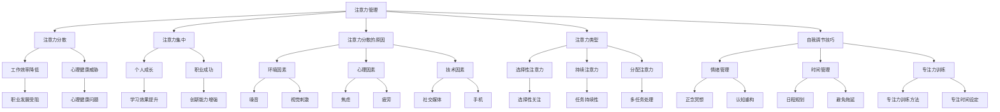

                 

### 文章标题

《注意力管理与自我调节：通过专注力增强个人和职业成功》

> 关键词：注意力管理、自我调节、专注力、个人成长、职业发展

> 摘要：本文深入探讨了注意力管理与自我调节在个人和职业成功中的重要性。通过详细分析注意力的核心概念、类型及其分散原因，提出了有效的注意力管理和自我调节策略。文章从情绪管理、时间管理和专注力训练三个方面，结合实际案例，阐述了如何通过提升专注力来实现个人和职业的成功。

---

### 第一部分：理解注意力管理

#### 第1章：注意力管理的核心概念

**1.1 注意力的定义与作用**

注意力是人类认知过程中最为重要的组成部分，它使我们能够集中精力处理特定信息，同时忽略其他无关刺激。在个人和职业成功中，注意力起着至关重要的作用。

**1.1.1 注意力的基本概念**

- **注意力的定义**：注意力是一种心理状态，它使我们能够感知和处理特定的信息。
- **注意力的作用**：注意力使我们能够高效地完成工作任务，提高学习效果，增强决策能力。

**1.1.2 注意力在个人和职业成功中的重要性**

- **个人成长**：注意力集中有助于个人深入思考问题，提升学习效率，促进自我成长。
- **职业发展**：注意力集中能够提高工作效率，增强创新能力，助力职业成功。

**1.2 注意力的类型与特征**

注意力可以分为以下几种类型：

- **选择性注意力**：选择性注意力使我们能够选择关注某些信息，同时忽略其他信息。
- **持续注意力**：持续注意力使我们能够在一段时间内保持对特定任务的关注。
- **分配注意力**：分配注意力使我们能够在同时处理多个任务时保持高效。

每种类型的注意力都有其独特的特征和作用。

**1.3 注意力管理的重要性**

**1.3.1 注意力管理对个人成长的促进作用**

- **提高学习效果**：通过注意力管理，个人能够更有效地吸收知识，提升学习成果。
- **增强自我认知**：注意力管理有助于个人深入思考，提升自我认知能力。

**1.3.2 注意力管理在职业发展中的应用价值**

- **提高工作效率**：注意力管理能够帮助职场人士集中精力完成任务，提高工作效率。
- **增强创新能力**：注意力管理有助于职场人士在创新思维方面取得突破。

---

#### 第2章：注意力分散的原因与影响

**2.1 注意力分散的原因**

注意力分散的原因可以归结为以下三个方面：

- **环境因素**：周围环境的干扰，如噪音、视觉刺激等，会影响注意力集中。
- **心理因素**：个人的心理状态，如焦虑、疲劳等，会导致注意力分散。
- **技术因素**：现代科技的便利性，如社交媒体、手机等，容易使人们分心。

**2.2 注意力分散的影响**

注意力分散对个人和职业发展产生以下影响：

- **个人效率的降低**：注意力分散导致个人无法高效地完成任务，降低工作效率。
- **职业成功的阻碍**：注意力分散会阻碍个人在职业上的发展，影响职业成就。
- **心理健康的威胁**：长期注意力分散可能导致心理健康问题，如焦虑、抑郁等。

---

#### 第3章：注意力管理的核心策略

**3.1 自我观察与自我反思**

**3.1.1 自我观察的方法**

- **观察注意力分散的情境**：记录自己在什么情况下容易分心，了解分散注意力的原因。
- **分析注意力分散的原因**：从心理、环境、技术等方面分析注意力分散的原因。

**3.1.2 自我反思的技巧**

- **反思注意力管理的策略**：回顾自己采取的注意力管理策略，分析哪些策略有效，哪些需要改进。
- **调整注意力管理策略**：根据自我反思的结果，调整注意力管理策略，以适应不同场景。

**3.2 设定明确的目标**

**3.2.1 目标设定的原则**

- **具体性**：目标要具体明确，避免模糊不清。
- **可行性**：目标要具有可行性，避免过高或过低。
- **激励性**：目标要能够激发个人兴趣和动力。

**3.2.2 目标设定的实践**

- **分解目标**：将大目标分解为小目标，逐步实现。
- **制定计划**：制定详细的计划，确保目标实现。

**3.3 环境优化**

**3.3.1 环境设置的方法**

- **减少干扰**：尽量在安静的环境中工作，避免噪音和其他干扰。
- **整理工作区域**：保持工作区域整洁，有助于集中注意力。

**3.3.2 环境优化的策略**

- **定时休息**：定期休息，避免长时间连续工作导致注意力分散。
- **合理分配时间**：合理安排工作时间，确保每个任务都能得到充分关注。

---

### 第二部分：自我调节技巧与实践

#### 第4章：情绪管理

**4.1 情绪管理的重要性**

**4.1.1 情绪对注意力的影响**

情绪对注意力有着显著的影响。积极的情绪可以提高注意力水平，而消极的情绪则可能导致注意力分散。

**4.1.2 情绪管理对个人发展的作用**

情绪管理有助于提升个人注意力，提高工作效率，促进个人成长。

**4.2 情绪管理的策略**

**4.2.1 正念与冥想的实践**

正念和冥想是有效的情绪管理技巧，可以帮助个体保持平静和专注。

- **正念**：通过专注于当下的感受和体验，提高自我意识和情绪调节能力。
- **冥想**：通过静坐和呼吸练习，放松身心，减轻压力。

**4.2.2 情绪调节的技巧**

- **认知重构**：通过改变对事物的看法，调整情绪状态。
- **情感释放**：通过适当的发泄方式，如运动、写日记等，释放负面情绪。

**4.3 情绪调节的实际案例**

**4.3.1 案例一：高效工作者的小技巧**

某高效工作者通过正念冥想和情绪调节，提高了工作效率和情绪管理能力。

**4.3.2 案例二：职业经理人的情绪管理**

某职业经理人通过定期锻炼和情绪调节，成功应对工作中的压力和挑战。

---

#### 第5章：时间管理

**5.1 时间管理的基本概念**

**5.1.1 时间管理的重要性**

时间管理是提高工作效率和个人发展的重要手段。

**5.1.2 时间管理的原则**

- **优先级原则**：根据任务的紧急程度和重要性进行排序。
- **计划原则**：制定详细的时间计划，确保每个任务都有明确的执行时间。

**5.2 时间管理的实践技巧**

**5.2.1 日程规划的方法**

- **每日计划**：每天制定详细的计划，明确每个任务的执行时间。
- **周计划**：每周对计划进行回顾和调整，确保任务的顺利进行。

**5.2.2 提高时间利用率的策略**

- **分块工作**：将工作任务分为小块，逐一完成，提高效率。
- **避免拖延**：设定明确的截止日期，避免拖延。

**5.3 时间管理的案例分析**

**5.3.1 案例一：工作效率提升的实践**

某职场人士通过时间管理技巧，成功提高了工作效率。

**5.3.2 案例二：时间管理在团队中的应用**

某团队通过时间管理策略，提升了团队的协作效率和项目进度。

---

#### 第6章：专注力训练

**6.1 专注力的概念与特点**

**6.1.1 专注力的定义**

专注力是指个体在特定任务上持续集中精力，忽略其他干扰的能力。

**6.1.2 专注力的表现**

- **集中精力完成任务**：能够持续关注特定任务，不受干扰。
- **高效解决问题**：在解决问题时，能够快速找到关键信息，有效解决问题。

**6.2 专注力训练的方法**

**6.2.1 专注力训练的基本技巧**

- **练习冥想**：通过冥想练习，提高专注力。
- **定期练习**：定期进行专注力训练，提高专注力水平。

**6.2.2 专注力训练的实践**

- **设定专注时间**：在特定时间内专注于一项任务，然后休息片刻。
- **避免多任务处理**：专注于一项任务，避免同时处理多个任务。

**6.3 专注力训练的实际案例**

**6.3.1 案例一：学生专注力提升的方法**

某学生通过专注力训练，提高了学习效率。

**6.3.2 案例二：职场人士专注力提升的策略**

某职场人士通过专注力训练，提高了工作效率。

---

#### 第7章：自我调节技巧的综合应用

**7.1 自我调节的整合策略**

**7.1.1 多元策略的综合应用**

将情绪管理、时间管理和专注力训练等多种策略相结合，形成一套完整的自我调节体系。

**7.1.2 自我调节的优化路径**

根据个人情况和实际需求，不断优化自我调节策略，提高自我调节效果。

**7.2 自我调节的案例分析**

**7.2.1 案例一：高效人士的自我调节策略**

某高效人士通过多种自我调节技巧，成功提升了个人能力和工作效率。

**7.2.2 案例二：职业成功的自我调节实践**

某职场人士通过自我调节技巧，实现了职业上的成功。

---

#### 第8章：注意力管理与自我调节的长期效果

**8.1 长期效果的重要性**

注意力管理和自我调节的长期效果对于个人和职业发展具有重要意义。

**8.1.1 长期效果的理论基础**

长期效果基于心理学、神经科学等领域的理论，通过持续的训练和实践，能够形成稳定的行为模式。

**8.1.2 长期效果的实践意义**

长期效果能够帮助个人在复杂多变的职场环境中保持高效率，实现职业成功。

**8.2 长期效果的实现路径**

**8.2.1 持续训练的策略**

- **定期训练**：定期进行注意力管理和自我调节训练，形成习惯。
- **多样化训练**：结合多种训练方法，提高训练效果。

**8.2.2 长期效果的评价标准**

- **工作效率**：通过提高工作效率来评估长期效果。
- **职业成就**：通过职业成就的不断提升来衡量长期效果。

---

#### 附录

**附录A：注意力管理与自我调节的资源和工具**

**A.1 注意力管理相关的书籍和文章**

- 《注意力管理：如何保持专注、高效和健康》
- 《高效能人士的七个习惯》

**A.2 自我调节的在线课程和教程**

- Coursera上的《注意力心理学》
- Udemy上的《时间管理与效率提升》

**A.3 注意力管理应用软件推荐**

- Forest：专注力提升应用
- Tide：时间管理应用

**附录B：案例研究**

**B.1 某知名企业员工注意力管理实践**

某知名企业通过注意力管理培训，提升了员工的专注力和工作效率。

**B.2 个人注意力管理成功案例分享**

某个人通过注意力管理和自我调节，成功提升了个人能力和职业成就。

---

### 索引

- **注意力管理核心概念联系图**：Mermaid流程图
- **注意力管理核心算法原理讲解**：伪代码
- **数学模型和数学公式**：latex格式

---

### 作者信息

**作者：AI天才研究院/AI Genius Institute & 禅与计算机程序设计艺术 /Zen And The Art of Computer Programming**## 注意力管理核心概念联系图

为了更好地理解注意力管理的核心概念及其相互关系，我们可以使用Mermaid流程图来呈现。以下是一个简化的流程图，展示了注意力管理的核心要素和它们之间的联系。



这个流程图涵盖了注意力管理的主要概念，包括注意力分散、注意力集中、注意力分散的原因、注意力类型、自我调节技巧及其影响。通过这个图，我们可以更直观地理解注意力管理的核心概念及其相互关系。

### 注意力管理核心算法原理讲解

为了深入理解注意力管理，我们可以借助伪代码来阐述其核心算法原理。以下是注意力管理的算法概述，通过以下几个关键步骤来实现注意力集中和分散的调控：

```python
# 注意力管理伪代码

# 初始化变量
attention_level = 0
distraction_level = 0
emotional_state = 'neutral'
time_management_skill = 'unknown'
focus_training_skill = 'unknown'

# 函数：注意力分散原因分析
def analyze_distractions():
    global distraction_level
    distraction_level = analyze_environment() + analyze_psychology() + analyze_technology()

# 函数：注意力集中策略
def focus_strategies():
    global attention_level
    attention_level = apply_environment_optimization() + apply_time_management() + apply_focus_training()

# 函数：情绪管理
def emotional_management():
    global emotional_state
    emotional_state = apply_mindfulness_meditation() + apply_cognitive_restructuring()

# 函数：时间管理
def time_management():
    global time_management_skill
    time_management_skill = schedule_planning() + avoid_procrastination()

# 函数：专注力训练
def focus_training():
    global focus_training_skill
    focus_training_skill = practice_mindfulness() + practice_break_time()

# 函数：评估注意力状态
def evaluate_attention_state():
    if attention_level > distraction_level and emotional_state == 'positive':
        return "Focus State: Good"
    else:
        return "Focus State: Poor"

# 主程序
def main():
    while True:
        analyze_distractions()
        focus_strategies()
        emotional_management()
        time_management()
        focus_training()
        print(evaluate_attention_state())
        # 模拟休息时间，实际应用中可以是定时休息
        sleep(1)

# 执行主程序
main()
```

**算法详细说明：**

1. **初始化变量**：设定注意力水平（attention_level）、分散水平（distraction_level）、情绪状态（emotional_state）和时间管理技能（time_management_skill）、专注力训练技能（focus_training_skill）。

2. **注意力分散原因分析**：通过分析环境因素（analyze_environment）、心理因素（analyze_psychology）和技术因素（analyze_technology），计算分散水平（distraction_level）。

3. **注意力集中策略**：应用环境优化（apply_environment_optimization）、时间管理（apply_time_management）和专注力训练（apply_focus_training）来提升注意力水平（attention_level）。

4. **情绪管理**：通过正念冥想（apply_mindfulness_meditation）和认知重构（apply_cognitive_restructuring）来调整情绪状态（emotional_state）。

5. **时间管理**：通过日程规划（schedule_planning）和避免拖延（avoid_procrastination）来提升时间管理技能（time_management_skill）。

6. **专注力训练**：通过实践正念（practice_mindfulness）和设定专注时间（practice_break_time）来提升专注力训练技能（focus_training_skill）。

7. **评估注意力状态**：根据注意力水平、分散水平以及情绪状态，评估当前注意力状态。

8. **主程序**：不断循环执行上述步骤，持续监控和调整注意力状态。

通过这个伪代码，我们可以理解注意力管理的算法原理，并在实际应用中不断优化和调整策略，以达到最佳的注意力集中效果。这个算法模型为注意力管理提供了一个系统化的框架，有助于个人在实际操作中提高专注力和工作效率。

### 数学模型和公式

在注意力管理的实践中，数学模型和公式可以帮助我们更科学地分析和优化注意力集中和分散的过程。以下是一些核心的数学模型和公式，以及它们的具体解释和例子。

#### 1. 注意力衰减模型

注意力衰减模型描述了注意力在时间中的变化。公式如下：

\[ A(t) = A_0 \times e^{-rt} \]

其中：
- \( A(t) \) 是时间 \( t \) 时的注意力水平。
- \( A_0 \) 是初始注意力水平。
- \( r \) 是注意力衰减速率。

**解释**：这个模型表示，随着时间的推移，注意力水平以指数方式衰减。

**例子**：如果一个任务需要持续30分钟，且注意力衰减速率为0.1，那么初始注意力水平为100，30分钟后的注意力水平为：

\[ A(30) = 100 \times e^{-0.1 \times 30} \approx 59.46 \]

#### 2. 注意力集中与分散的平衡模型

注意力集中和分散的平衡可以用以下公式表示：

\[ B = \frac{A - D}{C} \]

其中：
- \( B \) 是注意力平衡水平。
- \( A \) 是注意力集中水平。
- \( D \) 是注意力分散水平。
- \( C \) 是注意力集中和分散的阈限。

**解释**：这个模型表示，当注意力集中水平超过分散水平并与阈限保持平衡时，个体能够保持高效工作。

**例子**：如果注意力集中水平为80，分散水平为20，且阈限为50，那么注意力平衡水平为：

\[ B = \frac{80 - 20}{50} = 1.2 \]

#### 3. 时间分配效率模型

时间分配效率可以用以下公式表示：

\[ E = \frac{A \times T}{D} \]

其中：
- \( E \) 是时间分配效率。
- \( A \) 是注意力集中水平。
- \( T \) 是总时间。
- \( D \) 是分散水平。

**解释**：这个模型表示，注意力集中水平越高，时间分配效率越高。

**例子**：如果一个任务需要2小时，且注意力集中水平为70%，分散水平为30%，那么时间分配效率为：

\[ E = \frac{0.7 \times 2}{0.3} = \frac{1.4}{0.3} \approx 4.67 \]

#### 4. 情绪对注意力的调节模型

情绪对注意力的调节可以用以下公式表示：

\[ A_{emotional} = A_{base} + \Delta A_{emotion} \]

其中：
- \( A_{emotional} \) 是情绪调节后的注意力水平。
- \( A_{base} \) 是基础注意力水平。
- \( \Delta A_{emotion} \) 是情绪调节效应。

**解释**：这个模型表示，情绪调节效应会影响基础注意力水平，从而影响最终注意力水平。

**例子**：如果基础注意力水平为90，且情绪调节效应为+10（表示情绪积极），那么情绪调节后的注意力水平为：

\[ A_{emotional} = 90 + 10 = 100 \]

通过这些数学模型和公式，我们可以更精确地理解和调控注意力集中和分散的过程，从而提高个人和职业成功。在实际应用中，可以根据具体情况进行调整和优化，以实现最佳的注意力管理效果。这些模型为注意力管理提供了一种科学和系统的工具，有助于实现更高效的工作和学习。

